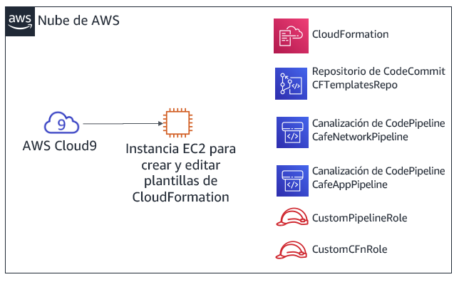
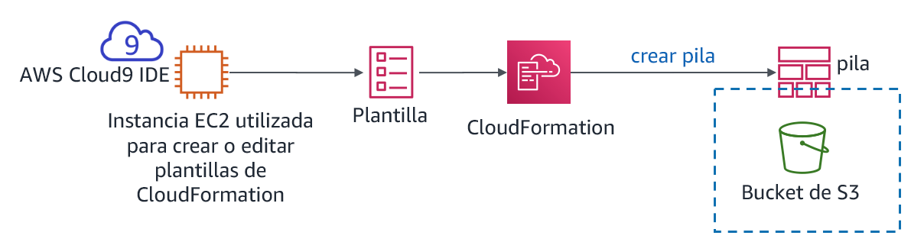
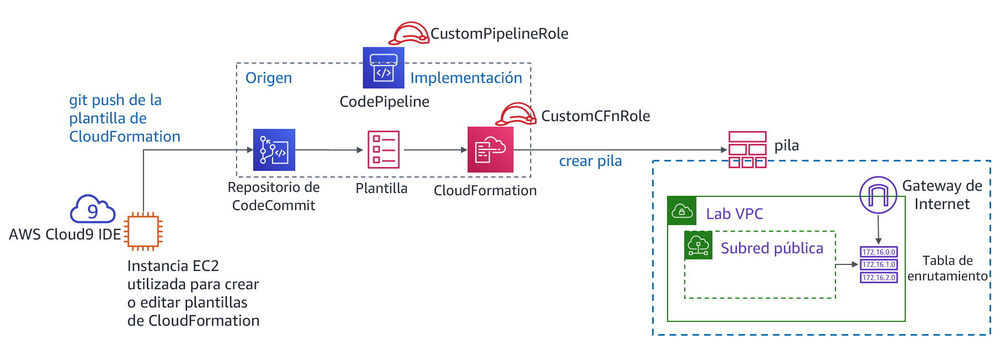

# Módulo 10 - Laboratorio de desafíos: Automatización de la implementación de infraestructura

## Caso

Hasta este momento, el personal de la cafetería creaba sus recursos de AWS y configuraba manualmente sus aplicaciones, principalmente mediante la consola de administración de AWS. Este enfoque sirvió para que la cafetería desarrollara una presencia web rápidamente. Sin embargo, les resulta difícil replicar sus implementaciones en nuevas regiones de AWS para poder admitir nuevas ubicaciones de la cafetería en varios países. También les gustaría tener entornos de desarrollo y producción separados que tengan configuraciones equivalentes de forma fiable.

En este laboratorio de desafíos, asumirá el rol de Sofía mientras trabaja para automatizar las implementaciones de la cafetería y replicarlas en otra región de AWS.


## Información general y objetivos del laboratorio

En este laboratorio, obtendrá experiencia en la creación de plantillas de AWS CloudFormation. Utilizará las plantillas para crear y actualizar pilas de AWS CloudFormation. Las pilas crean y administran actualizaciones de recursos en varias áreas de servicio de AWS de su cuenta de AWS. Practicará el uso de AWS CodeCommit para controlar la versión de sus plantillas. También observará cómo puede utilizar AWS CodePipeline para automatizar las actualizaciones de la pila.

Después de completar este laboratorio, debería ser capaz de lo siguiente:

* Implementar una capa de red de nube privada virtual (VPC) mediante una plantilla de AWS CloudFormation

* Implementar una capa de aplicación mediante una plantilla de AWS CloudFormation

* Utilizar Git para invocar AWS CodePipeline y para crear o actualizar pilas a partir de plantillas almacenadas en AWS CodeCommit

* Duplicar recursos de red y aplicaciones en otra región de AWS mediante AWS CloudFormation


Cuando *inicie* el laboratorio, ya estarán creados los siguientes recursos en la cuenta de AWS:



Tenga en cuenta que en este laboratorio de desafíos encontrará algunas tareas que no incluyen instrucciones paso a paso. Debe darse cuenta sin ayuda de cómo completar las tareas.


## Duración

Para completar este laboratorio, se necesitan aproximadamente **90 minutos**.


## Restricciones de los servicios de AWS

En este entorno de laboratorio, el acceso a los servicios y las acciones de los servicios de AWS puede restringirse a los que se necesiten para cumplir las instrucciones del laboratorio. Es posible que se produzcan errores si intenta acceder a otros servicios o hacer acciones que no sean las que se describen en este laboratorio.


## Acceso a la consola de administración de AWS

1. En la parte superior de estas instrucciones, elija <span id="ssb_voc_grey">Start Lab</span> (Iniciar laboratorio) y comience a trabajar en él.

   Se abrirá el panel **Start Lab** (Iniciar laboratorio), donde se muestra el estado del laboratorio.

   <i class="fas fa-info-circle"></i> **Sugerencia**: Si alguna vez necesita más tiempo para completar el laboratorio que el que se muestra en el temporizador, elija el botón <span id="ssb_voc_grey">Start Lab</span> (Iniciar laboratorio) de nuevo para reiniciar el temporizador del entorno. Esta acción no eliminará los recursos que haya creado.

2. Espere hasta que aparezca el mensaje *Lab status: ready (Estado del laboratorio: listo)* y, a continuación, haga clic en **X** para cerrar el panel **Start Lab** (Iniciar laboratorio).

3. En la parte superior de estas instrucciones, elija <span id="ssb_voc_grey">AWS</span>.

   Esto abrirá la consola de administración de AWS en una nueva pestaña del navegador y el sistema iniciará su sesión de forma automática.

   **Sugerencia**: Si no se abre una nueva pestaña del navegador, por lo general habrá un aviso o un icono en la parte superior, el cual indicará que el navegador impide que el sitio abra ventanas emergentes. Haga clic en el aviso o el icono y elija **Allow pop ups** (Permitir ventanas emergentes).

4. Ubique la pestaña de la consola de administración de AWS de modo que aparezca junto con estas instrucciones. El método más óptimo sería tener ambas pestañas del navegador abiertas al mismo tiempo para que pueda seguir los pasos del laboratorio más fácilmente.

   **Nota**: Para ocultar la ventana del terminal, puede desactivar la casilla **Terminal** (Terminal) en la parte superior de la pantalla.


## Una solicitud empresarial: crear un sitio web estático para la cafetería mediante AWS CloudFormation (Desafío n.º 1)

La cafetería desea comenzar a utilizar AWS CloudFormation para crear y mantener recursos en la cuenta de AWS. A modo de primer intento de este proceso, asumirá el rol de Sofía y creará una plantilla simple de AWS CloudFormation que pueda utilizarse para crear un bucket de Amazon Simple Storage Service (Amazon S3). A continuación, agregará más detalles a la plantilla, de manera que cuando actualice la pila, esta configure el bucket para alojar un sitio web estático para la cafetería.


### Tarea 1: Crear una plantilla de AWS CloudFormation desde cero

En esta primera tarea, creará una plantilla de AWS CloudFormation que cree un depósito de S3. A continuación, ejecutará un comando la interfaz de línea de comandos de AWS (CLI de AWS) que creó la pila AWS CloudFormation. (La pila es el recurso que crea el bucket).


5. Navegue hasta el servicio AWS Cloud9 y abra el entorno de desarrollo integrado (IDE) de la instancia de AWS Cloud9 existente.


6. En el IDE de AWS Cloud9, elija **File > New File (Archivo > Nuevo archivo)**, y, a continuación, seleccione **File > Save (Archivo > Guardar)**, y guarde el nuevo archivo como: `S3.yaml`


7. En la parte superior del archivo, agregue las siguientes dos líneas:

   ```yaml
   AWSTemplateFormatVersion: "2010-09-09"
   Description:
   ```


8. A continuación, agregue las tres líneas siguientes a la plantilla:

   ```yaml
   Resources:
     S3Bucket:
       Type: AWS::S3::Bucket
   ```

   **Sugerencia**: Asegúrese de mantener el número correcto de espacios para cada nivel de sangría. La línea `Resources (recursos):` no debe tener sangría. La línea `S3Bucket:` debe mantener una sangría de 2 espacios. Por último, la línea `Type: AWS::S3::Bucket` debe mantener una sangría de 4 espacios.

   <i class="fas fa-info-circle"></i>AWS CloudFormation admite la especificación YAML versión 1.1, con algunas excepciones. Para obtener más información acerca de YAML, visite [el sitio web de YAML](http://www.yaml.org/).


9. Agregue una descripción (como `“cafe S3 template”`) en la línea **Description** (descripción):. Antes de comenzar la descripción, asegúrese de tener un espacio *después de* los dos puntos (:). Después de escribir la descripción, **guarde** los cambios en el archivo.

   <i class="fas fa-info-circle"></i> En el laboratorio guiado anterior de este módulo, utilizó la consola de administración de AWS para crear una pila de AWS CloudFormation. Aquí, utilizará la CLI de AWS en su lugar.


10. En el terminal Bash, ejecute estas dos líneas de código:

    ```bash
    aws configure get region
    aws cloudformation create-stack --stack-name CreateBucket --template-body file://S3.yaml
    ```

    La primera línea de código que ejecutó devolvió la región de AWS predeterminada del cliente de la CLI de AWS que está instalado en la instancia de AWS Cloud9. Puede modificar la región predeterminada de AWS ejecutando `aws configure`. Sin embargo, para este laboratorio, debe mantener la región predeterminada.

    La segunda línea de código que ejecutó creó una pila que utilizaba la plantilla que definió. Dado que no especificó la región en el comando, la pila se creará en la región predeterminada.

    Si el comando `create-stack` se ejecutó correctamente, debería ver alguna salida con formato de notación de objetos JavaScript (JSON). Esta salida debe indicar un *ID de pila*.

    Este diagrama ilustra las acciones que acaba de completar.

    

11. En la consola de administración de AWS, diríjase al servicio AWS CloudFormation y observe los detalles de la pila *CreateBucket*.

    Por ejemplo, observe la información en las pestañas **Events** (Eventos), **Resources** (Recursos), **Outputs** (Resultados), y **Template** (Plantilla).


12. Vaya a la página de servicio de Amazon S3 para observar el bucket que creó la plantilla.

    **Sugerencia**: El bucket tiene el nombre de bucket *createbucket-s3bucket-&lt;random-string&gt;*.


#### Cómo responder a preguntas sobre la pila de AWS CloudFormation

Las respuestas se registrarán cuando haga clic el botón azul **Submit** (enviar) que está al final del laboratorio.


13. Acceda a las preguntas de este laboratorio.
    - Elija el menú <span id="ssb_voc_grey">Details (Detalles) <i class="fas fa-angle-down"></i></span> y después <span id="ssb_voc_grey">Show</span> (Mostrar).
    - Elija el enlace **Access the multiple choice questions** (Acceder a las preguntas de opción múltiple) que aparece en la parte inferior de la página.


14. En la página que cargó, envíe respuestas para cada una de las siguientes preguntas:

    - **Pregunta 1:** ¿Se creó un bucket de S3, incluso si no se le especificó un nombre? Si la respuesta es afirmativa, ¿qué nombre se le asignó?

    - **Pregunta 2:** ¿En qué región se creó el bucket y por qué se creó allí?

    - **Pregunta 3:** Para definir un bucket de S3, ¿cuántas líneas de código necesitó escribir en la sección `Resources (recursos):` del archivo de la plantilla?

    **Nota:** Deje abierta la pestaña del navegador que contiene las preguntas, para poder volver a ella más adelante en el laboratorio.


### Tarea 2: Configurar el bucket como un sitio web y actualizar la pila

En la siguiente tarea, actualizará la plantilla de AWS CloudFormation. La actualización configurará el bucket de S3 para alojar un sitio web estático. Esta tarea es similar a los resultados del laboratorio de desafíos del Módulo 3. En ese laboratorio de desafíos, creó y configuró el bucket de S3 manualmente mediante la consola de administración de AWS. Sin embargo, en este laboratorio, configurará el bucket mediante una plantilla de AWS CloudFormation.


15. Cargue activos estáticos del sitio web en el bucket.

    Para realizar esta tarea, ejecute los siguientes comandos en el terminal Bash (reemplace &lt;*bucket-name*&gt por el nombre real del bucket):

    ```bash
    wget https://aws-tc-largeobjects.s3-us-west-2.amazonaws.com/ILT-TF-200-ACACAD-20-EN/mod10-challenge/static-website.zip
    unzip static-website.zip -d static
    cd static
    aws s3 cp --recursive . s3://<bucket-name>/ --acl public-read
    ```

    Si estas operaciones son correctas, debería ver numerosos mensajes que dicen *upload:&lt;file_name&gt;* en la salida de comandos.


16. En una nueva pestaña del navegador, abra la documentación de la plantilla de AWS CloudFormation para definir los recursos del bucket de S3.

    - Vaya a la documentación <a href="https://docs.aws.amazon.com/AWSCloudFormation/latest/UserGuide/aws-template-resource-type-ref.html">Referencia de tipos de recursos y propiedades de AWS</a>

    - Desplácese hacia abajo, elija **Amazon S3** y, a continuación, elija el tipo de recurso **AWS::S3::Bucket**.


17. Utilizando la documentación como referencia, modifique su plantilla S3.yaml para establecer las siguientes características en el recurso del bucket de S3:

    - Asociar una *política de eliminación* que retenga el bucket.

    - Configurar el bucket para alojar un sitio web estático con *index.html* establecido como documento de índice

    <i class="fas fa-info-circle"></i> **Sugerencia**: Puede realizar esta tarea agregando dos líneas de código adicionales a su plantilla. Consulte el código en la sección *Examples (Ejemplos)* de la página de documentación que abrió en el último paso.


18. Agregue una *resultado* que proporcione la URL del sitio web a su plantilla de AWS CloudFormation.

    Una vez más, consulte la sección **Examples** (Ejemplos) de la documentación como referencia.


19. Guarde los cambios en el archivo S3.yaml.


20. Valide la plantilla.

    De vuelta en el terminal Bash, vuelva a cambiar el directorio a la ubicación del archivo S3.yaml y valide su plantilla ejecutando los siguientes comandos.

    ```bash
    cd ../
    aws cloudformation validate-template --template-body file://S3.yaml
    ```

    Si la salida indica que la plantilla tiene errores de sintaxis o de otro tipo, corríjalos y, a continuación, ejecute de nuevo el comando para comprobar que se hayan resuelto.


21. Actualice la pila ejecutando este comando:

    ```bash
    aws cloudformation update-stack --stack-name CreateBucket --template-body file://S3.yaml
    ```

    **Sugerencia**: Es importante utilizar la sintaxis YAML adecuada. Si recibe un *ValidationError (Error de validación)*cuando ejecute el comando `update-stack`, revise el uso de dos puntos y confirme que ha mantenido la sangría en cada línea correctamente. Las plantillas de ejemplo de la documentación proporcionan una buena referencia de plantillas YAML bien estructuradas.


22. Vaya al servicio AWS CloudFormation y confirme que la actualización de la pila se haya completado correctamente.

    - La pila debe mostrar el estado *UPDATE_COMPLETE (ACTUALIZACIÓN COMPLETADA)*.
    - Si la pila no obtiene el estado de *UPDATE_COMPLETE*, pruebe estas sugerencias de solución de problemas.
       - Si ve que la pila tiene el estado *ROLLBACK (RESTAURACIÓN)* de algún tipo, vaya a la pestaña **Events** (Eventos) y busque una entrada *UPDATE_FAILED (ACTUALIZACIÓN FALLIDA)*. (Lea el motivo de *Status [Estado]* de ese evento para comprender por qué falló la actualización de la pila).
       - Cuando considere que ha resuelto error, vuelva a ejecutar el comando `update-stack`. En la consola, vuelva a la pila de AWS CloudFormation y vaya a la pestaña **Events** (Eventos) para confirmar si actualizó correctamente la pila.
       - Repita este procedimiento según sea necesario.


23. Compruebe que se haya realizado correctamente.

    - ¿La pestaña **Outputs** (Resultados) de la pila muestra un resultado con un valor de URL? Si es así, haga clic en el enlace.

    - ¿Se abre el sitio web estático? (Ha copiado previamente los activos del sitio web en el bucket).

       Si es así, ¡felicitaciones!

       **Nota:** Si la pila no tiene ningún resultado, o si el hipervínculo del resultado no muestra el contenido del sitio web de la cafetería, puede intentar estos pasos de solución de problemas.

       - Vaya a la consola de Amazon S3 y elija su bucket. La pestaña **Overview** (Información general) debe enumerar el archivo index.html y dos carpetas llamadas *css* e *imágenes*. Si estos recursos no aparecen en la lista, recomendamos que vuelva a repasar el primer paso de esta sección de desafíos.

       - Elija el archivo **index.html** y, a continuación, elija **Permissions** (Permisos). En **Public access** (Acceso público), el valor del **Read object** (Objeto de lectura) debe ser *Yes (Sí)*.

       - Vuelva a la vista del bucket. En la pestaña **Properties** (Propiedades) confirme que <i class="fas fa-check-circle" style="color:purple"></i> **Static website hosting** (El alojamiento de sitio web estático) está habilitado, con un **Hosting type** (Tipo de alojamiento) de *Bucket*.

       - Todos los permisos y las propiedades que se describen en esta lista deben establecerse en la plantilla S3.yaml. Si es necesario, ajuste los detalles de la plantilla y vuelva a ejecutar el comando `update-stack` de la CLI de AWS.

          **Nota:** En este primer desafío, copió manualmente los archivos del sitio web en el bucket. También puede realizar esta acción utilizando un recurso personalizado de AWS CloudFormation, combinado con una función de AWS Lambda. Ambos recursos se pueden definir en una plantilla de AWS CloudFormation. Este enfoque representa un uso más avanzado de AWS CloudFormation que va más allá del alcance de este laboratorio. Sin embargo, si está interesado en este tema, puede consultar la página de [Recursos personalizados y respaldados por AWS Lambda](https://docs.aws.amazon.com/AWSCloudFormation/latest/UserGuide/template-custom-resources-lambda.html) en la documentación de AWS.


## Nuevo requisito empresarial: almacenar plantillas en un sistema de control de versiones (Desafío n.º 2)

El equipo de la cafetería quedó impresionado de que Sofía haya configurado un sitio web estático completo utilizando una plantilla de AWS CloudFormation. Dado este éxito, el equipo decidió que le gustaría ampliar su uso de Infrastructure as Code (IaC) para crear otros recursos de aplicaciones en la cuenta de AWS.

El equipo entiende que es una práctica recomendada almacenar las plantillas de IaC en un sistema de control de versiones, así que le pidieron a Sofía que aceptara el desafío. Cuando Mateo pasó por la cafetería, Sofía le comentó sobre este nuevo requisito empresarial. Él mencionó que AWS CodeCommit sería una buena opción para almacenar plantillas y administrar el control de sus versiones. Mateo creó un repositorio de CodeCommit que contiene algunas plantillas de ejemplo de AWS CloudFormation. Sofía está ansiosa por comenzar a utilizar este repositorio de código.


### Tarea 3: Clonar un repositorio CodeCommit que contiene plantillas de AWS CloudFormation

En esta tarea, trabajará como Sofía para clonar un repositorio CodeCommit. El equipo de la cafetería utilizará el repositorio para almacenar y controlar las versiones de las plantillas de AWS CloudFormation.


24. Diríjase al servicio CodeCommit y, en su cuenta, observe el repositorio llamado *CFTemplatesRepo*.


<i class="fas fa-info-circle"></i> CodeCommit es un servicio de control de código fuente que se puede utilizar para alojar repositorios basados en Git. Se puede utilizar de una manera similar a los repositorios de GitHub. Para obtener más información acerca de AWS CodeCommit, consulte la [documentación de AWS](https://aws.amazon.com/codecommit/).


25. Elija **CFTemplatesRepo** y luego elija la carpeta **Templates** (Plantillas).

    Observe que contiene plantillas de AWS CloudFormation.

    <i class="fas fa-info-circle"></i> En esta parte del laboratorio, almacenará sus plantillas de IaC de AWS CloudFormation en CodeCommit.


26. Abra el archivo *CFTemplatesRepo/templates/**start-lab.yaml*** y analice el contenido.

    - Observe que esta plantilla define algunos de los recursos que vio en esta cuenta de AWS.

    - Por ejemplo:

       - A partir de la línea 6, la plantilla define una *instancia de AWS Cloud9*
       - A partir de la línea 12, la plantilla define el *repositorio de CodeCommit* que tiene abierto

       <i class="fas fa-info-circle"></i> La plataforma de laboratorio que aloja este laboratorio creó una pila de AWS CloudFormation cuando seleccionó **Start Lab** (Iniciar Laboratorio). La plantilla de AWS CloudFormation que la pila ejecutó incluye las definiciones de recursos contenidas en esta plantilla. Sin embargo, esta plantilla de ejemplo no contiene todas las definiciones de recursos que se encuentran en la plantilla *real* que se utilizó para iniciar este laboratorio.


27. En las rutas de navegación del extremo superior de la página, elija **Repositories** (Repositorios) y en la columna **Clone URL** (Clonar URL), elija **HTTPS**.

    <i class="fas fa-info-circle"></i> Esta acción copia la URL clonada en HTTPS del repositorio de CodeCommit al portapapeles.


28. Vuelva al IDE de AWS Cloud9 y clone el repositorio de CodeCommit existente a su espacio de trabajo (reemplace &lt;*url*&gt; con la URL clonada que copió)

    En el terminal Bash del IDE de AWS Cloud9, escriba este comando:

    ```bash
    git clone <url>
    ```

    Este comando clona una copia del repositorio de CodeCommit que acaba de observar. El comando crea un directorio *CFTemplateSrepo* que debería aparecer ahora en el panel de navegación (que es el panel izquierdo del IDE).

    Utilice el software cliente Git para analizar la copia local del repositorio.

    ```bash
    cd CFTemplatesRepo
    git status
    ```

    

    El comando `git status` muestra a qué rama del repositorio está conectado. También muestra que su copia local está actualizada con la rama de origen en CodeCommit.


## Nuevo requisito empresarial: utilizar un servicio de entrega continua, crear las capas de red y aplicaciones para la cafetería (desafío n.º 3)

El siguiente desafío es que Sofía utilice AWS CloudFormation para crear todos los recursos de redes en los que pueda implementarse el sitio web dinámico de la aplicación de la cafetería. A continuación, deberá implementar la propia aplicación de la cafetería.

Además, Sofía quiere encontrar una manera más fácil de actualizar pilas cuando actualice una plantilla de AWS CloudFormation. Ahora debe actualizar plantillas con frecuencia y considera que debería poder automatizar las actualizaciones de las pilas.

Sofía habló con Mateo sobre este problema. Él mencionó que AWS CodePipeline ofrece las capacidades de servicio de integración y entrega continuas (CI/CD) que busca. Mateo creó dos canalizaciones para Sofía, y está ansiosa por comenzar a trabajar con ellas.

En este desafío, trabajará como Sofía y utilizarás estas canalizaciones. También definirá, en plantillas de AWS CloudFormation, todos los recursos necesarios para implementar el sitio web dinámico de la cafetería.


### Tarea 4: Crear una nueva capa de red con AWS CloudFormation, CodeCommit y CodePipeline

En esta tarea, utilizará una plantilla de AWS CloudFormation para crear una VPC con una subred pública, junto con otros recursos de red. Obtendrá experiencia con el uso de una canalización de CI/CD. Cuando utilice Git para insertar la plantilla en un repositorio de CodeCommit, esta desencadenará una canalización que creará una pila de AWS CloudFormation.


29. Cree una nueva plantilla de AWS CloudFormation que cree una VPC, una subred pública y otros recursos.

    - En el panel de navegación del IDE de AWS Cloud9, expanda el directorio **CFTemplatesrepo/templates**.

    - En el directorio **Templates** (Plantillas), haga clic derecho en `template1.yaml` y cree un duplicado.

    - Cambie el nombre del duplicado a: `cafe-network.yaml`

    - En el editor de texto, abra cafe-network.yaml y establezca la descripción como: `Network layer for the café`

    - Observe los detalles de los siete recursos que crea esta plantilla.


30. Observe los detalles de AWS CodePipeline que se configuraron previamente en su cuenta.

    - En la consola de administración de AWS, encontrará el menú <span id="ssb_services">Services (Servicios)<i class="fas fa-angle-down"></i></span>, donde debe elegir **CodePipeline**.

    - Elija **Pipelines** (Canalizaciones).

    - Observe que se han predefinido dos canalizaciones:

       - CafeAppPipeline
       - CafeNetworkPipeline

       <i class="fas fa-exclamation-triangle"></i> **Importante**: El estado del intento más reciente de ejecutar cada canalización mostrará que hubo un error. Sin embargo, este estado es normal. Los archivos de la plantilla de AWS CloudFormation a los que hacen referencia las canalizaciones no existen en la ubicación esperada.


31. Analice la etapa *Source (Origen)* de CafeNetworkPipeline.

    - Elija **CafeNetworkPipeline** y observe los detalles de la canalización.

       En el área de **Source** (Origen), podrá ver que **SourceAction** (Acción de origen) de esta canalización es *AWS CodeCommit*.

    - A la derecha del encabezado **SourceAction** (Acción de origen), elija <i class="fas fa-info-circle"></i>

       Los detalles de la ventana **Configuration** (Configuración) muestran que el origen es el repositorio *CFTemplateRepo* de CodeCommit.

    - Para regresar a la página **CafeNetworkPipeline**, elija **Done** (Listo).


32. Analice la etapa *Deploy (Implementar)* de CafeNetworkPipeline.

    - Observe que la acción *Deploy (Implementar)* se realizará mediante AWS CloudFormation.

    - A la derecha del encabezado **RunChangeSet** (Ejecutar conjunto de cambios), elija <i class="fas fa-info-circle"></i>

       **Análisis**: los detalles de la ventana **Configuration** (Configuración) muestran que se ejecutará o actualizará una pila llamada *update-cafe-network*. Para realizar estas acciones, la pila utilizará la plantilla de AWS CloudFormation cafe-network.yaml. Esta acción *Deploy (Implementar)* recibe la plantilla de la etapa *Source (Origen)*, que encontró la plantilla en el repositorio de CodeCommit.

       El siguiente diagrama ilustra cómo desencadenará esta canalización y lo que hará. También muestra algunos de los recursos de la cuenta de AWS que la pila de AWS CloudFormation resultante creará o actualizará.

    

    <i class="fas fa-info-circle"></i> Para obtener más información acerca de AWS CodePipeline, consulte la [documentación de AWS](https://aws.amazon.com/codepipeline/).


33. Vuelva a la instancia de AWS Cloud9 y active la creación de *update-cafe-network* a través del registro de su plantilla de AWS CloudFormation en CodeCommit.

    - Observe como la copia local del repositorio es diferente de la original. En el terminal Bash, ejecute el siguiente comando:

       ```bash
       git status
       ```

       El resultado debería mostrar que el archivo cafe-network.yaml que creó actualmente no tiene seguimiento en Git.

    - Ejecute estos dos comandos para agregar el archivo nuevo al repositorio y luego confírmelo en el repositorio con un comentario.

       ```bash
       git add templates/cafe-network.yaml
       git commit -m 'initial commit of network template'  templates/cafe-network.yaml
       ```

    - Compruebe el estado de su copia local del repositorio:

       ```bash
       git status
       ```

    La información devuelta debe reportar que su rama adelante del origen con una confirmación.

    - Por último, envíe la confirmación al repositorio remoto (este comando en realidad copia el archivo a CodeCommit):

       ```bash
       git push
       ```


34. Vuelva a la consola CodePipeline y elija **CafeNetworkPipeline**.

    - Observe que la creación de la pila se activa automáticamente.

       **Nota:** Puede tomar uno o dos minutos para que la etapa de *Source (Origen)* se actualice y la etapa *Deploy (Implementar)* muestre que está *In progress (En curso)*. Eventualmente, el estado de la etapa *Deploy (Implementar)* debería mostrar *Succeeded (Completado correctamente)*.

    - Tenga en cuenta que los detalles de *Source (Origen)* y *Deploy (Implementar)* muestran el número de confirmación que se devolvió cuando ejecutó `git push`. Los detalles también pueden mostrar el comentario que agregó a la confirmación.


Sugerencias para la solución problemas:

- Si el paso *Deploy (Implementar)* tiene el estado *Failed - Just now (Error, ahora)*, abra el enlace **Details** (Detalles) para acceder a los detalles del error. Por ejemplo, puede haber un error de formato de plantilla que debe resolver.
- Después de actualizar la plantilla, puede actualizar la pila ejecutando de nuevo los comandos `git commit` y `git push` adecuados.
   - El botón **Release change** (Liberar cambio) también puede activar la canalización para que vuelva a ejecutarse. Puede hacerlo incluso si no hace cambios al repositorio de CodeCommit (como al emitir un comando `git push`).
   - De la misma manera, puede utilizar el botón **Retry** (Reintentar) en la etapa *Deploy (Implementar)* de la canalización. Reintentará la etapa *Deploy (Implementar)* sin reintentar la etapa *Source (Origen)*.
- Si la pila no se restaura y le impide realizar actualizaciones adicionales a la pila, puede eliminar la pila. Para hacerlo, vaya a la página de las pilas en la consola de AWS CloudFormation y elimine la pila. Si elimina la pila de red, envíe una nueva actualización a Git. Esta acción activará la recreación de la pila.


35. En la consola de AWS CloudFormation, confirme que se haya ejecutado la pila *update-cafe-network*. Debe tener un estado *CREATE_COMPLETE (CREACIÓN COMPLETADA)* o *UPDATE_COMPLETE (ACTUALIZACIÓN COMPLETADA)*.

    Además, verifique la pestaña **Outputs** (Resultados) de la pila. Actualmente no muestra resultados. Sin embargo, pronto actualizará la pila para que cree resultados.


36. En la consola de Amazon VPC, observe que los recursos definidos en la plantilla cafe-network.yaml se crearon en la cuenta de AWS.

    Por ejemplo, la consola debe enumerar una VPC denominada *Cafe VPC* y una subred denominada *Cafe Public Subnet*.

    ¡Felicitaciones! Ha creado correctamente los recursos de red que se necesitan para ejecutar el sitio web de la cafetería.


### Tarea 5: Actualizar la pila de red

En esta tarea, actualizará la pila de red para que exporte información esencial sobre dos de los recursos que crea. A continuación, la pila de aplicaciones que cree más adelante puede hacer referencia a estas dos salidas.


37. Agregue las siguientes líneas al final de *cafe-network.yaml*.

```YAML
Outputs:
  PublicSubnet:
    Description: The subnet ID to use for public web servers
    Value:
      Ref: PublicSubnet
    Export:
      Name:
        'Fn::Sub': '${AWS::StackName}-SubnetID'
  VpcId:
    Description: The VPC ID
    Value:
      Ref: VPC
    Export:
      Name:
        'Fn::Sub': '${AWS::StackName}-VpcID'
```


38. Guarde el cambio y, en el terminal Bash, agregue y confirme el código y luego envíelo a CodeCommit mediante Git.


39. Verifique que se produzca la actualización de la pila de AWS CloudFormation. También verifique que la pestaña **Outputs** (Resultados) ahora muestre dos claves con nombres de exportación.

| Nombre | Nombre de exportación |
| --- | ------ |
| *PublicSubnet* | *update-cafe-network-SubnetID* |
| *VpcId* | *update-cafe-network-VpcID* |


### Tarea 6: Definir un recurso de instancia EC2 y crear la pila de aplicaciones

En esta tarea, creará una nueva plantilla de AWS CloudFormation que se utilizará para crear una pila. La nueva pila implementará un sitio web dinámico para la cafetería. La canalización de *CafeAppPipeline* (que observó anteriormente) crea o actualiza la pila *update-cafe-app* cuando envía la plantilla cafe-app.yaml al repositorio CodeCommit.


40. Vuelva a AWS Cloud9 y duplique el archivo **template2.yaml** en el directorio de plantillas y cambie el nombre del duplicado a `cafe-app.yaml`.


41. En la plantilla cafe-app.yaml, analice el contenido de la plantilla existente:

    - En el área **Parameters** (Parámetros), **LatestAmiId** (ID de la AMI más reciente) realiza una búsqueda. Encuentra el ID más reciente de la imagen de Amazon Machine (AMI) de Amazon Linux 2 para la región de AWS en la que crea la pila. Puede hacer referencia a la imagen cuando defina una instancia de Amazon Elastic Compute Cloud (Amazon EC2).
    - También en el área de **Parameters** (Parámetros), **CafeNetworkParameter** define un valor de cadena. El valor predeterminado es el nombre de la pila que creó cuando ejecutó la plantilla de AWS CloudFormation cafe-network.yaml. Establecer esta cadena como parámetro le proporciona la flexibilidad para señalar a un nombre de una pila diferente si debe hacer referencia a recursos en otra pila.
    - En el área **Mappings** (Mapeos), se puede hacer referencia al mapeo **RegionMap** cuando defina una instancia EC2. El uso de este mapeo puede ayudar a garantizar que se utilice el par de claves correcto para la instancia. Sin embargo, el uso de esta característica depende de la región de AWS en la que ejecute la plantilla.
    - En el área **Resources** (Recursos), se define un **grupo de seguridad EC2**. Abre los puertos TCP 80 y 22 para el tráfico de red entrante. Se crea en la VPC que creó la pila de *update-cafe-network*.
    - En el área **Outputs** (Resultados), un resultado denominado **WebServerPublicIP** devuelve la dirección pública IPv4 de la instancia EC2 que definirá a continuación.


42. En la plantilla cafe-app.yaml, defina un tercer *parámetro* para que un usuario pueda elegir entre diferentes tipos de instancia cuando lancen una instancia EC2.

    - Diríjase a la [documentación de AWS](https://docs.aws.amazon.com/AWSCloudFormation/latest/UserGuide/parameters-section-structure.html). Debajo de la sección *Definición de un parámetro en una plantilla*, copie el parámetro de ejemplo de YAML.

    - Pegue el parámetro en la plantilla. A continuación, modifique el parámetro para que los tipos de instancia permitidos sean *t2.micro*,* t2.small*, *t3.micro* y *t3.small*. Además, establezca el valor predeterminado como `t2.small` y actualice la descripción para que refleje las opciones que el usuario puede elegir.


43. En una nueva pestaña del navegador, abra la [documentación de AWS](https://docs.aws.amazon.com/AWSCloudFormation/latest/UserGuide/aws-properties-ec2-instance.html) y utilice la información de esa página como referencia.


44. De vuelta en la plantilla cafe-app.yaml, cree un nuevo recurso de *instancia EC2* que tenga las siguientes características:

    - Configure **Logical ID** (ID lógico) a `CafeInstance` (si es necesario, consulte https://docs.aws.amazon.com/AWSCloudFormation/latest/UserGuide/resources-section-structure.html)

    - Incluya **ImageId** (ID de imagen) que haga referencia al parámetro *LatestAmiId (ID de la AMI más reciente)*

    - Para **Instance type** (Tipo de instancia), haga referencia al parámetro de tipo de instancia que definió en el paso anterior.

    - Para **KeyName** (Nombre de clave), utilice la siguiente línea de código, que hace referencia al mapeo RegionMap que ya está definido en la plantilla:

    ```yaml
    KeyName: !FindInMap [RegionMap, !Ref "AWS::Region", keypair]
    ```

    - Para **Instance profile** (Perfil de instancia) (el rol de AWS Identity and Access Management o IAM asociado a la instancia), especifique `CafeRole`.

      **Nota:**: El rol de IAM de CafeRole ya existe en su cuenta. Cuando lo asocia, le concede a su instancia EC2 los permisos para recuperar los valores del Almacén de parámetros desde AWS Systems Manager.

    - En la sección **Properties** (Propiedades), incluya las siguientes líneas de código:

      ```yaml
      NetworkInterfaces:
        - DeviceIndex: '0'
          AssociatePublicIpAddress: 'true'
          SubnetId: !ImportValue
            'Fn::Sub': '${CafeNetworkParameter}-SubnetID'
          GroupSet:
            - !Ref CafeSG
      ```

      - **Análisis**: Las líneas anteriores ayudan a garantizar que la instancia se implemente en la *subred pública* que creó cuando ejecutó la pila de red de la cafetería. Recuerde que, al comienzo de esta tarea, actualizó la pila de red para definir resutados con nombres de *exportación*. En el código anterior, *importa* el valor de **SubnetId** (ID de subred). El código anterior también ayuda a garantizar que la instancia que crea esté en el grupo de seguridad *CafeSG* que ya está definido en esta plantilla.

    - Establezca una **etiqueta** con una *clave* de *Name* y un *valor* de *Cafe Web Server*

      - **Sugerencia:** Observe cómo se aplicó la etiqueta de *Nombre* al recurso del grupo de seguridad que ya está definido en la plantilla.

    - En la sección **Properties** (Propiedades), incluya las siguientes líneas de código para **UserData** (Datos de Usuario):

      ```yaml
        UserData:
          Fn::Base64:
            !Sub |
              #!/bin/bash
              yum -y update
              yum install -y httpd mariadb-server wget
              amazon-linux-extras install -y lamp-mariadb10.2-php7.2 php7.2
              systemctl enable httpd
              systemctl start httpd
              systemctl enable mariadb
              systemctl start mariadb
              wget https://aws-tc-largeobjects.s3-us-west-2.amazonaws.com/ILT-TF-200-ACACAD-20-EN/mod10-challenge/cafe-app.sh
              chmod +x cafe-app.sh
              ./cafe-app.sh
      ```

      **Análisis**: El código anterior se ejecuta en la instancia al final del proceso de arranque. Instala un servidor web HTTP de Apache, una base de datos MariaDB y PHP en la instancia de Amazon Linux. Luego, inicia el servidor web y la base de datos. A continuación, descarga un script llamado cafe-app.sh y lo ejecuta. El script cafe-app configura la base de datos e instala el código PHP que hace que funcione el sitio web de la cafetería.


45. Una vez que esté satisfecho con las actualizaciones de su plantilla, guarde los cambios. Para validar el formato de la plantilla en la terminal Bash, ejecute el siguiente comando:

    ```bash
    aws cloudformation validate-template --template-body file:///home/ec2-user/environment/CFTemplatesRepo/templates/cafe-app.yaml
    ```

    Si recibe una respuesta con formato JSON que incluye los tres parámetros que se definieron en la parte superior de su plantilla, entonces su plantilla pasó la validación. Sin embargo, si recibió una respuesta *ValidationError (Error de validación)* (o alguna otra respuesta de error), debe corregir el problema. A continuación, guarde los cambios y vuelva a ejecutar el comando `validate-template`.


46. Si su plantilla pasó el control de verificación, agregue el archivo a CodeCommit. En el terminal Bash, ejecute los comandos `git` para agregar el archivo, confirmarlo y enviarlo al repositorio.

    <i class="fas fa-info-circle"></i> **Sugerencia**: Puede ser útil consultar los comandos Git de la tarea 3. Sin embargo, recuerde que el nombre de la plantilla que debe enviar a CodeCommit para esta tarea es diferente.


47. Vuelva a la consola CodePipeline y elija **CafeAppPipeline**.

    **Nota:** Puede tomar uno o dos minutos para que la etapa de *Source (Origen)* se actualice y la etapa *Deploy (Implementar)* muestre que está *In progress (En curso)*. Eventualmente, el estado de la etapa *Deploy (Implementar)* debería mostrar *Succeeded - Just now (Completado correctamente, ahora)*.

    - Si el estado muestra un error, pruebe estos consejos para la solución de problemas.

    - Si ve que la etapa *Deploy (Implementar)* tiene el estado *Failed - Just now (Error, ahora)*, abra la información del error seleccionando el enlace **Details** (Detalles). Puede proporcionar un enlace que lo lleve a los detalles de la pila de AWS CloudFormation. (Diríjase a la pestaña **Events [Eventos]** para averiguar qué error fue el primero que causó que la pila se restaurase).
    - Si la pila no se puede restaurar, o si tiene un estado *ROLLBACK_COMPLETE (RESTAURACIÓN COMPLETADA)* que le impide actualizar la pila con la canalización, puede eliminar la pila de la página de pilas de AWS CloudFormation. Luego, envíe una nueva actualización a Git para activar la creación de la pila otra vez.


48. En la consola de AWS CloudFormation, verifique que la pila *update-cafe-app* se haya ejecutado correctamente y tenga el estado *CREATE_COMPLETE (CREACIÓN COMPLETADA)*.


49. Diríjase a la consola de Amazon EC2. Observe que se creó la instancia EC2 y los recursos del grupo de seguridad (que se definieron en la plantilla cafe-app.yaml).


50. Después de que la instancia EC2 haya iniciado y aprobado ambos controles de estado, pruebe el sitio web de la cafetería. En una pestaña del navegador, cargue la siguiente URL, donde &lt;*public-ip-address*&gt; es la *dirección IPv4 pública* de la instancia EC2 que definió: `http://<public-ip-address>/cafe`

    Debería poder ver el sitio web de la cafetería.

    **Sugerencia**: Los detalles del script de datos de usuario que definió pueden tardar aproximadamente 2 minutos en terminar de ejecutarse. Sea paciente si no ve el sitio web inmediatamente.

    Observe que el sitio web muestra información del servidor, como la región y la zona de disponibilidad donde se ejecuta el servidor web.

    ¡Felicitaciones! Implementó una capa de red y una capa de aplicaciones utilizando una canalización CI/CD y un enfoque IaC.


#### Cómo responder preguntas sobre los resultados de crear una capa de aplicaciones

51. Regrese a la pestaña del navegador con las preguntas de opción múltiple correspondientes a este laboratorio y responda la siguiente pregunta.

    - **Pregunta 4: **  Vaya a la pestaña **Parameters** (Parámetros) de la pila *update-cafe-app*. ¿Qué valor ve para **LatestAmiId** (ID de la AMI más reciente)?

    - **Pregunta 5:** Diríjase a la pestaña **Stack info** (Información de la pila) de la pila *update-cafe-app*. ¿Cuál es el nombre de recurso de Amazon (ARN) del rol de IAM que concede los permisos para crear y actualizar la pila *update-cafe-app*?

    - **Pregunta 6:** En la consola de administración de AWS, vaya al repositorio de CodeCommit donde se almacenan las plantillas de AWS CloudFormation. Elija **Commits** (Confirmaciones) y, en la lista de **Commits** (Confirmaciones), abra una de las confirmaciones seleccionando su ID de confirmación. ¿Qué puede observar?


## Nuevo requisito empresarial: duplicar los recursos de redes y aplicaciones en una segunda región de AWS (desafío n.º 4)

Sofía se complace de haber podido crear tanto la capa de red como la capa de aplicación para el sitio web dinámico de la cafetería mediante AWS CloudFormation. Sofía también acaba de enterarse de que el personal de la cafetería quiere que duplique estos recursos en una segunda región de AWS, por lo que está aún más complacida.

Sofía pronto experimentará los beneficios del esfuerzo que realizó para definir los recursos y configuraciones en las plantillas de AWS CloudFormation. Observará que es más fácil duplicar entornos a través de un enfoque de IaC en lugar de crear todos los recursos manualmente.


### Tarea 7: Duplicar la red de la cafetería y el sitio web en otra región de AWS

En esta última tarea del laboratorio, podrá ver lo rápido que es posible duplicar una implementación. La implementación rápida es posible porque definió todos sus recursos en plantillas de AWS CloudFormation.

En las tareas 4, 5 y 6, las pilas de AWS CloudFormation se crearon o actualizaron automáticamente. Se definió una canalización para monitorear cuándo se actualizaba el repositorio de CodeCommit. A continuación, invocaba a AWS CloudFormation para crear o actualizar la pila. Sin embargo, en esta tarea, utilizará la CLI de AWS para duplicar los recursos de la red de la cafetería en otra región de AWS. Luego, utilizará la consola de AWS CloudFormation para crear la pila de aplicación de la segunda región.


52. De vuelta en el IDE de AWS Cloud9, ejecute el siguiente comando para duplicar la *red* de la cafetería en otra región de AWS:

    ```bash
    aws cloudformation create-stack --stack-name update-cafe-network --template-body file:///home/ec2-user/environment/CFTemplatesRepo/templates/cafe-network.yaml --region us-west-2
    ```

    Debería devolver un *StackId (ID de pila)*. Tenga en cuenta que pudo sustituir la región predeterminada para la creación de esta pila al especificar la región cuando ejecutó el comando.


53. Vaya a la consola de AWS CloudFormation y cambie la región a **EE. UU. Oeste (Oregón) us-west-2**.

    - Debería aparecer la pila *update-cafe-network* en la lista

    - Verifique que el estado de la segunda pila *update-cafe-region* eventualmente cambie a *CREATE_COMPLETE (CREACIÓN COMPLETADA)*

       <i class="fas fa-info-circle"></i>**Sugerencia**: Utilice el icono de <i class="fas fa-sync"></i> actualización para ver el cambio de estado más rápidamente cuando se complete.


54. Vaya a la página de servicio de Amazon VPC y confirme también que está utilizando la región de **Oregón** (*us-west-2*).

    Debería poder observar los recursos de red que se crearon.


55. En la región **Oregón** (*us-west-2*), cree un par de claves EC2 denominado `cafe-oregon`.

    - Diríjase a la consola de Amazon EC2 y verifique que esté en la región de **Oregón**.
    - En el panel de navegación, seleccione **Network & Security > Key Pairs (Redes y seguridad > Pares de claves)**.
    - Seleccione **Create key pair** (Crear par de claves).
    - Asigne un nombre al par de claves `cafe-oregon` y vuelva a elegir **Create key pair** (Crear par de claves).

       **Sugerencia**: Opcionalmente, puede guardar el par de claves o puede elegir **Cancel** (Cancelar). No necesita utilizar el par de claves en este laboratorio. Sin embargo, en un caso de uso típico, debe guardar el par de claves, no tendrá otra oportunidad para hacerlo.


56. Revise los detalles de la plantilla de aplicación.

    - Vuelva al IDE de AWS Cloud9 y observe los detalles de la plantilla **cafe-app.yaml** en el editor de texto.
    - Observe la propiedad **KeyName** (Nombre de clave) en la definición de recurso de la instancia EC2. Hace referencia al mapeo de **RegionMap** que se define en la plantilla.
    - El mapeo indica que si se lanza la instancia en la *región us-east-1 (Norte de Virginia)*, debe utilizar el *par de claves vockey*. Sin embargo, si la instancia se lanza en la *región us-west-2 (Oregón)*, debe utilizar el *par de claves cafe-oregon* que acaba de crear.
    - Observe también **InstanceTypeParameter** (Parámetro de tipo de instancia) que definió anteriormente. Proporciona algunas opciones de tipos de instancias en el área **AllowedValues** (Valores permitidos), pero también establece *t2.small* como predeterminado. Utilizará esta configuración en un momento.


57. En el IDE de AWS Cloud9, copie el archivo de plantilla en un bucket S3. (En el siguiente comando, reemplace &lt;*repobucket-bucketname*&gt; por el nombre real del bucket S3 en su cuenta. Su nombre debe contener la cadena *repobucket*.)

    ```bash
    aws s3 cp templates/cafe-app.yaml s3://<repobucket-bucketname>/
    ```


58. En la consola de Amazon S3, copie la **URL del objeto**, que es una dirección *https*, del archivo que acaba de cargar.


59. Vaya a la consola de AWS CloudFormation y cambie la región a **Oregón** (*us-west-2*).


60. Cree una pila (con nuevos recursos).

    - En la casilla **Amazon S3 URL (URL de Amazon S3)** de la pantalla **Create stack** (Crear pila), pegue la URL del objeto que acaba de copiar.

    - En la siguiente pantalla (**Specify stack details [Especificar los detalles de la pila]**):
       - **Stack name** (Nombre de la pila): escriba un nombre apropiado
       - **InstanceTypeParameter** (Parámetro de tipo de instancia): *t3.micro*

       Observe que puede establecer el tipo de instancia durante la creación de la pila porque lo definió como parámetro en la plantilla de AWS CloudFormation.

    - Avance por las pantallas restantes (acepte las configuraciones predeterminadas) y finalice la creación de la pila.

    - Compruebe que la pila se haya creado correctamente.


61. Vaya a la consola de Amazon EC2 y observe los recursos creados.

    - Asegúrese de darle unos minutos al servidor web para que termine el arranque y ejecute el script de datos de usuario.
    - Observe el *par de claves* que utiliza la instancia y el tipo de instancia. Esta configuración es diferente de la configuración del servidor web que se ejecuta en la región *us-east-1*. Utilizó la misma plantilla, *sin modificarla*, para lanzar esta pila.
    - Una vez que el servidor se haya iniciado completamente, debería poder acceder al sitio web en `http://<public-ip-address>/cafe` (donde &lt;*public-ip-address*&gt; es la dirección IP IPv4 pública de la instancia EC2.
    - Observe que la información del servidor en el sitio web muestra que esta segunda instancia del sitio web de la cafetería se está ejecutando en la región *us-west-2*. El primer servidor web que creó muestra que se está ejecutando en la región *us-east--1*.


## Noticias de la cafetería


Gracias a lo que aprendió a hacer, ahora Sofía tiene muchas ideas.

Utilizó AWS CloudFormation para implementar correctamente una versión estática del sitio web de la cafetería. A continuación, implementó correctamente el sitio web dinámico de la cafetería como aplicación web. Para el sitio web dinámico, Sofía utilizó una canalización de CI/CD que empleaba AWS CodeCommit, AWS CodePipeline y AWS CloudFormation. Además, duplicó rápidamente los recursos de redes y recursos de aplicación de la cafetería a otra región de AWS.

Sofía imagina cómo podría utilizar las plantillas de AWS CloudFormation como parte de una solución de *copia de seguridad y recuperación de desastres (DR)*. Acaba de experimentar lo rápido que es posible recrear la infraestructura esencial de la cafetería. Si su implementación de producción alguna vez sufre un error por cualquier motivo, ahora puede recrearla o duplicarla rápidamente.

Sofía también piensa que ahora puede crear *entornos de prueba* rápidamente. Puede estar segura de que los detalles de la configuración de los entornos de prueba coincidirán con los del entorno de producción. También puede controlar específicamente la manera en que el entorno de prueba difiere del entorno de producción utilizando características como parámetros y mapeos.

Los beneficios de la automatización de DevOps son muchas. Sofía ahora planea hacer que la automatización y las canalizaciones de CI/CD sean centrales en la forma en que su equipo desarrolla, prueba e implementa actualizaciones en los recursos de la nube de la cafetería.


## Envío del trabajo

62. En la parte superior de estas instrucciones, elija <span id="ssb_blue">Submit</span> (Enviar) para registrar su progreso y, cuando se le indique, elija **Yes** (Sí).


63. Si los resultados no se muestran después de algunos minutos, vuelva a la parte superior de estas instrucciones y elija <span id="ssb_voc_grey">Grades</span> (Resultados).

    **Sugerencia**: Puede enviar su trabajo varias veces. Después de realizar las modificaciones pertinentes, vuelva a elegir **Submit** (Enviar). Su último envío es el que se registrará para este laboratorio.


64. Para encontrar comentarios detallados sobre su trabajo, elija <span id="ssb_voc_grey">Details</span> (Detalles) seguido de <i class="fas fa-caret-right"></i> **View Submission Report** (Ver informe de envío).


## Fin del laboratorio

<i class="icon-flag-checkered"></i> ¡Felicitaciones! Ha completado el laboratorio.


65. Para confirmar que desea finalizar el laboratorio, haga clic en **<span id="ssb_voc_grey">End Lab</span> (Finalizar laboratorio)** en la parte superior de esta página y, a continuación, elija **<span id="ssb_blue">Yes</span> (Sí)**.

    Debería aparecer un panel con el siguiente mensaje: *DELETE has been initiated… You may close this message box now (Se ha iniciado la ELIMINACIÓN… Ya puede cerrar este cuadro de mensaje).*


66. Para cerrar el panel, haga clic en la **X** de la esquina superior derecha.


*© 2020 Amazon Web Services, Inc. y sus empresas afiliadas. Todos los derechos reservados. Este contenido no puede reproducirse ni redistribuirse, total ni parcialmente, sin el permiso previo por escrito de Amazon Web Services, Inc. Queda prohibida la copia, el préstamo y la venta de carácter comercial.*
