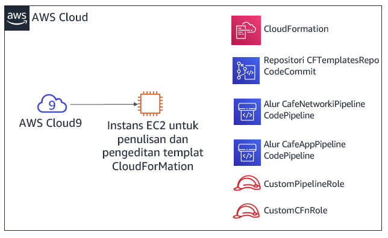

# Modul 10 - Lab Tantangan: Mengotomatisasi Deployment Infrastruktur

## Skenario

Hingga saat ini, staf kafe telah membuat sumber daya AWS dan mengonfigurasi aplikasi mereka secara manual—kebanyakan dengan menggunakan Konsol Manajemen AWS. Pendekatan ini bekerja dengan baik sebagai cara bagi kafe tersebut untuk mulai menghadirkan web dengan cepat. Namun, mereka merasa kesulitan untuk mereplikasi deployment di Wilayah AWS yang baru agar mereka dapat mendukung lokasi kafe baru di beberapa negara. Mereka juga ingin memiliki lingkungan pengembangan dan produksi terpisah yang memiliki konfigurasi yang sesuai.

Di lab tantangan ini, Anda akan memerankan Sofía saat Anda bekerja untuk mengotomatisasi deployment kafe dan mereplikasinya ke Wilayah AWS lainnya.


## Gambaran umum dan tujuan lab

Di lab ini, Anda akan mendapatkan pengalaman membuat templat AWS CloudFormation. Anda akan menggunakan templat tersebut untuk membuat dan memperbarui tumpukan AWS CloudFormation. Tumpukan tersebut akan membuat dan mengelola pembaruan sumber daya di beberapa area layanan AWS di akun AWS Anda. Anda akan berlatih menggunakan AWS CodeCommit untuk mengontrol versi templat Anda. Anda juga akan mengamati bagaimana Anda dapat menggunakan AWS CodePipeline untuk mengotomatisasi pembaruan tumpukan.

Setelah menyelesaikan lab ini, Anda akan mampu:

* Men-deploy lapisan jaringan virtual private cloud (VPC) dengan menggunakan templat AWS CloudFormation

* Men-deploy lapisan aplikasi dengan menggunakan templat AWS CloudFormation

* Menggunakan Git untuk memanggil AWS CodePipeline, dan untuk membuat atau memperbarui tumpukan dari templat yang disimpan di AWS CodeCommit

* Menduplikasi jaringan dan sumber daya aplikasi ke Wilayah AWS lainnya dengan menggunakan AWS CloudFormation


Ketika Anda *memulai* lab, sumber daya berikut sudah dibuat untuk Anda di akun AWS:



Perhatikan bahwa di lab tantangan ini, Anda akan menemukan beberapa tugas tanpa mendapat instruksi langkah demi langkah. Anda harus memikirkan cara untuk menyelesaikan tugas Anda sendiri.


## Durasi

Diperlukan waktu sekitar **90 menit** untuk menyelesaikan lab ini.


## Pembatasan layanan AWS

Dalam lingkungan lab ini, akses ke layanan AWS dan tindakan layanan mungkin dibatasi untuk orang-orang yang diperlukan untuk menyelesaikan instruksi lab. Anda mungkin akan mengalami error jika mencoba mengakses layanan lain atau melakukan tindakan di luar yang dijelaskan di lab ini.


## Mengakses Konsol Manajemen AWS

1. Di bagian atas instruksi ini, pilih <span id="ssb_voc_grey">Start Lab</span> (Mulai Lab) untuk meluncurkan lab Anda.

   Panel **Start Lab** (Mulai Lab) terbuka dan menampilkan status lab.

   <i class="fas fa-info-circle"></i> **Tip**: Jika Anda memerlukan lebih banyak waktu untuk menyelesaikan lab daripada yang ditampilkan pada pengatur waktu, pilih tombol <span id="ssb_voc_grey">Start Lab</span> (Mulai Lab) lagi untuk memulai ulang pengatur waktu untuk lingkungan. Melakukan hal tersebut tidak akan menghapus sumber daya yang telah Anda buat.

2. Tunggu hingga Anda melihat pesan *Lab status: ready* (Status lab: siap), lalu tutup panel **Start Lab** (Mulai Lab) dengan memilih **X**.

3. Di bagian atas instruksi ini, pilih <span id="ssb_voc_grey">AWS</span>.

   Tindakan ini akan membuka Konsol Manajemen AWS di tab browser baru. Anda akan login ke sistem secara otomatis.

   **Tip**: Jika tab browser baru tidak terbuka, banner atau ikon biasanya berada di bagian atas browser Anda dengan pesan bahwa browser Anda mencegah situs membuka jendela sembulan. Pilih banner atau ikon, lalu pilih **Allow pop-ups** (Izinkan sembulan).

4. Atur tab AWS Management Console (Konsol Manajemen AWS) agar ditampilkan bersama instruksi ini. Idealnya, Anda perlu membuka kedua tab browser secara bersamaan, sehingga Anda dapat mengikuti langkah-langkah lab dengan lebih mudah.

   **Catatan**: Untuk menyembunyikan jendela terminal, Anda juga dapat menghapus kotak **Terminal** di bagian atas layar.


## Permintaan bisnis: Membuat situs web statis untuk kafe dengan menggunakan AWS CloudFormation (Tantangan #1)

Kafe ini ingin mulai menggunakan AWS CloudFormation untuk membuat dan memelihara sumber daya di akun AWS. Sebagai upaya pertama yang sederhana dalam proses ini, Anda akan memerankan Sofía dan membuat templat AWS CloudFormation sederhana yang dapat digunakan untuk membuat bucket Amazon Simple Storage Service (Amazon S3). Kemudian, Anda akan menambahkan detail lain ke templat tersebut, sehingga ketika Anda memperbarui tumpukan, tumpukan itu akan mengonfigurasi bucket untuk meng-hosting situs web statis untuk kafe tersebut.


### Tugas 1: Membuat templat AWS CloudFormation dari awal

Pada tugas pertama ini, Anda akan membuat templat AWS CloudFormation yang membuat bucket S3. Anda kemudian akan menjalankan perintah AWS Command Line Interface (AWS CLI) yang membuat tumpukan AWS CloudFormation. (Tumpukan adalah sumber daya yang membuat bucket.)


5. Arahkan ke layanan AWS Cloud9 dan buka lingkungan pengembangan terpadu (IDE) dari instans AWS Cloud9 yang ada.


6. Di AWS Cloud9 IDE, pilih **File > New File** (File > File Baru), lalu pilih **File > Save** (File > Simpan), dan simpan file baru tersebut sebagai: `S3.yaml`


7. Di bagian atas file, tambahkan dua baris berikut:

   ```yaml
   AWSTemplateFormatVersion: "2010-09-09"
   Description:
   ```


8. Selanjutnya, tambahkan tiga baris berikut ke templat Anda:

   ```yaml
   Resources:
     S3Bucket:
       Type: AWS::S3::Bucket
   ```

**Tip**: Pastikan bahwa Anda menyimpan jumlah ruang yang tepat untuk setiap tingkat indentasi. Baris `Resources:` (Sumber Daya:) seharusnya tidak memiliki indentasi. Baris `S3Bucket:` harus memiliki indentasi 2 spasi. Terakhir, baris `Type: AWS::S3::Bucket` harus memiliki indentasi 4 spasi.

<i class="fas fa-info-circle"></i>AWS CloudFormation mendukung spesifikasi YAML Versi 1.1, dengan beberapa pengecualian. Untuk informasi lebih lanjut tentang YAML, kunjungi [situs web YAML](http://www.yaml.org/).


9. Tambahkan deskripsi (seperti `"cafe S3 template"`) pada baris **Description:** (Deskripsi:). Sebelum memulai deskripsi, pastikan Anda memberi spasi *setelah* titik dua (:). Setelah Anda memasukkan deskripsi, **Simpan** perubahan tersebut ke file.

   <i class="fas fa-info-circle"></i> Di lab terpandu sebelumnya pada modul ini, Anda telah menggunakan Konsol Manajemen AWS untuk membuat tumpukan AWS CloudFormation. Di sini, Anda menggunakan AWS CLI sebagai gantinya.


10. Di terminal Bash, jalankan dua baris kode ini:

    ```bash
    aws configure get region
    aws cloudformation create-stack --stack-name CreateBucket --template-body file://S3.yaml
    ```

    Baris pertama kode yang Anda jalankan mengembalikan Wilayah AWS default dari klien AWS CLI yang diinstal pada instans AWS Cloud9. Anda dapat memodifikasi Wilayah AWS default dengan menjalankan `aws configure`. Namun, untuk lab ini, Anda harus meninggalkan Wilayah default.
    
    Baris kedua dari kode yang Anda jalankan membuat tumpukan yang menggunakan templat yang telah Anda tentukan. Karena Anda tidak menentukan Wilayah pada perintah tersebut, tumpukan akan dibuat di Wilayah default.  
    
    Jika perintah `create-stack` (`buat-tumpukan`) berhasil dijalankan, Anda akan melihat beberapa output yang diformat dalam JavaScript Object Notation (JSON). Output ini harus menunjukkan *StackId*.
    
    Diagram ini menggambarkan tindakan yang baru saja Anda selesaikan.


11. Di Konsol Manajemen AWS, arahkan ke layanan AWS CloudFormation dan amati detail tumpukan *CreateBucket*.

   Misalnya, lihat informasi di tab **Events** (Kejadian), **Resources** (Sumber Daya), **Outputs** (Output), dan **Template** (Templat).


12. Arahkan ke halaman layanan Amazon S3 untuk mengamati bucket yang dibuat oleh templat Anda.

   **Tip**: Bucket tersebut memiliki nama bucket *createbucket-s3bucket-&lt;random-string&gt;*.


#### Menjawab pertanyaan tentang tumpukan AWS CloudFormation

Jawabannya akan direkam saat Anda memilih tombol **Submit** (Kirim) biru di bagian akhir lab ini.


13. Akses pertanyaan di lab ini.
   - Pilih menu <span id="ssb_voc_grey">Details <i class="fas fa-angle-down"></i></span> (Detail), dan pilih <span id="ssb_voc_grey">Show</span> (Tampilkan).
   - Di bagian bawah halaman, pilih tautan **Access the multiple choice questions** (Akses pertanyaan pilihan ganda).


14. Pada halaman yang Anda muat, kirimkan jawaban untuk masing-masing pertanyaan berikut:

   - **Pertanyaan 1:** Apakah bucket S3 dibuat, meskipun Anda tidak menentukan nama untuk bucket tersebut? Jika demikian, nama apa yang diberikan?

   - **Pertanyaan 2:** Apa Wilayah tempat bucket tersebut dibuat, dan mengapa bucket itu dibuat di Wilayah ini?

   - **Pertanyaan 3:** Untuk menentukan bucket S3, berapa banyak baris kode yang perlu Anda masukkan di bagian `Resources:` (Sumber Daya:) dari file templat tersebut


   **Catatan:** Biarkan tab browser dengan pertanyaan-pertanyaan di dalamnya terbuka, agar nanti Anda dapat kembali lagi ke sana di lab.


### Tugas 2: Mengonfigurasi bucket sebagai situs web dan memperbarui tumpukan

Pada tugas berikutnya ini, Anda akan memperbarui templat AWS CloudFormation. Pembaruan tersebut akan mengonfigurasi bucket S3 untuk meng-hosting situs web statis. Tugas ini mirip dengan hasil dari lab tantangan Modul 3. Di lab tantangan itu, Anda telah membuat dan mengonfigurasi bucket S3 secara manual dengan menggunakan Konsol Manajemen AWS. Namun, di lab ini, Anda akan mengonfigurasi bucket tersebut dengan menggunakan templat AWS CloudFormation.


15. Unggah aset situs web statis ke bucket.

    Untuk melakukan tugas ini, jalankan perintah berikut di terminal Bash (replace &lt;*bucket-name*&gt; dengan nama bucket aktual):

    ```bash
    wget https://aws-tc-largeobjects.s3-us-west-2.amazonaws.com/ILT-TF-200-ACACAD-20-EN/mod10-challenge/static-website.zip
    unzip static-website.zip -d static
    cd static
    aws s3 cp --recursive . s3://<bucket-name>/ --acl public-read
    ```

    Jika operasi ini berhasil, Anda akan melihat banyak pesan *upload:&lt;file_name&gt;* di output perintah.


16. Di tab browser baru, buka dokumentasi templat AWS CloudFormation untuk menentukan sumber daya bucket S3.

   - Buka dokumentasi <a href="https://docs.aws.amazon.com/AWSCloudFormation/latest/UserGuide/aws-template-resource-type-ref.html">referensi tipe properti dan sumber daya AWS</a>

   - Gulir ke bawah, pilih **Amazon S3**, lalu pilih tipe sumber daya **AWS::S3::Bucket**.


17. Dengan menggunakan dokumentasi tersebut sebagai referensi, modifikasi templat S3.yaml Anda untuk menetapkan karakteristik berikut pada sumber daya bucket S3:

   - Pasang *kebijakan penghapusan* yang akan mempertahankan bucket tersebut

   - Konfigurasikan bucket tersebut untuk meng-hosting situs web statis dengan *index.html* yang ditetapkan sebagai dokumen indeks

      <i class="fas fa-info-circle"></i> **Tip**: Anda dapat menyelesaikan tugas ini dengan menambahkan dua baris kode tambahan ke templat Anda. Lihat kode di bagian *Examples* (Contoh) pada halaman dokumentasi yang Anda buka di langkah terakhir.


18. Untuk templat AWS CloudFormation Anda, tambahkan *output* yang menyediakan URL situs web.

   Sekali lagi, lihat bagian **Examples** (Contoh) pada dokumentasi sebagai referensi.


19. Simpan perubahan itu ke file S3.yaml Anda.


20. Validasi templat Anda.

    Kembali ke terminal Bash, ubah direktori kembali ke lokasi file S3.yaml dan validasi templat Anda dengan menjalankan perintah berikut.

    ```bash
    cd ../
    aws cloudformation validate-template --template-body file://S3.yaml
    ```

    Jika output menunjukkan bahwa templat Anda memiliki sintaks atau kesalahan lain, perbaiki, kemudian jalankan perintah itu lagi untuk memastikan bahwa kesalahan tersebut telah diselesaikan.


21. Perbarui tumpukan dengan menjalankan perintah ini:

    ```bash
    aws cloudformation update-stack --stack-name CreateBucket --template-body file://S3.yaml
    ```

    **Tip**: Sintaks YAML yang tepat itu penting. Jika Anda menerima *ValidationError* ketika Anda menjalankan `update-stack`, tinjau penggunaan titik dua dan pastikan bahwa Anda melakukan indentasi pada setiap baris dengan tepat. Contoh templat dalam dokumentasi tersebut memberikan referensi yang baik untuk templat YAML yang terstruktur dengan baik.


22. Jelajahi layanan AWS CloudFormation dan pastikan bahwa pembaruan tumpukan Anda telah berhasil diselesaikan.

   - Tumpukan seharusnya menunjukkan status *UPDATE_COMPLETE*.
   - Jika tumpukan tidak mendapat status *UPDATE_COMPLETE*, cobalah tip pemecahan masalah berikut.
      - Jika Anda melihat bahwa tumpukan tersebut memiliki status *ROLLBACK* atau yang serupa, masuk ke tab **Events** (Kejadian) dan cari entri *UPDATE_FAILED*. (Baca alasan *Status* untuk kejadian tersebut untuk memahami mengapa pembaruan tumpukan tersebut gagal.)
      - Setelah Anda yakin bahwa Anda telah memperbaiki kesalahan, jalankan perintah `update-stack` lagi. Di konsol tersebut, kembali ke tumpukan AWS CloudFormation dan masuk ke tab **Events** (Kejadian) untuk memastikan apakah Anda telah berhasil memperbarui tumpukan.
      - Ulangi seperlunya.


23. Verifikasi keberhasilan.

   - Apakah tab **Outputs** (Output) tumpukan itu mencantumkan output dengan nilai URL? Jika demikian, pilih tautannya.

   - Apakah situs web statis terbuka? (Anda sebelumnya telah menyalin aset situs web ke dalam bucket.)

      Jika iya, selamat!

      **Catatan:** Jika tumpukan tersebut tidak memiliki output apapun—atau jika pranala output tidak menampilkan konten situs web kafe—Anda dapat mencoba langkah-langkah pemecahan masalah ini.

      - Jelajahi konsol Amazon S3 dan pilih bucket Anda. Tab **Overview** (Gambaran Umum) akan mencantumkan file index.html serta dua folder yang bernama *css* dan *images*. Jika sumber daya ini tidak tercantum, Anda mungkin ingin mencoba kembali langkah pertama di bagian tantangan ini.

      - Pilih file **index.html** lalu pilih **Permissions** (Izin). Di bawah **Public access** (Akses publik), nilai untuk **Read object** (Objek baca) seharusnya adalah *Yes* (Ya).

      - Kembali ke tampilan bucket. Di tab **Properties** (Properti), pastikan bahwa <i class="fas fa-check-circle" style="color:purple"></i> **Static website hosting** (Hosting situs web statis) diaktifkan, dengan sebuah **Hosting type** dari *Bucket hosting*.

      - Semua izin dan properti yang dijelaskan dalam daftar ini harus ditetapkan dalam templat S3.yaml Anda. Jika perlu, sesuaikan detail dalam templat tersebut dan jalankan perintah AWS CLI `update-stack` lagi.

         **Catatan:** Di tantangan pertama ini, Anda telah menyalin file situs web ke dalam bucket secara manual. Anda juga dapat melakukan tindakan ini dengan menggunakan sumber daya kustom dari AWS CloudFormation, dikombinasikan dengan fungsi AWS Lambda. Kedua sumber daya ini dapat ditentukan di templat AWS CloudFormation. Pendekatan ini adalah penggunaan AWS CloudFormation dengan tingkatan lebih lanjut di luar lingkup lab ini. Namun, jika Anda tertarik dengan topik ini, lihat halaman [AWS Lambda-backed custom resources](https://docs.aws.amazon.com/AWSCloudFormation/latest/UserGuide/template-custom-resources-lambda.html) (Sumber daya kustom didukung AWS Lambda) di Dokumentasi AWS.


## Kebutuhan bisnis baru: Menyimpan templat di sistem kontrol versi (Tantangan #2)

Tim kafe terkesan karena Sofía telah mengonfigurasi seluruh situs web statis dengan menggunakan templat AWS CloudFormation. Mengingat keberhasilan ini, tim memutuskan bahwa mereka ingin memperluas penggunaan infrastruktur sebagai kode (IaC) untuk membangun sumber daya aplikasi lain di akun AWS.

Tim memahami bahwa menyimpan templat IaC dalam sistem kontrol versi hal ini merupakan praktik terbaik, sehingga mereka meminta Sofía untuk menerima tantangan ini. Sofía berbincang dengan Mateo tentang kebutuhan bisnis baru ini ketika ia mampir ke kafe. Ia menyebutkan bahwa AWS CodeCommit akan menjadi pilihan yang baik untuk menyimpan templat dan mengelola kontrol versi untuk mereka. Mateo membuat repositori CodeCommit dengan beberapa contoh templat AWS CloudFormation di dalamnya. Sofía sangat ingin mulai menggunakan repositori kode ini.


### Tugas 3: Kloning repositori CodeCommit yang berisi templat AWS CloudFormation

Dalam tugas ini, Anda akan bekerja sebagai Sofía untuk mengkloning repositori CodeCommit. Tim kafe akan menggunakan repositori tersebut untuk menyimpan dan mengontrol versi templat AWS CloudFormation.


24. Jelajahi layanan CodeCommit dan di akun Anda, perhatikan repositori yang bernama *CFTemplatesRepo*.


<i class="fas fa-info-circle"></i> CodeCommit adalah layanan kontrol sumber yang dapat digunakan untuk meng-hosting repositori berbasis Git. Layanan ini dapat digunakan dengan cara yang mirip dengan repositori GitHub. Untuk detail tentang AWS CodeCommit, lihat [Dokumentasi AWS](https://aws.amazon.com/codecommit/).


25. Pilih **CFTemplatesRepo**, lalu pilih folder **template** (templat).

   Perhatikan bahwa terdapat templat AWS CloudFormation di dalamnya.

   <i class="fas fa-info-circle"></i> Pada bagian lab ini, Anda akan menyimpan templat AWS CloudFormation IaC Anda di CodeCommit.


26. Buka file *CFTemplatesRepo/templates/**start-lab.yaml*** dan analisis kontennya.

   - Perhatikan bahwa templat ini menentukan beberapa sumber daya yang telah Anda amati dalam akun AWS ini.

   - Misalnya:

      - Mulai baris 6, templat tersebut menentukan *instans AWS Cloud9*
      - Mulai baris 12, templat tersebut menentukan *repositori CodeCommit* yang sekarang Anda buka

      <i class="fas fa-info-circle"></i> Platform lab yang meng-hosting lab ini membuat tumpukan AWS CloudFormation ketika Anda memilih **Start Lab** (Mulai Lab). Templat AWS CloudFormation yang dijalankannya termasuk definisi sumber daya yang terkandung dalam templat ini. Namun, contoh templat ini tidak berisi semua definisi sumber daya yang ada di templat *aktual* yang digunakan untuk memulai lab ini.


27. Di breadcrumb di bagian atas halaman, pilih **Repositories** (Repositori) dan di kolom **Clone URL** (URL Kloning), pilih **HTTPS**.

   <i class="fas fa-info-circle"></i> Tindakan ini akan menyalin URL kloning HTTPS repositori CodeCommit ke clipboard Anda.


28. Kembali ke AWS Cloud9 IDE dan kloning repositori CodeCommit yang ada ke ruang kerja Anda (ganti &lt;*url*&gt; dengan URL kloning yang telah Anda salin)

    Di terminal Bash di AWS Cloud9 IDE, masukkan perintah ini:

    ```bash
    git clone <url>
    ```

    Perintah ini akan mengkloning salinan repositori CodeCommit yang baru saja Anda amati. Perintah ini membuat direktori *CFTemplatesRepo* yang sekarang akan muncul di panel navigasi (yaitu panel kiri di IDE).
    
    Gunakan perangkat lunak klien Git untuk menganalisis salinan lokal repositori Anda.

    ```bash
    cd CFTemplatesRepo
    git status
    ```

    

    Perintah `git status` menunjukkan Anda terhubung ke cabang yang mana dari repositori tersebut. Perintah ini juga menunjukkan bahwa salinan lokal Anda sudah mutakhir dengan cabang sumber di CodeCommit.


## Kebutuhan bisnis baru: Dengan menggunakan layanan pengiriman berkelanjutan, buat lapisan jaringan dan aplikasi untuk kafe tersebut (Tantangan #3)

Tantangan selanjutnya bagi Sofía adalah menggunakan AWS CloudFormation untuk membuat semua sumber daya jaringan yang menjadi tujuan deplyoment aplikasi kafe situs web yang dinamis. Kemudian, ia harus men-deploy aplikasi kafe itu sendiri.

Selain itu, Sofía ingin menemukan cara yang lebih mudah untuk memperbarui tumpukan ketika memperbarui templat AWS CloudFormation. Ia sekarang memperbarui templat secara teratur, dan menurutnya ia harus dapat mengotomatisasi pembaruan tumpukan.

Sofía berbicara dengan Mateo mengenai masalah ini. Mateo menyebutkan bahwa AWS CodePipeline menyediakan kemampuan layanan integrasi berkelanjutan dan pengiriman berkelanjutan (CI/CD) yang Sofia Cari. Mateo kemudian membuat dua alur untuk Sofía, dan Sofía sangat ingin mulai menggunakan alur tersebut.

Dalam tantangan ini, Anda akan bekerja sebagai Sofia dan memanfaatkan alur ini. Anda juga akan menentukan—di templat AWS CloudFormation—semua sumber daya yang diperlukan untuk men-deploy situs web kafe yang dinamis.


### Tugas 4: Membuat lapisan jaringan baru dengan AWS CloudFormation, CodeCommit, dan CodePipeline

Dalam tugas ini, Anda akan menggunakan templat AWS CloudFormation untuk membuat VPC dengan subnet publik, bersama dengan sumber daya jaringan lainnya. Anda akan mendapatkan pengalaman dengan menggunakan alur CI/CD. Ketika Anda menggunakan Git untuk mendorong templat masuk ke dalam repositori CodeCommit, hal itu akan memicu alur yang akan membuat tumpukan AWS CloudFormation.


29. Buatlah templat AWS CloudFormation baru yang akan membuat VPC, subnet publik, dan sumber daya lainnya.

   - Di panel navigasi AWS Cloud9 IDE, perluas direktori **CFTemplatesRepo/templates**.

   - Di direktori **templates** (templat), klik kanan `template1.yaml` dan buat salinannya.

   - Ganti nama duplikatnya menjadi: `cafe-network.yaml`

   - Di editor teks, buka cafe-network.yaml dan tetapkan deskripsinya menjadi: `Network layer for the cafe` (Lapisan jaringan untuk kafe)

   - Amati detail ketujuh sumber daya yang dibuat oleh templat ini.


30. Amati detail AWS CodePipeline yang telah dikonfigurasi sebelumnya di akun Anda.

   - Di Konsol Manajemen AWS, dari menu <span id="ssb_services">Services <i class="fas fa-angle-down"></i></span> (Layanan), pilih **CodePipeline**.

   - Pilih **Pipelines** (Alur).

   - Perhatikan bahwa dua alur telah ditetapkan sebelumnya untuk Anda:

      - CafeAppPipeline
      - CafeNetworkPipeline

      <i class="fas fa-exclamation-triangle"></i> **Penting**: Status upaya terbaru untuk menjalankan setiap alur akan menunjukkan bahwa alur tersebut gagal. Namun, status ini diharapkan. File templat AWS CloudFormation yang direferensikan oleh alur tidak berada di lokasi yang diharapkan.


31. Analisis tahap *Source* (Sumber) dari CafeNetworkPipeline.

   - Pilih **CafeNetworkPipeline** dan amati detail alur.

      Di area **Source** (Sumber), Anda dapat melihat bahwa **SourceAction** alur ini adalah *AWS CodeCommit*.

   - Di sebelah kanan judul **SourceAction**, pilih <i class="fas fa-info-circle"></i>

      Detail di jendela **Configuration** (Konfigurasi) menunjukkan bahwa sumbernya adalah repositori CodeCommit *CFTemplatesRepo*.

   - Untuk kembali ke halaman **CafeNetworkPipeline**, pilih **Done** (Selesai).


32. Analisis tahap *Deploy* dari CafeNetworkPipeline.

   - Perhatikan bahwa tindakan *Deploy* akan dilakukan dengan menggunakan AWS CloudFormation.

   - Di sebelah kanan judul **RunChangeSet**, pilih <i class="fas fa-info-circle"></i>

      **Analisis**: Detail di jendela **Configuration** (Konfigurasi) menunjukkan bahwa tumpukan bernama *update-cafe-network* akan dijalankan atau diperbarui. Untuk melakukan tindakan ini, tumpukan akan menggunakan templat  AWS CloudFormation cafe-network.yaml. Tindakan *Deploy* ini menerima templat dari tahap *Source* (Sumber), yang menemukan templat tersebut di repositori CodeCommit.

      Diagram berikut ini menggambarkan bagaimana Anda akan memicu alur dan apa yang akan dilakukan oleh alur ini. Diagram ini juga menunjukkan beberapa sumber daya akun AWS yang akan dibuat atau diperbarui oleh tumpukan AWS CloudFormation yang dihasilkan tersebut.

   

   <i class="fas fa-info-circle"></i> Untuk detail selengkapnya tentang AWS CodePipeline, lihat [Dokumentasi AWS](https://aws.amazon.com/codepipeline/).


33. Kembali ke instans AWS Cloud9 dan picu pembuatan *update-cafe-network* dengan memeriksa templat AWS CloudFormation Anda pada CodeCommit.

    - Amati bagaimana salinan lokal repositori berbeda dari aslinya. Di terminal Bash, jalankan perintah berikut.

    ```bash
    git status
    ```

    Output akan menunjukkan bahwa file cafe-network.yaml yang Anda buat saat ini tidak terlacak di Git.
      
    - Jalankan dua perintah ini untuk menambahkan file baru ke repositori, lalu serahkan ke repositori dengan komentar.

    ```bash
    git add templates/cafe-network.yaml
    git commit -m 'initial commit of network template' templates/cafe-network.yaml
    ```

    - Periksa status salinan lokal Anda dari repositori:
    
    ```bash
    git status
    ```

    Informasi yang dikembalikan harus menyebutkan bahwa cabang Anda berada satu commit di depan asalnya.
      
    - Terakhir, dorong commit tersebut ke repositori jarak jauh (perintah ini sebenarnya merupakan salinan file ke CodeCommit):
    
    ```bash
    git push
    ```


34. Kembali ke konsol CodePipeline dan pilih **CafeNetworkPipeline**.

   - Perhatikan bahwa pembuatan tumpukan itu dipicu secara otomatis.

      **Catatan:** Mungkin perlu satu atau dua menit bagi tahap *Source* (Sumber) untuk melakukan pembaruan dan bagi tahap *Deploy* untuk menunjukkan bahwa tahap ini *In progress* (Sedang berlangsung). Terakhir, status tahap *Deploy* akan menunjukkan *Succeeded* (Berhasil).

   - Perhatikan bahwa detail baik untuk *Source* (Sumber) maupun *Deploy* menunjukkan jumlah commit yang dikembalikan ketika Anda menjalankan `git push`. Detail ini juga menunjukkan komentar yang Anda tambahkan ke commit.


Tip pemecahan masalah:

- Jika langkah *Deploy* memiliki status *Failed - Just now* (Gagal - Baru saja), akses detail kesalahan dengan membuka tautan **Details** (Detail). Misalnya, Anda dapat memiliki kesalahan format templat yang harus diselesaikan.
- Setelah Anda memperbarui templat, Anda dapat memperbarui tumpukan dengan menjalankan perintah `git commit` dan `git push` lagi.
   - Tombol **Release change** (Rilis perubahan) juga dapat memicu alur untuk berjalan kembali. Hal ini akan terjadi meskipun Anda tidak membuat perubahan pada repositori CodeCommit (seperti dengan mengeluarkan perintah `git push`).
   - Demikian pula, Anda dapat menggunakan tombol **Retry** (Coba Kembali) di tahap *Deploy* pada alur tersebut. Hal ini akan mencoba lagi tahap *Deploy* tanpa mencoba kembali tahap *Source* (Sumber).
- Jika tumpukan gagal berputar kembali—dan menghambat pembaruan tambahan yang Anda lakukan pada tumpukan— Anda dapat menghapus tumpukan tersebut. Untuk melakukannya, buka halaman tumpukan di konsol AWS CloudFormation dan hapus tumpukan. Jika Anda menghapus tumpukan jaringan, dorong pembaruan yang baru ke Git. Tindakan ini akan memicu pembuatan kembali tumpukan.


35. Di konsol AWS CloudFormation, pastikan bahwa tumpukan *update-cafe-network* berjalan. Tumpukan tersebut harus memiliki status *CREATE_COMPLETE* atau *UPDATE_COMPLETE*.

   Selain itu, periksa tab **Outputs** (Output) untuk tumpukan tersebut. Saat ini tidak ada output yang ditampilkan. Namun, Anda akan segera memperbarui tumpukan sehingga output dapat dibuat.


36. Di konsol Amazon VPC, amati apakah sumber daya yang ditentukan di templat cafe-network.yaml telah dibuat di akun AWS.

   Misalnya, konsol tersebut harus mencantumkan VPC bernama *Cafe VPC*, dan subnet bernama *Cafe Public Subnet*.

   Selamat! Anda telah berhasil membuat sumber daya jaringan yang diperlukan untuk menjalankan situs web kafe.


### Tugas 5: Memperbarui tumpukan jaringan

Dalam tugas ini, Anda memperbarui tumpukan jaringan agar mampu mengekspor informasi penting tentang dua sumber daya yang dibuatnya. Kedua output ini kemudian dapat direferensikan oleh tumpukan aplikasi yang Anda buat nanti.


37. Tambahkan baris berikut ke bagian bawah *cafe-network.yaml*.

```YAML
Outputs:
  PublicSubnet:
    Description: The subnet ID to use for public web servers
    Value:
      Ref: PublicSubnet
    Export:
      Name:
        'Fn::Sub': '${AWS::StackName}-SubnetID'
  VpcId:
    Description: The VPC ID
    Value:
      Ref: VPC
    Export:
      Name:
        'Fn::Sub': '${AWS::StackName}-VpcID'
```


38. Simpan perubahan ini dan di terminal Bash, tambahkan dan serahkan kode tersebut, lalu dorong ke CodeCommit dengan menggunakan Git.


39. Pastikan bahwa pembaruan tumpukan AWS CloudFormation telah terjadi. Selain itu, pastikan bahwa tab **Outputs** (Output) sekarang mencantumkan dua kunci dengan nama ekspor.

| Nama | Nama Ekspor |
| --- | ------ |
| *PublicSubnet* | *update-cafe-network-SubnetID* |
| *VpcId* | *update-cafe-network-VpcID* |


### Tugas 6: Menentukan sumber daya instans EC2 dan membuat tumpukan aplikasi

Dalam tugas ini, Anda akan membuat templat AWS CloudFormation baru yang akan digunakan untuk membuat tumpukan. Tumpukan baru ini men-deploy situs web dinamis untuk kafe. Alur *CafeAppPipeline* (yang Anda amati sebelumnya) membuat atau memperbarui tumpukan *update-cafe-app* ketika Anda mendorong templat cafe-app.yaml ke repositori CodeCommit.


40. Kembali ke AWS Cloud9, duplikasikan file **template2.yaml** pada direktori templat dan ubah nama salinan tersebut menjadi `cafe-app.yaml`.


41. Di templat cafe-app.yaml, analisis konten templat yang ada:

   - Di Area **Parameters** (Parameter), **LatestAmiId** melakukan pencarian. Ditemukan ID Amazon Machine Image (AMI) Amazon Linux 2 terbaru di Wilayah AWS tempat Anda membuat tumpukan. Hal ini dapat direferensikan ketika Anda menentukan instans Amazon Elastic Compute Cloud (Amazon EC2).
   - Masih di area**Parameters** (Parameter), **CafeNetworkParameter** menentukan nilai string. Nilai bersifat default untuk nama tumpukan yang Anda buat ketika menjalankan templat AWS CloudFormation cafe-network.yaml. Dengan menetapkan string ini sebagai parameter, Anda akan memiliki fleksibilitas untuk memilih nama tumpukan yang berbeda jika Anda harus mereferensikan sumber daya di tumpukan lainnya.
   - Di area **Mappings** (Pemetaan), pemetaan **RegionMap** dapat direferensikan ketika Anda menentukan instans EC2. Penggunaan pemetaan ini dapat membantu memastikan bahwa pasangan kunci yang tepat akan digunakan untuk instans tersebut. Namun, penggunaan fitur ini tergantung pada Wilayah AWS tempat Anda menjalankan templat tersebut.
   - Di area **Resources** (Sumber daya), **grup keamanan EC2** ditentukan. Hal ini akan membuka port TCP 80 dan 22 untuk lalu lintas jaringan masuk. Port ini dibuat di VPC tempat tumpukan *update-cafe-network* dibuat.
   - Di area **Outputs**, sebuah output bernama **WebServerPublicIP** mengembalikan alamat IPv4 publik dari instans EC2 yang akan Anda tentukan berikutnya.


42. Di templat cafe-app.yaml, tentukan *parameter* ketiga agar pengguna dapat memilih di antara beberapa tipe instans yang berbeda ketika meluncurkan instans EC2.

   - Jelajahi [Dokumentasi AWS](https://docs.aws.amazon.com/AWSCloudFormation/latest/UserGuide/parameters-section-structure.html). Di bawah bagian *Defining a parameter in a template* (Menentukan parameter di templat), salin contoh parameter YAML.

   - Tempelkan parameter tersebut ke dalam templat Anda. Lalu, modifikasi parameter itu agar tipe instans yang diizinkan adalah *t2.micro*, *t2.small*, *t3.micro*, dan *t3.small*. Selain itu, atur default menjadi `t2.small` dan perbarui deskripsinya agar mencerminkan opsi yang dapat dipilih oleh pengguna.


43. Pada tab browser baru, buka [Dokumentasi AWS](https://docs.aws.amazon.com/AWSCloudFormation/latest/UserGuide/aws-properties-ec2-instance.html) dan gunakan informasi di halaman tersebut sebagai referensi.


44. Kembali ke templat cafe-app.yaml, buat sumber daya *instans EC2* baru yang memiliki karakteristik sebagai berikut:

   - Atur **Logical ID** ke `CafeInstance` (lihat https://docs.aws.amazon.com/AWSCloudFormation/latest/UserGuide/resources-section-structure.html untuk referensi, jika perlu)

   - Sertakan **ImageId** yang mereferensikan parameter *LatestAmiId*

   - Untuk **tipe instans**, referensikan parameter tipe instans yang Anda tetapkan pada langkah sebelumnya.

   - Untuk **KeyName**, gunakan baris kode berikut, yang mereferensikan pemetaan RegionMap yang sudah ditentukan di templat tersebut:

      ```yaml
      KeyName: !FindInMap [RegionMap, !Ref "AWS::Region", keypair]
      ```

    - Untuk **instance profile** (AWS Identity and Access Management, atau IAM role, yang melekat pada instans), tentukan `CafeRole`
    
      **Catatan**: IAM role CafeRole sudah ada di akun Anda. Dengan memasangkannya, instans EC2 Anda akan memperoleh izin untuk mengambil nilai Penyimpanan Parameter dari AWS Systems Manager.
    
    - Pada bagian **Properties (Properti)**, sertakan baris kode berikut:

      ```yaml
      NetworkInterfaces:
        - DeviceIndex: '0'
          AssociatePublicIpAddress: 'true'
          SubnetId: !ImportValue
            'Fn::Sub': '${CafeNetworkParameter}-SubnetID'
          GroupSet:
            - !Ref CafeSG
      ```

      - **Analisis**: Baris sebelumnya membantu memastikan bahwa instans Anda men-deploy ke *Subnet Publik* yang Anda buat saat menjalankan tumpukan jaringan kafe. Ingat bahwa pada awal tugas ini, Anda telah memperbarui tumpukan jaringan untuk menentukan output dengan nama *ekspor*. Pada kode sebelumnya, Anda melakukan *impor* nilai untuk **SubnetId**. Kode sebelumnya juga membantu memastikan bahwa instans yang Anda buat akan berada di grup keamanan *CafeSG* yang sudah ditetapkan untuk Anda dalam templat ini.
    
    - Atur **tag (tanda)** dengan *key (kunci)* berupa *Name (Nama)* dan *value (nilai)* dari *Cafe Web Server*
    
      - **Tip: ** Amati bagaimana tanda *Nama* diterapkan ke sumber daya grup keamanan yang sudah ditentukan pada templat tersebut.
    
    - Di bagian **Properties (Properti)**, sertakan kode **UserData** tambahan berikut:

      ```yaml
        UserData:
          Fn::Base64:
            !Sub |
              #!/bin/bash
              yum -y update
              yum install -y httpd mariadb-server wget
              amazon-linux-extras install -y lamp-mariadb10.2-php7.2 php7.2
              systemctl enable httpd
              systemctl start httpd
              systemctl enable mariadb
              systemctl start mariadb
              wget https://aws-tc-largeobjects.s3-us-west-2.amazonaws.com/ILT-TF-200-ACACAD-20-EN/mod10-challenge/cafe-app.sh
              chmod +x cafe-app.sh
              ./cafe-app.sh
      ```

      **Analisis**: Kode sebelumnya berjalan pada instans di akhir proses boot. Kode ini menginstal server web Apache HTTP, basis data MariaDB, dan PHP di instans Amazon Linux. Selanjutnya, kode ini memulai server web dan basis data. Kemudian, kode ini mengunduh skrip bernama cafe-app.sh dan menjalankannya. Skrip cafe-app mengonfigurasi basis data dan menginstal kode PHP yang membuat situs kafe itu berjalan.


45. Setelah Anda puas dengan pembaruan templat Anda, simpan perubahan tersebut. Untuk memvalidasi format templat di terminal Bash, jalankan perintah berikut:

    ```bash
    aws cloudformation validate-template --template-body file:///home/ec2-user/environment/CFTemplatesRepo/templates/cafe-app.yaml
    ```

    Jika Anda menerima respons berformat JSON yang mencakup tiga parameter yang ditentukan di bagian atas templat Anda, maka templat Anda telah lolos validasi. Namun, jika Anda menerima respons *ValidationError* (atau beberapa respons kesalahan lainnya), Anda harus memperbaiki masalah itu. Kemudian, simpan perubahan tersebut dan jalankan perintah `validate-template` lagi.


46. Jika templat Anda lolos cek validasi, tambahkan file tersebut ke CodeCommit. Di terminal Bash, jalankan perintah `git` untuk menambahkan file, menyerahkannya, dan mendorongnya ke repositori.

   <i class="fas fa-info-circle"></i> **Tip**: Jika membantu, lihat kembali perintah Git di Tugas 3. Namun, ingat bahwa nama templat yang ingin Anda dorong ke CodeCommit untuk tugas ini berbeda.


47. Kembali ke konsol CodePipeline dan pilih **CafeAppPipeline**.

   **Catatan**: Mungkin perlu satu atau dua menit bagi tahap *Source* (Sumber) untuk melakukan pembaruan dan bagi tahap *Deploy* untuk menunjukkan bahwa tahap ini *In progress* (Sedang berlangsung). Terakhir, status tahap *Deploy* harus menunjukkan *Succeeded - Just now* (Berhasil - Baru saja).

   - Jika statusnya menunjukkan kegagalan, coba tip pemecahan masalah berikut.

      - Jika Anda melihat bahwa tahap *Deploy* memiliki status *Gagal - Baru saja*, buka informasi kesalahan dengan memilih tautan **Details** (Detail). Mungkin akan diberikan tautan yang membawa Anda ke detail tumpukan AWS CloudFormation. (Buka tab **Events** (Kejadian) untuk mencari tahu kesalahan mana yang merupakan kesalahan pertama yang menyebabkan tumpukan berputar kembali).
      - Jika tumpukan gagal untuk berputar kembali, atau jika memiliki status *ROLLBACK_COMPLETE* yang mencegah Anda memperbarui tumpukan dengan alur, Anda dapat menghapus tumpukan tersebut dari halaman tumpukan AWS CloudFormation. Kemudian, dorong pembaruan yang baru pada Git untuk memicu pembuatan tumpukan lagi.


48. Di konsol AWS CloudFormation, pastikan bahwa tumpukan *update-cafe-app* berhasil dijalankan dan memiliki status *CREATE_COMPLETE*.


49. Buka konsol Amazon EC2. Perhatikan bahwa instans EC2 dan sumber daya grup keamanan (yang ditentukan di template cafe-app.yaml) telah dibuat.


50. Setelah instans EC2 dimulai dan lolos di kedua pemeriksaan status, uji situs web kafe. Pada tab browser, muat URL berikut, di mana &lt;*public-ip-address*&gt; adalah *alamat IPv4 publik* dari instans EC2 yang Anda tentukan: `http://<public-ip-address>/cafe`


   Anda akan melihat situs web kafe tersebut.

   **Tip**: Akan memerlukan 2 menit atau lebih untuk detail skrip data pengguna yang Anda tentukan untuk menyelesaikan operasinya. Bersabarlah jika Anda tidak segera melihat situs web tersebut.

   Perhatikan bahwa situs web ini menunjukkan informasi server, seperti Wilayah dan Availability Zone tempat server web itu berjalan.

   Selamat! Anda telah men-deploy lapisan jaringan dan lapisan aplikasi dengan menggunakan alur CI/CD dan pendekatan IaC.


#### Menjawab pertanyaan tentang hasil pembuatan lapisan aplikasi

51. Kembali ke tab browser dengan pertanyaan pilihan ganda untuk lab ini, dan jawab pertanyaan-pertanyaan berikut:

   - **Pertanyaan 4:** Buka tab **Parameters** (Parameter) dari tumpukan *update-cafe-app*. Nilai apa yang Anda lihat pada **LatestAmiId**?

   - **Pertanyaan 5:** Buka tab **Stack info** (Info tumpukan) di tumpukan *update-cafe-app*. Apa Amazon Resource Name (ARN) dari IAM role yang memberikan izin untuk membuat dan memperbarui tumpukan *update-cafe-app*?

   - **Pertanyaan 6:** Di Konsol Manajemen AWS, arahkan ke repositori CodeCommit tempat templat AWS CloudFormation Anda disimpan. Pilih **Commits** dan di daftar **Commits**, buka salah satu commit dengan memilih ID commit-nya. Apa yang Anda amati?


## Kebutuhan bisnis baru: Menduplikasi jaringan dan sumber daya aplikasi di Wilayah AWS kedua (Tantangan #4)

Sofía merasa senang karena ia mampu membuat lapisan jaringan dan lapisan aplikasi untuk situs web kafe yang dinamis dengan menggunakan AWS CloudFormation. Sofía juga baru saja mengetahui bahwa staf kafe itu ingin ia menduplikasi sumber daya ini ke Wilayah AWS kedua, ia pun semakin senang.

Sofía akan segera merasakan manfaat dari kerja keras yang dilakukannya untuk menentukan sumber daya dan konfigurasi pada templat AWS CloudFormation. Ia akan mengetahui bahwa lebih mudah untuk menduplikasi lingkungan melalui pendekatan IaC daripada membuat semua sumber daya secara manual.


### Tugas 7: Menduplikasi jaringan dan situs web kafe ke Wilayah AWS lainnya

Pada tugas akhir lab ini, Anda akan merasakan seberapa cepat Anda dapat menduplikasi deployment. Deployment yang cepat dimungkinkan karena Anda telah menentukan semua sumber daya Anda di templat AWS CloudFormation.

Pada tugas 4, 5, dan 6, tumpukan AWS CloudFormation telah dibuat atau diperbarui secara otomatis. Sebuah alur telah ditetapkan untuk memantau ketika repositori CodeCommit diperbarui. AWS CloudFormation kemudian dipanggil untuk membuat atau memperbarui tumpukan. Namun, dalam tugas ini, Anda akan menggunakan AWS CLI untuk menduplikasi sumber daya jaringan kafe tersebut di Wilayah AWS yang lain. Kemudian, Anda akan menggunakan konsol AWS CloudFormation untuk membuat tumpukan aplikasi di Wilayah kedua.


52. Kembali ke AWS Cloud9 IDE, jalankan perintah berikut untuk menduplikasi *jaringan* kafe ke Wilayah AWS lain:

    ```bash
    aws cloudformation create-stack --stack-name update-cafe-network --template-body file:///home/ec2-user/environment/CFTemplatesRepo/templates/cafe-network.yaml --region us-west-2
    ```

    Perintah ini akan mengembalikan *StackId*. Perhatikan bahwa Anda dapat menimpa Wilayah default untuk membuat tumpukan ini dengan menentukan Wilayah ketika Anda menjalankan perintah tersebut.


53. Jelajahi konsol AWS CloudFormation dan ubah Wilayah ke **AS Barat (Oregon) us-west-2**.

   - Tumpukan *update-cafe-network* sebaiknya dicantumkan

   - Pastikan bahwa status tumpukan *update-cafe-region* kedua pada akhirnya berubah menjadi *CREATE_COMPLETE*

      <i class="fas fa-info-circle"></i>**Tip**: Gunakan ikon <i class="fas fa-sync"></i> refresh (segarkan) untuk melihat perubahan status lebih cepat saat selesai.


54. Jelajahi halaman layanan Amazon VPC, dan pastikan juga bahwa Anda menggunakan Wilayah **Oregon** (*us-west-2*).

   Anda seharusnya bisa melihat sumber daya jaringan yang telah dibuat.


55. Di Wilayah **Oregon** (*us-west-2*), buat pasangan kunci EC2 bernama `cafe-oregon`.

   - Jelajahi konsol Amazon EC2 dan pastikan bahwa Anda berada di Wilayah **Oregon**.
   - Dari panel navigasi, pilih **Network & Security > Key Pairs** (Jaringan & Keamanan > Pasangan Kunci).
   - Pilih **Create key pair** (Buat pasangan kunci).
   - Beri nama pasangan kunci tersebut `cafe-oregon` dan pilih **Create key pair** (Buat pasangan kunci) lagi.

      **Tip**: Anda dapat menyimpan pasangan kunci itu, atau Anda dapat memilih **Cancel** (Batal). Anda tidak perlu menggunakan pasangan kunci tersebut di lab ini. Namun, dalam kasus penggunaan tertentu, Anda harus menyimpan pasangan kunci tersebut—Anda tidak akan memiliki kesempatan lain untuk melakukannya.


56. Kunjungi kembali detail templat aplikasi.

   - Kembali ke AWS Cloud9 IDE dan perhatikan detail templat **cafe-app.yaml** di editor teks.
   - Perhatikan properti **KeyName** dalam definisi sumber daya untuk instans EC2. Properti ini mereferensikan pemetaan **RegionMap** yang ditentukan dalam templat tersebut.
   - Pemetaan ini menunjukkan bahwa jika instans tersebut diluncurkan di *Wilayah us-east-1 (N. Virginia)*, *pasangan kunci vockey* harus digunakan. Namun, jika instans tersebut diluncurkan di *Wilayah us-west-2 (Oregon)*, instans tersebut harus menggunakan *pasangan kunci cafe-oregon* yang baru saja Anda buat.
   - Perhatikan juga **InstanceTypeParameter** yang Anda tetapkan sebelumnya. Parameter ini menyediakan beberapa pilihan tipe instans di area **AllowedValues**, tetapi juga menetapkan *t2.small* sebagai default. Anda akan menggunakan konfigurasi ini sesaat lagi.


57. Di AWS Cloud9 IDE, salin file templat ini ke bucket S3. (Pada perintah berikut, ganti &lt;*repobucket-bucketname*&gt; dengan nama bucket S3 sebenarnya di akun Anda. Namanya harus berisi string *repobucket*.)

    ```bash
    aws s3 cp templates/cafe-app.yaml s3://<repobucket-bucketname>/
    ```


58. Di konsol Amazon S3, salin **Object URL** (yang merupakan alamat *https*) dari file yang baru saja Anda unggah.


59. Pada konsol AWS CloudFormation, ubah Wilayah menjadi **Oregon** (*us-west-2*).


60. Buat tumpukan (dengan sumber daya baru).

   - Di kotak **URL Amazon S3** pada layar **Create stack** (Buat tumpukan), tempelkan URL objek yang baru saja disalin.

   - Di layar berikutnya (**Specify stack details**) (Tentukan detail tumpukan) -
      - **Stack name** (Nama tumpukan): Masukkan nama yang sesuai
      - **InstanceTypeParameter**: *t3.micro*

      Perhatikan bahwa Anda dapat mengatur tipe instans pada saat membuat tumpukan karena Anda menentukannya sebagai parameter pada templat AWS CloudFormation.

   - Lanjutkan ke layar yang lain (yang menerima semua pengaturan default), dan selesaikan pembuatan tumpukan.

   - Pastikan bahwa tumpukan telah berhasil dibuat.


61. Jelajahi konsol Amazon EC2 dan amati sumber daya yang dibuat.

   - Pastikan untuk memberikan waktu beberapa menit ke server web untuk menyelesaikan booting dan menjalankan skrip data pengguna.
   - Perhatikan *pasangan kunci* yang digunakan oleh instans dan tipe instans. Pengaturan ini berbeda dari pengaturan pada server web yang berjalan di Wilayah *us-east-1*. Anda telah menggunakan templat yang sama, *tanpa memodifikasinya*, untuk meluncurkan tumpukan ini.
   - Setelah server dimulai sepenuhnya, Anda akan dapat mengakses situs web tersebut di `http://<public-ip-address>/cafe` (di mana &lt;*public-ip-address*&gt; adalah alamat IP IPv4 publik dari instans EC2.
   - Perhatikan bahwa informasi server di situs web menunjukkan bahwa instans kedua dari situs kafe ini berjalan di Wilayah *us-west-2*. Server web pertama yang Anda buat menunjukkan instans tersebut berjalan di Wilayah *us-east-1*.


## Kabar terbaru dari kafe


Sofía mempunyai banyak ide sebagai hasil dari apa yang baru saja ia pelajari tentang cara melakukannya!

Ia telah menggunakan AWS CloudFormation untuk men-deploy versi statis dari situs web kafe dengan sukses. Ia kemudian men-deploy situs web kafe yang dinamis sebagai aplikasi web dengan sukses. Untuk situs web dinamis, Sofía menggunakan alur CI/CD yang menggunakan AWS CodeCommit, AWS CodePipeline, dan AWS CloudFormation. Di samping itu, ia dengan cepat menduplikasi baik sumber rangkaian maupun sumber aplikasi kafe ke Wilayah AWS yang lain.

Sofía membayangkan bagaimana ia dapat menggunakan templat AWS CloudFormation sebagai bagian dari solusi *pencadangan dan pemulihan bencana (DR)*. Ia baru saja merasakan betapa cepatnya ia mampu membuat kembali infrastruktur kafe yang penting. Jika deployment produksinya mengalami kegagalan karena alasan apa pun, sekarang ia dapat membuatnya kembali atau menduplikasinya dengan cepat.

Sofía juga berpikir betapa ia kini dapat memprogram *lingkungan pengujian* dengan cepat. Ia merasa yakin bahwa detail konfigurasi lingkungan pengujian akan sesuai dengan lingkungan produksi. Ia juga dapat secara khusus mengontrol cara membedakan lingkungan pengujian dari lingkungan produksi dengan menggunakan fitur seperti parameter dan pemetaan.

Ada banyak manfaat otomatisasi DevOps. Sofía sekarang berencana membuat otomatisasi dan pusat alur CI/CD pada cara yang digunakan oleh timnya untuk mengembangkan, menguji, dan me-deploy pembaruan ke sumber daya cloud kafe tersebut.


## Mengirimkan pekerjaan Anda

62. Di bagian atas instruksi ini, pilih <span id="ssb_blue">Submit</span> (Kirim) untuk merekam kemajuan Anda dan saat diminta, pilih **Yes** (Ya).


63. Jika hasilnya tidak muncul setelah beberapa menit, kembali ke bagian atas instruksi ini dan pilih <span id="ssb_voc_grey">Grades</span> (Nilai)

   **Tip**: Anda dapat mengirimkan pekerjaan Anda beberapa kali. Setelah Anda mengubah pekerjaan, pilih **Submit** (Kirim) lagi. Apa yang akan direkam untuk lab ini adalah pengiriman terakhir Anda.


64. Untuk menemukan detail umpan balik tentang pekerjaan Anda, pilih <span id="ssb_voc_grey">Details</span> (Detail) diikuti oleh <i class="fas fa-caret-right"></i> **View Submission Report** (Lihat Laporan Pengiriman).


## Lab selesai

<i class="icon-flag-checkered"></i> Selamat! Anda telah menyelesaikan lab.


65. Untuk mengonfirmasi bahwa Anda ingin mengakhiri lab, di bagian atas halaman ini, pilih **<span id="ssb_voc_grey">End Lab</span>** (Akhiri Lab), lalu pilih **<span id="ssb_blue">Yes</span>** (Ya).

   Sebuah panel dengan pesan ini akan muncul: *DELETE has been initiated*...** (PENGHAPUSAN telah dimulai)... *You may close this message box now.* (Anda dapat menutup kotak pesan ini sekarang.)


66. Untuk menutup panel, pilih **X** di sudut kanan atas.


*©2020 Amazon Web Services, Inc. dan afiliasinya. Hak cipta dilindungi undang-undang. Karya ini tidak boleh direproduksi atau didistribusikan ulang, seluruhnya atau sebagian, tanpa izin tertulis sebelumnya dari Amazon Web Services, Inc. Dilarang menyalin, meminjamkan, atau menjual secara komersial.*
