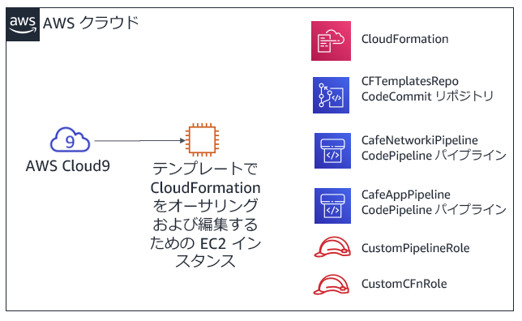
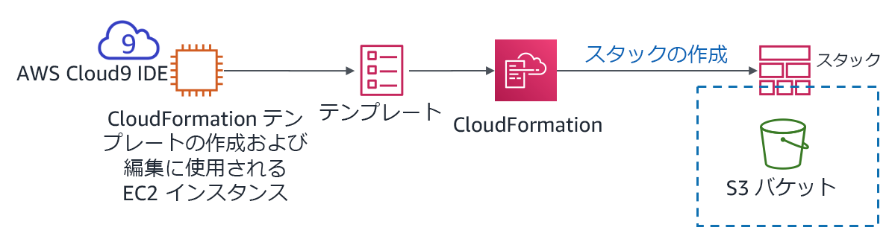
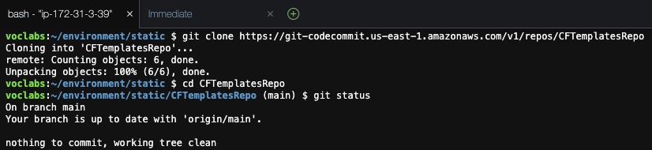
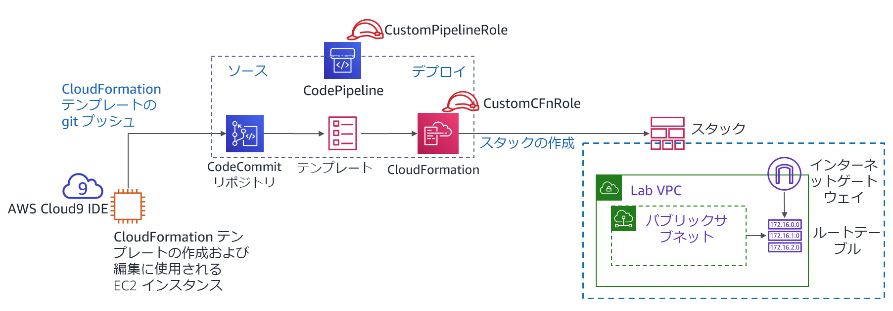
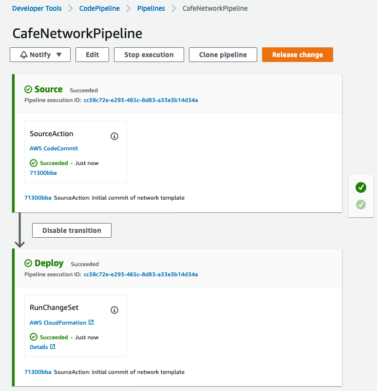
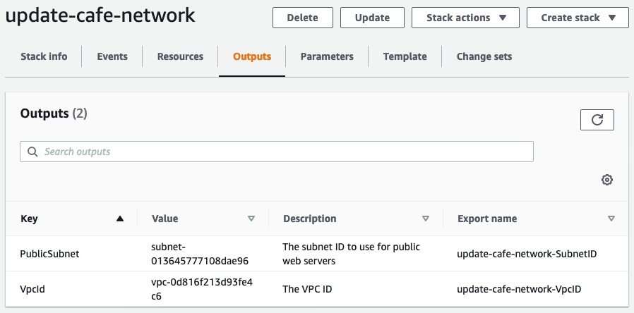

# モジュール 10 - 課題ラボ: Automating Infrastructure Deployment

## シナリオ

カフェのスタッフはこの時点までで、ほぼすべての過程で AWS マネジメントコンソールを使用して AWS のリソースを作成し、アプリケーションを手動で設定してきました。このアプローチはウェブサイトを迅速に立ち上げる上で効果的でしたが、このデプロイを新しい AWS リージョンにレプリケートして、複数の国で新しいカフェの店舗をサポートできるようにするのは困難だとわかりました。また、開発環境と実稼動環境を別にしながら、確実に構成を一致させたいと考えています。

このチャレンジラボでは、ソフィアとしてカフェのデプロイを自動化し、それを別の AWS リージョンにレプリケートします。


## ラボの概要と目標

このラボでは、AWS CloudFormation のテンプレートを実際に作成し、そのテンプレートを使用して AWS CloudFormation スタックを作成して更新します。スタックでは AWS アカウントにある複数の AWS のサービス分野でリソースに対する更新を作成して管理します。AWS CodeCommit を使用してテンプレートのバージョンを管理する練習をし、AWS CodePipeline を使用してスタックの更新を自動化する方法についても確認します。

このラボを完了すると、次のことができるようになります。

* AWS CloudFormation テンプレートを使用して Virtual Private Cloud (VPC) ネットワークレイヤーをデプロイする

* AWS CloudFormation のテンプレートを使用してアプリケーションレイヤーをデプロイする

* Git を使用して AWS CodePipeline を呼び出し、AWS CodeCommit に格納されているテンプレートからスタックを作成または更新する

* AWS CloudFormation を使用してネットワークとアプリケーションリソースを別の AWS リージョンに複製する


ラボを**開始**すると、AWS のアカウントに次のリソースがすでに作成されています。



このチャレンジラボの一部のタスクではステップバイステップの手順が示されません。タスクを完了させる方法を自分で考えてください。


## 所要時間

このラボは、修了までに約 **90 分**かかります。


## AWS サービスの制限事項

このラボ環境では、AWS のサービスとサービスアクションへのアクセスが、ラボの手順を完了するために必要なものに制限されています。他のサービスへのアクセスや、このラボで説明されているサービス以外のアクションを実行しようとすると、エラーが発生することがあります。


## AWS マネジメントコンソールにアクセスする

1. この手順の上部にある <span id="ssb_voc_grey">Start Lab</span> をクリックし、ラボを起動します。

   [**Start Lab**] パネルが開き、ラボのステータスが表示されます。

   <i class="fas fa-info-circle"></i> **ヒント**: ラボの完了までにさらに時間が必要な場合は、<span id="ssb_voc_grey">Start Lab</span> ボタンをもう一度選択して、この環境のタイマーを再開します。

2. \[**Start Lab**] パネルに **Lab status: ready** というメッセージが表示されたら [**X**] をクリックしてパネルを閉じます。

3. この手順の上部にある <span id="ssb_voc_grey">AWS</span> をクリックします。

   このアクションにより、新しいブラウザタブで AWS マネジメントコンソールが開き、ユーザーは自動的にログインします。

   <i class="fas fa-exclamation-triangle"></i> **ヒント**: 新しいブラウザタブが開かない場合、通常、ブラウザによってサイトのポップアップウィンドウの表示がブロックされたというメッセージが表示されたバナーまたはアイコンがブラウザの上部に表示されます。バナーまたはアイコンを選択して [**ポップアップを許可**] を選択してください。

4. **AWS マネジメントコンソール**タブがこの手順と並べて表示されるようにします。両方のブラウザタブを同時に開いておくと、ラボのステップを実行しやすくなります。

   <i class="fas fa-exclamation-triangle"></i> **特に指示がない限り、リージョンを変更しないでください**。

   **注**: ターミナルウィンドウを非表示にするには、画面上部の [**Terminal**] チェックボックスをオフにします。


## ビジネス要件: カフェの静的ウェブサイトを AWS CloudFormation を使用して作成する（課題 1）

カフェでは AWS CloudFormation を使用して AWS アカウントにリソースを作成して保持したいと考えています。あなたはソフィアとしてこの過程の最初の課題に取り組み、Amazon Simple Storage Service (Amazon S3) バケットの作成に使用できるシンプルな AWS CloudFormation テンプレートを作成します。その後、テンプレートに詳細を追加して、スタックを更新するときにテンプレートがバケットを構成してカフェの静的ウェブサイトをホストできるようにします。


### タスク 1: AWS CloudFormation テンプレートを最初から作成する

最初のタスクでは、S3 バケットを作成する AWS CloudFormation テンプレートを作成します。その後、AWS CloudFormation スタックを作成した AWS コマンドラインインターフェイス（AWS CLI）コマンドを実行します（スタックはバケットを作成するリソースです）。


5. AWS Cloud9 サービスに移動して既存の AWS Cloud9 インスタンスの統合開発環境（IDE）を開きます。


6. AWS Cloud9 IDE で、[**File**] メニューから [**New File**] を選択し、次に [**File**] メニューから [**Save**] を選択して作成したファイルを `S3.yaml` という名前で保存します。


7. ファイルの先頭に、以下の 2 行を追加します。

   ```yaml
   AWSTemplateFormatVersion: "2010-09-09"
   Description:
   ```


8. 次に、テンプレートに以下の 3 行を追加します。

   ```yaml
   Resources:
     S3Bucket:
       Type: AWS::S3::Bucket
   ```

   **ヒント**: 各インデントレベルに適切な数のスペースを挿入するようにします。`Resources: `行はインデントなし、`S3Bucket: `の行はスペース 2 つ分、`Type: AWS::S3::Bucket`の行はスペース 4 つ分インデントしてください。

   <i class="fas fa-info-circle"></i> AWS CloudFormation は一部の例外を除き YAML バージョン 1.1 の仕様に対応しています。YAML について詳しくは、[YAML のウェブサイト](http://www.yaml.org/)をご覧ください。


9. 説明を追加します（例えば `"cafe S3 template"`）を **Description:** 行に追加します。説明を入力する前に、コロン (:) の**後**にスペースを入力してください。説明を入力したら、変更を**保存**します。

   <i class="fas fa-info-circle"></i> このモジュールの前半のガイド付きラボで、AWS マネジメントコンソール を使用して AWS CloudFormation スタックを作成しました。ここでは AWS CLI を使用します。


10. Bash ターミナルで、以下の 2 行のコードを実行します。

    ```bash
    aws configure get region
    aws cloudformation create-stack --stack-name CreateBucket --template-body file://S3.yaml
    ```

    実行したコードの最初の行により、AWS Cloud9 インスタンスにインストールされている AWS CLI クライアントのデフォルトの AWS リージョンが返されました。デフォルトの AWS リージョンは、`aws configure` を実行すると変更できます。ただし、このラボではデフォルトのリージョンのままにしてください。

    実行したコードの 2 行目により、定義したテンプレートを使用したスタックが作成されました。コマンドでリージョンを指定しなかったため、スタックはデフォルトのリージョンで作成されます。

    `create-stack` コマンドが正常に実行された場合、JavaScript Object Notation (JSON) 形式の出力が表示されます。この出力には **StackId** が含まれています。

    以下の図はここまでに完了したアクションです。

    

11. AWS マネジメントコンソールで AWS CloudFormation サービスに移動し、**CreateBucket** スタックの詳細を見ます。

    例えば、[**イベント**]、[**リソース**]、[**出力**]、[**テンプレート**] の各タブの情報を確認します。


12. Amazon S3 サービスページに移動して、テンプレートにより作成されたバケットを確認します。

    **ヒント**: バケットには **createbucket-s3bucket-&lt;random-string&gt;** という名前がついています。


#### AWS CloudFormation スタックに関する質問に解答する

ラボの最後に、青色の [**Submit**] をクリックすると、解答が採点されます。

13. このラボの問題にアクセスします。
    - 手順の上にある<span id="ssb_voc_grey">Details <i class="fas fa-angle-down"></i></span> ドロップダウンメニューから <span id="ssb_voc_grey">Show</span> を選択します。

    - ページ下に表示される [**Access the multiple choice questions**] のリンクをクリックします。


14. 読み込んだページで、次の各質問の解答を送信します。

    - **質問 1:** バケットの名前を指定しなかった場合でも、S3 バケットは作成されましたか? 作成された場合、どのような名前でしたか?

    - **質問 2:** バケットが作成されたのはどのリージョンでしたか。また、このリージョンでバケットが作成されたのはなぜですか?

    - **質問 3:** S3 バケットを定義するのに、テンプレートファイルの `Resources: `セクションに何行のコードを入力しましたか?

    **注:** 質問が表示されたブラウザタブは開いたままにしておき、この後のラボで戻れるようにします。


### タスク 2: バケットをウェブサイトとして設定し、スタックを更新する

次のタスクでは AWS CloudFormation テンプレートを更新します。更新すると S3 バケットが静的ウェブサイトをホストするように構成されます。このタスクはモジュール 3 のチャレンジラボの結果と類似しています。モジュール 3 のチャレンジラボでは AWS マネジメントコンソールを使用して S3 バケットを手動で作成および設定しましたが、このラボでは AWS CloudFormation テンプレートを使用してバケットを設定します。


15. 静的ウェブサイトのアセットをバケットにアップロードします。

    このタスクを実行するには、Bash ターミナルで次のコマンドを実行します（&lt;**bucket-name**&gt; を実際のバケット名に置き換えます）。

    ```bash
    wget https://aws-tc-largeobjects.s3-us-west-2.amazonaws.com/ILT-TF-200-ACACAD-20-EN/mod10-challenge/static-website.zip
    unzip static-website.zip -d static
    cd static
    aws s3 cp --recursive . s3://<bucket-name>/ --acl public-read
    ```

    この操作が成功すると、コマンド出力に多数の **upload:&lt;file_name&gt;** メッセージが表示されます。


16. 新しいブラウザタブで、S3 バケットリソースを定義するための AWS CloudFormation テンプレートのドキュメントを開きます。

    - ドキュメント<a href="https://docs.aws.amazon.com/ja_jp/AWSCloudFormation/latest/UserGuide/aws-template-resource-type-ref.html">AWS リソースおよびプロパティタイプのリファレンス</a>に移動します

    - 下にスクロールして [**Amazon S3**]、[**AWS::S3::Bucket**] リソースタイプの順に選択します


17. ドキュメントを参照しながら S3.yaml テンプレートを変更し、S3 バケットリソースに次の特性を設定します。

    - バケットを保持する**削除ポリシー**を添付します

    - **index.html** をインデックスドキュメントとして設定して、静的ウェブサイトをホストするようにバケットを設定します

       <i class="fas fa-info-circle"></i> **ヒント**: テンプレートに 2 行のコードを追加することで、このタスクを実行できます。最後のステップで開いたドキュメントページの**例**のセクションのコードを参照してください。


18. AWS CloudFormation テンプレートに、ウェブサイトの URL を含む**出力**を追加します。

    ここでも、ドキュメントの例のセクションを参考にしてください。


19. 変更を S3.yaml ファイルに保存します。


20. テンプレートを検証します。

    Bash ターミナルに戻り、ディレクトリを S3.yaml ファイルの場所に戻し、次のコマンドを実行してテンプレートを検証します。

    ```bash
    cd ../
    aws cloudformation validate-template --template-body file://S3.yaml
    ```

    テンプレートに構文その他のエラーがあることが出力で示されている場合は、修正してコマンドを再度実行し、解決されたことを確認します。


21. 次のコマンドを実行してスタックを更新します。

    ```bash
    aws cloudformation update-stack --stack-name CreateBucket --template-body file://S3.yaml
    ```

    **ヒント:** YAML 構文が適切であることは重要です。`update-stack` の実行時に **ValidationError** が返された場合は、コロンの使い方や各行のインデントが適切かどうかを確認します。ドキュメント内のサンプルテンプレートを、正しい構造の YAML テンプレートとして参考にしてください。


22. AWS CloudFormation サービスに移動し、スタックの更新が正常に完了したことを確認します。

    - スタックのステータスは **UPDATE_COMPLETE** と表示されます。
    - スタックのステータスが **UPDATE_COMPLETE** になっていない場合は、次のトラブルシューティングのヒントを試してください。
       - スタックに何らかの **ROLLBACK** ステータスがあることが確認された場合は、[**イベント**] タブに移動して **UPDATE_FAILED** のエントリを検索します（スタックの更新が失敗した理由を知るには、そのイベントのステータスの理由を読んでください）。
       - すべてのエラーを解決したら、`update-stack` コマンドをもう一度実行します。コンソールで AWS CloudFormation スタックに戻り、[**イベント**] タブに移動して、スタックが正常に更新されたことを確認します。
       - 必要に応じて繰り返します。


23. 完了を確認します。

    - スタックの [**出力**] タブに URL 値を持つ出力が表示されていますか? その場合はリンクを選択します。

    - 静的なウェブサイトが開きましたか?（以前にウェブサイトのアセットをバケットにコピーしました）

       開けば完了です。

       **注:** スタックに出力がない場合、または出力されたハイパーリンクでカフェのウェブサイトのコンテンツが表示されない場合は、次のトラブルシューティングのステップを試してください。

       - Amazon S3 コンソールを参照し、バケットを選択します。[**概要**] タブには index.html ファイルおよび css と images という名前の 2 つのフォルダが表示されます。これらのリソースが表示されない場合は、このチャレンジセクションの最初のステップをもう一度確認してください。

       - **index.html** ファイルを選択してから [**アクセス許可**] を選択します。[**パブリックアクセス**] の [**オブジェクトの読み取り**] の値を [**はい**] にしてください。

       - バケットビューに戻ります。[**プロパティ**] タブで <i class="fas fa-check-circle" style="color:purple"></i> **静的ウェブサイトホスティング** が有効になり、[**ホスティングタイプ**] が [**バケットホスティング**] になっていることを確認します。

       - このリストに記載されている権限とプロパティはすべて、S3.yaml テンプレートで設定してください。必要に応じてテンプレートの詳細を調整し、`update-stack` AWS CLI コマンドを再度実行します。

          **注:** この最初の課題では、ウェブサイトのファイルをバケットに手動でコピーしました。このアクションは、AWS CloudFormation のカスタムリソースを AWS Lambda 関数と組み合わせて使用することでも実行できます。いずれのリソースも AWS CloudFormation テンプレートで定義できます。このアプローチは AWS CloudFormation のより高度な使用方法であり、このラボの学習範囲を超えていますが、このトピックに興味がある場合は AWS ドキュメントの [AWS Lambda ベースのカスタムリソース](https://docs.aws.amazon.com/AWSCloudFormation/latest/UserGuide/template-custom-resources-lambda.html)のページを参照してください。


## 新しいビジネス要件: バージョン管理システムにテンプレートを保存する（課題 2）

カフェチームは、ソフィアが AWS CloudFormation のテンプレートを使用してすべての静的ウェブサイトを設定したことに感心しました。この成功を受け、チームは Infrastructure as code (IaC) の使用を拡大し、AWS アカウントで他のアプリケーションリソースを構築することを決めました。

チームは、バージョン管理システムに IaC テンプレートを保存することがベストプラクティスであると理解していたため、ソフィアにこの課題に取り組むよう依頼しました。ソフィアはマテオがカフェに立ち寄ったときに、この新しいビジネス要件について話しました。彼の話では、テンプレートを保存してバージョンを管理するには AWS CodeCommit が適しているということでした。マテオは CodeCommit のリポジトリを作成し、その中にサンプルの AWS CloudFormation テンプレートを保存しました。ソフィアはこのコードリポジトリを早く使ってみたいと意気込んでいます。


### タスク 3: AWS CloudFormation テンプレートを含む CodeCommit リポジトリのクローンを作成する

このタスクでは、ソフィアとして CodeCommit リポジトリのクローンを作成します。カフェチームはこのリポジトリを AWS CloudFormation のテンプレートの保存とバージョン管理に使用します。


24. アカウントで CodeCommit サービスを参照し、**CFTemplatesRepo** と名づけられたリポジトリを見つけます。


<i class="fas fa-info-circle"></i> CodeCommit は、Git ベースのリポジトリをホストするのに使用できるソース管理サービスで、GitHub リポジトリと同様に使用できます。AWS CodeCommit の詳細については、[AWS ドキュメント](https://aws.amazon.com/codecommit/)を参照してください。


25. **CFTemplatesRepo** をクリックし、**templates** フォルダをクリックします。

    ここに AWS CloudFormation テンプレートが入っているのを確認します。

    <i class="fas fa-info-circle"></i> ここでは、IaC AWS CloudFormation テンプレートを CodeCommit に保存します。


26. **CFTemplatesRepo/templates/start-lab.yaml** ファイルを開き、内容を分析します。

    - このテンプレートは、この AWS アカウントで見てきたいくつかのリソースを定義しています。

    - 例:

       - テンプレートの 6 行目以降で、**AWS Cloud9 インスタンス**を定義しています
       - テンプレートの 12 行目以降で今開いている **CodeCommit リポジトリ**を定義しています

       <i class="fas fa-info-circle"></i> [**Start Lab**] をクリックしたときに、このラボをホストするラボプラットフォームにより AWS CloudFormation スタックが作成されました。実行した AWS CloudFormation テンプレートには、このテンプレートに含まれるリソース定義が含まれますが、このサンプルテンプレートにはラボを開始するのに使用された実際のテンプレートに含まれるすべてのリソース定義は含まれません。


27. ページ上部のブレッドクラムリストで、[**リポジトリ**] をクリック、[**URL のクローン**] 列で [**HTTPS**] をクリックします。

    <i class="fas fa-info-circle"></i> このアクションにより、CodeCommit リポジトリの HTTPS クローン URL がクリップボードにコピーされます。


28. AWS Cloud9 IDE に戻り、既存の CodeCommit リポジトリをワークスペースにクローンします（&lt;url&gt; をコピーしたクローン URL に置き換えます）。

    AWS Cloud9 IDE の Bash ターミナルで、次のコマンドを入力します。

    ```bash
    git clone <url>
    ```

    このコマンドにより、先ほど確認した CodeCommit リポジトリのコピーのクローンが作成されます。**CFTemplatesRepo** ディレクトリが作成されてナビゲーションウィンドウ（IDE の左のウィンドウ）に表示されます。

    Git クライアントソフトウェアを使用して、リポジトリのローカルコピーを分析します。

    ```bash
    cd CFTemplatesRepo
    git status
    ```

    

    `git status` コマンドにより、リポジトリのどのブランチに接続しているか、またローカルコピーが CodeCommit のソースブランチに対して最新であるかが示されます。


## 新しいビジネス要件: 継続的デリバリーサービスを使用して、カフェのネットワークレイヤーとアプリケーションレイヤーを作成する（課題 3）

ソフィアの次の課題は、AWS CloudFormation を使用して、動的ウェブサイトのカフェアプリケーションをデプロイできる、すべてのネットワークリソースを作成することです。その後、カフェのアプリケーション自体をデプロイする必要があります。

ソフィアはまた、AWS CloudFormation テンプレートを更新するときに、より簡単にスタックを更新する方法を知りたいと考えています。彼女は現在、テンプレートを定期的に更新していますが、スタックの更新を自動化できるはずだと考えています。

ソフィアはこの問題についてマテオと話しました。マテオは、AWS CodePipeline なら、ソフィアが探している継続的インテグレーションと継続的デリバリー（CI/CD）サービス機能を使えると話し、ソフィアに 2 つのパイプラインを作成しました。ソフィアは早速、パイプラインを使ってみたいと考えています。

この課題では、ソフィアとしてこれらのパイプラインを活用します。また、カフェの動的ウェブサイトをデプロイするのに必要なすべてのリソースを、AWS CloudFormation テンプレートで定義します。


### タスク 4: AWS CloudFormation、CodeCommit、CodePipeline を使用して新しいネットワークレイヤーを作成する

このタスクでは、AWS CloudFormation テンプレートを使用してパブリックサブネットとその他のネットワークリソースを持つ VPC を作成します。また、CI/CD パイプラインを実際に使用します。Git を使用してテンプレートを CodeCommit リポジトリにプッシュすると、パイプラインがトリガーされて AWS CloudFormation スタックが作成されます。


29. 新しい AWS CloudFormation テンプレートを作成して、VPC、パブリックサブネット、その他のリソースを作成します。

    - AWS Cloud9 IDE のナビゲーションペインで、**CFTemplatesRepo/templates** ディレクトリを展開します。

    - **templates** ディレクトリで `template1.yaml` を右クリックし、その複製を作成します。

    - 複製の名前を `cafe-network.yaml` に変更します。

    - テキストエディタで cafe-network.yaml を開き、説明を `Network layer for the cafe` とします。

    - このテンプレートで作成される 7 つのリソースの詳細を確認します。


30. アカウントに事前設定された AWS CodePipeline の詳細を確認します。

    - AWS マネジメントコンソールの <span id="ssb_services">サービス <i class="fas fa-angle-down"></i></span> で [**CodePipeline**] をクリックします。

    - [**パイプライン**] をクリックします。

    - 以下の 2 つのパイプラインが事前定義されています。

       - CafeAppPipeline
       - CafeNetworkPipeline

       <i class="fas fa-exclamation-triangle"></i> **重要**: 各パイプラインの最新の実行ステータスは失敗と表示されますが、これは想定内です。パイプラインが参照する AWS CloudFormation テンプレートファイルが、想定される場所にないためです。


31. **CafenetWorkPipeline** の **Source** ステージを分析します。

    - [**CafeNetWorkPipeline**] をクリックし、パイプラインの詳細を確認します。

       **Source** 領域で、このパイプラインの **SourceAction** が **AWS CodeCommit** であることがわかります。

    - **SourceAction** の右にある <i class="fas fa-info-circle"></i> をクリックします。

       [**設定**] ウィンドウの詳細に、ソースが **CFTemplatesRepo** CodeCommit リポジトリであることが示されます。

    - [**完了**] をクリックして **CafenetWorkPipeline** ページに戻ります。


32. CafenetWorkPipeline の **Deploy** ステージを分析します。

    - **Deploy** アクションは AWS CloudFormation を使用して実行されます。

    - **RunChangeSet** の右にある <i class="fas fa-info-circle"></i> をクリックします。

       **分析**: [**設定**] ウィンドウの詳細に、**update-cafe-network** という名前のスタックが実行または更新されることが示されます。このアクションを実行するため、スタックは cafe-network.yaml の AWS CloudFormation テンプレートを使用します。この **Deploy** アクションでは、CodeCommit リポジトリでテンプレートを検出した **Source** ステージからテンプレートを受け取ります。

       次の図は、このパイプラインをトリガーする方法と、パイプラインの動作を示したものです。また、作成された AWS CloudFormation スタックが作成または更新する AWS アカウントのリソースの一部も示しています。

    

    <i class="fas fa-info-circle"></i> AWS CodePipeline の詳細については [AWS ドキュメント](https://aws.amazon.com/codepipeline/)を参照してください。


33. AWS Cloud9 インスタンスに戻り、AWS CloudFormation テンプレートを CodeCommit にチェックインし、**update-cafe-network** の作成をトリガーします。

    - リポジトリのローカルコピーがオリジンとどのように異なるかを確認します。Bash ターミナルで次のコマンドを実行します。

    ```bash
    git status
    ```

      出力には、作成した cafe-network.yaml ファイルが現在 Git で追跡されていないことが示されます。

    - 次の 2 つのコマンドを実行して新しいファイルをリポジトリに追加し、コメントを付けてリポジトリにコミットします。

    ```bash
    git add templates/cafe-network.yaml
    git commit -m 'initial commit of network template' templates/cafe-network.yaml
    ```

    - リポジトリのローカルコピーのステータスを確認します。

    ```bash
    git status
    ```

    返された情報で、ブランチがオリジンよりコミット 1 つ分だけ先に進んでいることがわかります。

    - コミットをリモートリポジトリにプッシュします（実際には、このコマンドによりファイルが CodeCommit にコピーされます）。

    ```bash
    git push
    ```


34. CodePipeline コンソールに戻り、[**CafenetWorkPipeline**] を選択します。

    - スタックの作成が自動的にトリガーされることを確認します。

       **注:** **Source** ステージが更新され、**Deploy** ステージが [**進行中**] と表示されるまで 1 ～ 2 分かかることがあります。最終的に、**Deploy** ステージのステータスは [**成功しました**] と表示されます。

    - **Source** と **Deploy** の詳細にはいずれも、`git push` を実行したときに返されたコミット番号が表示されます。詳細にはコミットに追加したコメントも表示されます。





トラブルシューティングのヒント

- **Deploy** ステップのステータスが [**失敗しました- 今**] の場合は、[**詳細**] リンクを開いてエラーの詳細にアクセスします。例えば、テンプレートの書式設定にエラーがあり、解決する必要があるなどです。
- テンプレートを更新したら、適切な `git commit` コマンドと `git push` コマンドを再度実行してスタックを更新できます。
   - [**変更をリリースする**] をクリックしてパイプラインをトリガーして再度実行することもできます。この操作は CodeCommit リポジトリに `git push` コマンドを実行するなどの変更を加えなくても実行されます。
   - 同様に、パイプラインの **Deploy** ステージで [**再試行**] をクリックすることもできます。この操作では、**Source** ステージを再試行することなく **Deploy** ステージを再試行します。
- スタックのロールバックに失敗し、スタックの更新をそれ以上実行できない場合、スタックを削除できます。スタックの削除は AWS CloudFormation コンソールのスタックのページに移動して実行します。ネットワークスタックを削除する場合、新しい更新を Git にプッシュします。このアクションによりスタックの再作成がトリガーされます。


35. AWS CloudFormation コンソールで、**update-cafe-network** スタックが実行されたことを確認します。ステータスは **CREATE_COMPLETE** または **UPDATE_COMPLETE** となります。

    また、スタックの [**出力**] タブをチェックします。現状では出力が表示されませんが、間もなくスタックを更新すると出力が作成されます。


36. Amazon VPC コンソールで、cafe-network.yaml テンプレートで定義されているリソースが AWS アカウントで作成されていることを確認します。

    例えば、コンソールには **Cafe VPC** という名前の VPC と、**Cafe Public Subnet** という名前のサブネットが表示されます。

    お疲れ様でした。これでカフェのウェブサイトの実行に必要なネットワークリソースが正常に作成されました。


### タスク 5: ネットワークスタックを更新する

このタスクではネットワークスタックを更新して、スタックで作成された 2 つのリソースに関する重要な情報をエクスポートします。これら 2 つの出力は、後で作成するアプリケーションスタックで参照します。


37. **cafe-network.yaml** の下に次の行を追加します。

```YAML
Outputs:
  PublicSubnet:
    Description: The subnet ID to use for public web servers
    Value:
      Ref: PublicSubnet
    Export:
      Name:
        'Fn::Sub': '${AWS::StackName}-SubnetID'
  VpcId:
    Description: The VPC ID
    Value:
      Ref: VPC
    Export:
      Name:
        'Fn::Sub': '${AWS::StackName}-VpcID'
```


38. 変更を保存し、Bash ターミナルでコードを追加してコミットした後、Git を使用して CodeCommit にプッシュします。


39. AWS CloudFormation スタックの更新が実行されていることを確認します。また、[**出力**] タブに 2 つのキーとエクスポート名が表示されていることを確認します。

| 名前 | エクスポート名 |
| --- | ------ |
| PublicSubnet** | update-cafe-network-SubnetID** |
| VpcId** | update-cafe-network-VpcID** |





### タスク 6: EC2 インスタンスリソースを定義し、アプリケーションスタックを作成する

このタスクでは、新しい AWS CloudFormation テンプレートを作成して、カフェの動的なウェブサイトを展開する新しいスタックを作成します。CodeCommit リポジトリに cafe-app.yaml テンプレートをプッシュすると、以前に確認した **CafeAppPipeline** のパイプラインにより **update-cafe-app** スタックが作成または更新されます。


40. AWS Cloud9 に戻って、template ディレクトリで **template2.yaml** ファイルを複製し、複製の名前を `cafe-app.yaml` に変更します。


41. cafe-app.yaml テンプレートで、既存のテンプレートの内容を分析します。

    - **Parameters** 領域で **LatestAmiId** がルックアップを実行し、スタックを作成する AWS リージョンで最新の Amazon Linux 2 Amazon マシンイメージ（AMI）ID を検出します。これは Amazon Elastic Compute Cloud (Amazon EC2) インスタンスを定義するときに参照します。
    - また、**Prameters** 領域では **CafenetWorkParameter** で文字列値を定義します。デフォルト値は AWS CloudFormation テンプレートの cafe-network.yaml を実行したときに作成したスタックの名前です。この文字列にパラメータを設定すると、別のスタックのリソースを参照する必要がある場合に、別のスタック名を柔軟に示せるようになります。
    - **Mappings** 領域では、EC2 インスタンスを定義するときに **RegionMap** マッピングを参照できます。このマッピングを使用すると、インスタンスに対して確実に正しいキーペアを使用するようにできます。ただし、この機能が使用できるかどうかはテンプレートを実行する AWS リージョンによって異なります。
    - **Resources** 領域では、**EC2 セキュリティグループ**が定義され、インバウンドネットワークトラフィックに対し TCP ポート 80 と 22 を開きます。これは **update-cafe-network** スタックが作成した VPC 内に作成されます。
    - **Outputs** 領域では **WebServerPublicIP** という名前の出力が次で定義する EC2 インスタンスのパブリック IPv4 アドレスを返します。


42. cafe-app.yaml テンプレートで 3 番目の**パラメータ**を定義し、ユーザーが EC2 インスタンスを起動するときに異なるインスタンスタイプを選択できるようにします。

    - [AWS ドキュメント](https://docs.aws.amazon.com/ja_jp/AWSCloudFormation/latest/UserGuide/parameters-section-structure.html)を参照します。**テンプレートでのパラメータの定義** セクションで、サンプル YAML パラメータをコピーします。

    - パラメータをテンプレートに貼り付けます。次にパラメータを変更して、許可されるインスタンスタイプが**t2.micro**、**t2.small**、**t3.micro**、**t3.small** になるようにします。また、`t2.small` をデフォルトに設定して説明を更新し、ユーザーが選択できるオプションを反映させます。


43. 新しいブラウザタブで [AWS ドキュメント](https://docs.aws.amazon.com/ja_jp/AWSCloudFormation/latest/UserGuide/aws-properties-ec2-instance.html)を開き、そのページの情報を参照します。


44. cafe-app.yaml テンプレートに戻り、次の特性を持つ新しい **EC2 インスタンス**リソースを作成します。

    - **Logical ID** を `CafeInstance` に設定します（必要に応じて https://docs.aws.amazon.com/AWSCloudFormation/latest/UserGuide/resources-section-structure.html を参照）。

    - **LatestAmiId** パラメータを参照する **ImageId** を含めます。

    - **インスタンスタイプ** は前のステップで定義したインスタンスタイプパラメータを参照します。

    - **KeyName** には、テンプレートにすでに定義されている RegionMap マッピングを参照する次のコード行を使用します。

    ```yaml
    KeyName: !FindInMap [RegionMap, !Ref "AWS::Region", keypair]
    ```

    - **インスタンスプロファイル** はインスタンスにアタッチされている AWS Identity and Access Management (IAM) のロールです。ここで`CafeRole` を指定します。

       **注**: CafeRole IAM ロールはアカウントにすでにあります。これをアタッチすると、AWS Systems Manager からパラメータストアの値を取得するためのアクセス許可が EC2 インスタンスに付与されます。

    - **Properties** のセクションに次のコード行を含めます。

    ```yaml
    NetworkInterfaces:
        - DeviceIndex: '0'
          AssociatePublicIpAddress: 'true'
          SubnetId: !ImportValue
            'Fn::Sub': '${CafeNetworkParameter}-SubnetID'
          GroupSet:
            - !Ref CafeSG
    ```

       - **分析**: 以上の行は、カフェのネットワークスタックの実行時に作成した**パブリックサブネット**にインスタンスが確実にデプロイされるようにします。このタスクの最初に、ネットワークスタックを更新して**エクスポート**名を使用して出力を定義しました。上記のコードでは、**SubnetId** の値を**インポート**します。前述のコードはまた、作成するインスタンスがこのテンプレートですでに定義されている **CafeSG** セキュリティグループに確実に含まれるようにするのに役立ちます。

    - **キー**を**Name**、**値**を**Cafe Web Server**として**タグ**を設定します。

       - **ヒント:** テンプレートですでに定義されているセキュリティグループリソースに**名前**タグがどのように適用されたかを確認します。

    - **Properties** セクションに、次の **UserData** コードを追加します。

    ```yaml
    UserData:
        Fn::Base64:
          !Sub |
            #!/bin/bash
            yum -y update
            yum install -y httpd mariadb-server wget
            amazon-linux-extras
            install -y lamp-mariadb10.2-php7.2 php7.2
            systemctl enable httpd
            systemctl start httpd
            systemctl enable mariadb
            systemctl start mariadb
            wget https://aws-tc-largeobjects.s3-us-west-2.amazonaws.com/ILT-TF-200-ACACAD-20-EN/mod10-challenge/cafe-app.sh
            chmod +x cafe-app.sh
            ./cafe-app.sh
    ```

       **分析**: 以上のコードは、起動プロセスの終了時にインスタンス上で実行されます。コードは Amazon Linux インスタンスに Apache HTTP ウェブサーバー、MariaDB データベース、および PHP をインストールし、次にウェブサーバーとデータベースを起動します。その後、cafe-app.sh という名前のスクリプトをダウンロードして実行します。cafe-app スクリプトはデータベースを構成し、カフェのウェブサイトを機能させる PHP コードをインストールします。


45. テンプレートの更新に問題がなければ、変更を保存します。Bash ターミナルでテンプレート形式を検証するには、次のコマンドを実行します。

    ```bash
    aws cloudformation validate-template --template-body file:///home/ec2-user/environment/CFTemplatesRepo/templates/cafe-app.yaml
    ```

    テンプレートの先頭で定義された 3 つのパラメーターを含む JSON 形式の応答を受け取った場合、テンプレートは検証に合格しています。**ValidationError** 応答（またはその他のエラー応答）を受け取った場合は問題を修正する必要があります。修正したら変更を保存し、`validate-template` コマンドを再度実行します。


46. テンプレートが検証に合格した場合は、ファイルを CodeCommit に追加します。Bash ターミナルで、`git` コマンドを実行してファイルを追加、コミット、およびリポジトリにプッシュします。

    <i class="fas fa-info-circle"></i> **ヒント**: 必要に応じてタスク 3 の Git コマンドを参照します。ただし、このタスクで CodeCommit にプッシュするテンプレートの名前は異なることに注意してください。


47. CodePipeline コンソールに戻り、**CafeAppPipeline** を選択します。

    **注:** **Source** ステージが更新され、**Deploy** ステージが [**進行中**] と表示されるまで 1～2 分かかることがあります。最終的に、**Deploy** ステージのステータスは [**成功しました - 今**] と表示されます。

    - ステータスが失敗となる場合、次のトラブルシューティングのヒントをお試しください。

       - **Deploy** ステージのステータスが [**失敗しました - 今**] となる場合は、[**詳細**] リンクを選択してエラー情報を開きます。AWS CloudFormation スタックの詳細に移動するリンクが表示される場合があります（どちらのエラーが先にスタックをロールバックさせたかを特定するには [**イベント**] タブに移動します）。
       - スタックがロールバックに失敗した場合、または **ROLLBACK_COMPLETE** ステータスとなりパイプラインを使用してスタックを更新できない場合は、そのスタックを AWS CloudFormation のスタックページから削除できます。その後、新しい更新を Git にプッシュしてスタックの再作成をトリガーします。


48. AWS CloudFormation コンソールで **update-cafe-app** スタックが正常に実行され、ステータスが **CREATE_COMPLETE** であることを確認します。


49. Amazon EC2 コンソールに移動します。EC2 インスタンスおよびセキュリティグループのリソース（cafe-app.yaml テンプレートで定義済み）が作成されたことを確認します。


50. EC2 インスタンスが起動し、両方のステータスチェックに合格したら、カフェのウェブサイトをテストします。ブラウザタブで次の URL を読み込みます。ここで &lt;public-ip-address&gt; は定義した EC2 インスタンスの**パブリック IPv4 アドレス**です: `http://<public-ip-address>/cafe`

    カフェのウェブサイトが表示されます。

    **ヒント**: 定義したユーザーデータスクリプトの詳細の実行が完了するまでに 2 分ほどかかる場合があります。ウェブサイトが表示されるまでしばらくお待ちください。

    ウェブサイトにはウェブサーバーが実行されているリージョンやアベイラビリティーゾーンなどのサーバー情報が表示されます。

    お疲れ様でした! CI/CD パイプラインと IaC アプローチを使用して、ネットワークレイヤーとアプリケーションレイヤーを展開できました。


#### アプリケーションレイヤーの作成結果に関する質問に解答する

51. このラボの複数選択式の質問が表示されたブラウザタブに戻り、次の質問に答えます。

    - **質問 4:** **update-cafe-app** スタックの [**パラメータ**] タブに移動します。**LatestAmiId** の値はどのようになっていますか?

    - **質問 5:** **update-cafe-app** スタックの [**スタック情報**] タブに移動します。**update-cafe-app** スタックの作成および更新の権限を付与する IAM ロールの Amazon リソースネーム (ARN) は何ですか?

    - **質問 6:** AWS マネジメントコンソールで、AWS CloudFormation テンプレートが保存されている CodeCommit リポジトリに移動します。[**コミット**] を選択し、[**コミット**] リストでコミット ID を選択してコミットの 1 つを開きます。何が表示されますか?


## 新しいビジネス要件: 2 番目の AWS リージョンでネットワークおよびアプリケーションのリソースを複製する（課題 4）

ソフィアは、AWS CloudFormation を使用してカフェの動的ウェブサイトにネットワークレイヤーとアプリケーションレイヤーの両方を作成できたことを喜んでいます。彼女はまた、これらのリソースを 2 つ目の AWS リージョンに複製することをカフェのスタッフが希望しているとわかり、満足しています。

ソフィアは間もなく、AWS CloudFormation テンプレートでリソースと設定を苦労して定義したことのメリットを体験することになります。すべてのリソースを手動で作成する代わりに、IaC のアプローチによって環境を複製する方が簡単であることを理解したためです。


### タスク 7: カフェのネットワークとウェブサイトを別の AWS リージョンに複製する

この最後のラボのタスクでは、デプロイをいかに迅速に複製できるかを体験します。AWS CloudFormation テンプレートですべてのリソースを定義しているため、迅速なデプロイが可能となります。

タスク 4～6 では、AWS CloudFormation スタックを自動的に作成または更新しました。CodeCommit リポジトリが更新されたタイミングを監視するようにパイプラインを定義し、次にパイプラインは AWS CloudFormation を呼び出してスタックを作成または更新しました。このタスクでは、AWS CLI を使用してカフェのネットワークリソースを別の AWS リージョンに複製してから、AWS CloudFormation コンソールを使用して 2 番目のリージョンにアプリケーションスタックを作成します。


52. AWS Cloud9 IDE に戻り、次のコマンドを実行して**カフェネットワーク**を別の AWS リージョンに複製します。

    ```bash
    aws cloudformation create-stack --stack-name update-cafe-network --template-body file:///home/ec2-user/environment/CFTemplatesRepo/templates/cafe-network.yaml --region us-west-2
    ```

    これにより **StackId** が返されます。コマンドの実行時にリージョンを指定することで、このスタックの作成時にデフォルトのリージョンを上書きできます。


53. AWS CloudFormation コンソールを参照し、リージョンを**米国西部 (オレゴン) us-west-2** に変更します。

    - **update-cafe-network** スタックが表示されます

    - 2 番目の **update-cafe-region** スタックのステータスが最終的に **CREATE_COMPLETE** に変わることを確認します

       <i class="fas fa-info-circle"></i> **ヒント**: <i class="fas fa-sync"></i> **更新** アイコンを使用すると、ステータス変更の完了をすばやく確認できます。


54. Amazon VPC サービスページにアクセスし、**オレゴン**リージョン (us-west-2) を使用していることを確認します。

    作成されたネットワークリソースが確認できます。


55. **オレゴン**リージョン (us-west-2) で、`cafe-oregon` という名前の EC2 キーペアを作成します。

    - Amazon EC2 コンソールを参照し、**オレゴン**リージョンにいることを確認します。
    - ナビゲーションペインで、[**ネットワークとセキュリティ**] > [**キーペア**] の順にクリックします。
    - [**キーペアを作成**] をクリックします。
    - キーペアに `cafe-oregon` という名前を付け、[**キーペアを作成**] をもう一度選択します。

       **ヒント**: 必要に応じてキーペアを保存するか、[**キャンセル**] を選択します。このラボではキーペアは必要ありません。ただし一般的なユースケースでは、これ以降キーペアを保存する機会がないため、ここで保存する必要があります。


56. アプリケーションテンプレートの詳細を再確認します。

    - AWS Cloud9 IDE に戻り、テキストエディタで **cafe-app.yaml** テンプレートの詳細を確認します。
    - EC2 インスタンスのリソース定義に **KeyName** プロパティがあることを確認します。これは、テンプレートで定義されている **RegionMap** マッピングを参照しています。
    - このマッピングは、インスタンスが **us-east-1 (バージニア北部)** リージョンで起動された場合、**vockey キーペア**を使用する必要があることを示しています。ただし、インスタンスが **us-west-2 (オレゴン)** リージョンで起動された場合は、先ほど作成した **cafe-oregon キーペア**を使用する必要があります。
    - また、以前に定義した **InstanceTypeParameter** も確認します。**AllowedValues** 領域にインスタンスタイプのオプションがいくつかありますが、デフォルトは **t2.small** に設定されています。この構成はすぐに使います。


57. AWS Cloud9 IDE で、テンプレートファイルを S3 バケットにコピーします（次のコマンドで、&lt;repobucket-bucketname&gt; をアカウントの実際の S3 バケット名に置き換えます。名前には **repobucket** という文字列が含まれている必要があります）。

    ```bash
    aws s3 cp templates/cafe-app.yaml s3://<repobucket-bucketname>/
    ```


58. Amazon S3 コンソールで、アップロードしたファイルの**オブジェクト URL**（**https** アドレス）をコピーします。


59. AWS CloudFormation コンソールで、リージョンを**オレゴン (us-west-2)** に変更します。


60. 新しいリソースでスタックを作成します。

    - [**スタックの作成**] 画面の [**Amazon S3 URL**] ボックスに、今コピーしたオブジェクト URL を貼り付けます。

    - 次の画面（[**スタックの詳細を指定**]）で以下を指定します。
       - **スタック名**: 適切な名前を入力します
       - **InstanceTypeParameter**: **t3.micro**

       AWS CloudFormation テンプレートでインスタンスタイプをパラメータとして定義したため、スタックの作成時に設定できます。

    - 残りの画面のすべてでデフォルト設定を承諾して進め、スタックの作成を完了します。

    - スタックが正常に作成されたことを確認します。


61. Amazon EC2 コンソールを参照し、作成されたリソースを確認します。

    - ウェブサーバーが起動を完了してユーザーデータスクリプトを実行するまで数分待ちます。
    - インスタンスで使用される**キーペア**とインスタンスタイプを確認します。これらの設定は、**us-east-1** リージョンで実行されるウェブサーバーの設定とは異なりますが、このスタックを起動するのに使用したのは**変更していない**同じテンプレートでした。
    - サーバーが完全に起動したら、`http://<public-ip-address>/cafe` （&lt;public-ip-address&gt; は EC2 インスタンスのパブリック IPv4 IP アドレス）でウェブサイトにアクセスできるようになります。**
    - ウェブサイトのサーバー情報は、カフェのウェブサイトのこの 2 番目のインスタンスが **us-west-2** リージョンで実行されていることを示しています。最初に作成したウェブサーバーは **us-east-1** リージョンで実行されていることを示しています。


## カフェの近況


ソフィアはここで多くのことを学びました。

AWS CloudFormation を使用してカフェのウェブサイトの静的バージョンを適切にデプロイしました。その後、動的ウェブサイトをウェブアプリケーションとして展開することに成功しました。ソフィアは動的ウェブサイトに AWS CodeCommit、AWS CodePipeline、AWS CloudFormation を使った CI/CD パイプラインを使用しました。さらに、ネットワークリソースとカフェのアプリケーションリソースの両方を別の AWS リージョンにすばやく複製しました。

ソフィアは、AWS CloudFormation テンプレートをバックアップとディザスタリカバリ (**DR**) ソリューションの一部として使用できないかと考えています。重要なカフェのインフラをいかに迅速に再作成できるかを体験し、実稼働のデプロイで何らかの障害が発生した場合でも、すぐに再作成または複製できると考えるようになったからです。

ソフィアはまた、**テスト環境**を迅速にスピンアップできるようになったと考えています。テスト環境の設定の詳細を実稼動環境に確実に一致させることができる一方、パラメータやマッピングなどの機能を使用して、テスト環境と実稼働環境との違いを厳密に制御することもできます。

DevOps の自動化の利点は多数あります。ソフィアは現在、チームがカフェのクラウドリソースを開発、テストし、アップデートを展開する方法として、自動化パイプラインと CI/CD パイプラインを中心とする計画を立てています。


## 作業内容を送信する

62. この手順の上部にある <span id="ssb_blue">Submit</span> をクリックして進捗情報を記録し、プロンプトが表示されたら [**Yes**] をクリックします。


63. 数分経っても結果が表示されない場合は、この手順の上部に戻り、<span id="ssb_voc_grey">Grades</span> をクリックします。

    **ヒント**: 作業内容は何度も送信できます。作業内容を変更したら、再度 [**Submit**] をクリックします。最終送信分がこのラボの作業内容として記録されます。


64. 作業に関する詳細なフィードバックを参照するには、<span id="ssb_voc_grey">Details</span> ドロップダウンメニューから <i class="fas fa-caret-right"></i> [**View Submission Report**] を選択します。


## ラボの終了

<i class="icon-flag-checkered"></i>お疲れ様でした。以上でラボは終了です。


65. ラボを終了するには、このページの上部にある <span id="ssb_voc_grey">End Lab</span> をクリックし、<span id="ssb_blue">Yes</span> をクリックします。

    パネルに **DELETE has been initiated... You may close this message box now** というメッセージが表示されます。

66. 右上隅の [**X**] をクリックしてパネルを閉じます。


**©2020 Amazon Web Services, Inc. and its affiliates. All rights reserved. このトレーニング内容の全体または一部を複製または再配布することは、Amazon Web Services, Inc. の書面による事前の許可がある場合を除き、禁じられています。商業目的のコピー、貸与、または販売を禁止します。**
