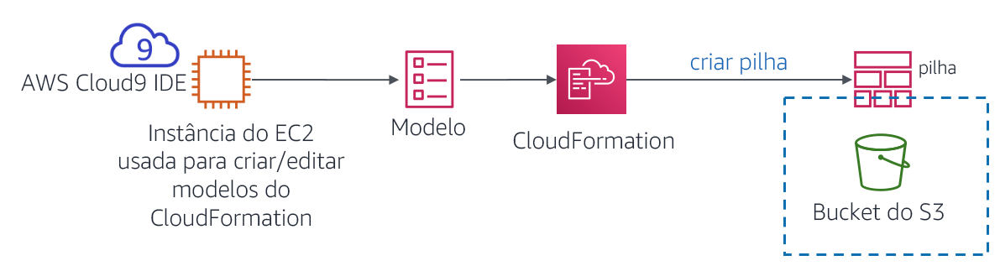
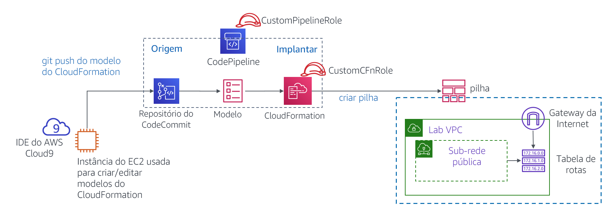

# Módulo 10 – Laboratório de desafio: Automatizar a implantação da infraestrutura

## Cenário

Até esse ponto, a equipe da cafeteria criou seus recursos da AWS e configurou suas aplicações manualmente, usando principalmente o Console de Gerenciamento da AWS. Essa abordagem funcionou bem como uma maneira de a cafeteria começar com uma presença na Web rapidamente. No entanto, eles consideram um desafio replicar suas implantações em novas regiões da AWS para que possam oferecer suporte a novos locais da cafeteria em vários países. Eles também gostariam de ter ambientes de desenvolvimento e produção separados que tenham configurações correspondentes de forma confiável.

Neste laboratório de desafio, você assumirá o papel de Sofía enquanto trabalha para automatizar as implantações da cafeteria e replicá-las em outra região da AWS.


## Visão geral e objetivos do laboratório

Neste laboratório, você ganhará experiência com a criação de modelos do AWS CloudFormation. Você usará os modelos para criar e atualizar pilhas do AWS CloudFormation. As pilhas criam e gerenciam atualizações de recursos em várias áreas de serviço da AWS em sua conta da AWS. Você praticará o uso do AWS CodeCommit para controlar a versão de seus modelos. Você também observará como usar o AWS CodePipeline para automatizar atualizações de pilha.

Depois de concluir este laboratório, você deverá ser capaz de:

* Implantar uma camada de rede de Virtual Private Cloud (VPC) usando um modelo do AWS CloudFormation

* Implantar uma camada de aplicação usando um modelo do AWS CloudFormation

* Usar o Git para chamar o AWS CodePipeline e criar ou atualizar pilhas a partir de modelos armazenados no AWS CodeCommit

* Duplicar recursos de rede e aplicações para outra região da AWS usando o AWS CloudFormation

    

Quando você *inicia* o laboratório, os seguintes recursos já são criados para você na conta da AWS:


Observe que, neste laboratório de desafio, você encontrará algumas tarefas sem instruções passo a passo. Você mesmo deverá descobrir como concluir as tarefas.


## Duração

Este laboratório levará aproximadamente **90 minutos** para ser concluído.


## Restrições de serviço da AWS

Neste ambiente de laboratório, o acesso aos serviços e ações de serviço da AWS pode estar restrito àqueles necessários para concluir as instruções do laboratório. Você poderá encontrar erros se tentar acessar outros serviços ou executar ações além do que está descrito neste laboratório.


## Acessar o Console de Gerenciamento da AWS

1. Na parte superior destas instruções, escolha <span id="ssb_voc_grey">Start Lab</span> (Iniciar laboratório) para iniciar o laboratório.

   Um painel **Start Lab** (Iniciar laboratório) é aberto com o status do laboratório.

   <i class="fas fa-info-circle"></i> **Dica**: se você precisar de mais tempo para concluir o laboratório do que o exibido no cronômetro, escolha o botão <span id="ssb_voc_grey">Start Lab</span> (Iniciar laboratório) novamente para reiniciar o cronômetro do ambiente. Isso não excluirá os recursos que você criou.

2. Aguarde até que a mensagem *Lab status: ready (Status do laboratório: pronto)* seja exibida e feche o painel **Start Lab** (Iniciar laboratório) escolhendo **X**.

3. Na parte superior destas instruções, escolha <span id="ssb_voc_grey">AWS</span>.

   O Console de Gerenciamento da AWS será aberto em uma nova guia do navegador. O sistema fará o seu login automaticamente.

   **Dica**: se uma nova guia do navegador não for aberta, normalmente você verá uma faixa ou um ícone na parte superior do navegador com uma mensagem informando que o navegador está impedindo que o site abra janelas pop-up. Escolha a faixa ou o ícone e depois **Allow pop ups** (Permitir pop-ups).

4. Organize a guia do Console de Gerenciamento da AWS para que ela seja exibida com essas instruções. O ideal é ver as duas guias do navegador abertas ao mesmo tempo, para facilitar o acompanhamento das etapas do laboratório.

   **Observação**: para ocultar a janela do terminal, você também pode limpar a caixa **Terminal** na parte superior da tela.


## Uma solicitação de negócios: criação de um site estático para a cafeteria usando o AWS CloudFormation (Desafio nº 1)

A cafeteria gostaria de começar a usar o AWS CloudFormation para criar e manter recursos na conta da AWS. Como uma primeira tentativa simples nesse processo, você assumirá o papel de Sofía e criará um modelo simples do AWS CloudFormation que pode ser usado para criar um bucket do Amazon Simple Storage Service (Amazon S3). Em seguida, você adicionará mais detalhes ao modelo para que, ao atualizar a pilha, ele configure o bucket para hospedar um site estático para a cafeteria.


### Tarefa 1: criar um modelo do AWS CloudFormation do zero

Nesta primeira tarefa, você gerará um modelo do AWS CloudFormation que cria um bucket do S3. Em seguida, você executará um comando da Interface de Linhas de Comando da AWS (AWS CLI) que criou a pilha do AWS CloudFormation (a pilha é o recurso que cria o bucket).


5. Navegue até o serviço AWS Cloud9 e abra o ambiente de desenvolvimento integrado (IDE) da instância existente do AWS Cloud9.


6. No AWS Cloud9 IDE, escolha **File > New File** (Arquivo > Novo arquivo), depois escolha **File > Save** (Arquivo > Salvar) e salve o novo arquivo como: `S3.yaml`


7. Na parte superior do arquivo, adicione estas duas linhas:

   ```yaml
   AWSTemplateFormatVersion: "2010-09-09"
   Description:
   ```


8. Em seguida, adicione estas três linhas ao seu modelo:

   ```yaml
   Resources:
     S3Bucket:
       Type: AWS::S3::Bucket
   ```

   **Dica**: certifique-se de manter o número correto de espaços para cada nível de recuo. A linha `Resources: (Recursos:)` não deve ter recuo. A linha `S3Bucket:` deve ter um recuo de dois espaços e, por fim, a linha `Type: AWS::S3::Bucket` de ver um recuo de quatro espaços.

   <i class="fas fa-info-circle"></i>O AWS CloudFormation oferece suporte à especificação YAML Versão 1.1, com algumas exceções. Para obter mais informações sobre o YAML, acesse [o site do YAML](http://www.yaml.org/).


9. Adicione uma descrição (como `“template cafe S3”`) na linha **Description:** (Descrição:). Antes de iniciar sua descrição, certifique-se de que você tem um espaço *após* os dois pontos (:). Depois de inserir a descrição, escolha **Save** (Salvar) as alterações no arquivo.

   <i class="fas fa-info-circle"></i> No laboratório guiado anteriormente neste módulo, você usou o Console de Gerenciamento da AWS para criar uma pilha do AWS CloudFormation. Aqui, você usa a AWS CLI em vez disso.


10. No terminal do Bash, execute estas duas linhas de código:

    ```bash
    aws configure get region
    aws cloudformation create-stack --stack-name CreateBucket --template-body file://S3.yaml
    ```

    A primeira linha de código executada retornou a região padrão da AWS do cliente da CLI da AWS que está instalada na instância do AWS Cloud9. Você pode modificar a região padrão da AWS executando `aws configure`. No entanto, para este laboratório, você deve deixar a região padrão.

    A segunda linha de código que você executou criou uma pilha que usou o modelo que você definiu. Como você não especificou a região no comando, a pilha será criada na região padrão.

    Se o comando `create-stack` foi executado com sucesso, você verá alguma saída formatada em JavaScript Object Notation (JSON). Essa saída deve indicar um *StackId*.

    Este diagrama ilustra as ações que você acabou de concluir.

    

11. No Console de Gerenciamento da AWS, navegue até o serviço do AWS CloudFormation e observe os detalhes da pilha *CreateBucket*.

    Por exemplo, veja as informações nas guias **Events** (Eventos), **Resources** (Recursos), **Outputs** (Saídas) e **Template** (Modelo).


12. Navegue até a página de serviço do Amazon S3 para observar o bucket criado pelo modelo.

    **Dica**: o bucket tem o nome de bucket *createbucket-s3bucket-&lt;random-string&gt;*.


#### Respostas a perguntas sobre a pilha do AWS CloudFormation

As respostas serão gravadas quando você escolher o botão azul **Submit** (Enviar) no fim do laboratório.


13. Acesse as perguntas deste laboratório.
    - Escolha o menu <span id="ssb_voc_grey">Details (Detalhes) <i class="fas fa-angle-down"></i></span> e escolha <span id="ssb_voc_grey">Show</span> (Mostrar).
    - Na parte inferior da página, escolha o link **Access the multiple choice questions** (Acessar as perguntas de múltipla escolha).


14. Na página que você carregou, envie respostas para cada uma das seguintes perguntas:

    - **Pergunta 1:** Foi criado um bucket do S3, mesmo você não tendo especificado um nome para ele? Em caso afirmativo, qual nome foi dado?

    - **Pergunta 2:** Em que região o bucket foi criado e por que ele foi criado nessa região?

    - **Pergunta 3:** Para definir um bucket do S3, quantas linhas de código você precisa inserir na seção `Resources: (Recursos:)` do arquivo de modelo?

    **Observação:** deixe a aba do navegador com as perguntas abertas nele, de modo que você possa retornar mais tarde no laboratório.


### Tarefa 2: configurar o bucket como um site e atualizar a pilha

Nesta próxima tarefa, você atualizará o modelo do AWS CloudFormation. A atualização configurará o bucket do S3 para hospedar um site estático. Esta tarefa é semelhante aos resultados do laboratório de desafio do Módulo 3. Nesse laboratório de desafio, você criou e configurou o bucket do S3 manualmente usando o Console de Gerenciamento da AWS. No entanto, neste laboratório, você configurará o bucket usando um modelo do AWS CloudFormation.


15. Faça upload de ativos estáticos do site para o bucket.

    Para fazer essa tarefa, execute os seguintes comandos no terminal do Bash (substitua &lt;*nome-do-bucket*&gt; pelo nome real do bucket):

    ```bash
    wget https://aws-tc-largeobjects.s3-us-west-2.amazonaws.com/ILT-TF-200-ACACAD-20-EN/mod10-challenge/static-website.zip
    unzip static-website.zip -d static
    cd static
    aws s3 cp --recursive . s3://<bucket-name>/ --acl public-read
    ```

    Se essas operações forem bem sucedidas, você deve ver várias mensagens *upload:&lt;nome_do_arquivo&gt;* na saída do comando.


16. Em uma nova guia do navegador, abra a documentação do modelo do AWS CloudFormation para definir recursos do bucket do S3.

    - Acesse adocumentação <a href="https://docs.aws.amazon.com/AWSCloudFormation/latest/UserGuide/aws-template-resource-type-ref.html">Referência de tipos de propriedades e recursos da AWS</a>

    - Role para baixo, escolha **Amazon S3** e, em seguida, escolha o tipo de recurso **AWS::S3::Bucket**.


17. Usando a documentação como referência, modifique seu modelo S3.yaml para definir as seguintes características no recurso bucket do S3:

    - Anexar uma *política de exclusão* que manterá o bucket

    - Configurar o bucket para hospedar um site estático com *index.html* definido como o documento de índice

    <i class="fas fa-info-circle"></i> **Dica**: você pode realizar essa tarefa adicionando duas linhas adicionais de código ao seu modelo. Veja o código na seção *Examples* (Exemplos) da página de documentação que você abriu na última etapa.


18. Para o modelo do AWS CloudFormation, adicione uma *saída* que forneça o URL do site.

    Mais uma vez, consulte a seção **Examples** (Exemplos) da documentação como referência.


19. Salve as alterações no seu arquivo S3.yaml.


20. Valide seu modelo.

    De volta ao terminal bash, altere o diretório de volta para o local do arquivo S3.yaml e valide seu modelo executando os comandos a seguir.

    ```bash
    cd ../
    aws cloudformation validate-template --template-body file://S3.yaml
    ```

    Se a saída indicar que seu modelo tem erros de sintaxe ou outros, corrija-os e execute o comando novamente para verificar se foram resolvidos.


21. Atualize a pilha executando este comando:

    ```bash
    aws cloudformation update-stack --stack-name CreateBucket --template-body file://S3.yaml
    ```

    **Dica**: a sintaxe YAML adequada é importante. Se você receber um *ValidationError* ao executar `update-stack`, revise o uso de dois pontos e confirme se você recuou cada linha adequadamente. Os modelos de exemplo na documentação fornecem uma boa referência para modelos YAML bem estruturados.


22. Navegue até o serviço do AWS CloudFormation e confirme se a atualização da pilha foi concluída com êxito.

    - A pilha deve mostrar o status *UPDATE_COMPLETE*.
    - Se a pilha não atingir um status de *UPDATE_COMPLETE*, tente as dicas de solução de problemas a seguir.
       - Se você notar que a pilha tem um status *ROLLBACK* de algum tipo, acesse a guia **Events** (Eventos) e procure uma entrada *UPDATE_FAILED* (leia o motivo do *Status* desse evento para entender por que a atualização da pilha falhou).
       - Depois que resolver todos os erros, execute o comando `update-stack` novamente. No console, volte para a pilha do AWS CloudFormation e acesse a guia **Events** (Eventos) para confirmar que atualizou a pilha com êxito.
       - Repita conforme necessário.


23. Verifique se a ação foi bem-sucedida.

    - A guia **Outputs** (Saídas) da pilha lista uma saída com um valor de URL? Em caso afirmativo, escolha o link.

    - O site estático abre? (Você copiou anteriormente os ativos do site para o bucket.)

       Em caso afirmativo, parabéns!

       **Observação:** se a pilha não tem nenhuma saída, ou se o hiperlink de saída não exibe o conteúdo do site da cafeteria, você pode tentar as etapas de resolução de problemas a seguir.

       - Navegue até o console do Amazon S3 e escolha seu bucket. A guia **Overview** (Visão geral) deve listar o arquivo index.html e duas pastas denominadas *css* e *images*. Se esses recursos não estiverem listados, talvez você queira revisitar a primeira etapa nesta seção de desafio.

       - Escolha o arquivo **index.html** e escolha **Permissions** (Permissões). Em **Public Access** (Acesso público), o valor de **Read object** (Ler objeto) deve ser *Yes* (Sim).

       - Retorne à exibição de bucket. Na guia **Properties** (Propriedades) confirme que <i class="fas fa-check-circle" style="color:purple"></i> **Static Website hosting** (hospedagem de sites estáticos) está habilitada, com um **Hosting type** (Tipo de hospedagem) definido como *Bucket hosting (Hospedagem de buckets)*.

       - Todas as permissões e propriedades descritas nesta lista devem ser definidas no seu S3.yaml. Se necessário, ajuste os detalhes no modelo e execute o comando `update-stack` da AWS CLI novamente.

          **Observação:** neste primeiro desafio, você copiou manualmente os arquivos do site para o bucket. Você também pode executar essa ação usando um recurso personalizado do AWS CloudFormation, combinado com uma função do AWS Lambda. Ambos os recursos podem ser definidos em um modelo do AWS CloudFormation. Essa abordagem é um uso mais avançado do AWS CloudFormation além do escopo deste laboratório. No entanto, se você estiver interessado neste tópico, consulte a página [Recursos personalizados apoiados pelo AWS Lambda](https://docs.aws.amazon.com/AWSCloudFormation/latest/UserGuide/template-custom-resources-lambda.html) na Documentação da AWS.


## Novo requisito de negócios: armazenamento de modelos em um sistema de controle de versões (Desafio nº 2)

Sofía configurou um site estático inteiro usando um modelo do AWS CloudFormation e isso deixou a equipe da cafeteria impressionada. Diante desse sucesso, a equipe decidiu que gostaria de expandir o uso da Infrastructure as Code (IaC – Infraestrutura como código) para criar outros recursos de aplicações na conta da AWS.

A equipe entende que é uma melhor prática armazenar modelos de IaC em um sistema de controle de versões, então pediu à Sofía para assumir esse desafio. Sofía falou com Mateo sobre esse novo requisito de negócios quando ele passou na cafeteria. Ele mencionou que o AWS CodeCommit seria uma boa escolha para armazenar modelos e gerenciar o controle de versões para eles. Mateo criou um repositório do CodeCommit com alguns modelos de exemplo do AWS CloudFormation nele. Sofía está ansiosa para começar a usar este repositório de códigos.


### Tarefa 3: clonar um repositório do CodeCommit que contenha modelos do AWS CloudFormation

Nesta tarefa, você trabalhará como Sofía para clonar um repositório do CodeCommit. A equipe da cafeteria usará o repositório para armazenar e controlar as versões dos modelos do AWS CloudFormation.


24. Navegue até o serviço CodeCommit e, na sua conta, observe o repositório chamado *CFTemplatesRepo*.

    

    <i class="fas fa-info-circle"></i> O CodeCommit é um serviço de controle de origem que pode ser usado para hospedar repositórios baseados em Git. Ele pode ser usado maneira semelhante aos repositórios do GitHub. Para obter detalhes sobre o AWS CodeCommit, consulte a [Documentação da AWS](https://aws.amazon.com/codecommit/).


25. Escolha **CFTemplatesRepo** e, em seguida, escolha a pasta **templates**.

    Observe que ela contém modelos do AWS CloudFormation.

    <i class="fas fa-info-circle"></i> Nesta parte do laboratório, você armazenará seus modelos de IaC do AWS CloudFormation no CodeCommit.


26. Abra o arquivo *CFTemplatesRepo/templates/**start-lab.yaml*** e analise o conteúdo.

    - Observe que esse modelo define alguns dos recursos que você observou nesta conta da AWS.

    - Por exemplo:

       - A partir da linha 6, o modelo define uma *instância do AWS Cloud9*
       - A partir da linha 12, o modelo define o *repositório do CodeCommit* que você tem aberto agora

       <i class="fas fa-info-circle"></i> A plataforma de laboratório que hospeda esse laboratório criou uma pilha do AWS CloudFormation quando você escolheu **Start Lab** (Iniciar laboratório). O modelo do AWS CloudFormation executado inclui as definições de recursos contidas neste modelo. No entanto, este modelo de exemplo não contém todas as definições de recursos que estão no modelo *real* que foi usado para iniciar este laboratório.


27. Na trilha de navegação na parte superior da página, escolha **Repositories** (Repositórios) e, na coluna **Clone URL** (Clonar URL), escolha **HTTPS**.

    <i class="fas fa-info-circle"></i> Essa ação copia o URL de clone HTTPS do repositório do CodeCommit para sua área de transferência.


28. Retorne ao AWS Cloud9 IDE e clone o repositório do CodeCommit existente no seu espaço de trabalho (substitua &lt;*url*&gt; pelo URL do clone que você copiou)

    No terminal do Bash no IDE do AWS Cloud9, insira este comando:

    ```bash
    git clone <url>
    ```

    Este comando clona uma cópia do repositório do CodeCommit que você acabou de observar. O comando cria um diretório *CFTemplatesRepo* que agora deve aparecer no painel de navegação (que é o painel esquerdo no IDE).

    Use o software cliente Git para analisar sua cópia local do repositório.

    ```bash
    cd CFTemplatesRepo
    git status
    ```

    

    O comando `git status` mostra a qual ramificação do repositório você etá conectado. Também mostra que sua cópia local está atualizada com a ramificação de origem no CodeCommit.


## Novo requisito de negócios: usar um serviço de entrega contínua para criar as camadas de rede e de aplicação para a cafeteria (Desafio nº 3)

O próximo desafio é que a Sofía use o AWS CloudFormation para criar todos os recursos de rede para os quais a aplicação de cafeteria do site dinâmico pode ser implantada. Então, ela deve implantar a própria aplicação da cafeteria.

Além disso, a Sofía gostaria de encontrar uma maneira mais fácil de atualizar pilhas ao atualizar um modelo do AWS CloudFormation. Ela agora está atualizando modelos regularmente, e acha que deve ser capaz de automatizar as atualizações de pilhas.

Sofía falou com Mateo sobre esta questão. Ele mencionou que o AWS CodePipeline fornece os recursos do serviço de Continuous Integration and Continuous Delivery (CI/CD – Integração e entrega contínuas) que ela está procurando. Mateo então criou dois pipelines para Sofía, e ela está ansiosa para começar a trabalhar com eles.

Neste desafio, você trabalhará como Sofía e fará uso desses pipelines. Você também definirá todos os recursos necessários para implantar o site dinâmico da cafeteria em modelos do AWS CloudFormation.


### Tarefa 4: criar uma nova camada de rede com o AWS CloudFormation, CodeCommit e CodePipeline

Nesta tarefa, você usará um modelo do AWS CloudFormation para criar uma VPC com uma sub-rede pública, juntamente com outros recursos de rede. Você ganhará experiência com o uso de um pipeline de CI/CD. Quando você usa o Git para enviar o modelo para um repositório do CodeCommit, ele acionará um pipeline que criará uma pilha do AWS CloudFormation.


29. Crie um novo modelo do AWS CloudFormation que criará uma VPC, uma sub-rede pública e outros recursos.

    - No painel de navegação do IDE do AWS Cloud9, expanda o diretório **CFTemplatesRepo/Templates**.

    - No diretório **templates**, clique com o botão direito do mouse em `template1.yaml` e crie uma duplicata dele.

    - Renomeie a duplicata para: `cafe-network.yaml`

    - No editor de texto, abra cafe-network.yaml e defina a descrição como: `Camada de rede da cafeteria`

    - Observe os detalhes dos sete recursos criados por este modelo.


30. Observe os detalhes do AWS CodePipeline que foram pré-configurados em sua conta.

    - No Console de Gerenciamento da AWS, no menu <span id="ssb_services">Services (Serviços) <i class="fas fa-angle-down"></i></span>, escolha **CodePipeline**.

    - Escolha **Pipelines**.

    - Observe que dois pipelines foram predefinidos para você:

       - CafeAppPipeline
       - CafeNetworkPipeline

       <i class="fas fa-exclamation-triangle"></i> **Importante**: o status da tentativa mais recente de executar cada pipeline mostrará que eles falharam. No entanto, esse status é esperado. Os arquivos de modelo do AWS CloudFormation que os pipelines referenciam não existem em seu local esperado.


31. Analise o estágio *Source* do CafeNetworkPipeline.

    - Escolha **CafeNetworkPipeline** e observe os detalhes do pipeline.

       Na área **Source** você pode ver que a **SourceAction** desse pipeline é *AWS CodeCommit*.

    - À direita do cabeçalho **SourceAction**, escolha <i class="fas fa-info-circle"></i>

       Os detalhes na janela **Configuration** (Configuração) mostram que a origem é o repositório *CFTemplatesRepo* do CodeCommit.

    - Para retornar à página **CafeNetworkPipeline**, escolha **Done** (Concluído).


32. Analise o estágio *Deploy* do CafeNetworkPipeline.

    - Observe que a ação *Deploy* será realizada usando o AWS CloudFormation.

    - À direita do cabeçalho **RunChangeSet**, escolha <i class="fas fa-info-circle"></i>

       **Análise**: os detalhes na janela **Configuration** (Configuração) mostram que uma pilha chamada *update-cafe-network* será executada ou atualizada. Para executar essas ações, a pilha usará o modelo cafe-network.yaml do AWS CloudFormation. Essa ação *Deploy* recebe o modelo do estágio *Source* que encontrou o modelo no repositório do CodeCommit.

       O diagrama a seguir ilustra como você acionará esse pipeline e o que o pipeline fará. Ele também mostra alguns dos recursos da conta da AWS que a pilha resultante do AWS CloudFormation criará ou atualizará.

    

    <i class="fas fa-info-circle"></i> Para obter mais detalhes sobre o AWS CodePipeline, consulte a [Documentação da AWS](https://aws.amazon.com/codepipeline/).


33. Retorne à instância do AWS Cloud9 e acione a criação de *update-cafe-network* verificando seu modelo do AWS CloudFormation no CodeCommit.

    - Observe como a cópia local do repositório difere da origem. No terminal do Bash, execute o seguinte comando:

    ```bash
    git status
    ```
    
    A saída deve mostrar que o arquivo cafe-network.yaml que você criou não está rastreado atualmente no Git.

    - Execute estes dois comandos para adicionar o novo arquivo ao repositório e, em seguida, submetê-lo para o repositório com um comentário.

    ```bash
    git add templates/cafe-network.yaml
    git commit -m 'initial commit of network template' templates/cafe-network.yaml
    ```
    
    - Verifique o status da cópia local do repositório:
    
    ```bash
    git status
    ```
    
    As informações retornadas devem informar que sua ramificação está à frente da origem por uma confirmação.

    - Finalmente, envia a confirmação para o repositório remoto (este comando realmente copia o arquivo para o CodeCommit):
    
    ```bash
    git push
    ```


34. Retorne ao console do CodePipeline e escolha **CafeNetworkPipeline**.

    - Observe que a criação da pilha é acionada automaticamente.

    **Observação**: pode levar um minuto ou dois para que a fase *Source* (Origem) atualize e para que a fase *Deploy* (Implantar) mostre que está *In progress* (Em andamento). Eventualmente, o status da fase *Deploy* deve mostrar *Suceeded* (Êxito).

    - Observe que os detalhes de *Source* (Origem) e *Deploy* (Implantar) mostram o número de confirmações que foi retornado quando você executou `git push`. Os detalhes também mostram o comentário que você adicionou à confirmação.


Dicas de solução de problemas:

- Se o status da etapa *Deploy (Implantar)* é *Failed - Just now (Com falha - neste momento)*, acesse os detalhes do erro abrindo o link **Details** (Detalhes). Por exemplo, você pode ter um erro de formatação do modelo que deve ser resolvido.
- Depois de atualizar o modelo, você pode atualizar a pilha executando os comandos `git commit` e `git push` apropriados novamente.
   - O botão **Release change** (Liberar alteração) também pode acionar uma nova execução do pipeline. Isso ocorrerá mesmo que você não faça alterações no repositório do CodeCommit (como, por exemplo, emitindo um comando `git push`).
   - Da mesma forma, você pode usar o botão **Retry** (Tentar novamente) na fase *Deploy* (Implantar) do pipeline. Ele tentará novamente a fase *Deploy (Implantar)* sem tentar novamente a fase *Source (Origem)*.
- Se a reversão da pilha falhar e impedir que você faça outras atualizações na pilha, é possível excluir essa pilha. Para isso, acesse a página de pilhas no console do AWS CloudFormation e exclua a pilha. Se você excluir a pilha de rede, envie uma nova atualização para o Git. Essa ação acionará a recriação da pilha.


35. No console do AWS CloudFormation, confirme que a pilha *update-cafe-network* foi executada. O status deve ser *CREATE_COMPLETE* ou *UPDATE_COMPLETE*.

    Além disso, verifique a guia **Outputs** (Saídas) para ver se a pilha está presente. No momento, ela não mostra saídas. No entanto, logo você atualizará a pilha para que ela crie saídas.


36. No console do Amazon VPC, observe que os recursos definidos no modelo cafe-network.yaml foram criados na conta da AWS.

    Por exemplo, o console deve listar uma VPC chamada *Cafe VPC*e uma sub-rede chamada *Cafe Public Subnet*.

    Parabéns! Você criou com êxito os recursos de rede necessários para executar o site da cafeteria.


### Tarefa 5: atualizar a pilha de rede

Nesta tarefa, você atualiza a pilha de rede para que ela exporte informações essenciais sobre dois dos recursos que ela cria. Essas duas saídas podem então ser referenciadas pela pilha de aplicações que você criar mais tarde.


37. Adicione as seguintes linhas à parte inferior do *cafe-network.yaml*.

```YAML
Outputs:
  PublicSubnet:
    Description: The subnet ID to use for public web servers
    Value:
      Ref: PublicSubnet
    Export:
      Name:
        'Fn::Sub': '${AWS::StackName}-SubnetID'
  VpcId:
    Description: The VPC ID
    Value:
      Ref: VPC
    Export:
      Name:
        'Fn::Sub': '${AWS::StackName}-VpcID'
```


38. Salve a alteração e, no terminal do Bash, adicione e confirme o código e, em seguida, envie-o para o CodeCommit usando o Git.


39. Verifique se a atualização da pilha do AWS CloudFormation ocorre. Verifique também se a guia **Outputs** (Saídas) agora lista duas chaves com nomes de exportação.

| Nome | Nome da exportação |
| --- | ------ |
| *PublicSubnet* | *update-cafe-network-SubnetID* |
| *VpcId* | *update-cafe-network-VpcID* |


    


### Tarefa 6: definir um recurso de instância do EC2 e criar a pilha de aplicações

Nesta tarefa, você criará um novo modelo do AWS CloudFormation que será usado para criar uma pilha. A nova pilha implanta um site dinâmico para a cafeteria. O pipeline *CafeAppPipeline* (que você observou anteriormente) cria ou atualiza a pilha *update-cafe-app* quando você envia o modelo cafe-app.yaml para o repositório do CodeCommit.


40. De volta ao AWS Cloud9, duplique o arquivo **template2.yaml** no diretório templates e renomeie a duplicata como `cafe-app.yaml`.


41. No modelo cafe-app.yaml, analise o conteúdo do modelo existente:

    - Na área **Paramenters** (Parâmetros) o **LatestAmiId** executa uma pesquisa. Ele encontra o ID mais recente da imagem de máquina da Amazon (AMI) Amazon Linux 2 na região da AWS em que você cria a pilha. Ele pode ser referenciado quando você define uma instância do Amazon Elastic Compute Cloud (Amazon EC2).
    - Também na área **Paramenters** (Parâmetros) o **CafeNetworkParameter** define um valor de string. O valor assume como padrão o nome da pilha que você criou ao executar o modelo cafe-network.yaml do AWS CloudFormation. Definir essa string como um parâmetro fornece a flexibilidade de apontar para um nome de pilha diferente se você precisar fazer referência a recursos em outra pilha.
    - Na área **Mappings** (Mapeamentos), o mapeamento **RegionMap** pode ser referenciado quando você define uma instância do EC2. O uso desse mapeamento pode ajudar a garantir que o par de chaves correto seja usado para a instância. No entanto, o uso desse recurso depende da região da AWS em que você executa o modelo.
    - Na área **Resources** (Recursos), um **grupo de segurança do EC2** é definido. Ele abre portas TCP 80 e 22 para tráfego de rede de entrada. Ele é criado na VPC que a pilha *update-cafe-network* criou.
    - Na área **Outputs** (Saídas), uma saída chamada **WebServerPublicIP** retorna o endereço IPv4 público da instância do EC2 que você definirá a seguir.


42. No modelo cafe-app.yaml, defina um terceiro *parâmetro* para que um usuário possa escolher entre diferentes tipos de instância ao executar uma instância do EC2.

    - Navegue até a [Documentação da AWS](https://docs.aws.amazon.com/AWSCloudFormation/latest/UserGuide/parameters-section-structure.html). Na seção *Defining a parameter in a template (Definir um parâmetro em um modelo)*, copie o parâmetro YAML de exemplo.

    - Cole o parâmetro em seu modelo. Em seguida, modifique o parâmetro para que os tipos de instância permitidos sejam *t2.micro*, *t2.small*, *t3.micro* e *t3.small*. Além disso, defina o padrão como `t2.small` e atualize a descrição para que ela reflita as opções que um usuário pode escolher.


43. Em uma nova guia do navegador, abra a [Documentação da AWS](https://docs.aws.amazon.com/AWSCloudFormation/latest/UserGuide/aws-properties-ec2-instance.html) e use as informações nessa página como referência.


44. De volta ao modelo cafe-app.yaml, crie um novo recurso de *instância do EC2* que tenha as seguintes características:

    - Defina o **ID lógico** como `CafeInstance` (consulte https://docs.aws.amazon.com/AWSCloudFormation/latest/UserGuide/resources-section-structure.html como referência, se necessário)

    - Inclua um **ImageId** que faça referência ao parâmetro *LatestAmiId*.

    - Para **instance type**, faça referência ao parâmetro de tipo de instância que você definiu na etapa anterior.

    - Para **KeyName**, use a seguinte linha de código, que faz referência ao mapeamento RegionMap que já está definido no modelo:

    ```yaml
    KeyName: !FindInMap [RegionMap, !Ref "AWS::Region", keypair]
    ```

    - Para o **perfil de instância** (a função do AWS Identity and Access Management (IAM) que está associada à instância), especifique `CafeRole`.

    **Observação**: a função do IAM CafeRole já existe em sua conta. Ao associá-la, sua instância do EC2 terá as permissões para recuperar os valores do repositório de parâmetros do AWS Systems Manager.

    - Na seção **Properties** (Propriedades) inclua as seguintes linhas de código:

      ```yaml
      NetworkInterfaces:
        - DeviceIndex: '0'
          AssociatePublicIpAddress: 'true'
          SubnetId: !ImportValue
            'Fn::Sub': '${CafeNetworkParameter}-SubnetID'
          GroupSet:
            - !Ref CafeSG
      ```

      - **Análise**: as linhas anteriores ajudam a garantir que sua instância seja implantada na *Sub-rede pública* que você criou ao executar a pilha de rede da cafeteria. Lembre-se que, no início desta tarefa, você atualizou a pilha de rede para definir saídas com nomes de *exportação*. No código anterior, você *importou* o valor de **SubnetId**. O código anterior também ajuda a garantir que a instância que você criou estará no grupo de segurança *CafeSG* que já está definido para você nesse modelo.

    - Definir uma **tag** com uma *chave* *Name* e um *valor* *Cafe Web Server*

      - **Dica:** observe como uma tag *Name* foi aplicada ao recurso do grupo de segurança que já está definido no modelo.

    - Na seção **Properties** (Propriedades) inclua o seguinte código **UserData** adicional:

      ```yaml
        UserData:
          Fn::Base64:
            !Sub |
              #!/bin/bash
              yum -y update
              yum install -y httpd mariadb-server wget
              amazon-linux-extras install -y lamp-mariadb10.2-php7.2 php7.2
              systemctl enable httpd
              systemctl start httpd
              systemctl enable mariadb
              systemctl start mariadb
              wget https://aws-tc-largeobjects.s3-us-west-2.amazonaws.com/ILT-TF-200-ACACAD-20-EN/mod10-challenge/cafe-app.sh
              chmod +x cafe-app.sh
              ./cafe-app.sh
      ```

      **Análise**: o código anterior é executado na instância no final do processo de inicialização. Ele instala um servidor Web Apache HTTP, um banco de dados MariaDB e PHP na instância do Amazon Linux. Em seguida, ele inicia o servidor Web e o banco de dados. Depois faz download de um script chamado cafe-app.sh e o executa. O script cafe-app configura o banco de dados e instala o código PHP que faz com que o site da cafeteria funcione.


45. Depois de ficar satisfeito com as atualizações do modelo, salve as alterações. Para validar o formato do modelo no terminal do Bash, execute o seguinte comando:

    ```bash
    aws cloudformation validate-template --template-body file:///home/ec2-user/environment/CFTemplatesRepo/templates/cafe-app.yaml
    ```

    Se você receber uma resposta formatada em JSON que inclui os três parâmetros que foram definidos na parte superior do modelo, esse modelo foi aprovado na validação. No entanto, se você recebe uma resposta *ValidationError* (ou alguma outra resposta de erro), é necessário corrigir o problema. Sendo assim, salve as alterações e execute o comando `validate-template` novamente.


46. Se seu modelo passou na verificação de validação, adicione o arquivo ao CodeCommit. No terminal do Bash, execute comandos `git` para adicionar o arquivo, confirmá-lo e enviá-lo para o repositório.

    <i class="fas fa-info-circle"></i> **Dica**: se isso ajudar, consulte novamente os comandos do Git na Tarefa 3. No entanto, lembre-se de que o nome do modelo que você deseja enviar para o CodeCommit referente a essa tarefa é diferente.


47. Retorne ao console do CodePipeline e escolha **CafeAppPipeline**.

    **Observação:** pode levar um minuto ou dois para que a fase *Source (Origem)* atualize e para que a fase *Deploy (Implantar)* mostre que está *In progress (Em andamento)*. Eventualmente, o status da fase *Deploy* deve mostrar *Suceeded - Just now (Êxito - Neste momento)*.

    - Se o status mostrar uma falha, tente estas dicas de solução de problemas.

       - Se você notar que o estágio *Deploy (Implantar)* tem um status de *Failed - Just now (Com falha - Neste momento)*, abra as informações de erro escolhendo o link **Details** (Detalhes). Ele pode fornecer um link que leva você aos detalhes da pilha do AWS CloudFormation. Acesse a guia **Events** (Eventos) para descobrir qual erro foi o primeiro que causou a reversão da pilha.
       - Se ocorrer falha na reversão da pilha ou houver um status *ROLLBACK_COMPLETE* que impeça a atualização da pilha com o pipeline, é possível excluir a pilha da página de pilhas do AWS CloudFormation. Em seguida, envie uma nova atualização para o Git a fim de acionar a criação da pilha novamente.


48. No console do AWS CloudFormation, confirme se a pilha *update-cafe-app* foi executada com êxito e tem um status de *CREATE_COMPLETE*.


49. Acesse o console do Amazon EC2. Observe que a instância do EC2 e os recursos do grupo de segurança (que foram definidos no modelo cafe-app.yaml) foram criados.


50. Após a inicialização da instância do EC2 e a aprovação nas duas verificações de status, teste o site da cafeteria. Em uma guia do navegador, carregue o seguinte URL, em que &lt;*endereço-ip-público*&gt; é o *endereço IPv4 público* da instância do EC2 que você definiu: `http://<endereço-ip-público>/cafe`

    Você deve ver o site da cafeteria.

    **Dica**: pode levar 2 minutos ou mais para os detalhes do script de dados do usuário que você definiu para concluir a execução. Seja paciente se você não ver o site imediatamente.

    Observe que o site mostra informações do servidor, como a região e a zona de disponibilidade em que o servidor Web está sendo executado.

    Parabéns! Você implantou uma camada de rede e uma camada de aplicação usando um pipeline de CI/CD e uma abordagem IaC.


#### Responder a perguntas sobre os resultados da criação de uma camada de aplicação

51. Retorne à guia do navegador com as perguntas de múltipla escolha deste laboratório e responda às seguintes perguntas:

    - **Pergunta 4:** Acesse a guia **Parameters** (Parâmetros) da pilha *update-cafe-app*. Qual o valor que você vê para o **LatestAmiId**?

    - **Pergunta 5:** Acesse a guia **Stack info (Informações da pilha)** da pilha *update-cafe-app*. Qual é o nome de recurso da Amazon (ARN) da função do IAM que concede as permissões para criar e atualizar a pilha *update-cafe-app*?

    - **Pergunta 6:** No Console de Gerenciamento da AWS, navegue até o repositório CodeCommit onde seus modelos do AWS CloudFormation são armazenados. Escolha **Commits (Confirmações)** e, na lista **Commits (Confirmações)**, abra uma das confirmações escolhendo o ID. O que você observa?


## Novo requisito de negócios: duplicar os recursos de rede e aplicações em uma segunda região da AWS (Desafio nº 4)

Sofía está satisfeita por ela ter sido capaz de criar a camada de rede e a camada de aplicação para o site dinâmico da cafeteria usando o AWS CloudFormation. Sofía também acabou de saber que a equipe da cafeteria gostaria que ela duplicasse esses recursos em uma segunda região da AWS, então ela está ainda mais satisfeita.

A Sofía experimentará em breve os benefícios do trabalho árduo que fez para definir os recursos e as configurações nos modelos do AWS CloudFormation. Ela observará que é mais fácil duplicar ambientes por meio de uma abordagem IaC em vez de criar todos os recursos manualmente.


### Tarefa 7: duplicar a rede e o site da cafeteria para outra região da AWS

Nesta tarefa final do laboratório, você experimentará a rapidez com que você pode duplicar uma implantação. Uma implantação rápida é possível porque você definiu todos os seus recursos nos modelos do AWS CloudFormation.

Nas Tarefas 4, 5 e 6, as pilhas do AWS CloudFormation foram criadas ou atualizadas automaticamente. Um pipeline foi definido para monitorar quando o repositório do CodeCommit foi atualizado. Em seguida, ele chamou o AWS CloudFormation para criar ou atualizar a pilha. No entanto, nesta tarefa, você usará a AWS CLI para duplicar os recursos de rede da cafeteria em outra região da AWS. Em seguida, você usará o console do AWS CloudFormation para criar a pilha de aplicações na segunda região.


52. De volta ao IDE do AWS Cloud9 IDE, execute o seguinte comando para duplicar a *rede* da cafeteria para outra região da AWS:

    ```bash
    aws cloudformation create-stack --stack-name update-cafe-network --template-body file:///home/ec2-user/environment/CFTemplatesRepo/templates/cafe-network.yaml --region us-west-2
    ```

   Ele deve retornar um *StackId*. Observe que você pode substituir a região padrão para a criação desta pilha especificando a região ao executar o comando.


53. Navegue até o console do AWS CloudFormation e altere a região para **Oeste dos EUA (Oregon) us-west-2**.

    - A pilha da *update-cafe-network* deve estar listada

    - Verifique se o status da segunda pilha *update-cafe-region* eventualmente muda para *CREATE_COMPLETE*

       <i class="fas fa-info-circle"></i>**Dica**: use o ícone de atualização <i class="fas fa-sync"></i> para ver o status mudar mais rapidamente quando ele for concluído.


54. Navegue até a página de serviço do Amazon VPC e confirme se você está usando a região **Oregon** (*us-west-2*).

    Você deve ser capaz de observar os recursos de rede que foram criados.


55. Na região **Oregon** (*us-west-2*), crie um par de chaves do EC2 chamado `cafe-oregon`.

    - Navegue até o console do Amazon EC2 e confirme se você está na região **Oregon**.
    - No painel de navegação, escolha **Network & Security > Key Pairs (Rede e segurança > Pares de chaves)**.
    - Escolha **Create key pair** (Criar par de chavesj).
    - Nomeie o par de chaves `cafe-oregon` e escolha **Create key pair** (Criar par de chaves) novamente.

       **Dica**: você pode salvar o par de chaves ou escolher **Cancel** (Cancelar). Não é necessário usar o par de chaves neste laboratório. No entanto, em um caso de uso típico, é necessário salvar o par de chaves. Você não terá outra oportunidade de fazer isso.


56. Revisite os detalhes do modelo da aplicação.

    - Retorne ao IDE do AWS Cloud9 e observe os detalhes do modelo **cafe-app.yaml** no editor de texto.
    - Observe a propriedade **KeyName** na definição de recurso para a instância do EC2. Ela faz referência ao mapeamento **RegionMap** definido no modelo.
    - O mapeamento indica que, se a instância é executada na *região us-east-1 (Norte da Virgínia)*, ela deve usar o *par de chaves vockey*. No entanto, se a instância é executada na *região us-west-2 (Oregon)*, ela deve usar o *par de chaves cafe-oregon* que você acabou de criar.
    - Observe também o **InstanceTypeParameter** que você definiu anteriormente. Ele fornece algumas opções de tipo de instância na área **AllowedValues**, mas também define *t2.small* como o padrão. Você usará essa configuração em um momento.


57. No IDE do AWS Cloud9, copie o arquivo de modelo para um bucket do S3. No comando a seguir, substitua &lt;*repobucket-bucketname*&gt; pelo nome real do bucket do S3 em sua conta. Seu nome deve conter a string *repobucket*.

    ```bash
    aws s3 cp templates/cafe-app.yaml s3://<repobucket-bucketname>/
    ```


58. No console do Amazon S3, copie a **URL do objeto** (que é um endereço *https*) do arquivo que você acabou de carregar.


59. No console do AWS CloudFormation, altere a região para **Oregon** (*us-west-2*).


60. Crie uma pilha (com novos recursos).

    - Na caixa **Amazon S3 URL** (URL do Amazon S3) da tela **Create stack** (Criar pilha), cole o URL do objeto que você acabou de copiar.

    - Na próxima tela (**Specify stack details** (Especificar detalhes da pilha)) -
       - **Stack name** (Nome da pilha): insira um nome apropriado
       - **InstanceTypeParameter**: *t3.micro*

       Observe que você pode definir o tipo de instância na criação da pilha porque você o definiu como um parâmetro no modelo do AWS CloudFormation.

    - Avance pelas telas restantes (aceitando todas as configurações padrão) e termine a criação da pilha.

    - Verifique se as instâncias da pilha foram criadas com êxito.


61. Navegue até o console do Amazon EC2 e observe os recursos criados.

    - Certifique-se de dar ao servidor Web alguns minutos para concluir a inicialização e executar o script de dados do usuário.
    - Observe o *par de chaves* usado pela instância e o tipo de instância. Essas configurações são diferentes das configurações no servidor Web que são executadas na região *us-east-1*. Você usou o mesmo modelo, *sem modificá-lo*, para iniciar essa pilha.
    - Depois que o servidor for totalmente iniciado, você poderá acessar o site em `http://<endereço-ip-público>/cafe` (em que <endereço-ip-público> *é o endereço IPv4 público* da instância do EC2.
    - Observe que as informações do servidor no site mostram que esta segunda instância do site da cafeteria está sendo executada na região *us-west-2*. O primeiro servidor Web que você criou mostra que ele está sendo executado na região *us-east-1*.


## Novidades da cafeteria


Sofía está cheia de ideias como resultado do que ela acabou de aprender a fazer!

Ela usou o AWS CloudFormation para implantar uma versão estática do site da cafeteria com êxito. Em seguida, ela implantou o site dinâmico da cafeteria como uma aplicação Web com êxito. Para o site dinâmico, Sofía usou um pipeline de CI/CD que usava o AWS CodeCommit, AWS CodePipeline e AWS CloudFormation. Além disso, ela rapidamente duplicou os recursos de rede e os recursos da aplicação da cafeteria para outra região da AWS.

Sofía imagina como ela poderia usar os modelos do AWS CloudFormation como parte de uma solução de *backup e recuperação de desastres (DR)*. Ela acabou de experimentar a rapidez com que ela foi capaz de recriar a infraestrutura essencial da cafeteria. Se sua implantação de produção sofrer uma falha por qualquer motivo, agora ela pode recriá-la ou duplicá-la rapidamente.

Sofía também pensa em como ela pode criar *ambientes de teste* rapidamente agora. Ela pode ter certeza de que os detalhes de configuração dos ambientes de teste corresponderão ao ambiente de produção. Ela também pode controlar especificamente as maneiras pelas quais o ambiente de teste difere do ambiente de produção usando recursos como parâmetros e mapeamentos.

Os benefícios da automação de DevOps são muitos. Sofía agora planeja tornar a automação e os pipelines de CI/CD centrais para a forma como sua equipe desenvolve, testa e implementa atualizações nos recursos de nuvem da cafeteria.


## Enviar o trabalho

62. Na parte superior destas instruções, escolha <span id="ssb_blue">Submit</span> (Enviar) para gravar o progresso e, quando solicitado, escolha **Yes** (Sim).


63. Se os resultados não forem exibidos após alguns minutos, volte ao topo destas instruções e escolha <span id="ssb_voc_grey">Grades</span> (Notas).

    **Dica**: você pode enviar seu trabalho várias vezes. Depois de alterar o trabalho, escolha **Submit** (Enviar) novamente. Seu último envio é o que será gravado para este laboratório.


64. Para ver o feedback detalhado do seu trabalho, escolha <span id="ssb_voc_grey">Details</span> (Detalhes) e depois <i class="fas fa-caret-right"></i> **View Submission Report** (Visualizar relatório de envio).


## Laboratório concluído

<i class="icon-flag-checkered"></i> Parabéns! Você concluiu o laboratório.


65. Para confirmar que você deseja encerrar o laboratório, escolha **<span id="ssb_voc_grey">End Lab</span>** (Encerrar laboratório) na parte superior desta página e escolha **<span id="ssb_blue">Yes</span>** (Sim).

    Será exibido um painel com a mensagem: *DELETE has been initiated... You may close this message box now. (A EXCLUSÃO foi iniciada... Você pode fechar esta caixa de mensagem agora).*


66. Escolha o **X** no canto superior direito para fechar o painel.


*©2020, Amazon Web Services, Inc. e suas afiliadas. Todos os direitos reservados. Este trabalho não pode ser reproduzido ou redistribuído, no todo ou em parte, sem permissão prévia por escrito da Amazon Web Services, Inc. É proibido copiar, emprestar ou vender para fins comerciais.*
