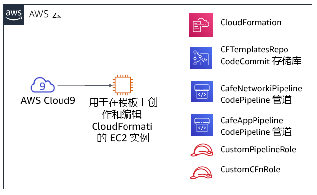
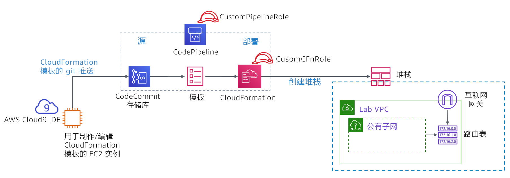

# 模块 10 – 挑战实验：实现基础设施部署自动化

## 场景

目前为止，咖啡馆员工主要通过使用 AWS 管理控制台来手动创建 AWS 资源和配置应用程序。这种方法有效帮助咖啡馆快速展开了网络业务。但是，他们发现将其部署复制到新的 AWS 区域，以便能够支持多个国家/地区的新咖啡馆运营点颇具挑战。此外，他们还希望拥有独立的、具有可靠匹配配置的开发和生产环境。

在本挑战实验中，您将扮演 Sofía 的角色，完成咖啡馆的自动部署，并将其复制到另一个 AWS 区域。


## 实验概览和目标

在本实验中，您将体验如何创建 AWS CloudFormation 模板。您将使用这些模板创建和更新 AWS CloudFormation 堆栈。这些堆栈会创建和管理 AWS 账户中多个 AWS 服务领域中的资源更新。您将练习使用 AWS CodeCommit 来控制模板版本。您还将了解如何使用 AWS CodePipeline 来自动执行堆栈更新。

完成本实验后，您应能够：

* 使用 AWS CloudFormation 模板部署 Virtual Private Cloud (VPC) 网络层

* 使用 AWS CloudFormation 模板部署应用程序层

* 使用 Git 调用 AWS CodePipeline，并通过存储在 AWS CodeCommit 中的模板创建或更新堆栈

* 使用 AWS CloudFormation 将网络和应用程序资源复制到另一个 AWS 区域


当您*启动*实验时，以下资源已经在 AWS 账户中为您创建好了：



请注意，在本挑战实验中，部分任务并没有提供分步说明。您必须自己弄清楚如何完成这些任务。


## 持续时间

完成本实验大约需要 **90 分钟**。


## AWS 服务限制

在本实验环境中，对 AWS 服务和服务操作的访问可能仅限于完成实验说明所需的服务和服务操作。如果您尝试访问其他服务或执行本实验中所述之外的操作，可能会遇到错误。


## 访问 AWS 管理控制台

1. 在这些说明的顶部，选择 <span id="ssb_voc_grey">Start Lab</span>（启动实验）即可启动您的实验。

   **Start Lab**（启动实验）面板随即会打开，其中显示了实验状态。

   <i class="fas fa-info-circle"></i> **提示**：如果您需要延长计时器上显示的实验完成时间，请再次选择 <span id="ssb_voc_grey">Start Lab</span>（启动实验）按钮，以重新启动环境计时器。这一操作不会删除您已创建的资源。

2. 请耐心等待，直到您看到消息 *Lab status: ready*（实验状态：就绪），然后选择 **X** 关闭 **Start Lab**（启动实验）面板。

3. 在这些说明的顶部，选择 <span id="ssb_voc_grey">AWS</span>。

   AWS 管理控制台将会在一个新的浏览器选项卡中打开。您将自动登录系统。

   **提示**：如果未打开新的浏览器选项卡，您的浏览器顶部通常会出现一个横幅或图标，并显示一条消息，指明您的浏览器阻止该了网站打开弹出窗口。请选择横幅或图标，然后选择 **Allow pop-ups**（允许弹出窗口）。

4. 排列 AWS 管理控制台选项卡，使其与这些说明一起显示。理想情况下，您将同时打开两个浏览器选项卡，以便能够更轻松地执行实验步骤。

   **注意**：您也可以通过清除屏幕顶部的 **Terminal**（终端）框来隐藏终端窗口。


## 业务请求：使用 AWS CloudFormation 为咖啡馆创建一个静态网站（挑战 1）

咖啡馆希望开始使用 AWS CloudFormation 在 AWS 账户中创建和维护资源。在此流程的初次简单尝试中，您将扮演 Sofía 的角色，创建一个简单的 AWS CloudFormation 模板，以便用于创建 Amazon Simple Storage Service (Amazon S3) 存储桶。然后，您将向模板添加更多细节，以便在更新堆栈时，它会对存储桶进行配置，以托管咖啡馆的静态网站。


### 任务 1：从头创建 AWS CloudFormation 模板

在这第一个任务中，您将创建一个 AWS CloudFormation 模板，以用来创建 S3 存储桶。然后，您将运行创建 AWS CloudFormation 堆栈的 AWS 命令行界面 (AWS CLI) 命令。（堆栈是用于创建存储桶的资源。）


5. 导航到 AWS Cloud9 服务并打开现有 AWS Cloud9 实例的集成开发环境 (IDE)。


6. 在 AWS Cloud9 IDE 中，选择 **File > New File**（文件 > 新建文件），然后选择 **File > Save**（文件 > 保存），并将新文件另存为：`S3.yaml`


7. 在文件顶部，添加以下两行内容：

   ```yaml
      AWSTemplateFormatVersion: "2010-09-09"
      Description:
      ```


8. 接下来，将以下三行添加到您的模板中：

   ```yaml
      Resources:
        S3Bucket:
          Type: AWS::S3::Bucket
      ```

   **提示**：请确保为每个缩进级别保留正确的空格数。`Resources:` 行不应缩进。`S3Bucket:` 行应缩进 2 个空格。最后，`Type: AWS::S3::Bucket` 行应缩进 4 个空格。

   <i class="fas fa-info-circle"></i> AWS CloudFormation 支持 YAML 1.1 版规范，但也有少数例外。有关 YAML 的更多信息，请访问 [YAML 网站](http://www.yaml.org/)。


9. 在 **Description:** 行中添加描述（例如`“cafe S3 template”`）。在开始添加描述之前，请确保冒号 (:) *后面*留有一个空格。输入描述后，请将更改**保存**到文件中。

   <i class="fas fa-info-circle"></i> 在本模块前面的指导实验中，您使用 AWS 管理控制台创建了一个 AWS CloudFormation 堆栈。在这里，您要改用 AWS CLI。


10. 在 Bash 终端，运行以下两行代码：

    ```bash
       aws configure get region
       aws cloudformation create-stack --stack-name CreateBucket --template-body file://S3.yaml
       ```

    您运行的第一行代码返回了安装在 AWS Cloud9 实例上的 AWS CLI 客户端的默认 AWS 区域。您可以通过运行 `aws configure` 来修改默认 AWS 区域。但是，在本实验中，您应保留默认区域。

    您运行的第二行代码创建了一个使用您定义的模板的堆栈。由于您未在命令中指定区域，因此堆栈将在默认区域中创建。

    如果 `create-stack` 命令成功运行，您应该会看到一些 JavaScript 对象表示法 (JSON) 格式的输出。此输出应指明 *StackId*。

    下图显示了您刚刚完成的操作。

    

11. 在 AWS 管理控制台中，导航到 AWS CloudFormation 服务并查看 *CreateBucket* 堆栈的详细信息。

    例如，查看 **Events**（事件）、**Resources**（资源）、**Outputs**（输出）和 **Template**（模板）选项卡中的信息。


12. 导航到 Amazon S3 服务页面，查看模板创建的存储桶。

   **提示**：存储桶的名称为 *createbucket-s3bucket-&lt;random-string&gt;*。


#### 回答有关 AWS CloudFormation 堆栈的问题

完成实验后，选择蓝色的 **Submit**（提交）按钮，答案将被记录下来。


13. 查看本实验中的问题。
    - 选择 <span id="ssb_voc_grey">Details <i class="fas fa-angle-down"></i></span>（详细信息）菜单，然后选择 <span id="ssb_voc_grey">Show</span>（显示）。
    - 选择页面底部的 **Access the multiple choice questions**（查看多项选择题）链接。


14. 在您加载的页面中，提交以下每个问题的答案：

    - **问题 1**：即使您没有为 S3 存储桶指定名称，是否也已创建存储桶？如果是，存储桶的名称是什么？

    - **问题 2**：存储桶是在哪个区域中创建的，为什么在此区域中创建存储桶？

    - **问题 3**：要定义 S3 存储桶，您需要在模板文件的 `Resources:` 部分输入多少行代码？

    **注意**：请将显示问题的浏览器选项卡保持打开状态，以便稍后在实验中返回查看。


### 任务 2：将存储桶配置为网站并更新堆栈

在下一个任务中，您将更新 AWS CloudFormation 模板。此更新将配置 S3 存储桶来托管静态网站。此任务与模块 3 挑战实验的结果相似。在模块 3 挑战实验中，您使用 AWS 管理控制台手动创建和配置了 S3 存储桶。但是，在本实验中，您将改用 AWS CloudFormation 模板来配置存储桶。


15. 将静态网站资产上传到存储桶。

    要执行此任务，请在 Bash 终端运行以下命令（将 &lt;*bucket-name*&gt 替换为您的实际存储桶名称）：

    ```bash
       wget https://aws-tc-largeobjects.s3-us-west-2.amazonaws.com/ILT-TF-200-ACACAD-20-EN/mod10-challenge/static-website.zip
       unzip static-website.zip -d static
       cd static
       aws s3 cp --recursive . s3://<bucket-name>/ --acl public-read
       ```

    如果成功完成这些操作，您应该会在命令输出中看到许多 *upload:&lt;file_name&gt;* 消息。


16. 在新的浏览器选项卡中，打开用于定义 S3 存储桶资源的 AWS CloudFormation 模板文档。

    - 转到<a href="https://docs.aws.amazon.com/AWSCloudFormation/latest/UserGuide/aws-template-resource-type-ref.html">AWS 资源和属性类型参考</a>文档

    - 向下滚动，选择 **Amazon S3**，然后选择 **AWS::S3::Bucket** 资源类型。


17. 参考文档，修改您的 S3.yaml 模板，以在 S3 存储桶资源上设置以下特征：

    - 附加将保留存储桶的*删除策略*

    - 配置存储桶，以托管将 *index.html* 设置为索引文档的静态网站，

       <i class="fas fa-info-circle"></i> **提示**：您可以通过向模板额外添加两行代码来完成此任务。请参阅您在上一步中打开的文档页面的 *Examples*（示例）部分中的代码。


18. 在 AWS CloudFormation 模板中，添加可提供网站 URL 的 *output*。

    请再次参阅文档的 **Examples**（示例）部分。


19. 将更改保存到 S3.yaml 文件中。


20. 验证模板

    返回 Bash 终端，将目录更改回 S3.yaml 文件的位置，然后运行以下命令验证您的模板。

    ```bash
       cd ../
       aws cloudformation validate-template --template-body file://S3.yaml
       ```

    如果输出显示模板存在语法或其他错误，请更正它们，然后再次运行命令，验证错误是否已得到解决。


21. 运行以下命令，更新堆栈：

    ```bash
       aws cloudformation update-stack --stack-name CreateBucket --template-body file://S3.yaml
       ```

    **提示**：正确的 YAML 语法非常重要。如果您在运行 `update-stack` 时收到 *ValidationError*，请检查冒号的使用是否正确并确认是否对每行进行了正确缩进。文档中的示例模板为结构良好的 YAML 模板提供了很好的参考。


22. 浏览到 AWS CloudFormation 服务并确认您的堆栈更新已成功完成。

    - 堆栈状态应显示为 *UPDATE_COMPLETE*。
    - 如果堆栈未达到 *UPDATE_COMPLETE* 状态，请尝试执行以下问题排查技巧。
       - 如果您看到堆栈具有类似 *ROLLBACK* 的状态，请转到 **Events**（事件）选项卡并搜索 *UPDATE_FAILED* 条目。（阅读该事件的 *Status*（状态）原因，了解堆栈为何更新失败。）
       - 在您认为已解决所有错误后，请再次运行 `update-stack` 命令。在控制台中，返回 AWS CloudFormation 堆栈，然后转到 **Events**（事件）选项卡，确认是否已成功更新堆栈。
       - 如果需要，请重复这些步骤。


23. 验证成功。

    - 堆栈的 **Outputs**（输出）选项卡是否列出了带有 URL 值的输出？如果已列出，请选择链接。

    - 静态网站是否已打开？（您之前已将网站资产复制到存储桶中。）

       如果已打开，恭喜您！

       **注意：**如果堆栈没有任何输出，或者输出超链接未显示咖啡馆网站的内容，您可以尝试执行以下问题排查技巧。

       - 浏览到 Amazon S3 控制台并选择您的存储桶。**Overview**（概览）选项卡应列出 index.html 文件以及两个名为 *css* 和 *images* 的文件夹。如果这些资源未列出，您可能需要重新查看本挑战实验的第一步。

       - 选择 **index.html** 文件，然后选择 **Permissions**（权限）。在 **Public access**（公共访问）下，**Read object**（读取对象）的值应为 *Yes*（是）。

       - 返回存储桶视图。在 **Properties**（属性）选项卡中，确认 <i class="fas fa-check-circle" style="color:purple"></i> **Static website hosting**（静态网站托管）已启用，**Hosting type**（托管类型）为 *Bucket hosting*（存储桶托管）。

       - 应在 S3.yaml 模板中对此列表中描述的所有权限和属性进行设置。如有必要，请调整模板中的详细信息，并再次运行 `update-stack` AWS CLI 命令。

          **注意：**在第一个挑战中，您将网站文件手动复制到了存储桶中。此外，您还可以使用 AWS CloudFormation 中的自定义资源并结合 AWS Lambda 函数来执行此操作。这两种资源都可以在 AWS CloudFormation 模板中进行定义。这种方法是 AWS CloudFormation 的更高级用法，不在本实验范畴之内。但是，如果您对此主题感兴趣，可以参阅 AWS 文档中的 [AWS Lambda 支持的自定义资源](https://docs.aws.amazon.com/AWSCloudFormation/latest/UserGuide/template-custom-resources-lambda.html)页面。


## 新业务要求：将模板存储在版本控制系统中（挑战 2）

Sofía 使用 AWS CloudFormation 模板配置了整个静态网站，这给咖啡馆团队留下了深刻印象。鉴于这一成功，该团队决定扩大基础设施即代码 (IaC) 的使用范围，在 AWS 账户中构建其他应用程序资源。

该团队发现最佳实践是将 IaC 模板存储在版本控制系统中，因此他们请 Sofía 接受这项挑战。Mateo 路过咖啡馆时，Sofía 与他讨论了这项新的业务要求。Mateo 提到，对于存储模板和管理模板的版本控制，AWS CodeCommit 会是个不错的选择。Mateo 创建了一个 CodeCommit 存储库，其中包含一些 AWS CloudFormation 示例模板。Sofía 迫切希望使用这个代码存储库。


### 任务 3：克隆包含 AWS CloudFormation 模板的 CodeCommit 存储库

在此任务中，您将以 Sofía 的身份克隆 CodeCommit 存储库。咖啡馆团队将使用存储库来存储和控制 AWS CloudFormation 模板的版本。


24. 浏览到 CodeCommit 服务，然后在您的账户中，您会看到名为 *CFTemplatesRepo* 的存储库。


<i class="fas fa-info-circle"></i> CodeCommit 是一项源代码控制服务，可用于托管基于 Git 的存储库。它的使用方法类似于 GitHub 存储库。有关 AWS CodeCommit 的详细信息，请参阅 [AWS 文档](https://aws.amazon.com/codecommit/)。


25. 选择 **CFTemplatesRepo**，然后选择 **templates** 文件夹。

    请注意，其中包含 AWS CloudFormation 模板。

    <i class="fas fa-info-circle"></i> 在本实验的这一部分中，您要将 IaC AWS CloudFormation 模板存储在 CodeCommit 中。


26. 打开 *CFTemplatesRepo/templates/**start-lab.yaml*** 文件并分析内容。

    - 请注意，此模板定义了您在此 AWS 账户中看到的一些资源。

    - 例如：

       - 从第 6 行开始，此模板定义了一个 *AWS Cloud9 实例*
       - 从第 12 行开始，此模板定义了您现在已经打开的 *CodeCommit 存储库*

       <i class="fas fa-info-circle"></i> 选择 **Start Lab**（启动实验）后，托管此实验的实验平台即会创建一个 AWS CloudFormation 堆栈。它运行的 AWS CloudFormation 模板包括此模板中包含的资源定义。但是，此示例模板并不包含用于启动此实验的*实际*模板中的所有资源定义。


27. 在页面顶部的面包屑导航中，选择 **Repositories**（存储库），然后在 **Clone URL**（克隆 URL）列中选择 **HTTPS**。

    <i class="fas fa-info-circle"></i> 这一操作会将 CodeCommit 存储库的 HTTPS 克隆 URL 复制到剪贴板中。


28. 返回 AWS Cloud9 IDE 并将现有 CodeCommit 存储库克隆到您的工作区（将 &lt;*url*&gt 替换为您复制的克隆 URL）

    在 AWS Cloud9 IDE 的 Bash 终端，输入以下命令：

    ```bash
       git clone <url>
       ```

    此命令会克隆您刚才看到的 CodeCommit 存储库的副本。该命令会创建一个 *CFTemplatesRepo* 目录；现在，该目录应显示在导航窗格（即 IDE 中的左窗格）中。

    使用 Git 客户端软件分析存储库的本地副本。

    ```bash
       cd CFTemplatesRepo
       git status
       ```

    

    `git status` 命令显示了您连接到的存储库的分支。它还显示您的本地副本随 CodeCommit 中的源分支保持最新版本。


## 新业务要求：使用持续交付服务，为咖啡馆创建网络和应用程序层（挑战 3）

Sofía 要接受的下一项挑战是使用 AWS CloudFormation 来创建动态网站咖啡馆应用程序可以部署到的所有网络资源。然后，她必须部署咖啡馆应用程序本身。

此外，Sofía 希望找到一种更简单的方法来在更新 AWS CloudFormation 模板时更新堆栈。她现在定期更新模板，她认为应该可以自动更新堆栈。

Sofía 与 Mateo 讨论了这个问题。Mateo 表示，AWS CodePipeline 可以提供她想要的持续集成和持续交付 (CI/CD) 服务功能。然后，Mateo 为 Sofía 创建了两条管道，她迫切希望开始使用。

在这项挑战中，您将以 Sofía 的身份使用这些管道。您还将在 AWS CloudFormation 模板中定义部署动态咖啡馆网站所需的所有资源。


### 任务 4：使用 AWS CloudFormation、CodeCommit 和 CodePipeline 创建新的网络层

在此任务中，您将使用 AWS CloudFormation 模板创建 VPC 及公有子网和其他网络资源。您将体验如何使用 CI/CD 管道。当您使用 Git 将模板推送到 CodeCommit 存储库时，它将触发创建 AWS CloudFormation 堆栈的管道。


29. 创建一个新的 AWS CloudFormation 模板，该模板将创建 VPC、公有子网和其他资源。

    - 在 AWS Cloud9 IDE 的导航窗格中，展开 **CFTemplatesRepo/templates** 目录。

    - 在 **templates** 目录中，右键单击 `template1.yaml` 并创建一个副本。

    - 将副本重命名为：`cafe-network.yaml`

    - 在文本编辑器中，打开 cafe-network.yaml 并将描述设置为：`Network layer for the cafe`

    - 查看此模板创建的七个资源的详细信息。


30. 查看在您的账户中预配置的 AWS CodePipeline 详细信息。

    - 在 AWS 管理控制台中，从 <span id="ssb_services">Services <i class="fas fa-angle-down"></i></span>（服务）菜单中选择 **CodePipeline**。

    - 选择 **Pipelines**（管道）。

    - 请注意，已为您预定义了两条管道：

       - CafeAppPipeline
       - CafeNetworkPipeline

       <i class="fas fa-exclamation-triangle"></i> **重要提示**：在最近尝试运行时，每个管道的状态都显示失败。不过，这种状态在预料之中。管道引用的 AWS CloudFormation 模板文件不在预期位置。


31. 分析 CafeNetworkPipeline 的 *Source*（源）阶段。

    - 选择 **CafeNetworkPipeline** 并查看管道详细信息。

       在 **Source**（源）区域中，您可以看到此管道的 **SourceAction** 是 *AWS CodeCommit*。

    - 在 **SourceAction** 标题的右侧，选择 <i class="fas fa-info-circle"></i>

       **Configuration**（配置）窗口中的详细信息显示源是 *CFTemplatesRepo* CodeCommit 存储库。

    - 要返回 **CafeNetworkPipeline** 页面，请选择 **Done**（完成）。


32. 分析 CafeNetworkPipeline 的 *Deploy*（部署）阶段。

    - 请注意，通过使用 AWS CloudFormation 来执行 *Deploy*（部署）操作。

    - 在 **RunChangeSet** 标题的右侧，选择 <i class="fas fa-info-circle"></i>

       **分析**：**Configuration**（配置）窗口中的详细信息显示将运行或更新名为 *update-cafe-network* 的堆栈。要执行这些操作，堆栈将使用 cafe-network.yaml AWS CloudFormation 模板。此 *Deploy*（部署）操作从 *Source*（源）阶段接收模板，后者在 CodeCommit 存储库中找到该模板。

       下图说明了您将如何触发此管道以及管道将执行哪些操作。它还显示了生成的 AWS CloudFormation 堆栈将创建或更新的一些 AWS 账户资源。

    

    <i class="fas fa-info-circle"></i> 有关 AWS CodePipeline 的更多详细信息，请参阅 [AWS 文档](https://aws.amazon.com/codepipeline/)。


33. 返回 AWS Cloud9 实例，通过将 AWS CloudFormation 模板签入 CodeCommit 来触发 *update-cafe-network* 的创建。

    - 观察存储库本地副本与源存储库的不同。在 Bash 终端，运行以下命令：

    ```bash
    git status
    ```

    输出应显示当前在 Git 中未跟踪您创建的 cafe-network.yaml 文件。

    - 运行这两个命令以将新文件添加到存储库，然后将其提交到存储库并添加注释。

    ```bash
    git add templates/cafe-network.yaml
    git commit -m 'initial commit of network template' templates/cafe-network.yaml
    ```

    - 检查存储库本地副本的状态：

    ```bash
    git status
    ```

    返回的信息应报告您的分支比源存储库多一个提交。

    - 最后，将提交推送到远程存储库（此命令实际上会将文件复制到 CodeCommit）：

    ```bash
    git push
    ```


34. 返回 CodePipeline 控制台，然后选择 **CafeNetworkPipeline**。

    - 注意堆栈创建操作是自动触发的。

    **注意：***Source*（源）阶段可能需要一两分钟才能更新，*Deploy*（部署）阶段可能需要一两分钟时间才会显示*正在进行*。最终，*Deploy*（部署）阶段状态应显示为 *Succeeded*（成功）。

    - 请注意，*Source*（源）和 *Deploy*（部署）的详细信息显示了运行 `git push` 时返回的提交编号。详细信息还显示了您添加到提交中的注释。


问题排查技巧：

- 如果 *Deploy*（部署）步骤的状态为 *Failed - Just now*（失败 – 刚刚），请打开 **Details**（详细信息）链接，查看错误详细信息。例如，可能模板格式存在错误，必须解决。
- 更新模板后，您可以通过再次运行相应的 `git commit` 和 `git push` 命令来更新堆栈。
   - **Release change**（发布更改）按钮还可以触发管道再次运行。即使您未对 CodeCommit 存储库进行更改（例如发出 `git push` 命令），它也会如此操作。
   - 同样，您可以在管道的 *Deploy*（部署）阶段使用 **Retry**（重试）按钮。它将重试 *Deploy*（部署）阶段，而不会重试 *Source*（源）阶段。
- 如果堆栈无法回滚，并且阻止您对堆栈执行其他更新，则可以删除堆栈。为此，请转到 AWS CloudFormation 控制台中的堆栈页面，删除堆栈。如果删除网络堆栈，请向 Git 推送一个新的更新。此操作将触发堆栈的重新创建。


35. 在 AWS CloudFormation 控制台中，确认 *update-cafe-network* 堆栈已运行。它的状态应为 *CREATE_COMPLETE* 或 *UPDATE_COMPLETE*。

   此外，请查看堆栈的 **Outputs**（输出）选项卡。它目前显示没有任何输出。但是，您将很快更新堆栈，以便它创建输出。


36. 在 Amazon VPC 控制台中，您会注意到 cafe-network.yaml 模板中定义的资源是在 AWS 账户中创建的。

    例如，控制台应列出名为 *Cafe VPC* 的 VPC 和名为 *Cafe Public Subnet* 的子网。

    恭喜！您已成功创建运行咖啡馆网站所需的网络资源。


### 任务 5：更新网络堆栈

在此任务中，您将更新网络堆栈，以便它导出自己创建的两个资源的基本信息。您稍后创建的应用程序堆栈可以引用这两个输出。


37. 在 *cafe-network.yaml* 底部添加以下行：

```YAML
Outputs:
  PublicSubnet:
    Description: The subnet ID to use for public web servers
    Value:
      Ref: PublicSubnet
    Export:
      Name:
        'Fn::Sub': '${AWS::StackName}-SubnetID'
  VpcId:
    Description: The VPC ID
    Value:
      Ref: VPC
    Export:
      Name:
        'Fn::Sub': '${AWS::StackName}-VpcID'
```


38. 保存更改并在 Bash 终端添加和提交代码，然后使用 Git 将其推送到 CodeCommit。


39. 验证 AWS CloudFormation 堆栈是否已更新。另请验证 **Outputs**（输出）选项卡现在列出了两个带有导出名称的键。

| 名称 | 导出名称 |
| --- | ------ |
| *PublicSubnet* | *update-cafe-network-SubnetID* |
| *VpcId* | *update-cafe-network-VpcID* |


### 任务 6：定义 EC2 实例资源并创建应用程序堆栈

在此任务中，您将创建一个新的 AWS CloudFormation 模板，以用于创建堆栈。新堆栈会为咖啡馆部署一个动态网站。当您将 cafe-app.yam 模板推送到 CodeCommit 存储库时，*CafeAppPipeline* 管道（您之前看到过）会创建或更新 *update-cafe-app* 堆栈。


40. 返回 AWS Cloud9，复制模板目录中的 **template2.yaml** 文件，然后将副本重命名为 `cafe-app.yaml`。


41. 在 cafe-app.yaml 模板中，分析现有模板内容：

    - 在 **Parameters**（参数）区域中，**LatestAmiId** 将执行查找。它在您创建堆栈的 AWS 区域中查找最新的 Amazon Linux 2 Amazon 系统映像 (AMI) ID。在定义 Amazon Elastic Compute Cloud (Amazon EC2) 实例时，您可以引用它。
    - 同样在 **Parameters**（参数）区域中，**CafeNetworkParameter** 定义了一个字符串值。它的默认值是您在运行 cafe-network.yaml AWS CloudFormation 模板时创建的堆栈的名称。如果必须引用另一个堆栈中的资源，将此字符串设置为参数可让您灵活地指向不同的堆栈名称。
    - 在 **Mappings**（映射）区域中，定义 EC2 实例时可以引用 **RegionMap** 映射。使用此映射可以帮助确保实例使用正确的密钥对。但是，此功能的使用取决于运行模板时所在的 AWS 区域。
    - 在 **Resources**（资源）区域中，定义了一个 **EC2 安全组**。它可为入站网络流量打开 TCP 端口 80 和 22。它是在 *update-cafe-network* 堆栈创建的 VPC 中创建的。
    - 在 **Outputs**（输出）区域中，名为 **WebServerPublicIP** 的输出将返回您接下来要定义的 EC2 实例的公有 IPv4 地址。


42. 在 cafe-app.yaml 模板中，定义第三个*参数*，以便用户在启动 EC2 实例时可以选择不同的实例类型。

    - 浏览到 [AWS 文档](https://docs.aws.amazon.com/AWSCloudFormation/latest/UserGuide/parameters-section-structure.html)。在*在模板中定义参数*部分下，复制示例 YAML 参数。

    - 将参数粘贴到模板中。然后修改参数，使允许的实例类型为 *t2.micro*、*t2.small*、*t3.micro* 和 *t3.small*。此外，将默认值设置为 `t2.small` 并更新描述，以便显示用户可以选择的选项。


43. 在新的浏览器选项卡中，打开 [AWS 文档](https://docs.aws.amazon.com/AWSCloudFormation/latest/UserGuide/aws-properties-ec2-instance.html)并将该页面中的信息作为参考。


44. 回到 cafe-app.yaml 模板，创建具有以下特征的新 *EC2 实例*资源：

    - 将 **Logical ID**（逻辑 ID）设置为 `CafeInstance`（如果需要，请参考 https://docs.aws.amazon.com/AWSCloudFormation/latest/UserGuide/resources-section-structure.html）

    - 包括一个引用 *LatestAmiId* 参数的 **ImageId**

    - 对于 **instance type**（实例类型），请参考您在之前步骤中定义的实例类型参数。

    - 对于 **KeyName**，请使用以下代码行，其中引用了模板中已定义的 RegionMap 映射：

      ```yaml
            KeyName: !FindInMap [RegionMap, !Ref "AWS::Region", keypair]
            ```

    - 对于 **instance profile**（实例配置文件）（AWS Identity and Access Management (IAM)，附加到实例的角色），请指定 `CafeRole`

       **注意**：您的账户中已存在 CafeRole IAM 角色。附加它将授予 EC2 实例从 AWS Systems Manager 检索参数仓库值的权限。

    - 在 **Properties**（属性）部分中，包括以下代码行：

      ```yaml
            NetworkInterfaces:
              - DeviceIndex: '0'
                AssociatePublicIpAddress: 'true'
                SubnetId: !ImportValue
                  'Fn::Sub': '${CafeNetworkParameter}-SubnetID'
                GroupSet:
                  - !Ref CafeSG
            ```

       - **分析**：前面的几行有助于确保将实例部署到运行咖啡馆网络堆栈时创建的*公有子网*中。请注意，在此任务开始时，您更新了网络堆栈以定义带有*导出*名称的输出。在上述代码中，您*导入*了 **SubnetId** 的值。上述代码还有助于确保您创建的实例位于已在此模板中为您定义的 *CafeSG* 安全组中。

    - 设置一个*键*为 *Name*、*值*为 *Cafe Web Server* 的**标签**

       - **提示：**了解如何将 *Name* 标签应用于已在模板中定义的安全组资源。

    - 在 **Properties**（属性）部分中，包括以下附加 **UserData** 代码：

      ```yaml
              UserData:
                Fn::Base64:
                  !Sub |
                    #!/bin/bash
                    yum -y update
                    yum install -y httpd mariadb-server wget
                    amazon-linux-extras install -y lamp-mariadb10.2-php7.2 php7.2
                    systemctl enable httpd
                    systemctl start httpd
                    systemctl enable mariadb
                    systemctl start mariadb
                    wget https://aws-tc-largeobjects.s3-us-west-2.amazonaws.com/ILT-TF-200-ACACAD-20-EN/mod10-challenge/cafe-app.sh
                    chmod +x cafe-app.sh
                    ./cafe-app.sh
            ```

      **分析**：上述代码在启动过程结束时在实例上运行。它会在 Amazon Linux 实例上安装 Apache HTTP Web 服务器、MariaDB 数据库和 PHP。接下来，它启动 Web 服务器和数据库。然后，下载一个名为 cafe-app.sh 的脚本并运行它。cafe-app 脚本对数据库进行配置并安装使咖啡馆网站正常运行的 PHP 代码。


45. 当您对模板更新感到满意后，保存更改。要在 Bash 终端验证模板格式，请运行以下命令：

   ```bash
       aws cloudformation validate-template --template-body file:///home/ec2-user/environment/CFTemplatesRepo/templates/cafe-app.yaml
       ```

    如果您收到 JSON 格式的响应，而且其中包含在模板顶部定义的三个参数，则表明模板已通过验证。但是，如果您收到 *ValidationError* 响应（或其他某种错误响应），则必须纠正此问题。然后，保存更改并再次运行 `validate-template` 命令。


46. 如果模板已通过验证检查，请将文件添加到 CodeCommit。在 Bash 终端，运行 `git` 命令来添加文件、提交文件并将其推送到存储库。

    <i class="fas fa-info-circle"></i> **提示**：请参阅任务 3 中的 Git 命令，这或许能为您提供帮助。但是，请记住，在此任务中，您想要推送到 CodeCommit 的模板的名称是不同的。


47. 返回 CodePipeline 控制台并选择 **CafeAppPipeline**。

    **注意**：Source（源）阶段可能需要一两分钟才能更新，Deploy（部署）阶段可能需要一两分钟时间才会显示*正在进行*。最终，Deploy（部署）阶段状态应显示为 *Succeeded - Just now*（成功 – 刚刚）。

    - 如果状态显示失败，请尝试以下问题排查技巧。

       - 如果您看到 *Deploy*（部署）阶段的状态为*Failed - Just now*（失败 – 刚刚），请选择 **Details**（详细链接）来打开错误信息。它可能会提供一个链接，供您查看 AWS CloudFormation 堆栈详细信息。（转到 **Events**（事件）选项卡，找出导致堆栈回滚的第一个错误）。
       - 如果堆栈无法回滚，或者堆栈状态为 *ROLLBACK_COMPLETE*，并阻止您使用管道更新堆栈，则您可以从 AWS CloudFormation 堆栈页面中删除堆栈。然后，将新的更新推送到 Git，触发重新创建堆栈。


48. 在 AWS CloudFormation 控制台中，确认 *update-cafe-app* 堆栈已成功运行，且状态为 *CREATE_COMPLETE*。


49. 转到 Amazon EC2 控制台。您会看到已经创建了 EC2 实例和安全组资源（在 cafe-app.yaml 模板中定义）。


50. EC2 实例启动并通过两个状态检查后，测试咖啡馆网站。在浏览器选项卡中，加载以下 URL，其中 &lt;*public-ip-address*&gt; 是您定义的 EC2 实例的*公有 IPv4 地址*：`http://<public-ip-address>/cafe`


    您应该可以看到咖啡馆网站。

    提示：您定义的用户数据脚本详细信息可能需要 2 分钟左右的时间才能完成运行。如果您没有立即看到网站，请耐心等待。

    请注意，网站会显示服务器信息，例如正在运行 Web 服务器的区域和可用区。

    恭喜！您已使用 CI/CD 管道和 IaC 方法部署了网络层和应用程序层。


#### 回答有关创建应用程序层的结果的问题

51. 返回显示本实验多项选择题的浏览器选项卡，并回答以下问题。

    - **问题 4：**转到 *update-cafe-app* 堆栈的 **Parameters**（参数）选项卡。您看到的 **LatestAmiId** 值是什么？

    - **问题 5：**转到 *update-cafe-app* 堆栈的 **Stack info**（堆栈信息）选项卡。授权“创建和更新 *update-cafe-app* 堆栈”的 IAM 角色的 Amazon 资源名称 (ARN) 是什么？

    - **问题 6：**在 AWS 管理控制台中，导航到存储 AWS CloudFormation 模板的 CodeCommit 存储库。选择 **Commits**（提交），然后在 **Commits**（提交）列表中，选择一个提交 ID，打开提交。您看到了什么？


## 新业务要求：在另一个 AWS 区域中复制网络和应用程序资源（挑战 4）

对于能够使用 AWS CloudFormation 为动态咖啡馆网站创建网络层和应用程序层，Sofía 感到非常高兴。让她更开心的是，她刚刚获悉咖啡馆员工还希望她将这些资源复制到另一个 AWS 区域。

Sofía 很快就会体验到她为在 AWS CloudFormation 模板中定义资源和配置付出的努力带来的好处。她还会发现，通过 IaC 方法复制环境比手动创建所有资源要更轻松。


### 任务 7：将咖啡馆网络和网站复制到另一个 AWS 区域

在这个最后的实验任务中，您将体验到复制部署的速度有多快。之所以可以实现快速部署，是因为您在 AWS CloudFormation 模板中定义了所有资源。

在任务 4、5 和 6 中，AWS CloudFormation 堆栈的创建或更新都是自动进行的。定义了一个管道来监控 CodeCommit 存储库的更新时间。然后，它调用 AWS CloudFormation 来创建或更新堆栈。但是，在此任务中，您将使用 AWS CLI 在另一个 AWS 区域中复制咖啡馆网络资源。然后，您将使用 AWS CloudFormation 控制台在另一个区域中创建应用程序堆栈。


52. 返回 AWS Cloud9 IDE，运行以下命令，以将咖啡馆*网络*复制到另一个 AWS 区域：

    ```bash
       aws cloudformation create-stack --stack-name update-cafe-network --template-body file:///home/ec2-user/environment/CFTemplatesRepo/templates/cafe-network.yaml --region us-west-2
       ```

    它应该返回一个 *StackID*。请注意，您可以通过在运行命令时指定区域来覆盖用于创建此堆栈的默认区域。


53. 浏览到 AWS CloudFormation 控制台，将区域更改为 **US West (Oregon) us-west-2**（美国西部（俄勒冈）us-west-2）。

    - 应该会列示 *update-cafe-network* 堆栈

    - 验证第二个 *update-cafe-region* 堆栈的状态最终是否更改为 *CREATE_COMPLETE*

      <i class="fas fa-info-circle"></i> **提示**：使用 <i class="fas fa-sync"></i> 刷新图标，可以在操作完成后，更快地看到状态更改。


54. 浏览导 Amazon VPC 服务页面，并确认您使用的是**俄勒冈**区域 (*us-west-2*)。

    您应该能够看到创建的网络资源。


55. 在**俄勒冈**区域 (*us-west-2*) 中，创建一个名为 `cafe-oregon` 的 EC2 密钥对。

    - 浏览到 Amazon EC2 控制台并确认您处于**俄勒冈**区域。
    - 在导航窗格中，选择 **Network & Security > Key Pairs**（网络与安全 > 密钥对）
    - 选择 **Create key pair**（创建密钥对）。
    - 将密钥对命名为 `cafe-oregon`，然后再次选择 **Create key pair**（创建密钥对）。

      **提示**：您可以选择保存密钥对，也可以选择 **Cancel**（取消）。在本实验中，无需使用密钥对。但是，在典型的使用案例中，您必须保存密钥对，否则之后将无法保存。


56. 再次查看应用程序模板详细信息。

    - 返回 AWS Cloud9 IDE 并在文本编辑器中查看 **cafe-app.yaml** 模板的详细信息。
    - 请注意 EC2 实例资源定义中的 **KeyName** 属性。它引用在模板中定义的 **RegionMap** 映射。
    - 映射表明，如果实例在 *us-east-1（弗吉尼亚北部）区域*启动，则应使用 *vockey 密钥对*。但是，如果实例在 *us-west-2（俄勒冈）区域*启动，则应使用您刚刚创建的 *cafe-oregon 密钥对*。
    - 另请注意您之前定义的 **InstanceTypeParameter**。它在 **AllowedValues** 区域提供了一些实例类型选项，但它也将默认值设置为 *t2.small*。稍后您将用到这一配置。


57. 在 AWS Cloud9 IDE 中，将模板文件复制到 S3 存储桶。（在以下命令中，将 &lt;*repobucket-bucketname*&gt; 替换为您账户中 S3 存储桶的实际名称。它的名称应该包含字符串 *repobucket*。）

    ```bash
       aws s3 cp templates/cafe-app.yaml s3://<repobucket-bucketname>/
       ```


58. 在 Amazon S3 控制台中，复制刚上传的文件的 **Object URL**（对象 URL）（这是一个 *https* 地址）。


59. 在 AWS CloudFormation 控制台中，将区域更改为 **俄勒冈** (*us-west-2*)。


60. 创建堆栈（使用新资源）。

    - 在 **Create stack**（创建堆栈）界面的 **Amazon S3 URL** 框中，粘贴刚刚复制的对象 URL。

    - 在下一个界面（**Specify stack details**（指定堆栈详细信息））–
       - **Stack name**（堆栈名称）：输入相应的名称
       - **InstanceTypeParameter**：*t3.micro*

      请注意，您可以在创建堆栈时设置实例类型，因为您在 AWS CloudFormation 模板中将其定义为参数。

    - 进入其余界面（接受所有默认设置），然后完成堆栈的创建。

    - 验证是否已成功创建堆栈。


61. 浏览到 Amazon EC2 控制台并查看创建的资源。

    - 务必给 Web 服务器几分钟时间来完成启动并运行用户数据脚本。
    - 请注意实例使用的*密钥对*和实例类型。这些设置与在 *us-east-1* 区域中运行的 Web 服务器上的设置不同。您使用了同一模板来启动此堆栈，*但未对其进行修改*。
    - 完全启动服务器后，您应该能够访问网站 `http://<public-ip-address>/cafe`（其中 &lt;*public-ip-address*&gt; 是 EC2 实例的公有 IPv4 IP 地址）。
    - 请注意，网站上的服务器信息显示咖啡馆网站的第二个实例正在 *us-west-2* 区域运行。您创建的第一个 Web 服务器显示它正在 *us-east-1* 区域中运行。


## 咖啡馆更新


由于刚刚学会如何操作，Sofía 思如泉涌！

她使用 AWS CloudFormation 成功部署了咖啡馆网站的静态版本。然后，她成功地将动态咖啡馆网站部署为 Web 应用程序。对于动态网站，Sofía 采用了使用 AWS CodeCommit、AWS CodePipeline 和 AWS CloudFormation 的 CI/CD 管道。此外，她还将网络资源和咖啡馆应用程序资源复制到了另一个 AWS 区域。

Sofía 想象着如何将 AWS CloudFormation 模板应用于*备份和灾难恢复 (DR)* 解决方案。她刚刚体验了如何快速地重建基本的咖啡馆基础设施。如果她的生产部署出于任何原因失败，她现在可以快速重建或复制。

Sofía 还考虑了现在如何快速启动*测试环境*的问题。她确信测试环境的配置详细信息可与生产环境相匹配。她还可以通过使用参数和映射等功能来专门控制测试环境与生产环境的不同之处。

实现开发运维的自动化将带来诸多好处。Sofía 现在计划将自动化和 CI/CD 管道作为其团队开发、测试和部署咖啡馆云资源更新的核心。


## 提交作业

62. 在这些说明的顶部，选择 <span id="ssb_blue">Submit</span>（提交）记录您的进度，在出现提示时，选择 **Yes**（是）。


63. 如果在几分钟后仍未显示结果，请返回到这些说明的顶部，并选择 <span id="ssb_voc_grey">Grades</span>（成绩）

    **提示**：您可以多次提交作业。更改作业后，再次选择 **Submit**（提交）即可。您最后一次提交的作业将记录为本实验的成绩。


64. 要查找有关您作业的详细反馈，请选择 <span id="ssb_voc_grey">Details</span>（详细信息），然后选择 <i class="fas fa-caret-right"></i> **View Submission Report**（查看提交报告）。


## 实验完成

<i class="icon-flag-checkered"></i> 恭喜！您已完成实验。


65. 若要确认您想结束实验，请选择此页面顶部的 <span id="ssb_voc_grey">End Lab</span>（结束实验），然后选择 <span id="ssb_blue">Yes</span>（是）。

    此时应显示一个面板，并显示消息：*DELETE has been initiated... You may close this message box now.*（删除操作已启动...您现在可以关闭此消息框。）


66. 选择右上角的 **X** 关闭面板。


*©2020 Amazon Web Services, Inc. 及其附属公司。保留所有权利。未经 Amazon Web Services, Inc. 事先书面许可，不得复制或转载本文的部分或全部内容。禁止商业性复制、出租或出售。*
