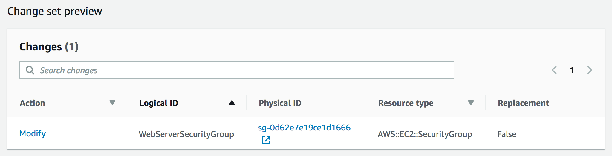

# Módulo 10 - Laboratorio guiado: Automatización de la implementación de infraestructura con AWS CloudFormation

[//]: # "SKU: ILT-TF-200-ACACAD-2    Source Course: ILT-TF-100-ARCHIT-6 branch dev_65"

## Información general y objetivos del laboratorio

Implementar la infraestructura de manera uniforme y confiable es difícil. Requiere que las personas sigan procedimientos documentados sin tomar atajos no registrados. Además, puede ser complicado implementar la infraestructura fuera de horario cuando hay menos personal disponible. AWS CloudFormation modifica esta situación, ya que define la infraestructura en una plantilla que se puede implementar automáticamente, incluso en una programación automatizada.

En este laboratorio, aprenderá cómo implementar varias capas de infraestructura con AWS CloudFormation y cómo actualizar y eliminar una pila de CloudFormation (mientras conserva algunos recursos).

Después de completar este laboratorio, debería ser capaz de lo siguiente:

- Utilizar AWS CloudFormation para implementar una capa de red de nube privada virtual (VPC)
- Utilizar AWS CloudFormation para implementar una capa de aplicación que haga referencia a la capa de redes
- Explorar las plantillas con AWS CloudFormation Designer
- Eliminar una pila que tiene una política de eliminación

<br/>

## Duración

El tiempo estimado para completar este laboratorio es de **20 minutos**.

<br/>

## Restricciones de los servicios de AWS

En este entorno de laboratorio, el acceso a los servicios y las acciones de los servicios de AWS puede restringirse a los que se necesiten para cumplir las instrucciones del laboratorio. Es posible que se produzcan errores si intenta acceder a otros servicios o hacer acciones que no sean las que se describen en este laboratorio.

<br/>

## Acceso a la consola de administración de AWS

1. En la parte superior de estas instrucciones, elija <span id="ssb_voc_grey">Start Lab</span> (Iniciar laboratorio) y comience a trabajar en él.

   Se abrirá el panel **Start Lab** (Iniciar laboratorio), donde se muestra el estado del laboratorio.

   <i class="fas fa-info-circle"></i> **Sugerencia**: Si necesita más tiempo para completar el laboratorio, vuelva a hacer clic en el botón <span id="ssb_voc_grey">Start Lab</span> (Iniciar laboratorio) para reiniciar el temporizador del entorno.

2. Espere hasta que en el panel **Start Lab** (Iniciar Laboratorio) se muestre el mensaje *Lab Status: ready (Estado del laboratorio: listo)* y, luego, cierre el panel haciendo clic en la **X**.

3. En la parte superior de estas instrucciones, elija <span id="ssb_voc_grey">AWS</span>.

   Con esta acción, se abrirá la consola de administración de AWS en una nueva pestaña del navegador, y el sistema iniciará su sesión de forma automática.

   <i class="fas fa-exclamation-triangle"></i> **Sugerencia**: Si no se abre una nueva pestaña del navegador, por lo general habrá un aviso o un icono en la parte superior, el cual indicará que el navegador impide que el sitio abra ventanas emergentes. Haga clic en el aviso o el icono y elija **Allow pop ups** (Permitir ventanas emergentes).

4. Ubique la pestaña de la **consola de administración de AWS** de modo que aparezca junto con estas instrucciones. El método más óptimo sería tener ambas pestañas del navegador abiertas al mismo tiempo para que pueda seguir los pasos del laboratorio más fácilmente.

   <i class="fas fa-exclamation-triangle"></i> **No cambie la región a menos que se le indique expresamente que debe hacerlo**.

<br/>

## Tarea 1: Implementar una capa de red

Se trata de una recomendación de las prácticas recomendadas para implementar una infraestructura en _capas_. Las capas comunes son las siguientes:

- Red (Amazon VPC)
- Base de datos
- Aplicación

De esta forma, las plantillas se pueden volver a utilizar entre sistemas. Por ejemplo, puede implementar una topología de red común entre entornos de desarrollo, pruebas y producción, o implementar una base de datos estándar para varias aplicaciones.

En esta tarea, implementará una plantilla de AWS CloudFormation que crea una _capa de redes_ a través de Amazon VPC.

5. Haga clic derecho en el siguiente enlace y descargue la plantilla [lab-network.yaml](../../../scripts/lab-network.yaml) en su equipo.

   <i class="fas fa-comment"></i> Si desea ver cómo se definen los recursos de AWS, puede abrir la plantilla en un editor de texto.

   Las plantillas se pueden escribir en el lenguaje de notación de objetos JavaScript (JSON) o YAML Ain't Markup Language (YAML). YAML es un lenguaje de marcado similar a JSON, pero es más fácil de leer y editar.

6. En la **consola de administración de AWS**, encontrará el menú <span id="ssb_services">Services<i class="fas fa-angle-down"></i></span> (Servicios), donde debe seleccionar **CloudFormation**.

7. Si ve este mensaje, haga clic en <span style="color:blue">Try it out now and provide us feedback (Pruébelo ahora y envíenos sus comentarios)</span>:

   

8. Elija <span id="ssb_orange">Create stack</span> (crear pila) y configure estos ajustes.

   **Paso 1: Especificar la plantilla**

   - **Template source** (Origen de la plantilla): <span id="ssbox_cloudformation_blue"><i class="far fa-dot-circle" style="color:#007dbc;"></i> Upload a template file</span> (Cargar un archivo de plantilla)
   - **Upload a template file** (Cargar un archivo de plantilla): haga clic en <span id="ssb_ssm_white">Choose file</span> (Elegir archivo) y seleccione el archivo **lab-network.yaml** que descargó.
   - Elija <span id="ssb_orange">Next</span> (Siguiente).

   **Paso 2: Crear pila**

   - **Stack name** (Nombre de la pila): `lab-network`
   - Elija <span id="ssb_orange">Next</span> (Siguiente).

   **Paso 3: Configurar las opciones de la pila**

   - En la sección **Tags** (Etiquetas), escriba estos valores.
      - **Key** (Clave): `application`
      - **Value** (Valor): `inventory`
   - Elija <span id="ssb_orange">Next</span> (Siguiente).

   **Paso 4: Revisar lab-network**

   - Elija <span id="ssb_orange">Create stack</span> (crear pila).

   AWS CloudFormation ahora utilizará la *plantilla* para generar un *pila* de recursos en la cuenta de AWS.

   Las *etiquetas* especificadas se propagan automáticamente a los recursos que se crean, lo que facilita la identificación de los recursos utilizados por las aplicaciones particulares.

9. Haga clic en la pestaña **Stack info** (Información de la pila).

10. Espere a que **Status** (estado) cambie a <span style="color: green;"><i class="far fa-check-circle"></i>CREATE_COMPLETE</span>.

    <i class="fas fa-comment"></i>Si es necesario, haga clic en **Refresh** (Actualizar)<i class="fas fa-redo"></i> cada 15 segundos para actualizar la pantalla.

    A partir de ahora, puede examinar los recursos que se crearon.

11. Elija la pestaña **Resources** (Recursos).

    Verá una lista de los recursos creados por la plantilla.

    <i class="fas fa-comment"></i> Si la lista está vacía, actualice la lista seleccionando **Refresh** (Actualizar)<i class="fas fa-redo"></i>.

12. Haga clic en la pestaña **Events** (Eventos) y desplácese a través del registro de eventos.

    El registro de eventos muestra (desde los eventos más recientes a los menos recientes) las actividades realizadas por AWS CloudFormation. Algunos ejemplos incluyen empezar a crear un recurso y, luego, completar la creación. Todo error que se produzca durante la creación de la pila se mostrará en esta pestaña.

13. Elija la pestaña **Outputs** (Resultados).

    Una pila de CloudFormation puede proporcionar _información de los resultados_, como el ID de los recursos específicos y enlaces a los recursos.

    Se enumeran dos resultados.

    - **PublicSubnet:**  El ID de la subred pública que se creó (por ejemplo: _subnet-08aafd57f745035f1__
    - **VPC:** El ID de la VPC que se creó (por ejemplo: _vpc-08e2b7d1272ee9fb4_)

    Los resultados también se pueden utilizar para proporcionar valores a otras pilas. Esto se muestra en la columna **Export name** (Nombre de exportación). En este caso, la VPC y los ID de subred reciben nombres de exportación para que otras pilas puedan recuperar los valores. Estas otras pilas pueden crear recursos dentro de la VPC y la subred que se acaban de crear. Utilizará estos valores en la siguiente tarea.

14. Elija la pestaña **Template** (Plantilla).

    Esta pestaña muestra la plantilla que se utilizó para crear la pila, es decir, la plantilla que cargó mientras creaba la pila. Examine la plantilla y vea los recursos que se crearon. También explore la sección **Outputs** (Resultados) al final (esta sección define qué valores exportar).

<br/>
## Tarea 2: Implementar una capa de aplicación

Ahora que ha implementado la _capa de red_, ha llegado el momento de implementar una _capa de aplicación_ que contenga una instancia de Amazon Elastic Compute Cloud (Amazon EC2) y un grupo de seguridad.

La plantilla de AWS CloudFormation _importará_ la VPC y los ID de subred desde la sección _Outputs (Resultados)_ de la pila de CloudFormation existente. A continuación, utilizará esta información para crear el grupo de seguridad en la VPC y la instancia EC2 en la subred.

15. Haga clic derecho en el siguiente enlace y descargue la plantilla en su equipo: [lab-application.yaml](../../../scripts/lab-application.yaml)

    <i class="fas fa-comment"></i> Si desea ver cómo se definen los recursos, puede abrir la plantilla en un editor de texto.

16. En el panel de navegación izquierdo, elija **Stacks** (Pilas).

17. Seleccione **Create stack > With new resources (standard)** (Crear pila > Con nuevos recursos [estándar]), y, a continuación, configure estos ajustes.

    **Paso 1: Especificar la plantilla**

    - **Template source** (Origen de la plantilla): <span id="ssbox_cloudformation_blue"><i class="far fa-dot-circle" style="color:#007dbc;"></i> Upload a template file</span> (Cargar un archivo de plantilla)
    - **Upload a template file** (Cargar un archivo de plantilla): Haga clic en <span id="ssb_ssm_white">Choose file</span> (Seleccionar archivo) y seleccione el archivo **lab-application.yaml** que descargó.
    - Elija <span id="ssb_orange">Next</span> (Siguiente)

    **Paso 2: Crear pila**

    - **Stack name** (Nombre de la pila): `lab-application`
    - **NetworkStackName** (Nombre de la pila de red): `lab-network`
    - Seleccione <span id="ssb_orange">Next</span> (Siguiente)

    <i class="fas fa-comment"></i> El parámetro _Network Stack Name (Nombre de la pila de red)_ indica a la plantilla el nombre de la pila que creó primero (_lab-network_) para que esta pueda recuperar los valores de la sección _Outputs (Resultados)_.

    **Paso 3: Configurar las opciones de la pila**

    - En la sección **Tags** (Etiquetas), escriba estos valores.
    - **Key** (clave): `application`
    - **Value** (valor): `inventory`
    - Seleccione <span id="ssb_orange">Next</span> (Siguiente)

    **Paso 4: Revisar la aplicación de laboratorio**

    - Haga clic en <span id="ssb_orange">Create stack</span> (Crear pila)

    Mientras se está creando la pila, examine los detalles en la pestaña **Events** (Eventos) y en la pestaña **Resources** (Recursos). Puede monitorear el progreso del proceso de creación de recursos y el estado del recurso.

18. En la pestaña **Stack info** (Información de la pila), espere a que **Status** (Estado) cambie a <span style="color: green;"><i class="far fa-check-circle"></i>CREATE_COMPLETE</span>.

La aplicación ya está lista.

19. Elija la pestaña **Outputs** (Resultados).

20. Copie la **URL** que se muestra y, a continuación, abra una nueva pestaña del navegador web, pegue la URL y presione INTRO.

    La pestaña del navegador abrirá la aplicación, que se está ejecutando en el servidor web que creó esta nueva pila de CloudFormation.

    Una pila de CloudFormation puede utilizar valores de referencia de otra pila de CloudFormation. Por ejemplo, esta parte de la plantilla _lab-application_ hace referencia a la plantilla _lab-network_:

    ```yaml
      WebServerSecurityGroup:
        Type: AWS::EC2::SecurityGroup
        Properties:
          GroupDescription: Enable HTTP ingress
          VpcId:
            Fn::ImportValue:
              !Sub ${NetworkStackName}-VPCID
    ```

    La última línea utiliza el _nombre de pila de red_ que proporcionó (_lab-network_) cuando se creó la pila. Importa el valor de _lab-network-VPCID_ desde _Outputs (Resultados)_ de la primera pila. A continuación, inserta el valor en el campo del ID de VPC de la definición del grupo de seguridad. El resultado es que el grupo de seguridad se crea en la VPC creada por la primera pila.

    Este es otro ejemplo, que está en la plantilla CloudFormation que acaba de utilizar para crear la pila de aplicaciones. Este código de plantilla coloca la instancia EC2 en la subred creada por la pila de red:

    ```yaml
      SubnetId:
        Fn::ImportValue:
        !Sub ${NetworkStackName}-SubnetID
    ```

    Toma el _ID de subred_ de la pila _lab-network_ (red del laboratorio) y lo utiliza en la pila _lab-application_ (aplicación del laboratorio) para lanzar la instancia en la subred pública que creó la primera pila.


<br/>
## Tarea 3: Actualizar una pila

AWS CloudFormation también puede _actualizar_ una pila que se ha implementado. Cuando actualiza una pila, AWS CloudFormation solo modificará o reemplazará los recursos que se están modificando. Cualquier recurso que no modifique quedará como está.

En esta tarea, actualizará la pila _lab-application_ (aplicación del laboratorio) para modificar un parámetro en el grupo de seguridad.

En primer lugar, deberá examinar la configuración actual en el grupo de seguridad.

21. En la **consola de administración de AWS**, encontrará el menú <span id="ssb_services">Services<i class="fas fa-angle-down"></i></span> (Servicios), donde debe elegir **EC2**.

22. En el panel de navegación izquierdo, elija **Security Groups** (Grupos de seguridad).

23. Elija la casilla de verificación de <i class="far fa-check-square"></i> **lab-application-WebServerSecurityGroup...**.

24. Elija la pestaña **Inbound rules** (Reglas de entrada).

    El grupo de seguridad actualmente solo tiene una regla. La regla permite el tráfico _HTTP_.

    Ahora volverá a AWS CloudFormation para actualizar la pila.

25. En el menú <span id="ssb_services">Services<i class="fas fa-angle-down"></i></span> (Servicios), elija **CloudFormation**.

26. Haga clic derecho en este enlace y descargue la plantilla actualizada [lab-application2.yaml](../../../scripts/lab-application2.yaml) en su equipo.

    Esta plantilla tiene una configuración adicional para permitir el tráfico entrante de Secure Shell (SSH) en el puerto 22:

    ```yaml
      - IpProtocol: tcp
        FromPort: 22
        ToPort: 22
        CidrIp: 0.0.0.0/0
    ```

27. En la lista **Stacks** (Pilas) de la **consola de AWS CloudFormation**, elija **lab-application**.

28. Elija <span id="ssb_ssm_white">Update</span> (Actualizar) y configure estos ajustes.

    - Elija <span id="ssbox_cloudformation_blue"><i class="far fa-dot-circle" style="color:#007dbc;"></i>Replace current template</span> (Reemplazar plantilla actual).
    - **Template source** (Origen de la plantilla): <span id="ssbox_cloudformation_blue"><i class="far fa-dot-circle" style="color:#007dbc;"></i> Upload a template file</span> (Cargar un archivo de plantilla)
    - **Upload a template file** (Cargar un archivo de plantilla): Haga clic en <span id="ssb_ssm_white">Choose file</span> (Elegir archivo) y seleccione el archivo **lab-application2.yaml** que descargó.

29. Elija <span id="ssb_orange">Next</span> (Siguiente) en cada una de las *tres* pantallas siguientes para avanzar a la página **Review lab-application** (Revisar lab-application).

    En la sección **Change set preview** (Vista previa del conjunto de cambios) de la parte inferior de la página, AWS CloudFormation muestra los recursos que se actualizarán

    

    Esta vista previa del conjunto de cambios indica que AWS CloudFormation *modificará* *WebServerSecurityGroup* sin necesidad de reemplazarlo (_Replacement = False_). Este conjunto de cambios significa que al grupo de seguridad se le aplicará un cambio menor y que no será necesario cambiar ninguna referencia al grupo de seguridad.

30. Elija <span id="ssb_orange">Update stack</span> (Actualizar pila).

31. En la pestaña **Stack info** (Información de la pila), espere a que **Status** (Estado) cambie a <span style="color: green;"><i class="far fa-check-circle"></i>UPDATE_COMPLETE</span>.

    <i class="fas fa-comment"></i> Si es necesario, seleccione **Refresh** (Actualizar) <i class="fas fa-redo"></i> cada 15 segundos para actualizar el estado.

    A partir de ahora, puede verificar el cambio.

32. Regrese a la **consola de Amazon EC2** y, en el panel de navegación izquierdo, seleccione **Security Groups** (Grupos de seguridad).

33. En la lista **Security Groups** (Grupos de seguridad), seleccione **lab-application-WebServerSecurityGroup**.

    La pestaña **Inbound rules** (Reglas de entrada) debe mostrar una regla adicional que permita el tráfico _SSH_ a través del _puerto TCP 22_.

    Esta subtarea demuestra cómo se pueden implementar los cambios en un proceso repetible y documentado. Las plantillas de AWS CloudFormation se pueden almacenar en un repositorio de código fuente (como AWS CodeCommit). De esta manera, puede mantener versiones y un historial de las plantillas y la infraestructura que se implementó.


<br/>
## Tarea 4: Explorar las plantillas con AWS CloudFormation Designer

*AWS CloudFormation Designer* es una herramienta gráfica para crear, ver y modificar plantillas de AWS CloudFormation. Con Designer, puede diagramar los recursos de la plantilla mediante una interfaz que permite arrastrar y soltar y, a continuación, editar su información a través del editor JSON y YAML integrado.

Independientemente de si es un usuario principiante o avanzado de AWS CloudFormation, Designer puede ayudarlo a ver rápidamente la interrelación entre los recursos de una plantilla. También le permite modificar plantillas fácilmente.

En esta tarea, obtendrá experiencia práctica con Designer.

34. En el menú <span id="ssb_services">Services (Servicios)<i class="fas fa-angle-down"></i></span>, elija **CloudFormation**.

35. En el panel de navegación izquierdo, elija **Designer**.

    **Sugerencia:** Es posible que necesite expandir el panel de navegación con un clic en el ícono de menú.

[//]: # "I added the previous tip because I couldn't originally find the navigation pane in the console, until I realized that I needed to open it through the menu. I hope this addition is ok. I think it's likely that there's a standard Font Awesome icon for the menu, but unfortunately, I'm not familiar with it :( "

36. Seleccione el menú **File** (Archivos)<i class="fas fa-file"></i>, seleccione **Open > Local file (Abrir > Archivo local)** y seleccione la plantilla **lab-application2.yaml** que descargó previamente.

Designer mostrará una representación gráfica de la plantilla:


En lugar de diagramar una arquitectura típica, Designer es un editor visual para plantillas de AWS CloudFormation, por lo que diseña los recursos definidos en una plantilla y sus relaciones entre sí.

37. Experimente con las características de Designer. Algunas de las cosas que puede intentar son estas:

    - Haga clic en los recursos en pantalla. El panel inferior mostrará, a continuación, la parte de la plantilla que define los recursos.

    - Intente arrastrar un nuevo recurso, desde el panel **Resource types** (Tipos de recursos) de la izquierda, hasta el área de diseño. La definición del recurso se insertará automáticamente en la plantilla.

    - Pruebe arrastrar los círculos conectores de recursos para crear relaciones entre los recursos.

    - Abra la plantilla **lab-network.yaml** que descargó anteriormente en el laboratorio y explore sus recursos en Designer.


<br/>
## Tarea 5: Eliminar la pila

Cuando los recursos ya no son necesarios, AWS CloudFormation puede eliminar aquellos creados para la pila.

También se puede especificar una _política de eliminación (deletion policy)_ en relación con los recursos. Puede conservar o (en algunos casos) hacer una copia de seguridad de un recurso cuando se elimina su pila. Esta característica es útil para conservar bases de datos, volúmenes de disco o cualquier recurso que pueda ser necesario después de eliminar la pila.

La pila _lab-application_ se configuró para tomar una instantánea de un volumen de disco de Amazon Elastic Block Store (Amazon EBS) antes de que se elimine. El código de la plantilla que hace posible esta configuración es el siguiente:

```yaml
  DiskVolume:
    Type: AWS::EC2::Volume
    Properties:
      Size: 100
      AvailabilityZone: !GetAtt WebServerInstance.AvailabilityZone
      Tags:
        - Key: Name
          Value: Web Data
    DeletionPolicy: Snapshot
```

El campo _DeletionPolicy (Política de eliminación)_ en la línea final dirige a AWS CloudFormation a crear una instantánea del volumen de disco antes de que se elimine.

Ahora, eliminará la pila _lab-application_ y veremos los resultados de esta política de eliminación.

38. Vuelva a la **consola principal de AWS CloudFormation** seleccionando el enlace <span style="color:#1166bb">Close (Cerrar)</span> en la parte superior de la página de Designer (seleccione **Leave page** [Abandonar la página] si se le solicita).

39. En la lista de pilas, elija el enlace **lab-application**.

40. Seleccione <span id="ssb_ssm_white">Delete</span> (Eliminar).

41. Seleccione <span id="ssb_orange">Delete stack</span> (Eliminar pila).

    Puede monitorear el proceso de eliminación en la pestaña **Events** (Eventos) y actualizar la pantalla seleccionando **Refresh** (Actualizar) <i class="fas fa-redo"></i> ocasionalmente. También puede ver una entrada del registro de eventos que indica que se está creando la instantánea de EBS.

42. Espere a que se elimine la pila. Desaparecerá de la lista de pilas.

    Se eliminó la pila de aplicaciones __, pero la pila de red permaneció intacta. Este caso refuerza la idea de que diferentes equipos (por ejemplo, el equipo de red o el equipo de aplicaciones) podrían administrar sus propias pilas.

    Ahora comprobará que se creó una instantánea del volumen de EBS antes de que se eliminara el volumen de EBS.

43. En el menú <span id="ssb_services">Services (Servicios)<i class="fas fa-angle-down"></i></span>, seleccione **EC2**.

44. En el panel de navegación izquierdo, seleccione **Snapshots** (Instantáneas).

    Debería ver una instantánea con un tiempo de **inicio** en los últimos minutos.


<br/>

## Envío del trabajo

45. En la parte superior de estas instrucciones, elija <span id="ssb_blue">Submit</span> (Enviar) para registrar su progreso y, cuando se le indique, elija **Yes** (Sí).

46. Si los resultados no se muestran después de algunos minutos, vuelva a la parte superior de estas instrucciones y elija <span id="ssb_voc_grey">Grades</span> (Resultados).

    **Sugerencia**: Puede enviar su trabajo varias veces. Después de realizar las modificaciones pertinentes, vuelva a elegir **Submit** (Enviar). Su último envío es el que se registrará para este laboratorio.

47. Para encontrar comentarios detallados sobre su trabajo, elija <span id="ssb_voc_grey">Details</span> (Detalles) seguido de <i class="fas fa-caret-right"></i> **View Submission Report** (Ver informe de envío).

<br/>

## Fin del laboratorio <i class="fas fa-graduation-cap"></i>

<i class="fas fa-flag-checkered"></i> ¡Felicitaciones! Ha completado el laboratorio.

48. Elija <span id="ssb_voc_grey">End Lab</span> (Finalizar laboratorio) en la parte superior de esta página y, a continuación, seleccione <span id="ssb_blue">Yes</span> (Sí) para confirmar que desea finalizar el laboratorio.

    Un panel presentará el mensaje *DELETE has been initiated… You may close this message box now (Se ha iniciado la ELIMINACIÓN… Ya puede cerrar este cuadro de mensaje)*.

49. Seleccione la **X** de la esquina superior derecha para cerrar el panel.


*© 2020 Amazon Web Services, Inc. y sus empresas afiliadas. Todos los derechos reservados. Este contenido no puede reproducirse ni redistribuirse, total ni parcialmente, sin el permiso previo por escrito de Amazon Web Services, Inc. Queda prohibida la copia, el préstamo y la venta de carácter comercial.*

