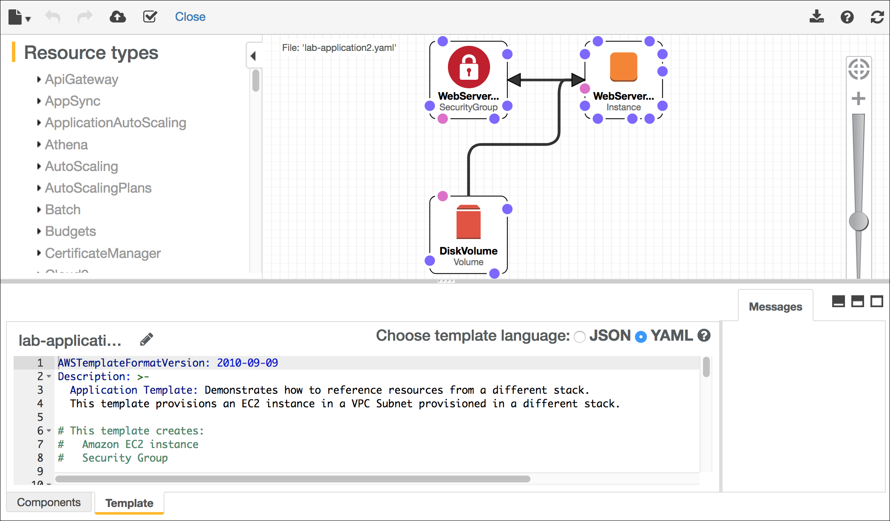

# Modul 10 - Lab Terpandu: Mengotomatisasi Deployment Infrastruktur dengan AWS CloudFormation

[//]: # "SKU: ILT-TF-200-ACACAD-2    Source Course: ILT-TF-100-ARCHIT-6 branch dev_65"

## Gambaran umum dan tujuan lab

Men-deploy infrastruktur secara konsisten dan dapat diandalkan itu sulit. Kita harus mengikuti prosedur terdokumentasi tanpa mengambil jalan pintas yang tidak terdokumentasi. Kita juga akan sulit untuk men-deploy infrastruktur di luar jam kerja ketika hanya mempunyai sedikit staf. AWS CloudFormation mengubah situasi ini dengan menetapkan infrastruktur dalam sebuah templat yang dapat di-deploy secara otomatis—bahkan dalam jadwal yang terotomatisasi.

Pada lab ini, Anda akan mempelajari bagaimana men-deploy beberapa lapisan infrastruktur dengan AWS CloudFormation, memperbarui tumpukan CloudFormation, dan menghapus tumpukan (dengan tetap mempertahankan beberapa sumber daya).

Setelah menyelesaikan lab ini, Anda akan mampu:

- Menggunakan AWS CloudFormation untuk men-deploy lapisan jaringan virtual private cloud (VPC)
- Menggunakan AWS CloudFormation untuk men-deploy lapisan aplikasi yang mereferensikan lapisan jaringan
- Mengeksplorasi templat menggunakan AWS CloudFormation Designer
- Menghapus tumpukan yang memiliki kebijakan penghapusan

<br/>

## Durasi

Diperlukan waktu sekitar **20 menit** untuk menyelesaikan lab ini.

<br/>

## Pembatasan layanan AWS

Dalam lingkungan lab ini, akses ke layanan AWS dan tindakan layanan mungkin dibatasi untuk orang-orang yang diperlukan untuk menyelesaikan instruksi lab. Anda mungkin akan mengalami error jika mencoba mengakses layanan lain atau melakukan tindakan di luar yang dijelaskan di lab ini.

<br/>

## Mengakses Konsol Manajemen AWS

1. Di bagian atas instruksi ini, pilih <span id="ssb_voc_grey">Start Lab</span> (Mulai Lab) untuk meluncurkan lab Anda.

   Panel **Start Lab** (Mulai Lab) terbuka dan menampilkan status lab.

   <i class="fas fa-info-circle"></i> **Tip**: Jika Anda memerlukan lebih banyak waktu untuk menyelesaikan lab, mulai ulang pengatur waktu untuk lingkungan dengan memilih tombol <span id="ssb_voc_grey">Start Lab</span> (Mulai Lab) lagi.

2. Tunggu hingga panel **Start Lab** (Mulai Lab) menampilkan pesan *Lab status: ready* (Status lab: siap), lalu tutup panel dengan memilih **X**.

3. Di bagian atas instruksi ini, pilih <span id="ssb_voc_grey">AWS</span>.

   Tindakan ini akan membuka Konsol Manajemen AWS di tab browser baru. Anda akan masuk ke sistem secara otomatis.

   <i class="fas fa-exclamation-triangle"></i> **Tip**: Jika tab browser baru tidak terbuka, banner atau ikon biasanya berada di bagian atas browser Anda dengan pesan bahwa browser Anda mencegah situs membuka jendela sembulan. Pilih banner atau ikon, lalu pilih **Allow pop-ups** (Izinkan sembulan).

4. Atur tab **AWS Management Console**(Konsol Manajemen AWS) agar ditampilkan bersama instruksi ini. Idealnya, Anda perlu membuka kedua tab browser secara bersamaan, sehingga Anda dapat mengikuti langkah-langkah lab dengan lebih mudah.

   <i class="fas fa-exclamation-triangle"></i> **Jangan mengubah Wilayah kecuali secara khusus diperintahkan untuk melakukannya**.

<br/>

## Tugas 1: Men-deploy lapisan jaringan

Men-deploy infrastruktur dalam _lapisan_ merupakan praktik terbaik. Lapisan-lapisan yang umum yaitu:

- Jaringan (Amazon VPC)
- Basis Data
- Aplikasi

Dengan cara ini, templat dapat digunakan kembali di antara
sistem. Misalnya, Anda dapat men-deploy topologi jaringan umum di antara lingkungan pengembangan, pengujian, dan produksi, atau men-deploy suatu basis data standar untuk beberapa aplikasi.

Dalam tugas ini, Anda akan men-deploy templat AWS CloudFormation yang membuat _lapisan jaringan_ dengan menggunakan Amazon VPC.

5. Klik kanan tautan berikut dan unduh templat ke komputer Anda: [lab-network.yaml](../../../scripts/lab-network.yaml)

   <i class="fas fa-comment"></i> Jika Anda mau, Anda dapat membuka templat di editor teks untuk melihat bagaimana sumber daya AWS ditetapkan.

   Templat dapat ditulis dalam JavaScript Object Notation (JSON) atau YAML Ain't Markup Language (YAML). YAML merupakan bahasa markup yang mirip dengan JSON, tetapi lebih mudah dibaca dan diedit.

6. Di **AWS Management Console** (Konsol Manajemen AWS), dari menu <span id="ssb_services">Services<i class="fas fa-angle-down"></i></span> (Layanan), pilih **CloudFormation**.

7. Jika Anda melihat pesan ini, klik <span style="color:blue">Try it out now and provide us feedback</span> (Coba sekarang dan berikan umpan balik kepada kami):

   

8. Pilih <span id="ssb_orange">Create stack</span> (Buat tumpukan), lalu konfigurasikan pengaturan berikut:

   **Langkah 1: Tentukan templat**

   - **Template source** (Sumber templat): <span id="ssbox_cloudformation_blue"><i class="far fa-dot-circle" style="color:#007dbc;"></i> Upload a template file</span> (Unggah file templat)
   - **Upload a template file** (Unggah file templat): Klik <span id="ssb_ssm_white">Choose file</span> (Pilih file), lalu pilih file **lab-network.yaml** yang Anda unduh.
   - Pilih <span id="ssb_orange">Next</span> (Berikutnya)

   **Langkah 2: Buat Tumpukan**

   - **Stack name** (Nama tumpukan): `lab-network`
   - Pilih <span id="ssb_orange">Next</span> (Berikutnya)

   **Langkah 3: Konfigurasikan opsi tumpukan**

   - Di bagian **Tags** (Tanda), masukkan nilai-nilai ini.
      - **Key** (Kunci): `application` (aplikasi)
      - **Value** (Nilai): `inventory` (inventaris)
   - Pilih <span id="ssb_orange">Next</span> (Berikutnya)

   **Langkah 4: Tinjau jaringan lab**

   - Pilih <span id="ssb_orange">Create stack</span> (Buat tumpukan)

   Sekarang *templat* tersebut akan digunakan oleh AWS CloudFormation untuk menghasilkan *tumpukan* sumber daya di akun AWS.

   *Tanda* yang ditentukan akan secara otomatis disebarkan ke sumber daya yang dibuat, sehingga lebih mudah untuk mengidentifikasi sumber daya yang digunakan oleh aplikasi tertentu.

9. Pilih tab **Stack info** (Info tumpukan).

10. Tunggu **Status** berubah menjadi <span style="color: green;"><i class="far fa-check-circle"></i>CREATE_COMPLETE</span>.

<i class="fas fa-comment"></i> Pilih **Refresh** <i class="fas fa-redo"></i> (Segarkan) setiap 15 detik untuk memperbarui tampilan, jika perlu.

Sekarang Anda dapat memeriksa sumber daya yang telah dibuat.

11. Pilih tab **Resources** (Sumber Daya).

Anda akan melihat daftar sumber daya yang telah dibuat oleh templat tersebut.

<i class="fas fa-comment"></i> Jika daftarnya kosong, perbarui daftar dengan memilih **Refresh** <i class="fas fa-redo"></i> (Segarkan).

12. Pilih tab **Events** (Kejadian) dan gulir ke seluruh log kejadian.

Log kejadian menunjukkan (dari yang terbaru ke yang lama) aktivitas-aktivitas yang dilakukan oleh AWS CloudFormation. Contoh kejadian termasuk mulai membuat sumber daya kemudian menyelesaikan pembuatan sumber daya. Kesalahan apa pun yang ditemukan selama pembuatan tumpukan tersebut akan dicantumkan di tab ini.

13. Pilih tab **Outputs** (Output).

Tumpukan CloudFormation dapat menyediakan _informasi output_, seperti ID sumber daya tertentu dan tautan ke sumber daya.

Dua output terdaftar.

      - **PublicSubnet:**  ID subnet publik yang telah dibuat (misalnya: _subnet-08aafd57f745035f1__
      - **VPC:** ID VPC yang telah dibuat (misalnya: _vpc-08e2b7d1272ee9fb4_)

Output juga dapat digunakan untuk memberikan nilai ke tumpukan lainnya. Ini dapat dilihat di kolom **Export name** (Nama ekspor). Dalam hal ini, ID VPC dan subnet diberikan nama ekspor, sehingga tumpukan-tumpukan lain dapat mengambil nilai-nilainya. Tumpukan-tumpukan lain ini kemudian dapat membangun sumber daya di dalam VPC dan subnet yang baru saja dibuat. Anda akan menggunakan nilai ini pada tugas berikutnya.

14. Pilih tab **Template** (Templat).

Tab ini menampilkan templat yang digunakan untuk membuat tumpukan—yaitu templat yang Anda unggah ketika membuat tumpukan. Jangan ragu untuk memeriksa templat tersebut dan melihat sumber daya yang telah dibuat. Jangan ragu juga untuk mengeksplorasi bagian **Outputs** (Output) di bagian akhir (bagian ini menentukan nilai mana yang akan diekspor).

<br/>
## Tugas 2: Men-deploy lapisan aplikasi

Karena telah men-deploy _lapisan jaringan_, kini Anda akan men-deploy _lapisan aplikasi_ yang berisi instans Amazon Elastic Compute Cloud (Amazon EC2) dan grup keamanan.

Templat AWS CloudFormation akan _mengimpor_ VPC dan subnet ID dari _Outputs_ (Output) tumpukan CloudFormation yang sudah ada. Templat tersebut kemudian akan menggunakan informasi ini untuk membuat grup keamanan di VPC dan instans EC2 di subnet.

15. Klik kanan tautan berikut dan unduh templat ke komputer Anda: [lab-application.yaml](../../../scripts/lab-application.yaml)

<i class="fas fa-comment"></i> Jika Anda mau, Anda dapat membuka templat di editor teks untuk melihat bagaimana sumber daya ditetapkan.

16. Di panel navigasi kiri, pilih **Stacks** (Tumpukan).

17. Pilih **Create stack > With new resources (standard)** (Buat tumpukan > Dengan sumber daya baru (standar)), lalu konfigurasikan pengaturan ini.

**Langkah 1: Tentukan templat**

    - **Template source (Sumber templat):** <span id="ssbox_cloudformation_blue"><i class="far fa-dot-circle" style="color:#007dbc;"></i> Unggah file templat</span>
    - **Upload a template file (Unggah file templat):** Klik <span id="ssb_ssm_white">Choose file</span> (Pilih file) lalu pilih file **lab-application.yaml** yang telah Anda unduh.
    - Pilih <span id="ssb_orange">Next</span> (Berikutnya)

**Langkah 2: Buat Tumpukan**

    - **Stack nama (Nama tumpukan):** `lab-application`
    - **NetworkStackName:** `lab-network`
    - Pilih <span id="ssb_orange">Next</span> (Berikutnya)

<i class="fas fa-comment"></i> Parameter _Network Stack Name_ (Nama Tumpukan Jaringan) memberi tahu kepada templat nama tumpukan pertama yang Anda buat (_lab-network_), sehingga templat tersebut dapat mengambil nilai dari _Outputs_ (Output).

**Langkah 3: Konfigurasikan opsi tumpukan**

    - Di bagian **Tags (Tanda)**, masukkan nilai-nilai ini.
      - **Key (Kunci):** `application`
      - **Value (Nilai):** `inventory`
    - Pilih <span id="ssb_orange">Next</span> (Berikutnya)

**Langkah 4: Meninjau aplikasi lab**

    - Pilih <span id="ssb_orange">Create stack</span> (Buat tumpukan)

Sementara tumpukan sedang dibuat, periksa detail di tab **Events** (Kejadian) dan tab **Resources** (Sumber daya). Anda dapat memantau kemajuan proses pembuatan sumber daya dan status sumber daya.

18. Pada tab **Stack info** (Info tumpukan), tunggu **Status** berubah menjadi <span style="color: green;"><i class="far fa-check-circle"></i>CREATE_COMPLETE</span>.

Aplikasi Anda kini telah siap!

19. Pilih tab **Outputs** (Output).

20. Salin **URL** yang ditampilkan, lalu buka tab browser web baru, tempel URL, dan tekan ENTER.

    Tab browser akan membuka aplikasi tersebut, yang berjalan di server web yang telah dibuat oleh tumpukan CloudFormation yang baru ini.

    Tumpukan CloudFormation juga dapat mereferensikan nilai dari tumpukan CloudFormation lainnya. Misalnya,bagian dari templat _lab-application_ ini mereferensikan templat _lab-network_:

    ```yaml
      WebServerSecurityGroup:
        Type: AWS::EC2::SecurityGroup
        Properties:
          GroupDescription: Enable HTTP ingress
          VpcId:
            Fn::ImportValue:
              !Sub ${NetworkStackName}-VPCID
    ```

    Baris terakhir menggunakan _nama tumpukan jaringan_ yang Anda sediakan (_lab-network_) ketika tumpukan tersebut dibuat. Baris ini mengimpor nilai _lab-network-VPCID_dari _Outputs_ (Output) tumpukan pertama. Baris tersebut kemudian memasukkan nilai ke dalam bidang ID VPC definisi grup keamanan. Hasilnya adalah bahwa grup keamanan dibuat di VPC yang dibuat oleh tumpukan pertama.

    Berikut adalah contoh lainnya, yang ada di templat CloudFormation yang baru saja Anda gunakan untuk membuat tumpukan aplikasi. Kode templat ini menempatkan instans EC2 ke dalam subnet yang dibuat oleh tumpukan jaringan:

    ```yaml
      SubnetId:
        Fn::ImportValue:
        !Sub ${NetworkStackName}-SubnetID
    ```

Kode templat tersebut mengambil _ID subnet_ dari tumpukan _lab-network_ dan menggunakannya dalam tumpukan _lab-application_ untuk meluncurkan instans ke subnet publik, yang telah dibuat oleh tumpukan pertama.


<br/>
## Tugas 3: Memperbarui Tumpukan

AWS CloudFormation juga dapat _memperbarui_ tumpukan yang telah di-deploy. Ketika memperbarui tumpukan, AWS CloudFormation hanya akan memodifikasi atau mengganti sumber daya yang sedang diubah. Sumber daya lainnya yang tidak diubah akan dibiarkan apa adanya.

Dalam tugas ini, Anda akan memperbarui tumpukan _aplikasi lab_ untuk memodifikasi pengaturan di grup keamanan.

Pertama, Anda akan memeriksa pengaturan saat ini untuk grup keamanan.

21. Di **AWS Management Console** (Konsol Manajemen AWS), dari menu <span id="ssb_services">Services <i class="fas fa-angle-down"></i></span> (Layanan), pilih **EC2**.

22. Di panel navigasi kiri, pilih **Security Groups** (Grup Keamanan).

23. Pilih kotak centang untuk <i class="far fa-check-square"></i> **lab-application-WebServerSecurityGroup...**.

24. Pilih tab **Inbound rules** (Aturan masuk).

Saat ini, hanya satu aturan yang ada di grup keamanan. Aturan tersebut mengizinkan lalu lintas _HTTP_.

Anda sekarang akan kembali ke AWS CloudFormation untuk memperbarui tumpukan.

25. Dari menu <span id="ssb_services">Services <i class="fas fa-angle-down"></i></span> (Layanan), pilih **CloudFormation**.

26. Klik kanan tautan berikut dan unduh templat yang telah diperbarui ke komputer Anda: [lab-application2.yaml](../../../scripts/lab-application2.yaml)

    Templat ini memiliki satu konfigurasi tambahan untuk mengizinkan lalu lintas Secure Shell (SSH) yang masuk di port 22:

    ```yaml
      - IpProtocol: tcp
        FromPort: 22
        ToPort: 22
        CidrIp: 0.0.0.0/0
    ```

27. Di daftar **Stacks** (Tumpukan) **konsol AWS CloudFormation**, pilih **lab-application**.

28. Pilih <span id="ssb_ssm_white">Update</span> (Perbarui) dan konfigurasikan pengaturan ini.

   - Pilih <span id="ssbox_cloudformation_blue"><i class="far fa-dot-circle" style="color:#007dbc;"></i> Replace current template</span> (Ganti templat saat ini)
   - **Template source** (Sumber templat): <span id="ssbox_cloudformation_blue"><i class="far fa-dot-circle" style="color:#007dbc;"></i> Upload a template file</span> (Unggah file templat)
   - **Unggah a template file** (Unggah file templat): Klik<span id="ssb_ssm_white">Choose file</span> (Pilih file), lalu pilih file **lab-application2.yaml** yang telah Anda unduh.

29. Pilih <span id="ssb_orange">Next</span> (Berikutnya) pada masing-masing dari *tiga* layar berikutnya untuk melanjutkan ke halaman **Review lab-application** (Tinjauan aplikasi lab).

   Di bagian **Change set preview** (Ubah pratinjau set) di bawah halaman, AWS CloudFormation menampilkan sumber daya yang akan diperbarui:

   

   Perubahan pratinjau set ini menunjukkan bahwa AWS CloudFormation akan *Memodifikasi* *WebServerSecurityGroup* tanpa perlu menggantinya (_Penggantian = False_). Set perubahan ini berarti bahwa grup keamanan akan mengalami perubahan kecil yang diterapkan padanya, dan tidak ada referensi ke grup keamanan yang perlu diubah.

30. Pilih <span id="ssb_orange">Update stack</span> (Perbarui tumpukan)

31. Pada tab **Stack info** (Info tumpukan), tunggu hingga **Status** berubah menjadi <span style="color: green;"><i class="far fa-check-circle"></i>UPDATE_COMPLETE</span>.

   <i class="fas fa-comment"></i> Perbarui status dengan memilih **Refresh** <i class="fas fa-redo"></i> (Segarkan) setiap 15 detik, jika perlu.

   Sekarang Anda dapat memverifikasi perubahan tersebut.

32. Kembali ke **konsol Amazon EC2** dan dari panel navigasi kiri, pilih **Security Groups** (Grup Keamanan).

33. Di daftar **Security Groups** (Grup Keamanan), pilih **lab-application-WebServerSecurityGroup**.

   Tab **Inbound rules** (Aturan masuk) seharusnya akan menampilkan aturan tambahan yang mengizinkan lalu lintas _SSH_ melalui _TCP port _22__.

   Subtugas ini menunjukkan bagaimana perubahan dapat di-deploy dalam suatu proses yang dapat diulang dan terdokumentasi. Templat AWS CloudFormation dapat disimpan dalam repositori kode sumber (seperti AWS CodeCommit). Dengan cara ini, Anda dapat mempertahankan versi dan riwayat templat serta infrastruktur yang di-deploy.


<br/>
## Tugas 4: Mengeksplorasi templat dengan AWS CloudFormation Designer.

*AWS CloudFormation Designer* merupakan alat grafis untuk membuat, melihat, dan memodifikasi templat AWS CloudFormation. Dengan Designer, Anda dapat membuat diagram sumber daya templat Anda dengan menggunakan antarmuka drag-and-drop (seret-dan-lepas), kemudian mengedit detailnya melalui editor JSON dan YAML yang terintegrasi.

Baik Anda baru mengenal AWS CloudFormation maupun seorang pengguna AWS CloudFormation yang sudah berpengalaman, Designer dapat membantu Anda untuk melihat dengan cepat keterkaitan antar sumber daya templat. Designer juga memungkinkan Anda untuk memodifikasi templat dengan mudah.

Dalam tugas ini, Anda akan memperoleh beberapa pengalaman langsung dengan Designer.

34. Dari menu <span id="ssb_services">Services <i class="fas fa-angle-down"></i></span> (Layanan), pilih **CloudFormation**.

35. Di panel navigasi kiri, pilih **Designer**.

**Tip:** Anda mungkin perlu memperluas panel navigasi kiri dengan memilih ikon menu.

[//]: # "I added the previous tip because I couldn't originally find the navigation pane in the console, until I realized that I needed to open it through the menu. I hope this addition is ok. I think it's likely that there's a standard Font Awesome icon for the menu, but unfortunately, I'm not familiar with it :( "

36. Pilih menu **File** <i class="fas fa-file"></i>, pilih **Open (Buka) > Local file (File** lokal)****, dan pilih templat **lab-application2.yaml** yang telah Anda unduh sebelumnya.

Designer akan menampilkan representasi grafis dari templat tersebut:



Designer tidak menggambar diagram arsitektur khusus, tapi merupakan editor visual untuk templat AWS CloudFormation. Designer menggambar sumber daya yang ditentukan dalam suatu templat dan hubungan antar sumber daya tersebut.

37. Bereksperimen dengan fitur Designer. Beberapa hal yang dapat dicoba yaitu:

   - Klik pada sumber daya yang ditampilkan. Panel bawah kemudian akan menampilkan bagian templat yang menentukan sumber daya.

   - Coba seret sebuah sumber daya baru dari panel —dari panel **Resource types** (Jenis sumber daya) di sebelah kiri—ke area desain. Definisi sumber daya akan secara otomatis dimasukkan ke templat.

   - Coba seret lingkaran penghubung sumber daya untuk membuat hubungan antar sumber daya.

   - Buka templat **lab-network.yaml** yang telah Anda unduh sebelumnya di lab dan eksplorasi sumber dayanya juga di dalam Designer


<br/>
## Tugas 5: Menghapus tumpukan

Ketika sumber daya sudah tidak lagi dibutuhkan, AWS CloudFormation dapat menghapus sumber daya yang dibangun untuk tumpukan.

_Kebijakan penghapusan_ juga dapat dikhususkan menurut sumber daya. Kebijakan tersebut dapat mempertahankan atau (dalam beberapa kasus) mencadangkan sumber daya ketika tumpukan dihapus. Fitur ini berguna untuk mempertahankan basis data, volume disk, atau sumber daya yang mungkin diperlukan setelah tumpukan dihapus.

Tumpukan _lab-application_ telah dikonfigurasi untuk mengambil snapshot volume disk Amazon Elastic Block Store (Amazon EBS) sebelum dihapus. Kode pada templat yang menyelesaikan konfigurasi tersebut adalah:

```yaml
  DiskVolume:
    Type: AWS::EC2::Volume
    Properties:
      Size: 100
      AvailabilityZone: !GetAtt WebServerInstance.AvailabilityZone
      Tags:
        - Key: Name
          Value: Web Data
    DeletionPolicy: Snapshot
```

_DeletionPolicy_ pada baris terakhir memerintahkan AWS CloudFormation untuk membuat snapshot volume disk sebelum dihapus.

Sekarang Anda akan menghapus tumpukan _aplikasi lab_ dan melihat hasil kebijakan penghapusan ini.

38. Kembali ke **konsol AWS CloudFormation** utama dengan memilih tautan <span style="color:#1166bb">Close</span> (Tutup) di bagian atas halaman Designer (pilih **Leave page** (Tinggalkan halaman) jika diminta).

39. Pada daftar tumpukan, pilih tautan **lab-application** (aplikasi lab).

40. Pilih <span id="ssb_ssm_white">Delete</span> (Hapus)

41. Pilih <span id="ssb_orange">Delete stack</span> (Hapus tumpukan)

Anda dapat memantau proses penghapusan di tab **Events** (Kejadian) dan memperbarui layar dengan sesekali memilih **Refresh** <i class="fas fa-redo"></i> (Segarkan). Anda mungkin juga melihat entri log kejadian yang menunjukkan bahwa snapshot EBS sedang dibuat.

42. Tunggu hingga tumpukan berhasil dihapus. Tumpukan akan hilang dari daftar tumpukan.

Tumpukan aplikasi__ telah dihapus, tetapi tumpukan jaringan tetap tidak tersentuh. Skenario ini memperkuat gagasan bahwa tim yang berbeda (misalnya, tim jaringan atau tim aplikasi) dapat mengelola tumpukannya masing-masing.

Sekarang Anda akan memverifikasi bahwa snapshot dari volume EBS dibuat sebelum volume EBS dihapus.

43. Dari menu <span id="ssb_services">Services <i class="fas fa-angle-down"></i></span> (Layanan), pilih **EC2**.

44. Di panel navigasi kiri, pilih **Snapshots** (Snapshot).

Anda akan melihat snapshot dengan waktu **Mulai** pada beberapa menit terakhir.


<br/>

## Mengirimkan pekerjaan Anda

45. Di bagian atas instruksi ini, pilih <span id="ssb_blue">Submit</span> (Kirim) untuk merekam kemajuan Anda dan saat diminta, pilih **Yes** (Ya).

46. Jika hasilnya tidak muncul setelah beberapa menit, kembali ke bagian atas instruksi ini dan pilih <span id="ssb_voc_grey">Grades</span> (Nilai)

   **Tip**: Anda dapat mengirimkan pekerjaan Anda beberapa kali. Setelah Anda mengubah pekerjaan, pilih **Submit** (Kirim) lagi. Apa yang akan direkam untuk lab ini adalah pengiriman terakhir Anda.

47. Untuk menemukan detail umpan balik tentang pekerjaan Anda, pilih <span id="ssb_voc_grey">Details</span> (Detail) diikuti oleh <i class="fas fa-caret-right"></i> **View Submission Report** (Lihat Laporan Pengiriman).

<br/>

## Lab selesai <i class="fas fa-graduation-cap"></i>

<i class="fas fa-flag-checkered"></i> Selamat! Anda telah menyelesaikan lab.

48. Pilih <span id="ssb_voc_grey">End Lab</span> (Akhiri Lab) di bagian atas halaman ini, lalu pilih <span id="ssb_blue">Yes</span> (Ya) untuk mengonfirmasi bahwa Anda ingin mengakhiri lab.

   Sebuah panel menunjukkan bahwa *DELETE has been initiated... * (Penghapusan sudah dimulai...) *You may close this message box now.* (Anda dapat menutup kotak pesan ini sekarang.)

49. Pilih **X** di sudut kanan atas untuk menutup panel.


*©2020 Amazon Web Services, Inc. dan afiliasinya. Hak cipta dilindungi undang-undang. Karya ini tidak boleh direproduksi atau didistribusikan ulang, seluruhnya atau sebagian, tanpa izin tertulis sebelumnya dari Amazon Web Services, Inc. Dilarang menyalin, meminjamkan, atau menjual secara komersial.*

