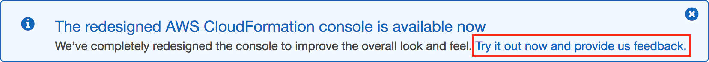

# モジュール 10 - ガイド付きラボ: AWS CloudFormation を使用したインフラストラクチャのデプロイの自動化

[//]: # "SKU: ILT-TF-200-ACACAD-2    Source Course: ILT-TF-100-ARCHIT-6 branch dev_65"

## ラボの概要と目標

一貫性のある信頼性の高い方法でインフラストラクチャをデプロイするのは困難です。文書化されていない簡単な方法ではなく、文書化された手順に従う必要があります。また、スタッフが少ない場合、インフラストラクチャを時間外にデプロイするのは困難です。AWS CloudFormation では、自動スケジュールの場合でも、自動的にデプロイできるテンプレートにインフラストラクチャを定義することでこの状況を変えます。

このラボでは、AWS CloudFormation を使用して複数のインフラストラクチャレイヤーをデプロイし、CloudFormation スタックを更新したり、（一部のリソースを保持しながら）スタックを削除したりする方法について説明します。

このラボを完了すると、次のことができるようになります。

- AWS CloudFormation を使用して Virtual Private Cloud (VPC) ネットワーキングレイヤーをデプロイする
- AWS CloudFormation を使用して、ネットワークレイヤーを参照するアプリケーションレイヤーをデプロイする
- AWS CloudFormation Designer を使用してテンプレートを確認する
- 削除ポリシーのあるスタックを削除する

<br/>

## 所要時間

このラボは、修了までに約 **20 分**かかります。

<br/>

## AWS サービスの制限事項

このラボ環境では、AWS のサービスとサービスアクションへのアクセスが、ラボの手順を完了するために必要なものに制限されています。他のサービスへのアクセスや、このラボで説明されているサービス以外のアクションを実行しようとすると、エラーが発生することがあります。

<br/>

## AWS マネジメントコンソールにアクセスする

1. この手順の上部にある <span id="ssb_voc_grey">Start Lab</span> をクリックし、ラボを起動します。

   [**Start Lab**] パネルが開き、ラボのステータスが表示されます。

   <i class="fas fa-info-circle"></i> **ヒント**: ラボの完了までにさらに時間が必要な場合は、<span id="ssb_voc_grey">Start Lab</span> ボタンをもう一度選択して、この環境のタイマーを再開します。

2. \[**Start Lab**] パネルに **Lab status: ready** というメッセージが表示されたら [**X**] をクリックしてパネルを閉じます。

3. この手順の上部にある <span id="ssb_voc_grey">AWS</span> をクリックします。

   このアクションにより、新しいブラウザタブで AWS マネジメントコンソールが開き、ユーザーは自動的にログインします。

   <i class="fas fa-exclamation-triangle"></i> **ヒント**: 新しいブラウザタブが開かない場合、通常、ブラウザによってサイトのポップアップウィンドウの表示がブロックされたというメッセージが表示されたバナーまたはアイコンがブラウザの上部に表示されます。バナーまたはアイコンを選択して [**ポップアップを許可**] を選択してください。

4. **AWS マネジメントコンソール**タブがこの手順と並べて表示されるようにします。両方のブラウザタブを同時に開いておくと、ラボのステップを実行しやすくなります。

   <i class="fas fa-exclamation-triangle"></i> **特に指示がない限り、リージョンを変更しないでください**。

<br/>

## タスク 1: ネットワークレイヤーをデプロイする

ベストプラクティスは、インフラストラクチャを各**レイヤー**にデプロイすることです。一般的なレイヤーは次のとおりです。

- ネットワーク（Amazon VPC）
- データベース
- アプリケーション

このようにして、テンプレートをシステム間で再利用できます。たとえば、開発、テスト、本番環境で共通のネットワークトポロジをデプロイしたり、複数のアプリケーション用に標準データベースをデプロイしたりできます。

このタスクでは、Amazon VPC を使用して**ネットワークレイヤー**を作成する AWS CloudFormation テンプレートをデプロイします。

5. 次のリンクを右クリックしてテンプレートをコンピュータにダウンロードします。[lab-network.yaml](../../../scripts/lab-network.yaml)

   <i class="fas fa-comment"></i> AWS リソースがどのように定義されているかを確認するには、テキストエディタでテンプレートを開きます。

   テンプレートは JSON (JavaScript Object Notation) または YAML (YAML Ain't Markup Language) で記述できます。YAML は JSON に類似したマークアップ言語ですが、読みやすく、簡単に編集できます。

6. **AWS マネジメントコンソール** の <span id="ssb_services">サービス <i class="fas fa-angle-down"></i></span> で [**CloudFormation**] をクリックします。

7. <span style="color:blue">Try it out now and provide us feedback</span> というメッセージが表示される場合はそれをクリックします。

   

8. <span id="ssb_orange">スタックの作成</span> をクリックして次の設定を構成します。

   **ステップ 1: テンプレートの指定**

   - **テンプレートソース:** <span id="ssbox_cloudformation_blue"><i class="far fa-dot-circle" style="color:#007dbc;"></i> テンプレートファイルのアップロード</span>
   - **テンプレートファイルのアップロード**: <span id="ssb_ssm_white">ファイルの選択</span> をクリックし、ダウンロードした **lab-network.yaml** ファイルを選択します。
   - <span id="ssb_orange">次へ</span>をクリックします。

   **ステップ 2: スタックの詳細を指定**

   - **スタックの名前:** `lab-network`
   - <span id="ssb_orange">次へ</span>をクリックします。

   **ステップ 3: スタックオプションの設定**

   - **タグ** セクションで、次の値を入力します。
      - **キー:** `application`
      - **値:** `inventory`
   - <span id="ssb_orange">次へ</span>をクリックします。

   **ステップ 4: lab-network を確認する**

   - <span id="ssb_orange">スタックの作成</span> をクリックします

   これで、**テンプレート**が AWS CloudFormation で使用され、AWS アカウントにリソースの**スタック**が生成されます。

   指定された**タグ**は作成したリソースに自動的に反映されるため、特定のアプリケーションで使用しているリソースを簡単に識別することができます。

9. \[**スタックの情報**]タブをクリックします。

10. \[**ステータス**] が <span style="color: green;"><i class="far fa-check-circle"></i> CREATE_COMPLETE</span    > に変わるまで待ちます。

    <i class="fas fa-comment"></i> 必要に応じて 15 秒ごとに <i class="fas fa-redo"></i> **更新** アイコンをクリックして表示を更新します。

    これで、作成されたリソースを確認できるようになります。

11. \[**リソース**] タブをクリックします。

    テンプレートによって作成されたリソースのリストが表示されます。

    <i class="fas fa-comment"></i> リストが空の場合は、<i class="fas fa-redo"></i> **更新** をクリックしてリストを更新します。

12. \[**イベント**] タブを選択し、イベントログをスクロールします。

    イベントログには AWS CloudFormation によって実行されたアクティビティ（直近から古いものまで）が表示されます。今回のサンプルスタックのイベントにはリソースの作成を開始し、リソースの作成が完了するまでが含まれています。スタックの作成中に発生したエラーは、このタブに表示されます。

13. \[**出力**] タブをクリックします。

    CloudFormation スタックでは、特定のリソースの ID や、リソースへのリンクといった**出力情報**を確認できます。

    2 つの出力がリストされます。

       - **PublicSubnet:** 作成されたパブリックサブネットの ID（例: **subnet-08aafd57f745035f1**）
      -**VPC:** 作成された VPC の ID（例: **vpc-08e2b7d1272ee9fb4**）

    出力は他のスタックに値を提供するために使用することもできます。これは [**エクスポート名**] 列に表示されます。この場合、VPC とサブネット ID にはエクスポート名が付けられ、他のスタックが値を取得できるようになります。他のスタックでは、先ほど作成した VPC とサブネット内にリソースを構築できます。次のタスクで、これらの値を使用します。

14. \[**テンプレート**]タブをクリックします。

    このタブにはスタックの作成に使用されたテンプレート（スタックの作成時にアップロードしたテンプレート）が表示されます。テンプレートを調べ、作成されたリソースを確認してください。また、最後に [**Outputs Section**] セクションも確認してください（このセクションではエクスポートする値が定義されています）。

<br/>

## タスク 2: アプリケーションレイヤーをデプロイする

これで**ネットワークレイヤー**がデプロイされたので、次は Amazon Elastic Compute Cloud (Amazon EC2) インスタンスとセキュリティグループを含む**アプリケーションレイヤー**をデプロイします。

AWS CloudFormation テンプレートは、既存の CloudFormation スタックの**出力**から VPC とサブネット ID を**インポート**します。次に、この情報を使用して VPC でセキュリティグループを作成し、サブネットで EC2 インスタンスを作成します。

15. 次のリンクを右クリックしてテンプレートをコンピュータにダウンロードします。[lab-application.yaml](../../../scripts/lab-application.yaml)

<i class="fas fa-comment"></i> リソースがどのように定義されているかを確認するには、テキストエディタでテンプレートを開きます。

16. 左側のナビゲーションペインで、 [**スタック**] をクリックします。

17. \[**スタックの作成**] ドロップダウンメニューから [**新しいリソースを使用 (標準)**] を選択し、次の設定を構成します。

    **ステップ 1: テンプレートの指定**

    - **テンプレートソース:** <span id="ssbox_cloudformation_blue"><i class="far fa-dot-circle" style="color:#007dbc;"></i> テンプレートファイルのアップロード</span>
    - **テンプレートファイルのアップロード:** <span id="ssb_ssm_white">ファイルの選択</span> をクリックし、 ダウンロードした **lab-application.yaml** ファイルを選択します。
    - <span id="ssb_orange">次へ</span> をクリックします

    **ステップ 2: スタックの詳細を指定**

    - **スタックの名:** `lab-application`
    - **NetworkStackName:** `lab-network`
    - <span id="ssb_orange">次へ</span> をクリックします

    <i class="fas fa-comment"></i> **ネットワークスタック名** パラメータが、作成した最初のスタック名（**lab-network**）をテンプレートに伝えることで、**出力**から値を取得できます。

    **ステップ 3: スタックオプションの設定**

    - [**タグ**] セクションで、これらの値を入力します。
      - **キー:** `application`
      - **値:** `inventory`
    - <span id="ssb_orange">次へ</span> をクリックします

    **ステップ 4: lab-application を確認する**

    - <span id="ssb_orange">スタックの作成</span> をクリックします

スタックの作成中に、[**イベント**] タブと [**リソース**] タブの詳細を確認します。リソース作成プロセスの進行状況とリソースのステータスを監視できます。

18. \[**スタックの情報**] タブで、[**ステータス**] が <span style="color: green;"><i class="far fa-check-circle"></i> CREATE_COMPLETE</span> に変わるまで待ちます。

これで、アプリケーションの準備ができました。

19. \[**出力**] タブをクリックします。

20. 表示された **URL** をコピーし、新しいウェブブラウザタブを開いてその URL を貼り付け、**Enter** キーを押します。

ブラウザタブに、この新しいCloudFormation スタックが作成されたウェブサーバーで実行されているアプリケーションが開きます。

CloudFormation スタックは別の CloudFormation スタックの参照値を使用できます。たとえば、**lab-application** テンプレートのこの部分は、次のように **lab-network** テンプレートを参照します。

```yaml
      WebServerSecurityGroup:
        Type: AWS::EC2::SecurityGroup
        Properties:
          GroupDescription: Enable HTTP ingress
          VpcId:
            Fn::ImportValue:
              !Sub ${NetworkStackName}-VPCID
```

最後の行では、スタックの作成時に指定した**ネットワークスタック名**（**lab-network**）が使用されます。これは、最初のスタックの**出力**から **lab-network-VPCID の値がインポートされます。次に、セキュリティグループ定義の VPC ID フィールドに値が挿入されます。これにより、セキュリティグループは最初のスタックによって作成された VPC 内に作成されます。

ここでは、アプリケーションスタックの作成に使用した CloudFormation テンプレートにある別の例を示します。このテンプレートコードは、次のようにネットワークスタックによって作成されたサブネットに EC2 インスタンスを配置します。

```yaml
      SubnetId:
        Fn::ImportValue:
        !Sub ${NetworkStackName}-SubnetID
```

**サブネット ID** を **lab-network** スタックから取得し、それを **lab-application** スタックで使用して、最初のスタックで作成したパブリックサブネットにインスタンスを作成します。


<br/>

## タスク 3: スタックを更新する

AWS CloudFormation ではデプロイされたスタックを**更新**することもできます。スタックを更新すると、AWS CloudFormation は変更中のリソースのみを変更または置き換えます。変更されていないリソースはそのまま残されます。

このタスクでは、**lab-application** スタックを更新してセキュリティグループの設定を変更します。

最初に、セキュリティグループの現在の設定を確認します。

21. **AWS マネジメントコンソール**の <span id="ssb_services">サービス <i class="fas fa-angle-down"></i></span> で [**EC2**]をクリックします。

22. 左側のナビゲーションペインで [**セキュリティグループ**] をクリックします。

23. <i class="far fa-check-square"></i> **lab-application-WebServerSecurityGroup...** のチェックボックスをオンにします

24. \[**インバウンドルール**] タブをクリックします。

現在、セキュリティグループには 1 つのルールしかありません。このルールでは **HTTP** トラフィックを許可します。

次に AWS CloudFormation に戻り、スタックを更新します。

25. <span id="ssb_services">サービス <i class="fas fa-angle-down"></i></span> で [**CloudFormation**] をクリックします。

26. 次のリンクを右クリックして、更新されたテンプレートをコンピュータにダウンロードします。[lab-application2.yaml](../../../scripts/lab-application2.yaml)

このテンプレートには、ポート 22 でインバウンド Secure Shell (SSH) トラフィックを許可する追加設定が含まれています。

```yaml
      - IpProtocol: tcp
        FromPort: 22
        ToPort: 22
        CidrIp: 0.0.0.0/0
```

27.  **AWS CloudFormation コンソール**の [**スタック**] リストで、**lab-application** をクリックします。

28. <span id="ssb_ssm_white">更新する</span> をクリックして次の設定を構成します。

    - <span id="ssbox_cloudformation_blue"> <i class="far fa-dot-circle" style="color:#007dbc;"></i> 既存テンプレートを置き換える</span> をクリックします
    - **テンプレートソース:** <span id="ssbox_cloudformation_blue"><i class="far fa-dot-circle" style="color:#007dbc;"></i> テンプレートファイルのアップロード</span>
    - **テンプレートファイルのアップロード**: <span id="ssb_ssm_white">ファイルの選択</span> をクリックし、ダウンロードした **lab-application2.yaml** ファイルを選択します。

29. 次の **3 つ**の画面のそれぞれで <span id="ssb_orange">次へ</span> をクリックして、[**レビュー lab-application**] ページに進みます。

    ページ下部にある [**変更セットのプレビュー**] セクションには、AWS CloudFormation によって次のように更新されるリソースが表示されます。

    

    この変更セットのプレビューは AWS CloudFormation が **WebServerSecurityGroup** を置き換えることなくこれを**変更**することを示しています（**置換 = False**になっています）。この変更セットでは、セキュリティグループに微小な変更が適用され、セキュリティグループへの参照は変更する必要はありません。

30. <span id="ssb_orange">スタックの更新</span> をクリックします

31. \[**スタックの情報**] タブで [**ステータス**] が <span style="color: green;"><i class="far fa-check-circle"></i> UPDATE_COMPLETE</span> に変わるのを待ちます。

    <i class="fas fa-comment"></i> 必要に応じて、15 秒ごとに <i class="fas fa-redo"></i> **更新** をクリックしてステータスを更新します。

    これで変更を確認できます。

32. **Amazon EC2 コンソール**に戻り、左側のナビゲーションペインで [** セキュリティグループ**] をクリックします。

33. **セキュリティグループ** リストで、**lab-application-WebServerSecurityGroup** を選択します。

    [**インバウンドルール**] タブには **TCP ポート 22** を介した **SSH** トラフィックを許可する追加のルールが表示されます。

    このサブタスクでは、繰り返し文書化されたプロセスに変更をデプロイする方法を示しています。AWS CloudFormation テンプレートは、ソースコードリポジトリ（AWS CodeCommit など）に保存できます。これにより、テンプレートとデプロイされたインフラストラクチャのバージョンと履歴を管理できます。


<br/>

## タスク 4: AWS CloudFormation Designer を使用してテンプレートを確認する

**AWS CloudFormation Designer**は、AWS CloudFormation テンプレートを作成、表示、変更するグラフィックツールです。Designer では、ドラッグアンドドロップインターフェイスを使用してテンプレートリソースを図示し、統合された JSON および YAML エディタを使用して詳細を編集できます。

新しい AWS CloudFormation ユーザーでも、経験豊富なユーザーでも、Designer を使用すればテンプレートのリソース間の相互関係をすばやく確認できます。また、テンプレートを簡単に変更できます。

このタスクでは、Designer を実際に使用します。

34. <span id="ssb_services">サービス <i class="fas fa-angle-down"></i></span> で [**CloudFormation**] をクリックします。

35. 左側のナビゲーションペインで [**デザイナー**] をクリックします。

    **ヒント:** メニューアイコンを選択して、左側のナビゲーションペインを開く必要がある場合があります。

    [//]: # "I added the previous tip because I couldn't originally find the navigation pane in the console, until I realized that I needed to open it through the menu. I hope this addition is ok. I think it's likely that there's a standard Font Awesome icon for the menu, but unfortunately, I'm not familiar with it :( "

36. <i class="fas fa-file"></i> **ファイル** メニューから [**開く**] を選択し [**ローカルファイル**] をクリックして、先ほどダウンロードした **lab-application2.yaml** テンプレートを選択します。

    Designer がグラフィカルな形式でテンプレートを表示します。

    

    Designer は、一般的なアーキテクチャ図が表示されるサービスというよりは、AWS CloudFormation テンプレート用のビジュアルエディタです。テンプレートで定義されたリソースやその相互関係が表示されます。

37. Designer の機能を体験します。ここではいくつかの操作をご紹介します。

    - 表示されたリソースをクリックします。下部のペインには、リソースを定義するテンプレートの一部が表示されます。

    - 左側の [**リソースタイプ**] ペインからデザイン領域に新しいリソースをドラッグします。リソースの定義はテンプレートに自動的に挿入されます。

    - リソースのコネクタサークルをドラッグしてリソース間の関係を作成します。

    - ラボで先ほどダウンロードした **lab-network.yaml** テンプレートを開き、Designer でそのリソースも確認します。


<br/>

## タスク 5: スタックを削除する

リソースが不要になった場合、AWS CloudFormation では、スタック用に構築されたリソースを削除できます。

リソースに対して_削除ポリシー_を指定することもできます。スタックが削除されたときに、リソースを保持または（場合によっては）バックアップすることができます。この機能は、データベース、ディスクボリューム、スタックの削除後に必要になる可能性のあるリソースを保持する場合に便利です。

**lab-application** スタックは、削除する前に Amazon Elastic Block Store (Amazon EBS) のディスクボリュームのスナップショットを作成するように設定されています。その設定を行うテンプレート内のコードは次のとおりです。

```yaml
  DiskVolume:
    Type: AWS::EC2::Volume
    Properties:
      Size: 100
      AvailabilityZone: !GetAtt WebServerInstance.AvailabilityZone
      Tags:
        - Key: Name
          Value: Web Data
    DeletionPolicy: Snapshot
```

最後の行の **DeletionPolicy** は、ディスクボリュームのスナップショットを作成してから削除するように AWS CloudFormation に指示します。

**lab-application** スタックを削除して、削除ポリシーの結果を確認します。

38. Designer のページ上部にある <span style="color:#1166bb">閉じる</span> をクリックして、メインの**AWS CloudFormation コンソール**に戻ります（プロンプトが表示されたら [**このページを離れる**] をクリックします）。

39. スタックのリストで、**lab-application** リンクをクリックします。

40. <span id="ssb_ssm_white">削除</span> をクリックします

41. <span id="ssb_orange">スタックの削除</span> をクリックします

[**イベント**] タブで削除プロセスを監視し、<i class="fas fa-redo"></i> **更新** をクリックすると画面を更新できます。また、EBS スナップショットが作成中であることを示すイベントログエントリが表示される場合があります。

42. スタックが削除されるまで待ちます。このスタックがスタックリストから消去されます。

これでアプリケーションスタック __ は削除されましたが、ネットワークスタックは変更されません。このシナリオでは、異なるチーム（ネットワークチームやアプリケーションチームなど）が独自のスタックを管理できるという考えを強化します。

次に、EBS ボリュームが削除される前に、EBS ボリュームのスナップショットが作成されたことを確認します。

43. <span id="ssb_services">サービス<i class="fas fa-angle-down"></i></span> で [**EC2**] をクリックします。

44. 左側のナビゲーションペインで、[**スナップショット**] をクリックします。

直近の数分以内で**開始された**時間のスナップショットが表示されます。


<br/>

## 作業内容を送信する

45. この手順の上部にある <span id="ssb_blue">Submit</span> をクリックして進捗情報を記録し、プロンプトが表示されたら [**Yes**] をクリックします。


46. 数分経っても結果が表示されない場合は、この手順の上部に戻り、<span id="ssb_voc_grey">Grades</span> をクリックします。

   **ヒント**: 作業内容は何度も送信できます。作業内容を変更したら、再度 [**Submit**] をクリックします。最終送信分がこのラボの作業内容として記録されます。


47. 作業に関する詳細なフィードバックを参照するには、<span id="ssb_voc_grey">Details</span> ドロップダウンメニューから <i class="fas fa-caret-right"></i> [**View Submission Report**] を選択します。

<br/>

## ラボの終了<i class="fas fa-graduation-cap"></i>

<i class="fas fa-flag-checkered"></i>お疲れ様でした。以上でラボは終了です。

48. ラボを終了するには、このページの上部にある <span id="ssb_voc_grey">End Lab</span> をクリックし、<span id="ssb_blue">Yes</span> をクリックします。

    パネルに **DELETE has been initiated... You may close this message box now** というメッセージが表示されます。

49. 右上隅の [**X**] をクリックしてパネルを閉じます。


**©2020 Amazon Web Services, Inc. and its affiliates. All rights reserved. このトレーニング内容の全体または一部を複製または再配布することは、Amazon Web Services, Inc. の書面による事前の許可がある場合を除き、禁じられています。商業目的のコピー、貸与、または販売を禁止します。**
