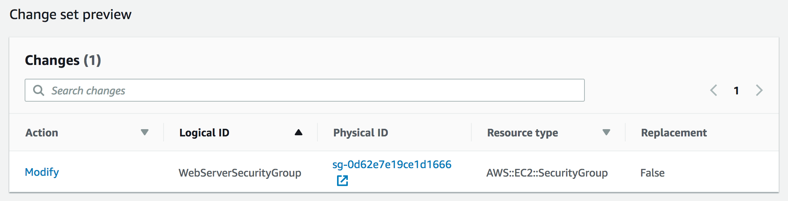

# 模块 10 – 指导实验：使用 AWS CloudFormation 实现自动化基础设施部署

[//]: # "SKU: ILT-TF-200-ACACAD-2    Source Course: ILT-TF-100-ARCHIT-6 branch dev_65"

## 实验概览和目标

以一致、可靠的方式部署基础设施很难，它要求用户遵循记录完备的流程，不能采取任何无正式记录的捷径。此外，如果可用人手较少，用户很难在正常的工作时间外部署基础设施。通过在可自动部署（甚至可以按自动安排好的时间部署）的模板中定义基础设施，AWS CloudFormation 改变了这种情况。

在本实验中，您将学习如何使用 AWS CloudFormation 部署多层基础设施、更新 CloudFormation 堆栈以及删除堆栈（同时保留一些资源）。

完成本实验后，您应能够：

- 使用 AWS CloudFormation 部署 Virtual Private Cloud (VPC) 网络层
- 使用 AWS CloudFormation 部署引用网络层的应用层
- 使用 AWS CloudFormation Designer 浏览模板
- 删除一个具有删除策略的堆栈

<br/>

## 持续时间

完成本实验大约需要 **20 分钟**。

<br/>

## AWS 服务限制

在本实验环境中，对 AWS 服务和服务操作的访问可能仅限于完成实验说明所需的服务和服务操作。如果您尝试访问其他服务或执行本实验中所述之外的操作，可能会遇到错误。

<br/>

## 访问 AWS 管理控制台

1. 在这些说明的顶部，选择 <span id="ssb_voc_grey">Start Lab</span>（启动实验）即可启动您的实验。

   **Start Lab**（启动实验）面板随即会打开，其中显示了实验状态。

   <i class="fas fa-info-circle"></i> **提示**：如果您需要更多时间来完成实验，请再次选择 <span id="ssb_voc_grey">Start Lab</span>（启动实验）按钮，重新启动环境计时器。

2. 请耐心等待，直到 **Start Lab**（启动实验）面板显示消息 *Lab status: ready*（实验状态：就绪），然后选择 **X** 关闭此面板。

3. 在这些说明的顶部，选择 <span id="ssb_voc_grey">AWS</span>。

   此操作将在一个新的浏览器选项卡中打开 AWS 管理控制台。您将自动登录系统。

   <i class="fas fa-exclamation-triangle"></i> **提示**：如果未打开新的浏览器选项卡，您的浏览器顶部通常会出现一个横幅或图标，并显示一条消息，指明您的浏览器阻止该了网站打开弹出窗口。请选择横幅或图标，然后选择 **Allow pop-ups**（允许弹出窗口）。

4. 排列 **AWS 管理控制台**选项卡，使其与这些说明一起显示。理想情况下，您将同时打开两个浏览器选项卡，以便能够更轻松地执行实验步骤。

   <i class="fas fa-exclamation-triangle"></i> **除非特别要求，否则请勿更改区域**。

<br/>

## 任务 1：部署网络层

_分层_部署基础设施是一项最佳实践。常见的层是：

- 网络 (Amazon VPC)
- 数据库
- 应用程序

这样，模板就可以在系统之间重复使用。例如，您可以在开发、测试和生产环境之间部署通用网络拓扑，或者为多个应用程序部署标准数据库。

在此任务中，您将部署一个 AWS CloudFormation 模板，该模板使用 Amazon VPC 创建_网络层_。

5. 右键单击以下链接，将模板下载到您的计算机中：[lab-network.yaml](../../../scripts/lab-network.yaml)

   <i class="fas fa-comment"></i> 如果需要，您可以在文本编辑器中打开此模板，查看 AWS 资源的定义方式。

   模板可以用 JavaScript 对象表示法 (JSON) 或 YAML Ain't Markup Language (YAML) 编写。YAML 是一种类似于 JSON 的标记语言，但更容易阅读和编辑。

6. 在 **AWS 管理控制台**的 <span id="ssb_services">Services <i class="fas fa-angle-down"></i></span>（服务）菜单中，选择 **CloudFormation**。

7. 如果您看到此消息，请单击 <span style="color:blue">Try it out now and provide us feedback</span>（立即试用并提供反馈）：

   

8. 选择 <span id="ssb_orange">Create stack</span>（创建堆栈）并配置以下设置。

   **第 1 步：指定模板**

   - **Template source**（模板源）：<span id="ssbox_cloudformation_blue"><i class="far fa-dot-circle" style="color:#007dbc;"></i> Upload a template file</span>（上传模板文件）
   - **Upload a template file**（上传模板文件）：单击 <span id="ssb_ssm_white">Choose file</span>（选择文件），然后选择您下载的 **lab-network.yaml** 文件。
   - 选择 <span id="ssb_orange">Next</span>（下一步）

   **第 2 步：创建堆栈**

   - **Stack name**（堆栈名称）：`lab-network`
   - 选择 <span id="ssb_orange">Next</span>（下一步）

   **第 3 步：配置堆栈选项**

   - 在 **Tags**（标签）部分中，输入以下值。
      - **Key**（键）：`application`
      - **Value**（值）：`inventory`
   - 选择 <span id="ssb_orange">Next</span>（下一步）

   **第 4 步：审核 lab-network**

   - 选择 <span id="ssb_orange">Create stack</span>（创建堆栈）

   AWS CloudFormation 现在将使用该*模板*在 AWS 账户中生成资源*堆栈*。

   指定的*标签*将自动传播到创建的资源，以便更容易地识别特定应用程序使用的资源。

9. 选择 **Stack info**（堆栈信息）选项卡。

10. 等待堆栈的 **Status**（状态）更改为 <span style="color: green;"><i class="far fa-check-circle"></i> CREATE_COMPLETE</span>。

    <i class="fas fa-comment"></i> 根据需要，可每隔 15 秒选择一次 **Refresh**（刷新）<i class="fas fa-redo"></i> 来更新显示的内容。

    现在，您可以查看已创建的资源。

11. 选择 **Resources**（资源）选项卡。

    您将看到通过该模板创建的资源列表。

    <i class="fas fa-comment"></i> 如果列表为空，请通过选择 **Refresh**（刷新）<i class="fas fa-redo"></i> 来更新列表。

12. 选择 **Events**（事件）选项卡并滚动浏览事件日志。

    事件日志显示 AWS CloudFormation 执行的活动（从最新活动到较早的活动）。示例事件包括开始创建资源，然后完成资源创建。在堆栈创建过程中遇到的任何错误都将在此选项卡中列出。

13. 选择 **Outputs**（输出）选项卡。

    CloudFormation 堆栈可以提供_输出信息_，例如特定资源的 ID 和资源的链接。

    列出了两项输出。

    – **公有子网：**创建的公有子网的 ID（例如：_subnet-08aafd57f745035f1_）
    – **VPC：**创建的 VPC 的 ID（例如：_vpc-08e2b7d1272ee9fb4_）

    输出还可用于向其他堆栈提供值。这显示在 **Export name**（导出名称）列中。在这种情况下，将为 VPC 和子网 ID 指定导出名称，以便其他堆栈可以检索这些值。然后，这些其他堆栈可以在刚创建的 VPC 和子网内构建资源。您将在下一个任务中使用这些值。

14. 选择 **Template**（模板）选项卡。

    此选项卡显示用于创建堆栈的模板，即您在创建堆栈时上传的模板。您可以随意检查模板，查看创建的资源。还可以随意浏览最后的 **Outputs**（输出）部分（本部分定义了要导出的值）。

<br/>
## 任务 2：部署应用层

现在，_网络层_已经部署完毕，下面您要部署包含 Amazon Elastic Compute Cloud (Amazon EC2) 实例和安全组的_应用层_。

AWS CloudFormation 模板将从现有 CloudFormation 堆栈的 _Outputs_（输出）中_导入_ VPC 和子网 ID。然后，它将使用此信息在 VPC 中创建安全组，在子网中创建 EC2 实例。

15. 右键单击以下链接，将模板下载到您的计算机：[lab-application.yaml](../../../scripts/lab-application.yaml)

    <i class="fas fa-comment"></i> 如果需要，您可以在文本编辑器中打开此模板，查看资源的定义方式。

16. 在左侧导航窗格中，选择 **Stacks**（堆栈）。

17. 选择 **Create stack > With new resources (standard)**（创建堆栈 > 使用新资源（标准）），然后配置这些设置。

    **第 1 步：指定模板**

    – **Template source**（模板源）：<span id="ssbox_cloudformation_blue"><i class="far fa-dot-circle" style="color:#007dbc;"></i> Upload a template file</span>（上传模板文件）
    – **Upload a template file**（上传模板文件）：点击 <span id="ssb_ssm_white">Choose file</span>（选择文件），然后选择您下载的 **lab-application.yaml** 文件。
    – 选择 <span id="ssb_orange">Next</span>（下一步）

    **第 2 步：创建堆栈**

    – **Stack name**（堆栈名称）：`lab-application`
    – **NetworkStackName：**`lab-network`
    – 选择 <span id="ssb_orange">Next</span>（下一步）

    <i class="fas fa-comment"></i>_Network Stack Name_ 参数会将您创建的第一个堆栈的名称 (_lab-network_) 告知模板，以便模板可以从 _Outputs_（输出）中检索值。

    **第 3 步：配置堆栈选项**

    – 在 **Tags**（标签）部分中，输入这些值。
      – **Key**（键）：`application`
      – **Value**（值）：`inventory`
    – 选择 <span id="ssb_orange">Next</span>（下一步）

    **第 4 步：审核 lab-application**

    – 选择 <span id="ssb_orange">Create stack</span>（创建堆栈）

    在创建堆栈时，请在 **Events**（事件）选项卡和 **Resources**（资源）选项卡中检查详细信息。您可以监控资源创建过程的进度和资源状态。

18. 在 **Stack info**（堆栈信息）选项卡中，等待 **Status**（状态）更改为 <span style="color: green;"><i class="far fa-check-circle"></i> CREATE_COMPLETE</span>。

    您的应用程序现已准备就绪！

19. 选择 **Outputs**（输出）选项卡。

20. 复制显示的 **URL**，然后打开一个新的 Web 浏览器标签页，粘贴此 URL 并按 Enter 键。

    浏览器选项卡将打开该应用程序，该应用程序正在创建此新 CloudFormation 堆栈的 Web 服务器上运行。

    CloudFormation 堆栈可以使用来自另一个 CloudFormation 堆栈的引用值。例如，_lab-application_模板的这一部分引用了 _lab-network_ 模板：

    ```yaml
      WebServerSecurityGroup:
        Type: AWS::EC2::SecurityGroup
        Properties:
          GroupDescription: Enable HTTP ingress
          VpcId:
            Fn::ImportValue:
              !Sub ${NetworkStackName}-VPCID
    ```

    最后一行使用您在创建堆栈时提供的 _网络堆栈名称_（_lab-network_）。它从第一个堆栈的 _Outputs_（输出）中导入 _lab-network-VPCID_ 的值。然后，它将该值插入到安全组定义的 VPC ID 字段中。结果是，系统在第一个堆栈创建的 VPC 中创建了该安全组。

    下面是另一个示例，它位于您刚刚用于创建应用程序堆栈的 CloudFormation 模板中。此模板代码将 EC2 实例放入由网络堆栈创建的子网中：

    ```yaml
      SubnetId:
        Fn::ImportValue:
        !Sub ${NetworkStackName}-SubnetID
    ```

    它从 _lab-network_ 堆栈获取 _subnet ID_（子网 ID），并在 _lab-application_ 堆栈中使用此 ID 在由第一个堆栈创建的公有子网中启动实例。


<br/>
## 任务 3：更新堆栈

AWS CloudFormation 还可以_更新_已部署的堆栈。当您更新堆栈时，AWS CloudFormation 将仅修改或替换正在更改的资源。任何未更改的资源将保留原样。

在此任务中，您将更新 _lab-application_ 堆栈，以修改安全组中的设置。

首先，您将检查安全组的当前设置。

21. 在 **AWS 管理控制台**上，从 <span id="ssb_services">Services <i class="fas fa-angle-down"></i></span>（服务）菜单中选择 **EC2**。

22. 在左侧导航窗格中，选择 **Security Groups**（安全组）。

23. 选中复选框 <i class="far fa-check-square"></i> **lab-application-WebServerSecurityGroup...**。

24. 选择 **Inbound rules**（入站规则）选项卡。

    目前，安全组中只有一条规则，该规则允许 _HTTP_ 流量。

    现在，您将返回 AWS CloudFormation 更新堆栈。

25. 在 <span id="ssb_services">Services <i class="fas fa-angle-down"></i></span>（服务）菜单上，选择 **CloudFormation**。

26. 右键单击以下链接，将更新后的模板下载到您的计算机：[lab-application2.yaml](../../../scripts/lab-application2.yaml)

    此模板具有一项额外的配置，允许流经端口 22 的入站安全外壳 (SSH) 流量：

    ```yaml
      - IpProtocol: tcp
        FromPort: 22
        ToPort: 22
        CidrIp: 0.0.0.0/0
    ```

27. 在 **AWS CloudFormation 控制台**的 **Stacks**（堆栈）列表中，选择 **lab-application**。

28. 选择 <span id="ssb_ssm_white">Update</span>（更新）并配置以下设置。

    - 选择 <span id="ssbox_cloudformation_blue"><i class="far fa-dot-circle" style="color:#007dbc;"></i> Replace current template</span>（替换当前模板）
    - **Template source**（模板源）：<span id="ssbox_cloudformation_blue"><i class="far fa-dot-circle" style="color:#007dbc;"></i> Upload a template file</span>（上传模板文件）
    - **Upload a template file:**（上传模板文件）：单击 <span id="ssb_ssm_white">Choose file</span>（选择文件），然后选择您下载的 **lab-application2.yaml** 文件。

29. 在接下来*三*个屏幕中的每个屏幕中，都选择 <span id="ssb_orange">Next</span>（下一步）以进入 **Review lab-application**（审核 lab-application）页面。

    在页面底部的 **Change set preview**（更改集概述）部分，AWS CloudFormation 将显示要更新的资源：

    

    此更改集预览表明 AWS CloudFormation 将*修改* *WebServerSecurityGroup* 而无需替换它（_Replacement = False_）。此更改集意味着安全组将对其应用细微更改，并且不需要更改对安全组的引用。

30. 选择 <span id="ssb_orange">Update Stack</span>（更新堆栈）。

31. 在 **Stack info**（堆栈信息）选项卡中，等待 **Status**（状态）更改为 <span style="color: green;"><i class="far fa-check-circle"></i> UPDATE_COMPLETE</span>。

    <i class="fas fa-comment"></i> 如果需要，可每隔 15 秒选择一次 **Refresh**（刷新）<i class="fas fa-redo"></i> 来更新状态。

    现在，您可以确认更改。

32. 返回到 **Amazon EC2 控制台**，然后从左侧导航窗格中选择 **Security Groups**（安全组）。

33. 在 **Security Groups**（安全组）列表中，选择 **lab-application-WebServerSecurityGroup**。

    **Inbound rules**（入站规则）选项卡应显示允许通过 _TCP 端口 22_ 的 _SSH_ 流量的附加规则。

    此子任务演示了如何在可重复的记录完备的流程中部署更改。AWS CloudFormation 模板可以存储在源代码存储库（例如 AWS CodeCommit）中。这样，您就可以维护模板和部署的基础设施的版本和历史记录。


<br/>
## 任务 4：使用 AWS CloudFormation Designer 浏览模板

*AWS CloudFormation Designer* 是一种图形工具，用于创建、查看和修改 AWS CloudFormation 模板。借助 Designer，您可以使用拖放界面绘制模板资源图，然后通过集成的 JSON 和 YAML 编辑器编辑模板资源的详细信息。

无论您是 AWS CloudFormation 新手还是经验丰富的用户，Designer 都能帮您迅速了解模板中各项资源之间的相互关系，并轻松修改模板。

在此任务中，您将获得一些使用 Designer 的实际动手经验。

34. 在 <span id="ssb_services">Services <i class="fas fa-angle-down"></i></span>（服务）菜单上，选择 **CloudFormation**。

35. 在左侧导航窗格中，选择 **Designer**（设计器）。

**提示：**您可能需要通过选择菜单图标来展开左侧导航窗格。

[//]: # "I added the previous tip because I couldn't originally find the navigation pane in the console, until I realized that I needed to open it through the menu. I hope this addition is ok. I think it's likely that there's a standard Font Awesome icon for the menu, but unfortunately, I'm not familiar with it :( "

36. 选择 <i class="fas fa-file"></i> **File**（文件）菜单，选择 **Open > Local file**（打开 > 本地文件），然后选择您之前下载的 **lab-application2.yaml** 模板。

Designer 将以图形方式显示该模板：


Designer 是 AWS CloudFormation 模板的可视化编辑器，绘制的不是典型的架构图，而是绘制模板中定义的资源以及它们相互之间的关系。

37. 试用 Designer 的功能。可以尝试以下操作：

    - 单击显示的资源。随后，下方窗格将显示用于定义资源的部分模板。

    - 尝试将新资源从左侧的 **Resource types**（资源类型）窗格中拖动到设计区域。资源的定义将自动插入到模板中。

    - 尝试拖动资源连接器圈，创建各资源之间的关系。

    - 打开您之前在实验中下载的 **lab-network.yaml** 模板，并在 Designer 中浏览其资源。


<br/>
## 任务 5：删除堆栈

当不再需要为堆栈构建的资源时，AWS CloudFormation 可以将这些资源删除。

还可以针对资源指定_删除策略_。当资源堆栈被删除时，它可以保留或（在某些情况下）备份资源。此功能对于保留数据库、磁盘卷，或删除堆栈后可能需要的任何资源非常有用。

_lab-application_ 堆栈被配置为在删除 Amazon Elastic Block Store (Amazon EBS) 磁盘卷之前为其创建快照。模板中完成该配置的代码是：

```yaml
  DiskVolume:
    Type: AWS::EC2::Volume
    Properties:
      Size: 100
      AvailabilityZone: !GetAtt WebServerInstance.AvailabilityZone
      Tags:
        - Key: Name
          Value: Web Data
    DeletionPolicy: Snapshot
```

最后一行中的 _DeletionPolicy_ 将指示 AWS CloudFormation 在删除磁盘卷之前为其创建快照。

现在，您将删除 _lab-application_ 堆栈，并查看此删除策略的结果。

38. 通过选择 Designer 页面顶部的 <span style="color:#1166bb">Close</span>（关闭）链接返回主 **AWS CloudFormation 控制台**（如果出现提示，请选择 **Leave page**（离开页面））。

39. 在堆栈列表中，选择 **lab-application** 链接。

40. 选择 <span id="ssb_ssm_white">Delete</span>（删除）。

41. 选择 <span id="ssb_orange">Delete stack</span>（删除堆栈）。

    您可以在 **Events**（事件）选项卡中监控删除过程，偶尔选择 **Refresh**（刷新）<i class="fas fa-redo"></i> 来更新屏幕。您可能还会看到一个事件日志条目，表明正在创建 EBS 快照。

42. 请等待堆栈被删除。删除后它将从堆栈列表中消失。

    应用程序堆栈 __ 已删除，但网络堆栈保持不变。此场景强化了这样一个想法，即不同的团队（例如，网络团队或应用程序团队）可以管理自己的堆栈。

    现在，您将在删除 EBS 卷之前为其创建了快照。

43. 从 <span id="ssb_services">Services <i class="fas fa-angle-down"></i></span>（服务）菜单中，选择 **EC2**。

44. 在左侧导航窗格中，选择 **Snapshots**（快照）。

    您应该看到最后几分钟里有一个带有**Started**（已开始）时间的快照。


<br/>

## 提交作业

45. 在这些说明的顶部，选择 <span id="ssb_blue">Submit</span>（提交）记录您的进度，在出现提示时，选择 **Yes**（是）。

46. 如果在几分钟后仍未显示结果，请返回到这些说明的顶部，并选择 <span id="ssb_voc_grey">Grades</span>（成绩）

    **提示**：您可以多次提交作业。更改作业后，再次选择 **Submit**（提交）即可。您最后一次提交的作业将记录为本实验的成绩。

47. 要查找有关您作业的详细反馈，请选择 <span id="ssb_voc_grey">Details</span>（详细信息），然后选择 <i class="fas fa-caret-right"></i> **View Submission Report**（查看提交报告）。

<br/>

## 实验完成 <i class="fas fa-graduation-cap"></i>

<i class="fas fa-flag-checkered"></i> 恭喜！您已完成实验。

48. 选择此页面顶部的 <span id="ssb_voc_grey">End Lab</span>（结束实验），然后选择 <span id="ssb_blue">Yes</span>（是）确认您要结束实验。

    此时将显示一个面板，表明 *DELETE has been initiated... You may close this message box now.*（删除操作已启动...您现在可以关闭此消息框。）

49. 选择右上角的 **X** 以关闭面板。


*©2020 Amazon Web Services, Inc. 及其附属公司。保留所有权利。未经 Amazon Web Services, Inc. 事先书面许可，不得复制或转载本文的部分或全部内容。禁止商业性复制、出租或出售。*

