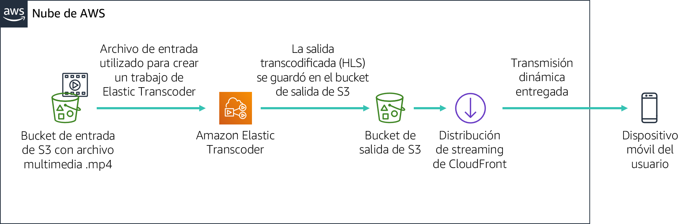

# Laboratorio guiado del módulo 11: Streaming de contenido dinámico con Amazon CloudFront


[//]: # "SKU: ILT-TF-200-ACACAD-2    Source Course: spl-52"

## Información general y objetivos del laboratorio

En este laboratorio, utilizará Amazon CloudFront para entregar una transmisión dinámica con varias velocidades de bits a un dispositivo conectado sirviéndose del protocolo HTTP Live Streaming (HLS) de Apple. La transmisión se puede reproducir en cualquier navegador que admita el protocolo HLS. En este laboratorio, también utilizará Amazon Elastic Transcoder para convertir un video de origen a varias velocidades de bits que se entregarán mediante CloudFront.

Después de completar este laboratorio, debería ser capaz de lo siguiente:

- crear varias versiones de velocidades de bits de un archivo de contenido multimedia de origen determinado con Amazon Elastic Transcoder

- utilizar Amazon CloudFront para entregar la transmisión dinámica (con varias velocidades de bits) creada por Amazon Elastic Transcoder


Cuando **termine** este laboratorio, la arquitectura se verá como en el siguiente ejemplo:




## Duración

Para completar este laboratorio, se necesitan aproximadamente **30 minutos**.

<br/>

## Restricciones de los servicios de AWS

En este entorno de laboratorio, el acceso a los servicios y las acciones de los servicios de AWS puede restringirse a los que se necesiten para cumplir las instrucciones del laboratorio. Es posible que se produzcan errores si intenta acceder a otros servicios o hacer acciones que no sean las que se describen en este laboratorio.

<br/>

## Acceso a la consola de administración de AWS

1. En la parte superior de estas instrucciones, elija <span id="ssb_voc_grey">Start Lab</span> (Iniciar laboratorio) y comience a trabajar en él.

   Se abrirá el panel **Start Lab** (Iniciar laboratorio), donde se muestra el estado del laboratorio.

   <i class="fas fa-info-circle"></i> **Sugerencia**: Si necesita más tiempo para completar el laboratorio, vuelva a hacer clic en el botón <span id="ssb_voc_grey">Start Lab</span> (Iniciar laboratorio) para reiniciar el temporizador del entorno.

2. Espere hasta que el panel **Start Lab** (Iniciar laboratorio) muestre el mensaje *Lab Status: ready (Estado del laboratorio: listo)* y, luego, cierre el panel haciendo clic en la **X**.

3. En la parte superior de estas instrucciones, elija <span id="ssb_voc_grey">AWS</span>.

   Con esta acción, se abrirá la consola de administración de AWS en una nueva pestaña del navegador, y el sistema iniciará su sesión de forma automática.

   <i class="fas fa-exclamation-triangle"></i> **Sugerencia**: Si no se abre una nueva pestaña del navegador, por lo general habrá un aviso o un icono en la parte superior, el cual indicará que el navegador impide que el sitio abra ventanas emergentes. Haga clic en el aviso o el icono y elija **Allow pop ups** (Permitir ventanas emergentes).

4. Ubique la pestaña de la **consola de administración de AWS** de modo que aparezca junto con estas instrucciones. El método más óptimo sería tener ambas pestañas del navegador abiertas al mismo tiempo para que pueda seguir los pasos del laboratorio más fácilmente.

   <i class="fas fa-exclamation-triangle"></i> **No cambie la región a menos que se le indique expresamente que debe hacerlo**.

<br/>
## Tarea 1: Preparar el laboratorio

En este laboratorio, utilizará un archivo de video de muestra para configurar una transmisión dinámica. Para su comodidad, ya se ha creado un bucket de Amazon Simple Storage Service (Amazon S3).

5. En la consola de administración de AWS, en el menú **Services** (Servicios), elija **S3**.

   Debe haber un bucket de S3 que contenga la cadena ***awstrainingreinvent***. Registre la región en la que esté el bucket y ábralo.

6. Abra la carpeta **input**. En ella, hay un archivo de video que se llama **AmazonS3Sample.mp4**.

   **Nota:** Desde el momento en que inicia sesión en la consola de Amazon S3, el archivo puede tardar hasta diez minutos en aparecer en el bucket de S3. Si no lo ve, haga clic en el ícono de flecha circular que está en la parte superior derecha de la pantalla para actualizar el contenido del bucket.

<br/>
## Tarea 2: Crear una distribución de Amazon CloudFront

En esta tarea, creará una distribución de Amazon CloudFront que se utilizará para entregar a los dispositivos del usuario final los archivos de varias velocidades de bits que genera Amazon Elastic Transcoder.

7. En el menú **Services** (Servicios), elija **CloudFront**.

8. Elija **Create Distribution** (Crear distribución).

9. En la sección **Web** de la página, elija **Get Started** (Empezar).

10. En la sección **Origin Settings** (Configuración de origen) de la página, escriba la siguiente información:

    * Seleccione el campo **Origin Domain Name** (Nombre de dominio de origen). Aparecerá una lista de buckets de S3. Elija el que se creó anteriormente y que tiene **awstrainingreinvent** como parte del nombre del archivo.
    * En **Restrict Bucket Access** (Restringir acceso al bucket), seleccione **No**.

11. Desplácese hasta la parte inferior de la página y, a continuación, elija **Create Distribution** (Crear distribución).

<br/>
## Tarea 3: Crear una canalización de Amazon Elastic Transcoder

### Crear una canalización

En esta sección, creará una canalización con la cual administrar los trabajos para transcodificar el archivo de entrada.

12. En la consola de administración de AWS, en el menú **Services** (Servicios), elija **Elastic Transcoder**.

13. En la barra de navegación de la consola de Amazon Elastic Transcoder, seleccione la misma región en la que se creó el bucket de S3.

14. En la página de canalizaciones, elija **Create a new Pipeline** (Crear una canalización nueva).

15. En **Pipeline Name** (Nombre de canalización), escriba `InputPipeline`.

16. En **Input Bucket** (Bucket de entrada), seleccione el bucket de S3 **awstrainingreinvent**.

17. En **IAM Role** (Rol de IAM), en **Other roles** (Otros roles), seleccione **AmazonElasticTranscoderRole**. Se trata de un rol que se creó previamente en la plantilla de CloudFormation de este laboratorio y que utiliza la política administrada AmazonElasticTranscoderRole. El servicio Elastic Transcoder asumirá este rol para acceder a los recursos de Amazon S3 y Amazon Simple Notification Service (Amazon SNS) que estén en su cuenta de laboratorio.

18. En la sección **Configuration for Amazon S3 Bucket for Transcoded Files and Playlists** (Configuración del bucket de Amazon S3 para archivos transcodificados y listas de reproducción), escriba la siguiente información:

    * En **Bucket**, seleccione el bucket de S3 **awstrainingreinvent**.
    * En **Storage Class** (Clase de almacenamiento), seleccione **Standard** (Estándar).

19. En la sección **Configuration for Amazon S3 Bucket for Thumbnails** (Configuración del bucket de Amazon S3 para miniaturas), escriba la siguiente información:

    * En **Bucket**, seleccione el bucket de S3 **awstrainingreinvent**.
    * En **Storage Class** (Clase de almacenamiento), seleccione **ReducedRedundancy** (Redundancia reducida).

20. Elija **Create Pipeline** (Crear canalización).

<br/>
### Crear un trabajo

En esta sección, creará un trabajo con la canalización de Amazon Elastic Transcoder que se acaba de crear. El trabajo se encarga de la transcodificación del archivo de entrada a las distintas velocidades de bits, de acuerdo con lo seleccionado.

21. En la página de canalizaciones, elija **Create New Job** (Crear trabajo nuevo) para crear un trabajo de transcodificación. Crea el trabajo en la canalización (cola) que desea utilizar para transcodificar el archivo de video.

22. En **Pipeline** (Canalización), seleccione **InputPipeline**.

23. En **Output Key Prefix** (Prefijo de clave de resultado), escriba `output/`.

    Amazon Elastic Transcoder anexará este valor al principio de los nombres de todos los archivos que cree el trabajo (incluidos los archivos de resultado, las miniaturas y las listas de reproducción).

24. En **Input Key** (Clave de entrada), seleccione el archivo de entrada etiquetado como **input/AmazonS3Sample.mp4**.

<br/>
### Configurar los detalles de resultado

Con la configuración de esta sección, se determinará cuántos archivos de resultado (velocidades de bits) se crearán. Configurará tres archivos de resultado para esta demostración que tendrán tres velocidades de bits distintas (2 Mbps, 1,5 Mbps y 1 Mbps). Cada velocidad de bits en los resultados requerirá que cree una sección de detalles de los resultados independiente, lo que generará también un archivo de lista de reproducción para cada velocidad de bits en que figurarán todos los segmentos que formen la transmisión.

25. En **Preset:** (Elemento preestablecido:), seleccione **Elemento preestablecido del sistema: HLS 2M**

26. En **Segment Duration** (Duración del segmento), escriba `10` (que es el valor predeterminado de HLS).

27. En **Output Key** (Clave de resultado), escriba un prefijo exclusivo, como `HLS20M`, para asignar un nombre a los segmentos creados con este elemento preestablecido.

28. Haga clic en **+ Add Another Output** (+ Agregar otro resultado) y repita los pasos anteriores con el objetivo de generar segmentos para los elementos preestablecidos **HLS 1.5M** y **HLS 1M**. A continuación, asigne los nombres de prefijo respectivos:

    * `HLS15M`
    * `HLS10M`

<br/>

### Configurar una lista de reproducción

En la lista de reproducción, se combinarán cada una de las listas de reproducción de velocidad de bits y se aportará una única URL para que los dispositivos reproduzcan la transmisión. Para configurar una lista de reproducción, haga lo siguiente:

29. En **Playlists (Adaptive Streaming)** (Listas de reproducción [streaming adaptativo]), seleccione **Add Playlist** (Agregar lista de reproducción) y, a continuación, configure los siguientes ajustes:

    * **Playlist Name** (Nombre de lista de reproducción) `primary (principal)`
    * **Playlist Format** (Formato de lista de reproducción): *HLSv3*

30. Seleccione los tres resultados que se escribieron en la sección anterior para incluirlos en esta lista de reproducción seleccionando la opción **+**.

31. Elija **Create New Job** (Crear nuevo trabajo).

    El proceso de transcodificación debería finalizar en un minuto.

<br/>

## Tarea 4: Probar la reproducción de la transmisión dinámica (varias velocidades de bit)

En este módulo, probará la reproducción de la transmisión dinámica que se generó en la sección anterior utilizando un dispositivo iOS o Android. También puede usar un dispositivo Android 4.x para probar el siguiente ejercicio.

**Nota:** Es posible que algunos navegadores no admitan esta característica. Utilice el navegador web predeterminado del dispositivo para realizar la prueba.

<br/>
### Construir la URL de reproducción

La URL de reproducción que se usa en Amazon CloudFront consta de dos componentes:

- nombre de dominio de Amazon CloudFront

- ruta del archivo de lista de reproducción en el bucket de S3 (resultado generado por Elastic Transcoder):

    ```plain
    http://<CloudFront domain name>/<playlist file path in Amazon S3 bucket>
    ```

<br/>

### Obtener un nombre de dominio de Amazon CloudFront

Para obtener un nombre de dominio de Amazon CloudFront, debe realizar lo siguiente:

32. En la consola de administración de AWS, en el menú **Services** (Servicios), elija **CloudFront**.

33. Seleccione la distribución de **Amazon CloudFront** ya creada y compruebe que el **Distribution Status** (Estado de distribución) haya cambiado de *InProgress* (En curso) a *Deployed* (Implementada).

34. Pase al paso siguiente solo después de que el **Status** (Estado) cambie a *Deployed (Implementada)*.

35. Elija la distribución seleccionando el cuadrado que está a la izquierda de la distribución.

36. Elija **Distribution Settings** (Configuración de distribución).

37. Copie el **nombre de dominio** y péguelo en un editor de texto.

<br/>

### Obtener la ruta del archivo de lista de reproducción

Para obtener la ruta del archivo de lista de reproducción, realice lo siguiente:

38. En el menú **Services** (Servicios), elija **S3**.

39. Seleccione el bucket de S3 **awstrainingreinvent**.

40. Abra la carpeta **output** (donde está el resultado del trabajo de transcodificación) y seleccione el archivo de lista de reproducción **primary.m3u8**.

    Ese es el archivo que reproducirá en el dispositivo móvil.

    A continuación, debe crear la URL que llevará al archivo desde CloudFront.

41. En un editor de texto, construya la URL agregando `/output/primary.m3u8` al fin del nombre de dominio de CloudFront.

    La nueva URL debería ser similar a *d1ckwesahkbyvu.cloudfront.net/output/primary.m3u8*.

42. Escriba la URL en el navegador predeterminado de un dispositivo iOS o Android. Si no tiene un dispositivo móvil a su disposición, escriba la URL en un navegador de su equipo.

    <i class="fas fa-exclamation-triangle"></i> **Tenga en cuenta que si reproduce el video en un dispositivo móvil quizá se apliquen velocidades de datos estándares**.

43. La transmisión debería comenzar a reproducirse en el dispositivo y solicitar de manera dinámica los segmentos pertinentes en función de sus condiciones de ancho de banda y CPU.

Ha aprendido a utilizar conjuntamente servicios de AWS, como Amazon S3, Amazon Elastic Transcoder y Amazon CloudFront, para entregar archivos de contenido multimedia HLS a dispositivos iOS o Android.

Ha logrado los siguientes objetivos:

- Aprendió los conceptos y la terminología básicos de los servicios Amazon Elastic Transcoder y Amazon CloudFront.

- Creó su propia canalización de Amazon Elastic Transcoder y distribución de Amazon CloudFront.

- Utilizó Amazon Elastic Transcoder para transcodificar un archivo de video a diferentes formatos HLS y los distribuyó a dispositivos remotos con Amazon CloudFront.

<br/>

## Envío del trabajo

44. En la parte superior de estas instrucciones, elija <span id="ssb_blue">Submit</span> (Enviar) para registrar su progreso y, cuando se le indique, elija **Yes** (Sí).

45. Si los resultados no se muestran después de algunos minutos, vuelva a la parte superior de estas instrucciones y elija <span id="ssb_voc_grey">Grades</span> (Resultados).

    **Sugerencia**: Puede enviar su trabajo varias veces. Después de realizar las modificaciones pertinentes, vuelva a elegir **Submit** (Enviar). Su último envío es el que se registrará para este laboratorio.

46. Para encontrar comentarios detallados sobre su trabajo, elija <span id="ssb_voc_grey">Details</span> (Detalles) seguido de <i class="fas fa-caret-right"></i> **View Submission Report** (Ver informe de envío).

<br/>

## Fin del laboratorio <i class="fas fa-graduation-cap"></i>

<i class="fas fa-flag-checkered"></i> ¡Felicitaciones! Ha completado el laboratorio.

47. Elija <span id="ssb_voc_grey">End Lab</span> (Finalizar laboratorio) en la parte superior de esta página y, a continuación, seleccione <span id="ssb_blue">Yes</span> (Sí) para confirmar que desea finalizar el laboratorio.

    Un panel presentará el mensaje *DELETE has been initiated… You may close this message box now (Se ha iniciado la ELIMINACIÓN… Ya puede cerrar este cuadro de mensaje)*.

48. Seleccione la **X** de la esquina superior derecha para cerrar el panel.

<br/>
## Recursos adicionales

- [Amazon Elastic Transcoder y Amazon CloudFront](http://aws.amazon.com/elastictranscoder/)

- [Amazon CloudFront](http://aws.amazon.com/cloudfront/)

- [AWS Training and Certification](http://aws.amazon.com/training/)


*© 2020 Amazon Web Services, Inc. y sus empresas afiliadas. Todos los derechos reservados. Este contenido no puede reproducirse ni redistribuirse, total ni parcialmente, sin el permiso previo por escrito de Amazon Web Services, Inc. Queda prohibida la copia, el préstamo y la venta de carácter comercial.*
