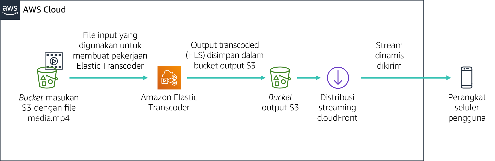

# Modul 11 - Lab Terpandu: Streaming Konten Dinamis dengan Menggunakan Amazon CloudFront


[//]: # "SKU: ILT-TF-200-ACACAD-2    Source Course: spl-52"

## Gambaran umum dan tujuan lab

Pada lab ini, Anda akan menggunakan Amazon CloudFront untuk mengirimkan beberapa pengaliran dinamis dalam kecepatan bit ke perangkat yang terhubung dengan menggunakan protokol HTTP Live Streaming (HLS) Apple. Pengaliran dapat diputar di browser yang mendukung protokol HLS. Pada lab ini, Anda juga akan menggunakan Amazon Elastic Transcoder untuk mengonversi video sumber menjadi beberapa kecepatan bit yang akan dikirimkan dengan menggunakan CloudFront.

Setelah menyelesaikan lab ini, Anda akan mampu:

- Membuat beberapa versi kecepatan bit dari file media sumber tertentu dengan menggunakan Amazon Elastic Transcoder.

- Menggunakan Amazon CloudFront untuk mengirimkan pengaliran (beberapa kecepatan bit) dinamis yang dibuat oleh Amazon Elastic Transcoder.


Pada **akhir** lab ini, arsitektur Anda akan terlihat seperti contoh berikut:




## Durasi

Diperlukan waktu sekitar **30 menit** untuk menyelesaikan lab ini.

<br/>

## Pembatasan layanan AWS

Dalam lingkungan lab ini, akses ke layanan AWS dan tindakan layanan mungkin dibatasi untuk orang-orang yang diperlukan untuk menyelesaikan instruksi lab. Anda mungkin akan mengalami error jika mencoba mengakses layanan lain atau melakukan tindakan di luar yang dijelaskan di lab ini.

<br/>

## Mengakses Konsol Manajemen AWS

1. Di bagian atas instruksi ini, pilih <span id="ssb_voc_grey">Start Lab</span> (Mulai Lab) untuk meluncurkan lab Anda.

   Panel **Start Lab** (Mulai Lab) terbuka dan menampilkan status lab.

   <i class="fas fa-info-circle"></i> **Tip**: Jika Anda memerlukan lebih banyak waktu untuk menyelesaikan lab, mulai ulang pengatur waktu untuk lingkungan dengan memilih tombol <span id="ssb_voc_grey">Start Lab</span> (Mulai Lab) lagi.

2. Tunggu hingga panel **Start Lab** (Mulai Lab) menampilkan pesan *Lab status: ready* (Status lab: siap), lalu tutup panel dengan memilih **X**.

3. Di bagian atas instruksi ini, pilih <span id="ssb_voc_grey">AWS</span>.

   Tindakan ini akan membuka Konsol Manajemen AWS di tab browser baru. Anda akan masuk ke sistem secara otomatis.

   <i class="fas fa-exclamation-triangle"></i> **Tip**: Jika tab browser baru tidak terbuka, banner atau ikon biasanya berada di bagian atas browser Anda dengan pesan bahwa browser Anda mencegah situs membuka jendela sembulan. Pilih banner atau ikon, lalu pilih **Allow pop-ups** (Izinkan sembulan).

4. Atur tab **AWS Management Console**(Konsol Manajemen AWS) agar ditampilkan bersama instruksi ini. Idealnya, Anda perlu membuka kedua tab browser secara bersamaan, sehingga Anda dapat mengikuti langkah-langkah lab dengan lebih mudah.

   <i class="fas fa-exclamation-triangle"></i> **Jangan mengubah Wilayah kecuali secara khusus diperintahkan untuk melakukannya**.

<br/>
## Tugas 1: Persiapan Lab

Di lab ini, Anda akan menggunakan file video sampel untuk mengonfigurasi pengaliran dinamis. Demi kenyamanan Anda, bucket Amazon Simple Storage Service (Amazon S3) telah dibuat.

5. Di Konsol Manajemen AWS, pada menu **Services** (Layanan), pilih **S3**.

   Sebuah bucket S3 yang berisi string ***awstrainingreinvent*** harus ada. Perhatikan Wilayah tempat bucket itu berada, dan buka bucket tersebut.

6. Buka folder **input**. Folder ini berisi file video bernama **AmazonS3Sample.mp4**.

   **Catatan:** Dari saat Anda masuk ke konsol Amazon S3, diperlukan waktu hingga sepuluh menit agar file tersebut muncul di bucket S3. Jika Anda tidak melihatnya, pilih ikon panah melingkar di kanan atas layar untuk menyegarkan isi bucket.

<br/>
## Tugas 2: Membuat Distribusi Amazon CloudFront

Dalam tugas ini, Anda akan membuat distribusi Amazon CloudFront yang akan digunakan untuk mengirimkan beberapa file kecepatan bit yang dihasilkan oleh Amazon Elastic Transcoder ke perangkat pengguna akhir.

7. Di menu **Services** (Layanan), pilih **CloudFront**.

8. Pilih **Create Distribution** (Buat Distribusi).

9. Di bagian **Web** halaman tersebut, pilih **Get Started** (Mulai).

10. Di bagian **Origin Settings** (Pengaturan Asal) pada halaman tersebut, masukkan informasi berikut:

   * Pilih bidang **Origin Domain Name** (Nama Domain Asal). Daftar bucket S3 akan muncul. Pilih salah satu yang dibuat sebelumnya yang memiliki **awstrainingreinvent** sebagai bagian dari nama file.
   * Di bawah **Restrict Bucket Access** (Batasi Akses Bucket) pilih **No** (Tidak).

11. Gulir ke bagian bawah halaman, lalu klik **Create Distribution** (Buat Distribusi)

<br/>
## Tugas 3: Membuat Alur Amazon Elastic Transcoder

### Membuat Alur

Di bagian ini, Anda akan membuat alur yang akan mengelola tugas transcode file input.

12. Di Konsol Manajemen AWS, pada menu **Services** (Layanan) pilih **Elastic Transcoder**.

13. Di bilah navigasi konsol Amazon Elastic Transcoder, pilih Wilayah yang sama dengan tempat bucket S3 dibuat.

14. Pada halaman Pipeline (Alur), pilih **Create a new Pipeline** (Buat Alur baru).

15. Untuk **Pipeline Name** (Nama Alur), masukkan `InputPipeline`

16. Untuk **Input Bucket** (Bucket Input), pilih bucket S3 **awstrainingreinvent**.

17. Untuk **IAM Role**, di bawah **Other roles** (Peran lainnya), pilih **AmazonElasticTranscoderRole**. Ini adalah peran yang telah dibuat sebelumnya di templat CloudFormation lab ini yang menggunakan kebijakan terkelola AmazonElasticTranscoderRole. Layanan Elastic Transcoder akan melanjutkan peran ini untuk mengakses sumber daya Amazon S3 dan Amazon Simple Notification Service (Amazon SNS) di akun lab Anda.

18. Di bagian **Configuration for Amazon S3 Bucket for Transcoded Files and Playlists** (Konfigurasi untuk Bucket Amazon S3 untuk File dan Daftar Putar Ter-transcode), masukkan informasi berikut:

   * Di bawah **Bucket**, pilih bucket S3 **awstrainingreinvent**.
   * Di bawah **Storage Class** (Kelas Penyimpanan), pilih **Standard** (Standar).

19. Di bagian **Configuration for Amazon S3 Bucket for Thumbnails** (Konfigurasi untuk Bucket Amazon S3 untuk Thumbnail), masukkan informasi berikut:

   * Di bawah **Bucket**, pilih bucket S3 **awstrainingreinvent**.
   * Di bawah **Storage Class** (Kelas Penyimpanan), pilih **ReducedRedundancy**.

20. Pilih **Create Pipeline** (Buat Alur).

<br/>
### Membuat Tugas

Pada bagian ini, Anda akan membuat tugas di bawah alur Amazon Elastic Transcoder yang baru saja dibuat. Tugas ini melakukan transcoding file input ke beberapa kecepatan bit pilihan.

21. Pada halaman Alur, pilih **Create New Job** (Buat Tugas Baru) untuk membuat tugas transcoding. Anda membuat tugas di alur (antrian) yang ingin Anda gunakan untuk men-transcode file video.

22. Untuk **Pipeline** (Alur), pilih **InputPipeline**.

23. Untuk **Output Key Prefix** (Awalan Kunci Output), masukkan `output/`.

   Amazon Elastic Transcoder akan menambahkan nilai ini pada nama semua file yang akan dibuat oleh tugas tersebut (termasuk file output, thumbnail, dan daftar putar).

24. Untuk **Input Key** (Kunci Input), pilih file input berlabel **input/AmazonS3Sample.mp4.**

<br/>
### Konfigurasi Detail Output

Pengaturan di bagian ini akan menentukan berapa banyak file output (kecepatan bit) yang dibuat. Anda akan mengonfigurasi tiga file output untuk demo ini yang memiliki tiga kecepatan bit terpisah (2 Mbps, 1,5 Mbps, dan 1 Mbps). Setiap output kecepatan bit akan mengharuskan Anda untuk membuat bagian detail output yang terpisah. Hal ini juga akan menampilkan file daftar putar untuk setiap kecepatan bit, yang mencantumkan semua segmen yang membentuk pengaliran.

25. Untuk **Preset** (Prasetel), pilih **System preset: HLS 2M** (Prasetel sistem: HLS 2M)

26. Untuk **Segment Duration** (Durasi Segmen), masukkan `10` (yang merupakan default HLS).

27. Untuk **Output Key** (Kunci Output), masukkan prefiks unik `HLS20M` untuk memberi nama segmen yang dibuat dengan menggunakan prasetel ini.

28. Klik **+ Add Another Output** (+Tambahkan Output Lain) dan ulangi langkah-langkah di atas untuk menghasilkan segmen untuk prasetel **HLS 1.5M** dan **HLS 1M** lalu berikan prefiks masing-masing:

   * `HLS15M`
   * `HLS10M`

<i class="fas fa-circle"></i> Perhatian: Jangan membuat tugas dulu! Namun, selesaikan beberapa langkah selanjutnya di lab ini di mana Anda harus menambahkan daftar putar pada tugas tersebut.

<br/>

### Mengonfigurasi Daftar Putar

Daftar putar tersebut akan menggabungkan semua daftar putar kecepatan bit individual dan menyediakan URL tunggal bagi perangkat untuk memutar pengaliran. Untuk mengonfigurasi daftar putar, lakukan hal-hal berikut:

29. Di bawah **Playlists (Adaptive Streaming)** (Daftar Putar (Streaming Adaptif)), pilih **Add Playlist** (Tambahkan Daftar Putar), lalu konfigurasikan:

   * **Playlist Name** (Nama Daftar Putar) `primary`
   * **Playlist Format:** (Format Daftar Putar): *HLSv3*

30. Pilih ketiga output tersebut, yang dimasukkan di bagian sebelumnya, untuk memasukkannya ke dalam daftar putar ini dengan memilih opsi **+**.

31. Pilih **Create New Job** (Buat Tugas Baru).

   Proses transcoding semestinya akan selesai dalam satu menit.

<br/>

## Tugas 4: Uji Pemutaran Pengaliran Dinamis (Beberapa Kecepatan Bit)

Pada modul ini, Anda akan menguji pemutaran pengaliran dinamis yang dihasilkan di bagian sebelumnya dengan menggunakan perangkat iOS atau Android. Anda juga dapat menggunakan perangkat Android 4.x untuk menguji latihan di bawah ini.

**Catatan** Browser tertentu mungkin tidak mendukung fitur ini. Gunakan browser web default di perangkat untuk menguji.

<br/>
### Bangun URL Pemutaran

URL pemutaran yang diputar melalui Amazon CloudFront terdiri atas dua komponen:

- Nama domain Amazon CloudFront

- Jalur file daftar putar di bucket S3 (output yang dihasilkan oleh Elastic Transcoder):

    ```plain
    http://<CloudFront domain name>/<playlist file path in Amazon S3 bucket>
    ```

<br/>

### Dapatkan Nama Domain Amazon CloudFront

Untuk mendapatkan nama domain Amazon CloudFront:

32. Di Konsol Manajemen AWS, di menu **Services** (Layanan), pilih **CloudFront**.

33. Pilih distribusi **Amazon CloudFront** yang sebelumnya dibuat, dan verifikasi bahwa **Distribution Status** (Status Distribusi) telah berubah dari *InProgress* menjadi *Deployed* (Di-deploy).

34. Lanjutkan ke langkah berikutnya hanya setelah perubahan **Status** menjadi *Deployed* (Di-deploy).

35. Pilih Distribusi dengan memilih kotak persegi di sebelah kiri Distribusi.

36. Pilih **Distribution Settings** (Pengaturan Distribusi).

37. Salin **Nama Domain** dan tempelkan ke editor teks.

<br/>

### Dapatkan Jalur File Daftar Putar

Untuk mendapatkan jalur file daftar putar:

38. Di menu **Services** (Layanan), pilih **S3**.

39. Pilih bucket S3 **awstrainingreinvent**.

40. Buka folder **output** (yang berisi output dari tugas transcoding) dan pilih file daftar putar **primer.m3u8**.

   Ini adalah file yang akan Anda putar di perangkat seluler Anda.

   Selanjutnya, Anda harus membuat URL ke file tersebut dari CloudFront.

41. Di editor teks, buatlah URL dengan menambahkan `/output/primary.m3u8` ke akhir nama domain CloudFront Anda.

   URL baru akan terlihat seperti ini: *d1ckwesahkbyvu.cloudfront.net/output/primary.m3u8*

42. Ketik URL ke browser default perangkat iOS atau Android. Jika Anda tidak memiliki perangkat seluler yang tersedia, ketik URL ke browser di komputer Anda.

   <i class="fas fa-exclamation-triangle"></i> **Perhatikan bahwa tarif data standar mungkin berlaku saat memutar video di perangkat seluler**.

43. Pengaliran semestinya akan segera berputar di perangkat Anda dan secara dinamis akan meminta segmen yang relevan berdasarkan bandwidth dan kondisi CPU Anda.

Anda telah mempelajari cara menggunakan layanan AWS seperti Amazon S3, Amazon Elastic Transcoder, dan Amazon CloudFront bersama-sama untuk mengirimkan file media HLS ke perangkat iOS atau Android.

Anda telah berhasil:

- Mempelajari konsep dasar dan terminologi Amazon Elastic Transcoder dan layanan Amazon CloudFront.

- Membuat alur Amazon Elastic Transcoder dan distribusi Amazon CloudFront Anda sendiri.

- Mengggunakan Amazon Elastic Transcoder untuk men-transcode file video ke format HLS yang berbeda dan mendistribusikannya ke perangkat jarak jauh dengan menggunakan Amazon CloudFront.

<br/>

## Mengirimkan pekerjaan Anda

44. Di bagian atas instruksi ini, pilih <span id="ssb_blue">Submit</span> (Kirim) untuk merekam kemajuan Anda dan saat diminta, pilih **Yes** (Ya).

45. Jika hasilnya tidak muncul setelah beberapa menit, kembali ke bagian atas instruksi ini dan pilih <span id="ssb_voc_grey">Grades</span> (Nilai)

   **Tip**: Anda dapat mengirimkan pekerjaan Anda beberapa kali. Setelah Anda mengubah pekerjaan, pilih **Submit** (Kirim) lagi. Apa yang akan direkam untuk lab ini adalah pengiriman terakhir Anda.

46. Untuk menemukan detail umpan balik tentang pekerjaan Anda, pilih <span id="ssb_voc_grey">Details</span> (Detail) diikuti oleh <i class="fas fa-caret-right"></i> **View Submission Report** (Lihat Laporan Pengiriman).

<br/>

## Lab selesai <i class="fas fa-graduation-cap"></i>

<i class="fas fa-flag-checkered"></i> Selamat! Anda telah menyelesaikan lab.

47. Pilih <span id="ssb_voc_grey">End Lab</span> (Akhiri Lab) di bagian atas halaman ini, lalu pilih <span id="ssb_blue">Yes</span> (Ya) untuk mengonfirmasi bahwa Anda ingin mengakhiri lab.

   Sebuah panel menunjukkan bahwa *DELETE has been initiated... * (Penghapusan sudah dimulai...) *You may close this message box now.* (Anda dapat menutup kotak pesan ini sekarang.)

48. Pilih **X** di sudut kanan atas untuk menutup panel.

<br/>
## Sumber Daya Tambahan

- [Amazon Elastic Transcoder dan Amazon CloudFront](http://aws.amazon.com/elastictranscoder/)

- [Amazon CloudFront](http://aws.amazon.com/cloudfront/)

- [AWS Training and Certification](http://aws.amazon.com/training/)


*©2020 Amazon Web Services, Inc. dan afiliasinya. Hak cipta dilindungi undang-undang. Karya ini tidak boleh direproduksi atau didistribusikan ulang, seluruhnya atau sebagian, tanpa izin tertulis sebelumnya dari Amazon Web Services, Inc. Dilarang menyalin, meminjamkan, atau menjual secara komersial.*
