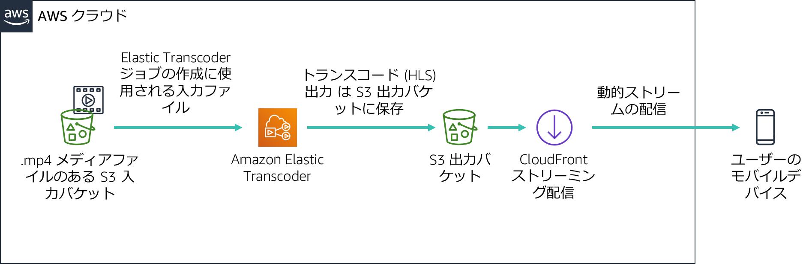

# モジュール 11 - ガイド付きラボ: Amazon CloudFront を使用した動的コンテンツのストリーミング


[//]: # "SKU: ILT-TF-200-ACACAD-2    Source Course: spl-52"

## ラボの概要と目標

このラボでは、Amazon CloudFront で Apple の HTTP Live Streaming (HLS) プロトコルを使用して、接続されたデバイスに動的な複数のビットレートストリームを配信します。ストリームは HLS プロトコルをサポートする任意のブラウザで再生できます。このラボでは Amazon Elastic Transcoder を使用して、ソースビデオを複数のビットレートに変換し、CloudFront を使用して配信します。

このラボを完了すると、次のことができるようになります。

- Amazon Elastic Transcoder を使用して、特定のソースメディアファイルの複数のビットレートバージョンを作成します。

- Amazon CloudFront を使用して、Amazon Elastic Transcoder によって作成された動的（マルチビットレート）ストリームを配信します。


ラボの**終了時**のアーキテクチャは次の例のようになります。




## 所要時間

このラボの所要時間は約 **30 分**です。

<br/>

## AWS サービスの制限事項

このラボ環境では、AWS のサービスとサービスアクションへのアクセスが、ラボの手順を完了するために必要なものに制限されています。他のサービスへのアクセスや、このラボで説明されているサービス以外のアクションを実行しようとすると、エラーが発生することがあります。

<br/>

## AWS マネジメントコンソールにアクセスする

1. この手順の上部にある <span id="ssb_voc_grey">Start Lab</span> をクリックし、ラボを起動します。

   [**Start Lab**] パネルが開き、ラボのステータスが表示されます。

   <i class="fas fa-info-circle"></i> **ヒント**: ラボの完了までにさらに時間が必要な場合は、<span id="ssb_voc_grey">Start Lab</span> ボタンをもう一度選択して、この環境のタイマーを再開します。

2. \[**Start Lab**] パネルに **Lab status: ready** というメッセージが表示されたら [**X**] をクリックしてパネルを閉じます。

3. この手順の上部にある <span id="ssb_voc_grey">AWS</span> をクリックします。

   このアクションにより、新しいブラウザタブで AWS マネジメントコンソールが開き、ユーザーは自動的にログインします。

   <i class="fas fa-exclamation-triangle"></i> **ヒント**: 新しいブラウザタブが開かない場合、通常、ブラウザによってサイトのポップアップウィンドウの表示がブロックされたというメッセージが表示されたバナーまたはアイコンがブラウザの上部に表示されます。バナーまたはアイコンを選択して [**ポップアップを許可**] を選択してください。

4. **AWS マネジメントコンソール**タブがこの手順と並べて表示されるようにします。両方のブラウザタブを同時に開いておくと、ラボのステップを実行しやすくなります。

   <i class="fas fa-exclamation-triangle"></i> **特に指示がない限り、リージョンを変更しないでください**。

<br/>

## タスク 1: ラボの準備

このラボでは、サンプルビデオファイルを使用して動的ストリームを設定します。便宜上、Amazon Simple Storage Service (Amazon S3) バケットはすでに作成されています。

5. AWS マネジメントコンソールの [**サービス**] で [**S3**] をクリックします。

   **awstrainingreinvent** という文字列を含む S3 バケットが存在する必要があります。バケットがあるリージョンを書き留め、そのバケットを開きます。

6. **input**フォルダを開きます。これには **AmazonS3Sample.mp4** という名前のビデオファイルが含まれます。

   **注:** Amazon S3 コンソールにログインしてから、ファイルが S3 バケットに表示されるまでに最大 10 分かかる場合があります。表示されない場合は、画面の右上にある円形の矢印アイコンを選択して、バケットのコンテンツを更新します。

<br/>

## タスク 2: Amazon CloudFront ディストリビューションを作成する

このタスクでは、Amazon CloudFront ディストリビューションを作成します。このディストリビューションは、Amazon Elastic Transcoder によって生成された複数のビットレートファイルをエンドユーザーのデバイスに配信するために使用されます。

7. \[**サービス**] で [**CloudFront**] をクリックします。

8. \[**Create Distribution**] をクリックします。

9. \[**Web**] セクションで [**Get Started**] をクリックします。

10. \[**Origin Settings**] セクションで、次の情報を入力します。

    * [**Origin Domain Name**] フィールドをクリックします。S3 バケットのリストが表示されます。以前に作成されたファイル名の一部に **awstrainingreinvent** があるファイルを選択します。
    * [**Restrict Bucket Access**] で、[**No**] をクリックします。

11. ページの下部にスクロールし [**Create Distribution**] をクリックします。

<br/>

## タスク 3: Amazon Elastic Transcoder パイプラインを作成する

### パイプラインを作成する

このセクションでは、入力ファイルをトランスコードするためのジョブを管理するパイプラインを作成します。

12. AWS マネジメントコンソールの [**サービス**] で [**Elastic Transcoder**] をクリックします。

13. Amazon Elastic Transcoder コンソールのナビゲーションバーで、S3 バケットが作成されたリージョンと同じリージョンをクリックします。

14. \[**Create a new Pipeline**] をクリックします。

15. \[**Pipeline Name**] に `InputPipeline` と入力します

16. \[**Input Bucket**] で **awstrainingreinvent** S3 バケットを選択します。

17. \[**IAM Role**] で [**Other roles**] で [**AmazonElasticTranscoderRole**] を選択します。これは、管理ポリシー AmazonElasticTranscoderRole を使用するこのラボの CloudFormation テンプレートで事前に作成されたロールです。Elastic Transcoder サービスでは、ラボアカウントの Amazon S3 および Amazon Simple Notification Service (Amazon SNS) リソースにアクセスするために、このロールを設定します。

18. \[**Configuration for Amazon S3 Bucket for Transcoded Files and Playlists**] セクションで、次の情報を入力します。

    * [**Bucket**] で **awstrainingreinvent** S3 バケットをクリックします。
    * [**Storage Class**] で [**Standard**] を選択します。

19. \[**Configuration for Amazon S3 Bucket for Thumbnails**] セクションで、次の情報を入力します。

    * [**Bucket**] で、**awstrainingreinvent** S3 バケットをクリックします。
    * [**Storage Class**] で、[**ReducedRedundancy**] を選択します。

20. \[**Create Pipeline**] をクリックします。

<br/>

### ジョブを作成する

このセクションでは、先ほど作成した Amazon Elastic Transcoder パイプラインの下にジョブを作成します。このジョブでは、選択した複数のビットレートに入力ファイルをトランスコードする作業を行います。

21. \[**Pipelines**] ページで [**Create New Job**] をクリックしてトランスコーディングジョブを作成します。ビデオファイルのトランスコードに使用するパイプライン（キュー）にジョブを作成します。

22. \[**Pipeline**] で、[**InputPipeline**] を選択します。

23. \[**Output Key Prefix**] に、`output/` と入力します。

    Amazon Elastic Transcoder では、ジョブで作成されるすべてのファイル（出力ファイル、サムネイル、プレイリストなど）の名前の前にこの値が付加されます。

24. \[**Input Key**] で、**input/AmazonS3Sample.mp4** というラベルの付いた入力ファイルを選択します。

<br/>

### 出力の詳細を設定する

このセクションの設定によって、作成される出力ファイル（ビットレート）の数が決まります。このデモでは、3 つの個々のビットレート（2 Mbps、1.5 Mbps、1 Mbps）で 3 つの出力ファイルを設定します。出力ビットレートごとに、個別の出力詳細セクションを作成する必要があります。これにより、各ビットレートのプレイリストファイルも出力され、ストリームを構成するすべてのセグメントがリストされます。

25. \[**Preset**] で、[**System preset: HLS 2M**] を選択します。

26. \[**Segment Duration**] に `10`（HLS のデフォルト）を入力します。

27. \[**Output Key**] に、`HLS20M` などの一意のプレフィックスを入力して、このプリセットを使用して作成したセグメントに名前を付けます。

28. \[**+ Add Another Output**] をクリックし、上記のステップを繰り返して、プリセット **HLS 1.5M** と **HLS 1M** のセグメントを生成し、それぞれのプレフィックス名を次のように指定します。

    * `HLS15M`
    * `HLS10M`

<br/>

### プレイリストを設定する

プレイリストではすべての個々のビットレートのプレイリストを結合し、ストリームを再生するデバイス用の単一の URL を提供します。プレイリストを設定するには、次の操作を行います。

29. \[**Playlists (Adaptive Streaming)**] で、[**Add Playlist**] をクリックし、次のように設定します。

    * **Master Playlist Name:** `primary`
    * **Playlist Format:** **HLSv3**

30. 前のセクションで入力した 3 つの出力をすべて選択し、[**+ Add Playlist**] のオプションを選択してこのプレイリストに含めます。（ドロップダウンメニューの横にある「+」を押してください）

31. \[**Create new job**] をクリックします。

    トランスコーディングプロセスは 1 分以内に完了します。

<br/>

## タスク 4: 動的（マルチビットレート）ストリームの再生をテストする

このモジュールでは、iOS または Android デバイスを使用して、前のセクションで生成された動的ストリームの再生をテストします。Android 4.x デバイスを使用して、以下の演習をテストすることもできます。

**注** 一部のブラウザでは、この機能をサポートしていない場合があります。デバイスのデフォルトの ウェブブラウザを使用してテストします。

<br/>

### 再生 URL を作成する

Amazon CloudFront を通じて再生される再生 URL は、次の 2 つのコンポーネントで構成されています。

- Amazon CloudFront ドメイン名

- S3 バケット内のプレイリストファイルのパス（Elastic Transcoder によって生成された出力）

   ```plain
   http://<CloudFront domain name>/<playlist file path in Amazon S3 bucket>
   ```

<br/>

### Amazon CloudFront ドメイン名を取得する

Amazon CloudFront ドメイン名を取得するには、次の操作を行います。

32. AWS マネジメントコンソールの [**サービス**] で [**CloudFront**] をクリックします。

33. 以前に作成した **Amazon CloudFront** ディストリビューションを選択し、[**Status**] が [**InProgress**] から [**Deployed**] に変更されていることを確認します。

34. \[**Status**] が [**Deployed**] に変わったら、次のステップに進みます。

35. ディストリビューション の左側にあるチェックボックスをオンにします。

36. \[**Distribution Settings**] をクリックします。

37. \[**Domain Name**] の値をコピーし、テキストエディタに貼り付けます。

<br/>

### プレイリストのファイルパスを取得する

プレイリストのファイルパスを取得するには、次の操作を行います。

38. \[**サービス**] で [**S3**] をクリックします。

39. **awstrainingreinvent** S3 バケットをクリックします。

40. トランスコーディングジョブの出力を含む **output*＊ フォルダを開き、**primary.m3u8** プレイリストファイルをクリックします。

   これは、モバイルデバイス上で再生されるファイルです。

   次に、CloudFront からファイルへの URL を作成する必要があります。

41. テキストエディタで、CloudFront ドメイン名の末尾に `/output/primary.m3u8` を追加して URL を作成します。

   新しいURLは次のようになります: **d1ckwesahkbyvu.cloudfront.net/output/primary.m3u8**

42. iOS または Android デバイスのデフォルトのブラウザに URL を入力します。モバイルデバイスがない場合は、コンピュータのブラウザに URL を入力します。

    <i class="fas fa-exclamation-triangle"></i> **モバイルデバイスで動画を再生する場合は、標準データレートが適用される場合があります**。

43. ストリームの再生はデバイスで開始され、帯域幅と CPU 条件に基づいて、関連するセグメントを動的にリクエストする必要があります。

Amazon S3、Amazon Elastic Transcoder、Amazon CloudFront などの AWS サービスを一緒に使用して HLS メディアファイルを iOS または Android デバイスに配信する方法を学びました。

以下の作業が完了しました。

- Amazon Elastic Transcoder と Amazon CloudFront サービスの基本的な概念と用語について学習しました。

- 独自の Amazon Elastic Transcoder パイプラインと Amazon CloudFront ディストリビューションを作成しました。

- Amazon Elastic Transcoder を使用して動画ファイルをさまざまな HLS 形式にトランスコードし、Amazon CloudFront を使用してリモートデバイスに配信しました。

<br/>

## 作業内容を送信する

44. この手順の上部にある <span id="ssb_blue">Submit</span> をクリックして進捗情報を記録し、プロンプトが表示されたら [**Yes**] をクリックします。


45. 数分経っても結果が表示されない場合は、この手順の上部に戻り、<span id="ssb_voc_grey">Grades</span> をクリックします。

   **ヒント**: 作業内容は何度も送信できます。作業内容を変更したら、再度 [**Submit**] をクリックします。最終送信分がこのラボの作業内容として記録されます。


46. 作業に関する詳細なフィードバックを参照するには、<span id="ssb_voc_grey">Details</span> ドロップダウンメニューから <i class="fas fa-caret-right"></i> [**View Submission Report**] を選択します。

<br/>

## ラボの終了<i class="fas fa-graduation-cap"></i>

<i class="fas fa-flag-checkered"></i>お疲れ様でした。以上でラボは終了です。

47. ララボを終了するには、このページの上部にある <span id="ssb_voc_grey">End Lab</span> をクリックし、<span id="ssb_blue">Yes</span> をクリックします。

   パネルに **DELETE has been initiated... You may close this message box now** というメッセージが表示されます。

48. 右上隅の [**X**] をクリックしてパネルを閉じます。


<br/>

## その他のリソース

- [Amazon Elastic Transcoder と Amazon CloudFront](http://aws.amazon.com/elastictranscoder/)

- [Amazon CloudFront](http://aws.amazon.com/cloudfront/)

- [AWS トレーニングと認定](http://aws.amazon.com/training/)


**©2020 Amazon Web Services, Inc. and its affiliates. All rights reserved. このトレーニング内容の全体または一部を複製または再配布することは、Amazon Web Services, Inc. の書面による事前の許可がある場合を除き、禁じられています。商業目的のコピー、貸与、または販売を禁止します。**
