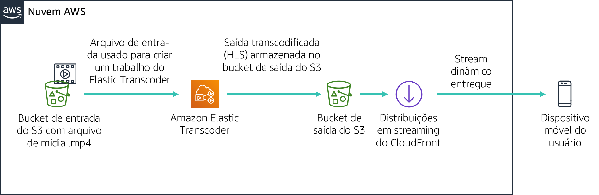

# Módulo 11 - Laboratório guiado: Streaming de conteúdo dinâmico usando o Amazon CloudFront


[//]: # "SKU: ILT-TF-200-ACACAD-2    Source Course: spl-52"

## Visão geral e objetivos do laboratório

Neste laboratório, você usará o Amazon CloudFront para fornecer um fluxo dinâmico de várias taxas de bits para um dispositivo conectado usando o protocolo HTTP Live Streaming (HLS) da Apple. O fluxo pode ser reproduzido em qualquer navegador que suporte o protocolo HLS. Neste laboratório, você também usará o Amazon Elastic Transcoder para converter um vídeo de origem em várias taxas de bits que serão entregues usando o CloudFront.

Depois de concluir este laboratório, você deverá ser capaz de:

- Criar várias versões de taxa de bits de um determinado arquivo de mídia de origem usando o Amazon Elastic Transcoder.

- Usar o Amazon CloudFront para fornecer o stream dinâmico (taxa de bits múltipla) criado pelo Amazon Elastic Transcoder.

  

No **final** deste laboratório, sua arquitetura será semelhante ao seguinte exemplo:




## Duração

Este laboratório levará aproximadamente **30 minutos** para ser concluído.

<br/>

## Restrições de serviço da AWS

Neste ambiente de laboratório, o acesso aos serviços e ações de serviço da AWS pode estar restrito àqueles necessários para concluir as instruções do laboratório. Você poderá encontrar erros se tentar acessar outros serviços ou executar ações além do que está descrito neste laboratório.

<br/>

## Acessar o Console de Gerenciamento da AWS

1. Na parte superior destas instruções, escolha <span id="ssb_voc_grey">Start Lab</span> (Iniciar laboratório) para iniciar o laboratório.

   Um painel **Start Lab** (Iniciar laboratório) é aberto com o status do laboratório.

   <i class="fas fa-info-circle"></i> **Dica**: se você precisar de mais tempo para concluir o laboratório, escolha novamente o botão <span id="ssb_voc_grey">Start Lab</span> (Iniciar laboratório) para reiniciar o cronômetro do ambiente.

2. Aguarde até que o painel **Start Lab** (Iniciar laboratório) exiba a mensagem *Lab status: ready (Status do laboratório: pronto)* e, em seguida, escolha **X** para fechar o painel.

3. Na parte superior destas instruções, escolha <span id="ssb_voc_grey">AWS</span>.

   Essa ação abrirá o Console de Gerenciamento da AWS em uma nova guia do navegador. O sistema fará seu login automaticamente.

   <i class="fas fa-exclamation-triangle"></i> **Dica**: se uma nova guia do navegador não for aberta, normalmente você verá uma faixa ou um ícone na parte superior do navegador com uma mensagem informando que o navegador está impedindo que o site abra janelas pop-up. Escolha a faixa ou o ícone e depois **Allow pop ups** (Permitir pop-ups).

4. Organize a guia do **Console de Gerenciamento da AWS** para que ela seja exibida com essas instruções. O ideal é ver as duas guias do navegador abertas ao mesmo tempo, para facilitar o acompanhamento das etapas do laboratório.

   <i class="fas fa-exclamation-triangle"></i> **Não altere a região, a menos que seja especificamente instruído a fazer isso**.

<br/>
## Tarefa 1: preparação de Laboratório

Neste laboratório, você usará um arquivo de vídeo de exemplo para configurar um fluxo dinâmico. Para sua conveniência, um bucket do Amazon Simple Storage Service (Amazon S3) já foi criado.

5. No Console de Gerenciamento da AWS, no menu **Services** (Serviços), escolha **S3**.

   Um bucket do S3 contendo a string ***awstrainingreinvent*** deve estar presente. Observe a Região em que o bucket está e abra o bucket.

6. Abra a pasta **input**. Ela contém um arquivo de vídeo chamado **AmazonS3Sample.mp4**.

   **Observação:** a partir do momento em que você faz login no console do Amazon S3, pode levar até dez minutos para que o arquivo apareça no bucket do S3. Se você não vir, selecione o ícone de seta circular no canto superior direito da tela para atualizar o conteúdo do intervalo.

<br/>
## Tarefa 2: criar uma distribuição do Amazon CloudFront

Nesta tarefa, você criará uma distribuição do Amazon CloudFront que será usada para entregar os vários arquivos de taxa de bits gerados pelo Amazon Elastic Transcoder para dispositivos de usuário final.

7. No menu **Services (Serviços)**, escolha **CloudFront**.

8. Escolha **Create Distribution** (Criar distribuição).

9. Na seção **Web** da página, escolha **Começar**.

10. Na seção **Configurações de Origem** da página, insira as seguintes informações:

    * Selecione o campo **Origin Domain Name** (Nome do domínio de origem). Uma lista de buckets do S3 será exibida. Escolha aquele que foi criado anteriormente que tem **awstrainingreinvent** como parte do nome do arquivo.
    * Em **Restrict Bucket Access** (Restringir o acesso ao bucket), selecione **No** (Não).

11. Role até o final da página e selecione **Create Distribution** (Criar distribuição).

<br/>
## Tarefa 3: criar um pipeline do Amazon Elastic Transcoder

### Criar um pipeline

Nesta seção, você criará um pipeline que gerenciará os trabalhos para transcodificar o arquivo de entrada.

12. No Console de Gerenciamento da AWS, no menu **Services** (Serviços), escolha **Elastic Transcoder**.

13. Na barra de navegação do console do Amazon Elastic Transcoder, selecione a mesma região em que o bucket do S3 foi criado.

14. Na página Pipelines, escolha **Create a new Pipeline** (Criar um novo pipeline).

15. Para **Pipeline Name** (Nome do pipeline), insira `InputPipeline`

16. Para **Input Bucket** (Bucket de entrada), selecione o bucket do S3 **awstrainingreinvent**.

17. Para **IAM Role (Função do IAM)**, em **Other roles** (Outras funções), selecione **AmazonElasticTranscoderRole**. Essa é uma função pré-criada no modelo do CloudFormation desse laboratório que usa a política gerenciada AmazonElasticTranscoderRole. O serviço Elastic Transcoder assumirá essa função para acessar os recursos do Amazon S3 e do Amazon Simple Notification Service (Amazon SNS) em sua conta de laboratório.

18. Na seção **Configuration for Amazon S3 Bucket for Transcoded Files and Playlists** (Configuração do bucket do Amazon S3 para arquivos e playlists transcodificados), insira as seguintes informações:

    * Em **Bucket**, selecione o bucket do S3 **awstrainingreinvent**.
    * Em **Storage Class** (Classe de armazenamento), selecione **Standard (Padrão)**.

19. Na seção **Configuration for Amazon S3 Bucket for Thumbnails** (Configuração do bucket do Amazon S3 para miniaturas), insira as seguintes informações:

    * Em **Bucket**, selecione o bucket do S3 **awstrainingreinvent**.
    * Em **Storage Class** (Classe de armazenamento), selecione **ReducedRedundancy**.

20. Selecione **Create pipeline** (Criar pipeline).

<br/>
### Criar um trabalho

Nesta seção, você criará um trabalho no pipeline do Amazon Elastic Transcoder que acabou de ser criado. Ele faz o trabalho de transcodificar o arquivo de entrada em várias taxas de bits, conforme selecionado.

21. Na página Pipelines, escolha **Create New Job** (Criar novo trabalho) para criar um job de transcodificação. Você cria o trabalho no pipeline (fila) que deseja usar para transcodificar o arquivo de vídeo.

22. Para **Pipeline**, selecione **InputPipeline**.

23. Para **Output Key Prefix** (Prefixo da chave de saída), insira `output/`.

    O Amazon Elastic Transcoder prependerá esse valor aos nomes de todos os arquivos que o trabalho criará (incluindo arquivos de saída, miniaturas e playlists).

24. Para **Input Key** (Chave de entrada), selecione o arquivo de entrada chamado **input/AmazonS3Sample.mp4.**

<br/>
### Configurar detalhes de saída

As configurações nesta seção determinarão quantos arquivos de saída (taxas de bits) são criados. Você irá configurar três arquivos de saída para esta demonstração com três taxas de bits separadas (2Mbps, 1.5Mbps e 1Mbps). Cada taxa de bits de saída exigirá que você crie uma seção separada de detalhes de saída. Isso também exibirá um arquivo de lista de reprodução para cada taxa de bits, que lista todos os segmentos que compõem o fluxo.

25. Para **Preset:** (Predefinição:), selecione **System prest: HLS 2M** (Predefinição do sistema: HLS 2M)

26. Para **Segment Duration** (Duração do Segmento), insira `10` (que é o padrão HLS).

27. Para **Output Key** (Chave de saída), insira um prefixo exclusivo como `HLS20M` para nomear os segmentos criados usando essa predefinição.

28. Clique em **+ Add Another Output** (+ Adicionar outra saída) e repita as etapas acima para gerar segmentos para predefinições **HLS 1.5M** e **HLS 1M** e, em seguida, fornecer os respectivos nomes de prefixo:

    * `HLS15M`
    * `HLS10M`

<br/>

### Configurar uma lista de reprodução

A lista de reprodução combinará todas as listas de reprodução individuais de taxa de bits e fornecerá um único URL para que os dispositivos reproduzam o fluxo. Para configurar uma lista de reprodução, faça o seguinte:

29. Em **Playlists (Adaptive Streaming)** (Listas de reprodução (streaming adaptável)), escolha **Add Playlist** (Adicionar lista de reprodução) e, em seguida, configure:

    * **Playlist Name** (Nome da lista de reprodução) `primary`
    * **Playlist Format:** (Formato da lista de reprodução:) *HLSv3*

30. Selecione todas as três saídas, que foram inseridas na seção anterior, para incluí-las nesta lista de reprodução selecionando a opção **+**.

31. Escolha **Create New Job** (Criar novo trabalho).

    O processo de transcodificação deve ser concluído dentro de um minuto.

<br/>

## Tarefa 4: testar a reprodução do stream dinâmico (multi Bit-Rate)

Neste módulo, você testará a reprodução do fluxo dinâmico gerado na seção anterior usando um dispositivo iOS ou Android. Você também pode usar um dispositivo Android 4.x para testar o exercício abaixo.

**Observação:** alguns navegadores podem não suportar esse recurso. Use o navegador da Web padrão no dispositivo para testar.

<br/>
### Criar o URL de reprodução

O URL de reprodução que o Amazon CloudFront reproduz é composto por dois componentes:

- Nome de domínio do Amazon CloudFront

- Caminho do arquivo da lista de reprodução no bucket do S3 (saída gerada pelo Elastic Transcoder):

    ```plain
    http://<CloudFront domain name>/<playlist file path in Amazon S3 bucket>
    ```

<br/>

### Obter um nome de domínio do Amazon CloudFront

Para obter um nome de domínio do Amazon CloudFront:

32. No Console de Gerenciamento da AWS, no menu **Services** (Serviços), escolha **CloudFront**.

33. Selecione a distribuição do **Amazon CloudFront** criada anteriormente e verifique se **Distribution Status** (Status da distribuição) foi alterado de *In Progress* (Em andamento) para *Deployed* (Implantada).

34. Prossiga para a próxima etapa somente depois que o **Status** mudar para *Deployed* (Implantada).

35. Selecione a distribuição marcando a caixa quadrada à esquerda de Distribution (Distribuição).

36. Escolha **Distribution Settings** (Configurações de distribuição).

37. Copie **Domain Name** (Nome de domínio) e cole em um editor de texto.

<br/>

### Obter o caminho do arquivo da lista de reprodução

Para obter o caminho do arquivo da lista de reprodução:

38. No menu **Services** (Serviços), escolha **S3**.

39. Selecione o bucket do S3 **awstrainingreinvent**.

40. Abra a pasta de **saída** (que contém a saída do trabalho de transcodificação) e selecione o arquivo de lista de reprodução **primary.m3u8**.

    Esse é o arquivo que você vai reproduzir em seu dispositivo móvel.

    Em seguida, você deve criar o URL do arquivo a partir do CloudFront.

41. Em um editor de texto, crie o URL anexando `/output/primary.m3u8` ao final do nome de domínio do CloudFront.

    O novo URL deve ser semelhante a: *d1ckwesahkbyvu.cloudfront.net/output/primary.m3u8*

42. Digite o URL no navegador padrão de um dispositivo iOS ou Android. Se você não tiver um dispositivo móvel disponível, digite o URL em um navegador no computador.

    <i class="fas fa-exclamation-triangle"></i> **Esteja ciente de que as taxas de dados padrão podem ser aplicadas ao reproduzir o vídeo em um dispositivo móvel**.

43. O stream deve começar a ser reproduzido em seu dispositivo e solicitar dinamicamente os segmentos relevantes com base nas condições de largura de banda e CPU.

Você aprendeu a usar serviços da AWS como Amazon S3, Amazon Elastic Transcoder e Amazon CloudFront juntos para fornecer arquivos de mídia HLS para dispositivos iOS ou Android.

Você conseguiu realizar com êxito as seguintes tarefas:

- Aprender os conceitos básicos e a terminologia dos serviços Amazon Elastic Transcoder e Amazon CloudFront.

- Criar seu próprio pipeline do Amazon Elastic Transcoder e distribuição do Amazon CloudFront.

- Usar o Amazon Elastic Transcoder para transcodificar um arquivo de vídeo em diferentes formatos HLS e distribuí-lo para dispositivos remotos usando o Amazon CloudFront.

<br/>

## Enviar o trabalho

44. Na parte superior destas instruções, escolha <span id="ssb_blue">Submit</span> (Enviar) para gravar o progresso e, quando solicitado, escolha **Yes** (Sim).

45. Se os resultados não forem exibidos após alguns minutos, volte ao topo destas instruções e escolha <span id="ssb_voc_grey">Grades</span> (Notas).

    **Dica**: você pode enviar seu trabalho várias vezes. Depois de alterar o trabalho, escolha **Submit** (Enviar) novamente. Seu último envio é o que será gravado para este laboratório.

46. Para ver o feedback detalhado do seu trabalho, escolha <span id="ssb_voc_grey">Details</span> (Detalhes) e depois <i class="fas fa-caret-right"></i> **View Submission Report** (Visualizar relatório de envio).

<br/>

## Laboratório concluído <i class="fas fa-graduation-cap"></i>

<i class="fas fa-flag-checkered"></i> Parabéns! Você concluiu o laboratório.

47. Escolha <span id="ssb_voc_grey">End Lab</span> (Encerrar laboratório) na parte superior desta página e, em seguida, selecione <span id="ssb_blue">Yes</span> (Sim) para confirmar que você deseja encerrar o laboratório.

    Um painel indica que *DELETE has been initiated... You may close this message box now (A EXCLUSÃO foi iniciada... Você pode fechar esta caixa de mensagem agora)*.

48. Escolha o **X** no canto superior direito para fechar o painel.

<br/>
## Recursos adicionais

- [Amazon Elastic Transcoder e Amazon CloudFront](http://aws.amazon.com/elastictranscoder/)

- [Amazon CloudFront](http://aws.amazon.com/cloudfront/)

- [AWS Training and Certification](http://aws.amazon.com/training/)


*©2020, Amazon Web Services, Inc. e suas afiliadas. Todos os direitos reservados. Este trabalho não pode ser reproduzido ou redistribuído, no todo ou em parte, sem permissão prévia por escrito da Amazon Web Services, Inc. É proibido copiar, emprestar ou vender para fins comerciais.*
