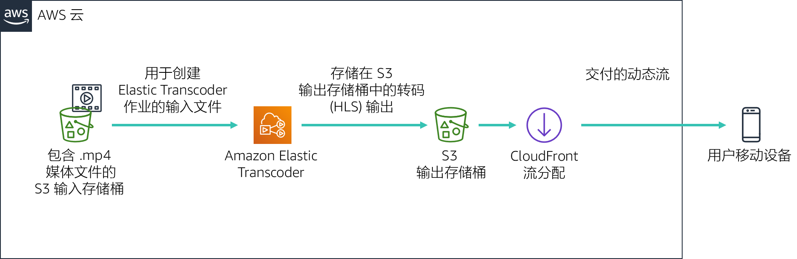

# 模块 11 – 指导实验：使用 Amazon CloudFront 流式处理动态内容


[//]: # "SKU: ILT-TF-200-ACACAD-2    Source Course: spl-52"

## 实验概览和目标

在本实验中，您将使用 Amazon CloudFront 通过 Apple 的 HTTP Live Streaming (HLS) 协议向连接的设备交付动态的多比特率流。该流可以在任何支持 HLS 协议的浏览器上播放。在本实验中，您还将使用 Amazon Elastic Transcoder 将源视频转换为通过 CloudFront 交付的多比特率版本。

完成本实验后，您应能够：

- 使用 Amazon Elastic Transcoder 为指定的源媒体文件创建多比特率版本。

- 使用 Amazon CloudFront 交付通过 Amazon Elastic Transcoder 创建的动态（多比特率）流。


在本实验**结束**时，您的架构将如下例所示：




## 持续时间

完成本实验大约需要 **30 分钟**。

<br/>

## AWS 服务限制

在本实验环境中，对 AWS 服务和服务操作的访问可能仅限于完成实验说明所需的服务和服务操作。如果您尝试访问其他服务或执行本实验中所述之外的操作，可能会遇到错误。

<br/>

## 访问 AWS 管理控制台

1. 在这些说明的顶部，选择 <span id="ssb_voc_grey">Start Lab</span>（启动实验）即可启动您的实验。

   **Start Lab**（启动实验）面板随即会打开，其中显示了实验状态。

   <i class="fas fa-info-circle"></i> **提示**：如果您需要更多时间来完成实验，请再次选择 <span id="ssb_voc_grey">Start Lab</span>（启动实验）按钮，重新启动环境计时器。

2. 请耐心等待，直到 **Start Lab**（启动实验）面板显示消息 *Lab status: ready*（实验状态：就绪），然后选择 **X** 关闭此面板。

3. 在这些说明的顶部，选择 <span id="ssb_voc_grey">AWS</span>。

   此操作将在一个新的浏览器选项卡中打开 AWS 管理控制台。您将自动登录系统。

   <i class="fas fa-exclamation-triangle"></i> **提示**：如果未打开新的浏览器选项卡，您的浏览器顶部通常会出现一个横幅或图标，并显示一条消息，指明您的浏览器阻止该了网站打开弹出窗口。请选择横幅或图标，然后选择 **Allow pop-ups**（允许弹出窗口）。

4. 排列 **AWS 管理控制台**选项卡，使其与这些说明一起显示。理想情况下，您将同时打开两个浏览器选项卡，以便能够更轻松地执行实验步骤。

   <i class="fas fa-exclamation-triangle"></i> **除非特别要求，否则请勿更改区域**。

<br/>
## 任务 1：实验准备

在本实验中，您将使用示例视频文件来配置动态流。为方便您使用，已经创建了 Amazon Simple Storage Service (Amazon S3) 存储桶。

5. 在 AWS 管理控制台的 **Services**（服务）菜单中，选择 **S3**。

   此时，应会显示一个包含 **awstrainingreinvent** 字符串的 S3 存储桶。请记下存储桶所在的区域，然后打开存储桶。

6. 打开 **input** 文件夹，其中包含名为 **AmazonS3Sample.mp4** 的视频文件。

   **注意：**从登录到 Amazon S3 控制台算起，最多等待十分钟，文件即可显示在 S3 存储桶中。如果您没有看到文件，请选择屏幕右上角的圆形箭头图标，刷新存储桶的内容。

<br/>
## 任务 2：创建 Amazon CloudFront 分配

在此任务中，您将创建 Amazon CloudFront 分配，以便向最终用户设备交付 Amazon Elastic Transcoder 生成的多比特率文件。

7. 在 **Services**（服务）菜单上，选择 **CloudFront**。

8. 选择 **Create Distribution**（创建分配）。

9. 在页面的 **Web** 部分，选择 **Get Started**（入门）。

10. 在页面的 **Origin Settings**（源设置）部分，输入以下信息：

    * 选择 **Origin Domain Name**（源域名）字段。屏幕上将显示 S3 存储桶的列表。选择之前创建的文件名中带有 **awstrainingreinvent** 的存储桶。
    * 在 **Restrict Bucket Access**（限制存储桶访问）下，选择 **No**（否）。

11. 滚动到页面底部，然后选择 **Create Distribution**（创建分配）。

<br/>
## 任务 3：创建 Amazon Elastic Transcoder 管道

### 创建管道

在此部分中，您将创建管道来管理将输入文件转码的作业。

12. 在 AWS 管理控制台的 **Services**（服务）菜单中，选择 **Elastic Transcoder**。

13. 在 Amazon Elastic Transcoder 控制台的导航栏中，选择之前创建 S3 存储桶的区域。

14. 在 Pipelines（管道）页面中，单击 **Create a new Pipeline**（创建新管道）。

15. 在 **Pipeline Name**（管道名称）中，输入 `InputPipeline`

16. 在 **Input Bucket**（输入存储桶）中，选择 **awstrainingreinvent** S3 存储桶。

17. 对于 **IAM Role**（IAM 角色），在 **Other roles**（其他角色）下，选择 **AmazonElasticTranscoderRole**。这是在此实验的 CloudFormation 模板（使用托管策略 AmazonElasticTranscoderRole）中预先创建的角色。Elastic Trancoder 服务将担任此角色，以访问实验账户中的 Amazon S3 和 Amazon Simple Notification Service (Amazon SNS) 资源。

18. 在 **Configuration for Amazon S3 Bucket for Transcoded Files and Playlists**（用于转码文件和播放列表的 Amazon S3 存储桶的配置）部分，输入以下信息：

    * 在 **Bucket**（存储桶）下，选择 **awstrainingreinvent** S3 存储桶。
    * 在 **Storage Class**（存储类）下，选择 **Standard**（标准）。

19. 在 **Configuration for Amazon S3 Bucket for Thumbnails**（用于缩略图的 Amazon S3 存储桶的配置）部分，输入以下信息：

    * 在 **Bucket**（存储桶）下，选择 **awstrainingreinvent** S3 存储桶。
    * 在 **Storage Class**（存储类）下，选择 **ReducedRedundancy**。

20. 选择 **Create pipeline**（创建管道）。

<br/>
### 创建作业

在此部分中，您将在刚创建的 Amazon Elastic Transcoder 管道下创建一个作业。该作业将输入文件转码为选定的多个比特率。

21. 在 Pipelines（管道）页面上，选择 **Create New Job**（创建新作业）来创建一个转码作业。您在管道（队列）中创建的作业将用于转码视频文件。

22. 对于 **Pipeline**（管道），选择 **InputPipeline**。

23. 在 **Output Key Prefix**（输出键前缀）字段中，输入 `output/`。

    Amazon Elastic Transcoder 会将该值添加到作业将要创建的所有文件的名称（包括输出文件、缩略图和播放列表）前。

24. 在 **Input Key**（输入键）中，选择标记为 **input/AmazonS3Sample.mp4** 的输入文件。

<br/>
### 配置输出详细信息

此部分中的设置将决定会创建多少个输出文件（比特率）。您需要为这个具有三种不同比特率（2Mbps、1.5Mbps 和 1Mbps）的演示配置三个输出文件。您需要为每个输出比特率创建不同的输出详细信息部分。这还将为每个比特率输出一个播放列表文件，其中会列出构成流的所有段。

25. 对于 **Preset:**（预设：），选择 **System preset: HLS 2M**（系统预设：HLS 2M）

26. 在 **Segment Duration**（段持续时间）中，输入 `10`（HLS 默认值）。

27. 对于 **Output Key**（输出键），请输入具有唯一性的前缀（如 `HLS20M`），来命名使用此预设创建的段。

28. 单击 **+ Add Another Output**（+ 添加另一个输出）并重复上述步骤，为预设 **HLS 1.5M** 和 **HLS 1M** 生成段，然后提供相应的前缀名称：

    * `HLS15M`
    * `HLS10M`

<br/>

### 配置播放列表

播放列表将组合所有单个比特率播放列表，并为设备提供一个 URL 来播放流。要配置播放列表，请执行以下操作：

29. 在 **Playlists** (Adaptive Streaming)（播放列表（自适应流式处理）中，选择 **Add Playlist**（添加播放列表），然后配置：

    * **Playlist Name**（播放列表名称）`primary`
    * **Playlist Format:**（播放列表格式：）*HLSv3*

30. 选择所有三个输出（在上一部分中输入），通过选择 **+** 选项，将其加入这一播放列表。

31. 选择 **Create New Job**（创建新作业）。

    转码过程应在 1 分钟之内完成。

<br/>

## 任务 4：测试动态（多比特率）流的播放

在本模块中，您将使用 iOS 或 Android 设备测试在之前的部分中生成的动态流的播放。您还可以使用 Android 4.x 设备来测试以下练习。

**注意：**某些浏览器可能不支持此功能，请使用设备中的默认 Web 浏览器进行测试。

<br/>
### 构建播放列表 URL

通过 Amazon CloudFront 播放的播放列表 URL 由两个部分组成：

- Amazon CloudFront 域名

- S3 存储桶中的播放列表文件路径（Elastic Transcoder 生成的输出）：

   ```plain
       http://<CloudFront domain name>/<playlist file path in Amazon S3 bucket>
       ```

<br/>

### 获取 Amazon CloudFront 域名

要获取 an Amazon CloudFront 域名，请执行以下操作：

32. 在 AWS 管理控制台的 **Services**（服务）菜单中，选择 **CloudFront**。

33. 选择先前创建的 **Amazon CloudFront** 分配，验证 **Distribution Status**（分配状态）是否从 *InProgress*（进行中）更改为 *Deployed*（已部署）。

34. 只有在 **Status**（状态）更改为 *Deployed*（已部署）之后才可执行接下来的步骤。

35. 通过选中 Distribution（分配）左侧的方框来选择分配。

36. 选择 **Distribution Settings**（分配设置）。

37. 复制**域名**并将其粘贴到文本编辑器中。

<br/>

### 获取播放列表文件路径

要获取播放列表文件路径，请执行以下操作：

38. 在 **Services**（服务）菜单上，选择 **S3**。

39. 选择 **awstrainingreinvent** S3 存储桶。

40. 打开 **output** 文件夹（其中包含转码作业的输出），然后选择 **primary.m3u8** 播放列表文件。

    这是您将在移动设备上播放的文件。

    接下来，您必须从 CloudFront 创建文件的 URL。

41. 在文本编辑器中，通过在 CloudFront 域名末尾附加 `/output/primary.m3u8`来构造 URL。

    新 URL 应该类似于：*d1ckwesahkbyvu.cloudfront.net/output/primary.m3u8*

42. 在 iOS 或 Android 设备的默认浏览器中键入 URL。如果您没有移动设备，请在计算机的浏览器中键入 URL。

    <i class="fas fa-exclamation-triangle"></i> **请注意，在移动设备上播放视频时可能会应用标准数据速率**。

43. 此流将会先在您的设备上播放，并根据您的带宽和 CPU 情况动态地请求相关段。

    您现在已了解如何结合使用 Amazon S3、Amazon Elastic Transcoder 和 Amazon CloudFront 等 AWS 服务将 HLS 媒体文件传输到 iOS 或 Android 设备。

    您已成功完成以下操作：

    - 了解 Amazon Elastic Transcoder 和 Amazon CloudFront 服务的基本概念和术语。

    - 创建您的个人 Amazon Elastic Transcoder 管道和 Amazon CloudFront 分配。

    - 使用 Amazon Elastic Transcoder 将视频文件转码为不同的 HLS 格式，并使用 Amazon CloudFront 将其分配到远程服务。

<br/>

## 提交作业

44. 在这些说明的顶部，选择 <span id="ssb_blue">Submit</span>（提交）记录您的进度，在出现提示时，选择 **Yes**（是）。

45. 如果在几分钟后仍未显示结果，请返回到这些说明的顶部，并选择 <span id="ssb_voc_grey">Grades</span>（成绩）

    **提示**：您可以多次提交作业。更改作业后，再次选择 **Submit**（提交）即可。您最后一次提交的作业将记录为本实验的成绩。

46. 要查找有关您作业的详细反馈，请选择 <span id="ssb_voc_grey">Details</span>（详细信息），然后选择 <i class="fas fa-caret-right"></i> **View Submission Report**（查看提交报告）。

<br/>

## 实验完成 <i class="fas fa-graduation-cap"></i>

<i class="fas fa-flag-checkered"></i> 恭喜！您已完成实验。

47. 选择此页面顶部的 <span id="ssb_voc_grey">End Lab</span>（结束实验），然后选择 <span id="ssb_blue">Yes</span>（是）确认您要结束实验。

    此时将显示一个面板，表明 *DELETE has been initiated... You may close this message box now.*（删除操作已启动...您现在可以关闭此消息框。）

48. 选择右上角的 **X** 以关闭面板。

<br/>
## 其他资源

- [Amazon Elastic Transcoder 和 Amazon CloudFront](http://aws.amazon.com/elastictranscoder/)

- [Amazon CloudFront](http://aws.amazon.com/cloudfront/)

- [AWS Training and Certification](http://aws.amazon.com/training/)


*©2020 Amazon Web Services, Inc. 及其附属公司。保留所有权利。未经 Amazon Web Services, Inc. 事先书面许可，不得复制或转载本文的部分或全部内容。禁止商业性复制、出租或出售。*
