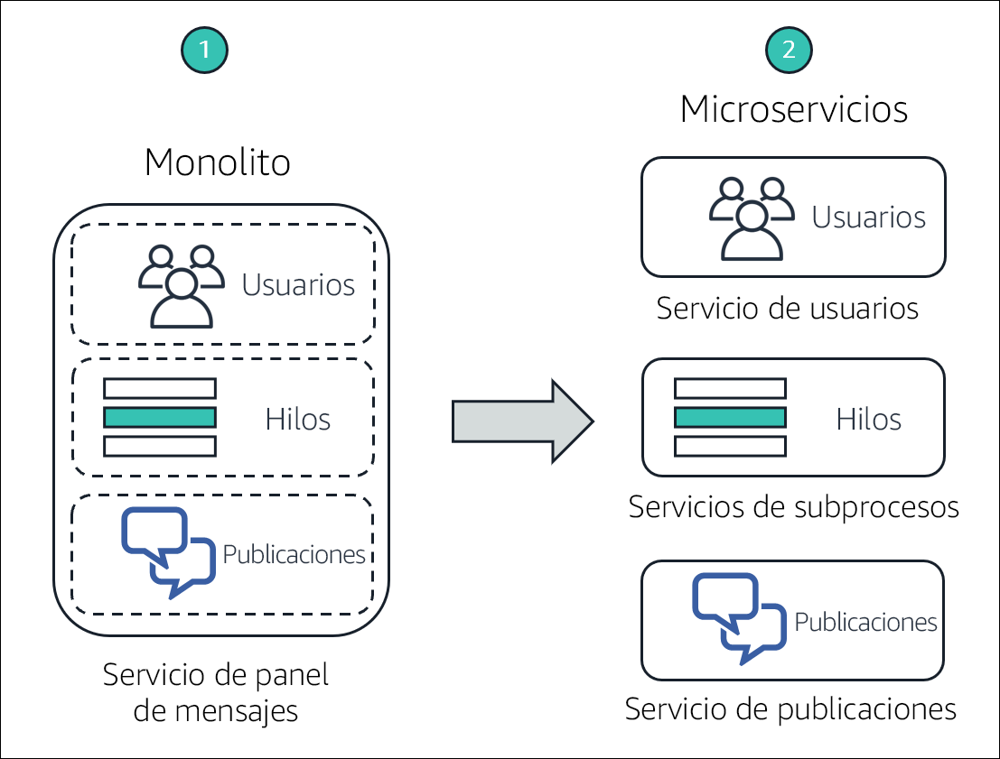
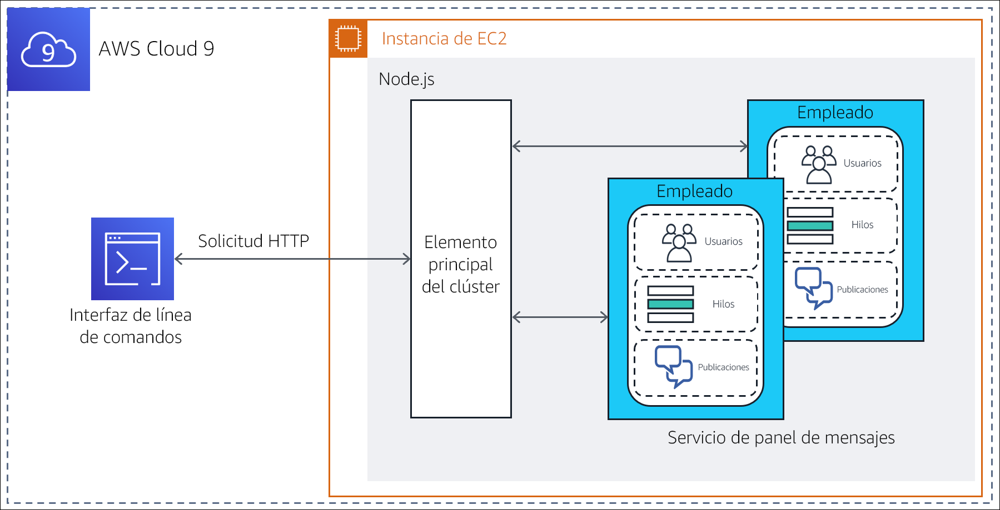
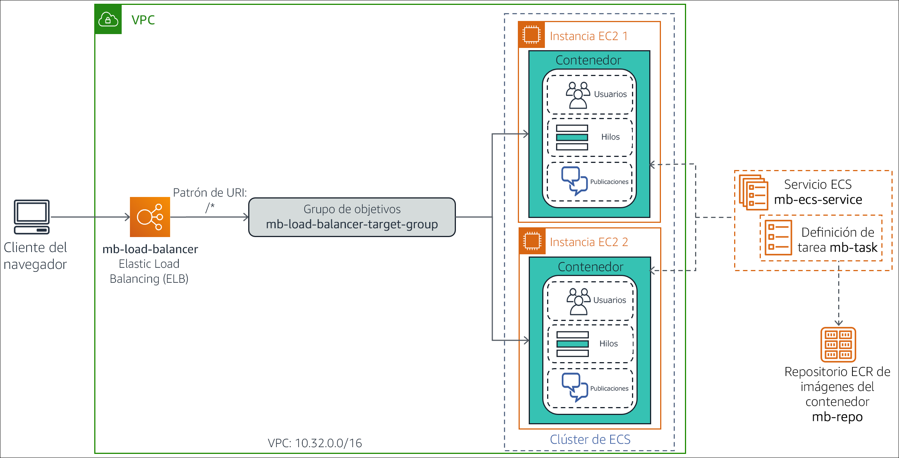

# (Opcional) Módulo 13 – Laboratorio guiado 1: División de una aplicación monolítica Node.js en microservicios

[//]: # "SKU: ILT-TF-200-ACACAD-2    Source Course: ILT-TF-100-TUMCSR-1"

## Información general y objetivos del laboratorio

Las arquitecturas monolíticas tradicionales pueden ser difíciles de escalar. A medida que crece la base de código de una aplicación, se vuelve compleja de actualizar y mantener. Puede ser difícil y complicado introducir nuevas características, lenguajes, marcos y tecnologías, y esto puede limitar la innovación y las nuevas ideas.

En una arquitectura de microservicios, cada componente de la aplicación se ejecuta como su propio servicio. Estos servicios se crean en torno a las capacidades empresariales y cada uno de ellos lleva a cabo una única función. Los microservicios se pueden escribir utilizando diferentes marcos y lenguajes de programación, y se comunican con otros servicios a través de una interfaz de programación de aplicaciones (API) bien definida. Por último, se pueden implementar de forma independiente, como un servicio único o como un grupo de servicios.

En este laboratorio opcional, migrará una aplicación monolítica que se ejecuta en un servidor Node.js estándar a un entorno Docker de contenedores. Luego, refactorizará la aplicación en microservicios y la implementará en un entorno de contenedores organizado por Amazon Elastic Container Service (Amazon ECS). La aplicación Node.js implementa las funciones de un panel de mensajes simple en el cual *los usuarios* pueden crear *hilos* de temas y publicar *mensajes* en cada hilo.


Después de completar este laboratorio, debería ser capaz de lo siguiente:

- Migrar una aplicación monolítica Node.js para que se ejecute en un contenedor de Docker

- Refactorizar una aplicación Node.js de un diseño monolítico a una arquitectura de microservicios

- Implementar una aplicación Node.js de microservicios en contenedores en Amazon ECS


El siguiente diagrama ilustra la evolución del diseño de la aplicación a medida que pasa de monolítica a basada en microservicios.




&nbsp;

El diagrama destaca las siguientes diferencias entre el enfoque monolítico y el diseño de microservicios:

* En un diseño monolítico, todas las funciones de la aplicación Node.js se empaquetan y ejecutan como un único servicio. Si una función falla, lo hace toda la aplicación. Del mismo modo, si una función de la aplicación experimenta un pico de demanda, todas las funciones del servicio deben escalarse juntas.

* En una arquitectura de microservicios, cada función de la aplicación Node.js se ejecuta como un servicio independiente. Los servicios pueden escalarse y actualizarse independientemente unos de otros.

<br/>

## Duración

El tiempo estimado para completar este laboratorio es de **3 horas**.

<br/>

## Restricciones de los servicios de AWS

En este entorno de laboratorio, el acceso a los servicios y las acciones de los servicios de AWS puede restringirse a los que se necesiten para cumplir las instrucciones del laboratorio. Es posible que se produzcan errores si intenta acceder a otros servicios o hacer acciones que no sean las que se describen en este laboratorio.

<br/>

## Acceso a la consola de administración de AWS

1. En la parte superior de estas instrucciones, elija <span id="ssb_voc_grey">Start Lab</span> (Iniciar laboratorio) y comience a trabajar en él.

   Se abrirá el panel **Start Lab** (Iniciar laboratorio), donde se muestra el estado del laboratorio.

   <i class="fas fa-info-circle"></i> **Sugerencia**: Si necesita más tiempo para completar el laboratorio, vuelva a hacer clic en el botón <span id="ssb_voc_grey">Start Lab</span> (Iniciar laboratorio) para reiniciar el temporizador del entorno.

2. Espere hasta que el panel **Start Lab** (Iniciar laboratorio) muestre el mensaje *Lab Status: ready (Estado del laboratorio: listo)* y, luego, cierre el panel haciendo clic en la **X**.

3. En la parte superior de estas instrucciones, elija <span id="ssb_voc_grey">AWS</span>.

   Con esta acción, se abrirá la consola de administración de AWS en una nueva pestaña del navegador, y el sistema iniciará su sesión de forma automática.

   <i class="fas fa-exclamation-triangle"></i> **Sugerencia**: Si no se abre una nueva pestaña del navegador, por lo general habrá un aviso o un icono en la parte superior, el cual indicará que el navegador impide que el sitio abra ventanas emergentes. Haga clic en el aviso o el icono y elija **Allow pop ups** (Permitir ventanas emergentes).

4. Ubique la pestaña de la **consola de administración de AWS** de modo que aparezca junto con estas instrucciones. El método más óptimo sería tener ambas pestañas del navegador abiertas al mismo tiempo para que pueda seguir los pasos del laboratorio más fácilmente.

   <i class="fas fa-exclamation-triangle"></i> **No cambie la región a menos que se le indique expresamente que debe hacerlo**.

<br/>

## Tarea 1: Preparar el entorno de desarrollo

Se creó un entorno de AWS Cloud9 para usted durante el proceso de creación del entorno del laboratorio. AWS Cloud9 es un entorno de desarrollo integrado (IDE) basado en la nube que puede utilizar para escribir, ejecutar y depurar código en un navegador. Viene preempaquetado con herramientas esenciales para los lenguajes de programación populares y proporciona acceso a la interfaz de línea de comandos de AWS (CLI de AWS) en una pestaña de sesión de terminal. Su entorno de AWS Cloud9 tiene acceso a todos los recursos de AWS autorizados para el ID de usuario que utilizó para iniciar sesión en la consola de administración de AWS.


Para configurar su entorno de desarrollo, deberá abrir el IDE de AWS Cloud9 y descargar y extraer los *archivos necesarios del laboratorio*.

5. En la pestaña del navegador con la **consola de administración de AWS**, expanda **All services** (Todos los servicios) y, a continuación, seleccione **Developer Tools (Herramientas para desarrolladores) > Cloud9**.

6. En la tarjeta del **Cloud9-IDE** (IDE de Cloud9), elija **Open IDE** (Abrir IDE).

   El IDE se abre en una nueva pestaña del navegador y muestra varias pestañas, incluida una pestaña de **bienvenida**.

   A continuación, descargará y extraerá los archivos necesarios del laboratorio.

7. En el panel inferior del IDE, escriba el siguiente comando en la pestaña del terminal etiquetada como **bash - "ip-nnn-nnn-nnn-nnn"**:

   ```bash
   curl -s https://aws-tc-largeobjects.s3.amazonaws.com/ILT-TF-100-TUHAWA-1/lab-four/lab-files-ms-node-js.tar.gz | tar -zxv
   ```

   Este comando recupera un archivo comprimido que contiene los archivos del laboratorio. También extrae el contenido del archivo en la carpeta de AWS Cloud9 **~/environment (~/entorno)**. El resultado del comando debería verse como el siguiente ejemplo:

   

   &nbsp;

   Los archivos descargados y extraídos se pueden ver en el panel izquierdo de la ventana **Environment** (Entorno).

   

   &nbsp;

   Puede ver las siguientes carpetas:

   - **1-no-container** (1-sin contenedor): contiene los archivos relacionados con la implementación *monolítica* de la aplicación. Esta implementación está destinada a ejecutarse directamente en un servidor Node.js.

   - **2-containerized-monolith** (2-monolito en contenedores): contiene los archivos relacionados con la implementación *monolítica* de la aplicación. Esta implementación está destinada a ejecutarse en un entorno Docker de contenedores organizado por Amazon ECS.

   - **3-containerized-microservices** (3-microservicios en contenedores): contiene los archivos relacionados con la implementación de *microservicios* en la aplicación. Esta implementación está destinada a ejecutarse en un entorno Docker de contenedores organizado por Amazon ECS.

   Deje abierta la pestaña del IDE de AWS Cloud9 durante todo este laboratorio, ya que la utilizará con frecuencia.

<br/>
## Tarea 2: Ejecutar la aplicación en un servidor Node.js básico

La aplicación Node.js de base es un servicio monolítico que fue diseñado para ejecutarse directamente en un servidor, sin un contenedor. En esta tarea, implementará la aplicación en el servidor Node.js que está instalado en la instancia que ejecuta su entorno de AWS Cloud9. A continuación, probará la aplicación mediante el terminal de la CLI de AWS para invocar los métodos de la API RESTful.

En el siguiente diagrama, se ilustran la arquitectura de implementación y el flujo de solicitudes.



&nbsp;

**Nota**: La implementación monolítica de la aplicación utiliza la funcionalidad del *clúster* Node.js para generar un proceso de trabajo por núcleo de CPU. Los procesos comparten un único puerto y el balanceador de carga integrado en Node.js los invoca mediante el sistema round-robin. Esta característica aumenta la escalabilidad de los servidores que tienen varios núcleos de CPU.

En esta tarea, realizará lo siguiente:

- Instalar los módulos Node.js requeridos por la aplicación

- Revisar el diseño y el código de la aplicación

- Ejecutar la aplicación

<br/>

### Tarea 2.1: Instalar los módulos Node.js necesarios

La aplicación de panel de mensajes utiliza dos módulos del marco Node.js *koa* en su implementación: *koa* y *koa-router*. *Koa.js* es un marco de aplicación web Node.js ampliamente utilizado que facilita la creación de aplicaciones JavaScript asincrónicas del lado del servidor.

8. En la pestaña del terminal, escriba los siguientes comandos para instalar los módulos *koa* y *koa-router*:

   ```bash
   cd ~/environment/1-no-container
   npm install koa
   npm install koa-router
   ```

   

   &nbsp;

   Los módulos se descargan e instalan en la carpeta **1-no-container/node_modules (1-no-container/node_modules)** de la carpeta **~/environment (~/entorno)** de AWS Cloud9. Puede omitir el aviso, las advertencias y los mensajes de actualización en la salida.

<br/>

### Tarea 2.2: Revisar el diseño y el código de la aplicación

Los componentes que implementan la aplicación monolítica de panel de mensajes se encuentran en la carpeta **1-no-container** (1-sin contenedor). Revíselos para comprender el diseño y el código de la aplicación.

9. En la ventana **Environment** (Entorno) de la izquierda, expanda la carpeta **1-no-container** (1-sin contenedor). Los componentes de la aplicación incluyen los siguientes:

   - Carpeta **node_modules (módulos de node)**: esta carpeta se creó cuando instaló los módulos JavaScript necesarios en la subtarea anterior. Contiene el código fuente de ellos.

   - **db.json**: un objeto de notación de objetos JavaScript (JSON) que simula la base de datos del panel de mensajes. Contiene atributos que representan *usuarios*, *hilos* y *publicaciones* con los valores de muestra correspondientes.

   - **index.js**: programa JavaScript que es el punto de entrada de la aplicación.

   - **package.json**: objeto JSON que describe la aplicación, su punto de entrada y sus dependencias.

   - **package-lock.json**: objeto JSON que se generó automáticamente cuando instaló los módulos JavaScript necesarios en la carpeta **node_modules (módulos de node)**. La utilidad de instalación, *npm*, lo utiliza para efectuar un seguimiento de las modificaciones que se realizan en la carpeta.

   - **server.js**: programa JavaScript que define los métodos de la API RESTful de la aplicación e implementa sus respectivos controladores.

10. Examine el objeto *package.json*. En la ventana **Environment** (Entorno), abra **package.json** en una pestaña de editor haciendo doble clic en él. Observe los siguientes atributos del objeto JSON:

    - **Líneas 2 a 5**: el atributo *dependencies (dependencias)* define las dependencias del módulo JavaScript para la aplicación. Observe que los módulos *koa* y *koa-router* que instaló en la subtarea anterior se enumeran aquí.

    - **Líneas 6 a 8**: el atributo *scripts* declara el programa *index.js* como el punto de entrada a la aplicación.

11. Examine el objeto **db.json**. En la ventana **Environment** (Entorno), abra **db.json** en una pestaña de editor haciendo doble clic en ella. Observe los siguientes atributos del objeto JSON:

    - **Líneas 2 a 27**: estas líneas definen un atributo *users (usuarios)* que representa a los usuarios registrados del panel de mensajes. El valor del atributo es una lista de *cuatro* usuarios de ejemplo con los siguientes nombres: *Marcerline Singer*, *Finn Alberts*, *Paul Barium* y *Jake Storm*.

    - **Líneas 29 a 45**: estas líneas definen un atributo de *threads (hilos)* que representa los hilos activos actuales en el panel de mensajes. El valor del atributo es una lista de *tres* hilos de ejemplo con los siguientes títulos:

       - *¿Vieron el partido de Brasil?*

       - *Apertura de una nueva panadería francesa en el barrio mañana*

       - *En busca de una nueva guitarra*

       - **Líneas 47 a 78**: estas líneas definen un atributo de *posts (publicaciones)* que representa los mensajes publicados en los hilos activos. El valor del atributo es una lista de *seis* publicaciones de mensajes de ejemplo.

12. Revise el código de *index.js*. En la ventana **Environment** (Entorno), abra **index.js** en una pestaña de editor haciendo doble clic en él. Observe la siguiente información:

    - **Líneas 1 a 3**: estas líneas importan los módulos JavaScript que requiere el programa, específicamente: *cluster (clúster)*, *http* y *os (SO)*.

    - **Línea 3**: esta línea utiliza el módulo *os (SO)* para preguntar sobre la cantidad de núcleos de CPU que están disponibles en el servidor.

    - **Líneas 5 a 15**: estas líneas se ejecutan la primera vez que se invoca el programa (cuando se inicia la aplicación). Crean un subproceso *Leader (Líder)* para el clúster y un subproceso *worker (trabajador)* para cada núcleo de CPU que está disponible en el servidor.

    - **Líneas 16 a 19**: estas líneas manejan cada solicitud realizada a la aplicación invocando el programa *server.js* en el subproceso *worker (trabajador)* actual.

13. Por último, revise el código de *server.js*. En la ventana **Environment** (Entorno), abra **server.js** en una pestaña de editor haciendo doble clic en él. Utilice los comentarios que se proporcionan en el código para facilitar su comprensión de la lógica. En particular, observe la siguiente información:

    - **Línea 3**: esta línea importa *db.json*, el objeto JSON que simula la base de datos.

    - **Líneas 6 a 11**: estas líneas definen una función generadora que se ejecuta para cada solicitud. Su propósito es imprimir una línea que contenga el *método HTTP*, la *URL de ruta de acceso al recurso* y el *tiempo transcurrido* para cada solicitud que se procesa.

    - **Líneas 13 a 47**: estas líneas definen los métodos de la API RESTful de la aplicación y su implementación. Específicamente, la aplicación puede responder a las siguientes llamadas RESTful.

       - `GET /api/users`: devuelve la colección de *usuarios* de la base de datos

       - `GET /api/users/:userId`: devuelve la información del *usuario* identificado por *:userId (ID del usuario)*

       - `GET /api/threads`: devuelve la colección de *hilos* de la base de datos

       - `GET /api/threads/:threadId`: devuelve la información del *hilo* identificado por *:threadId (ID del hilo)*

       - `GET /api/posts/in-thread/:threadId`: devuelve la colección de *mensajes de publicación* para el *hilo* identificado por *:threadId (ID del hilo)*

       - `GET /api/posts/by-user/:userId`: devuelve la colección de *mensajes de publicación* para el *usuario* identificado por *:userId (ID del usuario)*

       - `GET /api/`: devuelve el mensaje *API ready to receive requests (API lista para recibir solicitudes)*

       - `GET /`: devuelve el mensaje *Ready to receive requests (Listo para recibir  solicitudes)*

    - **Línea 52**: esta línea define el *número de puerto* por el cual la aplicación escucha las solicitudes

<br/>

### Tarea 2.3: Ejecutar la aplicación

En esta subtarea, iniciará el servidor Node.js y ejecutará la aplicación de panel de mensajes. Luego, probará algunos de los métodos de su API RESTful.

14. En la pestaña del terminal, inicie Node.js y la aplicación escribiendo el siguiente comando:

    ```bash
    npm start
    ```

    

    &nbsp;

    Se inicia el servidor y se ejecuta el punto de entrada *index.js* de la aplicación. La primera vez que se invoca *index.js*, este crea dos subprocesos de clúster:*Leader (Líder)* y *Worker (Trabajador)* para procesar solicitudes.

    A continuación, dejará activa la sesión del terminal actual y abrirá una segunda pestaña de terminal para probar la API RESTful de la aplicación.

15. En el panel inferior, abra una nueva pestaña de terminal eligiendo **(+)** y **New Terminal** (Nueva terminal). Ahora tiene dos terminales en los que puede escribir comandos.

16. En la **pestaña de terminal derecha**, recupere el recurso `/api/users` escribiendo el siguiente comando:

    ```bash
    curl localhost:3000/api/users
    ```

    La invocación de RESTful devuelve un objeto JSON que contiene la lista de *usuarios* de la base de datos del panel de mensajes.

    

&nbsp;

17. Seleccione la **pestaña de terminal izquierda**. Aparece un mensaje de salida de server.js que indica que procesó una solicitud de método GET (OBTENER) en el recurso, que se identifica por la ruta `/api/users`. La solicitud tardó *4* milisegundos en procesarse.

    

    &nbsp;

18. Recupere solo la información del *cuarto* usuario de la base de datos. En la **pestaña de terminal derecha**, escriba el siguiente comando:

    ```bash
    curl localhost:3000/api/users/4
    ```

    Se devuelve la información de *Jake Storm*, el cuarto usuario de la base de datos:

    

19. A continuación, recupere todos los *hilos* que se encuentran actualmente en la base de datos. En la **pestaña de terminal derecha**, escriba el siguiente comando:

    ```bash
    curl localhost:3000/api/threads
    ```

    Se devuelve un objeto JSON que contiene todos los hilos de la base de datos:

    

    &nbsp;

20. Por último, recupere todas las *publicaciones* del *primer* hilo de la base de datos. En la **pestaña de terminal derecha**, escriba el siguiente comando:

    ```bash
    curl localhost:3000/api/posts/in-thread/1
    ```

    Se devuelve un objeto JSON que contiene dos publicaciones de mensajes:

    

    &nbsp;

21. Detenga el servidor Node.js. En la **pestaña de terminal izquierda**, presione CTRL+C para terminar el proceso del servidor.

    Ha validado que la aplicación responde de manera correcta a las solicitudes GET (OBTENER). En la siguiente tarea, cargará la aplicación en contenedores.

<br/>

## Tarea 3: Cargar el monolito en contenedores para Amazon ECS

Los contenedores envuelven el código de la aplicación en una unidad de implementación que captura una instantánea del código y sus dependencias. Pueden ayudar a garantizar que las aplicaciones se implementen de forma rápida, fiable y consistente, independientemente del entorno de implementación.

En esta tarea, creará una imagen de contenedor para la aplicación monolítica de panel de mensajes y la enviará a Amazon Elastic Container Registry (Amazon ECR). Este paso prepara la aplicación para su implementación en Amazon ECS.

En concreto, realizará los siguientes pasos:

- Preparar la aplicación para la creación de contenedores de Docker

- Aprovisionar un repositorio

- Crear y enviar la imagen de Docker al repositorio

<br/>
### Tarea 3.1: Preparar la aplicación para la creación de contenedores de Docker

Para colocar la aplicación de panel de mensajes en un contenedor de Docker, se deben realizar los siguientes cambios en la aplicación:

- Eliminar el uso de la característica de *clúster* de Node.js y convertir la aplicación en un diseño de proceso único. Con los contenedores de Docker, el objetivo es ejecutar un solo proceso por contenedor, en lugar de un clúster de procesos.

- Crear un *Dockerfile* para la aplicación. Este archivo es básicamente un script de creación que contiene instrucciones sobre cómo crear una *imagen de contenedor* para la aplicación.

Se le proporciona una versión de la aplicación lista para los contenedores en la carpeta **2-containerized monolith** (2-monolito en contenedores) de su entorno de AWS Cloud9. Tómese unos minutos para revisar los archivos y, así, comprender los cambios que se efectuaron a fin de preparar la aplicación para la creación de contenedores.

22. En la ventana **Environment** (Entorno) de la izquierda, expanda la carpeta **2-containerized-monolith** (2-monolito en contenedores) y abra el archivo **package.json** en una pestaña de editor haciendo doble clic en él.

    Observe que en la **línea 7**, el punto de entrada a la aplicación se cambió de *index.js* a *server.js*. El archivo *index.js* ya no se encuentra en la carpeta de la aplicación. El archivo *index.js* contenía la lógica de inicialización para la característica de *clúster* Node.js y usted ya no utilizará esa característica.

23. En la ventana **Environment** (Entorno), expanda la carpeta **2-containerized-monolith** (2-monolito en contenedores) y abra el archivo **server.js** en una pestaña de editor haciendo doble clic en él.

    La única diferencia con respecto a la versión sin contenedores es la adición de la **línea 54**, que muestra el mensaje *Worker started (Se inició el Trabajador)* cuando la aplicación se inicia por primera vez.

24. En la ventana **Environment** (Entorno), expanda la carpeta **2-containerized-monolith** (2-monolito en contenedores) y abra el archivo **Dockerfile** en una pestaña de editor haciendo doble clic en él.

   Este archivo contiene las instrucciones sobre cómo crear la imagen de contenedor para la aplicación.


  &nbsp;

Observe la siguiente información:

- **Línea 1**: la imagen de base donde se creará la imagen del contenedor. En este caso, es *alpine-node*, que es una imagen Node.js.

- **Línea 3**: esta línea establece el directorio de trabajo del sistema de archivos de la imagen en */srv*.

- **Línea 4**: esta línea agrega el contenido de la carpeta **2-containerized-monolith** (2-monolito en contenedores) (la carpeta de la aplicación) al directorio de trabajo actual del sistema de archivos de la imagen (que se estableció en la línea anterior).

- **Línea 5**: esta línea invoca el comando *npm install* para instalar todas las dependencias de biblioteca de la aplicación que se declaran en el archivo *package.json*.

- **Línea 7**: esta línea informa a Docker que el contenedor escucha en el puerto 3000 cuando se ejecuta.

- **Línea 8**: esta línea pide a Docker que ejecute el comando *node server.js*, que inicia la aplicación cuando se inicia la imagen.

Ahora que entiende cómo se creará la imagen de contenedor para la aplicación, examinará dónde colocar la imagen después de que se cree.

<br/>
### Tarea 3.2: Aprovisionar un repositorio

Las imágenes de contenedor de Docker están pensadas para almacenarse en un repositorio a fines de su uso compartido, del control de versiones y de una administración más sencilla. *Amazon ECR* facilita a los desarrolladores almacenar, administrar e implementar imágenes de contenedores de Docker. Además, Amazon ECR está integrado con Amazon ECS, lo que permite a Amazon ECS extraer imágenes de contenedor directamente para las implementaciones en producción.

En esta subtarea, creará un repositorio en Amazon ECR para alojar la imagen de contenedor de Docker de la aplicación de panel de mensajes.

25. En la pestaña del explorador **Your environments** (Sus entornos), elija **Services** (Servicios) y, a continuación, seleccione **Container (Contenedor) > Elastic Container Registry**.

    Se abrirá la consola de Amazon ECR.

26. En **Create a repository** (Crear un repositorio), elija **Get Started** (Comenzar).

27. En el cuadro **Repository name** (Nombre del repositorio), escriba `mb-repo`.

28. Elija **Create repository** (Crear repositorio).

    En la parte superior de la página, aparece un mensaje que indica que el repositorio se creó correctamente.

    **Nota:** *No cierre la ventana que muestra el mensaje.* La usará en la siguiente subtarea.

<br/>

### Tarea 3.3: Crear y enviar la imagen de Docker

Ya está listo para crear la imagen de contenedor de la aplicación y enviarla al repositorio de Amazon ECR que creó.

Una característica útil de la consola de Amazon ECR es que proporciona plantillas de comandos listas para usar a fin de crear y enviar una imagen al nuevo repositorio. En los próximos pasos, utilizará estos comandos de la CLI de AWS que se proporcionan.

29. Para poder completar correctamente los pasos siguientes, debe actualizar la CLI de AWS. Para ello, vaya a la pestaña del navegador con el **IDE de AWS Cloud9** y, en la **pestaña de terminal izquierda**, escriba los siguientes comandos:

    ```bash
    pip3 install awscli --upgrade --user
    export PATH=$HOME/.local/bin:$PATH
    ```

30. Vuelva a la pestaña del navegador con la consola de **Amazon ECR** y, en la ventana de mensajes situada en la parte superior de la página, elija **View push commands** (Ver comandos de inserción).

    Se abrirá la ventana emergente **Push commands for mb-repo** (Comandos de inserción para mb-repo). En esta ventana, se enumeran cuatro comandos de la CLI de AWS que se han personalizado para el repositorio *mb-repo*, y están diseñados específicamente para lo siguiente:

    - Autenticar su cliente de Docker en el registro de Amazon ECR
    - Crear la imagen de Docker
    - Etiquetar la imagen de Docker
    - Enviar la imagen de Docker al repositorio

La ventana emergente ofrece dos versiones de los comandos: una para *macOS/linux* y la otra para *Microsoft Windows*.

31. Asegúrese de que la pestaña **macOS/Linux** esté seleccionada, ya que ejecutará estos comandos en su entorno de AWS Cloud9.

    Primero, copiará y ejecutará el comando a fin de iniciar la sesión del cliente de Docker en su registro.

32. En la ventana emergente, busque el *primer* comando y, a continuación, copie el comando en el portapapeles seleccionando el icono **Copy** (Copiar).

    El comando tiene el aspecto del siguiente ejemplo:

    ```bash
    $ aws ecr get-login-password --region us-east-1 | docker login --username AWS --password-stdin 01234567890.dkr.ecr.us-east-1.amazonaws.com/mb-repo
    ```

33. Cambie a la pestaña del navegador con el **IDE de AWS Cloud9**.

34. En la **pestaña de terminal izquierda**, pegue el comando que copió y ejecútelo presionando INTRO:

    

    &nbsp;

    Si el comando se ejecuta correctamente, devolverá el mensaje *Login Succeeded (Inicio de sesión correcta)*. Puede ignorar las advertencias que aparezcan.

    A continuación, creará la imagen de Docker para su aplicación.

    **Nota**: Cuando en un paso de instrucciones no se mencione una pestaña de terminal específica, use la pestaña de terminal *izquierda*.

35. En la pestaña de terminal, cambie el directorio a la carpeta **2-containerized-monolith** (2-monolito en contenedores) escribiendo el siguiente comando:

    ```bash
    cd ~/environment/2-containerized-monolith
    ```

36. Cambie a la pestaña del navegador donde está la consola de **Amazon ECR**.

37. En la ventana **Push commands for mb-repo** (Comandos de inserción para mb-repo), busque el *segundo* comando y cópielo seleccionando el icono **Copy** (Copiar).

    El comando tiene el aspecto del siguiente ejemplo:

    ```bash
    docker build -t mb-repo .
    ```

    Asegúrese de incluir el punto (.) al final del comando.

38. Cambie a la pestaña del navegador con el **IDE de AWS Cloud9**.

39. En la pestaña de terminal, pegue el comando que copió y ejecútelo presionando INTRO:

    

    &nbsp;

    El comando *build* produce varias líneas de salida a medida que ejecuta las instrucciones que se encuentran en el archivo *Dockerfile* de la aplicación. Cuando termine, verá los mensajes *Successfully built nnnnnnnnnn (nnnnnnnnnn se creó correctamente)* y *Successfully tagged mb-repo:latest (mb-repo se etiquetó correctamente: más reciente)*.

    A continuación, etiquetará la imagen con el URI del repositorio para que se pueda enviar al repositorio.

40. Cambie a la pestaña del navegador donde está la consola de **Amazon ECR**.

41. En la ventana **Push commands for mb-repo** (Comandos de inserción para mb-repo) busque el *tercer* comando y elija el icono **Copy** (Copiar).

    El comando tiene el aspecto del siguiente ejemplo:

    ```bash
    docker tag mb-repo:latest 1234567890.dkr.ecr.us-east-2.amazonaws.com/mb-repo:latest
    ```

42. Cambie a la pestaña del navegador con el **IDE de AWS Cloud9**.

43. En la pestaña del terminal, pegue y ejecute el comando que copió:

    

    &nbsp;

    El comando no devuelve nada si se completó correctamente.

    Por último, enviará la imagen del contenedor al repositorio de la aplicación.

44. Cambie a la pestaña del navegador donde está la consola de **Amazon ECR**.

45. En la ventana **Push commands for mb-repo** (Comandos de inserción para mb-repo), busque el *cuarto* comando y cópielo.

    El comando tiene el aspecto del siguiente ejemplo:

    ```bash
    docker push 1234567890.dkr.ecr.us-east-2.amazonaws.com/mb-repo:latest
    ```

46. Cambie a la pestaña del navegador con el **IDE de AWS Cloud9**.

47. En la pestaña del terminal, pegue y ejecute el comando que copió:

    

    &nbsp;

    El comando genera varios mensajes a medida que cada capa de la imagen se envía al repositorio.

    A continuación, verificará que la imagen se haya cargado de manera correcta.

48. Cambie a la pestaña del navegador donde está la consola de **Amazon ECR**.

49. Cierre la ventana **Push commands for mb-repo** (Comandos de inserción para mb-repo).

50. En la lista **Repositories** (Repositorios), elija **mb-repo**.

    En la lista **Images** (Imágenes), debería ver la imagen de contenedor que envió, la cual puede identificar mediante la etiqueta *latest (más reciente)*.

    

    &nbsp;

51. Registre el *Image URI (URI de la imagen)*. En la lista **Images** (Imágenes), busque el **Image URI** (URI de la imagen) de la versión *más reciente* de la imagen y elija el icono **Copy** (Copiar). Pegue el valor en un editor de texto, ya que lo usará en un paso posterior.

    Ha creado correctamente una imagen de contenedor para la aplicación de panel de mensajes y también la ha enviado a un repositorio de Amazon ECR.

<br/>

## Tarea 4: Implementar el monolito en Amazon ECS

En esta tarea, implementará la aplicación monolítica en contenedores en un entorno de tiempo de ejecución de Amazon ECS. En específico, utilizará Amazon ECS para crear un clúster administrado de instancias de Amazon Elastic Compute Cloud (Amazon EC2). Implementará la imagen de contenedor de su aplicación en este clúster. El clúster estará configurado como el grupo de destino de un balanceador de carga de aplicaciones, que proporcionará conmutación por error y escalabilidad.

En el siguiente diagrama, se muestra la arquitectura de implementación de la aplicación monolítica en contenedores. También se muestran los recursos que creará en esta tarea.



&nbsp;

Los pasos que realizará en esta tarea son los siguientes:

- Crear un clúster de Amazon ECS

- Crear una definición de tareas para la imagen de contenedor de la aplicación

- Crear el balanceador de carga de aplicaciones

- Implementar la aplicación monolítica como un servicio de ECS

- Probar la aplicación monolítica en contenedores

<br/>
### Tarea 4.1: Crear un clúster de Amazon ECS

Un clúster de Amazon ECS es una agrupación lógica de instancias EC2 en la que puede ejecutar tareas o servicios que representen la aplicación en contenedores.

En esta subtarea, creará un clúster de ECS con la consola de Amazon ECS. El asistente de creación de clústeres de la consola le permite crear todos los componentes de infraestructura necesarios para crear el entorno del clúster de ECS. Estos componentes incluyen la nube virtual privada (VPC), las subredes, los grupos de seguridad, la gateway de Internet y los roles de AWS Identity and Access Management (IAM).

52. Regrese a la pestaña del navegador con la **consola de administración de AWS**, elija **Services** (Servicios) y, a continuación, seleccione **Containers (Contenedores) > Elastic Container Service**.

53. En el panel de navegación, elija **Amazon ECS > Clusters** (Clústeres).

54. En la página **Clusters** (Clústeres), elija **Create Cluster** (Crear clúster).

55. En la página **Select cluster template** (Seleccionar plantilla de clúster), seleccione la tarjeta **EC2 Linux + Networking** (EC2 Linux + Redes).

56. Elija **Next step** (Paso siguiente).

57. En el asistente de **Configure cluster** (Configuración del clúster), establezca las siguientes opciones.
    - **Cluster name** (Nombre del clúster): `mb-ecs-cluster`
    - **Provisioning model** (Modelo de aprovisionamiento): *On-Demand Instance (Instancia bajo demanda)*
    - **EC2 instance type** (Tipo de instancia EC2): *t2.micro*
    - **Number of instances** (Número de instancias): `2`
    - **VPC**: *Create a new VPC (Crear una nueva VPC)*
    - **CIDR block** (Bloque de CIDR): `10.32.0.0/16`
    - **Subnet 1** (Subred 1): `10.32.0.0/24`
    - **Subnet 2** (Subred 2): `10.32.1.0/24`
    - **Security group** (Grupo de seguridad): *Create a new security group (Crear un nuevo grupo de seguridad)*
    - **Security group inbound rules** (Reglas de entrada del grupo de seguridad): mantenga la configuración predeterminada, que permite el tráfico entrante de todas las direcciones IP en el puerto 80.

    **Nota**: El mensaje de la sección **Container instance IAM role** (Rol de IAM de la instancia de contenedor) indica que usted otorga permisos a Amazon ECS para crear y utilizar el rol **ecsInstanceRole**. Este rol autoriza a las instancias EC2 del clúster a invocar acciones de Amazon ECS.

58. Elija **Create** (Crear).

    Se abrirá la página **Launch Status** (Estado de lanzamiento) y mostrará las tareas que realiza el asistente.

59. Espere hasta que todas las tareas tengan una marca de verificación, lo que indicará que están completadas.

    

    &nbsp;

    Los recursos que crea el asistente se enumeran en la sección **Cluster Resources** (Recursos del clúster).

60. Elija **View Cluster** (Ver clúster).

    Se abrirá la página de detalles del clúster *mb-ecs-cluster*. El campo **Status** (Estado) mostrará un valor de *ACTIVE (ACTIVO)*.

61. Elija la pestaña **ECS Instances** (Instancias de ECS).

    Se enumeran las dos instancias EC2 del clúster (que creó el asistente).

    **Nota**: Podrían pasar unos minutos hasta que las dos instancias EC2 aparezcan en la lista. Si no ve ambas instancias, elija **Refresh** (Actualizar).

    

    &nbsp;

62. Elija la pestaña **Tasks** (Tareas).

    Todavía no se ha implementado ninguna tarea en el clúster. A continuación, creará una.

<br/>
### Tarea 4.2: Crear una definición de tareas para la imagen de contenedor de la aplicación

Una definición de tareas es una lista de opciones de configuración referidas a cómo ejecutar un contenedor de Docker en Amazon ECS. Indica a Amazon ECS diversos tipos de información, como por ejemplo:

- qué imagen de contenedor ejecutar
- cuánta CPU y memoria necesita el contenedor
- en qué puertos el contenedor escucha el tráfico

En esta subtarea, creará una definición de tareas para la imagen de contenedor de la aplicación de panel de mensajes.

63. En el panel de navegación de la pestaña del navegador con la consola de **Amazon ECS**, elija **Task Definitions** (Definiciones de tareas).

64. Elija **Create new Task Definition** (Crear nueva definición de tarea).

65. En la página **Select launch type compatibility** (Seleccionar compatibilidad del tipo de lanzamiento), elija la tarjeta **EC2**.

66. Elija **Next step** (Paso siguiente).

    Se abrirá la página **Configure task and container definitions** (Configuración de las definiciones de tareas y contenedores).

67. En el cuadro **Task Definition Name** (Nombre de la definición de tarea), escriba `mb-task`.

68. Desplácese hacia abajo hasta las **Container Definitions** (Definiciones de contenedor) y elija **Add container** (Agregar contenedor).

    Se abrirá la ventana **Add container** (Agregar contenedor).

69. Configure los siguientes ajustes.
    - **Container name** (Nombre del contenedor): `mb-container`
    - **Image** (Imagen): pegue el **Image URI** (URI de imagen) de la imagen de contenedor de la aplicación que copió en un editor de texto en un paso anterior.
    - **Memory Limits** (Límites de memoria): seleccione *Hard limit (Límite invariable)* y escriba `256`. (Esta configuración define la cantidad máxima de memoria que el contenedor tiene permitido utilizar).
    - **Port mappings** (Mapeos de puertos) > **Container port** (Puerto del contenedor): `3000` (Esta configuración especifica el puerto por el cual el contenedor recibe solicitudes. No es necesario introducir un valor en **Host port** [Puerto de alojamiento]).

    La ventana **Add container** (Agregar contenedor) debería tener un aspecto similar al siguiente ejemplo:

    

    &nbsp;

70. Elija **Add** (Agregar).

71. Desplácese hacia abajo y elija **Create** (Crear). Puede ignorar cualquier advertencia.

    Aparecerá un mensaje que indicará que la definición de tarea se creó correctamente. Observe que a la definición se le asigna el número de versión *1* de forma automática.

    

    &nbsp;

    Ahora tiene una definición de tarea que indica a Amazon ECS cómo implementar el contenedor de la aplicación en el clúster.

<br/>

### Tarea 4.3: Crear el balanceador de carga de aplicaciones

A continuación, creará el balanceador de carga de aplicaciones que distribuye las solicitudes entrantes en las instancias EC2 que se ejecutan en el clúster de ECS. Este balanceador de carga reside en la misma VPC y utiliza el mismo grupo de seguridad que el clúster de ECS.

72. En la pestaña del navegador con la consola de **Amazon ECS**, elija **Services** (Servicios) y, a continuación, seleccione **Compute** (Informática) > **EC2**.

73. En el panel de navegación, desplácese hacia abajo y seleccione **Load Balancers** (Balanceadores de carga).

74. Elija **Create Load Balancer** (Crear balanceador de carga).

    Se abre la página **Select load balancer type** (Seleccionar tipo de balanceador de carga).

75. En la tarjeta **Application Load Balancer** (Balanceador de carga de aplicaciones), elija **Create** (Crear).

    Se abrirá el asistente de creación del balanceador de carga de aplicaciones.

76. En el **Step 1: Configure Load Balancer** (Paso 1: Configurar el balanceador de carga), establezca las siguientes opciones:
    - **Name** (Nombre): `mb-load-balancer`
    - Desplácese hasta la sección **Availability Zones** (Zonas de disponibilidad) e introduzca estos ajustes.
       - **VPC**: seleccione el *Amazon ECS cluster VPC ID (ID de VPC del clúster de Amazon ECS)*. Este ID es similar a *vpc-nnnnnnnnnn (10.32.0.0/16)*
       - **Availability Zones** (Zonas de disponibilidad): seleccione ambas zonas de disponibilidad.

77. Elija **Next: Configure Security Settings** (Siguiente: Definir la configuración de seguridad).

78. En **Step 2: Configure Security Settings** (Paso 2: Definir la configuración de seguridad), puede ignorar la advertencia de que el balanceador de carga no utiliza un agente de escucha seguro. Elija **Next: Configure Security Groups** (Siguiente: Configurar los grupos de seguridad).

79. En el **Step 3: Configure Security Groups** (Paso 3: Configurar los grupos de seguridad), establezca estas opciones.
    - **Assign a security group** (Asignar un grupo de seguridad): *Select an existing security group (Seleccionar un grupo de seguridad existente)*
    - **Security Group ID** (ID del grupo de seguridad):
       - Borre el *valor predeterminado*.
       - Seleccione *EC2ContainerService-mb-ecs-cluster-EcsSecurityGroup*. (Este es el grupo de seguridad del clúster de ECS).

80. Elija **Next: Configure Routing** (Siguiente: Configurar el enrutamiento).

81. En **Step 4: Configure Routing** (Paso 4: Configurar el enrutamiento), establezca las siguientes opciones.
    - **Target group** (Grupo de destino): *New target group (Nuevo grupo de destino)* (de esta forma, el asistente creará un nuevo grupo de destino para el balanceador de carga).
    - **Name** (Nombre): `mb-load-balancer-target-group`
    - **Protocol** (Protocolo) y **Port** (Puerto): deje estos ajustes en sus valores predeterminados, *HTTP* y *80*. Se espera que el acceso a la aplicación se haga a través de solicitudes HTTP RESTful.
    - Expanda **Advanced health check settings** (Configuración avanzada de comprobación de estado) y escriba los siguientes ajustes.
       - **Healthy threshold** (Umbral en buen estado): `2` (Esta configuración indica al balanceador de carga que se considera que el destino está en buen estado si recibe dos comprobaciones de estado correctas consecutivas).
       - **Interval** (Intervalo): `6` (Este ajuste aumenta la frecuencia de las comprobaciones de estado a una vez cada 6 segundos).

82. Elija **Next: Register Targets** (Siguiente: Registrar destinos).

83. Puede omitir **Step 5: Register Targets** (Paso 5: Registrar destinos) porque registrará un *servicio de ECS* como destino en un paso posterior. Elija **Next: Review** (Siguiente: Revisión).

84. En la página **Review** (Revisión), asegúrese de que la configuración esté correcta y, a continuación, elija **Create** (Crear).

    Un mensaje debería indicar que el balanceador de carga se creó correctamente.

85. Elija **Close** (Cerrar).

    El balanceador *mb-load-balancer* se encuentra ahora en la lista de balanceadores de carga.

86. Espere unos momentos y, a continuación, elija el icono **Refresh** (Actualizar). El **State** (Estado) del balanceador de carga debería cambiar a *active (activo)*.

    

    &nbsp;

    Para completar la configuración del balanceador de carga, modificará su grupo de seguridad para que abra los puertos que permiten la comunicación interna entre el balanceador de carga y las instancias del clúster de ECS.

87. En la pestaña **Description** (Descripción) de la parte inferior, desplácese hacia abajo hasta la sección **Security** (Seguridad).

88. Junto a **Security Groups** (Grupos de seguridad), elija el enlace del ID del grupo de seguridad, que debe ser similar a *sg-nnnnnnnnnn*.

    Se abrirá la página de detalles del grupo de seguridad del balanceador de carga.

89. Para copiar el ID del grupo de seguridad en el portapapeles, diríjase a la pestaña **Details** (Detalles) del panel inferior, coloque el puntero sobre el **security group ID** (ID del grupo de seguridad) y elija el icono **Copy** (Copiar).

    Utilizará este ID en un paso posterior.

90. En el panel inferior, seleccione la pestaña **Inbound rules** (Reglas de entrada).

    Se muestran las reglas de entrada del grupo de seguridad.

91. Elija **Edit inbound rules** (Editar reglas de entrada).

    Se abrirá la ventana de diálogo **Edit inbound rules** (Editar reglas de entrada).

92. Elija **Add rule** (Agregar regla).

    Aparecerá una nueva línea en la lista de reglas para que pueda agregar una nueva regla. Ya está preconfigurada para agregar una *Custom TCP Rule (Regla TCP personalizada)*, que es el tipo de regla que desea agregar.

93. En la nueva línea, agregue los ajustes siguientes.
    - **Port Range** (Intervalo de puertos): `31000-61000`
    - **Source (Origen) > Custom (Personalizado)**: pegue el ID del grupo de seguridad que está en el portapapeles.

94. Elija **Save rules** (Guardar reglas).

    La lista de reglas de entrada del grupo de seguridad muestra la nueva regla que agregó.

    

    &nbsp;

<br/>

### Tarea 4.4: Implementar el monolito como un servicio de ECS

Ha creado todos los componentes necesarios de la infraestructura de Amazon ECS. En esta subtarea, implementará la aplicación monolítica de contenedores en el clúster como un servicio ECS de Amazon.

Un servicio de ECS le permite ejecutar y mantener una cantidad específica de instancias de definición de tareas en un clúster de ECS de manera simultánea. Si una de las tareas falla o se detiene por algún motivo, el programador del servicio de ECS lanzará otra instancia de definición de tareas para reemplazarla. Por lo tanto, mantendrá el recuento deseado de tareas que se especificaron en el servicio.

Ahora creará un servicio de ECS para la definición de tareas de la aplicación de panel de mensajes usando la consola de Amazon ECS.

95. En la pestaña del navegador con la **consola de administración de AWS**, elija **Services** (Servicios) y, a continuación, seleccione **Containers** (Contenedores) > **Elastic Container Service**.

96. En el panel de navegación, elija **Task Definitions** (Definiciones de tareas).

97. En la lista **Task Definition** (Definición de tarea), elija el enlace **mb-task**.

    Se abrirá una página con las revisiones disponibles de la definición de tarea.

98. Seleccione **mb-task:1** y elija **Actions** (Acciones) > **Create Service** (Crear servicio).

99. En el **Step 1: Configure Service** (Paso 1: Configurar servicio), establezca estas opciones.
    - **Launch type** (Tipo de lanzamiento): *EC2* (Ejecutará la aplicación de contenedores directamente en un clúster de instancias EC2).
    - **Service name** (Nombre del servicio): `mb-ecs-service`
    - **Service type** (Tipo de servicio): *REPLICA (RÉPLICA)* (Esta configuración establece una estrategia de programación que coloca y mantiene la cantidad deseada de tareas en el clúster de ECS).
    - **Number of tasks** (Número de tareas): `1` (Por lo general, para aprovechar al máximo el clúster, debería escribir un número mayor, en función de la carga de solicitudes que espere. Sin embargo, para simplificar este ejercicio, especificará que desea lanzar y mantener en todo momento una sola tarea en el clúster).

100. Elija **Next step** (Paso siguiente).

101. En el **Step 2: Configure network** (Paso 2: Configurar red), establezca las siguientes opciones.
     - **Load balancer type** (Tipo de balanceador de carga): *Application Load Balancer (Balanceador de carga de aplicaciones)* (se desea que el balanceador de carga *mb-load-balancer* que configuró anteriormente balancee las cargas del servicio).
     - **Service IAM role** (Rol de IAM del servicio): *Create new role (Crear nuevo rol)*
     - **Load balancer name** (Nombre del balanceador de carga): *mb-load-balancer*
     - **Container name:port** (Nombre del contenedor: puerto): este campo ya está completo con la información correcta del contenedor asociada a la definición de tarea. Elija **Add to load balancer** (Agregar al balanceador de carga). (Esta configuración asociará el contenedor con uno de los agentes de escucha del balanceador de carga).
     - **Production listener port** (Puerto del agente de escucha de producción): *80:HTTP* (esta configuración asocia el contenedor con el agente de escucha del balanceador de carga para el tráfico HTTP en el puerto 80).
     - **Target group name** (Nombre del grupo de destino): *mb-load-balancer-target-group*

102. Elija **Next step** (Paso siguiente).

103. En el **Step 3: Set Auto Scaling (optional)** (Paso 3: Establecer Auto Scaling [opcional]), elija **Next step** (Paso siguiente). No es necesario configurar ningún escalado automático adicional.

104. En la página **Review** (Revisión), asegúrese de que la configuración sea correcta y, luego, elija **Create Service** (Crear servicio).

     Se abrirá la página **Launch Status** (Estado de lanzamiento) y mostrará las tareas que realiza el asistente.

105. Espere hasta que todas las tareas muestren una marca de verificación, lo que indicará que se completaron.

     

     &nbsp;

106. Para abrir la página de detalles de *mb-ecs-service*, elija **View Service** (Ver servicio).

     La pestaña **Tasks** (Tareas) muestra que ahora hay una tarea que está ejecutando el contenedor y que tiene el estado *ACTIVATING (EN ACTIVACIÓN)*.

107. Después de unos momentos, elija **Refresh** (Actualizar). El **Last status** (Último estado) de la tarea debe mostrar: *RUNNING (EN EJECUCIÓN)*.

     

     &nbsp;

Ha implementado correctamente en el clúster el monolito de contenedores como un servicio de ECS.

<br/>

### Tarea 4.5: Probar el monolito de contenedores

Ahora validará su implementación probando los métodos de la API RESTful de la aplicación de panel de mensajes desde un navegador web.

En primer lugar, encontrará y registrará la URL del balanceador de carga.

108. En la pestaña del navegador con la consola de **Amazon ECS**, elija **Services** (Servicios) y, a continuación, seleccione **Compute** (Informática) > **EC2**.

109. En el panel de navegación, desplácese hacia abajo y elija **Load Balancers** (Balanceadores de carga).

     La lista de balanceadores de carga muestra el balanceador **mb-load-balancer**.

110. En la pestaña **Description** (Descripción) de la parte inferior, vaya a **DNS name** (Nombre de DNS) y elija el icono **Copy** (Copiar).

111. Pegue el valor del nombre de DNS en un editor de texto y etiquételo como `Load Balancer DNS Name (Nombre de DNS del balanceador de carga)`. Utilizará este valor varias veces en los pasos posteriores.

112. Abra una nueva pestaña del navegador, pegue el nombre de DNS en la barra de direcciones y presione INTRO.

     

     &nbsp;

La página se abre con el mensaje *Ready to receive requests (Listo para recibir solicitudes)*. La aplicación de panel de mensajes devuelve este mensaje cuando no se incluye ninguna ruta de acceso a recursos en la solicitud GET (OBTENER).

**Sugerencia para la solución de problemas**: Si obtiene un código de error HTTP relacionado con el servidor, espere unos momentos y vuelva a intentarlo. El contenedor podría tardar unos minutos en registrarse como en buen estado y comenzar a recibir tráfico.

113. En la barra de direcciones del navegador, agregue `/api` al final de la URL y pulse INTRO.

     

     &nbsp;

La aplicación debería devolver el mensaje *API ready to receive requests (API lista para recibir solicitudes)*.

114. Pruebe la recuperación de todos los *usuarios* de la base de datos. En la barra de direcciones del navegador, agregue `/users` al final de la URL y pulse INTRO.

     

     &nbsp;


La aplicación devuelve un objeto JSON que enumera los cuatro usuarios de la base de datos.

115. Recupere la información del *primer usuario* de la base de datos. En la barra de direcciones del navegador, agregue `/1` al final de la URL y pulse **Intro**.

     

     &nbsp;

La aplicación devuelve un objeto JSON que contiene la información de *Marcerline Singer*, que es el primer usuario de la base de datos.

116. A continuación, recuperará todos los *hilos* de la base de datos. En la barra de direcciones del navegador, cambie el URI después del nombre de DNS del balanceador de carga a `/api/threads` y pulse INTRO.

    

    &nbsp;

La aplicación devuelve un objeto JSON que contiene los tres hilos de la base de datos.

117. Por último, recuperará las *publicaciones* del *segundo hilo* de la base de datos. En la barra de direcciones del navegador, cambie el URI después del nombre de DNS del balanceador de carga a `/api/posts/in-thread/2` y pulse INTRO.

     

     &nbsp;

La aplicación devuelve un objeto JSON que contiene los mensajes publicados para el segundo hilo de la base de datos. Los mensajes están relacionados con la panadería.

118. Si lo desea, invoque otras rutas de recursos con las que la aplicación pueda trabajar. Cuando termine de realizar pruebas, cierre la pestaña del navegador de la aplicación.

     Ya ha agregado la aplicación monolítica de panel de mensajes en contenedores y la ha implementado en un entorno de Amazon ECS de forma correcta.

<br/>

## Tarea 5: Refactorizar el monolito

En esta tarea, dividirá la aplicación monolítica de panel de mensajes que se encuentra en contenedores en varios microservicios interconectados. A continuación, enviará cada imagen de microservicio a un repositorio de Amazon ECR. Cada microservicio estará a cargo de una única capacidad de negocio de la aplicación y podrá escalarse de manera independiente de los otros microservicios. La aplicación se dividirá en los siguientes microservicios, que representan las clases de objetos de nivel superior que sirve la API de la aplicación:

- Microservicio *users (usuarios)*: un servicio para todas las rutas REST relacionadas con los *usuarios* (`/api/users/*`)

- Microservicio *threads (hilos)*: un servicio para todas las rutas REST relacionadas con los *hilos* (`/api/threads/*`)

- Microservicio *posts (publicaciones)*: un servicio para todas las rutas REST relacionadas con las *publicaciones* (`/api/posts/*`)

Para acelerar la refactorización, se le proporciona una versión de los microservicios de la aplicación en la carpeta **3-containerized-microservices** (3-microservicios en contenedores) de su entorno de AWS Cloud9.

Los pasos que realizará en esta tarea son los siguientes:

- Revisar la aplicación de microservicios refactorizada

- Aprovisionar un repositorio de Amazon ECR para cada microservicio

- Crear y enviar las imágenes de cada microservicio

<br/>

### Tarea 5.1: Revisar la aplicación de microservicios refactorizada

En esta subtarea, tomará unos minutos para revisar los archivos y comprender los cambios que se realizaron para refactorizar la aplicación en microservicios.

119. Cambie a la pestaña del navegador con el **IDE de AWS Cloud9**.

120. En el panel **Environment** (Entorno) de la izquierda, expanda la carpeta **3-containerized-microservices** (3-microservicios en contenedores).

     Esta carpeta ahora tiene tres subcarpetas diferentes denominadas **posts** (publicaciones), **threads** (hilos) y **users** (usuarios), que representan los tres microservicios de la aplicación. Cada subcarpeta contiene los archivos de implementación del microservicio correspondiente.

121. Expanda las subcarpetas **posts** (publicaciones), **threads** (hilos) y **users** (usuarios).

     

     &nbsp;

Observe que cada subcarpeta contiene una copia de los mismos archivos de aplicación que los de la aplicación de monolito en contenedores. Los archivos *db.json*, *Dockerfile* y *package.json* de cada subcarpeta son idénticos a sus homólogos del monolito en contenedores. El archivo *server.js* es el único archivo que cambió con la refactorización.

122. En la subcarpeta **users** (usuarios), abra **server.js** en una pestaña de editor haciendo doble clic en el archivo.

   **Las líneas 13 a 20** difieren de la versión del monolito en contenedores en que el programa define solo los métodos de la API y las implementaciones que están relacionados con las rutas de recursos de los *usuarios*.

123. En la subcarpeta *Threads (Hilos)*, abra **server.js** en una pestaña de editor haciendo doble clic en el archivo.

   **Las líneas 13 a 20** difieren de la versión del monolito en contenedores en que el programa define solo los métodos de la API y las implementaciones que están relacionados con las rutas de recursos de los *hilos*.

124. En la subcarpeta *posts (publicaciones)*, abra **server.js** en una pestaña de editor haciendo doble clic en el archivo.

   **Las líneas 13 a 21** difieren de la versión del monolito en contenedores en que el programa define solo los métodos de la API y las implementaciones que están relacionados con las rutas de recursos de las *publicaciones*.

   En resumen, el único cambio que se requiere para refactorizar la aplicación es dividir los controladores de los métodos de la API RESTful de la versión monolítica de *server.js* en tres archivos *server.js* separados. Cada archivo *server.js* individual contiene un subconjunto relevante de los controladores de los métodos de la API.

<br/>
### Tarea 5.2: Aprovisionar un repositorio de Amazon ECR para cada microservicio

De manera similar a lo que hizo con la versión del monolito en contenedores, ahora creará un repositorio de Amazon ECR para cada microservicio de la aplicación.

Creará un repositorio para las imágenes de contenedor de los microservicios *Users (Usuarios)*, *Threads (Hilos)* y *Posts (Publicaciones)*.

125. Para abrir consola de Amazon ECR, diríjase a la pestaña del navegador con la **consola de administración de AWS**, elija **Services** (Servicios) y, a continuación, seleccione **Containers** (Contenedores) > **Elastic Container Registry**.

126. Elija **Create repository** (Crear repositorio).

127. En **Repository name** (Nombre del repositorio), escriba `mb-users-repo`.

128. Elija **Create repository** (Crear repositorio). En la parte superior de la página, aparecerá un mensaje que indicará que el repositorio se creó de forma correcta.

129. Repita los pasos anteriores a fin de crear dos repositorios para los otros dos microservicios con la siguiente información.
     - *Nombre del repositorio de los hilos*: `mb-threads-repo`
     - *Nombre del repositorio de las publicaciones*: `mb-posts-repo`

     Cuando haya creado los repositorios para los tres microservicios, la lista *Repositories (Repositorios)* deberá lucir como el siguiente ejemplo:

     


<br/>
### Task 5.3: Crear y enviar las imágenes de cada microservicio


A continuación, creará la imagen de contenedor de cada microservicio y la enviará al repositorio correspondiente. En los pasos siguientes, utilizará los comandos listos para usar proporcionados por la consola de Amazon ECR para completar la tarea.

<br/>
#### **Creación y envío del microservicio *Users (Usuarios)***

Comenzará con la imagen de contenedor del microservicio *Users* (Usuarios).

130. Cambie a la pestaña del navegador con el **IDE de AWS Cloud9**.

131. En la pestaña del terminal, cambie el directorio a la carpeta **3-containerized-microservices/users** (3-microservicios en contenedores/usuarios) escribiendo el siguiente comando:

  ```bash
  cd ~/environment/3-containerized-microservices/users
  ```

132. Cambie a la pestaña del navegador donde está la consola de **Amazon ECR**.

133. En la lista **Repositories** (Repositorios), seleccione **mb-users-repo**.

134. En la parte superior de la página, elija **View push commands** (Ver comandos de inserción).

   Se abrirá la ventana emergente **Push commands for mb-users-repo** (Comandos de inserción para mb-users-repo).

   En primer lugar, creará la imagen de Docker para el microservicio.

135. En la ventana **Push commands for mb-users-repo** (Comandos de inserción para mb-users-repo), copie el *segundo* comando en el portapapeles seleccionando el icono **Copy** (Copiar) que está junto a él. El comando debería verse de esta forma:

  ```bash
  docker build -t mb-users-repo .
  ```

**Nota**: Asegúrese de incluir el punto (.) al final del comando.

136. Cambie a la pestaña del navegador con el **IDE de AWS Cloud9**.

137. En la pestaña del terminal, pegue el comando que copió y ejecútelo presionando INTRO:

   Cuando el comando termine de ejecutarse, debería ver los mensajes *Successfully built nnnnnnnnnn (nnnnnnnnnn se creó correctamente)* y *Successfully tagged mb-users-repo:latest (Se etiquetó correctamente mb-users-repo: más reciente)*.

   A continuación, etiquetará la imagen con el URI del repositorio para que se pueda enviar al repositorio.

138. Cambie a la pestaña del navegador donde está la consola de **Amazon ECR**.

139. En la ventana **Push commands for mb-users-repo** (Comandos de inserción para mb-users-repo), copie el *tercer* comando en el portapapeles seleccionando el icono **Copy** (Copiar) que está junto a él. El comando debería verse de esta forma:

  ```bash
  docker tag mb-users-repo:latest 1234567890.dkr.ecr.us-east-2.amazonaws.com/mb-users-	repo:latest
  ```

140. Cambie a la pestaña del navegador con el **IDE de AWS Cloud9**.

141. En la pestaña del terminal, pegue el comando que copió y ejecútelo presionando INTRO:

   El comando no devuelve nada si se completó correctamente.

   Por último, envíe la imagen de contenedor al repositorio del microservicio.

142. Cambie a la pestaña del navegador donde está la consola de **Amazon ECR**.

143. En la ventana **Push commands for mb-users-repo** (Comandos de inserción para mb-users-repo), copie el *cuarto* comando en el portapapeles seleccionando el icono **Copy** (Copiar) que está junto a él. El comando debería verse de esta forma:

  ```bash
  docker push 1234567890.dkr.ecr.us-east-2.amazonaws.com/mb-users-repo:latest
  ```

144. Cambie a la pestaña del navegador con el **IDE de AWS Cloud9**.

145. En la pestaña del terminal, pegue el comando que copió y ejecútelo presionando INTRO:

   El comando genera varios mensajes a medida que cada capa de la imagen se envía al repositorio.

   Ahora verificará que la imagen se haya cargado de manera correcta.

146. Cambie a la pestaña del navegador con la consola de **Amazon ECR** y cierre la ventana emergente **Push commands for mb-users-repo** (Comandos de inserción para mb-users-repo).

147. Elija el icono **Refresh** (Actualizar).

   En la lista **Images** (Imágenes), puede ver la imagen de contenedor que envió, identificada con la etiqueta *latest (más reciente)*.

148. Registre el *Image URI (URI de la imagen)*. En la lista **Images** (Imágenes), busque el *Image URI (URI de la imagen)* de la versión *más reciente* de la imagen y elija el icono **Copy** (Copiar) que se encuentra junto a él.

149. Pegue el valor en un editor de texto y etiquételo como `Users Image URI (URI de la imagen de usuarios)`. Lo usará en un paso posterior.

<br/>

#### **Creación y envío del microservicio *Threads* (Hilos)**

A continuación, creará y enviará la imagen de contenedor del microservicio de *Threads (Hilos)*.

150. Cambie a la pestaña del navegador con el **IDE de AWS Cloud9**.

151. En la pestaña del terminal, cambie el directorio a la carpeta **3-containerized-microservices/threads** (3-microservicios en contenedores/hilos) escribiendo el siguiente comando:

  ```bash
  cd ~/environment/3-containerized-microservices/threads
  ```

152. Cambie a la pestaña del navegador donde está la consola de **Amazon ECR**.

153. En el panel de navegación, elija **Repositories** (Repositorios) y, en la lista **Repositories** (Repositorios), seleccione **mb-threads-repo**.

154. Elija **View push commands** (Ver comandos de inserción).

   Se abrirá la ventana emergente **Push commands for mb-threads-repo** (Comandos de inserción para mb-threads-repo).

   En primer lugar, creará la imagen de Docker para el microservicio.

155. En la ventana emergente, copie el *segundo* comando seleccionando el icono **Copy** (Copiar). El comando debería lucir de esta manera:

  ```bash
  docker build -t mb-threads-repo .
  ```

**Nota**: Asegúrese de incluir el punto (.) al final del comando.

156. Cambie a la pestaña del navegador con el **IDE de AWS Cloud9**.

157. En la pestaña del terminal, pegue el comando que copió y ejecútelo:

   Cuando el comando termine de ejecutarse, verá los mensajes *Successfully built nnnnnnnnnn (nnnnnnnnnn se creó correctamente)* y *Successfully tagged mb-threads-repo:latest (Se etiquetó correctamente mb-threads-repo: más reciente)*.

   A continuación, etiquetará la imagen con el URI del repositorio para que se pueda enviar al repositorio.

158. Cambie a la pestaña del navegador donde está la consola de **Amazon ECR**.

159. En la ventana emergente, copie el *tercer* comando seleccionando el icono **Copy** (Copiar). El comando debería lucir de esta manera:

  ```bash
docker tag mb-threads-repo:latest 1234567890.dkr.ecr.us-east-2.amazonaws.com/mb-threads-repo:latest
  ```

160. Cambie a la pestaña del navegador con el **IDE de AWS Cloud9**.

161. En la pestaña del terminal, pegue el comando que copió y ejecútelo:

   El comando no devuelve nada si se completó correctamente.

   Por último, enviará la imagen de contenedor al repositorio del microservicio.

162. Cambie a la pestaña del navegador donde está la consola de **Amazon ECR**.

163. En la ventana emergente, copie el *cuarto* comando seleccionando el icono **Copy** (Copiar). El comando debería lucir de esta manera:

  ```bash
docker push 1234567890.dkr.ecr.us-east-2.amazonaws.com/mb-threads-repo:latest
  ```

164. Cambie a la pestaña del navegador con el **IDE de AWS Cloud9**.

165. En la pestaña del **terminal**, pegue el comando que copió y ejecútelo:

   El comando genera varios mensajes a medida que cada capa de la imagen se envía al repositorio.

   Ahora verificará que la imagen se haya cargado de manera correcta.

166. Cambie a la pestaña del navegador con la consola de **Amazon ECR** y cierre la ventana emergente de **Push commands for mb-threads-repo** (Comandos de inserción para mb-threads-repo).

167. Elija el icono **Refresh** (Actualizar).

   En la lista **Images** (Imágenes), debería ver la imagen de contenedor que envió, la cual se puede identificar mediante la etiqueta *latest (más reciente)*.

168. Registre el *Image URI (URI de la imagen)*. En la lista **Images** (Imágenes), vaya al *Image URI (URI de la imagen)* de la versión *más reciente* y elija el icono **Copy** (Copiar).

169. Pegue el valor en un editor de texto y etiquételo como `Threads Image URI (URI de la imagen de subprocesos)`. Lo usará en un paso posterior.

<br/>

#### **Creación y envío del microservicio *Posts (Publicaciones)***

Por último, creará y enviará la imagen de contenedor del microservicio *Posts (Publicaciones)*.

170. Cambie a la pestaña del navegador con el **IDE de AWS Cloud9**.

171. En la pestaña del terminal, cambie el directorio a la carpeta **3-containerized-microservices/posts** (3-microservicios en contenedores/publicaciones) escribiendo el siguiente comando:

  ```bash
  cd ~/environment/3-containerized-microservices/posts
  ```

172. Cambie a la pestaña del navegador donde está la consola de **Amazon ECR**.

173. En el panel de navegación, elija **Repositories** (Repositorios).

174. En la lista **Repositories** (Repositorios), seleccione **mb-posts-repo**.

175. Elija **View push commands** (Ver comandos de inserción).

   Se abrirá la ventana emergente **Push commands for mb-posts-repo** (Comandos de inserción para mb-posts-repo).

   En primer lugar, creará la imagen de Docker para el microservicio.

176. En la ventana emergente, copie el *segundo* comando, el cual debería lucir de esta manera:

  ```bash
  docker build -t mb-posts-repo .
  ```
**Nota**: Asegúrese de incluir el punto (.) al final del comando.

177. Cambie a la pestaña del navegador con el **IDE de AWS Cloud9**.

178. En la pestaña del terminal, pegue y ejecute el comando que copió.

   Cuando el comando termine de ejecutarse, verá los mensajes *Successfully built nnnnnnnnnn (nnnnnnnnnn se creó correctamente)* y *Successfully tagged mb-posts-repo:latest (Se etiquetó correctamente mb-posts-repo: más reciente)*.

   A continuación, etiquetará la imagen con el URI del repositorio para que se pueda enviar al repositorio.

179. Cambie a la pestaña del navegador donde está la consola de **Amazon ECR**.

180. En la ventana emergente, copie el *tercer* comando, el cual debería lucir de esta manera:

  ```bash
  docker tag mb-posts-repo:latest 1234567890.dkr.ecr.us-east-2.amazonaws.com/mb-posts-repo:latest
  ```

181. Cambie a la pestaña del navegador con el **IDE de AWS Cloud9**.

182. En la pestaña del **terminal**, pegue y ejecute el comando que copió.

   El comando no devuelve nada si se completó correctamente.

   Por último, enviará la imagen de contenedor al repositorio del microservicio.

183. Cambie a la pestaña del navegador donde está la consola de **Amazon ECR**.

184. En la ventana emergente, copie el *cuarto* comando, el cual debería lucir de esta manera:

  ```bash
  docker push 1234567890.dkr.ecr.us-east-2.amazonaws.com/mb-posts-repo:latest
  ```

185. Cambie a la pestaña del navegador con el **IDE de AWS Cloud9**.

186. En la pestaña del **terminal**, pegue y ejecute el comando que copió.

   El comando genera varios mensajes a medida que cada capa de la imagen se envía al repositorio.

   Ahora verificará que la imagen se haya cargado de manera correcta.

187. Cambie a la pestaña del navegador donde está la consola de **Amazon ECR**.

188. Cierre la ventana emergente **Push commands for mb-posts-repo** (Comandos de inserción para mb-posts-repo).

189. Elija el icono **Refresh** (Actualizar).

   En la lista **Images** (Imágenes), debería ver la imagen de contenedor que envió, que debería tener la etiqueta *latest (más reciente)*.

190. Registre el “Image URI (URI de la imagen)”. En la lista **Images** (Imágenes), copie el *Image URI (URI de la imagen)* de la versión *más reciente* de la imagen.

191. Pegue el valor en un editor de texto y etiquételo como `Posts Image URI (URI de la imagen de publicaciones)`. Lo usará en un paso posterior.

   Ha creado correctamente las imágenes de contenedores para los microservicios de su aplicación y las ha enviado a Amazon ECR.

<br/>
## Tarea 6: Implementar los microservicios en contenedores

En esta tarea, implementará la aplicación de panel de mensajes de microservicios en contenedores en el mismo clúster de ECS que utilizó para el monolito de contenedores. También usará el mismo balanceador de carga de aplicaciones de antes. Sin embargo, en esta tarea, lo configurará para que dirija las solicitudes a los diferentes grupos de destino (uno para cada contenedor de microservicio) en función de la ruta URI de la solicitud.

En el siguiente diagrama, se muestra la arquitectura de implementación de la aplicación de microservicios en contenedores. También se muestran los recursos que se crearán.


&nbsp;

Los pasos que realizará en esta tarea son los siguientes:

- Creará una definición de tarea para cada microservicio.

- Configurará el balanceador de carga de aplicaciones.

- Implementará los microservicios como servicios de ECS.

- Validará la implementación.

<br/>
### Tarea 6.1: Crear una definición de tarea para cada microservicio

Debido a que los microservicios de la aplicación están diseñados para ejecutarse de forma independiente entre sí, cada uno requiere su propia definición de tarea. En esta subtarea, creará tres definiciones de tareas que ejecutarán la imagen de contenedor de cada microservicio individual.

<br/>
#### **Creación de una definición de tarea para el contenedor *Users (Usuarios)***

Comenzará por crear la definición de tarea para el contenedor del microservicio *Users (Usuarios)*.

192. En el panel de navegación de la consola de **Amazon ECR**, elija **Task definitions** (Definiciones de tareas) y, a continuación, **Create new Task Definition** (Crear nueva definición de tarea).

193. En **Step 1: Select launch type compatibility** (Paso 1: Seleccionar compatibilidad del tipo de lanzamiento), elija la tarjeta **EC2**.

194. Elija **Next step** (Paso siguiente).

195. En **Step 2: Configure task and container definitions** (Paso 2: Configurar definiciones de tareas y contenedores), establezca las siguientes opciones:
    - **Task Definition Name** (Nombre de la definición de tarea): `mb-users-task`
    - Desplácese hasta la sección **Container Definitions** (Definiciones de contenedores) y elija **Add container** (Agregar contenedor). En la página **Add container** (Agregar contenedor), introduzca estos ajustes.
       - **Container name** (Nombre del contenedor): `mb-users-container`
       - **Image** (Imagen): pegue el *Users Image URI (URI de la imagen de usuarios)* que copió en un editor de texto en un paso anterior.
       - **Memory Limits** (Límites de memoria): asegúrese de que esté seleccionada la opción *Hard limit (Límite invariable)* y escriba `256`. (Esta configuración define la cantidad máxima de memoria que el contenedor tiene permitido utilizar).
       - **Port mappings** (Mapeos de puertos) > **Container port** (Puerto del contenedor): `3000` (esta configuración especifica el puerto por el cual el contenedor recibe solicitudes).
    - Elija **Add** (Agregar).

196. Desplácese hacia abajo y elija **Create** (Crear).

    Aparecerá un mensaje que indicará que la definición de tarea se creó correctamente. Observe que a la definición se le asigna el número de versión *1* de forma automática.


<br/ >
#### **Creación de una definición de tarea para el contenedor *Threads (Hilos)***

A continuación, creará la definición de tarea para el contenedor del microservicio *Threads (Hilos)*.

197. En el panel de navegación, seleccione **Task Definitions** (Definiciones de tareas) y elija **Create new Task Definition** (Crear nueva definición de tareas).

198. En **Step 1: Select launch type compatibility** (Paso 1: Seleccionar compatibilidad del tipo de lanzamiento), elija la tarjeta **EC2**.

199. Elija **Next step** (Paso siguiente).

200. En el **Step 2: Configure task and container definitions** (Paso 2: Configurar definiciones de tareas y contenedores), establezca las siguientes opciones:
     - **Task Definition Name** (Nombre de la definición de tarea): `mb-threads-task`
     - Desplácese hasta la sección **Container Definitions** (Definiciones de contenedores) y elija **Add container** (Agregar contenedor). En la página **Add container** (Agregar contenedor) que se abra, introduzca estos ajustes.
        - **Container name** (Nombre del contenedor): `mb-threads-container`
        - **Image** (Imagen): pegue el **Threads Image URI** (URI de la imagen de subprocesos) que copió en un editor de texto.
        - **Memory Limits** (Límites de memoria): asegúrese de que esté seleccionado *Hard limit (Límite invariable)* y escriba `256`.
        - **Port mappings** (Mapeos de puertos) > **Container port** (Puerto del contenedor): `3000`
     - Elija **Add** (Agregar).

201. Desplácese hacia abajo y elija **Create** (Crear).

     Aparecerá un mensaje que indicará que la definición de tarea se creó correctamente. A la definición se le asigna el número de versión *1* de forma automática.


<br/>
#### **Creación de una definición de tarea para el contenedor *Posts (Publicaciones)***

Por último, ahora creará la definición de tarea para el contenedor del microservicio *Posts (Publicaciones)*.

202. En el panel de navegación, seleccione **Task Definitions** (Definiciones de tareas) y, luego, elija **Create new Task Definition** (Crear nueva definición de tareas).

203. En **Step 1: Select launch type compatibility** (Paso 1: Seleccionar compatibilidad del tipo de lanzamiento), elija la tarjeta **EC2**.

204. Elija **Next step** (Paso siguiente).

205. En el **Step 2: Configure task and container definitions** (Paso 2: Configurar definiciones de tareas y contenedores), establezca las siguientes opciones:
     - **Task Definition Name** (Nombre de la definición de tarea): `mb-posts-task`
     - Desplácese hacia abajo hasta la sección **Container Definitions** (Definiciones de contenedores) y elija **Add container** (Agregar contenedor). En la página **Add container** (Agregar contenedor), introduzca estos ajustes.
        - **Container name** (Nombre del contenedor): `mb-posts-container`
        - **Image** (Imagen): pegue el *Posts Image URI (URI de la imagen de publicaciones)* que copió.
        - **Memory Limits** (Límites de memoria): asegúrese de que esté seleccionado *Hard limit (Límite invariable)* y escriba `256`
        - **Port mappings** (Mapeos de puertos) > **Container port** (Puerto del contenedor): `3000`
        - Elija **Add** (Agregar).

206. Desplácese hacia abajo y elija **Create** (Crear).

     Aparecerá un mensaje que indicará que la definición de tarea se creó correctamente. A la definición se le asigna el número de versión *1* de forma automática.

<br/>
### Tarea 6.2: Configurar el balanceador de carga de aplicaciones

En esta subtarea, creará un nuevo grupo de destino del balanceador de carga para cada microservicio, de manera que las solicitudes se puedan dirigir a su contenedor. También configurará la regla del agente de escucha del balanceador de carga para que reenvíe las solicitudes al grupo de destino correcto en función de la ruta URI de la solicitud.

<br/>
#### **Creación de un grupo de destino para el microservicio *Users (Usuarios)***

207. En la pestaña del navegador con la consola de **Amazon ECS**, elija **Services** (Servicios) y, a continuación, seleccione **Compute** (Informática) > **EC2**.

208. En el panel de navegación, desplácese hacia abajo y elija **Target Groups** (Grupos de destino).

209. Elija **Create target group** (Crear grupo de destino).

210. En el **Step 1: Specify group details** (Paso 1: Especificar los detalles del grupo), configure las siguientes opciones.
   - **Target group name** (Nombre del grupo de destino): `mb-lb-users-target-group`
   - **VPC**: seleccione el *load balancer VPC ID (ID de VPC del balanceador de carga)*. Debe ser similar a *vpc-nnnnnnnnnn (10.32.0.0/16)*.
   - Desplácese hacia abajo, expanda **Advanced health check settings** (Configuración avanzada de comprobación de estado) y escriba los siguientes ajustes.
      - **Healthy threshold** (Umbral en buen estado): `2` (esta configuración indica al balanceador de carga que, si recibe dos comprobaciones de estado correctas consecutivas respecto de un destino, este se considera en buen estado).
      - **Interval** (Intervalo): `6` (este ajuste aumenta la frecuencia de las comprobaciones de estado a una vez cada 6 segundos).

211. Elija **Next** (Siguiente).

212. En el **Step 2: Register targets** (Paso 2: Registrar destinos), elija **Create target group** (Crear grupo de destino).

   Se abrirá una ventana con un mensaje que indicará que el grupo de destino se creó correctamente.

213. Cierre la ventana del mensaje.

   El grupo de destino *mb-lb-users-target-group* aparecerá en la lista de grupos de destino.

<br/>
#### **Creación de un grupo de destino para el microservicio *Threads (Hilos)***

A continuación, creará un grupo de destino para el microservicio *Threads (Hilos)*.

214. Elija **Create target group** (Crear grupo de destino) y en el **Step 1: Specify group details** (Paso 1: Especificar los detalles del grupo), configure estos ajustes.
   - **Target group name** (Nombre del grupo de destino): `mb-lb-threads-target-group`
   - **VPC**: seleccione el *load balancer VPC ID (ID de VPC del balanceador de carga)*. Debe ser similar a *vpc-nnnnnnnnnn (10.32.0.0/16)*.
   - En la sección **Advanced health check settings** (Configuración avanzada de comprobación de estado), escriba estos ajustes.
      - **Healthy threshold** (Umbral en buen estado): `2`
      - **Interval** (Intervalo): `6`

215. Elija **Next** (Siguiente).

216. En el **Step 2: Register targets** (Paso 2: Registrar destinos), elija **Create target group** (Crear grupo de destino).

   Se abrirá una ventana con un mensaje que indicará que el grupo de destino se creó correctamente.

217. Cierre la ventana del mensaje.

   El grupo de destino *mb-lb-threads-target-group* aparecerá en la lista de grupos de destino.


<br/>
#### **Creación de un grupo de destino para el microservicio *Posts (Publicaciones)***

Por último, creará un grupo de destino para el microservicio *Posts (Publicaciones)*.

218. Elija **Create target group** (Crear grupo de destino) y configure los siguientes ajustes.
   - **Target group name** (Nombre del grupo de destino): `mb-lb-posts-target-group`
   - **VPC**: seleccione el *load balancer VPC ID (ID de VPC del balanceador de carga)*. Debe ser similar a *vpc-nnnnnnnnnn (10.32.0.0/16)*.
   - En la sección **Advanced health check settings** (Configuración avanzada de comprobación de estado), escriba estos ajustes.
      - **Healthy threshold** (Umbral en buen estado): `2`
      - **Interval** (Intervalo): `6`

219. Elija **Next** (Siguiente) y, luego, **Create target group** (Crear grupo de destino).

   Se abrirá una ventana con un mensaje que indicará que el grupo de destino se creó correctamente.

220. Cierre la ventana del mensaje.

   El grupo de destino *mb-lb-posts-target-group* aparecerá en la lista de grupos de destino.

<br/>
#### **Creación de las reglas del agente de escucha de los balanceadores de carga**

Ha creado los grupos de destino para cada microservicio. Modificará las reglas del agente de escucha del balanceador de carga. Estas reglas dirigirán el tráfico hacia cada balanceador de carga en función de la ruta URI de la solicitud.

221. Abra la página de detalles del balanceador de carga *mb-load-balancer* yendo al panel de navegación y seleccionando **Load Balancers** (Balanceadores de carga).

222. En el panel de la parte inferior, elija la pestaña **Listeners** (Agentes de escucha).

223. En la línea del agente de escucha **HTTP:80**, elija **View/edit rules (Ver/editar reglas)**.

Se abrirá el editor de reglas.

Ahora creará una nueva regla para reenviar una solicitud al grupo de destino de *Users (Usuarios)* si el URI de la solicitud coincide con el patrón `/api/users*`.

224. En la barra de herramientas de la parte superior del editor, agregue una nueva regla seleccionando el icono **Add rules** (Agregar reglas) (**+**).

Aparecerá una línea de *Insert Rule (Insertar regla)* en la lista de reglas.

225. Elija **Insert Rule** (Insertar regla).

Aparecerá un cuadro de reglas que le permitirá agregar una condición *IF (SI)* y una acción *THEN (ENTONCES)*.

226. Configure los siguientes ajustes para esta regla:
   - **Add condition** (Agregar condición): *Path (Ruta)*
   - **is** (es) > **Value** (Valor): `/api/users*`
   - **Add action** (Agregar acción): *Forward to (Reenviar a)*
   - **Forward to** (Reenviar a) > **Target group** (Grupo de destino)**: *mb-lb-users-target-group*

El cuadro de reglas debería verse como el siguiente ejemplo:


  &nbsp;

227. Elija **Save** (Guardar).

   La regla se agregó a la lista como regla *1*.

   Ahora creará una regla para reenviar una solicitud al grupo de destino de los **Threads** (Subprocesos) si el URI de la solicitud coincide con el patrón `/api/threads*`.

228. En la línea que se encuentra debajo de la *rule 1 (regla 1)*, elija **Insert Rule** (Insertar regla).

   Se abrirá el editor de reglas.

229. Configure los siguientes ajustes para esta regla:

   - **Add condition** (Agregar condición): *Path* (Ruta)
   - **is** (es) > **Value** (Valor): `/api/threads*`
   - **Add action** (Agregar acción): *Forward to* (Reenviar a)
   - **Forward to** (Reenviar a) > **Target group** (Grupo de destino): *mb-lb-threads-target-group*

230. Elija **Save** (Guardar).

   La regla se agregó a la lista como regla *2*.

   Ahora creará una nueva regla para reenviar una solicitud al grupo de destino de las **Posts** (Publicaciones) si el URI de la solicitud coincide con el patrón `/api/posts*`.

231. En la línea que se encuentra debajo de la *rule 2 (regla 2)*, elija **Insert Rule** (Insertar regla).

232. En el editor de reglas, configure estas opciones:
   - **Add condition** (Agregar condición): *Path (Ruta)*
   - **is** (es) > **Value** (Valor): `/api/posts*`
   - **Add action** (Agregar acción): *Forward to (Reenviar a)*
   - **Forward to** (Reenviar a) > **Target group** (Grupo de destino): *mb-lb-posts-target-group*

233. Elija **Save** (Guardar).

   La regla se agregó a la lista como regla *3*.

   Ahora, creará una nueva regla para reenviar una solicitud al grupo de destino de los **Users** (Usuarios) si el URI de la solicitud coincide con los patrones de `/` o `/api`. Puede seleccionar cualquiera de los grupos de destino de la aplicación porque el microservicio correspondiente puede manejar ambos tipos de solicitudes.

234. En la línea que se encuentra debajo de la *rule 3 (regla 3)*, elija **Insert Rule** (Insertar regla).

235. En el editor de reglas, configure estas opciones:
   - **Add condition** (Agregar condición): *Path (Ruta)*
   - **is** (es) > **Value** (Valor): `/`
   - **or** (o) > **Value** (Valor): `/api`
   - **Add action** (Agregar acción): *Forward to (Reenviar a)*
   - **Forward to** (Reenviar a) > **Target group** (Grupo de destino): *mb-lb-users-target-group*

236. Elija **Save** (Guardar).

   La regla se agregó a la lista como regla *4*.

   Por último, cambiará la acción de la *última* regla (predeterminada) para que cualquier otro URI de solicitud devuelva una página de error con el mensaje *Invalid request (Solicitud no válida)*.

237. En la barra de herramientas de la parte superior, elija el icono **Edit rules** (Editar reglas) (lápiz).

   El editor de reglas cambiará al modo de edición.

238. Desplácese hasta la *última* regla y elija el icono **Edit rule** (Editar regla) (lápiz).

239. En el editor de reglas, configure estas opciones:
   - **Then** (Entonces): elimine la acción existente *Forward to (Reenviar a)* eligiendo el icono **Delete** (Eliminar) (cubo de basura).
   - **Add action** (Agregar acción): *Return fixed response (Devolver respuesta fija)*
   - **Response code** (Código de la respuesta): `200`
   - **Response body** (Cuerpo de la respuesta): `Invalid request (Respuesta no válida)`

El editor de reglas debería tener el aspecto del siguiente ejemplo:


  &nbsp;

240. Elija **Update** (Actualizar).

Un mensaje indicará que la regla se actualizó correctamente.

Las reglas finales del agente de escucha del balanceador de carga deberían verse como este ejemplo:


  &nbsp;

241. Para regresar a la página de detalles del balanceador de carga, elija el icono de **Back arrow** (Flecha hacia atrás) de la parte superior izquierda de la ventana.

   Ha completado los cambios necesarios en la configuración del balanceador de carga.

<br/>
### Tarea 6.3: Implementar los microservicios como servicios de ECS

En esta subtarea, implementará los tres microservicios en el clúster como servicios de ECS.

**Creación de un servicio de ECS para los *Users* (Usuarios)**

Ahora creará un servicio de ECS para la definición de tareas del microservicio *Users (Usuarios)*.

242. En la pestaña del navegador con la **consola de Amazon EC2**, elija **Services** (Servicios) y, a continuación, seleccione **Containers** (Contenedores) > **Elastic Container Service**.

243. En la lista de clústeres, elija **mb-ecs-cluster**.

244. En la pestaña **Services** (Servicios), abra el asistente de creación de servicios seleccionando **Create** (Crear).

245. En el **Step 1: Configure service (Paso 1: Configurar servicio)**, establezca las siguientes opciones.
   - **Launch type** (Tipo de lanzamiento): *EC2* (Ejecutará el microservicio de contenedores directamente en un clúster de instancias EC2).
   - **Task Definition** (Definición de tarea) > **Family** (Familia): *mb-users-task*
   - **Service name** (Nombre del servicio): `mb-users-ecs-service`
   - **Service type** (Tipo de servicio): *REPLICA (RÉPLICA)* (esta configuración establece una estrategia de programación que coloca y mantiene la cantidad deseada de tareas en el clúster de ECS).
   - **Number of tasks** (Número de tareas): `1` (para este ejercicio, lanzará y mantendrá en todo momento una tarea en el clúster)

246. Elija **Next step** (Paso siguiente).

247. En el **Step 2: Configure network** (Paso 2: Configurar red), establezca las siguientes opciones.
   - **Load balancer type** (Tipo de balanceador de carga): *Application Load Balancer (Balanceador de carga de aplicaciones)* (el balanceador de carga *mb-load-balancer* que usted configuró balanceará las tareas del servicio).
   - **Service IAM role** (Rol de IAM del servicio): *ecsServiceRole*
   - **Load balancer name** (Nombre del balanceador de carga): *mb-load-balancer*
   - **Container to load balance** (Contenedor para balancear carga): *Add to load balancer (Agregar al balanceador de carga)*
   - **Production listener port** (Puerto del agente de escucha de producción): *80:HTTP* (esta configuración asocia el contenedor con el agente de escucha del balanceador de carga, que escucha el tráfico HTTP en el puerto 80).
   - **Target group name** (Nombre del grupo de destino): *mb-lb-users-target-group*

248. Elija **Next step** (Paso siguiente).

249. En el **Step 3: Set Auto Scaling (optional)** (Paso 3: Establecer Auto Scaling [opcional]), elija **Next step** (Paso siguiente). No es necesario configurar ningún escalado automático adicional.

250. En la página **Review** (Revisión), asegúrese de que la configuración sea correcta y, luego, elija **Create Service** (Crear servicio).

   Se abrirá la página **Launch Status** (Estado de lanzamiento) y mostrará las tareas que realiza el asistente.

251. Espere hasta que todas las tareas muestren una marca de verificación, lo que indicará que están completadas.

252. Elija **View Service** (Ver servicio).

   Se abrirá la página de detalles de *mb-users-ecs-service*. En la pestaña **Tasks** (Tareas), se muestra que ahora hay una tarea que está ejecutando el contenedor.

253. Luego de unos momentos, elija el botón **Refresh** (Actualizar).

   El **Last status** (Último estado) de la tarea debería mostrar un valor *RUNNING (EN EJECUCIÓN)*.

<br/>
#### **Creación de un servicio de ECS para los *Threads (Hilos)***

A continuación, creará un servicio de ECS para la definición de tareas del microservicio de *Threads (Hilos)*.

254. Para regresar a la página de detalles del clúster, en la ruta de exploración de la parte superior de la página, elija **mb-ecs-cluster**.

255. En la pestaña **Services** (Servicios), elija **Create** (Crear).

256. En el **Step 1: Configure service** (Paso 1: Configurar servicio), establezca las siguientes opciones.
   - **Launch type** (Tipo de lanzamiento): *EC2*
   - **Task Definition** (Definición de tarea) > **Family** (Familia): *mb-threads-task*
   - **Service name** (Nombre del servicio): `mb-threads-ecs-service`
   - **Service type** (Tipo de servicio): *REPLICA (RÉPLICA)*
   - **Number of tasks** (Número de tareas): `1`

257. Elija **Next step** (Paso siguiente).

258. En el **Step 2: Configure network** (Paso 2: Configurar red), establezca las siguientes opciones.
   - En **Load balancing** (Balanceo de carga) > **Load balancer type** (Tipo de balanceador de carga): *Application Load Balancer (Balanceador de carga de aplicaciones)*.
   - **Load balancer name** (Nombre del balanceador de carga): *mb-load-balancer*
   - **Container to load balance** (Contenedor para balancear carga): *Add to load balancer (Agregar al balanceador de carga)*
   - **Production listener port** (Puerto del agente de escucha de producción): *80:HTTP*
   - **Target group name** (Nombre del grupo de destino): *mb-lb-threads-target-group*

259. Elija **Next step** (Paso siguiente).

260. En el **Step 3: Set Auto Scaling (optional)** (Paso 3: Establecer Auto Scaling [opcional]), haga clic en **Next step** (Paso siguiente).

261. En la página **Review** (Revisión), asegúrese de que la configuración sea correcta y, luego, elija **Create Service** (Crear servicio).

   Se abrirá la página **Launch Status** (Estado del lanzamiento) y mostrará las tareas que realiza el asistente.

262. Espere hasta que todas las tareas muestren una marca de verificación, lo que indicará que están completadas.

263. Elija **View Service** (Ver servicio).

   Se abrirá la página de detalles de *mb-threads-ecs-service*. En la pestaña **Tasks** (Tareas), se muestra que una tarea está ejecutando el contenedor.

264. Después de unos momentos, elija **Refresh** (Actualizar). El **Last status** (Último estado) de la tarea muestra un valor de *RUNNING (EN EJECUCIÓN)*.

<br/>
#### **Creación de un servicio de ECS para las *Posts (Publicaciones)***

Por último, creará un servicio de ECS para la definición de tareas del microservicio *Posts (Publicaciones)*.

265. Regrese a la página de detalles del clúster de *mb-ecs-cluster*.

266. En la pestaña **Services** (Servicios), elija **Create** (Crear).

267. En el **Step 1: Configure service** (Paso 1: Configurar servicio), establezca las siguientes opciones.
   - **Launch type** (Tipo de lanzamiento): *EC2*
   - **Task Definition** (Definición de tarea) > **Family** (Familia): *mb-posts-task*
   - **Service name** (Nombre del servicio): `mb-posts-ecs-service`
   - **Service type** (Tipo de servicio): *REPLICA (RÉPLICA)*
   - **Number of tasks** (Número de tareas): `1`

268. Elija **Next step** (Paso siguiente).

269. En el **Step 2: Configure network** (Paso 2: Configurar red), establezca las siguientes opciones.
   - En **Load balancing** (Balanceo de carga) > **Load balancer type** (Tipo de balanceador de carga): *Application Load Balancer (Balanceador de carga de aplicaciones)*.
   - **Load balancer name** (Nombre del balanceador de carga): *mb-load-balancer*
   - **Container to load balance** (Contenedor para balancear carga): *Add to load balancer (Agregar al balanceador de carga)*
   - **Production listener port** (Puerto del agente de escucha de producción): *80:HTTP*
   - **Target group name** (Nombre del grupo de destino): *mb-lb-posts-target-group*

270. Elija **Next step** (Paso siguiente).

271. En el **Step 3: Set Auto Scaling (optional)** (Paso 3: Establecer Auto Scaling [opcional]), elija **Next step** (Paso siguiente).

272. En la página **Review** (Revisión), asegúrese de que la configuración esté correcta y, luego, elija **Create Service** (Crear servicio).

   Se abrirá la página **Launch Status** (Estado del lanzamiento) y mostrará las tareas que realiza el asistente.

273. Espere hasta que todas las tareas muestren una marca de verificación, lo que indicará que están completadas.

274. Elija **View Service** (Ver servicio).

   Se abrirá la página de detalles de *mb-posts-ecs-service*. En la pestaña **Tasks** (Tareas), se muestra que una tarea está ejecutando el contenedor.

275. Luego de unos momentos, elija **Refresh** (Actualizar).

   El **Last status** (Último estado) de la tarea debería mostrar un valor *RUNNING (EN EJECUCIÓN)*.

276. Regrese a la página de detalles del clúster de *mb-ecs-cluster*.

   Los tres nuevos servicios que creó ahora están en la lista de **Services** (Servicios).


  &nbsp;

Solo deberían transcurrir algunos segundos hasta que todos los servicios se inicien. Antes de continuar, compruebe dos veces que todos los servicios y las tareas estén en buen estado y funcionando.

<br/>

### Tarea 6.4: Validar la implementación

Ahora probará los métodos de la API RESTful de la aplicación de panel de mensajes desde un navegador web. También validará que la implementación basada en microservicios funcione de manera correcta.

Primero, apagará el servicio de ECS para la versión del monolito en contenedores de la aplicación. Esta versión no debe responder a ninguna solicitud.

277. En la lista de **Services** (Servicios), seleccione **mb-ecs-service** y elija **Update** (Actualizar).

   Se abrirá el asistente de **Update Service** (Actualizar servicio).

278. En **Number of tasks** (Número de tareas), cambie el valor a `0`. (Esta configuración indica a Amazon ECS no ejecutar ninguna tarea para el servicio).

279. Elija **Skip to review** (Saltar a la revisión).

280. En la página **Review** (Revisión), elija **Update Service** (Actualizar servicio).

   Se abrirá la página *Launch Status (Estado del lanzamiento)* y mostrará un mensaje que indicará que el servicio se actualizó.

281. Elija **View Service** (Ver servicio).

   Se abrirá la página de detalles de *mb-ecs-service*. La pestaña **Deployments** (Implementaciones) mostrará que el **Running count** (Recuento de ejecuciones) del servicio es *0*.

   **Nota**: Si no ve el cambio de inmediato, espere unos segundos y elija **Refresh** (Actualizar).


  &nbsp;

282. Abra una nueva pestaña del navegador, pegue el *Load Balancer DNS Name (Nombre de DNS del balanceador de carga)* que guardó anteriormente y presione INTRO.

   Esta acción devuelve el mensaje *Ready to receive requests (Lista para recibir solicitudes)*. La aplicación devuelve este mensaje cuando no se incluye ninguna ruta de recursos en la solicitud GET (OBTENER). Recuerde de cuando configuró las reglas del agente de escucha que este tipo de solicitud se envía al microservicio *Users (Usuarios)*.

283. Agregue `/api` al final de la URL y pulse INTRO.

   La aplicación, en específico, el microservicio *Users (Usuarios)*, devuelve el mensaje *API ready to receive requests (API lista para recibir solicitudes)*.

284. Pruebe la recuperación de todos los *usuarios* de la base de datos. Agregue `/users (/usuarios)` al final de la URL y pulse INTRO.

   El microservicio *Users (Usuarios)* devuelve un objeto JSON que enumera los cuatro usuarios de la base de datos.

285. Recupere la información del *primer usuario* de la base de datos. Agregue `/1` al final de la URL y pulse INTRO.

   El microservicio *Users (Usuarios)* devuelve un objeto JSON que contiene la información de *Marcerline Singer*, que es el primer usuario de la base de datos.

286. A continuación, recupere todos los *subprocesos* de la base de datos. Cambie el URI después del nombre de DNS del balanceador de carga a `/api/threads` y pulse INTRO.

   El microservicio *Threads (Hilos)* devuelve un objeto JSON que contiene los tres hilos de la base de datos.

287. Recupere las *publicaciones* del *segundo hilo* de la base de datos. Cambie el URI después del nombre de DNS del balanceador de carga a `/api/posts/in-thread/2` y pulse INTRO.

   El microservicio de *Posts (Publicaciones)* devuelve un objeto JSON que contiene los mensajes publicados para el segundo hilo de la base de datos, que están relacionados con la panadería.

288. Por último, pruebe el envío de una solicitud con un URI no válido. Cambie el URI después del nombre de DNS del balanceador de carga a `/xyz` y pulse INTRO.

   La solicitud se reenvía al controlador predeterminado en las reglas del agente de escucha del balanceador de carga, que devuelve el mensaje *Invalid request (Solicitud no válida)*.

   Ha convertido de forma correcta una aplicación Node.js monolítica en una arquitectura de microservicios. La aplicación original se ejecutaba, sin utilizar contenedores, directamente en una instancia. En cambio, la aplicación basada en microservicios se implementa en un entorno de contenedores organizado por Amazon ECS.

<br/>

## Envío del trabajo

289. En la parte superior de estas instrucciones, elija <span id="ssb_blue">Submit</span> (Enviar) para registrar su progreso y, cuando se le indique, elija **Yes** (Sí).

290. Si los resultados no se muestran después de algunos minutos, vuelva a la parte superior de estas instrucciones y elija <span id="ssb_voc_grey">Grades</span> (Resultados).

    **Sugerencia**: Puede enviar su trabajo varias veces. Después de realizar las modificaciones pertinentes, vuelva a elegir **Submit** (Enviar). Su último envío es el que se registrará para este laboratorio.

291. Para encontrar comentarios detallados sobre su trabajo, elija <span id="ssb_voc_grey">Details</span> (Detalles) seguido de <i class="fas fa-caret-right"></i> **View Submission Report** (Ver informe de envío).

<br/>

## Fin del laboratorio <i class="fas fa-graduation-cap"></i>

<i class="fas fa-flag-checkered"></i> ¡Felicitaciones! Ha completado el laboratorio.

292. Elija <span id="ssb_voc_grey">End Lab</span> (Finalizar laboratorio), en la parte superior de esta página, y, a continuación, seleccione <span id="ssb_blue">Yes</span> (Sí) para confirmar que desea finalizar el laboratorio.

    Un panel presentará el mensaje *DELETE has been initiated… You may close this message box now (Se ha iniciado la ELIMINACIÓN… Ya puede cerrar este cuadro de mensaje)*.

293. Seleccione la **X** de la esquina superior derecha para cerrar el panel.


*© 2020 Amazon Web Services, Inc. y sus empresas afiliadas. Todos los derechos reservados. Este contenido no puede reproducirse ni redistribuirse, total ni parcialmente, sin el permiso previo por escrito de Amazon Web Services, Inc. Queda prohibida la copia, el préstamo y la venta de carácter comercial.*
