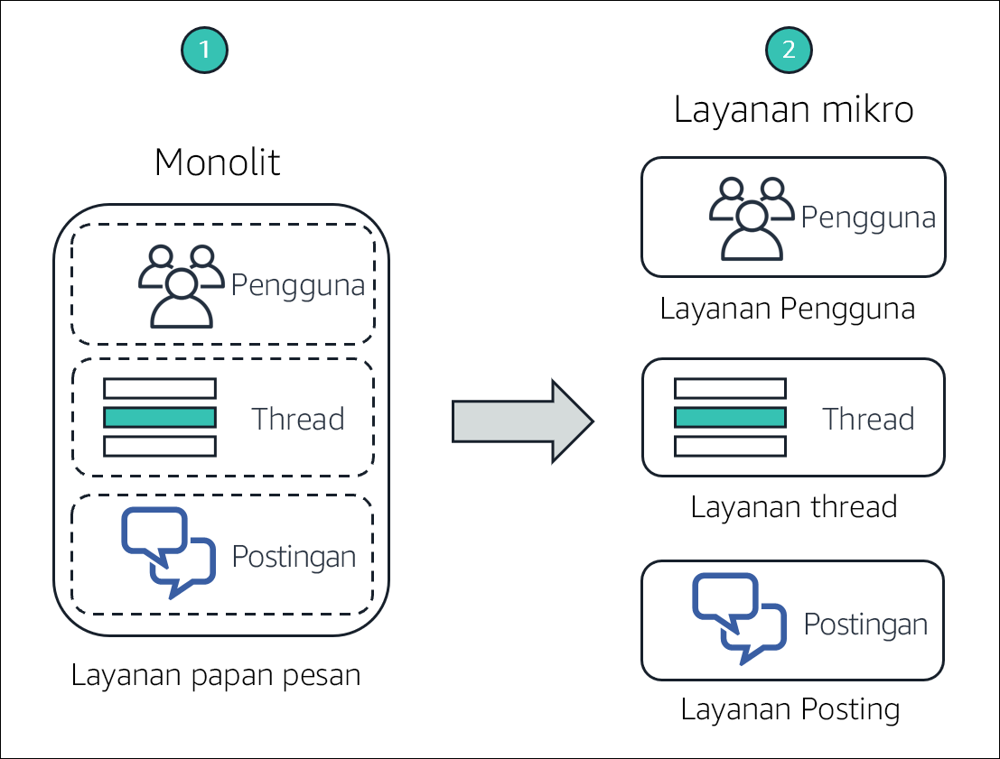
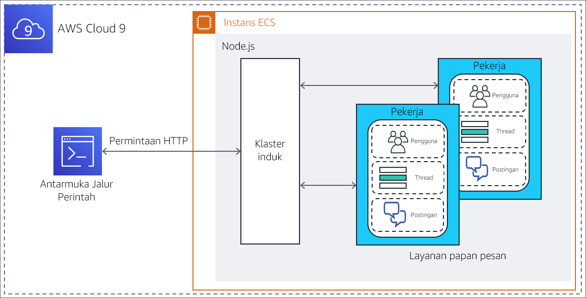
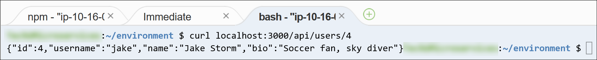
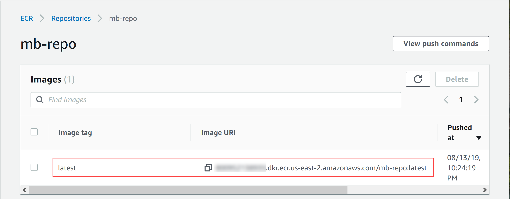
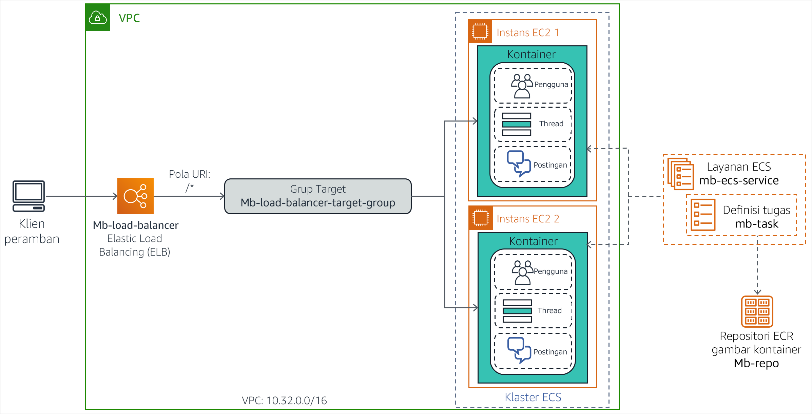
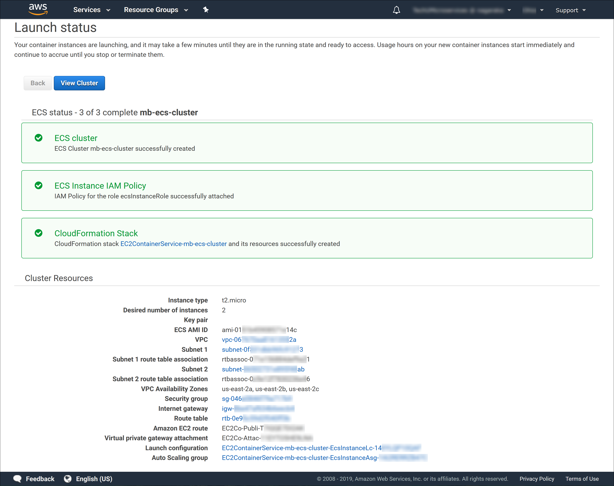
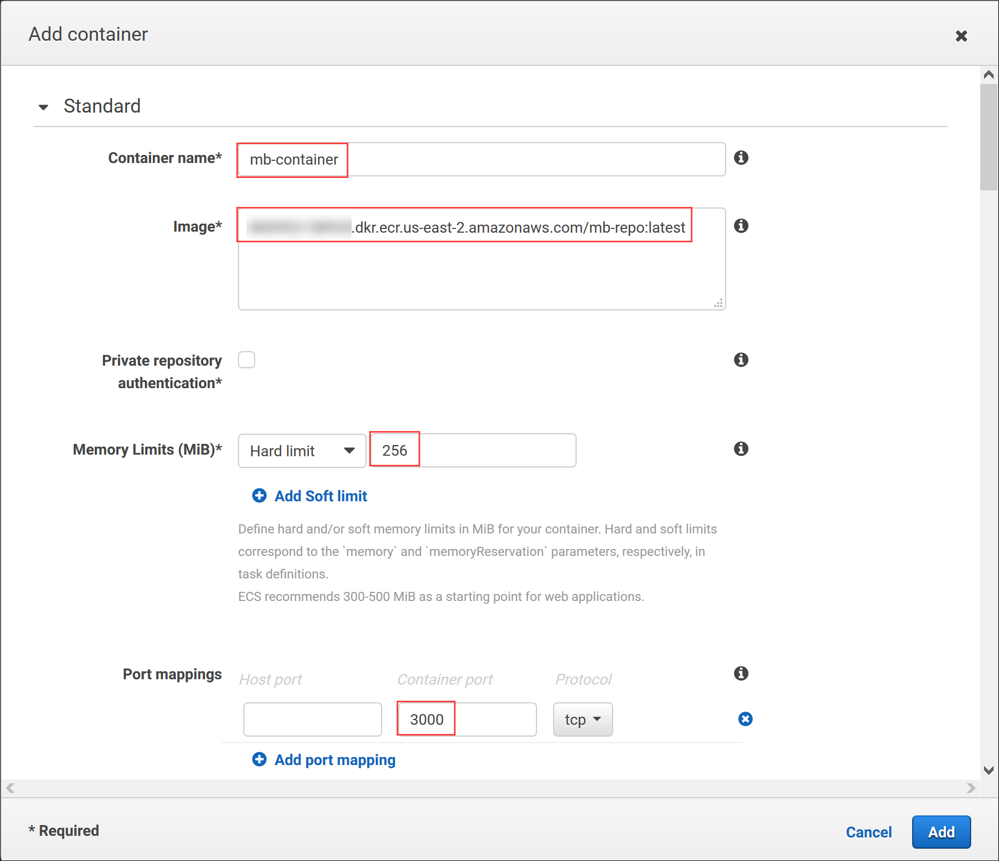
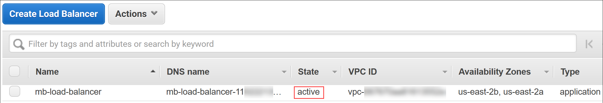
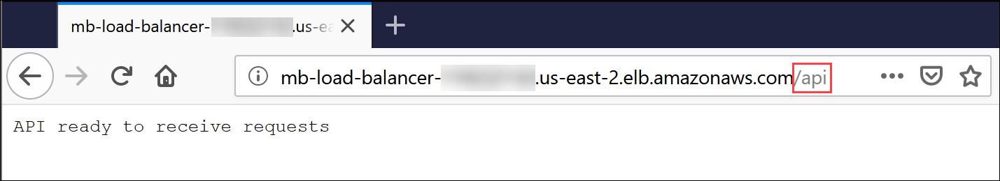

# (Opsional) Modul 13 - Lab Terpandu 1: Memecah Aplikasi Node.js Monolitik Menjadi Layanan Mikro

[//]: # "SKU: ILT-TF-200-ACACAD-2    Source Course: ILT-TF-100-TUMCSR-1"

## Gambaran umum dan tujuan lab

Arsitektur monolitik tradisional bisa jadi sulit untuk disesuaikan skalanya. Seiring berkembangnya basis kode aplikasi, aplikasi menjadi sulit untuk diperbarui dan dipelihara. Fitur baru, bahasa, kerangka kerja, dan teknologi bisa jadi sulit dan rumit untuk diperkenalkan, sehingga dapat membatasi inovasi dan ide-ide baru.

Dalam arsitektur layanan mikro, setiap komponen aplikasi berjalan sebagai layanannya sendiri. Aplikasi tersebut dibangun di seputar kemampuan bisnis, dan setiap layanan melakukan satu fungsi. Layanan mikro dapat ditulis dengan menggunakan kerangka kerja dan bahasa pemrograman yang berbeda, dan layanan tersebut berkomunikasi dengan layanan lain melalui antarmuka pemrograman aplikasi (API) yang didefinisikan dengan baik. Terakhir, Anda dapat men-deploy-nya secara tersendiri—sebagai layanan tunggal atau sebagai grup layanan.

Dalam lab opsional ini, Anda akan memigrasikan aplikasi monolitik yang berjalan di server Node.js standar ke lingkungan Docker yang dalam kontainer. Anda kemudian akan memfaktor ulang (refactor) aplikasi ke dalam layanan mikro dan men-deploy-nya ke lingkungan dalam kontainer, yang diorkestrasi oleh Amazon Elastic Container Service (Amazon ECS). Aplikasi Node.js mengimplementasikan fungsi papan pesan sederhana tempat *pengguna* dapat membuat topik *utas*, dan mem-posting *pesan* pada setiap utas.


Setelah menyelesaikan lab ini, Anda akan mampu:

- Memigrasikan aplikasi Node.js monolitik untuk berjalan di kontainer Docker

- Memfaktor ulang (refactor) aplikasi Node.js dari desain monolitik menjadi arsitektur layanan mikro

- Men-deploy aplikasi layanan mikro Node.js dalam kontainer ke Amazon ECS


Diagram berikut menggambarkan evolusi desain aplikasi saat pindah dari monolitik menjadi berbasis layanan mikro.




&nbsp;

Diagram tersebut menyoroti perbedaan antara pendekatan monolitik dan desain layanan mikro berikut ini:

* Dalam desain monolitik, semua fungsi dari aplikasi Node.js dikemas dan dijalankan sebagai layanan tunggal. Jika salah satu fungsi gagal, seluruh aplikasi gagal. Demikian juga, jika satu fungsi aplikasi mengalami lonjakan permintaan, semua fungsi dalam layanan harus ditingkatkan bersama-sama.

* Dalam arsitektur layanan mikro, setiap fungsi dari aplikasi Node.js berjalan sebagai layanan terpisah. Layanan dapat meningkat dan diperbarui secara terpisah dari layanan lain.

<br/>

## Durasi

Dibutuhkan sekitar **3 jam** untuk menyelesaikan lab ini.

<br/>

## Pembatasan layanan AWS

Dalam lingkungan lab ini, akses ke layanan AWS dan tindakan layanan mungkin dibatasi untuk orang-orang yang diperlukan untuk menyelesaikan instruksi lab. Anda mungkin akan mengalami error jika mencoba mengakses layanan lain atau melakukan tindakan di luar yang dijelaskan di lab ini.

<br/>

## Mengakses Konsol Manajemen AWS

1. Di bagian atas instruksi ini, pilih <span id="ssb_voc_grey">Start Lab</span> (Mulai Lab) untuk meluncurkan lab Anda.

   Panel **Start Lab** (Mulai Lab) terbuka dan menampilkan status lab.

   <i class="fas fa-info-circle"></i> **Tip**: Jika Anda memerlukan lebih banyak waktu untuk menyelesaikan lab, mulai ulang pengatur waktu untuk lingkungan dengan memilih tombol <span id="ssb_voc_grey">Start Lab</span> (Mulai Lab) lagi.

2. Tunggu hingga panel **Start Lab** (Mulai Lab) menampilkan pesan *Lab status: ready* (Status lab: siap), lalu tutup panel dengan memilih **X**.

3. Di bagian atas instruksi ini, pilih <span id="ssb_voc_grey">AWS</span>.

   Tindakan ini akan membuka Konsol Manajemen AWS di tab browser baru. Anda akan masuk ke sistem secara otomatis.

   <i class="fas fa-exclamation-triangle"></i> **Tip**: Jika tab browser baru tidak terbuka, banner atau ikon biasanya berada di bagian atas browser Anda dengan pesan bahwa browser Anda mencegah situs membuka jendela sembulan. Pilih banner atau ikon, lalu pilih **Allow pop-ups** (Izinkan sembulan).

4. Atur tab **AWS Management Console**(Konsol Manajemen AWS) agar ditampilkan bersama instruksi ini. Idealnya, Anda perlu membuka kedua tab browser secara bersamaan, sehingga Anda dapat mengikuti langkah-langkah lab dengan lebih mudah.

   <i class="fas fa-exclamation-triangle"></i> **Jangan mengubah Wilayah kecuali secara khusus diperintahkan untuk melakukannya**.

<br/>

## Tugas 1: Mempersiapkan lingkungan pengembangan

Lingkungan AWS Cloud9 dibuat untuk Anda selama proses pembuatan lingkungan lab. AWS Cloud9 adalah lingkungan pengembangan terintegrasi (IDE) berbasis cloud yang bisa digunakan untuk menulis, menjalankan, dan men-debug kode pada browser. AWS Cloud9 hadir berupa paket dengan alat-alat yang penting untuk bahasa pemrograman populer, dan menyediakan akses ke AWS Command Line Interface (AWS CLI) di tab sesi terminal. Lingkungan AWS Cloud9 Anda memiliki akses ke semua sumber daya AWS yang diizinkan untuk ID pengguna yang Anda gunakan untuk masuk ke Konsol Manajemen AWS.


Untuk menyiapkan lingkungan pembangunan, Anda akan membuka AWS Cloud9 IDE, serta mengunduh dan mengekstrak *file *lab** yang diperlukan.

5. Di tab browser **AWS Management Console** (Konsol Manajemen AWS), perluas **All services** (Semua layanan), lalu pilih **Developer Tools > Cloud9** (Alat Developer > Cloud9).

6. Di kartu **Cloud9-IDE**, pilih **Open IDE** (Buka IDE)

   IDE terbuka di tab browser baru dan menampilkan beberapa tab, termasuk tab **Welcome** (Selamat Datang).

   Selanjutnya, Anda akan mengunduh dan mengekstrak file lab yang diperlukan.

7. Di panel bawah IDE, masukkan perintah berikut di tab terminal berlabel **bash - “ip-nnn-nnn-nnn-nnn”**:

    ```bash
    curl -s https://aws-tc-largeobjects.s3.amazonaws.com/ILT-TF-100-TUHAWA-1/lab-four/lab-files-ms-node-js.tar.gz | tar -zxv
    ```

    Perintah ini mengambil file arsip terkompresi yang berisi file lab. Perintah ini juga mengekstrak isi file dalam folder **~/environment** AWS Cloud9. Perintah output harus seperti contoh berikut:
    
    
    
    &nbsp;
    
    File yang diunduh dan diekstrak terlihat di jendela **Environment (Lingkungan)** (di panel kiri).
    
    
    
    &nbsp;
    
    Anda dapat melihat folder berikut:
    
      - **1-no-container** — Berisi file yang terkait dengan implementasi *monolithic (monolitik)* aplikasi. Implementasi ini dimaksudkan untuk berjalan langsung pada server Node.js.
    
      - **2-containerized-monolith** — Berisi file yang terkait dengan implementasi *monolithic (monolitik)* dari aplikasi. Implementasi ini dimaksudkan untuk berjalan di lingkungan Docker dalam kontainer, diorkestrasi oleh Amazon ECS.
    
      - **3-containerized-microservices** — Berisi file yang terkait dengan implementasi *microservices (layanan mikro)* dari aplikasi. Implementasi ini dimaksudkan untuk berjalan di lingkungan Docker dalam kontainer, diorkestrasi oleh Amazon ECS.
    
    Tetap buka tab AWS Cloud9 IDE di seluruh lab ini, karena Anda akan sering menggunakannya.

<br/>
## Tugas 2: Menjalankan aplikasi pada server Node.js dasar

Aplikasi Node.js dasar adalah layanan monolitik yang dirancang untuk berjalan langsung pada server, tanpa kontainer. Dalam tugas ini, Anda men-deploy aplikasi ke server Node.js yang diinstal pada instans yang menjalankan lingkungan AWS Cloud9 Anda. Anda kemudian menguji aplikasi dengan menggunakan terminal AWS CLI untuk memanggil metode API RESTful.

Arsitektur deployment dan alur permintaan diilustrasikan dalam diagram berikut.



&nbsp;

**Catatan**: Implementasi monolitik aplikasi menggunakan fungsi *klaster* Node.js untuk menghasilkan satu proses pekerja per inti CPU. Proses berbagi port tunggal, dan dipanggil secara round-robin oleh penyeimbang beban yang dibangun ke dalam Node.js. Fitur ini meningkatkan skalabilitas pada server yang memiliki beberapa inti CPU.

Dalam tugas ini, Anda akan:

- Menginstal modul Node.js yang diperlukan oleh aplikasi

- Meninjau desain dan kode aplikasi

- Menjalankan aplikasi

<br/>

### Tugas 2.1: Menginstal modul Node.js yang diperlukan

Aplikasi papan pesan menggunakan dua modul dari kerangka kerja *koa* Node.js dalam implementasinya: *koa* dan *koa-router*. *Koa.js* adalah kerangka kerja aplikasi web Node.js yang banyak digunakan yang memfasilitasi pembangunan aplikasi JavaScript sisi server yang asinkron.

8. Dalam tab terminal, masukkan perintah berikut untuk menginstal modul *koa* dan *koa-router*:

    ```bash
    cd ~/environment/1-no-container
    npm install koa
    npm install koa-router
    ```

    
    
    &nbsp;
    
    Modul diunduh dan diinstal dalam folder **1-no-container/node_modules** dari folder **~/environment** AWS Cloud9. Anda dapat mengabaikan pemberitahuan, peringatan, dan pesan pembaruan dalam output.

<br/>

### Tugas 2.2: Meninjau desain dan kode aplikasi

Komponen yang menerapkan aplikasi papan pesan monolitik berada di folder **1-no-container**. Tinjau komponen tersebut untuk mendapatkan pemahaman tentang desain dan kode aplikasi.

9. Di jendela **Environment** (Lingkungan) di sebelah kiri, perluas folder **1-no-container**. Komponen aplikasi meliputi:

   - Folder **node_modules** – Folder ini dibuat ketika Anda menginstal modul JavaScript yang diperlukan dalam subtugas sebelumnya. Folder ini berisi kode sumbernya.

   - **db.json** – Sebuah objek JavaScript Object Notation (JSON) yang menyimulasikan basis data papan pesan. Objek ini berisi atribut yang mewakili *pengguna*, *utas*, dan *posting*, dengan nilai-nilai sampel yang sesuai.

   - **index.js** – Program JavaScript yang merupakan titik masuk aplikasi.

   - **package.json** – Sebuah objek JSON yang menjelaskan aplikasi, titik masuk, dan dependensinya.

   - **package-lock.json** – Sebuah objek JSON yang secara otomatis dihasilkan ketika Anda menginstal modul JavaScript yang diperlukan dalam folder **node_modules**. Objek ini digunakan oleh utilitas instalasi, *npm*, untuk melacak modifikasi yang dibuat pada folder.

   - **server.js** – Program JavaScript yang mendefinisikan metode API RESTful aplikasi, dan mengimplementasikan handler masing-masing.

10. Periksa objek *package.json*. Di jendela **Environment** (Lingkungan), buka **package.json** di tab editor dengan mengekliknya dua kali. Perhatikan atribut berikut dari objek JSON:

   - **Baris 2 sampai 5** – Atribut *dependensi* mendefinisikan dependensi modul JavaScript untuk aplikasi. Perhatikan bahwa modul *koa* dan *koa-router* yang Anda instal di subtugas sebelumnya tercantum di sini.

   - **Baris 6 sampai 8** – Atribut *skrip* menyatakan program *index.js* sebagai titik masuk ke aplikasi.

11. Periksa objek **db.json**. Di jendela **Environment** (Lingkungan), buka **db.json** di tab editor dengan mengekliknya dua kali. Perhatikan atribut berikut dari objek JSON:

   - **Baris 2 sampai 27** – Baris-baris ini menentukan atribut *pengguna* yang mewakili pengguna terdaftar dari papan pesan. Nilai atribut adalah sebuah daftar berisi *empat* sampel pengguna dengan nama berikut: *Marcerline Singer*, *Finn Alberts*, *Paul Barium*, dan *Jake Storm*.

   - **Baris 29 sampai 45** – Baris-baris ini menentukan atribut *utas* yang mewakili utas aktif saat ini di papan pesan. Nilai atribut adalah sebuah daftar beris *tiga* sampel utas dengan judul berikut:

      - *Did you see the Brazil game?*

      - *New French bakery opening in the neighborhood tomorrow*

      - *In search of a new guitar*

      - **Baris 47 sampai 78** – Baris-baris ini menentukan atribut *posting* yang mewakili pesan yang diposting pada utas aktif. Nilai atribut adalah sebuah daftar berisi *enam* sampel posting pesan.

12. Tinjau kode untuk *index.js*. Di jendela **Environment** (Lingkungan), buka **index.js** di tab editor dengan mengekliknya dua kali. Perhatikan informasi berikut:

   - **Baris 1 sampai 3** – Baris-baris ini mengimpor modul JavaScript yang dibutuhkan program, khususnya: *klaster*, *http*, dan *os*.

   - **Baris 3** – Baris ini menggunakan modul *os* untuk menanyakan jumlah inti CPU yang tersedia di server.

   - **Baris 5 sampai 15** – Baris-baris ini dijalankan pertama kalinya saat program dipanggil (ketika aplikasi dimulai). Baris tersebut membuat utas *Leader* (Pemimpin) untuk klaster dan satu utas *worker* (pekerja) untuk setiap inti CPU yang tersedia di server.

   - **Baris 16 sampai 19** – Baris-baris ini menangani setiap permintaan pada aplikasi dengan memanggil program *server.js* di utas *worker* (pekerja) saat ini.

13. Terakhir, tinjau kode untuk *server.js*. Di jendela **Environment** (Lingkungan), buka **server.js** di tab editor dengan mengekliknya dua kali. Gunakan komentar yang disediakan dalam kode untuk memudahkan pemahaman Anda tentang logika. Secara khusus, perhatikan informasi berikut ini:

   - **Baris 3** – Baris ini mengimpor *db.json*, objek JSON yang menyimulasikan basis data.

   - **Baris 6 sampai 11** – Baris-baris ini menentukan fungsi generator yang berjalan untuk setiap permintaan. Tujuannya adalah untuk mencetak baris yang berisi *metode HTTP*, *URL jalur sumber daya*, dan *waktu respons* untuk setiap permintaan yang diproses.

   - **Baris 13 sampai 47** – Baris-baris ini menentukan metode API RESTful aplikasi dan implementasinya. Secara khusus, aplikasi dapat menanggapi panggilan RESTful berikut.

      - `GET /api/users`: Mengembalikan koleksi *pengguna* dalam basis data

      - `GET /api/users/:userId`: Mengembalikan informasi untuk *pengguna* yang diidentifikasi oleh *:userId*

      - `GET /api/threads`: Mengembalikan koleksi *utas* dalam basis data

      - `GET /api/threads/:threadId`: Mengembalikan informasi untuk *utas* yang diidentifikasi oleh *:threadId*

      - `GET /api/posts/in-thread/:threadId`: Mengembalikan koleksi *pesan posting* untuk *utas* yang diidentifikasi oleh *:threadId*

      - `GET /api/posts/by-user/:userId`: Mengembalikan koleksi *pesan posting* untuk *pengguna* yang diidentifikasi oleh *:userId*

      - `GET /api/`: Mengembalikan pesan *API ready to receive requests* (API siap untuk menerima permintaan)

      - `GET /`: Mengembalikan pesan *Ready to receive requests* (Siap untuk menerima permintaan)

   - **Baris 52** - Baris ini mendefinisikan *nomor port* tempat aplikasi mendengarkan permintaan

<br/>

### Tugas 2.3: Menjalankan aplikasi

Dalam subtugas ini, Anda akan memulai server Node.js dan menjalankan aplikasi papan pesan. Kemudian, Anda akan menguji beberapa metode API RESTful.

14. Di tab terminal, mulai Node.js dan aplikasi dengan memasukkan perintah berikut:

    ```bash
    npm start
    ```

    
    
    &nbsp;
    
    Server dimulai, dan titik masuk aplikasi, *index.js*, dijalankan. Pertama kali dipanggil, * index.js* membuat dua utas klaster—*Leader* dan * Worker*—untuk memproses permintaan.
    
    Selanjutnya, Anda akan membiarkan sesi terminal saat ini tetap aktif dan membuka tab terminal kedua untuk menguji API RESTful aplikasi.

15. Di panel bawah, buka tab terminal baru dengan memilih **(+)** dan memilih **New Terminal** (Terminal Baru). Anda sekarang memiliki dua terminal tempat Anda bisa memasukkan perintah.

16. Di **tab terminal kanan**, ambil sumber daya `/api/users` dengan memasukkan perintah berikut:

    ```bash
    curl localhost:3000/api/users
    ```

    Panggilan RESTful mengembalikan objek JSON yang berisi daftar *users* (pengguna) dalam basis data papan pesan.
    
    

&nbsp;

17. Pilih **left terminal tab** (tab terminal kiri). Anda melihat pesan output dari server.js bahwa permintaan metode GET telah diproses pada sumber daya, yang diidentifikasi oleh jalur `/api/users`. Diperlukan waktu *4* milidetik untuk memproses permintaan ini.


   &nbsp;

18. Ambil informasi hanya untuk pengguna *keempat* dalam basis data. Di **tab terminal kanan**, masukkan perintah berikut:

    ```bash
    curl localhost:3000/api/users/4
    ```

    Informasi untuk *Jake Storm*, pengguna keempat dalam basis data, dikembalikan:





19. Selanjutnya, ambil semua *utas* yang saat ini ada dalam basis data. Di **tab terminal kanan**, masukkan perintah berikut:

    ```bash
    curl localhost:3000/api/threads
    ```

    Objek JSON yang berisi semua utas dalam basis data dikembalikan:
    
    
    
    &nbsp;

20. Terakhir, ambil semua *posting* untuk utas *pertama* dalam basis data. Di **tab terminal kanan**, masukkan perintah berikut:

    ```bash
    curl localhost:3000/api/posts/in-thread/1
    ```

    Objek JSON yang berisi dua posting pesan dikembalikan:
    
    
    
    &nbsp;

21. Hentikan server Node.js. Di **left terminal tab** (tab terminal kiri), tekan CTRL+C untuk mengakhiri proses server.

Anda telah memvalidasi bahwa aplikasi merespon permintaan GET dengan benar. Pada tugas berikutnya, Anda akan memasukkan aplikasi dalam kontainer.

<br/>

## Tugas 3: Melakukan containerization monolit untuk Amazon ECS

Kontainer membungkus kode aplikasi dalam unit deployment, yang menangkap snapshot kode dan dependensinya. Kontainer dapat membantu memastikan bahwa aplikasi men-deploy dengan cepat, andal, dan konsisten, terlepas dari lingkungan deployment-nya.

Dalam tugas ini, Anda akan membangun gambar kontainer untuk aplikasi papan pesan monolitik dan mendorongnya ke Amazon Elastic Container Registry (Amazon ECR). Langkah ini mempersiapkan aplikasi untuk deployment ke Amazon ECS.

Secara khusus, Anda akan melakukan langkah-langkah berikut:

- Menyiapkan aplikasi untuk containerization Docker

- Menyediakan repositori

- Membangun dan mendorong gambar Docker ke repositori

<br/>
### Tugas 3.1: Mempersiapkan aplikasi untuk containerization Docker

Untuk menempatkan aplikasi papan pesan ke dalam kontainer Docker, perubahan berikut harus dilakukan pada aplikasi:

- Hapus penggunaan fitur *cluster* Node.js dan konversi aplikasi menjadi desain proses tunggal. Dengan kontainer Docker, tujuannya adalah untuk menjalankan satu proses tunggal per kontainer, bukan satu klaster proses.

- Buat *Dockerfile* untuk aplikasi. File ini pada dasarnya adalah skrip bangunan yang berisi instruksi tentang cara membangun *gambar kontainer* untuk aplikasi.

Versi aplikasi yang siap-kontainer disediakan untuk Anda dalam folder **2-containerized-monolith** lingkungan AWS Cloud9 Anda. Luangkan beberapa menit untuk meninjau file dan memahami perubahan yang dibuat guna mempersiapkan aplikasi untuk containerization.

22. Di jendela **Environment** (Lingkungan) di sebelah kiri, perluas folder **2-containerized-monolith**, dan buka **package.json** di tab editor dengan mengekliknya dua kali.

   Di **Baris 7**, perhatikan bahwa titik masuk ke dalam aplikasi diubah dari *index.js* menjadi *server.js*. File *index.js* tidak lagi ada dalam folder aplikasi. File *index.js* berisi logika inisialisasi untuk fitur *cluster* Node.js, dan Anda tidak akan lagi menggunakan fitur tersebut.

23. Di jendela **Environment** (Lingkungan), perluas folder **2-containerized-monolith**, dan buka file **server.js** di tab editor dengan mengekliknya dua kali.

   Satu-satunya perbedaan dari versi tanpa kontainer adalah penambahan **Baris 54**, yang mencetak pesan *Worker started* (Pekerja dimulai) saat aplikasi pertama kali dimulai.

24. Di jendela **Environment** (Lingkungan), perluas folder **2-containerized-monolith**, dan buka **Dockerfile** di tab editor dengan mengekliknya dua kali.

   File ini berisi instruksi tentang cara membangun gambar kontainer untuk aplikasi.


&nbsp;

Perhatikan informasi berikut:

- **Baris 1** - Gambar dasar tempat gambar kontainer akan dibangun. *alpine-node*, yang merupakan gambar Node.js, ada di sini.

- **Baris 3** – Baris ini menetapkan direktori kerja sistem file pada gambar ke */srv*.

- **Baris 4** – Baris ini menambahkan isi folder **2-containerized-monolith** (folder aplikasi) ke direktori kerja sistem file gambar saat ini (yang ditetapkan di baris sebelumnya).

- **Baris 5** – Baris ini memanggil perintah *npm install* untuk menginstal semua dependensi pustaka aplikasi yang dinyatakan dalam file *package.json*.

- **Baris 7** – Baris ini menginformasikan Docker bahwa kontainer mendengarkan pada port 3000 ketika berjalan.

- **Baris 8** – Baris ini meminta Docker untuk menjalankan perintah *node server.js*, yang memulai aplikasi ketika gambar dimulai.

Karena telah memahami bagaimana gambar kontainer untuk aplikasi dibangun, selanjutnya Anda akan memeriksa tempat untuk menempatkan gambar setelah dibangun.

<br/>
### Tugas 3.2: Menyediakan repositori

Gambar kontainer Docker dimaksudkan untuk disimpan dalam repositori untuk tujuan berbagi, kontrol versi, dan manajemen yang lebih mudah. *Amazon ECR* memudahkan developer untuk menyimpan, mengelola, dan men-deploy gambar kontainer Docker. Selain itu, Amazon ECR terintegrasi dengan Amazon ECS, yang memungkinkan Amazon ECS untuk menarik gambar kontainer secara langsung untuk deployment produksi.

Dalam subtugas ini, Anda akan membuat repositori di Amazon ECR sebagai tempat gambar kontainer Docker untuk aplikasi papan pesan.

25. Di tab browser **Your environments** (Lingkungan Anda), pilih **Services** (Layanan), dan kemudian pilih **Container > Elastic Container Registry** (Kontainer > Elastic Container Registry).

   Konsol Amazon ECR terbuka.

26. Dalam **Create a repository** (Buat repositori), pilih **Get Started** (Mulai).

27. Dalam kotak **Repository name** (Nama repositori), masukkan `mb-repo`.

28. Pilih **Create repository** (Buat repositori).

   Sebuah pesan di bagian atas halaman menunjukkan bahwa repositori berhasil dibuat.

   **Catatan:** *Jangan tutup jendela yang menampilkan pesan.* Anda akan menggunakannya di subtugas berikutnya.

<br/>

### Tugas 3.3: Membangun dan mendorong gambar Docker

Anda sekarang siap untuk membangun gambar kontainer untuk aplikasi dan mendorongnya ke repositori Amazon ECR yang Anda buat.

Salah satu fitur yang berguna dari konsol Amazon ECR adalah templat perintah siap pakai yang disediakan untuk membangun dan mendorong gambar ke repositori baru. Anda menggunakan perintah AWS CLI yang disediakan ini dalam langkah berikutnya.

29. Sebelum Anda berhasil menjalankan langkah berikutnya, Anda harus meningkatkan AWS CLI. Untuk melakukan ini, buka tab browser **AWS Cloud9 IDE**, dan dalam **left terminal tab** (tab terminal kiri), masukkan perintah berikut:

      ```bash
      pip3 install awscli --upgrade --user
      export PATH=$HOME/.local/bin:$PATH
      ```

30. Kembali ke tab browser konsol **Amazon ECR**, dan di jendela pesan pada bagian atas halaman, pilih **View push commands** (Lihat perintah push).

   Jendela sembulan **Push commands for mb-repo** (Perintah push untuk mb-repo) terbuka. Jendela ini berisi empat perintah AWS CLI yang disesuaikan untuk *mb-repo* dan sengaja dibangun untuk:

   - Mengautentikasi klien Docker Anda ke registri Amazon ECR
   - Membangun gambar Docker Anda
   - Menandai gambar Docker Anda
   - Mendorong gambar Docker Anda ke repositori

Jendela pop-up menawarkan dua versi perintah: satu untuk *macOS/Linux* dan satu untuk *Microsoft Windows*.

31. Pastikan tab **macOS/Linux** dipilih karena Anda akan menjalankan perintah ini di lingkungan AWS Cloud9 Anda.

   Pertama, Anda akan menyalin dan menjalankan perintah untuk memasukkan klien Docker Anda ke registri Anda.

32. Di jendela sembulan, cari perintah *pertama* dan kemudian salin perintah ke clipboard dengan memilih ikon **Copy** (Salin).

    Perintah ini terlihat seperti contoh berikut:

    ```bash
    $ aws ecr get-login-password --region us-east-1 | docker login --username AWS --password-stdin 01234567890.dkr.ecr.us-east-1.amazonaws.com/mb-repo
    ```

33. Beralih ke tab browser **AWS Cloud9 IDE**.

34. Di **left terminal tab** (tab terminal kiri), tempelkan perintah yang disalin dan jalankan dengan menekan ENTER:


   &nbsp;

   Jika berhasil dijalankan, perintah akan mengembalikan pesan *Login Succeeded* (Berhasil Masuk). Anda dapat mengabaikan peringatan yang ditampilkan.

   Selanjutnya, Anda akan membangun gambar Docker untuk aplikasi Anda.

   **Catatan**: Bila tab terminal tertentu tidak disebutkan dalam langkah instruksi, gunakan tab terminal *kiri*.

35. Di tab terminal, ubah direktori ke folder **2-containerized-monolith** dengan memasukkan perintah berikut:

    ```bash
    cd ~/environment/2-containerized-monolith
    ```

36. Beralih ke tab browser konsol **Amazon ECR**.

37. Dalam jendela **Push commands for mb-repo** (Perintah push untuk mb-repo), cari perintah *kedua* dan salin perintah dengan memilih ikon **Copy** (Salin).

    Perintah ini terlihat seperti contoh berikut:

    ```bash
    docker build -t mb-repo .
    ```

    Pastikan untuk menyertakan titik (.) di akhir perintah.

38. Beralih ke tab browser **AWS Cloud9 IDE**.

39. Dalam tab terminal, tempel perintah yang disalin dan jalankan dengan menekan ENTER:


   &nbsp;

   Perintah *build* (membangun) menghasilkan beberapa baris output saat menjalankan instruksi yang ada di *Dockerfile* aplikasi. Setelah selesai, Anda melihat pesan *Successfully built nnnnnnnnnn* (Berhasil dibangun nnnnnnnnnn) dan *Successfully tagged mb-repo:latest* (Berhasil ditandai mb-repo:latest).

   Selanjutnya, Anda akan menandai gambar dengan URI repositori, sehingga dapat terdorong oleh repositori.

40. Beralih ke tab browser konsol **Amazon ECR**.

41. Dalam jendela **Push commands for mb-repo** (Perintah push untuk mb-repo), cari perintah *ketiga* dan pilih ikon **Copy** (Salin).

    Perintah ini terlihat seperti contoh berikut:

    ```bash
    docker tag mb-repo:latest 1234567890.dkr.ecr.us-east-2.amazonaws.com/mb-repo:latest
    ```

42. Beralih ke tab browser **AWS Cloud9 IDE**.

43. Di tab terminal, tempel dan jalankan perintah yang disalin:


   &nbsp;

   Perintah tidak mengembalikan apa pun jika berhasil diselesaikan.

   Terakhir, Anda akan mendorong gambar kontainer ke repositori aplikasi.

44. Beralih ke tab browser konsol **Amazon ECR**.

45. Dalam jendela **Push commands for mb-repo** (Perintah push untuk mb-repo), cari perintah *keempat* dan salin.

    Perintah ini terlihat seperti contoh berikut:

    ```bash
    docker push 1234567890.dkr.ecr.us-east-2.amazonaws.com/mb-repo:latest
    ```

46. Beralih ke tab browser **AWS Cloud9 IDE**.

47. Di tab terminal, tempel dan jalankan perintah yang disalin:


   &nbsp;

   Perintah menghasilkan beberapa pesan saat tiap lapisan gambar didorong ke repositori.

   Selanjutnya, Anda akan memverifikasi bahwa gambar berhasil diunggah.

48. Beralih ke tab browser konsol **Amazon ECR**.

49. Tuto jendela **Push commands for mb-repo** (Perintah push untuk mb-repo).

50. Dalam daftar **Repositories** (Repositori), pilih **mb-repo**.

   Dalam daftar **Gambar**, Anda akan melihat gambar kontainer yang Anda dorong, yang dapat Anda identifikasi dengan tanda *terbaru*.



   &nbsp;

51. Rekam *Image URI* (URI Gambar). Dalam daftar **Images** (Gambar), cari **Image URI** (URI Gambar) dari gambar versi *terbaru*, dan pilih ikon **Copy** (Salin). Tempel nilai dalam editor teks. Anda akan menggunakannya di langkah berikutnya.

   Anda telah berhasil membuat gambar kontainer untuk aplikasi papan pesan, dan Anda juga telah mendorongnya ke repositori Amazon ECR.

<br/>

## Tugas 4: Men-deploy monolit ke Amazon ECS

Dalam tugas ini, Anda men-deploy aplikasi monolitik dalam kontainer ke lingkungan waktu aktif Amazon ECS. Secara khusus, Anda menggunakan Amazon ECS untuk membuat klaster terkelola instans Amazon Elastic Compute Cloud (Amazon EC2). Anda akan men-deploy gambar kontainer aplikasi Anda ke klaster ini. Klaster dikonfigurasi sebagai grup target Application Load Balancer, yang akan memberikan failover dan skalabilitas.

Diagram berikut menunjukkan arsitektur deployment aplikasi monolitik dalam kontainer. Diagram ini juga menampilkan sumber daya yang akan Anda buat dalam tugas ini.



&nbsp;

Langkah-langkah yang Anda lakukan dalam tugas ini adalah:

- Membuat klaster Amazon ECS.

- Membuat definisi tugas untuk gambar kontainer aplikasi.

- Membuat Application Load Balancer.

- Men-deploy aplikasi monolitik sebagai Layanan ECS.

- Uji aplikasi monolitik dalam kontainer.

<br/>
### Tugas 4.1: Membuat klaster Amazon ECS

Klaster Amazon ECS adalah pengelompokan logis instans EC2 tempat Anda dapat menjalankan tugas atau layanan yang mewakili aplikasi dalam kontainer Anda.

Dalam subtugas ini, Anda akan membuat sebuah klaster ECS dengan menggunakan konsol Amazon ECS. Wizard pembuatan klaster konsol memungkinkan Anda untuk membuat semua komponen infrastruktur yang diperlukan untuk membuat lingkungan klaster ECS. Komponen ini mencakup virtual private cloud (VPC), subnet, grup keamanan, gateway internet, dan peran AWS Identity and Access Management (IAM).

52. Kembali ke tab browser **AWS Management Console** (Konsol Manajemen AWS), pilih **Service** (Layanan), lalu pilih **Containers > Elastic Container Service** (Kontainer > Elastic Container Service).

53. Di panel navigasi, pilih **Amazon ECS > Cluster** (Amazon ECS > Klaster).

54. Di halaman **Cluster** (Klaster), pilih **Create Cluster** (Buat Klaster).

55. Di halaman **Select cluster template** (Pilih templat klaster), pilih kartu **EC2 Linux + Networking** (EC2 Linux + Jaringan).

56. Pilih **Next step** (Langkah berikutnya).

57. Di wizard **Configure cluster** (Konfigurasi klaster), konfigurasikan pengaturan berikut.
   - **Cluster name** (Nama klaster): `mb-ecs-cluster`
   - **Provisioning Model** (Model Penyediaan): *On-Demand Instance* (Instans Sesuai Permintaan)
   - **EC2 instance type** (Tipe instans EC2): *t2.micro*
   - **Number of instances** (Jumlah instans): `2`
   - **VPC**: *Create a new VPC* (Buat VPC baru)
   - **CIDR block** (Blok CIDR): `10.32.0.0/16`
   - **Subnet 1**: `10.32.0.0/24`
   - **Subnet 2**: `10.32.1.0/24`
   - **Security group** (Grup keamanan): *Create a new security group* (Buat grup keamanan baru)
   - **Security group inbound rules** (Aturan masuk grup keamanan): Biarkan di pengaturan default, yang mengizinkan lalu lintas masuk dari semua alamat IP pada port 80.

   **Catatan**: Pesan di bagian **Container instance IAM role** (IAM role instans kontainer) menyatakan bahwa Anda memberikan izin kepada Amazon ECS untuk membuat dan menggunakan **ecsInstanceRole**. Peran ini mengotorisasi instans EC2 di klaster untuk memanggil tindakan Amazon ECS.

58. Pilih **Create** (Buat).

   Halaman **Launch Status** (Status Peluncuran) terbuka, dan menunjukkan tugas yang dilakukan oleh wizard.

59. Tunggu sampai semua tugas memiliki tanda centang, yang menunjukkan bahwa tugas tersebut selesai.



   &nbsp;

   Sumber daya yang dibuat wizard tercantum di bagian **Cluster Resources** (Klaster Sumber daya).

60. Pilih **View Cluster** (Lihat Klaster).

   Halaman detail untuk *mb-ecs-cluster* terbuka. Bidang **Status** menunjukkan nilai *ACTIVE* (AKTIF).

61. Pilih tab **ECS Instance** (Instans ECS).

   Kedua instans EC2 untuk klaster (yang dibuat oleh wizard) terdaftar.

   **Catatan**: Mungkin diperlukan waktu beberapa menit untuk menampilkan dua instans EC2 dalam daftar. Jika Anda tidak melihat kedua instans, pilih **Refresh** (Segarkan).


&nbsp;

62. Pilih tab **Tasks** (Tugas).

   Tidak ada tugas yang di-deploy ke klaster. Selanjutnya Anda akan membuat satu tugas.

<br/>
### Tugas 4.2: Membuat definisi tugas untuk gambar kontainer aplikasi

Definisi tugas adalah daftar pengaturan konfigurasi mengenai cara menjalankan kontainer Docker di Amazon ECS. Definsi ini memberitahu Amazon ECS berbagai macam informasi, seperti:

- Gambar kontainer apa yang harus dijalankan?
- Berapa banyak CPU dan memori yang dibutuhkan kontainer?
- Port apa yang didengarkan oleh kontainer untuk lalu lintas?

Dalam subtugas ini, Anda akan membuat definisi tugas untuk gambar kontainer dari aplikasi papan pesan.

63. Di panel navigasi tab browser konsol **Amazon ECS**, pilih **Task Definitions** (Definisi Tugas).

64. Pilih **Create new Task Definition** (Buat Definisi Tugas baru).

65. Di halaman **Select launch type compatibility** (Pilih kompatibilitas jenis peluncuran), pilih kartu **EC2**.

66. Pilih **Next step** (Langkah berikutnya).

   Halaman **Configure task and container definitions** (Konfigurasikan tugas dan definisi kontainer) terbuka.

67. Dalam kotak **Task Definition Name** (Nama Definisi Tugas), masukkan `mb-task`.

68. Gulir ke bawah **Container Definitions** (Definisi Kontainer) dan pilih **Add container** (Tambahkan container).

   Jendela **Add container** (Tambahkan kontainer) terbuka.

69. Konfigurasikan pengaturan berikut ini.
   - **Container name** (Nama kontainer): `mb-container`
   - **Image** (Gambar): Tempelkan **Image URI** (URI Gambar) dari gambar kontainer aplikasi, yang telah Anda salin ke editor teks pada langkah sebelumnya.
   - **Memory Limits** (Batas Memori): Pilih *Hard *limit** (Batas keras) dan masukkan `256`. (Pengaturan ini menentukan jumlah maksimum memori yang diperbolehkan untuk digunakan oleh kontainer.)
   - **Port mappings > Container port** (Pemetaan port > Port kontainer): `3000` (Pengaturan ini menentukan port tempat kontainer menerima permintaan. Anda tidak perlu memasukkan nilai dalam **Host port** (Port host)

   Jendela **Add container** (Tambahkan kontainer) akan terlihat seperti contoh berikut:



   &nbsp;

70. Pilih **Add** (Tambah).

71. Gulir ke bawah dan pilih **Create** (Buat). Anda dapat mengabaikan peringatan apa pun.

   Sebuah pesan ditampilkan, menunjukkan bahwa definisi tugas berhasil dibuat. Perhatikan bahwa definisi secara otomatis diberi nomor versi *1*.


   &nbsp;

   Anda sekarang memiliki definisi tugas yang memberitahu Amazon ECS cara men-deploy kontainer aplikasi Anda di seluruh klaster.

<br/>

### Tugas 4.3: Membuat Application Load Balancer

Selanjutnya, Anda akan membuat Application Load Balancer yang mendistribusikan permintaan masuk ke instans EC2 yang berjalan di klaster ECS. Penyeimbang beban ini berada di VPC yang sama dan menggunakan grup keamanan yang sama dengan klaster ECS.

72. Di tab browser konsol **Amazon ECS**, pilih **Services** (Layanan), lalu pilih **Compute (Komputasi) > EC2**.

73. Di panel navigasi, gulir ke bawah dan pilih **Load Balancers** (Penyeimbang Beban).

74. Pilih **Create Load Balancer** (Buat Penyeimbang Beban).

   Halaman **Select load balancer type** (Pilih jenis penyeimbang beban) terbuka.

75. Di kartu **Application Load Balancer**, pilih **Create** (Buat).

   Wizard pembuatan Application Load Balancer terbuka.

76. Pada **Step 1: Configure Load Balancer** (Langkah 1: Konfigurasikan Penyeimbang Beban), konfigurasikan pengaturan berikut.
   - **Name** (Nama): `mb-load-balancer`
   - Gulir ke bawah sesi **Availability Zone** dan masukkan pengaturan ini.
      - **VPC**: Pilih *Amazon ECS cluster VPC ID*. ID ini serupa dengan *vpc-nnnnnnnnnn (10.32.0.0/16)*
      - **Availability Zone**: Pilih kedua Availability Zone.

77. Pilih **Next: Configure Security Settings** (Berikutnya: Konfigurasikan Pengaturan Keamanan).

78. Pada **Step 2: Configure Security Settings** (Langkah 2: Konfigurasikan Pengaturan Keamanan), Anda dapat mengabaikan peringatan bahwa penyeimbang beban Anda tidak menggunakan listener yang aman. Pilih **Next: Configure Security Groups** (Berikutnya: Konfigurasikan Grup Keamanan).

79. Pada **Step 3: Configure Security Groups** (Langkah 3: Konfigurasikan Grup Keamanan), konfigurasikan pengaturan ini.
   - **Assign a security group** (Tetapkan grup keamanan): *Pilih grup keamanan yang ada*
   - **Security Group ID** (ID Grup Keamanan):
      - Hapus *default*.
      - Pilih *EC2ContainerService-mb-ecs-cluster-EcsSecurityGroup*. (Ini adalah grup keamanan dari klaster ECS Anda.)

80. Pilih **Next: Configure Routing** (Berikutnya: Konfigurasikan Perutean).

81. Pada **Step 4: Configure Routing** (Langkah 4: Konfigurasikan Perutean), konfigurasikan pengaturan berikut.
   - **Target group** (Grup target): *New target group* (Grup target baru) (Anda menggunakan wizard untuk membuat grup target baru untuk penyeimbang beban.)
   - **Name** (Nama): `mb-load-balancer-target-gorup`
   - **Protocol** (Protokol) dan **Port**: Biarkan pengaturan ini pada nilai default *HTTP* dan *80*. Aplikasi minta diakses melalui permintaan HTTP RESTful.
   - Perluas **Advanced health check settings** (Pengaturan pemeriksaan kesehatan lanjutan) dan masukkan pengaturan berikut.
      - **Healthy threshold** (Ambang batas sehat): `2` (Pengaturan ini memberi tahu penyeimbang beban bahwa target dianggap sehat jika menerima dua pemeriksaan kesehatan yang berhasil berturut-turut darinya.)
      - **Interval**: `6` (Pengaturan ini meningkatkan frekuensi pemeriksaan kesehatan menjadi setiap 6 detik sekali.)

82. Pilih **Next: Register Targets** (Berikutnya: Daftarkan Target).

83. Anda dapat melewatkan **Step 5: Register Targets** (Langkah 5: Daftarkan Target) karena Anda akan mendaftarkan *layanan ECS* sebagai target pada langkah berikutnya. Pilih **Next: Review** (Berikutnya: Tinjauan).

84. Di halaman ****Review** (Tinjauan), pastikan bahwa pengaturan sudah benar, lalu pilih **Create** (Buat).**

   Sebuah pesan seharusnya menunjukkan bahwa penyeimbang beban berhasil dibuat.

85. Pilih **Close** (Tutup).

   *mb-load-balancer* sekarang dalam daftar penyeimbang beban.

86. Tunggu beberapa saat, lalu pilih ikon **Refresh** (Segarkan). **Status** penyeimbang beban harus berubah menjadi *active* (aktif).



   &nbsp;

   Untuk menyelesaikan konfigurasi penyeimbang beban, Anda akan memodifikasi grup keamanannya untuk membuka port yang mengizinkan komunikasi internal antara penyeimbang beban dan instans dalam klaster ECS.

87. Pada tab ****Description** (Deskripsi) di bagian bawah, gulir ke bawah ke bagian **Keamanan**.**

88. Di samping **Security Groups** (Grup Keamanan), pilih tautan ID grup keamanan, yang seharusnya serupa dengan *sg-nnnnnnnnnn*.

   Halaman detail grup keamanan penyeimbang beban terbuka.

89. Untuk menyalin ID grup keamanan ke clipboard, buka tab **Details** (Detail) (di panel bawah), arahkan kursor ke **security group ID** (ID grup keamanan), lalu pilih ikon **Copy** (Salin).

   Anda akan menggunakan ID ini pada langkah berikutnya.

90. Di panel bawah, pilih tab **Inbound rules** (Aturan masuk).

   Aturan masuk untuk grup keamanan ditampilkan.

91. Pilih **Edit inbound rules** (Edit aturan masuk).

   Jendela dialog **Edit inbound rules** (Edit aturan masuk) terbuka.

92. Pilih **Add rule** (Tambahkan aturan).

   Baris baru muncul dalam daftar aturan, sehingga Anda dapat menambahkan aturan baru. Hal ini sudah dikonfigurasikan sebelumnya untuk *Custom TCP Rule* (Aturan TCP Kustom), yang merupakan jenis yang ingin Anda tambahkan.

93. Di baris baru, tambahkan konfigurasi berikut.
   - **Port Range** (Jangkauan Port): `31000-61000`
   - **Source > Custom** (Sumber > Kustom): Tempelkan ID grup keamanan dari clipboard.

94. Pilih **Save rules** (Simpan aturan).

   Daftar aturan masuk grup keamanan menunjukkan aturan baru yang Anda tambahkan.


&nbsp;

<br/>

### Tugas 4.4: Men-deploy monolit sebagai layanan ECS

Anda telah membuat semua komponen infrastruktur Amazon ECS yang diperlukan. Dalam subtugas ini, Anda akan men-deploy aplikasi monolitik dalam kontainer ke klaster sebagai layanan Amazon ECS.

Layanan ECS memungkinkan Anda untuk menjalankan dan mempertahankan sejumlah instans definisi tugas secara bersamaan dalam klaster ECS. Jika salah satu tugas gagal atau berhenti untuk alasan apa pun, pengatur jadwal layanan ECS akan meluncurkan instans definisi tugas lain untuk menggantinya. Dengan demikian, jumlah tugas yang diinginkan yang ditentukan dalam layanan tetap dapat dipertahankan.

Anda sekarang akan membuat layanan ECS untuk definisi tugas aplikasi papan pesan dengan menggunakan konsol Amazon ECS.

95. Di tab browser **AWS Management Console** (Konsol Manajemen AWS), pilih **Service** (Layanan), dan pilih **Containers > Elastic Container Service** (Kontainer > Elastic Container Service).

96. Di panel navigasi, pilih ** Tasks Definitions** (Definisi Tugas).

97. Dalam daftar **Task Definition** (Definisi Tugas), pilih tautan **mb-task**.

   Halaman terbuka dengan revisi dari definisi tugas yang tersedia.

98. Pilih **mb-task:1** dan pilih **Actions > Create Service** (Tindakan > Buat Layanan).

99. Pada **Step 1: Configure service** (Langkah 1: Konfigurasikan layanan), konfigurasikan pengaturan ini.
   - **Launch type** (Jenis peluncuran): *EC2* (Anda menjalankan aplikasi dalam kontainer secara langsung pada klaster instans EC2.)
   - **Service name** (Nama layanan): `mb-ecs-service`
   - **Service type** (Jenis layanan): *REPLICA* (Pengaturan ini menetapkan strategi penjadwalan yang menempatkan dan mempertahankan jumlah tugas yang diinginkan di seluruh klaster ECS.)
   - **Jumlah tugas**: `1` (Biasanya, untuk mengambil keuntungan penuh dari klaster, Anda akan memasukkan angka tinggi, tergantung pada beban permintaan yang Anda harapkan. Namun, agar latihan ini tetap simpel, tentukan yang ingin Anda luncurkan dan selalu pertahankan satu tugas di klaster.)

100. Pilih **Next step** (Langkah berikutnya).

101. Pada **Step 2: Configure network** (Langkah 2: Konfigurasikan jaringan), konfigurasikan pengaturan berikut.
   - **Jenis penyeimbang beban**: *Application Load Balancer* (Anda ingin tugas dalam beban layanan Anda diseimbangkan dengan *mb-load-balancer* yang Anda atur sebelumnya)
   - **Service IAM role** (IAM role layanan): *Create new role* (Membuat peran baru)
   - **Load balancer name** (Nama penyeimbang beban): *mb-load-balancer*
   - **Container name:port**: Bidang ini sudah diisi dengan informasi kontainer yang benar yang terkait dengan definisi tugas. Pilih **Add to load balancer** (Tambahkan ke penyeimbang beban). (Pengaturan ini akan mengaitkan kontainer dengan salah satu listener penyeimbang beban.)
   - **Production listener port** (Port listener produksi): *80:HTTP* (Pengaturan ini mengaitkan kontainer dengan listener penyeimbang beban untuk lalu lintas HTTP pada port 80)
   - **Target group name** (Nama grup target): *mb-load-balancer-target-group*

102. Pilih **Next step** (Langkah berikutnya).

103. Pada **Step 3: Set Auto Scaling (optional)** (Langkah 3: Atur Auto Scaling (opsional)), pilih **Next step** (Langkah berikutnya). Anda tidak perlu mengonfigurasi auto scaling tambahan.

104. Di halaman **Review** (Tinjauan), pastikan pengaturan sudah benar dan pilih **Create Service** (Buat Layanan).

   Halaman **Launch Status** (Status Peluncuran) terbuka, dan menunjukkan tugas yang dilakukan oleh wizard.

105. Tunggu sampai semua tugas menampilkan tanda centang, yang menunjukkan bahwa tugas tersebut selesai.


&nbsp;

106. Untuk membuka halaman detail untuk *mb-ecs-service*, pilih **View Service** (Lihat Layanan).

   Tab **Task** (Tugas) menunjukkan bahwa sekarang ada satu tugas yang menjalankan kontainer, dengan status *ACTIVATING* (MENGAKTIFKAN).

107. Setelah beberapa saat, pilih **Refresh** (Segarkan). **Last status** (Status terakhir) tugas seharusnya menunjukkan: *RUNNING* (BERJALAN).


&nbsp;

Anda telah berhasil men-deploy monolit dalam kontainer sebagai layanan ECS ke dalam klaster.

<br/>

### Tugas 4.5: Menguji monolit dalam kontainer

Anda sekarang akan memvalidasi deployment Anda dengan menguji metode API RESTful aplikasi papan pesan dari browser web.

Pertama, Anda akan mencari dan mencatat URL penyeimbang beban.

108. Di tab browser konsol **Amazon ECS**, pilih **Services** (Layanan), dan pilih **Compute > EC2** (Komputasi > EC2).

109. Di panel navigasi, gulir ke bawah dan pilih **Load Balancers** (Penyeimbang Beban).

   Daftar penyeimbang beban menunjukkan **mb-load-balancer**.

110. Pada tab **Description** (Deskripsi) di bagian bawah, buka **DNS name** (Nama DNS) dan pilih ikon **Copy** (Salin).

111. Tempelkan nilai nama DNS ke editor teks, dan beri label ` Nama DNS Penyeimbang Beban`. Anda akan menggunakan nilai ini beberapa kali pada langkah berikutnya.

112. Buka tab browser baru, tempelkan nama DNS ke bilah alamat, lalu tekan ENTER.


&nbsp;

Halaman terbuka dengan pesan *Ready to receive request* (Siap menerima permintaan). Pesan ini dikembalikan oleh aplikasi papan pesan ketika tidak ada jalur sumber daya yang disertakan dalam permintaan GET.

**Tip pemecahan masalah**: Jika Anda mendapatkan kode kesalahan HTTP terkait server, tunggu beberapa saat, lalu coba lagi. Kontainer mungkin perlu waktu beberapa menit untuk terdaftar sebagai sehat dan mulai menerima lalu lintas.

113. Di bilah alamat browser, tambahkan `/api` di akhir URL dan tekan ENTER.



&nbsp;

Aplikasi harus mengembalikan pesan *API ready to receive requests* (API siap menerima permintaan).

114. Uji pengambilan semua *pengguna* dalam basis data. Di bilah alamat browser, tambahkan `/users` di akhir URL dan tekan ENTER.


&nbsp;


Aplikasi mengembalikan objek JSON yang berisi daftar empat pengguna dalam basis data.

115. Ambil informasi untuk *pengguna pertama* dalam basis data. Di bilah alamat browser, tambahkan `/1` di akhir URL dan tekan **Enter**.


&nbsp;

Aplikasi mengembalikan objek JSON yang berisi informasi untuk *Marcerline Singer*, yang merupakan pengguna pertama dalam basis data.

116. Selanjutnya, Anda akan mengambil semua *utas* dalam basis data. Di bilah alamat browser, ubah URI setelah nama DNS penyeimbang beban menjadi `/api/threads` dan tekan ENTER.


&nbsp;

Aplikasi mengembalikan sebuah objek JSON yang berisi tiga utas dalam basis data.

117. Terakhir, ambil *posting* untuk *utas kedua* dalam basis data. Di bilah alamat browser, ubah URI setelah nama DNS penyeimbang beban menjadi `/api/posts/in-thread/2` dan tekan ENTER.


&nbsp;

Aplikasi mengembalikan objek JSON yang berisi pesan posting untuk utas kedua dalam basis data. Pesan-pesan tersebut terkait dengan toko roti.

118. Opsional, panggil jalur sumber daya lain yang dapat dilayani aplikasi. Setelah selesai pengujian, tutup tab browser aplikasi.

   Sekarang Anda telah berhasil melakukan containerization aplikasi papan pesan monolitik dan men-deploy-nya ke lingkungan Amazon ECS.

<br/>

## Tugas 5: Pemfaktoran ulang (refactor) monolit

Dalam tugas ini, Anda akan memecahkan aplikasi papan pesan monolitik dalam kontainer menjadi beberapa layanan mikro yang saling berhubungan. Anda kemudian akan mendorong setiap gambar layanan mikro ke repositori Amazon ECR. Setiap layanan mikro melakukan satu kemampuan aplikasi bisnis tunggal, dan dapat ditingkatkan secara mandiri dari layanan mikro lainnya. Aplikasi ini dibagi menjadi beberapa layanan mikro berikut, yang mewakili kelas objek tingkat atas yang dilayani oleh API aplikasi:

- Layanan mikro *pengguna* – Sebuah layanan untuk semua jalur REST yang terkait dengan *pengguna* (`/api/users/*`)

- Layanan mikro *utas* – Sebuah layanan untuk semua jalur REST yang terkait dengan *utas* (`/api/threads/*`)

- Layanan mikro *posting* – Sebuah layanan untuk semua jalur REST terkait *posting* (`/api/posts/*`)

Untuk mempercepat pemfaktoran ulang (refactor), versi layanan mikro aplikasi disediakan untuk Anda dalam folder **3-containerized-microservices** lingkungan AWS Cloud9 Anda.

Langkah-langkah yang Anda lakukan dalam tugas ini adalah:

- Meninjau aplikasi layanan mikro yang difaktor ulang (refactor)

- Menyediakan repositori Amazon ECR untuk setiap layanan mikro

- Membangun dan mendorong gambar untuk setiap layanan mikro

<br/>

### Tugas 5.1: Meninjau aplikasi layanan mikro yang difaktor ulang (refactor)

Dalam subtugas ini, Anda akan meluangkan waktu beberapa menit untuk meninjau file guna membantu Anda memahami perubahan yang dibuat untuk memfaktor ulang (refactor) aplikasi menjadi layanan mikro.

119. Beralih ke tab browser **AWS Cloud9 IDE**.

120. Di panel **Environment** (Lingkungan) di sebelah kiri, perluas folder **3-containerized-microservices**.

   Folder ini sekarang memiliki tiga subfolder terpisah bernama **posting**, **utas**, dan **pengguna**, yang mewakili tiga layanan mikro aplikasi. Setiap subfolder berisi file implementasi untuk layanan mikro yang sesuai.

121. Perluas subfolder **posting**, **utas**, dan **pengguna**.


&nbsp;

Perhatikan bahwa setiap subfolder berisi salinan file aplikasi yang sama seperti aplikasi monolit dalam kontainer. File *db.json*, *Dockerfile*, dan *package.json* di setiap subfolder identik dengan pasangan monolitnya dalam kontainer. File *server.js* adalah satu-satunya file yang berubah karena pemfaktoran ulang (refactor).

122. Dalam subfolder **pengguna**, buka **server.js** dalam tab editor dengan mengekliknya dua kali.

   **Baris 13 sampai 20** berbeda dari versi monolit dalam kontainer karena program itu hanya mendefinisikan metode dan implementasi API yang terkait dengan jalur sumber daya *pengguna*.

123. Dalam subfolder *Utas*, buka **server.js** dalam tab editor dengan mengekliknya dua kali.

   **Baris 13 sampai 20** berbeda dari versi monolit dalam kontainer karena program itu hanya mendefinisikan metode dan implementasi API yang terkait dengan jalur sumber daya *utas*.

124. Dalam subfolder *posting*, buka **server.js** dalam tab editor dengan mengekliknya dua kali.

   **Baris 13 sampai 21** berbeda dari versi monolit dalam kontainer karena program itu hanya mendefinisikan metode dan implementasi API yang terkait dengan jalur sumber daya *posting*.

   Singkatnya, satu-satunya perubahan yang diperlukan untuk faktor ulang (refactor) aplikasi adalah dengan membagi handler metode API RESTful dalam versi monolitik *server.js* menjadi tiga file *server.js* yang terpisah. Setiap file *server.js* individual berisi subset handler metode API yang relevan.

<br/>
### Tugas 5.2: Menyediakan repositori Amazon ECR untuk setiap layanan mikro

Serupa dengan apa yang Anda lakukan untuk versi monolit dalam kontainer, sekarang Anda akan membuat repositori Amazon ECR untuk setiap aplikasi layanan mikro.

Sekarang Anda akan membuat repositori untuk gambar kontainer layanan mikro *Pengguna*, *Utas*, dan *Posting*.

125. Untuk membuka konsol Amazon ECR, buka tab browser **AWS Management Console** (Konsol Manajemen AWS), pilih **Service**(Layanan), lalu pilih **Containers > Elastic Container Registry** (Kontainer > Elastic Container Registry).

126. Pilih **Create repository** (Buat repositori).

127. Dalam **Repository name** (Nama repositori), masukkan `mb-users-repo`.

128. Pilih **Create repository** (Buat repositori). Sebuah pesan ditampilkan di bagian atas halaman yang menunjukkan bahwa repositori berhasil dibuat.

129. Ulangi langkah-langkah sebelumnya untuk membuat dua repositori untuk dua layanan mikro lainnya, dengan informasi repositori berikut.
   - Nama repositori *Utas*: `mb-threads-repo`
   - Nama repositori *Posting*: `mb-posts-repo`

   Bila Anda telah membuat repositori untuk ketiga layanan mikro, daftar *Repositori* akan terlihat seperti contoh berikut:


<br/>
### Tugas 5.3: Membangun dan mendorong gambar untuk setiap layanan mikro


Selanjutnya, Anda akan membangun setiap gambar kontainer layanan mikro dan mendorongnya ke repositori yang sesuai. Dalam langkah-langkah berikut, Anda akan menggunakan perintah siap pakai yang disediakan oleh konsol Amazon ECR untuk menyelesaikan tugas.

<br/>
#### **Membangun dan mendorong layanan mikro *Pengguna***

Anda akan mulai dengan gambar kontainer untuk layanan mikro *Pengguna*.

130. Beralih ke tab browser **AWS Cloud9 IDE**.

131. Di tab terminal, ubah direktori ke folder **3-containerized-microservices/users** dengan memasukkan perintah berikut:

  ```bash
  cd ~/environment/3-containerized-microservices/users
  ```

132. Beralih ke tab browser konsol **Amazon ECR**.

133. Dalam daftar **Repositories** (Repositori), pilih **mb-users-repo**.

134. Di bagian atas halaman, pilih **View push commands** (Lihat perintah push).

   Jendela sembulan **Push commands for mb-users-repo** (Perintah push untuk mb-users-repo) terbuka.

   Pertama, Anda akan membangun gambar Docker untuk layanan mikro.

135. Dalam jendela **Push commands for mb-users-repo** (Perintah push untuk mb-users-repo), salin perintah *kedua* ke clipboard dengan memilih ikon **Copy** (Salin) di sebelahnya. Perintah itu akan kelihatan seperti:

  ```bash
  docker build -t mb-users-repo .
  ```

**Catatan**: Pastikan untuk menyertakan titik (.) di akhir perintah.

136. Beralih ke tab browser **AWS Cloud9 IDE**.

137. Dalam tab terminal, tempel perintah yang disalin dan jalankan dengan menekan ENTER.

   Ketika perintah selesai, Anda akan melihat pesan *Successfully built nnnnnnnnnn* (Berhasil membangun nnnnnnnnnn) dan *Successfully tagged mb-users-repo:latest* (Berhasil menandai mb-users-repo:latest).

   Selanjutnya, Anda akan menandai gambar dengan URI repositori, sehingga dapat terdorong oleh repositori.

138. Beralih ke tab browser konsol **Amazon ECR**.

139. Dalam jendela **Push commands for mb-users-repo** (Perintah push untuk mb-users-repo), salin perintah *ketiga* ke clipboard dengan memilih ikon **Copy** (Salin) di sebelahnya. Perintah itu akan kelihatan seperti:

  ```bash
  docker tag mb-users-repo:latest 1234567890.dkr.ecr.us-east-2.amazonaws.com/mb-users-	repo:latest
  ```

140. Beralih ke tab browser **AWS Cloud9 IDE**.

141. Dalam tab terminal, tempel perintah yang disalin dan jalankan dengan menekan ENTER.

   Perintah tidak mengembalikan apa pun jika berhasil diselesaikan.

   Terakhir, dorong gambar kontainer ke repositori layanan mikro.

142. Beralih ke tab browser konsol **Amazon ECR**.

143. Dalam jendela **Push commands for mb-users-repo** (Perintah push untuk mb-users-repo), salin perintah *keempat* ke clipboard dengan memilih ikon **Copy** (Salin) di sebelahnya. Perintah itu akan kelihatan seperti:

  ```bash
  docker push 1234567890.dkr.ecr.us-east-2.amazonaws.com/mb-users-repo:latest
  ```

144. Beralih ke tab browser **AWS Cloud9 IDE**.

145. Dalam tab terminal, tempel perintah yang disalin dan jalankan dengan menekan ENTER.

   Perintah menghasilkan beberapa pesan saat tiap lapisan gambar didorong ke repositori.

   Sekarang Anda akan memverifikasi bahwa gambar berhasil diunggah.

146. Beralih ke tab browser konsol **Amazon ECR** dan tutup jendela pop-up **Push commands for mb-users-repo** (Perintah push untuk mb-users-repo).

147. Pilih ikon **Refresh** (Segarkan).

   Dalam daftar **Image** (Gambar), Anda melihat gambar kontainer yang Anda dorong diidentifikasi oleh tanda *terbaru*.

148. Rekam *Image URI* (URI Gambar). Dalam daftar **Images** (Gambar), cari *Image URI* (URI Gambar) dari gambar versi *terbaru*, dan pilih ikon **Copy** (Salin) di sampingnya.

149. Tempel nilai dalam editor teks dan beri label sebagai `Users Image URI` (URI Gambar Pengguna). Anda akan menggunakannya pada langkah berikutnya.

<br/>

#### **Membangun dan mendorong layanan mikro *Utas***

Selanjutnya, Anda akan membangun dan mendorong gambar kontainer untuk layanan mikro *Utas*.

150. Beralih ke tab browser **AWS Cloud9 IDE**.

151. Di tab terminal, ubah direktori ke folder **3-containerized-microservices/threads** dengan memasukkan perintah berikut:

  ```bash
  cd ~/environment/3-containerized-microservices/threads
  ```

152. Beralih ke tab browser konsol **Amazon ECR**.

153. Di panel navigasi, pilih **Repositories** (Repositori) dan dalam daftar **Repositories** (Repositori), pilih **mb-threads-repo**.

154. Pilih **View push commands** (Lihat perintah push).

   Jendela sembulan **Push commands for mb-threads-repo** (Perintah push untuk mb-threads-repo) terbuka.

   Pertama, Anda akan membangun gambar Docker untuk layanan mikro.

155. Di jendela sembulan, salin perintah *kedua* dengan memilih ikon **Copy** (Salin). Perintah itu akan kelihatan seperti:

  ```bash
  docker build -t mb-threads-repo .
  ```

**Catatan**: Pastikan untuk menyertakan titik (.) di akhir perintah.

156. Beralih ke tab browser **AWS Cloud9 IDE**.

157. Di tab terminal, tempel perintah yang disalin dan jalankan.

   Ketika perintah selesai, Anda akan melihat pesan *Successfully built nnnnnnnnnn* (Berhasil membangun nnnnnnnnnn) dan *Successfully tagged mb-threads-repo:latest* (Berhasil menandai mb-threads-repo:latest).

   Selanjutnya, Anda akan menandai gambar dengan URI repositori, sehingga dapat terdorong oleh repositori.

158. Beralih ke tab browser konsol **Amazon ECR**.

159. Di jendela sembulan, salin perintah *ketiga* dengan memilih ikon **Copy** (Salin). Perintah itu akan kelihatan seperti:

  ```bash
docker tag mb-threads-repo:latest 1234567890.dkr.ecr.us-east-2.amazonaws.com/mb-threads-repo:latest
  ```

160. Beralih ke tab browser **AWS Cloud9 IDE**.

161. Di tab terminal, tempel perintah yang disalin dan jalankan.

   Perintah tidak mengembalikan apa pun jika berhasil diselesaikan.

   Terakhir, Anda akan mendorong gambar kontainer ke repositori layanan mikro.

162. Beralih ke tab browser konsol **Amazon ECR**.

163. Di jendela sembulan, salin perintah *keempat* dengan memilih ikon **Copy** (Salin). Perintah itu akan kelihatan seperti:

  ```bash
docker push 1234567890.dkr.ecr.us-east-2.amazonaws.com/mb-threads-repo:latest
  ```

164. Beralih ke tab browser **AWS Cloud9 IDE**.

165. Di tab **Terminal**, tempel perintah yang disalin dan jalankan.

   Perintah menghasilkan beberapa pesan saat tiap lapisan gambar didorong ke repositori.

   Sekarang Anda akan memverifikasi bahwa gambar berhasil diunggah.

166. Beralih ke tab browser konsol **Amazon ECR** dan tutup jendela sembulan **Push commands for mb-threads-repo** (Perintah push untuk mb-threads-repo).

167. Pilih ikon **Refresh** (Segarkan).

   Dalam daftar **Image** (Gambar), Anda akan melihat gambar kontainer yang Anda dorong diidentifikasi oleh tanda *terbaru*.

168. Rekam *Image URI* (URI Gambar). Dalam daftar **Images** (Gambar), buka *Image URI* (URI Gambar) untuk versi *terbaru*, dan pilih ikon **Copy** (Salin).

169. Tempel nilai dalam editor teks dan beri label sebagai `Threads Image URI` (URI Gambar Utas). Anda akan menggunakannya pada langkah berikutnya.

<br/>

#### **Membangun dan mendorong layanan mikro *Posting***

Terakhir, Anda akan membangun dan mendorong gambar kontainer untuk layanan mikro *Posting*.

170. Beralih ke tab browser **AWS Cloud9 IDE**.

171. Di tab terminal, ubah direktori ke folder **3-containerized-microservices/posts** dengan memasukkan perintah berikut:

  ```bash
  cd ~/environment/3-containerized-microservices/posts
  ```

172. Beralih ke tab browser konsol **Amazon ECR**.

173. Di panel navigasi, pilih **Repositories** (Repositori).

174. Dalam daftar **Repositories** (Repositori), pilih **mb-posts-repo**.

175. Pilih **View push commands** (Lihat perintah push).

   Jendela sembulan **Push commands for mb-posts-repo** (Perintah push untuk mb-posts-repo) terbuka.

   Pertama, Anda akan membangun gambar Docker untuk layanan mikro.

176. Di jendela sembulan, salin perintah *kedua*. Perintah itu akan kelihatan seperti:

  ```bash
  docker build -t mb-posts-repo .
  ```
**Catatan**: Pastikan bahwa Anda menyertakan titik (.) di akhir perintah.

177. Beralih ke tab browser **AWS Cloud9 IDE**.

178. Di tab terminal, tempel dan jalankan perintah yang disalin.

   Ketika perintah selesai, Anda akan melihat pesan *Successfully built nnnnnnnnnn* (Berhasil membangun nnnnnnnnnn) dan *Successfully tagged mb-posts-repo:latest* (Berhasil menandai mb-posts-repo:latest).

   Selanjutnya, Anda akan menandai gambar dengan URI repositori, sehingga dapat terdorong oleh repositori.

179. Beralih ke tab browser konsol **Amazon ECR**.

180. Di jendela sembulan, salin perintah *ketiga*. Perintah itu akan kelihatan seperti:

  ```bash
  docker tag mb-posts-repo:latest 1234567890.dkr.ecr.us-east-2.amazonaws.com/mb-posts-repo:latest
  ```

181. Beralih ke tab browser **AWS Cloud9 IDE**.

182. Di tab **Terminal**, tempel dan jalankan perintah yang disalin.

   Perintah tidak mengembalikan apa pun jika berhasil diselesaikan.

   Terakhir, Anda akan mendorong gambar kontainer ke repositori layanan mikro.

183. Beralih ke tab browser konsol **Amazon ECR**.

184. Di jendela sembulan, salin perintah *keempat*. Perintah itu akan kelihatan seperti:

  ```bash
  docker push 1234567890.dkr.ecr.us-east-2.amazonaws.com/mb-posts-repo:latest
  ```

185. Beralih ke tab browser **AWS Cloud9 IDE**.

186. Di tab **Terminal**, tempel dan jalankan perintah yang disalin.

   Perintah menghasilkan beberapa pesan saat tiap lapisan gambar didorong ke repositori.

   Sekarang Anda akan memverifikasi bahwa gambar berhasil diunggah.

187. Beralih ke tab browser konsol **Amazon ECR**.

188. Tutup jendela sembulan **Push commands for mb-posts-repo** (Perintah push untuk mb-posts-repo).

189. Pilih ikon **Refresh** (Segarkan).

   Dalam daftar **Image** (Gambar), Anda akan melihat gambar kontainer yang Anda dorong, yang seharusnya mempunyai tanda *terbaru*.

190. Rekam URI Gambar. Dalam daftar **Images** (Gambar), salin *Image URI* (URI Gambar) dari gambar versi *terbaru*.

191. Tempel nilai dalam editor teks dan beri label sebagai `Posts Image URI` (URI Gambar Posting). Anda akan menggunakannya pada langkah berikutnya.

   Anda telah berhasil membangun gambar kontainer untuk layanan mikro dalam aplikasi Anda dan mendorongnya ke Amazon ECR.

<br/>
## Tugas 6: Men-deploy layanan mikro dalam kontainer

Dalam tugas ini, Anda akan men-deploy aplikasi papan pesan layanan mikro dalam kontainer ke klaster ECS yang sama dengan yang Anda gunakan untuk monolit dalam kontainer. Anda juga akan menggunakan Application Load Balancer yang sama dengan sebelumnya. Namun, dalam tugas ini, Anda akan mengonfigurasikannya untuk merutekan permintaan ke grup target yang berbeda (satu untuk setiap kontainer layanan mikro) berdasarkan jalur URI permintaan.

Diagram berikut menunjukkan arsitektur deployment aplikasi layanan mikro dalam kontainer. Diagram ini juga menampilkan sumber daya yang akan Anda buat.


&nbsp;

Langkah-langkah yang Anda lakukan dalam tugas ini adalah:

- Membuat definisi tugas untuk setiap layanan mikro.

- Mengonfigurasi Application Load Balancer

- Men-deploy layanan mikro sebagai layanan ECS.

- Memvalidasi deployment.

<br/>
### Tugas 6.1: Membuat definisi tugas untuk setiap layanan mikro

Karena layanan mikro dalam aplikasi dimaksudkan untuk berjalan secara mandiri, layanan mikro tersebut memerlukan definisi tugas masing-masing. Dalam subtugas ini, Anda akan membuat tiga definisi tugas yang menjalankan gambar kontainer setiap layanan mikro individual.

<br/>
#### **Membuat definisi tugas untuk kontainer *Pengguna***

Anda akan mulai dengan membuat definisi tugas untuk kontainer layanan mikro *Pengguna*.

192. Di panel navigasi konsol **Amazon ECR**, pilih **Task definitions** (Definisi tugas), kemudian pilih **Create new Task Definitions** (Buat definisi tugas baru).

   **Catatan:** Anda mungkin perlu memperluas menu <i class="fas fa-bars"></i> di panel navigasi untuk menemukan **Task Definitions** (Definisi Tugas).

193. Pada halaman **Step 2: Select launch type compatibility** (Langkah 2: Pilih kompatibilitas jenis peluncuran), pilih kartu **EC2**.

194. Pilih **Next step** (Langkah berikutnya).

195. Dalam **Step 2: Configure task and container definitions** (langkah 2: Konfigurasikan tugas dan definisi kontainer), konfigurasikan pengaturan berikut:
   - **Task Definition Name** (Nama Definisi Tugas): `mb-users-task`
   - Gulir ke bagian **Container Definitions** (Definisi Kontainer) dan pilih **Add container** (Tambahkan kontainer). Di halaman **Add container** (Tambahkan kontainer), masukkan pengaturan ini.
      - **Container name** (Nama kontainer): `mb-users-container`
      - **Image** (Gambar): Tempelkan *User Image URI* (URI Gambar Pengguna) yang disalin ke editor teks pada langkah sebelumnya.
      - **Memory Limits** (Batas Memori): Pastikan bahwa *Hard limit* (Batas keras) dipilih, dan masukkan `256`. (Hal ini menentukan jumlah maksimum memori yang diizinkan untuk diggunakan oleh kontainer.)
      - **Port mappings > Container port** (Pemetaan port > Port kontainer): `3000` (Hal ini menentukan port tempat kontainer menerima permintaan.)
   - Pilih **Add** (Tambah).

196. Gulirkan ke bawah dan pilih **Create** (Buat).

   Pesan menunjukkan bahwa definisi tugas berhasil dibuat. Perhatikan bahwa definisi secara otomatis diberi nomor versi *1*.


<br/>
#### **Membuat definisi tugas untuk kontainer *Utas***

Selanjutnya, Anda akan membuat definisi tugas untuk kontainer layanan mikro *Utas*.

197. Di panel navigasi, pilih **Task Definitions** (Definisi Tugas), lalu pilih **Create new Task Definitions** (Buat Definisi Tugas baru).

198. Pada **Step 1: Select launch type compatibility** (Langkah 1: Pilih kompatibilitas jenis peluncuran), pilih kartu **EC2**.

199. Pilih **Next step** (Langkah berikutnya).

200. Pada **Step 2: Configure task and container definitions** (Langkah 2: Konfigurasikan tugas dan definisi kontainer), konfigurasikan pengaturan berikut.
   - **Task Definition Name** (Nama Definisi Tugas): `mb-threads-task`
   - Gulir ke bagian **Container Definitions** (Definisi Kontainer) dan pilih **Add container** (Tambahkan kontainer). Di halaman **Add container** (Tambahkan kontainer) yang terbuka, masukkan pengaturan ini.
      - **Container name** (Nama kontainer): `mb-threads-container`
      - **Image** (Gambar): Tempelkan **Threads Image URI** (URI Gambar Utas) yang disalin ke editor teks pada langkah sebelumnya.
      - **Memory Limits** (Batas Memori): Pastikan bahwa *Hard limit* (Batas keras) dipilih, dan masukkan `256`.
      - **Port Mapping > Container port** (Pemetaan port > Port kontainer): `3000`
   - Pilih **Add** (Tambah).

201. Gulirkan ke bawah dan pilih **Create** (Buat).

   Pesan menunjukkan bahwa definisi tugas berhasil dibuat. Definisi secara otomatis diberi nomor versi *1*.


<br/>
#### **Membuat definisi tugas untuk kontainer *Posting***

Terakhir, Anda sekarang akan membuat definisi tugas untuk kontainer layanan mikro *Posting*.

202. Di panel navigasi, pilih **Task Definitions** (Definisi Tugas) lalu pilih **Create new Task Definitions** (Buat Definisi Tugas baru).

203. Pada **Step 1: Select launch type compatibility** (Langkah 1: Pilih kompatibilitas jenis peluncuran), pilih kartu **EC2**.

204. Pilih **Next step** (Langkah berikutnya).

205. Pada **Step 2: Configure task and container definitions** (Langkah 2: Konfigurasikan tugas dan definisi kontainer), konfigurasikan pengaturan ini.
   - **Task Definition Name** (Nama Definisi Tugas): `mb-posts-task`
   - Gulir ke bawah ke bagian **Container Definitions** (Definisi Kontainer) dan pilih **Add container** (Tambahkan kontainer). Di halaman **Add container** (Tambahkan kontainer), masukkan pengaturan ini.
      - **Container name** (Nama kontainer): `mb-posts-container`
      - **Image** (Gambar): Tempelkan *Posts Image URI* (URI Gambar Posting) yang Anda salin.
      - **Memory Limits** (Batas Memori): Pastikan bahwa *Hard limit* (Batas keras) dipilih, dan masukkan `256`
      - **Port Mapping > Container port** (Pemetaan port > Port kontainer): `3000`
      - Pilih **Add** (Tambah).

206. Gulir ke bawah dan pilih **Create** (Buat).

   Pesan menunjukkan bahwa definisi tugas berhasil dibuat. Definisi secara otomatis diberi nomor versi *1*.

<br/>
### Tugas 6.2: Mengonfigurasi Application Load Balancer

Dalam subtugas ini, Anda akan membuat grup target penyeimbang beban baru untuk setiap layanan mikro, sehingga permintaan dapat diarahkan ke kontainernya. Anda juga mengonfigurasi aturan listener penyeimbang beban untuk meneruskan permintaan ke grup target yang benar, berdasarkan jalur URI permintaan.

<br/>
#### **Membuat grup target untuk layanan mikro *Pengguna***

207. Di tab browser konsol **Amazon ECS**, pilih **Services** (Layanan), lalu pilih **Compute (Komputasi) > EC2**.

208. Di panel navigasi, gulir ke bawah, lalu pilih **Target Groups** (Grup Target).

209. Pilih **Create target group** (Buat grup target).

210. Pada **Step 1: Specify group details** (Langkah 1: Tentukan detail grup), konfigurasikan pengaturan berikut.
   - **Target group name** (Nama grup target): `mb-lb-users-target-group`
   - **VPC**: Pilih *load balancer VPC ID* (ID VPC penyeimbang beban). Ini harus mirip dengan *vpc-nnnnnnnnnn (10.32.0.0/16)*.
   - Gulir ke bawah, perluas **Advanced health check settings** (Pengaturan pemeriksaan kesehatan lanjutan) dan masukkan pengaturan berikut.
      - **Healthy threshold** (Ambang batas sehat): `2` (Pengaturan ini memberi tahu penyeimbang beban bahwa jika menerima dua pemeriksaan kesehatan yang berhasil berturut-turut dari target, maka target dianggap sehat)
      - **Interval**: `6` (Hal ini meningkatkan frekuensi pemeriksaan kesehatan menjadi setiap 6 detik sekali)

211. Pilih **Next** (Berikutnya).

212. Pada **Step 2: Register targets** (Langkah 2: Daftar target), pilih **Create target group** (Buat grup target).

   Jendela terbuka dengan pesan bahwa grup target berhasil dibuat.

213. Tutup jendela pesan.

   *mb-lb-users-target-group* muncul dalam daftar grup target.

<br/>
#### **Membuat grup target untuk layanan mikro *Utas***

Selanjutnya, Anda akan membuat grup target untuk layanan mikro *Utas*.

214. Pilih **Create target group** (Buat grup target) dan di **Step 1: Specify group details** (Langkah 1: Tentukan detail grup), konfigurasikan pengaturan ini.
   - **Target group name** (Nama grup target): `mb-lb-threads-target-group`
   - **VPC**: Pilih *load balancer VPC ID* (ID VPC penyeimbang beban). Ini harus mirip dengan *vpc-nnnnnnnnnn (10.32.0.0/16)*
   - Di bagian **Advanced health check settings** (Pengaturan pemeriksaan kesehatan lanjutan), masukkan pengaturan ini.
      - **Healthy threshold** (Ambang batas sehat): `2`
      - **Interval**: `6`

215. Pilih **Next** (Berikutnya).

216. Pada **Step 2: Register targets** (Langkah 2: Daftar target), pilih **Create target group** (Buat grup target).

   Jendela terbuka dengan pesan bahwa grup target berhasil dibuat.

217. Tutup jendela pesan.

   *mb-lb-threads-target-group* muncul dalam daftar grup target.


<br/>
#### **Membuat grup target untuk layanan mikro *Posting***

Terakhir, Anda akan membuat grup target untuk layanan mikro *Posting*.

218. Pilih **Create target group** (Buat grup target) dan konfigurasikan pengaturan ini.
   - **Target group name** (Nama grup target): `mb-lb-posts-target-group`
   - **VPC**: Pilih ID *load balancer VPC* (VPC penyeimbang beban). Ini harus mirip dengan *vpc-nnnnnnnnnn (10.32.0.0/16)*.
   - Di bagian **Advanced health check settings** (Pengaturan pemeriksaan kesehatan lanjutan), masukkan pengaturan ini.
      - **Healthy threshold** (Ambang batas sehat): `2`
      - **Interval**: `6`

219. Pilih **Next** (Berikutnya), kemudian pilih **Create target group** (Buat grup target).

   Jendela terbuka dengan pesan bahwa grup target berhasil dibuat.

220. Tutup jendela pesan.

   *mb-lb-posts-target-grup* muncul dalam daftar grup target.

<br/>
#### **Membuat aturan listener untuk penyeimbang beban**

Anda telah membuat grup target untuk setiap layanan mikro. Anda akan memodifikasi aturan listener untuk penyeimbang beban. Aturan-aturan ini akan mengarahkan rute lalu lintas ke setiap penyeimbang beban berdasarkan jalur URI permintaan.

221. Buka halaman detail untuk *mb-load-balancer* dengan membuka panel navigasi dan memilih **Load Balancers** (Penyeimbang Beban).

222. Di panel bawah, pilih tab **Listener**.

223. Pada baris untuk listener **HTTP:80**, pilih **View/edit rules** (Lihat/edit aturan).

Editor aturan terbuka.

Sekarang Anda akan membuat aturan baru untuk meneruskan permintaan ke grup target *Pengguna* jika URI permintaan sesuai dengan pola `/api/users*`.

224. Pada bilah alat di bagian atas editor, tambahkan aturan baru dengan memilih ikon **Add rules**(Tambahkan aturan) (**+**).

Baris *Insert Rule* (Sisipkan Aturan) muncul dalam daftar aturan.

225. Pilih **Insert Rule** (Masukkan Aturan).

Sebuah kotak aturan muncul yang memungkinkan Anda untuk menambahkan syarat *IF* dan tindakan *THEN*.

226. Konfigurasikan pengaturan berikut untuk aturan ini.
   - **Add condition** (Tambahkan syarat): *Path* (Jalur)
   - **is > Value**: `/api/users*`
   - **Add action** (Tambahkan tindakan): *Forward to* (Teruskan)
   - **Forward to > Target group** (Teruskan ke > Grup target): *mb-lb-users-target-group*

Kotak aturan akan terlihat seperti contoh berikut:


&nbsp;

227. Pilih **Save** (Simpan).

   Aturan ditambahkan ke daftar sebagai aturan *1*.

   Sekarang Anda akan membuat aturan untuk meneruskan permintaan ke grup target **Utas** jika URI permintaan cocok dengan pola `/api/threads*`.

228. Pada baris di bawah *aturan 1*, pilih **Insert Rule** (Sisipkan Aturan).

   Editor aturan terbuka.

229. Konfigurasikan pengaturan berikut untuk aturan ini.

   - Add condition (Tambahkan syarat)**: *Path* (Jalur)**
   - **is > Value**: `/api/threads*`
   - **Add action** (Tambahkan tindakan): *Forward to* (Teruskan)**
   - **Forward to > Target group** (Teruskan ke > Grup target): *mb-lb-threads-target-group*

230. Pilih **Save** (Simpan).

   Aturan ditambahkan ke daftar sebagai aturan *2*.

   Anda sekarang akan membuat aturan baru untuk meneruskan permintaan ke grup target **Posting** jika URI permintaan cocok dengan pola `/api/posts*`.

231. Pada baris di bawah *aturan 2*, pilih **Insert Rule** (Sisipkan Aturan).

232. Dalam editor aturan, konfigurasikan pengaturan ini:
   - **Add condition** (Tambahkan syarat): *Path* (Jalur)
   - **is > Value**: `/api/posts*`
   - **Add action** (Tambahkan tindakan): *Forward to* (Teruskan)
   - **Forward to > Target group** (Teruskan ke > Grup target): *mb-lb-posts-target-group*

233. Pilih **Save** (Simpan).

   Aturan ditambahkan ke daftar sebagai aturan *3*.

   Sekarang, Anda akan membuat aturan baru untuk meneruskan permintaan ke grup target **Pengguna** jika URI permintaan cocok dengan pola `/ ` atau `/api`. Anda bisa memilih salah satu grup target aplikasi karena layanan mikro yang sesuai dapat menangani kedua jenis permintaan.

234. Pada baris di bawah *aturan 3*, pilih **Insert Rule** (Sisipkan Aturan).

235. Dalam editor aturan, konfigurasikan pengaturan ini.
   - **Add condition** (Tambahkan syarat): *Path* (Jalur)
   - **is > Value**: `/`
   - **or > Value**: `/api`
   - **Add action** (Tambahkan tindakan): *Forward to* (Teruskan)
   - **Forward to > Target group** (Teruskan ke > Grup target): *mb-lb-users-target-group*

236. Pilih **Save** (Simpan).

   Aturan ditambahkan ke daftar sebagai aturan *4*.

   Terakhir, Anda akan mengubah tindakan untuk aturan (default) *terakhir*, sehingga setiap URI permintaan lain mengembalikan halaman kesalahan dengan pesan *Invalid request* (Permintaan tidak valid).

237. Pada bilah alat di bagian atas, pilih ikon **Edit rules** (Edit aturan) (pensil).

   Editor aturan beralih ke mode edit.

238. Gulir ke aturan *terakhir* dan pilih ikon **Edit Rule** (Edit Aturan) (pensil).

239. Dalam editor aturan, konfigurasikan pengaturan ini.
   - **Then**: Hapus tindakan *Forward to* (Teruskan ke) yang ada dengan memilih ikon **Delete** (Hapus) (tempat sampah).
   - **Add action** (Tambahkan tindakan): *Return fixed response* (Kembalikan respons tetap)
   - **Response code** (Kode respons): `200`
   - **Respons body** (Isi respons): `Invalid request` (Permintaan tidak valid)

Editor aturan harus terlihat seperti contoh ini:


&nbsp;

240. Pilih **Update** (Perbarui).

Pesan menunjukkan bahwa aturan telah berhasil diperbarui.

Aturan listener terakhir untuk penyeimbang beban harus terlihat seperti contoh ini:


&nbsp;

241. Untuk kembali ke halaman detail penyeimbang beban, pilih ikon **Tanda panah kembali** (di area kiri atas jendela).

   Anda telah menyelesaikan perubahan yang diperlukan pada konfigurasi penyeimbang beban.

<br/>
### Tugas 6.3: Men-deploy layanan mikro sebagai layanan ECS

Dalam subtugas ini, Anda akan men-deploy tiga layanan mikro ke klaster sebagai layanan ECS.

**Membuat layanan ECS untuk *Pengguna***

Sekarang Anda akan membuat layanan ECS untuk definisi tugas layanan mikro *pengguna*.

242. Di tab browser **Amazon EC2 console** (Konsol Amazon EC2), pilih **Service** (Layanan), dan pilih **Containers > Elastic Container Service** (Kontainer > Elastic Container Service).

243. Dalam daftar klaster, pilih **mb-ecs-cluster**.

244. Di tab **Service** (Layanan), buka wizard Create Service (Buat Layanan) dengan memilih **Create** (Buat).

245. Pada **Step 1: Configure service** (Langkah 1: Konfigurasikan layanan), konfigurasikan pengaturan berikut.
   - **Launch type** (Jenis peluncuran): *EC2* (Anda menjalankan layanan mikro dalam kontainer secara langsung pada klaster instans EC2.)
   - **Task Definition > Family**(Definisi Tugas > Keluarga): *mb-users-task*
   - **Service name** (Nama layanan): `mb-users-ecs-service`
   - **Service type** (Jenis layanan): *REPLICA* (Pengaturan ini menetapkan strategi penjadwalan yang menempatkan dan mempertahankan jumlah tugas yang diinginkan di seluruh klaster ECS)
   - **Number of tasks** (Jumlah tugas): `1` (Untuk latihan ini, Anda harus meluncurkan dan selalu mempertahankan satu tugas di klaster)

246. Pilih **Next step** (Langkah berikutnya).

247. Pada **Step 2: Configure network** (Langkah 2: Konfigurasikan jaringan), konfigurasikan pengaturan berikut.
   - **Load balancer type** (Jenis penyeimbang beban): *Application Load Balancer* (Anda ingin beban tugas dalam layanan Anda diseimbangkan dengan *mb-load-balancer* yang Anda atur)
   - **Service IAM role** (IAM role layanan): *ecsServiceRole*
   - **Load balancer name** (Nama penyeimbang beban): *mb-load-balancer*
   - **Container to load balance** (Kontainer untuk keseimbangan beban): *Add to load balancer* (Tambahkan ke penyeimbang beban)
   - **Production listener port** (Port listener produksi): *80:HTTP* (Anda mengaitkan kontainer dengan listener penyeimbang beban yang mendengarkan lalu lintas HTTP pada port 80)
   - **Target group name** (Nama grup target): *mb-lb-users-target-group*

248. Pilih **Next step** (Langkah berikutnya).

249. Pada **Step 3: Set Auto Scaling (optional)** (Langkah 3: Atur Auto Scaling (opsional)), pilih **Next step** (Langkah berikutnya). Anda tidak perlu mengonfigurasi auto scaling tambahan.

250. Di halaman **Review** (Tinjauan), pastikan pengaturan sudah benar dan pilih **Create Service** (Buat Layanan).

   Halaman **Launch Status** (Status Peluncuran) terbuka, dan menunjukkan tugas yang dilakukan oleh wizard.

251. Tunggu sampai semua tugas menampilkan tanda centang untuk menunjukkan bahwa tugas tersebut selesai.

252. Pilih **View Service** (Lihat Layanan).

   Halaman detail untuk *mb-users-ecs-layanan* terbuka. Tab **Tasks** (Tugas) menunjukkan bahwa sekarang ada satu tugas yang menjalankan kontainer.

253. Setelah beberapa saat, pilih tombol **Refresh** (Segarkan).

   **Status terakhir** tugas harus menunjukkan nilai *RUNNING*.

<br/>
#### **Membuat layanan ECS untuk *Utas***

Selanjutnya, Anda akan membuat layanan ECS untuk definisi tugas layanan mikro *Utas*.

254. Untuk kembali ke halaman detail klaster, di jalur breadcrumb di bagian atas halaman, pilih **mb-ecs-cluster**.

255. Di tab **Services** (Layanan), pilih **Create** (Buat).

256. Pada **Step 1: Configure service** (Langkah 1: Konfigurasikan layanan), konfigurasikan pengaturan berikut.
   - **Launch type** (Jenis peluncuran): *EC2*
   - **Task Definition > Family** (Definisi tugas > Keluarga): *mb-threads-task*
   - **Service name** (Nama layanan): `mb-threads-ecs-service`
   - **Service type** (Jenis layanan): *REPLICA*
   - **Number of tasks** (Jumlah tugas): `1`

257. Pilih **Next step** (Langkah berikutnya).

258. Pada **Step 2: Configure network** (Langkah 2: Konfigurasikan jaringan), konfigurasikan pengaturan berikut.
   - **Load balancing > Load balancer type** (Penyeimbang beban > Jenis penyeimbang beban): *Application Load Balancer*
   - **Load balancer name** (Nama penyeimbang beban): *mb-load-balancer*
   - **Container to load balance** (Kontainer untuk keseimbangan beban): *Add to load balancer* (Tambahkan ke penyeimbang beban)
   - **Product listener port** (Port listener produksi): *80: HTTP*
   - **Target group name** (Nama grup target): *mb-lb-threads-target-group*

259. Pilih **Next step** (Langkah berikutnya).

260. Pada halaman **Step 3: Set Auto Scaling (optional)** (Langkah 3: Atur Auto Scaling (opsional)), klik **Next step** (Langkah berikutnya).

261. Di halaman **Review** (Tinjauan), pastikan pengaturan sudah benar dan pilih **Create Service** (Buat Layanan).

   Halaman **Launch Status** (Status Peluncuran) terbuka dan menunjukkan tugas yang dilakukan oleh wizard.

262. Tunggu sampai semua tugas menampilkan tanda centang untuk menunjukkan bahwa tugas tersebut selesai.

263. Pilih **View Service** (Lihat Layanan).

   Halaman detail untuk *mb-threads-ecs-service* terbuka. Tab **Tasks** (Tugas) menunjukkan bahwa satu tugas sedang menjalankan kontainer.

264. Setelah beberapa saat, pilih **Refresh** (Segarkan). **Last status** (Status terakhir) tugas menunjukkan nilai *RUNNING* (BERJALAN).

<br/>
#### **Membuat layanan ECS untuk *Posting***

Terakhir, buat layanan ECS untuk definisi tugas layanan mikro *Posting*.

265. Kembali ke halaman detail klaster untuk *mb-ecs-cluster*.

266. Di tab **Services** (Layanan), pilih **Create** (Buat).

267. Pada **Step 1: Configure service** (Langkah 1: Konfigurasikan layanan), konfigurasikan pengaturan berikut.
   - **Launch type** (Jenis peluncuran): *EC2*
   - **Task Definition > Family** (Definisi tugas > Keluarga): *mb-posts-task*
   - **Service name** (Nama layanan): `mb-posts-`ecs-service``
   - **Service type** (Jenis layanan): *REPLICA*
   - **Number of tasks** (Jumlah tugas): `1`

268. Pilih **Next step** (Langkah berikutnya).

269. Pada **Step 2: Configure network** (Langkah 2: Konfigurasikan jaringan), konfigurasikan pengaturan berikut.
   - **Load balancing > Load balancer type** (Penyeimbang beban > Jenis penyeimbang beban): *Application Load Balancer*
   - **Load balancer name** (Nama penyeimbang beban): *mb-load-balancer*
   - **Container to load balance** (Kontainer untuk keseimbangan beban): *Add to load balancer* (Tambahkan ke penyeimbang beban)
   - **Product listener port** (Port listener produksi): *80: HTTP*
   - **Target group name** (Nama grup target): *mb-lb-posts-target-group*

270. Pilih **Next step** (Langkah berikutnya).

271. Di **Step 3L Set Auto Scaling (optional)** (Langkah 3L Atur Auto Scaling (opsional)), pilih **Next step** (Langkah berikutnya).

272. Di halaman **Review** (Tinjauan), pastikan pengaturan sudah benar dan pilih **Create Service** (Buat Layanan).

   Halaman **Launch Status** (Status Peluncuran) terbuka dan menunjukkan tugas yang dilakukan oleh wizard.

273. Tunggu sampai semua tugas menampilkan tanda centang untuk menunjukkan bahwa tugas tersebut selesai.

274. Pilih **View Service** (Lihat Layanan).

   Halaman detail untuk *mb-posts-ecs-service* terbuka. Tab **Tasks** (Tugas) menunjukkan bahwa satu tugas sedang menjalankan kontainer.

275. Setelah beberapa saat, pilih **Refresh** (Segarkan).

   **Status terakhir** tugas harus menunjukkan nilai *RUNNING*.

276. Kembali ke halaman detail klaster untuk *mb-ecs-cluster*.

   Tiga layanan baru yang Anda buat sekarang dalam daftar **Services** (Layanan).


&nbsp;

Hanya perlu beberapa detik untuk memulai semua layanan Anda. Periksa kembali apakah semua layanan dan tugas berjalan serta sehat sebelum Anda melanjutkan.

<br/>

### Tugas 6.4: Memvalidasi deployment

Sekarang Anda akan menguji metode API RESTful aplikasi papan pesan dari web browser. Anda juga akan memvalidasi bahwa implementasi berbasis layanan mikro bekerja dengan benar.

Pertama, Anda akan mematikan layanan ECS untuk versi aplikasi monolit dalam kontainer. Anda tidak ingin layanan ini melayani permintaan apa pun.

277. Dalam daftar **Service** (Layanan), pilih **mb-ecs-service**, dan pilih **Update** (Perbarui).

   Wizard **Update Service** (Layanan Pembaruan) terbuka.

278. Untuk **Number of tasks** (Jumlah tugas), ubah nilai ke `0`. (Pengaturan ini menginstruksikan Amazon ECS untuk tidak menjalankan tugas apa pun untuk layanan.)

279. Pilih **Skip to review** (Lewati untuk meninjau).

280. Di halaman **Review** (Tinjauan), pilih **Update Service** (Perbarui Layanan).

   Halaman *Launch Status* (Status Peluncuran) terbuka dengan pesan bahwa layanan telah diperbarui.

281. Pilih **View Service** (Lihat Layanan).

   Halaman detail untuk *mb-ecs-service* terbuka. Tab **Deployment** menunjukkan bahwa **Running count** untuk layanan adalah *0*.

   **Catatan**: Jika Anda tidak segera melihat perubahan, tunggu beberapa detik dan pilih **Refresh** (Segarkan).


&nbsp;

282. Buka tab browser baru, tempel *Load Balancer DNS Name* (Nama DNS penyeimbang beban) yang Anda catat sebelumnya, dan tekan ENTER.

   Tindakan ini mengembalikan pesan *Ready to receive requests* (Siap untuk menerima permintaan). Aplikasi mengembalikan pesan ini ketika tidak ada jalur sumber daya yang disertakan dalam permintaan GET. Ingat dari konfigurasi aturan listener bahwa jenis permintaan ini dikirim ke layanan mikro *Pengguna*.

283. Tambahkan `/api` di akhir URL dan tekan ENTER.

   Aplikasi—khususnya, layanan mikro *Pengguna* mengembalikan pesan *API ready to receive requests* (API siap menerima permintaan).

284. Uji pengambilan semua *pengguna* dalam basis data. Tambahkan `/users` di akhir URL dan tekan ENTER.

   Layanan mikro *Pengguna* mengembalikan objek JSON yang berisi daftar empat pengguna dalam basis data.

285. Ambil informasi untuk *pengguna pertama* dalam basis data. Tambahkan `/1` di akhir URL dan tekan ENTER.

   Layanan mikro *Users* mengembalikan objek JSON yang berisi informasi untuk *Marcerline Singer*, yang merupakan pengguna pertama dalam basis data.

286. Selanjutnya, ambil semua *utas* dalam basis data. Ubah URI setelah nama DNS penyeimbang beban menjadi `/api/threads` dan tekan ENTER.

   Layanan mikro *Utas* mengembalikan objek JSON yang berisi ketiga utas dalam basis data.

287. Ambil *posting* untuk *utas kedua* dalam basis data. Ubah URI setelah nama DNS penyeimbang beban menjadi `/api/posts/in-thread/2` dan tekan ENTER.

   Layanan mikro *Posting* mengembalikan objek JSON yang berisi pesan posting untuk utas kedua (yang terkait dengan toko roti) dalam basis data.

288. Terakhir, uji pengajuan permintaan dengan URI yang tidak valid. Ubah URI setelah nama DNS penyeimbang beban menjadi `/xyz` dan tekan ENTER.

   Permintaan diteruskan ke handler default dalam aturan listener penyeimbang beban, yang mengembalikan pesan *Invalid request* (Permintaan tidak valid).

   Anda telah berhasil mengonversi aplikasi monolitik Node.js ke arsitektur layanan mikro. Aplikasi asli berjalan, tanpa containerization, langsung pada instans. Sebaliknya, aplikasi berbasis layanan mikro di-deploy di lingkungan dalam kontainer yang diorkestrasi oleh Amazon ECS.

<br/>

## Mengirimkan pekerjaan Anda

289. Di bagian atas instruksi ini, pilih <span id="ssb_blue">Submit</span> (Kirim) untuk merekam kemajuan Anda dan saat diminta, pilih **Yes** (Ya).

290. Jika hasilnya tidak muncul setelah beberapa menit, kembali ke bagian atas instruksi ini dan pilih <span id="ssb_voc_grey">Grades</span> (Nilai)

    **Tip**: Anda dapat mengirimkan pekerjaan Anda beberapa kali. Setelah Anda mengubah pekerjaan Anda, pilih **Submit** (Kirim) lagi. Apa yang akan direkam untuk lab ini adalah pengiriman terakhir Anda.

291. Untuk menemukan detail umpan balik tentang pekerjaan Anda, pilih <span id="ssb_voc_grey">Details</span> (Detail) diikuti oleh <i class="fas fa-caret-right"></i> **View Submission Report** (Lihat Laporan Pengiriman).

<br/>

## Lab selesai <i class="fas fa-graduation-cap"></i>

<i class="fas fa-flag-checkered"></i> Selamat! Anda telah menyelesaikan lab.

292. Pilih <span id="ssb_voc_grey">End Lab</span> (Akhiri Lab) di bagian atas halaman ini, lalu pilih <span id="ssb_blue">Yes</span> (Ya) untuk mengonfirmasi bahwa Anda ingin mengakhiri lab.

    Sebuah panel menunjukan bahwa *DELETE has been initiated... (*PENGHAPUSAN telah dimulai...) You may close this message box now.* (Anda dapat menutup kotak pesan ini sekarang.*)

293. Pilih **X** di sudut kanan atas untuk menutup panel.


*©2020 Amazon Web Services, Inc. dan afiliasinya. Hak cipta dilindungi undang-undang. Karya ini tidak boleh direproduksi atau didistribusikan ulang, seluruhnya atau sebagian, tanpa izin tertulis sebelumnya dari Amazon Web Services, Inc. Dilarang menyalin, meminjamkan, atau menjual secara komersial.*
