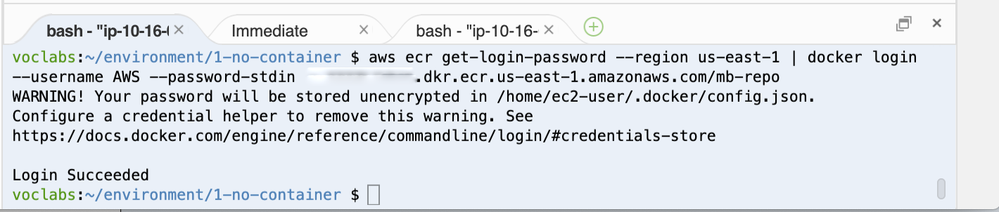
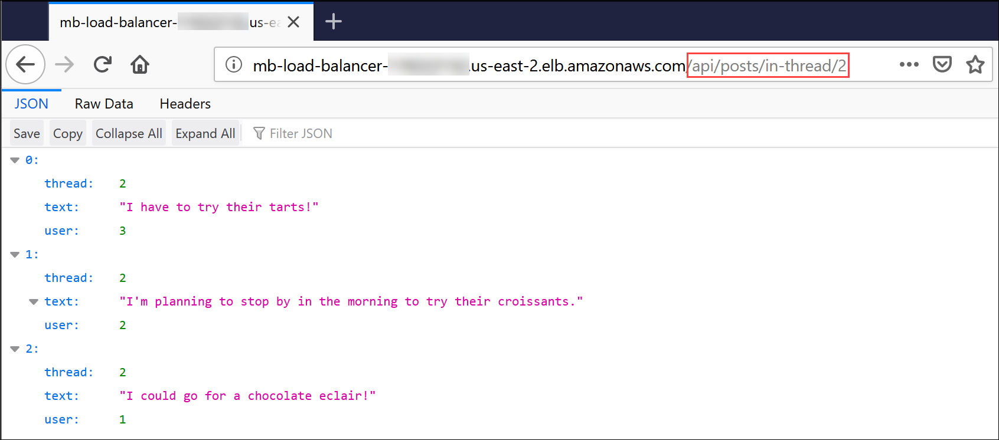

# （オプション）モジュール 13 - ガイド付きラボ 1: モノリシックな Node.js アプリケーションをマイクロサービスに分解する

[//]: # "SKU: ILT-TF-200-ACACAD-2    Source Course: ILT-TF-100-TUMCSR-1"

## ラボの概要と目標

従来のモノリシックなアーキテクチャは、スケーリングが難しい場合があります。アプリケーションのコードベースが大きくなると、更新や維持のプロセスが複雑になります。新しい機能、言語、フレームワーク、テクノロジーなどの導入が複雑で難しくなり、イノベーションや新しいアイデアの妨げになることもあります。

マイクロサービスアーキテクチャでは、それぞれのアプリケーションのコンポーネントが独自のサービスとして実行されます。これらはビジネス機能を主軸として構築され、それぞれのサービスが 1 つの関数を実行します。マイクロサービスは、さまざまなフレームワークやプログラミング言語を使って記述でき、明確に定義されたアプリケーションプログラミングインターフェイス (API) を使って他のサービスと通信します。また、単一のサービスやサービスのグループとして、個別にデプロイできます。

このオプションラボでは、標準の Node.js サーバーで実行されるモノリシックなアプリケーションをコンテナ化した Docker 環境に移行します。次に、アプリケーションをマイクロサービスにリファクタリングし、Amazon Elastic Container Service (Amazon ECS) で調整したコンテナ化環境にデプロイします。この Node.js アプリケーションには、**ユーザー**がトピックの**スレッド**を作成し、それぞれのスレッドに**メッセージ**を投稿することのできるシンプルなメッセージボードの機能が実装されています。


このラボを完了すると、次のことができるようになります。

- モノリシックな Node.js アプリケーションを移行して Docker コンテナで実行する

- Node.js アプリケーションを、モノリシックな設計からマイクロサービスアーキテクチャにリファクタリングする

- コンテナ化した Node.js マイクロサービスアプリケーションを Amazon ECS にデプロイする


次の図は、アプリケーション設計をモノリシックなものからマイクロサービスをベースとしたものに移行する過程を表しています。


&nbsp;

この図は、モノリシックなアプローチとマイクロサービス設計の次のような違いを示しています。

* モノリシックな設計では、Node.js アプリケーションのすべての関数がパッケージ化され、1 つのサービスとして実行されます。1 つの関数が失敗すると、アプリケーション全体が機能しなくなります。同様に、1 つの関数の需要が急増した場合、サービス内の他の関数もすべて一緒にスケーリングする必要があります。

* マイクロサービスアーキテクチャでは、Node.js アプリケーションの各関数は、個別のサービスとして実行されます。サービスは、個別にスケーリングしたり更新したりできます。

<br/>

## 所要時間

このラボの所要時間は、約 **3 時間**です。

<br/>

## AWS サービスの制限事項

このラボ環境では、AWS のサービスとサービスアクションへのアクセスが、ラボの手順を完了するために必要なものに制限されています。他のサービスへのアクセスや、このラボで説明されているサービス以外のアクションを実行しようとすると、エラーが発生することがあります。

<br/>

## AWS マネジメントコンソールにアクセスする

1. この手順の上部にある <span id="ssb_voc_grey">Start Lab</span> をクリックし、ラボを起動します。

   [**Start Lab**] パネルが開き、ラボのステータスが表示されます。

   <i class="fas fa-info-circle"></i> **ヒント**: ラボの完了までにさらに時間が必要な場合は、<span id="ssb_voc_grey">Start Lab</span> ボタンをもう一度選択して、この環境のタイマーを再開します。

2. \[**Start Lab**] パネルに **Lab status: ready** というメッセージが表示されたら [**X**] をクリックしてパネルを閉じます。

3. この手順の上部にある <span id="ssb_voc_grey">AWS</span> をクリックします。

   このアクションにより、新しいブラウザタブで AWS マネジメントコンソールが開き、ユーザーは自動的にログインします。

   <i class="fas fa-exclamation-triangle"></i> **ヒント**: 新しいブラウザタブが開かない場合、通常、ブラウザによってサイトのポップアップウィンドウの表示がブロックされたというメッセージが表示されたバナーまたはアイコンがブラウザの上部に表示されます。バナーまたはアイコンを選択して [**ポップアップを許可**] を選択してください。

4. **AWS マネジメントコンソール**タブがこの手順と並べて表示されるようにします。両方のブラウザタブを同時に開いておくと、ラボのステップを実行しやすくなります。

   <i class="fas fa-exclamation-triangle"></i> **特に指示がない限り、リージョンを変更しないでください**。

<br/>

## タスク 1: 開発環境を整える

AWS Cloud9 環境は、ラボ環境作成時に作成されています。AWS Cloud9 は、コードをブラウザで記述、実行、デバッグできるクラウドベースの統合開発環境 (IDE) です。一般的なプログラミング言語に不可欠なツールがあらかじめパッケージされており、ターミナルセッションタブから AWS コマンドラインインターフェイス (AWS CLI) にアクセスできます。AWS Cloud9 環境は、AWS マネジメントコンソールへのログインに使用したユーザー ID に対して承認された AWS リソースにアクセスできます。


開発環境のセットアップを行うには、AWS Cloud9 IDE を開き、必要な**ラボファイル**をダウンロードして抽出します。

5. [**サービス**] で [**Cloud9**] をクリックします。

6. \[**Open IDE**] をクリックします。

   IDE が新しいブラウザタブで開き、[**Welcome**] タブなどいくつかのタブが表示されます。

   次に、必要なラボファイルをダウンロードして抽出します。

7. IDE の一番下のペインで、**bash - "ip-nnn-nnn-nnn-nnn"** というラベルの付いたターミナルタブに次のコマンドを入力します。

   ```bash
   curl -s https://aws-tc-largeobjects.s3.amazonaws.com/ILT-TF-100-TUHAWA-1/lab-four/lab-files-ms-node-js.tar.gz | tar -zxv
   ```

   このコマンドは、ラボファイルの入った圧縮アーカイブファイルを取得します。また、AWS Cloud9 の **~/environment** フォルダ内のファイルの内容を抽出します。コマンドの出力は次のような出力になります。


   &nbsp;

   ダウンロードして抽出したファイルは、[**Environment**] ウィンドウ（左ペイン）に表示されます。


   &nbsp;

   次のフォルダが表示されます。

   - **1-no-container** – アプリケーションの**モノリシック**実装に関連するファイルが入っています。この実装は、Node.js サーバーで直接実行されます。

   - **2-containerized-monolith** – アプリケーションの**モノリシック**実装に関連するファイルが入っています。この実装は、Amazon ECS により調整されたコンテナ化 Docker 環境で実行されます。

   - **3-containerized-microservices** – アプリケーションの**マイクロサービス**実装に関連するファイルが入っています。この実装は、Amazon ECS により調整されたコンテナ化 Docker 環境で実行されます。

   AWS Cloud9 の IDE タブは頻繁に使用するので、ラボの間は開いたままにしておきます。

<br/>

## タスク 2: ベーシックな Node.js サーバーでアプリケーションを実行する

ベースとなる Node.js アプリケーションは、コンテナを使わず、サーバーで直接実行するように設計されたモノリシックなサービスです。このタスクでは、AWS Cloud9 環境を実行しているインスタンスにインストールされた Node.js サーバーにアプリケーションをデプロイします。次に、AWS CLI ターミナルを使用してアプリケーションをテストし、RESTful API メソッドを呼び出します。

次の図は、デプロイのアーキテクチャとリクエストのフローを示しています。


&nbsp;

**注**: アプリケーションのモノリシック実装では、Node.js の **クラスター**機能を使用し、各 CPU コアに対し 1 つのワーカープロセスを生成します。これらのプロセスは 1 つのポートを共有し、Node.js に組み込まれたロードバランサーによって順繰りに呼び出されます。これによって、複数の CPU コアを持つサーバーのスケーラビリティが向上します。

このタスクでは以下の作業を行います。

- アプリケーションで必要な Node.js モジュールをインストールする

- アプリケーションの設計とコードを確認する

- アプリケーションを実行する

<br/>

### タスク 2.1: 必要な Node.js モジュールをインストールする

このメッセージボードアプリケーションは、実装に Node.js の **koa** フレームワークの 2 つのモジュール、**koa** および **koa-router** を使用します。**Koa.js** は広く使われている Node.js のウェブアプリケーションフレームワークで、非同期サーバー側の JavaScript アプリケーションの構築を容易にします。

8. ターミナルタブに次のコマンドを入力し、**koa** モジュールと **koa-router** モジュールをインストールします。

   ```bash
   cd ~/environment/1-no-container
   npm install koa
   npm install koa-router
   ```


   &nbsp;

   モジュールは AWS Cloud9 の **~/environment** フォルダの **1-no-container/node_modules** フォルダにインストールされます。出力に含まれる通知、警告、更新メッセージは無視してかまいません。

<br/>

### タスク 2.2: アプリケーションの設計とコードを確認する

モノリシックなメッセージボードアプリケーションを実装するコンポーネントは、**1-no-container** フォルダにあります。これらを確認し、アプリケーションの設計とコードについて理解を深めます。

9. 左側の [**Environment**] ウィンドウで、**1-no-container** フォルダを展開します。以下のコンポーネントがあります。

   - **node_modules** フォルダ – このフォルダは、前のサブタスクで、必要な JavaScript モジュールをインストールした際に作成されたもので、モジュールのソースコードが含まれています。

   - **db.json** – メッセージボードデータベースをシミュレートする JavaScript Object Notation (JSON) オブジェクト。**ユーザー**、**スレッド**、**投稿**を表す属性と、対応するサンプル値が含まれています。

   - **index.js** – アプリケーションのエントリポイントである JavaScript プログラム。

   - **package.json** – アプリケーション、アプリケーションのエントリポイント、アプリケーションの依存関係を記述した JSON オブジェクト。

   - **package-lock.json** – 必要な JavaScript モジュールを **node_modules** フォルダにインストールした際に自動生成された JSON オブジェクト。インストールユーティリティである **npm** によって、フォルダに加えられた変更の追跡に使用されます。

   - **server.js** –アプリケーションの RESTful API メソッドを定義し、各メソッドのハンドラーを実装する JavaScript プログラム。

10. **package.json** オブジェクトの内容を確認します。[**Environment**] ウィンドウで **package.json** をダブルクリックしてエディタタブで開きます。JSON オブジェクトの次の属性を確認してください。

    - **2～5 行目** – この **dependencies** 属性は、アプリケーションの JavaScript モジュールの依存関係を定義しています。前のサブタスクでインストールした **koa** モジュールと **koa-router** モジュールが表示されています。

    - **6～8 行目** – この **scripts** 属性は **index.js** プログラムをアプリケーションへのエントリポイントとして宣言しています。

11. **db.json** オブジェクトの内容を確認します。[**Environment**] ウィンドウで、**db.json** をダブルクリックしてエディタタブで開きます。JSON オブジェクトの次の属性を確認してください。

    - **2～27 行目** – ここでは、メッセージボードの登録ユーザーを表す **users** 属性を定義しています。属性値は、**Marcerline Singer**、**Finn Alberts**、**Paul Barium**、**Jake Storm** という **4** 人のサンプルユーザーのリストです。

    - **29～45 行目** – ここでは、メッセージボードで現在アクティブなスレッドを表す **threads** 属性を定義しています。属性値は、次のタイトルのついた **3** つのサンプルスレッドのリストです。

       - **Did you see the Brazil game? (ブラジル戦見た?)**

       - **New French bakery opening in the neighborhood tomorrow (フレンチベーカリーが明日近所にオープンします)**

       - **In search of a new guitar (新しいギターを探して)**

       - **47～78 行目** – ここでは、アクティブなスレッドに投稿されたメッセージを表す **posts** 属性を定義しています。属性値は、**6** 件のサンプルメッセージ投稿のリストです。

12. **index.js** のコードを確認します。[**Environment**] ウィンドウで、**index.js** をダブルクリックしてエディタタブで開きます。次の情報を確認してください。

    - **1～3 行目** – ここでは、プログラムに必要な JavaScript モジュール、**cluster**、**http**、**os** をインポートしています。

    - **3 行目** – ここでは **os** モジュールを使用し、サーバーで利用可能な CPU コアの数を尋ねています。

    - **5～15 行目** – これらの行は、プログラムの初回起動時 (アプリケーションの起動時) に実行されます。クラスターの **Leader** スレッドと、サーバーで利用可能な各 CPU コアの**ワーカー** スレッドを 1 つ作成します。

    - **16～19 行目** – 現在の**ワーカー** スレッドで **server.js** プログラムを呼び出し、アプリケーションに対する各リクエストを処理します。

13. 最後に **server.js** のコードを確認します。[**Environment**] ウィンドウで、**server.js** をクリックしてエディタタブで開きます。コードに記載されているコメントを参考にしながら、ロジックを理解します、特に、次の情報を確認してください。

    - **3 行目** – データベースをシミュレートする JSON オブジェクト、**db.json** をインポートします。

    - **6～11 行目** – 各リクエストに対して実行されるジェネレーター関数を定義します。その目的は、処理される各リクエストの**HTTP メソッド**、**リソースパス URL**、**経過時間**を含む行を出力することです。

    - **13～47 行目** – ここでは、アプリケーションの RESTful API メソッドとその実装を定義しています。具体的には、アプリケーションは次の RESTful 呼び出しに応答できます。

       - `GET /api/users`: データベース内の**ユーザー**のコレクションを返します。

       - `GET /api/users/:userId`: **:userId** によって識別される**ユーザー**の情報を返します。

       - `GET /api/threads`: データベース内の**スレッド**のコレクションを返します。

       - `GET /api/threads/:threadId`: **:threadId** によって識別される**スレッド**の情報を返します。

       - `GET /api/posts/in-thread/:threadId`: **:threadId** によって識別される**スレッド**の**投稿メッセージ**のコレクションを返します。

       - `GET /api/posts/by-user/:userId`: **:userId** によって識別される**ユーザー**の**投稿メッセージ**のコレクションを返します。

       - `GET /api/`: **API ready to receive requests
** というメッセージを返します。

       - `GET /`: **Ready to receive requests** というメッセージを返します。

    - **52 行目** – アプリケーションがリクエストをリッスンする**ポート番号**を定義します。

<br/>

### タスク 2.3: アプリケーションを実行する

このサブタスクでは、Node.js サーバーを起動してメッセージボードアプリケーションを実行します。次に、アプリケーションの RESTful API メソッドをいつかテストします。

14. ターミナルタブで、次のコマンドを入力して Node.js とアプリケーションを起動します。

    ```bash
    npm start
    ```

    

    &nbsp;

    サーバーが起動し、アプリケーションのエントリポイントである** index.js **が実行されます。**index.js** が初めて呼び出されると、リクエストを処理するための 2 つのクラスタースレッド、**Leader** と **Worker** が作成されます。

    次に、現在のターミナルセッションがアクティブな状態のままで、2 つ目のターミナルタブを開き、アプリケーションの RESTful API をテストします。

15. 下部のペインで **(+)** をクリックて [**New Terminal**] を選択し、新しいターミナルタブを開きます。これで、コマンドを入力できるターミナルが 2 つになりました。

16. **右側のターミナルタブ**で、次のコマンドを入力して `/api/users` リソースを取得します。

    ```bash
    curl localhost:3000/api/users
    ```

    RESTful の呼び出しが、メッセージボードのデータベース内の**ユーザー**のリストを含む JSON オブジェクトを返します。


&nbsp;

17. **左側のターミナルタブ**をクリックします。パス `/api/users` によって識別されるリソースの GET メソッドのリクエストを処理したという、server.js からの出力メッセージが表示されます。リクエストの処理には **4** ミリ秒かかりました。


   &nbsp;

18. データベース内の **4** 番目のユーザーの情報のみを取得します。**右側のターミナルタブ**に次のコマンドを入力します。

    ```bash
    curl localhost:3000/api/users/4
    ```

    データベース内の 4 番目のユーザーである **Jake Storm** の情報が返されます。


19. 次に、現在データベースにあるすべての**スレッド**を取得します。**右側のターミナルタブ**に次のコマンドを入力します。

    ```bash
    curl localhost:3000/api/threads
    ```

    データベース内のすべてのスレッドを含む JSON オブジェクトが返されます。


   &nbsp;

20. 最後に、データベース内の** 1 つ目** のスレッドの**投稿**をすべて取得します。**右側のターミナルタブ**に次のコマンドを入力します。

    ```bash
    curl localhost:3000/api/posts/in-thread/1
    ```

    2 つのメッセージ投稿を含む JSON オブジェクトが返されます。


   &nbsp;

21. Node.js サーバーを停止します。**左側のターミナルタブ**で **Ctrl + C** キーを押してサーバープロセスを終了します。

これで、アプリケーションが GET リクエストに正しく応答することを確認できました。次のタスクでは、アプリケーションをコンテナ化します。

<br/>

## タスク 3: モノリスを Amazon ECS 用にコンテナ化する

コンテナは、アプリケーションコードをデプロイメント単位でラップし、コードとその依存関係のスナップショットをキャプチャします。コンテナを使うことで、デプロイ環境にかかわらず、アプリケーションを迅速かつ確実に一貫性を持ってデプロイすることができます。

このタスクでは、モノリシックなメッセージボードのアプリケーションのコンテナイメージを作成し、それを Amazon Elastic Container Registry (Amazon ECR) にプッシュします。これにより、アプリケーションが Amazon ECS へのデプロイ用に処理されます。

具体的には、次の手順を実行します。

- アプリケーションを Docker コンテナ化用に処理する

- リポジトリをプロビジョニングする

- Docker イメージを構築してリポジトリにプッシュする

<br/>

### タスク 3.1: アプリケーションを Docker コンテナ化用に処理する

メッセージボードアプリケーションを Docker コンテナに配置するには、アプリケーションに対して次の変更を行う必要があります。

- Node.js の**クラスター**機能を削除し、アプリケーションを単一プロセスの設計に変換します。Docker コンテナを使用することで、プロセスのクラスターではなく、コンテナごとに 1 つのプロセスを実行することが最終的な目的です。

- アプリケーションの **Dockerfile** を作成します。このファイルは基本的に、アプリケーションの**コンテナイメージ**の構築手順を記述したビルドスクリプトです。

AWS Cloud9 環境の **2 つのコンテナに変換されたモノリス** のフォルダに、コンテナ対応バージョンのアプリケーションが提供されます。数分かけてファイルを確認し、アプリケーションをコンテナ化するために、どのような変更が加えられたのかを把握します。

22. 左側の [**Environment**] ウィンドウで **2-containerized-monolith** フォルダを展開し、**package.json** をダブルクリックしてエディタタブで開きます。

    **7 行目**を確認すると、アプリケーションのエントリポイントが **index.js** から **server.js** に変更されたことがわかります。**index.js** ファイルがアプリケーションフォルダからなくなっています。この **index.js** ファイルには Node.js の**クラスター**機能が含まれていましたが、この機能はもう使いません。

23. \[**Environment**] ウィンドウで **2-containerized-monolith** フォルダを展開し、**server.js** ファイルをダブルクリップしてエディタタブで開きます。

    コンテナ化されていないバージョンとの唯一の違いは、**54 行目**が追加されたことです。この行は、**Worker が起動された** というメッセージをアプリケーションの初回起動時に出力します。

24. \[**Environment**] ウィンドウで **2-containerized-monolith** フォルダを展開し、**Dockerfile** をダブルクリックしてエディタタブで開きます。

    このファイルには、アプリケーションのコンテナイメージの構築手順が含まれています。


&nbsp;

次の情報を確認してください。

- **1 行目** – コンテナイメージが構築されるベースイメージ。ここでは、Node.js イメージである **alpine-node** です。

- **3 行目** – イメージ上のファイルシステムの作業ディレクトリを **/srv** に設定します。

- **4 行目** – **2-containerized-monolith** フォルダ (アプリケーションフォルダ) のコンテンツを、イメージのファイルシステムの (前の行で設定した) 現在の作業ディレクトリに追加します。

- **5 行目** – **npm install** コマンドを呼び出し、**package.json** ファイルで宣言したアプリケーションのライブラリ依存関係をすべてインストールします。

- **7 行目** - この行で、コンテナは実行時にポート 3000 をリッスンすることが Docker に通知されます。

- **8 行目** - この行で **node server.js** コマンドを実行するよう Docker に求めます。このコマンドによって、イメージ起動時にアプリケーションが起動されます。

アプリケーションのコンテナイメージが構築される仕組みを理解したところで、ビルド後にイメージを配置する場所について詳しく見ていきます。

<br/>

### タスク 3.2: リポジトリのプロビジョニング

Docker コンテナイメージは共有、バージョン管理、管理の簡易化を目指してリポジトリに保存するよう意図されています。デベロッパーは **Amazon ECR** を使用することで、Docker コンテナイメージを簡単に保存、管理、デプロイできます。さらに、Amazon ECR は Amazon ECS と統合されているため、Amazon ECS は本番デプロイ用のコンテナイメージを直接プルできます。

このサブタスクでは、メッセージボードアプリケーション用の Docker コンテナイメージを保存するリポジトリを Amazon ECR 内に作成します。

25. ブラウザの [**Your environments**] タブをクリックし [**サービス**] で [**Elastic Container Registry**] をクリックします。

   Amazon ECR コンソールが開きます。

26. \[**リポジトリの作成**] で [**使用方法**] をクリックします。

27. \[**リポジトリ名**] ボックスに `mb-repo` と入力します。

28. \[**リポジトリを作成**] をクリックします。

    目的のリポジトリが正常に作成されたことを示すメッセージが、ページ上部に表示されます。

    **注意:** **このメッセージが表示されているウィンドウを閉じないでください。**次のサブタスクで使用します。

<br/>

### タスク 3.3: Docker イメージをビルドしてプッシュする

以上で、アプリケーションのコンテナイメージをビルドし、先ほど作成した Amazon ECR リポジトリにプッシュする準備ができました。

Amazon ECR コンソールの便利な特徴の 1 つは、コマンドテンプレートが用意されていて、イメージをビルドして新しいリポジトリにプッシュするためにすぐに使用できる点です。この用意された AWS CLI コマンドを次のステップで使用します。

29. 次の手順を正常に実行するには、先に AWS CLI を更新しておく必要があります。具体的な手順は、ブラウザの [**AWS Cloud9 IDE**] タブに移動し、**左の [Terminal] タブ**に次のコマンドを入力します。

    ```bash
    pip3 install awscli --upgrade --user
    export PATH=$HOME/.local/bin:$PATH
    ```

30. ブラウザの [**Amazon ECR**] タブに戻り、ページ上部のメッセージウィンドウで、[**プッシュコマンドの表示**] をクリックします。

    [**mb-repo のプッシュコマンド**] ポップアップウィンドウが開きます。このウィンドウには、**mb-repo** 用にカスタマイズされた AWS CLI コマンドが 4 つ一覧表示されます。これらは次を意図して作成されています。

    - Amazon ECR レジストリに Docker クライアントを認証する
    - Docker イメージをビルドする
    - Docker イメージにタグを付ける
    - Docker イメージをリポジトリにプッシュする

ポップアップウィンドウでは、**macOS/Linux** 用と、**Microsoft Windows** 用の 2 つのバージョンのコマンドが提供されます。

31. これらのコマンドは AWS Cloud9 環境で実行することになるため、[**macOS/Linux**] タブが選択されていることを確認します。

    まず Docker クライアントにログインするコマンドをレジストリにコピーして実行します。

32. ポップアップウィンドウで **1 つ目**のコマンドを見つけ、**コピー**アイコンをクリックして、そのコマンドをクリップボードにコピーします。

    このコマンドは次の例のような形式です。

    ```bash
    $ aws ecr get-login-password --region us-east-1 | docker login --username AWS --password-stdin 01234567890.dkr.ecr.us-east-1.amazonaws.com/mb-repo
    ```

33. ブラウザを [**AWS Cloud9 IDE**] タブに切り替えます。

34. 左の Terminal タブにコピーしたコマンドを貼り付け、**Enter** キーを押して実行します。

    

    &nbsp;

    コマンドが正常に実行されると、**Login Succeeded** というメッセージが表示されます。表示される警告はすべて無視してかまいません。

    次に、アプリケーションの Docker イメージをビルドします。

    **注意**: 手順のステップで特定の Terminal タブが記載されていない場合、**左**の Terminal タブを使用します。

35. Terminal タブで次のコマンドを実行し、ディレクトリを **2-containerized-monolith** フォルダに変更します。

    ```bash
    cd ~/environment/2-containerized-monolith
    ```

36. \[**Amazon ECR**] ブラウザタブに切り替えます。

37. \[**mb-repo プッシュコマンド**] ウィンドウで、**2 つ目**のコマンドを見つけ、**コピー**アイコンをクリックしてそのコマンドをコピーします。

    このコマンドは次の例のような形式です。

    ```bash
    docker build -t mb-repo .
    ```

    コマンドの末尾に必ずピリオド (.) を打ってください。

38. ブラウザを [**AWS Cloud9 IDE**] タブに切り替えます。

39. Terminal タブでコピーしたコマンドを貼り付け、**Enter** キーを押して以下を実行します。

    

    &nbsp;

    **build** コマンドを使用すると、アプリケーションの **Dockerfile** に記載された手順が実行され、複数行の結果が出力されます。完了すると、**Successfully built nnnnnnnnnn**、**Successfully tagged mb-repo:latest**というメッセージが表示されます。

    次に、イメージをリポジトリにプッシュできるように、イメージにリポジトリ URI のタグを付けます。

40. \[**Amazon ECR**] ブラウザタブに切り替えます。

41. \[**mb-repo のプッシュコマンド**] ウィンドウで **3 つ目**のコマンドを見つけ、**コピー**アイコンをクリックします。

    このコマンドは次の例のような形式です。

    ```bash
    docker tag mb-repo:latest 1234567890.dkr.ecr.us-east-2.amazonaws.com/mb-repo:latest
    ```

42. ブラウザを [**AWS Cloud9 IDE**] タブに切り替えます。

43. Terminal タブで、コピーしたコマンドを貼り付けて実行します。

    

    &nbsp;

    コマンドが正常に完了した場合、何も返されません。

    最後に、コンテナイメージをアプリケーションのリポジトリにプッシュします。

44. \[**Amazon ECR**] ブラウザタブに切り替えます。

45. \[**mb-repo のプッシュコマンド**] ウィンドウで **4 つ目**のコマンドを見つけ、コピーします。

    このコマンドは次の例のような形式です。

    ```bash
    docker push 1234567890.dkr.ecr.us-east-2.amazonaws.com/mb-repo:latest
    ```

46. ブラウザを [**AWS Cloud9 IDE**] タブに切り替えます。

47. Terminal タブで、コピーしたコマンドを貼り付けて実行します。

    

    &nbsp;

    このコマンドは、イメージの各レイヤーがリポジトリにプッシュされるたびに、複数のメッセージを出力します。

    次に、イメージが正常にアップロードされたことを確認します。

48. \[**Amazon ECR**] ブラウザタブに切り替えます。

49. \[**mb-repo のプッシュコマンド**] ウィンドウを閉じます。

50. \[**リポジトリ**] の一覧で **mb-repo** をクリックします。

    [**イメージ**] の一覧に、プッシュしたコンテナイメージが表示されます。イメージは **latest** タグで識別できます。

    

    &nbsp;

51. \[**イメージの URI**] をメモします。[**イメージ**] の一覧でイメージの**最新**バージョンの [**イメージ URI**] を見つけ、**コピー**アイコンをクリックします。値をテキストエディタに貼り付けます。貼り付けた値は、後のステップで使用します。

    メッセージボードアプリケーションのコンテナイメージが正常に作成され、Amazon ECR リポジトリにプッシュされました。

<br/>

## タスク 4: モノリスを Amazon ECS にデプロイする

このタスクでは、コンテナ化されたモノリシックアプリケーションを Amazon ECS ランタイム環境にデプロイします。具体的には、Amazon ECS を使用して、Amazon Elastic Cloud (Amazon EC2) インスタンスのマネージドクラスターを作成します。このクラスターにアプリケーションコンテナをデプロイします。クラスターは Application Load Balancer のターゲットグループとして設定され、フェイルオーバーとスケーラビリティを実現します。

次の図は、コンテナ化されたモノリシックアプリケーションのデプロイメントアーキテクチャを示しています。また、このタスクで作成するリソースも示されています。


&nbsp;

このタスクでは次の手順を実行します。

- Amazon ECS クラスターを作成する。

- アプリケーションコンテナイメージのタスク定義を作成する。

- Application Load Balancer を作成する。

- モノリシックアプリケーションを ECS サービスとしてデプロイする。

- コンテナ化されたモノリシックアプリケーションをテストする。

<br/>

### タスク 4.1: Amazon ECS クラスターを作成する

Amazon ECS クラスターは EC2 インスタンスの論理的グループです。コンテナ化されたアプリケーションの構成要素であるタスクやサービスを実行できます。

このサブタスクでは、Amazon ECS コンソールを使用して ECS クラスターを作成します。コンソールのクラスター作成ウィザードを使用すると、ECS クラスター環境の作成に必要なインフラストラクチャコンポーネントをすべて作成できます。これらのコンポーネントには、Virtual Private Cloud (VPC)、サブネット、セキュリティグループ、インターネットゲートウェイ、AWS Identity and Access Management (IAM) ロールなどがあります。

52. **AWS マネジメントコンソール**に戻り、[**サービス**] で [**Elastic Container Service**] をクリックします。

53. ナビゲーションペインで、[**Amazon ECS**] の下の [**クラスター**] をクリックします。

54. \[**クラスター**] ページで、[**クラスターの作成**] をクリックします。

55. \[**クラスターテンプレートの選択**] ページで、[**EC2 Linux + ネットワーキング**] カードをクリックします。

56. \[**次のステップ**] をクリックします。

57. \[**クラスターの設定**] ウィザードで以下を設定します。
    - **クラスター名**: `mb-ecs-cluster`
    - **プロビジョニングモデル**: **オンデマンドインスタンス**
    - **ECS インスタンスタイプ**: **t2.micro**
    - **インスタンス数**: `2`
    - **VPC**: **新しい VPC の作成**
    - **CIDR ブロック**: `10.32.0.0/16`
    - **サブネット 1**: `10.32.0.0/24`
    - **サブネット 2**: `10.32.1.0/24`
    - **セキュリティグループ**: **新しいセキュリティグループを作成**
    - **セキュリティグループのインバウンドルール**: デフォルト設定（ポート 80 へのあらゆる IP アドレスからのインバウンドトラフィックを許可）をそのまま使用します。

    **注意**: [**コンテナインスタンス IAM ロール**] セクションに、**ecsInstanceRole** を作成して使用するアクセス許可を Amazon ECS に付与しようとしているというメッセージが表示されます。このロールは、EC2 インスタンスがさまざまな Amazon ECS アクションを呼び出すことを許可します。

58. \[**作成**] をクリックします。

    [**起動ステータス**] ページが開き、ウィザードが実行するタスクが表示されます。

59. すべてのタスクに、完了したことを示すチェックマークが入るまで待ちます。

    

   &nbsp;

   ウィザードで作成されるリソースのリストは、[**クラスターリソース**] セクションに表示されます。

60. \[**クラスターの表示**] をクリックします。

    **mb-ecs-cluster** の詳細のページが開きます。[**ステータス**] フィールドに [**ACTIVE**] という値が表示されます。

61. \[**ECS インスタンス**] タブをクリックします。

    クラスターの EC2 インスタンスが 2 つ（ウィザードで作成したもの）一覧表示されます。

    **注意**: 2 つの EC2 インスタンスがリストに表示されるまでに数分かかる場合があります。両方のインスタンスが表示されない場合は **更新** をクリックします。

    

&nbsp;

62. \[**タスク**] タブをクリックします。

    クラスターにはまだタスクがデプロイされていません。タスクは次に作成します。

<br/>

### タスク 4.2: アプリケーションコンテナイメージのタスク定義を作成する

タスク定義は、Amazon ECS で Docker コンテナを実行する方法に関する構成設定のリストです。Amazon ECS に次のような多様な情報が通知されます。

- 実行するコンテナイメージ
- コンテナが必要とする CPU とメモリの分量
- コンテナがトラフィックをリスニングするポート

このサブタスクでは、メッセージボードアプリケーションのコンテナイメージのタスク定義を作成します。

63. \[**Amazon ECS**] ブラウザタブのナビゲーションペインで [**タスク定義**] をクリックします。

64. \[**新しいタスク定義の作成**] をクリックします。

65. \[**起動タイプの互換性の選択**] ページで、[**EC2**] カードをクリックします。

66. \[**次のステップ**] をクリックします。

   [**タスクとコンテナ定義の設定**] ページが開きます。

67. \[**タスク定義名**] ボックスに `mb-task` と入力します。

68. \[**コンテナの定義**] まで下へスクロールし [**コンテナの追加**] をクリックします。

    [**コンテナの追加**] ウィンドウが開きます。

69. 以下のように設定します。
    - **コンテナ名**: `mb-container`
    - **イメージ**: 前のステップでテキストエディタに貼り付けておいたアプリケーションコンテナイメージの**イメージ URI** を貼り付けます。
    - **メモリ制限**: [**ハード制限**] を選択し、`256` と入力します（この設定でコンテナが使用できるメモリの上限を指定します）。
    - [**ポートマッピング**] > [**コンテナポート**]: `3000`（この設定で、コンテナがリクエストを受け取るポートを指定します。[**ホストポート**] に値を入力する必要はありません）。

    [**コンテナの追加**] ウィンドウは、次のような表示となります。

    

   &nbsp;

70. \[**追加**] をクリックします。

71. 下へスクロールして [**作成**] をクリックします。警告はすべて無視してかまいません。

    タスク定義が正常に作成されたことを伝えるメッセージが表示されます。この定義が自動的にバージョン番号 **1** に割り当てられていることがわかります。

    

    &nbsp;

    以上で、クラスター全体にアプリケーションコンテナをデプロイする方法を Amazon ECS に示すタスク定義ができました。

<br/>

### タスク 4.3: Application Load Balancer を作成する

次に、ECS クラスターで実行される EC2 インスタンスに受信リクエストを分散させる Application Load Balancer を作成します。このロードバランサーは ECS クラスターと同じ VPC に常駐し、ECS クラスターと同じセキュリティグループを使用します。

72. \[**Amazon ECS**] ブラウザタブの [**サービス**] で [**EC2**] をクリックします。

73. ナビゲーションペインで [**ロードバランサー**] をクリックします。

74. \[**ロードバランサーの作成**] をクリックします。

    [**ロードバランサーの種類の選択**] ページが開きます。

75. \[**Application Load Balancer**] の [**作成**] をクリックします。

    Application Load Balancer の作成ウィザードが開きます。

76. \[**手順 1: ロードバランサーの設定**] で次のように設定します。
    - **名前**: `mb-load-balancer`
    - [**アベイラビリティーゾーン**] セクションまでスクロールし、以下の設定値を入力します。
       - **VPC**: **Amazon ECS クラスター VPC ID** を選択します。この ID は **vpc-nnnnnnnnnn (10.32.0.0/16)** ような形式です
       - **アベイラビリティーゾーン**: 両方のアベイラビリティーゾーンのチェックボックスをオンにします。

77. \[**次の手順: セキュリティ設定の構成**] をクリックします。

78. \[**手順 2: セキュリティ設定の構成**] で表示される、ロードバランサーがセキュアなリスナーを使用していないという警告は無視してかまいません。[**次の手順: セキュリティグループの設定**] をクリックします。

79. \[**手順 3: セキュリティグループの設定**] で次のように設定します。
    - **セキュリティグループの割り当て**: **既存のセキュリティグループを選択する**
    - **セキュリティグループ ID**:
       - **default** を選択解除します。
       - **EC2ContainerService-mb-ecs-cluster-EcsSecurityGroup** を選択します（これは ECS クラスターのセキュリティグループです）。

80. \[**次の手順: ルーティングの設定**] をクリックします。

81. \[**手順 4: ルーティングの設定]** で、次のように設定します。
    - **ターゲットグループ**: **新しいターゲットグループ** (ウィザードでロードバランサー用に新しいターゲットグループを作成します)
    - **名前**: `mb-load-balancer-target-group`
    - **プロトコル** と **ポート**: これらの設定は、デフォルト値のまま [**HTTP**] と [**80**] を使用します。アプリケーションは RESTful HTTP リクエストを介したアクセスを想定しています。
    - [**ヘルスチェックの詳細設定**] を展開し、次の設定値を入力します。
       - **正常のしきい値**: `2`（この設定により、ロードバランサーは、ターゲットがロードバランサーからヘルスチェックの正常な結果を 2 つ連続で受信した場合を正常とみなします）
       - **間隔**: `6`（この設定でヘルスチェックの頻度が 6 秒間に 1 回に増やされます）。

82. \[**次の手順: ターゲットの登録**] をクリックします。

83. 後のステップで **ECS service** をターゲットとして登録するため、[**手順 5: ターゲットの登録**] は飛ばしてかまいません。[**次の手順: 確認**] をクリックします。

84. \[**手順 6: 確認**] ページで設定が正しいことを確認してから、[**作成**] をクリックします。

    ロードバランサーが正常に作成されたことを示すメッセージが表示されます。

85. \[**閉じる**] をクリックします

    以上で **mb-load-balancer** がロードバランサーリストに登録されました。

86. しばらく待ってから、**更新**アイコンをクリックします。ロードバランサーの [**状態**] が [**active**] に変わります。


    &nbsp;

    ロードバランサーの設定の仕上げとして、セキュリティグループを変更して、ロードバランサーと ECS クラスターにあるインスタンス間で内部通信を許可するポートを開きます。

87. 下部の [**説明**] タブで [**セキュリティ**] セクションまで下へスクロールします。

88. \[**セキュリティグループ**] の横にあるセキュリティグループ ID リンクをクリックします。このリンクは **sg-nnnnnnnnnn** と似た形式です。

    ロードバランサーのセキュリティグループの詳細ページが開きます。

89. セキュリティグループ ID をクリップボードにコピーするには、[**詳細**] タブ（下部ペイン内）に移動し、目的の**セキュリティグループ ID** にカーソルを合わせて**コピー**アイコンをクリックします。

    この ID は後のステップで使用します。

90. 下部ペインで [**インバウンドルール**] タブをクリックします。

    セキュリティグループのインバウンドルールが表示されます。

91. \[**インバウンドのルールを編集**] をクリックします。

    [**インバウンドルールを編集**] ダイアログウィンドウが開きます。

92. \[**ルールを追加**] をクリックします。

    ルールリストに新しい行が表示され、新しいルールを追加できます。この行は追加しようとしている**カスタム TCP ルール**が事前設定されています。

93. この新しい行に次の設定を追加します。
    - **ポート範囲**: `31000-61000`
    - **リソースタイプ**: **カスタム**。クリップボードのセキュリティグループ ID を貼り付けます。

94. \[**ルールを保存**] をクリックします。

    セキュリティグループのインバウンドルールのリストに、新しく追加した行が表示されます。


&nbsp;

<br/>

### タスク 4.4: ECS サービスとしてモノリスをデプロイする

これまでに Amazon ECS インフラストラクチャに必要なコンポーネントはすべて作成しました。このサブタスクでは、コンテナ化されたモノリスアプリケーションを Amazon ECS サービスとしてクラスターにデプロイします。

ECS サービスを使用すると、ECS クラスターで指定された数のタスク定義インスタンスの実行、維持が同時にできます。何らかの理由でタスクの 1 つが失敗したり停止したりした場合、ECS サービススケジューラが、別のタスク定義インスタンスを起動して置き換えます。このため、サービスで指定されたタスクの数が維持されます。

今度は Amazon ECS コンソールを使用して、メッセージボードアプリケーションのタスク定義用の ECS サービスを作成します。

95. **AWS マネジメントコンソール**の [**サービス**] で [**Elastic Container Service**] をクリックします。

96. ナビゲーションペインで [**タスク定義**] をクリックします。

97. \[**タスク定義**] の一覧から **mb-task** リンクをクリックします。

   ページが開かれ、タスク定義の使用可能な改訂が表示されます。

98. **mb-task:1** を選択し、[**アクション**] ドロップダウンメニューから [**サービスの作成**] を選択します。

99. \[**ステップ 1: サービスの設定**] で次のように設定します。
    - **起動タイプ**: **EC2**（あなたはコンテナ化されたアプリケーションを直接 EC2 インスタンスのクラスターで実行しています）。
    - **サービス名**: `mb-ecs-service`
    - **サービスタイプ**: **REPLICA**（この設定で、必要なタスク数を ECS クラスター全体に対して指定、維持するスケジュール設定方式を確立します）
    - **タスク数**: `1`（通常、クラスターを最大限まで活用するには、予想されるリクエストの負担を考慮しつつ大きめの数を入力します。ただし、この演習をシンプルにするため、クラスターで常に 1 つのタスクを起動し、維持するよう指定します）

100. \[**次のステップ**] をクリックします。

101. \[**ステップ 2: ネットワーク構成**] で次のように設定します。
     - **ロードバランサーの種類**: **Application Load Balancer**（先ほど設定した **mb-load-balancer** を使用してサービス内でタスクの負荷を調整します）
     - **サービス用の IAM ロールの選択**: **新しいロールの作成**
     - **ロードバランサー名**: **mb-load-balancer**
     - **コンテナの選択**: このフィールドには、タスク定義と関連付けられた適切なコンテナ情報が事前入力されています。[**ロードバランサーに追加**] をクリックします（この設定でコンテナとロードバランサーのリスナーの 1 つが関連付けられます）。
     - **プロダクションリスナーポート**: **80:HTTP**（この設定で、ポート 80 での HTTP トラフィックに対するロードバランサーリスナーとコンテナが関連付けられます）
     - **ターゲットグループ名**: **mb-load-balancer-target-group**

102. \[**次のステップ**] をクリックします。

103. \[**ステップ 3: Auto Scaling (オプション)**] では [**次のステップ**] をクリックします。追加で自動スケーリングを設定する必要はありません。

104. \[**確認**] ページで設定が正しいことを確認し、[**サービスの作成**] をクリックします。

     [**起動ステータス**] ページが開き、ウィザードが実行するタスクが表示されます。

105. すべてのタスクに、完了したことを示すチェックマークが入るまで待ちます。

     

     &nbsp;

106. **mb-ecs-service** の詳細ページを開くには、[**サービスの表示**] をクリックします。

     [**タスク**] タブに、現在コンテナを実行しているタスクが 1 つあり、そのタスクの **ACTIVE** ステータスが表示されます。

107. 少し時間をおいて**更新**アイコンをクリックすると、タスクの [**前回のステータス**] が [**RUNNING**] になります。

     

     &nbsp;

     これで、コンテナ化したモノリスを ECS サービスとしてクラスターにデプロイできました。

<br/>

### タスク 4.5: コンテナ化したモノリスをテストする

ここからは、メッセージボードアプリケーションの RESTful API メソッドをウェブブラウザからテストして、デプロイを検証します。

最初に、ロードバランサーの URL を探してメモします。

108. \[**Amazon ECS**コンソール] のブラウザタブの [**サービス**] で [**EC2**] をクリックします。

109. ナビゲーションペインで [**ロードバランサー**] をクリックします。

     ロードバランサーの一覧に **mb-load-balancer** が表示されます。

110. 下の [**説明**] タブで [**DNS 名**] の**コピー**アイコンをクリックします。

111. DNS 名の値をテキストエディタに貼り付け、`Load Balancer DNS Name` というラベルを付けておきます。この値は後の手順で複数回使用します。

112. 新しいブラウザタブを開いて DNS 名をアドレスバーに貼り付け、**Enter** キーを押します。


&nbsp;

ページが開き、**Ready to receive requests** というメッセージが表示されます。このメッセージは、GET リクエストにリソースのパスが含まれていない場合に、メッセージボードアプリケーションによって返されます。

**トラブルシューティングのヒント**: サーバー関連の HTTP エラーコードが表示された場合は、しばらく待ってからもう一度お試しください。コンテナの状態が正常であることを登録し、トラフィックの受信が開始するまで数分かかる場合があります。

113. ブラウザのアドレスバーで、URL の末尾に `/api` を追加し、**Enter** キーを押します。


&nbsp;

アプリケーションから、**API ready to receive requests** というメッセージが返されます。

114. データベースのすべての**ユーザー**を取得できるかテストします。ブラウザのアドレスバーで、URL の末尾に `/users` を追加して **Enter** キーを押します。


&nbsp;


アプリケーションが、データベース内の 4 人のユーザーをリストした JSON オブジェクトを返します。

115. データベースの **1 人目のユーザー**の情報を取得します。ブラウザのアドレスバーで、URL の末尾に `/1` を追加し、**Enter** キーを押します。


&nbsp;

アプリケーションから、データベースの 1 人目として保存されたユーザー **Marcerline Singer** の情報を含む JSON オブジェクトが返されます。

116. 次に、データベース内すべての**スレッド**を取得します。ブラウザのアドレスバーで、ロードバランサー DNS 名の後の URI を `/api/threads` に変更し、**Enter** キーを押します。


&nbsp;

アプリケーションが、データベース内の 3 つのスレッドを含む JSON オブジェクトを返します。

117. 最後に、データベースの **2 つ目のスレッド**の**投稿**を取得します。ブラウザのアドレスバーで、ロードバランサー DNS 名の後の URI を `/api/posts/in-thread/2` に変更し、**Enter** キーを押します。



&nbsp;

アプリケーションから、データベースの 2 つ目のスレッドに投稿されたメッセージを含む JSON オブジェクトが返されます。これらのメッセージはベーカリーに関するものです。

118. 必要に応じて、アプリケーションが提供できる他のリソースパスを呼び出します。テストが終了したら、アプリケーションのブラウザタブを閉じます。

     これで、モノリシックなメッセージボードアプリケーションをコンテナ化し、Amazon ECS 環境にデプロイすることができました。

<br/>

## タスク 5: モノリスをリファクタリングする

このタスクでは、コンテナ化されたモノリシックなメッセージボードアプリケーションを、相互接続された複数のマイクロサービスに分割します。次に、各マイクロサービスのイメージを Amazon ECR リポジトリにプッシュします。各マイクロサービスは、アプリケーションの単一のビジネス機能を実行し、他のマイクロサービスから独立してスケーリングできます。アプリケーションは、アプリケーションの API が提供するオブジェクトの最上位クラスとなる以下のマイクロサービスに分割されます。

- **Users** マイクロサービス – すべての**ユーザー**関連の REST パス (`/api/users/**`) のサービス

- **Threads** マイクロサービス – すべての**スレッド**関連の REST パス (`/api/threads/**`) のサービス

- **Posts** マイクロサービス – すべての**投稿**関連の REST パス (`/api/posts/**`) のサービス

リファクタリングにかかる時間を短縮するため、お使いの AWS Cloud9 環境の **3-containerized-microservices** フォルダに、マイクロサービスバージョンのアプリケーションが用意されています。

このタスクでは次の手順を実行します。

- リファクタリングされたマイクロサービスアプリケーションを確認する

- マイクロサービスごとに Amazon ECR リポジトリをプロビジョニングする

- 各マイクロサービスのイメージをビルドしてプッシュする

<br/>

### タスク 5.1: リファクタリングされたマイクロサービスアプリケーションを確認する

このサブタスクでは、数分時間をとって、ファイルを確認し、アプリケーションをマイクロサービスにリファクタリングするためにどのような変更が行われたのかを把握します。

119. ブラウザを [**AWS Cloud9 IDE**] タブに切り替えます。

120. 左側の [**Environment**] ペインで **3-containerized-microservices** フォルダを展開します。

   このフォルダには、3 つのアプリケーションマイクロサービスを表す **posts**、**threads**、**users**という 3 つのサブフォルダがあります。各サブフォルダには、対応するマイクロサービスの実装ファイルが含まれています。

121. **posts**、**threads**、**users** サブフォルダを展開します。


&nbsp;

各サブフォルダには、コンテナ化されたモノリスのアプリケーションファイルと同じもののコピーが含まれていることが分かります。各サブフォルダ内の **db.json**、**Dockerfile**、**package.json** ファイルは、コンテナ化されたモノリスのファイルと同じものです。**server.js** ファイルは、リファクタリングにより変更された唯一のファイルです。

122. **users** サブフォルダで、**server.js** をダブルクリックして Editor タブで開きます。

   **13～20 行目**は、プログラムが**ユーザー**のリソースパスに関連する API メソッドと実装のみを定義しているという点で、コンテナ化されたモノリスとは異なります。

123. **threads** サブフォルダで、**server.js** をダブルクリックして Editor タブで開きます。

   **13～20 行目**は、プログラムが**スレッド**のリソースパスに関連する API メソッドと実装のみを定義しているという点で、コンテナ化されたモノリスとは異なります。

124. **posts** サブフォルダで、**server.js** をダブルクリックして Editor タブで開きます。

   **13～21 行目**は、プログラムが**投稿**のリソースパスに関連する API メソッドと実装のみを定義しているという点で、コンテナ化されたモノリスとは異なります。

   つまり、アプリケーションをリファクタリングに唯一変更する必要があるのは、モノリシックバージョンの **server.js** のRESTful API メソッドハンドラーを、3 つの個別の **server.js** ファイルに分割することです。それぞれの **server.js** ファイルには、API メソッドハンドラーの関連サブセットが含まれています。

<br/>

### タスク 5.2: マイクロサービスごとに Amazon ECR リポジトリをプロビジョニングする

コンテナ化されたモノリスと同様の手順で、アプリケーションマイクロサービスそれぞれに Amazon ECR リポジトリを作成します。

ここからは、**Users**、**Threads**、**Posts** マイクロサービスのコンテナイメージのリポジトリを作成します。

125. Amazon ECR コンソールを開くには、**AWS マネジメントコンソール**のタブに移動し、[**サービス**] で [**Elastic Container Registry**] をクリックします。

126. \[**リポジトリを作成**] をクリックします。

127. \[**リポジトリ名**] に `mb-users-repo` と入力します。

128. \[**リポジトリを作成**] をクリックします。ページ上部に、リポジトリが正常に作成されたことを示すメッセージが表示されます。

129. 前の手順を繰り返して、残り 2 つのマイクロサービス用にさらに 2 つのリポジトリを作成します。その際、次のリポジトリ情報を使用します。
   - **Threads** のリポジトリ名: `mb-threads-repo`
   - **Posts** のリポジトリ名: `mb-posts-repo`

   3 つのマイクロサービスのリポジトリを作成すると、リポジトリの一覧は次の例のようになります。


<br/>

### タスク 5.3: 各マイクロサービスのイメージをビルドしてプッシュする


次に、各マイクロサービスのコンテナイメージを構築し、対応するリポジトリにプッシュします。以下の手順では、そのまま使えるコマンドを Amazon ECR コンソールで使ってタスクを完了します。

<br/>

#### **Users** マイクロサービスをビルドしてプッシュする

まず、**Users** マイクロサービスのコンテナイメージを構築します。

130. ブラウザを [**AWS Cloud9 IDE**] タブに切り替えます。

131. Terminal タブに次のコマンドを入力し、ディレクトリを **3-containerized-microservices/users** フォルダに変更します。

```bash
cd ~/environment/3-containerized-microservices/users
```

132. \[**Amazon ECR**] ブラウザタブに切り替えます。

133. リポジトリの一覧で **mb-users-repo** をクリックします。

134. ページ上部にある [**プッシュコマンドの表示**] をクリックします。

   [**mb-users-repo のプッシュコマンド**] ポップアップウィンドウが開きます。

   まず、マイクロサービスの Docker イメージをビルドします。

135. \[**mb-users-repo のプッシュコマンド**] ウィンドウで、**2 つ目**のコマンドの横にある**コピー**アイコンを選択して、コマンドをクリップボードにコピーします。コマンドは次のようになります。

```bash
docker build -t mb-users-repo .
```

**注**: コマンドの末尾に必ずピリオド (.) を打ってください。

136. ブラウザを [**AWS Cloud9 IDE**] タブに切り替えます。

137. Terminal タブでコピーしたコマンドを貼り付け、**Enter** キーを押して実行します。

   コマンドが終了すると、**Successfully built nnnnnnnnnn **、**Successfully tagged mb-users-repo:latest** というメッセージが表示されます。

   次に、イメージをリポジトリにプッシュできるように、イメージにリポジトリ URI のタグを付けます。

138. \[**Amazon ECR**] ブラウザタブに切り替えます。

139. \[**mb-users-repo のプッシュコマンド**] ウィンドウで、**3 つ目**のコマンドの横にある**コピー**アイコンを選択して、コマンドをクリップボードにコピーします。コマンドは次のようになります。

```bash
docker tag mb-users-repo:latest 1234567890.dkr.ecr.us-east-2.amazonaws.com/mb-users-	repo:latest
```

140. ブラウザを [**AWS Cloud9 IDE**] タブに切り替えます。

141. Terminal タブでコピーしたコマンドを貼り付け、**Enter** キーを押して実行します。

   コマンドが正常に完了した場合、何も返されません。

   最後に、コンテナイメージをマイクロサービスリポジトリにプッシュします。

142. \[**Amazon ECR**] ブラウザタブに切り替えます。

143. \[**mb-users-repo のプッシュコマンド**] ウィンドウで、**4 つ目**のコマンドの横にある**コピー**アイコンを選択して、コマンドをクリップボードにコピーします。コマンドは次のようになります。

```bash
docker push 1234567890.dkr.ecr.us-east-2.amazonaws.com/mb-users-repo:latest
```

144. ブラウザを [**AWS Cloud9 IDE**] タブに切り替えます。

145. Terminal タブでコピーしたコマンドを貼り付け、**Enter** キーを押して実行します。

   このコマンドは、イメージの各レイヤーがリポジトリにプッシュされるたびに、複数のメッセージを出力します。

   イメージが正常にアップロードされたことを確認します。

146. \[**Amazon ECR コンソール**] ブラウザタブに切り替えて、[**mb-users-repo のプッシュコマンド**] ポップアップウィンドウを閉じます。

147. **更新**アイコンをクリックします。

   [**イメージ**] の一覧に、プッシュしたコンテナイメージが表示されます。イメージは **latest** タグで識別できます。

148. **イメージ URI** をメモします。[**イメージ**] の一覧**最新**バージョンの **イメージ URI** を見つけ、その横にある**コピー**アイコンをクリックします。

149. テキストエディタに値を貼り付け、`Users Image URI` というラベルを付けます。この値は後の手順で使用します。

<br/>

#### **Threads** マイクロサービスをビルドしてプッシュする

次に、**Threads** マイクロサービスのコンテナイメージをビルドしてプッシュします。

150. ブラウザを [**AWS Cloud9 IDE**] タブに切り替えます。

151. Terminal タブで次のコマンドを入力し、ディレクトリを **3-containerized-microservices//threads** フォルダに変更します。

```bash
cd ~/environment/3-containerized-microservices/threads
```

152. \[**Amazon ECR**] ブラウザタブに切り替えます。

153. ナビゲーションペインで [**Repositories**] をクリックし、リポジトリの一覧から **mb-threads-repo** をクリックします。

154. \[**プッシュコマンドの表示**] をクリックします。

   [**mb-threads-repo のプッシュコマンド**] ポップアップウィンドウが開きます。

   まず、マイクロサービスの Docker イメージをビルドします。

155. ポップアップウィンドウで、**コピー**アイコンを選択して **2 つ目**のコマンドをコピーします。コマンドは次のようになります。

```bash
docker build -t mb-threads-repo .
```

**注**: コマンドの末尾に必ずピリオド (.) を打ってください。

156. ブラウザを [**AWS Cloud9 IDE**] タブに切り替えます。

157. Terminal タブで、コピーしたコマンドを貼り付けて実行します。

   コマンドが終了すると、**Successfully built nnnnnnnnnn**、**Successfully tagged mb-threads-repo:latest** というメッセージが表示されます。

   次に、イメージをリポジトリにプッシュできるように、イメージにリポジトリ URI のタグを付けます。

158. \[**Amazon ECR**] ブラウザタブに切り替えます。

159. ポップアップウィンドウで、**コピー**アイコンを選択して **3 つ目**のコマンドをコピーします。コマンドは次のようになります。

```bash
docker tag mb-threads-repo:latest 1234567890.dkr.ecr.us-east-2.amazonaws.com/mb-threads-repo:latest
```

160. ブラウザを [**AWS Cloud9 IDE**] タブに切り替えます。

161. Terminal タブで、コピーしたコマンドを貼り付けて実行します。

   コマンドが正常に完了した場合、何も返されません。

   最後に、コンテナイメージをマイクロサービスのリポジトリにプッシュします。

162. \[**Amazon ECR**] ブラウザタブに切り替えます。

163. ポップアップウィンドウで、**コピー**アイコンを選択して **4 つ目**のコマンドをコピーします。コマンドは次のようになります。

```bash
docker push 1234567890.dkr.ecr.us-east-2.amazonaws.com/mb-threads-repo:latest
```

164. ブラウザを [**AWS Cloud9 IDE**] タブに切り替えます。

165. \[**Terminal**] タブで、コピーしたコマンドを貼り付けて実行します。

   このコマンドは、イメージの各レイヤーがリポジトリにプッシュされるたびに、複数のメッセージを出力します。

   イメージが正常にアップロードされたことを確認します。

166. \[**Amazon ECR** コンソール] のブラウザタブに切り替えて、[**mb-threads-repo のプッシュコマンド**] ポップアップウィンドウを閉じます。

167. **更新**アイコンをクリックします。

   [**イメージ**] の一覧に、プッシュしたコンテナイメージが表示されます。イメージは **latest** タグで識別できます。

168. **イメージ URI**をメモします。[**イメージ**] の一覧で、**最新**バージョンの**イメージ URI** に移動し、**コピー**アイコンをクリックします。

169. テキストエディタに値を貼り付け、`Threads Image URI` というラベルを付けておきます。この値は後の手順で使用します。

<br/>

#### **Posts** マイクロサービスをビルドしてプッシュする

最後に、**Posts**マイクロサービスのコンテナイメージをビルドしてプッシュします。

170. ブラウザを [**AWS Cloud9 IDE**] タブに切り替えます。

171. Terminal タブに次のコマンドを入力し、ディレクトリを **3-containerized-microservices/posts** フォルダに変更します。

```bash
cd ~/environment/3-containerized-microservices/posts
```

172. \[**Amazon ECR**] ブラウザタブに切り替えます。

173. ナビゲーションペインで、[**Repositories**] をクリックします。

174. リポジトリの一覧で **mb-posts-repo** をクリックします。

175. \[**プッシュコマンドを表示**] をクリックします。

   [**mb-posts-repo のプッシュコマンド**] ポップアップウィンドウが開きます。

   まず、マイクロサービスの Docker イメージをビルドします。

176. ポップアップウィンドウで **2 つ目**のコマンドをコピーします。コマンドは次のようになります。

```bash
docker build -t mb-posts-repo .
```
**注**: コマンドの末尾に必ずピリオド (.) を打ってください。

177. ブラウザを [**AWS Cloud9 IDE**] タブに切り替えます。

178. Terminal タブで、コピーしたコマンドを貼り付けて実行します。

   コマンドが終了すると、**Successfully built nnnnnnnnnn **、**Successfully tagged mb-posts-repo:latest** というメッセージが表示されます。

   次に、イメージをリポジトリにプッシュできるように、イメージにリポジトリ URI のタグを付けます。

179. \[**Amazon ECR**] ブラウザタブに切り替えます。

180. ポップアップウィンドウで **3 つ目**のコマンドをコピーします。コマンドは次のようになります。

```bash
docker tag mb-posts-repo:latest 1234567890.dkr.ecr.us-east-2.amazonaws.com/mb-posts-repo:latest
```

181. ブラウザを [**AWS Cloud9 IDE**] タブに切り替えます。

182. \[**Terminal**] タブで、コピーしたコマンドを貼り付けて実行します。

   コマンドが正常に完了した場合、何も返されません。

   最後に、コンテナイメージをマイクロサービスのリポジトリにプッシュします。

183. \[**Amazon ECR**] ブラウザタブに切り替えます。

184. ポップアップウィンドウで **4 つ目**のコマンドをコピーします。コマンドは次のようになります。

```bash
docker push 1234567890.dkr.ecr.us-east-2.amazonaws.com/mb-posts-repo:latest
```

185. ブラウザを [**AWS Cloud9 IDE**] タブに切り替えます。

186. \[**Terminal**] タブで、コピーしたコマンドを貼り付けて実行します。

   このコマンドは、イメージの各レイヤーがリポジトリにプッシュされるたびに、複数のメッセージを出力します。

   イメージが正常にアップロードされたことを確認します。

187. \[**Amazon ECR**] ブラウザタブに切り替えます。

188. \[** (mb-posts-repo のプッシュコマンド**] ポップアップウィンドウを閉じます。

189. **更新**アイコンをクリックします。

   [**イメージ**] の一覧に、プッシュしたコンテナイメージが表示されます。イメージは **latest** タグが付いています。

190. イメージ URI をメモします。[**イメージ**] の一覧で、イメージの**最新**バージョンの**イメージ URI** をコピーします。

191. テキストエディタに値を貼り付け、`Posts Image URI` というラベルを付けておきます。この値は後の手順で使用します。

   これで、アプリケーション内にマイクロサービスのコンテナイメージをビルドし、Amazon ECR にプッシュすることができました。

<br/>

## タスク 6: コンテナ化されたマイクロサービスをデプロイする

このタスクでは、コンテナ化されたマイクロサービスから構成されるメッセージボードアプリケーションを、コンテナ化されたモノリスで使用したのと同じ ECS クラスターにデプロイします。また、Application Load Balancer も同じものを使用します。ただし、このタスクでは、リクエスト URI パスに基づき、リクエストが異なるターゲットグループ（各マイクロサービスコンテナにつき 1 つ）にルーティングされるよう設定します。

次の図は、コンテナ化されたマイクロサービスアプリケーションのデプロイメントアーキテクチャを示しています。また、これから作成するリソースも示されています。


&nbsp;

このタスクでは次の手順を実行します。

- 各マイクロサービスのタスク定義を作成する。

- Application Load Balancer を設定する。

- マイクロサービスを ECS サービスとしてデプロイする。

- デプロイを検証する。

<br/>

### タスク 6.1: 各マイクロサービスのタスク定義を作成する

アプリケーション内のマイクロサービスは互いに独立して実行されるよう設計されています。そのため、それぞれに独自のタスク定義が必要です。このサブタスクでは、個々のマイクロサービスのコンテナイメージを実行する 3 つのタスク定義を作成します。

<br/>

#### **Users** コンテナのタスク定義を作成する

まずは、**Users** マイクロサービスコンテナのタスク定義から作成していきます。

192. **Amazon ECR** コンソールのナビゲーションペインで [**Task definitions**] をクリックし、次に [**新しいタスク定義の作成**] をクリックします。

193. \[**ステップ 1: 起動タイプの互換性の選択**] ページで、[**EC2**] カードをクリックします。

194. \[**次のステップ**] をクリックします。

195. \[**ステップ 2: タスクとコンテナの定義の設定**] で、次のように設定します。
     - **タスク定義名**: `mb-users-task`
     - [**コンテナの定義**] セクションまでスクロールし、[**コンテナの追加**] をクリックします。[**コンテナの追加**] ページで次の設定を入力します。
        - **コンテナ名**: `mb-users-container`
        - **イメージ**: 前の手順でテキストエディタにコピーした **Users のイメージ URI** を貼り付けます。
        - **メモリ制限**: [**ハード制限**]が選択されていることを確認し、`256` と入力します（この設定でコンテナが使用できるメモリの上限を指定します）。
        - [**ポートマッピング**] > [**コンテナポート**]: `3000`（この設定で、コンテナがリクエストを受信するポートを指定します）
     - [**追加**] をクリックします。

196. 下にスクロールして [**作成**] をクリックします。

     タスク定義が正常に作成されたことを伝えるメッセージが表示されます。この定義が自動的にバージョン番号 **1** に割り当てられていることがわかります。


<br/>

#### **Threads** コンテナのタスク定義を作成する

次に、**Threads** マイクロコンテナのタスク定義を作成します。

197. ナビゲーションペインで [**タスク定義**] をクリックし、次に [**新しいタスク定義の作成**] の順にクリックします。

198. \[**ステップ 1: 起動タイプの互換性の選択**] で [**EC2**] カードをクリックします。

199. \[**次のステップ**] をクリックします。

200. \[**ステップ 2: タスクとコンテナ定義の設定**] で、次のように設定します。
     - **タスク定義名**: `mb-threads-task`
     - [**コンテナの定義**] セクションまでスクロールし、[**コンテナの追加**] をクリックします。開いた [**コンテナの追加**] ページで次の設定を入力します。
        - **コンテナ名**: `mb-threads-container`
        - **イメージ**: テキストエディタにコピーした **Threads のイメージ URI** を貼り付けます。
        - **メモリ制限**: [**ハード制限**] が選択されていることを確認し、`256`と入力します。
        - [**ポートマッピング**] > [**コンテナポート**]: `3000`
     - [**追加**] をクリックします。

201. 下にスクロールして [**作成**] をクリックします。

     タスク定義が正常に作成されたことを伝えるメッセージが表示されます。タスク定義に自動的にバージョン番号 **1** が割り当てられます。


<br/>

#### **Posts** コンテナのタスク定義を作成する

最後に、**Posts** マイクロサービスコンテナのタスク定義を作成します。

202. ナビゲーションペインで [**タスク定義**] を選択し、次に [**新しいタスク定義の作成**] をクリックします。

203. \[**ステップ 1: 起動タイプの互換性の選択**] で [**EC2**] カードをクリックします。

204. \[**次のステップ**] をクリックします。

205. \[**ステップ 2: タスクとコンテナ定義の設定**] で、次のように設定します。
     - **タスク定義名**: `mb-posts-task`
     - [**コンテナの定義**] セクションまでスクロールし、[**コンテナの追加**] をクリックします。[**コンテナの追加**] ページで次の設定を入力します。
        - **コンテナ名**: `mb-posts-container`
        - **イメージ**: コピーした **Posts のイメージ URI** を貼り付けます。
        - **メモリ制限**: [**ハード制限**] が選択されていることを確認し、`256` と入力します
        - [**ポートマッピング**] > [**コンテナポート**]: `3000`
        - [**追加**] をクリックします。

206. 下にスクロールして [**作成**] をクリックします。

     タスク定義が正常に作成されたことを伝えるメッセージが表示されます。タスク定義に自動的にバージョン番号 **1** が割り当てられます。

<br/>

### タスク 6.2: Application Load Balancer を設定する

このサブタスクでは、リクエストをそれぞれコンテナにルーティングできるように、マイクロサービスごとに新しいロードバランサーターゲットグループを作成します。また、リクエストの URI パスに基づき、正しいターゲットグループにリクエストが転送されるようにロードバランサーリスナールールを設定します。

<br/>

#### **Users** マイクロサービスのターゲットグループを作成する

207. \[**Amazon ECS コンソール**] ブラウザタブの [**サービス**] で [**EC2**] をクリックします。

208. ナビゲーションペインで  [**ターゲットグループ**] をクリックします。

209. \[**ターゲットグループの作成**] をクリックします。

210. \[**グループの詳細の指定**] で次のように設定します。
     - **ターゲットグループ名**: `mb-lb-users-target-group`
     - **VPC**: **ロードバランサー VPC ID** を選択します。これは **vpc-nnnnnnnnnn (10.32.0.0/16)** のような形式で表されます。
     - 下にスクロールして [**ヘルスチェックの詳細設定**] を展開し、次の設定値を入力します。
        - **正常のしきい値**: `2`（ターゲットから正常なヘルスチェックを 2 つ連続で受信した場合、そのターゲットを正常とみなすようロードバランサーに指定します）
        - **間隔**: `6`（ヘルスチェックの頻度が 6 秒間に 1 回に増やされます）

211. \[**次へ**] をクリックします。

212. \[**ターゲットの登録**] で、[**ターゲットグループの作成**] をクリックします。

     ウィンドウが開き、ターゲットグループが正常に作成されたことを示すメッセージが表示されます。

213. メッセージウィンドウを閉じます。

     **mb-lb-users-target-group** がターゲットグループリストに表示されます。

<br/>

#### **Threads** マイクロサービスのターゲットグループを作成する

次に、**Threads** マイクロサービスのターゲットグループを作成します。

214. \[**ターゲットグループの作成**] を選択し、[**グループの詳細の指定**] で次のように設定します。
     - **ターゲットグループ名**: `mb-lb-threads-target-group`
     - **VPC**: **ロードバランサー VPC ID** を選択します。これは、**vpc-nnnnnnnnnn (10.32.0.0/16)** のような形式で表されます
     - [**ヘルスチェックの詳細設定**] セクションで、次の設定値を入力します。
        - **正常のしきい値**: `2`
        - **間隔**: `6`

215. \[**次へ**] をクリックします。

216. \[**ターゲットの登録**] で、[**ターゲットグループの作成**] をクリックします。

     ウィンドウが開き、ターゲットグループが正常に作成されたことを示すメッセージが表示されます。

217. メッセージウィンドウを閉じます。

     **mb-lb-threads-target-group** がターゲットグループリストに表示されます。


<br/>

#### **Posts** マイクロサービスのターゲットグループを作成する

最後に、**Posts** マイクロサービスのターゲットグループを作成します。

218. \[**ターゲットグループの作成**] をクリックし、次のように設定します。
     - **ターゲットグループ名**: `mb-lb-posts-target-group`
     - **VPC**: **ロードバランサー VPC ID** を選択します。これは、**vpc-nnnnnnnnnn (10.32.0.0/16)** のような形式で表されます。
     - [**ヘルスチェックの詳細設定**] セクションで、次の設定値を入力します。
        - **正常のしきい値**: `2`
        - **間隔**: `6`

219. \[**次へ**] をクリックしてから、[**ターゲットグループの作成**] をクリックします。

     ウィンドウが開き、ターゲットグループが正常に作成されたことを示すメッセージが表示されます。

220. メッセージウィンドウを閉じます。

     **mb-lb-posts-target-group** がターゲットグループリストに表示されます。

<br/>

#### **ロードバランサーのリスナールールを作成する**

これで、各マイクロサービスのターゲットグループを作成できました。ここからは、ロードバランサーのリスナールールを変更します。これらのルールは、リクエスト URI パスに基づいて、各ロードバランサーにトラフィックをルーティングします。

221. ナビゲーションペインの [**ロードバランサー**] をクリックし、**mb-load-balancer** の詳細ページを開きます。

222. 下部のペインで、[**リスナー**] タブをクリックします。

223. **HTTP:80** リスナーの行で、[**ルールの表示/編集**] をクリックします。

ルールエディタが開きます。

ここで、リクエスト URI が `/api/users**` のパターンに一致した場合は、リクエストを **Users** ターゲットグループに転送するという新しいルールを作成します。

224. エディタ上部のツールバーで、**ルールの追加**アイコン (**+**) をクリックして新しいルールを追加します。

[**ルールの挿入**] 行がルールリストに表示されます。

225. \[**ルールの挿入**] をクリックします。

**IF** 条件と **THEN** アクションを追加できるルールボックスが表示されます。

226. 次のようにルールを設定します。
     - **条件の追加**: **パス**
     - **=**: `/api/users**`
     - **アクションの追加**: **転送先**
     - **ターゲットグループ**: **mb-lb-users-target-group**

ルールボックスは、次の例のようになります。


&nbsp;

227. \[**保存**] をクリックします。

     ルールが、ルール **1** としてリストに追加されます。

     次に、リクエスト URI が `/api/threads**` のパターンに一致した場合は、リクエストを **Threads** ターゲットグループに転送するというルールを作成します。

228. **ルール 1** の下の行で、[**ルールの挿入**] をクリックします。

     ルールエディタが開きます。

229. 次のようにルールを設定します。

     - **条件の追加**: **パス**
     - **=**: `/api/threads**`
     - **アクションの追加**: **転送先**
     - **ターゲットグループ**: **mb-lb-threads-target-group**

230. \[**保存**] をクリックします。

     ルールが、ルール **2** としてリストに追加されます。

     次に、リクエスト URI が `/api/posts**` のパターンに一致した場合は、リクエストを **Posts** ターゲットグループに転送するという新しいルールを作成します。

231. **ルール 2** の下の行で、[**ルールの挿入**] をクリックします。

232. ルールエディタで、次のように設定します。
     - **条件の追加**: **パス**
     - **=**: `/api/posts**`
     - **アクションの追加**: **転送先**
     - **ターゲットグループ**: **mb-lb-posts-target-group**

233. \[**保存**] をクリックします。

     ルールが、ルール **3** としてリストに追加されます。

     次に、リクエスト URI が `/` または `/api` のパターンと一致する場合は、リクエストを **Users** ターゲットグループに転送する新しいルールを作成します。ターゲットグループに対応するマイクロサービスによりどちらのタイプのリクエストも処理できるため、アプリケーションのどのターゲットグループでも選択できます。

234. **ルール 3** の下の行で、[**ルールの挿入**] をクリックします。

235. ルールエディタで、次のように設定します。
     - **条件の追加**: **パス**
     - **=**: `/`
     - **または**: `/api`
     - **アクションの追加**: **転送先**
     - **ターゲットグループ]**: **mb-lb-users-target-group**

236. \[**保存**] をクリックします。

     ルールが、ルール **4** としてリストに追加されます。

     最後に、**最後**というデフォルトのルールのアクションを変更して、その他のリクエスト URI が **Invalid request** というメッセージを表示するエラーページを返すようにします。

237. 上部のツールバーで、**ルールの編集**アイコン (鉛筆) をクリックします。

     ルールエディタが編集モードに切り替わります。

238. **最後**ルールまでスクロールして、**ルールの編集**アイコン (鉛筆) をクリックします。

239. ルールエディタで、次のように設定します。
     - **Then**: **削除**アイコン (ゴミ箱) をクリックして、既存の [**転送先**] アクションを削除します。
     - **アクションの追加**: **固定レスポンスを返す**
     - **レスポンスコード**: `200`
     - **レスポンス本文**: `Invalid request`

ルールエディタは、次の例のようになります。


&nbsp;

240. \[**更新**] をクリックします。

ルールが正常に更新されたことを示すメッセージが表示されます。

ロードバランサーの最終的なリスナールールは次の例のようになります。


&nbsp;

241. ロードバランサーの詳細ページに戻るには、ウィンドウの左上にある**戻る矢印**アイコンをクリックします。

     ロードバランサーの設定の変更が完了しました。

<br/>

### タスク 6.3: マイクロサービスを ECS サービスとしてデプロイする

このサブタスクでは、3 つのマイクロサービスを ECS サービスとしてクラスターにデプロイします。

#### **Users** の ECS サービスを作成する

ここで、**Users** マイクロサービスのタスク定義用の ECS サービスを作成します。

242. \[**Amazon EC2 コンソール**] ブラウザタブの [**サービス**] で [**Elastic Container Service**] をクリックします。

243. クラスターの一覧から **mb-ecs-cluster** をクリックします。

244. \[**サービス**] タブで [**作成**] をクリックして、[**サービスの作成**] ウィザードを開きます。

245. \[**ステップ 1: サービスの設定**] で次のように設定します。
     - **起動タイプ**: **EC2**（EC2 インスタンスのクラスターで、コンテナ化されたマイクロサービスを直接実行します）
     - **タスク定義**の**ファミリー**: **mb-users-sk**
     - **サービス名**: `mb-users-ecs-service`
     - **サービスタイプ**: **REPLICA**（必要なタスク数を ECS クラスター全体に対して指定、維持するスケジュール設定方式を確立します）
     - **タスクの数**: `1`（この演習では、常に 1 つのタスクをクラスターで起動、維持します）

246. \[**次のステップ**] をクリックします。

247. \[**ステップ 2: ネットワーク構成**] で次のように設定します。
     - **ロードバランサーの種類**: **Application Load Balancer**（設定した **mb-load-balancer** を使用してサービス内でタスクの負荷を調整します）
     - **サービス用の IAM ロールの選択**: **ecsServiceRole**
     - **ロードバランサー名**: **mb-load-balancer**
     - **ロードバランス用のコンテナ**: [**Add to load balancロードバランサーに追加**] をクリック
     - **プロダクションリスナーポート**: **80:HTTP**（この設定で、ポート 80 での HTTP トラフィックに対するロードバランサーリスナーとコンテナが関連付けられます）
     - **ターゲットグループ名**: **mb-lb-users-target-group**

248. \[**次のステップ**] をクリックします。

249. \[**Auto Scaling (オプション)**] では [**次のステップ**] をクリックします。追加で自動スケーリングを設定する必要はありません。

250. \[**ステップ 4: 確認**] ページで設定が正しいことを確認し、[**サービスの作成**] をクリックします。

     [**起動ステータス**] ページが開き、ウィザードが実行するタスクが表示されます。

251. すべてのタスクに、完了したことを示すチェックマークが入るまで待ちます。

252. \[**サービスの表示**] をクリックします。

     **mb-users-ecs-service** の詳細ページが開きます。[**タスク**] タブに、コンテナを実行するタスクが現在 1 つあることが表示されます。

253. しばらくしてから、**更新**ボタンをクリックします。

     タスクの [**前回のステータス**] に [**RUNNING**] という値が表示されます。

<br/>

#### **Threads** の ECS サービスを作成する

次に、**Threads** マイクロサービスのタスク定義用の ECS サービスを作成します。

254. クラスターの詳細ページに戻るには、ページ上部で **mb-ecs-cluster** をクリックします。

255. \[**サービス**] タブで [**作成**] をクリックします。

256. \[**ステップ 1: サービスの設定**] で次のように設定します。
     - **起動タイプ**: **EC2**
     - **タスク定義**の**ファミリー**: **mb-threads-task**
     - **サービス名**: `mb-threads-ecs-service`
     - **サービスタイプ**: **REPLICA**
     - **タスクの数**: `1`

257. \[**次のステップ**] をクリックします。

258. \[**ステップ 2: ネットワーク構成**] で次のように設定します。
     - **[**ロードバランシング**] > [**ロードバランサーの種類**]**: **Application Load Balancer**
     - **ロードバランサー名**: **mb-load-balancer**
     - **ロードバランス用のコンテナ**: [**ロードバランサーに追加**] をクリック
     - **プロダクションリスナーポート**: **80:HTTP**
     - **ターゲットグループ名**: **mb-lb-threads-target-group**

259. \[**次のステップ**] をクリックします。

260. \[**ステップ 3: Auto Scaling (オプション)**] ページで、[**次のステップ**] をクリックします。

261. \[**ステップ 4: 確認**] ページで設定が正しいことを確認し、[**サービスの作成**] をクリックします。

     [**起動ステータス**] ページが開き、ウィザードが実行するタスクが表示されます。

262. すべてのタスクに、完了したことを示すチェックマークが入るまで待ちます。

263. \[**サービスの表示**] をクリックします。

     **mb-threads-ecs-service** の詳細ページが開きます。[**タスク**] タブに、コンテナを実行するタスクが 1 つあることが表示されます。

264. 少し時間をおいて**更新**を選択すると、タスクの [**前回のステータス**] が [**RUNNING**] という値になっています。

<br/>

#### **Posts** の ECS サービスを作成する

最後に、**Posts** マイクロサービスのタスク定義用の ECS サービスを作成します。

265. **mb-ecs-cluster** のクラスター詳細ページに戻ります。

266. \[**サービス**] タブで [**作成**] をクリックします。

267. \[**ステップ 1: サービスの設定**] で次のように設定します。
     - **起動タイプ**: **EC2**
     - **タスク定義**の**ファミリー**: **mb-posts-task**
     - **サービス名**: `mb-posts-ecs-service`
     - **サービスタイプ**: **REPLICA**
     - **タスクの数**: `1`

268. \[**次のステップ**] をクリックします。

269. \[**ステップ 2: ネットワーク構成**] で次のように設定します。
     - **[**ロードバランシング**] > [**ロードバランサーの種類**]**: **Application Load Balancer**
     - **ロードバランサー名**: **mb-load-balancer**
     - **ロードバランス用のコンテナ**: [**ロードバランサーに追加**] をクリック
     - **プロダクションリスナーポート**: **80:HTTP**
     - **ターゲットグループ名**: **mb-lb-posts-target-group**

270. \[**次のステップ**] をクリックします。

271. \[**ステップ 3: Auto Scaling (オプション)**] で、[**次のステップ**] をクリックします。

272. \[**ステップ 4: 確認**] ページで設定が正しいことを確認し、[**サービスの作成**] をクリックします。

     [**起動ステータス**] ページが開き、ウィザードが実行するタスクが表示されます。

273. すべてのタスクに、完了したことを示すチェックマークが入るまで待ちます。

274. \[**サービスの表示**] をクリックします。

     **mb-posts-ecs-service** の詳細ページが開きます。[**タスク**] タブに、コンテナを実行するタスクが 1 つあることが表示されます。

275. しばらくしてから、**更新**をクリックします。

     タスクの [**前回のステータス**] には、[**RUNNING**] という値が表示されます。

276. **mb-ecs-cluster** のクラスター詳細ページに戻ります。

     作成した 3 つの新しいサービスが [**サービス**] の一覧に表示されるようになりました。


&nbsp;

数秒ですべてのサービスを起動できます。次のタスクに進むまえに、すべてのサービスとタスクが実行され、正常であることを再度確認してください。

<br/>

### タスク 6.4: デプロイを検証する

ここでは、メッセージボードアプリケーションの RESTful API メソッドをウェブブラウザでテストします。また、マイクロサービスベースの実装が正しく機能することを検証します。

最初に、コンテナ化されたモノリスアプリケーションの ECS サービスをシャットダウンして、モノリスがリクエストを処理しないようにします。

277. \[**サービス**] の一覧から **mb-ecs-service** を選択し、[**更新**] をクリックします。

     [**サービスの更新**] ウィザードが開きます。

278. \[**タスクの数**] の値を `0` に変更します（Amazon ECS がサービスのタスクを実行しないようにします）。

279. \[**Skip to review**] をクリックします。

280. \[**ステップ 4: 確認**] ページで [**サービスの更新**] をクリックします。

     [**起動ステータス**] ページが開き、サービスが更新されたことを示すメッセージが表示されます。

281. \[**サービスの表示**] をクリックします。

     **mb-ecs-service** の詳細ページが開きます。[**デプロイメント**] タブには、サービスの [**実行中の数**] が **0** であることが表示されます。

     **注**: 変更がすぐに表示されない場合は、数秒待ってから [**更新**] をクリックします。


&nbsp;

282. 新しいブラウザタブを開いて以前にメモした**ロードバランサーの DNS 名**を貼り付けて、**Enter** キーを押します。

     このアクションは、**Ready to receive requests** というメッセージを返します。アプリケーションは、GET リクエストにリソースパスが含まれていない場合にこのメッセージを返します。このタイプのリクエストは **Users** マイクロサービスに送信されるようにリスナールールで設定されています。

283. `/api` を URL の末尾に追加して **Enter** キーを押します。

     アプリケーション（具体的には **Users** マイクロサービス）が、**API ready to receive requests** というメッセージを返します。

284. データベースのすべての**ユーザー**を取得できるかテストします。URL の末尾に `/users` を追加して **Enter** キーを押します。

     **Users** マイクロサービスが、データベース内の 4 人のユーザーをリストした JSON オブジェクトを返します。

285. データベースの **1 人目のユーザー**の情報を取得します。URL の末尾に `/1` を追加し、**Enter** キーを押します。

     **Users** マイクロサービスが、データベースの 1 人目として保存されたユーザー **Marcerline Singer** の情報を含む JSON オブジェクトを返します。

286. 次に、データベース内のすべての**スレッド**を取得します。ロードバランサー DNS 名の後の URI を `/api/threads` に変更し、**Enter** キーを押します。

     **Threads** マイクロサービスが、データベース内の 3 つのスレッドすべてを含む JSON オブジェクトを返します。

287. データベースの **2 つ目のスレッド**の**投稿**を取得します。ロードバランサー DNS 名の後の URI を `/api/posts/in-thread/2` に変更し、**Enter** キーを押します。

     **Posts** マイクロサービスは、データベースの 2 番目の（ベーカリー関連の）スレッドの投稿メッセージを含む JSON オブジェクトを返します。

288. 最後に、無効な URI を使ってリクエストの送信をテストします。ロードバランサー DNS 名の後の URI を `/xyz` に変更し、**Enter** キーを押します。

     リクエストはロードバランサーのリスナールール内のデフォルトハンドラーに転送され、**Invalid request** というメッセージが返されます。

     これで、モノリシックな Node.js アプリケーションをマイクロサービスアーキテクチャに変換することができました。元のアプリケーションは、コンテナ化を行わず、インスタンス上で直接実行されていました。一方、マイクロサービスベースのアプリケーションは、Amazon ECS によって調整されたコンテナ化環境にデプロイされます。

<br/>

## 作業内容を送信する

289. この手順の上部にある <span id="ssb_blue">Submit</span> をクリックして進捗情報を記録し、プロンプトが表示されたら [**Yes**] をクリックします。


290. 数分経っても結果が表示されない場合は、この手順の上部に戻り、<span id="ssb_voc_grey">Grades</span> をクリックします。

     **ヒント**: 作業内容は何度も送信できます。作業内容を変更したら、再度 [**Submit**] をクリックします。最終送信分がこのラボの作業内容として記録されます。


291. 作業に関する詳細なフィードバックを参照するには、<span id="ssb_voc_grey">Details</span> ドロップダウンメニューから <i class="fas fa-caret-right"></i> [**View Submission Report**] を選択します。

<br/>

## ラボの終了<i class="fas fa-graduation-cap"></i>

<i class="fas fa-flag-checkered"></i>お疲れ様でした。以上でラボは終了です。

292. ラボを終了するには、このページの上部にある <span id="ssb_voc_grey">End Lab</span> をクリックし、<span id="ssb_blue">Yes</span> をクリックします。

   パネルに **DELETE has been initiated... You may close this message box now** というメッセージが表示されます。

293. 右上隅の [**X**] をクリックしてパネルを閉じます。


**©2020 Amazon Web Services, Inc. and its affiliates. All rights reserved. このトレーニング内容の全体または一部を複製または再配布することは、Amazon Web Services, Inc. の書面による事前の許可がある場合を除き、禁じられています。商業目的のコピー、貸与、または販売を禁止します。**
