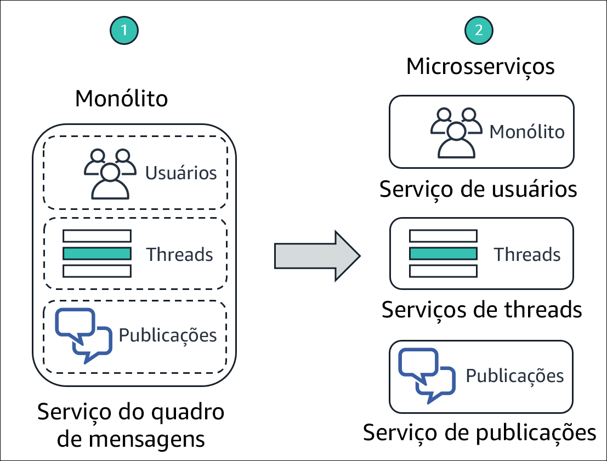
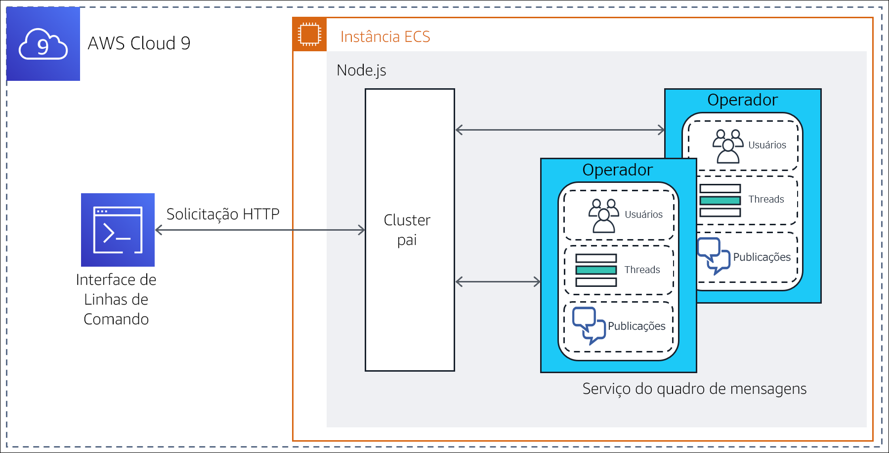
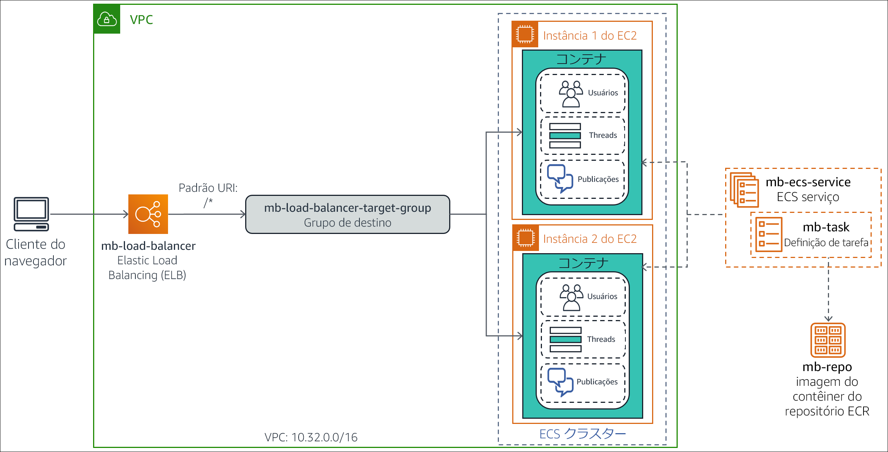
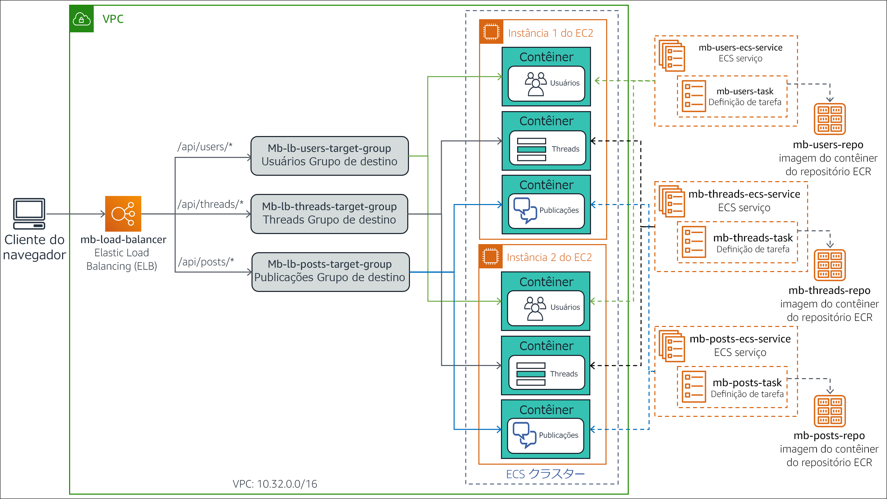

# (Opcional) Módulo 13 – Laboratório guiado 1: Dividir uma aplicação monolítica Node.js em microsserviços

[//]: # "SKU: ILT-TF-200-ACACAD-2    Source Course: ILT-TF-100-TUMCSR-1"

## Visão geral e objetivos do laboratório

Arquiteturas monolíticas tradicionais podem ser difíceis de serem dimensionadas. À medida que a base de código de uma aplicação cresce, fica mais complexo fazer atualizações e manutenções. Pode ser difícil e complicado introduzir novos recursos, linguagens, estruturas de trabalho e tecnologias, o que pode limitar a inovação e a criatividade.

Em uma arquitetura de microsserviços, cada componente da aplicação é executado como o próprio serviço. Eles são criados com base em recursos de negócios, e cada serviço realiza uma única função. Os microsserviços podem ser escritos com diferentes estruturas de trabalho e linguagens de programação e se comunicam com outros serviços por meio de uma Application Programming Interface (API – Interface de programação de aplicações) bem definida. Por fim, você pode implantá-los de modo independente, como um único serviço ou como um grupo de serviços.

Neste laboratório opcional, você migrará uma aplicação monolítica executada em um servidor Node.js padrão para um ambiente Docker em contêiner. Em seguida, refatorará a aplicação em microsserviços e a implantará em um ambiente em contêiner que é orquestrado pelo Amazon Elastic Container Service (Amazon ECS). A aplicação Node.js implementa as funções de um quadro de mensagens simples, em que os *usuários* podem criar *threads*de tópicos e publicar *mensagens* em cada thread.


Depois de concluir este laboratório, você deverá ser capaz de:

- Migrar uma aplicação monolítica Node.js para ser executada em um contêiner do Docker

- Refatorar uma aplicação Node.js de um design monolítico para uma arquitetura de microsserviços

- Implantar uma aplicação de microsserviços Node.js em contêiner no Amazon ECS


O diagrama a seguir ilustra a evolução do design da aplicação à medida que ele se move de monolítico para baseado em microsserviços.




&nbsp;

O diagrama destaca as diferenças a seguir entre a abordagem monolítica e o design de microsserviços:

* Em um design monolítico, todas as funções da aplicação Node.js são empacotadas e executadas como um único serviço. Se uma função falhar, a aplicação inteira apresentará falha. Da mesma forma, se uma função da aplicação tiver um pico na demanda, todas as funções no serviço precisarão ser dimensionadas juntas.

* Em uma arquitetura de microsserviços, cada função da aplicação Node.js é executada como um serviço separado. Os serviços podem ser dimensionados e atualizados de modo independente uns dos outros.

<br/>

## Duração

Este laboratório requer aproximadamente **3 horas** para ser concluído.

<br/>

## Restrições de serviço da AWS

Neste ambiente de laboratório, o acesso aos serviços e ações de serviço da AWS pode estar restrito àqueles necessários para concluir as instruções do laboratório. Você poderá encontrar erros se tentar acessar outros serviços ou executar ações além do que está descrito neste laboratório.

<br/>

## Acessar o Console de Gerenciamento da AWS

1. Na parte superior destas instruções, escolha <span id="ssb_voc_grey">Start Lab</span> (Iniciar laboratório) para iniciar o laboratório.

   Um painel **Start Lab** (Iniciar laboratório) é aberto com o status do laboratório.

   <i class="fas fa-info-circle"></i> **Dica**: se você precisar de mais tempo para concluir o laboratório, escolha novamente o botão <span id="ssb_voc_grey">Start Lab</span> (Iniciar laboratório) para reiniciar o cronômetro do ambiente.

2. Aguarde até que o painel **Start Lab** (Iniciar laboratório) exiba a mensagem *Lab status: ready (Status do laboratório: pronto)* e, em seguida, escolha **X** para fechar o painel.

3. Na parte superior destas instruções, escolha <span id="ssb_voc_grey">AWS</span>.

   Essa ação abrirá o Console de Gerenciamento da AWS em uma nova guia do navegador. O sistema fará seu login automaticamente.

   <i class="fas fa-exclamation-triangle"></i> **Dica**: se uma nova guia do navegador não for aberta, normalmente você verá uma faixa ou um ícone na parte superior do navegador com uma mensagem informando que o navegador está impedindo que o site abra janelas pop-up. Escolha a faixa ou o ícone e depois **Allow pop ups** (Permitir pop-ups).

4. Organize a guia do **Console de Gerenciamento da AWS** para que ela seja exibida com essas instruções. O ideal é ver as duas guias do navegador abertas ao mesmo tempo, para facilitar o acompanhamento das etapas do laboratório.

   <i class="fas fa-exclamation-triangle"></i> **Não altere a região, a menos que seja especificamente instruído a fazer isso**.

<br/>

## Tarefa 1: preparar o ambiente de desenvolvimento

Um ambiente do AWS Cloud9 foi criado para você durante o processo de criação do ambiente de laboratório. O AWS Cloud9 é um Integrated Development Environment (IDE – Ambiente de desenvolvimento integrado) baseado em nuvem que você pode usar para escrever, executar e depurar código em um navegador. Ele vem pré-empacotado com ferramentas essenciais para linguagens de programação conhecidas e oferece acesso à AWS Command Line Interface (AWS CLI) em uma guia de sessão do terminal. Seu ambiente do AWS Cloud9 tem acesso a todos os recursos da AWS autorizados para o ID de usuário utilizado para fazer login no Console de Gerenciamento da AWS.


Para configurar o ambiente de desenvolvimento, você abrirá o IDE do AWS Cloud9, fará download dos *arquivos de laboratório* necessários e os extrairá.

5. Na guia do navegador do **Console de Gerenciamento da AWS**, expanda **All services** (Todos os serviços) e selecione **Developer Tools > Cloud9 (Ferramentas do desenvolvedor > Cloud9)**.

6. No cartão **Cloud9-IDE**, escolha **Open IDE** (Abrir IDE)

   O IDE é aberto em uma nova guia do navegador e exibe várias guias, incluindo uma guia **Welcome** (Bem-vindo).

   Em seguida, você fará download dos arquivos de laboratório necessários e os extrairá.

7. No painel inferior do IDE, insira o seguinte comando na guia do terminal com rótulo **bash - "ip-nnn-nnn-nnn-nnn"**:

    ```bash
    curl -s https://aws-tc-largeobjects.s3.amazonaws.com/ILT-TF-100-TUHAWA-1/lab-four/lab-files-ms-node-js.tar.gz | tar -zxv
    ```

   Esse comando recupera um arquivo compactado que contém os arquivos de laboratório. Ele também extrai o conteúdo do arquivo na pasta **~/environment** do AWS Cloud9. O resultado do comando deve ser parecido com o seguinte exemplo:

   

   &nbsp;

   Os arquivos obtidos por download e extraídos ficam visíveis na janela **Environment** (Ambiente) (no painel esquerdo).

   

   &nbsp;

   Você pode ver as seguintes pastas:

   - **1-no-container**: contém os arquivos relacionados à implementação *monolítica* da aplicação. Essa implementação foi projetada para ser executada diretamente em um servidor Node.js.

   - **2-containerized-monolith**: contém os arquivos relacionados à implementação *monolítica* da aplicação. Essa implementação foi projetada para ser executada em um ambiente Docker em contêiner orquestrado pelo Amazon ECS.

   - **3-containerized-microservices**: contém os arquivos relacionados à implementação de *microsserviços* da aplicação. Essa implementação foi projetada para ser executada em um ambiente Docker em contêiner orquestrado pelo Amazon ECS.

   Mantenha a guia do IDE do AWS Cloud9 aberta em todo este laboratório, pois você a usará com frequência.

<br/>
## Tarefa 2: executar a aplicação em um servidor Node.js básico

A aplicação Node.js base é um serviço monolítico que foi projetado para ser executado diretamente em um servidor, sem um contêiner. Nesta tarefa, você implantará a aplicação no servidor Node.js que está instalado na instância que executa o ambiente do AWS Cloud9. Em seguida, você testará a aplicação usando o terminal da AWS CLI para invocar os métodos da API RESTful.

A arquitetura de implantação e o fluxo de solicitações estão ilustrados no diagrama a seguir.



&nbsp;

**Observação**: a implementação monolítica da aplicação usa a funcionalidade de *cluster* do Node.js para gerar um processo de operador por núcleo da CPU. Os processos compartilham uma única porta e são invocados de modo round-robin pelo balanceador de carga incorporado ao Node.js. Esse recurso aumenta a escalabilidade em servidores que têm vários núcleos de CPU.

Nesta tarefa, você vai:

- Instalar os módulos Node.js exigidos pela aplicação

- Analisar o design e o código da aplicação

- Executar a aplicação

<br/>

### Tarefa 2.1: instalar os módulos Node.js necessários

A aplicação do quadro de mensagens utiliza dois módulos da estrutura de trabalho *koa* do Node.js na implementação: *koa* e *koa-router*. *Koa.js* é uma estrutura de trabalho da aplicação Web do Node.js que é amplamente utilizada e facilita a criação de aplicações JavaScript assíncronas do lado do servidor.

8. Na guia do terminal, insira os seguintes comandos para instalar os módulos *koa* e *koa-router*:

    ```bash
    cd ~/environment/1-no-container
    npm install koa
    npm install koa-router
    ```

    

    &nbsp;

   Os módulos são obtidos por download e instalados na pasta **1-no-container/node_modules** da pasta **~/environment** do AWS Cloud9. Você pode ignorar o aviso e as advertências e atualizar as mensagens que constam no resultado.

<br/>

### Tarefa 2.2: analisar o design e o código da aplicação

Os componentes que implementam a aplicação monolítica do quadro de mensagens estão na pasta **1-no-container**. Analise-os para ter uma compreensão do design e do código da aplicação.

9. Na janela **Environment** (Ambiente) à esquerda, expanda a pasta **1-no-container**. Os componentes da aplicação incluem:

   - Pasta **node_modules**: essa pasta foi criada quando você instalou os módulos JavaScript necessários na subtarefa anterior. Ela contém o código-fonte.

   - **db.json**: um objeto JSON (JavaScript Object Notation) que simula o banco de dados do quadro de mensagens. Ele contém atributos que representam *usuários*, *threads*e *publicações*, com valores de amostra correspondentes.

   - **index.js**: programa JavaScript que é o ponto de entrada da aplicação.

   - **package.json**: um objeto JSON que descreve a aplicação e o ponto de entrada e as dependências correspondentes.

   - **package-lock.json**: um objeto JSON que foi gerado automaticamente quando você instalou os módulos JavaScript necessários na pasta **node_modules**. Ele é usado pelo utilitário de instalação, *npm*, para monitorar as modificações feitas na pasta.

   - **server.js:** programa JavaScript que define os métodos da API RESTful da aplicação e implementa os respectivos manipuladores.

10. Examine o objeto *package.json*. Na janela **Environment** (Ambiente), abra **package.json** em uma guia do editor clicando duas vezes nele. Observe os seguintes atributos do objeto JSON:

   - **Linhas 2 a 5**: o atributo *dependencies* define as dependências do módulo JavaScript para a aplicação. Observe que os módulos *koa* e *koa-router* instalados na subtarefa anterior estão listados aqui.

   - **Linhas 6 a 8**: o atributo *scripts* declara o programa *index.js* como o ponto de entrada da aplicação.

11. Examine o objeto **db.json**. Na janela **Environment** (Ambiente), abra **db.json** em uma guia do editor clicando duas vezes nele. Observe os seguintes atributos do objeto JSON:

   - **Linhas 2 a 27**: essas linhas definem um atributo *users* que representa os usuários registrados do quadro de mensagens. O valor do atributo é uma lista de *quatro* exemplos de usuários com os seguintes nomes: *Marcerline Singer*, *Finn Alberts*, *Paul Barium* e *Jake Storm*.

   - **Linhas 29 a 45**: essas linhas definem um atributo *threads* que representa os threads ativos atuais no quadro de mensagens. O valor do atributo é uma lista de *três* exemplos de threads com os seguintes títulos:

      - *Did you see the Brazil game? (Viu o jogo do Brasil?)*

      - *New French bakery opening in the neighborhood tomorrow (Abertura de nova padaria francesa no bairro amanhã)*

      - *In search of a new guitar (Em busca de uma guitarra nova)*

      - **Linhas 47 a 78**: essas linhas definem um atributo *posts* que representa as mensagens publicadas nos threads ativos. O valor do atributo é uma lista de *seis* publicações de mensagens de exemplo.

12. Analise o código de *index.js*. Na janela **Environment** (Ambiente), abra **index.js** em uma guia do editor clicando duas vezes nele. Observe as seguintes informações:

   - **Linhas 1 a 3**: essas linhas importam os módulos JavaScript que o programa exige, especificamente: *cluster*, *http* e *os*.

   - **Linha 3**: essa linha usa o módulo *os* para questionar sobre o número de núcleos da CPU disponíveis no servidor.

   - **Linhas 5 a 15**: essas linhas são executadas na primeira vez que o programa é chamado (quando a aplicação é iniciada). Elas criam um thread *líder* para o cluster e um thread de *operador* para cada núcleo da CPU disponível no servidor.

   - **Linhas 16 a 19**: essas linhas processam cada solicitação feita à aplicação chamando o programa *server.js* no thread de *operador* atual.

13. Por fim, analise o código de *server.js*. Na janela **Environment** (Ambiente), abra **server.js** em uma guia do editor clicando duas vezes nele. Use os comentários fornecidos no código para facilitar sua compreensão da lógica. Observe as seguintes informações em particular:

   - **Linha 3**: essa linha importa *db.json*, o objeto JSON que simula o banco de dados.

   - **Linhas 6 a 11**: essas linhas definem uma função de gerador que é executada para cada solicitação. O objetivo delas é imprimir uma linha que contenha o *método HTTP*, o *URL do caminho do recurso*e o *tempo decorrido* de cada solicitação processada.

   - **Linhas 13 a 47**: essas linhas definem os métodos da API RESTful da aplicação e a implementação correspondente. A aplicação pode responder especificamente às chamadas RESTful a seguir.

      - `GET /api/users`: retorna a coleção de *usuários* no banco de dados

      - `GET /api/users/:userId`: retorna as informações do *usuário* que é identificado por *:userId*

      - `GET /api/threads`: retorna a coleção de *threads* no banco de dados

      - `GET /api/threads/:threadId`: retorna as informações do *thread* que é identificado por *:threadId*

      - `GET /api/posts/in-thread/:threadId`: retorna a coleção de *mensagens de publicações* do *thread* que é identificado por *:threadId*

      - `GET /api/posts/by-user/:userId`: retorna a coleção de *mensagens de publicações* do *usuário* que é identificado por *:userId*

      - `GET /api/`: retorna a *API de mensagem pronta para receber solicitações*

      - `GET /`: retorna a mensagem *Ready to receive requests (Pronto para receber solicitações)*

   - **Linha 52**: essa linha define o *número da porta* em que a aplicação detecta solicitações

<br/>

### Tarefa 2.3: executar a aplicação

Nesta subtarefa, você iniciará o servidor Node.js e executará a aplicação do quadro de mensagens. Em seguida, testará alguns dos métodos da API RESTful.

14. Na guia do terminal, inicie o Node.js e a aplicação inserindo o seguinte comando:

    ```bash
    npm start
    ```

    

    &nbsp;

    O servidor é iniciado e o ponto de entrada da aplicação, *index.js*, é executado. A primeira vez que *index.js* é chamado, ele cria dois threads de cluster (*Líder* e *Operador*) para processar solicitações.

    Em seguida, você deixará a sessão atual do terminal ativa e abrirá uma segunda guia do terminal para testar a API RESTful da aplicação.

15. No painel inferior, abra uma nova guia do terminal escolhendo **(+)** e selecionando **New Terminal** (Novo terminal). Agora, você tem dois terminais nos quais pode inserir comandos.

16. Na **guia direita do terminal**, recupere o recurso `/api/users` inserindo o seguinte comando:

    ```bash
    curl localhost:3000/api/users
    ```

   A chamada RESTful retorna um objeto JSON que contém a lista de *usuários* no banco de dados do quadro de mensagens.


&nbsp;

17. Selecione a **guia esquerda do terminal**. Você vê uma mensagem de resultado do server.js que processou uma solicitação de método GET no recurso, que é identificada pelo caminho `/api/users`. A solicitação levou *4* milissegundos para ser processada.

    

    &nbsp;

18. Recupere as informações apenas para o *quarto* usuário no banco de dados. Na **guia direita do terminal**, digite o seguinte comando:

    ```bash
    curl localhost:3000/api/users/4
    ```

    As informações de *Jake Storm*, o quarto usuário no banco de dados, são retornadas:

    


19. Em seguida, recupere todos os *threads* que estão no banco de dados atualmente. Na **guia direita do terminal**, digite o seguinte comando:

    ```bash
    curl localhost:3000/api/threads
    ```

    Um objeto JSON que contém todos os threads no banco de dados é retornado:

    

    &nbsp;

20. Por fim, recupere todas as *publicações* do *primeiro* thread no banco de dados. Na **guia direita do terminal**, digite o seguinte comando:

    ```bash
    curl localhost:3000/api/posts/in-thread/1
    ```

    Um objeto JSON que contém duas publicações de mensagens é retornado:

    

    &nbsp;

21. Interrompa o servidor Node.js. Na **guia esquerda do terminal**, pressione CTRL+C para encerrar o processo do servidor.

Você confirmou que a aplicação responde corretamente às solicitações GET. Na próxima tarefa, você colocará a aplicação em contêiner.

<br/>

## Tarefa 3: colocar o monólito em contêiner para o Amazon ECS

Os contêineres envolvem o código da aplicação em uma unidade de implantação, o que captura um snapshot do código e das dependências dele. Eles podem ajudar a garantir que as aplicações sejam implantadas de maneira rápida, confiável e consistente, independentemente do ambiente de implantação.

Nesta tarefa, você criará uma imagem de contêiner para a aplicação monolítica do quadro de mensagens e a enviará para o Amazon Elastic Container Registry (Amazon ECR). Esta etapa prepara a aplicação para implantação no Amazon ECS.

Você executará especificamente as seguintes etapas:

- Preparar a aplicação para colocação em contêiner do Docker

- Provisionar um repositório

- Criar e enviar a imagem do Docker para o repositório

<br/>
### Tarefa 3.1: preparar a aplicação para colocação em contêiner do Docker

As seguintes alterações devem ser feitas na aplicação do quadro de mensagens para colocá-la em um contêiner do Docker:

- Remova o uso do recurso de *cluster* do Node.js e converta a aplicação em um design de processo único. Com os contêineres do Docker, o objetivo é executar um único processo por contêiner, em vez de um cluster de processos.

- Crie um *Dockerfile* para a aplicação. Esse arquivo é basicamente um script de compilação que contém instruções sobre como criar uma *imagem de contêiner* para a aplicação.

Uma versão pronta para contêiner da aplicação é fornecida a você na pasta **2-containerized-monolith** do ambiente do AWS Cloud9. Dedique alguns minutos para analisar os arquivos e entender as alterações que foram feitas para preparar a aplicação para colocação em contêiner.

22. Na janela **Environment** (Ambiente) à esquerda, expanda a pasta **2-containerized-monolith** e abra o **package.json** em uma guia do editor clicando duas vezes nele.

   Na **linha 7**, observe que o ponto de entrada na aplicação foi alterado de *index.js* para *server.js*. O arquivo *index.js* não está mais na pasta da aplicação. O arquivo *index.js* continha a lógica de inicialização para o recurso de *cluster* do Node.js, e você não usará mais esse recurso.

23. Na janela **Environment** (Ambiente), expanda a pasta **2-containerized-monolith** e abra o arquivo **server.js** em uma guia do editor clicando duas vezes nele.

   A única diferença em relação à versão que não está em contêiner é a adição da **linha 54**, que imprime a mensagem *Worker started (Operador iniciado)* quando a aplicação é iniciada pela primeira vez.

24. Na janela **Environment** (Ambiente), expanda a pasta **2-containerized-monolith** e abra o **Dockerfile** em uma guia do editor clicando duas vezes nele.

    Esse arquivo contém as instruções sobre como criar a imagem do contêiner para a aplicação.

    

    &nbsp;

Observe as seguintes informações:

- **Linha 1**: a imagem base na qual a imagem do contêiner será construída. Aqui, é *alpine-node*, que é uma imagem do Node.js.

- **Linha 3**: essa linha define o diretório de trabalho do sistema de arquivos na imagem como */srv*.

- **Linha 4**: essa linha adiciona o conteúdo da pasta **2-containerized-monolith** (a pasta da aplicação) ao diretório de trabalho atual do sistema de arquivos da imagem (definido na linha anterior).

- **Linha 5**: essa linha chama o comando *npm install* para instalar todas as dependências da biblioteca da aplicação que foram declaradas no arquivo *package.json*.

- **Linha 7**: essa linha informa ao Docker que o contêiner detecta na porta 3000 quando é executado.

- **Linha 8**: essa linha pede que o Docker execute o comando *node server.js*, que inicia a aplicação quando a imagem é iniciada.

Agora que você sabe como será criada a imagem do contêiner para a aplicação, examinará onde colocar a imagem depois que ela for criada.

<br/>
### Tarefa 3.2: provisionar um repositório

As imagens de contêiner do Docker foram projetadas para ser armazenadas em um repositório para compartilhamento, controle de versão e objetivos de gerenciamento facilitados. O *Amazon ECR* facilita o armazenamento, o gerenciamento e a implantação de imagens de contêiner do Docker por parte dos desenvolvedores. Além disso, o Amazon ECR é integrado e permite que o Amazon ECS extraia imagens de contêiner diretamente para implantações de produção.

Nesta subtarefa, você criará um repositório no Amazon ECR para armazenar a imagem de contêiner do Docker para a aplicação do quadro de mensagens.

25. Na guia do navegador **Your environments** (Seus ambientes), escolha **Services** (Serviços) e, em seguida, selecione **Container > Elastic Container Registry** (Contêiner > Elastic Container Registry).

   O console do Amazon ECR é aberto.

26. Em **Create a repository** (Criar um repositório), escolha **Get Started** (Comece a usar).

27. Na caixa de texto **Repository name** (Nome do repositório), digite `mb-repo`.

28. Escolha **Create repository** (Criar repositório).

   Uma mensagem na parte superior da página indica que o repositório foi criado com êxito.

   **Observação:** *não feche a janela que mostra a mensagem.* Você a usará na próxima subtarefa.

<br/>

### Tarefa 3.3: criar e enviar a imagem do Docker

Agora, você está pronto para criar a imagem de contêiner para a aplicação e enviá-la para o repositório do Amazon ECR criado.

Um recurso útil do console do Amazon ECR é que ele oferece modelos de comando prontos para uso para criar e enviar uma imagem para o repositório novo. Você usa esses comandos fornecidos da AWS CLI nas próximas etapas.

29. Antes de realizar as próximas etapas, você precisa atualizar a AWS CLI. Para fazer isso, acesse a guia do navegador do **IDE do AWS Cloud9** e, na **guia esquerda do terminal**, insira os seguintes comandos:

      ```bash
      pip3 install awscli --upgrade --user
      export PATH=$HOME/.local/bin:$PATH
      ```

30. Volte para a guia do navegador do console do **Amazon ECR** e, na janela de mensagem na parte superior da página, escolha **View push commands** (Exibir comandos push).

   A janela pop-up **Push commands for mb-repo** (Comandos push para mb-repo) é aberta. Essa janela lista quatro comandos da AWS CLI que são personalizados para o *mb-repo*, e eles são criados com o propósito de:

   - Autenticar o cliente Docker no registro do Amazon ECR
   - Criar a imagem do Docker
   - Marcar a imagem do Docker
   - Enviar a imagem do Docker para o repositório

A janela pop-up oferece duas versões dos comandos: uma para *macOS/Linux* e outra para o *Microsoft Windows*.

31. Verifique se a guia **macOS/Linux** está selecionada, pois você executará esses comandos em seu ambiente do AWS Cloud9.

   Primeiro, você copiará e executará o comando para fazer login do seu cliente Docker no seu registro.

32. Na janela pop-up, localize o *primeiro* comando e copie-o para a área de transferência escolhendo o ícone **Copy** (Copiar).

    O comando se parece com o seguinte exemplo:

    ```bash
    $ aws ecr get-login-password --region us-east-1 | docker login --username AWS --password-stdin 01234567890.dkr.ecr.us-east-1.amazonaws.com/mb-repo
    ```

33. Alterne para a guia do navegador do **IDE do AWS Cloud9**.

34. Na **guia esquerda do terminal**, cole o comando copiado e pressione ENTER para executá-lo:

    

    &nbsp;

    Se o comando for executado com êxito, ele retornará a mensagem *Login Suceeded (Login com êxito)*. Você pode ignorar os avisos exibidos.

    Em seguida, você criará a imagem do Docker para a aplicação.

    **Observação**: quando uma guia do terminal específica não for mencionada em uma etapa de instrução, use a guia *esquerda* do terminal.

35. Na guia do terminal, altere o diretório para a pasta **2-containerized-monolith** digitando o seguinte comando:

    ```bash
    cd ~/environment/2-containerized-monolith
    ```

36. Alterne para a guia do navegador do console do **Amazon ECR**.

37. Na janela **Push commands for mb-repo** (Comandos push para mb-repo), localize o *segundo* comando e escolha o ícone **Copy** (Copiar) para copiá-lo.

    O comando se parece com o seguinte exemplo:

    ```bash
    docker build -t mb-repo .
    ```

   Lembre-se de incluir o ponto (.) no fim do comando.

38. Alterne para a guia do navegador do **IDE do AWS Cloud9**.

39. Na guia do terminal, cole o comando copiado e pressione ENTER para executá-lo:

    

    &nbsp;

   O comando *build* produz várias linhas de resultado, pois executa as instruções que estão no *Dockerfile* da aplicação. Quando ele for concluído, você verá as mensagens *Successfully built nnnnnnnnnn (Compilado com êxito nnnnnnnnnn)* e *Successfully tagged mb-repo:latest (Marcado com êxito mb-repo:latest)*.

   Em seguida, você marcará a imagem com o URI do repositório para que ela possa ser enviada para o repositório.

40. Alterne para a guia do navegador do console do **Amazon ECR**.

41. Na janela **Push commands for mb-repo** (Comandos push para mb-repo), localize o *terceiro* comando e escolha o ícone **Copy** (Copiar).

    O comando se parece com o seguinte exemplo:

    ```bash
    docker tag mb-repo:latest 1234567890.dkr.ecr.us-east-2.amazonaws.com/mb-repo:latest
    ```

42. Alterne para a guia do navegador do **IDE do AWS Cloud9**.

43. Na guia do terminal, cole e execute o comando copiado:

    

    &nbsp;

    O comando não retornará nada se for concluído com êxito.

    Por fim, você enviará a imagem do contêiner para o repositório da aplicação.

44. Alterne para a guia do navegador do console do **Amazon ECR**.

45. Na janela **Push commands for mb-repo** (Comandos push para mb-repo), localize o *quarto* comando e copie-o.

    O comando se parece com o seguinte exemplo:

    ```bash
    docker push 1234567890.dkr.ecr.us-east-2.amazonaws.com/mb-repo:latest
    ```

46. Alterne para a guia do navegador do **IDE do AWS Cloud9**.

47. Na guia do terminal, cole e execute o comando copiado:

    

    &nbsp;

    O comando gera várias mensagens à medida que cada camada da imagem é enviada para o repositório.

    Em seguida, você verificará se o upload da imagem foi realizado com êxito.

48. Alterne para a guia do navegador do console do **Amazon ECR**.

49. Feche a janela **Push commands for mb-repo** (Comandos push para mb-repo).

50. Na lista **Repositories** (Repositórios), escolha **mb-repo**.

    Na lista **Images** (Imagens), você deve ver a imagem do contêiner que enviou, que pode ser identificada pela tag *latest (mais recente)*.

    

    &nbsp;

51. Grave o *URI da imagem*. Na lista **Images** (Imagens), localize o **URI de imagem** da versão *mais recente* da imagem e escolha o ícone **Copy** (Copiar). Cole o valor em um editor de texto. Você o usará em uma etapa posterior.

    Você criou com êxito uma imagem de contêiner para a aplicação do quadro de mensagens e também a enviou para um repositório do Amazon ECR.

<br/>

## Tarefa 4: implantar o monólito no Amazon ECS

Nesta tarefa, você implantará a aplicação monolítica em contêiner em um ambiente de tempo de execução do Amazon ECS. Especificamente, você usará o Amazon ECS para criar um cluster gerenciado de instâncias do Amazon Elastic Compute Cloud (Amazon EC2). Você implantará a imagem do contêiner da aplicação neste cluster. O cluster é configurado como o grupo de destino de um Application Load Balancer, que fornecerá failover e escalabilidade.

O diagrama a seguir mostra a arquitetura de implantação da aplicação monolítica em contêiner. Ele também exibe os recursos que você criará nesta tarefa.



&nbsp;

As etapas que você realizará nesta tarefa são:

- Criar um cluster do Amazon ECS.

- Criar uma definição de tarefa para a imagem do contêiner da aplicação.

- Criar o Application Load Balancer.

- Implantar a aplicação monolítica como um serviço do ECS.

- Testar a aplicação monolítica em contêiner.

<br/>
### Tarefa 4.1: criar um cluster do Amazon ECS

Um cluster do Amazon ECS é um agrupamento lógico de instâncias do EC2 em que você pode executar tarefas ou serviços que representam a aplicação em contêiner.

Nesta subtarefa, você criará um cluster do ECS usando o console do Amazon ECS. O assistente de criação de cluster do console permite que você crie todos os componentes de infraestrutura necessários para criar o ambiente de cluster do ECS. Esses componentes incluem Virtual Private Cloud (VPC), sub-redes, grupos de segurança, gateway da Internet e funções do AWS Identity and Access Management (IAM).

52. Volte para a guia do navegador do **Console de Gerenciamento da AWS**, escolha **Services** (Serviços) e, em seguida, selecione **Containers > Elastic Container Service** (Contêineres > Elastic Container Service).

53. No painel de navegação, escolha **Amazon ECS > Clusters**.

54. Na página **Clusters**, escolha **Create Cluster** (Criar cluster).

55. Na página **Select cluster template** (Selecionar modelo de cluster), selecione o cartão **EC2 Linux + Networking** (EC2 Linux + rede).

56. Escolha **Next step** (Próxima etapa).

57. No assistente **Configure cluster** (Configurar cluster), defina as configurações a seguir.
   - **Cluster name** (Nome do cluster): `mb-ecs-cluster`
   - **Provisioning Model** (Modelo de provisionamento): *On-Demand Instance (Instância sob demanda)*
   - **EC2 instance type** (Tipo de instância do EC2): *t2.micro*
   - **Number of instances** (Número de instâncias): `2`
   - **VPC**: *Create a new VPC (Criar uma nova VPC)*
   - **CIDR block** (Bloco CIDR): `10.32.0.0/16`
   - **Subnet 1** (Sub-rede 1): `10.32.0.0/24`
   - **Subnet 2** (Sub-rede 2): `10.32.1.0/24`
   - **Security group** (Grupo de segurança): *Create a new security group* (Criar um novo grupo de segurança)
   - **Security group inbound rules** (Regras de entrada do grupo de segurança): deixe na configuração padrão, que permite o tráfego de entrada de todos os endereços IP na porta 80.

   **Observação**: a mensagem na seção **Container instance IAM role** (Função do IAM da instância de contêiner) indica que você está concedendo permissões ao Amazon ECS para criar e usar a **ecsInstanceRole**. Essa função autoriza as instâncias do EC2 no cluster a invocar ações do Amazon ECS.

58. Escolha **Create** (Criar).

   A página **Launch Status** (Status da execução) é aberta e mostra as tarefas que o assistente realiza.

59. Aguarde até que todas as tarefas tenham uma marca de seleção, o que indica que elas foram concluídas.

    

    &nbsp;

    Os recursos criados pelo assistente são listados na seção **Cluster Resources** (Recursos do cluster).

60. Escolha **View Cluster** (Exibir cluster).

    A página de detalhes para o *mb-ecs-cluster* é aberta. O campo **Status** mostra um valor *ACTIVE (ATIVO)*.

61. Escolha a guia **ECS Instances** (Instâncias do ECS).

    As duas instâncias do EC2 para o cluster (que o assistente criou) são listadas.

    **Observação**: pode levar alguns minutos para que as duas instâncias do EC2 sejam exibidas na lista. Se você não vir as duas instâncias, escolha **Refresh** (Atualizar).

    

    &nbsp;

62. Escolha a guia **Tasks** (Tarefas).

    Nenhuma tarefa foi implantada no cluster ainda. Você criará uma em seguida.

<br/>
### Tarefa 4.2: criar uma definição de tarefa para a imagem do contêiner da aplicação

Uma definição de tarefa é uma lista de configurações para executar um contêiner do Docker no Amazon ECS. Ela transmite ao Amazon ECS vários tipos de informações, como:

- Qual imagem de contêiner deve ser executada
- De quanta CPU e memória o contêiner precisa
- Em quais portas o contêiner detecta o tráfego

Nesta subtarefa, você criará uma definição de tarefa para a imagem de contêiner da aplicação do quadro de mensagens.

63. No painel de navegação da guia do navegador do console do **Amazon ECS**, escolha **Task Definitions** (Definições de tarefas).

64. Selecione **Create new Task Definition** (Criar nova definição de tarefa).

65. Na página **Select launch type compatibility** (Selecionar compatibilidade do tipo de execução), escolha o cartão **EC2**.

66. Escolha **Next step** (Próxima etapa).

   A página **Configure task and container definitions** (Configurar definições de contêiner e tarefa) é aberta.

67. Na caixa **Task Definition Name** (Nome da definição da tarefa), insira `mb-task`.

68. Role para baixo até **Container Definitions** (Definições de contêiner) e selecione **Add container** (Adicionar contêiner).

   A janela **Add container** (Adicionar contêiner) é aberta.

69. Defina as configurações a seguir.
    - **Container name** (Nome do contêiner): `mb-container`
    - **Image** (Imagem): cole o **URI da imagem** do contêiner da aplicação, que você copiou para um editor de texto em uma etapa anterior.
    - **Memory Limits** (Limites de memória): selecione *Hard limit (Limite rígido)* e insira `256` (essa configuração define a quantidade máxima de memória que o contêiner tem permissão para usar).
    - **Port mappings > Container port (Mapeamentos de porta > Porta do contêiner)**: `3000` (essa configuração especifica a porta em que o contêiner recebe solicitações, e não é preciso inserir um valor em **Host port [Porta do host]**).

    A janela **Add container** (Adicionar contêiner) será semelhante ao seguinte exemplo:

    

    &nbsp;

70. Escolha **Add** (Adicionar).

71. Role para baixo e escolha **Create** (Criar). Você pode ignorar os avisos.

    Uma mensagem é exibida, indicando que a definição da tarefa foi criada com êxito. Observe que o número de versão *1* é atribuído automaticamente à definição.

    

    &nbsp;

    Agora, você tem uma definição de tarefa que informa ao Amazon ECS como implantar o contêiner da aplicação em todo o cluster.

<br/>

### Tarefa 4.3: criar o Application Load Balancer

Em seguida, você criará o Application Load Balancer que distribui solicitações recebidas para as instâncias do EC2 executadas no cluster do ECS. Esse balanceador de carga reside na mesma VPC e usa o mesmo grupo de segurança que o cluster do ECS.

72. Na guia do navegador do console do **Amazon ECS**, escolha **Services** (Serviços) e, em seguida, selecione **Compute > EC2 (Computação > EC2)**.

73. No painel de navegação, role para baixo e selecione **Load Balancers** (Balanceadores de carga).

74. Escolha **Create load balancer** (Criar balanceador de carga).

   A página **Select load balancer type** (Selecionar tipo de balanceador de carga) é aberta.

75. No cartão **Application Load Balancer**, escolha **Create** (Criar).

   O assistente de criação do Application Load Balancer é aberto.

76. Em **Step 1: Configure Load Balancer** (Etapa 1: Configurar Load Balancer), defina as configurações a seguir.
   - **Name** (Nome): `mb-load-balancer`
   - Role até a seção **Availability Zones** (Zonas de disponibilidade) e insira estas configurações.
      - **VPC**: selecione o *ID da VPC do cluster do Amazon ECS*. Esse ID será semelhante a *vpc-nnnnnnnnnn (10.32.0.0/16)*
      - **Availability Zones** (Zonas de disponibilidade): selecione ambas as zonas de disponibilidade.

77. Selecione **Next: Configure Security Settings** (Próximo: Configurações de segurança).

78. Em **Step 2: Configure Security Settings** (Etapa 2: Configurações de segurança), você pode ignorar o aviso de que o balanceador de carga não está usando um listener seguro. Escolha **Next: Configure Security Groups** (Próximo: Configurar grupos de segurança).

79. Em **Step 3: Configure Security Groups** (Etapa 3: Configurar grupos de segurança), defina estas configurações.
   - **Assign a security group** (Atribuir um grupo de segurança): *Select an existing security group (Selecionar um grupo de segurança existente)*
   - **Security Group ID** (ID do grupo de segurança):
      - Limpe *default (padrão)*.
      - Selecione *EC2ContainerService-mb-ecs-cluster-EcsSecurityGroup* (este é o grupo de segurança do cluster do ECS).

80. Escolha **Next: Configure Routing** (Próximo: Configurar roteamento).

81. Em **Step 4: Configure Routing** (Etapa 4: Configurar roteamento), defina as configurações a seguir.
   - **Target group** (Grupo de destino): *New target group (Novo grupo de destino)* (você deseja que o assistente crie um grupo de destino novo para o balanceador de carga).
   - **Name** (Nome): `mb-load-balancer-target-group`
   - **Protocolo** (Protocol) e **Port** (Porta): deixe essas configurações nos valores padrão de *HTTP* e *80*. A aplicação espera ser acessada por meio de solicitações HTTP RESTful.
   - Expanda **Advanced health check settings** (Configurações avançadas de verificação de integridade) e insira as configurações a seguir.
      - **Healthy threshold** (Limite de integridade): `2` (essa configuração informa ao balanceador de carga que o destino é considerado íntegro se recebe duas verificações de integridade com êxito consecutivas).
      - **Interval** (Intervalo): `6` (essa configuração aumenta a frequência das verificações de integridade para uma vez a cada seis segundos).

82. Escolha **Next: Register Targets** (Próximo: registrar destinos).

83. Você pode pular a **Step 5: Register Targets** (Etapa 5: registrar destinos) porque registrará um *serviço do ECS* como destino em uma etapa posterior. Escolha **Next: Review** (Próximo: revisar).

84. Na página **Review** (Revisar), verifique se as configurações estão corretas e escolha **Create** (Criar).

   Uma mensagem deve indicar que o balanceador de carga foi criado com êxito.

85. Escolha **Close** (Fechar).

   O *mb-load-balancer* está agora na lista de balanceadores de carga.

86. Aguarde alguns momentos e, em seguida, escolha o ícone **Refresh** (Atualizar). O **State** (Estado) do balanceador de carga deve ser alterado para *active (ativo)*.

    

    &nbsp;

   Para concluir a configuração do balanceador de carga, você modificará o grupo de segurança dele para abrir as portas que permitem a comunicação interna entre o balanceador de carga e as instâncias no cluster do ECS.

87. Na guia **Description** (Descrição) na parte inferior, role para baixo até a seção **Security** (Segurança).

88. Ao lado de **Security Groups** (Grupos de segurança), escolha o link do ID do grupo de segurança, que deve ser semelhante a *sg-nnnnnnnnnn*.

   A página de detalhes do grupo de segurança do balanceador de carga é aberta.

89. Para copiar o ID do grupo de segurança para a área de transferência, vá para a guia **Details** (Detalhes) (no painel inferior), passe o cursor sobre o **ID do grupo de segurança** e escolha o ícone **Copy** (Copiar).

   Você usará esse ID em uma etapa posterior.

90. No painel inferior, selecione a guia **Inbound rules** (Regras de entrada).

   As regras de entrada do grupo de segurança são exibidas.

91. Escolha **Edit inbound rules** (Editar regras de entrada).

   A janela de diálogo **Edit inbound rules** (Editar regras de entrada) é aberta.

92. Escolha **Add rule** (Adicionar regra).

   Uma linha nova é exibida na lista de regras para que você possa adicionar uma regra nova. Ela já está pré-configurada para uma *regra personalizada de TCP*, que é o tipo que você deseja adicionar.

93. Na linha nova, adicione a configuração a seguir.
   - **Port Range** (Intervalo de portas): `31000-61000`
   - **Source > Custom** (Origem > Personalizado): cole o ID do grupo de segurança da área de transferência.

94. Escolha **Save rules** (Salvar regras).

    A lista de regras de entrada do grupo de segurança exibe a regra nova que você adicionou.

    

    &nbsp;

<br/>

### Tarefa 4.4: implantar o monólito como um serviço do ECS

Você criou todos os componentes de infraestrutura necessários do Amazon ECS. Nesta subtarefa, você implantará a aplicação monolítica em contêiner no cluster como um Amazon ECS Service.

Um serviço do ECS permite que você execute e mantenha simultaneamente um número especificado de instâncias de definição de tarefa em um cluster do ECS. Se uma das tarefas falhar ou for interrompida por qualquer motivo, o programador de serviços do ECS iniciará outra instância de definição de tarefa para substituí-la. Assim, ele manterá a contagem desejada de tarefas especificada no serviço.

Agora, você criará um serviço do ECS para a definição de tarefa da aplicação do quadro de mensagens usando o console do Amazon ECS.

95. Na guia do navegador do **Console de Gerenciamento da AWS**, escolha **Services** (Serviços) e selecione **Containers > Elastic Container Service** (Contêineres > Elastic Container Service).

96. No painel de navegação, escolha **Task Definitions** (Definições de tarefas).

97. Na lista **Task Definition** (Definição da tarefa), escolha o link **mb-task**.

   Uma página é aberta com as revisões disponíveis da definição da tarefa.

98. Selecione **mb-task:1** e escolha **Actions > Create Service** (Ações > Criar serviço).

99. Em **Step 1: Configure service** (Etapa 1: Configurar serviço), defina estas configurações.
   - **Launch type** (Tipo de execução): *EC2* (você está executando a aplicação em contêiner diretamente em um cluster de instâncias do EC2).
   - **Service name** (Nome do serviço): `mb-ecs-service`
   - **Service type** (Tipo de serviço): *REPLICA (RÉPLICA)* (essa configuração estabelece uma estratégia de programação que coloca e mantém o número desejado de tarefas em todo o cluster do ECS).
   - **Number of tasks** (Número de tarefas): `1` (normalmente, para aproveitar ao máximo o cluster, você insere um número maior, dependendo da carga da solicitação que você espera. No entanto, para simplificar este exercício, você especifica que deseja iniciar e manter uma tarefa no cluster o tempo todo).

100. Escolha **Next step** (Próxima etapa).

101. Em **Step 2: Configure network** (Etapa 2: Configurar rede), defina as configurações a seguir.
   - **Load balancer type** (Tipo de balanceador de carga): *Application Load Balancer* (você deseja que as tarefas em seu serviço tenham a carga balanceada pelo *mb-load-balancer* que você configurou anteriormente)
   - **Service IAM role** (Função de serviço IAM): *Create new role (Criar nova função)*
   - **Load balancer name** (Nome do balanceador de carga): *mb-load-balancer*
   - **Container name:port** (Nome do contêiner:porta): esse campo já está preenchido com as informações de contêiner corretas associadas à definição da tarefa. Escolha **Add to load balancer** (Adicionar ao balanceador de carga) (essa configuração associará o contêiner a um dos listeners do balanceador de carga).
   - **Production listener port** (Porta do listener de produção): *80:HTTP* (essa configuração associa o contêiner ao listener do balanceador de carga para o tráfego HTTP na porta 80)
   - **Target group name** (Nome do grupo de destino): *mb-load-balancer-target-group*

102. Escolha **Next step** (Próxima etapa).

103. Em **Step 3: Set Auto Scaling (optional)** (Etapa 3: Definir dimensionamento automático [opcional]), escolha **Next step** (Próxima etapa). Você não deseja configurar nenhum dimensionamento automático adicional.

104. Na página **Review** (Revisar), verifique se as configurações estão corretas e escolha **Create Service** (Criar serviço).

   A página **Launch Status** (Status da execução) é aberta e mostra as tarefas que o assistente realiza.

105. Aguarde até que todas as tarefas exibam marcas de seleção, o que indica que elas foram concluídas.

     

     &nbsp;

106. Para abrir a página de detalhes do *mb-ecs-service*, escolha **View Service** (Visualizar serviço).

     A guia **Tasks** (Tarefas) mostra que agora existe uma tarefa que está executando o contêiner, com o status *ACTIVATING (ATIVANDO)*.

107. Depois de alguns momentos, escolha **Refresh** (Atualizar). O **último status** da tarefa deve mostrar *RUNNING (EM EXECUÇÃO)*.

     

     &nbsp;

Você implantou com êxito o monólito em contêiner como um serviço do ECS no cluster.

<br/>

### Tarefa 4.5: testar o monólito em contêiner

Agora, você validará a implantação testando os métodos de API RESTful da aplicação do quadro de mensagens em um navegador da Web.

Primeiro, você encontrará e registrará o URL do balanceador de carga.

108. Na guia do navegador do console do **Amazon ECS**, escolha **Services** (Serviços) e selecione **Compute > EC2** (Computação > EC2).

109. No painel de navegação, role para baixo e escolha **Load Balancers** (Balanceadores de carga).

   A lista dos balanceadores de carga mostra o **mb-load-balancer**.

110. Na guia **Description** (Descrição) na parte inferior, acesse **DNS name** (Nome DNS) e escolha o ícone **Copy** (Copiar).

111. Cole o valor do nome DNS em um editor de texto e rotule-o como `Load Balancer DNS Name (Nome DNS do balanceador de carga)`. Você usará esse valor várias vezes em etapas posteriores.

112. Abra uma nova guia do navegador, cole o nome DNS na barra de endereços e pressione ENTER.

     

     &nbsp;

A página é aberta com a mensagem *Ready to receive requests (Pronto para receber solicitações)*. Essa mensagem é retornada pela aplicação do quadro de mensagens quando nenhum caminho de recurso é incluído na solicitação GET.

**Dica de solução de problemas**: se você receber um código de erro HTTP relacionado ao servidor, aguarde alguns momentos e tente novamente. Pode levar alguns minutos para que o contêiner seja registrado como íntegro e comece a receber tráfego.

113. Na barra de endereços do navegador, adicione `/api` ao fim do URL e pressione ENTER.

     

     &nbsp;

A aplicação deve retornar a mensagem *API ready to receive requests (API pronta para receber solicitações)*.

114. Teste a recuperação de todos os *usuários* no banco de dados. Na barra de endereços do navegador, adicione `/users` ao fim do URL e pressione ENTER.

     

     &nbsp;


A aplicação retorna um objeto JSON que lista os quatro usuários no banco de dados.

115. Recupere as informações do *primeiro usuário* no banco de dados. Na barra de endereços do navegador, adicione `/1` ao fim do URL e pressione **Enter**.

     

     &nbsp;

A aplicação retorna um objeto JSON que contém as informações de *Marcerline Singer*, que é o primeiro usuário no banco de dados.

116. Em seguida, você recuperará todos os *threads* no banco de dados. Na barra de endereços do navegador, altere o URI após o nome DNS do balanceador de carga para `/api/threads` e pressione ENTER.

     

     &nbsp;

A aplicação retorna um objeto JSON que contém os três threads no banco de dados.

117. Por fim, recupere as *publicações* do *segundo thread* no banco de dados. Na barra de endereços do navegador, altere o URI após o nome DNS do balanceador de carga para `/api/posts/in-thread/2` e pressione ENTER.

     

     &nbsp;

A aplicação retorna um objeto JSON que contém as mensagens publicadas do segundo thread no banco de dados. As mensagens são relacionadas à padaria.

118. Como opção, chame outros caminhos de recursos que a aplicação possa atender. Quando terminar de testar, feche a guia do navegador da aplicação.

   Agora, você já colocou a aplicação monolítica do quadro de mensagens em contêiner e a implantou em um ambiente do Amazon ECS.

<br/>

## Tarefa 5: refatorar o monólito

Nesta tarefa, você dividirá a aplicação monolítica em contêiner do quadro de mensagens em vários microsserviços interconectados. Em seguida, enviará cada imagem de microsserviço para um repositório do Amazon ECR. Cada microsserviço realiza uma única capacidade comercial da aplicação e pode ser dimensionado independentemente dos outros microsserviços. A aplicação é dividida nos seguintes microsserviços, que representam as classes de nível superior de objetos que a API da aplicação atende:

- Microsserviço *Users*: um serviço para todos os caminhos REST relacionados a *usuários* (`/api/users/*`)

- Microsserviço *Threads*: um serviço para todos os caminhos REST relacionados a *threads* (`/api/threads/*`)

- Microsserviço *Posts*: um serviço para todos os caminhos REST relacionados a *publicações* (`/api/posts/*`)

Para agilizar a refatoração, uma versão de microsserviços da aplicação é fornecida a você na pasta **3-containerized-microservices** do ambiente do AWS Cloud9.

As etapas que você realizará nesta tarefa são:

- Revisar a aplicação de microsserviços refatorada

- Provisionar um repositório do Amazon ECR para cada microsserviço

- Criar e enviar as imagens de cada microsserviço

<br/>

### Tarefa 5.1: revisar a aplicação de microsserviços refatorada

Nesta subtarefa, você passará alguns minutos revisando os arquivos para ajudar a compreender as alterações que foram feitas para refatorar a aplicação em microsserviços.

119. Alterne para a guia do navegador do **IDE do AWS Cloud9**.

120. No painel **Environment** (Ambiente) à esquerda, expanda a pasta **3-containerized-microservices**.

   Essa pasta agora tem três subpastas separadas chamadas **posts**, **threads** e **usuários**, que representam os três microsserviços da aplicação. Cada subpasta contém os arquivos de implementação do microsserviço correspondente.

121. Expanda as subpastas **posts**, **threads** e **usuários**.

     

     &nbsp;

Observe que cada subpasta contém uma cópia dos mesmos arquivos de aplicação que os da aplicação monolítica em contêiner. Os arquivos *db.json*, *Dockerfile* e *package.json* em cada subpasta são idênticos aos correspondentes do monólito em contêiner. O arquivo *server.js* é o único arquivo que mudou com a refatoração.

122. Na subpasta **users**, abra **server.js** em uma guia do editor clicando duas vezes nele.

   **As linhas 13 a 20** diferem da versão do monólito em contêiner, pois o programa define apenas as implementações e os métodos de API que estão relacionados aos caminhos de recursos *users*.

123. Na subpasta *Threads*, abra **server.js** em uma guia do editor clicando duas vezes nele.

   **As linhas 13 a 20** diferem da versão do monólito em contêiner, pois o programa define apenas as implementações e os métodos de API que estão relacionados aos caminhos de recursos *threads*.

124. Na subpasta *posts*, abra **server.js** em uma guia do editor clicando duas vezes nele.

   **As linhas 13 a 21** diferem da versão do monólito em contêiner, pois o programa define apenas as implementações e os métodos de API que estão relacionados aos caminhos de recursos *posts*.

   Em resumo, a única alteração necessária para refatorar a aplicação é dividir os manipuladores do método da API RESTful na versão monolítica de *server.js* em três arquivos *server.js* separados. Cada arquivo *server.js* individual contém um subconjunto relevante dos manipuladores do método da API.

<br/>
### Tarefa 5.2: provisionar um repositório do Amazon ECR para cada microsserviço

De modo semelhante ao que você fez para a versão do monólito em contêiner, agora você criará um repositório do Amazon ECR para cada microsserviço da aplicação.

Agora, você criará um repositório para as imagens de contêiner de microsserviços *Users*, *Threads* e *Posts*.

125. Para abrir o console do Amazon ECR, acesse a guia do navegador do **Console de Gerenciamento da AWS**, escolha **Services** (Serviços) e, em seguida, selecione **Containers > Elastic Container Registry** (Contêineres > Elastic Container Registry).

126. Escolha **Create repository** (Criar repositório).

127. Em **Repository name** (Nome do repositório), insira `mb-users-repo`.

128. Escolha **Create repository** (Criar repositório). Uma mensagem é exibida na parte superior da página, indicando que o repositório foi criado com êxito.

129. Repita as etapas anteriores para criar dois repositórios para os outros dois microsserviços, com as informações dos repositórios a seguir.
   - Nome do repositório *Threads*: `mb-threads-repo`
   - Nome do repositório *Posts*: `mb-posts-repo`

   Quando você criar os repositórios para todos os três microsserviços, a lista *Repositories (Repositórios)* será semelhante ao seguinte exemplo:


<br/>
### Tarefa 5.3: criar e enviar as imagens de cada microsserviço


Em seguida, você criará a imagem de contêiner de cada microsserviço e a enviará para o repositório correspondente. Nas etapas a seguir, você usará os comandos prontos para uso fornecidos pelo console do Amazon ECR para concluir a tarefa.

<br/>
#### **Criar e enviar o microsserviço *Users***

Você começará com a imagem do contêiner para o microsserviço *Users*.

130. Alterne para a guia do navegador do **IDE do AWS Cloud9**.

131. Na guia do terminal, altere o diretório para a pasta **3-containerized-microservices/users** inserindo o seguinte comando:

  ```bash
  cd ~/environment/3-containerized-microservices/users
  ```

132. Alterne para a guia do navegador do console do **Amazon ECR**.

133. Na lista **Repositories** (Repositórios), selecione **mb-users-repo**.

134. Na parte superior da página, escolha **View push commands** (Exibir comandos push).

   A janela pop-up **Push commands for mb-users-repo** (Comandos push para mb-users-repo) é aberta.

   Primeiro, você criará a imagem do Docker para o microsserviço.

135. Na janela **Push commands for mb-users-repo** (Comandos push para mb-users-repo), copie o *segundo* comando para a área de transferência selecionando o ícone **Copy** (Copiar) ao lado dele. O comando será parecido com:

  ```bash
  docker build -t mb-users-repo .
  ```

**Observação**: lembre-se de incluir o ponto (.) no fim do comando.

136. Alterne para a guia do navegador do **IDE do AWS Cloud9**.

137. Na guia do terminal, cole o comando copiado e pressione ENTER para executá-lo.

   Quando o comando for finalizado, você deverá ver as mensagens *Successfully built nnnnnnnnnn (Compilado com êxito nnnnnnnnnn)* e *Successfully tagged mb-users-repo:latest (Marcado com êxito mb-users-repo:latest)*.

   Em seguida, você marcará a imagem com o URI do repositório para que ela possa ser enviada para o repositório.

138. Alterne para a guia do navegador do console do **Amazon ECR**.

139. Na janela **Push commands for mb-users-repo** (Comandos push para mb-users-repo), copie o *terceiro* comando para a área de transferência selecionando o ícone **Copy** (Copiar) ao lado dele. O comando será parecido com:

  ```bash
  docker tag mb-users-repo:latest 1234567890.dkr.ecr.us-east-2.amazonaws.com/mb-users-	repo:latest
  ```

140. Alterne para a guia do navegador do **IDE do AWS Cloud9**.

141. Na guia do terminal, cole o comando copiado e pressione ENTER para executá-lo.

   O comando não retornará nada se for concluído com êxito.

   Por fim, envie a imagem do contêiner para o repositório de microsserviços.

142. Alterne para a guia do navegador do console do **Amazon ECR**.

143. Na janela **Push commands for mb-users-repo** (Comandos push para mb-users-repo), copie o *quarto* comando para a área de transferência selecionando o ícone **Copy** (Copiar) ao lado dele. O comando será parecido com:

  ```bash
  docker push 1234567890.dkr.ecr.us-east-2.amazonaws.com/mb-users-repo:latest
  ```

144. Alterne para a guia do navegador do **IDE do AWS Cloud9**.

145. Na guia do terminal, cole o comando copiado e pressione ENTER para executá-lo.

   O comando gera várias mensagens à medida que cada camada da imagem é enviada para o repositório.

   Você verificará agora se a imagem foi carregada com êxito.

146. Alterne para a guia do navegador do console do **Amazon ECR** e feche a janela pop-up **Push commands for mb-users-repo** (Comandos push para mb-users-repo).

147. Escolha o ícone **Refresh** (Atualizar).

   Na lista **Images** (Imagens), você vê a imagem do contêiner que você enviou identificada pela tag *latest (mais recente)*.

148. Grave o *URI da imagem*. Na lista **Images** (Imagens), localize o *URI de imagem* da versão *mais recente* da imagem e escolha o ícone **Copy** (Copiar) ao lado dela.

149. Cole o valor em um editor de texto e rotule-o como `URI da imagem de usuários`. Você vai usá-lo em uma etapa posterior.

<br/>

#### **Criar e enviar o microsserviço *Threads***

Em seguida, você criará e enviará a imagem do contêiner do microsserviço *Threads*.

150. Alterne para a guia do navegador do **IDE do AWS Cloud9**.

151. Na guia do terminal, altere o diretório para a pasta **3-containerized-microservices/threads** inserindo o seguinte comando:

  ```bash
  cd ~/environment/3-containerized-microservices/threads
  ```

152. Alterne para a guia do navegador do console do **Amazon ECR**.

153. No painel de navegação, escolha **Repositories** (Repositórios) e, na lista **Repositories** (Repositórios), selecione **mb-threads-repo**.

154. Escolha **View push commands** (Exibir comandos push).

   A janela pop-up **Push commands for mb-threads-repo** (Comandos push para mb-threads-repo) é aberta.

   Primeiro, você criará a imagem do Docker para o microsserviço.

155. Na janela pop-up, copie o *segundo* comando selecionando o ícone **Copy** (Copiar). O comando será parecido com:

  ```bash
  docker build -t mb-threads-repo .
  ```

**Observação**: lembre-se de incluir o ponto (.) no fim do comando.

156. Alterne para a guia do navegador do **IDE do AWS Cloud9**.

157. Na guia do terminal, cole o comando copiado e execute-o.

   Quando o comando for finalizado, você verá as mensagens *Successfully built nnnnnnnnnn (Compilado com êxito nnnnnnnnnn)* e *Successfully tagged mb-threads-repo:latest (Marcado com êxito mb-threads-repo:latest)*.

   Em seguida, você marcará a imagem com o URI do repositório para que ela possa ser enviada para o repositório.

158. Alterne para a guia do navegador do console do **Amazon ECR**.

159. Na janela pop-up, copie o *terceiro* comando selecionando o ícone **Copy** (Copiar). O comando será parecido com:

  ```bash
docker tag mb-threads-repo:latest 1234567890.dkr.ecr.us-east-2.amazonaws.com/mb-threads-repo:latest
  ```

160. Alterne para a guia do navegador do **IDE do AWS Cloud9**.

161. Na guia do terminal, cole o comando copiado e execute-o.

   O comando não retornará nada se for concluído com êxito.

   Por fim, você enviará a imagem do contêiner para o repositório de microsserviços.

162. Alterne para a guia do navegador do console do **Amazon ECR**.

163. Na janela pop-up, copie o *quarto* comando selecionando o ícone **Copy** (Copiar). O comando será parecido com:

  ```bash
docker push 1234567890.dkr.ecr.us-east-2.amazonaws.com/mb-threads-repo:latest
  ```

164. Alterne para a guia do navegador do **IDE do AWS Cloud9**.

165. Na guia do **terminal**, cole o comando copiado e execute-o.

   O comando gera várias mensagens à medida que cada camada da imagem é enviada para o repositório.

   Você verificará agora se a imagem foi carregada com êxito.

166. Alterne para a guia do navegador do console do **Amazon ECR** e feche a janela pop-up **Push commands for mb-threads-repo** (Comandos push para mb-threads-repo).

167. Escolha o ícone **Refresh** (Atualizar).

   Na lista **Images** (Imagens), você deve ver a imagem do contêiner que enviou, que pode ser identificada pela tag *latest (mais recente)*.

168. Grave o *URI da imagem*. Na lista **Images** (Imagens), acesse o *URI de imagem* da versão *mais recente* e escolha o ícone **Copy** (Copiar).

169. Cole o valor em um editor de texto e rotule-o como `URI da imagem de threads`. Você vai usá-lo em uma etapa posterior.

<br/>

#### **Criar e enviar o microsserviço *Posts***

Por fim, você criará e enviará a imagem do contêiner do microsserviço *Posts*.

170. Alterne para a guia do navegador do **IDE do AWS Cloud9**.

171. Na guia do terminal, altere o diretório para a pasta **3-containerized-microservices/posts** inserindo o seguinte comando:

  ```bash
  cd ~/environment/3-containerized-microservices/posts
  ```

172. Alterne para a guia do navegador do console do **Amazon ECR**.

173. No painel de navegação, escolha **Repositories** (Repositórios).

174. Na lista **Repositories** (Repositórios), selecione **mb-posts-repo**.

175. Escolha **View push commands** (Exibir comandos push).

   A janela pop-up **Push commands for mb-posts-repo** (Comandos push para mb-posts-repo) é aberta.

   Primeiro, você criará a imagem do Docker para o microsserviço.

176. Na janela pop-up, copie o *segundo* comando. O comando será parecido com:

  ```bash
  docker build -t mb-posts-repo .
  ```
**Observação**: lembre-se de incluir o ponto (.) no fim do comando.

177. Alterne para a guia do navegador do **IDE do AWS Cloud9**.

178. Na guia do terminal, cole e execute o comando copiado.

   Quando o comando for finalizado, você verá as mensagens *Successfully built nnnnnnnnnn (Compilado com êxito nnnnnnnnnn)* e *Successfully tagged mb-posts-repo:latest (Marcado com êxito mb-posts-repo:latest)*.

   Em seguida, você marcará a imagem com o URI do repositório para que ela possa ser enviada para o repositório.

179. Alterne para a guia do navegador do console do **Amazon ECR**.

180. Na janela pop-up, copie o *terceiro* comando. O comando será parecido com:

  ```bash
  docker tag mb-posts-repo:latest 1234567890.dkr.ecr.us-east-2.amazonaws.com/mb-posts-repo:latest
  ```

181. Alterne para a guia do navegador do **IDE do AWS Cloud9**.

182. Na guia do **terminal**, cole e execute o comando copiado.

   O comando não retornará nada se for concluído com êxito.

   Por fim, você enviará a imagem do contêiner para o repositório de microsserviços.

183. Alterne para a guia do navegador do console do **Amazon ECR**.

184. Na janela pop-up, copie o *quarto* comando. O comando será parecido com:

  ```bash
  docker push 1234567890.dkr.ecr.us-east-2.amazonaws.com/mb-posts-repo:latest
  ```

185. Alterne para a guia do navegador do **IDE do AWS Cloud9**.

186. Na guia do **terminal**, cole e execute o comando copiado.

   O comando gera várias mensagens à medida que cada camada da imagem é enviada para o repositório.

   Você verificará agora se a imagem foi carregada com êxito.

187. Alterne para a guia do navegador do console do **Amazon ECR**.

188. Feche a janela pop-up **Push commands for mb-posts-repo** (Comandos push para mb-posts-repo).

189. Escolha o ícone **Refresh** (Atualizar).

   Na lista **Images** (Imagens), você deve ver a imagem do contêiner que enviou, que deve ter a tag *latest (mais recente)*.

190. Grave o URI da imagem. Na lista **Images** (Imagens), copie o *URI de imagem* da versão *mais recente* da imagem.

191. Cole o valor em um editor de texto e rotule-o como `URI da imagem de publicações`. Você vai usá-lo em uma etapa posterior.

   Você criou com êxito imagens de contêiner para os microsserviços na aplicação e as enviou para o Amazon ECR.

<br/>
## Tarefa 6: implantar os microsserviços em contêiner

Nesta tarefa, você implantará a aplicação de quadro de mensagens de microsserviços em contêiner no mesmo cluster do ECS utilizado para o monólito em contêiner. Você também usará o mesmo Application Load Balancer de antes. No entanto, nesta tarefa, você o configurará para direcionar solicitações a diferentes grupos de destino (um para cada contêiner de microsserviços) com base no caminho do URI da solicitação.

O diagrama a seguir mostra a arquitetura de implantação da aplicação de microsserviços em contêiner. Ele também exibe os recursos que você criará.



&nbsp;

As etapas que você realizará nesta tarefa são:

- Criar uma definição de tarefa para cada microsserviço.

- Configurar o Application Load Balancer.

- Implantar os microsserviços como serviços do ECS.

- Validar a implantação.

<br/>
### Tarefa 6.1: criar uma definição de tarefa para cada microsserviço

Como os microsserviços na aplicação foram projetados para ser executados de forma independente, cada um deles exige a própria definição de tarefa. Nesta subtarefa, você criará três definições de tarefas que executam a imagem de contêiner de cada microsserviço individual.

<br/>
#### **Criar uma definição de tarefa para o contêiner *Users***

Você começará criando a definição de tarefa para o contêiner de microsserviço *Users*.

192. No painel de navegação do console do **Amazon ECR**, escolha **Task definitions** (Definições de tarefas) e depois **Create new Task Definition** (Criar nova definição de tarefa).

193. Na página **Step 2: Select launch type compatibility** (Etapa 2: selecionar a página de compatibilidade de tipo de execução), selecione o cartão **EC2**.

194. Escolha **Next step** (Próxima etapa).

195. Em **Step 2: Configure task and container definitions** (Etapa 2: configurar definições de tarefa e contêiner), defina as seguintes configurações:
   - **Task Definition Name** (Nome da definição da tarefa): `mb-users-task`
   - Role até a seção **Container Definitions** (Definições de contêiner) e escolha **Add container** (Adicionar contêiner). Na página **Add container** (Adicionar contêiner), insira as configurações a seguir.
      - **Container name** (Nome do contêiner): `mb-users-container`
      - **Image** (Imagem): cole o *URI da imagem de Users* que você copiou em um editor de texto em uma etapa anterior.
      - **Memory Limits** (Limites de memória): verifique se *Hard limit (Limite rígido)* está selecionado e insira `256` (isso define a quantidade máxima de memória que o contêiner tem permissão para usar).
      - **Port mappings > Container port (Mapeamentos de porta > Porta do contêiner)**: `3000` (isso especifica a porta na qual o contêiner recebe solicitações).
   - Escolha **Add** (Adicionar).

196. Role para baixo e escolha **Create** (Criar).

   Uma mensagem indica que a definição da tarefa foi criada com êxito. Observe que o número de versão *1* é atribuído automaticamente à definição.


<br/>
#### **Criar uma definição de tarefa para o contêiner *Threads***

Em seguida, você criará a definição de tarefa para o contêiner de microsserviços *Threads*.

197. No painel de navegação, selecione **Task Definitions** (Definições de tarefas) e escolha **Create new Task Definition** (Criar nova definição de tarefa).

198. Em **Step 1: Select launch type compatibility** (Etapa 1: selecionar a página de compatibilidade de tipo de execução), selecione o cartão **EC2**.

199. Escolha **Next step** (Próxima etapa).

200. Em **Step 2: Configure task and container definitions** (Etapa 2: configurar definições de tarefa e contêiner), defina as configurações a seguir.
   - **Task Definition Name** (Nome da definição da tarefa): `mb-threads-task`.
   - Role até a seção **Container Definitions** (Definições de contêiner) e escolha **Add container** (Adicionar contêiner). Na página **Add container** (Adicionar contêiner) exibida, insira as configurações a seguir.
      - **Container name** (Nome do contêiner): `mb-threads-container`
      - **Image** (Imagem): cole o **URI da imagem de Threads** que você copiou em um editor de texto.
      - **Memory Limits** (Limites de memória): verifique se *Hard limit (Limite rígido)* está selecionado e insira `256`.
      - **Port mappings > Container port (Mapeamentos de porta > Porta do contêiner)**: `3000`
   - Escolha **Add** (Adicionar).

201. Role para baixo e escolha **Create** (Criar).

   Uma mensagem indica que a definição da tarefa foi criada com êxito. O número de versão *1* é atribuído automaticamente à definição.


<br/>
#### **Criar uma definição de tarefa para o contêiner *Posts***

Por fim, agora você criará a definição de tarefa para o contêiner de microsserviços *Posts*.

202. No painel de navegação, selecione **Task Definitions** (Definições de tarefas) e depois escolha **Create new Task Definition** (Criar nova definição de tarefa).

203. Em **Step 1: Select launch type compatibility** (Etapa 1: selecionar a página de compatibilidade de tipo de execução), selecione o cartão **EC2**.

204. Escolha **Next step** (Próxima etapa).

205. Em **Step 2: Configure task and container definitions** (Etapa 2: configurar definições de tarefa e contêiner), defina as configurações a seguir.
   - **Task Definition Name** (Nome da definição da tarefa): `mb-posts-task`
   - Role para baixo até a seção **Container Definitions** (Definições de contêiner) e escolha **Add container** (Adicionar contêiner). Na página **Add container** (Adicionar contêiner), insira as configurações a seguir.
      - **Container name** (Nome do contêiner): `mb-posts-container`
      - **Image** (Imagem): cole o *URI da imagem de Posts* que você copiou.
      - **Memory Limits** (Limites de memória): verifique se *Hard limit (Limite rígido)* está selecionado e insira `256`
      - **Port mappings > Container port (Mapeamentos de porta > Porta do contêiner)**: `3000`
      - Escolha **Add** (Adicionar).

206. Role para baixo e escolha **Create** (Criar).

   Uma mensagem indica que a definição da tarefa foi criada com êxito. O número de versão *1* é atribuído automaticamente à definição.

<br/>
### Tarefa 6.2: configurar o Application Load Balancer

Nesta subtarefa, você criará um novo grupo de destino do balanceador de carga para cada microsserviço para que as solicitações possam ser direcionadas para o contêiner. Você também configurará a regra de listener do balanceador de carga para encaminhar solicitações para o grupo de destino correto, com base no caminho do URI da solicitação.

<br/>
#### **Criar um grupo de destino para o microsserviço *Users***

207. Na guia do navegador do console do **Amazon ECS**, escolha **Services** (Serviços) e, em seguida, selecione **Compute > EC2 (Computação > EC2)**.

208. No painel de navegação, role para baixo e escolha **Target Groups** (Grupos de destino).

209. Escolha **Create target group** (Criar grupo de destino).

210. Em **Step 1: Specify group details** (Etapa 1: Especificar detalhes do grupo), defina as configurações a seguir.
   - **Target group name** (Nome do grupo de destino): `mb-lb-users-target-group`
   - **VPC**: selecione o *ID da VPC do balanceador de carga*. Ela deve ser semelhante a *vpc-nnnnnnnnnn (10.32.0.0/16)*.
   - Role para baixo, expanda **Advanced health check settings** (Configurações avançadas de verificação de integridade) e insira as configurações a seguir.
      - **Healthy threshold** (Limite de integridade): `2` (essa configuração informa ao balanceador de carga que, se ele receber duas verificações de integridade com êxito consecutivas de um destino, esse destino será considerado íntegro)
      - **Interval** (Intervalo): `6` (isso aumenta a frequência das verificações de integridade para uma vez a cada seis segundos)

211. Escolha **Next** (Próximo).

212. Em **Step 2: Register targets (Etapa 2: Registrar destinos),** escolha **Create target group** (Criar grupo de destino).

   Uma janela é aberta, com uma mensagem que informa que o grupo de destino foi criado com êxito.

213. Feche a janela da mensagem.

   O *mb-lb-users-target-group* aparece na lista de grupos de destino.

<br/>
#### **Criar um grupo de destino para o microsserviço *Threads***

Em seguida, você criará um grupo de destino para o microsserviço *Threads*.

214. Escolha **Create target group** (Criar grupo de destino) e, em **Step 1: Specify group details** (Etapa 1: Especificar detalhes do grupo), defina as configurações a seguir.
   - **Target group name** (Nome do grupo de destino): `mb-lb-threads-target-group`
   - **VPC**: selecione o *ID da VPC do balanceador de carga*. Ela deve ser semelhante a *vpc-nnnnnnnnnn (10.32.0.0/16)*
   - Na seção **Advanced health check settings** (Configurações avançadas de verificação de integridade), insira as configurações a seguir.
      - **Healthy threshold** (Limite de integridade): `2`
      - **Interval** (Intervalo): `6`

215. Escolha **Next** (Próximo).

216. Em **Step 2: Register targets (Etapa 2: Registrar destinos),** escolha **Create target group** (Criar grupo de destino).

   Uma janela é aberta, com uma mensagem que informa que o grupo de destino foi criado com êxito.

217. Feche a janela da mensagem.

   O *mb-lb-threads-target-group* aparece na lista de grupos de destino.

     

<br/>
#### **Criar um grupo de destino para o microsserviço *Posts***

Por fim, você criará um grupo de destino para o microsserviço *Posts*.

218. Escolha **Create target group** (Criar grupo de destino) e defina as configurações a seguir.
   - **Target group name** (Nome do grupo de destino): `mb-lb-posts-target-group`
   - **VPC**: selecione o *ID da VPC do balanceador de carga*. Ela deve ser semelhante a *vpc-nnnnnnnnnn (10.32.0.0/16)*.
   - Na seção **Advanced health check settings** (Configurações avançadas de verificação de integridade), insira as configurações a seguir.
      - **Healthy threshold** (Limite de integridade): `2`
      - **Interval** (Intervalo): `6`

219. Escolha **Next** (Próximo) e, em seguida, **Create target** (Criar destino).

   Uma janela é aberta, com uma mensagem que informa que o grupo de destino foi criado com êxito.

220. Feche a janela da mensagem.

   O *mb-lb-posts-target-group* aparece na lista de grupos de destino.

<br/>
#### **Criar regras de listener para os balanceadores de carga**

Você criou os grupos de destino para cada microsserviço. Você modificará as regras de listener para o balanceador de carga. Essas regras direcionarão o tráfego para cada balanceador de carga com base no caminho do URI de solicitação.

221. Abra a página de detalhes do *mb-load-balancer* acessando o painel de navegação e selecionando **Load Balancers** (Balanceadores de carga).

222. No painel inferior, escolha a guia **Listeners**.

223. Na linha do listener **HTTP:80**, escolha **View/edit rules (Exibir/editar regras)**.

O editor de regras é aberto.

Agora, você criará uma nova regra para encaminhar uma solicitação para o grupo de destino *Users* se o URI da solicitação corresponder ao padrão `/api/users*`.

224. Na barra de ferramentas na parte superior do editor, adicione uma nova regra escolhendo o ícone **Add rules** (Adicionar regras) (**+**).

Uma linha *Insert Rule (Inserir regra)* aparece na lista de regras.

225. Escolha **Insert Rule** (Inserir regra).

Uma caixa de regras é exibida, permitindo que você adicione uma condição *IF* e uma ação *THEN*.

226. Defina as configurações a seguir para essa regra.
     - **Add condition** (Adicionar condição): *Path (Caminho)*
     - **is > Value (é > Valor)**: `/api/users*`
     - **Add action** (Adicionar ação): *Forward to (Encaminhar para)*
     - **Forward to > Target group (Encaminhar para > Grupo de destino)**: *mb-lb-users-target-group*

     A caixa de regras deve ser semelhante ao seguinte exemplo:

     

     &nbsp;

227. Escolha **Save** (Salvar).

     A regra é adicionada à lista como regra *1*.

     Agora, você criará uma regra para encaminhar uma solicitação para o grupo de destino **Threads** se o URI da solicitação corresponder ao padrão `/api/threads*`.

228. Na linha abaixo da *regra 1*, escolha **Insert Rule** (Inserir regra).

     O editor de regras é aberto.

229. Defina as configurações a seguir para essa regra.

     - Add condition** (Adicionar condição**): *Path (Caminho)***
     - **is > Value (é > Valor)**: `/api/threads*`
     - **Add action** (Adicionar ação): *Forward to (Encaminhar para)***
     - **Forward to > Target group (Encaminhar para > Grupo de destino)**: *mb-lb-threads-target-group*

230. Escolha **Save** (Salvar).

     A regra é adicionada à lista como regra *2*.

     Agora, você criará uma nova regra para encaminhar uma solicitação para o grupo de destino **Posts** se o URI da solicitação corresponder ao padrão `/api/posts*`.

231. Na linha abaixo da *regra 2*, escolha **Insert Rule** (Inserir regra).

232. No editor de regras, defina estas configurações:
     - **Add condition** (Adicionar condição): *Path (Caminho)*
     - **is > Value (é > Valor)**: `/api/posts*`
     - **Add action** (Adicionar ação): *Forward to (Encaminhar para)*
     - **Forward to > Target group (Encaminhar para > Grupo de destino)**: *mb-lb-posts-target-group*

233. Escolha **Save** (Salvar).

     A regra é adicionada à lista como regra *3*.

     Agora, você criará uma nova regra para encaminhar uma solicitação para o grupo de destino **Users** se o URI da solicitação corresponder aos padrões de `/` ou `/api`. Você pode selecionar qualquer um dos grupos de destino da aplicação porque o microsserviço correspondente pode processar ambos os tipos de solicitações.

234. Na linha abaixo da *regra 3*, escolha **Insert Rule** (Inserir regra).

235. No editor de regras, defina as configurações a seguir.
   - **Add condition** (Adicionar condição): *Path (Caminho)*
   - **is > Value (é > Valor)**: `/`
   - **or > Value (ou > Valor)**: `/api`
   - **Add action** (Adicionar ação): *Forward to (Encaminhar para)*
   - **Forward to > Target group (Encaminhar para > Grupo de destino)**: *mb-lb-users-target-group*

236. Escolha **Save** (Salvar).

   A regra é adicionada à lista como regra *4*.

   Por fim, você alterará a ação da *última* regra (padrão) para que qualquer outro URI da solicitação retorne uma página de erro com a mensagem *Invalid request (Solicitação inválida)*.

237. Na barra de ferramentas na parte superior, escolha o ícone **Edit rules** (Editar regras) (lápis).

   O editor de regras muda para o modo de edição.

238. Role até a *última* regra e escolha o ícone **Edit Rule** (Editar regra) (lápis).

239. No editor de regras, defina as configurações a seguir.
     - **Then** (Então): exclua a ação *Forward to (Encaminhar para)* existente escolhendo o ícone **Delete** (Excluir) (lixeira).
     - **Add action** (Adicionar ação): *Return fixed response (Retornar resposta fixa)*
     - **Response code** (Código de resposta): `200`
     - **Response body** (Corpo da resposta): `Invalid request (Solicitação inválida)`

     O editor de regras ficará parecido com este exemplo:

     

     &nbsp;

240. Escolha **Update** (Atualizar).

     Uma mensagem indica que a regra foi atualizada com êxito.

     As regras finais do listener para o balanceador de carga devem ficar parecidas com este exemplo:

     

     &nbsp;

241. Para retornar à página de detalhes do balanceador de carga, escolha o ícone da **seta Voltar** (na área superior esquerda da janela).

     Você concluiu as alterações necessárias na configuração do balanceador de carga.

<br/>
### Tarefa 6.3: implantar os microsserviços como serviços do ECS

Nesta subtarefa, você implantará os três microsserviços no cluster como serviços do ECS.

**Criar um serviço do ECS para *Users***

Agora, você criará um serviço do ECS para a definição de tarefas do microsserviço *Users*.

242. Na guia do navegador do **console do Amazon EC2**, escolha **Services** (Serviços) e, em seguida, selecione **Containers > Elastic Container Service** (Contêineres > Elastic Container Service).

243. Na lista de clusters, escolha **mb-ecs-cluster**.

244. Na guia **Services** (Serviços), abra o assistente Create Service (Criar serviço) escolhendo **Create** (Criar).

245. Em **Step 1: Configure service** (Etapa 1: Configurar serviço), defina as configurações a seguir.
   - **Launch type** (Tipo de execução): *EC2* (você está executando o microsserviço em contêiner diretamente em um cluster de instâncias do EC2).
   - **Task Definition > Family (Definição da tarefa > Família)**: *mb-users-task*
   - **Service name** (Nome do serviço): `mb-users-ecs-service`
   - **Service type** (Tipo de serviço): *REPLICA (RÉPLICA)* (essa configuração estabelece uma estratégia de programação que coloca e mantém o número desejado de tarefas em todo o cluster do ECS)
   - **Number of tasks** (Número de tarefas): `1` (para este exercício, você deseja iniciar e manter uma tarefa no cluster o tempo todo)

246. Escolha **Next step** (Próxima etapa).

247. Em **Step 2: Configure network** (Etapa 2: Configurar rede), defina as configurações a seguir.
   - **Load balancer type** (Tipo de balanceador de carga): *Application Load Balancer* (você deseja que as tarefas em seu serviço tenham a carga balanceada pelo *mb-load-balancer* que você configurou)
   - **Service IAM role** (Função de serviço IAM): *ecsServiceRole*
   - **Load balancer name** (Nome do balanceador de carga): *mb-load-balancer*
   - **Container to load balance** (Contêiner para balancear carga): *Add to load balancer (Adicionar ao balanceador de carga)*
   - **Production listener port** (Porta do listener de produção): *80:HTTP* (você está associando o contêiner ao listener do balanceador de carga que detecta o tráfego HTTP na porta 80)
   - **Target group name** (Nome do grupo de destino): *mb-lb-users-target-group*

248. Escolha **Next step** (Próxima etapa).

249. Em **Step 3: Set Auto Scaling (optional) (Etapa 3: Definir dimensionamento automático [opcional])**, escolha **Next step** (Próxima etapa). Você não deseja configurar nenhum dimensionamento automático adicional.

250. Na página **Review** (Revisar), verifique se as configurações estão corretas e escolha **Create Service** (Criar serviço).

   A página **Launch Status** (Status da execução) é aberta e mostra as tarefas que o assistente realiza.

251. Aguarde até que todas as tarefas exibam uma marca de seleção para indicar que estão concluídas.

252. Escolha **View Service** (Visualizar serviço).

   A página de detalhes para *mb-users-ecs-service* é aberta. A guia **Tasks** (Tarefas) mostra que agora existe uma tarefa executando o contêiner.

253. Depois de alguns momentos, escolha o botão **Refresh** (Atualizar).

   O **Last status** (Último Status) da tarefa deve mostrar o valor *RUNNING (EM EXECUÇÃO)*.

<br/>
#### **Criar um serviço do ECS para *Threads***

Em seguida, você criará um serviço do ECS para a definição de tarefas do microsserviço *Threads*.

254. Para retornar à página de detalhes do cluster, na trilha de navegação estrutural da parte superior da página, escolha **mb-ecs-cluster**.

255. Na guia **Services** (Serviços), escolha **Create** (Criar).

256. Em **Step 1: Configure service** (Etapa 1: Configurar serviço), defina as configurações a seguir.
   - **Launch type** (Tipo de execução): *EC2*
   - **Task Definition > Family (Definição da tarefa > Família)**: *mb-threads-task*
   - **Service name** (Nome do serviço): `mb-threads-ecs-service`
   - **Service type** (Tipo de serviço): *REPLICA (RÉPLICA)*
   - **Number of tasks** (Número de tarefas): `1`

257. Escolha **Next step** (Próxima etapa).

258. Em **Step 2: Configure network** (Etapa 2: Configurar rede), defina as configurações a seguir.
   - **Load balancing > Load balancer type** (Balanceamento de carga > Tipo de balanceador de carga): *Application Load Balancer*
   - **Load balancer name** (Nome do balanceador de carga): *mb-load-balancer*
   - **Container to load balance** (Contêiner para balancear carga): *Add to load balancer (Adicionar ao balanceador de carga)*
   - **Production listener port** (Porta do listener de produção): *80:HTTP*
   - **Target group name** (Nome do grupo de destino): *mb-lb-threads-target-group*

259. Escolha **Next step** (Próxima etapa).

260. Na página **Step 3: Set Auto Scaling (optional)** (Etapa 3: Definir dimensionamento automático [opcional]), clique em **Next step** (Próxima etapa).

261. Na página **Review** (Revisar), verifique se as configurações estão corretas e escolha **Create Service** (Criar serviço).

   A página **Launch Status** (Status da execução) é aberta e mostra as tarefas que o assistente realiza.

262. Aguarde até que todas as tarefas exibam uma marca de seleção para indicar que estão concluídas.

263. Escolha **View Service** (Visualizar serviço).

   A página de detalhes para *mb-threads-ecs-service* é aberta. A guia **Tasks** (Tarefas) mostra que uma tarefa está executando o contêiner.

264. Depois de alguns momentos, escolha **Refresh** (Atualizar). O **último status** da tarefa mostra o valor *RUNNING (EM EXECUÇÃO)*.

<br/>
#### **Criar um serviço do ECS para *Posts***

Por fim, crie um serviço do ECS para a definição de tarefas do microsserviço *Posts*.

265. Retorne à página de detalhes do cluster para *mb-ecs-cluster*.

266. Na guia **Services** (Serviços), escolha **Create** (Criar).

267. Em **Step 1: Configure service** (Etapa 1: Configurar serviço), defina as configurações a seguir.
   - **Launch type** (Tipo de execução): *EC2*
   - **Task Definition > Family** (Definição da tarefa > Família): *mb-posts-task*
   - **Service name** (Nome do serviço): `mb-posts-ecs-service`
   - **Service type** (Tipo de serviço): *REPLICA (RÉPLICA)*
   - **Number of tasks** (Número de tarefas): `1`

268. Escolha **Next step** (Próxima etapa).

269. Em **Step 2: Configure network** (Etapa 2: Configurar rede), defina as configurações a seguir.
   - **Load balancing > Load balancer type** (Balanceamento de carga > Tipo de balanceador de carga): *Application Load Balancer*
   - **Load balancer name** (Nome do balanceador de carga): *mb-load-balancer*
   - **Container to load balance** (Contêiner para balancear carga): *Add to load balancer (Adicionar ao balanceador de carga)*
   - **Production listener port** (Porta do listener de produção): *80:HTTP*
   - **Target group name** (Nome do grupo de destino): *mb-lb-posts-target-group*

270. Escolha **Next step** (Próxima etapa).

271. Em **Step 3: Set Auto Scaling (optional)** (Etapa 3: Definir dimensionamento automático [opcional]), escolha **Next step** (Próxima etapa).

272. Na página **Review** (Revisar), verifique se as configurações estão corretas e escolha **Create Service** (Criar serviço).

   A página **Launch Status** (Status da execução) é aberta e mostra as tarefas que o assistente realiza.

273. Aguarde até que todas as tarefas exibam uma marca de seleção para indicar que estão concluídas.

274. Escolha **View Service** (Visualizar serviço).

   A página de detalhes para *mb-posts-ecs-service* é aberta. A guia **Tasks** (Tarefas) mostra que uma tarefa está executando o contêiner.

275. Depois de alguns momentos, escolha **Refresh** (Atualizar).

   O **Last status** (Último Status) da tarefa deve mostrar o valor *RUNNING (EM EXECUÇÃO)*.

276. Retorne à página de detalhes do cluster para *mb-ecs-cluster*.

   Os três serviços novos que você criou agora estão na lista **Services** (Serviços).

     

     &nbsp;

Só deve levar alguns segundos para que todos os seus serviços sejam iniciados. Verifique se todos os serviços e tarefas estão em execução e confira a integridade antes de prosseguir.

<br/>

### Tarefa 6.4: validar a implantação

Agora, você testará os métodos da API RESTful da aplicação do quadro de mensagens em um navegador da Web. Você também confirmará se a implementação baseada em microsserviços funciona corretamente.

Primeiro, você desligará o serviço do ECS para a versão de monólito em contêiner da aplicação. Você não quer que ele processe nenhuma solicitação.

277. Na lista **Services** (Serviços), selecione **mb-ecs-service** e escolha **Update** (Atualizar).

   O assistente **Update Service** (Atualizar serviço) é aberto.

278. Para **Number of tasks** (Número de tarefas), altere o valor para `0` (essa configuração instrui o Amazon ECS a não executar nenhuma tarefa para o serviço).

279. Escolha **Skip to review** (Pular para revisão).

280. Na página **Review** (Revisar), escolha **Update Service** (Atualizar serviço).

   A página *Launch Status (Status da execução)* é aberta com uma mensagem que informa que o serviço foi atualizado.

281. Escolha **View Service** (Visualizar serviço).

   A página de detalhes para *mb-ecs-service* é aberta. A guia **Deployments** (Implantações) mostra que a **Running count** (Contagem em execução) do serviço é *0*.

   **Observação**: se você não vir a mudança imediatamente, espere alguns segundos e escolha **Refresh** (Atualizar).

     

     &nbsp;

282. Abra uma nova guia do navegador, cole o *nome DNS do balanceador de carga* que você gravou anteriormente e pressione ENTER.

   Essa ação retorna a mensagem *Ready to receive requests (Pronto para receber solicitações)*. A aplicação retorna essa mensagem quando nenhum caminho de recurso é incluído na solicitação GET. Lembre-se da configuração de regras de listener, em que esse tipo de solicitação é enviado ao microsserviço *Users*.

283. Adicione `/api` ao fim do URL e pressione ENTER.

   A aplicação (especificamente o microsserviço *Users (usuários)*) retorna a mensagem *API ready to receive requests (API pronta para receber solicitações)*.

284. Teste a recuperação de todos os *usuários* no banco de dados. Adicione `/users` ao fim do URL e pressione ENTER.

   O microsserviço *Users* retorna um objeto JSON que lista os quatro usuários no banco de dados.

285. Recupere as informações do *primeiro usuário* no banco de dados. Adicione `/1` ao fim do URL e pressione ENTER.

   O microsserviço *Users* retorna um objeto JSON que contém as informações de *Marcerline Singer*, que é o primeiro usuário no banco de dados.

286. Em seguida, recupere todos os *threads* no banco de dados. Altere o URI após o nome DNS do balanceador de carga para `/api/threads` e pressione ENTER.

   O microsserviço *Threads* retorna um objeto JSON que contém todos os três threads no banco de dados.

287. Recupere as *publicações* do *segundo thread* no banco de dados. Altere o URI após o nome DNS do balanceador de carga para `/api/posts/in-thread/2` e pressione ENTER.

   O microsserviço *Posts* retorna um objeto JSON que contém as mensagens publicadas para o segundo thread (que são relacionadas à padaria) no banco de dados.

288. Finalmente, teste o envio de uma solicitação com um URI inválido. Altere o URI após o nome DNS do balanceador de carga para `/xyz` e pressione ENTER.

   A solicitação é encaminhada para o manipulador padrão nas regras de listener do balanceador de carga, que retorna a mensagem *Invalid request (Solicitação inválida)*.

   Você converteu com êxito uma aplicação Node.js monolítica em uma arquitetura de microsserviços. A aplicação original foi executada, sem ser colocada em contêiner, diretamente em uma instância. Em contraste, a aplicação com base em microsserviços está implantada em um ambiente em contêiner orquestrado pelo Amazon ECS.

<br/>

## Enviar o trabalho

289. Na parte superior destas instruções, escolha <span id="ssb_blue">Submit</span> (Enviar) para gravar o progresso e, quando solicitado, escolha **Yes** (Sim).

290. Se os resultados não forem exibidos após alguns minutos, volte ao topo destas instruções e escolha <span id="ssb_voc_grey">Grades</span> (Notas).

    **Dica**: você pode enviar o trabalho várias vezes. Depois de alterar o trabalho, selecione **Enviar** novamente. Seu último envio é o que será gravado para este laboratório.

291. Para ver o feedback detalhado do seu trabalho, escolha <span id="ssb_voc_grey">Details</span> (Detalhes) e depois <i class="fas fa-caret-right"></i> **View Submission Report** (Visualizar relatório de envio).

<br/>

## Laboratório concluído <i class="fas fa-graduation-cap"></i>

<i class="fas fa-flag-checkered"></i> Parabéns! Você concluiu o laboratório.

292. Escolha <span id="ssb_voc_grey">End Lab</span> (Encerrar laboratório) na parte superior desta página e, em seguida, selecione <span id="ssb_blue">Yes</span> (Sim) para confirmar que você deseja encerrar o laboratório.

    Um painel indicará *DELETE has been initiated... You may close this message box now.* (A EXCLUSÃO foi iniciada... Você pode fechar esta caixa de mensagem agora).

293. Escolha o **X** no canto superior direito para fechar o painel.


*©2020, Amazon Web Services, Inc. e suas afiliadas. Todos os direitos reservados. Este trabalho não pode ser reproduzido ou redistribuído, no todo ou em parte, sem permissão prévia por escrito da Amazon Web Services, Inc. É proibido copiar, emprestar ou vender para fins comerciais.*
