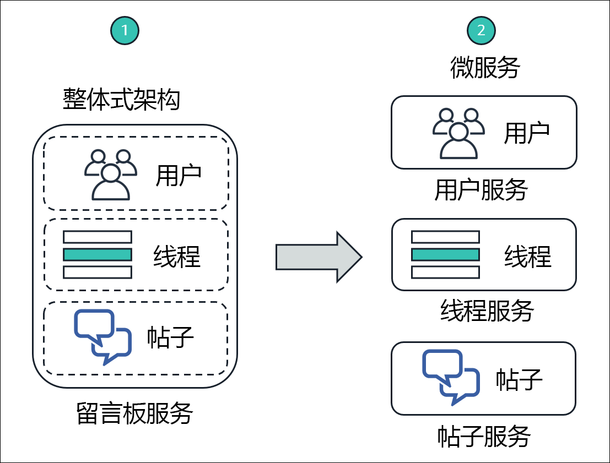
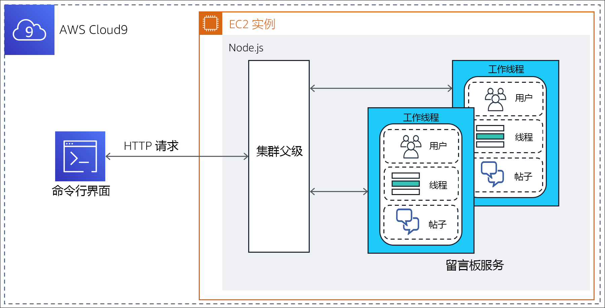
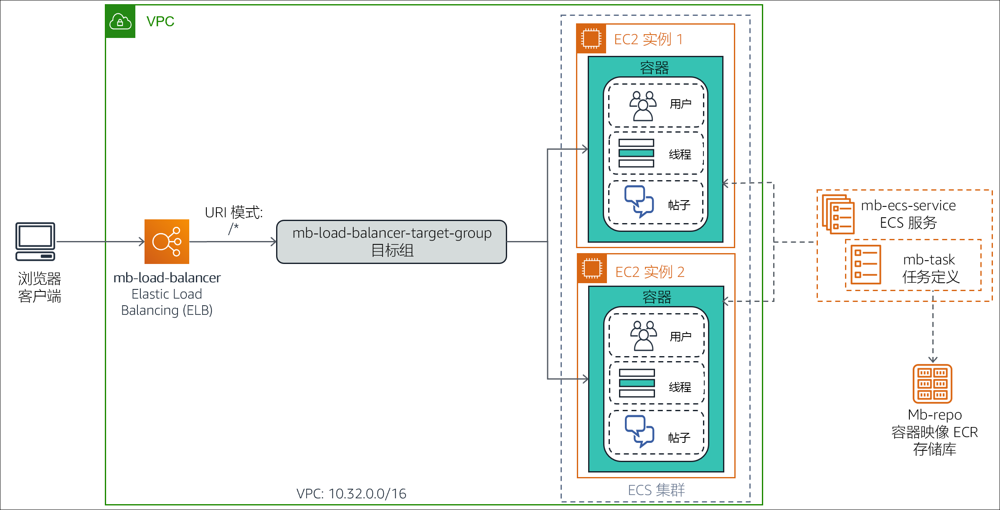
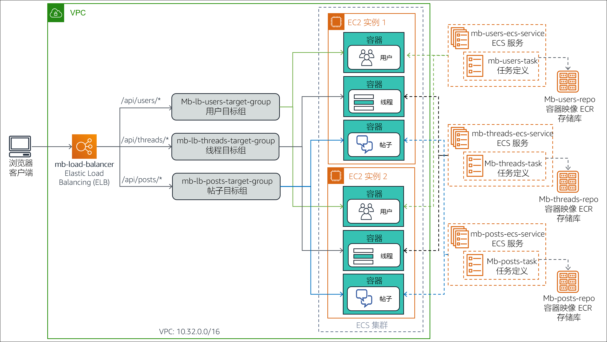

# （可选）模块 13 – 指导实验 1：将整体式 Node.js 应用程序拆分为微服务

[//]: # "SKU: ILT-TF-200-ACACAD-2    Source Course: ILT-TF-100-TUMCSR-1"

## 实验概览和目标

传统的整体式架构很难扩展。随着应用程序代码库的增长，更新和维护工作会变得越来越复杂。引入新功能、语言、框架和技术会既困难又复杂，从而会限制创新和新想法。

在微服务架构中，每个应用程序组件都作为自己的服务运行。它们围绕业务功能构建，每项服务执行单一功能。可以使用不同的框架和编程语言编写微服务，它们通过明确定义的应用程序编程接口 (API) 与其他服务进行通信。最后，您可以将它们作为单个服务单独部署，也可以作为一组服务进行部署。

在本可选实验中，您需要将在标准 Node.js 服务器中运行的整体式应用程序迁移到容器化 Docker 环境中。然后，您需要将应用程序重构为微服务，并部署到由 Amazon Elastic Container Service (Amazon ECS) 编排的容器化环境中。Node.js 应用程序实现了一个简单的留言板的功能，*用户*可以在留言板中创建主题*线程*并在每个线程中发布*消息*。


完成本实验后，您应能够：

- 将整体式 Node.js 应用程序迁移到 Docker 容器中运行

- 将 Node.js 应用程序从整体式设计重构为微服务架构

- 将容器化 Node.js 微服务应用程序部署到 Amazon ECS


下图演示了应用程序设计从整体式到微服务式的演变。




&nbsp;

该图突出显示了整体式方法和微服务设计之间的以下区别：

* 在整体式设计中，将 Node.js 应用程序的所有功能打包并作为单个服务运行。如果一项功能发生故障，则整个应用程序将发生故障。同样，如果一个应用程序功能遇到需求激增，则必须同时扩展服务中的所有功能。

* 在微服务架构中，Node.js 应用程序的每个功能都作为单独的服务运行。这些服务可以彼此独立扩展和更新。

<br/>

## 持续时间

完成本实验大约需要 **3 小时**。

<br/>

## AWS 服务限制

在本实验环境中，对 AWS 服务和服务操作的访问可能仅限于完成实验说明所需的服务和服务操作。如果您尝试访问其他服务或执行本实验中所述之外的操作，可能会遇到错误。

<br/>

## 访问 AWS 管理控制台

1. 在这些说明的顶部，选择 <span id="ssb_voc_grey">Start Lab</span>（启动实验）即可启动您的实验。

   **Start Lab**（启动实验）面板随即会打开，其中显示了实验状态。

   <i class="fas fa-info-circle"></i> **提示**：如果您需要更多时间来完成实验，请再次选择 <span id="ssb_voc_grey">Start Lab</span>（启动实验）按钮，重新启动环境计时器。

2. 请耐心等待，直到 **Start Lab**（启动实验）面板显示消息 *Lab status: ready*（实验状态：就绪），然后选择 **X** 关闭此面板。

3. 在这些说明的顶部，选择 <span id="ssb_voc_grey">AWS</span>。

   此操作将在一个新的浏览器选项卡中打开 AWS 管理控制台。您将自动登录系统。

   <i class="fas fa-exclamation-triangle"></i> **提示**：如果未打开新的浏览器选项卡，您的浏览器顶部通常会出现一个横幅或图标，并显示一条消息，指明您的浏览器阻止该了网站打开弹出窗口。请选择横幅或图标，然后选择 **Allow pop-ups**（允许弹出窗口）。

4. 排列 **AWS 管理控制台**选项卡，使其与这些说明一起显示。理想情况下，您将同时打开两个浏览器选项卡，以便能够更轻松地执行实验步骤。

   <i class="fas fa-exclamation-triangle"></i> **除非特别要求，否则请勿更改区域**。

<br/>

## 任务 1：准备开发环境

在创建实验环境的过程中，系统已为您创建 AWS Cloud9 环境。AWS Cloud9 是基于云的集成开发环境 (IDE)，您可以使用它在浏览器上编写、运行和调试代码。它预先打包了适用于常用编程语言的基本工具，并可在终端会话选项卡中访问 AWS 命令行界面 (AWS CLI)。您的 AWS Cloud9 环境可以访问用于登录 AWS 管理控制台的用户 ID 获得授权的所有 AWS 资源。


要设置开发环境，您需要打开 AWS Cloud9 IDE，然后下载并提取所需的*实验文件*。

5. 在 **AWS 管理控制台**浏览器选项卡中，展开 **All services**（所有服务），然后选择 **Developer Tools > Cloud9**（开发人员工具 > Cloud9）。

6. 在 **Cloud9-IDE** 卡片中，选择 **Open IDE**（打开 IDE）

   IDE 会在新浏览器选项卡中打开，并显示多个选项卡，包括 **Welcome**（欢迎）选项卡。

   接下来，您将下载并提取所需的实验文件。

7. 在 IDE 的底部窗格中，在标有 **bash - "ip-nnn-nnn-nnn-nnn"** 的终端选项卡中输入以下命令：

   ```bash
       curl -s https://aws-tc-largeobjects.s3.amazonaws.com/ILT-TF-100-TUHAWA-1/lab-four/lab-files-ms-node-js.tar.gz | tar -zxv
       ```

   该命令会检索包含实验文件的压缩存档文件。它还会提取 AWS Cloud9 **~/environment** 文件夹中的文件内容。命令输出应类似以下示例：


   &nbsp;

   **Environment**（环境）窗口（位于左窗格中）中会显示下载的文件和提取的文件。


   &nbsp;

   您会看到以下文件夹：

   - **1-no-container** – 包含与应用程序的*整体式*实施相关的文件。此实施旨在直接在 Node.js 服务器上运行。

   - **2-containerized-monolith** – 包含与应用程序的*整体式*实施相关的文件。此实施旨在在 Amazon ECS 编排的容器化 Docker 环境中运行。

   - **3-containerized-microservices** – 包含与应用程序的*微服务*实施相关的文件。此实施旨在在 Amazon ECS 编排的容器化 Docker 环境中运行。

   在整个实验过程中，AWS Cloud9 IDE 选项卡需始终保持打开状态，因为您会经常使用它。

<br/>
## 任务 2：在基本 Node.js 服务器上运行应用程序

基本 Node.js 应用程序是一向整体式服务，可直接在服务器上运行，无需容器。在此任务中，您要将应用程序部署到在运行 AWS Cloud9 环境的实例上安装的 Node.js 服务器。然后，您可以通过 AWS CLI 终端调用它的 RESTful API 方法，从而测试应用程序。

部署架构和请求流程如下图所示。



&nbsp;

**注意**：应用程序的整体式部署使用 Node.js *集群*功能为每个 CPU 内核生成一个工作进程。这些进程共用一个端口，并由内置在 Node.js 中的负载均衡器以轮询方式调用。这一功能提高了具有多个 CPU 内核的服务器的可扩展性。

在此任务中，您将：

- 安装应用程序所需的 Node.js 模块

- 查看应用程序设计和代码

- 运行应用程序

<br/>

### 任务 2.1：安装所需的 Node.js 模块

留言板应用程序在实施中使用 Node.js *koa* 框架中的两个模块：*koa* 和 *koa-router*。*Koa.js* 是一个应用广泛的 Node.js Web 应用程序框架，它可以帮助构建异步服务器端 JavaScript 应用程序。

8. 在 Terminal（终端）选项卡中，输入以下命令以安装 *koa* 和 *koa-router* 模块：

   ```bash
       cd ~/environment/1-no-container
       npm install koa
       npm install koa-router
       ```


   &nbsp;

   这两个模块将下载并安装到 AWS Cloud9 **~/environment** 文件夹的 **1-no-container/node_modules** 文件夹中。您可以忽略输出中的通知、警告和更新消息。

<br/>

### 任务 2.2：查看应用程序设计和代码

实施整体式留言板应用程序的组件位于 **1-no-container** 文件夹中。查看它们，以了解应用程序设计和代码。

9. 在左侧的 **Environment**（环境）窗口中，展开 **1-no-container** 文件夹。应用程序的组件包括：

   - **node_modules** 文件夹 – 此文件夹是在之前的子任务中安装所需的 JavaScript 模块时创建的，其中包含它们的源代码。

   - **db.json** – 一个 JavaScript 对象表示法 (JSON) 对象，用于模拟留言板数据库。它包含表示*用户*、*线程*和*帖子*的属性及相应的示例值。

   - **index.js** – JavaScript 程序，是应用程序的入口点。

   - **package.json** – 描述应用程序、应用程序入口点以及应用程序依赖项的 JSON 对象。

   - **package-lock.json** – 在 **node_modules** 文件夹中安装所需的 JavaScript 模块时自动生成的 JSON 对象，供安装实用程序 *npm* 用来跟踪文件夹的修改。

   - **server.js** – JavaScript 程序，用于定义应用程序的 RESTful API 方法和实施各自的处理程序。

10. 检查 *package.json* 对象。在 **Environment**（环境）窗口中，双击打开编辑器选项卡中的 **package.json**。请注意 JSON 对象的以下属性：

   - **第 2 行至第 5 行** – *dependencies* 属性定义了应用程序的 JavaScript 模块依赖项。请注意，此处列出了您在之前的子任务中安装的 *koa* 和 *koa-router* 模块。

   - **第 6 行至第 8 行** – *scripts* 属性将 *index.js* 程序声明为应用程序的入口点。

11. 检查 **db.json** 对象。在 **Environment**（环境）窗口中，双击打开编辑器选项卡中的 **db.json**。请注意 JSON 对象的以下属性：

   - **第 2 行至第 27 行** – 这些行定义了表示留言板的注册用户的 *users* 属性。属性值是具有以下名称的*四个*示例用户的列表：*Marcerline Singer*、*Finn Alberts*、*Paul Barium* 和 *Jake Storm*。

   - **第 29 行至第 45 行** – 这些行定义了表示留言板上当前活动线程的 *threads* 属性。属性值是具有以下标题的*三个*示例线程的列表：

      - *Did you see the Brazil game?*

      - *New French bakery opening in the neighborhood tomorrow*

      - *In search of a new guitar*

      - **第 47 行至 78 行** – 这些行定义了表示活动线程上发布的留言的 *posts* 属性。属性值是*六个*示例留言帖子的列表。

12. 查看 *index.js* 的代码。在 **Environment**（环境）窗口中，双击打开编辑器选项卡中的 **index.js**。请注意以下信息：

   - **第 1 行至第 3 行** – 这些行导入程序所需的 JavaScript 模块，特别是：*cluster*、*http* 和 *os*。

   - **第 3 行** – 此行使用 *os* 模块询问服务器上可用的 CPU 内核数。

   - **第 5 行至第 15 行** – 这些行在第一次调用程序时（应用程序启动时）运行。它们为集群创建一个 *Leader* 主题，为服务器上可用的每个 CPU 内核创建一个 *worker* 主题。

   - **第 16 行至第 19 行** – 这些行通过调用当前 *worker* 主题中的 *server.js* 程序来处理向应用程序发出的每个请求。

13. 最后，查看 *server.js* 的代码。在 **Environment**（环境）窗口中，双击打开编辑器选项卡中的 **server.js**。使用代码中提供的注释来帮助您理解逻辑。请特别注意以下信息：

   - **第 3 行** – 此行可导入 *db.json*，即用于模拟数据库的 JSON 对象。

   - **第 6 行至第 11 行** – 这些行定义了为每个请求运行的生成器函数。目的是为每个已经处理的请求打印包含 *HTTP 方法*、*资源路径 URL* 和*运行时间*的行。

   - **第 13 行至第 47 行** – 这些行定义了应用程序的 RESTful API 方法及实施。具体而言，应用程序可以响应以下 RESTful 调用。

      - `GET /api/users`：返回数据库中的*用户*集合

      - `GET /api/users/:userId`：返回由 *:userId* 标识的*用户*信息

      - `GET /api/threads`：返回数据库中的*线程*集合

      - `GET /api/threads/:threadId`：返回由 *:threadId* 标识的*线程*信息

      - `GET /api/posts/in-thread/:threadId`：返回由 *:threadId* 标识的*主题*的*帖子消息*集合

      - `GET /api/posts/by-user/:userId`：返回由 *:userId* 标识的*用户*的*帖子消息*集合

      - `GET /api/`：返回消息 *API ready to receive requests*（API 已准备好接收请求）

      - `GET /`：返回消息 *Ready to receive requests*（准备好接收请求）

   - **第 52 行** – 此行定义了应用程序用于侦听请求的*端口号*

<br/>

### 任务 2.3：运行应用程序

在此子任务中，您将启动 Node.js 服务器并运行留言板应用程序。然后，您将测试它的一些 RESTful API 方法。

14. 在 Terminal（终端）选项卡中，输入以下命令，启动 Node.js 和应用程序：

   ```bash
       npm start
       ```


   &nbsp;

   服务器启动，应用程序的入口点 *index.js* 开始运行。第一次调用 *index.js* 时，它会创建两个集群线程（*Leader* 和 *Worker*）来处理请求。

   接下来，让当前终端会话保持活动状态，然后打开第二个终端选项卡来测试应用程序的 RESTful API。

15. 在底部窗格中，选择 **(+)** 并选择 **New Terminal**（新终端），打开一个新的终端选项卡。现在有两个可以输入命令的终端了。

16. 在**右侧的终端选项卡**中，输入以下命令来检索 `/api/users` 资源：

   ```bash
       curl localhost:3000/api/users
       ```

   RESTful 调用返回一个 JSON 对象，其中包含留言板数据库中的*用户*列表。


&nbsp;

17. 选择**左侧的终端选项卡**。您会看到 server.js 的输出消息，消息显示它处理了对资源的 GET 方法请求，该请求由路径 `/api/users` 标识。处理该请求需 *4* 毫秒。


   &nbsp;

18. 仅检索数据库中*第四个*用户的信息。在**右侧的终端选项卡**中，输入以下命令：

   ```bash
       curl localhost:3000/api/users/4
       ```

   返回数据库中的第四个用户 *Jake Storm* 的信息：


19. 接下来，检索当前数据库中的所有*线程*。在**右侧的终端选项卡**中，输入以下命令：

   ```bash
       curl localhost:3000/api/threads
       ```

   系统将返回一个 JSON 对象，其中包含数据库中的所有线程：


   &nbsp;

20. 最后，检索数据库中*第一个*主题的所有*帖子*。在**右侧的终端选项卡**中，输入以下命令：

   ```bash
       curl localhost:3000/api/posts/in-thread/1
       ```

   系统将返回一个 JSON 对象，其中包含两个留言帖子：


   &nbsp;

21. 停止运行 Node.js 服务器。在**左侧的终端选项卡**中，按 CTRL+C 终止服务器进程。

您已验证应用程序可正确响应 GET 请求。在下一个任务中，您将对应用程序进行容器化。

<br/>

## 任务 3：容器化的整体式应用程序以部署到 Amazon ECS

容器将应用程序代码封装在一个部署单元中，该单元会拍摄代码及其依赖项的快照。无论部署环境如何，它们都可以帮助确保应用程序快速、可靠、一致地部署。

在此任务中，您将为整体式留言板应用程序构建容器映像，然后将其推送到 Amazon Elastic Container Registry (Amazon ECR)。此步骤将为应用程序部署到 Amazon ECS 做好准备。

具体而言，您将执行以下步骤：

- 为 Docker 容器化准备应用程序

- 预置存储库

- 构建 Docker 映像并将其推送到存储库

<br/>
### 任务 3.1：为 Docker 容器化准备应用程序

要将留言板应用程序放入 Docker 容器中，必须对应用程序进行以下更改：

- 不使用 Node.js *集群*特性，将应用程序转换为单进程设计。使用 Docker 容器，目的是每个容器运行一个进程，而不是一组进程。

- 为应用程序创建 *Dockerfile*。此文件本质上是一个构建脚本，其中包含有关如何为应用程序构建*容器映像*的说明。

AWS Cloud9 环境的 **2-containerized-monolith** 文件夹中提供了容器就绪版本的应用程序。花几分钟时间查看文件并了解为准备对应用程序进行容器化需要做的更改。

22. 在左侧的 **Environment**（环境）窗口中，展开 **2-containerized-monolith** 文件夹，然后双击打开编辑器选项卡中的 **package.json**。

   在**第 7 行**中，请注意应用程序的入口点已从 *index.js* 更改为 *server.js*。应用程序文件夹中已不存在 *index.js* 文件。*index.js* 文件包含 Node.js *集群*特性的初始化逻辑，您将无需再使用该特性。

23. 在 **Environment**（环境）窗口中，展开 **2-containerized-monolith** 文件夹，然后双击打开编辑器选项卡中的 **server.js** 文件。

   与非容器化版本的唯一区别是添加了**第 54 行**，在第一次启动应用程序时，它会打印消息 *Worker started*（已启动 Worker）。

24. 在 **Environment**（环境）中，展开 **2-containerized-monolith** 文件夹，然后双击打开编辑器选项卡中的 **Dockerfile**。

   此文件包含有关如何为应用程序构建容器映像的说明。


&nbsp;

请注意以下信息：

- **第 1 行** – 将在其中构建容器映像的基础映像。在这里，它是一个 *alpine-node*，即 Node.js 映像。

- **第 3 行** – 此行将映像上的文件系统工作目录设置为 */srv*。

- **第 4 行** – 此行将 **2-containerized-monolith** 文件夹（应用程序文件夹）的内容添加到映像文件系统的当前工作目录（在上一行中设置）。

- **第 5 行** – 此行调用 *npm install* 命令来安装 *package.json* 文件中声明的所有应用程序库依赖项。

- **第 7 行** – 此行通知 Docker，容器运行时会侦听端口 3000。

- **第 8 行** – 此行要求 Docker 运行命令 *node server.js*，在映像启动时启动应用程序。

现在您已了解如何构建应用程序的容器映像，接下来您将了解映像构建完成后将放置在哪里。

<br/>
###任务 3.2：预置存储库

将 Docker 容器映像存储在存储库中，以便实现共享、版本控制和更轻松的管理。借助 *Amazon ECR*，开发人员可以轻松存储、管理和部署 Docker 容器映像。此外，还可以将 Amazon ECR 与 Amazon ECS 集成，让 Amazon ECS 直接拉取容器映像进行生产部署。

在此子任务中，您将在 Amazon ECR 中创建一个存储库来存放留言板应用程序的 Docker 容器映像。

25. 在 **Your environments**（您的环境）浏览器选项卡中，选择 **Services**（服务），然后选择 **Container > Elastic Container Registry**（容器 > Elastic Container Registry）。

   此时系统将打开 Amazon ECR 控制台。

26. 在 **Create a repository**（创建存储库）中，选择 **Get Started**（入门）。

27. 在 **Repository name**（存储库名称）框中，输入 `mb-repo`。

28. 选择 **Create repository**（创建存储库）。

   页面顶部显示一条消息，表明已成功创建存储库。

   **注意：***请勿关闭显示消息的窗口。*您会在下一个子任务中用到它。

<br/>

### 任务 3.3：构建和推送 Docker 映像

现在，您可以为应用程序构建容器映像并将其推送到您创建的 Amazon ECR 存储库了。

Amazon ECR 控制台的一个实用功能是它提供了即用型命令模板，用于构建映像并将其推送到新存储库。在接下来的步骤中，您将使用它提供的这些 AWS CLI 命令。

29. 要成功运行后续步骤，必须先升级 AWS CLI。为此，请转到 **AWS Cloud9 IDE** 浏览器选项卡，然后在**左侧的终端选项卡**中输入以下命令：

   ```bash
         pip3 install awscli --upgrade --user
         export PATH=$HOME/.local/bin:$PATH
         ```

30. 返回 **Amazon ECR** 控制台浏览器选项卡，然后在页面顶部的消息窗口中，选择 **View push commands**（查看推送命令）。

   系统将打开 **Push commands for mb-repo**（mb-repo 的推送命令）弹出窗口。此窗口列出了为 *mb-repo* 自定义的四个 AWS CLI 命令，这些命令专门用于：

   - 针对 Amazon ECR 注册表验证 Docker 客户端的身份
   - 构建 Docker 映像
   - 标记 Docker 映像
   - 将 Docker 映像推送到存储库

弹出窗口提供了两个版本的命令：一个用于 *macOS/linux*，另一个用于 *Microsoft Windows*。

31. 请确保已选择 **macOS/linux** 选项卡，因为您将在 AWS Cloud9 环境中运行这些命令。

   首先，您将复制并运行命令，将 Docker 客户端登录到注册表。

32. 在弹出窗口中，找到*第一个*命令然后选择 **Copy**（复制）图标，将命令复制到剪贴板。

   该命令类似于以下示例：

   ```bash
       $ aws ecr get-login-password --region us-east-1 | docker login --username AWS --password-stdin 01234567890.dkr.ecr.us-east-1.amazonaws.com/mb-repo
       ```

33. 切换到 **AWS Cloud9 IDE** 浏览器选项卡。

34. 在**左侧的终端选项卡**中，粘贴复制的命令，然后按 Enter 键运行：


   &nbsp;

   如果命令运行成功，它将返回消息 *Login Succeeded*（登录成功）。您可以忽略所显示的警告。

   接下来，您将为应用程序构建 Docker 映像。

   **注意**：如果指令步骤中未指定终端选项卡，请使用*左侧*的终端选项卡。

35. 在 Terminal（终端）选项卡中，输入以下命令，将目录更改为 **2-containerized-monolith** 文件夹：

   ```bash
       cd ~/environment/2-containerized-monolith
       ```

36. 切换到 **Amazon ECR** 控制台浏览器选项卡。

37. 在 **Push commands for mb-repo**（mb-repo 的推送命令）窗口中，找到*第二个*命令，然后选择 **Copy**（复制）图标，复制命令。

   该命令类似于以下示例：

   ```bash
       docker build -t mb-repo .
       ```

   确保命令末尾包含句点 (.)。

38. 切换到 **AWS Cloud9 IDE** 浏览器选项卡。

39. 在 Terminal（终端）选项卡中，粘贴复制的命令，然后按 Enter 键运行：


   &nbsp;

   *build *命令在运行应用程序的 *Dockerfile* 中的指令时生成多行输出。完成后，会显示消息 *Successfully built nnnnnnnnnn*（已成功构建 nnnnnnnnnn）和 *Successfully tagged mb-repo:latest*（已成功标记 mb-repo:latest）。

   接下来，您将使用存储库 URI 来标记映像，以便将映像推送到存储库。

40. 切换到 **Amazon ECR** 控制台浏览器选项卡。

41. 在 **Push commands for mb-repo**（mb-repo 的推送命令）窗口中，找到*第三个*命令，然后选择 **Copy**（复制）图标。

   该命令类似于以下示例：

   ```bash
       docker tag mb-repo:latest 1234567890.dkr.ecr.us-east-2.amazonaws.com/mb-repo:latest
       ```

42. 切换到 **AWS Cloud9 IDE** 浏览器选项卡。

43. 在 Terminal（终端）选项卡中，粘贴并运行复制的命令：


   &nbsp;

   如果成功完成，命令不会返回任何内容。

   最后，您要将容器映像推送到应用程序的存储库中。

44. 切换到 **Amazon ECR** 控制台浏览器选项卡。

45. 在 **Push commands for mb-repo**（mb-repo 的推送命令）窗口中，找到*第四个*命令并进行复制。

   该命令类似于以下示例：

   ```bash
       docker push 1234567890.dkr.ecr.us-east-2.amazonaws.com/mb-repo:latest
       ```

46. 切换到 **AWS Cloud9 IDE** 浏览器选项卡。

47. 在 Terminal（终端）选项卡中，粘贴并运行复制的命令：


   &nbsp;

   将映像的每一层推送到存储库后，命令会输出多条消息。

   接下来，您将验证是否已成功上传映像。

48. 切换到 **Amazon ECR** 控制台浏览器选项卡。

49. 关闭 **Push commands for mb-repo**（mb-repo 的推送命令）窗口。

50. 在 **Repositories**（存储库）列表中，选择 **mb-repo**。

   在 **Images**（映像）列表中，您应该会看到推送的容器映像，您可以通过 *latest* 标签来识别。


   &nbsp;

51. 记录*映像 URI*。在 **Images**（映像）列表中，找到*最新*版本的**映像 URI**，然后选择 **Copy**（复制）图标。将值粘贴到文本编辑器中。您会在后续步骤中用到它。

   您已成功为留言板应用程序创建容器映像，并推送到 Amazon ECR 存储库。

<br/>

## 任务 4：将整体式应用程序部署到 Amazon ECS

在此任务中，您要将容器化的整体式应用程序部署到 Amazon ECS 运行时环境中。具体来说，您使用 Amazon ECS 创建 Amazon Elastic Compute Cloud (Amazon EC2) 实例的托管集群。您将应用程序容器映像部署到此集群。将集群配置为 Application Load Balancer 的目标组，提供故障转移功能和可扩展性。

下图显示了容器化的整体式应用程序的部署架构。它还显示了您将在此任务中创建的资源。



&nbsp;

在此任务中，您需执行以下步骤：

- 创建 Amazon ECS 集群。

- 为应用程序容器映像创建任务定义。

- 创建 Application Load Balancer。

- 将整体式应用程序部署为 ECS 服务。

- 测试容器化的整体式应用程序。

<br/>
### 任务 4.1：创建 Amazon ECS 集群

Amazon ECS 集群是 EC2 实例的逻辑分组，您可以在其中运行代表容器化应用程序的任务或服务。

在此子任务中，您将使用 Amazon ECS 控制台创建 ECS 集群。通过控制台的集群创建向导，您可以为构建 ECS 集群环境创建所需的所有基础设施组件。这些组件包括 Virtual Private Cloud (VPC)、子网、安全组、互联网网关以及 AWS Identity and Access Management (IAM) 角色。

52. 返回 **AWS 管理控制台**浏览器选项卡，选择 **Services**（服务），然后选择 **Containers > Elastic Container Service**（容器 > Elastic Container Service）。

53. 在导航窗格中，选择 **Amazon ECS > Clusters**（Amazon ECS > 集群）。

54. 在 **Clusters**（集群）页面上，选择 **Create Cluster**（创建集群）。

55. 在 **Select cluster template**（选择集群模板）页面上，选择 **EC2 Linux + Networking**（EC2 Linux + 联网）卡片。

56. 选择 **Next step**（下一步）。

57. 在 **Configure cluster**（配置集群）向导中，配置以下设置。
   - **Cluster name**（集群名称）：`mb-ecs-cluster`
   - **Provisioning Model**（预置模型）：*On-Demand Instance*（按需实例）
   - **EC2 instance type**（EC2 实例类型）：*t2.micro*
   - **Number of instances**（实例的数量）：`2`
   - **VPC**：*Create a new VPC*（创建新 VPC）
   - **CIDR block**（CIDR 块）：`10.32.0.0/16`
   - **Subnet 1**（子网 1）：`10.32.0.0/24`
   - **Subnet 2**（子网 2）：`10.32.1.0/24`
   - **Security group**（安全组）：*Create a new security group*（创建新安全组）
   - **Security group inbound rules**（安全组入站规则）：保留默认设置，允许端口 80 上的所有 IP 地址的入站流量。

   **注意**：**Container instance IAM role**（容器实例 IAM 角色）部分中的消息显示您正在向 Amazon ECS 授予创建和使用 **ecsInstanceRole** 的权限。此角色授予集群中的 EC2 实例调用 Amazon ECS 操作的权限。

58. 选择 **Create**（创建）。

   系统将打开 **Launch Status**（启动状态）页面，并显示向导执行的任务。

59. 等待所有任务都标有复选标记，这表明任务已完成。


   &nbsp;

   向导创建的资源会在 **Cluster Resources**（集群资源）部分列出。

60. 选择 **View cluster**（查看集群）。

   系统将打开 *mb-ecs-cluster* 的详细信息页面。**Status**（状态）字段显示 *ACTIVE* 值。

61. 选择 **ECS Instances**（ECS 实例）选项卡。

   系统将列出集群的两个 EC2 实例（由向导创建）。

   **注意**：两个 EC2 实例可能需要几分钟才能显示在列表中。如果看不到这两个实例，请选择 **Refresh**（刷新）。


&nbsp;

62. 选择 **Tasks**（任务）选项卡。

   尚未向集群部署任务。接下来您将创建一个。

<br/>
### 任务 4.2：为应用程序容器映像创建任务定义

任务定义是一个配置设置列表，用于设置如何在 Amazon ECS 上运行 Docker 容器。它会将各种信息告知 Amazon ECS，例如：

- 要运行什么容器映像
- 容器需要多少 CPU 和内存
- 容器侦听哪些端口的流量

在此子任务中，您将为留言板应用程序的容器映像创建任务定义。

63. 在 **Amazon ECS** 控制台浏览器选项卡的导航窗格中，选择 **Task Definitions**（任务定义）。

64. 选择 **Create new Task Definition**（创建新任务定义）。

65. 在 **Select launch type compatibility**（选择启动类型兼容性）页面中，选择 **EC2** 卡片。

66. 选择 **Next step**（下一步）。

   系统将打开 **Configure task and container definitions**（配置任务和容器定义）页面。

67. 在 **Task Definition Name**（任务定义名称）框中，输入 `mb-task`。

68. 向下滚动到 **Container Definitions**（容器定义），然后选择 **Add container**（添加容器）。

   系统将打开 **Add container**（添加容器）窗口。

69. 配置以下设置。
   - **Container name**（容器名称）：`mb-container`
   - **Image**（映像）：粘贴应用程序容器映像的**映像 URI**；在此前的步骤中，您将此 URI 复制到了文本编辑器中。
   - **Memory Limits**（内存限制）：选择 *Hard limit*（硬限制）并输入 `256`。（此设置用于定义容器可使用的最大内存量。）
   - **Port mappings > Container port**（端口映射 > 容器端口）：`3000`（此设置用于指定容器接收请求的端口。您无需在 **Host port**（主机端口）中输入值。）

   **Add container**（添加容器）窗口应类似于以下示例：


   &nbsp;

70. 选择 **Add**（添加）。

71. 向下滚动并选择 **Create**（创建）。您可以忽略所有警告消息。

   系统将显示一条消息，表明已成功创建任务定义。请注意，定义将自动分配有版本号 *1*。


   &nbsp;

   现在，您具有一个任务定义，它可以告知 Amazon ECS 如何在集群中部署应用程序容器。

<br/>

### 任务 4.3：创建 Application Load Balancer

接下来，您将创建 Application Load Balancer，用于将传入的请求分配到 ECS 集群中运行的 EC2 实例。该负载均衡器与 ECS 集群位于同一 VPC 中，并使用与之相同的安全组。

72. 在 **Amazon ECS** 控制台浏览器选项卡中，选择 **Services**（服务），然后选择 **Compute > EC2**（计算 > EC2）。

73. 在导航窗格中，向下滚动并选择 **Load Balancers**（负载均衡器）。

74. 选择 **Create Load Balancer**（创建负载均衡器）。

   系统将打开 **Select load balancer type**（选择负载均衡器类型）页面。

75. 在 **Application Load Balancer** 卡片中，选择 **Create**（创建）。

   系统将打开 Application Load Balancer 创建向导。

76. 在 **Step 1: Configure Load Balancer**（步骤 1: 配置负载均衡器）中，配置以下设置。
   - **Name**（名称）：`mb-load-balancer`
   - 滚动到 **Availability Zones**（可用区）部分并输入以下设置。
      - **VPC**：选择 *Amazon ECS cluster VPC ID*（Amazon ECS 集群 VPC ID）。该 ID 类似于 *vpc-nnnnnnnnnn (10.32.0.0/16)*
      - **Availability Zones**（可用区）：选择两个可用区。

77. 选择 **Next: Configure Security Settings**（步骤 2: 配置安全设置）。

78. 在 **Step 2: Configure Security Settings**（步骤 2: 配置安全设置）中，您可以忽略负载均衡器未使用安全侦听器的警告信息。选择 **Next: Configure Security Groups**（下一步：配置安全组）。

79. 在 **Step 3: Configure Security Groups**（步骤 3: 配置安全组）中，配置以下设置。
   - **Assign a security group**（分配安全组）：*Select an existing security group*（选择一个现有的安全组）。
   - **Security Group ID**（安全组 ID）：
      - 清除 *default*（默认设置）。
      - 选择 *EC2ContainerService-mb-ecs-cluster-EcsSecurityGroup*。（这是您 ECS 集群的安全组。）

80. 选择 **Next: Configure Routing**（下一步：配置路由）。

81. 在 **Step 4: Configure Routing**（步骤 4：配置路由）中，配置以下设置。
   - **Target group**（目标组）：*New target group*（新建目标组）（您希望向导为负载均衡器创建一个新目标组。)
   - **Name**（名称）：`mb-load-balancer-target-group`
   - **Protocol**（协议）和 **Port**（端口）：将这些设置保留默认值 *HTTP* 和 *80*。应用程序希望通过 RESTful HTTP 请求进行访问。
   - 展开 **Advanced health check settings**（高级运行状况检查设置）并输入以下设置。
      - **Healthy threshold**（正常阈值）：`2`（此设置告知负载均衡器，如果目标连续两次成功通过运行状况检查，则认为该目标运行状况正常。）
      - **Interval**（间隔）：`6`（此设置将运行状况检查的频率增加到每 6 秒一次。）

82. 选择 **Next: Register Targets**（下一步：注册目标）。

83. 您可以跳过 **Step 5: Register Targets**（步骤 5：注册目标），因为在后续步骤中，您会将 *ECS 服务*注册为目标。选择 **Next: Review**（下一步：审核）。

84. 在 **Review**（审核）页面中，确保您的设置正确无误，然后选择 **Create**（创建）。

   系统会显示一条消息，表明已成功创建负载均衡器。

85. 选择 **Close**（关闭）。

   现在，*mb-load-balancer* 已显示在负载均衡器列表中。

86. 稍等片刻，然后选择 **Refresh**（刷新）图标。负载均衡器的 **State**（状态）应更改为 *active*（活动）。


   &nbsp;

   要完成负载均衡器配置，您需要修改它的安全组，以打开端口，允许负载均衡器和 ECS 集群中的实例进行内部通信。

87. 在底部的 **Description**（描述）选项卡中，向下滚动到 **Security**（安全性）部分。

88. 在 **Security Groups**（安全组）旁边，选择安全组 ID 链接，链接应类似于 *sg-nnnnnnnnnn*。

   系统将打开负载均衡器安全组的详细信息页面。

89. 要将安全组 ID 复制到剪贴板，请转到 **Details**（详细信息）选项卡（位于底部窗格中），将指针悬停在 **security group ID**（安全组 ID）上，然后选择 **Copy**（复制）图标。

   您会在后续步骤中用到此 ID。

90. 在底部窗格中，选择 **Inbound rules**（入站规则）选项卡。

   系统将显示安全组的入站规则。

91. 选择 **Edit inbound rules**（编辑入站规则）。

   系统将打开 **Edit inbound rules**（编辑入站规则）对话窗口。

92. 选择 **Add rule**（添加规则）。

   规则列表中将增加一行，以便添加新规则。它已经针对 *Custom TCP Rule*（自定义 TCP 规则）（即您想要添加的类型）进行了预配置。

93. 在新行中，添加以下配置。
   - **Port Range**（端口范围）：`31000-61000`
   - **Source > Custom**（源 > 自定义）：从剪贴板粘贴安全组 ID。

94. 选择 **Save rules**（保存规则）。

   安全组的入站规则列表将显示您添加的新规则。


&nbsp;

<br/>

### 任务 4.4：将整体式应用程序部署为 ECS 服务

您已创建所有必需的 Amazon ECS 基础设施组件。在此子任务中，您要将容器化的整体式应用程序作为 Amazon ECS 服务部署到集群。

借助 ECS 服务，您可以在 ECS 集群中同时运行和维护指定数量的任务定义实例。如果其中一个任务因任何原因失败或停止，ECS 服务计划程序将启动另一个任务定义实例来替换它。因此，它会一直保持服务中指定的所需任务数量。

现在，您将使用 Amazon ECS 控制台为留言板应用程序的任务定义创建 ECS 服务。

95. 在 **AWS 管理控制台**浏览器选项卡中，选择 **Services**（服务），然后选择 **Containers > Elastic Container Service**（容器 > Elastic Container Service）。

96. 在导航窗格中，选择 **Task Definitions**（任务定义）。

97. 在 **Task Definitions**（任务定义）列表中，选择 **mb-task** 链接。

   系统将打开一个页面，其中提供了任务定义的修订版本。

98. 选择 **mb-task:1**，然后选择 **Actions > Create Service**（操作 > 创建服务）。

99. 在 **Step 1: Configure service**（步骤 1：配置服务）中，配置以下设置。
   - **Launch type**（启动类型）：*EC2*（您要在 EC2 实例的集群上直接运行容器化的整体式应用程序。）
   - **Service name**（服务名称）：`mb-ecs-service`
   - **Service type**（服务类型）：*REPLICA*（此设置可建立计划策略，在整个 ECS 集群中放置并维护所需数量的任务。）
   - **Number of tasks**（任务数）：`1`（通常，要充分利用集群，您需要输入更高的数字，具体取决于预计的请求负载。但是，为了简单起见，在此练习中，您可以明确规定希望始终在集群上启动和维护一个任务。）

100. 选择 **Next step**（下一步）。

101. 在 **Step 2: Configure network**（步骤 2：配置网络）中，配置以下设置。
   - **Load balancer type**（负载均衡器类型）：*Application Load Balancer*（您希望服务中的任务由您之前设置的 *mb-load-balancer* 进行负载均衡）
   - **Service IAM role**（服务 IAM 角色）：*Create new role*（创建新角色）
   - **Load balancer name**（负载均衡器名称）：*mb-load-balancer*
   - **Container name:port**（容器名称：端口）：此字段已填入与任务定义关联的正确容器信息。选择 **Add to load balancer**（添加到负载均衡器）。（此设置会将容器与负载均衡器的一个侦听器相关联。）
   - **Production listener port**（生产侦听器端口）：*80: HTTP*（此设置会将容器与端口 80 上 HTTP 流量的负载均衡器侦听器关联起来）
   - **Target group name**（目标组名称）：*mb-load-balancer-target-group*

102. 选择 **Next step**（下一步）。

103. 在 **Step 3: Set Auto Scaling (optional)**（步骤 3：设置 Auto Scaling（可选））中，选择 **Next step**（下一步）。您不希望配置任何额外的自动扩展。

104. 在 **Review**（审核）页面中，确保设置正确无误，然后选择 **Create Service**（创建服务）。

   系统将打开 **Launch Status**（启动状态）页面，并显示向导执行的任务。

105. 等待所有任务都显示复选标记，这表明任务已完成。


&nbsp;

106. 要打开 *mb-ecs-service* 的详细信息页面，请选择 **View Service**（查看服务）。

   **Tasks**（任务）选项卡显示现在有一个任务正在运行容器，状态为 *ACTIVATING*（正在激活）。

107. 片刻之后，选择 **Refresh**（刷新）。任务的**最终状态**应显示为 *RUNNING*（正在运行）。


&nbsp;

您已成功将容器化的整体式应用程序作为 ECS 服务部署到集群中。

<br/>

### 任务 4.5：测试容器化的整体式应用程序

现在，您将通过以下方法验证部署：从 Web 浏览器测试留言板应用程序的 RESTful API 方法。

首先，您要找到负载均衡器的 URL 并记录下来。

108. 在 **Amazon ECS** 控制台浏览器选项卡中，选择 **Services**（服务），然后选择 **Compute > EC2**（计算 > EC2）。

109. 在导航窗格中，向下滚动并选择 **Load Balancers**（负载均衡器）。

   负载均衡器列表将显示 **mb-load-balancer**。

110. 在底部的 **Description**（描述）选项卡中，转到 **DNS name**（DNS 名称），然后选择 **Copy**（复制）图标。

111. 将 DNS 名称值粘贴到文本编辑器中，然后将其标记为 `Load Balancer DNS Name`（负载均衡器 DNS 名称）。您会在之后的步骤中多次用到该值。

112. 打开一个新浏览器选项卡，将 DNS 名称粘贴到地址栏中，并按下 Enter 键。


&nbsp;

系统将打开一个页面，显示 *Ready to receive requests*（已准备好接收请求）消息。GET 请求中未包含资源路径时，留言板应用程序将返回此消息。

**问题排查技巧**：如果您收到与服务器相关的 HTTP 错误代码，请稍等片刻，然后重试。容器可能需要几分钟才能注册为正常状态并开始接收流量。

113. 在浏览器地址栏中，在 URL 末尾添加 `/api`，然后按 Enter 键。


&nbsp;

应用程序应返回消息 *API ready to receive requests*（API 已准备好接收请求）。

114. 测试对数据库中所有*用户*的检索。在浏览器地址栏中，在 URL 末尾添加 `/users`，然后按 Enter 键。


&nbsp;


应用程序返回一个 JSON 对象，其中列出了数据库中的四个用户。

115. 检索数据库中*第一个用户*的信息。在浏览器地址栏中，在 URL 末尾添加 `/1`，然后按 **Enter**键。


&nbsp;

应用程序返回一个 JSON 对象，其中包含 *Marcerline Singer*（数据库中的第一个用户）的信息。

116. 接下来，您将检索数据库中的所有*线程*。在浏览器地址栏中，将负载均衡器 DNS 名称之后的 URI 更改为 `/api/thread`，然后按 Enter 键。


&nbsp;

应用程序返回一个 JSON 对象，其中包含数据库中的三个线程。

117. 最后，检索数据库中*第二个主题*的*帖子*。在浏览器地址栏中，将负载均衡器 DNS 名称之后的 URI 更改为 `/api/posts/in-thread/2`，然后按 Enter 键。


&nbsp;

应用程序返回一个 JSON 对象，其中包含数据库中第二个主题的已发布留言。这些留言与面包店有关。

118. 或者，调用应用程序可以提供的其他资源路径。完成测试后，关闭应用程序浏览器选项卡。

   现在，您已成功容器化的整体式留言板应用程序，并将它部署到 Amazon ECS 环境中。

<br/>

## 任务 5：重构整体式应用程序

在此任务中，您要将容器化的整体式留言板应用程序拆分为多个互联的微服务。然后，您将每个微服务映像推送到 Amazon ECR 存储库。每个微服务执行单一应用程序业务功能，并可以独立于其他微服务进行扩展。将应用程序拆分为以下微服务，它们代表应用程序的 API 服务的顶级对象类：

- *Users* 微服务 – 该服务适用于所有与*用户*相关的 REST 路径 (`/api/users/*`)

- *Threads* 微服务 – 该服务适用于所有与*线程*相关的 REST 路径 (`/api/threads/*`)

- *Posts* 微服务 – 该服务适用于所有与*帖子*相关的 REST 路径 (`/api/posts/*`)

为加速重构，我们将在 AWS Cloud9 环境的 **3-containerized-microservices** 文件夹中为您提供应用程序的微服务版本。

在此任务中，您需执行以下步骤：

- 查看重构的微服务应用程序

- 为每个微服务预置 Amazon ECR 存储库

- 为每个微服务构建和推送映像

<br/>

### 任务 5.1：查看重构的微服务应用程序

在此子任务中，您需要花费几分钟时间查看文件，以帮助您理解将应用程序重构为微服务需要做出的更改。

119. 切换到 **AWS Cloud9 IDE** 浏览器选项卡。

120. 在左侧的 **Environment**（环境）窗格中，展开 **3-containerized-microservices** 文件夹。

   此文件夹现在有三个独立的子文件夹，名称分别为 **posts**、**threads** 和 **users**，它们代表三个应用程序微服务。每个子文件夹都包含相应微服务的实施文件。

121. 展开 **posts**、**threads** 和 **users** 子文件夹。


&nbsp;

请注意，每个子文件夹都包含与容器化的整体式应用程序相同的应用程序文件的副本。每个子文件夹中的 *db.json*、*Dockerfile* 和 *package.json* 文件与容器化的整体式应用程序文件完全相同。*server.js* 文件是重构中唯一一个发生更改的文件。

122. 在 **users** 子文件夹中，双击打开编辑器选项卡中的 **server.js**。

   **第 13 行至第 20 行**与容器化的整体式版本不同，因为该程序只定义了与*用户*资源路径相关的 API 方法和实施。

123. 在 *threads* 子文件夹中，双击打开编辑器选项卡中的 **server.js**。

   **第 13 行至第 20 行**与容器化的整体式版本不同，因为该程序只定义了与*线程*资源路径相关的 API 方法和实施。

124. 在 *posts* 子文件夹中，双击打开辑器选项卡中的 **server.js**。

   **第 13 行至第 21 行**与容器化的整体式版本不同，因为该程序只定义了与*帖子*资源路径相关的 API 方法和实施。

   总之，重构应用程序所需的唯一更改是将 *server.js* 的整体式版本中的 RESTful API 方法处理程序拆分为三个独立的 *server.js* 文件。每个单独的 *server.js* 文件都包含 API 方法处理程序的相关子集。

<br/>
### 任务 5.2：为每个微服务预置 Amazon ECR 存储库

与对容器化的整体式版本执行的操作类似，现在您将为每个应用程序微服务创建一个 Amazon ECR 存储库。

现在，您将为 *Users*、*Threads* 和*Posts* 微服务容器映像创建存储库。

125. 要打开 Amazon ECR 控制台，请转到 **AWS 管理控制台**浏览器选项卡，选择 **Services**（服务），然后选择 **Containers > Elastic Container Registry**（容器 > Elastic Container Registry）。

126. 选择 **Create repository**（创建存储库）。

127. 在 **Repository name**（存储库名称）中，输入 `mb-users-repo`。

128. 选择 **Create repository**（创建存储库）。页面顶部将显示一条消息，表明已经成功创建存储库。

129. 重复上述步骤，为另外两个微服务创建两个包含以下存储库信息的存储库。
   - *Threads* 存储库名称：`mb-threads-repo`
   - *posts* 存储库名称：`mb-posts-repo`

   为所有三个微服务创建存储库后，*存储库*列表应如下例所示：


<br/>
### 任务 5.3：为每个微服务构建和推送映像


接下来，您将为每个微服务构建容器映像并推送到相应的存储库。在以下步骤中，您将使用 Amazon ECR 控制台提供的即用型命令来完成任务。

<br/>
#### **构建并推送 *Users* 微服务**

您将从 *Users* 微服务的容器映像开始。

130. 切换到 **AWS Cloud9 IDE** 浏览器选项卡。

131. 在 Terminal（终端）选项卡中，输入以下命令，将目录更改为 **3-containerized-microservices/users** 文件夹：

```bash
  cd ~/environment/3-containerized-microservices/users
  ```

132. 切换到 **Amazon ECR** 控制台浏览器选项卡。

133. 在**存储库**列表中，选择 **mb-users-repo**。

134. 在页面顶部，选择 **View push commands**（查看推送命令）。

   系统将打开 **Push commands for mb-users-repo**（mb-users-repo 的推送命令）弹出窗口。

   首先，您需要为微服务构建 Docker 映像。

135. 在 **Push commands for mb-users-repo**（mb-users-repo 的推送命令）窗口中，选择*第二个*命令旁边的 **Copy**（复制）图标，将其复制到剪贴板。该命令应如下所示：

```bash
  docker build -t mb-users-repo .
  ```

**注意**：确保命令末尾包含句点 (.)。

136. 切换到 **AWS Cloud9 IDE** 浏览器选项卡。

137. 在 Terminal（终端）选项卡中，粘贴复制的命令并按 ENTER 键运行。

   命令运行结束后，您应该会看到消息 *Successfully built nnnnnnnnnn*（已成功构建 nnnnnnnnnn）和 *Successfully tagged mb-users-repo::latest*（已成功标记 mb-users-repo:latest）。

   接下来，您将使用存储库 URI 来标记映像，以便将映像推送到存储库。

138. 切换到 **Amazon ECR** 控制台浏览器选项卡。

139. 在 **Push commands for mb-users-repo**（mb-users-repo 的推送命令）窗口中，选择*第三个*命令旁边的 **Copy**（复制）图标，将其复制到剪贴板。该命令应如下所示：

```bash
  docker tag mb-users-repo:latest 1234567890.dkr.ecr.us-east-2.amazonaws.com/mb-users-	repo:latest
  ```

140. 切换到 **AWS Cloud9 IDE** 浏览器选项卡。

141. 在 Terminal（终端）选项卡中，粘贴复制的命令并按 ENTER 键运行。

   如果成功完成，命令不会返回任何内容。

   最后，将容器映像推送到微服务存储库。

142. 切换到 **Amazon ECR** 控制台浏览器选项卡。

143. 在 **Push commands for mb-users-repo**（mb-users-repo 的推送命令）窗口中，选择*第四个*命令旁边的 **Copy**（复制）图标，将其复制到剪贴板。该命令应如下所示：

```bash
  docker push 1234567890.dkr.ecr.us-east-2.amazonaws.com/mb-users-repo:latest
  ```

144. 切换到 **AWS Cloud9 IDE** 浏览器选项卡。

145. 在 Terminal（终端）选项卡中，粘贴复制的命令并按 ENTER 键运行。

   将映像的每一层推送到存储库后，命令会输出多条消息。

   现在，您将验证是否已成功上传映像。

146. 切换到 **Amazon ECR ** 控制台浏览器选项卡，然后关闭 **Push commands for mb-users-repo**（mb-users-repo 的推送命令）弹出窗口。

147. 选择 **Refresh**（刷新）图标。

   在**映像**列表中，您会看到您推送的容器映像，可通过 *latest* 标签来识别。

148. 记录*图像 URI*。在**映像**列表中，找到*最新*版本映像的*映像 URI*，然后选择旁边的 **Copy**（复制）图标。

149. 将值粘贴到文本编辑器中，并标记为 `Users Image URI`。在稍后的步骤中，您会用到它。

<br/>

#### **构建和推送 *Threads* 微服务**

接下来，您将构建并推送 *Threads* 微服务的容器映像。

150. 切换到 **AWS Cloud9 IDE** 浏览器选项卡。

151. 在 Terminal（终端）选项卡中，输入以下命令，将目录更改为 **3-containerized-microservices/threads** 文件夹：

```bash
  cd ~/environment/3-containerized-microservices/threads
  ```

152. 切换到 **Amazon ECR** 控制台浏览器选项卡。

153. 在导航窗格中，选择 **Repositories**（存储库），然后在**存储库**列表中选择 **mb-threads-repo**。

154. 选择 **View push commands**（查看推送命令）。

   系统将打开 **Push commands for mb-threads-repo**（mb-threads-repo 的推送命令）弹出窗口。

   首先，您需要为微服务构建 Docker 映像。

155. 在弹出窗口中，通过选择 **Copy**（复制）图标来复制*第二个*命令。该命令应如下所示：

```bash
  docker build -t mb-threads-repo .
  ```

**注意**：确保命令末尾包含句点 (.)。

156. 切换到 **AWS Cloud9 IDE** 浏览器选项卡。

157. 在 Terminal（终端）选项卡中，粘贴并运行复制的命令。

   命令运行结束后，您会看到消息 *Successfully built nnnnnnnnnn*（已成功构建 nnnnnnnnnn）和 *Successfully tagged mb-threads-repo:latest*（已成功标记 mb-threads-repo:latest）。

   接下来，您将使用存储库 URI 来标记映像，以便将映像推送到存储库。

158. 切换到 **Amazon ECR** 控制台浏览器选项卡。

159. 在弹出窗口中，通过选择 **Copy**（复制）图标来复制*第三个*命令。该命令应如下所示：

```bash
docker tag mb-threads-repo:latest 1234567890.dkr.ecr.us-east-2.amazonaws.com/mb-threads-repo:latest
  ```

160. 切换到 **AWS Cloud9 IDE** 浏览器选项卡。

161. 在 Terminal（终端）选项卡中，粘贴并运行复制的命令。

   如果成功完成，命令不会返回任何内容。

   最后，您要将容器映像推送到微服务存储库。

162. 切换到 **Amazon ECR** 控制台浏览器选项卡。

163. 在弹出窗口中，通过选择 **Copy**（复制）图标来复制*第四个*命令。该命令应如下所示：

```bash
docker push 1234567890.dkr.ecr.us-east-2.amazonaws.com/mb-threads-repo:latest
  ```

164. 切换到 **AWS Cloud9 IDE** 浏览器选项卡。

165. 在 **Terminal**（终端）选项卡中，粘贴并运行复制的命令。

   将映像的每一层推送到存储库后，命令会输出多条消息。

   现在，您将验证是否已成功上传映像。

166. 切换到 **Amazon ECR ** 控制台浏览器选项卡，然后关闭 **Push commands for mb-threads-repo**（mb-threads-repo 的推送命令）弹出窗口。

167. 选择 **Refresh**（刷新）图标。

   在**映像**列表中，您应该会看到推送的容器映像，可通过 *latest* 标签来识别。

168. 记录*图像 URI*。在**图像**列表中，转到*最新*版本的*映像 URI*，然后选择旁边的 **Copy**（复制）图标。

169. 将值粘贴到文本编辑器中，并标记为 `Threads Image URI`。在稍后的步骤中，您会用到它。

<br/>

#### **构建并推送 *Posts* 微服务**

最后，您将为 *Posts* 微服务构建并推送容器映像。

170. 切换到 **AWS Cloud9 IDE** 浏览器选项卡。

171. 在 Terminal（终端）选项卡中，输入以下命令，将目录更改为 **3-containerized-microservices/posts** 文件夹：

```bash
  cd ~/environment/3-containerized-microservices/posts
  ```

172. 切换到 **Amazon ECR** 控制台浏览器选项卡。

173. 在导航窗格中，选择 **Repositories**（存储库）。

174. 在**存储库**列表中，选择 **mb-posts-repo**。

175. 选择 **View push commands**（查看推送命令）。

   系统将打开 **Push commands for mb-posts-repo**（mb-posts-repo 的推送命令）弹出窗口。

   首先，您需要为微服务构建 Docker 映像。

176. 在弹出窗口中，复制*第二个*命令。该命令应如下所示：

```bash
  docker build -t mb-posts-repo .
  ```
**注意**：确保命令末尾包含句点 (.)。

177. 切换到 **AWS Cloud9 IDE** 浏览器选项卡。

178. 在 Terminal（终端）选项卡中，粘贴并运行复制的命令。

   命令运行结束后，您应该会看到消息 *Successfully built nnnnnnnnnn*（已成功构建 nnnnnnnnnn）和 *Successfully tagged mb-posts-repo:latest*（已成功标记 mb-posts-repo:latest）。

   接下来，您将使用存储库 URI 来标记映像，以便将映像推送到存储库。

179. 切换到 **Amazon ECR** 控制台浏览器选项卡。

180. 在弹出窗口中，复制*第三个*命令。该命令应如下所示：

```bash
  docker tag mb-posts-repo:latest 1234567890.dkr.ecr.us-east-2.amazonaws.com/mb-posts-repo:latest
  ```

181. 切换到 **AWS Cloud9 IDE** 浏览器选项卡。

182. 在 **Terminal**（终端）选项卡中，粘贴并运行复制的命令：

   如果成功完成，命令不会返回任何内容。

   最后，您要将容器映像推送到微服务存储库。

183. 切换到 **Amazon ECR** 控制台浏览器选项卡。

184. 在弹出窗口中，复制*第四个*命令。该命令应如下所示：

```bash
  docker push 1234567890.dkr.ecr.us-east-2.amazonaws.com/mb-posts-repo:latest
  ```

185. 切换到 **AWS Cloud9 IDE** 浏览器选项卡。

186. 在 **Terminal**（终端）选项卡中，粘贴并运行复制的命令：

   将映像的每一层推送到存储库后，命令会输出多条消息。

   现在，您将验证是否已成功上传映像。

187. 切换到 **Amazon ECR** 控制台浏览器选项卡。

188. 关闭 **Push commands for mb-posts-repo**（mb-posts-repo 的推送命令）弹出窗口。

189. 选择 **Refresh**（刷新）图标。

   在**映像**列表中，您应该会看到推送的容器映像，其应具有 *latest* 标签。

190. 记录映像 URI。在**映像**列表中，复制*最新*版本映像的*映像 URI*。

191. 将值粘贴到文本编辑器中，并标记为 `Posts Image URI`。在稍后的步骤中，您会用到它。

   您已成功为应用程序中的微服务构建容器映像并将其推送到 Amazon ECR。

<br/>
## 任务 6：部署容器化微服务

在此任务中，您要将容器化微服务留言板应用程序部署到用于容器化的整体式应用程序的同一 ECS 集群中。您还需使用之前的同一 Application Load Balancer。但是，在此任务中，您需将其配置为根据请求 URI 路径将请求路由到不同的目标组（每个微服务容器一个）。

下图显示了容器化微服务应用程序的部署架构。它还显示了您将创建的资源。



&nbsp;

在此任务中，您需执行以下步骤：

- 为每个微服务创建任务定义。

- 配置 Application Load Balancer

- 将微服务部署为 ECS 服务。

- 验证部署。

<br/>
### 任务 6.1：为每个微服务创建任务定义

由于应用程序中的微服务旨在彼此独立运行，所以它们各自需要自己的任务定义。在此子任务中，您要创建三个任务定义，用于运行每个微服务的容器映像。

<br/>
#### **为 *Users* 容器创建任务定义**

您将首先为 *Users* 微服务容器创建任务定义。

192. 在 **Amazon ECR** 控制台的导航窗格中，选择 **Task definitions**（任务定义），然后选择 **Create new Task Definition**（创建新任务定义）。

193. 在 **Step 1: Select launch type compatibility**（步骤 1：选择启动类型兼容性）页面中，选择 **EC2** 卡片。

194. 选择 **Next step**（下一步）。

195. 在 **Step 2: Configure task and container definitions**（步骤 2：配置任务和容器定义）中，配置以下设置：
   - **Task Definition Name**（任务定义名称）：`mb-users-task`
   - 滚动到 **Container Definitions**（容器定义）部分并选择 **Add container**（添加容器）。在 **Add container**（添加容器）页面中，输入以下设置。
      - **Container name**（容器名称）：`mb-users-container`
      - **Image**（映像）：粘贴在先前步骤中复制到文本编辑器的*用户映像 URI*。
      - **Memory Limits**（内存限制）：确保已选择 *Hard limit*（硬限制），并输入 `256`。（这用于定义容器可使用的最大内存量。）
      - **Port mappings > Container port**（端口映射 > 容器端口）：`3000`（此设置用于指定容器用于接收请求的端口。）
   - 选择 **Add**（添加）。

196. 向下滚动并选择 **Create**（创建）。

   系统将显示一条消息，表明已成功创建任务定义。请注意，定义将自动分配有版本号 *1*。


<br/>
#### **为 *Threads* 容器创建任务定义**

接下来，您将为 *Threads* 微服务容器创建任务定义。

197. 在导航窗格中，选择 **Task Definitions**（任务定义），然后选择 **Create new Task Definition**（创建新任务定义）。

198. 在 **Step 1: Select launch type compatibility**（步骤 1：选择启动类型兼容性）中，选择 **EC2** 卡片。

199. 选择 **Next step**（下一步）。

200. 在 **Step 2: Configure task and container definitions**（步骤 2：配置任务和容器定义）中，配置以下设置。
   - **Task Definition Name**（任务定义名称）：`mb-threads-task`
   - 滚动到 **Container Definitions**（容器定义）部分，然后选择 **Add container**（添加容器）。在打开的 **Add container**（添加容器）页面中，输入以下设置。
      - **Container name**（容器名称）：`mb-threads-container`
      - **Image**（映像）：粘贴复制到文本编辑器的**线程映像 URI**。
      - **Memory Limits**（内存限制）：确保已选择 *Hard limit*（硬限制），并输入 `256`。
      - **Port mappings > Container port**（端口映射 > 容器端口）：`3000`
   - 选择 **Add**（添加）。

201. 向下滚动并选择 **Create**（创建）。

   系统将显示一条消息，表明已成功创建任务定义。定义会自动分配有版本号 *1*。


<br/>
#### **为 *Posts* 容器创建任务定义**

最后，您将为 *Posts* 微服务容器创建任务定义。

202. 在导航窗格中，选择 **Task Definitions**（任务定义），然后选择 **Create new Task Definition**（创建新任务定义）。

203. 在 **Step 1: Select launch type compatibility**（步骤 1：选择启动类型兼容性）中，选择 **EC2** 卡片。

204. 选择 **Next step**（下一步）。

205. 在 **Step 2: Configure task and container definitions**（步骤 2：配置任务和容器定义）中，配置以下设置。
   - **Task Definition Name**（任务定义名称）：`mb-posts-task`
   - 向下滚动到 **Container Definitions**（容器定义）部分，然后选择 **Add container**（添加容器）。在打开的 **Add container**（添加容器）页面中，输入以下设置。
      - **Container name**（容器名称）：`mb-posts-container`
      - **Image**（映像）：粘贴您之前复制的*帖子映像 URI*。
      - **Memory Limits**（内存限制）：确保已选择 *Hard limit*（硬限制），并输入 `256`
      - **Port mappings > Container port**（端口映射 > 容器端口）：`3000`
      - 选择 **Add**（添加）。

206. 向下滚动并选择 **Create**（创建）。

   系统将显示一条消息，表明已成功创建任务定义。定义会自动分配有版本号 *1*。

<br/>
### 任务 6.2：配置 Application Load Balancer

在此子任务中，您将为每个微服务创建一个新的负载均衡器目标组，以便将请求路由到各自的容器。您还需将负载均衡器侦听器规则配置为根据请求 URI 路径将请求转发到正确的目标组。

<br/>
#### **为 *Users* 微服务创建目标组**

207. 在 **Amazon ECS** 控制台浏览器选项卡中，选择 **Services**（服务），然后选择 **Compute > EC2**（计算 > EC2）。

208. 在导航窗格中，向下滚动并选择 **Target Groups**（目标群组）。

209. 选择 **Create target group**（创建目标组）

210. 在 **Step 1: Specify group details**（步骤 1：指定组详细信息）中，配置以下设置。
   - **Target group name**（目标组名称）：`mb-lb-users-target-group`
   - **VPC**：选择 *load balancer VPC ID*（负载均衡器 VPC ID），它应类似于 *vpc-nnnnnnnnnn (10.32.0.0/16)*。
   - 向下滚动，展开 **Advanced health check settings**（高级运行状况检查设置），然后输入以下设置。
      - **Healthy threshold**（正常阈值）：`2`（此设置告知负载均衡器，如果目标连续两次通过运行状况检查，则认为该目标运行状况正常。）
      - **Interval**（间隔）：`6`（此设置将运行状况检查的频率增加到每 6 秒一次）

211. 选择 **Next**（下一步）。

212. 在 **Step 2: Register targets**（步骤 2：注册目标）中，选择 **Create target group**（创建目标组）。

   系统将打开一个窗口，并显示一条消息，表明已成功创建目标组。

213. 关闭消息窗口。

   *mb-lb-users-target-group* 将会显示在目标组列表中。

<br/>
#### **为 *Threads* 微服务创建目标组**

接下来，您将为 *Threads* 微服务创建目标组。

214. 选择 **Create target group**（创建目标组），然后在 **Step 1: Specify group details**（步骤 1：指定组详细信息）中，配置以下设置。
   - **Target group name**（目标组名称）：`mb-lb-threads-target-group`
   - **VPC**：选择 *load balancer VPC ID*（负载均衡器 VPC ID），它应类似于 *vpc-nnnnnnnnnn (10.32.0.0/16)*。
   - 在 **Advanced health check settings**（高级运行状况检查设置）部分中，输入以下设置。
      - **Healthy threshold**（正常阈值）：`2`
      - **Interval**（间隔）：`6`

215. 选择 **Next**（下一步）。

216. 在 **Step 2: Register targets**（步骤 2：注册目标）中，选择 **Create target group**（创建目标组）。

   系统将打开一个窗口，并显示一条消息，表明已成功创建目标组。

217. 关闭消息窗口。

   *mb-lb-threads-target-group* 将会显示在目标组列表中。


<br/>
#### **为 *Posts* 微服务创建目标组**

最后，您将为 *Posts* 微服务创建目标组。

218. 选择 **Create target group**（创建目标组）并配置以下设置：
   - **Target group name**（目标组名称）：`mb-lb-posts-target-group`
   - **VPC**：选择 *load balancer VPC ID*（负载均衡器 VPC ID），它应类似于 *vpc-nnnnnnnnnn (10.32.0.0/16)*。
   - 在 **Advanced health check settings**（高级运行状况检查设置）部分中，输入以下设置。
      - **Healthy threshold**（正常阈值）：`2`
      - **Interval**（间隔）：`6`

219. 选择 **Next**（下一步），然后选择 **Create target group**（创建目标组）。

   系统将打开一个窗口，并显示一条消息，表明已成功创建目标组。

220. 关闭消息窗口。

   *mb-lb-posts-target-group* 将会显示在目标组列表中。

<br/>
#### **为负载均衡器创建侦听器规则**

您已为每个微服务创建了目标组。您将修改负载均衡器的侦听器规则。这些规则将根据请求 URI 路径将流量路由到每个负载均衡器。

221. 转到导航窗格，然后选择 **Load Balancers**（负载均衡器），打开 *mb-load-balancer* 的详细信息页面。

222. 在底部窗格中，选择 **Listeners**（侦听器）选项卡。

223. 在 **HTTP: 80** 侦听器行，选择 **View/edit rule**（查看/编辑规则）。

系统将打开规则编辑器。

现在，如果请求 URI 与模式 `/api/users*` 匹配，您将创建一个新规则，以将请求转发给到到 *Users* 目标组。

224. 在编辑器顶部的工具栏中，通过选择 **Add rules**（添加规则）(**+**) 图标来添加新规则。

规则列表中将显示 *Insert Rule*（插入规则）行。

225. 选择 **Insert Rule**（插入规则）。

系统将显示一个规则框，允许您添加 *IF* 条件和 *THEN* 操作。

226. 为此规则配置以下设置。
   - **Add condition**（添加条件）：*Path*（路径）
   - **is > Value（值）**：`/api/users*`
   - **Add action**（添加操作）：*Forward to*（转发至）
   - **Forward to > Target group**（转发到 > 目标组）：*mb-lb-users-target-group*

规则框应该类似于以下示例：


&nbsp;

227. 选择 **Save**（保存）。

   该规则将作为规则 *1* 添加到列表中。

   现在，如果请求 URI 与模式 `/api/threads*` 匹配，您将创建一个规则，以将请求转发到 **Threads** 目标组。

228. 在 *rule 1* 下面的行中，选择 **Insert Rule**（插入规则）。

   系统将打开规则编辑器。

229. 为此规则配置以下设置。

   - **Add condition**（添加条件）：*Path*（路径）
   - **is > Value（值）**：`/api/threads*`
   - **Add action**（添加操作）：*Forward to*（转发至）
   - **Forward to > Target group**（转发到 > 目标组）：*mb-lb-threads-target-group*

230. 选择 **Save**（保存）。

   该规则将作为规则 *2* 添加到列表中。

   现在，如果请求 URI 与模式 `/api/posts*` 匹配，您将创建一个新规则，以将请求转发到 **Posts** 目标组。

231. 在 *rule 2* 下面的行中，选择 **Insert Rule**（插入规则）。

232. 在规则编辑器中，配置以下设置：
   - **Add condition**（添加条件）：*Path*（路径）
   - **is > Value（值）**：`/api/posts*`
   - **Add action**（添加操作）：*Forward to*（转发至）
   - **Forward to > Target group**（转发到 > 目标组）：*mb-lb-posts-target-group*

233. 选择 **Save**（保存）。

   该规则将作为规则 *3* 添加到列表中。

   现在，如果请求 URI 与模式 `/` 或 `/api` 匹配，您将创建一个新规则，以将请求转发到 **Users** 目标组。您可以选择应用程序的任何目标组，因为它们对应的微服务可以处理这两种类型的请求。

234. 在 *rule 3* 下面的行中，选择 **Insert Rule**（插入规则）。

235. 在规则编辑器中，配置以下设置。
   - **Add condition**（添加条件）：*Path*（路径）
   - **is > Value（值）**：`/`
   - **or > Value**：`/api`
   - **Add action**（添加操作）：*Forward to*（转发至）
   - **Forward to > Target group**（转发到 > 目标组）：*mb-lb-users-target-group*

236. 选择 **Save**（保存）。

   该规则将作为规则 *4* 添加到列表中。

   最后，您将更改*最后一个*（默认）规则的操作，以便任何其他请求 URI 返回包含消息 *Invalid request*（请求无效）的错误页面。

237. 在顶部的工具栏中，选择 **Edit rules**（编辑规则）（铅笔）图标。

   规则编辑器将切换到编辑模式。

238. 滚动到*最后一个*规则，然后选择 **Edit rules**（编辑规则）（铅笔）图标。

239. 在规则编辑器中，配置以下设置。
   - **Then**（然后）：选择 **Delete**（删除）（垃圾桶）图标，删除现有的 *Forward to*（转发到）操作。
   - **Add action**（添加操作）：*Return fixed response*
   - **Response code**（响应代码）：`200`
   - **Response body**（响应正文）：`Invalid request`

规则编辑器应类似于以下示例：


&nbsp;

240. 选择 **Update**（更新）。

系统会显示一条消息，表明规则已成功更新。

负载均衡器的最终侦听器规则应如下例所示：


&nbsp;

241. 要返回到负载均衡器详细信息页面，请选择**后退箭头**图标（位于窗口左上角区域）。

   您已完成对负载均衡器配置的必要更改。

<br/>
### 任务 6.3：将微服务部署为 ECS 服务

在这一子任务中，您需要将三个微服务作为 ECS 服务部署到集群中。

**为 *Users* 创建 ECS 服务**

现在，您将为 *Users* 微服务任务定义创建 ECS 服务。

242. 在 **Amazon EC2 控制台**浏览器选项卡中，选择 **Services**（服务），然后选择 **Containers > Elastic Container Service**（容器 > Elastic Container Service）。

243. 在集群列表中，选择 **mb-ecs-cluster**。

244. 在 **Services**（服务）选项卡中，选择 **Create**（创建），打开创建服务向导。

245. 在 **Step 1: Configure service**（步骤 1：配置服务）中，配置以下设置。
   - **Launch type**（启动类型）：*EC2*（您要在 EC2 实例集群上直接运行容器化微服务。）
   - **Task Definition > Family**（任务定义 > 系列）：*mb-users-task*
   - **Service name**（服务名称）：`mb-users-ecs-service`
   - **Service type**（服务类型）：*REPLICA*（此设置可建立计划策略，在整个 ECS 集群中放置并维护所需数量的任务）
   - **Number of tasks**（任务数）：`1`（在此练习中，您希望始终在集群上启动和维护一个任务）

246. 选择 **Next step**（下一步）。

247. 在 **Step 2: Configure network**（步骤 2：配置网络）中，配置以下设置。
   - **Load balancer type**（负载均衡器类型）：*Application Load Balancer*（您希望服务中的任务由您设置的 *mb-load-balancer* 进行负载均衡）
   - **Service IAM role**（服务 IAM 角色）：*ecsServiceRole*
   - **Load balancer name**（负载均衡器名称）：*mb-load-balancer*
   - **Container to load balance**（需要负载均衡的容器）：*Add to load balancer*
   - **Production listener port**（生产侦听器端口）：*80: HTTP*（您要将容器与侦听端口 80 上的 HTTP 流量的负载均衡器侦听器关联）
   - **Target group name**（目标组名称）：*mb-lb-users-target-group*

248. 选择 **Next step**（下一步）。

249. 在 **Step 3: Set Auto Scaling (optional)**（步骤 3：设置 Auto Scaling（可选））中，选择 **Next step**（下一步）。您不希望配置任何额外的自动扩展。

250. 在 **Review**（审核）页面中，确保设置正确无误，然后选择 **Create Service**（创建服务）。

   系统将打开 **Launch Status**（启动状态）页面，并显示向导执行的任务。

251. 等待所有任务都显示复选标记，这表明任务已完成。

252. 选择 **View Service**（查看服务）。

   系统将打开 *mb-users-ecs-service* 的详细信息页面。**Tasks**（任务）选项卡显示目前有一个正在运行容器的任务。

253. 片刻之后，选择 **Refresh**（刷新）按钮。

   任务的 **Last status**（最后状态）应显示 *RUNNING*（正在运行）值。

<br/>
### **为 *Threads* 创建 ECS 服务**

接下来，您将为 *Threads* 微服务任务定义创建 ECS 服务。

254. 要返回到集群详细信息页面，请在页面顶部的面包屑导航中，选择 **mb-ecs-cluster**。

255. 在 **Services**（服务）选项卡中，选择 **Create**（创建）。

256. 在 **Step 1: Configure service**（步骤 1：配置服务）中，配置以下设置。
   - **Launch type**（启动类型）：*EC2*
   - **Task Definition > Family**（任务定义 > 系列）：*mb-threads-task*
   - **Service name**（服务名称）：`mb-threads-ecs-service`
   - **Service type**（服务类型）：*REPLICA*
   - **Number of tasks**（任务数）：`1`

257. 选择 **Next step**（下一步）。

258. 在 **Step 2: Configure network**（步骤 2：配置网络）中，配置以下设置。
   - **Load balancing > Load balancer type**（负载均衡 > 负载均衡器类型）：*Application Load Balancer*
   - **Load balancer name**（负载均衡器名称）：*mb-load-balancer*
   - **Container to load balance**（需要负载均衡的容器）：*Add to load balancer*
   - **Production listener port**（生产侦听器端口）：*80:HTTP*
   - **Target group name**（目标组名称）：*mb-lb-threads-target-group*

259. 选择 **Next step**（下一步）。

260. 在 **Step 3: Set Auto Scaling (optional)**（步骤 3：设置自动扩展（可选））页面中，选择 **Next step**（下一步）。

261. 在 **Review**（审核）页面中，确保设置正确无误，然后选择 **Create Service**（创建服务）。

   系统将打开 **Launch Status**（启动状态）页面，并显示向导执行的任务。

262. 等待所有任务都显示复选标记，这表明任务已完成。

263. 选择 **View Service**（查看服务）。

   系统将打开 *mb-threads-ecs-service* 的详细信息页面。**Tasks**（任务）选项卡显示有一个正在运行容器的任务。

264. 片刻之后，选择 **Refresh**（刷新）。任务的 *Last status*（最后状态）应显示 **RUNNING**（正在运行）值。

<br/>
### **为 *Posts* 创建 ECS 服务**

最后，为 *Posts* 微服务任务定义创建 ECS 服务。

265. 返回 *mb-ecs-cluster* 的集群详细信息页面。

266. 在 **Services**（服务）选项卡中，选择 **Create**（创建）。

267. 在 **Step 1: Configure service**（步骤 1：配置服务）中，配置以下设置。
   - **Launch type**（启动类型）：*EC2*
   - **Task Definition > Family**（任务定义 > 系列）：*mb-posts-task*
   - **Service name**（服务名称）：`mb-posts-ecs-service`
   - **Service type**（服务类型）：*REPLICA*
   - **Number of tasks**（任务数）：`1`

268. 选择 **Next step**（下一步）。

269. 在 **Step 2: Configure network**（步骤 2：配置网络）中，配置以下设置。
   - **Load balancing > Load balancer type**（负载均衡 > 负载均衡器类型）：*Application Load Balancer*
   - **Load balancer name**（负载均衡器名称）：*mb-load-balancer*
   - **Container to load balance**（需要负载均衡的容器）：*Add to load balancer*
   - **Production listener port**（生产侦听器端口）：*80:HTTP*
   - **Target group name**（目标组名称）：*mb-lb-posts-target-group*

270. 选择 **Next step**（下一步）。

271. 在 **Step 3 Set Auto Scaling** (optional)（步骤 3：设置 Auto Scaling（可选））中，选择 **Next step**（下一步）。

272. 在 **Review**（审核）页面中，确保设置正确无误，然后选择 **Create Service**（创建服务）。

   系统将打开 **Launch Status**（启动状态）页面，并显示向导执行的任务。

273. 等待所有任务都显示复选标记，这表明任务已完成。

274. 选择 **View Service**（查看服务）。

   系统将打开 *mb-posts-ecs-service* 的详细信息页面。**Tasks**（任务）选项卡显示有一个正在运行容器的任务。

275. 片刻之后，选择 **Refresh**（刷新）。

   任务的 **Last status**（最后状态）应显示 *RUNNING*（正在运行）值。

276. 返回 *mb-ecs-cluster* 的集群详细信息页面。

   现在，**服务**列表中会显示您创建的三项新服务。


&nbsp;

仅需几秒钟，所有服务便可启动。请仔细检查所有服务和任务，确认都正在运行且运行状况良好后，再继续执行操作。

<br/>

### 任务 6.4：验证部署

现在，您将通过 Web 浏览器测试留言板应用程序的 RESTful API 方法。您还将验证基于微服务的实施是否正常运行。

首先，您将关闭容器化的整体式应用程序版本的 ECS 服务。您不希望它为任何请求提供服务。

277. 在 **Services**（服务）列表中，选择 **mb-ecs-service**，然后选择 **Update**（更新）。

   系统将打开**Update Service**（更新服务）向导。

278. 将 **Number of tasks**（任务数）的值更改为 `0`。（此设置指示 Amazon ECS 不为该服务运行任何任务。）

279. 选择 **Skip to review**（跳到审核）。

280. 在 **Review**（审核）页面中，选择 **Update Service**（更新服务）。

   系统将打开 *Launch Status*（启动状态）页面，并显示一条消息，表明服务已更新。

281. 选择 **View Service**（查看服务）。

   系统将打开 *mb-ecs-service* 的详细信息页面。**Deployments**（部署）选项卡显示服务的 **Running count**（正在运行数量）为 *0*。

   **注意**：如果您没有立即看到更改，请等待几秒钟，然后选择 **Refresh**（刷新）。


&nbsp;

282. 打开一个新的浏览器选项卡，粘贴之前记录的*负载均衡器 DNS 名称*，然后按 Enter 键。

   此操作将返回消息 *Ready to receive requests*（已准备好接收请求）。GET 请求中未包含任何资源路径时，应用程序会返回此消息。回想一下，在侦听器规则配置中，这种类型的请求已被发送到 *Users* 微服务。

283. 在 URL 末尾添加 `/api`，然后按 Enter 键。

   应用程序（具体来说是 *Users* 微服务）返回消息 *API ready to receive requests*（API 已准备好接收请求）。

284. 测试对数据库中所有*用户*的检索。在 URL 末尾添加 `/users`，然后按 Enter 键。

   *Users* 微服务会返回一个 JSON 对象，其中列出了数据库中的四个用户。

285. 检索数据库中*第一个用户*的信息。在 URL 末尾添加 `/1`，然后按 Enter 键。

   *Users* 微服务会返回一个 JSON 对象，其中包含 *Marcerline Singer*（数据库中的第一个用户）的信息。

286. 接下来，检索数据库中的所有*线程*。将负载均衡器 DNS 名称之后的 URI 更改为 `/api/threads`，然后按 Enter 键。

   *Threads* 微服务会返回一个 JSON 对象，其中包含数据库中的所有三个线程。

287. 检索数据库中*第二个主题线程*的*帖子*。将负载均衡器 DNS 名称之后的 URI 更改为 `/api/posts/in-thread/2`，然后按 Enter 键。

   *Posts* 微服务会返回一个 JSON 对象，其中包含数据库中第二个主题（与面包店相关）的已发布留言。

288. 最后，对具有无效 URI 的请求提交进行测试。将负载均衡器 DNS 名称之后的 URI 更改为 `/xyz`，然后按 Enter 键。

   系统会将请求转发到负载均衡器侦听器规则（返回消息 *Invalid request*（请求无效））中的默认处理程序。

   您已成功将整体式 Node.js 应用程序转换为微服务架构。原始应用程序在未容器化的情况下直接在实例上运行。基于微服务的应用程序则部署在由 Amazon ECS 编排的容器化环境中。

<br/>

## 提交作业

289. 在这些说明的顶部，选择 <span id="ssb_blue">Submit</span>（提交）记录您的进度，在出现提示时，选择 **Yes**（是）。

290. 如果在几分钟后仍未显示结果，请返回到这些说明的顶部，并选择 <span id="ssb_voc_grey">Grades</span>（成绩）

    **提示**：您可以多次提交作业。更改作业后，再次选择 **Submit**（提交）。您最后一次提交的作业将作为本次实验的记录。

291. 要查找有关您作业的详细反馈，请选择 <span id="ssb_voc_grey">Details</span>（详细信息），然后选择 <i class="fas fa-caret-right"></i> **View Submission Report**（查看提交报告）。

<br/>

## 实验完成 <i class="fas fa-graduation-cap"></i>

<i class="fas fa-flag-checkered"></i> 恭喜！您已完成实验。

292. 选择此页面顶部的 <span id="ssb_voc_grey">End Lab</span>（结束实验），然后选择 <span id="ssb_blue">Yes</span>（是）确认您要结束实验。

    此时将显示一个面板，表明 *DELETE has been initiated... You may close this message box now.*（删除操作已启动...您现在可以关闭此消息框。）

293. 选择右上角的 **X** 以关闭面板。


*©2020 Amazon Web Services, Inc. 及其附属公司。保留所有权利。未经 Amazon Web Services, Inc. 事先书面许可，不得复制或转载本文的部分或全部内容。禁止商业性复制、出租或出售。*
