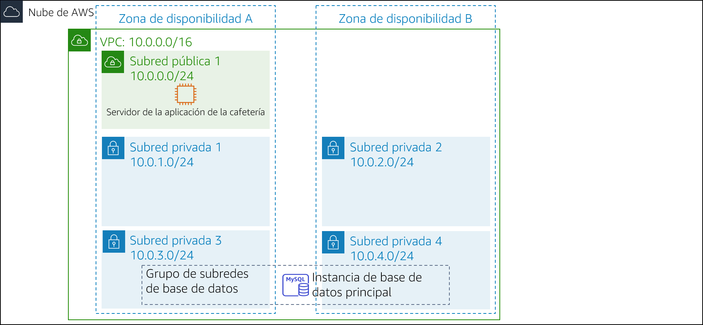
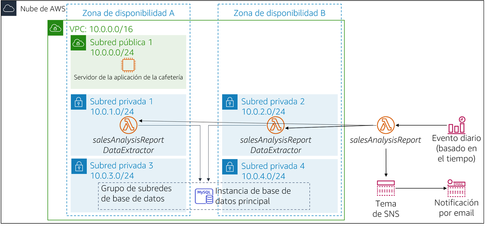

# Laboratorio de desafíos del módulo 13: Implementación de una arquitectura sin servidor para la cafetería

## Caso

El negocio de la cafetería está prosperando. Frank y Martha quieren obtener informes diarios de las ventas de los productos que se venden en el sitio web de la cafetería. Utilizarán este informe para planificar los pedidos de los ingredientes y monitorear el impacto de las promociones de los productos.

La idea inicial de Sofía y Nikhil es utilizar una de las instancias del servidor web de Amazon Elastic Compute Cloud (Amazon EC2) para generar el informe. Sofía configura un trabajo cron en la instancia del servidor web, que envía mensajes por email para informar las ventas diarias. Sin embargo, el trabajo cron reduce el rendimiento del servidor web porque requiere un uso intensivo de los recursos.

Nikhil menciona a Olivia el trabajo cron y cómo este reduce el rendimiento de la aplicación web. Olivia aconseja a Sofía y Nikhil separar las tareas de generación de informes que no son fundamentales para el negocio de la instancia de producción del servidor web. Después de que Sofía y Nikhil revisan las ventajas y las desventajas de su enfoque actual, deciden que no quieren ralentizar el servidor web. También consideran ejecutar una instancia EC2 diferente, pero están preocupados por el costo de ejecutar una instancia las 24 horas, los 7 días de la semana, cuando solo se necesita por un breve periodo todos los días.

Sofía y Nikhil deciden que ejecutar el código de generación de informes como una función de AWS Lambda funcionaría y, también, reduciría los costos. El informe en sí podría enviarse a la dirección de email de Frank y Martha a través de Amazon Simple Notification Service (Amazon SNS).

En este laboratorio, asumirá el rol de Sofía para implementar el código de generación de informes diarios como una función de Lambda.

 
## Información general y objetivos del laboratorio

En este laboratorio, utilizará AWS Lambda para crear un informe de ventas de la cafetería que se enviará por email todos los días a través de Amazon SNS.

Después de completar este laboratorio, debería poder implementar una arquitectura sin servidor para generar un informe de ventas diario que incluya lo siguiente:

- Una función de Lambda dentro de una nube virtual privada (VPC) que se conecta a una base de datos de Amazon Relational Database Service (Amazon RDS) con los datos de las ventas de la cafetería
- Una función de Lambda que genera y ejecuta el informe de ventas
- Un evento programado que desencadena la función de Lambda de generación del informe de ventas todos los días

 

Cuando *comience* el laboratorio, la arquitectura se verá como el siguiente ejemplo:

 

 

Una vez que *termine* este laboratorio, la arquitectura debería verse como el siguiente ejemplo:

 

 

Nota: En este laboratorio de desafíos, no se dan instrucciones paso a paso para la mayoría de las tareas. Debe darse cuenta sin ayuda cómo llevar a cabo las tareas.

 
## Duración

Para completar este laboratorio, se necesitan aproximadamente **90 minutos**.

 
## Restricciones de los servicios de AWS

En este entorno de laboratorio, el acceso a los servicios y las acciones de los servicios de AWS puede restringirse a los que se necesiten para cumplir las instrucciones del laboratorio. Es posible que se produzcan errores si intenta acceder a otros servicios o hacer acciones que no sean las que se describen en este laboratorio.

 
## Acceso a la consola de administración de AWS

1. En la parte superior de estas instrucciones, elija Start Lab (Iniciar laboratorio) y comience a trabajar en él.

   Se abrirá el panel **Start Lab (Iniciar laboratorio),** donde se muestra el estado del laboratorio.

   > **Sugerencia**: Si necesita más tiempo para completar el laboratorio, vuelva a hacer clic en el botón “Start Lab (Iniciar laboratorio)” para reiniciar el temporizador del entorno.

2. Espere hasta que aparezca el mensaje *Lab status: ready (Estado del laboratorio: listo)* y, a continuación, haga clic en **X** para cerrar el panel **Start Lab** (Iniciar laboratorio).

   > **Nota**: El tiempo estimado para hacer este laboratorio es de 15 minutos.

3. En la parte superior de estas instrucciones, elija AWS.

   Esto abrirá la consola de administración de AWS en una nueva pestaña del navegador y el sistema iniciará su sesión de forma automática.

   > **Sugerencia**: Si no se abre una nueva pestaña del navegador, por lo general habrá un aviso o un icono en la parte superior con un mensaje que indicará que el navegador impide que el sitio abra ventanas emergentes. Haga clic en el aviso o el icono y elija **Allow pop ups** (Permitir ventanas emergentes).

4. Ubique la pestaña de la consola de administración de AWS de modo que aparezca junto con estas instrucciones. Idealmente, debería poder ver ambas pestañas del navegador al mismo tiempo para que pueda seguir los pasos del laboratorio fácilmente.

 
## Solicitud empresarial de la cafetería: Implementar una arquitectura sin servidor para generar un informe de ventas diario (Desafío)

En las siguientes tareas, asumirá el rol de Sofía para crear y configurar los recursos que necesita para implementar la solución de generación de informes.

 
### Tarea 1: Descargar el código fuente

El código para generar el informe ya está escrito, empaquetado y listo para que lo implementen en AWS Lambda.

5. Descargue los dos archivos siguientes en su equipo local:
   - [El código para salesAnalysisReportDataExtractor](https://aws-tc-largeobjects.s3-us-west-2.amazonaws.com/ILT-TF-200-ACACAD-20-EN/mod13-challenge/salesAnalysisReportDataExtractor.zip)
   - [El código para salesAnalysisReport](https://aws-tc-largeobjects.s3-us-west-2.amazonaws.com/ILT-TF-200-ACACAD-20-EN/mod13-challenge/salesAnalysisReport.zip)

6. Descomprima cada uno de los archivos *.zip* y examine el contenido.

 
#### Respuesta a las preguntas sobre el laboratorio

Las respuestas se registrarán cuando haga clic en el botón azul **Submit** (Enviar), que se encuentra al final del laboratorio.

7. Acceda a las preguntas de este laboratorio.
   - Elija el menú Details (Detalles) <i class="fas fa-angle-down"></i>
      y después Show (Mostrar).
   - Elija el enlace **Access the multiple choice questions** (Acceder a las preguntas de múltiple opción) que aparece en la parte inferior de la página.

8. En la página que cargó, responda la primera pregunta:

   - **Pregunta 1**: ¿Por qué el archivo *salesAnalysisReportDataExtractor.zip* tiene una carpeta de paquetes?

**Nota**: Deje abierta la página web con las preguntas en la pestaña de su navegador. Volverá a ella más adelante en este laboratorio.

 
### Tarea 2: Crear la función de Lambda *DataExtractor* en la VPC

En esta tarea, creará la función de Lambda *DataExtractor* que extrae los datos de las ventas de la cafetería de una base de datos de Amazon RDS. Para que la función de Lambda pueda acceder a la instancia de base de datos de RDS, debe actualizar el grupo de seguridad de la base de datos con una regla que permita las conexiones desde la función de Lambda. Para habilitar esta comunicación, creará un grupo de seguridad para la función de Lambda y lo agregará como regla de entrada al grupo de seguridad de la instancia de RDS.

9. Cree un grupo de seguridad para la función de Lambda con la siguiente configuración:
   - **Security group name** (Nombre del grupo de seguridad): `LambdaSG`
   - **VPC**: *Lab VPC*
   - **Outbound Rules** (Reglas de salida): *All traffic (Todo el tráfico)* para todas las direcciones
10. Actualice el grupo de seguridad **DatabaseSG** agregando el nuevo grupo de seguridad de la función de Lambda como un segundo origen para la regla de entrada *existente* del puerto TCP 3306.
11. Cree una función de Lambda con los siguientes ajustes:
    - **Function name** (Nombre de la función): `salesAnalysisReportDataExtractor`
    - **Runtime** (Tiempo de ejecución): *Python 3.8*
    - **Role** (Rol): *salesAnalysisReportDERole*
    - **VPC**:
       - **VPC**: *Lab VPC*
       - **Subnets** (Subredes): *Private subnet 1 (Subred privada 1)* y *Private subnet 2 (Subred privada 2)*
       - **Security Group** (Grupo de seguridad): el grupo de seguridad de la función de Lambda que creó
    - **Sugerencia**: La función tardará varios minutos en crearse.
12. Configure la función de Lambda *DataExtractor* de la siguiente manera:

    - **Code** (Código): cargue el archivo *salesAnalysisReportDataExtractor.zip*
    - **Description** (Descripción): `función de Lambda para extraer los datos de la base de datos`
    - **Handler** (Controlador): `salesAnalysisReportDataExtractor.lambda_handler`
    - **Memory Size** (Tamaño de la memoria): *128 MB*
    - **Timeout** (Tiempo de espera) (en segundos): `30`
13. Regrese a la pestaña del navegador con las preguntas de opción múltiple que corresponden a este laboratorio y responda la siguiente pregunta:

    - **Pregunta 2**: ¿Por qué la función *salesAnalysisReportDataExtractor* debe estar en una VPC?

 
### Tarea 3: Crear la función de Lambda *salesAnalysisReport*

En esta tarea, creará la función de Lambda que genera y envía el informe diario de análisis de ventas.

14. Cree una segunda función de Lambda con los siguientes ajustes:
    - **Function name** (Nombre de la función): `salesAnalysisReport`
    - **Runtime** (Tiempo de ejecución): *Python 3.8*
    - **Role** (Rol): *salesAnalysisReportRole*

15. Configure la función de Lambda *salesAnalysisReport* de la siguiente manera:
    - **Code** (Código): cargue el archivo *salesAnalysisReport.zip*
    - **Description** (Descripción): `función de Lambda para generar y enviar el informe de ventas diario`
    - **Handler** (Controlador): `salesAnalysisReport.lambda_handler`
    - **Memory Size** (Tamaño de la memoria): *128 MB*
    - **Timeout** (Tiempo de espera) (en segundos): `30`

 
### Tarea 4: Crear un tema de SNS

El informe de análisis de ventas utiliza un tema de SNS para enviar el informe a los suscriptores por email. En esta tarea, creará un tema de SNS y actualizará las variables del entorno de la función de Lambda *salesAnalysisReport* para almacenar el Nombre de recurso de Amazon (ARN) del tema.

16. Cree un tema de SNS estándar con la siguiente configuración:
    - **Name** (Nombre): `SalesReportTopic`
    - **Display Name** (Nombre de visualización): `Sales Report Topic`

17. Actualice la función de Lambda *salesAnalysisReport* agregando la siguiente variable de entorno:
    - **Variable Name** (Nombre de la variable): `topicARN (ARN del tema)`
    - **Variable Value** (Valor de la variable): el ARN del tema que acaba de crear

18. Regrese a la pestaña del navegador con las preguntas de opción múltiple que corresponden a este laboratorio y responda la siguiente pregunta:

    - **Pregunta 3**: ¿Podría almacenarse el *topicARN (ARN del tema)* como un parámetro de AWS Systems Manager en lugar de como una variable de entorno (suponiendo que el código se pueda actualizar)?

 
### Tarea 5: Crear una suscripción por email al tema de SNS

Para recibir el informe de ventas por email, debe crear una suscripción por email al tema que creó en la tarea anterior.

19. Cree una nueva suscripción por email al tema. Utilice una dirección de email a la que pueda acceder con facilidad para este laboratorio.

20. Confirme la suscripción por email desde su cliente de email.
    **Nota**: Si no recibe una confirmación por email, revise la carpeta de **correo no deseado** o **spam**.

21. Regrese a la pestaña del navegador con las preguntas de opción múltiple que corresponden a este laboratorio y responda la siguiente pregunta:

    - **Pregunta 4**: ¿Recibirá mensajes de email si no confirma la suscripción al tema?

 
### Tarea 6: Probar la función de Lambda *salesAnalysisReport*

Antes de crear el evento de generación de informes diarios, debe probar que la función de Lambda *salesAnalysisReport* funcione de forma correcta.

22. Cree una prueba para la función de Lambda *salesAnalysisReport*.

    > **Sugerencia**: No necesita preocuparse por los parámetros, así que escriba un nombre de evento y acepte el evento de prueba predeterminado `hello-world`.

23. Ejecute la prueba de *salesAnalysisReport*. Si la prueba se realiza correctamente, debería recibir un informe por email en un par de minutos.

24. Si la ejecución de la prueba de la función de Lambda falla, utilice los registros para revisar cualquier error que se haya producido, soluciónelo y ejecute la prueba de nuevo. Estas son algunas *sugerencias para la solución de problemas* que puede probar:

    - Revise los registros de Amazon CloudWatch Logs para ambas funciones de Lambda:
       - Si aparece un error sobre la conexión a la base de datos de la cafetería, compruebe que los grupos de seguridad estén configurados de manera correcta.
       - Si aparece un error referido al tiempo de espera, compruebe que esté establecido en *30 segundos*.
       - Si aparece un error del tipo *lambda_function not found (no se pudo encontrar la función de Lambda)*, compruebe si configuró el controlador correcto.
    - Revise su trabajo para asegurarse de haber completado todos los pasos.
    - Vaya a la sección *Submitting your job (Envío de su trabajo)* y siga los pasos para enviar su trabajo. El informe del envío mostrará si completó correctamente los pasos anteriores.

 
### Tarea 7: Configurar un evento de Amazon EventBridge para que active la función de Lambda todos los días

El último paso de este desafío es configurar un desencadenador que ejecutará el informe todos los días.

25. Cree una nueva regla de EventBridge que ejecute la función de Lambda *salesAnalysisReport* todos los días a una hora específica.

**Ayuda**: Si se queda atascado, consulte los [ejemplos de expresiones cron en la documentación de AWS](https://docs.aws.amazon.com/eventbridge/latest/userguide/scheduled-events.html).
**Sugerencia**: Utilice una hora cercana a la hora actual pero recuerde que la hora debe especificarse en tiempo universal coordinado (UTC).

26. Revise su email para ver si recibió el informe.

27. Regrese a la pestaña del navegador con las preguntas de opción múltiple que corresponden a este laboratorio y responda la siguiente pregunta:

    - **Pregunta 5**: Frank le dice que no ha recibido el informe por email los últimos días. ¿Qué podría hacer para solucionar este problema?

 
## Noticias de la cafetería

Después de que Sofía termina de probar el informe, crea una suscripción por email para Frank y Martha, quienes están encantados de recibir el primer informe diario de la solución sin servidor.

Sofía está satisfecha por haber automatizado la generación de informes de ventas de la cafetería, que continuarán ayudando a Frank y Martha a analizar las ventas diarias y a planificar el inventario de la cafetería. También está contenta por haber aprendido con éxito a utilizar AWS Lambda, Amazon SNS y Amazon EventBridge. De hecho, Sofía planea implementar más funciones de generación de informes automatizadas y sin servidor en la aplicación web de la cafetería para ayudarla a crecer y administrar su negocio.

 
## Envío de su trabajo

28. En la parte superior de estas instrucciones, elija Submit (Enviar) para registrar su progreso y, cuando se le indique, elija **Yes** (Sí).

29. Si los resultados no se muestran después de algunos minutos, vuelva a la parte superior de estas instrucciones y elija Grades (Resultados).

    **Sugerencia**: Puede enviar su trabajo varias veces. Después de realizar las modificaciones pertinentes, vuelva a elegir **Submit** (Enviar). Su último envío es el que se registrará para este laboratorio.

30. Para encontrar comentarios detallados sobre su trabajo, elija Details (Detalles) seguido de <i class="fas fa-caret-right"></i> **View Submission Report** (Ver informe de envío).

 
## Fin del laboratorio

<i class="fas fa-flag-checkered"></i> ¡Felicitaciones! Ha completado el laboratorio.

31. Para confirmar que desea completar el laboratorio, haga clic en **End Lab** (Finalizar laboratorio), en la parte superior de esta página, y, a continuación, haga clic en **Yes** (Sí).

    Debería aparecer un panel con el siguiente mensaje: *DELETE has been initiated… You may close this message box now (Se ha iniciado la ELIMINACIÓN… Ya puede cerrar este cuadro de mensaje).*

32. Para cerrar el panel, haga clic en la **X** de la esquina superior derecha.

*© 2020 Amazon Web Services, Inc. y sus empresas afiliadas. Todos los derechos reservados. Este contenido no puede reproducirse ni redistribuirse, total ni parcialmente, sin el permiso previo por escrito de Amazon Web Services, Inc. Queda prohibida la copia, el préstamo y la venta de carácter comercial.*