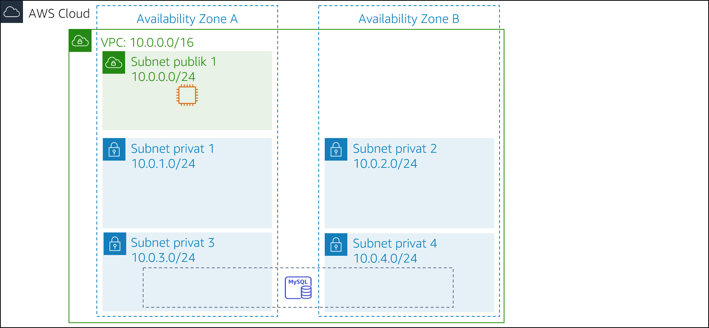

# Modul 13 — Tantangan Lab: Menerapkan Arsitektur Nirserver untuk Kafe

## Skenario

Bisnis kafe berkembang. Frank dan Martha ingin mendapatkan laporan penjualan harian untuk produk yang dijual dari situs web kafe. Mereka akan menggunakan laporan ini untuk merencanakan pesanan bahan dan memantau dampak dari promosi produk.

Ide awal Sofía dan Nikhil adalah menggunakan salah satu instans server web Amazon Elastic Compute Cloud (Amazon EC2) untuk menghasilkan laporan. Sofía menyiapkan pekerjaan cron pada instans server web, yang mengirimkan pesan email yang melaporkan penjualan harian. Namun, pekerjaan cron mengurangi kinerja server web karena bersifat intensif sumber daya.

Nikhil menyebutkan pekerjaan cron untuk Olivia, dan bagaimana hal tersebut mengurangi kinerja aplikasi web. Olivia menyarankan Sofía dan Nikhil untuk memisahkan tugas pelaporan penting nonbisnis dari instans server web produksi. Setelah Sofía dan Nikhil meninjau keuntungan dan kerugian dari pendekatan mereka saat ini, mereka memutuskan bahwa mereka tidak ingin memperlambat server web. Mereka juga mempertimbangkan untuk menjalankan instans EC2 terpisah, tetapi mereka khawatir tentang biaya menjalankan instans 24/7 bila hanya diperlukan untuk waktu yang singkat setiap hari.

Sofía dan Nikhil memutuskan bahwa menjalankan kode pembuatan laporan sebagai fungsi AWS Lambda akan berhasil, dan juga akan menurunkan biaya. Laporan itu sendiri dapat dikirim ke alamat email Frank dan Martha melalui Amazon Simple Notification Service (Amazon SNS).

Di lab ini, Anda akan mengambil peran Sofia untuk menerapkan kode laporan harian sebagai fungsi Lambda.

 
## Gambaran umum dan tujuan lab

Di lab ini, Anda akan menggunakan AWS Lambda untuk membuat laporan penjualan kafe yang dikirim melalui email setiap hari melalui Amazon SNS.

Setelah menyelesaikan lab ini, Anda harus dapat menerapkan arsitektur nirserver untuk menghasilkan laporan penjualan harian yang menampilkan:

- Fungsi Lambda dalam virtual private cloud (VPC) yang terhubung ke basis data Amazon Relational Database Service (Amazon RDS) dengan data penjualan kafe
- Sebuah fungsi Lambda yang menghasilkan dan menjalankan laporan penjualan
- Acara terjadwal yang memicu laporan penjualan Lambda berfungsi setiap hari

 

Ketika Anda *memulai* lab, arsitektur Anda akan terlihat seperti contoh berikut:

 

 

Pada *akhir* lab ini, arsitektur Anda seharusnya terlihat seperti contoh berikut:

 

 

Catatan: Di lab tantangan ini, instruksi langkah demi langkah tidak disediakan untuk sebagian besar tugas. Anda harus memikirkan cara untuk menyelesaikan tugas Anda sendiri.

 
## Durasi

Diperlukan waktu sekitar **90 menit** untuk menyelesaikan lab ini.

 
## Pembatasan layanan AWS

Dalam lingkungan lab ini, akses ke layanan AWS dan tindakan layanan mungkin dibatasi untuk orang-orang yang diperlukan untuk menyelesaikan instruksi lab. Anda mungkin akan mengalami error jika mencoba mengakses layanan lain atau melakukan tindakan di luar yang dijelaskan di lab ini.

 
## Mengakses Konsol Manajemen AWS

1. Di bagian atas instruksi ini, pilih Start Lab (Mulai Lab) untuk meluncurkan lab Anda.

   Panel **Start Lab** (Mulai Lab) terbuka dan menampilkan status lab.

   > **Tip**: Jika Anda memerlukan lebih banyak waktu untuk menyelesaikan lab, pilih tombol Start Lab (Mulai Lab) lagi untuk memulai ulang pengatur waktu untuk lingkungan.

2. Tunggu hingga Anda melihat pesan *Lab status: ready* (Status lab: siap), lalu tutup panel **Start Lab** (Mulai Lab) dengan memilih **X**.

   > **Catatan**: Diperlukan waktu sekitar 15 menit untuk memulai lab ini.

3. Di bagian atas instruksi ini, pilih AWS.

   Tindakan ini akan membuka Konsol Manajemen AWS di tab browser baru. Anda akan login ke sistem secara otomatis.

   > **Tip**: Jika tab browser baru tidak terbuka, banner atau ikon biasanya berada di bagian atas browser Anda dengan pesan bahwa browser Anda mencegah situs web membuka jendela sembulan. Pilih banner atau ikon lalu pilih **Allow pop-ups** (Izinkan sembulan).

4. Atur tab AWS Management Console (Konsol Manajemen AWS) agar ditampilkan bersama instruksi ini. Idealnya, Anda akan dapat melihat kedua tab browser sekaligus, sehingga Anda dapat mengikuti langkah-langkah lab dengan mudah.

 
## Permintaan bisnis untuk kafe: Menerapkan arsitektur nirserver untuk menghasilkan laporan penjualan harian (Tantangan)

Pada beberapa tugas selanjutnya, Anda akan bekerja sebagai Sofía untuk membuat dan mengonfigurasi sumber daya yang Anda butuhkan untuk menerapkan solusi pelaporan.

 
### Tugas 1: Mengunduh kode sumber

Kode untuk menghasilkan laporan sudah ditulis, dikemas, dan siap untuk Anda deploy ke AWS Lambda.

5. Unduh dua file berikut ini ke mesin lokal Anda:
   - [Kode untuk salesAnalysisReportDataExtractor](https://aws-tc-largeobjects.s3-us-west-2.amazonaws.com/ILT-TF-200-ACACAD-20-EN/mod13-challenge/salesAnalysisReportDataExtractor.zip)
   - [Kode untuk salesAnalysisReport](https://aws-tc-largeobjects.s3-us-west-2.amazonaws.com/ILT-TF-200-ACACAD-20-EN/mod13-challenge/salesAnalysisReport.zip)

6. Ekstrak setiap file *.zip* dan periksa isinya.

 
#### Menjawab pertanyaan tentang lab

Jawaban akan direkam saat Anda memilih tombol **Submit** (Kirim) biru di bagian akhir lab.

7. Akses pertanyaan di lab ini.
   - Pilih menu Details <i class="fas fa-angle-down"></i> (Detail)
      dan pilih Show (Tampilkan).
   - Pilih tautan **Access the multiple choice questions** (Akses pertanyaan pilihan ganda) yang muncul di bagian bawah halaman.

8. Di halaman yang Anda muat, jawab pertanyaan pertama:

   - **Pertanyaan 1**: Mengapa file *salesAnalysisReportDataExtractor.zip* memiliki folder paket?

**Catatan**: Biarkan halaman web pertanyaan terbuka di tab browser Anda. Anda akan kembali ke sana nanti di lab ini.

 
### Tugas 2: Membuat fungsi Lambda *DataExtractor* di VPC

Dalam tugas ini, Anda akan membuat fungsi Lambda *DataExtractor* yang mengekstrak data penjualan kafe dari basis data Amazon RDS. Jadi, fungsi Lambda dapat mengakses instans basis data RDS, Anda harus memperbarui grup keamanan basis data dengan aturan yang memungkinkan koneksi dari fungsi Lambda. Untuk mengaktifkan komunikasi ini, Anda akan membuat grup keamanan untuk fungsi Lambda dan menambahkannya sebagai aturan masuk ke grup keamanan instans RDS.

9. Buat grup keamanan untuk fungsi Lambda dengan pengaturan berikut:
   - **Security group name** (Nama grup keamanan): `LambdaSG`
   - **VPC**: *Lab VPC*
   - **Outbond Rules** (Peraturan Keluar): *All traffic* (Semua lalu lintas) ke semua alamat
10. Perbarui grup keamanan **DatabaseSG** dengan menambahkan grup keamanan fungsi Lambda baru Anda sebagai sumber kedua untuk aturan port TCP 3306 masuk yang *sudah ada*.
11. Buat fungsi Lambda dengan pengaturan berikut:
   - **Function name** (Nama fungsi): `salesAnalysisReportDataExtractor`
   - **Runtime** (Waktu aktif): *Python 3.8*
   - **Role** (Peran):  *salesAnalysisReportDERole*
   - **VPC**:
      - **VPC**: *Lab VPC*
      - **Subnets** (Subnet): *Private subnet 1* (Subnet privat 1) dan *Private subnet 2* (Subnet privat 2)
      - **Security Group** (Grup keamanan): Grup keamanan fungsi Lambda yang Anda buat
   - **Tip**: Diperlukan waktu beberapa menit untuk membuat fungsi.
12. Konfigurasi fungsi Lambda *DataExtractor* sebagai berikut:

   - **Code** (Kode): Unggah file *salesAnalysisReportDataExtractor.zip*
   - **Description** (Deskripsi): `Lambda function to extract data from database` (Fungsi Lambda untuk mengekstrak data dari basis data)
   - **Handler**: `salesAnalysisReportDataExtractor.lambda_handler`
   - **Memory Size** (Ukuran Memori): *128 MB*
   - **Timeout** (Waktu habis) (detik): `30`
13. Kembali ke tab browser dengan pertanyaan pilihan ganda untuk lab ini, dan jawab pertanyaan berikut:

   - **Pertanyaan 2**: Mengapa *salesAnalysisReportDataExtractor* harus ada di VPC?

 
### Tugas 3: Membuat fungsi Lambda *salesAnalysisReport*

Dalam tugas ini, Anda akan membuat fungsi Lambda yang menghasilkan dan mengirimkan laporan analisis penjualan harian.

14. Buat fungsi Lambda kedua dengan pengaturan berikut:
   - **Function name** (Nama fungsi): `salesAnalysisReport`
   - **Runtime** (Waktu aktif): *Python 3.8*
   - **Role** (Peran): *salesAnalysisReportRole*

15. Konfigurasi fungsi Lambda *salesAnalysisReport* sebagai berikut:
   - **Code** (Kode): Unggah file *salesAnalysisReport.zip*
   - **Description** (Deskripsi): `Lambda function to generate and send the daily sales report` (Fungsi Lambda untuk menghasilkan dan mengirim laporan penjualan harian)
   - **Handler**: `salesAnalysisReport.lambda_handler`
   - **Memory Size** (Ukuran Memori): *128 MB*
   - **Timeout** (Waktu habis) (detik): `30`

 
### Tugas 4: Membuat topik SNS

Laporan analisis penjualan menggunakan topik SNS untuk mengirim laporan ke pelanggan email. Dalam tugas ini, Anda akan membuat topik SNS dan memperbarui variabel lingkungan fungsi Lambda *salesAnalysisReport* untuk menyimpan topik Amazon Resource Name (ARN).

16. Buat topik SNS standar dengan konfigurasi berikut:
   - **Name** (Nama): `SalesReportTopic`
   - **Display Name** (Nama Tampilan): `Sales Report Topic` (Topik Laporan Penjualan)

17. Perbarui fungsi Lambda *salesAnalysisReport* dengan menambahkan variabel lingkungan berikut:
   - **Variable Name** (Nama Variabel): `topicARN`
   - **Variable Value** (Nilai Variabel): ARN topik yang baru saja Anda buat

18. Kembali ke tab browser dengan pertanyaan pilihan ganda untuk lab ini, dan jawab pertanyaan berikut:

   - **Pertanyaan 3**: Bisakah *topicARN* disimpan sebagai parameter AWS Systems Manager, bukan sebagai variabel lingkungan (dengan asumsi bahwa kode dapat diperbarui)?

 
### Tugas 5: Membuat langganan email ke topik SNS

Untuk menerima laporan penjualan melalui email, Anda harus membuat langganan email ke topik yang Anda buat di tugas sebelumnya.

19. Buat langganan email baru untuk topik. Gunakan alamat email yang dapat diakses dengan mudah untuk lab ini.

20. Konfirmasikan langganan email dari klien email Anda.
   **Catatan**: Jika Anda tidak menerima konfirmasi email, periksa folder **Junk** (Sampah) atau **Spam**.

21. Kembali ke tab browser dengan pertanyaan pilihan ganda untuk lab ini, dan jawab pertanyaan berikut:

   - **Pertanyaan 4**: Apakah Anda akan menerima pesan email jika Anda tidak mengonfirmasi langganan topik?

 
### Tugas 6: Menguji fungsi Lambda *salesAnalysisReport*

Sebelum membuat kejadian pelaporan harian, Anda harus menguji bahwa fungsi Lambda *salesAnalysisReport* berfungsi dengan benar.

22. Buat pengujian untuk fungsi Lambda *salesAnalysisReport*.

   > **Tip**: Anda tidak perlu khawatir tentang parameter, cukup masukkan nama kejadian dan terima kejadian pengujian `hello-world` default.

23. Jalankan pengujuan *salesAnalysisReport*. Jika pengujian berhasil, Anda akan mendapat laporan email dalam beberapa menit.

24. Jika eksekusi pengujian fungsi Lambda gagal, gunakan log untuk meninjau kesalahan, mengatasinya, dan menjalankan pengujian lagi. Berikut adalah beberapa *tip pemecahan masalah* yang dapat Anda coba:

   - Tinjau log dari Amazon CloudWatch Logs untuk kedua fungsi Lambda:
      - Jika Anda melihat kesalahan tentang koneksi ke basis data kafe, pastikan bahwa grup keamanan Anda sudah dikonfigurasi dengan benar.
      - Jika Anda melihat kesalahan tentang waktu habis, pastikan bahwa waktu habis diatur ke *30 detik*.
      - Jika Anda melihat kesalahan tentang *lambda_function not found* (fungsi lambda tidak ditemukan), pastikan bahwa Anda telah mengonfigurasi handler yang benar.
   - Tinjau pekerjaan Anda untuk memastikan bahwa Anda telah menyelesaikan semua langkah.
   - Buka bagian *Submitting your work* (Mengirimkan pekerjaan Anda) dan ikuti langkah-langkah untuk mengirimkan pekerjaan Anda. Laporan pengiriman akan menunjukkan apakah Anda telah menyelesaikan langkah-langkah sebelumnya dengan benar.

 
### Tugas 7: Menyiapkan kejadian Amazon EventBridge untuk memicu fungsi Lambda setiap hari

Langkah terakhir dalam tantangan ini adalah menyiapkan pemicu yang akan menjalankan laporan setiap hari.

25. Buat aturan EventBridge baru yang menjalankan fungsi Lambda *salesAnalysisReport* setiap hari pada waktu tertentu.

**Petunjuk**: Jika Anda kehabisan ide, lihat [contoh ekspresi cron ](https://docs.aws.amazon.com/eventbridge/latest/userguide/scheduled-events.html)dalam Dokumentasi AWS.
**Tip**: Gunakan waktu yang dekat dengan waktu Anda saat ini, tetapi ingat bahwa waktu harus ditentukan dalam Waktu Universal Terkoordinasi (UTC)!

26. Periksa email Anda untuk melihat apakah Anda menerima laporan.

27. Kembali ke tab browser dengan pertanyaan pilihan ganda untuk lab ini, dan jawab pertanyaan berikut:

   - **Pertanyaan 5**: Frank memberitahu Anda bahwa dia belum menerima laporan email dalam beberapa hari terakhir. Apa yang dapat Anda lakukan untuk memecahkan masalah ini?

 
## Kabar terbaru dari kafe

Setelah Sofía selesai menguji pelaporan, dia membuat langganan email untuk Frank dan Martha. Frank dan Martha senang sekali menerima laporan harian pertama dari solusi nirserver.

Sofía senang karena telah mengotomatisasi pelaporan penjualan untuk kafe, yang akan terus membantu Frank dan Martha menganalisis penjualan harian dan merencanakan inventaris kafe. Dia juga senang karena berhasil mempelajari cara menggunakan AWS Lambda, Amazon SNS, dan Amazon EventBridge. Bahkan, Sofía berencana untuk menerapkan lebih banyak fitur pelaporan nirserver dan mengotomatisasi ke dalam aplikasi web kafe untuk membantu perkembangan kafe dan mengelola bisnis mereka.

 
## Mengirimkan pekerjaan Anda

28. Di bagian atas instruksi ini, pilih Submit (Kirim) untuk merekam kemajuan Anda dan saat diminta, pilih **Yes** (Ya).

29. Jika hasilnya tidak muncul setelah beberapa menit, kembali ke bagian atas instruksi ini dan pilih Grades (Nilai)

   **Tip**: Anda dapat mengirimkan pekerjaan Anda beberapa kali. Setelah Anda mengubah pekerjaan, pilih **Submit** (Kirim) lagi. Apa yang akan direkam untuk lab ini adalah pengiriman terakhir Anda.

30. Untuk menemukan detail umpan balik tentang pekerjaan Anda, pilih Details (Detail) diikuti oleh <i class="fas fa-caret-right"></i> **View Submission Report** (Lihat Laporan Pengiriman).

 
## Lab selesai

<i class="fas fa-flag-checkered"></i> Selamat! Anda telah menyelesaikan lab.

31. Untuk mengonfirmasi bahwa Anda ingin mengakhiri lab, di bagian atas halaman ini, pilih **End Lab** (Akhiri Lab), lalu pilih **Yes** (Ya)

   Sebuah panel dengan pesan ini akan muncul: *DELETE has been initiated*...** (PENGHAPUSAN telah dimulai)... *You may close this message box now.* (Anda dapat menutup kotak pesan ini sekarang.)

32. Untuk menutup panel, pilih **X** di sudut kanan atas.

*©2020 Amazon Web Services, Inc. dan afiliasinya. Hak cipta dilindungi undang-undang. Karya ini tidak boleh direproduksi atau didistribusikan ulang, seluruhnya atau sebagian, tanpa izin tertulis sebelumnya dari Amazon Web Services, Inc. Dilarang menyalin, meminjamkan, atau menjual secara komersial.*