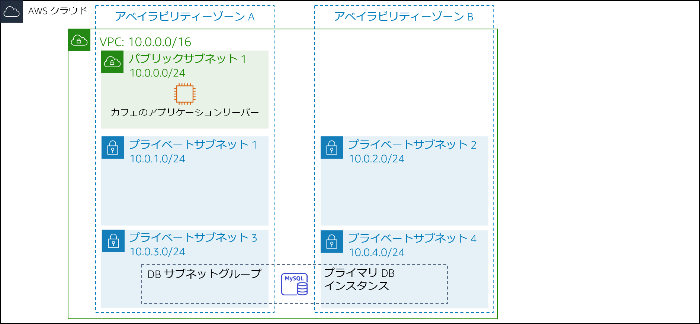
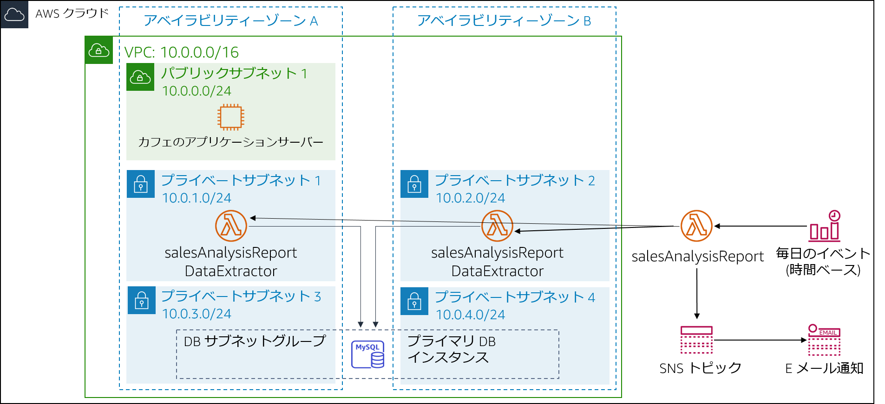

# モジュール 13 – 課題ラボ: カフェ向けのサーバーレスアーキテクチャを実装する

## シナリオ

カフェは繁盛しています。フランクとマーサはカフェのウェブサイトから販売されている製品の日次販売レポートを取得したいと考えています。このレポートを使用して、原料の発注を計画し、製品のプロモーションの影響を監視することを想定しています。

ソフィアとニヒルの最初のアイディアは、Amazon Elastic Compute Cloud (Amazon EC2) ウェブサーバーインスタンスの 1 つを使用してレポートを生成することです。ソフィアはウェブサーバーインスタンスで cron ジョブを設定し、日ごとの売り上げをレポートするメールメッセージを送信します。ただし、cron ジョブはリソースを大量に消費するため、ウェブサーバーのパフォーマンスが低下します。

ニヒルはオリビアに cron ジョブについて話し、それがウェブアプリケーションのパフォーマンスをどのように低下させるかについて伝えます。オリビアは、ソフィアとニヒルに業務上重要でないレポートタスクを運用ウェブサーバーインスタンスから分離するようアドバイスします。ソフィアとニヒルは現在のアプローチの長所と短所を見直した後、ウェブサーバーを低速化したくないと思いました。また、別個の EC2 インスタンスを実行することも検討していますが、毎日短時間しか必要ないのであれば、24 時間 365 日インスタンスを実行するコストも気になります。

ソフィアとニヒルは、レポート生成コードを AWS Lambda 関数として実行すれば、コストも削減できると考えました。レポート自体は Amazon Simple Notification Service (Amazon SNS) を通じてフランクとマーサのメールアドレスに送信できます。

このラボでは、ソフィアのロールを実行して日次レポートコードを Lambda 関数として実装します。

 

## ラボの概要と目標

このラボでは、AWS Lambda を使用して Amazon SNS を通じて日ごとにメール送信されるカフェ販売レポートを作成します。

このラボを修了すると、サーバーレスアーキテクチャを実装して、次の機能を備えた日次販売レポートを生成できるようになります。

- カフェの販売データを使用した Amazon Relational Database Service (Amazon RDS) データベースに接続する仮想プライベートクラウド (VPC) 内の Lambda 関数
- 売上レポートを生成して実行する Lambda 関数
- 日次販売レポートの Lambda 関数をトリガーするスケジュールされたイベント

 

ラボ**開始**時のアーキテクチャは次の例のようになります。

 

 

ラボの**終了**時のアーキテクチャは次の例のようになります。

 

 

注意: この課題ラボでは、ほとんどのタスクにステップバイステップの手順は示されていません。タスクを完了させる方法を自分で考えてください。

 

## 所要時間

このラボは、修了までに約 **90 分**かかります。

 

## AWS サービスの制限事項

このラボ環境では、AWS のサービスとサービスアクションへのアクセスが、ラボの手順を完了するために必要なものに制限されています。他のサービスへのアクセスや、このラボで説明されているサービス以外のアクションを実行しようとすると、エラーが発生することがあります。

 

## AWS マネジメントコンソールにアクセスする

1. この手順の上部にある Start Lab をクリックし、ラボを起動します。

   [**Start Lab**] パネルが開き、ラボのステータスが表示されます。

   <i class="fas fa-info-circle"></i> **ヒント**: ラボの完了までにさらに時間が必要な場合は、Start Lab ボタンをもう一度選択して、この環境のタイマーを再開します。

2. \[**Start Lab**] パネルに **Lab status: ready** というメッセージが表示されたら [**X**] をクリックしてパネルを閉じます。

3. この手順の上部にある AWS をクリックします。

   このアクションにより、新しいブラウザタブで AWS マネジメントコンソールが開き、ユーザーは自動的にログインします。

   <i class="fas fa-exclamation-triangle"></i> **ヒント**: 新しいブラウザタブが開かない場合、通常、ブラウザによってサイトのポップアップウィンドウの表示がブロックされたというメッセージが表示されたバナーまたはアイコンがブラウザの上部に表示されます。バナーまたはアイコンを選択して [**ポップアップを許可**] を選択してください。

4. **AWS マネジメントコンソール**タブがこの手順と並べて表示されるようにします。両方のブラウザタブを同時に開いておくと、ラボのステップを実行しやすくなります。

   <i class="fas fa-exclamation-triangle"></i> **特に指示がない限り、リージョンを変更しないでください**。

 

## カフェビジネスの要求: サーバーレスアーキテクチャを実装して日次売上レポートを作成する (課題)

次のいくつかのタスクでは ソフィアの立場で、レポート作成ソリューションの実装に必要なリソースの作成と設定を行います。

 

### タスク1: ソースコードをダウンロードする

レポートを生成するコードはすでに作成、パッケージ化され、AWS Lambda にデプロイできます。

5. 次の 2 つファイルをローカルマシンにダウンロードします。
   - [salesAnalysisReportDataExtractor のコード](https://aws-tc-largeobjects.s3-us-west-2.amazonaws.com/ILT-TF-200-ACACAD-20-EN/mod13-challenge/salesAnalysisReportDataExtractor.zip)
   - [salesAnalysisReport のコード](https://aws-tc-largeobjects.s3-us-west-2.amazonaws.com/ILT-TF-200-ACACAD-20-EN/mod13-challenge/salesAnalysisReport.zip)

6. 各 **.zip** ファイルを解凍し、内容を確認します。

 

#### ラボに関する質問に回答する

7. ラボの最後に、青色の [**Submit**] をクリックすると、解答が採点されます。

8. このラボの問題にアクセスします。
   - 手順の上にあるDetails <i class="fas fa-angle-down"></i> ドロップダウンメニューから Show を選択します。

   - ページ下に表示される [**Access the multiple choice questions**] のリンクをクリックします。

      質問が新しいブラウザタブにロードされます。

   - **質問 1**: **salesAnalysisReportDataExtractor.zip** ファイルにパッケージフォルダがあるのはなぜですか?

**注意**: 質問のウェブページはブラウザタブで開いたままにしておいてください。このラボの後半で再度このウェブページに戻ります。

 

### タスク 2: VPC で**DataExtractor** Lambda 関数を作成する

このタスクでは、Amazon RDS データベースからカフェの販売データを抽出する **DataExtractor** Lambda 関数を作成します。Lambda 関数は RDS データベースインスタンスにアクセスできるので、Lambda 関数からの接続を許可するルールでデータベースセキュリティグループを更新する必要があります。この通信を有効にするには、Lambda 関数のセキュリティグループを作成し、インバウンドルールとして RDS インスタンスのセキュリティグループに追加します。

9. 次の設定で Lambda 関数のセキュリティグループを作成します。
   - **セキュリティグループ名**: `LambdaSG`
   - **VPC**: **Lab VPC**
   - **アウトバウンドルール**: すべてのアドレスへの**すべてのトラフィック**
10. **既存の DatabaseSG** セキュリティグループのインバウンドルールに、上で作成した新しい Lambda 関数用セキュリティグループをソースとする TCP ポート 3306 ルールを追加して更新します。
11. 次の設定で Lambda 関数を作成します。
    - **関数名**: `salesAnalysisReportDataExtractor`
    - **ランタイム**: **Python 3.8**
    - **ロール**:  **salesAnalysisReportDERole**
    - **VPC**:
       - **VPC**: **Lab VPC**
       - **サブネット**: **プライベートサブネット 1** と **プライベートサブネット 2**
       - **セキュリティグループ**: 作成した Lambda 関数セキュリティグループ
    - **ヒント**: 関数が作成されるまでに数分かかります。
12. **DataExtractor** Lambda 関数を次のように設定します。

    - **コード**: **salesAnalysisReportDataExtractor.zip** ファイルを更新します
    - **説明**: `Lambda function to extract data from database`
    - **ハンドラ**:` salesAnalysisReportDataExtractor.lambda_handler`
    - **メモリサイズ**: **128 MB**
    - **タイムアウト** (秒): `30`
13. このラボの複数選択式の質問が表示されたブラウザタブに戻り、次の質問に答えます。

    - **質問 2**: **salesAnalysisReportDataExtractor** が VPC 内に存在する必要があるのはなぜですか?

 

### タスク 3: **SalesAnalysisReport** Lambda 関数を作成する

このタスクでは、日次売上分析レポートを生成して送信する Lambda 関数を作成します。

14. 次の設定で 2 つ目の Lambda 関数を作成します。
    - **関数名**: `salesAnalysisReport`
    - **ランタイム**: **Python 3.8**
    - **ロール**: **salesAnalysisReportRole**

15. **salesAnalysisReport** Lambda 関数を次のように設定します。
    - **コード**: **salesAnalysisReport.zip** ファイルを更新します
    - **説明**: `Lambda function to generate and send the daily sales report`
    - **ハンドラ**: `salesAnalysisReport.lambda_handler`
    - **メモリサイズ**: **128 MB**
    - **タイムアウト** (秒): `30`

 

### タスク 4: SNS トピックを作成する

売上分析レポートでは、SNS トピックを使用して、レポートをメール登録者に送信します。このタスクでは、SNS トピックを作成し、**salesAnalysisReport** Lambda 関数の環境変数を更新して、トピック Amazon Resource Name (ARN) を格納します。

16. 次の設定で標準 SNS トピックを作成します。
    - **名前**: `SalesReportTopic`
    - **表示名**: `Sales Report Topic`

17. 次の環境変数を追加して **salesAnalysisReport** Lambda 関数を更新します。
    - **変数名**: `topicARN`
    - **変数値**: 作成したトピックの ARN

18. このラボの複数選択式の質問が表示されたブラウザタブに戻り、次の質問に答えます。

    - **質問 3**: **topicARN** を環境変数ではなく AWS Systems Manager パラメータとして保存できますか (コードは更新できるものと仮定します)?

 

### タスク 5: SNS トピックへのメールサブスクリプションを作成する

売上レポートをメールで受信するには、前のタスクで作成したトピックへのメールサブスクリプションを作成する必要があります。

19. トピックへの新しいメールサブスクリプションを作成します。このラボでは簡単にアクセスできるメールアドレスを使用してください。

20. メールクライアントからメールサブスクリプションを確認します。
   **注**: 確認メールが届かない場合は、**迷惑メール**フォルダまたは**スパムメール**フォルダを確認してください。

21. このラボの複数選択式の質問が表示されたブラウザタブに戻り、次の質問に答えます。

    - **質問 4**: トピックのサブスクリプションを確認しなかった場合、メールが届きますか?

 

### タスク 6: **salesAnalysisReport** Lambda 関数をテストする

日次レポートイベントを作成する前に、 **salesAnalysisReport** Lambda 関数が正しく機能することをテストする必要があります。

22. **salesAnalysisReport** Lambda 関数のテストを作成します。

    > **ヒント**: パラメータについて心配する必要はありません。イベント名を入力し、デフォルトの `hello-world` テストイベントを受け入れます。

23. **salesAnalysisReport** テストを実行します。テストが成功すると、数分でメールレポートが送信されます。

24. Lambda 関数のテストの実行に失敗した場合は、ログを使用してエラーを確認し、エラーに対処し、テストを再実行します。ここでは、試行可能な**トラブルシューティングのヒント**をいくつか紹介します。

    - 両方の Lambda 関数について、Amazon CloudWatch Logs のログを確認します。
       - カフェのデータベースへの接続に関するエラーが表示される場合は、セキュリティグループが正しく設定されていることを確認します。
       - タイムアウトに関するエラーが表示された場合は、タイムアウトが **30 秒**に設定されていることを確認します。
       - **lambda_function not found** というエラーが表示された場合は、正しいハンドラが設定されていることを確認します。
    - 作業内容を確認して、すべてのステップを完了したことを確認します。
    - [**作業内容を送信する**] セクションに移動し、ステップに従って作業を送信します。送信レポートには、前のステップを正しく完了したかどうかが表示されます。

 

### タスク 7: Lambda 関数を毎日トリガーする Amazon EventBridge イベントを設定する

この課題の最後のステップは、日次ポートを実行するトリガーを設定することです。

25. **salesAnalysisReport** Lambda 関数を毎日特定の時刻に実行する新しい EventBridge ルールを作成します。

    **ヒント**: 作業が難しい場合は、[AWS ドキュメントの cron 式の例](https://docs.aws.amazon.com/ja_jp/eventbridge/latest/userguide/scheduled-events.html)を参照してください。
    **ヒント**: あなたの現在の時刻に近い時刻を使用しますが、時刻は協定世界時 (UTC) で指定する必要があります。

26. メールをチェックして、レポートを受信したかどうかを確認します。

27. このラボの複数選択式の質問が表示されたブラウザタブに戻り、次の質問に答えます。

    - **質問 5**: フランクは、ここ数日以内にメールレポートを受け取っていないことをあなたに伝えます。この問題のトラブルシューティングには何ができますか?

 

## カフェの近況

ソフィアはレポートのテストを完了した後、フランクとマーサのメールサブスクリプションを作成します。フランクとマーサは、サーバーレスソリューションから最初の日次レポートを受信することを楽しみにしています。

ソフィアはカフェの販売レポートを自動化し、フランクとマーサが毎日の売り上げを分析し、カフェの在庫を計画できることを嬉しく思っています。また、AWS Lambda、Amazon SNS、Amazon EventBridge の使用方法を学んだことにも満足しています。実際、ソフィアはカフェのウェブアプリケーションにサーバーレスで自動化されたレポート機能をさらに実装し、カフェのビジネスの成長と管理を支援する予定です。

 

## 作業内容を送信する

28. この手順の上部にある Submit をクリックして進捗情報を記録し、プロンプトが表示されたら [**Yes**] をクリックします。

29. 数分経っても結果が表示されない場合は、この手順の上部に戻り、Grades をクリックします。

    **ヒント**: 作業内容は何度も送信できます。作業内容を変更したら、再度 [**Submit**] をクリックします。最終送信分がこのラボの作業内容として記録されます。

30. 作業に関する詳細なフィードバックを参照するには、Details ドロップダウンメニューから <i class="fas fa-caret-right"></i> [**View Submission Report**] を選択します。

 

## ラボの終了

<i class="fas fa-flag-checkered"></i>お疲れ様でした。以上でラボは終了です。

31. ラボを終了するには、このページの上部にある End Lab をクリックし、Yes をクリックします。

    パネルに **DELETE has been initiated... You may close this message box now** というメッセージが表示されます。

32. 右上隅の [**X**] をクリックしてパネルを閉じます。

**©2020 Amazon Web Services, Inc. and its affiliates. All rights reserved. このトレーニング内容の全体または一部を複製または再配布することは、Amazon Web Services, Inc. の書面による事前の許可がある場合を除き、禁じられています。商業目的のコピー、貸与、または販売を禁止します。**
