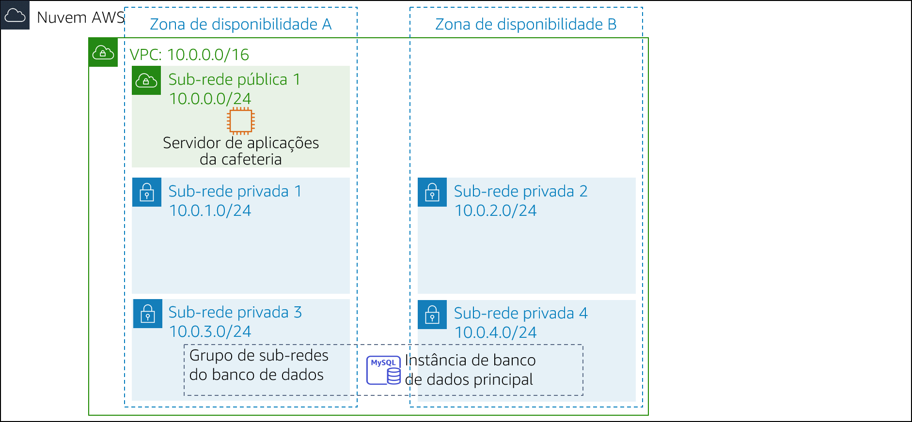
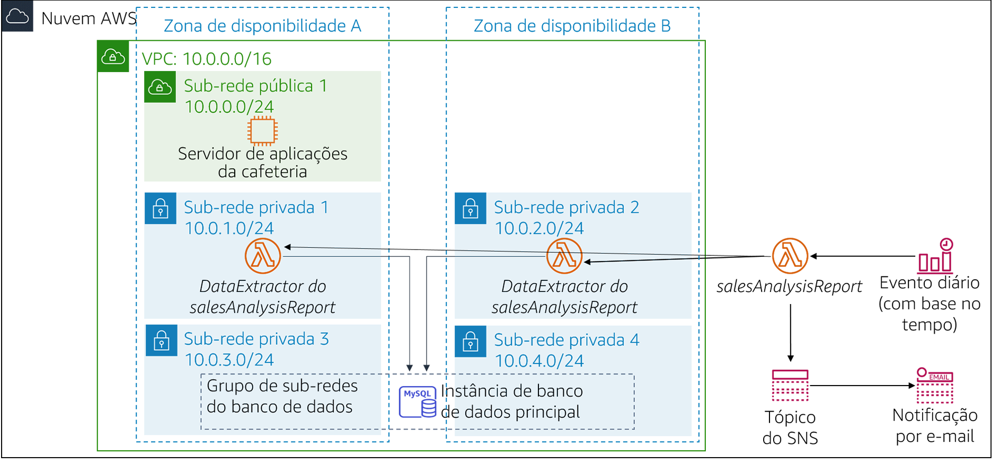

# Módulo 13 – Laboratório de desafio: Implementação de uma arquitetura sem servidor para a cafeteria

## Cenário

A cafeteria está prosperando. Frank e Martha querem obter relatórios diários de vendas para produtos que são vendidos no site da cafeteria. Eles usarão esse relatório para planejar pedidos de ingredientes e monitorar o impacto das promoções de produtos.

A ideia inicial de Sofía e Nikhil é usar uma das instâncias do servidor Web do Amazon Elastic Compute Cloud (Amazon EC2) para gerar o relatório. Sofía configura um trabalho cron na instância do servidor Web, que envia mensagens de e-mail relatando as vendas diárias. No entanto, o trabalho cron reduz a performance do servidor Web porque ele usa muitos recursos.

Nikhil comenta com Olivia sobre o trabalho cron, e como ele reduz a performance da aplicação Web. Olivia aconselha Sofía e Nikhil a separar as tarefas de relatórios não essenciais da instância do servidor Web de produção. Depois que Sofía e Nikhil avaliam as vantagens e desvantagens da abordagem atual, eles decidem que não querem comprometer a velocidade do servidor Web. Eles também consideram executar uma instância do EC2 separada, mas estão preocupados com o custo da execução de uma instância 24 horas por dia, quando ela é necessária somente por um curto período a cada dia.

Sofía e Nikhil decidem que a execução do código de geração de relatório como uma função do AWS Lambda é uma boa ideia, que também reduzirá os custos. O relatório em si pode ser enviado para Frank e Martha via e-mail, por meio do Amazon Simple Notification Service (Amazon SNS).

Neste laboratório, você assumirá o papel de Sofía para implementar o código de relatório diário como uma função do Lambda.

 
## Visão geral e objetivos do laboratório

Neste laboratório, você usará o AWS Lambda para criar um relatório de vendas da cafeteria, que será enviado por e-mail todos os dias por meio do Amazon SNS.

Depois de concluir este laboratório, você deverá saber implementar uma arquitetura sem servidor para gerar um relatório diário de vendas que apresente:

- Uma função do Lambda em uma virtual private cloud (VPC) que se conecta a um banco de dados do Amazon Relational Database Service (Amazon RDS) com os dados de vendas da cafeteria
- Uma função do Lambda que gera e executa o relatório de vendas
- Um evento agendado que aciona a função do Lambda do relatório de vendas todos os dias

 

Quando você *iniciar* o laboratório, sua arquitetura será semelhante ao seguinte exemplo:

 

 

No *fim* deste laboratório, a arquitetura deverá ser semelhante ao seguinte exemplo:

 

 

Observação: neste laboratório de desafio, não são fornecidas instruções passo a passo para a maioria das tarefas. Você precisa descobrir como concluir as tarefas por conta própria.

 
## Duração

Este laboratório levará aproximadamente **90 minutos** para ser concluído.

 
## Restrições de serviço da AWS

Neste ambiente de laboratório, o acesso aos serviços e ações de serviço da AWS pode estar restrito àqueles necessários para concluir as instruções do laboratório. Você poderá encontrar erros se tentar acessar outros serviços ou executar ações além do que está descrito neste laboratório.

 
## Acessar o Console de Gerenciamento da AWS

1. Na parte superior destas instruções, escolha Start Lab (Iniciar laboratório) para iniciar o laboratório.

   Um painel **Start Lab** (Iniciar laboratório) é aberto com o status do laboratório.

   > **Dica**: se você precisar de mais tempo para concluir o laboratório, escolha novamente o botão Start Lab (Iniciar laboratório) para reiniciar o cronômetro do ambiente.

2. Aguarde até que a mensagem *Lab status: ready (Status do laboratório: pronto)* seja exibida e feche o painel **Start Lab** (Iniciar laboratório) escolhendo **X**.

   > **Observação**: este laboratório levará aproximadamente 15 minutos para começar.

3. Na parte superior destas instruções, escolha AWS.

   O Console de Gerenciamento da AWS será aberto em uma nova guia do navegador. O sistema fará o seu login automaticamente.

   > **Dica**: se uma nova guia do navegador não for aberta, normalmente você verá uma faixa ou um ícone na parte superior do navegador com uma mensagem informando que o navegador está impedindo que o site abra janelas pop-up. Escolha a faixa ou o ícone e escolha **Allow pop ups** (Permitir pop-ups).

4. Organize a guia do Console de Gerenciamento da AWS para que ela seja exibida com essas instruções. O ideal é ver as duas guias do navegador ao mesmo tempo, para facilitar o acompanhamento das etapas do laboratório.

 
## Uma solicitação de negócios para a cafeteria: implementar uma arquitetura sem servidor para gerar um relatório diário de vendas (Desafio)

Nas próximas tarefas, você assumirá o papel de Sofía para criar e configurar os recursos necessários a fim de implementar a solução de relatórios.

 
### Tarefa 1: fazer download do código-fonte

O código para gerar o relatório já está escrito, empacotado e pronto para você implantar no AWS Lambda.

5. Faça o download dos seguintes arquivos na sua máquina local:
   - [Código para salesAnalysisReportDataExtractor](https://aws-tc-largeobjects.s3-us-west-2.amazonaws.com/ILT-TF-200-ACACAD-20-EN/mod13-challenge/salesAnalysisReportDataExtractor.zip)
   - [Código para salesAnalysisReport](https://aws-tc-largeobjects.s3-us-west-2.amazonaws.com/ILT-TF-200-ACACAD-20-EN/mod13-challenge/salesAnalysisReport.zip)

6. Extraia cada um dos *arquivos.zip* e examine o conteúdo deles.

 
#### Responda às perguntas sobre o laboratório

As respostas serão gravadas quando você escolher o botão azul **Submit** (Enviar) no fim do laboratório.

7. Acesse as perguntas deste laboratório.
   - Escolha o menu Details (Detalhes) <i class="fas fa-angle-down"></i>
      e escolha Show (Mostrar).
   - Escolha o link **Access the multiple choice questions** (Acessar as perguntas de múltipla escolha) que aparece na parte inferior da página.

8. Na página que você carregou, responda à primeira pergunta:

   - **Pergunta 1**: Por que o arquivo *salesAnalysisReportDataExtractor.zip* tem uma pasta de pacotes?

**Observação**: deixe a página da Web de perguntas abertas na guia do navegador, pois você a consultará de novo mais adiante neste laboratório.

 
### Tarefa 2: criar a função do Lambda *DataExtractor* na VPC

Nesta tarefa, você criará a função do Lambda *DataExtractor*, que extrai os dados de vendas da cafeteria de um banco de dados do Amazon RDS. Para que a função do Lambda possa acessar a instância do banco de dados do RDS, você deve atualizar o grupo de segurança do banco de dados com uma regra para permitir conexões da função do Lambda. Para habilitar essa comunicação, você criará um grupo de segurança para a função do Lambda e o adicionará como uma regra de entrada ao grupo de segurança da instância do RDS.

9. Crie um grupo de segurança para a função do Lambda com as seguintes configurações:
   - **Security group name** (Nome do grupo de segurança): `LambdaSG`
   - **VPC**: *Lab VPC*
   - **Outbound Rules** (Regras de saída): *todo o tráfego* para todos os endereços
10. Atualize o grupo de segurança do **DatabaseSG** adicionando o novo grupo de segurança da função do Lambda como uma segunda origem à regra *existente* da porta de entrada TCP 3306.
11. Crie uma função do Lambda com as seguintes configurações:
    - **Function name** (Nome da função): `salesAnalysisReportDataExtractor`
    - **Runtime** (Tempo de execução): *Python 3.8*
    - **Role** (Função): *salesAnalysisReportDERole*
    - **VPC**:
       - **VPC**: *Lab VPC*
       - **Subnets** (Sub-redes): *Sub-rede privada 1* e *Sub-rede privada 2*
       - **Security Group** (Grupo de segurança): o grupo de segurança da função do Lambda que você criou
    - **Dica**: a criação da função levará alguns minutos
12. Configure a função do Lambda *DataExtractor* da seguinte forma:

    - **Code** (Código): faça upload do arquivo *salesAnalysisReportDataExtractor.zip*
    - **Description** (Descrição): `função do Lambda para extrair dados do banco de dados`
    - **Handler** (Manipulador): `salesAnalysisReportDataExtractor.lambda_handler`
    - **Memory Size** (Tamanho da memória): *128 MB*
    - **Timeout (seconds)** (Tempo limite em segundos): `30`
13. Retorne à guia do navegador com as perguntas de múltipla escolha deste laboratório e responda à seguinte pergunta:

    - **Pergunta 2**: Por que o *salesAnalysisReportDataExtractor* deve estar em uma VPC?

 
### Tarefa 3: criar a função do Lambda *salesAnalysisReport*

Nesta tarefa, você criará a função do Lambda que gera e envia o relatório diário da análise de vendas.

14. Crie uma segunda função do Lambda com as seguintes configurações:
    - **Function name** (Nome da função): `salesAnalysisReport`
    - **Runtime** (Tempo de execução): *Python 3.8*
    - **Role** (Função): *salesAnalysisReportRole*

15. Configure a função do Lambda *salesAnalysisReport* da seguinte forma:
    - **Code** (Código): faça upload do arquivo *salesAnalysisReport.zip*
    - **Description** (Descrição): `função do Lambda para gerar e enviar o relatório diário de vendas`
    - **Handler** (Manipulador): `salesAnalysisReport.lambda_handler`
    - **Memory Size** (Tamanho da memória): *128 MB*
    - **Timeout (seconds)** (Tempo limite em segundos): `30`

 
### Tarefa 4: criar um tópico do SNS

O relatório de análise de vendas usa um tópico do SNS para enviar o relatório aos assinantes por e-mail. Nesta tarefa, você criará um tópico do SNS e atualizará as variáveis de ambiente da função do Lambda *salesAnalysisReport* para armazenar o nome de recurso da Amazon (ARN) do tópico.

16. Crie um tópico padrão do SNS com a seguinte configuração:
    - **Name** (Nome): `SalesReportTopic`
    - **Display Name** (Nome de exibição): `tópico do relatório de vendas`

17. Atualize a função do Lambda *salesAnalysisReport* adicionando a seguinte variável de ambiente:
    - **Variable Name** (Nome da variável): `topicARN`
    - **Variable Value** (Valor da variável): o ARN do tópico que você acabou de criar

18. Retorne à guia do navegador com as perguntas de múltipla escolha deste laboratório e responda à seguinte pergunta:

    - **Pergunta 3**: O *topicARN* pode ser armazenado como um parâmetro do AWS Systems Manager em vez de como uma variável de ambiente (presumindo que o código possa ser atualizado)?

 
### Tarefa 5: criar uma assinatura de e-mail para o tópico do SNS

Para receber o relatório de vendas por e-mail, você deve criar uma assinatura de e-mail para o tópico criado na tarefa anterior.

19. Crie uma nova assinatura de e-mail para o tópico. Use um endereço de e-mail que você possa acessar facilmente para este laboratório.

20. Confirme a assinatura no seu cliente de e-mail.
    **Observação**: se você não receber uma confirmação por e-mail, verifique sua pasta **Lixo** ou **Spam**.

21. Retorne à guia do navegador com as perguntas de múltipla escolha deste laboratório e responda à seguinte pergunta:

    - **Pergunta 4**: Você receberá uma mensagem de e-mail se não confirmar a assinatura do tópico?

 
### Tarefa 6: testar a função do Lambda *salesAnalysisReport*

Antes de criar o evento diário de relatórios, você deve testar se a função do Lambda *salesAnalysisReport* funciona corretamente.

22. Crie um teste para a função do Lambda *salesAnalysisReport*.

    > **Dica**: você não precisa se preocupar com parâmetros, portanto insira um nome de evento e aceite o evento de teste `hello-world` padrão.

23. Execute o teste *salesAnalysisReport*. Se o teste for bem-sucedido, você terá um relatório de e-mail em alguns minutos.

24. Se a execução do teste da função do Lambda falhar, use os logs para revisar quaisquer erros, resolva-os e execute o teste novamente. Aqui estão algumas *dicas de solução de problemas* que você pode tentar:

    - Revise os logs do Amazon CloudWatch Logs para ambas as funções Lambda:
       - Se ocorrer um erro na conexão ao banco de dados da cafeteria, verifique se os grupos de segurança estão configurados corretamente.
       - Se um erro sobre o tempo limite for exibido, verifique se o tempo limite está definido como *30 segundos*.
       - Se for exibido um erro de *lambda_function not found* (lambda_function não encontrada), verifique se você configurou o manipulador correto.
    - Revise seu trabalho para ter certeza de que concluiu todas as etapas.
    - Vá para a seção *Enviar o trabalho* e siga as etapas para enviar seu trabalho. O relatório de envio mostrará se você concluiu as etapas anteriores corretamente.

 
### Tarefa 7: configurar um evento do Amazon EventBridge para acionar a função do Lambda todos os dias

O último passo neste desafio é configurar um trigger que executará o relatório todos os dias.

25. Crie uma nova regra do EventBridge que executa a função do Lambda *salesAnalysisReport* todos os dias em um horário específico.

**Dica**: se você não conseguir avançar, consulte os [exemplos de expressão cron na Documentação da AWS](https://docs.aws.amazon.com/eventbridge/latest/userguide/scheduled-events.html).
**Dica**: use uma hora próxima da hora atual, mas lembre-se de que especificá-la em Horário Universal Coordenado (UTC)!

26. Verifique seu e-mail para ver se o relatório foi enviado.

27. Retorne à guia do navegador com as perguntas de múltipla escolha deste laboratório e responda à seguinte pergunta:

    - **Pergunta 5**: Frank afirma não ter recebido um relatório de e-mail nos últimos dias. O que você poderia fazer para solucionar esse problema?

 
## Novidades da cafeteria

Depois de testar o relatório, Sofía cria uma assinatura de e-mail para Frank e Martha. Frank e Martha estão ansiosos para receber o primeiro relatório diário da solução sem servidor.

Sofía está satisfeita com a automatização dos relatórios de vendas para a cafeteria, o que continuará a ajudar Frank e Martha a analisar as vendas diárias e planejar o inventário da cafeteria. Ela também está feliz por ter aprendido como usar o AWS Lambda, o Amazon SNS e o Amazon EventBridge. Na verdade, Sofía planeja implementar mais recursos de relatórios automatizados e sem servidor na aplicação Web da cafeteria para ajudar na expansão e na gestão dos negócios.

 
## Enviar o trabalho

28. Na parte superior destas instruções, escolha Submit (Enviar) para gravar seu progresso e, quando solicitado, escolha **Yes** (Sim).

29. Se os resultados não forem exibidos após alguns minutos, volte ao topo destas instruções e escolha Grades (Notas).

    **Dica**: você pode enviar seu trabalho várias vezes. Depois de alterar o trabalho, escolha **Submit** (Enviar) novamente. Seu último envio é o que será gravado para este laboratório.

30. Para ver o feedback detalhado do seu trabalho, escolha Details (Detalhes) e depois <i class="fas fa-caret-right"></i> **View Submission Report** (Visualizar relatório de envio).

 
## Laboratório concluído

<i class="fas fa-flag-checkered"></i> Parabéns! Você concluiu o laboratório.

31. Para confirmar que você deseja encerrar o laboratório, escolha **End Lab** (Encerrar laboratório) na parte superior desta página e selecione **Yes** (Sim).

    Será exibido um painel com a mensagem: *DELETE has been initiated... You may close this message box now. (A EXCLUSÃO foi iniciada... Você pode fechar esta caixa de mensagem agora).*

32. Escolha o **X** no canto superior direito para fechar o painel.

*©2020, Amazon Web Services, Inc. e suas afiliadas. Todos os direitos reservados. Este trabalho não pode ser reproduzido ou redistribuído, no todo ou em parte, sem permissão prévia por escrito da Amazon Web Services, Inc. É proibido copiar, emprestar ou vender para fins comerciais.*