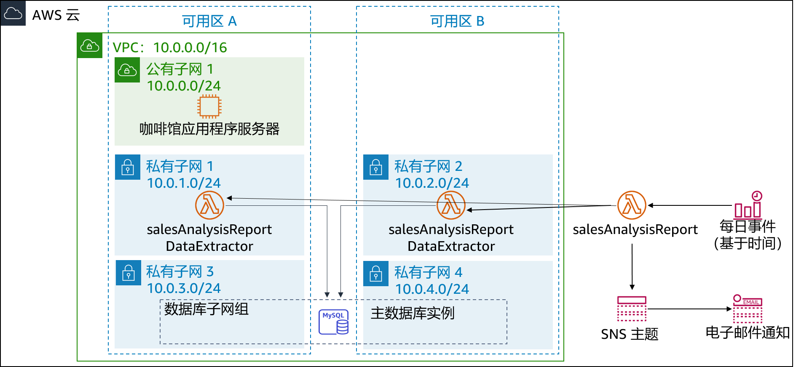

# 模块 13 – 挑战实验：为咖啡馆实施无服务器架构

## 场景

咖啡馆的生意蒸蒸日上。Frank 和 Martha 希望获得咖啡馆网站所售产品的每日销售报告。他们将使用此报告来确定原料订单及监控产品促销活动的效果。

Sofía 和 Nikhil 最初的想法是使用一个 Amazon Elastic Compute Cloud (Amazon EC2) Web 服务器实例来生成报告。Sofía 在 Web 服务器实例上设置了一个 cron 作业，该实例会通过电子邮件发送每日销售报告。但由于 cron 作业是资源密集型作业，这会降低 Web 服务器的性能。

Nikhil 向 Olivia 提到了 cron 作业，并表示它会降低 Web 应用程序的性能。Olivia 建议 Sofía 和 Nikhil 将非业务关键型报告任务与生产 Web 服务器实例分开。在 Sofía 和 Nikhil 审视了当前方法的优缺点之后，他们决定不降低 Web 服务器的速度。他们也考虑过运行单独的 EC2 实例，但他们每天仅需短时间运行实例，因此担心全天候运行会导致成本过高。

Sofía 和 Nikhil 认为将报告生成代码作为 AWS Lambda 函数运行是可行的，而且还可以降低成本。报告本身可以通过 Amazon Simple Notification Service (Amazon SNS) 发送到 Frank 和 Martha 的电子邮件地址。

在本实验中，您将扮演 Sofía 的角色，将每日报告代码作为 Lambda 函数实施。

 
## 实验概览和目标

在本实验中，您将使用 AWS Lambda 创建咖啡馆销售报告，并每天通过 Amazon SNS 以电子邮件形式发送。

完成本实验后，您应该可以通过实施无服务器架构来生成具有以下内容的每日销售报告：

- Virtual Private Cloud (VPC) 中的 Lambda 函数，可连接到存有咖啡馆销售数据的 Amazon Relational Database Service (Amazon RDS) 数据库
- Lambda 函数，可生成和运行销售报告
- 计划事件，可每天触发销售报告 Lambda 函数

 

*启动*本实验后，您的架构将如下例所示：

 

 

在本实验*结束*时，您的架构应如下例所示：

 

 

注意：在本挑战实验中，大部分任务都没有提供分步说明。您必须自己弄清楚如何完成这些任务。

 
## 持续时间

完成本实验大约需要 **90 分钟**。

 
## AWS 服务限制

在本实验环境中，对 AWS 服务和服务操作的访问可能仅限于完成实验说明所需的服务和服务操作。如果您尝试访问其他服务或执行本实验中所述之外的操作，可能会遇到错误。

 
## 访问 AWS 管理控制台

1. 在这些说明的顶部，选择 Start Lab（启动实验）即可启动您的实验。

   **Start Lab**（启动实验）面板随即会打开，其中显示了实验状态。

   > **提示**：如果您需要更多时间来完成实验，请再次选择 Start Lab（启动实验）按钮，重新启动环境计时器。

2. 请耐心等待，直到您看到消息 *Lab status: ready*（实验状态：就绪），然后选择 **X** 关闭 **Start Lab**（启动实验）面板。

   > **注意**：启动本实验需要大约 15 分钟。

3. 在这些说明的顶部，选择 AWS。

   AWS 管理控制台将会在一个新的浏览器选项卡中打开。您将自动登录系统。

   > **提示**：如果未打开新的浏览器选项卡，则您的浏览器顶部通常会出现一个横幅或图标，并显示一条消息，指明您的浏览器阻止了该网站打开弹出窗口。请选择横幅或图标，然后选择 **Allow pop ups**（允许弹出窗口）。

4. 排列 AWS 管理控制台选项卡，使其与这些说明一起显示。理想情况下，您将能够同时看到这两个浏览器选项卡，从而更轻松地执行实验步骤。

 
## 咖啡馆的业务请求：实施无服务器架构以生成每日销售报告（挑战）

在接下来的几项任务中，您将以 Sofía 的身份创建和配置实施报告解决方案所需的资源。

 
### 任务 1：下载源代码

生成报告的代码已经编写、打包完毕，可供您部署到 AWS Lambda。

5. 将以下两个文件下载到本地计算机：
   - [salesAnalysisReportDataExtractor 代码](https://aws-tc-largeobjects.s3-us-west-2.amazonaws.com/ILT-TF-200-ACACAD-20-EN/mod13-challenge/salesAnalysisReportDataExtractor.zip)
   - [salesAnalysisReport 代码](https://aws-tc-largeobjects.s3-us-west-2.amazonaws.com/ILT-TF-200-ACACAD-20-EN/mod13-challenge/salesAnalysisReport.zip)

6. 提取每个 *.zip* 文件并查看内容。

 
#### 回答有关实验的问题

完成实验后，选择蓝色的 **Submit**（提交）按钮，将会记录答案。

7. 查看本实验中的问题。
   - 选择 Details<i class="fas fa-angle-down"></i>（详细信息）
      菜单，然后选择 Show（显示）。
   - 选择页面底部的 **Access the multiple choice questions**（查看多项选择题）链接。

8. 在加载的页面中，回答第一个问题：

   - **问题 1**：为什么 *salesAnalysisReportDataExtractor.zip* 文件有一个 package 文件夹？

**注意**：请将浏览器选项卡中的问题页面保持打开状态，以便稍后在实验中返回查看。

 
### 任务 2：在 VPC 中创建 *DataExtractor* Lambda 函数

在此任务中，您将创建 *DataExtractor* Lambda 函数，该函数可从 Amazon RDS 数据库中提取咖啡馆的销售数据。因此，Lambda 函数可以访问 RDS 数据库实例，而您必须使用“允许来自 Lambda 函数的连接”的规则来更新数据库安全组。要实现这一通信，您需要为 Lambda 函数创建一个安全组，并将其作为入站规则添加到 RDS 实例的安全组。

9. 使用以下设置为 Lambda 函数创建安全组：
   - **Security group name**（安全组名称）：`LambdaSG`
   - **VPC**：*Lab VPC*
   - **Outbound Rules**（出站规则）：*所有流量*流向所有地址
10. 将新 Lambda 函数安全组作为第二个源添加到*现有*入站 TCP 端口 3306 规则，更新 **DatabaseSG** 安全组。
11. 使用以下设置创建一个 Lambda 函数：
    - **Function name**（函数名称）：`salesAnalysisReportDataExtractor`
    - **Runtime**（运行时）：*Python 3.8*。
    - **Role**（角色）：*salesAnalysisReportDERole*
    - **VPC**：
       - **VPC**：*Lab VPC*
       - **Subnets**（子网）：*私有子网 1* 和*私有子网 2*
       - **Security Group**（安全组）：您创建的 Lambda 函数安全组
    - **提示**：创建函数需要几分钟的时间。
12. 按以下所示配置 *DataExtractor* Lambda 函数：

    - **Code**（代码）：上传 *salesAnalysisReportDataExtractor.zip* 文件
    - **Description**（描述）：`Lambda function to extract data from database`（可从数据库中提取数据的 Lambda 函数）
    - **Handler**（处理程序）：`salesAnalysisReportDataExtractor.lambda_handler`
    - **Memory Size**（内存大小）：*128MB*
    - **Timeout**（超时）（以秒为单位）：`30`
13. 返回显示本实验多项选择题的浏览器选项卡，并回答以下问题：

    - **问题 2**：*salesAnalysisReportDataExtractor* 为何必须位于 VPC 中？

 
### 任务 3：创建 *salesAnalysisReport* Lambda 函数

在此任务中，您将创建可生成和发送每日销售分析报告的 Lambda 函数。

14. 使用以下设置创建第二个 Lambda 函数：
    - **Function name**（函数名称）：`salesAnalysisReport`
    - **Runtime**（运行时）：*Python 3.8*。
    - **Role**（角色）：*salesAnalysisReportRole*

15. 按以下所示配置 *salesAnalysisReport* Lambda 函数：
    - **Code**（代码）：上传 *salesAnalysisReport.zip* 文件
    - **Description**（描述）：`Lambda function to generate and send the daily sales report`（可生成和发送每日销售报告的 Lambda 函数）
    - **Handler**（处理程序）：`salesAnalysisReport.lambda_handler`
    - **Memory Size**（内存大小）：*128MB*
    - **Timeout**（超时）（以秒为单位）：`30`

 
### 任务 4：创建 SNS 主题

销售分析报告使用 SNS 主题将报告发送给电子邮件订阅者。在此任务中，您将创建 SNS 主题并更新 *salesAnalysisReport* Lambda 函数的环境变量，以便存储主题的 Amazon 资源名称 (ARN)。

16. 按以下配置创建标准 SNS 主题：
    - **Name**（名称）：`SalesReportTopic`
    - **Display Name**（显示名称）：`Sales Report Topic`

17. 通过添加以下环境变量来更新 *salesAnalysisReport* Lambda 函数：
    - **Variable Name**（变量名称）：`topicARN`
    - **Variable Value**（变量值）：您刚刚创建的主题的 ARN

18. 返回显示本实验多项选择题的浏览器选项卡，并回答以下问题：

    - **问题 3**：是否可以将 *topicARN* 存储为 AWS Systems Manager 参数而非环境变量（假设代码可以更新）？

 
### 任务 5：创建 SNS 主题的电子邮件订阅

要通过电子邮件接收销售报告，必须为在之前的任务中创建的主题创建电子邮件订阅。

19. 为主题创建新的电子邮件订阅。请在本实验中使用您方便访问的电子邮件地址。

20. 从电子邮件客户端确认电子邮件订阅。
    **注意**：如果您没有收到确认电子邮件，请检查**垃圾邮件**文件夹。

21. 返回显示本实验多项选择题的浏览器选项卡，并回答以下问题：

    - **问题 4**：如果不确认主题订阅，会收到电子邮件吗？

 
### 任务 6：测试 *salesAnalysisReport* Lambda 函数

在创建每日报告事件之前，您必须测试 *salesAnalysisReport* Lambda 函数是否可以正常运行。

22. 创建 *salesAnalysisReport* Lambda 函数测试。

    > **提示**：您无需考虑参数，因此请输入事件名称并接受默认 `Hello-world` 测试事件。

23. 运行 *salesAnalysisReport* 测试。如果测试成功，您会在几分钟内收到电子邮件报告。

24. 如果 Lambda 函数测试执行失败，请使用日志查看所有错误并解决错误，然后再次运行测试。以下是您可以尝试的一些*问题排查技巧*：

    - 查看来自 Amazon CloudWatch Logs 的关于两个 Lambda 函数的日志：
       - 如果出现连接咖啡馆数据库相关的错误，请检查安全组的配置是否正确。
       - 如果出现超时错误，请检查超时是否设置为 *30 秒*。
       - 如果出现有关 *lambda_function not found*（未找到 lambda_function）的错误，请检查是否配置了正确的处理程序。
    - 检查您的作业，确保已完成所有步骤。
    - 转到*提交作业*部分，然后按照步骤提交您的作业。提交报告将显示您是否正确完成了此前的步骤。

 
### 任务 7：设置 Amazon EventBridge 事件以每天触发 Lambda 函数

这项挑战的最后一步是设置每天运行报告的触发器。

25. 创建一个新的 EventBridge 规则，该规则每天在特定时间运行 *salesAnalysisReport* Lambda 函数。

**提示**：如果您遇到问题，请参阅 [AWS 文档中的 cron 表达式示例](https://docs.aws.amazon.com/eventbridge/latest/userguide/scheduled-events.html)。
**提示**：请使用与您当前时间接近的时间，但是请注意，该时间必须用协调世界时间 (UTC) 指定！

26. 检查您的电子邮件，查看是否收到了报告。

27. 返回显示本实验多项选择题的浏览器选项卡，并回答以下问题：

    - **问题 5 **：Frank 说他在过去几天没有收到电子邮件报告。您如何解决这一问题？

 
## 咖啡馆更新

Sofía 完成报告测试后，为 Frank 和 Martha 创建了电子邮件订阅。对于收到来自无服务器解决方案的第一份每日报告，Frank 和 Martha 感到很兴奋。

Sofía 很高兴能实现咖啡馆销售报告的自动发送，这将继续帮助 Frank 和 Martha 分析每日销售情况以及规划咖啡馆的库存。同时，她还为自己学会使用 AWS Lambda、Amazon SNS 和 Amazon EventBridge 感到开心。事实上，Sofía 还计划在咖啡馆的 Web 应用程序中实施更多的无服务器和自动化报告功能，以帮助咖啡馆发展壮大和管理业务。

 
## 提交作业

28. 在这些说明的顶部，选择 Submit（提交）记录您的进度，在出现提示时，选择 **Yes**（是）。

29. 如果在几分钟后仍未显示结果，请返回到这些说明的顶部，并选择 Grades（成绩）

    **提示**：您可以多次提交作业。更改作业后，再次选择 **Submit**（提交）即可。您最后一次提交的作业将记录为本实验的成绩。

30. 要查找有关您作业的详细反馈，请选择 Details（详细信息），然后选择 <i class="fas fa-caret-right"></i> **View Submission Report**（查看提交报告）。

 
## 实验完成

<i class="fas fa-flag-checkered"></i> 恭喜！您已完成实验。

31. 若要确认您想结束实验，请选择此页面顶部的 End Lab（结束实验），然后选择 Yes（是）

    此时应显示一个面板，并显示消息：*DELETE has been initiated... You may close this message box now.*（删除操作已启动...您现在可以关闭此消息框。）

32. 选择右上角的 **X** 关闭面板。

*©2020 Amazon Web Services, Inc. 及其附属公司。保留所有权利。未经 Amazon Web Services, Inc. 事先书面许可，不得复制或转载本文的部分或全部内容。禁止商业性复制、出租或出售。*