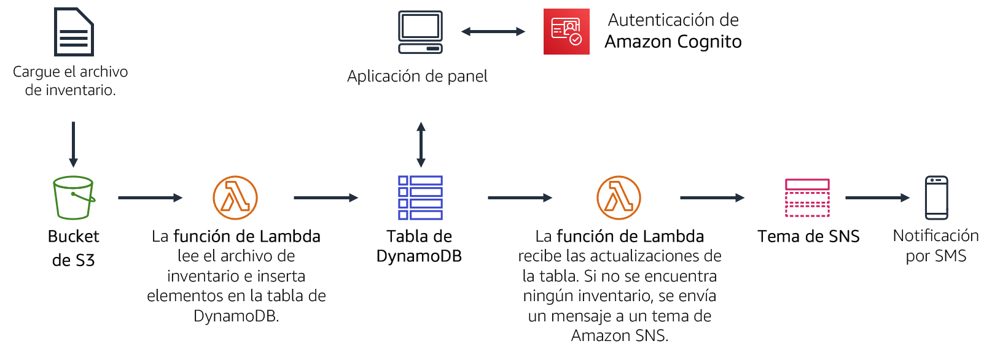
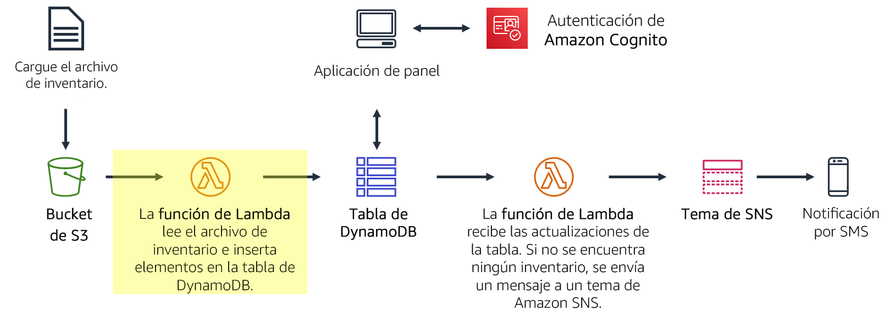
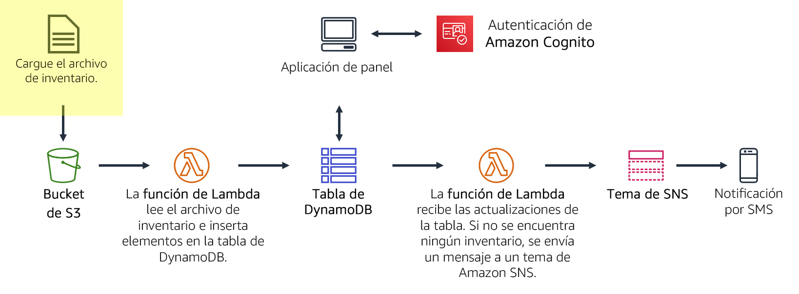
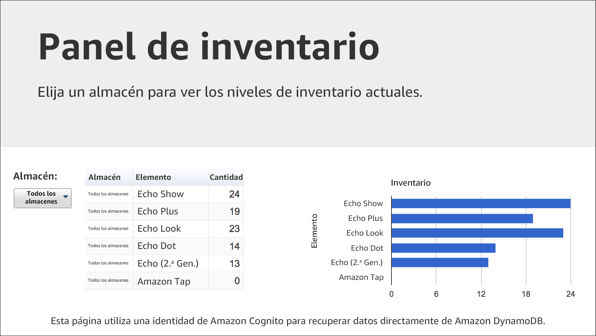
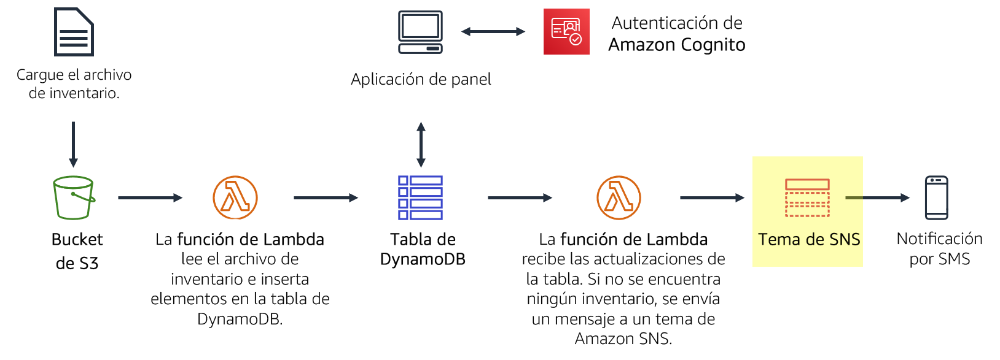
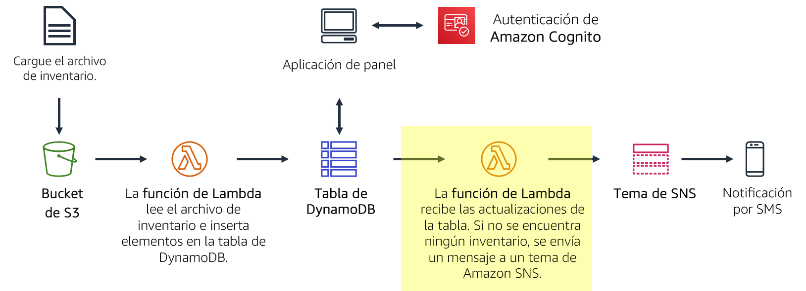

# Módulo 13 – Laboratorio guiado 2: Implementación de una arquitectura sin servidor en AWS

[//]: # "SKU: ILT-TF-200-ACACAD-2    Source Course: ILT-TF-100-ARCHIT-6 branch dev_65"

## Caso

Va a crear un sistema de seguimiento de inventario. Almacenes de todo el mundo subirán archivos de inventario a Amazon S3. Su equipo quiere poder ver los niveles de inventario y enviar una notificación cuando estén bajos.

En este laboratorio, realizará lo siguiente:

- *Cargará* un *archivo de inventario* a un bucket de Amazon S3.
- Esta carga *activará una función de Lambda* que leerá el archivo e insertará los artículos en una *tabla de Amazon DynamoDB*.
- Una aplicación de panel basada en la web y sin servidor utilizará Amazon Cognito para autenticarse en AWS y, luego, obtendrá acceso a la tabla de DynamoDB a fin de mostrar los niveles de inventario.
- Otra función de Lambda recibirá las actualizaciones de la tabla de DynamoDB y enviará un mensaje a un *tema de SNS* cuando un artículo del inventario esté agotado.
- A continuación, Amazon SNS *le enviará una notificación a través del servicio de mensajes cortos (SMS) o de email* que solicitará inventario adicional.

<br/>
## Información general del laboratorio

Tradicionalmente, las aplicaciones se ejecutan en servidores. Estos servidores pueden ser físicos (o sin sistema operativo) o, también, pueden ser entornos virtuales que se ejecutan encima de servidores físicos. Sin embargo, debe comprar y aprovisionar todos estos tipos de servidores, además de administrar su capacidad. En cambio, puede ejecutar su código en AWS Lambda sin necesidad de preasignar servidores. Con Lambda, solo necesita proporcionar el código y definir un desencadenador. La función de Lambda puede ejecutarse cuando se necesite, ya sea una vez por semana o cientos de veces por segundo. Solo pagará lo que utilice.

En este laboratorio, se demuestra cómo activar una función de Lambda cuando se carga un archivo en Amazon Simple Storage Service (Amazon S3). El archivo se cargará en una tabla de Amazon DynamoDB. Los datos estarán disponibles para que pueda verlos en una página de panel que recupera los datos directamente de DynamoDB. Esta solución *no utiliza Amazon Elastic Compute Cloud (Amazon EC2)*. Se trata de una *solución sin servidor* que *escala automáticamente cuando se la utiliza*. Además, genera *costos bajos* cuando está en uso y, cuando está inactiva, _prácticamente no genera costos_ porque solo se le factura el almacenamiento de datos.


Después de completar este laboratorio, debería ser capaz de lo siguiente:

- Implementar una arquitectura sin servidor en AWS
- Activar funciones de Lambda desde Amazon S3 y Amazon DynamoDB
- Configurar Amazon Simple Notification Service (Amazon SNS) para que envíe notificaciones


Cuando **termine** este laboratorio, la arquitectura se verá como en el siguiente ejemplo:



<br/>
## Duración

La duración estimada de este laboratorio es de **40 minutos** aproximadamente.

<br/>
## Restricciones de los servicios de AWS

En este entorno de laboratorio, el acceso a los servicios y las acciones de los servicios de AWS puede restringirse a los que se necesiten para cumplir las instrucciones del laboratorio. Es posible que se produzcan errores si intenta acceder a otros servicios o hacer acciones que no sean las que se describen en este laboratorio.

<br/>
## Acceso a la consola de administración de AWS

1. En la parte superior de estas instrucciones, elija <span id="ssb_voc_grey">Start Lab</span> (Iniciar laboratorio) y comience a trabajar en él.

   Se abrirá el panel **Start Lab** (Iniciar laboratorio), donde se muestra el estado del laboratorio.

   <i class="fas fa-info-circle"></i> **Sugerencia**: Si necesita más tiempo para completar el laboratorio, vuelva a hacer clic en el botón <span id="ssb_voc_grey">Start Lab</span> (Iniciar laboratorio) para reiniciar el temporizador del entorno.

2. Espere hasta que el panel **Start Lab** (Iniciar laboratorio) muestre el mensaje *Lab Status: ready (Estado del laboratorio: listo)* y, luego, cierre el panel haciendo clic en la **X**.

3. En la parte superior de estas instrucciones, elija <span id="ssb_voc_grey">AWS</span>.

   Con esta acción, se abrirá la consola de administración de AWS en una nueva pestaña del navegador, y el sistema iniciará su sesión de forma automática.

   <i class="fas fa-exclamation-triangle"></i> **Sugerencia**: Si no se abre una nueva pestaña del navegador, por lo general habrá un aviso o un icono en la parte superior, el cual indicará que el navegador impide que el sitio abra ventanas emergentes. Haga clic en el aviso o el icono y elija **Allow pop ups** (Permitir ventanas emergentes).

4. Ubique la pestaña de la **consola de administración de AWS** de modo que aparezca junto con estas instrucciones. El método más óptimo sería tener ambas pestañas del navegador abiertas al mismo tiempo para que pueda seguir los pasos del laboratorio más fácilmente.

   <i class="fas fa-exclamation-triangle"></i> **No cambie la región a menos que se le indique expresamente que debe hacerlo**.

<br/>
## Tarea 1: Crear una función de Lambda para cargar datos

En esta tarea, creará *una función de Lambda* que procesará un archivo de inventario. La función de Lambda leerá el archivo e insertará la información en una tabla DynamoDB.



5. En la **consola de administración de AWS**, en el menú <span id="ssb_services">Services (Servicios)<i class="fas fa-angle-down"></i></span>, elija **Lambda**.

6. Elija <span id="ssb_lambda_orange">Create function</span> (Crear función).

   <i class="fas fa-info-circle"></i> *Los proyectos* son plantillas de código para escribir funciones de Lambda. Dichos proyectos se proporcionan para los desencadenadores estándar de Lambda, como la creación de habilidades de Amazon Alexa y el procesamiento de las secuencias de Amazon Kinesis Data Firehose. En este laboratorio, se le ofrece una función de Lambda preescrita, por lo que utilizará la opción **Author from scratch** (Crear desde cero).

7. Realice las siguientes configuraciones:

   - **Function name** (Nombre de la función): `Load-Inventory`
   - **Runtime** (Tiempo de ejecución): _Python 3.7_
   - Amplíe <i class="fas fa-caret-right"></i> **Choose or create an execution role** (Elegir o crear un rol de ejecución).
   - **Execution role** (Rol de ejecución): _Use an existing role (Utilizar un rol existente)_
   - **Existing role:** (Rol existente): _Lambda-Load-Inventory-Role_

   Este rol otorga permisos a la función de Lambda para que pueda acceder a Amazon S3 y a DynamoDB.

8. Elija <span id="ssb_lambda_orange">Create function</span> (Crear función).

9. Desplácese hacia abajo hasta la sección **Function code** (Código de la función) y, luego, elimine todo el código que aparece en el editor de código.

10. En el editor del **Function code** (Código de la función), copie el siguiente código:

  ```bash
  # Load-Inventory Lambda function
  #
  # This function is triggered by an object being created in an Amazon S3 bucket.
  # The file is downloaded and each line is inserted into a DynamoDB table.
  import json, urllib, boto3, csv
  # Connect to S3 and DynamoDB
  s3 = boto3.resource('s3')
  dynamodb = boto3.resource('dynamodb')
  # Connect to the DynamoDB tables
  inventoryTable = dynamodb.Table('Inventory');
  # This handler is run every time the Lambda function is triggered
  def lambda_handler(event, context):
    # Show the incoming event in the debug log
    print("Event received by Lambda function: " + json.dumps(event, indent=2))
    # Get the bucket and object key from the Event
    bucket = event['Records'][0]['s3']['bucket']['name']
    key = urllib.parse.unquote_plus(event['Records'][0]['s3']['object']['key'])
    localFilename = '/tmp/inventory.txt'
    # Download the file from S3 to the local filesystem
    try:
      s3.meta.client.download_file(bucket, key, localFilename)
    except Exception as e:
      print(e)
      print('Error getting object {} from bucket {}. Make sure they exist and your bucket is in the same region as this function.'.format(key, bucket))
      raise e
    # Read the Inventory CSV file
    with open(localFilename) as csvfile:
      reader = csv.DictReader(csvfile, delimiter=',')
      # Read each row in the file
      rowCount = 0
      for row in reader:
        rowCount += 1
        # Show the row in the debug log
        print(row['store'], row['item'], row['count'])
        try:
          # Insert Store, Item and Count into the Inventory table
          inventoryTable.put_item(
            Item={
              'Store':  row['store'],
              'Item':   row['item'],
              'Count':  int(row['count'])})
        except Exception as e:
           print(e)
           print("Unable to insert data into DynamoDB table".format(e))
      # Finished!
      return "%d counts inserted" % rowCount
  ```

Examine el código. Este realiza los siguientes pasos:

- Descarga el archivo de Amazon S3 que desencadenó el evento.
- Ejecuta un bucle en cada línea del archivo.
- Inserta los datos en la tabla *Inventory (Inventario)* de DynamoDB.

11. En la parte superior de la página, elija <span id="ssb_lambda_orange">Save</span> (Guardar).

   A continuación, deberá configurar Amazon S3 para activar la función de Lambda cuando se cargue un archivo.

<br/>
## Tarea 2: Configurar un evento de Amazon S3

Almacenes de todo el mundo proporcionan archivos de inventario para cargar en el sistema de seguimiento de inventario. En lugar de cargar sus archivos por medio del protocolo de transferencia de archivos (FTP), los almacenes pueden cargarlos directamente en Amazon S3. Pueden cargar los archivos a través de una página web, un script o como parte de un programa. Cuando se recibe un archivo, este desencadena la función de Lambda. Luego, esta función de Lambda cargará el inventario en la tabla de DynamoDB.


En esta tarea, creará un bucket de S3 y lo configurará para que active la función de Lambda.

12. En el menú <span id="ssb_services">Services (Servicios)<i class="fas fa-angle-down"></i></span>, elija **S3**.

13. Elija <span id="ssb_s3_blue"><i class="fas fa-plus"></i>Create bucket (Crear bucket)</span>

   Cada bucket debe tener un nombre único, por lo que agregará un número aleatorio al nombre del bucket. Por ejemplo: *inventory-123*.

14. Para **Bucket name** (Nombre del bucket), escriba `inventory-<number> (inventario-<número>)` (reemplace _<number>_ por un número aleatorio)

15. Elija <span id="ssb_s3_white">Create bucket (Crear bucket)</span>

   <i class="fas fa-comment"></i> Es posible que reciba un error que indique lo siguiente: *The requested bucket name is not available (El nombre de bucket solicitado no está disponible)*. Si aparece este error, elija el primer enlace **Edit** (Editar), cambie el nombre del bucket e inténtelo de nuevo hasta que se acepte el nombre.

   Ahora, configurará el bucket para que la función de Lambda se active automáticamente cuando se cargue un archivo.

16. Elija el nombre de su bucket _inventory-<number>(inventario-)_.

17. Elija la pestaña **Properties** (Propiedades).

18. Desplácese hacia abajo hasta **Advanced settings** (Configuración avanzada) y, luego, haga clic en **Events** (Eventos).

   Deberá configurar un evento para que se active cuando se cree un objeto en el bucket de S3.

19. Haga clic en <span style="color:#00a0d2"><i class="fas fa-plus"></i> Add notification (Agregar notificación)</span> y, luego, establezca los siguientes ajustes:

   - **Name** (Nombre): `Load-Inventory (Cargar-Inventario)`
   - **Eventos** (Eventos): <i class="far fa-check-square"></i> _All object create events (Todos los eventos de creación de objetos)_
   - **Send to** (Enviar a): _Lambda Function (Función de Lambda)_
   - **Lambda:** _Load-Inventory (Cargar-Inventario)_
   - Elija <span id="ssb_s3_blue">Save (Guardar)</span>.

   Esta configuración indica a Amazon S3 que, cuando se cree un objeto en el bucket, active la función de Lambda _Load-Inventory (Cargar-Inventory)_ que creó anteriormente.

   El bucket ya está listo para recibir archivos de inventario.

<br/>
## Tarea 3: Probar el proceso de carga

Ahora está listo para probar el proceso de carga. Cargará un archivo de inventario y, a continuación, revisará que se haya cargado con éxito.



20. Descargue los archivos de inventario abriendo el menú contextual (haciendo clic con el botón derecho) de los siguientes enlaces:

    [inventory-berlin.csv](../../../scripts/inventory-berlin.csv)
    
    [inventory-calcutta.csv](../../../scripts/inventory-calcutta.csv)
    
    [inventory-karachi.csv](../../../scripts/inventory-karachi.csv)
    
    [inventory-pusan.csv](../../../scripts/inventory-pusan.csv)
    
    [inventory-shanghai.csv](../../../scripts/inventory-shanghai.csv)
    
    [inventory-springfield.csv](../../../scripts/inventory-springfield.csv)


Estos archivos son los archivos de inventario que puede utilizar para probar el sistema. Son archivos de valores separados por comas (CSV). El siguiente ejemplo muestra el contenido del archivo Berlín:


   ```plain
     store,item,count
     Berlin,Echo Dot,12
     Berlin,Echo (2nd Gen),19
     Berlin,Echo Show,18
     Berlin,Echo Plus,0
     Berlin,Echo Look,10
     Berlin,Amazon Tap,15
   ```

21. En la consola, regrese al bucket de S3 haciendo clic en la pestaña **Overview** (Información general).

22. Seleccione <span id="ssb_s3_blue"><i class="fas fa-upload"></i>Upload (Cargar)</span> y cargue uno de los archivos CSV en el bucket. (Puede elegir cualquier archivo de inventario).

   Amazon S3 activará la función de Lambda de manera automática y esta cargará los datos en una tabla de DynamoDB.

   Se le ha proporcionado una aplicación de panel sin servidor para que pueda ver los resultados.

23. En la parte superior de estas instrucciones, elija el botón **Details** (Detalles) y seleccione el botón **Show** (Mostrar) que está a la derecha de **AWS**.

24. En la ventana **Credentials** (Credenciales), copie la dirección URL del **Dashboard** (Panel).

25. Abra una nueva pestaña del navegador web, pegue la URL y presione INTRO.

   La aplicación de panel se abrirá y mostrará los datos de inventario que cargó en el bucket. Los datos se recuperarán desde DynamoDB, lo que demostrará que la carga activó correctamente la función de Lambda.




<i class="fas fa-exclamation-triangle"></i> Si la aplicación de panel no muestra ninguna información, pídale a su instructor que lo ayude a diagnosticar el problema.

La aplicación de panel se sirve como una página web estática de Amazon S3. El panel se autentica mediante Amazon Cognito como un _anonymous user (usuario anónimo)_, lo que proporciona los permisos suficientes para que el panel recupere los datos de DynamoDB.

También puede ver los datos directamente en la tabla de DynamoDB.

26. En el menú <span id="ssb_services">Services (Servicios)<i class="fas fa-angle-down"></i></span>, elija **DynamoDB**.

27. En el panel de navegación izquierdo, elija **Tables** (Tablas).

28. Elija la tabla **Inventory** (Inventario).

29. Elija la pestaña **Items** (Artículos).

   Se mostrarán los datos del archivo de inventario: el almacén, el artículo y el recuento de inventario.

<br/>
## Tarea 4: Configurar las notificaciones

Es necesario notificar al personal encargado de la administración del inventario cuando un almacén se quede sin existencias de un artículo. Para esta funcionalidad de notificación sin servidor, usará **Amazon SNS**.



Amazon SNS es un servicio de publicación/suscripción de mensajería y generación de notificaciones móviles flexible y completamente administrado. Entrega mensajes a los puntos de enlace y los clientes que se suscriben. Con Amazon SNS, puede enviar mensajes a un gran número de suscriptores, incluidos sistemas y servicios distribuidos, además de dispositivos móviles.

30. En el menú <span id="ssb_services">Services (Servicios)<i class="fas fa-angle-down"></i></span>, haga clic en **Simple Notification Service**.

31. En el cuadro **Create topic** (Crear tema), para **Topic name** (Nombre del tema), escriba `NoStock (sin stock)`.

32. Elija <span id="ssb_orange">Next step</span> (Paso siguiente).

33. Desplácese hasta el final de la página.

34. Elija <span id="ssb_orange">Create topic</span> (Crear tema).

    Para recibir notificaciones, debe *suscribirse* al tema. Puede elegir recibir notificaciones a través de varios métodos, como SMS e email.

35. En la mitad inferior de la página, haga clic en <span id="ssb_orange">Create subscription</span> (Crear suscripción) y configure lo siguiente:

- **Protocol** (Protocolo): _SMS_
- **Endpoint** (Punto de enlace): escriba su número de teléfono móvil en formato internacional (por ejemplo: _+14155550135_ o _+9175550190_)
- Elija <span id="ssb_orange">Create subscription</span> (Crear suscripción)

<i class="fas fa-comment"></i> Si no desea recibir mensajes SMS, puede suscribirse a través de *email*. Debe proporcionar una dirección de email a la que pueda acceder mientras trabaja en este laboratorio. Después de crear una suscripción por email, recibirá un email de confirmación. Abra el mensaje y elija el enlace _Confirm subscription (Confirmar suscripción)_.

Cualquier mensaje que se envíe al tema de SNS se le reenviará por SMS o por email.

<br/>
## Tarea 5: Crear una función de Lambda para enviar notificaciones

Usted podría modificar la función existente de Lambda _Load-Inventory_ (Cargar-Inventario) para que compruebe los niveles de inventario mientras se carga el archivo. Sin embargo, esta configuración no es una buena práctica de arquitectura. En lugar de sobrecargar la función _Load-Inventory_ (Cargar-Inventario) con lógica de negocio, creará otra función de Lambda que se activará cuando se carguen datos en la tabla de DynamoDB. A esta función la activará una _secuencia de DynamoDB_.

Este enfoque de arquitectura ofrece varios beneficios:

- Cada función de Lambda lleva a cabo una única función específica. Esta práctica hace que el código sea más simple y, también, más fácil de mantener.
- Se puede agregar lógica de negocio adicional mediante la creación de funciones adicionales de Lambda. Cada función opera de forma independiente, por lo que la funcionalidad existente no se ve afectada.

En esta tarea, creará otra función de Lambda que observe el inventario mientras se carga en la tabla de DynamoDB. Si la función de Lambda detecta que un artículo se queda sin existencias, enviará una notificación a través del tema de SNS que creó antes.



36. En el menú <span id="ssb_services">Services (Servicios)<i class="fas fa-angle-down"></i></span>, elija **Lambda**.

37. Elija <span id="ssb_lambda_orange">Create function</span> (Crear función) y configure estos ajustes:

- **Function name** (Nombre de la función): `Check-Stock (Verificar-Existencias)`
- **Runtime** (Tiempo de ejecución): _Python 3.7_
- Amplíe <i class="fas fa-caret-right"></i> **Choose or create an execution role** (Elegir o crear un rol de ejecución).
- **Execution role** (Rol de ejecución): _Use an existing role (Utilizar un rol existente)_
- **Existing role** (Rol existente): _Lambda-Check-Stock-Role (Rol-Verificar-Existencias-de-Lambda)_
- Elija <span id="ssb_lambda_orange">Create function</span> (Crear función).

    Este rol se ha configurado con los permisos para enviar una notificación a Amazon SNS.

38. Desplácese hacia abajo hasta la sección **Function code** (Código de la función) y, luego, elimine todo el código que aparece en el editor de código.

39. Copie el código siguiente y, en el editor del **Function code** (Código de la función), pegue el código que copió:

    ```bash
    # Stock Check Lambda function
    #
    # This function is triggered when values are inserted into the Inventory DynamoDB table.
    # Inventory counts are checked and if an item is out of stock, a notification is sent to an SNS Topic.
import json, boto3
    # This handler is run every time the Lambda function is triggered
def lambda_handler(event, context):
      # Show the incoming event in the debug log
      print("Event received by Lambda function: " + json.dumps(event, indent=2))
      # For each inventory item added, check if the count is zero
      for record in event['Records']:
        newImage = record['dynamodb'].get('NewImage', None)
        if newImage:      
          count = int(record['dynamodb']['NewImage']['Count']['N'])  
          if count == 0:
            store = record['dynamodb']['NewImage']['Store']['S']
            item  = record['dynamodb']['NewImage']['Item']['S']  
            # Construct message to be sent
            message = store + ' is out of stock of ' + item
            print(message)  
            # Connect to SNS
            sns = boto3.client('sns')
            alertTopic = 'NoStock'
            snsTopicArn = [t['TopicArn'] for t in sns.list_topics()['Topics']
                            if t['TopicArn'].lower().endswith(':' + alertTopic.lower())][0]  
            # Send message to SNS
            sns.publish(
              TopicArn=snsTopicArn,
              Message=message,
              Subject='Inventory Alert!',
              MessageStructure='raw'
            )
      # Finished!
      return 'Successfully processed {} records.'.format(len(event['Records']))
    ```

    Examine el código. Este realiza los siguientes pasos:
    
    - Ejecuta un bucle en los registros entrantes
    
    - Si el recuento de inventario es cero, envía un mensaje al tema de SNS _NoStock_
    
    Ahora configurará la función para que se desencadene cuando se agreguen datos a la tabla _Inventory_ de DynamoDB.

40. Desplácese hasta la sección **Designer** (Diseñador) ubicada en la parte superior de la página.

41. Elija <span id="ssb_lambda_white"><i class="fas fa-plus"></i>Add trigger (Agregar desencadenador)</span> y, a continuación, configure estos ajustes:

   - **Select a trigger** (Seleccionar un desencadenador): _DynamoDB_
   - **DynamoDB Table** (Tabla de DynamoDB): _Inventory_
   - Elija <span id="ssb_lambda_orange">Add</span> (Agregar)

42. En la parte superior de la página, elija <span id="ssb_lambda_orange">Save</span> (Guardar).

   Ya está listo para probar el sistema.

<br/>

## Tarea 6: Probar el sistema

Ahora cargará un archivo de inventario en Amazon S3, lo que desencadenará la función original _Load-Inventory_ (Cargar-Inventario). Esta función cargará los datos en DynamoDB, lo que luego activará la nueva función de Lambda _Check-Stock_ (Verificar-Existencias). Si la función de Lambda detecta un artículo con inventario igual a cero, enviará un mensaje a Amazon SNS. A continuación, Amazon SNS lo notificará por SMS o email.

43. En el menú <span id="ssb_services">Services (Servicios)<i class="fas fa-angle-down"></i></span>, elija **S3**.

44. Elija el nombre de su bucket _inventory-<number>(inventario-)_.

45. Elija **Upload** (Cargar) y cargue un archivo de inventario diferente.

46. Regrese al **Inventory System Dashboard** (Panel del sistema de inventario) y actualice <i class="fas fa-sync"></i> la página.

   Ahora debería poder utilizar el menú **Store (Almacén)** para ver el inventario de ambos almacenes.

   Además, debería recibir una *notificación por SMS o email* en la cual se indique que hay un artículo agotado en el almacén (cada archivo de inventario tiene un artículo que se ha quedado sin existencias).

   <i class="fas fa-comment"></i> Si no recibe ninguna notificación, espere unos minutos y cargue un archivo de inventario diferente. A veces, el desencadenador de DynamoDB puede demorar algunos minutos en habilitarse.

47. Intente cargar varios archivos de inventario al mismo tiempo. ¿Qué cree que sucederá?

<br/>
## Envío de su trabajo

48. En la parte superior de estas instrucciones, elija <span id="ssb_blue">Submit</span> (Enviar) para registrar su progreso y, cuando se le indique, elija **Yes** (Sí).

49. Si los resultados no se muestran después de algunos minutos, vuelva a la parte superior de estas instrucciones y elija <span id="ssb_voc_grey">Grades</span> (Resultados).

   **Sugerencia**: Puede enviar su trabajo varias veces. Después de realizar las modificaciones pertinentes, vuelva a elegir **Submit** (Enviar). Su último envío es el que se registrará para este laboratorio.

50. Para encontrar comentarios detallados sobre su trabajo, elija <span id="ssb_voc_grey">Details</span> (Detalles) seguido de <i class="fas fa-caret-right"></i> **View Submission Report** (Ver informe de envío).

<br/>

## Fin del laboratorio <i class="fas fa-graduation-cap"></i>

<i class="fas fa-flag-checkered"></i> ¡Felicitaciones! Ha completado el laboratorio.

51. Elija <span id="ssb_voc_grey">End Lab</span> (Finalizar laboratorio), en la parte superior de esta página, y, a continuación, seleccione <span id="ssb_blue">Yes</span> (Sí) para confirmar que desea finalizar el laboratorio.

   Un panel presentará el mensaje *DELETE has been initiated… You may close this message box now (Se ha iniciado la ELIMINACIÓN… Ya puede cerrar este cuadro de mensaje)*.

52. Seleccione la **X** de la esquina superior derecha para cerrar el panel.


*© 2020 Amazon Web Services, Inc. y sus empresas afiliadas. Todos los derechos reservados. Este contenido no puede reproducirse ni redistribuirse, total ni parcialmente, sin el permiso previo por escrito de Amazon Web Services, Inc. Queda prohibida la copia, el préstamo y la venta de carácter comercial.*
