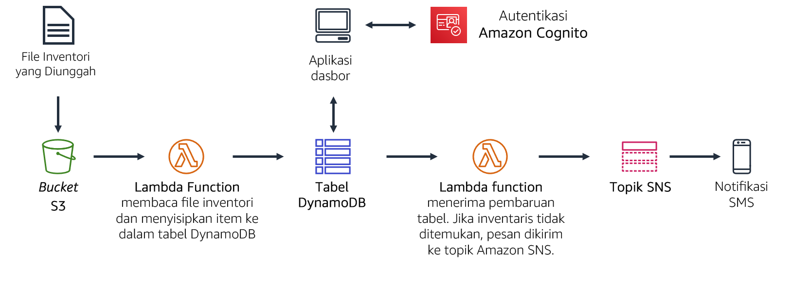
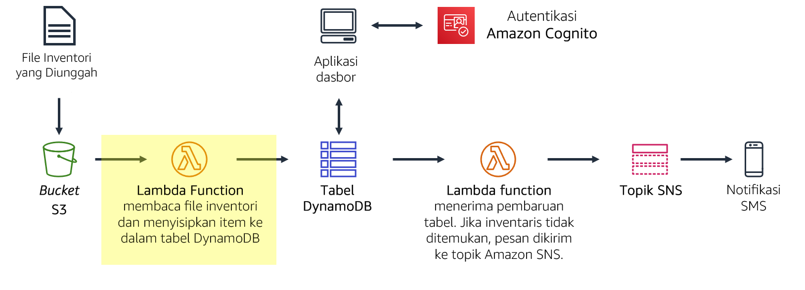
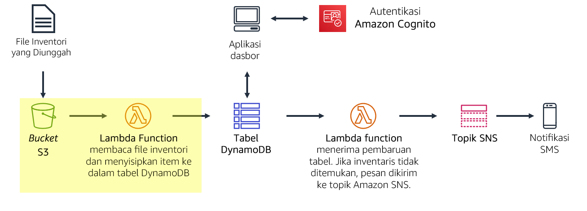
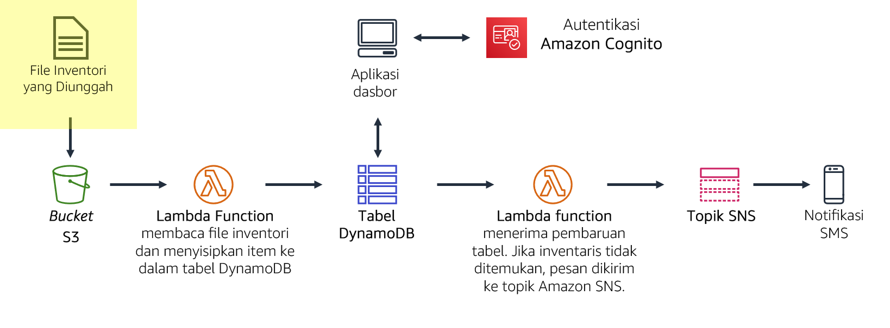
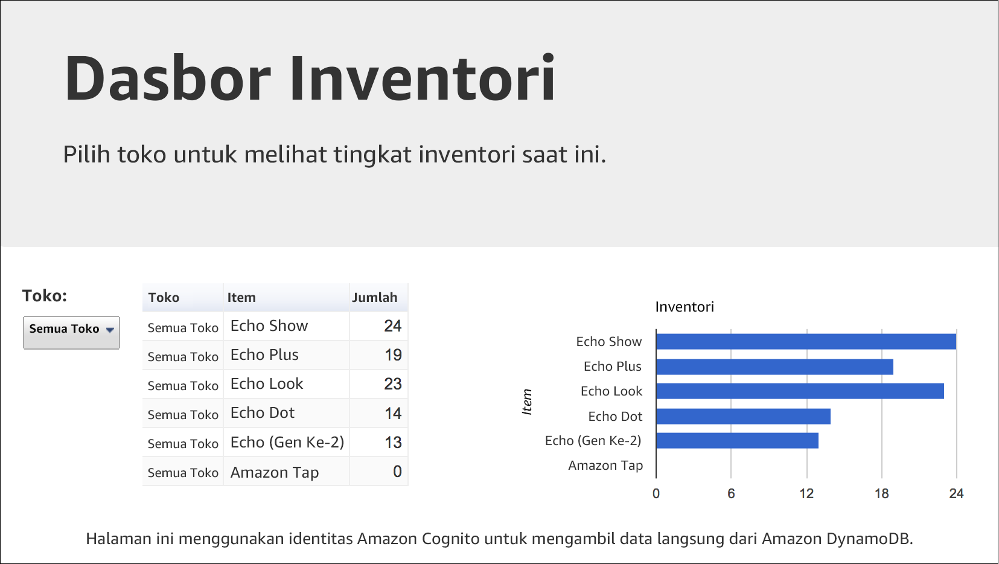
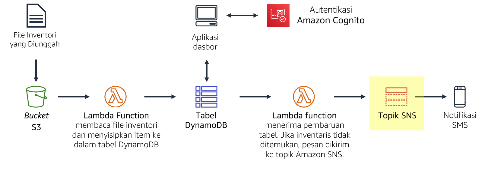
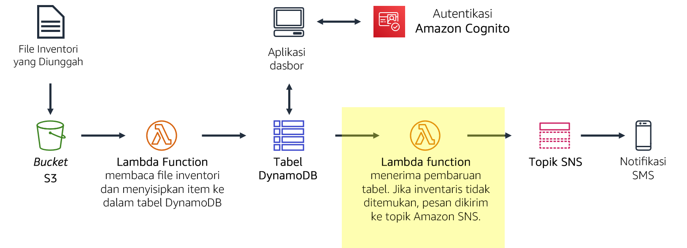

# Modul 13 — Lab Terpandu 2: Menerapkan Arsitektur Nirserver di AWS

[//]: # "SKU: ILT-TF-200-ACACAD-2    Source Course: ILT-TF-100-ARCHIT-6 branch dev_65"

## Skenario

Anda sedang membuat sistem pelacakan inventaris. Penyimpanan dari seluruh dunia akan mengunggah file inventaris ke Amazon S3. Tim Anda ingin dapat melihat tingkat inventaris dan mengirim pemberitahuan ketika tingkat inventaris rendah.

Di lab ini, Anda akan:

- Anda akan *mengunggah* *file* inventaris** ke bucket Amazon S3.
- Unggahan ini akan *memicu fungsi Lambda* yang akan membaca file dan menyisipkan item ke dalam *tabel Amazon DynamoDB*.
- Aplikasi dasbor berbasis web nirserver akan menggunakan Amazon Cognito untuk mengautentikasi ke AWS. Aplikasi kemudian akan mendapatkan akses ke tabel DynamoDB untuk menampilkan tingkat inventaris.
- Fungsi Lambda lain akan menerima pembaruan dari tabel DynamoDB. Fungsi ini akan mengirim pesan ke *topik SNS* ketika item inventaris habis.
- Amazon SNS kemudian akan *mengirimkan pemberitahuan melalui layanan pesan singkat (SMS) atau email* yang meminta inventaris tambahan.

<br/>
## Gambaran umum lab

Secara tradisional, aplikasi berjalan di server. Server ini dapat berbentuk fisik (atau bare metal). Server juga dapat berupa lingkungan virtual yang berjalan di atas server fisik. Namun, Anda harus membeli dan menyediakan semua jenis server ini, dan Anda juga harus mengelola kapasitasnya. Sebaliknya, Anda dapat menjalankan kode Anda di AWS Lambda tanpa perlu mengalokasikan server sebelumnya. Dengan Lambda, Anda hanya perlu menyediakan kode dan menentukan pemicu. Fungsi Lambda bisa berjalan saat dibutuhkan, baik itu sekali per minggu atau ratusan kali per detik. Anda hanya membayar apa yang Anda gunakan.

Lab ini mendemonstrasikan cara memicu fungsi Lambda ketika file diunggah ke Amazon Simple Storage Service (Amazon S3). File akan dimuat ke dalam tabel Amazon DynamoDB. Anda akan dapat melihat data pada halaman dasbor yang mengambil data langsung dari DynamoDB. Solusi ini *tidak menggunakan Amazon Elastic Compute Cloud (Amazon EC2)*. Ini adalah *solusi nirserver* yang *secara otomatis menyesuaikan ketika digunakan*. Solusi ini juga hanya dikenai *sedikit biaya* saat digunakan. Ketika diam, _praktis tidak ada biaya_ karena Anda akan hanya ditagih untuk penyimpanan data.


Setelah menyelesaikan lab ini, Anda akan mampu:

- Menerapkan arsitektur nirserver di AWS
- Memicu fungsi Lambda dari Amazon S3 dan Amazon DynamoDB
- Mengonfigurasi Amazon Simple Notification Service (Amazon SNS) untuk mengirim pemberitahuan.


Pada **akhir** lab ini, arsitektur Anda akan terlihat seperti contoh berikut:



<br/>
## Durasi

Diperlukan sekitar **40 menit ** untuk menyelesaikan lab ini.

<br/>
## Pembatasan layanan AWS

Dalam lingkungan lab ini, akses ke layanan AWS dan tindakan layanan mungkin dibatasi untuk orang-orang yang diperlukan untuk menyelesaikan instruksi lab. Anda mungkin akan mengalami error jika mencoba mengakses layanan lain atau melakukan tindakan di luar yang dijelaskan di lab ini.

<br/>
## Mengakses Konsol Manajemen AWS

1. Di bagian atas instruksi ini, pilih <span id="ssb_voc_grey">Start Lab</span> (Mulai Lab) untuk meluncurkan lab Anda.

   Panel **Start Lab** (Mulai Lab) terbuka dan menampilkan status lab.

   <i class="fas fa-info-circle"></i> **Tip**: Jika Anda memerlukan lebih banyak waktu untuk menyelesaikan lab, mulai ulang pengatur waktu untuk lingkungan dengan memilih tombol <span id="ssb_voc_grey">Start Lab</span> (Mulai Lab) lagi.

2. Tunggu hingga panel **Start Lab** (Mulai Lab) menampilkan pesan *Lab status: ready* (Status lab: siap), lalu tutup panel dengan memilih **X**.

3. Di bagian atas instruksi ini, pilih <span id="ssb_voc_grey">AWS</span>.

   Tindakan ini akan membuka Konsol Manajemen AWS di tab browser baru. Anda akan masuk ke sistem secara otomatis.

   <i class="fas fa-exclamation-triangle"></i> **Tip**: Jika tab browser baru tidak terbuka, banner atau ikon biasanya berada di bagian atas browser Anda dengan pesan bahwa browser Anda mencegah situs membuka jendela sembulan. Pilih banner atau ikon, lalu pilih **Allow pop-ups** (Izinkan sembulan).

4. Atur tab **AWS Management Console**(Konsol Manajemen AWS) agar ditampilkan bersama instruksi ini. Idealnya, Anda perlu membuka kedua tab browser secara bersamaan, sehingga Anda dapat mengikuti langkah-langkah lab dengan lebih mudah.

   <i class="fas fa-exclamation-triangle"></i> **Jangan mengubah Wilayah kecuali secara khusus diperintahkan untuk melakukannya**.

<br/>
## Tugas 1: Membuat fungsi Lambda untuk memuat data

Dalam tugas ini, Anda akan membuat *fungsi Lambda* yang akan memproses file inventaris. Fungsi Lambda akan membaca file dan menyisipkan informasi ke dalam tabel Amazon DynamoDB.



5. Di **AWS Management Console** (Konsol Manajemen AWS), pada menu <span id="ssb_services">Services<i class="fas fa-angle-down"></i></span> (Layanan), pilih **Lambda**.

6. Pilih <span id="ssb_lambda_orange">Create function</span> (Buat fungsi)

   <i class="fas fa-info-circle"></i> *Blueprints* adalah templat kode untuk menulis fungsi Lambda. Blueprints disediakan untuk pemicu Lambda standar, seperti menciptakan kemampuan Amazon Alexa dan memproses aliran Amazon Kinesis Data Firehose. Lab ini menyediakan fungsi Lambda yang sudah tertulis sebelumnya untuk Anda, sehingga Anda akan menggunakan opsi **Author from scratch** (Menulis dari awal).

7. Konfigurasikan pengaturan berikut ini:

   - **Function name** (Nama Fungsi): `Load-Inventory` (Muat-Inventaris)
   - **Runtime** (Waktu aktif): _Python 3.7_
   - Perluas <i class="fas fa-caret-right"></i> **Pilih atau buat peran eksekusi**.
   - **Execution role** (Peran eksekusi): _Use an existing role_ (Gunakan peran yang ada)
   - **Existing role** (Peran yang ada): _Lambda-Load-Inventory-Role_

   Peran ini akan memberikan izin kepada fungsi Lambda agar dapat mengakses Amazon S3 dan Amazon DynamoDB.

8. Pilih <span id="ssb_lambda_orange">Create function</span> (Buat fungsi)

9. Gulir ke bawah ke bagian **Code source** (Sumber kode), dan di panel **Environment** (Lingkungan), pilih lambda_function.py.

10. Dalam editor kode, hapus semua kode.

11. Dalam editor **Code source** (Sumber kode), salin dan tempel kode berikut:

   ```bash
   # Load-Inventory Lambda function
   #
   # This function is triggered by an object being created in an Amazon S3 bucket.
   # The file is downloaded and each line is inserted into a DynamoDB table.
   import json, urllib, boto3, csv
   # Connect to S3 and DynamoDB
   s3 = boto3.resource('s3')
   dynamodb = boto3.resource('dynamodb')
   # Connect to the DynamoDB tables
   inventoryTable = dynamodb.Table('Inventory');
   # This handler is run every time the Lambda function is triggered
   def lambda_handler(event, context):
     # Show the incoming event in the debug log
     print("Event received by Lambda function: " + json.dumps(event, indent=2))
     # Get the bucket and object key from the Event
     bucket = event['Records'][0]['s3']['bucket']['name']
     key = urllib.parse.unquote_plus(event['Records'][0]['s3']['object']['key'])
     localFilename = '/tmp/inventory.txt'
     # Download the file from S3 to the local filesystem
     try:
       s3.meta.client.download_file(bucket, key, localFilename)
     except Exception as e:
       print(e)
       print('Error getting object {} from bucket {}. Make sure they exist and your bucket is in the same region as this function.'.format(key, bucket))
       raise e
     # Read the Inventory CSV file
     with open(localFilename) as csvfile:
       reader = csv.DictReader(csvfile, delimiter=',')
       # Read each row in the file
       rowCount = 0
       for row in reader:
         rowCount += 1
         # Show the row in the debug log
         print(row['store'], row['item'], row['count'])
         try:
           # Insert Store, Item and Count into the Inventory table
           inventoryTable.put_item(
             Item={
               'Store':  row['store'],
               'Item':   row['item'],
               'Count':  int(row['count'])})
         except Exception as e:
            print(e)
            print("Unable to insert data into DynamoDB table".format(e))
       # Finished!
       return "%d counts inserted" % rowCount
   ```

Periksa kode. Kode tersebut menjalankan langkah-langkah berikut:

- Mengunduh file dari Amazon S3 yang memicu kejadian
- Memproses setiap baris pada file
- Menyisipkan data ke dalam tabel *Inventory* (Inventaris) DynamoDB

12. Pilih <span id="ssb_white">Deploy</span> untuk menyimpan perubahan.

   Berikutnya, Anda akan mengonfigurasi Amazon S3 untuk memicu fungsi Lambda ketika file diunggah.

<br/>
## Tugas 2: Mengonfigurasi kejadian Amazon S3

Penyimpanan dari seluruh dunia akan menyediakan file inventaris untuk dimuat ke dalam sistem pelacakan inventaris. Alih-alih mengunggah file mereka melalui FTP, penyimpanan dapat mengunggahnya langsung ke Amazon S3. Mereka dapat mengunggah file melalui halaman web, skrip, atau sebagai bagian dari program. Saat file diterima, fungsi Lambda terpicu. Fungsi Lambda ini kemudian akan memuat inventaris ke dalam tabel DynamoDB.



Dalam tugas ini, Anda akan membuat bucket Amazon S3 dan mengonfigurasikannya untuk memicu fungsi Lambda.

13. Di menu <span id="ssb_services">Services<i class="fas fa-angle-down"></i></span> (Layanan), pilih **S3**.

14. Pilih <span id="ssb_orange"><i class="fas fa-plus"></i>Create bucket</span> (Buat bucket)

   Setiap bucket harus memiliki nama yang unik, jadi Anda harus menambahkan angka acak pada nama bucket. Sebagai contoh: *inventory-123*

15. Untuk **Bucket name** (Nama bucket), masukkan: `inventory-<number>` (Ganti _<number>_dengan angka acak)

16. Pilih <span id="ssb_orange">Create bucket</span> (Buat bucket)

<i class="fas fa-comment"></i> Anda mungkin menerima pesan kesalahan yang menyatakan: *The requested bucket name is not available* (Nama bucket yang diminta tidak tersedia). Jika Anda mendapatkan pesan kesalahan ini, pilih tautan **Edit** pertama, ubah nama bucket, dan coba lagi hingga nama bucket diterima.

    Kini Anda akan mengonfigurasi bucket agar secara otomatis memicu fungsi Lambda setiap kali file diunggah.

17. Pilih nama bucket _inventaris-<number>_ Anda.

18. Pilih tab **Properties** (Properti).

19. Gulir ke bawah ke **Event notifications** (Pemberitahuan kejadian).

   Anda akan mengonfigurasi aktivitas yang akan dipicu ketika suatu objek dibuat di bucket S3.

20. Klik <span id="ssb_white">Create event notification</span> (Buat pemberitahuan kejadian), kemudian konfigurasikan pengaturan ini:

   - **Name** (Nama): `Load-Inventory`
   - **Event types** (Jenis kejadian): <i class="far fa-check-square"></i> _All object create events_ (Semua objek membuat kejadian)
   - **Destination** (Tujuan): _Lambda Function_ (Fungsi Lambda)
   - **Lambda function** (Fungsi Lambda): _Load-Inventory_ (Muat-Inventaris)
   - Pilih <span id="ssb_orange">Save changes</span> (Simpan perubahan)

   Konfigurasi ini akan memerintahkan Amazon S3 untuk memicu fungsi Lambda _Load-Inventory_ (Muat-Inventaris) yang Anda buat sebelumnya setiap kali objek dibuat di bucket.

   Kini bucket Anda siap untuk menerima file inventaris!

<br/>
## Tugas 3: Menguji proses pemuatan

Kini Anda siap untuk menguji proses pemuatan. Anda akan mengunggah file inventaris, kemudian memeriksanya apakah sudah berhasil dimuat.

 (Uji Pemuatan)

21. Unduh file inventaris dengan membuka menu konteks (klik kanan) untuk tautan berikut:

   [inventory-berlin.csv](../../../scripts/inventory-berlin.csv)

   [inventory-calcutta.csv](../../../scripts/inventory-calcutta.csv)

   [inventory-karachi.csv](../../../scripts/inventory-karachi.csv)

   [inventory-pusan.csv](../../../scripts/inventory-pusan.csv)

   [inventory-shanghai.csv](../../../scripts/inventory-shanghai.csv)

   [inventory-springfield.csv](../../../scripts/inventory-springfield.csv)


Beberapa file ini adalah file inventaris yang dapat Anda gunakan untuk menguji sistem. File tersebut berupa file dengan nilai dipisahkan koma (CSV). Contoh berikut menunjukkan isi file Berlin:


   ```plain
     store,item,count
     Berlin,Echo Dot,12
     Berlin,Echo (2nd Gen),19
     Berlin,Echo Show,18
     Berlin,Echo Plus,0
     Berlin,Echo Look,10
     Berlin,Amazon Tap,15
   ```

22. Di konsol, kembali ke bucket S3 Anda dengan memilih tab **Objects** (Objek).

23. Pilih <span id="ssb_orange">Upload</span> (Unggah)

24. Pilih <span id="ssb_white">Add files</span> (Tambah file), dan pilih salah satu file CSV inventaris. (Anda dapat memilih file inventaris mana pun.)

25. Pilih <span id="ssb_orange">Upload</span> (Unggah)

   Amazon S3 akan secara otomatis memicu fungsi Lambda, yang akan memuat data ke dalam tabel DynamoDB.

   Aplikasi Dasbor nirserver telah disediakan bagi Anda untuk menampilkan hasil.

26. Di bagian atas instruksi ini, pilih tombol **Details** (Detail), dan di sebelah kanan **AWS**, pilih tombol **Show** (Tampilkan).

27. Dari jendela **Credential** (Kredensial), salin URL **Dashboard** (Dasbor).

28. Buka tab browser web baru, tempel URL, dan tekan ENTER.

   Aplikasi dasbor akan terbuka dan menampilkan data inventaris yang Anda muat ke dalam bucket. Data sedang diambil dari DynamoDB, yang membuktikan bahwa fungsi Lambda berhasil dipicu.




<i class="fas fa-exclamation-triangle"></i> Jika aplikasi dasbor tidak menampilkan informasi apa pun, mintalah instruktur Anda untuk membantu Anda mendiagnosis masalah.

Aplikasi dasbor ini disajikan sebagai halaman web statis dari Amazon S3. Dasbor mengautentikasi melalui Amazon Cognito sebagai _pengguna anonim_, yang memberikan izin cukup bagi dasbor untuk mengambil data dari DynamoDB.

Anda dapat pula melihat data secara langsung di dalam tabel DynamoDB.

29. Pada menu<span id="ssb_services">Service<i class="fas fa-angle-down"></i></span> (Layanan), pilih **DynamoDB**.

30. Di panel navigasi kiri, klik **Tables** (Tabel).

31. Pilih tabel **Inventory** (Inventaris).

32. Pilih tab **Item**.

   Data dari file inventaris akan ditampilkan. Data ini menunjukkan penyimpanan, item, dan jumlah inventaris.

<br/>
## Tugas 4: Mengonfigurasi pemberitahuan

Anda ingin memberitahu staf manajemen inventaris ketika penyimpanan kehabisan item. Untuk fungsi pemberitahuan nirserver ini, Anda akan menggunakan **Amazon SNS**.

 (Uji Pemuatan)

Amazon SNS adalah layanan olah pesan penerbitan/langganan dan pemberitahuan seluler yang fleksibel dan terkelola penuh. Layanan ini mengirimkan pesan untuk endpoint dan klien yang berlangganan. Dengan Amazon SNS, Anda dapat mengirimkan pesan ke banyak pelanggan, termasuk sistem dan layanan terdistribusi, serta perangkat seluler.

33. Di menu <span id="ssb_services">Services<i class="fas fa-angle-down"></i></span> (Layanan), pilih **Simple Notification Service** (Layanan Pemberitahuan Sederhana).

34. Pada kotak **Create topic** (Buat topik), untuk **Topic name** (Nama topik), masukkan `NoStock`

35. Pilih <span id="ssb_orange">Next step</span> (Langkah berikutnya)

36. Gulir ke bagian bawah halaman.

37. Pilih <span id="ssb_orange">Create topic</span> (Buat topik)

   Untuk menerima pemberitahuan, Anda harus *berlangganan* topik tersebut. Anda dapat memilih untuk menerima pemberitahuan melalui beberapa cara, seperti SMS dan email.

38. Di bagian bawah halaman, pilih <span id="ssb_orange">Create subscription</span> (Buat langganan) dan konfigurasikan pengaturan ini:

   - **Protocol** (Protokol): _Email_
   - **Endpoint:** Masukkan alamat email Anda
   - Pilih <span id="ssb_orange">Create subscription</span> (Buat langganan)

   <i class="fas fa-comment"></i>Setelah membuat langganan email, Anda akan menerima email konfirmasi. Buka pesan dan pilih tautan _Confirm subscription_ (Konfirmasi langganan).

   Semua pesan yang dikirimkan ke topik SNS akan diteruskan ke email Anda.

<br/>
## Tugas 5: Membuat fungsi Lambda untuk mengirim pemberitahuan

Anda dapat memodifikasi fungsi Lambda _Load-Inventory_ (Muat-Inventaris) yang sudah ada untuk memeriksa tingkat inventaris saat file sedang dimuat. Namun, konfigurasi ini bukan praktik arsitektur yang baik. Alih-alih memenuhi fungsi _Load-Inventory_ (Muat-Inventaris) dengan logika bisnis, lebih baik Anda membuat fungsi Lambda lain yang akan terpicu setiap kali data dimuat ke dalam tabel DynamoDB. Fungsi ini akan dipicu oleh aliran _DynamoDB_.

Pendekatan arsitektur ini menawarkan beberapa manfaat:

- Setiap fungsi Lambda melaksanakan fungsi tunggal dan khusus. Praktik ini membuat kode lebih sederhana dan lebih terpelihara.
- Logika bisnis tambahan dapat ditambahkan dengan membuat fungsi Lambda tambahan. Masing-masing fungsi beroperasi secara independen, oleh karena itu fungsionalitas yang sudah ada tidak akan terkena dampak.

Dalam tugas ini, Anda akan membuat fungsi Lambda yang mengawasi inventaris saat dimuat ke dalam tabel DynamoDB. Jika menemukan suatu item yang habis, fungsi Lambda akan mengirim pemberitahuan melalui topik SNS yang Anda buat sebelumnya.

 (Uji Pemuatan)

39. Di menu <span id="ssb_services">Services<i class="fas fa-angle-down"></i></span> (Layanan), pilih **Lambda**.

40. Pilih <span id="ssb_lambda_orange">Create function</span> (Buat fungsi), lalu konfigurasikan pengaturan berikut:

   - **Function name** (Nama fungsi): `Check-Stock` (Periksa-Stok)
   - **Runtime** (Waktu aktif): _Python 3.7_
   - Perluas <i class="fas fa-caret-right"></i> **Pilih atau buat peran eksekusi**.
   - **Execution role** (Peran eksekusi): _Use an existing role_ (Gunakan peran yang ada)
   - **Existing role** (Peran yang ada): _Lambda-Check-Stock-Role_
   - Pilih <span id="ssb_lambda_orange">Create function</span> (Buat fungsi)

   Peran ini telah dikonfigurasi dengan izin untuk mengirimkan pemberitahuan ke Amazon SNS.

41. Gulir ke bawah ke bagian **Code source** (Sumber kode), dan di panel **Environment** (Lingkungan), pilih lambda_function.py.

42. Dalam editor kode, hapus semua kode.

43. Salin kode berikut, dan dalam editor **Code Source** (Sumber Kode), tempel kode yang disalin:

    ```bash
    # Stock Check Lambda function
    #
    # This function is triggered when values are inserted into the Inventory DynamoDB table.
    # Inventory counts are checked and if an item is out of stock, a notification is sent to an SNS Topic.
    import json, boto3
    # This handler is run every time the Lambda function is triggered
    def lambda_handler(event, context):
      # Show the incoming event in the debug log
      print("Event received by Lambda function: " + json.dumps(event, indent=2))
      # For each inventory item added, check if the count is zero
      for record in event['Records']:
        newImage = record['dynamodb'].get('NewImage', None)
        if newImage:      
          count = int(record['dynamodb']['NewImage']['Count']['N'])  
          if count == 0:
            store = record['dynamodb']['NewImage']['Store']['S']
            item  = record['dynamodb']['NewImage']['Item']['S']  
            # Construct message to be sent
            message = store + ' is out of stock of ' + item
            print(message)  
            # Connect to SNS
            sns = boto3.client('sns')
            alertTopic = 'NoStock'
            snsTopicArn = [t['TopicArn'] for t in sns.list_topics()['Topics']
                            if t['TopicArn'].lower().endswith(':' + alertTopic.lower())][0]  
            # Send message to SNS
            sns.publish(
              TopicArn=snsTopicArn,
              Message=message,
              Subject='Inventory Alert!',
              MessageStructure='raw'
            )
      # Finished!
      return 'Successfully processed {} records.'.format(len(event['Records']))
    ```

    Periksa kode. Kode tersebut menjalankan langkah-langkah berikut:
    
    - Memeriksa seluruh catatan yang masuk
    
    - Jika jumlah inventaris nol, kirim pesan ke topik SNS _NoStock_.
    
    Kini Anda akan mengonfigurasi fungsi agar terpicu setiap kali data ditambahkan ke tabel _Inventory_ di DynamoDB.

44. Pilih <span id="ssb_lambda_white">Deploy</span> untuk menyimpan perubahan kode Anda

45. Gulir ke bagian **Designer** (Desainer) (yang ada di atas halaman).

46. Pilih <span id="ssb_lambda_white"><i class="fas fa-plus"></i>Add trigger</span> (Tambah pemicu) dan kemudian konfigurasikan pengaturan ini:

   - **Select a trigger** (Pilih pemicu): _DynamoDB_
   - **DynamoDB Table** (Tabel DynamoDB): _Inventory_ (Inventaris)
   - Pilih <span id="ssb_lambda_orange">Add</span>(Tambah)

   Kini Anda siap untuk menguji sistem!

<br/>

## Tugas 6: Menguji Sistem

Sekarang Anda akan mengunggah file inventaris ke Amazon S3, yang akan memicu fungsi _Load-Inventory_ (Muat-Inventaris) asli. Fungsi ini akan memuat data ke dalam DynamoDB, yang kemudian akan memicu fungsi Lambda _Check-Stock_ (Periksa-Stok) baru. Jika fungsi Lambda mendeteksi suatu item dengan inventaris nol, pesan akan dikirim ke Amazon SNS. Kemudian, Amazon SNS akan memberitahu Anda melalui SMS atau email.

47. Di menu <span id="ssb_services">Services<i class="fas fa-angle-down"></i></span> (Layanan), pilih **S3**.

48. Pilih nama bucket _inventaris-<number>_ Anda.

49. Pilih **Upload** (Unggah) dan unggah file inventaris yang berbeda.

50. Kembali ke **Inventory System Dashboard** (Dasbor Sistem Inventaris) dan segarkan <i class="fas fa-sync"></i> halaman.

   Kini seharusnya Anda dapat menggunakan menu **Store** (Penyimpanan) untuk melihat inventaris dari kedua penyimpanan.

   Selain itu, Anda akan menerima *pemberitahuan melalui SMS atau email* bahwa penyimpanan kehabisan suatu item (setiap file inventaris memiliki satu item yang habis).

   <i class="fas fa-comment"></i> Jika Anda tidak menerima pemberitahuan, tunggu beberapa menit dan unggah file inventaris yang berbeda. Pemicu DynamoDB terkadang butuh beberapa menit untuk aktif.

51. Coba unggah beberapa file inventaris dalam waktu bersamaan. Apa yang akan terjadi menurut Anda?

<br/>
## Mengirimkan pekerjaan Anda

52. Di bagian atas instruksi ini, pilih <span id="ssb_blue">Submit</span> (Kirim) untuk merekam kemajuan Anda dan saat diminta, pilih **Yes** (Ya).

53. Jika hasilnya tidak muncul setelah beberapa menit, kembali ke bagian atas instruksi ini dan pilih <span id="ssb_voc_grey">Grades</span> (Nilai)

   **Tip**: Anda dapat mengirimkan pekerjaan Anda beberapa kali. Setelah Anda mengubah pekerjaan, pilih **Submit** (Kirim) lagi. Apa yang akan direkam untuk lab ini adalah pengiriman terakhir Anda.

54. Untuk menemukan detail umpan balik tentang pekerjaan Anda, pilih <span id="ssb_voc_grey">Details</span> (Detail) diikuti oleh <i class="fas fa-caret-right"></i> **View Submission Report** (Lihat Laporan Pengiriman).

<br/>

## Lab selesai <i class="fas fa-graduation-cap"></i>

<i class="fas fa-flag-checkered"></i> Selamat! Anda telah menyelesaikan lab.

55. Pilih <span id="ssb_voc_grey">End Lab</span> (Akhiri Lab) di bagian atas halaman ini, lalu pilih <span id="ssb_blue">Yes</span> (Ya) untuk mengonfirmasi bahwa Anda ingin mengakhiri lab.

   Sebuah panel menunjukkan bahwa *DELETE has been initiated... * (Penghapusan sudah dimulai...) *You may close this message box now.* (Anda dapat menutup kotak pesan ini sekarang.)

56. Pilih **X** di sudut kanan atas untuk menutup panel.


*©2020 Amazon Web Services, Inc. dan afiliasinya. Hak cipta dilindungi undang-undang. Karya ini tidak boleh direproduksi atau didistribusikan ulang, seluruhnya atau sebagian, tanpa izin tertulis sebelumnya dari Amazon Web Services, Inc. Dilarang menyalin, meminjamkan, atau menjual secara komersial.*