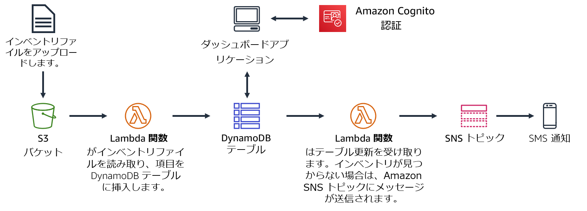
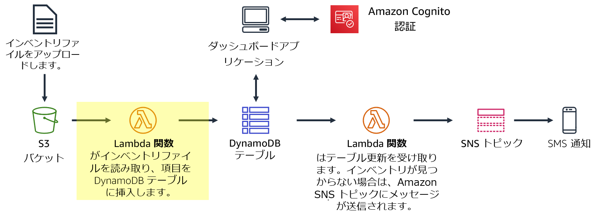
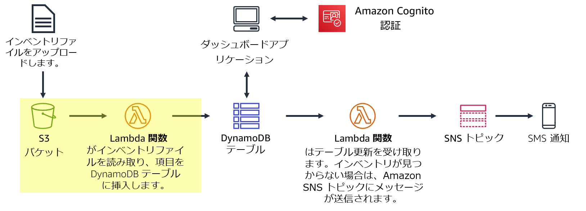
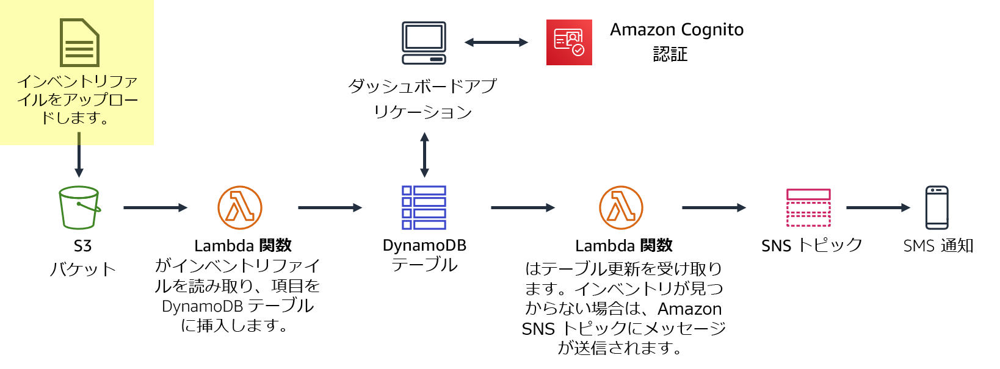
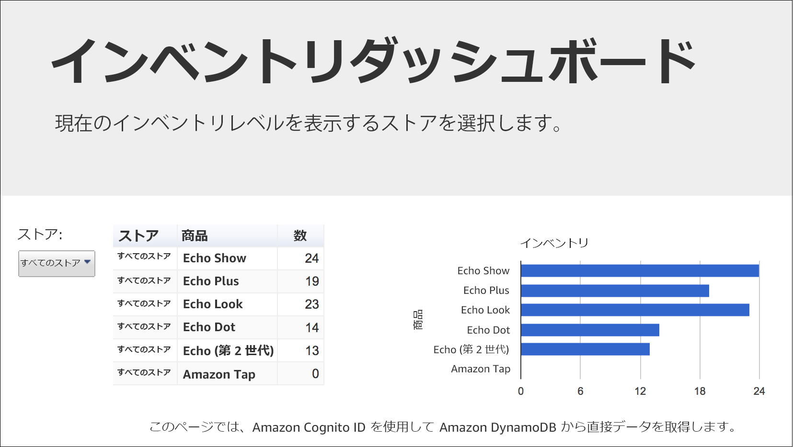
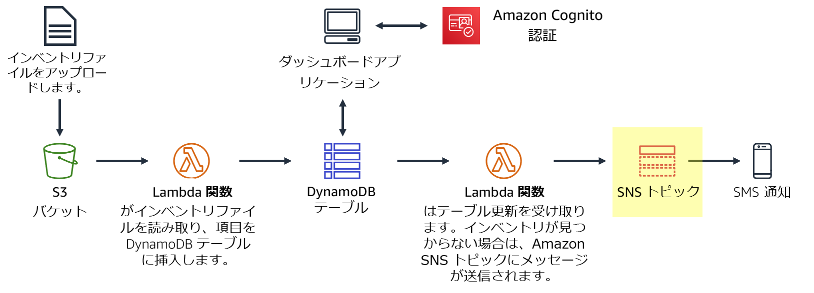
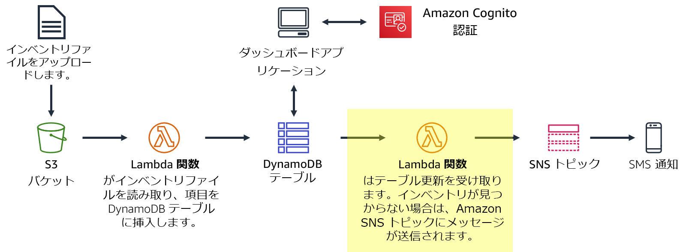

# モジュール 13 – ガイド付きラボ 2: AWS でサーバーレスアーキテクチャを実装する

[//]: # "SKU: ILT-TF-200-ACACAD-2    Source Course: ILT-TF-100-ARCHIT-6 branch dev_65"

## シナリオ

現在、在庫トラッキングシステムを作成しています。世界中の店舗がインベントリファイル（在庫ファイル）を Amazon S3 にアップロードします。チームは在庫レベルを表示し、在庫レベルが低くなると通知を送信できるようにしたいと考えています。

このラボの内容:

- **インベントリファイル**を Amazon S3 バケットに**アップロード**します
- このアップロードにより、ファイルを読み取り、項目を 1 つの **Amazon DynamoDB テーブル**に挿入する、**Lambda 関数がトリガーされます**。
- ウェブベースのサーバーレスなダッシュボードアプリケーションが、Amazon Cognito を使用して AWS の認証を行います。アプリケーションは次に、DynamoDB テーブルにアクセスして在庫レベルを表示します。
- 別の Lambda 関数が DynamoDB テーブルから更新を受け取ります。この関数は、インベントリ項目の在庫がなくなると、**SNS トピック**にメッセージを送信します。
- Amazon SNS は、**ショートメッセージサービス（SMS）または E メールを通じて**追加のインベントリを要求する通知を送信します。

<br/>

## ラボの概要

一般的に、アプリケーションはサーバー上で実行されます。これらのサーバーは、物理的なもの（またはベアメタル）です。また、物理サーバー上で動作する仮想環境である場合もあります。ただし、これらすべてのタイプのサーバーを購入してプロビジョニングし、その容量も管理する必要があります。一方、AWS Lambda では、サーバーを事前に割り当てることなくコードを実行できます。Lambda では、コードを提供してトリガーを定義するだけで済みます。Lambda 関数は、週に 1 回でも毎秒数百回でも必要なときに実行できます。使用料金は従量課金制です。

このラボでは、ファイルが Amazon Simple Storage Service (Amazon S3) にアップロードされる際に Lambda 関数をトリガーする方法について説明します。ファイルは Amazon DynamoDB テーブルにロードされます。データは、DynamoDB から直接データを取得するダッシュボードページに表示できます。このソリューションでは、**Amazon Elastic Compute Cloud (Amazon EC2) は使用しません**。これは、**使用時に自動的にスケールされるサーバーレスソリューション**です。また、使用時には**ほとんどコストがかかりません**。アイドル状態の場合、データストレージに対してのみ課金されるため、**実質的にコストがかかりません**。


このラボを完了すると、次のことができるようになります。

- AWS でサーバーレスアーキテクチャを実装する
- Amazon S3 および Amazon DynamoDB から Lambda 関数をトリガーする
- Amazon Simple Notification Service (Amazon SNS) を設定して通知を送信する


ラボの**終了時**のアーキテクチャは次の例のようになります。



<br/>

## 所要時間

このラボは、完了までにおよそ **40 分**かかります。

<br/>

## AWS サービスの制限事項

このラボ環境では、AWS のサービスとサービスアクションへのアクセスが、ラボの手順を完了するために必要なものに制限されています。他のサービスへのアクセスや、このラボで説明されているサービス以外のアクションを実行しようとすると、エラーが発生することがあります。

<br/>

## AWS マネジメントコンソールにアクセスする

1. この手順の上部にある <span id="ssb_voc_grey">Start Lab</span> をクリックし、ラボを起動します。

   [**Start Lab**] パネルが開き、ラボのステータスが表示されます。

   <i class="fas fa-info-circle"></i> **ヒント**: ラボの完了までにさらに時間が必要な場合は、<span id="ssb_voc_grey">Start Lab</span> ボタンをもう一度クリックして、この環境のタイマーを再開します。

2. \[**Start Lab**] パネルに **Lab status: ready** というメッセージが表示されたら [**X**] をクリックしてパネルを閉じます。

3. この手順の上部にある <span id="ssb_voc_grey">AWS</span> をクリックします。

   このアクションにより、新しいブラウザタブで AWS マネジメントコンソールが開き、ユーザーは自動的にログインします。

   <i class="fas fa-exclamation-triangle"></i> **ヒント**: 新しいブラウザタブが開かない場合、通常、ブラウザによってサイトのポップアップウィンドウの表示がブロックされたというメッセージが表示されたバナーまたはアイコンがブラウザの上部に表示されます。バナーまたはアイコンをクリックして [**ポップアップを許可**] をクリックしてください。

4. **AWS マネジメントコンソール**タブがこの手順と並べて表示されるようにします。両方のブラウザタブを同時に開いておくと、ラボのステップを実行しやすくなります。

   <i class="fas fa-exclamation-triangle"></i> **特に指示がない限り、リージョンを変更しないでください**。

<br/>

## タスク 1: Lambda 関数を作成してデータをロードする

このタスクでは、インベントリファイルを処理する**Lambda 関数**を作成します。Lambda 関数はファイルを読み取り、DynamoDB テーブルに情報を挿入します。



5. **AWS マネジメントコンソール**の<span id="ssb_services">サービス <i class="fas fa-angle-down"></i></span> で [**Lambda**] をクリックします。

6. <span id="ssb_lambda_orange">関数の作成</span>をクリックします。

   <i class="fas fa-info-circle"></i> **設計図**は、Amazon Alexa スキルの作成や Amazon Kinesis Data Firehose ストリームの処理など、標準の Lambda トリガー用に提供されています。このラボでは、事前に作成された Lambda 関数が提供されるため、[**一から作成**] オプションを使用します。

7. 次のように設定します。

   - **関数名**: `Load-Inventory`
   - **ランタイム:** **Python 3.7**
   - <i class="fas fa-caret-right"></i> **デフォルトの実行ロールの変更** を展開する
   - **実行ロール**: **既存のロールを使用する**
   - **既存のロール**: **Lambda-Load-Inventory-Role**

   このロールは、Lambda 関数にアクセス許可を与え、Amazon S3 および DynamoDB にアクセスできるようにします。

8. <span id="ssb_lambda_orange">関数の作成</span>をクリックします。

9. \[**関数コード**] セクションまで下にスクロールし、コードエディタですべてのコードを削除します。

10. **関数コード**エディタの左側のメニューで、**lambda-function.py**を選択して、中央のコードエリアに次のコードをコピーして貼り付けます。

```bash
# Load-Inventory Lambda function
#
# This function is triggered by an object being created in an Amazon S3 bucket.
# The file is downloaded and each line is inserted into a DynamoDB table.
import json, urllib, boto3, csv
# Connect to S3 and DynamoDB
s3 = boto3.resource('s3')
dynamodb = boto3.resource('dynamodb')
# Connect to the DynamoDB tables
inventoryTable = dynamodb.Table('Inventory');
# This handler is run every time the Lambda function is triggered
def lambda_handler(event, context):
  # Show the incoming event in the debug log
  print("Event received by Lambda function: " + json.dumps(event, indent=2))
  # Get the bucket and object key from the Event
  bucket = event['Records'][0]['s3']['bucket']['name']
  key = urllib.parse.unquote_plus(event['Records'][0]['s3']['object']['key'])
  localFilename = '/tmp/inventory.txt'
  # Download the file from S3 to the local filesystem
  try:
    s3.meta.client.download_file(bucket, key, localFilename)
  except Exception as e:
    print(e)
    print('Error getting object {} from bucket {}. Make sure they exist and your bucket is in the same region as this function.'.format(key, bucket))
    raise e
  # Read the Inventory CSV file
  with open(localFilename) as csvfile:
    reader = csv.DictReader(csvfile, delimiter=',')
    # Read each row in the file
    rowCount = 0
    for row in reader:
      rowCount += 1
      # Show the row in the debug log
      print(row['store'], row['item'], row['count'])
      try:
        # Insert Store, Item and Count into the Inventory table
        inventoryTable.put_item(
          Item={
            'Store':  row['store'],
            'Item':   row['item'],
            'Count':  int(row['count'])})
      except Exception as e:
         print(e)
         print("Unable to insert data into DynamoDB table".format(e))
    # Finished!
    return "%d counts inserted" % rowCount
```

コードを調べます。これは、次の手順を実行します。

- イベントをトリガーした Amazon S3 からファイルをダウンロードする
- ファイル内の各行をループ処理する
- DynamoDB の **Inventory** テーブルにデータを挿入する。

11. コード編集エリアの上部にある <span id="ssb_lambda_orange">Deploy</span> をクリックします。

   次に、ファイルがアップロードされたときに Lambda 関数をトリガーするように Amazon S3 を設定します。

<br/>

## タスク 2: Amazon S3 イベントを設定する

世界中の店舗では、在庫トラッキングシステムに読み込むためのインベントリファイルを提供しています。ストアでは、FTP 経由でファイルをアップロードする代わりに、Amazon S3 に直接アップロードできます。ウェブページ、スクリプト、またはプログラムの一部としてファイルをアップロードできます。ファイルが受信されると、Lambda 関数がトリガーされます。そしてこの Lambda 関数は、インベントリを DynamoDB テーブルにロードします。



このタスクでは、S3 バケットを作成し、Lambda 関数をトリガーするように設定します。

12. <span id="ssb_services">サービス <i class="fas fa-angle-down"></i></span> で [**S3**] をクリックします。

13. <span id="ssb_s3_blue"><i class="fas fa-plus"></i> バケットを作成</span>をクリックします。

   バケットには一意の名前を付ける必要があるため、バケット名には **inventory-123** などのランダムな数字を追加します。

14. \[**バケット名**] に `inventory-<number>`（number> はランダムな数字で置き換える）と入力します。

15. <span id="ssb_s3_white">バケットを作成</span>をクリックします。

   <i class="fas fa-comment"></i>「バケット名は利用できません」ということを示すエラーが表示される場合は、最初の [**編集**] リンクをクリックし、バケット名を変更して、バケット名が受け入れられるまで繰り返します。

   ここでは、ファイルがアップロードされたら Lambda 関数が自動的にトリガーされるようにバケットを設定します。

16. **inventory-<number>** バケットの名前をクリックします。

17. \[**プロパティ**] タブをクリックします。

18. \[**イベント通知**] まで下にスクロールします。

   S3 バケットにオブジェクトが作成されたときにトリガーされるようにイベントを設定します。

19. <span style="color:#00a0d2"><i class="fas fa-plus"></i> イベント通知を作成</span>をクリックして、次の設定を行います。

    - **イベント名:** `Load-Inventory`
    - **イベントタイプ:** <i class="far fa-check-square"></i> **すべてのオブジェクト作成イベント** チェックボックスをオン
    - **送信先:** **Lambda 関数**
    - **Lambda 関数**: **Load-Inventory**
    - <span id="ssb_s3_blue">変更の保存</span> をクリックします

    バケットにオブジェクトが作成されると、この設定は、前に作成した **Load-Inventory** Lambda 関数をトリガーするように Amazon S3 に指示します。

    これでバケットは、インベントリファイルを受け取る準備ができました。

<br/>

## タスク 3: ロードのプロセスをテストする

ロードのプロセスをテストする準備ができました。インベントリファイルをアップロードし、ファイルが正常にロードされたことを確認します。



20. 次のリンクのコンテキストメニューを開いて（右クリック）、インベントリファイルをダウンロードします。

    [inventory-berlin.csv](../../../scripts/inventory-berlin.csv)

    [inventory-calcutta.csv](../../../scripts/inventory-calcutta.csv)

    [inventory-karachi.csv](../../../scripts/inventory-karachi.csv)

    [inventory-pusan.csv](../../../scripts/inventory-pusan.csv)

    [inventory-shanghai.csv](../../../scripts/inventory-shanghai.csv)

    [inventory-springfield.csv](../../../scripts/inventory-springfield.csv)


これらのファイルは、システムのテストに使用できるインベントリファイルです。これらはカンマ区切り値（CSV）ファイルです。次の例は、Berlin ファイルの内容を示しています。


```plain
store,item,count
Berlin,Echo Dot,12
Berlin,Echo (2nd Gen),19
Berlin,Echo Show,18
Berlin,Echo Plus,0
Berlin,Echo Look,10
Berlin,Amazon Tap,15
```

21. コンソールで、[**オブジェクト**] タブをクリックして S3 バケットに戻ります。

22. <span id="ssb_s3_blue"><i class="fas fa-upload"></i> アップロード</span> をクリックし、CSV ファイルの 1 つをバケットにアップロードします（任意のインベントリファイルをクリックできます）。

   Amazon S3 は、Lambda 関数を自動的にトリガーし、DynamoDB テーブルにデータをロードします。

   サーバーレスダッシュボードアプリケーションが用意されており、結果を表示することができます。

23. この手順の上部にある [**Details**] ドロップダウンメニューから *[*AWS**] の右にある [**Show**] を選択します。

24. \[**Credentials**] ウィンドウで [**Dashboard**] の URL をコピーします。

25. ウェブブラウザで新しいタブを開き、URL を貼り付けて **Enter** キーを押します。

   ダッシュボードアプリケーションが開き、バケットにロードしたインベントリデータが表示されます。データは DynamoDB から取得され、アップロードによって Lambda 関数が正常にトリガーされたことが証明されます。




<i class="fas fa-exclamation-triangle"></i>ダッシュボードアプリケーションに情報が何も表示されない場合は、講師に問題の診断を依頼してください。

ダッシュボードアプリケーションは、Amazon S3 から静的ウェブページとして提供されます。ダッシュボードは、Amazon Cognito を介して**匿名ユーザー**として認証され、ダッシュボードが DynamoDB からデータを取得するための十分なアクセス許可を提供します。

DynamoDB テーブルのデータを直接表示することもできます。

26. <span id="ssb_services">サービス <i class="fas fa-angle-down"></i></span> で [**DynamoDB**] をクリックします。

27. 左のナビゲーションペインで、[**テーブル**] をクリックします。

28. **Inventory** テーブルをクリックします。

29. \[**項目**] タブをクリックします。

   インベントリファイルのデータが表示され、店舗、商品、在庫数が表示されます。

<br/>

## タスク 4: 通知を設定する

店舗で品目が在庫切れになったときに、在庫管理スタッフに通知したいとします。このサーバーレス通知機能では、**Amazon SNS** を使用します。



Amazon SNS は、柔軟でフルマネージド型のパブリッシュ/サブスクライブメッセージングおよびモバイル通知サービスであり、サブスクライブしているエンドポイントとクライアントにメッセージを配信します。Amazon SNS を使用すると、分散システムやサービス、モバイルデバイスなど、多数のサブスクライバーにメッセージを広く送信できます。

30. <span id="ssb_services">サービス <i class="fas fa-angle-down"></i></span> で [**Simple Notification Service**] をクリックします。

31. \[**トピックの作成**] ボックスの [**トピック名**] に `NoStock` と入力します。

32. <span id="ssb_orange">次のステップ</span>をクリックします

33. ページを最下部までスクロールします。

34. <span id="ssb_orange">トピックの作成</span> をクリックします。

    通知を受信するには、トピックに「サブスクライブ」する必要があります。SMS や E メールなどの方法からクリックして通知を受け取ることができます。

35. ページの中頃で <span id="ssb_orange">
サブスクリプションの作成</span> をクリックし、次の設定を行います。

    - **プロトコル:** **SMS**
    - **エンドポイント:** 国際形式で携帯電話の番号を入力します（例: **+14155550135** または **+9175550190**）。
    - <span id="ssb_orange">サブスクリプションの作成</span>をクリックします。

    <i class="fas fa-comment"></i> SMSメッセージを受信したくない場合は、代わりに** E メール**でサブスクライブできます。このラボの作業中にアクセスできるメールアドレスを入力する必要があります。メールのサブスクリプションを作成すると、確認のメールメッセージが送信されます。メッセージを開き、**Confirm subscription** リンクをクリックします。

    SNS トピックに送信されたメッセージは、SMS または E メールで転送されます。

<br/>

## タスク 5: 通知を送信する Lambda 関数を作成する

ファイルのロード中に在庫レベルを確認するために、既存の **Load-Inventory** Lambda 関数を変更できます。ただし、この構成はアーキテクチャにおける適切なプラクティスではありません。**Load-Inventory** 関数をビジネスロジックで多重定義する代わりに、DynamoDB テーブルにデータをロードしたときにトリガーされる別の Lambda 関数を作成します。この関数は、**DynamoDB ストリーム**によってトリガーされます。

このアーキテクチャのアプローチには、いくつかの利点があります。

- 各 Lambda 関数は、特定の 1 つの機能のみを実行します。このプラクティスにより、コードがよりシンプルになり、保守性が高くなります。
- 追加の Lambda 関数を作成することで、ビジネスロジックが追加されます。それぞれの関数が独立して実行されるため、既存の機能には影響しません。

このタスクでは、DynamoDB テーブルにロードされている間にインベントリを確認する別の Lambda 関数を作成します。Lambda 関数が品目の在庫切れを検知した場合、前に作成した SNS トピックを通じて通知を送信します。



36. <span id="ssb_services">サービス <i class="fas fa-angle-down"></i></span> で [**Lambda**] をクリックします。

37. <span id="ssb_lambda_orange">関数の作成</span> をクリックして次の設定を行います。

    - **関数名**: `Check-Stock`
    - **ランタイム:** **Python 3.7**
    - <i class="fas fa-caret-right"></i> **デフォルトの実行ロールの変更** を展開する
    - **実行ロール**: **既存のロールを使用する**
    - **既存のロール:** **Lambda-Check-Stock-Role**
    - <span id="ssb_lambda_orange">関数の作成</span>をクリックします。

    このロールには、Amazon SNS に通知を送信するためのアクセス許可が設定されています。

38. \[**関数コード**] セクションまで下にスクロールし、左側のメニューで **labmda-function.py** を選択肢、コードエディタのすべてのコードを削除します。

39. 次のコードをコピーして**関数コード**エディタに貼り付けます。

    ```bash
    # Stock Check Lambda function
    #
    # This function is triggered when values are inserted into the Inventory DynamoDB table.
    # Inventory counts are checked and if an item is out of stock, a notification is sent to an SNS Topic.
    import json, boto3
    # This handler is run every time the Lambda function is triggered
    def lambda_handler(event, context):
      # Show the incoming event in the debug log
      print("Event received by Lambda function: " + json.dumps(event, indent=2))
      # For each inventory item added, check if the count is zero
      for record in event['Records']:
        newImage = record['dynamodb'].get('NewImage', None)
        if newImage:      
          count = int(record['dynamodb']['NewImage']['Count']['N'])  
          if count == 0:
            store = record['dynamodb']['NewImage']['Store']['S']
            item  = record['dynamodb']['NewImage']['Item']['S']  
            # Construct message to be sent
            message = store + ' is out of stock of ' + item
            print(message)  
            # Connect to SNS
            sns = boto3.client('sns')
            alertTopic = 'NoStock'
            snsTopicArn = [t['TopicArn'] for t in sns.list_topics()['Topics']
                            if t['TopicArn'].lower().endswith(':' + alertTopic.lower())][0]  
            # Send message to SNS
            sns.publish(
              TopicArn=snsTopicArn,
              Message=message,
              Subject='Inventory Alert!',
              MessageStructure='raw'
            )
      # Finished!
      return 'Successfully processed {} records.'.format(len(event['Records']))
    ```

    コードを調べます。これは、次の手順を実行します。

    - 着信レコードをループする

    - 在庫数がゼロの場合は、**NoStock** SNS トピックにメッセージを送信する

    ここでは、DynamoDB の **Inventory** テーブルにデータが追加されたときにトリガーされるように関数を設定します。

40. ページの上部にある [**関数の概要**] セクションまでスクロールします。

41. <span id="ssb_lambda_white"><i class="fas fa-plus"></i>トリガーを追加</span>をクリックし、以下のように設定します。

    - **トリガーを選択**: **DynamoDB**
    - **DynamoDB テーブル**: **Inventory**
    - <span id="ssb_lambda_orange">追加</span> をクリックします。

42. ページ上部にある<span id="ssb_lambda_orange">保存</span> をクリックします。

    これで、システムをテストする準備ができました。

<br/>

## タスク 6: システムをテストする

次に、Amazon S3 にインベントリファイルをアップロードします。これにより、最初の **Load-Inventory** 関数がトリガーされます。この関数は DynamoDB にデータをロードし、次に新しい **Check-Stock** Lambda 関数をトリガーします。Lambda 関数が在庫ゼロの品目を検出すると、Amazon SNS にメッセージを送信します。その後、Amazon SNS は SMS または E メールで通知します。

43. <span id="ssb_services">サービス <i class="fas fa-angle-down"></i></span> で [**S3**] をクリックします。

44. **inventory-<number>** バケットの名前をクリックします。

45. \[**アップロード**] をクリックして別のインベントリファイルをアップロードします。

46. **インベントリシステムダッシュボード**に戻り、ページを <i class="fas fa-sync"></i> **更新** します。

    **Store** メニューの一覧を使用して両方の店舗の在庫を表示できるようになりました。

    また、**SMS または E メール**で、店舗に在庫切れの商品がある旨の通知を受信します（各インベントリファイルに 1 つの在庫切れの商品が含まれます）。

    <i class="fas fa-comment"></i> 通知が届かない場合は、数分待って別のインベントリファイルをアップロードしてください。DynamoDB トリガーを有効にするには、数分かかる場合があります。

47. 複数のインベントリファイルを同時にアップロードしてみてください。何が起こると思いますか?

<br/>

## 作業内容を送信する

48. この手順の上部にある <span id="ssb_blue">Submit</span> をクリックして進捗情報を記録し、プロンプトが表示されたら [**Yes**] をクリックします。


49. 数分経っても結果が表示されない場合は、この手順の上部に戻り、<span id="ssb_voc_grey">Grades</span> をクリックします。

   **ヒント**: 作業内容は何度も送信できます。作業内容を変更したら、再度 [**Submit**] をクリックします。最終送信分がこのラボの作業内容として記録されます。


50. 作業に関する詳細なフィードバックを参照するには、<span id="ssb_voc_grey">Details</span> ドロップダウンメニューから <i class="fas fa-caret-right"></i> [**View Submission Report**] を選択します。

<br/>

## ラボの終了<i class="fas fa-graduation-cap"></i>

<i class="fas fa-flag-checkered"></i>お疲れ様でした。以上でラボは終了です。

51. ラボを終了するには、このページの上部にある <span id="ssb_voc_grey">End Lab</span> をクリックし、<span id="ssb_blue">Yes</span> をクリックします。

    パネルに **DELETE has been initiated... You may close this message box now** というメッセージが表示されます。

52. 右上隅の [**X**] をクリックしてパネルを閉じます。


**©2020 Amazon Web Services, Inc. and its affiliates. All rights reserved. このトレーニング内容の全体または一部を複製または再配布することは、Amazon Web Services, Inc. の書面による事前の許可がある場合を除き、禁じられています。商業目的のコピー、貸与、または販売を禁止します。**
