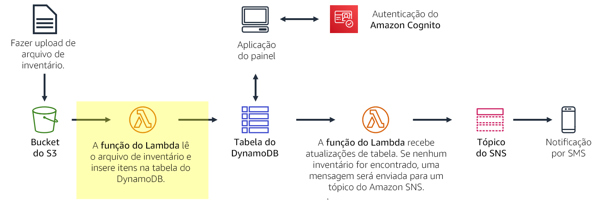
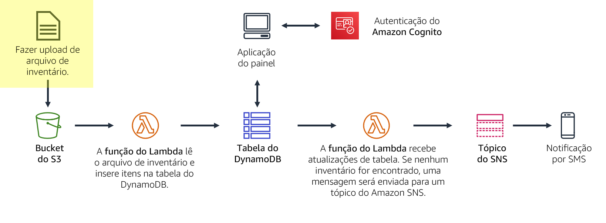
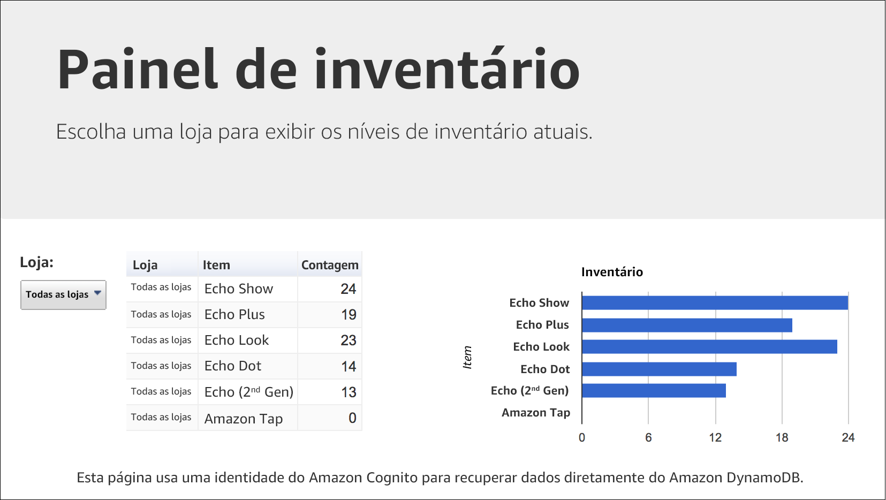
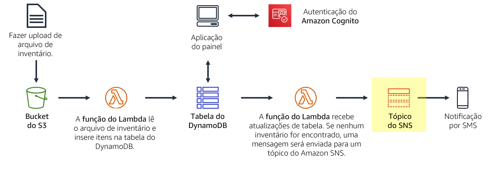

# Módulo 13 — Laboratório guiado 2: implementação de uma arquitetura sem servidor na AWS

[//]: # "SKU: ILT-TF-200-ACACAD-2    Source Course: ILT-TF-100-ARCHIT-6 branch dev_65"

## Cenário

Você está criando um sistema de rastreamento de inventário. Lojas de todo o mundo carregarão um arquivo de inventário para o Amazon S3. Sua equipe quer ser capaz de visualizar os níveis de inventário e enviar uma notificação quando os níveis de inventário são baixos.

Neste laboratório, você:

- Você fará *upload* de um *arquivo de inventário* para um bucket do Amazon S3.
- Esse upload *acionará uma função do Lambda* que lerá o arquivo e inserirá itens em uma *tabela do Amazon DynamoDB*.
- Uma aplicação de painel baseada na Web sem servidor usa o Amazon Cognito para autenticar na AWS e, em seguida, obter acesso à tabela do DynamoDB para exibir os níveis de inventário.
- Outra função do Lambda receberá atualizações da tabela do DynamoDB. Esta função enviará uma mensagem para um *tópico do SNS* quando um item de inventário estiver fora de estoque.
- O Amazon SNS *enviará uma notificação por meio do serviço de mensagens curtas (SMS) ou por e-mail* que solicite inventário adicional.

<br/>
### Visão geral do laboratório

Tradicionalmente, os aplicações são executados em servidores. Esses servidores podem ser físicos (ou bare metal). Eles também podem ser ambientes virtuais que são executados em cima de servidores físicos. No entanto, você deve comprar e provisionar todos esses tipos de servidores, e você também deve gerenciar sua capacidade. Em contraste, você pode executar seu código no AWS Lambda sem precisar pré-alocar servidores. Com o Lambda, você só precisa fornecer o código e definir um gatilho. A função Lambda pode ser executada quando for necessária, seja uma vez por semana ou centenas de vezes por segundo. Você só paga pelo que usa.

Este laboratório demonstra como acionar uma função do Lambda quando um arquivo é carregado no Amazon Simple Storage Service (Amazon S3). O arquivo será carregado em uma tabela do Amazon DynamoDB. Os dados estarão disponíveis para você visualizar em uma página do painel que recupera os dados diretamente do DynamoDB. Essa solução *não usa o Amazon Elastic Compute Cloud (Amazon EC2)*. É uma *solução sem servidor* que *escala automaticamente quando é usada*. Também incorre *pouco custo* quando está em uso. Quando está ocioso, _praticamente não há nenhum custo_ porque você só será cobrado pelo armazenamento de dados.


Depois de concluir este laboratório, você deverá ser capaz de:

- Implementar uma arquitetura sem servidor na AWS
- Acionar funções do AWS Lambda do Amazon S3 e do Amazon DynamoDB
- Configurar o Amazon Simple Notification Service (Amazon SNS) para enviar notificações


No **final** deste laboratório, sua arquitetura será semelhante ao seguinte exemplo:


<br/>
## Duração

O laboratório levará aproximadamente **40 minutos** para ser concluído.

<br/>
## Restrições de serviço da AWS

Neste ambiente de laboratório, o acesso aos serviços e ações de serviço da AWS pode estar restrito àqueles necessários para concluir as instruções do laboratório. Você poderá encontrar erros se tentar acessar outros serviços ou executar ações além do que está descrito neste laboratório.

<br/>
## Acessar o Console de Gerenciamento da AWS

1. Na parte superior destas instruções, escolha <span id="ssb_voc_grey">Start Lab</span> (Iniciar laboratório) para iniciar o laboratório.

   Um painel **Start Lab** (Iniciar laboratório) é aberto com o status do laboratório.

   <i class="fas fa-info-circle"></i> **Dica**: se você precisar de mais tempo para concluir o laboratório, escolha novamente o botão <span id="ssb_voc_grey">Start Lab</span> (Iniciar laboratório) para reiniciar o cronômetro do ambiente.

2. Aguarde até que o painel **Start Lab** (Iniciar laboratório) exiba a mensagem *Lab status: ready (Status do laboratório: pronto)* e, em seguida, escolha **X** para fechar o painel.

3. Na parte superior destas instruções, escolha <span id="ssb_voc_grey">AWS</span>.

   Essa ação abrirá o Console de Gerenciamento da AWS em uma nova guia do navegador. O sistema fará seu login automaticamente.

   <i class="fas fa-exclamation-triangle"></i> **Dica**: se uma nova guia do navegador não for aberta, normalmente você verá uma faixa ou um ícone na parte superior do navegador com uma mensagem informando que o navegador está impedindo que o site abra janelas pop-up. Escolha a faixa ou o ícone e depois **Allow pop ups** (Permitir pop-ups).

4. Organize a guia do **Console de Gerenciamento da AWS** para que ela seja exibida com essas instruções. O ideal é ver as duas guias do navegador abertas ao mesmo tempo, para facilitar o acompanhamento das etapas do laboratório.

   <i class="fas fa-exclamation-triangle"></i> **Não altere a região, a menos que seja especificamente instruído a fazer isso**.

<br/>
## Tarefa 1: criar uma função do Lambda para carregar dados

Nesta tarefa, você criará *uma função do Lambda* que processará um arquivo de inventário. A função do Lambda lerá o arquivo e inserirá informações em uma tabela do DynamoDB.



5. No **Console de Gerenciamento da AWS**, no menu <span id="ssb_services">Services (Serviços)<i class="fas fa-angle-down"></i></span>, escolha **Lambda**.

6. Escolha <span id="ssb_lambda_orange">Create function</span> (Criar função)

   <i class="fas fa-info-circle"></i> Os *esquemas* são modelos de código para escrever funções do Lambda. Os esquemas são fornecidos como triggers padrão do Lambda, como a criação de habilidades do Alexa e o processamento de streamings do Amazon Kinesis Data Firehose. Este laboratório oferece uma função pré-pronta do Lambda, então você irá **Author from scratch (Começar do zero)**.

7. Defina as seguintes configurações:

   - **Function name (Nome da função)**: `Load-Inventory`
   - **Runtime (Ambiente de execução)**: _Python 3.7_
   - Expanda <i class="fas fa-caret-right"></i> **Choose or create an execution role (Escolher ou criar uma função de execução)**.
   - **Execution role (Função de execução):** _Use an existing role (Usar uma função existente)_
   - **Existing role (Função existente)**: _Lambda-Load-Inventory-Role_

   Essa função dá à função do Lambda permissões para que ela possa acessar o Amazon S3 e o DynamoDB.

8. Escolha <span id="ssb_lambda_orange">Create function</span> (Criar função)

9. Role para baixo até a seção **Código de função** e, em seguida, no editor de código, exclua todo o código.

10. No Editor de **código de função**, copie o seguinte código:

  ```bash
  # Load-Inventory Lambda function
  #
  # This function is triggered by an object being created in an Amazon S3 bucket.
  # The file is downloaded and each line is inserted into a DynamoDB table.
  import json, urllib, boto3, csv
  # Connect to S3 and DynamoDB
  s3 = boto3.resource('s3')
  dynamodb = boto3.resource('dynamodb')
  # Connect to the DynamoDB tables
  inventoryTable = dynamodb.Table('Inventory');
  # This handler is run every time the Lambda function is triggered
  def lambda_handler(event, context):
    # Show the incoming event in the debug log
    print("Event received by Lambda function: " + json.dumps(event, indent=2))
    # Get the bucket and object key from the Event
    bucket = event['Records'][0]['s3']['bucket']['name']
    key = urllib.parse.unquote_plus(event['Records'][0]['s3']['object']['key'])
    localFilename = '/tmp/inventory.txt'
    # Download the file from S3 to the local filesystem
    try:
      s3.meta.client.download_file(bucket, key, localFilename)
    except Exception as e:
      print(e)
      print('Error getting object {} from bucket {}. Make sure they exist and your bucket is in the same region as this function.'.format(key, bucket))
      raise e
    # Read the Inventory CSV file
    with open(localFilename) as csvfile:
      reader = csv.DictReader(csvfile, delimiter=',')
      # Read each row in the file
      rowCount = 0
      for row in reader:
        rowCount += 1
        # Show the row in the debug log
        print(row['store'], row['item'], row['count'])
        try:
          # Insert Store, Item and Count into the Inventory table
          inventoryTable.put_item(
            Item={
              'Store':  row['store'],
              'Item':   row['item'],
              'Count':  int(row['count'])})
        except Exception as e:
           print(e)
           print("Unable to insert data into DynamoDB table".format(e))
      # Finished!
      return "%d counts inserted" % rowCount
  ```

Examine o código. Ele executa as seguintes etapas:

- Fazer download do arquivo do Amazon S3 que acionou o evento
- Executar loop em cada linha no arquivo.
- Insira os dados na tabela *Inventory (Inventário)* do DynamoDB.

11. Na parte superior da página, escolha <span id="ssb_lambda_orange">Save</span> (Salvar).

   Em seguida, você vai configurar o Amazon S3 para acionar a função do Lambda quando um arquivo for carregado.

<br/>
## Tarefa 2: configurar um evento do Amazon S3

Lojas de todo o mundo fornecem arquivos de inventário para carregar no sistema de rastreamento de inventário. Em vez de fazer upload de seus arquivos via FTP, as lojas podem enviá-los diretamente para o Amazon S3. Eles podem fazer upload dos arquivos através de uma página da Web, um script ou como parte de um programa. Quando um arquivo é recebido, ele aciona a função do Lambda. Essa função do Lambda carregará o inventário em uma tabela do DynamoDB.


Nesta tarefa, você cria um bucket do Amazon S3 e o configura para acionar a função do Lambda.

12. No menu <span id="ssb_services">Services (Serviços)<i class="fas fa-angle-down"></i></span>, escolha **S3**.

13. Escolha <span id="ssb_s3_blue"><i class="fas fa-plus"></i>Create bucket</span> (Criar bucket)

   Cada bucket deve ter um nome exclusivo, então você adicionará um número aleatório ao nome do bucket. Por exemplo: *inventory-123*

14. Para **Bucket name** (Nome do bucket), digite: `inventory-<número>` (Substitua _<number>_ por um número aleatório)

15. Escolha <span id="ssb_s3_white">Create bucket</span> (Criar Bucket)

   <i class="fas fa-comment"></i> Você pode receber um erro que indica: *O nome do bucket solicitado não está disponível*. Se você receber esse erro, escolha o primeiro link **Editar**, altere o nome do bucket e tente novamente até que o nome do bucket seja aceito.

   Agora, configure o bucket para acionar automaticamente a função do Lambda sempre que um arquivo for enviado por upload.

16. Escolha o nome do bucket do seu _inventory-<number>_.

17. Escolha a guia **Properties** (Propriedades).

18. Role para baixo até **Advanced settings (Configurações avançadas)** e clique em **Events** (Eventos).

    Você vai configurar um evento para ser acionado quando um objeto for criado no bucket do S3.

19. Clique em <span style="color:#00a0d2"><i class="fas fa-plus"></i> Adicionar notificação</span> e configure estes ajustes:

   - **Name** (Nome): `Load-Inventory`
   - **Events** (Eventos): <i class="far fa-check-square"></i> _Todos os eventos de criação de objetos_
   - **Send to** (Enviar para): _Lambda Function (Função do Lambda)_
   - **Lambda:** _Load-Inventory_
   - Escolha <span id="ssb_s3_blue">Save</span> (Salvar)

   Quando um objeto é criado no bucket, essa configuração informa o Amazon S3 para acionar a função _Load-Inventory_ Lambda criada anteriormente.

   Seu bucket agora está pronto para receber arquivos de inventário.

<br/>
## Tarefa 3: testar o processo de carregamento

Agora você está pronto para testar o processo de carregamento. Você enviará um arquivo de inventário e, em seguida, verifique se ele foi carregado com sucesso.



20. Faça download dos arquivos de inventário abrindo o menu de contexto (clique com o botão direito do mouse) para estes links:

    [inventory-berlin.csv](../../../scripts/inventory-berlin.csv)

    [inventory-calcutta.csv](../../../scripts/inventory-calcutta.csv)

    [inventory-karachi.csv](../../../scripts/inventory-karachi.csv)

    [inventory-pusan.csv](../../../scripts/inventory-pusan.csv)

    [inventory-shanghai.csv](../../../scripts/inventory-shanghai.csv)

    [inventory-springfield.csv](../../../scripts/inventory-springfield.csv)


Esses arquivos são os arquivos de inventário que você pode usar para testar o sistema. Eles são arquivos de valores separados por vírgulas (CSV). O exemplo a seguir mostra o conteúdo do arquivo de Berlim:


   ```plain
     store,item,count
     Berlin,Echo Dot,12
     Berlin,Echo (2nd Gen),19
     Berlin,Echo Show,18
     Berlin,Echo Plus,0
     Berlin,Echo Look,10
     Berlin,Amazon Tap,15
   ```

21. No console, volte ao bucket do S3 escolhendo a guia **Overview (Visão geral)**.

22. Escolha <span id="ssb_s3_blue"><i class="fas fa-upload"></i>Fazer upload</span> e fazer upload de um dos arquivos CSV para o bucket. (Você pode escolher qualquer arquivo de inventário.)

   O Amazon S3 acionará automaticamente a função do Lambda, que carregará os dados em uma tabela do DynamoDB.

   Uma aplicação de painel sem servidor foi fornecida para que você visualize os resultados.

23. Na parte superior dessas instruções, escolha o botão **Details** (Detalhes) e, à direita da **AWS**, escolha o botão **Show** (Mostrar).

24. Na janela **Credentials** (Credenciais), copie o URL do **Dashboard** (Painel).

25. Abra uma nova guia do navegador da Web, cole o URL copiado e pressione ENTER.

   O aplicação do painel abrirá e exibirá os dados de inventário que você carregou no bucket. Os dados são recuperados do DynamoDB, o que prova que o upload acionou com êxito a função Lambda.




<i class="fas fa-exclamation-triangle"></i> Se o aplicação do painel não exibir nenhuma informação, peça ao instrutor para ajudá-lo a diagnosticar o problema.

O aplicação de painel é servido como uma página da Web estática do Amazon S3. O painel é autenticado por meio do Amazon Cognito como um _usuário anônimo_, que fornece permissões suficientes para que o painel recupere dados do DynamoDB.

Você também pode visualizar os dados diretamente na tabela do DynamoDB.

26. No menu <span id="ssb_services">Services (Serviços)<i class="fas fa-angle-down"></i></span>, escolha **DynamoDB**.

27. No painel de navegação à esquerda, selecione **Tables** (Tabelas).

28. Escolha a tabela **Inventory** (Inventário).

29. Selecione a guia **Items** (Itens).

   Os dados do arquivo de inventário serão exibidos. Ele mostra a contagem de loja, item e inventário.

<br/>
## Tarefa 4: configurar notificações

Você deseja notificar a equipe de gerenciamento de inventário quando uma loja ficar sem estoque para um item. Para esta funcionalidade de notificação sem servidor, você usará o **Amazon SNS**.



O Amazon SNS é um serviço flexível e totalmente gerenciado de mensagens de publicação/assinatura e notificações móveis. Ele entrega mensagens aos endpoints e clientes de inscrição. Com o Amazon SNS, você pode distribuir mensagens para um grande número de assinantes, incluindo sistemas e serviços distribuídos e dispositivos móveis.

30. No menu <span id="ssb_services">Services (Serviços)<i class="fas fa-angle-down"></i></span>, escolha **Simple Notification Service** (Serviço simples de notificação).

31. Na caixa **Create topic** (Criar tópico), para **Topic name** (Nome do tópico), digite `NoStock`

32. Escolha <span id="ssb_orange">Next step</span> (Próxima etapa)

33. Role até a parte inferior da página.

34. Escolha <span id="ssb_orange">Create topic</span> (Criar tópico)

    Para receber notificações, você deve se inscrever* no tópico. Você pode optar por receber notificações através de vários métodos, como SMS e e-mail. 

35. Na metade inferior da página, escolha <span id="ssb_orange">Criar assinatura</span> e defina estas configurações:

- **Protocol** (Protocolo): _SMS_
- **Endpoint:** insira seu número de telefone celular no formato internacional (por exemplo, _+14155550135_ ou _+9175550190_)
- Escolha <span id="ssb_orange">Create subscription</span> (Criar assinatura)

<i class="fas fa-comment"></i> Se você não quiser receber uma mensagem SMS, você pode se inscrever por *e-mail*. Você deve fornecer um endereço de e-mail que você pode acessar enquanto trabalha neste laboratório. Depois de criar uma assinatura de e-mail, você receberá uma mensagem de e-mail de confirmação. Abra a mensagem e escolha o link _Confirmar assinatura_.

    Qualquer mensagem enviada para o tópico do SNS será encaminhada para você por SMS ou e-mail.

<br/>
## Tarefa 5: criar uma função do Lambda para enviar notificações

Você pode modificar a função _Load-Inventory_ Lambda existente para verificar os níveis de inventário enquanto o arquivo está sendo carregado. No entanto, esta configuração não é uma boa prática arquitetônica. Em vez de sobrecarregar a função _Load-Inventory_ com a lógica de negócios, você criará outra função do Lambda que é acionada quando os dados são carregados na tabela do DynamoDB. Essa função será acionada por um _stream do DynamoDB_.

Esta abordagem arquitetônica oferece vários benefícios:

- Cada função do Lambda executa uma única função específica. Essa prática torna o código mais simples e mais sustentável.
- A lógica de negócios adicional pode ser adicionada criando funções adicionais do Lambda. Cada função opera de forma independente, de modo que a funcionalidade existente não é afetada.

Nesta tarefa, você criará outra função do Lambda que examina o inventário enquanto ele é carregado na tabela do DynamoDB. Se a função do Lambda perceber que um item está fora de estoque, ele enviará uma notificação por meio do tópico SNS que você criou anteriormente.


36. No menu <span id="ssb_services">Services<i class="fas fa-angle-down"></i></span>  (Serviços), escolha **Lambda**.

37. Escolha <span id="ssb_lambda_orange">Create function</span> e configure estes ajustes:

- **Nome da função:** `Check-Stock`
- **Runtime** (Ambiente de execução): _Python 3.7_
- Expanda <i class="fas fa-caret-right"></i> **Choose or create an execution role** (Escolher ou criar uma função de execução).
- **Execution role** (Função de execução): _Use an existing role (Usar uma função existente)_
- **Existing role** (Função existente): _Lambda-Check-Stock-Role_
- Escolha <span id="ssb_lambda_orange">Create function</span> (Criar função)

    Essa função foi configurada com permissões para enviar uma notificação ao Amazon SNS.

38. Role para baixo até a seção **Function code** (Código de função) e, em seguida, no editor de código, exclua todo o código.

39. Copie o código a seguir e, no editor **Function code** (Código de função), cole o código copiado:

    ```bash
    # Stock Check Lambda function
    #
    # This function is triggered when values are inserted into the Inventory DynamoDB table.
    # Inventory counts are checked and if an item is out of stock, a notification is sent to an SNS Topic.
import json, boto3
    # This handler is run every time the Lambda function is triggered
def lambda_handler(event, context):
      # Show the incoming event in the debug log
      print("Event received by Lambda function: " + json.dumps(event, indent=2))
      # For each inventory item added, check if the count is zero
      for record in event['Records']:
        newImage = record['dynamodb'].get('NewImage', None)
        if newImage:      
          count = int(record['dynamodb']['NewImage']['Count']['N'])  
          if count == 0:
            store = record['dynamodb']['NewImage']['Store']['S']
            item  = record['dynamodb']['NewImage']['Item']['S']  
            # Construct message to be sent
            message = store + ' is out of stock of ' + item
            print(message)  
            # Connect to SNS
            sns = boto3.client('sns')
            alertTopic = 'NoStock'
            snsTopicArn = [t['TopicArn'] for t in sns.list_topics()['Topics']
                            if t['TopicArn'].lower().endswith(':' + alertTopic.lower())][0]  
            # Send message to SNS
            sns.publish(
              TopicArn=snsTopicArn,
              Message=message,
              Subject='Inventory Alert!',
              MessageStructure='raw'
            )
      # Finished!
      return 'Successfully processed {} records.'.format(len(event['Records']))
    ```

    Examine o código. Ele executa as seguintes etapas:
    
    - Loop nos registros recebidos
    
    - Se a contagem de inventário for zero, enviar uma mensagem para o tópico do SNS _NoStock_
    
    Agora você configurará a função para que ela seja acionada quando os dados forem adicionados à tabela _Inventory_ no DynamoDB.

40. Role até a seção **Designer** na parte superior da página.

41. Escolha <span id="ssb_lambda_white"><i class="fas fa-plus"></i>Add trigger</span> (Adicionar trigger) e defina estas configurações:

   - **Select a trigger** (Selecionar um trigger): _DynamoDB_
   - **DynamoDB Table** (Tabela do DynamoDB): _Inventory (Inventário)_
   - Escolha <span id="ssb_lambda_orange">Add</span> (Adicionar).

42. Na parte superior da página, escolha <span id="ssb_lambda_orange">Save</span> (Salvar).

   Agora, você está pronto para testar o sistema.

<br/>

## Tarefa 6: testando o sistema

Agora você fará o upload de um arquivo de inventário para o Amazon S3, que acionará a função _Load-Inventory_ original. Essa função carregará dados no DynamoDB, que acionará a nova função _Check-Stock_ Lambda. Se a função do Lambda detectar um item com inventário zero, ela enviará uma mensagem para o Amazon SNS. Em seguida, o Amazon SNS notificará você por SMS ou e-mail.

43. No menu <span id="ssb_services">Services (Serviços)<i class="fas fa-angle-down"></i></span>, escolha **S3**.

44. Escolha o nome do bucket do seu _inventory-<number>_.

45. Escolha **Carregar e fazer** upload de um arquivo de inventário diferente.

46. Retorne ao **Painel do Sistema de Inventário** e atualize <i class="fas fa-sync"></i> a página.

   Agora você deve ser capaz de usar o menu suspenso **Store** (Armazenamento) para visualizar o inventário de ambas as lojas.

   Além disso, você deve receber uma *notificação por SMS ou e-mail* de que a loja tem um item fora de estoque (cada arquivo de inventário tem um item que está fora de estoque).

   <i class="fas fa-comment"></i> Se você não recebeu uma notificação, aguarde alguns minutos e carregue um arquivo de inventário diferente. Às vezes, o acionador do DynamoDB pode levar alguns minutos para habilitar.

47. Tente fazer upload de vários arquivos de inventário ao mesmo tempo. O que você acha que vai acontecer?

<br/>
## Enviar o trabalho

48. Na parte superior destas instruções, escolha <span id="ssb_blue">Submit</span> (Enviar) para gravar seu progresso e, quando solicitado, escolha **Yes** (Sim).

49. Se os resultados não forem exibidos após alguns minutos, volte ao topo destas instruções e escolha <span id="ssb_voc_grey">Grades</span> (Notas).

   **Dica**: você pode enviar seu trabalho várias vezes. Depois de alterar o trabalho, escolha **Submit** (Enviar) novamente. Seu último envio é o que será gravado para este laboratório.

50. Para ver o feedback detalhado do seu trabalho, escolha <span id="ssb_voc_grey">Details</span> (Detalhes) e depois <i class="fas fa-caret-right"></i> **View Submission Report** (Visualizar relatório de envio).

<br/>

## Laboratório concluído <i class="fas fa-graduation-cap"></i>

<i class="fas fa-flag-checkered"></i> Parabéns! Você concluiu o laboratório.

51. Escolha <span id="ssb_voc_grey">End Lab</span> (Encerrar laboratório) na parte superior desta página e, em seguida, selecione <span id="ssb_blue">Yes</span> (Sim) para confirmar que você deseja encerrar o laboratório.

   Um painel indica que *DELETE has been initiated... You may close this message box now (A EXCLUSÃO foi iniciada... Você pode fechar esta caixa de mensagem agora)*.

52. Escolha o **X** no canto superior direito para fechar o painel.


*©2020, Amazon Web Services, Inc. e suas afiliadas. Todos os direitos reservados. Este trabalho não pode ser reproduzido ou redistribuído, no todo ou em parte, sem permissão prévia por escrito da Amazon Web Services, Inc. É proibido copiar, emprestar ou vender para fins comerciais.*
