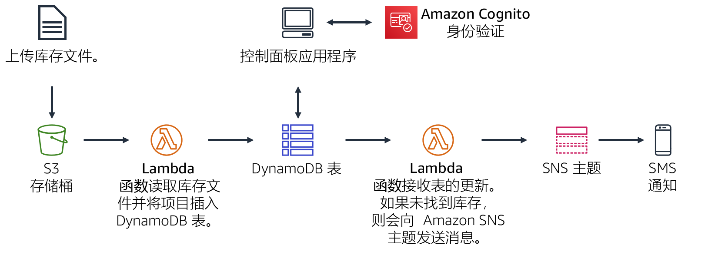
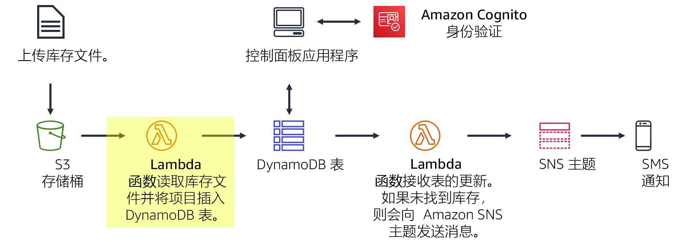
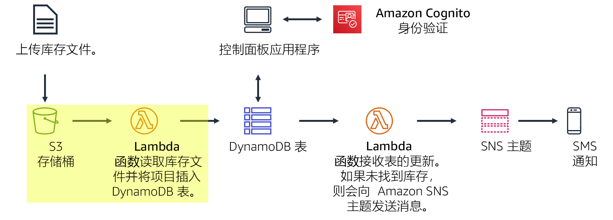
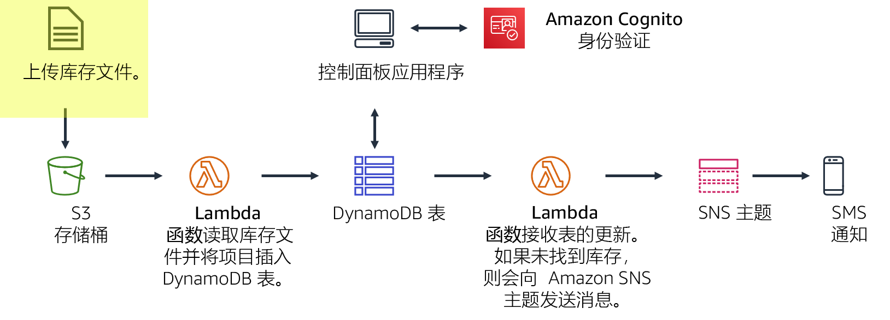
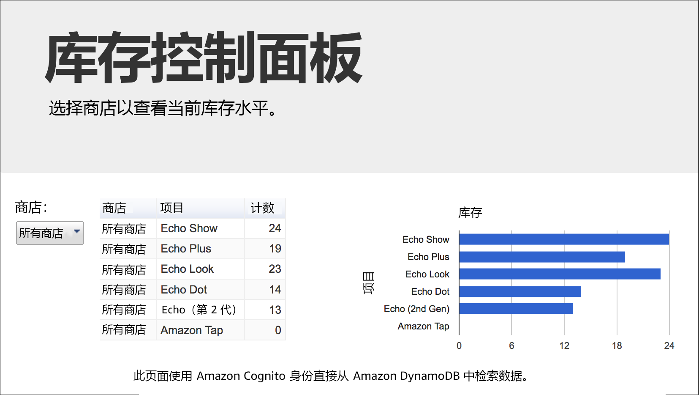
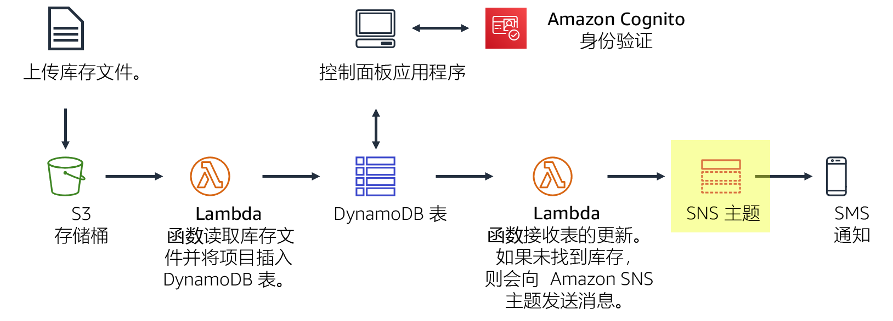
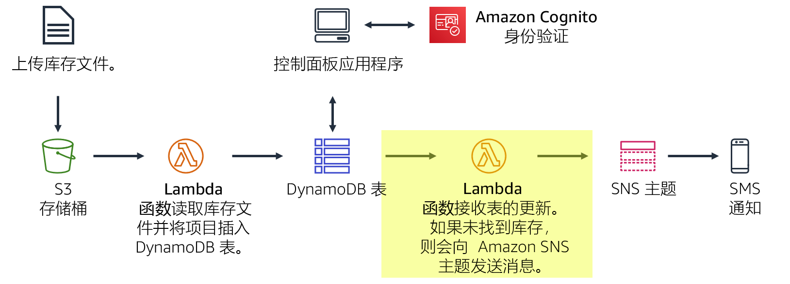

# 模块 13 – 指导实验 2：在 AWS 上实施无服务器架构

[//]: # "SKU: ILT-TF-200-ACACAD-2    Source Course: ILT-TF-100-ARCHIT-6 branch dev_65"

## 场景

您正在创建库存跟踪系统。世界各地的店铺将向 Amazon S3 上传库存文件。您的团队希望能够查看库存水平，并在库存量不足时发送通知。

在本实验中，您将：

- 您将*库存文件上传*到 Amazon S3 存储桶。
- 此上传将*触发一个 Lambda 函数*，该函数将读取文件并将项目插入到一个 *Amazon DynamoDB 表*中。
- 一个无服务器、基于 Web 的控制面板应用程序将使用 Amazon Cognito 向 AWS 进行身份验证。然后此应用程序将获得对 DynamoDB 表的访问权限以显示库存水平。
- 另一个 Lambda 函数将从 DynamoDB 表接收更新。此函数将在库存项目出现缺货时，向 *SNS 主题*发送消息。
- 然后，Amazon SNS 将*通过短信服务 (SMS) 或电子邮件向您发送通知*，请求更多库存。

<br/>
## 实验概览

传统上，应用程序运行在服务器上。这些服务器可以是物理服务器（或裸机）。它们也可以是在物理服务器上运行的虚拟环境。但是，您必须购买和预置所有这些类型的服务器，还必须管理它们的容量。相比之下，您可以在 AWS Lambda 上运行代码，而无需预先分配服务器。使用 Lambda，您只需提供代码并定义触发器。Lambda 函数可以在需要时运行，无论是每周一次还是每秒数百次。您只需为使用量付费即可。

此实验演示在将文件上传到 Amazon Simple Storage Service (Amazon S3) 时如何触发 Lambda 函数。此文件将加载到一个 Amazon DynamoDB 表中。您可以在控制面板页面上查看表中的数据，控制面板可以直接从 DynamoDB 检索数据。此解决方案*不使用 Amazon Elastic Compute Cloud (Amazon EC2)*。它是一个*无服务器解决方案*，*在使用时可以自动扩展*。使用此解决方案产生的*费用很少*。此解决方案处于闲置状态时，几乎_没有任何费用_，因为您只需为数据存储付费。


完成本实验后，您应能够：

- 在 AWS 上实施无服务器架构
- 从 Amazon S3 和 Amazon DynamoDB 触发 Lambda 函数
- 配置 Amazon Simple Notification Service (Amazon SNS) 以发送通知


在本实验**结束**时，您的架构将如下例所示：



<br/>
## 持续时间

完成本实验大约需要 **40 分钟**。

<br/>
## AWS 服务限制

在本实验环境中，对 AWS 服务和服务操作的访问可能仅限于完成实验说明所需的服务和服务操作。如果您尝试访问其他服务或执行本实验中所述之外的操作，可能会遇到错误。

<br/>
## 访问 AWS 管理控制台

1. 在这些说明的顶部，选择 <span id="ssb_voc_grey">Start Lab</span>（启动实验）即可启动您的实验。

   **Start Lab**（启动实验）面板随即会打开，其中显示了实验状态。

   <i class="fas fa-info-circle"></i> **提示**：如果您需要更多时间来完成实验，请再次选择 <span id="ssb_voc_grey">Start Lab</span>（启动实验）按钮，重新启动环境计时器。

2. 请耐心等待，直到 **Start Lab**（启动实验）面板显示消息 *Lab status: ready*（实验状态：就绪），然后选择 **X** 关闭此面板。

3. 在这些说明的顶部，选择 <span id="ssb_voc_grey">AWS</span>。

   此操作将在一个新的浏览器选项卡中打开 AWS 管理控制台。您将自动登录系统。

   <i class="fas fa-exclamation-triangle"></i> **提示**：如果未打开新的浏览器选项卡，您的浏览器顶部通常会出现一个横幅或图标，并显示一条消息，指明您的浏览器阻止该了网站打开弹出窗口。请选择横幅或图标，然后选择 **Allow pop-ups**（允许弹出窗口）。

4. 排列 **AWS 管理控制台**选项卡，使其与这些说明一起显示。理想情况下，您将同时打开两个浏览器选项卡，以便能够更轻松地执行实验步骤。

   <i class="fas fa-exclamation-triangle"></i> **除非特别要求，否则请勿更改区域**。

<br/>
## 任务 1：创建 Lambda 函数以加载数据

在此任务中，您将创建一个处理库存文件的 *Lambda 函数*。该 Lambda 函数将读取此文件并将信息插入 DynamoDB 表中。



5. 在 **AWS 管理控制台**的 <span id="ssb_services">Services <i class="fas fa-angle-down"></i></span>（服务）菜单中，选择 **Lambda**。

6. 选择 <span id="ssb_lambda_orange">Create function</span>（创建函数）

   <i class="fas fa-info-circle"></i> *蓝图*是用于编写 Lambda 函数的代码模板。系统会为标准 Lambda 触发器（例如，创建 Amazon Alexa 技能和处理 Amazon Kinesis Data Firehose 流）提供蓝图。本实验为您提供了一个预编写好的 Lambda 函数，因此您将使用 **Author from scratch**（从头开始创作）选项。

7. 配置以下设置：

   - **Function name**（函数名称）：`Load-Inventory`
   - **Runtime**（运行时）：_Python 3.7_
   - 展开 <i class="fas fa-caret-right"></i> **Change default execution role**（更改默认执行角色）。
   - **Execution role**（执行角色）：_Use an existing role_（使用现有角色）
   - **Existing role**（现有角色）：_Lambda-Load-Inventory-Role_

   此角色可以向该 Lambda 函数提供权限，以便它可以访问 Amazon S3 和 DynamoDB。

8. 选择 <span id="ssb_lambda_orange">Create function</span>（创建函数）

9. 向下滚动至 **Code source**（代码源）部分，然后在代码编辑器中，删除所有代码。

10. 在 **Code source**（代码源）编辑器中，复制以下代码：

```bash
  # Load-Inventory Lambda function
  #
  # This function is triggered by an object being created in an Amazon S3 bucket.
  # The file is downloaded and each line is inserted into a DynamoDB table.
  import json, urllib, boto3, csv
  # Connect to S3 and DynamoDB
  s3 = boto3.resource('s3')
  dynamodb = boto3.resource('dynamodb')
  # Connect to the DynamoDB tables
  inventoryTable = dynamodb.Table('Inventory');
  # This handler is run every time the Lambda function is triggered
  def lambda_handler(event, context):
    # Show the incoming event in the debug log
    print("Event received by Lambda function: " + json.dumps(event, indent=2))
    # Get the bucket and object key from the Event
    bucket = event['Records'][0]['s3']['bucket']['name']
    key = urllib.parse.unquote_plus(event['Records'][0]['s3']['object']['key'])
    localFilename = '/tmp/inventory.txt'
    # Download the file from S3 to the local filesystem
    try:
      s3.meta.client.download_file(bucket, key, localFilename)
    except Exception as e:
      print(e)
      print('Error getting object {} from bucket {}. Make sure they exist and your bucket is in the same region as this function.'.format(key, bucket))
      raise e
    # Read the Inventory CSV file
    with open(localFilename) as csvfile:
      reader = csv.DictReader(csvfile, delimiter=',')
      # Read each row in the file
      rowCount = 0
      for row in reader:
        rowCount += 1
        # Show the row in the debug log
        print(row['store'], row['item'], row['count'])
        try:
          # Insert Store, Item and Count into the Inventory table
          inventoryTable.put_item(
            Item={
              'Store':  row['store'],
              'Item':   row['item'],
              'Count':  int(row['count'])})
        except Exception as e:
           print(e)
           print("Unable to insert data into DynamoDB table".format(e))
      # Finished!
      return "%d counts inserted" % rowCount
  ```

检查代码。它将执行以下步骤：

- 从 Amazon S3 下载触发事件的文件
- 遍历文件中的每一行
- 将数据插入到 DynamoDB *Inventory*（库存）表中

11. 在页面顶部，选择 <span id="ssb_lambda_orange">File > Save</span>（文件 > 保存），然后选择 Deploy（部署）

   接下来，您要配置 Amazon S3 以在上传文件时触发该 Lambda 函数。

<br/>
## 任务 2：配置 Amazon S3 事件

世界各地的商店提供库存文件以加载到库存跟踪系统中。商店可以直接将文件上传到 Amazon S3，而不是通过 FTP 上传文件。他们可以通过网页、脚本或程序的一部分上传文件。收到文件后，它会触发 Lambda 函数。然后，此 Lambda 函数会将库存加载到 DynamoDB 表中。



在此任务中，您将创建一个 S3 存储桶，并将其配置为触发 Lambda 函数。

12. 在 <span id="ssb_services">Services <i class="fas fa-angle-down"></i></span>（服务）菜单上，选择 **S3**。

13. 选择 <span id="ssb_s3_blue"><i class="fas fa-plus"></i> Create bucket</span>（创建存储桶）

   每个存储桶都必须具有一个独一无二的名称，因此您可以为存储桶名称添加一个随机编号。例如，*inventory-123*

14. 对于 **Bucket name**（存储桶名称），请输入：`inventory-<number>`（将 _<number>_ 替换为一个随机数字）

15. 选择 <span id="ssb_s3_white">Create bucket</span>（创建存储桶）

   <i class="fas fa-comment"></i> 您可能会收到以下错误：*请求的存储桶名称不可用*。如果您收到此错误，请选择第一个 **Edit**（编辑）链接，更改存储桶名称，然后重试，直到存储桶名称被接受为止。

   现在，您将配置存储桶，以在上传文件时自动触发 Lambda 函数。

16. 选择您的 _inventory-<number>_ 存储桶的名称。

17. 选择 **Properties**（属性）选项卡。

18. 向下滚动至 **Event notifications**（事件通知）****。

   您将配置一个事件，以在 S3 存储桶中创建对象时触发该事件。

19. 单击 <span style="color:#00a0d2"><i class="fas fa-plus"></i> Create event notification</span>（创建事件通知），然后配置以下设置：

   - **Event Name**（事件名称）：`Load-Inventory`
   - **Event types**（事件类型）：<i class="far fa-check-square"></i> _All object create events_（所有对象创建事件）
   - **Destination**（目标）：_Lambda Function_（Lambda 函数）
   - **Lambda function**（Lambda 函数）：_Load-Inventory_
   - 选择 <span id="ssb_s3_blue">Save</span>（保存更改）

   在存储桶中创建对象时，此配置将告诉 Amazon S3 触发您之前创建的 _Load-Inventory_ Lambda 函数。

   您的存储桶现在已经准备好接收库存文件了！

<br/>
## 任务 3：测试加载过程

您现在已经准备就绪，可以测试加载过程。您将上传一个库存文件，然后检查它是否成功加载。



20. 通过打开以下链接的上下文（右键单击）菜单下载库存文件：

    [inventory-berlin.csv](../../../scripts/inventory-berlin.csv)
    
    [inventory-calcutta.csv](../../../scripts/inventory-calcutta.csv)
    
    [inventory-karachi.csv](../../../scripts/inventory-karachi.csv)
    
    [inventory-pusan.csv](../../../scripts/inventory-pusan.csv)
    
    [inventory-shanghai.csv](../../../scripts/inventory-shanghai.csv)
    
    [inventory-springfield.csv](../../../scripts/inventory-springfield.csv)


这些文件是您可以用来测试系统的库存文件。它们是逗号分隔值 (CSV) 文件。以下示例显示了 Berlin 文件的内容：


```plain
     store,item,count
     Berlin,Echo Dot,12
     Berlin,Echo (2nd Gen),19
     Berlin,Echo Show,18
     Berlin,Echo Plus,0
     Berlin,Echo Look,10
     Berlin,Amazon Tap,15
   ```

21. 在控制台中，通过选择 **Objects**（对象）选项卡返回 S3 存储桶。

22. 选择 <span id="ssb_s3_blue"><i class="fas fa-upload"></i> Upload</span>（上传），然后将其中一个 CSV 文件上传到存储桶。（您可以选择任何库存文件。）

   Amazon S3 将自动触发 Lambda 函数，该函数会将数据加载到 DynamoDB 表中。

   我们已为您提供一个无服务器控制面板应用程序，您可以用它查看结果。

23. 在这些说明的顶部，选择 **Details**（详细信息）按钮，然后在 **AWS** 右侧选择 **Show**（显示）按钮。

24. 从 **Credentials**（凭证）窗口，复制 **Dashboard**（控制面板）URL。

25. 打开一个新的 Web 浏览器标签页，粘贴该 URL，并按 ENTER 键。

   将打开控制面板应用程序，并显示您加载到存储桶中的库存数据。数据是从 DynamoDB 检索的，这证明上传成功地触发了 Lambda 函数。




<i class="fas fa-exclamation-triangle"></i> 如果控制面板应用程序未显示任何信息，请讲师帮助您诊断问题。

此控制面板应用程序作为 Amazon S3 中的一个静态网页提供。此控制面板以 _anonymous user_（匿名用户）的身份通过 Amazon Cognito 进行身份验证，这为控制面板提供了足够的权限，可以从 DynamoDB 检索数据。

您还可以直接在 DynamoDB 表中查看数据。

26. 在 <span id="ssb_services">Services <i class="fas fa-angle-down"></i></span>（服务）菜单上，选择 **DynamoDB**。

27. 在左侧导航窗格中，选择 **Tables**（表）。

28. 选择 **Inventory**（库存）表。

29. 选择 **Items**（项目）选项卡。

   系统将显示库存文件中的数据，包括 Store（店铺）、Item（项目）和 Inventory Count（库存盘点）。

<br/>
## 任务 4：配置通知

您希望在商店缺货时通知库存管理人员。对于此无服务器通知功能，您将使用 **Amazon SNS**。



Amazon SNS 是一项灵活且完全托管的发布/订阅消息收发和移动通知服务。它将消息传送到订阅终端节点和客户端。借助 Amazon SNS，您可以将消息群发给大量订户，包括分布式系统和服务以及移动设备。

30. 在 <span id="ssb_services">Services <i class="fas fa-angle-down"></i></span>（服务）菜单中，选择 **Simple Notification Service**。

31. 在 **Create topic**（创建主题）框中，为 **Topic name**（主题名称）输入 `NoStock`

32. 选择 <span id="ssb_orange">Next step</span>（下一步）

33. 滚动到页面底部。

34. 选择 <span id="ssb_orange">Create topic</span>（创建主题）

    要接收通知，您必须*订阅*主题。您可以选择通过短信和电子邮件等多种方式接收通知。

35. 在页面下半部分中，选择 <span id="ssb_orange">Create subscription</span>（创建订阅），然后配置以下设置：

- **Protocol**（协议）：_SMS_
- **Endpoint**（终端节点）：以国际格式输入您的手机号码（例如 _+14155550135_ 或 _+9175550190_）
- 选择 <span id="ssb_orange">Create subscription</span>（创建订阅）

<i class="fas fa-comment"></i> 如果您不想接收短信，可以改为通过*电子邮件*订阅。您必须提供一个在进行本实验时可以访问的电子邮件地址。创建电子邮件订阅后，您将收到一封确认电子邮件。请打开此邮件，然后选择 _Confirm subscription_（确认订阅）链接。

    任何发送到 SNS 主题的消息都将通过短信或电子邮件转发给您。

<br/>
## 任务 5：创建 Lambda 函数以发送通知

您可以修改现有 _Load-Inventory_ Lambda 函数，以便在加载文件时检查库存水平。但是，此配置不是一种很好的架构做法。您将创建另一个在数据加载到 DynamoDB 表中时触发的 Lambda 函数，而不是使用业务逻辑过载 _Load-Inventory_ 函数。此函数将由 _DynamoDB 流_触发。

此架构方法具有多种优势：

- 每个 Lambda 函数都执行一项特定的功能。这种做法使代码变得更简单、更易于维护。
- 可以通过创建更多的 Lambda 函数来添加更多业务逻辑。由于每个函数都是独立运行的，因此现有功能不受影响。

在此任务中，您将创建另一个 Lambda 函数，当库存加载到 DynamoDB 表中时，该函数可以检索库存。如果 Lambda 函数发现某个项目缺货，它将通过您之前创建的短信主题发送通知。



36. 在 <span id="ssb_services">Services <i class="fas fa-angle-down"></i></span>（服务）菜单上，选择 **Lambda**。

37. 选择 <span id="ssb_lambda_orange">Create function</span>（创建函数）并配置以下设置：

- **Function name**（函数名称）：`Check-Stock`
- **Runtime**（运行时）：_Python 3.7_
- 展开 <i class="fas fa-caret-right"></i> **Change default execution role**（更改默认执行角色）。
- **Execution role**（执行角色）：_Use an existing role_（使用现有角色）
- **Existing role**（现有角色）：_Lambda-Check-Stock-Role_
- 选择 <span id="ssb_lambda_orange">Create function</span>（创建函数）

    此角色已配置为有权将通知发送到 Amazon SNS。

38. 向下滚动至 **Code source**（代码源）部分，然后在代码编辑器中，删除所有代码。

39. 复制以下代码，并将其粘贴到 **Function code**（函数代码）编辑器中：

    ```bash
    # Stock Check Lambda function
    #
    # This function is triggered when values are inserted into the Inventory DynamoDB table.
    # Inventory counts are checked and if an item is out of stock, a notification is sent to an SNS Topic.
import json, boto3
    # This handler is run every time the Lambda function is triggered
def lambda_handler(event, context):
      # Show the incoming event in the debug log
      print("Event received by Lambda function: " + json.dumps(event, indent=2))
      # For each inventory item added, check if the count is zero
      for record in event['Records']:
        newImage = record['dynamodb'].get('NewImage', None)
        if newImage:      
          count = int(record['dynamodb']['NewImage']['Count']['N'])  
          if count == 0:
            store = record['dynamodb']['NewImage']['Store']['S']
            item  = record['dynamodb']['NewImage']['Item']['S']  
            # Construct message to be sent
            message = store + ' is out of stock of ' + item
            print(message)  
            # Connect to SNS
            sns = boto3.client('sns')
            alertTopic = 'NoStock'
            snsTopicArn = [t['TopicArn'] for t in sns.list_topics()['Topics']
                            if t['TopicArn'].lower().endswith(':' + alertTopic.lower())][0]  
            # Send message to SNS
            sns.publish(
              TopicArn=snsTopicArn,
              Message=message,
              Subject='Inventory Alert!',
              MessageStructure='raw'
            )
      # Finished!
      return 'Successfully processed {} records.'.format(len(event['Records']))
    ```

    检查代码。它将执行以下步骤：
    
    - 遍历传入的记录
    
    - 如果库存盘点为零，则向 _NoStock_ SNS 主题发送消息
    
    现在，您将对此函数进行配置，以便在将数据添加到 DynamoDB 中的 _Inventory_ 表中时触发该函数。

40. 滚动到 **Function overview**（函数概述）部分（位于页面顶部）。

41. 选择 <span id="ssb_lambda_white"><i class="fas fa-plus"></i> Add trigger</span>（添加触发器），然后配置以下设置：

   - **Add trigger**（触发器配置）：_DynamoDB_
   - **DynamoDB Table**（DynamoDB 表）：_Inventory_（库存）
   - 选择 <span id="ssb_lambda_orange">Add</span>（添加）

42. 在页面顶部，选择 <span id="ssb_lambda_orange">File > Save</span>（文件 > 保存），然后选择 Deploy（部署）

   您现在已准备好测试系统！

<br/>

## 任务 6：测试系统

现在，您将向 Amazon S3 上传一个库存文件，这将触发原始的 _Load-Inventory_ 函数。此函数会将数据加载到 DynamoDB 中，然后将触发新的 _Check-Stock_ Lambda 函数。如果 Lambda 函数检测到库存为零的商品，它将向 Amazon SNS 发送消息。然后，Amazon SNS 将通过短信或电子邮件通知您。

43. 在 <span id="ssb_services">Services <i class="fas fa-angle-down"></i></span>（服务）菜单上，选择 **S3**。

44. 选择您的 _inventory-<number>_ 存储桶的名称。

45. 选择 **Upload**（上传）并上传其他库存文件。

46. 返回 **Inventory System Dashboard**（库存系统控制面板）并刷新 <i class="fas fa-sync"></i> 页面。

   您现在应该能够使用 **Store**（店铺）菜单查看两家店铺的库存。

   此外，您还应该会*通过短信或电子邮件收到一个通知*，说明店铺中的一种商品缺货（每个库存文件都有一种商品缺货）。

   <i class="fas fa-comment"></i> 如果您没有收到通知，请等待几分钟，然后上传其他库存文件。DynamoDB 触发器有时可能需要几分钟才能启用。

47. 如果尝试同时上传多个库存文件，您认为将会发生什么情况？

<br/>
## 提交作业

48. 在这些说明的顶部，选择 <span id="ssb_blue">Submit</span>（提交）记录您的进度，在出现提示时，选择 **Yes**（是）。

49. 如果在几分钟后仍未显示结果，请返回到这些说明的顶部，并选择 <span id="ssb_voc_grey">Grades</span>（成绩）

   **提示**：您可以多次提交作业。更改作业后，再次选择 **Submit**（提交）即可。您最后一次提交的作业将记录为本实验的成绩。

50. 要查找有关您作业的详细反馈，请选择 <span id="ssb_voc_grey">Details</span>（详细信息），然后选择 <i class="fas fa-caret-right"></i> **View Submission Report**（查看提交报告）。

<br/>

## 实验完成 <i class="fas fa-graduation-cap"></i>

<i class="fas fa-flag-checkered"></i> 恭喜！您已完成实验。

51. 选择此页面顶部的 <span id="ssb_voc_grey">End Lab</span>（结束实验），然后选择 <span id="ssb_blue">Yes</span>（是）确认您要结束实验。

   此时将显示一个面板，表明 *DELETE has been initiated... You may close this message box now.*（删除操作已启动...您现在可以关闭此消息框。）

52. 选择右上角的 **X** 以关闭面板。


*©2020 Amazon Web Services, Inc. 及其附属公司。保留所有权利。未经 Amazon Web Services, Inc. 事先书面许可，不得复制或转载本文的部分或全部内容。禁止商业性复制、出租或出售。*
