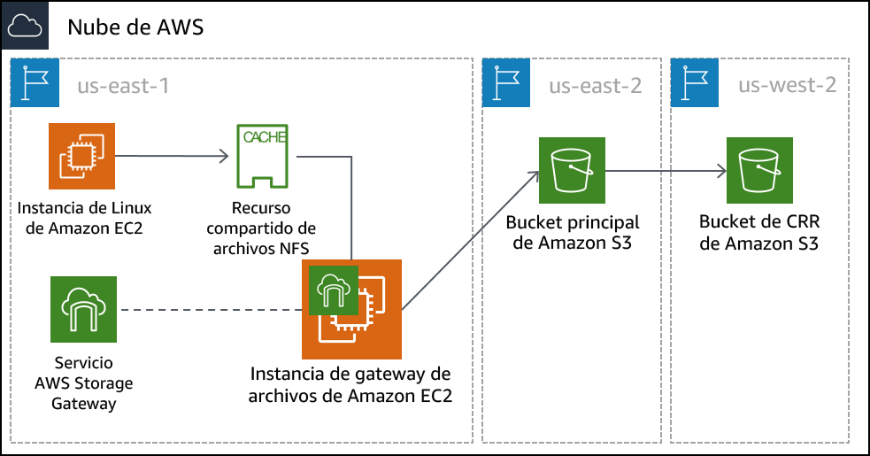

# Laboratorio guiado del módulo 14: Almacenamiento híbrido y migración de datos con la gateway de archivos de AWS Storage Gateway
[//]: # "SKU: ILT-TF-200-ACACAD-2    Source Course: SPL-223"

## Información general y objetivos del laboratorio

En este laboratorio, utilizará el servicio de gateway de archivos de AWS Storage Gateway para asociar un montaje de sistema de archivos de red (NFS) a un almacén de datos en las instalaciones. A continuación, replicará esos datos en un bucket de S3 en AWS. Además, configurará características avanzadas de Amazon S3, como las políticas de ciclo de vida y la replicación entre regiones de Amazon S3.

Después de completar este laboratorio, debería ser capaz de lo siguiente:

- configurar una gateway de archivos con un recurso compartido de archivos NFS y asociarla a una instancia de Linux
- migrar un conjunto de datos de la instancia de Linux a un bucket de S3
- crear y configurar un bucket de S3 principal para migrar los datos del servidor en las instalaciones a AWS
- crear y configurar un bucket de S3 secundario que se utilizará para la replicación entre regiones
- crear una política de ciclo de vida de S3 para administrar los datos de un bucket de manera automática

<br/>
## Duración

Para completar este laboratorio, se necesitan aproximadamente **90 minutos**.

<br/>
## Restricciones de los servicios de AWS

En este entorno de laboratorio, el acceso a los servicios y las acciones de los servicios de AWS puede restringirse a los que se necesiten para cumplir las instrucciones del laboratorio. Es posible que se produzcan errores si intenta acceder a otros servicios o hacer acciones que no sean las que se describen en este laboratorio.

<br/>
## Acceso a la consola de administración de AWS

1. En la parte superior de estas instrucciones, elija <span id="ssb_voc_grey">Start Lab</span> (Iniciar laboratorio) y comience a trabajar en él.

   Se abrirá el panel **Start Lab** (Iniciar laboratorio), donde se muestra el estado del laboratorio.

   <i class="fas fa-info-circle"></i> **Sugerencia**: Si necesita más tiempo para completar el laboratorio, vuelva a hacer clic en el botón <span id="ssb_voc_grey">Start Lab</span> (Iniciar laboratorio) para reiniciar el temporizador del entorno.

2. Espere hasta que el panel **Start Lab** (Iniciar laboratorio) muestre el mensaje *Lab Status: ready (Estado del laboratorio: listo)* y, luego, cierre el panel haciendo clic en la **X**.

3. En la parte superior de estas instrucciones, elija <span id="ssb_voc_grey">AWS</span>.

   Con esta acción, se abrirá la consola de administración de AWS en una nueva pestaña del navegador, y el sistema iniciará su sesión de forma automática.

   <i class="fas fa-exclamation-triangle"></i> **Sugerencia**: Si no se abre una nueva pestaña del navegador, por lo general habrá un aviso o un icono en la parte superior, el cual indicará que el navegador impide que el sitio abra ventanas emergentes. Haga clic en el aviso o el icono y elija **Allow pop ups** (Permitir ventanas emergentes).

4. Ubique la pestaña de la **consola de administración de AWS** de modo que aparezca junto con estas instrucciones. El método más óptimo sería tener ambas pestañas del navegador abiertas al mismo tiempo para que pueda seguir los pasos del laboratorio más fácilmente.

   <i class="fas fa-exclamation-triangle"></i> **No cambie la región a menos que se le indique expresamente que debe hacerlo**.

<br/>
## Tarea 1: Analizar la arquitectura del laboratorio

Este entorno de laboratorio utiliza un total de tres regiones de AWS. Una instancia EC2 de Linux que emula un servidor en las instalaciones se implementa en la región us-east-1 (Norte de Virginia). El dispositivo virtual de Storage Gateway se implementa en la misma región que el servidor Linux. En un caso real, el dispositivo se implementaría en un entorno VMware vSphere o Microsoft Hyper-V, o bien, como dispositivo físico de Storage Gateway.

El bucket de S3 principal se crea en la región us-east-2 (Ohio). Los datos del alojamiento de Linux se copian en el bucket de S3 principal. Este bucket también se puede llamar *origen*.

El bucket de S3 secundario se crea en la región us-west-2 (Oregón). Este bucket secundario es el *objetivo* para la política de replicación entre regiones. También se puede llamar *destino*.




<br/>
## Tarea 2: Crear los buckets de S3 principales y secundarios

Antes de configurar la gateway de archivos, debe crear el bucket de S3 principal (o el origen) donde replicará los datos. También creará el bucket secundario (o el destino) que se utilizará para la replicación entre regiones.

5. En la **consola de administración de AWS**, en el menú <span id="ssb_services">Services</span> (Servicios), seleccione **S3**.

6. Elija <span id="ssb_orange">Create bucket</span> (Crear bucket) y configure los siguientes ajustes:

- **Bucket name** (Nombre del bucket): cree un nombre que pueda recordar fácilmente. Debe ser único en todo el mundo.
- **Region** (Región): *US East (Ohio) (EE. UU. Este [Ohio])*

7. Elija <span id="ssb_orange">Create</span> (Crear).

8. Haga clic en el bucket que creó y en la pestaña **Properties** (Propiedades).

9. En **Versioning** (Control de versiones), haga clic en **Enable versioning** (Habilitar control de versiones) y, luego, en **Save** (Guardar).

   <i class="fas fa-info-circle"></i> Para la replicación entre regiones, debe habilitar el control de versiones tanto para el bucket de origen como para el de destino.

10. Repita los pasos anteriores de esta tarea para crear un segundo bucket con la siguiente configuración:

- **Bucket name** (Nombre del bucket): cree un nombre que pueda recordar fácilmente. Debe ser único en todo el mundo.
- **Region** (Región): *US West (Oregon) (EE. UU. Oeste [Oregón])*
- **Versioning** (Control de versiones): *Enabled (Habilitado)*

<br/>
## Tarea 3: Habilitar la replicación entre regiones

Ahora que ya creó los dos bucket de S3 y habilitó el control de versiones en ellos, puede crear una política de replicación.

11. Seleccione el nombre del bucket de *origen* que creó en la región EE. UU. Este (Ohio).

12. Seleccione la pestaña **Management** (Administración) y, luego, elija <span id="ssb_s3_white"></i> Replicación</span> (Replicación).

13. Elija <span id="ssb_s3_blue"><i class="fas fa-plus"></i>Add rule</span> (Agregar regla) y, luego, y configure los siguientes ajustes:

- **Set source** (Definir origen): *Entire bucket* (Bucket completo)
- Elija <span id="ssb_s3_blue"></i> Next</span> (Siguiente).
- **Destination bucket** (Bucket de destino):
   - <i class="far fa-dot-circle"></i> *Buckets en esta cuenta*
   - Seleccione el bucket que creó en la región EE. UU. Oeste (Oregón). Es posible que deba desplazarse hacia abajo para ver el bucket.
- Elija <span id="ssb_s3_blue"></i> Next</span> (Siguiente).

14. En la pantalla **Configure rules options** (Configurar opciones de reglas), configure los siguientes ajustes:

- **IAM role** (Rol de IAM): *S3-CRR-Role*
   - **Nota:** Para encontrar el rol de AWS Identity and Access Management (IAM) en el cuadro de búsqueda, escriba `S3-CRR` (este rol se creó previamente con los permisos necesarios para este laboratorio).
- **Rule name** (Nombre de regla): `crr-full-bucket`

15. Elija <span id="ssb_s3_blue"></i> Next</span> (Siguiente).

16. Revise la configuración y, luego, elija <span id="ssb_s3_blue"></i> Save</span> (Guardar).

**Nota**: Si aparece el mensaje *The replication rule is saved, but it might not work (Se guardó la regla de replicación, pero es posible que no funcione)*, puede ignorarlo y continuar con el siguiente paso.

17. Vuelva al bucket que creó en la región EE. UU. Este (Ohio).

18. Cargue un archivo de su equipo local en el bucket.

*Para este laboratorio, utilice un archivo pequeño que no contenga información confidencial, como un archivo de texto en blanco.*

19. Espere a que se cargue el archivo y, luego, vuelva al bucket que creó en la región EE. UU. Oeste (Oregón). El archivo que cargó también debe copiarse en este bucket.

**Nota:** Es posible que deba elegir el botón de actualización <i class="fas fa-sync"></i> que está en la parte superior derecha de la ventana.

<br/>
## Tarea 4: Configurar la gateway de archivos y crear un recurso compartido de archivos NFS

En esta tarea, implementará el dispositivo de gateway de archivos como una instancia de Amazon Elastic Compute Cloud (Amazon EC2). A continuación, configurará un disco de caché, seleccionará un bucket de S3 para sincronizar los archivos en las instalaciones y seleccionará la política de IAM que desee utilizar. Por último, creará un recurso compartido de archivos NFS en la gateway de archivos.

20. En la parte superior a la izquierda, elija el menú <span id="ssb_services">Services</span> (Servicios) y, luego, seleccione **Storage Gateway**.

También puede buscar *Storage Gateway* desde la parte superior del menú **Services** (Servicios) para facilitar su localización.

21. En la parte superior derecha de la consola, compruebe que la región actual sea *Norte de Virginia*.

Le debe aparecer una página de introducción a AWS Storage Gateway. Esta página se muestra porque el servicio Storage Gateway no se ha configurado en esta región.

22. Elija <span id="ssb_blue"></i> Get started</span> (Comenzar).

   Si no ve la página de introducción, seleccione <span id="ssb_blue"></i> Create gateway</span> (Crear gateway).

23. Seleccione **File gateway** (Gateway de archivos) y, luego, <span id="ssb_blue"></i> Next</span> (Siguiente).

24. Seleccione **Amazon EC2** y, luego, elija el botón <span id="ssb_grey"></i> <i class="fas fa-external-link-alt"></i> Launch instance</span> (Lanzar instancia).

Se abre una nueva pestaña para el asistente de lanzamiento de instancias EC2. Este enlace selecciona automáticamente la imagen de Amazon Machine (AMI) correcta que se debe utilizar para el dispositivo de gateway de archivos.

25. Seleccione el tipo de instancia **t2.xlarge** y, luego, elija <span id="ssb_grey"></i> Next: Configure Instance Details</span> (Siguiente: configurar detalles de instancia).

**Nota:** t2.xlarge es el único tipo de instancia que puede seleccionar en este entorno de laboratorio. Si selecciona cualquier otro tipo, recibirá un mensaje de error cuando concluya el uso del asistente.

<i class="fas fa-info-circle"></i> El tipo de instancia t2.xlarge se utiliza solo como ejemplo en este laboratorio. Para utilizar el tamaño correcto de dispositivo en su implementación de Storage Gateway, consulte la [documentación de Storage Gateway](https://docs.aws.amazon.com/storagegateway/latest/userguide/Requirements.html#requirements-hardware-storage).

26. En la pantalla **Configure instance details** (Configurar detalles de instancia), configure los siguientes ajustes:

- **Number of instances** (Número de instancias): `1`
- **Network** (Red): *On-Prem-VPC*
- **Subnet** (Subred): *On-Prem-Subnet*
- **Auto-assign Public IP** (Asignación automática de IP pública): *Use subnet setting (Utilizar el ajuste de subred)* (Habilitar)
- Aceptar los valores predeterminados para el resto de las opciones

   **Nota**: Puede ignorar los mensajes de advertencia, como el siguiente: *You do not have permissions to list instance profiles. Contact your administrator, or check your IAM permissions. (No cuenta con los permisos necesarios para enumerar los perfiles de instancia. Póngase en contacto con el administrador o revise sus permisos de IAM).*

27. Elija <span id="ssb_grey"></i> Next: Add Storage</span> (Siguiente: agregar almacenamiento).

28. Elija <span id="ssb_grey"></i> Add New Volume</span> (Agregar volumen nuevo) y configure los siguientes ajustes:

- **Volume Type** (Tipo de volumen): *EBS*
- **Device** (Dispositivo): */dev/sdb*
- **Size (Tamaño) (GiB):** `150`
- **Volume Type** (Tipo de volumen): * General Purpose SSD (gp2) (SSD de uso general [gp2])*
- **Delete on Termination** (Eliminar después de la terminación): <i class="far fa-check-square"></i>

29. Elija <span id="ssb_grey"></i> Next: Add Tags</span> (Siguiente: agregar etiquetas).

30. Elija <span id="ssb_grey"></i> Add Tag</span> (Agregar etiqueta) y configure los siguientes ajustes:

- **Key** (Clave): `Name (Nombre)`
- **Value** (Valor): `File Gateway Appliance (Dispositivo de gateway de archivos)`
- **Instances** (Instancias): <i class="far fa-check-square"></i>
- **Volumes** (Volúmenes): <i class="far fa-check-square"></i>

**Nota:** Las etiquetas distinguen entre mayúsculas y minúsculas.

31. Elija <span id="ssb_grey"></i> Next: Configure Security Group</span> (Siguiente: configurar grupo de seguridad).

32. Elija **Select an existing security group** (Seleccionar un grupo de seguridad existente) y, luego, seleccione la siguiente opción:

- *File Gateway activation and NFS access ports (Activación de gateway de archivos y puertos de acceso NFS)*

   - Este grupo de seguridad está configurado para permitir el tráfico a través de los puertos 80 (HTTP), 443 (HTTPS), 53 (DNS), 123 (NTP) y 2049 (NFS). Estos puertos habilitan la activación del dispositivo de gateway de archivos. También habilitan la conectividad desde el servidor Linux al recurso compartido NFS que creará en la gateway de archivos.

      Para obtener más información sobre los puertos que utiliza Storage Gateway, consulte la [documentación de dicho servicio](https://docs.aws.amazon.com/storagegateway/latest/userguide/Requirements.html#networks).

- *Acceso SSH en las instalaciones*

   - Este grupo de seguridad está configurado para permitir conexiones Secure Shell (SSH) en el puerto 22.


33. Elija <span id="ssb_blue"></i> Review and Launch</span> (Revisar y lanzar).

   **Nota:** Aparecerán mensajes de advertencia en la parte superior de la siguiente pantalla. Puede ignorar sin problema dichas advertencias en este laboratorio. Para evitar conexiones no deseadas o malintencionadas a las instancias en un entorno de producción, siempre debe crear grupos de seguridad lo más restrictivos posible.

34. Elija <span id="ssb_blue"></i> Launch</span> (Lanzar).

35. En la pantalla **Select an existing key pair or create a new key pair** (Seleccionar un par de claves existentes o crear un nuevo par de claves), configure los siguientes ajustes:

- **Choose an existing key pair** (Seleccionar un par de claves existente)
- **Select a key pair** (Seleccionar un par de claves): elija la clave disponible.
- <i class="far fa-check-square"></i> *I acknowledge that I have access to the selected private key file… (Confirmo que tengo acceso al archivo de clave privada seleccionado…)*

**Nota:** Este par de claves aparece en la página **Details** (Detalles) > **Show** (Mostrar) > **Credentials** (Credenciales) correspondiente a este laboratorio.

36. Elija <span id="ssb_blue"></i> Launch Instances</span> (Lanzar instancias).

37. Elija <span id="ssb_blue"></i> View Instances</span> (Ver instancias).

   La instancia del dispositivo de gateway de archivos debería tardar unos minutos en implementarse.

38. Monitoree el estado de la implementación y espere a que se completen las **comprobaciones de estado**.

   **Nota:** Es posible que deba elegir el botón de actualización <i class="fas fa-sync"></i> que está en la parte superior derecha de la ventana.

39. Seleccione la instancia de gateway de archivos de la lista y, luego, en la parte inferior de la pantalla, localice la dirección **IP pública IPv4** y cópiela. Utilizará esta dirección IP cuando complete la implementación de la gateway de archivos.

40. Vuelva a la pestaña de **AWS Storage Gateway** en su navegador. Debería seguir en la pantalla **Select host platform** (Seleccionar plataforma de alojamiento).

41. Compruebe que esté seleccionado **Amazon EC2** y, luego, elija <span id="ssb_blue"></i> Next</span> (Siguiente).

42. Para el tipo de punto de enlace, seleccione **Public** (Público) y, a continuación, elija <span id="ssb_blue"></i> Next</span> (Siguiente).

43. Pegue la dirección **IP pública IPv4** que copió de la instancia de dispositivo de gateway de archivos y, luego, elija <span id="ssb_blue"></i> Connect to gateway</span> (Conectarse a gateway).

44. En la pantalla **Activate gateway** (Activar gateway), configure los siguientes ajustes:

- **Gateway time zone** (Zona horaria de la gateway): *GMT -5:00 Eastern Time (US & Canada) (GMT - 5:00 Hora del Este [EE. UU. y Canadá])*
- **Gateway name** (Nombre de la gateway): `File Gateway (Gateway de archivos)`

45. Elija <span id="ssb_blue"></i> Activate gateway</span> (Activar gateway).

46. En la pantalla **Configure local disks** (Configurar discos locales), espere a que el estado *Preparing local disks (Preparando discos locales)* muestre que se ha completado el procesamiento (aproximadamente 1 minuto).

47. Una vez terminado el procesamiento, vaya a **Allocated to** (Asignado a) y seleccione **Cache** (Caché).

48. Elija <span id="ssb_blue"></i> Configure logging</span> (Configurar registro).

49. En la pantalla **Gateway health log group** (Grupo de registro del estado de la gateway), vaya a **Gateway health log group** (Grupo de registro del estado de la gateway) y seleccione **Disable logging** (Desactivar registro).

50. Elija <span id="ssb_blue"></i> Save and continue</span> (Guardar y continuar).

51. Espere a que el estado de la gateway de archivos cambie a *Running (En ejecución)* (aproximadamente 1 a 2 minutos), luego, seleccione la entrada **File Gateway** (Gateway de archivos) y elija <span id="ssb_grey"></i> Create file share</span> (Crear recurso compartido de archivos).

52. En la pantalla **Configure file share settings** (Configurar ajustes del recurso compartido de archivos), establezca los siguientes ajustes:
- **Amazon S3 bucket name** (Nombre del bucket de Amazon S3): escriba el nombre del bucket de origen que creó en la región de EE. UU. Este (Ohio) durante la Tarea 1.
- **Access objects using** (Obtener acceso a los objetos mediante): *Network File System (NFS) (Sistema de archivos de red [NFS])*
- **Gateway:** seleccione el nombre de la gateway de archivos que acaba de crear (el cual debería ser *File Gateway [Gateway de archivos])*.

53. Elija <span id="ssb_blue"></i> Next</span> (Siguiente).

54. En la pantalla **Configure how files are stored in Amazon S3** (Configurar cómo se almacenan los archivos en Amazon S3), establezca los siguientes ajustes:

- **Storage class for new objects** (Clase de almacenamiento para objetos nuevos): *S3 Standard* (S3 Estándar)
- **Object metadata** (Metadatos de objetos):
   - <i class="far fa-check-square"></i> *Guess MIME type* (Predecir tipo de MIME)
   - <i class="far fa-check-square"></i> *Give bucket owner full control* (Otorgar control total al propietario del bucket)
   - <i class="far fa-square"></i> Habilitar *Requester Pays* (Pago por solicitante)
- **Access your S3 bucket** (Acceder al bucket de S3): *Use an existing IAM role* (Utilizar un rol de IAM existente)
- **IAM role** (Rol de IAM): pegue *FgwIamPolicyARN*, que puede recuperar con las siguientes instrucciones:
   - Elija el menú desplegable <span id="ssb_voc_grey">Details</span> (Detalles) encima de estas instrucciones.
   - Seleccione <span id="ssb_voc_grey">Show</span> (Mostrar).
   - Copie el valor *FgwIamPolicyARN*.

55. Elija <span id="ssb_blue"></i> Next</span> (Siguiente).

   **Nota:** Es posible que aparezca un mensaje advirtiendo que se puede acceder al recurso compartido de archivos desde cualquier parte. Puede ignorar sin problema dicha advertencia en este laboratorio. En un entorno de producción, siempre deber crear políticas lo más restrictivas posible para evitar conexiones no deseadas o malintencionadas a las instancias.

56. Elija <span id="ssb_blue"></i> Create file share</span> (Crear recurso compartido de archivos).

57. Monitoree el estado de la implementación y espere a que el **estado** cambie a *Available (Disponible)*, lo que tarda menos de un minuto.

   **Nota:** Es posible que deba elegir el botón de actualización <i class="fas fa-sync"></i> que está en la parte superior derecha de la ventana.

58. Seleccione el recurso compartido de archivos que acaba de crear. En la parte inferior de la pantalla, vea el comando que se usa para montar el recurso compartido de archivos en Linux. Lo necesitará para la siguiente tarea.

   

<br/>

## Tarea 5: Montar el recurso compartido de archivos en la instancia de Linux y migrar los datos

Antes de poder migrar datos al recurso compartido NFS que creó, primero debe montarlo. En esta tarea, montará el recurso compartido NFS en un servidor Linux y, luego, copiará los datos en él.

59. Conéctese a la instancia **On-Prem Linux Server** (Servidor Linux en las instalaciones).

### <i class="fab fa-windows"></i> Usuarios de Microsoft Windows

<i class="fas fa-comment"></i> Estas instrucciones se dirigen específicamente a usuarios de Microsoft Windows. Si utiliza macOS o Linux, <a href="#ssh-MACLinux">pase a la siguiente sección</a>.


60. Encima de estas instrucciones, elija el menú desplegable <span id="ssb_voc_grey">Details</span> (Detalles) y, a continuación, seleccione <span id="ssb_voc_grey">Show</span> (Mostrar).

   Aparece la ventana **Credentials** (Credenciales).

2. Haga clic en el botón **Download PPK** (Descargar PPK) y guarde el archivo **labsuser.ppk**.

**Nota:** Por lo general, el navegador guarda el archivo en el directorio **Downloads** (Descargas).

3. Registre la dirección **OnPremLinuxInstance** si aparece.

4. Para salir del panel **Details** (Detalles), haga clic en la **X**.

5. Para acceder mediante SSH a la instancia EC2, debe utilizar**PuTTY**. Si no tiene instalado PuTTY en su equipo, <a href="https://the.earth.li/~sgtatham/putty/latest/w64/putty.exe">descárguelo</a>.

6. Abra **putty.exe**.

7. Configure el tiempo de espera de PuTTY de manera que se mantenga la sesión abierta durante un periodo más prolongado:
* Elija **Connection** (Conexión).
* **Seconds between keepalives** (Segundos entre señales de conexión persistente): `30`

8. Configure la sesión de PuTTY con los siguientes ajustes:
* Elija **Session** (Sesión).
* **Host Name (or IP address) (Nombre de alojamiento [o dirección IP]):** pegue **OnPremLinuxInstance** para la instancia que escribió antes.
   * Como alternativa, vuelva a la consola de Amazon EC2 y elija **Instances** (Instancias).
   * Seleccione la instancia a la que desea conectarse.
   * En la pestaña *Description (Descripción)*, copie el valor **IPv4 Public IP** (IP pública IPv4).
* De vuelta en PuTTY, en la lista **Connection** (Conexión), expanda <i class="far fa-plus-square"></i> **SSH.**
* Elija **Auth** (Autenticación) (pero no lo amplíe).
* Elija **Browse** (Examinar)
* Busque y seleccione el archivo **labsuser.ppk** que descargó.
* Para seleccionar el archivo, elija **Open** (Abrir).
* Elija **Open** (Abrir) nuevamente.


68. Para validar el alojamiento y conectarse a él, elija **Yes** (Sí).

69. Cuando aparezca **login as** (Iniciar sesión como), escriba `ec2-user`.

   Esta acción lo conecta a la instancia EC2.

70. Si es usuario de Microsoft Windows:<a href="#ssh-after">Haga clic aquí para pasar a la siguiente tarea.</a>


<a id='ssh-MACLinux'></a>

### Si es usuario <span style="font-size: 30px; color: #808080;"><i class="fab fa-apple"></i></span> de macOS <span style="font-size: 30px; "><i class="fab fa-linux"></i></span> y Linux

Estas instrucciones se dirigen específicamente a usuarios de macOS o Linux. Si es usuario de Windows, <a href="#ssh-after">pase a la siguiente tarea.</a>

71. Encima de estas instrucciones, elija el menú desplegable <span id="ssb_voc_grey">Details</span> (Detalles) y, a continuación, seleccione <span id="ssb_voc_grey">Show</span> (Mostrar).

   Aparece la ventana **Credentials** (Credenciales).

72. Haga clic en el botón **Download PEM** (Descargar PEM) y guarde el archivo **labsuser.pem**.

73. Registre la dirección **OnPremLinuxInstance** si aparece.

74. Para salir del panel **Details** (Detalles), haga clic en la **X**.

75. Abra una ventana del terminal y cambie el directorio por aquel en el que se descargó el archivo *labsuser.pem* con el comando `cd`.

    Por ejemplo, si guardó el archivo *labuser.pem* en el directorio **Downloads** (Descargas), ejecute este comando:

    ```bash
    cd ~/Downloads
    ```

76. Ejecute este comando para cambiar los permisos de la clave a fin de que sean de solo lectura:

    ```bash
    chmod 400 labsuser.pem
    ```

77. Ejecute el siguiente comando (reemplace **<public-ip\>** con la dirección de **OnPremLinuxInstance** que copió anteriormente).

* Como alternativa, para encontrar la dirección IP de la instancia en las instalaciones, vuelva a la consola de Amazon EC2 y seleccione **Instances** (Instancias).
* Seleccione la instancia a la que desea conectarse.
* En la pestaña **Description** (Descripción), copie el valor **IPv4 Public IP** (IP pública IPv4).

    ```bash
    ssh -i labsuser.pem ec2-user@<public-ip>
    ```

78. Cuando se le pregunte si desea permitir la primera conexión a este servidor SSH remoto, escriba `yes (sí)`.

    Como está usando un par de claves para la autenticación, no se le pide una contraseña.

<a id='ssh-after'></a>

<br/>
#### Ya debería estar conectado a la instancia.

79. En la instancia de Linux, para ver los datos que existen en este servidor, escriba el siguiente comando:

    `ls /media/data`

    Debería ver 20 archivos de imagen en formato.png.

80. Cree el directorio que se utilizará para sincronizar datos con su bucket de S3 mediante el siguiente comando:

    `sudo mkdir -p /mnt/nfs/s3`

81. Monte el recurso compartido de archivos en la instancia de Linux con el comando que copió al final de la última tarea.

    ```bash
    sudo mount -t nfs -o nolock,hard <File-Gateway-appliance-private-IP-address>:/<S3-bucket-name> /mnt/nfs/s3
    ```

    Por ejemplo:

    ```bash
    sudo mount -t nfs -o nolock,hard 10.10.1.33:/lab-nfs-bucket /mnt/nfs/s3
    ```

82. Compruebe que el recurso compartido se haya montado correctamente escribiendo el siguiente comando:

    `df -h`

    El resultado del comando debería ser similar al siguiente ejemplo:

    ```pseudocode
    [ec2-user@ip-10-10-1-210 ~]$ df -h
    Filesystem                  Size  Used Avail Use% Mounted on
    devtmpfs                    483M   64K  483M   1% /dev
    tmpfs                       493M     0  493M   0% /dev/shm
    /dev/xvda1                  7.8G  1.1G  6.6G  14% /
    10.10.1.33:/lab-nfs-bucket  8.0E     0  8.0E   0% /mnt/nfs/s3
    ```

83. Como ya creó el punto de montaje, puede copiar los datos que desea migrar a Amazon S3 en el recurso compartido mediante este comando:

    `cp -v /media/data/*.png /mnt/nfs/s3`


<br/>
## Tarea 6: Verificar que se hayan migrado los datos

Ha terminado de configurar la gateway y copiar datos en el recurso compartido NFS. Ahora, comprobará que la configuración funciona según lo previsto.

84. Elija el menú <span id="ssb_services">Services</span> (Servicios) y seleccione **S3**.

85. Seleccione el bucket que creó en la región EE. UU. Este (Ohio) y compruebe que los 20 archivos de imagen aparezcan en la lista.

**Nota:** Es posible que deba elegir el botón de actualización <i class="fas fa-sync"></i> que está en la parte superior derecha de la ventana.

86. Vuelva a la página de buckets de S3 y seleccione el bucket que creó en la región EE. UU. Oeste (Oregón). Compruebe que los archivos de imagen se hayan replicado en este bucket en función de la política que creó anteriormente.

<br/>
Migró correctamente los datos a Amazon S3 mediante AWS Storage Gateway con el modo de la gateway de archivos. Una vez almacenados los datos en Amazon S3, puede trabajar con ellos como datos si fueran nativos de Amazon S3. En este laboratorio, creó una política de replicación para copiar los datos en una región secundaria. También pudo realizar otras operaciones, como configurar una política de ciclo de vida. Por ejemplo, pudo migrar de manera automática datos utilizados con poca frecuencia de S3 Estándar a Amazon Simple Storage Service Glacier para el almacenamiento a largo plazo, lo que puede reducir los costos.

<br/>
## Envío de su trabajo

87. En la parte superior de estas instrucciones, elija <span id="ssb_blue">Submit</span> (Enviar) para registrar su progreso y, cuando se le indique, elija **Yes** (Sí).

88. Si los resultados no se muestran después de algunos minutos, vuelva a la parte superior de estas instrucciones y elija <span id="ssb_voc_grey">Grades</span> (Resultados).

    **Sugerencia**: Puede enviar su trabajo varias veces. Después de realizar las modificaciones pertinentes, vuelva a elegir **Submit** (Enviar). Su último envío es el que se registrará para este laboratorio.

89. Para encontrar comentarios detallados sobre su trabajo, elija <span id="ssb_voc_grey">Details</span> (Detalles) seguido de <i class="fas fa-caret-right"></i> **View Submission Report** (Ver informe de envío).


<br/>
## Fin del laboratorio <i class="fas fa-graduation-cap"></i>
<i class="fas fa-flag-checkered"></i> ¡Felicitaciones! Ha completado el laboratorio.


90. Elija <span id="ssb_voc_grey">End Lab</span> (Finalizar laboratorio) en la parte superior de esta página y, a continuación, seleccione <span id="ssb_blue">Yes</span> (Sí) para confirmar que desea finalizar el laboratorio.

   Debería aparecer un panel con el siguiente mensaje: *DELETE has been initiated… You may close this message box now (Se ha iniciado la ELIMINACIÓN… Ya puede cerrar este cuadro de mensaje)*.

91. Seleccione la **X** de la esquina superior derecha para cerrar el panel.

<br/>


*© 2020 Amazon Web Services, Inc. y sus empresas afiliadas. Todos los derechos reservados. Este contenido no puede reproducirse ni redistribuirse, total ni parcialmente, sin el permiso previo por escrito de Amazon Web Services, Inc. Queda prohibida la copia, el préstamo y la venta de carácter comercial.*