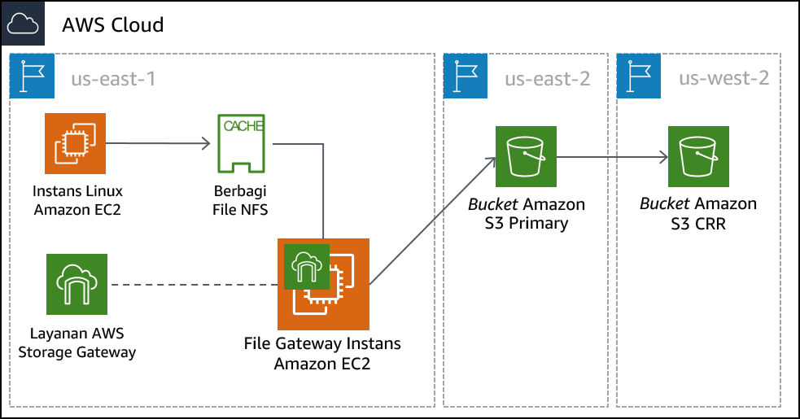

# Modul 14 – Lab Terpandu: Penyimpanan Hibrida dan Migrasi Data dengan File Gateway AWS Storage Gateway
[//]: # "SKU: ILT-TF-200-ACACAD-2    Source Course: SPL-223"

## Gambaran umum dan tujuan lab

Di lab ini, Anda akan menggunakan layanan Gateway File AWS Storage Gateway untuk memasang Network File System (NFS) ke penyimpanan data on-premise. Anda kemudian akan mereplikasi data ke bucket S3 di AWS. Selain itu, Anda akan mengonfigurasi fitur lanjutan Amazon S3, seperti kebijakan siklus hidup Amazon S3 dan replikasi lintas Wilayah.

Setelah menyelesaikan lab ini, Anda akan mampu:

- Mengonfigurasi Gateway File dengan file share NFS dan memasangnya ke instans Linux
- Memigrasikan satu set data dari instans Linux ke bucket S3
- Membuat dan mengonfigurasi bucket S3 primer untuk memigrasikan data server on-premise ke AWS
- Membuat dan mengonfigurasi bucket S3 sekunder yang akan digunakan untuk replikasi lintas Wilayah
- Membuat kebijakan siklus hidup S3 untuk mengelola data secara otomatis dalam bucket

<br/>
## Durasi

Diperlukan waktu sekitar **90 menit** untuk menyelesaikan lab ini.

<br/>
## Pembatasan layanan AWS

Dalam lingkungan lab ini, akses ke layanan AWS dan tindakan layanan mungkin dibatasi untuk orang-orang yang diperlukan untuk menyelesaikan instruksi lab. Anda mungkin akan mengalami error jika mencoba mengakses layanan lain atau melakukan tindakan di luar yang dijelaskan di lab ini.

<br/>
## Mengakses Konsol Manajemen AWS

1. Di bagian atas instruksi ini, pilih <span id="ssb_voc_grey">Start Lab</span> (Mulai Lab) untuk meluncurkan lab Anda.

   Panel **Start Lab** (Mulai Lab) terbuka dan menampilkan status lab.

   <i class="fas fa-info-circle"></i> **Tip**: Jika Anda memerlukan lebih banyak waktu untuk menyelesaikan lab, mulai ulang pengatur waktu untuk lingkungan dengan memilih tombol <span id="ssb_voc_grey">Start Lab</span> (Mulai Lab) lagi.

2. Tunggu hingga panel **Start Lab** (Mulai Lab) menampilkan pesan *Lab status: ready* (Status lab: siap), lalu tutup panel dengan memilih **X**.

3. Di bagian atas instruksi ini, pilih <span id="ssb_voc_grey">AWS</span>.

   Tindakan ini akan membuka Konsol Manajemen AWS di tab browser baru. Anda akan masuk ke sistem secara otomatis.

   <i class="fas fa-exclamation-triangle"></i> **Tip**: Jika tab browser baru tidak terbuka, banner atau ikon biasanya berada di bagian atas browser Anda dengan pesan bahwa browser Anda mencegah situs membuka jendela sembulan. Pilih banner atau ikon, lalu pilih **Allow pop-ups** (Izinkan sembulan).

4. Atur tab **AWS Management Console**(Konsol Manajemen AWS) agar ditampilkan bersama instruksi ini. Idealnya, Anda perlu membuka kedua tab browser secara bersamaan, sehingga Anda dapat mengikuti langkah-langkah lab dengan lebih mudah.

   <i class="fas fa-exclamation-triangle"></i> **Jangan mengubah Wilayah kecuali secara khusus diperintahkan untuk melakukannya**.

<br/>
## Tugas 1: Meninjau arsitektur lab

Lingkungan lab ini menggunakan total tiga Wilayah AWS. Instans EC2 Linux yang mengemulasi server on premise di-deploy ke Wilayah us-east-1 (N. Virginia). Peralatan virtual Storage Gateway di-deploy ke Wilayah yang sama dengan server Linux. Dalam skenario dunia nyata, peralatan akan di-deploy di lingkungan VMware vSphere atau Microsoft Hyper-V, atau sebagai peralatan Storage Gateway fisik.

Bucket S3 primer dibuat di Wilayah us-east-2 (Ohio). Data dari host Linux disalin ke bucket S3 primer. Bucket ini juga bisa disebut *sumber*.

Bucket S3 sekunder dibuat di Wilayah us-west-2 (Oregon). Bucket sekunder ini adalah *target* untuk kebijakan replikasi lintas Wilayah. Bucket ini juga disebut *tujuan*.




<br/>
## Tugas 2: Membuat bucket S3 primer dan sekunder

Sebelum mengonfigurasi Gateway File, Anda harus membuat bucket S3 primer (atau sumber) tempat Anda akan mereplikasi data. Anda juga akan membuat bucket sekunder (atau tujuan) yang akan digunakan untuk replikasi lintas Wilayah.

5. Di **AWS Management Console** (Konsol Manajemen AWS), di menu <span id="ssb_services">Services</span> (Layanan), pilih **S3**.

6. Pilih <span id="ssb_orange">Create bucket</span> (Buat bucket), lalu konfigurasikan pengaturan berikut:

- **Bucket name** (Nama bucket): Buat nama yang dapat Anda ingat dengan mudah. Nama tersebut harus unik.
- **Region** (Wilayah): *AS Timur (Ohio)*

7. Pilih <span id="ssb_orange">Create</span> (Buat)

8. Klik bucket yang Anda buat dan klik tab **Properties** (Properti).

9. Di bawah **Versioning**, klik **Enable versioning** (Aktifkan versioning) dan klik **Save** (Simpan).

   <i class="fas fa-info-circle"></i> Untuk replikasi lintas Wilayah, Anda harus mengaktifkan versioning baik untuk bucket sumber maupun tujuan.

10. Ulangi langkah-langkah sebelumnya dalam tugas ini untuk membuat bucket kedua dengan konfigurasi berikut:

- **Bucket name** (Nama bucket): Buat nama yang dapat Anda ingat dengan mudah. Nama tersebut harus unik.
- **Region** (Wilayah): *AS Barat (Oregon)*
- **Versioning:** *Enabled* (Aktif)

<br/>
## Tugas 3: Mengaktifkan replikasi lintas Wilayah

Karena telah membuat dua bucket S3 dan mengaktifkan versioning pada mereka, kini Anda dapat membuat kebijakan replikasi.

11. Pilih nama bucket *sumber* yang Anda buat di Wilayah AS Timur (Ohio).

12. Pilih tab **Management** (Manajemen), lalu pilih <span id="ssb_s3_white"></i> Replication</span> (Replikasi)

13. Pilih <span id="ssb_s3_blue"><i class="fas fa-plus"></i>Add rule</span> (Tambahkan aturan), lalu konfigurasikan pengaturan ini:

- **Set source** (Tetapkan sumber): *Entire bucket* (Seluruh bucket)
- Pilih <span id="ssb_s3_blue"></i> Next</span> (Berikutnya)
- **Destination bucket** (Bucket tujuan):
   - <i class="far fa-dot-circle"></i> *Buckets in this account* (Bucket di akun ini)
   - Pilih bucket yang Anda buat di Wilayah AS Barat (Oregon). (Mungkin Anda perlu menggulir ke bawah untuk menemukan bucket.)
- Pilih <span id="ssb_s3_blue"></i> Next</span> (Berikutnya)

14. Pada layar **Configure rules options** (Konfigurasi opsi aturan), konfigurasikan pengaturan ini:

- **IAM role:** *S3-CRR-Role*
   - **Catatan:** Untuk menemukan peran AWS Identity and Access Management (IAM), di kotak pencarian, masukkan: `S3-CRR` (Peran ini telah dibuat sebelumnya dengan izin yang diperlukan untuk lab ini)
- **Rule name** (Nama aturan): `crr-full-bucket`

15. Pilih <span id="ssb_s3_blue"></i> Next</span> (Berikutnya)

16. Tinjau pengaturan, lalu pilih <span id="ssb_s3_blue"></i> Save</span> (Simpan)

**Catatan**: Jika Anda menemukan pesan *The replication rule is saved, but it might not work* (Aturan replikasi disimpan, tetapi mungkin tidak berhasil), Anda dapat mengabaikannya dan melanjutkan ke langkah berikutnya.

17. Kembali ke bucket yang Anda buat di Wilayah AS Timur (Ohio).

18. Unggah file dari komputer lokal Anda ke bucket.

*Untuk lab ini, gunakan file* kecil yang tidak berisi informasi sensitif, seperti file teks kosong. **

19. Tunggu sampai file diunggah, lalu kembali ke bucket yang Anda buat di Wilayah AS Barat (Oregon). File yang Anda unggah juga harus disalin ke bucket ini.

**Catatan:** Anda mungkin harus memilih tombol <i class="fas fa-sync"></i> refresh (segarkan) di area kanan atas jendela.

<br/>
## Tugas 4: Mengonfigurasi Gateway File dan membuat file share NFS

Dalam tugas ini, Anda akan men-deploy peralatan Gateway File sebagai instans Amazon Elastic Compute Cloud (Amazon EC2). Anda kemudian akan mengonfigurasi disk cache, memilih bucket S3 untuk menyinkronkan file on premise, dan memilih kebijakan IAM yang akan digunakan. Terakhir, Anda akan membuat file share NFS pada Gateway File.

20. Di kiri atas, pilih menu <span id="ssb_services">Services</span> (Layanan), lalu pilih **Storage Gateway**.

Anda juga dapat mencari *Storage Gateway* dari bagian atas menu **Services** (Layanan) agar lebih mudah menemukannya.

21. Di kanan atas konsol, pastikan bahwa Wilayah saat ini adalah *N. Virginia*.

Anda akan mendapat tampilan dengan halaman memulai AWS Storage Gateway. Halaman ini ditampilkan karena layanan Storage Gateway belum dikonfigurasi di Wilayah ini.

22. Pilih <span id="ssb_blue"></i> Get started</span> (Mulai)

   Jika Anda tidak melihat halaman memulai ini, pilih <span id="ssb_blue"></i> Create gateway</span> (Buat gateway)

23. Pilih **File gateway** (Gateway file), kemudian pilih <span id="ssb_blue"></i> Next</span> (Berikutnya)

24. Pilih **Amazon EC2**, kemudian pilih <span id="ssb_grey"></i> tombol <i class="fas fa-external-link-alt"></i> Launch instance </span> (Luncurkan instans).

Tab baru membuka wizard peluncuran instans EC2. Tautan ini secara otomatis memilih Amazon Machine Image (AMI) yang benar yang harus Anda gunakan untuk peralatan Gateway File.

25. Pilih tipe instans **t2.xlarge**, lalu pilih <span id="ssb_grey"></i> Next: Configure Instance Details</span> (Berikutnya: Konfigurasikan Detail Instans)

**Catatan:** t2.xlarge adalah satu-satunya tipe instans yang dapat Anda pilih di lingkungan lab ini. Jika Anda memilih tipe instans lainnya, pesan kesalahan akan muncul pada akhir wizard.

<i class="fas fa-info-circle"></i> Tipe instans t2.xlarge hanya digunakan sebagai contoh di lab ini. Untuk ukuran peralatan yang benar ketika Anda men-deploy peralatan Storage Gateway, lihat [dokumentasi Storage Gateway](https://docs.aws.amazon.com/storagegateway/latest/userguide/Requirements.html#requirements-hardware-storage).

26. Pada layar **Configure instance details** (Konfigurasikan detail instans), konfigurasikan pengaturan berikut:

- **Number of instances** (Jumlah instans): `1`
- **Network** (Jaringan): *On-prem-VPC*
- **Subnet:** *On-Prem-Subnet*
- **Auto-assign Public IP** (Tetapkan otomatis IP Publik): Aktifkan *Use subnet setting* (Gunakan pengaturan subnet)
- Terima nilai default untuk opsi yang lain

   **Catatan**: Anda dapat mengabaikan pesan peringatan, seperti: *You do not have permissions to list instance profiles.* (Anda tidak memiliki izin untuk mencantumkan profil instans). *Hubungi administrator Anda, atau periksa izin IAM Anda. *

27. Pilih <span id="ssb_grey"></i>Next: Add storage</span> (Berikutnya: Tambahkan penyimpanan)

28. Pilih <span id="ssb_grey"></i>Add New Volume</span> (Tambah Volume Baru) dan konfigurasikan pengaturan ini:

- **Volume Type** (Jenis Volume): *EBS*
- **Device** (Perangkat): */dev/sdb*
- **Size (GiB)** (Ukuran (GiB)): `150`
- **Volume Type** (Jenis Volume): *General Purpose SSD (gp2)*
- **Delete on Termination** (Hapus saat Penghentian): <i class="far fa-check-square"></i>

29. Pilih <span id="ssb_grey"></i>Next: Add Tags</span> (Berikutnya: Tambahkan Tag)

30. Pilih <span id="ssb_grey"></i>Add Tag</span> (Tambahkan Tanda) dan konfigurasikan pengaturan berikut:

- **Key** (Kunci): `Name` (Nama)
- **Value** (Nilai): `File Gateway Appliance` (Peralatan Gateway File)
- **Instances** (Instans): <i class="far fa-check-square"></i>
- **Volumes** (Volume): <i class="far fa-check-square"></i>

**Catatan:** Tanda peka huruf besar/kecil.

31. Pilih <span id="ssb_grey"></i> Next: Configure Security Group</span> (Berikutnya: Konfigurasikan Grup Keamanan)

32. Pilih **Select an existing security group** (Pilih grup keamanan yang ada), lalu pilih:

- *File Gateway activation and NFS access ports* (Aktivasi Gateway File dan port akses NFS)

   - Grup keamanan ini dikonfigurasi untuk mengizinkan lalu lintas melalui port 80 (HTTP), 443 (HTTPS), 53 (DNS), 123 (NTP), dan 2049 (NFS). Port ini memungkinkan aktivasi peralatan Gateway File. Port tersebut juga mengaktifkan konektivitas dari server Linux ke share NFS yang akan Anda buat pada Gateway File.

      Untuk informasi tambahan tentang port yang digunakan oleh Storage Gateway, lihat [dokumentasi Storage Gateway](https://docs.aws.amazon.com/storagegateway/latest/userguide/Requirements.html#networks).

- *On-Prem SSH Access*

   - Grup keamanan ini dikonfigurasi untuk mengizinkan koneksi Secure Shell (SSH) pada port 22.


33. Pilih <span id="ssb_blue"></i> Review and Launch</span> (Tinjau dan Luncurkan)

   **Catatan:** Anda akan melihat pesan peringatan di bagian atas layar berikutnya. Anda dapat dengan aman mengabaikan peringatan untuk lab ini. Untuk mencegah koneksi yang tidak diinginkan atau berbahaya untuk instans Anda di lingkungan produksi, Anda harus selalu membuat grup keamanan yang serestriktif mungkin.

34. Pilih <span id="ssb_blue"></i> Launch</span> (Luncurkan)

35. Pada layar **Select an existing key pair or create a new key pair** (Pilih pasangan kunci yang ada atau buat pasangan kunci baru), konfigurasikan pengaturan ini:

- **Pilih pasangan kunci yang ada**
- **Select a key pair** (Pilih pasangan kunci): Pilih kunci yang tersedia
- <i class="far fa-check-square"></i> *I acknowledge that I have access to the selected private key file...* (Saya menyatakan bahwa saya memiliki akses ke file kunci pribadi yang dipilih...)

**Catatan:** Pasangan kunci ini disediakan di halaman **Details (Detail) > Show (Tampilkan) > Credentials (Kredensial)** untuk lab ini.

36. Pilih <span id="ssb_blue"></i> Launch Instances</span> (Luncurkan Instans)

37. Pilih <span id="ssb_blue"></i> View Instances</span> (Tampilkan Instans)

   Instans peralatan Gateway File membutuhkan waktu beberapa menit untuk melakukan di-deploy.

38. Pantau status deployment dan tunggu **Status Checks** (Pemeriksaan Status) diselesaikan.

   **Catatan:** Anda mungkin perlu memilih tombol <i class="fas fa-sync"></i> refresh (segarkan) di daerah kanan atas jendela.

39. Pilih instans Gateway File Anda dari daftar, lalu di bagian bawah layar, cari alamat **IP Public IPv4** dan salin. Anda akan menggunakan alamat IP ini saat Anda menyelesaikan deployment Gateway File.

40. Kembali ke tab **AWS Storage Gateway** di browser Anda. Tab seharusnya masih menampilkan layar **Select host platform** (Pilih platform host).

41. Verifikasi bahwa **Amazon EC2** sudah dipilih, kemudian pilih <span id="ssb_blue"></i> Next</span> (Berikutnya)

42. Untuk jenis endpoint, pilih **Public**, kemudian pilih <span id="ssb_blue"></i> Next</span> (Berikutnya)

43. Tempel alamat **IP Public IPv4** yang Anda disalin dari instans Peralatan Gateway File, kemudian pilih <span id="ssb_blue"></i> Connect to gateway</span> (Sambungkan ke gateway)

44. Pada layar **Activate gateway** (Aktifkan gateway), konfigurasikan pengaturan ini:

- **Gateway time zone** (Zona waktu gateway): *GMT - 5:00 Waktu Timur (AS & Kanada)*
- **Gateway nama** (Nama gateway): `File Gateway`

45. Pilih <span id="ssb_blue"></i> Activate gateway</span> (Aktifkan gateway)

46. Pada layar **Configure local disks** (Konfigurasi disk lokal), tunggu status *Preparing local disks* (Mempersiapkan disk lokal) untuk menunjukkan bahwa pemrosesan selesai (sekitar 1 menit).

47. Setelah pemrosesan selesai, buka **Allocated to** (Dialokasikan untuk) dan pilih **Cache**.

48. Pilih <span id="ssb_blue"></i> Configure logging</span> (Konfigurasi pencatatan)

49. Pada layar **Gateway health log group** (Grup log kesehatan gateway), buka **Gateway health log group** (Grup log kesehatan gateway) dan pilih **Disable logging** (Nonaktifkan pencatatan).

50. Pilih <span id="ssb_blue"></i> Save and continue</span> (Simpan dan lanjutkan)

51. Tunggu status Gateway File berubah menjadi *Running (Berjalan)* (sekitar 1-2 menit), lalu pilih entri **File Gateway** dan pilih <span id="ssb_grey"></i> Create file share</span> (Buat file share)

52. Pada layar **Configure file share settings** (Mengonfigurasi file share pengaturan), konfigurasikan pengaturan berikut:
- **Amazon S3 bucket name** (Nama bucket Amazon S3): Masukkan nama bucket sumber yang Anda buat di Wilayah AS Timur (Ohio) di Tugas 1.
- **Access objects using** (Akses objek menggunakan): *Network File System (NFS)*
- **Gateway:** Pilih nama Gateway File yang baru saja Anda buat (yang seharusnya *File Gateway*)

53. Pilih <span id="ssb_blue"></i> Next</span> (Berikutnya)

54. Pada layar **Configure how files are stored in Amazon S3** (Mengonfigurasi bagaimana file disimpan di Amazon S3), konfigurasikan pengaturan ini:

- **Storage class for new objects** (Kelas penyimpanan untuk objek baru): *S3 Standard*
- **Object metadata** (Metadata objek):
   - <i class="far fa-check-square"></i> *Guess MIME type* (Perkirakan tipe MIME)
   - <i class="far fa-check-square"></i> *Berikan kontrol penuh pada pemilik bucket*
   - <i class="far fa-square"></i> Aktifkan *Requester Pays*
- **Access your S3 bucket** (Akses bucket S3 Anda): *Use an existing IAM role* (Gunakan IAM role yang ada)
- **IAM role:** Tempelkan *FgwIamPolicyARN*, yang dapat Anda ambil dengan mengikuti instruksi ini –
   - Pilih menu tarik turun </span> Details<span id="ssb_voc_grey"> (Detail) di atas instruksi ini
   - Pilih <span id="ssb_voc_grey">Show</span> (Tampilkan)
   - Salin nilai *FgwIamPolicyARN*

55. Pilih <span id="ssb_blue"></i> Next</span> (Berikutnya)

   **Catatan:** Anda mungkin mendapatkan pesan peringatan bahwa file share dapat diakses dari mana saja. Untuk lab ini, Anda dapat dengan aman mengabaikan peringatan ini. Di lingkungan produksi, Anda harus selalu membuat kebijakan yang serestriktif mungkin untuk mencegah koneksi yang tidak diinginkan atau berbahaya ke instans Anda.

56. Pilih <span id="ssb_blue"></i> Create file share</span> (Buat file share)

57. Pantau status deployment dan tunggu **Status** berubah menjadi *Available* (Tersedia), yang memerlukan waktu kurang dari satu menit.

   **Catatan:** Anda mungkin perlu memilih tombol <i class="fas fa-sync"></i> refresh (segarkan) di daerah kanan atas jendela.

58. Pilih file share yang baru saja Anda buat. Di bagian bawah layar, perhatikan perintah untuk memasang file share di Linux. Anda akan membutuhkannya untuk tugas berikutnya.

   

<br/>

## Tugas 5: Memasang file share ke instans Linux dan memigrasikan data

Sebelum Anda dapat memigrasikan data ke share NFS yang Anda buat, Anda harus terlebih dahulu memasang share tersebut. Dalam tugas ini, Anda akan memasang share NFS pada server Linux, kemudian menyalin data ke share.

59. Hubungkan ke instans **On-Prem Linux Server**.

### <i class="fab fa-windows"></i> Pengguna Microsoft Windows

<i class="fas fa-comment"></i> Instruksi ini khusus untuk pengguna Microsoft Windows. Jika Anda menggunakan macOS atau Linux, <a href="#ssh-MACLinux">lompat ke bagian berikutnya</a>.


60. Di atas instruksi yang sedang Anda baca ini, pilih menu tarik-turun <span id="ssb_voc_grey">Details</span> (Detail), lalu pilih <span id="ssb_voc_grey">Show</span> (Tampilkan)

   Jendela **Credentials** (Kredensial) akan terbuka.

2. Pilih tombol **Download PPK** (Unduh PPK), dan simpan file **labsuser.ppk**.

**Catatan:** Biasanya, browser Anda akan menyimpan file ke direktori **Downloads** (Unduhan).

3. Catat alamat **OnPremLinuxInstance**, jika ditampilkan.

4. Keluar dari panel **Details** (Detail) dengan memilih **X**.

5. Untuk menggunakan SSH guna mengakses instans EC2, Anda harus menggunakan **PuTTY**. Jika Anda belum menginstal PuTTY di komputer, <a href="https://the.earth.li/~sgtatham/putty/latest/w64/putty.exe">download PuTTY</a> (unduh PuTTY).

6. Buka **putty.exe**.

7. Konfigurasikan waktu henti PuTTY agar sesi PuTTY tetap terbuka dalam jangka waktu yang lebih lama:
* Pilih **Connection** (Koneksi)
* **Seconds between keepalives** (Detik antara keepalive): `30`

8. Konfigurasikan sesi PuTTY Anda dengan menggunakan pengaturan berikut.
* Pilih **Session** (Sesi)
* **Host Name (or IP address)** (Nama Host (atau alamat IP)): Tempelkan **OnPremLinuxInstance** untuk instans yang Anda catat sebelumnya
   * Atau, kembali ke konsol Amazon EC2 dan pilih **Instances** (Instans)
   * Pilih instans yang ingin Anda sambungkan
   * Di tab *Description* (Deskripsi), salin nilai **IPv4 Public IP**
* Kembali ke PuTTY, dalam daftar **Connection** (Koneksi), perluas <i class="far fa-plus-square"></i> **SSH**
* Pilih **Auth** (tapi jangan memperluasnya)
* Pilih **Browse** (Jelajahi)
* Jelajahi lalu pilih file **labsuser.ppk** yang Anda unduh
* Untuk memilih file, pilih **Open** (Buka)
* Pilih **Open** (Buka) lagi


68. Untuk memercayai dan terhubung ke host, pilih **Yes** (Ya).

69. Saat muncul pertanyaan **login as** (login sebagai), masukkan: `ec2-user`

   Tindakan ini menghubungkan Anda ke instans EC2.

70. Pengguna Microsoft Windows: <a href="#ssh-after">Klik di sini untuk lompat ke tugas berikutnya.</a>


<a id='ssh-MACLinux'></a>

### Pengguna macOS <span style="font-size: 30px; color: #808080;"><i class="fab fa-apple"></i></span> dan Linux <span style="font-size: 30px; "><i class="fab fa-linux"></i></span>

Instruksi ini khusus untuk pengguna macOS atau Linux. Jika Anda pengguna Windows, <a href="#ssh-after">lompat ke tugas berikutnya.</a>

71. Di atas instruksi yang sedang Anda baca ini, pilih menu tarik-turun <span id="ssb_voc_grey">Details</span> (Detail), lalu pilih <span id="ssb_voc_grey">Show</span> (Tampilkan)

   Jendela **Credentials** (Kredensial) akan terbuka.

72. Pilih tombol **Download PEM** (Unduh PEM) dan simpan file **labsuser.pem**.

73. Catat alamat **OnPremLinuxInstance**, jika ditampilkan.

74. Keluar dari panel **Details** (Detail) dengan memilih **X**.

75. Buka jendela terminal, dan ubah direktori ke direktori tempat file *labsuser.pem* diunduh dengan menggunakan perintah `cd`.

    Misalnya, jika file *labsuser.pem* disimpan ke direktori **Downloads** (Unduhan), jalankan perintah ini:

    ```bash
    cd ~/Downloads
    ```

76. Ubah izin pada kunci menjadi hanya baca, dengan menjalankan perintah ini:

    ```bash
    chmod 400 labsuser.pem
    ```

77. Jalankan perintah berikut (ganti **<public-ip\>** dengan alamat **OnPremLinuxInstance** yang Anda salin sebelumnya).

* Atau, untuk menemukan alamat IP instans on premise, kembali ke konsol Amazon EC2 dan pilih **Instances** (Instans)
* Pilih instans yang ingin Anda sambungkan
* Di tab **Description** (Deskripsi), salin nilai **IPv4 Public IP**

    ```bash
    ssh -i labsuser.pem ec2-user@<public-ip>
    ```

78. Saat Anda diminta untuk mengizinkan koneksi pertama ke server SSH jarak jauh ini, masukkan: `yes` (ya)

   Karena Anda menggunakan pasangan kunci untuk autentikasi, Anda tidak akan diminta memasukkan sandi.

<a id='ssh-after'></a>

<br/>
#### Anda sekarang seharusnya terhubung ke instans.

79. Pada instans Linux, untuk melihat data yang ada di server ini, masukkan perintah berikut:

   `ls /media/data`

Anda seharusnya melihat 20 file gambar dalam format .png.

80. Buat direktori yang akan digunakan untuk menyinkronkan data dengan bucket S3 Anda menggunakan perintah berikut:

   `sudo mkdir -p /mnt/nfs/s3`

81. Pasang file share pada instans Linux dengan menggunakan perintah yang Anda salin pada akhir tugas terakhir.

  ```bash
  sudo mount -t nfs -o nolock,hard <File-Gateway-appliance-private-IP-address>:/<S3-bucket-name> /mnt/nfs/s3
  ```

    Misalnya:

  ```bash
  sudo mount -t nfs -o nolock,hard 10.10.1.33:/lab-nfs-bucket /mnt/nfs/s3
  ```

82. Verifikasi bahwa share telah dipasang dengan benar dengan memasukkan perintah berikut:

	`df -h`

    Output dari perintah harus mirip dengan contoh berikut:

  ```pseudocode
  [ec2-user@ip-10-10-1-210 ~]$ df -h
  Filesystem                  Size  Used Avail Use% Mounted on
  devtmpfs                    483M   64K  483M   1% /dev
  tmpfs                       493M     0  493M   0% /dev/shm
  /dev/xvda1                  7.8G  1.1G  6.6G  14% /
  10.10.1.33:/lab-nfs-bucket  8.0E     0  8.0E   0% /mnt/nfs/s3
  ```

83. Karena telah membuat titik pemasangan, kini Anda dapat menyalin data yang ingin Anda migrasikan ke Amazon S3 ke dalam share menggunakan perintah ini:

   `cp -v /media/data/*.png /mnt/nfs/s3`


<br/>
## Tugas 6: Memverifikasi bahwa data telah dimigrasikan

Anda telah selesai mengonfigurasi gateway dan menyalin data ke share NFS. Sekarang, Anda akan memverifikasi bahwa konfigurasi bekerja sebagaimana yang dimaksudkan.

84. Pilih menu <span id="ssb_services">Services</span> (Layanan) dan pilih **S3**.

85. Pilih bucket yang Anda buat di AS Timur (Ohio), dan verifikasi bahwa 20 file gambar telah terdaftar.

**Catatan:** Anda mungkin perlu memilih tombol <i class="fas fa-sync"></i> refresh (segarkan) di daerah kanan atas jendela.

86. Kembali ke halaman bucket S3 dan pilih bucket yang Anda buat di Wilayah AS Barat (Oregon). Verifikasi bahwa file gambar direplikasi ke bucket ini, berdasarkan kebijakan yang Anda buat sebelumnya.

<br/>
Anda telah berhasil memigrasikan data ke Amazon S3 menggunakan AWS Storage Gateway dalam modus Gateway File! Setelah data Anda disimpan di Amazon S3, Anda dapat memperlakukannya seperti data Amazon S3 native. Di lab ini, Anda membuat kebijakan replikasi untuk menyalin data ke Wilayah sekunder. Anda juga dapat melakukan operasi lain, seperti mengonfigurasi kebijakan siklus hidup. Misalnya, Anda dapat memigrasikan data yang jarang digunakan secara otomatis dari S3 Standard ke Amazon Simple Storage Service Glacier untuk penyimpanan jangka panjang, yang dapat mengurangi biaya.

<br/>
## Mengirimkan pekerjaan Anda

87. Di bagian atas instruksi ini, pilih <span id="ssb_blue">Submit</span> (Kirim) untuk merekam kemajuan Anda dan saat diminta, pilih **Yes** (Ya).

88. Jika hasilnya tidak muncul setelah beberapa menit, kembali ke bagian atas instruksi ini dan pilih <span id="ssb_voc_grey">Grades</span> (Nilai)

   **Tip**: Anda dapat mengirimkan pekerjaan Anda beberapa kali. Setelah Anda mengubah pekerjaan, pilih **Submit** (Kirim) lagi. Apa yang akan direkam untuk lab ini adalah pengiriman terakhir Anda.

89. Untuk menemukan detail umpan balik tentang pekerjaan Anda, pilih <span id="ssb_voc_grey">Details</span> (Detail) diikuti oleh <i class="fas fa-caret-right"></i> **View Submission Report** (Lihat Laporan Pengiriman).


<br/>
## Lab selesai <i class="fas fa-graduation-cap"></i>
<i class="fas fa-flag-checkered"></i> Selamat! Anda telah menyelesaikan lab.


90. Pilih <span id="ssb_voc_grey">End Lab</span> (Akhiri Lab) di bagian atas halaman ini, lalu pilih <span id="ssb_blue">Yes</span> (Ya) untuk mengonfirmasi bahwa Anda ingin mengakhiri lab.

   Panel akan muncul dengan pesan ini: *DELETE telah dimulai... (Penghapusan telah dimulai...) You may close this message box now.* (Anda dapat menutup kotak pesan ini sekarang.)

91. Pilih **X** di sudut kanan atas untuk menutup panel.

<br/>


*©2020 Amazon Web Services, Inc. dan afiliasinya. Hak cipta dilindungi undang-undang. Karya ini tidak boleh direproduksi atau didistribusikan ulang, seluruhnya atau sebagian, tanpa izin tertulis sebelumnya dari Amazon Web Services, Inc. Dilarang menyalin, meminjamkan, atau menjual secara komersial.*