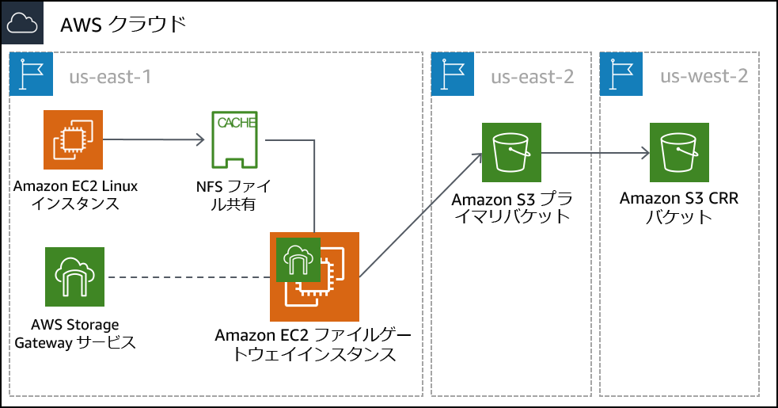
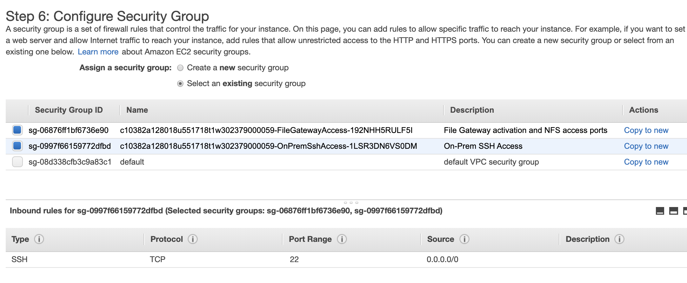
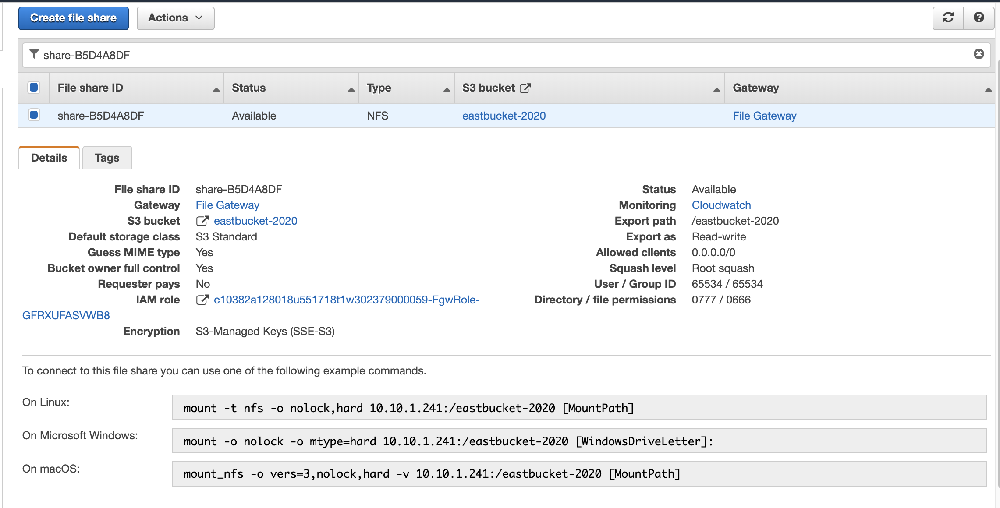

# モジュール 14 – ガイド付きラボ: AWS Storage Gateway のファイルゲートウェイを使用したハイブリッドストレージとデータ移行
[//]: # "SKU: ILT-TF-200-ACACAD-2    Source Course: SPL-223"

## ラボの概要と目標

このラボでは、AWS Storage Gateway のファイルゲートウェイサービスを使用してネットワークファイルシステム（NFS）マウントをオンプレミスのデータストアにアタッチします。次に、そのデータを AWS の S3 バケットにレプリケートします。さらに、Amazon S3 ライフサイクルポリシーやクロスリージョンレプリケーションといった高度な Amazon S3 機能を設定します。

このラボを完了すると、次のことができるようになります。

- NFS ファイル共有を使用してファイルゲートウェイを構成し、Linux インスタンスにアタッチする
- Linux インスタンスから S3 バケットにデータセットを移行する
- プライマリ S3 バケットを作成して設定し、オンプレミスのサーバーデータを AWS に移行する
- セカンダリ S3 バケットを作成して設定し、クロスリージョンレプリケーションに使用する
- S3 ライフサイクルポリシーを作成し、バケットのデータを自動で管理する

<br/>

## 所要時間

このラボは、修了までに約 **90 分**かかります。

<br/>

## AWS サービスの制限事項

このラボ環境では、AWS のサービスとサービスアクションへのアクセスが、ラボの手順を完了するために必要なものに制限されています。他のサービスへのアクセスや、このラボで説明されているサービス以外のアクションを実行しようとすると、エラーが発生することがあります。

<br/>

## AWS マネジメントコンソールにアクセスする

1. この手順の上部にある <span id="ssb_voc_grey">Start Lab</span> をクリックし、ラボを起動します。

   [**Start Lab**] パネルが開き、ラボのステータスが表示されます。

   <i class="fas fa-info-circle"></i> **ヒント**: ラボの完了までにさらに時間が必要な場合は、<span id="ssb_voc_grey">Start Lab</span> ボタンをもう一度クリックして、この環境のタイマーを再開します。

2. \[**Start Lab**] パネルに **Lab status: ready** というメッセージが表示されたら [**X**] をクリックしてパネルを閉じます。

3. この手順の上部にある <span id="ssb_voc_grey">AWS</span> をクリックします。

   このアクションにより、新しいブラウザタブで AWS マネジメントコンソールが開き、ユーザーは自動的にログインします。

   <i class="fas fa-exclamation-triangle"></i> **ヒント**: 新しいブラウザタブが開かない場合、通常、ブラウザによってサイトのポップアップウィンドウの表示がブロックされたというメッセージが表示されたバナーまたはアイコンがブラウザの上部に表示されます。バナーまたはアイコンをクリックして [**ポップアップを許可**] をクリックしてください。

4. **AWS マネジメントコンソール**タブがこの手順と並べて表示されるようにします。両方のブラウザタブを同時に開いておくと、ラボのステップを実行しやすくなります。

   <i class="fas fa-exclamation-triangle"></i> **特に指示がない限り、リージョンを変更しないでください**。

<br/>

## タスク 1: ラボアーキテクチャを確認する

このラボ環境では、全部で 3 つの AWS リージョンを使用します。オンプレミスサーバーをエミュレートする Linux EC2 インスタンスは、us-east-1（バージニア北部）リージョンにデプロイされます。Storage Gateway 仮想アプライアンスは、Linux サーバーと同じリージョンにデプロイされます。実際のシナリオでは、アプライアンスは VMware vSphere または Microsoft Hyper-V 環境でデプロイされるか、Storage Gateway の物理アプライアンスとしてデプロイされます。

プライマリ S3 バケットは、us-east-2（オハイオ）リージョンに作成されます。Linux ホストのデータは、プライマリ S3 バケットにコピーされます。このバケットを**送信元**と呼びます。

セカンダリ S3 バケットは、us-west-2（オレゴン）リージョンに作成されます。このセカンダリバケットはクロスリージョンレプリケーションポリシーの**ターゲット**に当たり、**送信先**と呼びます。




<br/>

## タスク 2: プライマリ S3 バケットとセカンダリ S3 バケットを作成する

ファイルゲートウェイを構成する前に、データをレプリケートするプライマリ S3 バケット（送信元）を作成する必要があります。クロスリージョンレプリケーションに使用するセカンダリバケット（送信先）も作成します。

5. **AWS マネジメントコンソール**の <span id="ssb_services">サービス</span> で [**S3**] をクリックします。

6. <span id="ssb_orange">バケットを作成</span> をクリックし、以下のように設定します。

- **バケット名:** 覚えやすい名前を作成します。グローバルに一意である必要があります。
- **リージョン**: **米国東部 (オハイオ) us-east-2**

7. <span id="ssb_orange">バケットを作成</span> をクリックします。

8. 作成したバケットをクリックし、[**プロパティ**] タブをクリックします。

9. \[**バケットのバージョニング**] で [**編集する**] をクリックし、[**有効にする**] をクリックして [**変更の保存**] をクリックします。

   <i class="fas fa-info-circle"></i> クロスリージョンレプリケーションの場合は、送信元と送信先の両方のバケットのバージョニングを有効にする必要があります。

10. このタスクのここまでの手順を繰り返して 2 つ目のバケットを作成し、以下のように設定します。

    - **バケット名:** 覚えやすい名前を作成します。グローバルに一意である必要があります。
    - **リージョン:** **米国西部 (オレゴン) us-west-2**
    - **バケットのバージョニング:** **有効**

<br/>

## タスク 3: クロスリージョンレプリケーションを有効にする

2 種類の S3 バケットを作成し、それぞれのバージョニングを有効にしたら、レプリケーションポリシーを作成します。

11. 米国東部（オハイオ）リージョンに作成した**送信元**バケットの名前をクリックします。

12. \[**管理**] タブをクリックし、[**レプリケーションルール**] セクションに移動します。

13. <span id="ssb_s3_blue"><i class="fas fa-plus"></i>レプリケーションルールを作成</span> をクリックし、以下のように設定します。

    - **ルールスコープを選択:** <i class="far fa-dot-circle"></i> **このルールは、バケット内のすべてのオブジェクトに適用されます**
    - **送信先:** <i class="far fa-dot-circle"></i> **このアカウントのバケットを選択する**
       - [**S3 の参照**] をクリックして、米国西部（オレゴン）リージョンに作成したバケットを選択します。
    - **IAM ロール:** **S3-CRR-Role**
       - **注:** AWS Identity and Access Management (IAM) ロールを見つけるには、検索ボックスに`S3-CRR`と入力します（このロールは事前に作成されており、このラボに必要なアクセス許可が付与されています）。

14. \[**レプリケーションルールの設定**] セクションにまで上にスクロールします。

    - **レプリケーションルール名:** `crr-full-bucket`

15. <span id="ssb_s3_blue"></i>保存</span> をクリックします。

16. 左側のナビゲーションペインで、[**バケット**]を選択し、バケット一覧の画面に戻ります。

    **注**: 「レプリケーションルールが保存されましたが、機能しない場合があります」というメッセージが表示された場合は、無視して次の手順に進みます。

17. 米国東部（オハイオ）リージョンに作成したバケットに戻ります。

18. ローカルコンピュータのファイルをバケットにアップロードします。

    **このラボでは、空のテキストファイルなど、機密情報が含まれていない小さなファイルを使用します。**

19. ファイルがアップロードされたら、米国西部（オレゴン）リージョンに作成したバケットに戻ります。アップロードしたファイルがこのバケットにもコピーされています。

    **注:** 場合によってはウィンドウの <i class="fas fa-sync"></i> 更新ボタンをクリックする必要があります。

<br/>

## タスク 4: ファイルゲートウェイを構成して NFS ファイル共有を作成する

このタスクでは、ファイルゲートウェイアプライアンスを Amazon Elastic Compute Cloud (Amazon EC2) インスタンスとしてデプロイします。次にキャッシュデスクを設定し、オンプレミスのファイルを同期する S3 バケット を指定して、使用する IAM ポリシーを設定します。最後に、ファイルゲートウェイに NFS ファイル共有を作成します。

20. <span id="ssb_services">サービス</span> で [**Storage Gateway**] をクリックします。

[**サービス**] の横にあるボックスで [**Storage Gateway**] を検索すると、簡単に見つけることができます。

21. コンソール上部で、現在のリージョンが**バージニア北部**であることを確認します。

    AWS Storage Gateway の開始方法のページが表示されます。このページが表示されるのは、このリージョンで Storage Gateway サービスが構成されていないためです。

22. <span id="ssb_blue"></i>今すぐ始める</span> をクリックします。

    開始方法のページが表示されない場合は、<span id="ssb_blue"></i>ゲートウェイの作成</span> をクリックします。

23. \[**ファイルゲートウェイ**] をクリックし、<span id="ssb_blue"></i>次へ</span> をクリックします。

24. \[**Amazon EC2**] をクリックし、<span id="ssb_grey"></i> <i class="fas fa-external-link-alt"></i>インスタンスの起動</span> ボタンをクリックします。

    新しいタブで EC2 インスタンス作成ウィザードが開きます。このリンクでは、ファイルゲートウェイアプライアンスに使用する必要がある適切な Amazon マシーンイメージ（AMI）が自動的にクリックされます。

25. \[**t2.xlarge**] インスタンスタイプを選択し、<span id="ssb_grey"></i>次のステップ: インスタンスの詳細の設定</span> をクリックします。

    **注:** このラボ環境でクリックできるインスタンスタイプは t2.xlarge のみです。その他のインスタンスタイプをクリックすると、ウィザードの最後にエラーメッセージが表示されます。

    <i class="fas fa-info-circle"></i> t2.xlarge インスタンスタイプは、このラボにおけるサンプルとしてのみ使用されます。Storage Gateway アプライアンスをデプロイする際の適切なアプライアンスのサイズ設定については、[Storage Gateway ドキュメント](https://docs.aws.amazon.com/storagegateway/latest/userguide/Requirements.html#requirements-hardware-storage)を参照してください。

26. \[**インスタンスの詳細の設定**] 画面で、以下のように設定します。

    - **インスタンス数:** `1`
    - **ネットワーク:** **On-Prem-VPC**
    - **サブネット:** **On-Prem-Subnet**
    - **自動割り当てパブリック IP:** **サブネット設定を使用 (有効)**
    - その他のオプションではデフォルト値をそのまま使用します。

    **注**: 「インスタンスプロファイルをリストするアクセス許可がありません。管理者にお問い合わせいただくか、IAM のアクセス許可を確認してください。」のような警告メッセージは無視できます。

27. <span id="ssb_grey"></i>次のステップ: ストレージの追加</span> をクリックします。

28. <span id="ssb_grey"></i>新しいボリュームの追加</span> をクリックし、以下のように設定します。

    - **ボリュームタイプ:** **EBS**
    - **デバイス:** **/dev/sdb**
    - **サイズ (GiB):** `150`
    - **ボリュームタイプ:** **汎用 SSD (gp2)**
    - **終了時に削除:** <i class="far fa-check-square"></i>

29. <span id="ssb_grey"></i>次のステップ: タグの追加</span> をクリックします。

30. <span id="ssb_grey"></i>タグの追加</span> をクリックし、以下のように設定します。

    - **キー:** `Name`
    - **値:** `File Gateway Appliance`
    - **インスタンス:** <i class="far fa-check-square"></i>
    - **ボリューム:** <i class="far fa-check-square"></i>

    **注:** タグの大文字と小文字は区別されます。

31. <span id="ssb_grey"></i>次のステップ: セキュリティグループの設定</span> をクリックします。

32. \[**既存のセキュリティグループを選択する**] をクリックし、以下を選択します。

    - **File Gateway activation and NFS access ports**

       - このセキュリティグループは、ポート 80 (HTTP)、443 (HTTPS)、53 (DNS)、123 (NTP)、2049 (NFS) を経由するトラフィックを許可するように構成されています。これらのポートによって File Gateway Appliance のアクティベーションが有効になります。Linux サーバーから、ファイルゲートウェイに作成する NFS 共有への接続を有効にすることもできます。

      Storage Gateway で使用するポートの詳細については、[Storage Gateway ドキュメント](https://docs.aws.amazon.com/storagegateway/latest/userguide/Requirements.html#networks)を参照してください。

    - **On-Prem SSH Access**

       - このセキュリティグループは、ポート 22 で Secure Shell (SSH) 接続を許可するように構成されています。

    

33. <span id="ssb_blue"></i>確認と作成</span> をクリックします。

    **注:** 次の画面の上部に警告メッセージが表示されますが、このラボでは無視してかまいません。本番環境でインスタンスへの望ましくない接続や悪意のある接続を防ぐには、常にできるだけ制限の厳しいセキュリティグループを作成する必要があります。

34. <span id="ssb_blue"></i>起動</span> をクリックします。

35. \[**既存のキーペアを選択するか、新しいキーペアを作成します**] ダイアログボックスで、以下のように設定します。

    - **既存のキーペアの選択**
    - **キーペアの選択:** 使用できるキーをクリックします。
    - <i class="far fa-check-square"></i> **選択したプライベートキーファイル (vockey.pem) へのアクセス権があり、このファイルなしではインスタンスにログインできないことを認識しています。** チェックボックスをオン

    **注:** このキーペアは、このラボの [**Details**] ドロップダウンメニューから [**Show**] を選択して表示される [**Credentials**] ページに表示されます。

36. <span id="ssb_blue"></i>インスタンスの作成</span> をクリックします。

37. <span id="ssb_blue"></i>インスタンスの表示</span> をクリックします。

    File Gateway Appliance インスタンスのデプロイには数分かかります。

38. デプロイのステータスをモニタリングし、**ステータスチェック** が完了するまで待ちます。

    **注:** 場合によってはウィンドウ右上の <i class="fas fa-sync"></i> 更新ボタンをクリックする必要があります。

39. リストからファイルゲートウェイインスタンスをクリックし、画面下部で **IPv4 パブリック IP** アドレスを探してコピーします。この IP アドレスは、ファイルゲートウェイのデプロイが完了した際に使用します。

40. ブラウザの [**AWS Storage Gateway**] タブに戻ります。この時点では [**ホストプラットフォームの選択**] 画面が表示されています。

41. **Amazon EC2** が選択されていることを確認し、<span id="ssb_blue"></i>次へ</span> をクリックします。

42. エンドポイントの種類で [**パブリック**] をクリックし、 <span id="ssb_blue"></i>次へ</span> をクリックします。

43. ファイルゲートウェイアプライアンスインスタンスからコピーした**パブリック IPv4 アドレス**を貼り付け、<span id="ssb_blue"></i>ゲートウェイに接続</span> をクリックします。

44. \[**ゲートウェイのアクティブ化**] 画面で、以下のように設定します。

    - **ゲートウェイのタイムゾーン:** **GMT -5:00 東部標準時 (米国およびカナダ)**
    - **ゲートウェイ名:** `File Gateway`

45. <span id="ssb_blue"></i>ゲートウェイのアクティブ化</span> をクリックします。

46. \[**ローカルディスクの構成**] 画面で、[**ローカルディスクを準備中**] ステータスの表示が処理完了になるまで待ちます（約 1 分）。

47. 処理が完了したら [**割り当て済み**] に移動し、[**キャッシュ**] を選択します。

48. <span id="ssb_blue"></i>ログ記録を設定</span> をクリックします。

49. \[**ゲートウェイのヘルスロググループ**] 画面で [**ゲートウェイヘルスロググループ**] の [**ログ記録を無効化**] をクリックします。

50. <span id="ssb_blue"></i>保存して続行</span> をクリックします。

51. File Gateway の [**ステータス**] が [**実行中**] に変わるまで待ちます（約 1～2 分）。その後、**File Gateway** エントリを選択し、<span id="ssb_grey"></i>ファイル共有の作成</span> をクリックします。

52. \[**ファイル共有の設定**] 画面で、以下のように設定します。
    - **Amazon S3 バケット名**: タスク 1 で米国東部（オハイオ）リージョンに作成した送信元バケットの名前を入力します。
    - **オブジェクトへのアクセスに次を使用**: **ネットワークファイルシステム (NFS)**
    - **ゲートウェイ:** 作成したファイルゲートウェイ名をクリックします（これは **File Gateway** となっている必要があります）。

53. <span id="ssb_blue"></i>次へ</span> をクリックします。

54. \[**Amazon S3 でファイルを保存する方法の設定**] 画面で、以下のように設定します。

    - **新しいオブジェクトのストレージクラス:** **S3 スタンダード**
    - **オブジェクトのメタデータ**:
       - <i class="far fa-check-square"></i> **MIME の種類の推測**
       - <i class="far fa-check-square"></i> **バケット所有者に完全なコントロールを付与**
       - <i class="far fa-square"></i>**リクエスタ支払い**を有効にする
    - **S3 バケットへのアクセス**: **既存の IAM ロールを使用する**
    - **IAM ロール:** **FgwIamPolicyARN** を貼り付けます。これは以下の手順で取得できます。
       - 手順の上にある <span id="ssb_voc_grey">Details</span>ドロップダウンメニューをクリックします。
       - <span id="ssb_voc_grey">Show</span> をクリックします。
       - **FgwIamPolicyARN** の値をコピーします。

55. <span id="ssb_blue"></i>次へ</span> をクリックします。

    **注:** ファイル共有がどこからでもアクセス可能という警告メッセージが表示されることがありますが、このラボでは無視してかまいません。本番環境でインスタンスへの望ましくない接続や悪意のある接続を防ぐには、常にできるだけ制限の厳しいポリシーを作成する必要があります。

56. <span id="ssb_blue"></i>ファイル共有の作成</span> をクリックします。

57. デプロイのステータスをモニタリングし、[**ステータス**] が [**利用可能**] に変わるまで待ちます。これは 1 分以内に終了します。

    **注:** 場合によってはウィンドウ右上の <i class="fas fa-sync"></i> 更新ボタンをクリックする必要があります。

58. 作成したファイル共有をクリックします。画面下部で、ファイル共有を Linux にマウントするためのコマンドをメモします。これは次のタスクで必要になります。

    

<br/>

## タスク 5: ファイル共有を Linux インスタンスにマウントしてデータを移行する

作成した NFS 共有にデータを移行する前に、共有をマウントする必要があります。このタスクでは、NFS 共有を Linux サーバーにマウントし、その共有にデータをコピーします。

59. **On-Prem Linux Server** インスタンスに接続します。

### <i class="fab fa-windows"></i>Microsoft Windows ユーザーの場合

<i class="fas fa-comment"></i> この手順は Microsoft Windows ユーザーのみを対象としています。macOS または Linux をお使いの場合は、<a href="#ssh-MACLinux">次のセクションに進みます</a>。


60. 現在読んでいる手順の上部にある<span id="ssb_voc_grey">Details</span>ドロップダウンメニューから <span id="ssb_voc_grey">Show</span>を選択します。

    [**Credentials**] ウィンドウが開きます。

61. \[**Download PPK**] ボタンをクリックし、**labsuser.ppk** ファイルを保存します。

    **注意:** 通常はブラウザによってファイルは **Download** ディレクトリに保存されます。

62. **OnPremLinuxInstance** アドレスが表示されている場合はメモします。

63. \[**X**] をクリックして [**Credentials**] パネルを閉じます。

64. SSH を使用して EC2 インスタンスにアクセスするには、**PuTTY** を使用する必要があります。お使いのコンピュータに PuTTY がインストールされていない場合は、<a href="https://the.earth.li/~sgtatham/putty/latest/w64/putty.exe">PuTTY をダウンロード</a>します。

65. **putty.exe** を開きます。

66. PuTTY セッションを長時間維持するには、PuTTY タイムアウトを設定します。

    [**Connection**] をクリックします  
     **Seconds between keepalives**:` 30`

67. 次の手順に従って、PuTTY セッションを設定します。

    [**Session**] をクリックします。  
      **Host Name (or IP address):** 先ほどメモしたインスタンスの**OnPremLinuxInstance** を貼り付けます。  
      または、Amazon EC2 コンソールに戻って [**インスタンス**] をクリックします。  
      接続するインスタンスを選択します。
      [**詳細**] タブで、[**パブリック IPv4 アドレス**] の値をコピーします。  

    PuTTY に戻り、[**Connection**] リストで <i class="far fa-plus-square"></i> **SSH** を展開します。  
    [**Auth**] をクリックします（展開しないでください）。  
    [**Browse**] をクリックします。  
    ダウンロードした **labsuser.ppk** ファイルを参照してクリックします。  
    ファイルをクリックするには、[**開く**] をクリックします。  
    もう一度 [**Open**] をクリックします。


68. ホストを承認して接続するには、[**はい**] をクリックします。

69. **Login as** と表示されたら、`ec2-user` と入力します。

    このアクションにより、EC2 インスタンスに接続されます。

70. Microsoft Windows ユーザーの場合:<a href="#ssh-after">こちらをクリックして次のタスクに進みます。</a>


<a id='ssh-MACLinux'></a>

### Mac OS<span style="font-size: 30px; color: #808080;"><i class="fab fa-apple"></i></span> ユーザーおよび Linux <span style="font-size: 30px; "><i class="fab fa-linux"></i></span>ユーザー

この手順は macOS ユーザーと Linux ユーザーのみを対象としています。Windows ユーザーの場合は、<a href="#ssh-after">次のタスクに進みます。</a>

71. 現在読んでいる手順の上部にある <span id="ssb_voc_grey">Details</span>ドロップダウンメニューから <span id="ssb_voc_grey">Show</span> を選択します。

    [**Credentials**] ウィンドウが開きます。

72. \[**Download PEM**] をクリックし、**labsuser.pem** ファイルを保存します。

73. **OnPremLinuxInstance** アドレスが表示されている場合はメモします。

74. \[**X**] をクリックして [**Credentials**] パネルを閉じます。

75. ターミナルウィンドウを開き、**cd** コマンドを使用して、ディレクトリを `labsuser.pem` ファイルをダウンロードしたディレクトリに変更します。

    例えば、**labsuser.pem** ファイルが **Download** ディレクトリに保存されている場合は、次のコマンドを実行します。

    ```bash
    cd ~/Downloads
    ```

76. 次のコマンドを実行して、キーのアクセス許可を読み取り専用に変更します。

    ```bash
    chmod 400 labsuser.pem
    ```

77. 以下のコマンドを実行します（**<public-ip\>** を、先ほどコピーした **OnPremLinuxInstance** アドレスに置き換えます）。

    または、Amazon EC2 コンソールに戻って [**インスタンス**] をクリックし、オンプレミスインスタンスの IP アドレスを探します。  
    接続するインスタンスをクリックします。  
    [**詳細**] タブで、[**パブリック IPv4 アドレス**] の値をコピーします。  

    ```bash
    ssh -i labsuser.pem ec2-user@<public-ip>
    ```

78. リモート SSH サーバーへの最初の接続を許可するかどうかを確認するプロンプトが表示されたら、`yes` と入力します。

    認証にキーペアを使用しているため、パスワードの入力は要求されません。

    <a id='ssh-after'></a>

<br/>

#### インスタンスに接続できるようになりました。

79. Linux インスタンスでこのサーバーにあるデータを表示するには、以下のコマンドを入力します。

    `ls /media/data`

    PNG 形式の画像ファイルが 20 件表示されます。

80. 以下のコマンドを使用して、S3 バケットにデータを同期する際に使用するディレクトリを作成します。

    `sudo mkdir -p /mnt/nfs/s3`

81. 前のタスクの最後にコピーしたコマンドを使用して、Linux インスタンスにファイル共有をマウントします。

    ```bash
    sudo mount -t nfs -o nolock,hard <File-Gateway-appliance-private-IP-address>:/<S3-bucket-name> /mnt/nfs/s3
    ```

    例:
    ```bash
    sudo mount -t nfs -o nolock,hard 10.10.1.33:/lab-nfs-bucket /mnt/nfs/s3
    ```

82. 以下のコマンドを入力して、共有が正しくマウントされたことを確認します。

    `df -h`

    コマンドの出力は、次の例のようになります。

```pseudocode
  [ec2-user@ip-10-10-1-210 ~]$ df -h
  Filesystem                  Size  Used Avail Use% Mounted on
  devtmpfs                    483M   64K  483M   1% /dev
  tmpfs                       493M     0  493M   0% /dev/shm
  /dev/xvda1                  7.8G  1.1G  6.6G  14% /
  10.10.1.33:/lab-nfs-bucket  8.0E     0  8.0E   0% /mnt/nfs/s3
  ```

83. これでマウントポイントが作成されました。以下のコマンドを使用して、Amazon S3 に移行するデータを共有にコピーできます。

    `cp -v /media/data/**.png /mnt/nfs/s3`


<br/>

## タスク 6: データが移行されたことを確認する

ゲートウェイの構成と、NFS 共有へのデータのコピーが完了しました。ここでは設定が意図したとおりに機能していることを確認します。

84. <span id="ssb_services">サービス</span> で [**S3**] をクリックします。

85. 米国東部（オハイオ）リージョンに作成したバケットをクリックし、20 件の画像ファイルが一覧表示されることを確認します。

    **注:** 場合によってはウィンドウ右上の <i class="fas fa-sync"></i> 更新ボタンをクリックする必要があります。

86. S3 バケットのページに戻り、米国西部（オレゴン）リージョンに作成したバケットをクリックします。先ほど作成したポリシーに基づいて、このバケットに画像ファイルがレプリケートされていることを確認します。

<br/>

AWS Storage Gateway をファイルゲートウェイモードで使用して、Amazon S3 にデータを正常に移行しました。Amazon S3 に保存したデータは、Amazon S3 のネイティブデータと同様に処理できます。このラボでは、レプリケーションポリシーを作成してデータをセカンダリリージョンにコピーしました。その他にも、ライフサイクルポリシーの設定などの操作も実行できます。たとえば、使用頻度の低いデータを S3 標準から Amazon Simple Storage Service Glacier に自動的に移行させて長期的に保存し、コストを削減できます。

<br/>

## 作業内容を送信する

87. この手順の上部にある <span id="ssb_blue">Submit</span> をクリックして進捗情報を記録し、プロンプトが表示されたら [**Yes**] をクリックします。


88. 数分経っても結果が表示されない場合は、この手順の上部に戻り、<span id="ssb_voc_grey">Grades</span> をクリックします。

    **ヒント**: 作業内容は何度も送信できます。作業内容を変更したら、再度 [**Submit**] をクリックします。最終送信分がこのラボの作業内容として記録されます。


89. 作業に関する詳細なフィードバックを参照するには、<span id="ssb_voc_grey">Details</span> ドロップダウンメニューから <i class="fas fa-caret-right"></i> [**View Submission Report**] を選択します。


<br/>

## ラボの終了<i class="fas fa-graduation-cap"></i>

<i class="fas fa-flag-checkered"></i>お疲れ様でした。ラボが終了しました。


90. ラボを終了するには、このページの上部にある <span id="ssb_voc_grey">End Lab</span> をクリックし、<span id="ssb_blue">Yes</span> をクリックします。

    パネルに **DELETE has been initiated... You may close this message box now** というメッセージが表示されます。

91.  右上隅の [**X**] をクリックしてパネルを閉じます。

<br/>

**©2020 Amazon Web Services, Inc. and its affiliates. All rights reserved. このトレーニング内容の全体または一部を複製または再配布することは、Amazon Web Services, Inc. の書面による事前の許可がある場合を除き、禁じられています。商業目的のコピー、貸与、または販売を禁止します。**
