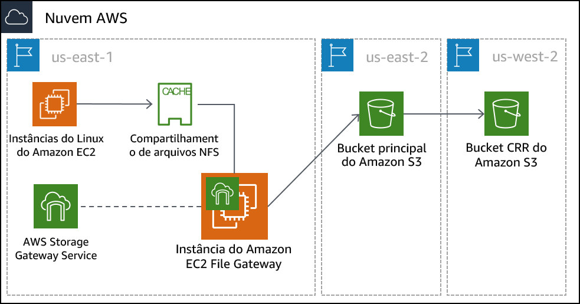

# Módulo 14 – Laboratório guiado: Armazenamento híbrido e migração de dados com o File Gateway do AWS Storage Gateway
[//]: # "SKU: ILT-TF-200-ACACAD-2    Source Course: SPL-223"

## Visão geral e objetivos do laboratório

Neste laboratório, você usará o serviço File Gateway do AWS Storage Gateway para associar uma montagem NFS (Network File System) a um armazenamento de dados on-premises. Em seguida, você replicará esses dados para um bucket do S3 na AWS. Além disso, você configurará recursos avançados do Amazon S3, como políticas de ciclo de vida do Amazon S3 e replicação entre regiões.

Depois de concluir este laboratório, você deverá ser capaz de:

- Configurar um File Gateway com um compartilhamento de arquivos NFS e associá-lo a uma instância do Linux
- Migrar um conjunto de dados da instância do Linux para um bucket do S3
- Criar e configurar um bucket principal do S3 para migrar dados do servidor on-premises para a AWS
- Criar e configurar um bucket secundário do S3 a ser usado para replicação entre regiões
- Criar uma política de ciclo de vida do S3 para gerenciar automaticamente dados em um bucket

<br/>
## Duração

Este laboratório levará aproximadamente **90 minutos** para ser concluído.

<br/>
## Restrições de serviço da AWS

Neste ambiente de laboratório, o acesso aos serviços e ações de serviço da AWS pode estar restrito àqueles necessários para concluir as instruções do laboratório. Você poderá encontrar erros se tentar acessar outros serviços ou executar ações além do que está descrito neste laboratório.

<br/>
## Acessar o Console de Gerenciamento da AWS

1. Na parte superior destas instruções, escolha <span id="ssb_voc_grey">Start Lab</span> (Iniciar laboratório) para iniciar o laboratório.

   Um painel **Start Lab** (Iniciar laboratório) é aberto com o status do laboratório.

   <i class="fas fa-info-circle"></i> **Dica**: se você precisar de mais tempo para concluir o laboratório, escolha novamente o botão <span id="ssb_voc_grey">Start Lab</span> (Iniciar laboratório) para reiniciar o cronômetro do ambiente.

2. Aguarde até que o painel **Start Lab** (Iniciar laboratório) exiba a mensagem *Lab status: ready (Status do laboratório: pronto)* e, em seguida, escolha **X** para fechar o painel.

3. Na parte superior destas instruções, escolha <span id="ssb_voc_grey">AWS</span>.

   Essa ação abrirá o Console de Gerenciamento da AWS em uma nova guia do navegador. O sistema fará seu login automaticamente.

   <i class="fas fa-exclamation-triangle"></i> **Dica**: se uma nova guia do navegador não for aberta, normalmente você verá uma faixa ou um ícone na parte superior do navegador com uma mensagem informando que o navegador está impedindo que o site abra janelas pop-up. Escolha a faixa ou o ícone e depois **Allow pop ups** (Permitir pop-ups).

4. Organize a guia do **Console de Gerenciamento da AWS** para que ela seja exibida com essas instruções. O ideal é ver as duas guias do navegador abertas ao mesmo tempo, para facilitar o acompanhamento das etapas do laboratório.

   <i class="fas fa-exclamation-triangle"></i> **Não altere a região, a menos que seja especificamente instruído a fazer isso**.

<br/>
## Tarefa 1: analisar a arquitetura do laboratório

Esse ambiente de laboratório usa três regiões da AWS no total. Uma instância do EC2 de Linux que emula um servidor on-premises é implantada na região us-east-1 (Virgínia do Norte). O dispositivo virtual Storage Gateway é implantado na mesma região que o servidor Linux. Em um cenário real, o dispositivo seria implantado em um ambiente VMware vSphere ou Microsoft Hyper-V ou como um dispositivo físico do Storage Gateway.

O bucket principal do S3 é criado na região us-east-2 (Ohio). Os dados do host Linux são copiados para o bucket principal do S3. Esse bucket também pode ser chamado de *origem*.

O bucket secundário do S3 é criado na região us-west-2 (Oregon). Esse bucket secundário é o *destino* da política de replicação entre regiões. Ele também pode ser chamado de *destino*.




<br/>
## Tarefa 2: criar os buckets principal e secundário do S3

Antes de configurar o File Gateway, você deve criar o bucket principal do S3 (ou a origem), em que você replicará os dados. Você também criará o bucket secundário (ou o destino), que será usado para a replicação entre regiões.

5. No **Console de Gerenciamento da AWS**, no menu <span id="ssb_services">Services</span> (Serviços), selecione **S3**.

6. Escolha <span id="ssb_orange">Create bucket</span> (Criar bucket) e defina estas configurações:

- **Bucket name** (Nome do bucket): crie um nome que você consiga lembrar facilmente. Ele deve ser globalmente único.
- **Region (Região):** *US East (Ohio) (Leste dos EUA [Ohio])*

7. Escolha <span id="ssb_orange">Create</span> (Criar)

8. Clique no bucket que você criou e depois na guia **Properties** (Propriedades).

9. Em **Versioning** (Versionamento), clique em **Enable versioning** (Ativar versionamento) e depois em **Save** (Salvar).

   <i class="fas fa-info-circle"></i> Para a replicação entre regiões, você deve habilitar o versionamento para os buckets de origem e de destino.

10. Repita as etapas anteriores desta tarefa para criar um segundo bucket com a seguinte configuração:

- **Bucket name** (Nome do bucket): crie um nome que você consiga lembrar facilmente. Ele deve ser globalmente único.
- **Region** (Região): *US West (Oregon) (Oeste dos EUA [Oregon])*
- **Versioning** (Versionamento): *Enabled (Habilitado)*

<br/>
## Tarefa 3: habilitar a replicação entre regiões

Agora que você criou seus dois buckets do S3 e habilitou o versionamento neles, pode criar uma política de replicação.

11. Selecione o nome do bucket de *origem* que você criou na região Leste dos EUA (Ohio).

12. Selecione a guia **Management** (Gerenciamento) e escolha <span id="ssb_s3_white"></i> Replication</span> (Replicação)

13. Escolha <span id="ssb_s3_blue"><i class="fas fa-plus"></i>Add rule</span> (Adicionar regra) e depois ajuste estas configurações:

- **Set source** (Definir origem): *Entire bucket (Bucket inteiro)*
- Escolha <span id="ssb_s3_blue"></i> Next</span> (Próximo)
- **Bucket de destino:**
   - <i class="far fa-dot-circle"></i> *Buckets nesta conta*
   - Selecione o bucket que você criou na região Oeste dos EUA (Oregon). Talvez seja necessário rolar para baixo para conseguir vê-lo.
- Escolha <span id="ssb_s3_blue"></i> Next</span> (Próximo)

14. Na tela **Configure rules options** (Configurar opções de regras), ajuste estas configurações:

- **IAM role** (Função do IAM): *S3-CRR-Role*
   - **Observação:** para localizar a função do AWS Identity and Access Management (IAM), na caixa de pesquisa, insira `S3-CRR` (essa função foi pré-criada com as permissões necessárias para este laboratório)
- **Rule name** (Nome da regra): `crr-full-bucket`

15. Escolha <span id="ssb_s3_blue"></i> Next (Próximo)</span>

16. Revise as configurações e escolha <span id="ssb_s3_blue"></i> Save</span> (Salvar)

**Observação**: se a mensagem *The replication rule is saved, but it might not work (A regra de replicação foi salva, mas talvez não funcione)* for exibida, você poderá ignorá-la e avançar para a etapa seguinte.

17. Retorne ao bucket que você criou na região Leste dos EUA (Ohio).

18. Faça upload de um arquivo do computador local para o bucket.

*Para este laboratório, use um arquivo pequeno que não contenha informações confidenciais, como um arquivo de texto em branco.*

19. Aguarde até que o arquivo seja carregado e, em seguida, retorne ao bucket criado na região Oeste dos EUA (Oregon). O arquivo que você fez upload também deve ser copiado para esse bucket.

**Observação:** talvez seja necessário escolher o botão de atualização <i class="fas fa-sync"></i> na área superior direita da janela.

<br/>
## Tarefa 4: configurar o File Gateway e criar um compartilhamento de arquivos NFS

Nesta tarefa, você implantará o dispositivo do File Gateway como uma instância do Amazon Elastic Compute Cloud (Amazon EC2). Em seguida, configurará um disco de cache, selecionará um bucket do S3 para sincronizar seus arquivos on-premises e escolherá uma política do IAM para usar. Por fim, criará um compartilhamento de arquivos NFS no File Gateway.

20. No canto superior esquerdo, escolha o menu <span id="ssb_services">Services</span> (Serviços) e, em seguida, selecione **Storage Gateway**.

Você também pode procurar o *Storage Gateway* na parte superior do menu **Services (Serviços)** para facilitar a localização.

21. No canto superior direito do console, verifique se a região atual é *N. Virginia (Virgínia do Norte)*.

Uma página de conceitos básicos do AWS Storage Gateway deverá ser exibida porque o serviço Storage Gateway não foi configurado nesta região.

22. Escolha <span id="ssb_blue"></i> Get started</span> (Comece a usar)

   Se você não vir a página de conceitos básicos, selecione <span id="ssb_blue"></i> Create gateway</span> (Criar gateway)

23. Selecione **File gateway** (Gateway de arquivos) e escolha <span id="ssb_blue"></i> Next</span> (Próximo)

24. Selecione **Amazon EC2** e escolha o botão <span id="ssb_grey"></i> <i class="fas fa-external-link-alt"></i> Launch instance</span> (Executar instância).

Uma nova guia é aberta para o assistente de execução da instância do EC2. Esse link seleciona automaticamente a Amazon Machine Image (AMI) correta que deve ser usada para o dispositivo do File Gateway.

25. Selecione o tipo de instância **t2.xlarge** e escolha <span id="ssb_grey"></i> Next: Configure Instance Details</span> (Próximo: Configurar detalhes da instância)

**Observação:** t2.xlarge é o único tipo de instância que você pode selecionar neste ambiente de laboratório. Se você selecionar qualquer outro tipo, receberá uma mensagem de erro na parte final do assistente.

<i class="fas fa-info-circle"></i> O tipo de instância t2.xlarge é utilizado somente como um exemplo neste laboratório. Para obter o dimensionamento correto do dispositivo ao implantar um dispositivo do Storage Gateway, consulte a [documentação do Storage Gateway](https://docs.aws.amazon.com/storagegateway/latest/userguide/Requirements.html#requirements-hardware-storage).

26. Na tela **Configure instance details** (Configurar detalhes da instância), ajuste estas configurações:

- **Number of instances** (Número de instâncias): `1`
- **Network** (Rede): *On-Prem-VPC*
- **Subnet** (Sub-rede): *On-Prem-Subnet*
- **Auto-assign Public IP** (Atribuir IP público automaticamente): *Use subnet setting (Usar configuração de sub-rede)* (Enable [Ativar])
- Aceite os valores padrão das opções restantes

   **Observação**: Você pode ignorar mensagens de aviso como: *You do not have permissions to list instance profiles. Contact your administrator, or check your IAM permissions (Você não tem permissões para listar perfis de instância. Entre em contato com seu administrador ou verifique suas permissões do IAM).*

27. Escolha <span id="ssb_grey"></i>Next: Add Storage</span> (Próximo: adicionar armazenamento)

28. Escolha <span id="ssb_grey"></i> Add New Volume</span> (Adicionar novo volume) e ajuste estas configurações:

- **Volume Type** (Tipo de volume): *EBS*
- **Device** (Dispositivo): */dev/sdb*
- **Size** (Tamanho) **(GiB)**: `150`
- **Volume Type** (Tipo de volume): *General Purpose SSD (SSD de uso geral) (gp2)*
- **Delete on termination** (Excluir no encerramento): <i class="far fa-check-square"></i>

29. Escolha <span id="ssb_grey"></i> Next: Add Tags</span> (Próximo: adicionar tags)

30. Escolha <span id="ssb_grey"></i> Add Tag</span> (Adicionar tag) e ajuste estas configurações:

- **Key** (Chave): `Name (Nome)`
- **Value** (Valor): `File Gateway Appliance (Dispositivo do File Gateway)`
- **Instances** (Instâncias): <i class="far fa-check-square"></i>
- **Volumes:** <i class="far fa-check-square"></i>

**Observação:** as tags diferenciam maiúsculas e minúsculas.

31. Escolha <span id="ssb_grey"></i>Next: Configure Security Group</span> (Próximo: configurar grupo de segurança)

32. Escolha **Select an existing security group** (Selecionar um grupo de segurança existente) e, em seguida, selecione:

- *File Gateway activation and NFS access ports (Ativação do File Gateway e portas de acesso NFS)*

   - Esse grupo de segurança é configurado para permitir o tráfego pelas portas 80 (HTTP), 443 (HTTPS), 53 (DNS), 123 (NTP) e 2049 (NFS). Essas portas permitem a ativação do dispositivo do File Gateway. Elas também possibilitam a conectividade do servidor Linux com o compartilhamento NFS que você criará no File Gateway.

      Para obter informações adicionais sobre as portas usadas pelo Storage Gateway, consulte a [documentação do Storage Gateway](https://docs.aws.amazon.com/storagegateway/latest/userguide/Requirements.html#networks).

- *Acesso SSH on-premises*

   - Esse grupo de segurança é configurado para permitir conexões do Secure Shell (SSH) na porta 22.


33. Escolha <span id="ssb_blue"></i> Review and Launch</span> (Revisar e executar)

   **Observação:** você verá mensagens de aviso na parte superior da próxima tela. Você pode ignorar esses avisos para este laboratório. Para evitar conexões indesejadas ou maliciosas com suas instâncias em um ambiente de produção, sempre crie grupos de segurança tão restritivos quanto possível.

34. Escolha <span id="ssb_blue"></i> Launch</span> (Executar)

35. Na tela **Select an existing key pair or create a new key pair** (Selecionar um par de chaves existente ou criar um par de chaves novo), defina estas configurações:

- **Choose an existing key pair** (Escolher um par de chaves existente)
- **Select a key pair** (Selecionar um par de chaves): Escolher a chave disponível
- <i class="far fa-check-square"></i> *I acknowledge that I have access to the selected private key file... (Reconheço que tenho acesso ao arquivo de chave privada selecionado...)*

**Observação:** este par de chaves é fornecido na página **Details > Show > Credentials** (Detalhes > Mostrar > Credenciais) deste laboratório.

36. Escolha <span id="ssb_blue"></i> Launch Instances</span> (Executar instâncias)

37. Escolha <span id="ssb_blue"></i> View Instances</span> (Exibir instâncias)

   A implantação da instância do dispositivo do File Gateway deve levar alguns minutos.

38. Monitore o status da implantação e aguarde a conclusão das **verificações de status**.

   **Observação:** talvez seja necessário escolher o botão de atualização <i class="fas fa-sync"></i> na área superior direita da janela.

39. Selecione a instância do File Gateway na lista e, na parte inferior da tela, localize o endereço **IP público IPv4** e copie-o. Você usará esse endereço IP quando concluir a implantação do File Gateway.

40. Retorne à guia **AWS Storage Gateway** no navegador. Ela ainda deve estar na tela **Select host platform** (Selecionar plataforma de host).

41. Verifique se **Amazon EC2** está selecionado e escolha <span id="ssb_blue"></i> Next</span> (Próximo)

42. Para o tipo de endpoint, selecione **Public** (Público) e, em seguida, escolha <span id="ssb_blue"></i> Next</span> (Próximo)

43. Cole o endereço **IP público IPv4** que você copiou da instância do dispositivo do File Gateway e escolha <span id="ssb_blue"></i> Conectar ao gateway</span>

44. Na tela **Activate gateway** (Ativar gateway), defina estas configurações:

- **Gateway time zone** (Fuso horário do gateway): *GMT -5:00 Eastern Time (US & Canada) (GMT - 5:00 Hora do Leste [EUA e Canadá])*
- **Gateway name** (Nome do gateway): `File Gateway`

45. Escolha <span id="ssb_blue"></i>Activate gateway</span> (Ativar gateway)

46. Na tela **Configure local disks** (Configurar discos locais), aguarde até que o status *Preparing local disks (Preparando discos locais)* mostre que o processamento foi concluído (aproximadamente um minuto).

47. Depois que o processamento for concluído, acesse **Allocated to** (Alocado para) e selecione **Cache**.

48. Escolha <span id="ssb_blue"></i> Configure logging</span> (Configurar registro em log)

49. Na tela **Gateway health log group** (Grupo de logs de integridade do gateway), acesse **Gateway health log group** (Grupo de logs de integridade do gateway) e selecione **Disable logging** (Desabilitar registro em log).

50. Escolha <span id="ssb_blue"></i> Save and continue</span> (Salvar e continuar)

51. Aguarde até que o status do File Gateway seja alterado para *Running* (Em execução) (aproximadamente um a dois minutos), selecione a entrada **File Gateway** e escolha <span id="ssb_grey"></i> Create file share</span> (Criar compartilhamento de arquivos)

52. Na tela **Configure file share settings** (Definir configurações de compartilhamento de arquivos), defina estas configurações:
- **Amazon S3 bucket name** (Nome do bucket do Amazon S3): insira o nome do bucket de origem criado na região Leste dos EUA (Ohio) na Tarefa 1.
- **Access objects using** (Acessar objetos usando): *Network File System (NFS) (Sistema de arquivos de rede [NFS])*
- **Gateway:** selecione o nome do File Gateway que você acabou de criar (que deve ser *File Gateway*)

53. Escolha <span id="ssb_blue"></i> Next (Próximo)</span>

54. Na tela **Configure how files are stored in Amazon S3** (Configurar como os arquivos são armazenados no Amazon S3), defina estas configurações:

- **Storage class for new objects** (Classe de armazenamento para objetos novos): *S3 Standard* (S3 padrão)
- **Object metadata** (Metadados do objeto):
   - <i class="far fa-check-square"></i> *Guess MIME type* (Adivinhar o tipo de MIME)
   - <i class="far fa-check-square"></i> *Give bucket owner full control (Dar controle total ao proprietário do bucket)*
   - <i class="far fa-square"></i> Enable *Requester Pays* (Habilitar o pagamento pelo solicitante)
- **Access your S3 bucket** (Acessar seu bucket do S3): *Use an existing IAM role (Usar uma função do IAM existente)*
- **IAM role** (Função do IAM): cole o *FgwIamPolicyARN*, que você pode recuperar seguindo estas instruções:
   - Escolha o menu suspenso <span id="ssb_voc_grey">Details</span> (Detalhes) acima destas instruções
   - Selecione <span id="ssb_voc_grey">Show</span> (Mostrar)
   - Copie o valor *FgwIamPolicyARN*

55. Escolha <span id="ssb_blue"></i> Next</span> (Próximo)

   **Observação:** você pode receber uma mensagem de aviso de que o compartilhamento de arquivos está acessível de qualquer lugar. Para este laboratório, você pode ignorar esse aviso com segurança. Em um ambiente de produção, você sempre deve criar políticas tão restritivas quanto possível para evitar conexões indesejadas ou maliciosas com suas instâncias.

56. Escolha <span id="ssb_blue"></i>Create file share</span> (Criar compartilhamento de arquivos)

57. Monitore o status da implantação e aguarde que o **Status** seja alterado para *Available (Disponível)*, o que leva menos de um minuto.

   **Observação:** talvez seja necessário escolher o botão de atualização <i class="fas fa-sync"></i> na área superior direita da janela.

58. Selecione o compartilhamento de arquivos que você acabou de criar. Na parte inferior da tela, observe o comando para montar o compartilhamento de arquivos no Linux. Você precisará dele para a próxima tarefa.

   

<br/>

## Tarefa 5: montar o compartilhamento de arquivos para a instância do Linux e migrar dados

Antes de migrar dados para o compartilhamento NFS que você criou, primeiro você deve montar o compartilhamento. Nesta tarefa, você montará o compartilhamento NFS em um servidor Linux e, em seguida, copiará dados para o compartilhamento.

59. Conecte-se à instância **On-Prem Linux Server**.

### <i class="fab fa-windows"></i> Usuários do Microsoft Windows

<i class="fas fa-comment"></i> Estas instruções são especificamente para usuários do Microsoft Windows. Se você estiver usando macOS ou Linux, <a href="#ssh-MACLinux">vá para a próxima seção</a>.


60. Acima destas instruções que você está lendo no momento, escolha o menu suspenso <span id="ssb_voc_grey">Details</span> (Detalhes) e, em seguida, selecione <span id="ssb_voc_grey">Show</span> (Mostrar)

   Uma janela **Credentials** (Credenciais) é aberta.

2. Escolha o botão **Download PPK** (Fazer download do PPK) e salve o arquivo **labsuser.ppk**.

**Observação:** normalmente, o navegador salva o arquivo no diretório **Downloads**.

3. Anote o endereço de **OnPremLinuxInstance**, se ele for exibido.

4. Saia do painel **Details** (Detalhes) escolhendo o **X**.

5. Para usar o SSH para acessar a instância do EC2, você deve usar o **PuTTY**. Se não tiver o PuTTY instalado no seu computador, <a href="https://the.earth.li/~sgtatham/putty/latest/w64/putty.exe">faça download do PuTTY</a>.

6. Abra o **putty.exe**.

7. Configure o tempo limite do PuTTY para manter a sessão do PuTTY aberta por mais tempo:
* Escolha **Connection** (Conexão)
* **Seconds between keepalives** (Segundos entre os keepalives): `30`

8. Defina a sessão do PuTTY com as configurações a seguir.
* Escolha **Session (Sessão)**
* **Host Name** (or IP address) (Nome do host [ou endereço IP]): cole o **OnPremLinuxInstance** ara a instância que você anotou anteriormente
   * Como alternativa, volte para o console do Amazon EC2 e escolha **Instances** (Instâncias)
   * Selecione a instância à qual deseja se conectar
   * Na guia *Description (Descrição)*, copie o valor **IPv4 Public IP** (IP público IPv4)
* De volta ao PuTTY, na lista **Connection** (Conexão), expanda o <i class="far fa-plus-square"></i> **SSH**
* Escolha **Auth** (Autenticação) (mas não expanda)
* Escolha **Browse** (Procurar)
* Procure e selecione o arquivo **labsuser.ppk** do qual você fez o download
* Para selecionar o arquivo, escolha **Open** (Abrir)
* Escolha **Open** (Abrir) novamente


68. Para confiar e se conectar ao host, escolha **Yes** (Sim).

69. Quando for solicitado que você faça login como (**login as**), digite: `ec2-user`

   Essa ação conecta você à instância do EC2.

70. Usuários do Microsoft Windows: <a href="#ssh-after">Clique aqui para avançar para a próxima tarefa.</a>


<a id='ssh-MACLinux'></a>

### Usuários de macOS <span style="font-size: 30px; color: #808080;"><i class="fab fa-apple"></i></span> e Linux<span style="font-size: 30px; "><i class="fab fa-linux"></i></span>

Essas instruções são especificamente para usuários de macOS ou Linux. Se você é um usuário do Windows, <a href="#ssh-after">avance para a próxima tarefa.</a>

71. Acima destas instruções que você está lendo no momento, escolha o menu suspenso <span id="ssb_voc_grey">Details</span> (Detalhes) e, em seguida, selecione <span id="ssb_voc_grey">Show</span> (Mostrar)

   Uma janela **Credentials** (Credenciais) é aberta.

72. Escolha o botão **Download PEM** (Fazer download do PEM) e salve o arquivo **labsuser.pem**.

73. Anote o endereço de **OnPremLinuxInstance**, se ele for exibido.

74. Saia do painel **Details** (Detalhes) escolhendo o **X**.

75. Abra uma janela do terminal e altere o diretório para aquele no qual foi feito download do arquivo *labsuser.pem* usando o comando `cd`.

    Por exemplo, se o arquivo *labsuser.pem* foi salvo no diretório **Downloads**, execute este comando:

    ```bash
    cd ~/Downloads
    ```

76. Altere as permissões na chave para que se tornem somente leitura executando este comando:

    ```bash
    chmod 400 labsuser.pem
    ```

77. Execute o comando a seguir (substitua **<public-ip\>** pelo endereço **OnPremLinuxInstance** que você copiou anteriormente).

    * Como alternativa, para localizar o endereço IP da instância on-premises, retorne ao console do Amazon EC2 e selecione **Instances** (Instâncias)
    * Selecione a instância à qual você deseja se conectar
    * Na guia **Description (Descrição)**, copie o valor **IPv4 Public IP** (IP público IPv4)

    ```bash
    ssh -i labsuser.pem ec2-user@<public-ip>
    ```

78. Quando solicitado a permitir a primeira conexão com este servidor SSH remoto, insira `yes (sim)`.

    Como você está usando um par de chaves para autenticação, não é necessário fornecer uma senha.

<a id='ssh-after'></a>

<br/>
#### Agora você deve estar conectado à instância.

79. Na instância do Linux, para exibir os dados existentes neste servidor, insira o comando a seguir:

    `ls /media/data`

    Você verá 20 arquivos de imagem no formato.png.

80. Crie o diretório que será usado para sincronizar dados com seu bucket do S3 usando o comando a seguir:

    `sudo mkdir -p /mnt/nfs/s3`

81. Monte o compartilhamento de arquivos na instância do Linux usando o comando que você copiou no fim da última tarefa.

    ```bash
    sudo mount -t nfs -o nolock,hard <File-Gateway-appliance-private-IP-address>:/<S3-bucket-name> /mnt/nfs/s3
    ```

    Por exemplo:

    ```bash
    sudo mount -t nfs -o nolock,hard 10.10.1.33:/lab-nfs-bucket /mnt/nfs/s3
    ```

82. Verifique se o compartilhamento foi montado corretamente inserindo o comando a seguir:

    `df -h`

    A saída do comando deve ser semelhante ao exemplo a seguir:

    ```pseudocode
    [ec2-user@ip-10-10-1-210 ~]$ df -h
    Filesystem                  Size  Used Avail Use% Mounted on
    devtmpfs                    483M   64K  483M   1% /dev
    tmpfs                       493M     0  493M   0% /dev/shm
    /dev/xvda1                  7.8G  1.1G  6.6G  14% /
    10.10.1.33:/lab-nfs-bucket  8.0E     0  8.0E   0% /mnt/nfs/s3
    ```

83. Agora que você criou o ponto de montagem, pode copiar os dados que deseja migrar para o Amazon S3 para o compartilhamento usando este comando:

    `cp -v /media/data/*.png /mnt/nfs/s3`


<br/>
## Tarefa 6: confirmar a migração dos dados

Você terminou de configurar o gateway e copiar os dados para o compartilhamento NFS. Agora, verificará se a configuração funciona conforme o esperado.

84. Escolha o menu <span id="ssb_services">Services (Serviços)</span> e selecione **S3**.

85. Selecione o bucket que você criou na região Leste dos EUA (Ohio) e verifique se os 20 arquivos de imagem estão listados.

**Observação:** talvez seja necessário escolher o botão de atualização <i class="fas fa-sync"></i> na área superior direita da janela.

86. Retorne à página de buckets do S3 e selecione o bucket que você criou na região Oeste dos EUA (Oregon). Verifique se os arquivos de imagens foram replicados para este bucket, com base na política que você criou anteriormente.

<br/>
Você migrou dados com êxito para o Amazon S3 usando o AWS Storage Gateway no modo File Gateway. Depois que seus dados forem armazenados no Amazon S3, você poderá agir sobre eles como dados nativos do Amazon S3. Neste laboratório, você criou uma política de replicação para copiar os dados para uma região secundária. Também é possível executar outras operações, como configurar uma política de ciclo de vida. Por exemplo, você pode migrar dados usados com pouca frequência automaticamente do S3 Standard para o Amazon Simple Storage Service Glacier para armazenamento de longo prazo, o que pode reduzir custos.

<br/>
## Enviar o trabalho

87. Na parte superior destas instruções, escolha <span id="ssb_blue">Submit</span> (Enviar) para gravar seu progresso e, quando solicitado, escolha **Yes** (Sim).

88. Se os resultados não forem exibidos após alguns minutos, volte ao topo destas instruções e escolha <span id="ssb_voc_grey">Grades</span> (Notas).

    **Dica**: você pode enviar seu trabalho várias vezes. Depois de alterar o trabalho, escolha **Submit** (Enviar) novamente. Seu último envio é o que será gravado para este laboratório.

89. Para ver o feedback detalhado do seu trabalho, escolha <span id="ssb_voc_grey">Details</span> (Detalhes) e depois <i class="fas fa-caret-right"></i> **View Submission Report** (Visualizar relatório de envio).


<br/>
## Laboratório concluído <i class="fas fa-graduation-cap"></i>
<i class="fas fa-flag-checkered"></i> Parabéns! Você concluiu o laboratório.


90. Escolha <span id="ssb_voc_grey">End Lab</span> (Encerrar laboratório) na parte superior desta página e, em seguida, selecione <span id="ssb_blue">Yes</span> (Sim) para confirmar que você deseja encerrar o laboratório.

    Será exibido um painel com a mensagem: *DELETE has been initiated... You may close this message box now. (A EXCLUSÃO foi iniciada... Você pode fechar esta caixa de mensagem agora).*

91. Escolha o **X** no canto superior direito para fechar o painel.

<br/>


*©2020, Amazon Web Services, Inc. e suas afiliadas. Todos os direitos reservados. Este trabalho não pode ser reproduzido ou redistribuído, no todo ou em parte, sem permissão prévia por escrito da Amazon Web Services, Inc. É proibido copiar, emprestar ou vender para fins comerciais.*