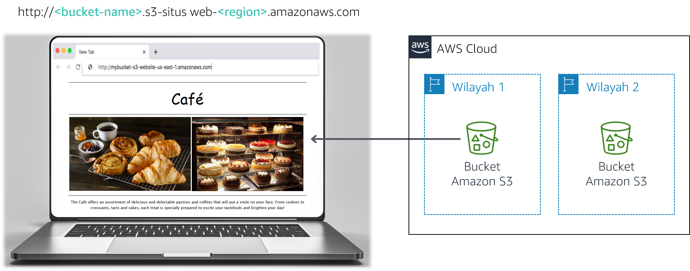

<!-- Font Awesome -->
<link rel="stylesheet" href="https://use.fontawesome.com/releases/v5.11.2/css/all.css">
<style type="text/css">
    #ssb_alexa_blue {
        background-color: #3366ff;
        font-weight: bold;
        font-size: 90%;
        color: white;
        position: relative;
        top: -1px;
        padding-top: 3px;
        padding-bottom: 3px;
        padding-left: 10px;
        padding-right: 10px;
        border-color: #3366ff;
        border-radius: 2px;
        white-space: nowrap
    }
    #ssb_alexa_ocean {
        background-color: #00a0d2;
        font-weight: bold;
        font-size: 90%;
        color: white;
        position: relative;
        top: -1px;
        padding-top: 3px;
        padding-bottom: 3px;
        padding-left: 10px;
        padding-right: 10px;
        border-color: #00a0d2;
        white-space: nowrap
    }
    #ssb_alexa_sand {
        background-color: #f2f2f2;
        font-weight: bold;
        font-size: 90%;
        color: #00a0d2;
        position: relative;
        top: -1px;
        border-color: #dcdcdc;
        border-style: solid;
        border-width: 2px;
        padding-top: 3px;
        padding-bottom: 3px;
        padding-left: 10px;
        padding-right: 10px;
        white-space: nowrap
    }
    #ssb_alexa_white {
        background-color: white;
        font-weight: bold;
        font-size: 90%;
        color: #00a0d2;
        position: relative;
        top: -1px;
        border-color: #00a0d2;
        border-style: solid;
        border-width: 2px;
        padding-top: 3px;
        padding-bottom: 3px;
        padding-left: 10px;
        padding-right: 10px;
        white-space: nowrap
    }
    #ssb_blue {
        background-color: #257ACF;
        font-weight: bold;
        font-size: 90%;
        color: white;
        position: relative;
        top: -1px;
        border-radius: 5px;
        padding-top: 3px;
        padding-bottom: 3px;
        padding-left: 10px;
        padding-right: 10px;
        white-space: nowrap
    }
    #ssb_catalog_orange {
        background-color: #E36000;
        font-weight: bold;
        font-size: 90%;
        color: white;
        position: relative;
        top: -1px;
        border-radius: 1px;
        padding-top: 3px;
        padding-bottom: 3px;
        padding-left: 10px;
        padding-right: 10px;
        white-space: nowrap
    }
    #ssb_catalog_red {
        background-color: #D90000;
        font-weight: bold;
        font-size: 90%;
        color: white;
        position: relative;
        top: -1px;
        border-radius: 5px;
        padding-top: 3px;
        padding-bottom: 3px;
        padding-left: 10px;
        padding-right: 10px;
        white-space: nowrap
    }
    #ssb_dark_blue {
        color: white;
        background-color: darkblue;
        border-radius: 3px;
        padding: 0px 6px;
        white-space: nowrap
    }
    #ssb_grafana_blue {
        background-color: #00678b;
        font-weight: bold;
        font-size: 90%;
        color: white;
        position: relative;
        top: -1px;
        padding-top: 3px;
        padding-bottom: 3px;
        padding-left: 10px;
        padding-right: 10px;
        border-color: #00678b;
        border-radius: 2px;
        white-space: nowrap
    }
    #ssb_grafana_green {
        background-color: #629300;
        font-weight: bold;
        font-size: 90%;
        color: white;
        position: relative;
        top: -1px;
        padding-top: 3px;
        padding-bottom: 3px;
        padding-left: 10px;
        padding-right: 10px;
        border-color: #629300;
        border-radius: 2px;
        white-space: nowrap
    }
    #ssb_grafana_orange {
        background-color: #ec8427;
        font-weight: bold;
        font-size: 90%;
        color: white;
        position: relative;
        top: -1px;
        padding-top: 3px;
        padding-bottom: 3px;
        padding-left: 10px;
        padding-right: 10px;
        border-color: #ec8427;
        border-radius: 2px;
        white-space: nowrap
    }
    #ssb_grey {
        background-color: #DEDEDE;
        font-weight: bold;
        font-size: 90%;
        color: #444;
        position: relative;
        top: -1px;
        border-radius: 5px;
        border-width: 1px;
        border-style: solid;
        border-color: #444;
        padding-top: 3px;
        padding-bottom: 3px;
        padding-left: 10px;
        padding-right: 10px;
        white-space: nowrap
    }
    #ssb_grey_square {
        background-color: #DEDEDE;
        font-weight: bold;
        font-size: 90%;
        color: #444;
        position: relative;
        top: -1px;
        border-radius: 1px;
        border-width: 1px;
        border-style: solid;
        border-color: #444;
        padding-top: 2px;
        padding-bottom: 2px;
        padding-left: 10px;
        padding-right: 10px;
        white-space: nowrap
    }
    #ssb_iot_blue {
        background-color: #00A1C9;
        font-weight: bold;
        font-size: 90%;
        color: white;
        position: relative;
        top: -1px;
        padding-top: 3px;
        padding-bottom: 3px;
        padding-left: 10px;
        padding-right: 10px;
        border-color: #00A1C9;
        border-radius: 2px;
        white-space: nowrap
    }
    #ssb_iot_grey {
        background-color: white;
        font-weight: bold;
        font-size: 90%;
        color: gray;
        position: relative;
        top: -1px;
        border-color: gray;
        border-radius: 2px;
        border-style: solid;
        border-width: 1px;
        padding-top: 3px;
        padding-bottom: 3px;
        padding-left: 10px;
        padding-right: 10px;
        white-space: nowrap
    }
    #ssb_iot_white {
        background-color: white;
        font-weight: bold;
        font-size: 90%;
        color: #00A1C9;
        position: relative;
        top: -1px;
        border-color: #00A1C9;
        border-radius: 2px;
        border-style: solid;
        border-width: 1px;
        padding-top: 3px;
        padding-bottom: 3px;
        padding-left: 10px;
        padding-right: 10px;
        white-space: nowrap
    }
    #ssb_kibana_blue {
        background-color: #0079a5;
        font-weight: bold;
        font-size: 90%;
        color: white;
        position: relative;
        top: -1px;
        padding-top: 3px;
        padding-bottom: 3px;
        padding-left: 10px;
        padding-right: 10px;
        border-color: #0079a5;
        border-radius: 2px;
        white-space: nowrap
    }
    #ssb_kibana_white {
        background-color: white;
        font-weight: bold;
        font-size: 90%;
        color: #0079a5;
        position: relative;
        top: -1px;
        border-color: #0079a5;
        border-radius: 2px;
        border-width: 1px;
        border-style: solid;
        padding-top: 3px;
        padding-bottom: 3px;
        padding-left: 10px;
        padding-right: 10px;
        white-space: nowrap
    }
    #ssb_lambda_orange {
        background-color: #ec7211;
        font-weight: bold;
        font-size: 90%;
        color: white;
        position: relative;
        top: -1px;
        padding-top: 3px;
        padding-bottom: 3px;
        padding-left: 10px;
        padding-right: 10px;
        white-space: nowrap
    }
    #ssb_lambda_white {
        background-color: white;
        font-weight: bold;
        font-size: 90%;
        color: #545b64;
        position: relative;
        top: -1px;
        border-color: #545b64;
        border-radius: 2px;
        border-width: 1px;
        border-style: solid;
        padding-top: 3px;
        padding-bottom: 3px;
        padding-left: 10px;
        padding-right: 10px;
        white-space: nowrap
    }
    #ssb_maroon {
        color: white;
        background-color: darkred;
        border-radius: 3px;
        padding: 0px 6px;
        white-space: nowrap
    }
    #ssb_orange {
        background-color: #ec7211;
        font-weight: bold;
        font-size: 90%;
        color: white;
        position: relative;
        top: -1px;
        padding-top: 3px;
        padding-bottom: 3px;
        padding-left: 10px;
        padding-right: 10px;
        white-space: nowrap
    }
    #ssl_orange {
        color: #ec7211;
        font-weight: bold
    }
    #ssb_orange_oval {
        background-color: #ec7211;
        font-weight: bold;
        font-size: 90%;
        color: white;
        position: relative;
        top: -1px;
        padding-top: 3px;
        padding-bottom: 3px;
        padding-left: 10px;
        padding-right: 10px;
        border-radius: 20px;
        white-space: nowrap
    }
    #ssb_oval {
        background-color: #DEDEDE;
        font-weight: bold;
        font-size: 90%;
        color: #444;
        position: relative;
        top: -1px;
        border-radius: 20px;
        border-width: 1px;
        border-style: solid;
        border-color: #444;
        padding-top: 3px;
        padding-bottom: 3px;
        padding-left: 10px;
        padding-right: 10px;
    }
    #ssb_start_lab {
        background-color: #34A853;
        font-weight: bold;
        font-size: 90%;
        color: white;
        border-radius: 2px;
        padding-left: 10px;
        padding-right: 10px;
        padding-top: 3px;
        padding-bottom: 3px
    }
    #ssb_open_console {
        background-color: white;
        font-family: Google Sans;
        font-weight: bold;
        font-size: 90%;
        color: #1a73e8;
        border-color: #dadce0;
        border-radius: 4px;
        border-width: 2px;
        border-style: solid;
        outline-color: #ffffff;
        padding-top: 5px;
        padding-bottom: 5px;
        padding-left: 10px;
        padding-right: 10px
    }
    #ssb_rds_white {
        background-color: white;
        font-weight: bold;
        font-size: 90%;
        color: #545b64;
        position: relative;
        top: -1px;
        border-color: #545b64;
        border-radius: 2px;
        border-width: 1px;
        border-style: solid;
        padding-top: 3px;
        padding-bottom: 3px;
        padding-left: 10px;
        padding-right: 10px;
    }
    #ssb_red {
        background-color: #D93025;
        font-weight: bold;
        font-size: 90%;
        color: white;
        border-radius: 2px;
        padding-left: 10px;
        padding-right: 10px;
        padding-top: 3px;
        padding-bottom: 3px
    }
    #ssb_red_oval {
        background-color: #D93025;
        font-weight: bold;
        font-size: 90%;
        color: white;
        position: relative;
        top: -1px;
        padding-top: 3px;
        padding-bottom: 3px;
        padding-left: 10px;
        padding-right: 10px;
        border-radius: 20px;
        white-space: nowrap
    }
    #ssb_s3_blue {
        background-color: #329AD6;
        font-weight: bold;
        font-size: 90%;
        color: white;
        position: relative;
        top: -1px;
        padding-top: 3px;
        padding-bottom: 3px;
        padding-left: 10px;
        padding-right: 10px;
    }
    #ssb_s3_white {
        background-color: white;
        font-weight: bold;
        font-size: 90%;
        color: #329AD6;
        position: relative;
        top: -1px;
        border-color: #329AD6;
        border-width: 1px;
        border-style: solid;
        padding-top: 3px;
        padding-bottom: 3px;
        padding-left: 10px;
        padding-right: 10px;
    }
    #ssb_services {
        background-color: #232f3e;
        font-weight: bold;
        font-size: 90%;
        color: white;
        position: relative;
        top: -1px;
        padding-top: 3px;
        padding-bottom: 3px;
        padding-left: 10px;
        padding-right: 10px;
    }
    #ssb_square_lex {
        background-color: white;
        font-weight: bold;
        font-size: 90%;
        color: #1166bb;
        position: relative;
        top: -1px;
        border-color: #c4cbcd;
        border-style: solid;
        border-width: 2px;
        padding-top: 3px;
        padding-bottom: 3px;
        padding-left: 10px;
        padding-right: 10px
    }
    #ssb_ssm_white {
        background-color: white;
        font-weight: bold;
        font-size: 90%;
        color: #545b64;
        position: relative;
        top: -1px;
        border-color: #545b64;
        border-radius: 2px;
        border-width: 1px;
        border-style: solid;
        padding-top: 3px;
        padding-bottom: 3px;
        padding-left: 10px;
        padding-right: 10px;
    }
    #ssb_white {
        background-color: white;
        font-weight: bold;
        font-size: 90%;
        color: #545b64;
        position: relative;
        top: -1px;
        border-color: #545b64;
        border-radius: 2px;
        border-width: 1px;
        border-style: solid;
        padding-top: 3px;
        padding-bottom: 3px;
        padding-left: 10px;
        padding-right: 10px;
    }
    #ssbox_cloudformation_blue {
        font-weight: bold;
        background-color: #f1faff;
        font-size: 90%;
        border-color: #00A1C9;
        border-width: 1px;
        border-style: solid;
        padding-top: 3px;
        padding-bottom: 3px;
        padding-left: 10px;
        padding-right: 10px;
    }
    #ssl_alexa_ocean {
        color: #00a0d2;
        font-weight: bold
    }
    #ssl_blue {
        color: #1166bb;
        font-weight: bold
    }
    #ssl_catalog_orange {
        color: #E16706;
        font-weight: bold
    }
    #ssb_codestar_blue {
        background-color: #329AD6;
        font-weight: bold;
        font-size: 80%;
        color: white;
        position: relative;
        top: -1px;
        border-radius: 1px;
        padding-top: 3px;
        padding-bottom: 3px;
        padding-left: 10px;
        padding-right: 10px;
        white-space: nowrap
    }
    #ssb_cognito_blue {
        background-color: #2a7fd4;
        font-weight: bold;
        font-size: 90%;
        color: white;
        position: relative;
        top: -1px;
        padding-top: 3px;
        padding-bottom: 3px;
        padding-left: 10px;
        padding-right: 10px;
        border-color: #0055aa;
        border-radius: 2px;
        white-space: nowrap
    }
    #ssb_eb_blue {
        background-color: #0f6dca;
        font-weight: bold;
        font-size: 90%;
        color: white;
        position: relative;
        top: -1px;
        padding-top: 3px;
        padding-bottom: 3px;
        padding-left: 10px;
        padding-right: 10px;
        border-color: #0055aa;
        border-width: 1px;
        border-style: solid;
        border-radius: 4px;
        white-space: nowrap;
    }
    #ssb_eb_grey {
        background-color: #e5e5e5;
        font-weight: bold;
        font-size: 90%;
        color: 444444;
        position: relative;
        top: -1px;
        padding-top: 3px;
        padding-bottom: 3px;
        padding-left: 10px;
        padding-right: 10px;
        border-color: #bbbbbb;
        border-width: 1px;
        border-style: solid;
        border-radius: 4px;
        white-space: nowrap
    }
    #ssb_voc_grey {
        background-color: #F2F3F4;
        font-size: 90%;
        color: black;
        position: relative;
        top: -1px;
        padding-top: 3px;
        padding-bottom: 3px;
        padding-left: 10px;
        padding-right: 10px;
        border-color: grey;
        border-width: 1px;
        border-style: solid;
        white-space: nowrap
    }
</style>

# Modul 3 Lab Tantangan: Membuat Situs Web Statis untuk Kafe

## Skenario

Frank dan Martha adalah tim suami dan istri yang memiliki dan menjalankan bisnis kafe kecil yang menjual makanan penutup serta kopi. Putri mereka, Sofia, dan karyawan mereka yang lain, Nikhil—yang merupakan siswa sekolah menengah — juga bekerja di kafe. Kafe ini memiliki satu lokasi di kota besar.

Kafe saat ini tidak memiliki strategi pemasaran. Mereka kebanyakan mendapatkan pelanggan baru ketika seseorang lewat, melihat kafe, dan memutuskan untuk mencobanya. Kafe ini memiliki reputasi untuk makanan penutup dan kopi berkualitas tinggi, tapi reputasi mereka terbatas pada orang-orang yang pernah berkunjung, atau yang pernah mendengarnya dari pelanggan mereka.

Sofía menyarankan Frank dan Martha untuk memperluas kesadaran masyarakat terhadap apa yang ditawarkan kafe. Kafe belum memiliki web, dan saat ini tidak menggunakan layanan komputasi cloud apa pun. Namun, situasi akan berubah.

<br/>
## Gambaran umum dan tujuan lab

Di lab ini, Anda menggunakan Amazon Simple Storage Service (Amazon S3) untuk membangun situs web statis dan menerapkan praktik terbaik arsitektur untuk melindungi dan mengelola data Anda.

Setelah menyelesaikan lab ini, Anda akan mampu:

- Meng-hosting situs web statis menggunakan Amazon S3.
- Menerapkan satu cara untuk melindungi data Anda dengan Amazon S3
- Menerapkan strategi siklus hidup data di Amazon S3
- Menerapkan strategi pemulihan bencana (DR) di Amazon S3
   <br/>
   Pada akhir lab ini, arsitektur Anda seharusnya terlihat seperti contoh berikut:



<br/>
**Catatan:** Di lab tantangan ini, Anda akan menemukan beberapa tugas tanpa mendapat instruksi langkah demi langkah. Anda harus memikirkan cara untuk menyelesaikan tugas Anda sendiri.

<br/>
## Durasi

Diperlukan waktu sekitar **60 menit** untuk menyelesaikan lab ini.

<br/>
## Pembatasan layanan AWS

Dalam lingkungan lab ini, akses ke layanan AWS dan tindakan layanan mungkin dibatasi untuk orang-orang yang diperlukan untuk menyelesaikan instruksi lab. Anda mungkin akan mengalami error jika mencoba mengakses layanan lain atau melakukan tindakan di luar yang dijelaskan di lab ini.

<br/>
## Mengakses Konsol Manajemen AWS

1. Di bagian atas instruksi ini, pilih <span id="ssb_voc_grey">Start Lab</span> (Mulai Lab) untuk meluncurkan lab Anda.

   Panel **Start Lab** (Mulai Lab) terbuka dan menampilkan status lab.

   **Tip**: Jika Anda memerlukan lebih banyak waktu untuk menyelesaikan lab, pilih tombol Start Lab (Mulai Lab) lagi untuk memulai ulang pengatur waktu untuk lingkungan.

2. Tunggu hingga Anda melihat pesan *Lab status: ready* (Status lab: siap), lalu tutup panel **Start Lab** (Mulai Lab) dengan memilih **X**.

3. Di bagian atas instruksi ini, pilih <span id="ssb_voc_grey">AWS</span>.

   Tindakan ini akan membuka Konsol Manajemen AWS di tab browser baru. Anda akan login ke sistem secara otomatis.

   **Tip**: Jika tab browser baru tidak terbuka, banner atau ikon biasanya berada di bagian atas browser Anda dengan pesan bahwa browser Anda mencegah situs web membuka jendela sembulan. Pilih banner atau ikon lalu pilih **Allow pop-ups** (Izinkan sembulan).

4. Atur tab AWS Management Console (Konsol Manajemen AWS) agar ditampilkan bersama instruksi ini. Idealnya, Anda akan dapat melihat kedua tab browser sekaligus, sehingga Anda dapat mengikuti langkah-langkah lab dengan mudah.

<br/>
## Permintaan bisnis untuk kafe: Meluncurkan situs web statis (Tantangan #1)

Sofía mengatakan kepada Nikhil bahwa ia kafenya memiliki situs web yang secara visual akan menampilkan penawaran kafe. Situs web ini juga akan menyediakan detail bisnis, seperti lokasi toko, jam kerja, dan nomor telepon untuk pelanggan.

Nikhil senang ia diminta untuk membuat situs web pertama kafe tersebut.

Untuk tantangan pertama ini, Anda akan mengambil peran Nikhil dan menggunakan Amazon S3 untuk membuat situs web dasar untuk kafe.

<br/>
### Tugas 1: Mengekstrak file yang Anda butuhkan untuk lab ini

Dalam tugas ini, Anda akan mengekstrak file yang dibutuhkan untuk membuat situs web statis.

5. Unduh file *.zip* yang Anda butuhkan untuk lab ini dengan membuka [tautan Amazon S3 ini](https://aws-tc-largeobjects.s3-us-west-2.amazonaws.com/ILT-TF-200-ACACAD-20-EN/Module-3-Challenge-Lab/static-website.zip).

6. Di komputer Anda, ekstrak file. Perhatikan bahwa Anda memiliki file *index.html*, dan dua folder yang berisi file Cascading Style Sheets (CSS) dan gambar.

<br/>
### Tugas 2: Membuat bucket S3 untuk meng-hosting situs web statis Anda

Dalam tugas ini, Anda akan membuat sebuah bucket S3 dan mengonfigurasinya untuk meng-hosting situs web statis.

7. Buka **Amazon S3 console**(Konsol Amazon S3).
8. Buat bucket untuk meng-hosting situs web statis Anda.

   - Buat bucket di Wilayah AWS yang paling dekat dengan orang-orang yang paling mungkin untuk mengaksesnya. Untuk latihan ini, asumsikan bahwa sebagian besar pengguna paling dekat dengan wilayah default Anda.
   - **Tip**: Anda harus menonaktifkan **Block*all* public access** (Blokir semua akses publik).
9. Aktifkan hosting situs web statis pada bucket Anda.
   - **Tip**: Anda akan menggunakan file *index.html* untuk dokumen indeks Anda.

<br/>
### Tugas 3: Mengunggah konten ke bucket S3 Anda

Dalam tugas ini, Anda akan mengunggah file statis ke bucket S3 Anda.

10. Unggah file *index.html* dan folder *css* serta *gambar* ke bucket S3 Anda.

11. Di tab browser web terpisah, buka tautan endpoint untuk situs web statis Anda.

<br/>
#### Menjawab pertanyaan tentang lab

Jawaban akan direkam saat Anda memilih tombol **Submit** (Kirim) biru di atas di bagian akhir lab.

12. Akses pertanyaan di lab ini.
   - Pilih menu <span id="ssb_voc_grey">Details <i class="fas fa-angle-down"></i></span> (Detail)
      dan pilih <span id="ssb_voc_grey">Show</span> (Tampilkan).
   - Pilih tautan **Access the multiple choice questions** (Akses pertanyaan pilihan ganda) yang muncul di bagian bawah halaman.

13. Di halaman yang Anda muat, jawab pertanyaan pertama:

   - **Pertanyaan 1**: Saat melihat situs web setelah Tugas 3, apakah Anda melihat halaman di browser?

**Catatan**: Biarkan halaman web pertanyaan terbuka di tab browser Anda. Anda akan kembali ke sana nanti di lab ini.

<br/>
### Tugas 4: Membuat kebijakan bucket untuk memberikan akses baca publik

Frank menyampaikan rencananya untuk membuat *banyak* jenis pastri baru untuk kafe. Anda menyadari bahwa Anda harus mengunggah gambar untuk setiap makanan penutup baru yang ia ciptakan, dan memungkinkan akses publik pada objek itu. Anda tidak ingin melakukan proses ini secara manual. Sebaliknya, Anda memutuskan untuk membuat kebijakan bucket yang secara otomatis membuat setiap objek yang diunggah ke folder bersifat publik.

14. Buat kebijakan bucket yang memberikan izin hanya-baca untuk pengguna anonim publik dengan menggunakan editor Kebijakan Bucket.

**Petunjuk**: Jika Anda kehabisan ide, lihat contoh dalam [Dokumentasi AWS](https://docs.aws.amazon.com/AmazonS3/latest/dev/example-bucket-policies.html).

15. Konfirmasikan bahwa situs web untuk kafe sekarang dapat diakses oleh publik.

<br/>
*Selamat!* Anda sekarang memiliki situs web statis untuk kafe.
<br/>

## Kebutuhan bisnis baru: Melindungi data situs web (Tantangan #2)

Anda menunjukkan situs baru kepada Sofia, dan dia sangat terkesan. Kerja bagus!

Anda dan Sofía mendiskusikan bahwa Anda mungkin perlu membuat banyak pembaruan ke situs web karena jumlah penawaran kafe berkembang.

Olivia, seorang AWS Solutions Architect dan pelanggan kafe, menyarankan Anda untuk menerapkan strategi untuk mencegah penimpaan dan penghapusan objek situs web secara tidak disengaja.

Anda perlu membuat beberapa perubahan pada situs web, sehingga Anda memutuskan bahwa ini akan menjadi saat yang tepat untuk mengeksplorasi versioning objek.

<br/>
### Tugas 5: Mengaktifkan versioning pada bucket S3

Dalam tugas ini, Anda akan mengaktifkan versioning pada bucket S3 Anda dan mengonfirmasikan keberhasilannya.

16. Di konsol S3, aktifkan versioning pada bucket S3 Anda.

**Catatan**: Perhatikan bahwa setelah mengaktifkan versioning, Anda tidak dapat menonaktifkannya.

17. Dalam editor teks kegemaran anda, buka file *index.html*. Misalnya, Anda bisa menggunakan Notepad ++ atau TextWrangler.

18. Memodifikasi file sesuai dengan instruksi berikut:
   - Cari baris pertama yang berisi kode CSS tertanam **bgcolor="aquamarine"** dalam HTML, dan ubah menjadi `bgcolor="gainsboro"`.
   - Cari baris yang memiliki kode CSS tertanam **bgcolor="orange"** dalam HTML, dan ubah menjadi `bgcolor="cornsilk"`.
   - Cari baris kedua yang memiliki kode CSS tertanam **bgcolor="aquamarine"** dalam HTML, dan ubah menjadi `bgcolor="gainsboro"`.
   - Simpan perubahan.

19. Unggah file yang diperbarui ke bucket S3 Anda.

20. Muat ulang tab browser web dengan situs web Anda dan perhatikan perubahannya.

21. Untuk melihat versi terbaru file *index.html*, buka bucket Anda dan pilih **List versions** (Daftar versi). Anda akan melihat kedua versi file ini di menu tarik turun.

22. Kembali ke tab browser dengan pertanyaan pilihan ganda untuk lab ini, dan jawab pertanyaan berikut:

   - **Pertanyaan 2**: Apa cara lain untuk memastikan perlindungan maksimal dan mencegah penghapusan versi preserved secara tidak disengaja? (**Petunjuk**: Tinjau [FAQ Amazon S3](https://aws.amazon.com/s3/faqs/).)

<br/>
<br/>
**Praktik terbaik arsitektur**

Dalam tugas ini, Anda menggunakan satu teknik untuk menerapkan arsitektur praktik terbaik *perlindungan data Anda*.

<details>
	<summary>Perluas <b>di sini</b> untuk mempelajarinya lebih lanjut.</summary>
	Menurut <a href="https://d1.awsstatic.com/whitepapers/architecture/AWS_Well-Architected_Framework.pdf">Well-Architected Framework</a>, versioning dapat menjadi bagian dari proses manajemen siklus hidup data yang lebih besar. Sebelum Anda membuat arsitektur sistem apa pun, praktik dasar yang memengaruhi keamanan harus dijalankan. Misalnya, <i>klasifikasi data</i> menyediakan cara untuk mengelompokkan data organisasi berdasarkan tingkat sensitivitas. <i>Enkripsi</i> melindungi data dengan me-render sehingga tidak dapat dipahami oleh akses yang tidak sah. Alat dan teknik ini penting karena mendukung tujuan, seperti mencegah kerugian finansial atau mematuhi kewajiban regulasi.
</details>

<br/>
## Kebutuhan bisnis baru: Mengoptimalkan biaya penyimpanan objek S3 (Tantangan #3)

Setelah mengaktifkan versioning, Anda menyadari bahwa ukuran bucket S3 akan terus tumbuh saat Anda mengunggah objek dan versi baru. Untuk menghemat biaya, Anda memutuskan untuk menerapkan strategi menghentikan beberapa versi lama tersebut.

<br/>
### Tugas 6: Menetapkan kebijakan siklus hidup

Dalam tugas ini, Anda akan menetapkan kebijakan siklus hidup untuk secara otomatis memindahkan versi lama objek dalam bucket sumber Anda ke S3 Standard-Infrequent Access (S3 Standard-IA). Kebijakan akhirnya juga harus mengakhiri objek.

23. Buat kebijakan siklus hidup dengan 2 aturan:
- Pindahkan semua objek bucket sumber versi lama ke S3 Standard-IA setelah 30 hari
- Hapus objek versi lama setelah 365 hari
   <br/>**Petunjuk**: Jika Anda kehabisan ide, lihat [Dokumentasi AWS](https://docs.aws.amazon.com/AmazonS3/latest/user-guide/create-lifecycle.html) untuk mendapat panduan.
   <br/>
   **Catatan**: Untuk *membatasi cakupan* replikasi untuk objek bucket tertentu (misalnya, file *index.html*), buat tanda untuk objek sebelum Anda membuat aturan siklus hidup.
   <br/>

Bagus! Anda sekarang seharusnya memiliki konfigurasi siklus hidup yang akan memindahkan objek bucket sumber versi lama Anda ke S3 Standard-IA setelah 30 hari. Kebijakan ini juga akan secara permanen menghapus objek yang berada di S3 Standard-IA setelah 365 hari.

<br/>
**Praktik terbaik arsitektur**

Dalam tugas ini, Anda menerapkan praktik terbaik arsitektur dalam *menentukan manajemen siklus hidup data.*

<details>
	<summary>Perluas <b>di sini</b> untuk mempelajarinya lebih lanjut.</summary>
	Menurut <a href="https://d1.awsstatic.com/whitepapers/architecture/AWS_Well-Architected_Framework.pdf">Kerangka Kerangka Well-Architected</a>, dalam praktiknya, strategi siklus hidup Anda harus didasarkan pada <i>kekritisan dan sensitivitas</i> data Anda, serta <i>persyaratan legal dan organisasi</i>. Anda harus mempertimbangkan faktor-faktor seperti durasi retensi data, penghancuran data, manajemen akses data, transformasi data, dan pembagian data.
</details>

<br/>
## Kebutuhan bisnis baru: Meningkatkan daya tahan dan perencanaan untuk DR (Tantangan #4)

Di kesempatan lain Olivia datang ke kafe, Anda menceritakan kepadanya tentang pembaruan situs web. Anda menjelaskan langkah-langkah yang Anda ambil untuk melindungi file statis situs web dari penimpaan atau penghapusan secara tidak sengaja. Olivia memberitahu Anda bahwa replikasi lintas Wilayah adalah fitur lain dari Amazon S3 yang juga dapat Anda gunakan untuk membuat cadangan dan mengarsipkan data penting.

<br/>
### Tugas 7: Mengaktifkan replikasi lintas Wilayah

Dalam tugas ini, Anda akan mengaktifkan replikasi lintas Wilayah pada bucket S3 sumber Anda.

24. Di Wilayah yang berbeda dari bucket sumber, buat bucket kedua dan aktifkan versioning di sana. Bucket kedua adalah *bucket* tujuan**Anda.

25. Pada bucket S3 sumber Anda, aktifkan replikasi lintas Wilayah. Ketika Anda membuat aturan replikasi, pastikan bahwa Anda:
- Mereplikasi seluruh bucket sumber.
- Menggunakan **CafeRole** untuk peran AWS Identity and Access Management (IAM). IAM role ini memberikan izin kepada Amazon S3 untuk membaca objek dari bucket sumber dan mereplikasikannya ke bucket tujuan.
- Jika Anda menemukan peringatan *The replication rule is saved, but it might not work* (Aturan replikasi disimpan, tetapi mungkin tidak berhasil), Anda dapat mengabaikannya dan melanjutkan ke langkah berikutnya.
   <br/>
   **Petunjuk**: Jika Anda kehabisan ide, lihat [Dokumentasi AWS](https://docs.aws.amazon.com/AmazonS3/latest/user-guide/enable-replication.html#enable-replication-add-rule) untuk mendapat panduan.
   <br/>
   **Catatan:** *CafeRole* memiliki izin sebagai berikut:
   
   ```yaml
   Version: 2012-10-17
   Statement:
     - Action:
   	- s3:ListBucket
   	- s3:ReplicateObject
   	- s3:ReplicateDelete
   	- s3:ReplicateTags
   	- s3:Get*
       Resource:
   	- '*'
       Effect: Allow
   ```
   
   Kebijakan akses ini memungkinkan peran untuk melakukan tugas replikasi pada *semua* bucket S3. Di lingkungan produksi yang nyata, Anda harus membatasi kebijakan agar hanya berlaku untuk bucket S3 sumber dan tujuan Anda. Untuk informasi lebih lanjut tentang pembuatan IAM role, baca [Setting Up Permissions for Replication] (https://docs.aws.amazon.com/AmazonS3/latest/dev/setting-repl-config-perm-overview.html).
   <br/>
   26 Kembali ke tab browser dengan pertanyaan pilihan ganda untuk lab ini, dan jawab pertanyaan berikut:

    - **Pertanyaan 3**: Apakah Anda melihat objek dari bucket sumber Anda di bucket tujuan?

27. Buat perubahan kecil pada file *index.html* dan unggah versi baru ke bucket sumber Anda.

28. Verifikasi bahwa bucket sumber sekarang memiliki tiga versi file *index.html*.

29. Konfirmasikan bahwa objek baru direplikasi ke bucket tujuan Anda. Anda mungkin perlu memuat ulang tab browser.

30. Buka bucket sumber Anda dan hapus versi terbaru.

31. Kembali ke tab browser dengan pertanyaan pilihan ganda untuk lab ini, dan jawab pertanyaan berikut:

   - **Pertanyaan 4**: Apakah versi yang baru saja dihapus dari bucket sumber Anda juga dihapus dari bucket tujuan Anda?

<br/>
**Praktik terbaik arsitektur**

Dalam tugas ini, Anda menerapkan praktik terbaik arsitektur dalam *mengotomatisasi pemulihan bencana*.

<details>
	<summary>Perluas <b>di sini</b> untuk mempelajarinya lebih lanjut.</summary>
	Menurut <a href="https://d1.awsstatic.com/whitepapers/architecture/AWS_Well-Architected_Framework.pdf">Kerangka Kerja Well-Architected</a>, awal strategi DR Anda adalah <i>dengan memiliki cadangan dan komponen beban kerja yang berlebihan</i>. Anda harus menggunakan AWS atau alat pihak ketiga untuk mengotomatisasi pemulihan sistem dan mengarahkan lalu lintas ke situs DR atau Wilayah.
</details>

<br/>
## Mengirimkan pekerjaan Anda

32. Di bagian atas instruksi ini, pilih <span id="ssb_blue">Submit</span> (Kirim) untuk merekam kemajuan Anda dan saat diminta, pilih **Yes** (Ya).

33. Jika hasilnya tidak muncul setelah beberapa menit, kembali ke bagian atas instruksi ini dan pilih <span id="ssb_voc_grey">Grades</span> (Nilai)

   **Tip**: Anda dapat mengirimkan pekerjaan Anda beberapa kali. Setelah Anda mengubah pekerjaan, pilih **Submit** (Kirim) lagi. Apa yang akan direkam untuk lab ini adalah pengiriman terakhir Anda.

34. Untuk menemukan detail umpan balik tentang pekerjaan Anda, pilih <span id="ssb_voc_grey">Details</span> (Detail) diikuti oleh <i class="fas fa-caret-right"></i> **View Submission Report** (Lihat Laporan Pengiriman).

<br/>

## Lab selesai

<i class="fas fa-flag-checkered"></i> Selamat! Anda telah menyelesaikan lab.

35. Untuk mengonfirmasi bahwa Anda ingin mengakhiri lab, di bagian atas halaman ini, pilih **<span id="ssb_voc_grey">End Lab</span>** (Akhiri Lab), lalu pilih **<span id="ssb_blue">Yes</span>** (Ya).

   Sebuah panel dengan pesan ini akan muncul: _DELETE has been initiated_...__ (PENGHAPUSAN telah dimulai)... _You may close this message box now._ (Anda dapat menutup kotak pesan ini sekarang.)

36. Untuk menutup panel, pilih **X** di sudut kanan atas.


<br/>
*©2020 Amazon Web Services, Inc. dan afiliasinya. Hak cipta dilindungi undang-undang. Karya ini tidak boleh direproduksi atau didistribusikan ulang, seluruhnya atau sebagian, tanpa izin tertulis sebelumnya dari Amazon Web Services, Inc. Dilarang menyalin, meminjamkan, atau menjual secara komersial.*
