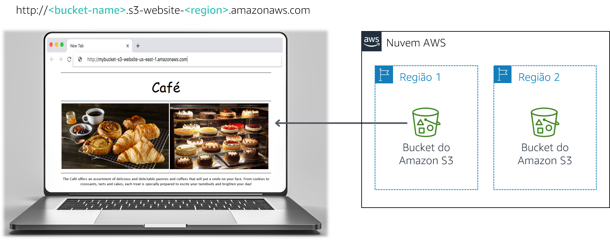

# Laboratório de desafio do módulo 3: Criar um site estático para a cafeteria

## Cenário

Frank e Martha são casados e proprietários de uma pequena cafeteria que serve doces e café. A filha deles, Sofía, e seu outro funcionário, Nikhil, que é estudante no ensino médio, também trabalham na cafeteria, que tem um único ponto em uma cidade grande.

A cafeteria ainda não tem uma estratégia de marketing. Basicamente, eles atraem novos clientes quando alguém passa em frente, vê a cafeteria e decide entrar. A cafeteria é reconhecida por seus doces e cafés de alta qualidade, mas sua reputação está limitada às pessoas que já visitaram o local ou que ouviram outros clientes falarem dela.

Sofía sugere que Frank e Martha ampliem a visibilidade dos produtos que a cafeteria oferece na vizinhança. A cafeteria ainda não têm presença na Web e não usa nenhum serviço de computação em nuvem. No entanto, isso está prestes a mudar.

<br/>
## Visão geral e objetivos do laboratório

Neste laboratório, você usará o Amazon Simple Storage Service (Amazon S3) para criar um site estático e implementar as melhores práticas de arquitetura para proteger e gerenciar seus dados.

Depois de concluir este laboratório, você deverá ser capaz de:

- Hospedar um site estático usando o Amazon S3
- Implementar um método de proteção de dados com o Amazon S3
- Implementar uma estratégia de ciclo de vida dos dados no Amazon S3
- Implementar uma estratégia de Disaster Recovery (DR – Recuperação de desastres) no Amazon S3
   <br/>
   No fim deste laboratório, sua arquitetura será parecida com o seguinte exemplo:



<br/>
**Observação:** neste laboratório de desafio, você encontrará algumas tarefas sem instruções passo a passo. Você mesmo deverá descobrir como concluir as tarefas.

<br/>
## Duração

Este laboratório levará aproximadamente **60 minutos** para ser concluído.

<br/>
## Restrições de serviço da AWS

Neste ambiente de laboratório, o acesso aos serviços e ações de serviço da AWS pode estar restrito àqueles necessários para concluir as instruções do laboratório. Você poderá encontrar erros se tentar acessar outros serviços ou executar ações além do que está descrito neste laboratório.

<br/>
## Acessar o Console de Gerenciamento da AWS

1. Na parte superior destas instruções, escolha <span id="ssb_voc_grey">Start Lab</span> (Iniciar laboratório) para iniciar o laboratório.

   Um painel **Start Lab** (Iniciar laboratório) é aberto com o status do laboratório.

   **Dica**: se você precisar de mais tempo para concluir o laboratório, escolha novamente o botão Start Lab (Iniciar laboratório) para reiniciar o cronômetro do ambiente.

2. Aguarde até que a mensagem *Lab status: ready (Status do laboratório: pronto)* seja exibida e feche o painel **Start Lab** (Iniciar laboratório) escolhendo **X**.

3. Na parte superior destas instruções, escolha <span id="ssb_voc_grey">AWS</span>.

   O Console de Gerenciamento da AWS será aberto em uma nova guia do navegador. O sistema fará o seu login automaticamente.

   **Dica**: se uma nova guia do navegador não for aberta, normalmente você verá uma faixa ou um ícone na parte superior do navegador com uma mensagem informando que o navegador está impedindo que o site abra janelas pop-up. Escolha a faixa ou o ícone e depois **Allow pop ups** (Permitir pop-ups).

4. Organize a guia do Console de Gerenciamento da AWS para que ela seja exibida com essas instruções. O ideal é ver as duas guias do navegador ao mesmo tempo, para facilitar o acompanhamento das etapas do laboratório.

<br/>
## Solicitação de negócios da cafeteria: Lançar um site estático (desafio nº 1)

Sofía comenta com Nikhil que ela gostaria que a cafeteria tivesse um site com um mostruário de seus produtos. Esse site também mostraria detalhes do estabelecimento aos clientes, como a localização da loja, o horário de atendimento e o número de telefone.

Nikhil gostou de ter a tarefa de criar o primeiro site da cafeteria.

Para este primeiro desafio, você assumirá o papel de Nikhil e usará o Amazon S3 para criar um site básico para a cafeteria.

<br/>
### Tarefa 1: extrair os arquivos necessários para este laboratório

Nesta tarefa, você extrairá os arquivos necessários para criar o site estático.

5. Faça download do arquivo *.zip* necessário para este laboratório por meio [deste link do Amazon S3](https://aws-tc-largeobjects.s3-us-west-2.amazonaws.com/ILT-TF-200-ACACAD-20-EN/Module-3-Challenge-Lab/static-website.zip).

6. No seu computador, extraia os arquivos. Observe que você tem um arquivo *index.html* e duas pastas com as Cascading Style Sheets (CSS – Folhas de estilo em cascata) e os arquivos de imagem.

<br/>
### Tarefa 2: criar um bucket do S3 para hospedar o site estático

Nesta tarefa, você criará e configurará um bucket do S3 para hospedagem do site estático.

7. Abra o **console do Amazon S3**.
8. Crie um bucket para hospedar o site estático.

   - Crie o bucket na região da AWS mais próxima às pessoas que têm mais chances de visitá-la.
   - **Dica**: você deve desabilitar **Block *all* public access** (Bloquear todo o acesso público).
9. Habilite a hospedagem do site estático no bucket.
   - **Dica**: você usará o arquivo *index.html* para o documento de índice.

<br/>
### Tarefa 3: fazer upload do conteúdo no bucket do S3

Nesta tarefa, você fará upload dos arquivos estáticos para o bucket do S3.

10. Faça upload do arquivo *index.html* e das pastas *css* e *images* para o bucket do S3.

11. Em uma guia separada do navegador da Web, abra o link do endpoint do seu site estático.

<br/>
#### Responder às perguntas sobre o laboratório

As respostas serão gravadas quando você escolher o botão azul **Submit** (Enviar) acima no fim do laboratório.

12. Acesse as perguntas deste laboratório.
    - Escolha o menu <span id="ssb_voc_grey">Details (Detalhes) <i class="fas fa-angle-down"></i></span>
      e escolha <span id="ssb_voc_grey">Show</span> (Mostrar).
    - Escolha o link **Access the multiple choice questions** (Acessar as perguntas de múltipla escolha) que aparece na parte inferior da página.

13. Na página que você carregou, responda à primeira pergunta:

    - **Pergunta 1**: Ao visualizar o site após a tarefa 3, você vê a página no navegador?

    **Observação**: deixe a página da Web de perguntas abertas na guia do navegador, pois você a consultará de novo mais adiante neste laboratório.

<br/>
### Tarefa 4: criar uma política de bucket para conceder acesso público de leitura

Frank revela seu plano de criar *muitos* tipos novos de doces para a cafeteria. Você percebe que precisará fazer upload da imagem de cada sobremesa nova que ele criar e habilitar o acesso público a esse objeto. Você não deseja fazer esse processo manualmente. Em vez disso, decide criar uma política de bucket que automaticamente torne público cada objeto que for carregado por upload para a pasta.

14. Crie uma política de bucket que conceda permissão somente leitura a usuários anônimos públicos por meio do editor de política de bucket.

**Dica**: se você não souber como fazer isso, consulte os exemplos na [Documentação da AWS](https://docs.aws.amazon.com/AmazonS3/latest/dev/example-bucket-policies.html).

15. Confirme se o site da cafeteria agora está acessível ao público.

<br/>
*Parabéns!* Você tem agora um site estático da cafeteria.
<br/>

## Novo requisito de negócios: Proteger os dados do site (desafio nº 2)

Você mostra o novo site para Sofía, e ela fica muito impressionada. Bom trabalho!

Você e Sofía comentam que talvez seja necessário fazer muitas atualizações no site para acompanhar as novas ofertas da cafeteria.

Olivia, arquiteta de soluções da AWS e frequentadora da cafeteria, aconselha você a implementar uma estratégia para evitar a substituição e exclusão acidentais de objetos do site.

Você já precisa fazer algumas alterações no site, portanto decide que este seria um bom momento para explorar o versionamento de objetos.

<br/>
### Tarefa 5: habilitar o versionamento no bucket do S3

Nesta tarefa, você habilitará o versionamento no bucket do S3 e confirmará se ele funciona.

16. No console do S3, habilite o versionamento no bucket do S3.

**Observação**: depois que você habilitar o versionamento, não poderá desabilitá-lo.

17. No editor de texto de sua preferência, abra o arquivo *index.html*. Por exemplo, você pode usar o Notepad++ ou o TextWrangler.

18. Modifique o arquivo de acordo com as seguintes instruções:
    - Localize a primeira linha com o código CSS **bgcolor="aquamarine"** incorporado no HTML e altere-a para `bgcolor="gainsboro"`.
    - Localize a linha com o código CSS **bgcolor="orange"** incorporado no HTML e altere-a para `bgcolor="cornsilk"`.
    - Localize a segunda linha com o código CSS **bgcolor="aquamarine"** incorporado no HTML e altere-a para `bgcolor="gainsboro"`.
    - Salve as alterações.

19. Faça upload do arquivo atualizado para o bucket do S3.

20. Recarregue a guia do navegador da Web com seu site e observe as alterações.

21. Para ver a versão mais recente do arquivo *index.html*, acesse o bucket e escolha **Show** (Mostrar). Você deve ver as duas versões do arquivo no menu suspenso.

22. Retorne à guia do navegador com as perguntas de múltipla escolha deste laboratório e responda à seguinte pergunta:

    - **Pergunta 2**: De que outra maneira é possível garantir proteção máxima e evitar exclusão acidental de uma versão preservada? (**Dica**: consulte as [perguntas frequentes do Amazon S3](https://aws.amazon.com/s3/faqs/).)

<br/>
<br/>
**Melhores práticas de arquitetura**

Nesta tarefa, você usou uma técnica para implementar as melhores práticas de arquitetura para *proteção dos seus dados*.

<details>
	<summary>Expanda <b>aqui</b> para saber mais sobre isso.</summary>
	De acordo com a <a href="https://d1.awsstatic.com/whitepapers/architecture/AWS_Well-Architected_Framework.pdf">Well-Architected Framework</a>, o versionamento pode fazer parte de um processo maior de gerenciamento do ciclo de vida dos dados. Antes de projetar um sistema, é necessário adotar práticas básicas que envolvem a segurança. Por exemplo, a <i>classificação de dados</i> é uma maneira de categorizar os dados organizacionais com base em níveis de confidencialidade. A <i>criptografia</i> protege os dados ao exibi-los de modo ininteligível em caso de acesso não autorizado. Essas ferramentas e técnicas são importantes porque auxiliam em objetivos como evitar perda financeira ou cumprir obrigações regulamentares.
</details>

<br/>
## Novo requisito de negócios: Otimizar os custos de armazenamento de objetos do S3 (desafio nº 3)

Agora que habilitou o versionamento, você percebe que o tamanho do bucket do S3 continuará crescendo à medida que faz upload de novos objetos e versões. Para economizar custos, você decide implementar uma estratégia para retirar algumas dessas versões mais antigas.

<br/>
### Tarefa 6: definir políticas de ciclo de vida

Nesta tarefa, você definirá uma política de ciclo de vida para mover automaticamente as versões mais antigas dos objetos do bucket de origem para o S3 Standard-Infrequente Access (S3 Standard-IA). A política também deverá expirar os objetos.

23. Crie uma regra de ciclo de vida que faça o seguinte:
- Mova as versões anteriores de todos os objetos do bucket de origem para o S3 Standard-IA após 30 dias.
- Expire as versões anteriores dos objetos após 365 dias
   <br/>**Dica**: se você não souber como fazer isso, consulte a [Documentação da AWS](https://docs.aws.amazon.com/AmazonS3/latest/user-guide/create-lifecycle.html) para obter orientação.
   <br/>
   **Observação**: para *limitar o escopo* da replicação a um determinado objeto do bucket (por exemplo, ao arquivo *index.html*), crie uma tag para o objeto antes de criar a regra de ciclo de vida.
   <br/>

Ótimo! Você agora tem uma regra de ciclo de vida que moverá as versões anteriores dos objetos do bucket de origem para o S3 Standard-IA após 30 dias. A política também excluirá permanentemente os objetos do S3 Standard-IA após 365 dias.

<br/>
**Melhores práticas de arquitetura**

Nesta tarefa, você implementou as melhores práticas de arquitetura para *definir o gerenciamento do ciclo de vida dos dados.*

<details>
	<summary>Expanda <b>aqui</b> para saber mais sobre isso.</summary>
	De acordo com a <a href="https://d1.awsstatic.com/whitepapers/architecture/AWS_Well-Architected_Framework.pdf">Well-Architected Framework</a>, na prática, sua estratégia de ciclo de vida deve ser baseada na <i>criticidade e confidencialidade</i> dos dados, além dos <i>requisitos legais e organizacionais</i>. Você deve considerar fatores como duração da retenção, destruição, gerenciamento de acesso, transformação e compartilhamento de dados.
</details>

<br/>
## Novo requisito de negócios: Aprimorar a durabilidade e o planejamento para DR (desafio nº 4)

Na próxima visita de Olivia à cafeteria, você conta sobre as atualizações feitas no site. Você descreve as medidas tomadas para proteger os arquivos estáticos do site contra substituição ou exclusão acidental. Olivia fala que a replicação entre regiões é outro recurso do Amazon S3 que você pode usar para fazer backup e arquivar dados críticos.

<br/>
### Tarefa 7: habilitar a replicação entre regiões

Nesta tarefa, você habilitará a replicação entre regiões no bucket de origem do S3.

24. Em uma região diferente do seu bucket de origem, crie um segundo bucket e habilite o versionamento nele. Ele será o *bucket de destino*.

25. No bucket de origem do S3, habilite a replicação entre regiões. Ao criar a regra de replicação, certifique-se de:
    - Replicar todo o bucket de origem.
    - Usar a **CafeRole** como a função do AWS Identity and Access Management (IAM). Essa função do IAM concede ao Amazon S3 as permissões para ler objetos no bucket de origem e replicá-los para o bucket de destino.
    - Se aparecer o aviso *The replication rule is saved, but it might not work (A regra de replicação foi salva, mas talvez não funcione)*, você poderá ignorá-lo e avançar para a etapa seguinte.
    <br/>
    **Dica**: se você não souber o que fazer, consulte a [Documentação da AWS](https://docs.aws.amazon.com/AmazonS3/latest/user-guide/enable-replication.html#enable-replication-add-rule) para obter orientação.
    <br/>
    **Observação:** *CafeRole* tem as seguintes permissões:

```yaml
Version: 2012-10-17
Statement:
  - Action:
	- s3:ListBucket
	- s3:ReplicateObject
	- s3:ReplicateDelete
	- s3:ReplicateTags
	- s3:Get*
    Resource:
	- '*'
    Effect: Allow
```

Essa política de acesso permite que a função execute as tarefas de replicação em *todos* os buckets do S3. Em um ambiente de produção real, você deve restringir a política para ser aplicada apenas aos buckets de origem e de destino do S3. Para obter mais informações sobre como criar uma função do IAM, consulte [Configurar permissões para replicação](https://docs.aws.amazon.com/AmazonS3/latest/dev/setting-repl-config-perm-overview.html).
<br/>
26. Retorne à guia do navegador com as perguntas de múltipla escolha deste laboratório e responda à seguinte pergunta:

    **Pergunta 3**: Você vê os objetos do bucket de origem no bucket de destino?

27. Faça uma pequena alteração no arquivo *index.html* e faça upload da nova versão para o bucket de origem.

28. Agora confirme se o bucket de origem tem três versões do arquivo *index.html*.

29. Confirme se o novo objeto foi replicado para o bucket de destino. Talvez seja necessário recarregar a guia do navegador.

30. Acesse o bucket de origem e exclua a última versão.

31. Retorne à guia do navegador com as perguntas de múltipla escolha deste laboratório e responda à seguinte pergunta:

    - **Pergunta 4**: A versão que você acabou de excluir do bucket de origem também foi excluída do bucket de destino?

<br/>
**Melhores práticas de arquitetura**

Nesta tarefa, você implementou as melhores práticas de arquitetura para *automatizar a recuperação de desastres*.

<details>
	<summary>Expanda <b>aqui</b> para saber mais sobre isso.</summary>
	De acordo com a <a href="https://d1.awsstatic.com/whitepapers/architecture/AWS_Well-Architected_Framework.pdf">Well-Architected Framework</a>, o ponto de partida da sua estratégia de DR é <i>implementar backups e componentes redundantes de carga de trabalho</i>. Você deve usar a AWS ou ferramentas de terceiros para automatizar a recuperação do sistema e rotear o tráfego para o site ou a região de DR.
</details>

<br/>
## Enviar o trabalho

32. Na parte superior destas instruções, escolha <span id="ssb_blue">Submit</span> (Enviar) para gravar o progresso e, quando solicitado, escolha **Yes** (Sim).

33. Se os resultados não forem exibidos após alguns minutos, volte ao topo destas instruções e escolha <span id="ssb_voc_grey">Grades</span> (Notas).

    **Dica**: você pode enviar seu trabalho várias vezes. Depois de alterar o trabalho, escolha **Submit** (Enviar) novamente. Seu último envio é o que será gravado para este laboratório.

34. Para ver o feedback detalhado do seu trabalho, escolha <span id="ssb_voc_grey">Details</span> (Detalhes) e depois <i class="fas fa-caret-right"></i> **View Submission Report** (Visualizar relatório de envio).

<br/>

## Laboratório concluído

<i class="fas fa-flag-checkered"></i> Parabéns! Você concluiu o laboratório.

35. Para confirmar que você deseja encerrar o laboratório, escolha **<span id="ssb_voc_grey">End Lab</span>** (Encerrar laboratório) na parte superior desta página e escolha **<span id="ssb_blue">Yes</span>** (Sim).

    Será exibido um painel com a mensagem: _DELETE has been initiated... You may close this message box now. (A EXCLUSÃO foi iniciada... Você pode fechar esta caixa de mensagem agora)._

36. Escolha o **X** no canto superior direito para fechar o painel.


<br/>
*©2020, Amazon Web Services, Inc. e suas afiliadas. Todos os direitos reservados. Este trabalho não pode ser reproduzido ou redistribuído, no todo ou em parte, sem permissão prévia por escrito da Amazon Web Services, Inc. É proibido copiar, emprestar ou vender para fins comerciais.*
