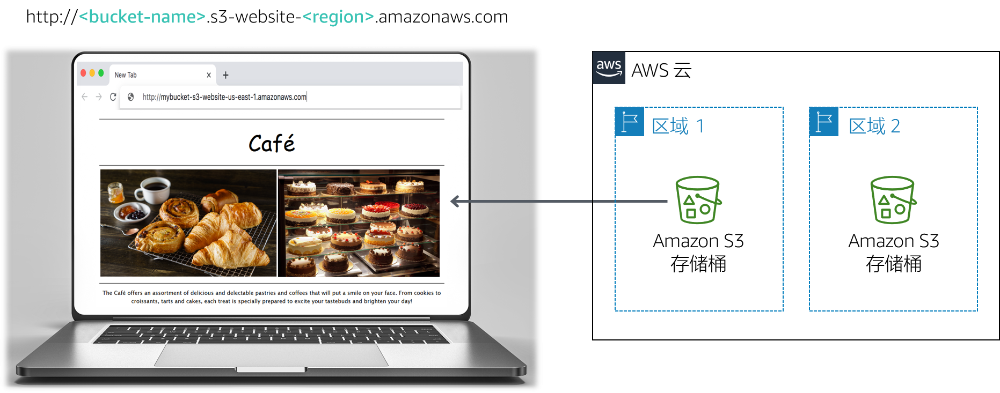

# 模块 3 挑战实验：为咖啡馆创建静态网站

## 场景

Frank 和 Martha 是一对夫妻，他们拥有并经营着一家小咖啡馆，出售甜点和咖啡。他们的女儿 Sofía 和另一名员工 Nikhil（一名中学生）也在咖啡馆里工作。咖啡馆在大城市中只有一个门店。

这家咖啡馆目前还没有营销策略。当有人路过，注意到这家咖啡馆，并决定去尝尝时，他们往往就能赢得新顾客。这家咖啡馆以高质量的甜点和咖啡而闻名，但它的名声仅在去过这家咖啡店的人中传播，或者从顾客那里听说过这家咖啡馆的人。

Sofía 向 Frank 和 Martha 建议，他们应该提高社区对咖啡馆所提供产品的意识。该咖啡馆尚无网络，目前未使用任何云计算服务。但是，这种情况即将改变。

<br/>
## 实验概览和目标

在本实验中，您将使用 Amazon Simple Storage Service (Amazon S3) 构建静态网站并实施架构最佳实践来保护和管理您的数据。

完成本实验后，您应能够：

- 使用 Amazon S3 托管静态网站
- 使用 Amazon S3 实施一种保护数据的方法
- 在 Amazon S3 中实施数据生命周期策略
- 在 Amazon S3 中实施灾难恢复 (DR) 策略
   <br/>
   在本实验结束时，您的架构应如下例所示：



<br/>
**注意：**在此挑战实验中，部分任务并没有提供分步说明。您必须自己弄清楚如何完成这些任务。

<br/>
## 持续时间

完成本实验大约需要 **60 分钟**。

<br/>
## AWS 服务限制

在本实验环境中，对 AWS 服务和服务操作的访问可能仅限于完成实验说明所需的服务和服务操作。如果您尝试访问其他服务或执行本实验中所述之外的操作，可能会遇到错误。

<br/>
## 访问 AWS 管理控制台

1. 在这些说明的顶部，选择 <span id="ssb_voc_grey">Start Lab</span>（启动实验）即可启动您的实验。

   **Start Lab**（启动实验）面板随即会打开，其中显示了实验状态。

   **提示**：如果您需要更多时间来完成实验，请再次选择 Start Lab（启动实验）按钮，重新启动环境计时器。

2. 请耐心等待，直到您看到消息 *Lab status: ready*（实验状态：就绪），然后选择 **X** 关闭 **Start Lab**（启动实验）面板。

3. 在这些说明的顶部，选择 <span id="ssb_voc_grey">AWS</span>。

   AWS 管理控制台将会在一个新的浏览器选项卡中打开。您将自动登录系统。

   **提示**：如果未打开新的浏览器选项卡，则您的浏览器顶部通常会出现一个横幅或图标，并显示一条消息，指明您的浏览器阻止了该网站打开弹出窗口。请选择横幅或图标，然后选择 **Allow pop ups**（允许弹出窗口）。

4. 排列 AWS 管理控制台选项卡，使其与这些说明一起显示。理想情况下，您将能够同时看到这两个浏览器选项卡，从而更轻松地执行实验步骤。

<br/>
## 咖啡厅的业务请求：启动静态网站（挑战 #1）

Sophie 对 Nikhil 说，她希望咖啡馆能够建立自己的网站，直观地展示咖啡馆的产品。它还将为顾客提供商业细节，例如门店位置、营业时间和电话号码。

Nikhil 很高兴他被邀请为这家咖啡馆创建第一个网站。

对于第一个挑战，您将担任 Nikhil 的角色，并使用 Amazon S3 为咖啡馆创建基本网站。

<br/>
### 任务 1：提取本实验所需的文件

在此任务中，您将提取创建静态网站所需的文件。

5. 打开此 [ Amazon S3 链接 ](https://aws-tc-largeobjects.s3-us-west-2.amazonaws.com/ILT-TF-200-ACACAD-20-EN/Module-3-Challenge-Lab/static-website.zip)，下载本实验所需的 * .zip * 文件。

6. 在计算机上，提取文件。请注意，您有一个 *index.html* 文件和两个包含级联样式表 (CSS) 和图像文件的文件夹。

<br/>
### 任务 2：创建 S3 存储桶来托管静态网站

在此任务中，您将创建一个 S3 存储桶并对其进行配置，以便托管静态网站。

7. 打开 **Amazon S3 控制台**。
8. 创建存储桶来托管静态网站。

   - 在 AWS 区域中创建离最有可能访问该存储桶的人最近的存储桶。
   - **提示**：您必须禁用**阻止*所有*公有访问**。
9. 在您的存储桶上启用静态网站托管。
   - **提示**：您将使用 *index.html * 文件作为索引文档。

<br/>
### 任务 3：将内容上传到 S3 存储桶

在此任务中，您会将静态文件上传到 S3 存储桶。

10. 将 *index.html* 文件以及 *css* 和*图像* 文件夹上传到 S3 存储桶。

11. 在单独的 Web 浏览器选项卡中，打开静态网站的终端节点链接。

<br/>
#### 回答有关实验的问题

完成实验后，选择上方蓝色的 **Submit**（提交）按钮，将会记录答案。

12. 查看本实验中的问题。
    - 选择 <span id="ssb_voc_grey">Details <i class="fas fa-angle-down"></i></span>（详细信息）
      菜单，然后选择 <span id="ssb_voc_grey">Show</span>（显示）。
    - 选择页面底部的 **Access the multiple choice questions**（查看多项选择题）链接。

13. 在加载的页面中，回答第一个问题：

    - **问题 1**：在完成任务 3 后浏览网站时，是否在浏览器中看到该页面？

    **注意**：请将浏览器选项卡中的问题页面保持打开状态，以便稍后在实验中返回查看。

<br/>
### 任务 4：创建存储桶策略以授予公有读取访问权限

Frank 分享了他为咖啡馆创建*许多*新型糕点的计划。您意识到，您将需要为他创建的每个新甜点上传一个图像，并启用对该对象的公共访问权限。您不想手动执行此过程。相反，您决定创建一个存储桶策略，当每个对象上传到文件夹时，该策略将自动将其公开。

14. 运用存储桶策略编辑器创建一个存储桶策略，向公共匿名用户授予只读权限。

    **提示**：如果您遇到困难，请参考 [AWS 文档](https://docs.aws.amazon.com/AmazonS3/latest/dev/example-bucket-policies.html)中的示例。

15. 确认咖啡馆的网站现在可以公开访问。

<br/>
    *恭喜！*您现在拥有了咖啡馆的静态网站。
<br/>

## 新的业务需求：保护网站数据（挑战 #2）

您向 Sofía 展示了新网站，她印象很深刻。干得好！

您和 Sofía 讨论说，随着咖啡馆供应数量的增加，您可能需要对网站进行许多更新。

Olivia 是 AWS 解决方案的架构师和咖啡馆的常客，她建议您实施一种策略来防止意外覆盖和删除网站对象。

您已经需要对网站进行一些更改，因此您决定现在是探索对象版本控制的好时机。

<br/>
### 任务 5：为 S3 存储桶启用版本控制

在此任务中，您将启用 S3 存储桶的版本控制，并确认它可以工作。

16. 在 S3 控制台中，启用 S3 存储桶的版本控制。

    **注意**：请注意，启用版本控制之后，就无法禁用了。

17. 在您最喜欢的文本编辑器中，打开 *index.html* 文件。例如，您可以使用 Notepad ++ 或 TextWrangler。

18. 按照以下说明修改文件：
    - 找到 HTML 中包含CSS代码 **bgcolor="aquamarine"** 的第一行，将其改为 `bgcolor="gainsboro"`。
    - 找到 HTML 中包含CSS代码 **bgcolor="orange"** 的第一行，将其改为 `bgcolor="cornsilk"`。
    - 找到 HTML 中包含CSS代码 **bgcolor="aquamarine"** 的第二行，将其改为 `bgcolor="gainsboro"`。
    - 保存更改。

19. 将更新后的文件上传到 S3 存储桶。

20. 使用您的网站重新加载 Web 浏览器选项卡并注意变化。

21. 要查看 *index.html* 文件的最新版本，请转到存储桶，然后选择 **Show**（显示）。您应该在下拉菜单中看到此文件的两个版本。

22. 返回显示本实验多项选择题的浏览器选项卡，并回答以下问题：

    - **问题 2**：确保最大程度的保护和防止意外删除保留版本的另一种方法是什么？（**提示**：查看 [Amazon S3 常见问题解答](https://aws.amazon.com/s3/faqs/)。）

<br/>
<br/>
    **架构最佳实践**

    在此任务中，您使用了一种技术来实施*保护数据*的架构最佳实践。

<details>
	<summary>展开<b>此处</b>以了解更多信息。</summary>
	根据<a href="https://d1.awsstatic.com/whitepapers/architecture/AWS_Well-Architected_Framework.pdf">架构完善的框架</a>，版本控制可以成为更大的数据生命周期管理流程的一部分。在构建任何系统之前，应该先制定影响安全性的基本实践。例如，<i>数据分类</i>提供了一种根据敏感度级别对组织数据进行分类的方法。<i>加密</i>通过使未经授权的访问无法理解数据来保护数据。这些工具和技术非常重要，因为它们支持诸如预防财务损失或遵守监管义务等目标。
</details>

<br/>
## 新业务需求：优化 S3 对象存储的成本（挑战 #3）

现在您启用了版本控制，您意识到，随着您上传新对象和版本，S3 存储桶的大小将继续增长。为了节省成本，您决定实施一种策略来停用其中一些旧版本。

<br/>
### 任务 6：设置生命周期策略

在此任务中，您将设置一个生命周期策略，以自动将源存储桶中较旧版本的对象移动到 S3 标准 – 不频繁访问（S3 标准 – IA）。该策略最终还应该使对象过期。

23. 创建生命周期规则：
- 30 天后将所有源存储桶对象的以前版本移动到 S3 标准 – IA
- 对象的前一个版本在 365 天后过期
   <br/> **提示**：如果您遇到困难，请参阅 [AWS 文档](https://docs.aws.amazon.com/AmazonS3/latest/user-guide/create-lifecycle.html)以获取指导。
   <br/>
   **注意**：要将 *复制范围* 限制为特定存储桶对象（例如，*index.html*文件），请在创建生命周期规则之前为该对象创建标签。
   <br/>

很好！现在，您应该有了一个生命周期规则，该规则将在 30 天后将源存储桶对象的先前版本移动到 S3 标准 – IA。该策略还将在 365 天后永久删除存在于 S3 标准 – IA 中的对象。

<br/>
**架构最佳实践**

在此任务中，您实施了*定义数据生命周期管理的架构最佳实践。*

<details>
	<summary>展开<b>此处</b>以了解更多信息。</summary>
	根据<a href="https://d1.awsstatic.com/whitepapers/architecture/AWS_Well-Architected_Framework.pdf">架构完善的框架</a>，实际上，生命周期战略应该基于数据的<i>重要性和敏感性</i>以及<i>法律和组织要求</i>。您应考虑诸如数据保留期限、数据销毁、数据访问管理、数据转换和数据共享等因素。
</details>

<br/>
## 新的业务需求：增强灾难恢复的持久性和规划 (挑战 #4)

下次 Olivia 来咖啡馆时，您会告诉她网站的更新。您描述了为防止网站的静态文件被意外覆盖或删除而采取的措施。Olivia 告诉您，跨区域复制是 Amazon S3 的另一项功能，您也可以使用它来备份和归档关键数据。

<br/>
### 任务 7：启用跨区域复制

在此任务中，您将在源 S3 存储桶上启用跨区域复制。

24. 在与源存储桶不同的区域中，创建第二个存储桶并对其启用版本控制。第二个存储桶是您的*目标存储桶*。

25. 在源 S3 存储桶上，启用跨区域复制。创建复制规则时，请确保：
    - 复制整个源存储桶。
    - 将 **CafeRole** 用于 AWS Identity and Access Management (IAM) 角色。此 IAM 角色授予 Amazon S3 从源存储桶读取对象并将其复制到目标存储桶的权限。
    - 如果显示警告 *The replication rule is saved, but it might not work*（复制规则已保存，但它可能不起作用），可以忽略此警告并继续下一步操作。
    <br/>
    **提示**：如果您遇到困难，请参阅 [AWS 文档](https://docs.aws.amazon.com/AmazonS3/latest/user-guide/enable-replication.html#enable-replication-add-rule) 获取指导。
    <br/>
    **注意**：*CafeRole* 具有以下权限：

```yaml
Version: 2012-10-17
Statement:
  - Action:
	- s3:ListBucket
	- s3:ReplicateObject
	- s3:ReplicateDelete
	- s3:ReplicateTags
	- s3:Get*
    Resource:
	- '*'
    Effect: Allow
```

此访问策略允许角色在*所有* S3 存储桶上执行复制任务。在真实的生产环境中，您应将策略限制为仅适用于源和目标 S3 存储桶。有关创建 IAM 角色的更多信息，请参阅[设置复制权限](https://docs.aws.amazon.com/AmazonS3/latest/dev/setting-repl-config-perm-overview.html)。
<br/>
26. 返回浏览器选项卡，其中包含本实验的多项选择问题，然后回答以下问题：

    – **问题 3**：您在目标存储桶中看到源存储桶中的对象了吗？

27. 对 *index.html* 文件进行细微更改，然后将新版本上传到源存储桶。

28. 验证源存储桶现在有三个版本的 *index.html* 文件。

29. 确认新对象已复制到目标存储桶。您可能需要重新加载浏览器选项卡。

30. 转到源存储桶并删除最新版本。

31. 返回显示本实验多项选择题的浏览器选项卡，并回答以下问题：

    - **问题 4**：您刚从源存储桶中删除的版本是否也从目标存储桶中删除？

<br/>
    **架构最佳实践**

    在此任务中，您实施了*自动执行灾难恢复*的架构最佳实践。

<details>
	<summary>展开<b>此处</b>以了解更多信息。</summary>
根据<a href="https://d1.awsstatic.com/whitepapers/architecture/AWS_Well-Architected_Framework.pdf">架构完善的框架</a>，灾难恢复策略的开始是准备<i>备份和冗余工作负载组件</i>。您应该使用 AWS 或第三方工具自动执行系统恢复并将流量路由到灾难恢复站点或区域。
</details>

<br/>
## 提交作业

32. 在这些说明的顶部，选择 <span id="ssb_blue">Submit</span>（提交）记录您的进度，在出现提示时，选择 **Yes**（是）。

33. 如果在几分钟后仍未显示结果，请返回到这些说明的顶部，并选择 <span id="ssb_voc_grey">Grades</span>（成绩）

    **提示**：您可以多次提交作业。更改作业后，再次选择 **Submit**（提交）即可。您最后一次提交的作业将记录为本实验的成绩。

34. 要查找有关您作业的详细反馈，请选择 <span id="ssb_voc_grey">Details</span>（详细信息），然后选择 <i class="fas fa-caret-right"></i> **View Submission Report**（查看提交报告）。

<br/>

## 实验完成

<i class="fas fa-flag-checkered"></i> 恭喜！您已完成实验。

35. 若要确认您想结束实验，请选择此页面顶部的 <span id="ssb_voc_grey">**End Lab**</span>（结束实验），然后选择 <span id="ssb_blue">**Yes**</span>（是）。

    此时应显示一个面板，并显示消息：_DELETE has been initiated... You may close this message box now._（删除操作已启动...您现在可以关闭此消息框。）

36. 选择右上角的 **X** 关闭面板。


<br/>
*©2020 Amazon Web Services, Inc. 及其附属公司。保留所有权利。未经 Amazon Web Services, Inc. 事先书面许可，不得复制或转载本文的部分或全部内容。禁止商业目的复制、出借或出售本文。*
