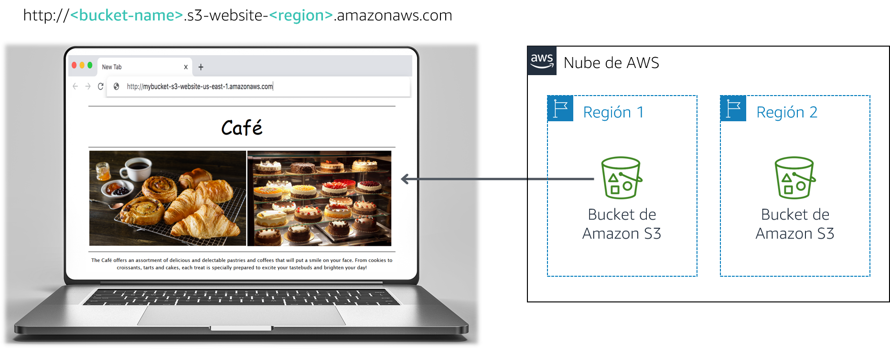

# Módulo 3 - Laboratorio de desafíos: Creación de un sitio web estático para la cafetería

## Caso

Frank y Martha son un equipo de esposos que poseen y administran una cafetería pequeña, que vende postres y café. Su hija, Sofía, y otro empleado, Nikhil, que es un estudiante de secundaria, también trabajan en la cafetería. La cafetería tiene un solo local en una ciudad grande.

Actualmente, la cafetería no tiene una estrategia de marketing. En su mayoría, ganan nuevos clientes cuando alguien pasa por el frente, ve la cafetería y decide probar. La cafetería tiene fama de tener postres y cafés de buena calidad, pero su reputación se limita a las personas que la han visitado o que han oído hablar de ellos por parte de sus clientes.

Sofía sugiere a Frank y Martha que deberían hacerse más conocidos en la comunidad sobre lo que la cafetería tiene para ofrecer. La cafetería aún no tiene presencia en la web y actualmente no utiliza ningún servicio de informática en la nube. Sin embargo, esa situación está a punto de cambiar.

<br/>
## Información general y objetivos del laboratorio

En este laboratorio, utiliza Amazon Simple Storage Service (Amazon S3) para crear un sitio web estático e implementar prácticas recomendadas de arquitectura con el fin de proteger y administrar sus datos.

Después de completar este laboratorio, debería ser capaz de lo siguiente:

- Implementar un sitio web estático mediante Amazon S3.
- Implementar una forma de proteger sus datos con Amazon S3
- Implementar una estrategia de ciclo de vida de los datos en Amazon S3
- Implementar una estrategia de recuperación de desastres en Amazon S3
   <br/>
   Una vez que termine este laboratorio, la arquitectura debería verse como el siguiente ejemplo:



<br/>
**Nota:** En este laboratorio de desafíos encontrará algunas tareas que no incluyen instrucciones paso a paso. Debe darse cuenta sin ayuda de cómo completar las tareas.

<br/>
## Duración

El tiempo estimado para completar este laboratorio es de **60 minutos**.

<br/>
## Restricciones de los servicios de AWS

En este entorno de laboratorio, el acceso a los servicios y las acciones de los servicios de AWS puede restringirse a los que se necesiten para cumplir las instrucciones del laboratorio. Es posible que se produzcan errores si intenta acceder a otros servicios o hacer acciones que no sean las que se describen en este laboratorio.

<br/>
## Acceso a la consola de administración de AWS

1. En la parte superior de estas instrucciones, elija <span id="ssb_voc_grey">Start Lab</span> (Iniciar laboratorio) y comience a trabajar en él.

   Se abrirá el panel **Start Lab** (Iniciar laboratorio), donde se muestra el estado del laboratorio.

   **Sugerencia**: Si necesita más tiempo para completar el laboratorio, vuelva a hacer clic en el botón Start Lab (Iniciar laboratorio) para reiniciar el temporizador del entorno.

2. Espere hasta que aparezca el mensaje *Lab status: ready (Estado del laboratorio: listo)* y, a continuación, haga clic en **X** para cerrar el panel **Start Lab** (Iniciar laboratorio).

3. En la parte superior de estas instrucciones, elija <span id="ssb_voc_grey">AWS</span>.

   Esto abrirá la consola de administración de AWS en una nueva pestaña del navegador y el sistema iniciará su sesión de forma automática.

   **Sugerencia**: Si no se abre una nueva pestaña del navegador, por lo general habrá un aviso o un icono en la parte superior con un mensaje que indicará que el navegador impide que el sitio abra ventanas emergentes. Haga clic en el aviso o el icono y elija **Allow pop ups** (Permitir ventanas emergentes).

4. Ubique la pestaña de la consola de administración de AWS de modo que aparezca junto con estas instrucciones. Idealmente, debería poder ver ambas pestañas del navegador al mismo tiempo para que pueda seguir los pasos del laboratorio fácilmente.

<br/>
## Una solicitud comercial para la cafetería: el lanzamiento de un sitio web estático (Desafío n.° 1)

Sofía le mencionó a Nikhil que le gustaría que la cafetería tuviera un sitio web que mostrara las ofertas visualmente y que proporcionara a los clientes detalles del negocio, como la ubicación de la tienda, el horario de atención y el número de teléfono.

Nikhil está contento de que le hayan pedido crear el primer sitio web para la cafetería.

Para este primer desafío, asumirá el papel de Nikhil y utilizará Amazon S3 para crear un sitio web básico para la cafetería.

<br/>
### Tarea 1: Extraer los archivos que necesita para este laboratorio

En esta tarea, extraerá los archivos que necesita para crear el sitio web estático.

5. Descargue el *archivo.zip* que necesita para este laboratorio abriendo [este enlace de Amazon S3](https://aws-tc-largeobjects.s3-us-west-2.amazonaws.com/ILT-TF-200-ACACAD-20-EN/Module-3-Challenge-Lab/static-website.zip).

6. En su computadora, extraiga los archivos. Observe que tiene un archivo *index.html* y dos carpetas que contienen hojas de estilos en cascada (CSS) y archivos de imagen.

<br/>
### Tarea 2: Crear un bucket de S3 para alojar su sitio web estático

En esta tarea, creará un bucket de Amazon S3 y lo configurará para alojar su sitio web estático.

7. Abra la **consola de Amazon S3**.
8. Cree un bucket para alojar su sitio web estático.

   - Cree el bucket en la región de AWS que esté más cerca de las personas que tengan más probabilidad de acceder a él.
   - **Sugerencia**: Debe desactivar la opción **Block *all* public access (Bloquear todo el acceso público)**.
9. Habilite el alojamiento de sitios web estáticos en su bucket.
   - **Sugerencia**: Utilizará el archivo *index.html* para su documento de índice.

<br/>
### Tarea 3: Cargar contenido al bucket de S3

En esta tarea, cargará los archivos estáticos en el bucket de S3.

10. Cargue el archivo *index.html* y las carpetas de *css* e *imágenes* a su bucket de S3.

11. En otra pestaña del navegador web, abra el vínculo del punto de enlace para su sitio web.

<br/>
#### Respuesta a las preguntas sobre el laboratorio

Las respuestas se registrarán cuando haga clic en el botón azul **Submit** (Enviar) que está al final del laboratorio.

12. Acceda a las preguntas de este laboratorio.
    - Elija el menú <span id="ssb_voc_grey">Details (Detalles) <i class="fas fa-angle-down"></i></span>
      y después <span id="ssb_voc_grey">Show</span> (Mostrar).
    - Elija el enlace **Access the multiple choice questions** (Acceder a las preguntas de múltiple opción) que aparece en la parte inferior de la página.

13. En la página que cargó, responda la primera pregunta:

    - **Pregunta 1**: Cuando observa el sitio web después de la Tarea 3, ¿ve la página en el navegador?

    **Nota**: Deje abierta la página web con las preguntas en la pestaña de su navegador. Volverá a ella más adelante en este laboratorio.

<br/>
### Tarea 4: Crear una política de bucket para conceder acceso público de lectura

Frank comparte que planea crear *muchos* tipos nuevos de pasteles para la cafetería. Usted se da cuenta que deberá cargar una imagen para cada nuevo postre que él cree y habilitar el acceso público en ese objeto. Este proceso no es para hacerlo manualmente. Entonces, decide crear una política de bucket que automáticamente hace que los objetos sean públicos cuando los carga a la carpeta.

14. Cree una política de bucket que conceda permiso de solo lectura a usuarios públicos anónimos mediante el editor de Políticas de bucket.

    **Pista**: Si queda atascado, consulte los ejemplos de la [documentación de AWS](https://docs.aws.amazon.com/AmazonS3/latest/dev/example-bucket-policies.html).

15. Confirme que el sitio web de la cafetería sea accesible públicamente.

<br/>
*¡Felicitaciones!* Ya tiene un sitio web para la cafetería.
<br/>

## Nuevo requisito empresarial: proteger los datos del sitio web (Desafío n.° 2)

Le muestra a Sofía el nuevo sitio web y queda muy impresionada. ¡Buen trabajo!

Hablan con Sofía acerca de que probablemente necesitará hacer muchas actualizaciones al sitio web, ya que la cantidad de ofertas de la cafetería crece.

Olivia, arquitecta de soluciones de AWS y cliente habitual de la cafetería, le aconseja implementar una estrategia para evitar la sobrescritura accidental y la eliminación de objetos del sitio web.

Ya tiene que hacer algunos cambios al sitio web, por lo que decide que este es un buen momento para explorar el control de versiones de objeto.

<br/>
### Tarea 5: Habilitar el control de versiones en el bucket de S3

En esta tarea, habilitará el control de versiones en su bucket de S3 y confirmará que funcione.

16. En la consola de S3, habilite el control de versiones de su bucket de S3.

    **Nota**: Tenga en cuenta que después de habilitar el control de versiones, no puede desactivarlo.

17. En el editor de textos de su preferencia, abra el archivo *index.html*. Por ejemplo, puede utilizar Notepad++ o TextWrangler.

18. Modifique el archivo según las siguientes instrucciones:
    - Localice la primera línea que tenga el código CSS incrustado **bgcolor="aquamarine"** en el HTML y cámbiela a `bgcolor="gainsboro"`.
    - Localice la línea que tenga el código CSS incrustado **bgcolor="orange"** en el HTML y cámbiela a `bgcolor="cornsilk"`.
    - Localice la segunda línea que tenga el código CSS incrustado **bgcolor="aquamarine"** en el HTML y cámbiela a `bgcolor="gainsboro"`.
    - Guarde los cambios.

19. Cargue el archivo actualizado en el bucket de S3.

20. Vuelva a cargar la pestaña del navegador con su sitio web y observe los cambios.

21. Para ver la última versión del archivo *index.html*, vaya al bucket y seleccione **Show** (Mostrar). Debería ver ambas versiones de este archivo en el menú desplegable.

22. Regrese a la pestaña del navegador con las preguntas de opción múltiple que corresponden a este laboratorio y responda la siguiente pregunta:

    - **Pregunta 2**: ¿Cuál es otra forma de garantizar la máxima protección y evitar la eliminación accidental de una versión preservada? (**Sugerencia**: Revise las [preguntas frecuentes de Amazon S3](https://aws.amazon.com/s3/faqs/).)

<br/>
<br/>
**Práctica recomendada para la arquitectura**

En esta tarea, utilizó una técnica para implementar la práctica recomendada para la arquitectura de *proteger sus datos*.

<details>
	<summary>Expanda <b>aquí</b> para obtener más información.</summary>
	De acuerdo con el <a href="https://d1.awsstatic.com/whitepapers/architecture/AWS_Well-Architected_Framework.pdf">Marco de Buena Arquitectura</a>, el control de versiones puede ser parte de un proceso más grande de administración del ciclo de vida de los datos. Antes de crear cualquier sistema, deben implementarse prácticas básicas que influyan en la seguridad. Por ejemplo, la <i>clasificación de datos</i> proporciona una manera de categorizar datos organizacionales sobre la base de niveles de confidencialidad. El <i>cifrado</i> protege los datos haciendo que no sean legibles para quienes no tienen la autorización de acceso. Estas herramientas y técnicas son importantes, ya que admiten objetivos como la prevención de pérdidas financieras o cumplir con las obligaciones reglamentarias.
</details>

<br/>
## Nuevo requisito empresarial: optimizar de los costos del almacenamiento de objetos de S3 (Desafío n.° 3)

Ahora que ha habilitado el control de versiones, observa que el tamaño del bucket de S3 continuará creciendo a medida que carga objetos y versiones nuevos. Para ahorrar, decide implementar una estrategia para retirar algunas de esas versiones antiguas.

<br/>
### Tarea 6: Establecer políticas de ciclo de vida

En esta tarea, establecerá una política de ciclo de vida para mover automáticamente versiones antiguas de los objetos del bucket de origen a S3 Estándar - Acceso poco frecuente (S3 Standard-IA). La política también debería hacer caducar eventualmente los objetos.

23. Cree una regla de ciclo de vida que realice lo siguiente:
- Mueva las versiones anteriores de todos los objetos del bucket de origen a S3 Estándar - Acceso poco frecuente después de 30 días
- Haga caducar versiones antiguas de los objetos después de 365 días
   <br/>**Pista**: Si queda atascado, consulte la [documentación de AWS](https://docs.aws.amazon.com/AmazonS3/latest/user-guide/create-lifecycle.html) para obtener ayuda.
   <br/>
   **Nota**: Para *limitar el alcance* de la replicación a un objeto de bucket específico (por ejemplo, el archivo *index.html*), cree una etiqueta para el objeto antes de crear la regla de ciclo de vida.
   <br/>

¡Muy bien! En este momento debería tener una regla de ciclo de vida que traslade versiones antiguas de sus objetos de bucket de origen a S3 Estándar - Acceso poco frecuente después de 30 días. La política también eliminará de manera permanente los objetos que estén en S3 Estándar - Acceso poco frecuente después de 365 días.

<br/>
**Práctica recomendada para la arquitectura**

En esta tarea, implementó la práctica recomendada para la arquitectura de *definir la administración del ciclo de vida de los datos.*

<details>
	<summary>Expanda <b>aquí</b> para obtener más información.</summary>
	De acuerdo con el <a href="https://d1.awsstatic.com/whitepapers/architecture/AWS_Well-Architected_Framework.pdf">Marco de Buena Arquitectura</a>, en la práctica, su estrategia de ciclo de vida debe basarse en la <i>importancia y confidencialidad</i> de sus datos, y en <i>requisitos legales y organizacionales</i>. Debe tener en cuenta factores como la duración de la retención, la destrucción, la administración del acceso, la transformación y el uso compartido de los datos.
</details>

<br/>
## Nuevo requisito empresarial: mejorar la durabilidad y la planificación para la recuperación de desastres (Desafío n.° 4)

Durante la siguiente visita de Olivia a la cafetería, usted le cuenta sobre las actualizaciones del sitio web. Describe las medidas que tomó para proteger los archivos estáticos del sitio web de que se sobrescriban o eliminen accidentalmente. Olivia le dice que la replicación entre regiones es otra característica de Amazon S3 que también puede utilizar para realizar copias de seguridad y archivar datos críticos.

<br/>
### Tarea 7: Habilitar la replicación entre regiones

En esta tarea, habilitará la replicación entre regiones en el bucket de S3 de origen.

24. En una región diferente a la del bucket de origen, cree un segundo bucket y habilite el control de versiones en él. El segundo bucket es el *bucket de destino*.

25. En el bucket de S3 de origen, habilite la replicación entre regiones. Cuando cree la regla de replicación, asegúrese de hacer lo siguiente:
    - Replique todo el bucket de origen.
    - Utilice **CafeRole** para el rol de AWS Identity and Access Management (IAM). Este rol de IAM le da a Amazon S3 los permisos para leer objetos desde el bucket de origen y replicarlos en el bucket de destino.
    - Si aparece la advertencia *The replication rule is saved, but it might not work (La regla de replicación se guardó, pero puede que no funcione)*, puede ignorarlo y continuar con el siguiente paso.
    <br/>
    **Pista**: Si queda atascado, consulte la [documentación de AWS](https://docs.aws.amazon.com/AmazonS3/latest/user-guide/enable-replication.html#enable-replication-add-rule) para obtener ayuda.
    <br/>
    **Nota:** *CafeRole* tiene los siguientes permisos:

```yaml
Version: 2012-10-17
Statement:
  - Action:
	- s3:ListBucket
	- s3:ReplicateObject
	- s3:ReplicateDelete
	- s3:ReplicateTags
	- s3:Get*
    Resource:
	- '*'
    Effect: Allow
```

Esta política de acceso permite al rol realizar las tareas de replicación en *todos* los buckets de S3. En un entorno de producción real, debe restringir la política para que se aplique únicamente a los buckets S3 de origen y destino. Para obtener más información acerca de cómo crear un rol de IAM, consulte [Configuración de permisos para replicación](https://docs.aws.amazon.com/AmazonS3/latest/dev/setting-repl-config-perm-overview.html).
<br/>
26. Vuelva a la pestaña del navegador con las preguntas de opción múltiple para este laboratorio y responda a la siguiente pregunta:

    - **Pregunta 3**: ¿Ve los objetos de su bucket de origen en el bucket de destino?

27. Realice un cambio menor en el archivo *index.html* y cargue la nueva versión a su bucket de origen.

28. Verifique que el bucket de origen ahora tenga tres versiones del archivo *index.html*.

29. Confirme que el nuevo objeto se haya replicado en su bucket de destino. Tal vez deba volver a cargar la pestaña del navegador.

30. Vaya a su depósito de origen y elimine la versión más reciente.

31. Regrese a la pestaña del navegador con las preguntas de opción múltiple que corresponden a este laboratorio y responda la siguiente pregunta:

   - **Pregunta 4**: ¿La versión que acaba de eliminar de su bucket de origen, también se eliminó de su bucket de destino?

<br/>
**Práctica recomendada para la arquitectura**

En esta tarea, implementó la práctica recomendada para la arquitectura de *automatizar la recuperación de desastres*.

<details>
	<summary>Expanda <b>aquí</b> para obtener más información.</summary>
 De acuerdo con el <a href="https://d1.awsstatic.com/whitepapers/architecture/AWS_Well-Architected_Framework.pdf">Marco de Buena Arquitectura</a>, el inicio de su estrategia de recuperación de desastres consiste en <i>contar con componentes de copia de seguridad y de carga de trabajo redundantes</i>. Debe utilizar AWS o herramientas de terceros para automatizar la recuperación del sistema y dirigir el tráfico al sitio o región de recuperación de desastres.
</details>

<br/>
## Envío de su trabajo

32. En la parte superior de estas instrucciones, elija <span id="ssb_blue">Submit</span> (Enviar) para registrar su progreso y, cuando se le indique, elija **Yes** (Sí).

33. Si los resultados no se muestran después de algunos minutos, vuelva a la parte superior de estas instrucciones y elija <span id="ssb_voc_grey">Grades</span> (Resultados).

    **Sugerencia**: Puede enviar su trabajo varias veces. Después de realizar las modificaciones pertinentes, vuelva a elegir **Submit** (Enviar). Su último envío es el que se registrará para este laboratorio.

34. Para encontrar comentarios detallados sobre su trabajo, elija <span id="ssb_voc_grey">Details</span> (Detalles) seguido de <i class="fas fa-caret-right"></i> **View Submission Report** (Ver informe de envío).

<br/>

## Fin del laboratorio

<i class="fas fa-flag-checkered"></i> ¡Felicitaciones! Ha completado el laboratorio.

35. Para confirmar que desea finalizar el laboratorio, haga clic en **<span id="ssb_voc_grey">End Lab</span> (Finalizar laboratorio)** en la parte superior de esta página y, a continuación, elija **<span id="ssb_blue">Yes</span> (Sí)**.

   Debería aparecer un panel con el siguiente mensaje: _DELETE has been initiated… You may close this message box now (Se ha iniciado la ELIMINACIÓN… Ya puede cerrar este cuadro de mensaje)._

36. Para cerrar el panel, haga clic en la **X** en la esquina superior derecha.


<br/>
*© 2020 Amazon Web Services, Inc. y sus empresas afiliadas. Todos los derechos reservados. Este contenido no puede reproducirse ni redistribuirse, total ni parcialmente, sin el permiso previo por escrito de Amazon Web Services, Inc. Queda prohibida la copia, el préstamo y la venta de carácter comercial.*
