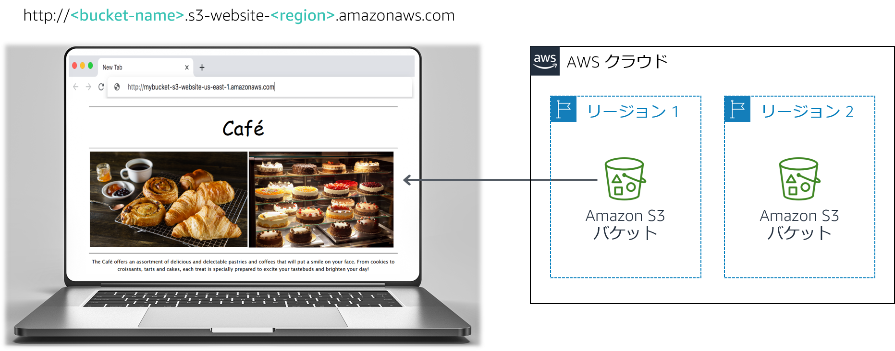

# モジュール 3 課題ラボ: カフェの静的ウェブサイトの作成

## シナリオ

Frank と Martha は夫婦 2 人でデザートやコーヒーを提供する小さなカフェを所有し、経営しています。娘の Sofía と従業員の Nikhil もカフェで働いています。現在このカフェは 1 店舗のみで大きい町にあります。

現在、このカフェにはマーケティング戦略がありません。新規のお客様のほとんどは、通りがかりにカフェがあることに気づいて入ってみた人たちです。カフェのデザートとコーヒーは高いクオリティで評価を得ていますが、その評判はカフェを訪れた人やそのお客様から聞いた人たちにしか伝わっていません。

Sofía は、カフェで提供しているサービスについて、多くの人たちへの認知度を高めるべきだと Frank と Martha に提案しました。カフェにはウェブサイトがまだなく、現在はクラウドコンピューティングサービスも使用していません。しかし、その状況は変わろうとしています。

<br/>

## ラボの概要と目標

このラボでは、Amazon Simple Storage Service (Amazon S3) を使用して静的ウェブサイトを構築し、データの保護と管理に関するアーキテクチャのベストプラクティスを実装します。

このラボを完了すると、次のことができるようになります。

- Amazon S3 を使用して静的ウェブサイトをホストする
- Amazon S3 でデータを保護する方法を実装する
- Amazon S3 でデータのライフサイクル戦略を実装する
- Amazon S3 で災害対策（DR）戦略を実装する
   <br/>

   ラボの終了時のアーキテクチャは次の例のようになります。



<br/>

**注:** この課題ラボでは、一部のタスクでステップバイステップの手順は示されていません。自分でタスクを完了させる方法を考えてください。

<br/>

## 所要時間

このラボは、修了までに約** 60 分**かかります。

<br/>

## AWS サービスの制限事項

このラボ環境では、AWS のサービスとサービスアクションへのアクセスが、ラボの手順を完了するために必要なものに制限されています。他のサービスへのアクセスや、このラボで説明されているサービス以外のアクションを実行しようとすると、エラーが発生することがあります。

<br/>

## AWS マネジメントコンソールにアクセスする

1. この手順の上部にある <span id="ssb_voc_grey">Start Lab</span> をクリックし、ラボを起動します。

   [**Start Lab**] パネルが開き、ラボのステータスが表示されます。

   <i class="fas fa-info-circle"></i> **ヒント**: ラボの完了までにさらに時間が必要な場合は、<span id="ssb_voc_grey">Start Lab</span> ボタンをもう一度選択して、この環境のタイマーを再開します。

2. \[**Start Lab**] パネルに **Lab status: ready** というメッセージが表示されたら [**X**] をクリックしてパネルを閉じます。

3. この手順の上部にある <span id="ssb_voc_grey">AWS</span> をクリックします。

   このアクションにより、新しいブラウザタブで AWS マネジメントコンソールが開き、ユーザーは自動的にログインします。

   <i class="fas fa-exclamation-triangle"></i> **ヒント**: 新しいブラウザタブが開かない場合、通常、ブラウザによってサイトのポップアップウィンドウの表示がブロックされたというメッセージが表示されたバナーまたはアイコンがブラウザの上部に表示されます。バナーまたはアイコンを選択して [**ポップアップを許可**] を選択してください。

4. **AWS マネジメントコンソール**タブがこの手順と並べて表示されるようにします。両方のブラウザタブを同時に開いておくと、ラボのステップを実行しやすくなります。

   <i class="fas fa-exclamation-triangle"></i> **特に指示がない限り、リージョンを変更しないでください**。

<br/>

## カフェのビジネス要件: 静的ウェブサイトを立ち上げる（課題 1）

Sofía は Nikhil に、カフェの商品を画像で紹介するウェブサイトを作りたいと言いました。また、店舗の場所、営業時間、電話番号などの店舗情報も顧客に提供します。

Nikhil は、カフェ初のウェブサイトの作成を依頼されて喜んでいます。

この最初の課題では、あなたは Nikhil の役になり、Amazon S3 を使用してカフェの基本的なウェブサイトを作成しましょう。

<br/>

### タスク 1: このラボに必要なファイルを抽出する

このタスクでは、静的ウェブサイトの作成に必要なファイルを抽出します。

5. このラボに必要な **.zip** ファイルを、[この Amazon S3 リンク](https://aws-tc-largeobjects.s3-us-west-2.amazonaws.com/ILT-TF-200-ACACAD-20-EN/Module-3-Challenge-Lab/static-website.zip)からダウンロードします。

6. コンピュータ上で、ファイルを解凍します。**index.html** ファイルが 1 つと 2 つのフォルダが表示されます。フォルダには、カスケーディングスタイルシート（CSS）と画像ファイルが含まれています。

<br/>

### タスク 2: 静的ウェブサイトをホストする S3 バケットを作成する

このタスクでは、S3 バケットを作成し、静的ウェブサイトをホストするように設定します。

7. **Amazon S3 コンソール**を開きます。
8. 静的ウェブサイトをホストするバケットを作成します。

   - アクセスする可能性が最も高いユーザーに一番近い AWS リージョンでバケットを作成します。
   - **ヒント**: [**パブリックアクセスをすべてブロック**] チェックボックスをオフにする必要があります。
9. バケットで静的ウェブサイトのホスティングを有効にします。
   - **ヒント**: インデックスドキュメントに **index.html** ファイルを使用します。

<br/>

### タスク 3: S3 バケットにコンテンツをアップロードする

このタスクでは、静的ファイルを S3 バケットにアップロードします。

10. **index.html** ファイルと **css** および **images** フォルダを S3 バケットにアップロードします。

11. 別のウェブブラウザタブで、静的ウェブサイトのエンドポイントリンクを開きます。

<br/>

#### ラボに関する質問に回答する

ラボの最後に、上部にあるブルーの [**Submit**] ボタンを選択すると、解答が記録されます。

12. このラボの問題にアクセスします。
    - <span id="ssb_voc_grey">Details <i class="fas fa-angle-down"></i></span> ドロップダウンメニューから <span id="ssb_voc_grey">Show</span> を選択します。
    - ページ下部に表示される [**Access the multiple choice questions**] のリンクをクリックします。

13. 読み込んだページで、最初の質問に答えます。

    - **質問 1**: タスク 3 の後にウェブサイトを確認したとき、ブラウザにページは表示されますか?

**注意**: 質問のウェブページはブラウザタブで開いたままにしておいてください。このラボの後半で再度このウェブページに戻ります。

<br/>

### タスク 4:パブリック読み取りアクセスを許可するバケットポリシーを作成する

Frank は、カフェで新しい種類の焼き菓子を*多数*作ることを計画しています。あなたは、彼が作る新しいデザートの画像をアップロードして、そのオブジェクトへのパブリックアクセスを有効にする必要があると認識しています。このプロセスを手動で行いたくはありません。代わりに、フォルダにアップロードされるときに各オブジェクトを自動的にパブリックにするバケットポリシーを作成することにします。

14. バケットポリシーエディターを使用して、パブリック匿名ユーザーに読み取り専用アクセス許可を付与するバケットポリシーを作成します。

**ヒント**: 不明な点がある場合は、[AWS ドキュメント](https://docs.aws.amazon.com/ja_jp/AmazonS3/latest/userguide/example-bucket-policies.html)の例を参照してください。

15. カフェのウェブサイトがパブリックアクセス可能になっていることを確認します。

<br/>

**おめでとうございます!** カフェの静的ウェブサイトが作成されました。

<br/>

## 新しいビジネス要件: ウェブサイトのデータを保護する（課題 2）

Sofía に新しいウェブサイトを見せると、彼女はとても喜んでくれました。よくできましたね！

あなたと Sofía は、カフェの商品数が増えるにつれてウェブサイトを頻繁に更新しなければならなくなりそうだと話しています。

AWS ソリューションアーキテクトでカフェの常連である Olivia から、不注意でウェブサイトのオブジェクトを上書きしたり削除したりしないようにするための戦略を実装することをアドバイスされました。

すでにウェブサイトにいくつかの変更を加える必要があったため、オブジェクトのバージョニングを検討する良い機会だと判断しました。

<br/>

### タスク 5: S3 バケットのバージョニングを有効にする

このタスクでは、S3 バケットのバージョニングを有効にし、機能することを確認します。

16. S3 コンソールで、S3 バケットのバージョニングを有効にします。

    **注**: バージョニングを有効にすると、無効にすることはできません。

17. お気に入りのテキストエディタで、**index.html** ファイルを開きます。Notepad++ や TextWrangler などを使用できます。

18. 次の手順に従って、ファイルを変更します。
    - HTML で、**bgcolor="aquamarine"** という埋め込み CSS コードが含まれている最初の行を探し、`bgcolor="gainsboro"` に変更します。
    - HTML で、**bgcolor="orange"** という埋め込み CSS コードが含まれている行を探し、`bgcolor="cornsilk"` に変更します。
    - HTML で、**bgcolor="aquamarine"** という埋め込み CSS コードが含まれている 2 番目の行を探し、`bgcolor="gainsboro"` に変更します。
    - 変更を保存します。

19. 更新済みのファイルを S3 バケットにアップロードします。

20. ウェブブラウザタブにウェブサイトを再読み込みし、変更を確認します。

21. **index.html** ファイルの最新バージョンを確認するには、バケットに移動して [**表示**] をクリックします。ドロップダウンメニューに、このファイルの両方のバージョンが表示されます。

22. このラボの複数選択式の質問が表示されたブラウザタブに戻り、次の質問に答えます。

    - **質問 2**: 最大限の保護を実現し、保持されているバージョンの不注意による削除を防止する別の方法は何ですか?（**ヒント**: [Amazon S3 のよくある質問](https://aws.amazon.com/s3/faqs/)を参照）

<br/>

<br/>

**アーキテクチャのベストプラクティス**

このタスクでは、**データの保護**に関するアーキテクチャのベストプラクティスを実装する方法の一つを使用しました。

<details>
	<summary>詳細については、<b>こちら</b>を展開してください。</summary>
	<a href="https://d1.awsstatic.com/whitepapers/ja_JP/architecture/AWS_Well-Architected_Framework.pdf">Well-Architected フレームワーク</a>によると、バージョニングはデータのライフサイクル管理の大きなプロセスの中に組み込むことができます。どのようなシステムであっても、アーキテクチャを設計する前に、セキュリティに影響する基盤となるプラクティスを整えておく必要があります。例えば、<b>データ分類</b>は、機密性のレベルに応じて組織のデータを分類する方法です。<b>暗号化</b>は、許可されていないアクセスではデータを解読できないようにしてデータを保護します。このようなツールと手法は、経済的損失を防止したり、規制上の義務に準拠したりするうえで重要です。
</details>
<br/>

## 新しいビジネス要件: S3 オブジェクトストレージのコストを最適化する（課題 3）

バージョニングを有効にしましたが、新しいオブジェクトおよびバージョンをアップロードすると S3 バケットのサイズが増加し続けることに気づきました。コストを削減するために、一部の古いバージョンを廃止する戦略を実装することにします。

<br/>

### タスク 6: ライフサイクルポリシーを設定する

このタスクでは、ソースバケットにある古いバージョンのオブジェクトを S3 標準低頻度アクセス（S3 標準 - IA）に自動的に移動するようライフサイクルポリシーを設定します。また、このポリシーで最終的にオブジェクトを期限切れにもします。

23. 次のようなライフサイクルルールを作成します。
    - 30 日経過したら、以前のバージョンのすべてのソースバケットオブジェクトを S3 標準 - IA に移動する
    - 365 日経過したら、以前のバージョンのオブジェクトを期限切れにする
    <br/>**ヒント**: 不明な点については、ガイダンスとして [AWS ドキュメント](https://docs.aws.amazon.com/AmazonS3/latest/user-guide/create-lifecycle.html)を参照してください。
    <br/>

   **注**: 特定のバケットオブジェクト（**index.html** ファイルなど）にレプリケーションの**範囲を制限する**には、オブジェクトのタグを作成してからライフサイクルルールを作成します。

   <br/>

よくできました! これで、30 日が経過したら以前のバージョンのソースバケットオブジェクトを S3 標準 - IA に移動するライフサイクルルールが作成されました。また、このポリシーでは、365 日経過したら S3 標準 - IA にあるオブジェクトを完全に削除します。

<br/>

**アーキテクチャのベストプラクティス**

このタスクでは、**データのライフサイクル管理の定義**に関するアーキテクチャのベストプラクティスを実装しました。

<details>
	<summary>詳細については、<b>こちら</b> を展開してください。</summary>
	<a href="https://d1.awsstatic.com/whitepapers/ja_JP/architecture/AWS_Well-Architected_Framework.pdf">Well-Architected フレームワーク</a>によると、実際には、ライフサイクル戦略はデータの<b>重要性と機密性</b>、および<b>法的要件と組織の要件</b>に基づくようにしてください。データの保持期間、データの破壊、データアクセス管理、データ変換、データ共有などの要因を考慮してください。
</details>
<br/>

## 新しいビジネス要件: DR に向けた耐久性の強化と計画（課題 4）

次に Olivia がカフェに来たとき、彼女にウェブサイトの更新について話しました。ウェブサイトの静的ファイルを不注意で上書きまたは削除しないよう保護するための対策について説明しました。Olivia は、クロスリージョンレプリケーションという Amazon S3 の別の機能でも、重要なデータをバックアップおよびアーカイブできることを教えてくれました。

<br/>

### タスク 7: クロスリージョンレプリケーションを有効にする

このタスクでは、ソース S3 バケットでクロスリージョンレプリケーションを有効にします。

24. ソースバケットとは異なるリージョンで、2 つ目のバケットを作成し、バージョニングを有効にします。2 つ目のバケットは**レプリケート先バケット**になります。

25. ソース S3 バケットで、クロスリージョンレプリケーションを有効にします。レプリケーションルールを作成するときに、次のことを必ず実行します。
    - ソースバケット全体をレプリケートする。
    - AWS Identity and Access Management (IAM) ロールに **CafeRole** を使用する。この IAM ロールにより、ソースバケットからオブジェクトを読み取り、レプリケート先バケットにレプリケートするための権限が Amazon S3 に付与されます。
    - **The replication rule is saved, but it might not work ** という警告が表示された場合は、無視して次の手順に進みます。
    <br/>

      **ヒント**: 不明な点については、ガイダンスとして AWS ドキュメント (https://docs.aws.amazon.com/AmazonS3/latest/user-guide/enable-replication.html#enable-replication-add-rule) を参照してください。

    <br/>

      **注:** *CafeRole* には次の権限があります。

```yaml
Version: 2012-10-17
Statement:
  - Action:
	- s3:ListBucket
	- s3:ReplicateObject
	- s3:ReplicateDelete
	- s3:ReplicateTags
	- s3:Get*
    Resource:
	- '*'
    Effect: Allow
```

このアクセスポリシーによって、ロールは**すべての** S3 バケットでレプリケーションタスクを実行できます。実際の本番環境では、ポリシーを制限して、ソースおよびレプリケーション先 S3 バケットにのみ適用する必要があります。IAM ロールの作成の詳細については、[レプリケーションのアクセス許可のセットアップ](https://docs.aws.amazon.com/AmazonS3/latest/dev/setting-repl-config-perm-overview.html)を参照してください。
<br/>
26. このラボの複数選択式の質問が表示されたブラウザタブに戻り、次の質問に答えます。

    - **質問 3**: レプリケート先バケットにソースバケットからのオブジェクトは表示されていますか?

27. **index.html** ファイルを少し変更して、新しいバージョンをソースバケットにアップロードします。

28. ソースバケットに 3 つのバージョンの **index.html** ファイルがあることを確認します。

29. 新しいオブジェクトがレプリケート先バケットにレプリケートされたことを確認します。ブラウザタブの再読み込みが必要になる場合があります。

30. ソースバケットに移動して、最新バージョンを削除します。

31. このラボの複数選択式の質問が表示されたブラウザタブに戻り、次の質問に答えます。

    - **質問 4**: ソースバケットから先ほど削除したバージョンは、レプリケート先バケットからも削除されていますか?

<br/>

**アーキテクチャのベストプラクティス**

このタスクでは、**災害対策の自動化**に関するアーキテクチャのベストプラクティスを実装しました。

<details>
	<summary>詳細については、<b>こちら</b> を展開してください。</summary>
	<a href="https://d1.awsstatic.com/whitepapers/ja_JP/architecture/AWS_Well-Architected_Framework.pdf">Well-Architected フレームワーク</a>によると、DR 戦略は、<b>バックアップと冗長性のあるワークロードコンポーネントを整えること</b>から始まります。AWS やサードパーティーのツールを使用して、システムリカバリを自動化したり、トラフィックを DR サイトまたはリージョンにルーティングしたりしてください。
</details>

<br/>

## 作業内容を送信する

32. この手順の上部にある <span id="ssb_blue">Submit</span> をクリックして進捗情報を記録し、プロンプトが表示されたら [**Yes**] をクリックします。

33. 数分経っても結果が表示されない場合は、この手順の上部に戻り、<span id="ssb_voc_grey">Grades</span> をクリックします。

    **ヒント**: 作業内容は何度も送信できます。作業内容を変更したら、再度 [**Submit**] をクリックします。最終送信分がこのラボの作業内容として記録されます。

34. 作業に関する詳細なフィードバックを参照するには、<span id="ssb_voc_grey">Details </span> ドロップダウンメニューから <i class="fas fa-caret-right"></i> **View Submission Report** をクリックします。

<br/>

## ラボの終了

<i class="fas fa-flag-checkered"></i>お疲れ様でした。以上でラボは終了です。

35. ラボを終了するには、このページの上部にある <span id="ssb_voc_grey">End Lab</span> をクリックし、<span id="ssb_blue">Yes</span> をクリックします。

    パネルに **DELETE has been initiated... You may close this message box now** というメッセージが表示されます。

36. 右上隅の [**X**] をクリックしてパネルを閉じます。


<br/>

**©2020 Amazon Web Services, Inc. and its affiliates. All rights reserved. このトレーニング内容の全体または一部を複製または再配布することは、Amazon Web Services, Inc. の書面による事前の許可がある場合を除き、禁じられています。商業目的のコピー、貸与、または販売を禁止します。**
