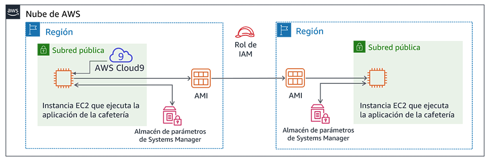

# Laboratorio de desafíos del módulo 4: Creación de un sitio web dinámico para la cafetería

## Caso

Después de que la cafetería lanzó la primera versión de su sitio web, los clientes le dijeron al personal lo bonito que se veía. Sin embargo, además de los elogios, los clientes a menudo preguntaban si podían realizar pedidos en línea.

Sofía, Nikhil, Frank y Martha analizaron la situación. Estuvieron de acuerdo en que su estrategia empresarial y sus decisiones debían centrarse en deleitar a sus clientes y en proporcionarles la mejor experiencia posible en la cafetería.


## Información general y objetivos del laboratorio
En este laboratorio, implementará una aplicación en una instancia de Amazon Elastic Compute Cloud (Amazon EC2). La aplicación permite que la cafetería tome pedidos en línea. Después de probar que la aplicación funcione según lo previsto en la primera región de AWS (el entorno de *desarrollo*), creará una imagen de Amazon Machine (AMI) a partir de la instancia EC2. También implementará una segunda instancia de la misma aplicación como el entorno de *producción* en otra región de AWS.

Después de completar este laboratorio, debería ser capaz de lo siguiente:

- Conectarse al IDE de AWS Cloud9 en una instancia EC2 existente

- Analizar el entorno de la instancia EC2 y confirmar la accesibilidad del servidor web

- Instalar una aplicación web en una instancia EC2 que también utilice AWS Systems Manager Parameter Store

- Probar la aplicación web

- Crear una AMI

- Implementar una segunda copia de la aplicación web en otra región de AWS


Cuando *comience* el laboratorio, ya se habrán creado algunos recursos en la cuenta de AWS para usted:


Una vez que *termine* este laboratorio, la arquitectura debería verse como el siguiente ejemplo:




## Duración
El tiempo estimado para completar este laboratorio es de **60 minutos**.


## Restricciones de los servicios de AWS
En este entorno de laboratorio, el acceso a los servicios y las acciones de los servicios de AWS puede restringirse a los que se necesiten para cumplir las instrucciones del laboratorio. Es posible que se produzcan errores si intenta acceder a otros servicios o hacer acciones que no sean las que se describen en este laboratorio.


## Acceso a la consola de administración de AWS

1. En la parte superior de estas instrucciones, elija <span id="ssb_voc_grey">Start Lab</span> (Iniciar laboratorio) y comience a trabajar en él.

   Se abrirá el panel **Start Lab** (Iniciar laboratorio), donde se muestra el estado del laboratorio.

   **Sugerencia**: Si alguna vez necesita más tiempo para completar el laboratorio que el que se muestra en el temporizador, elija el botón <span id="ssb_voc_grey">Start Lab</span> (Iniciar laboratorio) de nuevo para reiniciar el temporizador del entorno. Esta acción no eliminará los recursos que haya creado.


2. Espere hasta que aparezca el mensaje *Lab status: ready (Estado del laboratorio: listo)* y, a continuación, haga clic en **X** para cerrar el panel **Start Lab** (Iniciar laboratorio).


3. En la parte superior de estas instrucciones, elija <span id="ssb_voc_grey">AWS</span>.

   Esto abrirá la consola de administración de AWS en una nueva pestaña del navegador y el sistema iniciará su sesión de forma automática.

   **Sugerencia**: Si no se abre una nueva pestaña del navegador, por lo general habrá un aviso o un icono en la parte superior, el cual indicará que el navegador impide que el sitio abra ventanas emergentes. Haga clic en el aviso o el icono y elija **Allow pop ups** (Permitir ventanas emergentes).


4. Ubique la pestaña de la consola de administración de AWS de modo que aparezca junto con estas instrucciones. El método más óptimo sería tener ambas pestañas del navegador abiertas al mismo tiempo para que pueda seguir los pasos del laboratorio más fácilmente.


## Una solicitud empresarial para la cafetería: preparar una instancia EC2 para alojar un sitio web (Desafío 1)

La cafetería quiere ofrecer pedidos en línea para los clientes y permitir que su personal vea los pedidos enviados. La arquitectura actual de su sitio web, en la que el sitio web está alojado en Amazon S3, no es compatible con los nuevos requisitos empresariales.

En la primera parte de este laboratorio, asumirá el rol de Sofía. Configurará una instancia de Amazon EC2 para que pueda alojar un sitio web para la cafetería.


### Tarea 1: Analizar la instancia EC2 existente

En esta tarea, obtendrá información sobre una instancia EC2 existente que se creó para usted en la cuenta de AWS.

5. En el menú **Services** (Servicios), elija **EC2** y, a continuación, seleccione **Running instances** (Instancias en ejecución).

   Observe la instancia en ejecución denominada *aws-cloud9-CafeWebServer-...*. Esta instancia EC2 se creó cuando inició el laboratorio.

   


#### Respuesta a las preguntas sobre la instancia

Las respuestas se evaluarán cuando haga clic en el botón azul **Submit** (Enviar) que está al final del laboratorio.

6. Acceda a las preguntas de este laboratorio.
   - Haga clic en el menú **Details** (Detalles) y, luego, en **Show** (Mostrar).
   - Elija el enlace **Access the multiple choice questions** (Acceder a las preguntas de múltiple opción) que aparece en la parte inferior de la página.


7. En la página que cargó, responda las primeras cuatro preguntas:

   - **Pregunta 1**: ¿La instancia se encuentra en una subred pública?
   - **Pregunta 2**: ¿La instancia EC2 tiene una dirección IP pública IPv4 asignada?
   - **Pregunta 3:** ¿Qué números de puerto TCP de entrada están abiertos para esta instancia?
   - **Pregunta 4**: ¿La instancia EC2 tiene asociado un rol de AWS Identity and Access Management (IAM)?

   **Nota**: Deje abierta la página web con las preguntas en la pestaña de su navegador. Volverá a ella más adelante en este laboratorio.


### Tarea 2: Conectarse al IDE en la instancia EC2

AWS Cloud9 es un servicio que puede ejecutarse en una instancia EC2. Ofrece un entorno de desarrollo integrado (IDE) que incluye características como un editor de código, un depurador y un terminal.

Como se utiliza el entorno de AWS Cloud9, no es necesario descargar un par de claves y conectarse a la instancia de EC2 mediante PuTTY o un software de Secure Shell (SSH) similar. Como se utiliza AWS Cloud9, tampoco es necesario utilizar herramientas de edición de texto de línea de comandos (como vi o nano) para editar archivos en la instancia de Linux.

8. En el menú *Services (Servicios)*, elija **AWS Cloud9** y, a continuación, elija **Your environments** (Sus entornos).

   Observe el entorno *CafeWebServer*. Indica que es de entrada *EC2*.


9. Elija **Open IDE** (Abrir IDE).

   Ya está conectado al IDE de AWS Cloud9 que se ejecuta en la instancia EC2 que observó anteriormente.

   El IDE incluye:

   - Un *terminal de Bash* en el panel inferior derecho.
   - Un *explorador de archivos* en el panel izquierdo que muestra los archivos en el directorio `/home/ec2-user/environment` en la instancia.
   - Un *editor de archivos* en el panel superior derecho. Si hace doble clic en un archivo en el explorador de archivos, como el archivo README.md, se mostrará en el editor.


### Tarea 3: Analizar el entorno de pila LAMP y confirmar que sea posible acceder al servidor web

Recuerde que el objetivo de este laboratorio de desafíos es configurar una instancia EC2 para alojar el nuevo sitio web dinámico para la cafetería. En esta tarea, analizará lo que ya está instalado.


10. Observe la versión del sistema operativo.

    En el terminal de Bash de AWS Cloud9, ejecute este comando:

    ```bash
    cat /proc/version
    ```

    Observe cómo el resultado indica que es una instancia de Amazon Linux, bastante similar a Red Hat 7.


11. Observe los detalles del servidor web, la base de datos y PHP, y el estado del servidor.

    En el terminal, ejecute estos comandos:

    ```bash
    sudo httpd -v
    service httpd status
    
    mysql --version
    service mysqld status
    
    php --version
    ```

    El resultado debe mostrar las versiones del servidor web y la base de datos, y también mostrar que no se están ejecutando en la actualidad.


12. Inicie el servidor web y la base de datos, y también configúrelos para que se inicien automáticamente después de que se reinicie la instancia EC2 en cualquier momento en el futuro.

    En el terminal, ejecute estos comandos:

    ```bash
    sudo chkconfig httpd on
    sudo service httpd start
    sudo service httpd status
    
    sudo chkconfig mysqld on
    sudo service mysqld start
    sudo service mysqld status
    ```


13. Configure la instancia EC2 para que pueda utilizar el editor de AWS Cloud9 para editar los archivos del servidor web.

    Observe que el explorador de archivos de AWS Cloud9 actualmente no muestra el directorio web predeterminado del servidor web Apache.

    En el terminal, ejecute estos dos comandos:

    ```bash
    ln -s /var/www/ /home/ec2-user/environment
    sudo chown ec2-user:ec2-user /var/www/html
    ```

    Con el primer comando que ejecutó se creó un enlace simbólico desde el espacio de trabajo predeterminado del editor de AWS Cloud9 al directorio `/var/www` que contiene los archivos de su servidor web.

    Con el segundo comando se cambió la propiedad del subdirectorio **html** para que *ec2-user* (con el que inició sesión) pueda editar y crear nuevos archivos en él.


14. Creación de un sitio web de prueba simple.

    - En el *explorador de archivos*, expanda el directorio **CafeWebServer > www** y resalte el directorio **html**.

    - Elija **File** (Archivo) > **New File** (Archivo nuevo).

    - En la pestaña del editor de texto, pegue la siguiente línea:

      ```html
      <html>Hello from the café web server!</html>
      ```

    - Elija **File** (Archivo) > **Save** (Guardar), y guarde el archivo en el directorio **html** como *index.html*.


15. Posibilite el acceso al sitio web desde Internet.

    En este paso, deberá verificar y actualizar las configuraciones que hacen que se pueda acceder a las páginas web (que están alojadas en el servidor web) desde Internet.

    Aquí tiene algunas sugerencias que lo ayudarán a comenzar:

<details>
<summary><b>Sugerencia n.º 1</b> (haga clic para ampliar)</summary>
Descubra la dirección IP pública IPv4 de la instancia EC2 e intente cargar `http://&lt;public-ip>` en una pestaña del navegador nueva. ¿Se carga el mensaje que escribió en index.html en el navegador?
</details>


<details>
<summary><b>Sugerencia n.º 2</b> (haga clic para ampliar)</summary>
Para permitir el tráfico HTTP de entrada en el puerto TCP 80 desde cualquier lugar, actualice el grupo de seguridad de la instancia EC2, según sea necesario.
</details>


## Nuevo requisito empresarial: Instalar una aplicación de sitio web dinámica en una instancia EC2 (Desafío 2)

En el desafío anterior, configuró la instancia EC2. Ahora sabe que PHP está instalado y que una base de datos relacional se ejecuta en el entorno de la aplicación. Además, en el entorno se ejecuta un servidor web al que se puede acceder desde Internet. Ahora cuenta con la configuración básica para alojar un sitio web dinámico para la cafetería.

En la segunda parte de este laboratorio, asumirá el rol de Sofía e instalará la aplicación de la cafetería en la instancia EC2.


### Tarea 4: Instalar la aplicación de la cafetería

16. Descargue y extraiga los archivos de la aplicación del servidor web.

    En el terminal de Bash, ejecute estos comandos:

    ```bash
    cd ~/environment
    wget https://aws-tc-largeobjects.s3-us-west-2.amazonaws.com/ILT-TF-200-ACACAD-20-EN/mod4-challenge/setup.tar.gz
    tar -zxvf setup.tar.gz
    wget https://aws-tc-largeobjects.s3-us-west-2.amazonaws.com/ILT-TF-200-ACACAD-20-EN/mod4-challenge/db.tar.gz
    tar -zxvf db.tar.gz
    wget https://aws-tc-largeobjects.s3-us-west-2.amazonaws.com/ILT-TF-200-ACACAD-20-EN/mod4-challenge/cafe.tar.gz
    tar -zxvf cafe.tar.gz
    ```

    Observe cómo el explorador de archivos ahora muestra los tres archivos .tar.gz que descargó.

    También extrajo estos archivos de almacenamiento, que crearon los directorios `cafe`, `db` y `setup` en su entorno de trabajo.


17. Copie los archivos de la cafetería en la raíz del documento del servidor web.

    En el terminal de Bash, ejecute este comando:

    ```bash
    mv cafe /var/www/html/
    ```


18. Observe el diseño de la aplicación para su funcionamiento.

    - Abra el código fuente `html/cafe/index.php` en el editor de AWS Cloud9 haciendo doble clic en él.
    - Observe que este archivo contiene código HTML, pero también contiene secciones que van entre elementos *<?php ... ?>*. Estos elementos realizan llamadas a otros sistemas y recursos.
    - Por ejemplo, en la **línea 18**, verá que el código PHP hace referencia a un archivo denominado *getAppParameters.php*.
    - Abra el archivo **getAppParameters.php** en el editor de código.
    - Observe en la **línea 3** de este archivo que se invoca a *AWSSDK*.
    - Además, en **las líneas 10 a 33**, la aplicación web crea un cliente que se conecta al servicio *ssm*, que es AWS Systems Manager. A continuación, la aplicación recupera siete parámetros de Systems Manager. Estos parámetros aún no se han creado en AWS Systems Manager, pero lo hará a continuación.


19. En AWS Systems Manager Parameter Store, configure los parámetros de la aplicación.

    En el terminal de Bash, ejecute estos comandos:

    ```bash
    cd setup
    ./set-app-parameters.sh
    ```

    El script de shell que acaba de ejecutar emitió los comandos de la interfaz de la línea de comandos (CLI) de AWS. Estos comandos agregaron los parámetros que utilizará la aplicación en el almacén de parámetros.


20. En la consola de administración de AWS, encontrará el menú **Services** (Servicios), donde debe elegir **Systems Manager**.


21. En el panel de la izquierda, elija **Parameter Store (Almacén de parámetros)**.

    Observe cómo ahora hay siete parámetros almacenados aquí.

    El código PHP de la aplicación de la cafetería hace referencia a estos valores (por ejemplo, para recuperar la información de conexión de la base de datos de MySQL).

    Elija el parámetro `/cafe/dbPassword` y copie el *valor* en el portapapeles. Usará este valor en un momento.


22. Configure la base de datos de MySQL para que respalde la aplicación de la cafetería.

    En el terminal de Bash de AWS Cloud9, ejecute los siguientes comandos:

    ```bash
    cd ../db/
    ./set-root-password.sh
    ./create-db.sh
    ```


23. Observe que se crearon las tablas de la base de datos.

    En el terminal de Bash, ejecute este comando para conectar el cliente de MySQL basado en el terminal a la base de datos:

    ```bash
       mysql -u root -p
    ```
    Cuando se le solicite la contraseña de la base de datos, pegue el valor del parámetro *dbPassword* que copió.

    Ahora debería ver el aviso `mysql>` que indica que ahora está conectado a la base de datos de MySQL que se ejecuta en esta instancia EC2.


Para observar el contenido de la base de datos (en particular, las tablas que admiten la aplicación web de la cafetería), escriba los siguientes comandos:

  ```sql
show databases;
use cafe_db;
show tables;
select * from product;
exit;
  ```


24. Actualice la configuración de la *zona horaria* en PHP.

    En el terminal de Bash, ejecute los siguientes comandos:

    ```bash
    sudo sed -i "2i date.timezone = \"America/New_York\" " /etc/php.ini
    sudo service httpd restart
    ```

    Con el primer comando que ejecutó, se configuró la zona horaria en el software PHP.

    Con el segundo comando que ejecutó, se reinició el servidor web para incluir la actualización de la configuración.


25. Pruebe si el sitio web de la cafetería funciona y si se puede acceder a él desde Internet.

    En una nueva pestaña del navegador, intente cargar la aplicación en `http://<public-ip>/cafe`, donde <*public-ip*> es la dirección IP pública IPv4 de la instancia EC2.

    Verá que *solo se carga el banner del título* del sitio web. El resto de la página web no se carga correctamente.


26. Resolver los problemas del sitio web.

    En este paso, deberá averiguar cómo hacer que el sitio web de la cafetería funcione correctamente.

    Esta es una lista de lo que *sí* funciona:

    - La página de prueba de *http://&lt;public-ip>/* se carga, por lo que sabe que el servidor web funciona y es accesible desde Internet
    - También sabe que la base de datos MySQL se está ejecutando y contiene tablas y datos para respaldar la aplicación.

¿Cuál podría ser el problema?

<details>
<summary>
<b>Sugerencia n.º 1</b> (haga clic para ampliar)
</summary>
No hay ningún problema con la forma en la que está escrito el código PHP. El problema está relacionado con los permisos.
</details>

<details>
<summary>
<b>Sugerencia n.º 2</b> (haga clic para ampliar)
</summary>
¿La aplicación web utiliza otros servicios o recursos además del servidor web y la base de datos? Por ejemplo, ¿requiere acceso a otro servicio de AWS?
</details>

<details>
<summary>
<b>Sugerencia n.º 3</b> (haga clic para ampliar)
</summary>
Vaya al servicio de IAM y busque el rol de IAM que se denomina <B>CafeRole</B>. Observe los permisos que otorga este rol. ¿Sería útil otorgar estos derechos a la instancia EC2? ¿Cómo podría otorgar estos permisos a la aplicación web de la cafetería?
</details>

<details>
<summary>
<b>Sugerencia n.º 4</b> (haga clic para ampliar)
</summary>
Seleccione la instancia EC2 en la consola de Amazon EC2 y revise las opciones del menú <B>Actions (Acciones)</B>. ¿Alguna de las acciones ayudaría a resolver el problema?
</details>


Cuando crea haber solucionado el problema, vuelva a cargar la página `http://<public-ip>/cafe`. ¿Se carga completamente y puede ver los elementos del menú de la cafetería? Si es así, ¡felicitaciones!

**Nota**: Si todavía no puede resolver el problema, le puede resultar útil ejecutar el script de corrección, tal y como se documenta en la sección **Submitting your work** (Envío del trabajo) al final de las instrucciones de este laboratorio. El informe de envío que se genera puede ofrecer otras sugerencias para las partes del laboratorio que no completó correctamente. Puede enviar su trabajo tantas veces como desee. Solo se conserva la puntuación que obtiene la última vez que envía su trabajo.


### Tarea 5: Probar la aplicación web

27. Realizar un pedido de prueba.

    - En la pestaña del navegador donde tiene abierta la página `http://<public-ip>/cafe`, elija **Menu** (Menú).

    - Envíe un pedido con al menos uno de los elementos que se muestran en el menú

       - Nota: Es posible que deba desplazarse hacia abajo para encontrar el botón **Submit Order** (Enviar pedido).

    - Vuelva a la página de menú y realice otro pedido. Luego, vaya a la página **Order History** (Historial de pedidos) para ver los detalles de todos los pedidos realizados.


## Nuevo requisito empresarial: Crear sitios web de desarrollo y producción en diferentes regiones de AWS (Desafío 3)


¡Todos en la cafetería están impresionados con el nuevo sitio web dinámico que creó Sofía! Los clientes están felices de poder realizar pedidos en línea y programar la búsqueda de los postres en el local. La satisfacción de los clientes ha aumentado debido a la reducción de sus tiempos de espera.

Sin embargo, junto con los elogios, surge otro requisito empresarial. A Martha y Frank les gustaría tener *dos* sitios web de la cafetería:
- Un sitio web que se pueda utilizar como *entorno de desarrollo* para simular funciones y diseños web nuevos antes de que se lancen para los clientes.

- Un sitio web independiente que alojará el *entorno de producción* que utilizan los clientes.

Sofía analizó el nuevo requisito con Mateo cuando este llegó a la cafetería una mañana para tomar su café. Él sugirió que, idealmente, los dos entornos estarían en *diferentes regiones de AWS*. El beneficio adicional de un diseño así sería proporcionar una recuperación de desastres (DR) más sólida en la situación poco probable de que una región de AWS no esté disponible temporalmente.

Sofía ahora está muy ocupada. A medida que realiza un trabajo cada vez más impresionante, sus habilidades se vuelven más demandadas.


### Tarea 6: Crear una AMI y lanzar otra instancia EC2

Debido a que el sitio web de la cafetería ya funciona bien en una instancia EC2 existente, Sofía decide duplicarlo mediante la creación de una AMI a partir de ella. Luego, lanzará una instancia nueva desde la AMI nueva.

Usted continuará asumiendo el rol de Sofía para esta tarea. Antes de crear una AMI a partir de esta instancia, debe crear un par de claves nuevo. Esto podría ser importante para más adelante en el laboratorio.


28. Establezca un nombre de host interno estático y cree un par de claves nuevo en la instancia EC2.

    En el terminal de Bash, ejecute los siguientes comandos:

    ```bash
    sudo hostname cafeserver
    ssh-keygen -t rsa -f ~/.ssh/id_rsa
    ```

    Las dos veces que se le solicite una contraseña, presione la tecla INTRO.

    Para que la clave nueva esté disponible para las utilidades de SSH, en el terminal de Bash, ejecute el siguiente comando:
    ```bash
       cat ~/.ssh/id_rsa.pub >> ~/.ssh/authorized_keys
    ```


29. En la consola de administración de AWS, vaya al área de servicio de **EC2** y seleccione la instancia.


30. Elija **Actions (Acciones) > Image (Imagen) > Create Image (Crear imagen)**.

    **Sugerencia**: Deje abierto el cuadro de diálogo **Create Image** (Crear imagen) en la pestaña del navegador mientras responde algunas preguntas sobre las AMI.


#### Responder las preguntas sobre las AMI

Las respuestas se registrarán cuando haga clic en el botón azul **Submit** (Enviar), que se encuentra al final del laboratorio.


31. Vuelva a la pestaña del navegador que tiene las preguntas para este laboratorio. Ya accedió a esta pestaña anteriormente.

    Si necesita encontrar la página de nuevo:

    - Haga clic en el menú **Details** (Detalles) y, luego, en **Show** (Mostrar).

    - Elija el enlace **Access the multiple choice questions** (Acceder a las preguntas de múltiple opción) que aparece en la parte inferior de la página.


32. En la página, envíe las respuestas a las siguientes preguntas:

    - **Pregunta 5**: Cuando cree una AMI a partir de una instancia, ¿se reiniciará la instancia?

    - **Pregunta 6**: ¿De qué manera puede modificar las propiedades del volumen raíz cuando crea una AMI a partir de una instancia?

    - **Pregunta 7**: ¿Puede agregar más volúmenes a una AMI que cree a partir de una instancia que solo tiene un volumen?


33. En la consola de administración de AWS, en la pantalla **Create Image** (Crear imagen), cree la AMI nueva:

    - **Image name** (Nombre de la imagen): `CafeServer`

    - Elija **Create Image** (Crear imagen)


34. Elija el enlace **View pending image ami-… (Ver imagen pendiente ami-…)** y espere hasta que el estado de la imagen sea *Available (Disponible)*. Por lo general, este proceso demora dos minutos.


35. Crear una AMI en otra región de AWS

    En este paso, su objetivo es crear una nueva instancia EC2 a partir de la AMI que acaba de crear. Sin embargo, debe crear la nueva instancia en la región de AWS de Oregón (us-west-2).

<details>
<summary>
<b>Sugerencia n.º 1</b> (haga clic para ampliar)
</summary>
Copie el ID de AMI de la imagen que acaba de crear. Luego, intente encontrarlo en la región us-west-2.
</details>

<details>
<summary>
<b>Sugerencia n.º 2</b> (haga clic para ampliar)
</summary>
¿Existen las AMI al nivel de la cuenta?
</details>

<details>
<summary>
<b>Sugerencia n.º 3</b> (haga clic para ampliar)
</summary>
Seleccione la AMI que creó en la región de AWS donde llevó a cabo esta acción. A continuación, elija el menú <b>Actions (Acciones)</b>. ¿Alguna de las acciones parece que podría ayudarlo a hacer que la AMI esté disponible en la región de EE. UU. Oeste (Oregón)? Continúe y elija la acción adecuada. Después de iniciar la acción, esta puede tardar hasta cinco minutos en completarse. Elija el icono de actualización de vez en cuando para saber con mayor rapidez cuando se haya completado.
</details>


36. Cree la nueva instancia de la cafetería a partir de su AMI. La nueva instancia que cree debe coincidir con los siguientes criterios.

    - **Region** (Región): `Oregon (Oregón)`

    - **Instance size** (Tamaño de instancia): `t2.small`

    - **Network** (Red): `Lab VPC Region 2`, `Public Subnet` (Lab VPC región 2, subred pública)

    - **IAM Role** (Rol de IAM): `CafeRole`

    - Etiqueta:
       - **Key** (Clave): `Name (Nombre)`
       - **Value** (Valor): `ProdCafeServer`

    - Grupo de seguridad:
       - Cree uno nuevo denominado **cafeSG**, con un puerto TCP **22** abierto a cualquier sitio
       - Configure el puerto TCP **80** para que también esté abierto a cualquier sitio

    - **Continúe sin un par de claves** (el par de claves que creó anteriormente en este laboratorio debería funcionar para conectarse a él, si es necesario)


37. Espere a que se le asigne un valor de *DNS público* a la instancia nueva, incluso si su estado aún no es *Available (Disponible)*.


38. Copie el valor de **DNS público**. Lo utilizará pronto.


39. Para crear los *parámetros de AWS Systems Manager* necesarios en la nueva región de AWS, complete estos pasos.

    - Vuelva al IDE de AWS Cloud9 en la región **Norte de Virginia** (us-east-1).

    - Abra el archivo CafeWebServer/setup/**set-app-parameters.sh** en el editor de texto.

    - Edite la **línea 12** del archivo para que coincida con esta configuración:

      ```bash
      region="us-west-2"
      ```

     - Edite la **línea 18** para que coincida con esta configuración (donde <*public-dns-of-ProdCafeServer-instance*> es el DNS real de la instancia ProdCafeServer):

      ```bash
      publicDNS="<public-dns-of-ProdCafeServer-instance>"
      ```

    **Nota**: La línea debe contener las comillas, pero *no* los corchetes angulares (< >).

    En este ejemplo se muestra cómo debería verse la línea 12 y el formato que debería tener la línea 18. Sin embargo, el valor de su DNS público será diferente.


- Utilice **File (Archivo) > Save (Guardar)** para guardar el cambio.

- Para ejecutar este script, vaya a la parte superior del IDE y elija el botón **Run** (Ejecutar).

En el terminal de Bash, debajo del editor de texto, debería ver el resultado con formato JavaScript Object Notation (JSON). Este resultado indica que el script de parámetros se ejecutó correctamente.

<details>
<summary>Si se detectó un problema en el script, haga clic aquí para ver algunas sugerencias para la solución de problemas.</summary>
Si el resultado del comando indica que las credenciales han caducado, intente ejecutar estos comandos en el terminal de Bash (y luego ejecute set-app-parameters.sh de nuevo):
<br><code>wget https://aws-tc-largeobjects.s3-us-west-2.amazonaws.com/ILT-TF-200-ACACAD-20-EN/mod4-challenge/cred-update.sh</code><br>
<code>chmod +x cred-update.sh</code><br>
<code>./cred-update.sh</code>
</details>

**Nota**: Como se cambió la información de la región de AWS y se ejecutó de nuevo este script, se crearon los mismos parámetros que creó anteriormente en la región us-east-1 de AWS Systems Manager Parameter Store. Sin embargo, esta vez se crearon estos parámetros en la región de Oregón.


### Tarea 7: Verificar la nueva instancia de la cafetería


40. Vuelva a la consola de EC2 en la región de **Oregón** y compruebe que se esté ejecutando la nueva instancia de **ProdCafeServer**.


41. Copie la dirección IP pública IPv4 y cárguela en un navegador web.

    Debería aparecer el mensaje *Hello from the cafe web server! (¡Hola de parte del servidor web de la cafetería!)*.


42. Cargue la URL `http://<public-ip>/cafe/` en la pestaña del navegador.

    Debería verse todo el sitio web de la cafetería.


43. Cargue la página **Menu** (Menú).

    Debería cargarse la página *Menu (Menú)* completa y debería ejecutarse la funcionalidad para realizar pedidos.


44. Realice un pedido para verificar que el sitio web funcione según lo previsto.


45. Sugerencias para la solución de problemas (omita este paso si no ha encontrado ningún problema al cargar la página *Menu (Menú)*).

    El script de corrección puede ofrecer otras sugerencias para las partes del laboratorio que no completó correctamente. Puede enviar su trabajo tantas veces como desee. Solo se conserva la puntuación que obtiene la última vez que envía su trabajo.

    Además, si desea conectarse a la nueva instancia EC2 en Oregón (us-west-2) para solucionar los problemas, ejecute este comando desde el IDE de AWS Cloud9 en us-east-1:

    ```bash
    ssh -i ~/.ssh/id_rsa ec2-user@<public-ip-of-ProdCafeServer>
    ```
    Tenga en cuenta que <*public-ip-of-ProdCafeServer*> es la dirección IP pública real de la instancia ProdCafeServer.


## Noticias de la cafetería


Sofía se convirtió en una heroína en la cafetería. Creó un sitio web dinámico *y* también creó una versión duplicada del mismo sitio web que se ejecuta en una segunda región de AWS.

Sofía decidió designar la primera instancia EC2 que creó, la de la región us-east-1, como la instancia de *desarrollo*. La segunda instancia que ella creó, la de Oregón (o us-west-2), será la instancia de *producción*.

De esta manera, Sofía y cualquier otro desarrollador de aplicaciones pueden probar las mejoras de la aplicación en el sitio de *desarrollo* sin afectar el sitio de *producción*. Luego, cuando los desarrolladores decidan que las mejoras funcionan bien y las hayan probado completamente, pueden migrar el código al sitio de producción.

Sofía les explicó a sus padres, Frank y Martha, lo que hizo. Aunque no entendían completamente todos los términos técnicos que usaba Sofía, estaban encantados de saber que el sitio web ahora puede recibir pedidos en línea. También se alegraron de saber que ahora pueden probar las nuevas mejoras en el sitio web sin mostrar inmediatamente esos cambios a los clientes.


## Envío del trabajo

46. En la parte superior de estas instrucciones, elija <span id="ssb_blue">Submit</span> (Enviar) para registrar su progreso y, cuando se le indique, elija **Yes** (Sí).


47. Si los resultados no se muestran después de algunos minutos, vuelva a la parte superior de estas instrucciones y elija <span id="ssb_voc_grey">Grades</span> (Resultados).

    **Sugerencia**: Puede enviar su trabajo varias veces. Después de realizar las modificaciones pertinentes, vuelva a elegir **Submit** (Enviar). Su último envío es el que se registrará para este laboratorio.


48. Para encontrar comentarios detallados sobre su trabajo, elija <span id="ssb_voc_grey">Details</span> (Detalles) seguido de <i class="fas fa-caret-right"></i> **View Submission Report** (Ver informe de envío).


## Fin del laboratorio

<i class="icon-flag-checkered"></i> ¡Felicitaciones! Ha completado el laboratorio.


49. Para confirmar que desea finalizar el laboratorio, haga clic en **<span id="ssb_voc_grey">End Lab</span>** (Finalizar laboratorio) en la parte superior de esta página y, a continuación, elija **<span id="ssb_blue">Yes</span>** (Sí).

    Debería aparecer un panel con el siguiente mensaje: *DELETE has been initiated… You may close this message box now (Se ha iniciado la ELIMINACIÓN… Ya puede cerrar este cuadro de mensaje).*


50. Para cerrar el panel, haga clic en la **X** de la esquina superior derecha.


*© 2020 Amazon Web Services, Inc. y sus empresas afiliadas. Todos los derechos reservados. Este contenido no puede reproducirse ni redistribuirse, total ni parcialmente, sin el permiso previo por escrito de Amazon Web Services, Inc. Queda prohibida la copia, el préstamo y la venta de carácter comercial.*