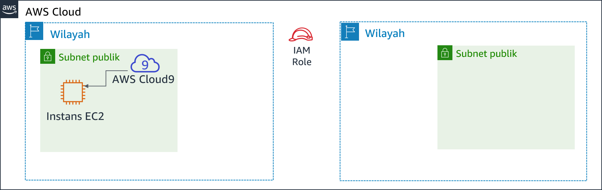

# Modul 4 - Lab Tantangan: Membuat Situs Web Dinamis untuk Kafe

<!--Note: the step-by-step solutions to the challenge sections of this lab can be found in the instructor guide (source document at https://awsu-coursebuild.s3-us-west-2.amazonaws.com/sourcefiles/CUR-TF-200-ACACAD-20-EN/IG/AcademyCloudArchitecting-IG-Module-04.docx)-->

## Skenario

Setelah kafe meluncurkan versi pertama dari situs web mereka, pelanggan memberi tahu staf kafe bahwa situs web terlihat sangat bagus. Namun, selain pujian, pelanggan sering bertanya apakah mereka bisa memesan daring.

Sofía, Nikhil, Frank, dan Martha membahas situasi tersebut. Mereka sepakat bahwa strategi dan keputusan bisnis mereka harus fokus pada kepuasan pelanggan dan memberikan pengalaman kafe terbaik kepada para pelanggan tersebut.


## Gambaran umum dan tujuan lab
Di lab ini, Anda akan men-deploy aplikasi pada instans Amazon Elastic Compute Cloud (Amazon EC2). Aplikasi ini memungkinkan kafe untuk menerima pesanan daring. Setelah menguji apakah aplikasi bekerja sebagaimana dimaksud dalam Wilayah AWS pertama (lingkungan *pengembangan*), Anda akan membuat Amazon Machine Image (AMI) dari instans EC2. Anda juga akan men-deploy instans kedua dari aplikasi yang sama seperti lingkungan *produksi* di Wilayah AWS lain.

Setelah menyelesaikan lab ini, Anda akan mampu:

- Terhubung ke AWS Cloud9 IDE pada instans EC2 yang ada

- Menganalisis lingkungan instans EC2 dan mengonfirmasi aksesibilitas server web

- Menginstal aplikasi web pada instans EC2 yang juga menggunakan AWS Systems Manager Parameter Store

- Uji aplikasi web

- Buat AMI

- Men-deploy salinan kedua dari aplikasi web ke Wilayah AWS lain


Ketika Anda *mulai* lab, beberapa sumber daya sudah dibuat untuk Anda di akun AWS:



Pada *akhir* lab ini, arsitektur Anda seharusnya terlihat seperti contoh berikut:


## Durasi
Diperlukan waktu sekitar **60 menit** untuk menyelesaikan lab ini.


## Pembatasan layanan AWS
Dalam lingkungan lab ini, akses ke layanan AWS dan tindakan layanan mungkin dibatasi untuk orang-orang yang diperlukan untuk menyelesaikan instruksi lab. Anda mungkin akan mengalami error jika mencoba mengakses layanan lain atau melakukan tindakan di luar yang dijelaskan di lab ini.


## Mengakses Konsol Manajemen AWS

1. Di bagian atas instruksi ini, pilih <span id="ssb_voc_grey">Start Lab</span> (Mulai Lab) untuk meluncurkan lab Anda.

   Panel **Start Lab** (Mulai Lab) terbuka dan menampilkan status lab.

   **Tip**: Jika Anda memerlukan lebih banyak waktu untuk menyelesaikan lab daripada yang ditampilkan pada pengatur waktu, pilih tombol <span id="ssb_voc_grey">Start Lab</span> (Mulai Lab) lagi untuk memulai ulang pengatur waktu untuk lingkungan. Melakukan hal tersebut tidak akan menghapus sumber daya yang telah Anda buat.


2. Tunggu hingga Anda melihat pesan *Lab status: ready* (Status lab: siap), lalu tutup panel **Start Lab** (Mulai Lab) dengan memilih **X**.


3. Di bagian atas instruksi ini, pilih <span id="ssb_voc_grey">AWS</span>.

   Tindakan ini akan membuka Konsol Manajemen AWS di tab browser baru. Anda akan login ke sistem secara otomatis.

   **Tip**: Jika tab browser baru tidak terbuka, banner atau ikon biasanya berada di bagian atas browser Anda dengan pesan bahwa browser Anda mencegah situs membuka jendela sembulan. Pilih banner atau ikon, lalu pilih **Allow pop-ups** (Izinkan sembulan).


4. Atur tab AWS Management Console (Konsol Manajemen AWS) agar ditampilkan bersama instruksi ini. Idealnya, Anda perlu membuka kedua tab browser secara bersamaan, sehingga Anda dapat mengikuti langkah-langkah lab dengan lebih mudah.


## Permintaan bisnis untuk kafe: Menyiapkan instans EC2 untuk meng-hosting situs web (Tantangan #1)

Kafe ini ingin memperkenalkan pemesanan daring untuk pelanggan, dan memungkinkan staf kafe untuk melihat pesanan yang dikirimkan. Arsitektur situs web mereka saat ini, yang di-hosting di Amazon S3, tidak mendukung kebutuhan bisnis baru tersebut.

Di bagian pertama lab ini, Anda akan mengambil peran Sofía. Anda akan mengonfigurasi instans Amazon EC2, sehingga siap untuk menjadi host situs web untuk kafe.


### Tugas 1: Menganalisis instans EC2 yang ada

Dalam tugas ini, Anda akan mencatat detail tentang instans EC2 yang ada yang dibuat untuk Anda di akun AWS.

5. Dari menu **Services** (Layanan), pilih **EC2**, lalu pilih **Running instances** (Instans berjalan).

   Perhatikan instans berjalan bernama *aws-cloud9-CafeWebServer-...*. Instans EC2 ini dibuat ketika Anda memulai lab.

   


#### Menjawab pertanyaan tentang instans

Jawaban akan dinilai saat Anda memilih tombol **Submit** (Kirim) biru di akhir lab.

6. Akses pertanyaan di lab ini.
   - Pilih menu **Details** (Detail), lalu pilih **Show** (Tampilkan).
   - Pilih tautan **Access the multiple choice questions** (Akses pertanyaan pilihan ganda) yang muncul di bagian bawah halaman.


7. Pada halaman yang Anda muat, jawab empat pertanyaan pertama:

   - **Pertanyaan 1**: Apakah instans berada di subnet publik?
   - **Pertanyaan 2**: Apakah instans EC2 memiliki alamat IP publik IPv4 yang ditetapkan untuknya?
   - **Pertanyaan 3**: Apa nomor port TCP masuk terbuka untuk instans ini?
   - **Pertanyaan 4**: Apakah instans EC2 memiliki peran AWS Identity and Access Management (IAM) yang terkait dengannya?

   **Catatan**: Biarkan halaman web pertanyaan terbuka di tab browser Anda. Anda akan kembali ke sana nanti di lab ini.


### Tugas 2: Menghubungkan ke IDE pada instans EC2

AWS Cloud9 adalah layanan yang dapat berjalan pada instans EC2. Layanan ini menyediakan lingkungan pengembangan terpadu (IDE) yang mencakup fitur-fitur seperti editor kode, debugger, dan terminal.

Dengan menggunakan lingkungan AWS Cloud9, Anda tidak perlu mengunduh pasangan kunci dan terhubung ke instans EC2 dengan menggunakan PuTTY atau perangkat lunak Secure Shell (SSH) serupa. Dengan menggunakan AWS Cloud9, Anda juga tidak perlu menggunakan baris perintah alat pengeditan teks (seperti vi atau nano) untuk mengedit file pada instans Linux.

8. Dari menu *Services* (Layanan), pilih **AWS Cloud9**, lalu pilih **Your environments** (Lingkungan Anda).

   Perhatikan lingkungan *CafeWebServer*. Ini menunjukkan bahwa *EC2* masuk ke sana.


9. Pilih **Open IDE** (Buka IDE).

   Anda sekarang terhubung ke IDE AWS Cloud9 yang berjalan pada instans EC2 yang Anda amati sebelumnya.

   IDE meliputi:

   - *Terminal bash* di panel kanan bawah.
   - *Browser file* di panel kiri yang menampilkan file dalam direktori `/home/ec2-user/environment` pada instans.
   - *Editor file* di panel kanan atas. Jika Anda mengklik dua kali file di browser file—seperti file README.md—file akan ditampilkan di editor.


### Tugas 3: Menganalisis lingkungan tumpukan LAMP dan mengonfirmasikan bahwa server web dapat diakses

Ingat bahwa tujuan dari lab tantangan ini adalah mengonfigurasi instans EC2 untuk meng-hosting situs web dinamis baru untuk kafe. Dalam tugas ini, Anda akan menganalisis apa yang telah diinstal.


10. Perhatikan versi OS.

    Di terminal bash AWS Cloud9, jalankan perintah ini:

    ```bash
    cat /proc/version
    ```

    Perhatikan bagaimana output menunjukkan ini adalah instans Amazon Linux, kira-kira analog dengan Red Hat 7.


11. Amati web server, basis data, serta detail PHP dan status server.

    Di terminal, jalankan perintah ini:

    ```bash
    sudo httpd -v
    service httpd status
    
    mysql --version
    service mysqld status
    
    php --version
    ```

    Output akan menampilkan versi server web dan basis data, dan juga menunjukkan bahwa mereka tidak sedang berjalan.


12. Mulai server web dan basis data, dan juga mengaturnya untuk memulai secara otomatis setelah instans EC2 dimulai ulang ke depannya.

    Di terminal, jalankan perintah ini:

    ```bash
    sudo chkconfig httpd on
    sudo service httpd start
    sudo service httpd status
    
    sudo chkconfig mysqld on
    sudo service mysqld start
    sudo service mysqld status
    ```


13. Konfigurasikan instans EC2, sehingga Anda dapat menggunakan editor AWS Cloud9 untuk mengedit file server web.

    Perhatikan bahwa browser file AWS Cloud9 saat ini tidak menampilkan direktori web default server web Apache.

    Di terminal, jalankan kedua perintah ini:

    ```bash
	ln -s /var/www/ /home/ec2-user/environment
	sudo chown ec2-user:ec2-user /var/www/html
    ```

    Perintah pertama yang Anda jalankan membuat symlink dari workspace editor AWS Cloud9 default ke direktori `/var/www` yang berisi file server web Anda.
    
    Perintah kedua mengubah kepemilikan subdirektori **html**, sehingga *ec2-user* (yang Anda gunakan untuk login) dapat mengedit dan membuat file baru di dalamnya.


14. Membuat halaman web uji sederhana.

    - Di *browser file*, perluas direktori **CafeWebServer > www**, dan sorot direktori **html**.

    - Pilih **File** > **New File** (File Baru).

    - Dalam tab editor teks, tempel baris berikut:

      ```html
      <html>Hello from the café web server!</html>
      ```

    - Pilih **File** > **Save** (Simpan), dan simpan file di direktori **html** sebagai *index.html*.


15. Buat situs web dapat diakses dari internet.

   Pada langkah ini, Anda akan perlu memverifikasi dan memperbarui konfigurasi yang membuat halaman web (yang di-hosting di web server) dapat diakses dari internet.

   Berikut adalah beberapa tip untuk membantu Anda memulai:

<details>
<summary>
<b>Tip #1</b> (klik untuk memperluas)
</summary>
Temukan alamat IP publik IPv4 dari instans EC2, dan coba untuk memuat `http://&lt;public-ip> `di tab browser baru. Apakah pesan yang Anda masukkan ke dalam index.html dimuat di browser?
</details>


<details>
<summary>
<b>Tip #2</b> (klik untuk memperluas)
</summary>Untuk mengizinkan lalu lintas HTTP masuk pada TCP port 80 dari mana saja, perbarui grup keamanan instans EC2, yang diperlukan.
</details>


## Kebutuhan bisnis baru: Menginstal aplikasi situs web dinamis pada instans EC2 (Tantangan #2)

Dalam tantangan sebelumnya, Anda mengonfigurasi instans EC2. Anda sekarang tahu bahwa PHP diinstal, dan bahwa lingkungan aplikasi memiliki basis data relasional berjalan. Selain itu, lingkungan memiliki server web berjalan yang dapat diakses dari internet. Anda sekarang memiliki pengaturan dasar untuk meng-hosting situs web dinamis untuk kafe.

Di bagian kedua lab ini, Anda akan mengambil peran Sofía, dan menginstal aplikasi kafe pada instans EC2.


### Tugas 4: Menginstal aplikasi kafe

16. Unduh dan ekstrak file aplikasi server web.

    Di terminal Bash, jalankan perintah ini:

    ```bash
    cd ~/environment
    wget https://aws-tc-largeobjects.s3-us-west-2.amazonaws.com/ILT-TF-200-ACACAD-20-EN/mod4-challenge/setup.tar.gz
    tar -zxvf setup.tar.gz
    wget https://aws-tc-largeobjects.s3-us-west-2.amazonaws.com/ILT-TF-200-ACACAD-20-EN/mod4-challenge/db.tar.gz
    tar -zxvf db.tar.gz
    wget https://aws-tc-largeobjects.s3-us-west-2.amazonaws.com/ILT-TF-200-ACACAD-20-EN/mod4-challenge/cafe.tar.gz
    tar -zxvf cafe.tar.gz
    ```

    Perhatikan bagaimana browser file sekarang menampilkan tiga file.tar.gz yang Anda unduh.
    
    Anda juga mengekstrak file arsip ini, yang membuat direktori `cafe`, `db`, dan `setup` di lingkungan kerja Anda.


17. Salin file kafe ke root dokumen server web.

    Di terminal Bash, jalankan perintah ini:

    ```bash
    mv cafe /var/www/html/
    ```


18. Amati bagaimana aplikasi dirancang untuk bekerja.

   - Buka kode sumber `html/cafe/index.php` di editor AWS Cloud9 dengan mengkliknya dua kali.
   - Perhatikan bahwa file ini memiliki kode HTML di dalamnya, tetapi juga berisi bagian yang tertutup dalam *<?php ... ?>* elemen. Unsur-unsur ini membuat panggilan ke sistem dan sumber daya lain.
   - Misalnya, pada **baris 18**, Anda melihat bahwa kode PHP merujuk file bernama *getAppParameters.php*.
   - Buka file **getAppParameters.php** di editor kode.
   - Perhatikan pada **baris 3** file yang dipanggil *AWSSDK*.
   - Selain itu, pada **baris 10-33**, aplikasi web membuat klien yang terhubung ke layanan *ssm*, yaitu AWS Systems Manager. Aplikasi kemudian mengambil tujuh parameter dari Systems Manager. Parameter tersebut belum dibuat di AWS Systems Manager belum, tetapi Anda akan melakukan itu nanti.


19. Di AWS Systems Manager Parameter Store, konfigurasikan parameter aplikasi.

    Di terminal Bash, jalankan perintah ini:

    ```bash
    cd setup
    ./set-app-parameters.sh
    ```

    Skrip shell yang baru saja Anda jalankan mengeluarkan perintah AWS Command Line Interface (AWS CLI). Perintah ini menambahkan parameter yang akan digunakan aplikasi ke Parameter Store.


20. Di Konsol Manajemen AWS, dari menu **Services** (Layanan), pilih **Systems Manager** (Manajer Sistem).


21. Dari panel di sebelah kiri, pilih **Parameter Store** (Penyimpanan Parameter).

   Perhatikan bagaimana sekarang ada tujuh parameter yang disimpan di sini.

   Kode PHP aplikasi kafe merujuk nilai-nilai ini (sehingga, misalnya, dapat mengambil informasi koneksi untuk basis data MySQL).

   Pilih parameter `/cafe/dbPassword`, dan salin *Value* (Nilai) ke clipboard Anda. Anda akan menggunakan nilai ini sebentar lagi.


22. Mengonfigurasi basis data MySQL untuk mendukung aplikasi kafe.

    Di terminal bash AWS Cloud9, jalankan perintah berikut.

    ```bash
    cd ../db/
    ./set-root-password.sh
    ./create-db.sh
    ```


23. Amati tabel basis data yang dibuat.

    Di terminal Bash, jalankan perintah ini untuk menghubungkan klien MySQL berbasis terminal ke basis data:

    ```bash
    mysql -u root -p
    ```
    Saat Anda diminta sandi basis data, tempelkan nilai parameter *dbPassword* yang Anda disalin.
    
    Anda sekarang akan melihat prompt `mysql>`, yang menunjukkan bahwa Anda telah terhubung ke basis data MySQL yang berjalan pada instans EC2 ini.


Untuk mengamati isi basis data (khususnya, tabel yang mendukung aplikasi web kafe), masukkan perintah berikut:

  ```sql
show databases;
use cafe_db;
show tables;
select * from product;
exit;
  ```


24. Perbarui konfigurasi *timezone* (zona waktu) di PHP.

    Di terminal Bash, jalankan perintah berikut:

    ```bash
    sudo sed -i "2i date.timezone = \"America/New_York\" " /etc/php.ini
    sudo service httpd restart
    ```

    Perintah pertama yang Anda jalankan mengonfigurasi zona waktu dalam perangkat lunak PHP.
    
    Perintah kedua yang Anda jalankan memulai ulang web server, sehingga web server memberitahukan pembaruan konfigurasi.


25. Uji apakah situs web kafe berfungsi dan dapat diakses dari internet.

   Di tab browser baru, coba muat aplikasi di `http://<public-ip>/cafe` di mana <*public-ip*> adalah alamat IP publik IPv4 dari instans EC2.

   Anda akan melihat *judul banner* saja** pada situs web yang dimuat. Sisa halaman web tidak dimuat dengan benar.


26. Selesaikan masalah dengan situs web.

   Pada langkah ini, Anda harus mencari tahu bagaimana membuat situs web kafe berfungsi dengan benar.

   Berikut adalah daftar apa yang *berhasil*:

   - Halaman pengujian di *http://&lt;public-ip>/* dimuat, sehingga Anda tahu bahwa web server berfungsi, dan dapat diakses dari internet
   - Anda juga tahu bahwa basis data MySQL sedang berjalan, dan berisi tabel serta data untuk mendukung aplikasi

Apa yang bisa menjadi masalah?

<details>
<summary>
<b>Tip #1</b> (klik untuk memperluas)
</summary>
Tidak ada yang salah dengan kode PHP seperti yang tertulis. Masalah ini terkait dengan izin.
</details>

<details>
<summary>
<b>Tip #2</b> (klik untuk memperluas)
</summary>
Apakah aplikasi web bergantung pada layanan atau sumber daya lain selain server web dan basis data? Misalnya, apakah aplikasi itu memerlukan akses ke Layanan AWS lain?
</details>

<details>
<summary>
<b>Tip #3</b> (klik untuk memperluas)
</summary>
Buka layanan IAM dan cari IAM role yang bernama <B>CafeRole</B>. Amati izin bahwa diberikan peran ini. Apakah akan membantu jika memiliki hak-hak ini diberikan kepada instans EC2? Bagaimana Anda bisa memberikan izin ini ke aplikasi web kafe?
</details>

<details>
<summary>
<b>Tip #4</b> (klik untuk memperluas)
</summary>
 Pilih instans EC2 di konsol Amazon EC2, dan tinjau opsi pada menu <B>Actions</B> (Tindakan). Apakah ada tindakan yang membantu memecahkan masalah ini?
</details>


Ketika Anda merasa bahwa masalah telah diperbaiki, muat kembali halaman `http://<public-ip>/cafe`. Apakah halaman dimuat sepenuhnya, sehingga Anda dapat melihat item menu kafe? Jika iya, selamat!

**Catatan**: Jika Anda masih tidak dapat menyelesaikan masalah, Anda mungkin merasa berguna untuk menjalankan skrip penilaian seperti yang didokumentasikan di bagian **Mengirimkan pekerjaan Anda** di akhir instruksi lab ini. Laporan Pengiriman yang dihasilkan dapat menjadi tip tambahan untuk bagian lab yang tidak berhasil Anda selesaikan. Anda dapat mengirimkan pekerjaan Anda sebanyak yang Anda suka—hanya skor yang Anda capai pada pengiriman terakhir yang akan disimpan.


### Tugas 5: Menguji aplikasi web

27. Uji dengan membuat pesanan.

   - Pada tab browser tempat Anda membuka halaman `http://<public-ip>/cafe` terbuka, pilih **Menu**.

   - Kirim pesanan untuk setidaknya satu item menu yang ditampilkan.

      - Catatan: Anda mungkin perlu menggulir ke bawah untuk menemukan tombol **Submit Order** (Kirim Pesanan).

   - Kembali ke halaman menu dan buat pesanan lain, kemudian buka halaman **Order History** (Riwayat Pesanan) untuk melihat detail pesanan untuk semua pesanan yang Anda buat.


## Kebutuhan bisnis baru: Membuat situs web pengembangan dan produksi di berbagai Wilayah AWS (Tantangan #3)


Semua orang di kafe terkesan dengan situs web dinamis baru yang dibuat oleh Sofía! Pelanggan senang karena mereka sekarang dapat membuat pesanan daring dan menjadwalkan pengambilan item makanan penutup. Kepuasan pelanggan telah meningkat karena berkurangnya waktu tunggu pelanggan.

Namun, kebutuhan bisnis lain muncul, bersama dengan pujian. Martha dan Frank ingin memiliki *dua* situs web kafe:
- Salah satu situs web yang dapat digunakan sebagai *lingkungan pengembangan* untuk mencoba fitur dan desain web baru sebelum dirilis kepada pelanggan

- Situs web terpisah yang akan meng-hosting *lingkungan produksi* yang digunakan pelanggan

Sofía membahas kebutuhan baru dengan Mateo ketika ia datang ke kafe di suatu pagi untuk minum kopi. Mateo menyarankan bahwa, idealnya, dua lingkungan akan ada di *Wilayah AWS yang berbeda*. Desain seperti itu akan memiliki manfaat tambahan yaitu menyediakan pemulihan bencana (DR) yang lebih kuat dalam skenario yang tidak mungkin terjadi jika Wilayah AWS sementara tidak tersedia.

Sofía sekarang sangat sibuk! Keberhasilannya menyelesaikan pekerjaan yang lebih mengesankan membuat kemampuannya menjadi lebih diminati.


### Tugas 6: Membuat AMI dan meluncurkan instans EC2 lain

Karena situs web kafe sudah berjalan dengan baik pada instans EC2 yang ada, Sofía memutuskan untuk menduplikasinya dengan membuat AMI darinya. Sofia kemudian akan meluncurkan instans baru dari AMI baru.

Anda akan terus mengambil peran Sofía untuk tugas ini. Sebelum Anda membuat AMI dari instans ini, Anda harus membuat pasangan kunci baru, yang mungkin penting untuk dimiliki nanti di lab ini.


28. Atur hostname internal statis dan membuat pasangan kunci baru pada instans EC2.

    Di terminal bash, jalankan perintah berikut:

    ```bash
    sudo hostname cafeserver
    ssh-keygen -t rsa -f ~/.ssh/id_rsa
    ```

    Untuk kedua kalinya Anda diminta frasa sandi, tekan tombol ENTER.

    To make the new key available to the SSH utilities, in the Bash terminal, run the following command:

    ```bash
    cat ~/.ssh/id_rsa.pub >> ~/.ssh/authorized_keys
    ```


29. Dalam Konsol Manajemen AWS, jelajahi ke area layanan **EC2** dan pilih instans.


30. Pilih **Actions > Image and template > Create Image** (Tindakan > Gambar dan templat > Buat Gambar).

   **Tip**: Biarkan dialog **Create Image** (Buat Gambar) terbuka di tab browser saat Anda menjawab beberapa pertanyaan tentang AMI.


#### Menjawab pertanyaan tentang AMI

Jawaban akan direkam saat Anda memilih tombol **Submit** (Kirim) biru di bagian akhir lab.


31. Kembali ke tab browser yang memiliki pertanyaan untuk lab ini. Anda mengakses tab ini sebelumnya.

   Jika Anda perlu menemukan halaman lagi:

   - Pilih menu **Details** (Detail), lalu pilih **Show** (Tampilkan).

   - Pilih tautan **Access the multiple choice questions** (Akses pertanyaan pilihan ganda) yang muncul di bagian bawah halaman.


32. Di halaman tersebut, kirimkan jawaban atas pertanyaan-pertanyaan berikut:

   - **Pertanyaan 5**: Ketika Anda membuat AMI dari sebuah instans, apakah instans akan di-boot ulang?

   - **Pertanyaan 6**: Dengan cara apa Anda dapat memodifikasi properti volume root ketika Anda membuat AMI dari sebuah instans?

   - **Pertanyaan 7**: Dapatkah Anda menambahkan lebih banyak volume ke AMI yang Anda buat dari sebuah instans yang hanya memiliki satu volume?


33. Kembali ke Konsol Manajemen AWS, di layar **Create Image** (Buat Gambar), buat AMI baru:

   - **Image name** (Nama gambar): `CafeServer`

   - Pilih **Create Image** (Buat Gambar)


34. Dari menu navigasi, pilih **AMI** dan tunggu hingga status gambar *Available* (Tersedia). Proses ini biasanya memerlukan waktu sekitar 2 menit. Anda mungkin perlu memperluas **Image** (Gambar) untuk menemukan **AMI**.


35. Buat AMI di Wilayah AWS lain

   Pada langkah ini, tujuan Anda adalah menciptakan instans EC2 baru dari AMI yang baru saja Anda tangkap. Namun, Anda harus membuat instans baru di Oregon (us-west-2) Wilayah AWS.

<details>
<summary>
<b>Tip #1</b> (klik untuk memperluas)
</summary>
Salin ID AMI dari gambar yang baru saja Anda buat. Kemudian, cobalah untuk menemukannya di Wilayah us-west-2.
</details>

<details>
<summary>
<b>Tip #2</b> (klik untuk memperluas)
</summary>
Apakah AMI ada di tingkat akun?
</details>

<details>
<summary>
<b>Tip #3</b> (klik untuk memperluas)
</summary>
Pilih AMI yang telah Anda buat di Wilayah AWS tempat Anda membuatnya. Selanjutnya, pilih menu <b>Actions</b> (Tindakan). Apakah ada tindakan yang sepertinya dapat membantu untuk menyediakan AMI tersedia di Wilayah AS Barat (Oregon)? Lanjutkan dan pilih tindakan yang tepat. Setelah Anda memulainya, tindakan ini mungkin memerlukan waktu hingga 5 menit untuk diselesaikan. Pilih ikon segarkan sesekali untuk mengetahui lebih cepat jika telah selesai.
</details>


36. Buat instans kafe baru dari AMI Anda. Instans baru yang Anda buat harus sesuai dengan kriteria berikut.

   - **Region** (Wilayah): `Oregon`

   - **Instance Size** (Ukuran Instans): `t2.small`

   - **Network** (Jaringan): `Lab VPC Region 2` (Lab VPC Wilayah 2), `Public Subnet` (Subnet Publik)

   - **IAM Role**: `CafeRole`

   - Tag:
      - **Key** (Kunci): `Name` (Nama)
      - **Value** (Nilai): `ProdCafeServer`

   - Grup Keamanan:
      - Buat grup keamanan baru bernama **cafeSG**, dengan port TCP **22** terbuka ke mana saja
      - Atur port TCP **80**, sehingga terbuka ke mana saja juga

   - **Lanjutkan tanpa pasangan kunci** (pasangan kunci yang Anda buat sebelumnya di lab ini seharusnya bisa terhubung dengannya, jika perlu)


37. Tunggu instans baru untuk menetapkan nilai *Public DNS* (DNS Publik), bahkan jika status instans masih belum *Available* (Tersedia).


38. Salin nilai **Public DNS** (DNS Publik). Anda akan segera menggunakannya.


39. Untuk membuat *parameter AWS Systems Manager* yang diperlukan di Wilayah AWS baru, selesaikan langkah-langkah ini.

    - Kembali ke IDE AWS Cloud9 di Wilayah **N. Virginia (us-east-1)**.

    - Buka file CafeWebServer/setup/**set-app-parameters.sh** di editor teks.

    - Edit **baris 12** file untuk mencocokkan pengaturan ini:

    ```bash
    region="us-west-2"
    ```

    - Edit **baris 18** untuk mencocokkan pengaturan ini (di mana <*public-dns-of-ProdCafeServer-instance*> adalah DNS sebenarnya dari instans ProdCafeServer):

    ```bash
    publicDNS="<public-dns-of-ProdCafeServer-instance>"
    ```

    **Catatan**: Baris harus tetap berisi tanda kutip, tetapi *tidak* boleh berisi tanda kurung sudut (< >).
    
    
    Contoh ini menunjukkan bagaimana seharusnya tampilan baris 12 dan format baris 18. Namun, nilai DNS publik Anda akan berbeda.


- **File > Save** (File > Simpan) perubahan.

- Untuk menjalankan skrip ini, arahkan ke bagian atas IDE dan pilih tombol **Run** (Jalankan).

Di terminal Bash di bawah editor teks, Anda akan melihat output yang diformat dalam JavaScript Object Notation (JSON). Output ini menunjukkan bahwa skrip parameter berhasil berjalan.

<details>
<summary>Jika skrip mengalami masalah, klik di sini untuk melihat tip pemecahan masalah.</summary>
Jika output dari perintah menunjukkan bahwa kredensialnya kedaluarsa, coba jalankan perintah ini di terminal Bash (kemudian jalankan set-app-parameters.sh lagi):
<br><code>wget https://aws-tc-largeobjects.s3-us-west-2.amazonaws.com/ILT-TF-200-ACACAD-20-EN/mod4-challenge/cred-update.sh</code><br>
<code>chmod +x cred-update.sh</code><br>
<code>./cred-update.sh</code>
</details>

**Catatan**: Dengan mengubah detail Wilayah AWS dan menjalankan skrip ini lagi, Anda membuat parameter yang sama dengan yang Anda buat sebelumnya di Wilayah us-east-1 dari AWS Systems Manager Parameter Store. Namun, kali ini, Anda membuat parameter ini di Wilayah Oregon.


### Tugas 7: Memverifikasi instans kafe baru


40. Kembali ke Konsol EC2 di Wilayah **Oregon**, dan pastikan bahwa instans **ProdCafeServer** yang baru berjalan.


41. Salin alamat IP publik IPv4, dan muat di browser web.

   Pesan *Hello from the cafe web server!* (Halo dari server web kafe!) harus ditampilkan.


42. Muat `http://<public-ip>/cafe/` URL di tab browser.

   Seluruh situs web kafe harus ditampilkan.


43. Muat halaman **Menu**.

   Halaman *Menu* harus dimuat sepenuhnya, dan pembuatan pesanan harus berfungsi.


44. Buat pesanan untuk memastikan bahwa situs web berfungsi sebagaimana dimaksud.


45. Tip pemecahan masalah (lewati langkah ini jika Anda tidak mengalami masalah saat memuat halaman *Menu*).

    Skrip penilaian dapat menjadi tip tambahan untuk bagian lab yang tidak berhasil Anda selesaikan. Anda dapat mengirimkan pekerjaan Anda sebanyak yang Anda suka—hanya skor yang Anda capai pada pengiriman terakhir yang akan disimpan.

    Selain itu, jika Anda ingin terhubung ke instans EC2 baru di Oregon (us-west-2) untuk melakukan beberapa pemecahan masalah, jalankan perintah ini dari IDE AWS Cloud9 di us-east-1:

    ```bash
    ssh -i ~/.ssh/id_rsa ec2-user@<public-ip-of-ProdCafeServer>
    ```
    Ingat bahwa <*public-ip-of-ProdCafeServer*> adalah alamat IP publik yang sebenarnya dari instans ProdCafeServer.


## Kabar terbaru dari kafe


Sofía sekarang menjadi pahlawan di kafe! Dia membuat situs web yang dinamis, *dan* dia juga membuat versi duplikat dari situs web yang sama yang berjalan di Wilayah AWS kedua.

Sofía memutuskan untuk menunjuk instans EC2 pertama yang ia buat—instans di Wilayah us-east-1—sebagai instans *pengembangan*. Instans kedua yang dia buat—instans di Oregon (wilayah us-west-2)—akan menjadi instans *produksi*.

Dengan cara ini, Sofía dan developer aplikasi lainnya dapat menguji peningkatan aplikasi di situs *pengembangan* tanpa memengaruhi lokasi *produksi*. Kemudian, ketika developer memutuskan bahwa peningkatan terlihat bagus dan mereka telah sepenuhnya mengujinya, mereka dapat memigrasikan kode ke lokasi produksi.

Sofía menjelaskan kepada orang tuanya, Frank dan Martha, apa yang telah dia lakukan. Meskipun mereka tidak sepenuhnya memahami semua istilah teknis yang digunakan Sofia, mereka senang karena situs web sekarang dapat menerima pesanan daring. Mereka juga senang karena mereka sekarang dapat menguji peningkatan baru ke situs web tanpa langsung mengekspos perubahan tersebut kepada pelanggan.


## Mengirimkan pekerjaan Anda

46. Di bagian atas instruksi ini, <span id="ssb_blue">Submit</span> (Kirim) untuk merekam kemajuan Anda dan saat diminta, pilih **Yes** (Ya).


47. Jika hasilnya tidak muncul setelah beberapa menit, kembali ke bagian atas instruksi ini dan pilih <span id="ssb_voc_grey">Grades</span> (Nilai)

   **Tip**: Anda dapat mengirimkan pekerjaan Anda beberapa kali. Setelah Anda mengubah pekerjaan, pilih **Submit** (Kirim) lagi. Apa yang akan direkam untuk lab ini adalah pengiriman terakhir Anda.


48. Untuk menemukan detail umpan balik tentang pekerjaan Anda, pilih <span id="ssb_voc_grey">Details</span> (Detail) diikuti oleh <i class="fas fa-caret-right"></i> **View Submission Report** (Lihat Laporan Pengiriman).


## Lab selesai

<i class="icon-flag-checkered"></i> Selamat! Anda telah menyelesaikan lab.


49. Untuk mengonfirmasi bahwa Anda ingin mengakhiri lab, di bagian atas halaman ini, pilih **<span id="ssb_voc_grey">End Lab</span>** (Akhiri Lab), lalu pilih **<span id="ssb_blue">Yes</span>** (Ya).

   Sebuah panel dengan pesan ini akan muncul: *DELETE has been initiated*...** (PENGHAPUSAN telah dimulai)... *You may close this message box now.* (Anda dapat menutup kotak pesan ini sekarang.)


50. Untuk menutup panel, pilih **X** di sudut kanan atas.


*©2020 Amazon Web Services, Inc. dan afiliasinya. Hak cipta dilindungi undang-undang. Karya ini tidak boleh direproduksi atau didistribusikan ulang, seluruhnya atau sebagian, tanpa izin tertulis sebelumnya dari Amazon Web Services, Inc. Dilarang menyalin, meminjamkan, atau menjual secara komersial.*