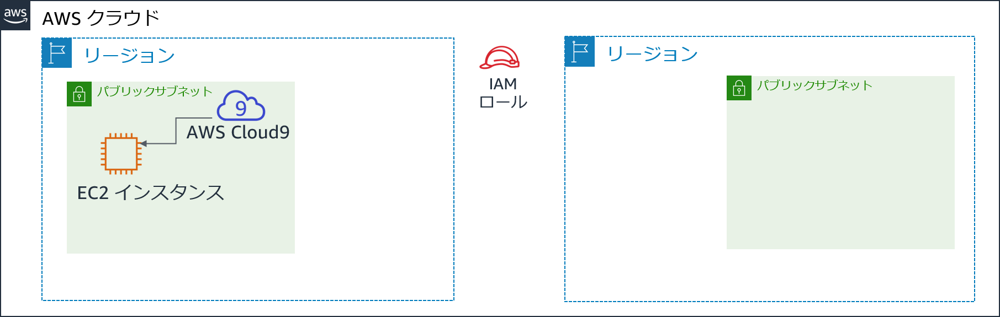
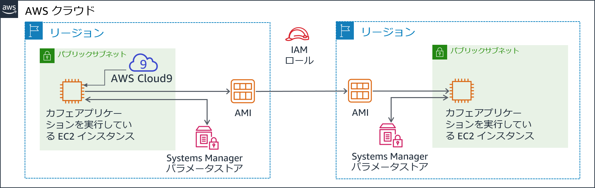
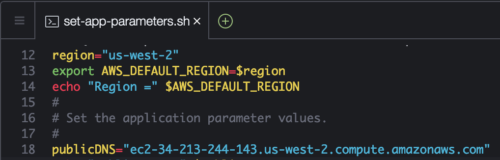

# モジュール 4 - 課題ラボ: カフェの動的ウェブサイトを作成する

## シナリオ

カフェが最初のバージョンのウェブサイトをリリースした後、顧客はカフェのスタッフに対してすばらしいウェブサイトだと言ってくれました。しかし、称賛に加えて、顧客からは度々オンラインでの注文はできないのかとたずねられました。

Sofía、Nikhil、Frank、Martha はそれについて話し合いを行い、ビジネス戦略とその判断において、顧客を満足させること、最高のカフェサービスを提供することを重視すべきだという意見で一致しました。


## ラボの概要と目標
このラボでは、Amazon Elastic Compute Cloud (Amazon EC2) インスタンスにアプリケーションをデプロイします。アプリケーションによって、カフェはオンラインで注文が受けられるようになります。アプリケーションが最初の AWS リージョン（**開発**環境）で想定通りに機能することをテストした後、EC2 インスタンスから Amazon マシンイメージ（AMI）を作成します。また、同じアプリケーションの 2 番目のインスタンスを**本番**環境として別の AWS リージョンにデプロイします。

このラボを完了すると、次のことができるようになります。

- 既存の EC2 インスタンスで AWS Cloud9 IDE に接続できる

- EC2 インスタンス環境を分析し、ウェブサーバーのアクセシビリティを確認できる

- AWS Systems Manager Parameter Store も使用する EC2 インスタンスに、ウェブアプリケーションをインストールできる

- ウェブアプリケーションをテストできる

- AMI を作成できる

- ウェブアプリケーションの 2 つ目のコピーを別の AWS リージョンにデプロイできる


ラボを**開始**すると、AWS のアカウントに一部のリソースが既に作成されています。



ラボの**終了**時のアーキテクチャは次の例のようになります。




## 所要時間
このラボは、修了までに約 **60 分**かかります。


## AWS サービスの制限事項
このラボ環境では、AWS のサービスとサービスアクションへのアクセスが、ラボの手順を完了するために必要なものに制限される場合があります。他のサービスへのアクセスや、このラボで説明されているサービス以外のアクションを実行しようとすると、エラーが発生することがあります。


## AWS マネジメントコンソールにアクセスする

1. この手順の上部にある <span id="ssb_voc_grey">Start Lab</span> をクリックし、ラボを起動します。

   [**Start Lab**] パネルが開き、ラボのステータスが表示されます。

   <i class="fas fa-info-circle"></i> **ヒント**: ラボの完了までにさらに時間が必要な場合は、<span id="ssb_voc_grey">Start Lab</span> ボタンをもう一度選択して、この環境のタイマーを再開します。

2. \[**Start Lab**] パネルに **Lab status: ready** というメッセージが表示されたら [**X**] をクリックしてパネルを閉じます。

3. この手順の上部にある <span id="ssb_voc_grey">AWS</span> をクリックします。

   このアクションにより、新しいブラウザタブで AWS マネジメントコンソールが開き、ユーザーは自動的にログインします。

   <i class="fas fa-exclamation-triangle"></i> **ヒント**: 新しいブラウザタブが開かない場合、通常、ブラウザによってサイトのポップアップウィンドウの表示がブロックされたというメッセージが表示されたバナーまたはアイコンがブラウザの上部に表示されます。バナーまたはアイコンを選択して [**ポップアップを許可**] を選択してください。

4. **AWS マネジメントコンソール**タブがこの手順と並べて表示されるようにします。両方のブラウザタブを同時に開いておくと、ラボのステップを実行しやすくなります。

   <i class="fas fa-exclamation-triangle"></i> **特に指示がない限り、リージョンを変更しないでください**。


## カフェのビジネスニーズ: ウェブサイトをホストするための EC2 インスタンスを準備する (チャレンジ #1)

カフェでは、顧客からのオンライン注文システムを導入し、カフェスタッフが送信された注文を確認できるようにしたいと考えています。ウェブサイトが Amazon S3 でホストされている現在のウェブサイトアーキテクチャでは、新たなビジネス要件に対応できません。

このラボの最初の部分では Sofía の役になり、Amazon EC2 インスタンスを設定して、カフェのウェブサイトをホストできるようにします。


### タスク 1: 既存の EC2 インスタンスを分析する

このタスクでは、AWS アカウントで自分用に作成された既存の EC2 インスタンスの詳細を書き留めます。

5. \[**サービス**] で [**EC2**] をクリックし [**実行中のインスタンス**] をクリックします。

   **aws-cloud9-CafeWebServer-...**という名前の実行中のインスタンスに注目してください。この EC2 インスタンスは、ラボを開始したときに作成されたものです。

   


#### インスタンスに関する質問に答える

ラボの最後にブルーの [**Submit**] ボタンをクリックすると、解答が採点されます。

6. このラボの問題にアクセスします。
   - [**Details**] ドロップダウンメニューから [**Show**] を選択します。
   - ページ下部に表示される、[**Access the multiple choice questions**] をクリックします。


7. 読み込んだページで、最初の 4 つの問題に解答します。

   - **質問 1**: インスタンスはパブリックサブネットにありますか?（Question 1: Is the instance in a public subnet?）
   - **質問 2**: EC2 インスタンスには IPv4 パブリック IP アドレスが割り当てられていますか?（Question 2: Does the EC2 instance have an IPv4 Public IP address assigned to it?）
   - **質問 3**: このインスタンス用に解放されているインバウンド TCP ポート番号は何ですか?（Question 3: What inbound TCP port numbers are open for this instance?）
   - **質問 4**: EC2 インスタンスには、AWS Identity and Access Management (IAM) ロールが関連付けられていますか?（Question 4: Does the EC2 instance have an AWS Identity and Access Management (IAM) role associated with it?）

   **注意**: 質問のウェブページはブラウザタブで開いたままにしておいてください。このラボの後半で再度このウェブページに戻ります。


### タスク 2: EC2 インスタンスで IDE に接続する

AWS Cloud9 は EC2 インスタンスで実行できるサービスです。コードエディタ、デバッガー、ターミナルなどの機能など統合開発環境 (IDE) を提供します。

AWS Cloud9 環境を使用すると、キーペアをダウンロードし、PuTTY または同様のSecure Shell (SSH) ソフトウェアを使用して EC2 インスタンスに接続する必要がなくなります。また、AWS Cloud9 を使用することによって、コマンドラインテキスト編集ツール (vi や nano など) を使用して Linux インスタンス上のファイルを編集する必要もなくなります。

8. \[**サービス**] で [**AWS Cloud9**] をクリックし [**Your environments**] をクリックします。

   **CafeWebServer** 環境に注目してください。これで **EC2** に入ることを示しています。


9. \[**Open IDE**] をクリックします。

   これで先ほど見た EC2 インスタンスで実行されている AWS Cloud9 IDE に接続されました。

   IDE には次のものが含まれます。

   - 右下のパネルにある **Bash ターミナル**
   - インスタンスの `/home/ec2-user/environment` ディレクトリにあるファイルを表示する、左側のパネルにある**ファイルブラウザ**
   - 右上のパネルにある**ファイルエディタ**。ファイルブラウザのファイル（README.md ファイルなど）をダブルクリックすると、エディタに表示されます。


### タスク 3: LAMP スタック環境を分析し、ウェブサーバーがアクセス可能であることを確認する

この課題ラボの目的は、カフェの新しい動的ウェブサイトをホストする EC2 インスタンスの設定であることを思い出してください。このタスクでは、既にインストールされているものを分析します。


10. OS バージョンを確認します。

    AWS Cloud9 bash ターミナルで、以下のコマンドを実行します。

    ```bash
    cat /proc/version
    ```

    出力が Red Hat 7 とほぼ同じ Amazon Linux インスタンスであることを示していることに注目してください。


11. ウェブサーバー、データベース、PHP の詳細、サーバーの状態を確認します。

    ターミナルで、次のコマンドを実行します。

    ```bash
    sudo httpd -v
    service httpd status

    mysql --version
    service mysqld status

    php --version
    ```

   出力には、ウェブサーバーとデータベースのバージョンが表示され、現在実行されていないことも示されます。


12. ウェブサーバーとデータベースを起動し、今後 EC2 インスタンスを再起動した場合に自動的に起動するよう設定します。

    ターミナルで、次のコマンドを実行します。

    ```bash
    sudo chkconfig httpd on
    sudo service httpd start
    sudo service httpd status

    sudo chkconfig mysqld on
    sudo service mysqld start
    sudo service mysqld status
    ```


13. AWS Cloud9 エディタを使用して、ウェブサーバーファイルが編集できるよう、EC2 インスタンスを設定します。

    AWS Cloud9 ファイルブラウザには、現在 Apache ウェブサーバーのデフォルトのウェブディレクトリが表示されていないことを覚えておきます。

    ターミナルで、次の 2 つのコマンドを実行します。

    ```bash
    ln -s /var/www/ /home/ec2-user/environment
    sudo chown ec2-user:ec2-user /var/www/html
    ```

    最初に実行したコマンドは、デフォルトの AWS Cloud9 エディタワークスペースから、ウェブサーバーファイルを含む `/var/www` ディレクトリへのシンボリックリンクを作成しました。

    2 番目のコマンドは、**html** サブディレクトリの所有者を変更して、現在ログインしている **ec2-user** がその中の新しいファイルの編集と作成ができるようにします。


14. 簡単なテストウェブページを作成します。

    - **ファイルブラウザ**で、**CafeWebServer > www** ディレクトリを展開し、**html** ディレクトリをハイライト表示します。

    - [**File**] > [**New File**] の順に選択します。

    - テキストエディタタブで、次の行を貼り付けます。

    ```html
    <html>Hello from the café web server!</html>
    ```

    - [**File**] > [**Save As**] の順に選択し、ファイルを **html** ディレクトリに **index.html** という名前で保存します。


15. ウェブサイトをインターネットからアクセスできるようにします。

   このステップでは、ウェブサーバー上でホストされているウェブページを、インターネットからアクセスできるようにする設定を確認し、更新する必要があります。

   このステップに取り組むうえで役に立つヒントをいくつかご紹介します。

<details>
<summary><b>ヒント #1</b>（クリックすると展開します）</summary>
EC2 インスタンスの IPv4 パブリック IP アドレスを探し、新しいブラウザタブに "http://&lt;public-ip>" をロードしてみます。index.html に入力したメッセージはブラウザで読み込まれますか?
</details>

<details>
<summary><b>ヒント #2</b>（クリックすると展開します）</summary>
任意の場所からの TCP ポート 80 のインバウンド HTTP トラフィックを許可するには、必要に応じて EC2 インスタンスのセキュリティグループを更新します。
</details>


## 新しいビジネス要件: EC2 インスタンスに動的なウェブサイトアプリケーションをインストールする（チャレンジ #2）

先ほどのチャレンジでは、EC2 インスタンスを設定しました。PHP がインストールされ、アプリケーション環境でリレーショナルデータベースが実行されています。また、環境にはインターネットからアクセスできる実行中のウェブサーバーがあります。これで、カフェの動的ウェブサイトをホストするための基本的な設定が完了しました。

このラボの次のパートでは Sofía の役になり、EC2 インスタンスにカフェアプリケーションをインストールします。


### タスク 4: カフェアプリケーションをインストールする

16. ウェブサーバーアプリケーションファイルをダウンロードして抽出します。

   Bash ターミナルで、次のコマンドを実行します。

   ```bash
       cd ~/environment
       wget https://aws-tc-largeobjects.s3-us-west-2.amazonaws.com/ILT-TF-200-ACACAD-20-EN/mod4-challenge/setup.tar.gz
       tar -zxvf setup.tar.gz
       wget https://aws-tc-largeobjects.s3-us-west-2.amazonaws.com/ILT-TF-200-ACACAD-20-EN/mod4-challenge/db.tar.gz
       tar -zxvf db.tar.gz
       wget https://aws-tc-largeobjects.s3-us-west-2.amazonaws.com/ILT-TF-200-ACACAD-20-EN/mod4-challenge/cafe.tar.gz
       tar -zxvf cafe.tar.gz
       ```

   ダウンロードした 3 つの .tar.gz ファイルがファイルブラウザに表示されていることに注目してください。

   また、これらのアーカイブファイルを抽出して、作業環境に `cafe`、`db`、`setup` ディレクトリを作成しました。


17. カフェファイルをウェブサーバードキュメントルートにコピーします。

   Bash ターミナルで、次のコマンドを実行します。

   ```bash
       mv cafe /var/www/html/
       ```


18. アプリケーションがどのように機能するように設計されているか確認してください。

   - AWS Cloud9 エディタで `html/cafe/index.php` ソースコードをダブルクリックして開きます。
   - このファイルには HTML コードが含まれていますが、セクションも含まれており、セクションは **<?php ... ?>** 要素に囲まれていることに注目してください。これらの要素が他のシステムとリソースを呼び出します。
   - 例えば、**18 行目**で PHP コードが **getAppParameters.php** という名前のファイルを参照していることがわかります。
   - **getAppParameters.php** ファイルをコードエディタで開きます。
   - このファイルの **3 行目**で、**AWSSDK** が呼び出されていることに注目してください。
   - また、**10～33 行目**で、ウェブアプリケーションは **ssm** サービスである AWS Systems Manager に接続するクライアントを作成します。その後、アプリケーションは Systems Manager から 7 つのパラメータを取得します。これらのパラメータは AWS Systems Manager でまだ作成されていないため、次にその作成を行います。


19. AWS Systems Manager Parameter Store でアプリケーションパラメータを設定します。

    Bash ターミナルで、次のコマンドを実行します。

    ```bash
    cd setup
    ./set-app-parameters.sh
    ```

    先ほど実行したシェルスクリプトは、AWS コマンドラインインターフェイス（AWS CLI）コマンドを発行しました。これらのコマンドによって、アプリケーションが使用するパラメータがパラメータストアに追加されました。


20. AWS マネジメントコンソールの [**サービス**] で [**Systems Manager**] をクリックします。


21. 左側のナビゲーションペインで [**パラメータストア**] をクリックします。

    こちらに 7 つのパラメータが保存されていることに注目してください。

    カフェアプリケーションの PHP コードは、これらの値を参照します（例えば、この値を参照して MySQL データベースの接続情報を取得します）。

    `/cafe/dbPassword` パラメータをクリックし、[**値**] をクリップボードにコピーします。この値はすぐ後で使用します。


22. カフェアプリケーションをサポートする MySQL データベースを設定します。

    AWS Cloud9 Bash ターミナルに戻り、次のコマンドを実行します。

    ```bash
    cd ../db/
    ./set-root-password.sh
    ./create-db.sh
    ```


23. 作成されたデータベーステーブルを確認します。

    Bash ターミナルで、次のコマンドを実行してターミナルベースの MySQL クライアントをデータベースに接続します。

    ```bash
    mysql -u root -p
    ```
    データベースパスワードの入力を求められた際には、コピーした **dbPassword** パラメータの値を貼り付けます。

    `mysql>` プロンプトが表示されます。このプロンプトはこの EC2 インスタンスで実行されている MySQL データベースに接続していることを示します。


データベースの内容 (具体的にはカフェウェブアプリケーションをサポートするテーブル) を確認するには、次のコマンドを入力します。

```sql
show databases;
use cafe_db;
show tables;
select * from product;
exit;
  ```


24. PHP で**タイムゾーン**設定を更新します。

    Bash ターミナルで次のコマンドを入力します。

    ```bash
    sudo sed -i "2i date.timezone = \"America/New_York\" " /etc/php.ini
    sudo service httpd restart
    ```

    最初に実行したコマンドが、PHP ソフトウェアのタイムゾーンを設定します。

    2 番目に実行したコマンドで、ウェブサーバーが再起動され、ウェブサーバーが設定の更新を通知するようになります。


25. カフェのウェブサイトが機能しており、インターネットからアクセスできることをテストします。

    新しいブラウザタブにおいて、`http://<public-ip>/cafe` でアプリケーションをロードします。<*public-ip*> は EC2 インスタンスの IPv4 パブリック IP アドレスです。

    ウェブサイトの**タイトルバナーのみ**ロードされていることを確認でき、ウェブページの残りの部分は正しく読み込まれていません。


26. ウェブサイトの問題を解決します。

    このステップでは、カフェのウェブサイトを適切に機能させる方法を見つけ出す必要があります。

    現在**機能している**ものは以下のとおりです。

    - **http://&lt;public-ip>/** のテストページはロードされているため、ウェブサーバーは機能しており、インターネットからアクセスできることがわかります。
    - また、MySQL データベースは実行中であり、アプリケーションをサポートするテーブルとデータが入っていることもわかっています。

どのような問題が考えられますか?

<details>
<summary><b>ヒント #1</b>（クリックすると展開します）</summary>
記述されている PHP コードには問題はありません。この問題はアクセス許可に関連しています。
</details>

<details>
<summary><b>ヒント #2</b>（クリックすると展開します）</summary>
ウェブアプリケーションは、ウェブサーバーとデータベースに加えて、他のサービスまたはリソースに依存していますか? 例えば、別の AWS のサービスへのアクセスが必要となっていますか?
</details>

<details>
<summary><b>ヒント #3</b>（クリックすると展開します）</summary>
IAM サービスに移動し、<B>CafeRole</B> という名前の IAM ロールを検索します。このロールに付与されているアクセス許可を確認します。これらの権限を EC2 インスタンスに付与することは役に立つでしょうか? カフェのウェブアプリケーションにこれらのアクセス許可を付与するにはどうすればよいでしょうか?
</details>

<details>
<summary><b>ヒント #4</b>（クリックすると展開します）</summary>
Amazon EC2 コンソールで EC2 インスタンスを選択し、[<B>アクション</B>] ドロップダウンメニューのオプションを確認します。問題の解決に役立ちそうなアクションはありますか?
</details>


問題が解決できたと判断した場合は、`http://<public-ip>/cafe` ページを再度ロードします。完全にロードされ、カフェのメニュー項目が確認できるようになれば、問題は解決しました。

**注意**: それでも問題が解決できない場合は、このラボの手順の最後の「作業内容を送信する」セクションに記載されている評価スクリプトの実行が役に立つことがあります。生成された送信レポートには、正しく完了できなかった一部のラボに関する追加のヒントが記載されています。作業内容は何度でも送信できます。最後に送信した際に達成したスコアのみが保持されます。


### タスク 5: ウェブアプリケーションをテストする

27. 注文を行ってテストします。

    - `http://<public-ip>/cafe` ページを開いているブラウザタブで、[**Menu**] をクリックします。

    - 表示されているメニュー項目から 1 つ以上選んで注文を送信します。

       - 注意: [**Submit Order**] ボタンを表示するには、下にスクロールする必要がある場合があります。

    - メニューページに戻り、別の注文を行います。その後、[**Order History**] ページに移動し、送信したすべての注文の詳細を確認します。


## 新しいビジネス要件: 異なる AWS リージョンで開発および本番稼働用ウェブサイトを作成する（チャレンジ #3）


カフェの誰もが Sofía が作った新しい動的ウェブサイトを高く評価しています。顧客はオンラインで注文でき、デザートの受け取り時間を決められることに満足しています。顧客の待ち時間が短くなり、顧客満足度が向上しました。

しかし、称賛と同時に、別のビジネス要件も出てきました。Martha と Frank はカフェのウェブサイトを次の **2 つ**にしたいと考えています。
- **開発環境**として使用し、新しい機能やウェブデザインを顧客に公開する前に模擬表示できるウェブサイト

- 顧客が使用する**本番環境**をホストするもう 1 つのウェブサイト

Sofía はある朝 Mateo がコーヒーを飲みに来た際に、新たな要件について話し合いました。Mateo は、理想的には 2 つの環境を**異なる AWS リージョン**に置く方がよいと提案しました。そのような設計には、AWS リージョンが一時的に利用できなくなるというまれなシナリオで、より堅牢な災害対策（DR）を実現できるという利点があります。

Sofía は今とても多忙です。すばらしい成果をあげたことに伴い、Sofía のスキルがより求められるようになっています。


### タスク 6: AMI を作成し、別の EC2 インスタンスを起動する

既にカフェのウェブサイトは既存の EC2 インスタンスでうまく機能しているため、Sofía はそこから AMI を作成して複製することにしました。その後、新しい AMI から新しいインスタンスを起動します。

このタスクでは引き続き Sofía の役になります。このインスタンスから AMI を作成する前に、新しいキーペアを作成する必要があります。このキーペアはこのラボの後半で重要となります。


28. EC2 インスタンスで静的な内部ホスト名を設定し、新しいキーペアを作成します。

    Bash ターミナルで次のコマンドを入力します。

    ```bash
    sudo hostname cafeserver
    ssh-keygen -t rsa -f ~/.ssh/id_rsa
    ```

    パスフレーズの入力を 2 回求められた場合、**Enter** キーを押します。

    新しいキーを SSH ユーティリティで使用できるようにするには、Bash ターミナルで次のコマンドを実行します。
    ```bash
    cat ~/.ssh/id_rsa.pub >> ~/.ssh/authorized_keys
    ```


29. AWS マネジメントコンソールで、**EC2** サービスエリアを参照し、インスタンスをクリックします。


30. \[**アクション**] > [**イメージとテンプレート**] > [**イメージを作成**]** の順に選択します。

    **ヒント**: ブラウザタブで [**イメージを作成**] ページを開いたまま、AMI に関する質問に解答してください。


#### AMI に関する質問に解答する

ラボの最後に、ブルーの [**Submit**] ボタンを選択すると、解答が記録されます。


31. このラボの質問が表示されているブラウザタブに戻ります。先ほどアクセスしたタブです。

    ページを再度探す必要がある場合:

    - [**Details**] ドロップダウンメニューから [**Show**] を選択します。

    - ページ下部に表示される、[**Access the multiple choice questions**] をクリックします。


32. このページで、次の質問に対する解答を送信します。

    - **質問 5**: インスタンスから AMI を作成すると、インスタンスは再起動されますか?（Question 5: When you create an AMI from an instance, will the instance be rebooted?）

    - **質問 6**: インスタンスから AMI を作成する場合、ルートボリュームのプロパティを変更するにはどのような方法がありますか?（Question 6: In what ways can you modify the root volume properties when you create an AMI from an instance?）

    - **質問 7**: ボリュームが 1 つのみのインスタンスから作成した AMI に、ボリュームをさらに追加できますか?（Question 7: Can you add more volumes to an AMI that you create from an instance that only has one volume?）


33. AWS マネジメントコンソールの [**イメージを作成**] ページに戻り、新しい AMI を作成します。

    - **イメージ名**: `CafeServer`

    - [**イメージを作成**] をクリックします。


34. \[**View pending image ami-...**] をクリックし、イメージのステータスが [**Available**] になるまで待ちます。通常この処理は約 2 分かかります。


35. 別の AWS リージョンで AMI を作成する

    このステップの目的は、今キャプチャした AMI から新しい EC2 インスタンスを作成することです。ただし、新しいインスタンスはオレゴン（us-west-2）の AWS リージョンに作成する必要があります。

<details>
<summary><b>ヒント #1</b>（クリックすると展開します）</summary>
今作成したイメージの AMI ID をコピーします。次に、us-west-2 リージョンでそれを探します。
</details>

<details>
<summary><b>ヒント #2</b>（クリックすると展開します）</summary>
AMI はアカウントレベルに存在していますか?
</details>

<details>
<summary><b>ヒント #3</b>（クリックすると展開します）</summary>
AMI を作成した AWS リージョンで、作成した AMI をクリックします。次に、[<b>アクション</b>] ドロップダウンメニューをクリックします。AMI を米国西部（オレゴン）リージョンで利用できるようにするうえで役に立ちそうなアクションはありますか? 先に進み、適切なアクションをクリックします。アクション開始後、完了までに最大 5 分かかる場合があります。更新アイコンを時々クリックすれば、更新完了がより速やかに確認できます。
</details>


36. AMI から新しいカフェインスタンスを作成します。作成する新しいインスタンスは、次の条件に合致している必要があります。

    - **リージョン**: `Oregon`

    - **インスタンスサイズ**: `t2.small`

    - **ネットワーク**: `Lab VPC Region 2`、`Public Subnet`

    - **IAM ロール**: `CafeRole`

    - タグ:
       - **キー**: `Name`
       - **値**: `ProdCafeServer`

    - セキュリティグループ:
       - TCP ポート **22** が任意の場所に解放されている、**cafeSG** という名前の新しいグループを作成
       - 同様に任意の場所に解放されるよう、TCP ポート **80** を設定

    - **キーペアなしで続行**（このラボの最初に作成したキーペアは、必要に応じてその接続で機能する必要がありま）


37. インスタンスのステータスがまだ [**Available**] でない場合でも、新しいインスタンスに**パブリック DNS** 値が割り当てられるのを待ちます。


38. **パブリック DNS** 値をコピーします。これはすぐに使用します。


39. 新しい AWS リージョンで必要な **AWS Systems Manager パラメータ**を作成するには、次の手順を完了させます。

    - **バージニア北部（us-east-1）** リージョンの AWS Cloud9 IDE に戻ります。

    - テキストエディタで、CafeWebServer/setup/**set-app-parameters.sh** ファイルを開きます。

    - ファイルの **12 行目**を編集し、以下の設定に合わせます。

    ```bash
    region="us-west-2"
    ```

    - **18 行目**を編集して、以下の設定に合わせます（<*public-dns-of-ProdCafeServer-instance*> は ProdCafeServer インスタンスの実際の DNS です）。

    ```bash
    publicDNS="<public-dns-of-ProdCafeServer-instance>"
    ```

    **注意**: この行には引用符を含める必要がありますが、山括弧（< >）を**含めることはできません**。


    この例では 12 行目がどのようなもので、18 行目がどのような形式である必要があるかを示しています。ただし、実際のパブリック DNS の値はこの例とは異なります。




- [**File**] > [**Save**] の順に選択して変更を保存します。

- このスクリプトを実行するには、IDE の上に移動し、[**Run**] ボタンをクリックします。

テキストエディタの下の Bash ターミナルには、avaScript Object Notation (JSON) 形式の出力が表示されます。この出力はパラメータスクリプトが正常に実行されたことを示しています。

<details>
<summary>スクリプトで問題が発生した場合は、こちらをクリックしてトラブルシューティングのヒントを確認してください。</summary>
コマンドの出力で認証情報の有効期限切れが表示されている場合は、Bash ターミナルで次のコマンドを実行します（その後、set-app-parameters.sh を再度実行します）。
<br><code>wget https://aws-tc-largeobjects.s3-us-west-2.amazonaws.com/ILT-TF-200-ACACAD-20-EN/mod4-challenge/cred-update.sh</code><br>
<code>chmod +x cred-update.sh</code><br>
<code>./cred-update.sh</code>
</details>

**注意**: AWS リージョンの詳細を変更し、このスクリプトを再度実行することによって、AWS Systems Manager Parameter Store の us-east-1 リージョンで以前に作成したものと同じパラメータが作成されました。ただし、今回はこれらのパラメータをオレゴンリージョンで作成しています。


### タスク 7: 新しいカフェインスタンスを検証する


40. **オレゴン**リージョンの EC2 コンソールに戻り、新しい **ProdCafeServer** インスタンスが実行されていることを確認します。


41. IPv4 パブリック IP アドレスをコピーし、ウェブブラウザにロードします。

    **Hello from the cafe web server!** というメッセージが表示されます。


42. ブラウザタブで `http://<public-ip>/cafe/` URL をロードします。

    カフェのウェブサイト全体が表示されます。


43. \[**Menu**] ページをロードします。

    [**Menu**] ページ全体がロードされ、注文機能が動作します。


44. 注文を送信して、ウェブサイトが想定通りに機能していることを確認します。


45. トラブルシューティングのヒント（[**Menu**] ページのロードで問題が発生しなかった場合、このステップはスキップしてください）

    評価スクリプトには、正しく完了できなかった一部のラボに関する追加のヒントが記載されています。作業内容は何度でも送信できます。最後に送信した際に達成したスコアのみが保持されます。

    また、オレゴン（us-west-2）の新しい EC2 インスタンスに接続してトラブルシューティングを行う場合は、us-east-1 の AWS Cloud9 IDE から次のコマンドを実行します。

    ```bash
    ssh -i ~/.ssh/id_rsa ec2-user@<public-ip-of-ProdCafeServer>
    ```
    <*public-ip-of-ProdCafeServer*> は、ProdCafeServer インスタンスの実際のパブリック IP アドレスであることにご注意ください。


## カフェの近況


Sofía は今カフェでヒーローです。動的ウェブサイトを作成し、**さらに**別の AWS リージョンで実行される同じウェブサイトの複製バージョンも作成しました。

Sofía は最初に作成した EC2 インスタンスである、us-east-1 リージョンのインスタンスを**開発**インスタンス専用としました。2 番目に作成したオレゴン（us-west-2 リージョン）のインスタンスを**本番**インスタンスとしました。

このようにして、Sofía やその他のアプリケーションデベロッパーは、**本番稼働用**サイトに影響を与えることなく、**開発**サイトでアプリケーションの機能強化がテストできます。その後、機能強化が期待通りで、すべてのテストが完了すれば、本番稼働用サイトにコードを移行できます。

Sofía は両親の Frank と Martha に実施したことを説明しました。2 人は Sofía が使う専門用語を完全に理解したわけではありませんが、ウェブサイトでオンライン注文が受けられるようになったことを知り喜びました。また、今後はウェブサイトの新たな機能強化がすぐに顧客に公開されることなく、テストできると聞き、うれしく思っています。


## 作業内容を送信する

46. この手順の上にある<span id="ssb_blue">Submit</span> を選択して進捗情報を記録し、プロンプトが表示されたら [**Yes**] をクリックします。


47. 数分経っても結果が表示されない場合は、この手順の上部に戻り、<span id="ssb_voc_grey">Grades</span> をクリックします。

    **ヒント**: 作業内容は何度も送信できます。作業内容を変更したら、再度 [**Submit**] をクリックします。最終送信分がこのラボの作業内容として記録されます。


48. 作業に関する詳細なフィードバックを参照するには、<span id="ssb_voc_grey">Details</span> ドロップダウンメニューから <i class="fas fa-caret-right"></i> [**View Submission Report**] の順に選択します。


## ラボの終了

<i class="icon-flag-checkered"></i>お疲れ様でした。以上でラボは終了です。


49. ラボを終了するには、このページの上部にある <span id="ssb_voc_grey">End Lab</span> をクリックし、<span id="ssb_blue">Yes</span> をクリックします。

    パネルに **DELETE has been initiated... You may close this message box now** というメッセージが表示されます。

50. 右上隅の [**X**] をクリックしてパネルを閉じます。


**©2020 Amazon Web Services, Inc. and its affiliates. All rights reserved. このトレーニング内容の全体または一部を複製または再配布することは、Amazon Web Services, Inc. の書面による事前の許可がある場合を除き、禁じられています。商業目的のコピー、貸与、または販売を禁止します。**
