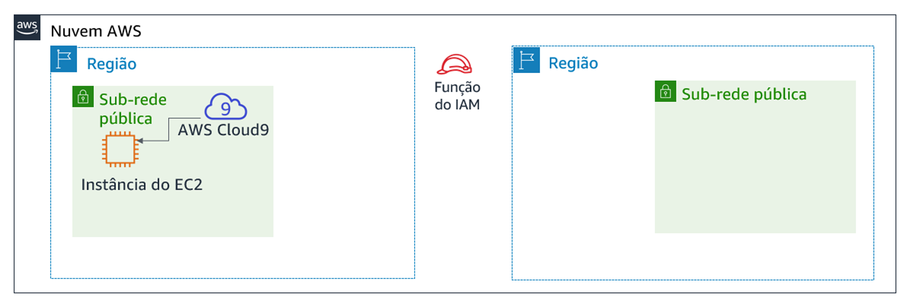
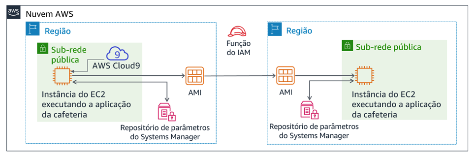

# Módulo 4 – Laboratório de desafio: Criar um site dinâmico para a cafeteria

## Cenário

Depois que a cafeteria lançou a primeira versão de seu site, os clientes disseram à equipe da cafeteria como o site parece bom. No entanto, além do elogio, os clientes muitas vezes perguntaram se eles poderiam fazer pedidos online.

Sofía, Nikhil, Frank e Martha discutiram a situação. Eles concordaram que sua estratégia de negócios e decisões devem se concentrar em encantar seus clientes e fornecer-lhes a melhor experiência possível de cafeteria.


## Visão geral e objetivos do laboratório
Neste laboratório, você implantará uma aplicação em uma instância do Amazon Elastic Compute Cloud (Amazon EC2). A aplicação permite que a cafeteria aceite encomendas online. Depois de testar se a aplicação funciona como pretendido na primeira região da AWS (o ambiente de *desenvolvimento*), você criará uma imagem de máquina da Amazon (AMI) a partir da instância do EC2. Você também implantará uma segunda instância da mesma aplicação que o ambiente de *produção* em outra região da AWS.

Depois de concluir este laboratório, você deverá ser capaz de:

- Conectar-se ao AWS Cloud9 IDE em uma instância do EC2 existente

- Analisar o ambiente de instância do EC2 e confirmar a acessibilidade do servidor Web

- Instalar uma aplicação Web em uma instância do EC2 que também use o AWS Systems Manager Parameter Store

- Testar a aplicação Web

- Criar uma AMI

- Implantar uma segunda cópia da aplicação Web em outra região da AWS


Quando você *inicia* o laboratório, alguns recursos já são criados para você na conta da AWS:



No *final* deste laboratório, sua arquitetura deve ser parecida com o seguinte exemplo:




## Duração
Este laboratório levará aproximadamente **60 minutos** para ser concluído.


## Restrições de serviço da AWS
Neste ambiente de laboratório, o acesso aos serviços e ações de serviço da AWS pode estar restrito àqueles necessários para concluir as instruções do laboratório. Você poderá encontrar erros se tentar acessar outros serviços ou executar ações além do que está descrito neste laboratório.


## Acessar o Console de Gerenciamento da AWS

1. Na parte superior destas instruções, escolha <span id="ssb_voc_grey">Start Lab</span> (Iniciar laboratório) para iniciar o laboratório.

   Um painel **Start Lab** (Iniciar laboratório) é aberto com o status do laboratório.

   **Dica**: se você precisar de mais tempo para concluir o laboratório do que o exibido no cronômetro, escolha o botão <span id="ssb_voc_grey">Start Lab</span> (Iniciar laboratório) novamente para reiniciar o cronômetro do ambiente. Isso não excluirá os recursos que você criou.


2. Aguarde até que a mensagem *Lab status: ready (Status do laboratório: pronto)* seja exibida e feche o painel **Start Lab** (Iniciar laboratório) escolhendo **X**.

   


3. Na parte superior destas instruções, escolha <span id="ssb_voc_grey">AWS</span>.

   O Console de Gerenciamento da AWS será aberto em uma nova guia do navegador. O sistema fará o seu login automaticamente.

   **Dica**: se uma nova guia do navegador não for aberta, normalmente você verá uma faixa ou um ícone na parte superior do navegador com uma mensagem informando que o navegador está impedindo que o site abra janelas pop-up. Escolha a faixa ou o ícone e depois **Allow pop ups** (Permitir pop-ups).

    

4. Organize a guia do Console de Gerenciamento da AWS para que ela seja exibida com essas instruções. O ideal é ver as duas guias do navegador abertas ao mesmo tempo, para facilitar o acompanhamento das etapas do laboratório.


## Uma solicitação de negócios para a cafeteria: preparar uma instância do EC2 para hospedar um site (Desafio nº 1)

A cafeteria quer introduzir pedidos online para os clientes e permitir que os funcionários da cafeteria visualizem os pedidos enviados. Sua arquitetura atual de sites, em que o site está hospedado no Amazon S3, não oferece suporte aos novos requisitos de negócios.

Na primeira parte deste laboratório, você assumirá o papel de Sofía. Você configurará uma instância do Amazon EC2 para que ela esteja pronta para hospedar um site para a cafeteria.


### Tarefa 1: analisar a instância do EC2 existente

Nesta tarefa, você observará detalhes sobre uma instância do EC2 existente que foi criada para você na conta da AWS.

5. No menu **Services** (Serviços), selecione **EC2** e, em seguida, escolha **Running instances** (Instâncias em execução).

   Observe a instância em execução chamada *AWS-Cloud9-CafeWebServer-...*. Essa instância do EC2 foi criada quando você iniciou o laboratório.

   


#### Responder às perguntas sobre a instância

As respostas serão avaliadas quando você escolher o botão azul **Submit** (Enviar) no final do laboratório.

6. Acesse as perguntas deste laboratório.
   - Escolha o menu **Details** (Detalhes) e escolha **Show** (Mostrar).
   - Escolha o link **Access the multiple choice questions** (Acessar as perguntas de múltipla escolha) que aparece na parte inferior da página.


7. Na página que você carregou, responda às primeiras quatro perguntas:

   - **Pergunta 1:** a instância está em uma sub-rede pública?
   - **Pergunta 2:** a instância do EC2 tem um endereço IP público IPv4 atribuído a ela?
   - **Pergunta 3:** Quais portas TCP de entrada estão abertas para esta instância?
   - **Pergunta 4:** a instância do EC2 tem uma função do AWS Identity and Access Management (IAM) associada a ela?

   **Observação**: deixe a página da Web de perguntas abertas na guia do navegador, pois você a consultará de novo mais adiante neste laboratório.


### Tarefa 2: conectar-se ao IDE na instância do EC2

O AWS Cloud9 é um serviço que pode ser executado em uma instância do EC2. Ele fornece um ambiente de desenvolvimento integrado (IDE) que inclui recursos como um editor de código, depurador e terminal.

Ao usar o ambiente do AWS Cloud9, você não precisa baixar um par de chaves e conectar-se à instância do EC2 usando PuTTY ou software Secure Shell (SSH) semelhante. Ao usar o AWS Cloud9, você também não precisa usar ferramentas de edição de texto de linha de comando (como vi ou nano) para editar arquivos na instância do Linux.

8. No menu *Services (Serviços)*, escolha **AWS Cloud9**e escolha **Your environments** (Seus ambientes).

   Observe o ambiente *CafeWebServer*. Ele indica que pertence ao *EC2*.

   

9. Escolha **Open IDE** (Abrir IDE).

   Agora você está conectado ao IDE do AWS Cloud9 que está sendo executado na instância do EC2 que você observou anteriormente.

   O IDE inclui:

   - Um *terminal bash* no painel inferior direito.
   - Um *navegador de arquivos* no painel esquerdo que mostra arquivos no diretório `/home/ec2-user/environment` na instância.
   - Um *editor de arquivos* no painel superior direito. Se você clicar duas vezes em um arquivo no navegador de arquivos, como o arquivo README.md, ele será exibido no editor.

  


### Tarefa 3: analisar o ambiente de pilha LAMP e confirmar que o servidor Web está acessível

Lembre-se de que o objetivo deste laboratório de desafio é configurar uma instância do EC2 para hospedar o novo site dinâmico da cafeteria. Nesta tarefa, você analisará o que já está instalado.


10. Observe a versão do sistema operacional.

    No terminal do Bash do AWS Cloud9, execute este comando:

    ```bash
    cat /proc/version
    ```

    Observe como a saída indica que é uma instância do Amazon Linux, aproximadamente análogo ao Red Hat 7.

    

11. Observe os detalhes do servidor Web, banco de dados e PHP e estado do servidor.

    No terminal, execute estes comandos:

    ```bash
    sudo httpd -v
    service httpd status
    
    mysql --version
    service mysqld status
    
    php --version
    ```

    A saída deve mostrar as versões do servidor Web e do banco de dados e também mostrar que elas não estão sendo executados atualmente.


12. Inicie o servidor Web e o banco de dados, e também defina-os para iniciar automaticamente após qualquer futura reinicialização da instância do EC2.

    No terminal, execute estes comandos:

    ```bash
    sudo chkconfig httpd on
    sudo service httpd start
    sudo service httpd status
    
    sudo chkconfig mysqld on
    sudo service mysqld start
    sudo service mysqld status
    ```


13. Configure a instância do EC2 para que você possa usar o editor do AWS Cloud9 para editar arquivos do servidor Web.

    Observe que o navegador de arquivos do AWS Cloud9 atualmente não exibe o diretório Web padrão do servidor Web Apache.

    No terminal, execute estes dois comandos:

    ```bash
    ln -s /var/www/ /home/ec2-user/environment
    sudo chown ec2-user:ec2-user /var/www/html
    ```

    O primeiro comando que você executou criou um link simbólico do espaço de trabalho padrão do editor do AWS Cloud9 para o diretório `/var/www` que contém os arquivos do servidor Web.

    O segundo comando alterou a propriedade do subdiretório **html**, assim o usuário *ec2-user* (que você usou para fazer login) pode editar e criar novos arquivos nele.


14. Criar uma página Web de teste simples.

    - No *navegador de arquivos*, expanda o diretório **CafeWebServer > www** e realce o diretório **html**.

    - Escolha **File** (Arquivo) > **New File** (Novo arquivo).

    - Na guia editor de texto, cole a seguinte linha:

      ```html
      <html>Hello from the café web server!</html>
      ```

    - Escolha **File** (Arquivo) > **Save** (Salvar), e salve o arquivo no diretório **html** como *index.html*.

      

15. Deixe o site acessível pela Internet.

    Nesta etapa, você precisará verificar e atualizar as configurações que tornam as páginas Web (que estão hospedadas no servidor Web) acessíveis a partir da Internet.

    Veja algumas dicas que ajudarão você a começar:

<details>
<summary>
<b>Dica nº 1</b> (clique para expandir)
</summary>
Descubra o endereço IP público IPv4 da instância do EC2 e tente carregar `http://&lt;ip-público>` em uma nova guia do navegador. A mensagem que você inseriu no index.html é carregada no navegador?
</details>


<details>
<summary>
<b>Dica nº 2</b> (clique para expandir)
</summary>Para permitir o tráfego HTTP de entrada na porta TCP 80 de qualquer lugar, atualize o grupo de segurança da instância do EC2, conforme necessário.
</details>


## Novo requisito de negócios: instalar uma aplicação de site dinâmico na instância do EC2 (Desafio nº 2)

No desafio anterior, você configurou a instância do EC2. Agora você sabe que o PHP está instalado e que o ambiente da aplicação tem um banco de dados relacional em execução. Além disso, o ambiente tem um servidor Web em execução que pode ser acessado pela Internet. Agora você tem a configuração básica para hospedar um site dinâmico para a cafeteria.

Na segunda parte deste laboratório, você assumirá o papel de Sofía e instalará a aplicação da cafeteria na instância do EC2.


### Tarefa 4: instalar a aplicação da cafeteria

16. Faça download e extraia os arquivos de aplicações do servidor Web.

    No terminal do Bash, execute estes comandos:

    ```bash
    cd ~/environment
    wget https://aws-tc-largeobjects.s3-us-west-2.amazonaws.com/ILT-TF-200-ACACAD-20-EN/mod4-challenge/setup.tar.gz
    tar -zxvf setup.tar.gz
    wget https://aws-tc-largeobjects.s3-us-west-2.amazonaws.com/ILT-TF-200-ACACAD-20-EN/mod4-challenge/db.tar.gz
    tar -zxvf db.tar.gz
    wget https://aws-tc-largeobjects.s3-us-west-2.amazonaws.com/ILT-TF-200-ACACAD-20-EN/mod4-challenge/cafe.tar.gz
    tar -zxvf cafe.tar.gz
    ```

    Observe como o navegador de arquivos agora mostra os três arquivos.tar.gz que você baixou.

    Você também extraiu esses arquivos de arquivo, que criaram os diretórios `cafe`, `db`e `configuração` em seu ambiente de trabalho.


17. Copie os arquivos da cafeteria para a raiz do documento do servidor Web.

    No terminal do Bash, execute este comando:

    ```bash
    mv cafe /var/www/html/
    ```


18. Observe como a aplicação é projetada para funcionar.

    - Abra o código-fonte `html/cafe/index.php` no editor do AWS Cloud9 clicando duas vezes nele.
    - Observe que este arquivo tem código HTML nele, mas também contém seções que estão incluídas em *<?php ... ?>* elementos. Esses elementos fazem chamadas para outros sistemas e recursos.
    - Por exemplo, na **linha 18**, você vê que o código PHP faz referência a um arquivo chamado *getAppParameters.php*.
    - Abra o arquivo **getAppParameters.php** no editor de código.
    - Observe na **linha 3** deste arquivo que o *AWSSDK* é invocado.
    - Além disso, nas **linhas 10 a 33**, a aplicação Web cria um cliente que se conecta ao serviço *ssm*, que é o AWS Systems Manager. Em seguida, a aplicação recupera sete parâmetros do Systems Manager. Esses parâmetros ainda não foram criados no AWS Systems Manager, mas você fará isso em seguida.

    


19. Configure os parâmetros da aplicação no AWS Systems Manager Parameter Store.

    No terminal do Bash, execute estes comandos:

    ```bash
    cd setup
    ./set-app-parameters.sh
    ```

    O script shell que você acabou de executar emitiu comandos da Interface de Linhas de Comando da AWS (AWS CLI). Esses comandos adicionaram os parâmetros que a aplicação usará ao repositórios de parâmetros.


20. No Console de Gerenciamento da AWS, no menu **Services (Serviços)**, escolha **Systems Manager**.

    


21. No painel à esquerda, escolha **Parameter Store** (Repositório de parâmetros).

    Observe como existem agora sete parâmetros armazenados aqui.

    O código PHP da aplicação da cafeteria faz referência a esses valores (por exemplo, para que ela possa recuperar as informações de conexão do banco de dados MySQL).

    Escolha o parâmetro `/cafe/dbPassword` e copie o *valor* para a área de transferência. Ele será usado em breve.


22. Configure o banco de dados MySQL para ser compatível com a aplicação da cafeteria.

    Voltando ao terminal bash do AWS Cloud9, execute os seguintes comandos:

    ```bash
    cd ../db/
    ./set-root-password.sh
    ./create-db.sh
    ```


23. Observe as tabelas de banco de dados que foram criadas.

    No terminal do Bash, execute este comando para conectar o cliente MySQL baseado em terminal ao banco de dados:

    ```bash
    mysql -u root -p
    ```
    Quando for solicitada a senha do banco de dados, cole o valor do parâmetro *dbPassword* que você copiou.

    Agora você deve ver um prompt `mysql>` que indica que agora você está conectado ao banco de dados MySQL que é executado nesta instância do EC2.


Para observar o conteúdo do banco de dados (especificamente, as tabelas que dão suporte à aplicação Web da cafeteria), insira os seguintes comandos:

  ```sql
show databases;
use cafe_db;
show tables;
select * from product;
exit;
  ```


24. Atualize a configuração *timezone* no PHP.

    No terminal do Bash, execute os seguintes comandos:

    ```bash
    sudo sed -i "2i date.timezone = \"America/New_York\" " /etc/php.ini
    sudo service httpd restart
    ```

    O primeiro comando que você executou configurou o fuso horário no software PHP.

    O segundo comando que você executou reiniciou o servidor Web para que ele perceba a atualização de configuração.


25. Teste se o site da cafeteria está funcionando e pode ser acessado pela Internet.

    Em uma nova guia do navegador, tente carregar a aplicação em `http://<ip-público>/cafe` em que <*ip-público*> é o endereço IPv4 público da instância do EC2.

    Você verá que *apenas o banner do título* do site é carregado. O resto da página não está carregando corretamente.


26. Resolva um problema com o site.

    Nesta etapa, você precisará descobrir como fazer o site da cafeteria funcionar corretamente.

    Aqui está uma lista do que *funciona*:

    - A página de teste em *http://&lt;ip-público>/* carrega, para que você saiba que o servidor Web funciona e está acessível pela Internet
    - Você também sabe que o banco de dados MySQL está sendo executado e contém tabelas e dados para dar suporte à aplicação

Qual poderia ser o problema?

<details>
<summary>
<b>Dica nº 1</b> (clique para expandir)
</summary>
Não há nada de errado com o código PHP como escrito. O problema está relacionado a permissões.
</details>

<details>
<summary>
<b>Dica nº 2</b> (clique para expandir)
</summary>
A aplicação Web depende de outros serviços ou recursos além do servidor Web e do banco de dados? Por exemplo, ela requer acesso a outro serviço da AWS?
</details>

<details>
<summary>
<b>Dica nº 3</b> (clique para expandir)
</summary>
Vá para o serviço do IAM e procure a função do IAM chamada <B>CafeRole</B>. Observe as permissões que essa função concede. Seria útil ter esses direitos concedidos à instância do EC2? Como você poderia conceder essas permissões para a aplicação Web da cafeteria?
</details>

<details>
<summary>
<b>Dica nº 4</b> (clique para expandir)
</summary>
 Selecione a instância do EC2 no console do Amazon EC2 e analise as opções no menu <B>Actions (Ações)</B>. Alguma das ações ajudaria a resolver o problema?
</details>


Ao considerar que o problema está corrigido, carregue a página `http://<ip-público>/cafe` novamente. Ela carrega completamente, de modo que você consiga ver os itens do menu da cafeteria? Se a resposta é sim, parabéns!

**Observação**: se você ainda não conseguir resolver o problema, talvez seja útil executar o script de avaliação conforme documentado na seção **Enviar o trabalho** no final dessas instruções do laboratório. O relatório de envio gerado pode fornecer dicas adicionais para partes do laboratório que você não concluiu com sucesso. Você pode enviar seu trabalho quantas vezes quiser — somente a pontuação que você conseguir no último envio será mantida.


### Tarefa 5: testar a aplicação Web

27. Teste colocando um pedido.

    - Na guia do navegador onde você tem a <public-ip> página `http:///cafe` aberta, escolha **Menu**.

    - Envie um pedido para pelo menos um dos itens de menu exibidos.

       - Observação: talvez seja necessário rolar para baixo para encontrar o botão **Submit Order** (Enviar pedido).

    - Retorne à página do menu e faça outro pedido e, em seguida, vá para a página **Histórico** de pedidos para ver os detalhes do pedido de todos os pedidos que você fez.


## Novo requisito de negócios: criação de sites de desenvolvimento e produção em diferentes regiões da AWS (Desafio #3)


Todos na cafeteria estão impressionados com o novo site dinâmico que a Sofía criou! Os clientes estão muito satisfeitos porque agora podem fazer pedidos online e agendar itens de sobremesa para retirada. A satisfação do cliente aumentou devido à redução no tempo de espera.

No entanto, surge outro requisito comercial, juntamente com o elogio. Martha e Frank gostariam de ter *dois* sites para a cafeteria:
- Um site que possa ser usado como um *ambiente de desenvolvimento* para simular novos recursos e Web designs antes de serem lançados aos clientes

- Um site separado que hospedará o *ambiente de produção* que os clientes usam

Sofía discutiu o novo requisito com Mateo quando ele foi à cafeteria pela manhã para tomar um café. Ele sugeriu que, idealmente, os dois ambientes deveriam existir em *diferentes regiões da AWS*. Esse projeto teria o benefício adicional de fornecer recuperação de desastres (DR) mais robusta no cenário improvável em que uma região da AWS se torna temporariamente indisponível.

Agora, Sofía está muito ocupada! À medida que o trabalho dela se torna mais expressivo, suas habilidades são mais exigidas.


### Tarefa 6: criar uma AMI e executar outra instância do EC2

Como o site da cafeteria já funciona bem em uma instância do EC2 existente, Sofía decide duplicá-lo criando uma AMI a partir dele. Em seguida, ela executará uma nova instância a partir da nova AMI.

Você continuará a assumir o papel de Sofía para esta tarefa. Antes de criar uma AMI fora desta instância, você deve criar um novo par de chaves, o que pode ser importante ter mais tarde neste laboratório.


28. Defina um nome de host interno estático e crie um novo par de chaves na instância do EC2.

    No terminal do Bash, execute os seguintes comandos:

    ```bash
    sudo hostname cafeserver
    ssh-keygen -t rsa -f ~/.ssh/id_rsa
    ```

    Para as duas vezes que você é solicitado para uma senha, pressione a tecla ENTER.

    Para tornar a nova chave disponível para os utilitários SSH, no terminal do Bash, execute o seguinte comando:
    ```bash
    cat ~/.ssh/id_rsa.pub >> ~/.ssh/authorized_keys
    ```


29. No Console de Gerenciamento da AWS, navegue até a área de serviço do **EC2** e selecione a instância.

    


30. Escolha **Actions > Image > Create Image (Ações > Imagem > Criar imagem)**.

    **Dica**: deixe a caixa de diálogo **Create Image** (Criar imagem) aberta na guia do navegador enquanto você responde a algumas perguntas sobre AMIs.


#### Responder às perguntas sobre AMIs

As respostas serão gravadas quando você escolher o botão azul **Submit** (Enviar) no final do laboratório.


31. Retorne à aba do navegador que tem as perguntas para este laboratório. Você acessou esta guia anteriormente.

    Se você precisar encontrar a página novamente:

    - Escolha o menu **Details** (Detalhes) e escolha **Show** (Mostrar).

    - Escolha o link **Access the multiple choice questions** (Acessar as perguntas de múltipla escolha) que aparece na parte inferior da página.


32. Na página, envie respostas para as seguintes perguntas:

    - **Pergunta 5:** Quando você cria uma AMI a partir de uma instância, a instância é reinicializada?

    - **Pergunta 6:** como você pode modificar as propriedades do volume raiz ao criar uma AMI a partir de uma instância?

    - **Pergunta 7:** você pode adicionar volumes a uma AMI criada com base em uma instância que tenha apenas um volume?


33. De volta ao Console de Gerenciamento da AWS, na tela **Create Image** (Criar imagem), crie a nova AMI:

    - **Nome da imagem**: `CafeServer`

    - Escolha **Create Image** (Criar imagem).

      

34. Escolha o link **View pending image ami-...** (Exibir imagem pendente ami-...) e aguarde até o status da imagem se tornar *Available (Disponível)*. Normalmente, o processo leva cerca de dois minutos.

    


35. Criar uma AMI em outra região da AWS

    Nesta etapa, seu objetivo é criar uma nova instância do EC2 a partir da AMI que você acabou de capturar. No entanto, você deve criar a nova instância na região da AWS Oregon (us-west-2).

<details>
<summary>
<b>Dica nº 1</b> (clique para expandir)
</summary>
Copie o ID da AMI da imagem que você acabou de criar. Em seguida, tente encontrá-lo na região us-west-2.
</details>

<details>
<summary>
<b>Dica nº 2</b> (clique para expandir)
</summary>
As AMIs existem no nível da conta?
</details>

<details>
<summary>
<b>Dica nº 3</b> (clique para expandir)
</summary>
Selecione a AMI que você criou na região da AWS em que a criou. Em seguida, escolha o menu <b>Actions (Ações)</b>. Alguma ação parece que poderia ajudar você a disponibilizar a AMI na região Oeste dos EUA (Oregon)? Prossiga e escolha a ação apropriada. Depois de iniciá-la, a ação pode levar até cinco minutos para ser concluída. Escolha o ícone de atualização ocasionalmente para saber mais rapidamente quando ela estiver concluída.
</details>


36. Crie a nova instância da cafeteria a partir da sua AMI. A nova instância criada deve corresponder aos critérios a seguir.

    - **Region** (Região): `Oregon`

    - **Instance Size** (Tamanho da instância): ` t2.small`

    - **Network** (Rede): `Lab VPC Region 2 (Lab VPC região 2)`, `Public Subnet (Sub-rede pública)`

    - **IAM Role** (Função do IAM): `CafeRole`

    - Tag:
       - **Key** (Chave): `Name (Nome)`
       - **Value** (Valor): `ProdCafeServer`

    - Grupo de segurança:
       - Crie um novo chamado **cafeSG**, com a porta TCP **22** aberta para qualquer lugar
       - Defina a porta TCP **80** para que seja aberta para qualquer lugar também

    - **Prossiga sem um par** de chaves (o par de chaves que você criou anteriormente neste laboratório deve trabalhar para se conectar a ele, se necessário)


37. Aguarde até que a nova instância tenha um valor *DNS público* atribuído a ela, mesmo que o status da instância ainda não esteja *disponível*.

    


38. Copie o valor de **Public DNS** (DNS público). Você vai usá-lo em breve.

    


39. Para criar os *parâmetros necessários do AWS Systems Manager* na nova região da AWS, conclua estas etapas.

    - Retorne ao IDE do AWS Cloud9 na região **Norte da Virgínia (us-east-1)**.

    - Abra o arquivo CafeWebServer/Setup/**set-app-parameters.sh** no editor de texto.

    - Edite a **linha 12** do arquivo para corresponder a esta configuração:

      ```bash
      region="us-west-2"
      ```

    - Edite a **linha 18** para corresponder a essa configuração (em que < Public-DNS-of-ProdCafeServer-Instance > *é o DNS real da instância ProdCafeServer):*

      ```bash
      publicDNS="<public-dns-of-ProdCafeServer-instance>"
      ```

    **Observação**: a linha ainda deve conter as aspas, mas *não* deve conter os colchetes angulares (< >).


    Este exemplo mostra como a linha 12 deve olhar e como a linha 18 deve ser formatada. No entanto, o valor do seu DNS público será diferente.


- Escolha **File > Save** (Arquivo > Salvar) para salvar a alteração.

- Para executar esse script, vá até a parte superior do IDE e escolha o botão **Run** (Executar).

No terminal do Bash abaixo do editor de texto, você deve ver a saída formatada em JavaScript Object Notation (JSON). Esta saída indica que o script de parâmetros foi executado com sucesso.

<details>
<summary>Se o script encontrou um problema, clique aqui para ver as dicas de solução de problemas.</summary>
Se a saída do comando indica que as credenciais estão expiradas, tente executar estes comandos no terminal do Bash (e execute então o set-app-parameters.sh outra vez):
<br><code>wget https://aws-tc-largeobjects.s3-us-west-2.amazonaws.com/ILT-TF-200-ACACAD-20-EN/mod4-challenge/cred-update.sh</code><br>
<code>chmod +x cred-update.sh</code><br>
<code>./cred-update.sh</code>
</details>

**Observação**: alterando os detalhes da região da AWS e executando esse script novamente, você criou os mesmos parâmetros que criou anteriormente na região us-east-1 do armazenamento de parâmetros do AWS Systems Manager. No entanto, desta vez, você criou esses parâmetros na Região do Oregon.


### Tarefa 7: verificar a nova instância da cafeteria


40. Retorne ao console do EC2 na região do **Oregon** e verifique se a nova instância **ProdCafeServer** está sendo executada.

    


41. Copie o endereço IP público IPv4 e carregue-o em um navegador da Web.

    Uma mensagem *Hello from the cafe web server! (Olá do servidor Web da cafeteria!)* deve ser exibida.


42. Carregue o URL `http://<ip-público>/cafe/` em uma guia do navegador.

    Todo o site da cafeteria deve ser exibido.


43. Carregue a página **Menu**.

    A página *Menu* completa deve ser carregada e a funcionalidade de colocação de pedidos deve estar operante.


44. Faça um pedido para verificar se o site está funcionando como pretendido.


45. Dicas de solução de problemas (ignore esta etapa se você não encontrou nenhum problema com o carregamento da página *Menu*).

    O script de avaliação pode fornecer dicas adicionais para partes do laboratório que você não concluiu com sucesso. Você pode enviar seu trabalho quantas vezes quiser. Somente a pontuação que você conseguir no último envio será mantida.

    Além disso, se você quiser se conectar à nova instância do EC2 no Oregon (us-west-2) para fazer algumas soluções de problemas, execute este comando no IDE AWS Cloud9 em us-east-1:

    ```bash
    ssh -i ~/.ssh/id_rsa ec2-user@<public-ip-of-ProdCafeServer>
    ```
    Observe que <ip-público-de-ProdCafeServer> *é o endereço IP público real da instância ProdCafeServer*.


## Novidades da cafeteria


Sofía agora é uma heroína na cafeteria! Ela criou um site dinâmico *e* também criou uma versão duplicada do mesmo site que é executada em uma segunda região da AWS.

Sofía decidiu designar a primeira instância do EC2 que ela criou, aquela na região us-east-1, como instância de *desenvolvimento*. A segunda instância que ela criou, aquela no Oregon (na região us-west-2), será a instância de *produção*.

Dessa forma, Sofía e quaisquer outros desenvolvedores de aplicações podem testar aprimoramentos de aplicações no site de *desenvolvimento* sem afetar o site de *produção*. Então, quando os desenvolvedores decidirem que os aprimoramentos parecem bons e os testarem completamente, eles poderão migrar o código para o site de produção.

Sofía explicou aos seus pais, Frank e Martha, o que ela tinha feito. Embora eles não entenderam completamente todos os termos técnicos que Sofía usou, eles ficaram satisfeitos em saber que o site agora pode receber pedidos online. Eles também ficaram felizes em saber que agora podem testar novas melhorias no site sem expor imediatamente essas mudanças aos clientes.


## Enviar o trabalho

46. Na parte superior destas instruções, escolha <span id="ssb_blue">Submit</span> (Enviar) para gravar seu progresso e, quando solicitado, escolha **Yes** (Sim).

    

47. Se os resultados não forem exibidos após alguns minutos, volte ao topo destas instruções e escolha <span id="ssb_voc_grey">Grades</span> (Notas).

    **Dica**: você pode enviar seu trabalho várias vezes. Depois de alterar o trabalho, escolha **Submit** (Enviar) novamente. Seu último envio é o que será gravado para este laboratório.

    

48. Para ver o feedback detalhado do seu trabalho, escolha <span id="ssb_voc_grey">Details</span> (Detalhes) e depois <i class="fas fa-caret-right"></i> **View Submission Report** (Visualizar relatório de envio).


## Laboratório concluído

<i class="icon-flag-checkered"></i> Parabéns! Você concluiu o laboratório.


49. Para confirmar que você deseja encerrar o laboratório, escolha **<span id="ssb_voc_grey">End Lab</span>** (Encerrar laboratório) na parte superior desta página e escolha **<span id="ssb_blue">Yes</span>** (Sim).

    Será exibido um painel com a mensagem: *DELETE has been initiated... You may close this message box now. (A EXCLUSÃO foi iniciada... Você pode fechar esta caixa de mensagem agora).*


50. Escolha o **X** no canto superior direito para fechar o painel.


*©2020, Amazon Web Services, Inc. e suas afiliadas. Todos os direitos reservados. Este trabalho não pode ser reproduzido ou redistribuído, no todo ou em parte, sem permissão prévia por escrito da Amazon Web Services, Inc. É proibido copiar, emprestar ou vender para fins comerciais.*