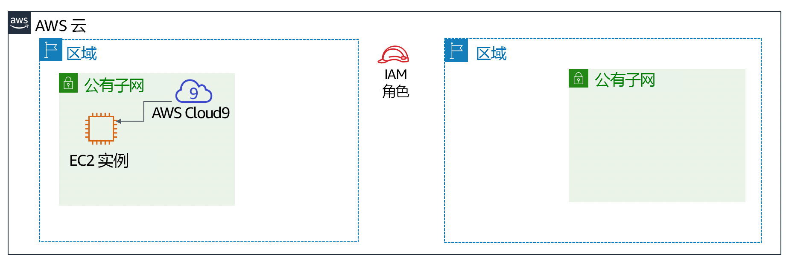

# 模块 4 – 挑战实验：为咖啡馆创建动态网站

## 场景

该咖啡馆推出第一版网站后，顾客告诉咖啡馆员工，网站看起来不错。然而，除了赞美之外，顾客经常询问他们是否可以在线下单。

Sofía、Nikhil、Frank 和 Martha 讨论了一下形势，他们一致认为，其商业战略和决策应该侧重于让顾客感到满意，并尽可能为顾客提供出色的体验。


## 实验概览和目标
在本实验中，您将在 Amazon Elastic Compute Cloud (Amazon EC2) 实例上部署一个应用程序。该应用程序使咖啡馆能够接受在线订单。在测试应用程序在第一个 AWS 区域（*开发*环境）中按预期工作之后，您将从 EC2 实例创建一个Amazon 系统映像 (AMI)。您还将在另一个 AWS 区域部署与*生产*环境相同的应用程序的第二个实例。

完成本实验后，您应能够：

- 在现有 EC2 实例上连接到 AWS Cloud9 IDE

- 分析 EC2 实例环境并确认 Web 服务器的可访问性

- 在同样使用 AWS Systems Manager Parameter Store 的 EC2 实例上安装 Web 应用程序

- 测试 Web 应用程序

- 创建 AMI

- 将 Web 应用程序的第二个副本部署到另一个 AWS 区域


*启动*实验时，已经在 AWS 账户中为您创建了一些资源：



在本实验*结束*时，您的架构应如下例所示：


## 持续时间
完成本实验大约需要 **60 分钟**。


## AWS 服务限制
在本实验环境中，对 AWS 服务和服务操作的访问可能仅限于完成实验说明所需的服务和服务操作。如果您尝试访问其他服务或执行本实验中所述之外的操作，可能会遇到错误。


## 访问 AWS 管理控制台

1. 在这些说明的顶部，选择 <span id="ssb_voc_grey">Start Lab</span>（启动实验）即可启动您的实验。

   **Start Lab**（启动实验）面板随即会打开，其中显示了实验状态。

   **提示**：如果您需要延长计时器上显示的实验完成时间，请再次选择 <span id="ssb_voc_grey">Start Lab</span>（启动实验）按钮，以重新启动环境计时器。这一操作不会删除您已创建的资源。


2. 请耐心等待，直到您看到消息 *Lab status: ready*（实验状态：就绪），然后选择 **X** 关闭 **Start Lab**（启动实验）面板。


3. 在这些说明的顶部，选择 <span id="ssb_voc_grey">AWS</span>。

   AWS 管理控制台将会在一个新的浏览器选项卡中打开。您将自动登录系统。

   **提示**：如果未打开新的浏览器选项卡，您的浏览器顶部通常会出现一个横幅或图标，并显示一条消息，指明您的浏览器阻止该了网站打开弹出窗口。请选择横幅或图标，然后选择 **Allow pop-ups**（允许弹出窗口）。


4. 排列 AWS 管理控制台选项卡，使其与这些说明一起显示。理想情况下，您将同时打开两个浏览器选项卡，以便能够更轻松地执行实验步骤。


## 咖啡馆的业务请求：准备一个 EC2 实例来托管网站（挑战 #1）

咖啡馆希望为顾客推出在线订购，并使咖啡馆工作人员能够查看已提交的订单。他们当前的网站架构（该网站托管在 Amazon S3 上）不支持新的业务要求。

在本实验的第一部分，您将担任 Sofía 的角色。您需要配置 Amazon EC2 实例，以便它可以为咖啡馆托管网站。


### 任务 1：分析现有 EC2 实例

在此任务中，您将注意到有关 AWS 账户中为您创建的现有 EC2 实例的详细信息。

5. 从 **Services**（服务）菜单中，选择 **EC2**，然后选择 **Running Instances**（运行的实例）。

   请注意名为 *aws-cloud9-CafeWebServer* 的运行实例...。此 EC2 实例是在您启动实验时创建的。

   


#### 回答有关实例的问题

完成实验后，选择蓝色的 **Submit**（提交）按钮。系统将会评估答案。

6. 查看本实验中的问题。
   - 选择 **Details**（详细信息）菜单，然后选择 **Show**（显示）。
   - 选择页面底部的 **Access the multiple choice questions**（查看多项选择题）链接。


7. 在加载的页面中，回答前四个问题：

   - **问题 1**：此实例是否在公有子网中？
   - **问题 2**：EC2 实例是否分配了 IPv4 公有 IP 地址？
   - **问题 3**：为此实例打开了哪些入站 TCP 端口号？
   - **问题 4**：该 EC2 实例具有与之关联的 AWS Identity and Access Management (IAM) 角色吗？

   **注意**：请将浏览器选项卡中的问题页面保持打开状态，以便稍后在实验中返回查看。


### 任务 2：连接到 EC2 实例上的 IDE

AWS Cloud9 是可以在 EC2 实例上运行的服务。它提供了一个集成开发环境 (IDE)，其中包括代码编辑器、调试器和终端等功能。

通过使用 AWS Cloud9 环境，您无需下载密钥对并使用 PuTTY 或类似的 Secure Shell (SSH) 软件连接到 EC2 实例。通过使用 AWS Cloud9，您还无需使用命令行文本编辑工具（如 vi 或 nano）来编辑 Linux 实例上的文件。

8. 从 *Services*（服务）菜单中，选择 **AWS Cloud9**，然后选择 **Your environments**（您的环境）。

   请注意 *CafeWebServer* 环境。这表示它是输入 *EC2*。


9. 选择 **Open IDE**（打开 IDE）。

   现在，您已连接到在您之前观察到的 EC2 实例上运行的 AWS Cloud9 IDE。

   IDE 包括：

   - 右下角面板中的 *Bash 终端*。
   - 左侧面板中的*文件浏览器*，显示实例上的 `/home/ec2-user/environment` 目录中的文件。
   - 右上角面板中的*文件编辑器*。如果双击文件浏览器中的某个文件（例如 Readme.md 文件），它将显示在编辑器中。


### 任务 3：分析 LAMP 堆栈环境并确认可以访问 Web 服务器

回想一下，本挑战实验的目标是配置 EC2 实例以托管咖啡馆的新动态网站。在此任务中，您将分析已安装的内容。


10. 观察操作系统版本。

    在 AWS Cloud9 bash 终端中运行此命令：

    ```bash
       cat /proc/version
       ```

    注意输出如何表明它是一个 Amazon Linux 实例，大致类似于 Red Hat 7。


11. 观察 Web 服务器、数据库和 PHP 的详细信息和服务器状态。

    在终端中，运行以下命令：

    ```bash
       sudo httpd -v
       service httpd status
   
       mysql --version
       service mysqld status
   
       php --version
       ```

    输出应显示 Web 服务器和数据库的版本，并显示它们当前未运行。


12. 启动 Web 服务器和数据库，并将它们设置为在将来的任何 EC2 实例重启后自动启动。

    在终端中，运行以下命令：

    ```bash
       sudo chkconfig httpd on
       sudo service httpd start
       sudo service httpd status
   
       sudo chkconfig mysqld on
       sudo service mysqld start
       sudo service mysqld status
       ```


13. 配置 EC2 实例，以便您可以使用 AWS Cloud9 编辑器编辑 Web 服务器文件。

    请注意，AWS Cloud9 文件浏览器目前不显示 Apache Web 服务器的默认 Web 目录。

    在终端中，运行以下两个命令：

    ```bash
    ln -s /var/www/ /home/ec2-user/environment
    sudo chown ec2-user:ec2-user /var/www/html
    ```

    您运行的第一个命令创建了一个从默认 AWS Cloud9 编辑器工作区到包含 Web 服务器文件的 `/var/www` 目录的符号链接。

    第二个命令更改了 **html** 子目录的所有权，以便 *ec2-user*（您登录的身份）可以在其中编辑和创建新文件。


14. 创建一个简单的测试网页。

    - 在*文件浏览器*中，展开 **CafeWebServer > www** 目录，然后突出显示 **html** 目录。

    - 选择 **File**（文件） > **New File**（新文件）。

    - 在文本编辑器选项卡中，粘贴以下行：

      ```html
            <html>Hello from the café web server!</html>
            ```

    - 选择 **File**（文件）> **Save**（保存），然后将该文件保存在 **html** 目录中为 *index.html*。


15. 使网站可从互联网访问。

    在此步骤中，您需要验证和更新使网页（托管在 Web 服务器上）可以从互联网访问的配置。

    这里有一些提示可以帮助您入门：

<details>
<summary>
<b>提示 1</b>（单击以展开）
</summary>
发现 EC2 实例的 IPv4 公有 IP 地址，然后尝试在新的浏览器选项卡中加载 `http://&lt;public-ip>`。您输入到 index.html 中的消息会在浏览器中加载吗？
</details>


<details>
<summary>
<b>提示 2</b>（单击以展开）
</summary>若要允许来自任何地方的 TCP 端口 80 上的入站 HTTP 流量，请根据需要更新 EC2 实例的安全组。
</details>


## 新的业务要求：在 EC2 实例上安装动态网站应用程序（挑战 2）

在上一个挑战中，您配置了 EC2 实例。您现在知道已安装了 PHP，并且应用程序环境中有一个正在运行的关系数据库。此外，该环境还有一个可以从互联网访问的正在运行的 Web 服务器。现在，您已经拥有了为咖啡馆托管动态网站的基本设置。

在本实验的第二部分，您将担任 Sofía 的角色，并在 EC2 实例上安装咖啡馆应用程序。


### 任务 4：安装咖啡馆应用程序

16. 下载并提取 Web 服务器应用程序文件。

    在 Bash 终端中，运行以下命令：

    ```bash
       cd ~/environment
       wget https://aws-tc-largeobjects.s3-us-west-2.amazonaws.com/ILT-TF-200-ACACAD-20-EN/mod4-challenge/setup.tar.gz
       tar -zxvf setup.tar.gz
       wget https://aws-tc-largeobjects.s3-us-west-2.amazonaws.com/ILT-TF-200-ACACAD-20-EN/mod4-challenge/db.tar.gz
       tar -zxvf db.tar.gz
       wget https://aws-tc-largeobjects.s3-us-west-2.amazonaws.com/ILT-TF-200-ACACAD-20-EN/mod4-challenge/cafe.tar.gz
       tar -zxvf cafe.tar.gz
       ```

    注意文件浏览器现在如何显示您下载的三个 .tar.gz 文件。

    您还提取了这些存档文件，这些文件在工作环境中创建了 `cafe`、`db` 和 `setup` 目录。


17. 将 café 文件复制到 Web 服务器文档根目录。

    在 Bash 终端中，运行以下命令：

    ```bash
       mv cafe /var/www/html/
       ```


18. 观察应用程序设计的运行方式。

    - 双击可在 AWS Cloud9 编辑器中打开 ` html/cafe/index.php` 源代码。
    - 请注意，该文件中包含 HTML 代码，但它也包括包含在 *<?php ... ?>*元素中的部分。这些元素调用其他系统和资源。
    - 例如，在**第 18 行**中，您会看到 PHP 代码引用了一个名为 *getAppParameters.php* 的文件。
    - 在代码编辑器中打开 **getAppParameters.php** 文件。
    - 请注意，在此文件的**第 3 行**中调用了 *AWSSDK*。
    - 此外，在**第 10 到 33 行 **中，Web 应用程序会创建一个客户端，该客户端连接到* ssm *服务，即 AWS Systems Manager。然后，应用程序从系统管理器中检索七个参数。这些参数尚未在 AWS Systems Manager 中创建，但接下来您将进行创建。


19. 在 AWS Systems Manager Parameter Store 中，配置应用程序参数。

    在 Bash 终端中，运行以下命令：

    ```bash
       cd setup
       ./set-app-parameters.sh
       ```

    您刚运行的 shell 脚本发出了 AWS 命令行界面 (AWS CLI) 命令。这些命令将应用程序将使用的参数添加到参数仓库中。


20. 在 AWS 管理控制台中，从 **Services**（服务）菜单中选择 **Systems Manager**。


21. 从左侧面板中，选择 **Parameter Store**（参数仓库）。

    注意这里现在如何存储七个参数。

    咖啡馆应用程序的 PHP 代码引用了这些值（例如，以便它可以检索 MySQL 数据库的连接信息）。

    选择 `/cafe/dbPassword` 参数，并将 *Value*（值）复制到剪贴板。稍后您将使用该值。


22. 配置 MySQL 数据库以支持咖啡馆应用程序。

    回到 AWS Cloud9 终端，运行以下命令：

    ```bash
       cd ../db/
       ./set-root-password.sh
       ./create-db.sh
       ```


23. 观察创建的数据库表。

    在 Bash 终端中，运行以下命令将基于终端的 MySQL 客户端连接到数据库：

    ```bash
       mysql -u root -p
       ```
    当系统提示您输入数据库密码时，粘贴复制的 *dbPassword* 参数值。

    您现在应该看到 `mysql>` 提示符，表示您现在已连接到在此 EC2 实例上运行的 MySQL 数据库。


要观察数据库的内容（特别是支持咖啡馆 Web 应用程序的表），请输入以下命令：

```sql
show databases;
use cafe_db;
show tables;
select * from product;
exit;
  ```


24. 更新 PHP 中的*时区*配置。

    在 Bash 终端，运行以下命令：

    ```bash
       sudo sed -i "2i date.timezone = \"America/New_York\" " /etc/php.ini
       sudo service httpd restart
       ```

    您运行的第一个命令在 PHP 软件中配置了时区。

    您运行的第二个命令会重新启动 Web 服务器，以便 Web 服务器注意到配置更新。


25. 测试咖啡馆网站是否正常运行，是否可以从互联网上访问。

    在新的浏览器选项卡中，尝试将应用程序加载到 `http://<public-ip>/cafe`，其中 <*public-ip*> 是 EC2 实例的 IPv4 公有 IP 地址。

    您将看到*仅加载网站的标题横幅*。该网页的其余部分未正确加载。


26. 解决网站的问题。

    在此步骤中，您需要弄清楚如何使咖啡馆网站正常运行。

    下面是哪些部分*正常工作*的列表：

    - *http://&lt;public-ip>/* 上的测试页面可以加载，因此您知道 Web 服务器可以正常工作，并且可以从互联网访问
    - 您还知道 MySQL 数据库正在运行，并且包含支持该应用程序的表和数据

问题可能是什么？

<details>
<summary>
<b>提示 1</b>（单击以展开）
</summary>
所编写的 PHP 代码没有任何问题。该问题与权限有关。
</details>

<details>
<summary>
<b>提示 2</b>（单击以展开）
</summary>
除了 Web 服务器和数据库之外，Web 应用程序是否依赖任何其他服务或资源？例如，它是否需要访问其他 AWS 服务？
</details>

<details>
<summary>
<b>提示 3</b>（单击以展开）
</summary>
转到 IAM 服务并搜索名为 <B>CafeRole</B> 的 IAM 角色。观察此角色授予的权限。将这些权限授予 EC2 实例会有帮助吗？如何能将这些权限授予咖啡馆 Web 应用程序？
</details>

<details>
<summary>
<b>提示 4</b>（单击以展开）
</summary>
在 Amazon EC2 控制台中选择 EC2 实例，然后查看 <B>Actions</B>（操作）菜单上的选项。这些行动是否有助于解决这个问题？
</details>


当您认为自己已经解决了这个问题时，请再次加载 `http://<public-ip>/cafe` 页面。它是否完全加载以便您可以看到咖啡馆的菜单项？如果是这样的话，恭喜！

**注意**：如果仍然无法解决这个问题，那么按照本实验说明末尾**提交作业**部分所记录的运行分级脚本可能会有所帮助。生成的提交报告可以为您未成功完成的实验部分提供其他提示。您可以根据需要多次提交作业，只有您在最近一次提交时获得的分数会被保留。


### 任务 5：测试 Web 应用程序

27. 通过下订单进行测试。

    - 在打开了 `http://<public-ip>/cafe` 页面的浏览器选项卡中，选择 **Menu**（菜单）。

    - 至少提交一个显示的菜单项的订单。

       - 注意：您可能需要向下滚动才能找到 **Submit Order**（提交订单）按钮。

    - 返回菜单页面并下另一个订单，然后转到 **Order History**（订单历史记录）页面查看您下的所有订单的订单详情。


## 新的业务挑战：在不同的 AWS 区域创建开发和生产网站（挑战 #3）


咖啡馆的每个人都对 Sofía 新创建的动态网站印象深刻！顾客很高兴他们现在可以在线下订单并安排点心的取货时间。由于顾客等待时间缩短，客户满意度有所提高。

但是，伴随着赞誉声涌现了另一项业务需求。Martha 和 Frank 希望拥有*两个*咖啡馆网站：
- 一个网站可用作*开发环境*，在新功能和网页设计发布给顾客之前模拟新功能和网页设计

- 一个单独的网站将能够托管客户使用的*生产环境*

一天早晨，Mateo 走进咖啡馆喝咖啡时，Sofía 和他讨论了这个新要求。他建议，理想情况下，这两个环境应该存在于* 不同的 AWS 区域*中。这样的设计还有一个额外的好处，就是在 AWS 区域暂时不可用的情况下提供更强大的灾难恢复 (DR)。

Sofía 现在非常忙！随着她完成更多令人印象深刻的工作，她的技能变得越来越受欢迎。


### 任务 6：创建 AMI 并启动另一个 EC2 实例

由于咖啡馆网站已经在现有 EC2 实例上运行良好，因此 Sofía 决定通过从中创建一个 AMI 来复制它。然后，她将从新 AMI 启动一个新实例。

您将继续担任 Sofía 的角色来完成这项任务。在使用此实例创建 AMI 之前，您应该创建一个新的密钥对，这对于稍后在本实验中进行操作可能很重要。


28. 设置静态内部主机名并在 EC2 实例上创建新的密钥对。

    在 Bash 终端，运行以下命令：

    ```bash
       sudo hostname cafeserver
       ssh-keygen -t rsa -f ~/.ssh/id_rsa
       ```

    在系统提示您两次输入密码短语时，请按 ENTER 键。

    要使新密钥可供 SSH 实用程序使用，请在 Bash 终端中运行以下命令：
    ```bash
       cat ~/.ssh/id_rsa.pub >> ~/.ssh/authorized_keys
       ```


29. 在 AWS 管理控制台中，浏览至 **EC2** 服务区并选择实例。


30. 选择 **Actions（操作）> Image（映像）> Create Image（创建映像）**。

    **提示**：在回答有关 AMI 的一些问题时，请保持浏览器选项卡中的 **Create Image**（创建映像）对话框打开。


#### 回答有关 AMI 的问题

完成实验后，选择蓝色的 **Submit**（提交）按钮，将会记录答案。


31. 返回有本实验的问题的浏览器选项卡。您之前访问过此选项卡。

    如果您需要再次找到该页面：

    - 选择 **Details**（详细信息）菜单，然后选择 **Show**（显示）。

    - 选择页面底部的 **Access the multiple choice questions**（查看多项选择题）链接。


32. 在页面中，提交以下问题的答案：

    - **问题 5**：当您从实例创建 AMI 时，会重新启动实例吗？

    - **问题 6**：从实例创建 AMI 时，您可以通过什么方式修改根卷属性？

    - **问题 7**：您能否将更多卷添加到从只有一个卷的实例创建的 AMI 中？


33. 回到 AWS 管理控制台，在 **Create Image**（创建映像）屏幕中，创建新的 AMI：

    - **映像名称**：`CafeServer`

    - 选择 **Create Image**（创建映像）


34. 选择 **View pending image ami-...**（查看待处理映像 ami-...）链接，等到图像状态变为 *Available*（可用）。该过程通常需要 2 分钟左右。


35. 在另一个 AWS 区域创建 AMI

    在此步骤中，您的目标是从刚刚捕获的 AMI 创建一个新的 EC2 实例。但是，您必须在俄勒冈州（us-west-2）AWS 区域中创建新实例。

<details>
<summary>
<b>提示 1</b>（单击以展开）
</summary>
复制您刚才创建的映像的 AMI ID。然后，试着在美国西部 2 区域找到它。
</details>

<details>
<summary>
<b>提示 2</b>（单击以展开）
</summary>
账户级别是否存在 AMI？
</details>

<details>
<summary>
<b>提示 3</b>（单击以展开）
</summary>
选择您在 AWS 区域中创建的 AMI。接下来，选择 <b>Actions</b>（操作）菜单。有什么操作可以帮助您在美国西部（俄勒冈）区域使用 AMI？继续选择适当的操作。启动后，该操作最多可能需要 5 分钟才能完成。偶尔选择刷新图标可以更快地了解它何时完成。
</details>


36. 从您的 AMI 创建新的咖啡馆实例。您创建的新实例必须符合以下条件。

    - **区域**：`俄勒冈`

    - **实例大小**：`t2.small`

    - **网络**：`Lab VPC 区域 2`，`公有子网`

    - **IAM 角色**：`CafeRole`

    - 标签：
       - **Key**（键）：`Name`
       - **值**：`ProdCafeServer`

    - 安全组：
       - 创建一个名为 **cafeSG** 的新端口，TCP 端口 **22** 可向任何地方开放
       - 设置 TCP 端口 **80**，以便它也可以向任何地方开放

    - **在没有密钥对的情况下继续操作**（如有必要，您在本实验之前创建的密钥对应该可以与其连接）


37. 等待新实例分配*公共 DNS* 值，即使实例的状态仍然不*可用*。


38. 复制**公有 DNS** 值。您很快就会用到它。


39. 要在新 AWS 区域中创建所需的 *AWS Systems Manager 参数*，请完成这些步骤。

    - 返回到**弗吉尼亚北部 (us-east-1)** 区域的 AWS Cloud9 IDE。

    - 在文本编辑器中打开 CafeWebServer/setup/**set-app-parameters.sh** 文件。

    - 编辑文件的**第 12 行**以匹配此设置：

      ```bash
            region="us-west-2"
            ```

    - 编辑**第 18 行**以匹配此设置（其中 <*public-dns-of-ProdCafeServer-instance*> 是 ProdCafeServer 实例的实际 DNS）：

      ```bash
            publicDNS="<public-dns-of-ProdCafeServer-instance>"
            ```

    **注意**：该行仍应包含引号，但*不*应包含尖括号 (< >)。
    
    
    此示例显示了第 12 行的正确样式以及应该如何对第 18 行进行格式化。但是，公有 DNS 的值将有所不同。


- 通过 **File > Save**（文件 > 保存），保存更改。

- 要运行此脚本，请转到 IDE 顶部，然后选择 **Run**（运行）按钮。

在文本编辑器下方的 Bash 终端中，您应该会看到以 JavaScript Object Notation (JSON) 格式格式化的输出。此输出表示参数脚本已成功运行。

<details>
<summary>如果脚本遇到问题，请单击此处查看疑难解答提示。</summary>
如果命令的输出表明凭据已过期，请尝试在 Bash 终端中运行以下命令（然后再次运行 set-app-parameters.sh）：
<br><code>wget https://aws-tc-largeobjects.s3-us-west-2.amazonaws.com/ILT-TF-200-ACACAD-20-EN/mod4-challenge/cred-update.sh</code><br>
<code>chmod +x cred-update.sh</code><br>
<code>./cred-update.sh</code>
</details>

**注意**：通过更改 AWS 区域详细信息并再次运行此脚本，您创建了与先前在 AWS Systems Manager Parameter Store 的 us-east-1 区域中创建的相同的参数。但这次，您在俄勒冈州区域创建了这些参数。


### 任务 7：验证新的咖啡馆实例


40. 返回到**俄勒冈**区域的 EC2 控制台，验证新的 **ProdCafeServer** 实例是否正在运行。


41. 复制 IPv4 公有 IP 地址，然后将其加载到 Web 浏览器中。

    系统应显示消息 *Hello from the cafe web server!*（咖啡馆的 Web 服务器向您问好！）。


42. 在浏览器选项卡中加载 `http://<public-ip>/cafe/` URL。

    整个咖啡馆网站应该都会显示。


43. 加载 **Menu**（菜单）页面。

    应加载完整的 *Menu*（菜单）页面，并且订单下单功能应该可以正常工作。


44. 下订单以验证网站是否按预期运行。


45. 故障排除提示（如果在加载 *Menu*（菜单）页面时没有遇到任何问题，请跳过这一步）。

    评分脚本可以为您未成功完成的实验部分提供额外的提示。您可以根据需要多次提交作业，只有您最近一次提交时达到的分数才会保留。

    此外，如果您想连接到俄勒冈州的新 EC2 实例 (us-west-2) 进行一些故障排除，请在 us-east-1 中从 AWS Cloud9 IDE 运行以下命令：

    ```bash
       ssh -i ~/.ssh/id_rsa ec2-user@<public-ip-of-ProdCafeServer>
       ```
    请注意 <*public-ip-of-ProdCafeServer*> 是 ProdCafeServer 实例的实际公有 IP 地址。


## 咖啡馆更新


Sofía 现在是咖啡馆的英雄！她创建了一个动态网站，*且*创建了在第二个 AWS 区域运行的同一网站的副本版本。

Sofía 决定将她创建的第一个 EC2 实例（在 us-east-1 区域的一个）指定为*开发*实例。她创建的第二个实 – 在俄勒冈州（us-west-2 区域）的实例将是*生产*实例。

这样，Sofía 和任何其他应用程序开发人员都可以在*开发*站点测试应用程序增强功能，而不会影响*生产*站点。然后，当开发人员认为增强功能看起来不错并对其进行了充分测试时，他们可以将代码迁移到生产站点。

Sofía 向她的父母 Frank 和 Martha 解释了她所做的事情。尽管他们没有完全理解 Sofía 使用的所有技术术语，但他们很高兴知道该网站现在可以接受在线订单。他们还很高兴听说，他们现在可以测试网站的新增强功能，而无需立即向客户公开这些更改。


## 提交作业

46. 在这些说明的顶部，<span id="ssb_blue">Submit</span>（提交）以记录进度，然后在出现提示时选择 **Yes**（是）。

    

47. 如果在几分钟后仍未显示结果，请返回到这些说明的顶部，并选择 <span id="ssb_voc_grey">Grades</span>（成绩）

     **提示**：您可以多次提交作业。更改作业后，再次选择 **Submit**（提交）即可。您最后一次提交的作业将记录为本实验的成绩。

    

48. 要查找有关您作业的详细反馈，请选择 <span id="ssb_voc_grey">Details</span>（详细信息），然后选择 <i class="fas fa-caret-right"></i> **View Submission Report**（查看提交报告）。


## 实验完成

<i class="icon-flag-checkered"></i> 恭喜！您已完成实验。


49. 若要确认您想结束实验，请选择此页面顶部的 <span id="ssb_voc_grey">**End Lab**</span>（结束实验），然后选择 <span id="ssb_blue">**Yes**</span>（是）。

    此时应显示一个面板，并显示消息：*DELETE has been initiated... You may close this message box now.*（删除操作已启动...您现在可以关闭此消息框。）


50. 选择右上角的 **X** 关闭面板。


*©2020 Amazon Web Services, Inc. 及其附属公司。保留所有权利。未经 Amazon Web Services, Inc. 事先书面许可，不得复制或转载本文的部分或全部内容。禁止商业性复制、出租或出售。*
