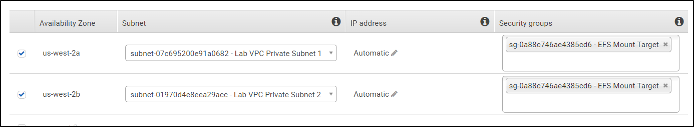
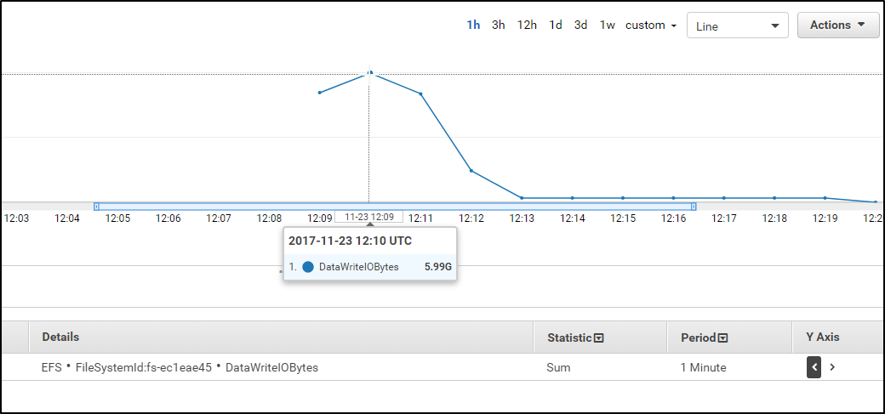

# モジュール 4 - ガイド付きラボ: Amazon Elastic File System (Amazon EFS) の導入
[//]: # "SKU: ILT-TF-200-ACACAD-2    Source Course: SPL-151"

## ラボの概要と目標
このラボでは、AWS マネジメントコンソールでの Amazon Elastic File System (Amazon EFS) の使用について確認します。

このラボを完了すると、次のことができるようになります。

- AWS マネジメントコンソールにログインする

- Amazon EFS ファイルシステムを作成する

- Amazon Linux を実行する Amazon Elastic Compute Cloud (Amazon EC2) インスタンスにログインする

- ファイルシステムを EC2 インスタンスにマウントする

- ファイルシステムのパフォーマンスを検証およびモニタリングする

<br/>

## 所要時間

このラボは、修了までに約 **20 分**かかります。

<br/>

## AWS サービスの制限事項

このラボ環境では、AWS のサービスとサービスアクションへのアクセスが、ラボの手順を完了するために必要なものに制限されています。他のサービスへのアクセスや、このラボで説明されているサービス以外のアクションを実行しようとすると、エラーが発生することがあります。

<br/>

## AWS マネジメントコンソールにアクセスする

1. この手順の上部にある <span id="ssb_voc_grey">Start Lab</span> をクリックし、ラボを起動します。

   [**Start Lab**] パネルが開き、ラボのステータスが表示されます。

   <i class="fas fa-info-circle"></i> **ヒント**: ラボの完了までにさらに時間が必要な場合は、<span id="ssb_voc_grey">Start Lab</span> ボタンをもう一度選択して、この環境のタイマーを再開します。

2. \[**Start Lab**] パネルに **Lab status: ready** というメッセージが表示されたら [**X**] をクリックしてパネルを閉じます。

3. この手順の上部にある <span id="ssb_voc_grey">AWS</span> をクリックします。

   このアクションにより、新しいブラウザタブで AWS マネジメントコンソールが開き、ユーザーは自動的にログインします。

   <i class="fas fa-exclamation-triangle"></i> **ヒント**: 新しいブラウザタブが開かない場合、通常、ブラウザによってサイトのポップアップウィンドウの表示がブロックされたというメッセージが表示されたバナーまたはアイコンがブラウザの上部に表示されます。バナーまたはアイコンを選択して [**ポップアップを許可**] を選択してください。

4. **AWS マネジメントコンソール**タブがこの手順と並べて表示されるようにします。両方のブラウザタブを同時に開いておくと、ラボのステップを実行しやすくなります。

   <i class="fas fa-exclamation-triangle"></i> **特に指示がない限り、リージョンを変更しないでください**。

<br/>

## タスク 1: セキュリティグループを作成して EFS ファイルシステムにアクセスする

マウントターゲットに関連付けるセキュリティグループでは、**ネットワークファイルシステム（NFS）のポート 2049 で TCP のインバウンドアクセスを許可する必要があります**。このセキュリティグループを作成および設定し、EFS のマウントターゲットにアタッチします。


5. **AWS マネジメントコンソール**の <span id="ssb_services">サービス</span> で [**EC2**] をクリックします。

6. 左側のナビゲーションペインで [**セキュリティグループ**] をクリックします。

7. **EFSClient** セキュリティグループの**セキュリティグループ ID** をテキストエディタにコピーします。

   グループ ID は **sg-03727965651b6659b** のような形式になります。

8. <span id="ssb_orange">セキュリティグループを作成</span> をクリックし、次のように設定します。

   <a id='securitygroup'></a>

   * **セキュリティグループ名:** `EFS Mount Target`
   * **説明:** `Inbound NFS access from EFS clients`
   * **VPC:** *Lab VPC*

9. ２つのセクションで以下のように設定します。

   \[**インバウンドルール**] セクションの下で <span id="ssb_white">ルールを追加</span> をクリックし、次のように設定します。

   * **タイプ:** **NFS**
   * **リソースタイプ:**
      * **カスタム**
      * [**カスタム**] ボックスで、テキストエディタにコピーしたセキュリティグループの**セキュリティグループ ID** を貼り付けます。

   \[**Tags**] セクションの下で <span id="ssb_white">新規タグを追加</span> をクリックし、次のように設定します。

   * **キー:**  `Name`
   * **値:**  `EFS Mount Target`

   <span id="ssb_orange">セキュリティグループを作成</span> をクリックします。

<br/>

## タスク 2: EFS ファイルシステムを作成する

EFS ファイルシステムは、同じリージョン内の異なるアベイラビリティーゾーンで実行されている複数の EC2 インスタンスにマウントできます。これらのインスタンスは、各**アベイラビリティーゾーン**内に作成された**マウントターゲット**を使用し、標準の NFSv4.1 セマンティクスを使用してファイルシステムをマウントします。同時に 1 つの Virtual Private Cloud (VPC) でのみ、インスタンスにファイルシステムをマウントできます。ファイルシステムと VPC は両方とも同じリージョンに配置する必要があります。


10. <span id="ssb_services">サービス</span> で [**EFS**] をクリックします。

11. <span id="ssb_orange">ファイルシステムの作成</span> をクリックします。

12. \[**ファイルシステムの作成**] ウィンドウで、<span id="ssb_white">カスタマイズ</span> をクリックします。

13. **ステップ 1** で、次の操作を実行します。

    - <i class="far fa-square"></i> **自動バックアップを有効化** チェックボックスをオフにします。
    - [**ライフサイクル管理**] ドロップダウンの一覧から [**なし**] を選択します。
    - [**タグ**] セクションで、次のように設定します。
       - **タグキー:** `Name`
       - **タグ値:** `My First EFS File System`

14. <span id="ssb_orange">次へ</span> をクリックします。

15. \[**Virtual Private Cloud (VPC)**] ドロップダウンの一覧から [**Lab VPC**] を選択します。

16. 各セキュリティグループの default の<i class="fas fa-times"></i>をクリックし、各**アベイラビリティーゾーン**のマウントターゲットから default のセキュリティグループをデタッチします。

17. 次の操作を実行して、各**アベイラビリティーゾーン**のマウントターゲットに **EFS Mount Targat** セキュリティグループをアタッチします。

    * 各 [**セキュリティグループ**] ドロップダウンの一覧の矢印をクリックします。
    * [**EFS Mount Targat**] を選択します。

      マウントターゲットが各サブネットに作成されます。

   マウントターゲットは次の例のようになります。図には、**EFS Mount Targat** セキュリティグループを使用する **Lab VPC** 内の 2 つのマウントターゲットが示されています。ラボでは Lab VPCを使用してください。



18. <span id="ssb_orange">次へ</span> をクリックします。

19. **ステップ 3** で、<span id="ssb_orange">次へ</span> をクリックします。

20. **ステップ 4** で、次の操作を実行します。

    * 設定を確認します。
    * <span id="ssb_orange">作成</span> をクリックします。

<i class="far fa-thumbs-up"></i> おめでとうございます! Lab VPC に新しい EFS ファイルシステムと各 Lab VPC サブネットにマウントターゲットが作成されました。数秒後に、ファイルシステムの [**ファイルシステムの状態**] が [**利用可能**] に変わります。その 2～3 分後にマウントターゲットの状態も同様に変わります。

各マウントターゲットの [**マウントターゲットの状態**] が [**利用可能**] になったら、次のステップに進みます。2～3 分後に画面の更新ボタンを選択して進捗状況を確認します。

<br/>

## タスク 3: SSH を介して EC2 インスタンスに接続する

このタスクでは、Secure Shell (SSH) を使用して EC2 インスタンスに接続します。

### <i class="fab fa-windows"></i>Microsoft Windows ユーザーの場合

<i class="fas fa-comment"></i> この手順は Microsoft Windows ユーザーのみを対象としています。macOS または Linux をお使いの場合は、<a href="#ssh-MACLinux">次のセクションに進んでください</a>。
​

21. 現在読んでいる手順の上部にある<span id="ssb_voc_grey">Details</span> ドロップダウンメニューから <span id="ssb_voc_grey">Show</span> を選択します。

[**Credentials**] ウィンドウが開きます。

22. \[**Download PPK**] をクリックし、**labsuser.ppk** ファイルを保存します。

**注意:** 通常はブラウザによってファイルは **Download** ディレクトリに保存されます。

23. **EC2PublicIP** アドレスが表示される場合は、そのアドレスを書き留めます。

24. \[**X**] をクリックして [**Credentials**] パネルを閉じます。

25. SSH を使用して EC2 インスタンスにアクセスするには、**PuTTY** を使用する必要があります。お使いのコンピュータに PuTTY がインストールされていない場合は、<a href="https://the.earth.li/~sgtatham/putty/latest/w64/putty.exe">PuTTY をダウンロードします</a>。

26. **putty.exe** を開きます。

27. PuTTY セッションを長時間維持するには、PuTTY タイムアウトを設定します。

* [**Connection**] をクリックします
* **Seconds between Keepalives**: `30`

28. 次の手順に従って、PuTTY セッションを設定します。

* [**Sesson**] をクリックします。
* **Host Name (or IP address):** 先ほど書き留めたインスタンスの **EC2PublicIP** を貼り付けます。
   * または、Amazon EC2 コンソールに戻って [**インスタンス**] をクリックします。
   * 接続するインスタンスをクリックします。
   * [**詳細**] タブで、**パブリック IPv4 アドレス** の値をコピーします。
* PuTTY に戻り、[**Connection**] の下の <i class="far fa-plus-square"></i> **SSH** を展開します。
* [**Auth**] をクリックします（展開しないでください）。
* [**Browse**] をクリックします。
* ダウンロードした **labsuser.ppk** ファイルを参照して選択し、[**開く**] をクリックします。
* もう一度 [**Open**] をクリックします。


29. ホストを承認して接続するには、[**はい**] をクリックします。

30. **Login as** と表示されたら `ec2-user` と入力します。

   このアクションにより、EC2 インスタンスに接続されます。

31. Microsoft Windows ユーザーの場合: <a href="#ssh-after">このリンクを選択して、次のタスクに進んでください。</a>


<a id='ssh-MACLinux'></a>

### Mac OS<span style="font-size: 30px; color: #808080;"><i class="fab fa-apple"></i></span> ユーザーおよび Linux <span style="font-size: 30px; "><i class="fab fa-linux"></i></span>ユーザー

この手順は macOS ユーザーと Linux ユーザーのみを対象としています。Windows ユーザーの場合は、<a href="#ssh-after">次のタスクに進みます。</a>

32. 現在読んでいる手順の上部にある<span id="ssb_voc_grey">Details</span>ドロップダウンメニューから <span id="ssb_voc_grey">Show</span> を選択します。

   [**Credentials**] ウィンドウが開きます。

33. \[**Download PEM**] をクリックし、**labsuser.pem** ファイルを保存します。

34. **EC2PublicIP** アドレスが表示される場合は、そのアドレスを書き留めます。

35. \[**X**] をクリックして [**Credentials**] パネルを閉じます。

36. ターミナルウィンドウを開き、`cd` コマンドを使用して、ディレクトリを **labsuser.pem** ファイルをダウンロードしたディレクトリに変更します。

    例えば、**labsuser.pem** ファイルが **Download** ディレクトリに保存されている場合は、次のコマンドを実行します。

   ```bash
       cd ~/Downloads
       ```

37. 次のコマンドを実行して、キーのアクセス許可を読み取り専用に変更します。

   ```bash
       chmod 400 labsuser.pem
       ```

38. 次のコマンドを実行します（**<public-ip\>** を先ほどコピーした **EC2PublicIP** アドレスに置き換えます）。

   * または、Amazon EC2 コンソールに戻って [**インスタンス**] を選択し、オンプレミスインスタンスの IP アドレスを探します。
   * 接続するインスタンスをクリックします。
   * [**Details**] タブで、**パブリック IPv4 アドレス** の値をコピーします。

     ```bash
     ssh -i labsuser.pem ec2-user@<public-ip>
     ```

39. リモート SSH サーバーへの最初の接続を許可するかどうかを確認するプロンプトが表示されたら、`yes` と入力します。

    認証にキーペアを使用しているため、パスワードの入力は要求されません。

<a id='ssh-after'></a>

<br/>

## タスク 4: 新しいディレクトリを作成して EFS ファイルシステムをマウントする

<i class="fas fa-info-circle" aria-hidden="true"></i>Amazon EFS は、EC2 インスタンスにファイルシステムをマウントする際に、NFSv4.1 および NFSv4.0 プロトコルをサポートします。NFSv4.0 はサポートされますが、NFSv4.1 を使用することをお勧めします。EFS ファイルシステムを EC2 インスタンスにマウントするには、選択した NFSv4 プロトコルをサポートする NFS クライアントも使用する必要があります。このラボの一部として作成された EC2 インスタンスには、NFSv4.1 クライアントが既にインストールされています。


40. **AWS マネジメントコンソール**に戻り、<span id="ssb_services">サービス</span>で [**EFS**] をクリックします。

41. **My First EFS File System** をクリックします。

42. **Amazon EFS コンソール**で <span id="ssb_orange">アタッチ</span> をクリックして Amazon EC2 のマウントコマンドを開きます。

43. SSH セッションに戻り、必要なユーティリティをインストールするための以下のコマンドをコピーアンドペースト（または手入力）します。

    ```
    sudo yum install -y amazon-efs-utils
    ```

   **ヒント :** ブラウザのターミナルに貼り付けるには、コマンドプロンプトのすぐ右側にカーソルを置き、右クリックして貼り付けオプションを表示します。

44. SSH セッションで、`sudo mkdir efs`と入力して新しいディレクトリを作成します。

45. **Amazon EFS コンソール**に戻り、先ほど開いた Amazon EC2 のマウントコマンドの画面を表示します。

46. \[**NFS クライアントの使用**] セクションのコマンド全体をコピーします。

    マウントコマンドは、次の例のようになります。

    `sudo mount -t nfs4 -o nfsvers=4.1,rsize=1048576,wsize=1048576,hard,timeo=600,retrans=2,noresvport fs-bce57914.efs.us-west-2.amazonaws.com:/ efs`

    <i class="fas fa-comment" aria-hidden="true"></i> 準備されている `sudo mount...` コマンドでは、デフォルトの Linux マウントオプションが使用されます。

47. Linux の SSH セッションで、Amazon EFS ファイルシステムを次の方法でマウントします。

   * コマンドを貼り付ける
   * **Enter** キーを押す


48. 次のコマンドを入力すると、使用可能なディスク容量と使用済みディスク容量のすべての概要が表示されます。

   `sudo df -hT`

   このスクリーンショットは、次の**ディスクファイルシステム**のコマンドの出力例です。

   `df -hT`

   マウントした EFS ファイルシステムの **Type** と **Size** に注意してください。


<br/>

## タスク 5: 新しい EFS ファイルシステムのパフォーマンス動作を検証する


### Flexible IO を使用してパフォーマンスを検証する

<i class="fas fa-info-circle"></i> Flexible IO (fio) は、Linux 用の合成 I/O ベンチマークユーティリティです。Linux の I/O サブシステムのベンチマークとテストに使用されます。起動時に、**fio** は EC2 インスタンスに自動的にインストールされます。

49. 次のコマンドを入力して、ファイルシステムの書き込みパフォーマンス特性を調べます。

    ```
    sudo fio --name=fio-efs --filesize=10G --filename=./efs/fio-efs-test.img --bs=1M --nrfiles=1 --direct=1 --sync=0 --rw=write --iodepth=200 --ioengine=libaio
    ```

<i class="fas fa-comment"></i>`fio` コマンドは、完了までに 5～10 分かかります。出力は、以下のスクリーンショットの例のようになります。`fio` コマンドの出力、特にこの書き込みテストの概略ステータス情報を確認してください。


<br/>

### Amazon CloudWatch を使ってパフォーマンスをモニタリングする

50. **AWS マネジメントコンソール**の <span id="ssb_services">サービス</span> で [**CloudWatch**] をクリックします。

51. 左側のナビゲーションペインで、[**メトリクス**] をクリックします。

52. \[**すべてのメトリクス**] タブで、[**EFS**] をクリックします。

53. \[**ファイルシステムメトリクス**] をクリックします。

54. **PermittedThroughput** というメトリクス名が含まれる行を選択します。

   <i class="fas fa-comment"></i> **PermittedThroughput** などの利用可能なメトリクスすべてが計算されて入力されるまでに、2～3 分待って画面を数回更新することが必要になる場合があります。

55. グラフ上で、データラインを選択してドラッグします。折れ線グラフが表示されない場合は、グラフの時間範囲を調整して、`fio` コマンドを実行した期間が表示されるようにします。


56. グラフのデータライン上にポインタを置きます。値は **105M** にしてください。


   Amazon EFS のスループットは、ファイルシステムの拡張に合わせてスケールされます。ファイルベースのワークロードは、通常、スパイクがあります。短期間は高レベルのスループットになり、それ以外の期間は低レベルのスループットになります。このような挙動のため、Amazon EFS は、一定期間、高レベルのスループットまでバーストするように設計されています。サイズに関係なく、すべてのファイルシステムは 100 MiB/秒のスループットまでバーストすることができます。EFS ファイルシステムのパフォーマンス特性の詳細については、公式の<a href="http://docs.aws.amazon.com/efs/latest/ug/performance.html" target="_blank">Amazon Elastic File System ドキュメント</a> を参照してください。

57. \[**すべてのメトリクス**] タブで、[**PermittedThroughput**] のチェックボックスを**オフ**にします。

58. \[**DataWriteIOBytes**] のチェックボックスをオンにします。

   <i class="fas fa-comment"></i> メトリクスのリストに **DataWriteIOBytes** が表示されない場合は、[**ファイルシステムメトリクス**] 検索を使用して検索します。

59. \[**グラフ化したメトリクス**] タブをクリックします。

60. \[**統計**] 列で、[**合計**] を選択します。

61. \[**期間**] 列で、[**1 分**] を選択します。

62. 折れ線グラフの頂上にポインタを置きます。この数字（バイト単位）を読み取り、秒単位の期間（60 秒）で割ります。この結果が、テスト時のファイルシステムの書き込みスループット（B/秒）です。



   ファイルシステムで利用可能なスループットは、ファイルシステムの拡張に合わせてスケールされます。すべてのファイルシステムは、ストレージ 1 TiB あたり 50 MiB/秒という一貫したベースラインパフォーマンスを提供しています。また、すべてのファイルシステムは（サイズに関係なく）100 MiB/秒までバーストできます。1 TB を超えるファイルシステムでは、ストレージ 1 TiB あたり 100 MiB/秒までバーストできます。ファイルシステムにデータを追加すると、ファイルシステムで利用可能な最大スループットは、ストレージと共に直線的かつ自動的にスケールされます。

   ファイルシステムのスループットは、ファイルシステムに接続されているすべての EC2 インスタンスで共有されます。EFS ファイルシステムのパフォーマンス特性の詳細については、公式の<a href="http://docs.aws.amazon.com/efs/latest/ug/performance.html" target="_blank">Amazon Elastic File System ドキュメント</a> を参照してください。

   <i class="far fa-thumbs-up" style="color:blue"></i>おめでとうございます! EFS ファイルシステムを作成して EC2 インスタンスにマウントし、I/O ベンチマークテストを実行してパフォーマンス特性を検証しました。


<br/>

## 作業内容を送信する

63. この手順の上部にある <span id="ssb_blue">Submit</span> をクリックして進捗情報を記録し、プロンプトが表示されたら [**Yes**] をクリックします。

64. 数分経っても結果が表示されない場合は、この手順の上部に戻り、<span id="ssb_voc_grey">Grades</span> をクリックします。

**ヒント**: 作業内容は何度も送信できます。作業内容を変更したら、再度 [**Submit**] をクリックします。最終送信分がこのラボの作業内容として記録されます。

65. 作業に関する詳細なフィードバックを参照するには、<span id="ssb_voc_grey">Details </span> ドロップダウンメニューから <i class="fas fa-caret-right"></i> **View Submission Report** を選択します。


<br/>

## ラボの終了<i class="fas fa-graduation-cap"></i>

<i class="fas fa-flag-checkered"></i>お疲れ様でした。以上でラボは終了です。


66. ラボを終了するには、このページの上部にある <span id="ssb_voc_grey">End Lab</span> をクリックし、<span id="ssb_blue">Yes</span> をクリックします。

   パネルに **DELETE has been initiated... You may close this message box now** というメッセージが表示されます。

67. 右上隅の [**X**] をクリックしてパネルを閉じます。


**©2020 Amazon Web Services, Inc. and its affiliates. All rights reserved. このトレーニング内容の全体または一部を複製または再配布することは、Amazon Web Services, Inc. の書面による事前の許可がある場合を除き、禁じられています。商業目的のコピー、貸与、または販売を禁止します。**
