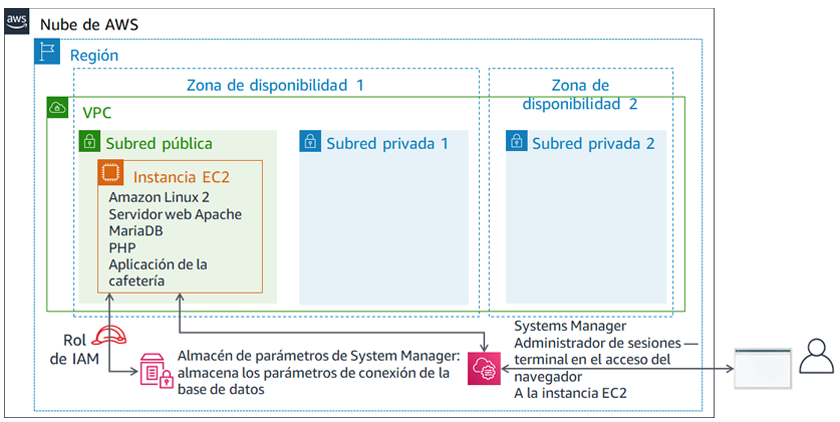

# Módulo 5 - Laboratorio de desafíos: Migrar una base de datos a Amazon RDS
<!--Lab borrows from ACOv1 activity 6, but is significantly modified and extended-->

## Caso

Actualmente, la cafetería utiliza una única instancia EC2 para alojar su servidor web, base de datos y código de aplicación.

Mientras tanto, el negocio de la cafetería ha crecido. El historial de pedidos que se almacena en la base de datos proporciona información empresarial valiosa que el personal de la cafetería no quiere perder. Martha usa los datos para la contabilidad, y Frank los mira de vez en cuando para planificar qué cantidad de cada tipo de postre debe hornear.

Sofía tiene otras preocupaciones. La base de datos se debe actualizar y se le deben aplicar parches de manera constante, y no siempre tiene tiempo para realizar estas tareas. Además, administrar la base de datos es una habilidad especializada. Capacitar a otras personas para que administren las bases de datos no es algo a lo que ella quiera dedicar tiempo. Mientras tanto, a Sofía también le preocupa que la cafetería no está haciendo copias de seguridad de los datos con la frecuencia que debería.

Por último, Martha también quiere reducir los costos de mano de obra relacionados con la inversión en aprendizaje técnico que se necesita para administrar la base de datos.


## Información general y objetivos del laboratorio

En este laboratorio, migrará datos de una base de datos en una instancia de Amazon Elastic Compute Cloud (Amazon EC2) a Amazon Relational Database Service (Amazon RDS). En concreto, migrará una base de datos de MariaDB que se ejecuta en una instancia EC2 a una base de datos de MariaDB que se ejecuta en Amazon RDS. También actualizará la aplicación web de la cafetería para utilizar la nueva base de datos para almacenar los datos de todos los pedidos futuros.

Después de completar este laboratorio, debería ser capaz de lo siguiente:

- Crear una instancia de base de datos de RDS

- Exportar datos de la base de datos de MariaDB mediante mysqldump

- Conectar un cliente SQL a una base de datos de RDS

- Migrar datos de una base de datos de MariaDB que se ejecuta en una instancia EC2 a una instancia de base de datos de RDS.

- Configurar una aplicación web para utilizar la nueva instancia de base de datos de RDS para el almacenamiento de datos


Cuando *inicie* el laboratorio, ya estarán creados los siguientes recursos en la cuenta de AWS:



Cuando *termine* este laboratorio, la arquitectura se verá como en el siguiente ejemplo:


## Duración
Para completar este laboratorio, se necesitan aproximadamente **80 minutos**.


## Restricciones de los servicios de AWS
En este entorno de laboratorio, el acceso a los servicios y las acciones de los servicios de AWS puede restringirse a los que se necesiten para cumplir las instrucciones del laboratorio. Es posible que se produzcan errores si intenta acceder a otros servicios o hacer acciones que no sean las que se describen en este laboratorio.


## Acceso a la consola de administración de AWS

1. En la parte superior de estas instrucciones, elija <span id="ssb_voc_grey">Start Lab</span> (Iniciar laboratorio) y comience a trabajar en él.

   Se abrirá el panel **Start Lab** (Iniciar laboratorio), donde se muestra el estado del laboratorio.

   <i class="fas fa-info-circle"></i> **Sugerencia**: Si necesita más tiempo para completar el laboratorio, vuelva a hacer clic en el botón <span id="ssb_voc_grey">Start Lab</span> (Iniciar laboratorio) para reiniciar el temporizador del entorno.

2. Espere hasta que el panel **Start Lab** (Iniciar laboratorio) muestre el mensaje *Lab Status: ready (Estado del laboratorio: listo)* y, luego, cierre el panel haciendo clic en la **X**.

3. En la parte superior de estas instrucciones, elija <span id="ssb_voc_grey">AWS</span>.

   Con esta acción, se abrirá la consola de administración de AWS en una nueva pestaña del navegador, y el sistema iniciará su sesión de forma automática.

   <i class="fas fa-exclamation-triangle"></i> **Sugerencia**: Si no se abre una nueva pestaña del navegador, por lo general habrá un aviso o un icono en la parte superior, el cual indicará que el navegador impide que el sitio abra ventanas emergentes. Haga clic en el aviso o el icono y elija **Allow pop ups** (Permitir ventanas emergentes).

4. Ubique la pestaña de la **consola de administración de AWS** de modo que aparezca junto con estas instrucciones. El método más óptimo sería tener ambas pestañas del navegador abiertas al mismo tiempo para que pueda seguir los pasos del laboratorio más fácilmente.

   <i class="fas fa-exclamation-triangle"></i> **No cambie la región a menos que se le indique expresamente que debe hacerlo**.

   **Sugerencia**: Para ocultar el terminal, puede desactivar la casilla **Terminal** en la parte superior de la pantalla.


## Solicitud de negocio: Crear una instancia RDS para la aplicación de la cafetería (Desafío n.º 1)

Después de una conversación con Olivia, la arquitecta de soluciones de AWS que con frecuencia va a tomar un café, Sofía decidió que la cafetería necesita una solución de base de datos que sea más fácil de mantener. Además, la base de datos debe proporcionar características esenciales como durabilidad, escalabilidad y alto rendimiento.


En la primera parte de este laboratorio, asumirá el rol de Sofía. Creará una instancia RDS que la cafetería puede utilizar como capa de almacenamiento de datos para el sitio web de la cafetería. También se conectará a la instancia EC2 y analizará los detalles de la aplicación web de la cafetería.


### Tarea 1: Crear una instancia RDS


Su primer desafío en este laboratorio es crear una instancia RDS.

5. Cree una instancia RDS que cumpla con estas especificaciones. (Cuando envíe su trabajo al final de este laboratorio, se comprobarán muchas de estas configuraciones. Para obtener todo el crédito, siga estas directrices).

   * **Tipo de motor**: *MariaDB*

   * **Plantillas**: *Dev/Test (desarrollo y pruebas)*

   * **Identificador de instancias de base de datos**: `CafeDatabase`

   * **Username** (Nombre de usuario): `admin`

   * **Contraseña**: `Caf3DbPassw0rd!`
      * <i class="fas fa-exclamation-triangle"></i>Debe usar esta contraseña exacta.
      * **Sugerencia**: Copie y pegue la contraseña para configurarla.

   * **Clase de instancia de base de datos**: *db.t2.micro*

   * **Tipo de almacenamiento**: *uso general (SSD)*

   * **Almacenamiento asignado**: `20` GiB

   * *No* cree una instancia en espera

   * Colóquela en **Lab VPC**

   * **Grupo de subred**: `lab-db-subnet-group`, donde la base de datos *no* es accesible públicamente.

   * Elija el **grupo de seguridad de VPC** existente denominado `dbSG`y *anule la selección* del grupo de seguridad `predeterminado`.

   * **Zona de disponibilidad**: elija la primera zona de disponibilidad de la lista que termine en `a`. Por ejemplo, si la región es *us-east-1*, elija **us-east-1a**.

   * **Puerto de base de datos**: mantenga el puerto TCP predeterminado *3306*.

   * El monitoreo mejorado *no* se admite en el entorno del laboratorio. Borre la configuración predeterminada.


**Importante**: No espere a que la base de datos finalice el proceso de creación. En su lugar, después de haber iniciado correctamente el proceso de creación de la base de datos, continúe con el siguiente paso.


### Tarea 2: Análisis de la implementación de las aplicaciones existentes de la cafetería

En esta tarea, se conectará a la instancia EC2 existente que ejecuta la aplicación actual de la cafetería.


6. Examine la consola de EC2 y elija **Running Instances** (Instancias en ejecución).

   Observe la instancia en ejecución denominada **CafeServer**. Esta instancia EC2 se creó al iniciar el laboratorio.

7. Pruebe la aplicación de la cafetería.

   - Abra una nueva pestaña del navegador y cargue la aplicación de la cafetería en `http://<public-ip-address>/cafe`.

      **Nota**: Reemplace <*public-ip-address*> con la dirección IP pública IPv4 real de la instancia *CafeServer*.

   - Examine la página **Menu** (Menú) y pruebe realizar un pedido.

      Para hacerlo, cambie la cantidad de un elemento del menú, al menos, a *1* y elija **Submit Order** (Enviar pedido).

      Debería aparecer una página de **Order Confirmation** (Confirmación del pedido), que indica que el sitio web de la cafetería está funcionando según lo previsto.

   - Elija **Order History** (Historial de pedidos).

      La página muestra que se realizaron muchos pedidos. La base de datos actual contiene pedidos de clientes anteriores que migrará a una base de datos alojada en Amazon RDS.


8. Conéctese a la instancia EC2 mediante AWS Systems Manager para acceder a una sesión de terminal en el navegador.

   - Nuevamente en la consola de administración de AWS, vaya hasta la consola de **Systems Manager** y elija **Session Manager** (Administrador de sesiones).

   - Inicie una sesión y conéctese a **CafeServer**.

      Ahora debería tener abierta una nueva pestaña del navegador, con una sesión de terminal conectada a la instancia EC2.

   - En la pregunta, introduzca los siguientes comandos:

      ```bash
    bash
      sudo su
    su ec2-user
      whoami
    cd /home/ec2-user/
      ```

      **Análisis**: el primer comando proporcionó un shell de Bash. El segundo comando cambió la sesión para utilizar la cuenta del usuario raíz en la instancia EC2. El tercer comando cambió a la cuenta *ec2-user*. El cuarto comando debería haber devuelto un resultado que confirme que está conectado como ec2-user. El último comando cambia su terminal al directorio de inicio del ec2-user.


**Nota**: El agente de Systems Manager (*agente ssm*) se instala de forma predeterminada en todas las instancias de Amazon Linux 2 (y en algunos otros tipos de SO). Cuando inició el laboratorio y se creó la instancia EC2, los datos de usuario especificaron que el servicio del agente ssm debería iniciarse en la instancia. Además, se asoció a la instancia EC2 un rol de AWS Identity and Access Management (IAM) que incluye una política de IAM denominada *AmazonSSMManagedInstanceCore*. Estas dos acciones hicieron accesible la instancia a través del administrador de sesiones de Systems Manager.


## Nuevo requisito empresarial: exportar datos de la antigua base de datos y establecer una conexión con la nueva base de datos (desafío n.º 2)

Ahora que creó una nueva instancia RDS, puede pasar al siguiente paso del plan de migración de la base de datos de la cafetería. A continuación, exportará los datos de la base de datos que utiliza actualmente la aplicación de la cafetería. También establecerá una conexión de red desde la instancia EC2 (donde se ejecuta la aplicación) a la nueva instancia de base de datos de RDS.

En este desafío, continúa como Sofía para completar estas tareas.


### Tarea 3: Trabajo con la base de datos en la instancia EC2

En esta tarea, observará detalles sobre la base de datos MariaDB que se ejecuta en la instancia EC2. A continuación, exportará los datos del historial de pedidos existentes de la base de datos mediante la utilidad *mysqldump*.


9. Observe los detalles de la base de datos que se ejecuta en la instancia EC2.

   En el terminal, ejecute estos comandos:

    ```bash
    service mariadb status
    mysql --version
    ```

   El resultado debería mostrar que la base de datos MariaDB instalada localmente en esta instancia EC2 se está ejecutando. También debería mostrar el número de versión de la base de datos.

   Deje esta pestaña del navegador abierta. La usará en todo este laboratorio.


10. Vuelva a la pestaña del navegador con la consola de **AWS Systems Manager** abierta.


11. En el panel de la izquierda, debajo de **Application Management** (Administración de aplicaciones), elija **Parameter Store** (Almacén de parámetros).

    Observe que aquí se almacenan siete parámetros. El código PHP de la aplicación de la cafetería hace referencia a estos valores, por ejemplo, para recuperar la información de conexión de la base de datos.

    - Elija el parámetro `/cafe/dbPassword` y copie el **valor** en el portapapeles. Usará este valor en un momento.


12. Conéctese a la base de datos que se está ejecutando en la instancia EC2.

    En la pestaña del navegador con el terminal de Bash, conecte el cliente MySQL basado en terminales a la base de datos ejecutando este comando:

    ```bash
    mysql -u root -p
    ```

    Cuando se le solicite la contraseña de la base de datos, pegue el valor del parámetro *dbPassword* que copió hace un momento.

    Ahora debería ver el mensaje `mariadb>`. Este mensaje indica que ahora está conectado a la base de datos MariaDB que se ejecuta en esta instancia EC2.


13. Observe los datos de la base de datos existente.

    Para observar el contenido de la base de datos, introduzca los siguientes comandos. En particular, revisará las tablas que mantienen la aplicación web de la cafetería.

    ```sql
    show databases;
    use cafe_db;
    show tables;
    select * from `order`;
    ```

    Estos comandos muestran todos los pedidos realizados, incluido el pedido que realizó hace un momento.

    ```sql
    select * from `order_item`;
    ```

    Este comando muestra los elementos de la línea de pedidos. Cada número de pedido tiene una fila para cada tipo de elemento que se pidió, con detalles sobre la cantidad de cada elemento y el precio.

    Todos estos datos deben migrarse a la nueva base de datos.

14. Salga del cliente SQL.

    ```sql
    exit;
    ```


15. Capture los datos existentes en un archivo mediante la utilidad *mysqldump*.

    ```bash
    mysqldump --databases cafe_db -u root -p > CafeDbDump.sql
    ```

    Cuando se le solicite la contraseña de la base de datos, pegue el valor *dbPassword* del almacén de parámetros de Systems Manager.


16. Confirme que *mysqldump* se realizó correctamente.

    - Ejecute el comando `ls` en el terminal. El resultado debería mostrar que se creó el archivo `CafeDbDump.sql`.

    - Ejecute el comando `cat CafeDbDump.sql` para ver el contenido del archivo.

       En la siguiente sección del laboratorio, importará estos datos a la nueva base de datos de RDS.


### Tarea 4: Trabajar con la base de datos de RDS

En esta tarea, primero responderá algunas preguntas acerca de la instancia RDS que creó. A continuación, confirmará que puede conectarse a la instancia RDS.


17. En la consola de administración de AWS, vuelva a la consola de servicio **RDS** y confirme que la instancia RDS *cafedatabase* que creó ya esté disponible.


#### Responder las preguntas sobre la instancia RDS

Sus respuestas se registrarán cuando haga clic el botón azul **Submit** (Enviar) al final del laboratorio.


18. Acceda a las preguntas de este laboratorio.

    - Por encima de estas instrucciones, elija **Details > Show** (Detalles > Mostrar).

    - Elija el enlace **Access the multiple choice questions** (Acceder a las preguntas de opción múltiple).

19. En la página que cargó, responda las primeras cuatro preguntas:

    - Pregunta 1: ¿Dónde se ejecuta la instancia RDS?

    - Pregunta 2: ¿La instancia RDS tiene una dirección IP pública IPv4 asignada?

    - Pregunta 3: ¿Cuál es la etiqueta **Name** (Nombre) aplicada a la subred en la que se está ejecutando la instancia RDS?

    - Pregunta 4: ¿Cuántas reglas del grupo de seguridad se definen para la instancia RDS?


20. Establezca una conexión de red desde el terminal que se ejecuta en la instancia EC2 a la nueva instancia RDS.

Aquí tiene algunas sugerencias que lo ayudarán a comenzar:

<details>
  <summary>
  <b>Sugerencia n.º 1</b> (haga clic para ampliar)
  </summary>
	Esta es la sintaxis que puede usar para conectarse:
	<code> mysql -u admin -p --host &lt;rds-endpoint></code>
<br>Reemplace &lt;rds-endpoint> con el punto de enlace de RDS real de la instancia RDS.<br>Después de ejecutar el comando, se le pedirá que escriba la contraseña de la instancia RDS. Definió la contraseña cuando creó la instancia RDS.
</details>
<br>
<details>
  <summary>
  <b>Sugerencia n.º 2</b> (haga clic para ampliar)
  </summary>
	Incluso si introduce correctamente el punto de enlace de RDS y la contraseña de la base de datos, aún no podrá conectarse. Debe actualizar las reglas de entrada del grupo de seguridad en el que se ejecuta la instancia RDS. El software del cliente MySQL intenta conectarse a la base de datos en el puerto TCP 3306.
</details>
<br>
<details>
  <summary>
  <b>Sugerencia n.º 3</b> (haga clic para ampliar)
  </summary>
  Evite abrir el puerto 3306 a <i>todas</i> las direcciones IP de origen, ya que no sería seguro. En su lugar, ábralo solo a los servidores del grupo de seguridad que utiliza la instancia EC2 desde la que se está conectando (intente escribir <code>sg-</code> en el campo de origen para ver las opciones).
</details>

<br>
<details>
  <summary>
  <b>Sugerencia n.º 4</b> (haga clic para ampliar)
  </summary>   
  Puede confirmar que la configuración del grupo de seguridad permite el tráfico en el puerto TCP 3306 desde la instancia EC2 a la base de datos. Intente ejecutar estos comandos en el terminal del administrador de sesiones de Systems Manager (reemplace<rds-endpoint> con el punto de enlace de RDS real):<br><code>nmap -Pn &lt;rds-endpoint></code><br>Si el resultado del comando muestra que el puerto 3306 está abierto para el servicio *mysql*, esto confirma que la configuración del grupo de seguridad permite el tráfico. <br>Si <i>nmap</i> muestra que el puerto está <i>abierto</i>, entonces el comando <code>mysql -u admin -p --host &lt;rds-endpoint></code> también debería funcionar. (Sin embargo, debe escribir correctamente la contraseña de la base de datos. Esta contraseña es la que estableció cuando creó la instancia).
</details>  
<br>

**Nota**: Si todavía no puede resolver el problema, le puede resultar útil enviar su trabajo, tal y como se documenta en la sección **Envío del trabajo** al final de las instrucciones de este laboratorio. El **informe de envío** que se genera puede proporcionar sugerencias adicionales para las partes del laboratorio que no completó correctamente. Puede enviar su trabajo tantas veces como desee. Solo se retiene la puntuación que obtiene la última vez que envía su trabajo.


Es importante confirmar que pueda conectarse a RDS MariaDB antes de pasar al siguiente paso. Si ya pudo conectarse, ¡felicitaciones!


21. Ejecute el comando `show databases;` (mostrar bases de datos). Debería mostrar este resultado:

    

    - Observe que la base de datos *cafe_db* aún no está en la lista. Se prevé esta situación porque no ha importado ningún dato.

    - Para desconectarse, ejecute el comando `exit;` (salir).


## Nuevo requisito empresarial: importar los datos y conectar la aplicación a la nueva base de datos (desafío n.º 3)

En el desafío anterior, exportó los datos de la base de datos que utiliza actualmente la aplicación de la cafetería. También estableció una conexión de red desde la instancia EC2 a la instancia RDS. Ahora puede trabajar en el siguiente requisito empresarial.

En este desafío, continuará con el rol de Sofía para importar los datos de la cafetería a la instancia de la base de datos de RDS. Después de completar la importación, configurará la aplicación para que utilice la nueva base de datos.


### Tarea 5: Importar los datos a la instancia de la base de datos de RDS

22. Importe los datos que exportó en la tarea 3 a la instancia de base de datos de RDS.

    - Para importar los datos, en el terminal, ejecute el siguiente comando (donde `<rds-endpoint>` es el punto de enlace real):

      ```bash
      mysql -u admin -p --host <rds-endpoint> < CafeDbDump.sql
      ```

    - Cuando se le solicite la contraseña, escriba la contraseña de la instancia RDS.

       Si no ve ningún error, es probable que el comando se haya ejecutado correctamente.


23. Confirme que se importaron los datos.

    - Para conectarse a la base de datos de RDS, ejecute este comando:

      ```
      mysql -u admin -p --host <rds-endpoint>
      ```

    - Cuando se le solicite la contraseña, escriba la contraseña de la instancia RDS.

    - Para confirmar que se importaron los datos, ejecute el siguiente comando:

      ```sql
      show databases;
      use cafe_db;
      show tables;
      select * from `order`;
      ```

    El resultado de la instrucción *select* debería mostrar al menos 24 órdenes en la base de datos.

    - Salga del cliente SQL:

      ```sql
      exit;
      ```


### Tarea 6: Conectar la aplicación de la cafetería a la nueva base de datos

En esta última tarea del laboratorio, se lo desafiará a conectar la aplicación de la cafetería a la nueva base de datos. También detendrá la base de datos que se ejecuta localmente en la instancia EC2.


24. Vuelva a la pestaña del navegador de la consola de **AWS Systems Manager**.


25. En el panel de la izquierda, elija **Parameter Store (Almacén de parámetros)**.

    Recuerde del laboratorio de desafíos anterior que el código PHP de la aplicación de la cafetería hace referencia a estos valores. Por ejemplo, utiliza los valores para recuperar la información de conexión de la base de datos.


26. Conecte la aplicación de la cafetería a la instancia RDS.

    Debido a que la información de conexión de la base de datos cambió, debe actualizar estos valores para conectar la aplicación a la nueva instancia de base de datos de RDS en lugar de a la base de datos que se ejecuta en la instancia EC2.

<details>
  <summary>
  <b>Sugerencia n.º 1</b> (haga clic para ampliar)
  </summary>
Después de actualizar a qué base de datos está conectada la aplicación, utilice la página <code>http://&lt;public-ip>/cafe/menu.php</code> para comprobar si actualizó correctamente la conexión.
</details>

<br>

<details>
  <summary>
  <b>Sugerencia n.º 2</b> (haga clic para ampliar)
  </summary>
El código PHP no necesita ninguna actualización. Además, la configuración de red no necesita ningún cambio adicional, si suponemos que completó correctamente el desafío anterior de este laboratorio. Las únicas actualizaciones que debe realizar serán para algunos valores en el almacén de parámetros de System Manager.
</details>
<br>

<details>
  <summary>
  <b>Sugerencia n.º 3</b> (haga clic para ampliar)
  </summary>
No es necesario actualizar los valores <i>currency</i>, <i>dbName</i>, <i>timeZone</i> y <i>showServerInfo</i>.
</details>
<br>

<details>
  <summary>
  <b>Sugerencia n.º 4</b> (haga clic para ampliar)
  </summary>
El valor <i>dbUrl</i> debe ser el valor del punto de enlace de RDS.
</details>
<br>

27. Confirme que su aplicación web ahora utiliza la nueva base de datos.

    - Detenga la base de datos que aún se está ejecutando en la instancia EC2. En el terminal, utilice este comando:

      ```bash
      sudo service mariadb stop
      ```

    - Cargue la página `http://<public-ip>/cafe/menu.php` y confirme que la aplicación siga en funcionamiento haciendo un pedido.

    - Elija **Order History** (Historial de pedidos). Su último pedido, y todos los demás pedidos anteriores, deberían estar allí. Estos pedidos son los datos que migró a la nueva base de datos.


## Noticias de la cafetería


Todos en la cafetería están contentos con los resultados de la migración de la base de datos. Sofía y Nikhil ahora tienen más tiempo libre los fines de semana, lo que significa que Frank y Martha ahorran dinero en costos de mano de obra.

Sofía se toma un momento para relajarse con sus amigos. Sin embargo, ya está pensando en las mejoras. Un buen paso siguiente sería reducir el tamaño del volumen de EBS que utiliza la instancia EC2. También podrían ahorrar cambiando el tipo de instancia EC2 a un tamaño más pequeño. Debido a que la base de datos ya no se ejecuta en la instancia EC2, la instancia ahora tiene espacio adicional en el disco duro, y es posible que no necesite tantos recursos de CPU y memoria.


## Envío del trabajo

28. En la parte superior de estas instrucciones, elija <span id="ssb_blue">Submit</span> (Enviar) para registrar su progreso y, cuando se le indique, elija **Yes** (Sí).

29. Si los resultados no se muestran después de algunos minutos, vuelva a la parte superior de estas instrucciones y elija <span id="ssb_voc_grey">Grades</span> (Resultados).

    **Sugerencia**: Puede enviar su trabajo varias veces. Después de realizar las modificaciones pertinentes, vuelva a elegir **Submit** (Enviar). Su último envío es el que se registrará para este laboratorio.

30. Para encontrar comentarios detallados sobre su trabajo, elija <span id="ssb_voc_grey">Details</span> (Detalles) seguido de <i class="fas fa-caret-right"></i> **View Submission Report** (Ver informe de envío).


## Fin del laboratorio

<i class="icon-flag-checkered"></i> ¡Felicitaciones! Ha completado el laboratorio.


31. Para confirmar que desea finalizar el laboratorio, haga clic en **<span id="ssb_voc_grey">End Lab</span>** (Finalizar laboratorio) en la parte superior de esta página y, a continuación, elija **<span id="ssb_blue">Yes</span>** (Sí).

    Debería aparecer un panel con el siguiente mensaje: *DELETE has been initiated… You may close this message box now (Se ha iniciado la ELIMINACIÓN… Ya puede cerrar este cuadro de mensaje).*


32. Para cerrar el panel, haga clic en la **X** de la esquina superior derecha.


*© 2020 Amazon Web Services, Inc. y sus empresas afiliadas. Todos los derechos reservados. Este contenido no puede reproducirse ni redistribuirse, total ni parcialmente, sin el permiso previo por escrito de Amazon Web Services, Inc. Queda prohibida la copia, el préstamo y la venta de carácter comercial.*
