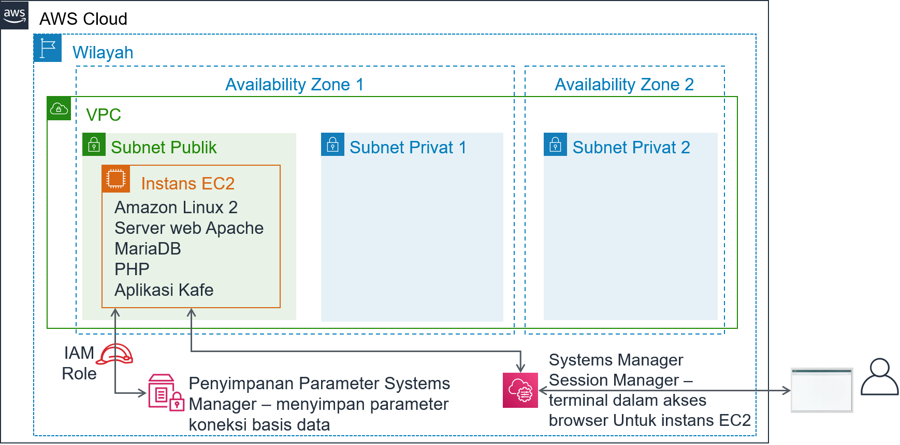
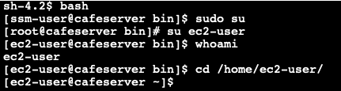

# Modul 5 - Lab Tantangan: Memigrasikan Basis Data ke Amazon RDS
<!--Lab borrows from ACOv1 activity 6, but is significantly modified and extended-->

## Skenario

Kafe saat ini menggunakan instans EC2 tunggal untuk meng-hosting server web, basis data, dan kode aplikasi mereka.

Sementara itu, bisnis kafe telah berkembang. Riwayat pesanan yang disimpan dalam basis data memberikan informasi bisnis berharga yang tentu tidak ingin dihilangkan oleh staf kafe. Martha menggunakan data tersebut untuk akuntansi, dan Frank sesekali melihat data itu untuk merencanakan berapa banyak makanan penutup yang harus dia panggang.

Sofía memiliki kekhawatiran tambahan. Basis data harus ditingkatkan dan di-patch secara konsisten, dan dia tidak selalu punya waktu untuk melakukan tugas-tugas ini. Selain itu, mengelola basis data membutuhkan keterampilan khusus. Dia tidak ingin menghabiskan waktunya untuk melatih orang lain melakukan administrasi basis data. Sementara itu, Sofía juga khawatir bahwa kafe tidak melakukan pencadangan data sesering yang seharusnya.

Terakhir, Martha juga ingin mengurangi biaya tenaga kerja yang terkait dengan investasi pembelajaran teknis yang dibutuhkan untuk mengelola basis data.


## Gambaran umum dan tujuan lab

Di lab ini, Anda akan memigrasikan data dari basis data pada instans Amazon Elastic Compute Cloud (Amazon EC2) ke Amazon Relational Database Service (Amazon RDS). Secara khusus, Anda akan memigrasikan basis data MariaDB yang berjalan pada instans EC2 ke basis data MariaDB yang berjalan pada Amazon RDS. Anda juga akan memperbarui aplikasi web kafe untuk menggunakan basis data baru untuk menyimpan data bagi semua pesanan di masa mendatang.

Setelah menyelesaikan lab ini, Anda akan mampu:

- Membuat instans basis data RDS

- Mengekspor data dari basis data MariaDB dengan menggunakan mysqldump

- Menghubungkan klien SQL ke basis data RDS.

- Memigrasikan data dari basis data MariaDB yang berjalan pada instans EC2 ke instans basis data RDS

- Mengonfigurasi aplikasi web untuk menggunakan instans basis data RDS baru untuk penyimpanan data


Ketika Anda *memulai* lab, sumber daya berikut sudah dibuat untuk Anda di akun AWS:



Pada *akhir* lab ini, arsitektur Anda akan terlihat seperti contoh berikut:


## Durasi
Diperlukan waktu sekitar **80 menit** untuk menyelesaikan lab ini.


## Pembatasan layanan AWS
Dalam lingkungan lab ini, akses ke layanan AWS dan tindakan layanan mungkin dibatasi untuk orang-orang yang diperlukan untuk menyelesaikan instruksi lab. Anda mungkin akan mengalami error jika mencoba mengakses layanan lain atau melakukan tindakan di luar yang dijelaskan di lab ini.


## Mengakses Konsol Manajemen AWS

1. Di bagian atas instruksi ini, pilih <span id="ssb_voc_grey">Start Lab</span> (Mulai Lab) untuk meluncurkan lab Anda.

   Panel **Start Lab** (Mulai Lab) terbuka dan menampilkan status lab.

   <i class="fas fa-info-circle"></i> **Tip**: Jika Anda memerlukan lebih banyak waktu untuk menyelesaikan lab, mulai ulang pengatur waktu untuk lingkungan dengan memilih tombol <span id="ssb_voc_grey">Start Lab</span> (Mulai Lab) lagi.

2. Tunggu hingga panel **Start Lab** (Mulai Lab) menampilkan pesan *Lab status: ready* (Status lab: siap), lalu tutup panel dengan memilih **X**.

3. Di bagian atas instruksi ini, pilih <span id="ssb_voc_grey">AWS</span>.

   Tindakan ini akan membuka Konsol Manajemen AWS di tab browser baru. Anda akan masuk ke sistem secara otomatis.

   <i class="fas fa-exclamation-triangle"></i> **Tip**: Jika tab browser baru tidak terbuka, banner atau ikon biasanya berada di bagian atas browser Anda dengan pesan bahwa browser Anda mencegah situs membuka jendela sembulan. Pilih banner atau ikon, lalu pilih **Allow pop-ups** (Izinkan sembulan).

4. Atur tab **AWS Management Console**(Konsol Manajemen AWS) agar ditampilkan bersama instruksi ini. Idealnya, Anda perlu membuka kedua tab browser secara bersamaan, sehingga Anda dapat mengikuti langkah-langkah lab dengan lebih mudah.

   <i class="fas fa-exclamation-triangle"></i> **Jangan mengubah Wilayah kecuali secara khusus diperintahkan untuk melakukannya**.

   **Tip**: Untuk menyembunyikan terminal, Anda dapat menghapus kotak centang **Terminal** di bagian atas layar.


## Permintaan bisnis: Membuat instans RDS untuk aplikasi kafe (Tantangan #1)

Setelah berbincang dengan Olivia—arsitek solusi AWS yang sering berkunjung membeli kopi—Sofía memutuskan bahwa kafe ini membutuhkan solusi basis data yang lebih mudah dipelihara. Selain itu, basis data harus menyediakan fitur penting seperti daya tahan, skalabilitas, dan kinerja tinggi.


Di bagian pertama lab ini, Anda akan mengambil peran Sofía. Anda akan membuat instans RDS yang dapat digunakan oleh kafe sebagai lapisan penyimpanan data untuk situs web kafe. Anda juga akan terhubung ke instans EC2 dan menganalisis detail aplikasi web kafe.


### Tugas 1: Membuat instans RDS


Tantangan pertama Anda di lab ini adalah membuat instans RDS.

5. Buat instans RDS yang sesuai dengan spesifikasi ini. (Ketika Anda mengirimkan pekerjaan Anda di akhir lab ini, pengaturan-pengaturan ini akan diperiksa. Untuk mendapatkan kredit penuh, ikuti panduan ini.)

   * **Engine type** (Jenis mesin): *MariaDB*

   * **Template** (Templat): *Dev/Test*

   * **DB instance identifier** (Pengidentifikasi instans DB): `CafeDatabase`

   * **Username** (Nama pengguna): `admin`

   * **Password** (Kata sandi): `Caf3DbPassw0rd!`
      * <i class="fas fa-exclamation-triangle"></i>Anda harus menggunakan kata sandi persis seperti ini.
      * **Tip**: Salin dan tempel kata sandi untuk mengaturnya.

   * **DB Instance Class** (Kelas Instans DB): *db.t2.micro*

   * **Storage type** (Jenis penyimpanan): *General Purpose (SSD)*

   * **Allocated storage** (Alokasi penyimpanan): `20` GiB

   * *Jangan* membuat instans siaga

   * Tempatkan di **Lab VPC**

   * **Subnet Group** (Grup Subnet): `lab-db-subnet-group`, di mana basis datanya *tidak* dapat diakses secara publik.

   * Pilih **grup keamanan VPC** yang tersedia bernama `dbSG`, dan *batalkan pilihan* grup keamanan `default`.

   * **Availability Zone**: Pilih Availability Zone pertama dalam daftar, yang berakhir dengan `a`. Sebagai contoh, jika Wilayahnya adalah *us-east-1*, pilih **us-east-1a**.

   * **Database port** (Port basis data): Pertahankan port TCP default *3306*.

   * Pemantauan yang ditingkatkan *tidak* didukung di lingkungan lab. Hapus pengaturan default.


**Penting**: Jangan menunggu basis data untuk menyelesaikan proses pembuatan. Sebaliknya, setelah Anda telah berhasil memulai proses pembuatan basis data, lanjutkan ke langkah berikutnya.


### Tugas 2: Menganalisis deployment aplikasi kafe yang ada

Dalam tugas ini, Anda akan terhubung ke instans EC2 yang ada yang menjalankan aplikasi kafe saat ini.


6. Telusuri Konsol EC2 dan pilih **Running instance** (Instans berjalan).

   Perhatikan instans berjalan bernama **CafeServer**. Instans EC2 ini dibuat ketika Anda memulai lab.

7. Uji aplikasi kafe.

   - Buka tab browser baru dan jalankan aplikasi kafe di `http://<public-ip-address>/cafe`.

      **Catatan**: Ganti <*public-ip-address*> dengan alamat IP publik IPv4 aktual dari instans *CafeServer*.

   - Jelajahi halaman **Menu** dan uji dengan membuat pesanan.

      Untuk melakukan ini, ubah kuantitas untuk setidaknya satu item menu menjadi setidaknya *1* dan pilih **Submit Order** (Kirim Pesanan).

      Halaman **Order Confirmation** (Konfirmasi Pesanan) akan ditampilkan, yang menunjukkan bahwa situs web kafe bekerja sebagaimana mestinya.

   - Pilih **Order History** (Riwayat Pesanan).

      Halaman menunjukkan ada banyak pesanan dibuat. Basis data saat ini berisi pesanan pelanggan masa lalu yang akan Anda migrasikan ke basis yang di-hosting di Amazon RDS.


8. Hubungkan ke instans EC2 dengan menggunakan AWS Systems Manager untuk mengakses sesi terminal di browser.

   - Kembali ke Konsol Manajemen AWS, arahkan ke Konsol **Systems Manager** (Manajer Sistem) dan pilih **Session Manager** (Manajer Sesi).

   - Mulai sesi dan hubungkan ke **CafeServer**.

      Tab browser baru sekarang seharusnya terbuka, dengan sesi terminal yang terhubung ke instans EC2.

   - Jika diminta, masukkan perintah berikut:

      ```bash
    bash
      sudo su
    su ec2-user
      whoami
    cd /home/ec2-user/
      ```

      **Analisis**: Perintah pertama memberi Anda shell Bash. Perintah kedua mengalihkan sesi Anda untuk menggunakan akun pengguna root pada instans EC2. Perintah ketiga mengalihkan Anda untuk menggunakan akun *ec2-user*. Perintah keempat seharusnya mengembalikan output yang mengonfirmasi bahwa Anda terhubung sebagai ec2-user. Perintah terakhir mengalihkan terminal Anda ke direktori utama ec2-user.




**Catatan**: Agen Systems Manager (*agen ssm*) diinstal secara default pada semua instans Amazon Linux 2 (dan beberapa jenis OS lainnya). Ketika Anda memulai lab dan instans EC2 dibuat, data pengguna menentukan bahwa layanan agen ssm harus dimulai pada instans. Selain itu, peran AWS Identity and Access Management (IAM) yang mencakup kebijakan IAM bernama *AmazonSSMManagedInstanceCore* melekat pada instans EC2. Kedua tindakan ini membuat instans dapat diakses melalui manajer sesi Systems Manager.


## Kebutuhan bisnis baru: Mengekspor data dari basis data lama dan membuat koneksi ke basis data baru (Tantangan #2)

Karena telah membuat instans RDS baru, sekarang Anda dapat melanjutkan ke langkah berikutnya dalam rencana migrasi basis data kafe. Selanjutnya, Anda akan mengekspor data dari basis data yang saat ini digunakan oleh aplikasi kafe. Anda juga akan membuat sambungan jaringan dari instans EC2 (tempat aplikasi berjalan) ke instans basis data RDS yang baru.

Dalam tantangan ini, Anda melanjutkan sebagai Sofía untuk menyelesaikan tugas-tugas ini.


### Tugas 3: Bekerja dengan basis data pada instans EC2

Dalam tugas ini, Anda akan mengamati detail tentang basis data MariaDB yang berjalan pada instans EC2. Anda kemudian akan mengekspor data riwayat pesanan yang ada dari basis data dengan menggunakan utilitas *mysqldump*.


9. Amati detail basis yang berjalan pada instans EC2.

   Di terminal, jalankan perintah ini:

    ```bash
    service mariadb status
    mysql --version
    ```

    Output harus menunjukkan bahwa basis data MariaDB yang diinstal secara lokal pada instans EC2 ini berjalan. Output ini juga harus menunjukkan nomor versi basis data.
    
    Biarkan tab browser ini terbuka. Anda akan menggunakannya sepanjang lab ini.


10. Kembali ke tab browser dengan konsol **AWS Systems Manager** terbuka di dalamnya.


11. Dari panel di sebelah kiri, pada **Application Management** (Manajemen Aplikasi), pilih **Parameter Store** (Penyimpanan Parameter).

   Perhatikan bahwa tujuh parameter disimpan di sini. Kode PHP aplikasi kafe merujuk pada nilai-nilai ini - misalnya, untuk mengambil informasi koneksi untuk basis data.

   - Pilih parameter `/cafe/dbPassword`, dan salin **Value** (Nilai) ke clipboard Anda. Anda akan menggunakan nilai ini sebentar lagi.


12. Sambungkan ke basis data yang berjalan pada instans EC2.

   Di tab browser dengan terminal Bash, sambungkan klien MySQL berbasis terminal ke basis data dengan menjalankan perintah ini:

    ```bash
    mysql -u root -p
    ```

    Ketika diminta kata sandi basis data, tempel nilai parameter *dbPassword* yang Anda salin sebelumnya.
    
    Anda sekarang akan melihat prompt `mariadb>`. Prompt ini menunjukkan bahwa Anda sekarang terhubung ke basis data MariaDB yang berjalan pada instans EC2 ini.


13. Amati data dalam basis data yang ada.

   Untuk mengamati isi basis data, masukkan perintah berikut. Secara khusus, Anda akan meninjau tabel yang mendukung aplikasi web kafe.

    ```sql
    show databases;
    use cafe_db;
    show tables;
    select * from `order`;
    ```

    Perintah ini menunjukkan semua pesanan yang dibuat, termasuk pesanan yang Anda buat beberapa saat yang lalu.

    ```sql
    select * from `order_item`;
    ```

    Perintah ini menunjukkan item baris pesanan. Setiap nomor pesanan memiliki baris untuk setiap jenis item yang dipesan, dengan detail tentang kuantitas setiap item dan harganya.
    
    Semua data ini harus dimigrasikan ke basis data baru.

14. Keluar dari klien SQL.

    ```sql
    exit;
    ```


15. Tangkap data yang ada dalam file dengan menggunakan utilitas *mysqldump*.

    ```bash
    mysqldump --databases cafe_db -u root -p > CafeDbDump.sql
    ```

    Ketika diminta kata sandi basis data, tempel nilai *dbPassword* dari Penyimpanan Parameter Systems Manager.


16. Konfirmasi bahwa *mysqldump* berhasil.

   - Jalankan perintah `Is` di terminal. Output harus menunjukkan bahwa file `CafeDbDump.sql` dibuat.

   - Jalankan perintah `cat CafeDbDump.sql` untuk melihat isi file.

      Di bagian lab berikutnya, Anda akan mengimpor data ini ke basis data RDS baru.


### Tugas 4: Bekerja dengan basis data RDS

Dalam tugas ini, pertama Anda akan menjawab beberapa pertanyaan tentang instans RDS yang Anda buat. Kemudian, Anda akan mengonfirmasi bahwa Anda dapat terhubung ke instans RDS.


17. Dalam Konsol Manajemen AWS, kembali ke konsol layanan **RDS** dan konfirmasi bahwa instans RDS *cafedatabase* yang Anda buat sekarang tersedia.


#### Menjawab pertanyaan tentang instans RDS

Jawaban Anda akan direkam saat Anda mengklik tombol **Kirim** biru di bagian akhir lab.


18. Akses pertanyaan di lab ini.

   - Di atas instruksi ini, pilih **Details (Detail) > (Show) Tampilkan**.

   - Pilih tautan **Access the multiple choice questions** (Akses pertanyaan pilihan ganda).

19. Di halaman yang Anda muat, jawab empat pertanyaan pertama:

   - Pertanyaan 1: Di mana instans RDS berjalan?

   - Pertanyaan 2: Apakah instans RDS memiliki alamat IP publik IPv4 yang ditetapkan untuk itu?

   - Pertanyaan 3: Apa tanda **Name** (Nama) yang diterapkan ke subnet tempat instans RDS berjalan?

   - Pertanyaan 4: Berapa banyak aturan grup keamanan yang ditetapkan untuk instans RDS?


20. Buat sambungan jaringan dari terminal yang berjalan pada instans EC2 ke instans RDS baru.

Berikut adalah beberapa tip untuk membantu Anda memulai:

<details>
  <summary>
  <b>Tip #1</b> (klik untuk memperluas)
  </summary>
	Berikut adalah sintaks yang dapat Anda gunakan untuk menghubungkan:
	<code> mysql -u admin -p --host &lt;rds-endpoint></code>
<br>Ganti &lt;rds-endpoint> dengan endpoint RDS aktual untuk instans RDS Anda.<br>Setelah Anda menjalankan perintah, Anda akan diminta untuk memasukkan kata sandi untuk instans RDS tersebut. Anda menetapkan kata sandi ini ketika Anda membuat instans RDS.
</details>
<br>
<details>
  <summary>
  <b>Tip #2</b> (klik untuk memperluas)
  </summary>
	Bahkan, jika Anda memasukkan endpoint RDS dan kata sandi basis data dengan benar, Anda tetap tidak akan dapat terhubung. Anda harus memperbarui aturan masuk grup keamanan tempat instans RDS berjalan. Perangkat lunak klien MySQL mencoba untuk terhubung ke basis data pada port TCP 3306.
</details>
<br>
<details>
  <summary>
  <b>Tip #3</b> (klik untuk memperluas)
  </summary>
  Hindari membuka port 3306 untuk <i>semua</i> alamat IP sumber. Itu tidak akan aman. Sebaliknya, buka hanya untuk server di grup keamanan yang digunakan oleh instans EC2 asal koneksi Anda (coba ketikkan <code>sg-</code> dalam bidang sumber untuk melihat pilihan).
</details>

<br>
<details>
  <summary>
  <b>Tip #4</b> (klik untuk memperluas)
  </summary>   
  Anda dapat mengonfirmasi bahwa pengaturan grup keamanan mengizinkan lalu lintas pada port TCP 3306 dari instans EC2 ke basis data. Coba jalankan perintah ini di terminal manajer sesi Systems Manager (ganti <rds-endpoint> dengan endpoint RDS aktual):<br><code>nmap -Pn &lt;rds-endpoint></code><br>Jika output perintah menunjukkan bahwa port 3306 terbuka untuk layanan *mysql*, itu berarti bahwa pengaturan grup keamanan mengizinkan lalu lintas. <br>Jika <i>nmap</i> menunjukkan bahwa port <i>terbuka</i>, maka perintah <code>mysql -u admin -p --host &lt;rds-endpoint></code> juga dapat digunakan. (Namun, Anda harus memasukkan kata sandi basis data dengan benar. Kata sandi ini adalah kata sandi Anda tetapkan saat Anda membuat instans).
</details>  
<br>

**Catatan**: Jika Anda masih tidak dapat menyelesaikan masalah, lebih baik Anda mengirimkan pekerjaan Anda, seperti yang didokumentasikan di bagian **Submitting your work** (Mengirimkan pekerjaan Anda) di akhir instruksi lab ini. **Laporan pengiriman** yang dihasilkan dapat menjadi tip tambahan untuk bagian lab yang tidak berhasil Anda selesaikan. Anda dapat mengirimkan pekerjaan Anda sebanyak yang Anda suka. Hanya skor yang Anda capai pada pengiriman terakhir yang disimpan.


Penting untuk mengonfirmasi bahwa Anda dapat terhubung ke RDS MariaDB sebelum Anda melanjutkan ke langkah berikutnya. Jika Anda sudah berhasil terhubung, selamat!


21. Jalankan perintah `show databases;`. Perintah ini seharusnya menunjukkan output ini:

   

   - Perhatikan bahwa basis data *cafe_db* belum ada dalam daftar. Situasi ini sudah diperkirakan, karena Anda belum mengimpor data apa pun.

   - Untuk memutuskan sambungan, jalankan perintah`exit;`.


## Kebutuhan bisnis baru: Mengimpor data dan menghubungkan aplikasi ke basis data baru (Tantangan #3)

Di tantangan sebelumnya, Anda mengekspor data dari basis data yang saat ini digunakan oleh aplikasi kafe. Anda juga telah membuat koneksi jaringan dari instans EC2 ke instans RDS. Anda sekarang dapat menangani kebutuhan bisnis berikutnya.

Di tantangan ini, Anda akan terus berperan sebagai Sofia untuk mengimpor data kafe ke dalam instans basis data RDS. Setelah Anda menyelesaikan impor, Anda akan mengonfigurasi aplikasi untuk menggunakan basis data baru.


### Tugas 5: Mengimpor data ke dalam instans basis data RDS

22. Impor data yang Anda ekspor di tugas 3 ke instans basis data RDS.

   - Untuk mengimpor data, di terminal, jalankan perintah berikut (di mana `<rds-endpoint>` adalah endpoint aktual):

      ```bash
      mysql -u admin -p --host <rds-endpoint> < CafeDbDump.sql
      ```

    - Ketika diminta kata sandi, masukkan kata sandi untuk instans RDS.
    
      Jika Anda tidak menemukan kesalahan apa pun, perintah tersebut kemungkinan berhasil.


23. Pastikan bahwa data telah diimpor.

   - Untuk tersambung ke basis data RDS, jalankan perintah ini:

      ```
      mysql -u admin -p --host <rds-endpoint>
      ```

    - Ketika diminta kata sandi, masukkan kata sandi untuk instans RDS.
    
    - Untuk memastikan bahwa data telah diimpor, jalankan perintah berikut:

      ```sql
      show databases;
      use cafe_db;
      show tables;
      select * from `order`;
      ```

    Output dari pernyataan *select* harus menunjukkan setidaknya 24 pesanan dalam basis data.
    
    - Keluar dari klien SQL:

      ```sql
      exit;
      ```


### Tugas 6: Menghubungkan aplikasi kafe ke basis data baru

Di tugas terakhir di lab ini, Anda akan ditantang untuk menghubungkan aplikasi kafe ke basis data baru. Anda juga akan menghentikan basis data yang berjalan secara lokal pada instans EC2.


24. Kembali ke tab browser konsol **AWS Systems Manager**.


25. Dari panel di sebelah kiri, pilih **Parameter Store** (Penyimpanan Parameter).

   Ingat kembali dari lab tantangan sebelumnya bahwa kode PHP aplikasi kafe merujuk pada nilai-nilai ini. Sebagai contoh, kode PHP menggunakan nilai-nilai tersebut untuk mengambil informasi koneksi untuk basis data.


26. Sambungkan aplikasi kafe ke instans RDS.

   Karena informasi koneksi basis data telah berubah, Anda harus memperbarui nilai-nilai ini untuk menghubungkan aplikasi ke instans basis data RDS baru, dan bukan ke basis data yang berjalan pada instans EC2.

<details>
  <summary>
  <b>Tip #1</b> (klik untuk memperluas)
  </summary>
Setelah Anda memperbarui basis data tujuan aplikasi terhubung, gunakan halaman <code>http://&lt;public-ip>/cafe/menu.php</code> untuk menguji apakah Anda telah berhasil memperbarui koneksi.
</details>

<br>

<details>
  <summary>
  <b>Tip #2</b> (klik untuk memperluas)
  </summary>
Kode PHP tidak perlu pembaruan apa pun. Selain itu, konfigurasi jaringan tidak memerlukan perubahan tambahan, dengan asumsi bahwa Anda berhasil menyelesaikan tantangan sebelumnya di lab ini. Satu-satunya pembaruan yang harus Anda buat adalah untuk beberapa nilai di Penyimpanan Parameter Systems Manager.
</details>
<br>

<details>
  <summary>
  <b>Tip #3</b> (klik untuk memperluas)
  </summary>
Nilai <i>mata uang</i>, <i>dbName</i>, <i>timeZone</i>, dan <i>showServerInfo</i> tidak perlu diperbarui.
</details>
<br>

<details>
  <summary>
  <b>Tip #4</b> (klik untuk memperluas)
  </summary>
Nilai <i>dbUrl</i> harus berupa nilai endpoint RDS.
</details>
<br>

27. Pastikan bahwa aplikasi web Anda sekarang menggunakan basis data baru.

   - Hentikan basis data yang masih berjalan pada instans EC2. Di terminal, gunakan perintah ini:

      ```bash
      sudo service mariadb stop
      ```

    - Muat halaman `http://<public-ip>/cafe/menu.php` dan pastikan bahwa aplikasi masih bekerja dengan cara membuat pesanan.
    
    - Pilih **Order History** (Riwayat Pesanan). Pesanan terbaru Anda—dan semua pesanan sebelumnya—seharusnya ada di sana. Pesanan-pesanan ini adalah data yang Anda migrasikan ke basis data baru.


## Kabar terbaru dari kafe


Semua orang di kafe senang dengan hasil migrasi basis data. Sofía dan Nikhil sekarang memiliki lebih banyak waktu luang di akhir pekan, yang berarti Frank dan Martha menghemat uang untuk biaya tenaga kerja.

Sofía sejenak bersantai dengan teman-temannya. Namun, dia sudah berpikir tentang perbaikan. Langkah selanjutnya yang dapat dilakukan adalah mengurangi ukuran volume EBS yang menggunakan instans EC2. Mereka juga bisa menghemat pengeluaran dengan mengubah tipe instans EC2 ke ukuran yang lebih kecil. Karena basis data tidak lagi berjalan pada instans EC2, instans tersebut kini memiliki ruang hard drive ekstra—dan mungkin juga tidak memerlukan banyak sumber daya CPU dan memori.


## Mengirimkan pekerjaan Anda

28. Di bagian atas instruksi ini, pilih <span id="ssb_blue">Submit</span> (Kirim) untuk merekam kemajuan Anda dan saat diminta, pilih **Yes** (Ya).

29. Jika hasilnya tidak muncul setelah beberapa menit, kembali ke bagian atas instruksi ini dan pilih <span id="ssb_voc_grey">Grades</span> (Nilai)

   **Tip**: Anda dapat mengirimkan pekerjaan Anda beberapa kali. Setelah Anda mengubah pekerjaan, pilih **Submit** (Kirim) lagi. Apa yang akan direkam untuk lab ini adalah pengiriman terakhir Anda.

30. Untuk menemukan detail umpan balik tentang pekerjaan Anda, pilih <span id="ssb_voc_grey">Details</span> (Detail) diikuti oleh <i class="fas fa-caret-right"></i> **View Submission Report** (Lihat Laporan Pengiriman).


## Lab selesai

<i class="icon-flag-checkered"></i> Selamat! Anda telah menyelesaikan lab.


31. Untuk mengonfirmasi bahwa Anda ingin mengakhiri lab, di bagian atas halaman ini, pilih **<span id="ssb_voc_grey">End Lab</span>** (Akhiri Lab), lalu pilih **<span id="ssb_blue">Yes</span>** (Ya).

   Sebuah panel dengan pesan ini akan muncul: *DELETE has been initiated*...** (PENGHAPUSAN telah dimulai)... *You may close this message box now.* (Anda dapat menutup kotak pesan ini sekarang.)


32. Untuk menutup panel, pilih **X** di sudut kanan atas.


*©2020 Amazon Web Services, Inc. dan afiliasinya. Hak cipta dilindungi undang-undang. Karya ini tidak boleh direproduksi atau didistribusikan ulang, seluruhnya atau sebagian, tanpa izin tertulis sebelumnya dari Amazon Web Services, Inc. Dilarang menyalin, meminjamkan, atau menjual secara komersial.*
