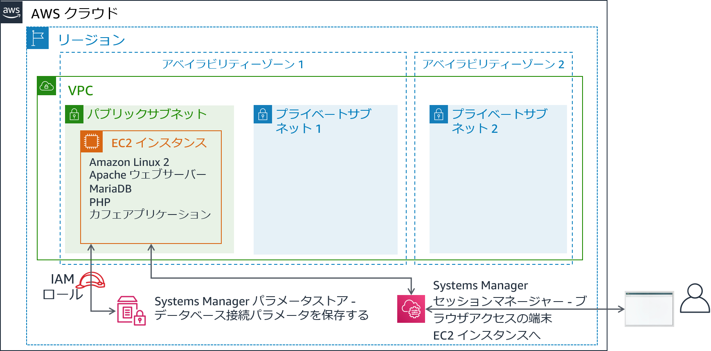

# モジュール 5 - 課題ラボ: Amazon RDS へのデータベースの移行
<!--Lab borrows from ACOv1 activity 6, but is significantly modified and extended-->

## シナリオ

このカフェでは現在、単一の EC2 インスタンスでウェブサーバー、データベース、アプリケーションコードをホストしています。

一方、カフェビジネスは成長しています。データベースに保存されている注文履歴は、カフェスタッフが失いたくない貴重なビジネス情報となります。Martha はこのデータを会計処理に使用し、Frank は時々このデータを見て、焼く必要がある各種のデザートの個数を計画します。

Sofía にはさらに懸念があります。データベースには継続的なアップグレードとパッチ適用が必要であり、このようなタスクを実行する時間が常にあるとは限りません。また、データベースの管理は特殊なスキルです。彼女は、データベース管理を行うために他の人を訓練することに時間を費やしたくありません。一方、Sofía はまた、カフェがデータのバックアップが必要な頻度で行われていないことも懸念しています。

最後に、Martha は、データベースを管理するために必要な技術学習への投資に伴う人件費を削減したいと考えています。


## ラボの概要と目標

このラボでは、Amazon Elastic Compute Cloud (Amazon EC2) インスタンス上のデータベースから Amazon Relational Database Service (Amazon RDS) にデータを移行します。具体的には、EC2 インスタンス上で実行されている MariaDB データベースを、Amazon RDS で実行される MariaDB データベースに移行します。また、カフェのウェブアプリケーションを、将来のすべての注文データを新しいデータベースに格納するように更新します。

このラボを完了すると、次のことができるようになります。

- RDS データベースインスタンスを作成する

- mysqldump を使用して MariaDB データベースからデータをエクスポートする

- SQL クライアントを RDS データベースに接続する

- EC2 インスタンス上で実行されている MariaDB データベースから RDS データベースインスタンスにデータを移行する

- 新しい RDS データベースインスタンスにデータを格納するようにウェブアプリケーションを設定する


ラボを**開始**すると、AWS のアカウントに次のリソースがすでに作成されています。



ラボの**終了時**のアーキテクチャは次の例のようになります。


## 所要時間
このラボの所要時間は約 **80 分**です。


## AWS サービスの制限事項
このラボ環境では、AWS のサービスとサービスアクションへのアクセスが、ラボの手順を完了するために必要なものに制限される場合があります。他のサービスへのアクセスや、このラボで説明されているサービス以外のアクションを実行しようとすると、エラーが発生することがあります。


## AWS マネジメントコンソールにアクセスする

1. この手順の上部にある <span id="ssb_voc_grey">Start Lab</span> をクリックし、ラボを起動します。

   [**Start Lab**] パネルが開き、ラボのステータスが表示されます。

   <i class="fas fa-info-circle"></i> **ヒント**: ラボの完了までにさらに時間が必要な場合は、<span id="ssb_voc_grey">Start Lab</span> ボタンをもう一度選択して、この環境のタイマーを再開します。

2. \[**Start Lab**] パネルに **Lab status: ready** というメッセージが表示されたら [**X**] をクリックしてパネルを閉じます。

3. この手順の上部にある <span id="ssb_voc_grey">AWS</span> をクリックします。

   このアクションにより、新しいブラウザタブで AWS マネジメントコンソールが開き、ユーザーは自動的にログインします。

   <i class="fas fa-exclamation-triangle"></i> **ヒント**: 新しいブラウザタブが開かない場合、通常、ブラウザによってサイトのポップアップウィンドウの表示がブロックされたというメッセージが表示されたバナーまたはアイコンがブラウザの上部に表示されます。バナーまたはアイコンを選択して [**ポップアップを許可**] を選択してください。

4. **AWS マネジメントコンソール**タブがこの手順と並べて表示されるようにします。両方のブラウザタブを同時に開いておくと、ラボのステップを実行しやすくなります。

   <i class="fas fa-exclamation-triangle"></i> **特に指示がない限り、リージョンを変更しないでください**。

   **ヒント**: ターミナルを非表示にするには、画面上部の [**Terminal**] チェックボックスをオフにします。


## ビジネスニーズ: カフェアプリケーション用の RDS インスタンスを作成する（課題 1）

Sofía は、頻繁にコーヒーを飲みに来る AWS ソリューションアーキテクトである Olivia と話した後、カフェにはメンテナンスが容易なデータベースソリューションが必要であると判断しました。さらに、データベースは、耐久性、スケーラビリティ、ハイパフォーマンスなどの必須機能を備えている必要があります。


このラボの最初の部分では、Sofía の役割を担い、カフェがカフェウェブサイトのデータストレージレイヤーとして使用できる RDS インスタンスを作成します。また、EC2 インスタンスに接続し、カフェウェブアプリケーションの詳細を分析します。


### タスク 1: RDS インスタンスを作成する


このラボの最初の課題は、RDS インスタンスを作成することです。

5. 以下の仕様に準拠する RDS インスタンスを作成します（このラボの最後に作業内容を送信すると、これらの設定の多くがチェックされます。満点を取るために、以下のガイドラインに従ってください）。

   * **エンジンのタイプ**: **MariaDB**

   * **テンプレート**: **開発/テスト**

   * **DB インスタンス識別子**: `CafeDatabase`

   * **マスターユーザー名**: `admin`

   * **マスターパスワード**: `Caf3DbPassw0rd!`
      * <i class="fas fa-exclamation-triangle"></i>この正確なパスワードを使用する必要があります。
      * **ヒント**: パスワードをコピーして貼り付けて設定します。

   * **DB インスタンスクラス**: **db.t2.micro**

   * **ストレージタイプ**: **汎用 (SSD)**

   * **ストレージ割り当て**: `20` GiB

   * スタンバイインスタンスは**作成しない**でください。

   * これを **Lab VPC** に配置します。

   * **サブネットグループ**: `lab-db-subnet-group`。ここにはデータベースはパブリックにアクセス**できません**。

   * `dbSG` という名前の既存の **VPC セキュリティグループ**を選択し、`default` のセキュリティグループを**選択解除**します。

   * **アベイラビリティーゾーン**: `a`で終了するリスト内の最初のアベイラビリティーゾーンをクリックします。例えば、リージョンが **us-east-1** の場合は、**us-east-1a** をクリックします。

   * **データベースポート**: デフォルトの TCP ポートの *3306* のままにします。

   * ラボ環境では、拡張モニタリングはサポート**されません**。デフォルト設定をオフにしてください。


**重要**: データベースの作成プロセスが完了するのを待たないでください。代わりに、データベースの作成プロセスを正しく開始したら、次のステップに進んでください。


### タスク 2: 既存のカフェアプリケーションのデプロイを分析する

このタスクでは、現在のカフェアプリケーションを実行している既存の EC2 インスタンスに接続します。


6. EC2 コンソールにアクセスし、**実行中のインスタンス**をクリックします。

   **CafeServer** という名前の実行中のインスタンスに注目してください。この EC2 インスタンスは、ラボを開始したときに作成されたものです。

7. カフェアプリケーションをテストします。

   - 新しいブラウザタブを開き、`http://<public-ip-address>/cafe` にあるカフェアプリケーションをロードします。

      **注意**: <*public-ip-address*> は、**CafeServer** インスタンスの実際の IPv4 パブリック IP アドレスに置き換えてください。

   - [**Menu**] ページにアクセスし、注文をテストします。

      これを行うには、少なくとも 1 つのメニュー項目の数量を **1** 以上に変更し、[**Submit Order**] をクリックします。

      **Order Confirmation** ページが表示されます。これはカフェウェブサイトが意図したとおりに動作していることを示しています。

   - [**Order History**] をクリックします。

      このページには、過去の多数の注文が表示されます。現在のデータベースには、顧客の過去の注文が格納されており、これらの注文をAmazon RDS でホストされるデータベースに移行します。


8. AWS Systems Manager を使用して EC2 インスタンスに接続し、ブラウザーでターミナルセッションにアクセスします。

   - AWS マネジメントコンソールに戻って **Systems Manager** コンソールに移動し、[**セッションマネージャー**] をクリックします。

   - セッションを開始し、**CafeServer** に接続します。

      新しいブラウザタブが開き、EC2 インスタンスに接続されたターミナルセッションが表示されます。

   - プロンプトで、次のコマンドを入力します。

      ```bash
    bash
      sudo su
    su ec2-user
      whoami
    cd /home/ec2-user/
      ```

      **分析**: 最初のコマンドで、Bash シェルを開きました。2 番目のコマンドは、EC2 インスタンスで root ユーザーアカウントを使用するようにセッションを切り替えました。3 番目のコマンドは、**ec2-user** アカウントを使用するように切り替えました。4 番目のコマンドは、ec2-user として接続していることを確認する出力を返したはずです。最後のコマンドは、ターミナルを ec2-user のホームディレクトリに切り替えます。


**注意**: Systems Manager エージェント（**ssm エージェント**）は、デフォルトですべての Amazon Linux 2 インスタンス（およびその他いくつかの OS タイプ）にインストールされます。ラボを開始し、EC2 インスタンスが作成されたときに、インスタンスで ssm エージェントサービスを開始する必要があることをユーザーデータで指定しました。また、**AmazonSSMManagedInstanceCore** という名前の IAM ポリシーを含む AWS Identity and Access Management (IAM) ロールを EC2 インスタンスにアタッチしました。これら 2 つのアクションにより、Systems Manager セッションマネージャーからインスタンスにアクセスできるようになりました。


## 新しいビジネス要件: 古いデータベースからデータをエクスポートし、新しいデータベースへの接続を確立する（課題 2）

新しい RDS インスタンスを作成したので、カフェのデータベース移行計画の次のステップに進むことができます。次に、カフェアプリケーションが現在使用しているデータベースからデータをエクスポートします。また、アプリケーションが実行されている EC2 インスタンスから新しい RDS データベースインスタンスへのネットワーク接続を確立します。

この課題では、Sofía としてこれらのタスクを実行します。


### タスク 3: EC2 インスタンスでデータベースを操作する

このタスクでは、EC2 インスタンスで実行されている MariaDB データベースの詳細を確認します。次に、**mysqldump** ユーティリティを使用して、データベースから既存の注文履歴データをエクスポートします。


9. EC2 インスタンスで実行されているデータベースの詳細を確認します。

   ターミナルで、次のコマンドを実行します。

   ```bash
       service mariadb status
       mysql --version
       ```

   出力には、この EC2 インスタンスにローカルにインストールされた MariaDB データベースが実行中であることが示されます。また、データベースのバージョン番号も表示されます。

   このブラウザタブは開いたままにします。このラボを通して使用します。


10. **AWS Systems Manager** コンソールが開いているブラウザタブに戻ります。


11. 左側のナビゲーションペインの [**アプリケーション管理**] で [**パラメータストア**] をクリックします。

   ここには 7 つのパラメータが格納されています。カフェアプリケーションの PHP コードは、データベースの接続情報を取得したりする際にこれらの値を参照します。

   - `/cafe/dbPassword` パラメータを選択し、[**値**] をクリップボードにコピーします。この値はすぐ後で使用します。


12. EC2 インスタンスで実行されているデータベースに接続します。

   Bash ターミナルが表示されているブラウザタブで、次のコマンドを実行してターミナルベースの MySQL クライアントをデータベースに接続します。

   ```bash
       mysql -u root -p
       ```

   データベースパスワードの入力を求められたら、先ほどコピーした **dbPassword** パラメータの値を貼り付けます。

   `mariadb>` プロンプトが表示されます。このプロンプトは、この EC2 インスタンスで実行されている MariaDB データベースに接続していることを示します。


13. 既存のデータベースのデータを確認します。

   データベースの内容を確認するには、次のコマンドを入力します。特に、カフェのウェブアプリケーションをサポートするテーブルを確認します。

   ```sql
       show databases;
       use cafe_db;
       show tables;
       select * from `order`;
       ```

   これらのコマンドは、少し前に行った注文を含む、これまでに行われたすべての注文を表示します。

   ```sql
       select * from `order_item`;
       ```

   このコマンドは、注文品目を表示します。各注文番号には、注文された品目の種類ごとに行があり、各品目の数量と価格の詳細が表示されます。

   このデータをすべて新しいデータベースに移行する必要があります。

14. SQL クライアントを終了します。

   ```sql
       exit;
       ```


15. **mysqldump** ユーティリティを使用して、ファイル内の既存のデータをキャプチャします。

   ```bash
       mysqldump --databases cafe_db -u root -p > CafeDbDump.sql
       ```

   データベースパスワードの入力を求められたら、Systems Manager のパラメータストアの **dbPassword** 値を貼り付けます。


16. **mysqldump** が成功したことを確認します。

   - ターミナルで `ls` コマンドを実行します。出力には、`CafeDbDump.sql` ファイルが作成されたことが示されます。

   - `cat CafeDbDump.sql` コマンドを実行して、ファイルの内容を確認します。

      ラボの次のセクションでは、このデータを新しい RDS データベースにインポートします。


### タスク 4: RDS データベースを操作する

このタスクでは、最初に、作成した RDS インスタンスに関するいくつかの問題に解答します。次に、RDS インスタンスに接続できることを確認します。


17. AWS マネジメントコンソールで、**RDS** サービスコンソールに戻り、作成した **cafetabase RDS** インスタンスが使用可能であることを確認します。


#### RDS インスタンスに関する問題に解答する

ラボの最後に、青い [**Submit**] ボタンをクリックすると、解答が記録されます。


18. このラボの問題にアクセスします。

   - 手順の上にある [**Details**] ドロップダウンメニューから [**Show**] を選択します。

   - [**Access the multiple choice questions**] リンクをクリックします。

19. 読み込んだページで、最初の 4 つの問題に解答します。

   - 質問 1: RDS インスタンスはどこで実行されていますか?（Question 1: Where is the RDS instance running? Choose the answer that is true and that is the most specific.）

   - 質問 2: RDS インスタンスには IPv4 パブリック IP アドレスが割り当てられていますか?（Question 2: Does the RDS instance have an IPv4 Public IP address assigned to it?）

   - 問題 3: RDS インスタンスが実行されているサブネットに適用される **Name** タグは何ですか?（Question 3: What is the Name tag value applied to the subnet in which the RDS instance is running?）

   - 質問 4: RDS インスタンスに対して定義されているセキュリティグループのルールはいくつありますか?（Question 4: How many security group rules are defined for the RDS instance?）


20. EC2 インスタンスで実行されているターミナルから新しい RDS インスタンスへのネットワーク接続を確立します。

このステップに取り組むうえで役に立つヒントをいくつかご紹介します。

<details>

  <summary>

  <b>ヒント #1</b>（クリックすると展開します）

  </summary>

	接続に使用できる構文は次のとおりです。

	<code> mysql -u admin -p --host &lt;rds-endpoint></code>

<br>&lt;rds-endpoint> を RDS インスタンスの実際の RDS エンドポイントに置き換えます。<br>コマンドを実行した後、RDS インスタンスのパスワードを入力するように求められます。このパスワードは、RDS インスタンスを作成したときに定義したものです。

</details>

<br>

<details>

  <summary>

  <b>ヒント #2</b>（クリックすると展開します）

  </summary>

	RDS エンドポイントとデータベースのパスワードを正しく入力しても、まだ接続できません。RDS インスタンスが実行されているセキュリティグループのインバウンドルールを更新する必要があります。MySQL クライアントソフトウェアは、TCP ポート 3306 でデータベースに接続しようとします。

</details>

<br>

<details>

  <summary>

  <b>ヒント #3</b>（クリックすると展開します）

  </summary>

  ポート 3306 を<i>すべての</i>送信元 IP アドレスに対して開くことは避けてください。それは安全ではありません。代わりに、接続元の EC2 インスタンスで使用されているセキュリティグループのサーバーに対してのみ開いてください（オプションを表示するには、ソースフィールドに <code>sg-</code> と入力してください）。

</details>

<br>

<details>

  <summary>

  <b>ヒント #4</b>（クリックすると展開します）

  </summary>   

  セキュリティグループ設定で EC2 インスタンスからデータベースへのトラフィックが TCP ポート 3306 で許可されていることを確認できます。Systems Manager のセッションマネージャーターミナルで次のコマンドを実行してください（<rds-endpoint> 実際の RDS エンドポイントに置き換えてください）。<br><code>nmap -Pn &lt;rds-endpoint></code><br> コマンドの出力で **mysql** サービスに対してポート 3306 が開いていることが示された場合は、セキュリティグループ設定でトラフィックが許可されていることを示しています。<br><i>nmap</i> でポートが<b>開いている</b>ことが示された場合は、<code>mysql -u admin -p --host &lt;rds-endpoint></code> コマンドも動作します（ただし、データベースパスワードを正しく入力する必要があります。このパスワードは、インスタンスを作成したときに設定したパスワードです）。

</details>  

<br>

**注意**: それでも問題を解決できない場合は、このラボの説明の最後にある「作業内容を送信する」セクションに記載されている手順に従って作業内容を送信すると役立つことがあります。生成される**送信レポート**には、正しく完了できなかったラボのパートに関する追加のヒントが記載されている場合があります。作業内容は何度でも送信できます。前回の送信で達成したスコアのみが保持されます。


次の手順に進む前に、RDS MariaDB に接続できることを確認することが重要です。すでに接続できているのであればこの手順は終了です。お疲れ様でした。


21. `show databases;` コマンドを実行します。次の出力が表示されます。

   

   - **cafe_db** データベースはまだリストにないことに注意してください。この状況は予想通りです。データをまだインポートしていないからです。

   - 切断するには、`exit;` コマンドを実行します。


## 新しいビジネス要件: データをインポートし、アプリケーションを新しいデータベースに接続する（課題 3）

前の課題では、カフェアプリケーションが現在使用しているデータベースからデータをエクスポートしました。また、EC2 インスタンスから RDS インスタンスへのネットワーク接続を確立しました。これで、次のビジネス要件に取り組むことができます。

この課題では、引き続き Sofía の役割を担い、カフェのデータを RDS データベースインスタンスにインポートします。インポートが完了したら、新しいデータベースを使用するようにアプリケーションを設定します。


### タスク 5: データを RDS データベースインスタンスにインポートする

22. タスク 3 でエクスポートしたデータを RDS データベースインスタンスにインポートします。

   - データをインポートするには、ターミナルで次のコマンドを実行します（`<rds-endpoint>` は実際のエンドポイントです）。

      ```bash
            mysql -u admin -p --host <rds-endpoint> < CafeDbDump.sql
            ```

   - パスワードプロンプトで、RDS インスタンスのパスワードを入力します。

      エラーが表示されない場合、コマンドはおそらく成功しています。


23. データがインポートされたことを確認します。

   - RDS データベースに接続するには、次のコマンドを実行します。

      ```
            mysql -u admin -p --host <rds-endpoint>
            ```

   - パスワードプロンプトで、RDS インスタンスのパスワードを入力します。

   - データがインポートされたことを確認するには、次のコマンドを実行します。

      ```sql
            show databases;
            use cafe_db;
            show tables;
            select * from `order`;
            ```

   **select** ステートメントの出力には、データベース内の少なくとも 24 件の注文が表示されるはずです。

   - SQL クライアントを終了します。

      ```sql
            exit;
            ```


### タスク 6: カフェアプリケーションを新しいデータベースに接続する

ラボのこの最後のタスクでは、カフェアプリケーションを新しいデータベースに接続します。また、EC2 インスタンスでローカルで実行されているデータベースを停止します。


24. **AWS Systems Manager** コンソールのブラウザタブに戻ります。


25. 左側のパネルで、[**パラメータストア**] をクリックします。

   以前の課題ラボから、カフェアプリケーションの PHP コードがこれらの値を参照することを思い出してください。例えばデータベースの接続情報を取得するために、これらの値を使用します。


26. カフェアプリケーションを RDS インスタンスに接続します。

   データベース接続情報が変更されたため、EC2 インスタンスで実行されているデータベースではなく、新しい RDS データベースインスタンスにアプリケーションを接続するには、これらの値を更新する必要があります。

<details>

  <summary>

  <b>ヒント #1</b>（クリックすると展開します）

  </summary>

アプリケーションが接続しているデータベースを更新した後、<code>http://&lt;public-ip>/cafe/menu.php</code> ページを使用して、接続が正常に更新されたかどうかをテストします。

</details>

<br>

<details>

  <summary>

  <b>ヒント #2</b>（クリックすると展開します）

  </summary>

PHP コードを更新する必要はありません。また、このラボで前の課題を正常に完了した場合、ネットワーク構成に追加の変更を加える必要はありません。更新する必要があるのは、Systems Manager のパラメータストアの一部の値だけです。

</details>

<br>

<details>

  <summary>

  <b>ヒント #3</b>（クリックすると展開します）

  </summary>

<i>currency</i>、<i>dbName</i>、<i>timeZone</i>、<i>showServerInfo</i> の値を更新する必要はありません。

</details>

<br>

<details>

  <summary>

  <b>ヒント #4</b>（クリックすると展開します）

  </summary>

<i>dbUrl</i> は RDS エンドポイント値である必要があります。

</details>

<br>

27. ウェブアプリケーションが新しいデータベースを使用していることを確認します。

   - EC2 インスタンスでまだ実行されているデータベースを停止します。ターミナルで、次のコマンドを使用します。

      ```bash
            sudo service mariadb stop
            ```

   - `http://<public-ip>/cafe/menu.php` ページをロードし、注文を行ってアプリケーションがまだ動作していることを確認します。

   - [**Order History**] をクリックします。あなたの最新の注文とそれ以外の過去のすべての注文が表示されるはずです。これらの注文は、新しいデータベースに移行したデータです。


## カフェの近況


カフェの誰もがデータベース移行の結果に満足しています。Sofía と Nikhil は週末の空き時間が増えました。これは、Frank と Martha にとっては人件費の節約を意味しています。

Sofía は友人とくつろいでいます。しかし、彼女はすでに改善策を考えています。次の良いステップは、EC2 インスタンスが使用する EBS ボリュームのサイズを減らすことです。また、EC2 インスタンスタイプを小さなサイズに変更して経費を減らすこともできます。データベースはもう EC2 インスタンス上で実行されていないため、インスタンスのハードドライブ空き容量が増えており、インスタンスに必要な CPU やメモリリソースの量も減少していると思われます。


## 作業内容を送信する

28. この手順の上部にある<span id="ssb_blue">Submit</span> をクリックして進捗情報を記録し、プロンプトが表示されたら [**Yes**] をクリックします。

29. 数分経っても結果が表示されない場合は、この手順の上部に戻り、<span id="ssb_voc_grey">Grades</span> をクリックします。

   **ヒント**: 作業内容は何度も送信できます。作業内容を変更したら、再度 [**Submit**] をクリックします。最終送信分がこのラボの作業内容として記録されます。

30. 作業に関する詳細なフィードバックを参照するには、<span id="ssb_voc_grey">Details</span> ドロップダウンメニューから <i class="fas fa-caret-right"></i> [**View Submission Report**] を選択します。


## ラボの終了

<i class="icon-flag-checkered"></i>お疲れ様でした。以上でラボは終了です。


31. ラボを終了するには、このページの上部にある <span id="ssb_voc_grey">End Lab</span> をクリックし、<span id="ssb_blue">Yes</span> をクリックします。

   パネルに **DELETE has been initiated... You may close this message box now** というメッセージが表示されます。

32. 右上隅の [**X**] をクリックしてパネルを閉じます。


**©2020 Amazon Web Services, Inc. and its affiliates. All rights reserved. このトレーニング内容の全体または一部を複製または再配布することは、Amazon Web Services, Inc. の書面による事前の許可がある場合を除き、禁じられています。商業目的のコピー、貸与、または販売を禁止します。**
