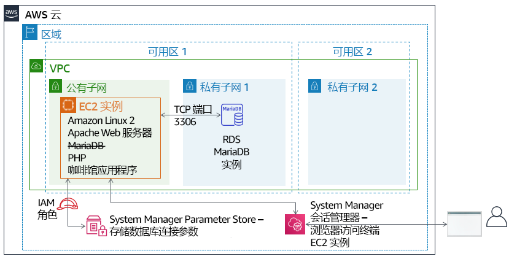

# 模块 5 – 挑战实验：将数据库迁移到 Amazon RDS
<!--Lab borrows from ACOv1 activity 6, but is significantly modified and extended-->

## 场景

咖啡馆目前使用单个 EC2 实例来托管其 Web 服务器、数据库和应用程序代码。

同时，咖啡馆的业务也在增长。存储在数据库中的订单历史记录提供了咖啡馆工作人员不想丢失的有价值的业务信息。Martha 使用这些数据进行核算，Frank 偶尔会查看这些数据，以计划每一种甜点他应该烤多少。

Sofía 还有其他担忧。数据库必须持续升级和修补，而且她并不总是有时间完成这些任务。此外，管理数据库是一项专业技能。培训他人进行数据库管理不是她想花时间的事情。同时，Sofía 也担心咖啡馆没有按应有的频率进行数据备份。

最后，Martha 还希望降低与管理数据库所需的技术学习投资相关的劳动力成本。


## 实验概览和目标

在本实验中，您将将数据从 Amazon Elastic Compute Cloud (Amazon EC2) 实例上的数据库迁移到 Amazon Relational Database Service (Amazon RDS)。具体来说，您需要将在 EC2 实例上运行的 MariaDB 数据库迁移到在 Amazon RDS 上运行的 MariaDB 数据库。您还将更新咖啡馆 Web 应用程序，以使用新的数据库存储所有未来订单的数据。

完成本实验后，您应能够：

- 创建 RDS 数据库实例

- 使用 mysqldump 从 MariaDB 数据库导出数据

- 将 SQL 客户端连接到 RDS 数据库。

- 将数据从在 EC2 实例上运行的 MariaDB 数据库迁移到 RDS 数据库实例

- 配置 Web 应用程序以使用新的 RDS 数据库实例进行数据存储


当您*启动*实验时，以下资源已经在 AWS 账户中为您创建好了：


在本实验*结束*时，您的架构将如下例所示：




## 持续时间
完成本实验大约需要 **80 分钟**。


## AWS 服务限制
在本实验环境中，对 AWS 服务和服务操作的访问可能仅限于完成实验说明所需的服务和服务操作。如果您尝试访问其他服务或执行本实验中所述之外的操作，可能会遇到错误。


## 访问 AWS 管理控制台

1. 在这些说明的顶部，选择 <span id="ssb_voc_grey">Start Lab</span>（启动实验）即可启动您的实验。

   **Start Lab**（启动实验）面板随即会打开，其中显示了实验状态。

   <i class="fas fa-info-circle"></i> **提示**：如果您需要更多时间来完成实验，请再次选择 <span id="ssb_voc_grey">Start Lab</span>（启动实验）按钮，重新启动环境计时器。

2. 请耐心等待，直到 **Start Lab**（启动实验）面板显示消息 *Lab status: ready*（实验状态：就绪），然后选择 **X** 关闭此面板。

3. 在这些说明的顶部，选择 <span id="ssb_voc_grey">AWS</span>。

   此操作将在一个新的浏览器选项卡中打开 AWS 管理控制台。您将自动登录系统。

   <i class="fas fa-exclamation-triangle"></i> **提示**：如果未打开新的浏览器选项卡，您的浏览器顶部通常会出现一个横幅或图标，并显示一条消息，指明您的浏览器阻止该了网站打开弹出窗口。请选择横幅或图标，然后选择 **Allow pop-ups**（允许弹出窗口）。

4. 排列 **AWS 管理控制台**选项卡，使其与这些说明一起显示。理想情况下，您将同时打开两个浏览器选项卡，以便能够更轻松地执行实验步骤。

   <i class="fas fa-exclamation-triangle"></i> **除非特别要求，否则请勿更改区域**。

   **提示**：您可以通过清除屏幕顶部的 **Terminal**（终端）复选框来隐藏终端。


## 业务请求：为咖啡馆应用程序创建 RDS 实例（挑战 1）

在与经常来喝咖啡的 AWS 解决方案架构师 Olivia 进行对话后，Soofía 认为咖啡馆需要更易于维护的数据库解决方案。此外，数据库应提供一些基本功能，例如耐用性、可扩展性和高性能。


在这个实验的第一部分，您将扮演 Sofía 的角色。您将创建一个 RDS 实例，咖啡馆可以使用该实例作为咖啡馆网站的数据存储层。您还将连接到 EC2 实例并分析咖啡馆 Web 应用程序的详细信息。


### 任务 1：创建 RDS 实例


本实验中的第一个挑战是创建 RDS 实例。

5. 创建符合这些规范的 RDS 实例。（当您在本实验结束提交作业时，它将检查其中的许多设置。要获得全部学分，请遵循以下指南。）

   * **Engine type**（引擎类型）：*MariaDB*

   * **Templates**（模板）：*Dev/Test*

   * **DB instance identifier**（数据库实例标识符）：`CafeDatabase`

   * **Username**（用户名）：`admin`

   * **Password**（密码）：`Caf3DbPassw0rd!`
      * <i class="fas fa-exclamation-triangle"></i>您必须一字不差地使用这个密码。
      * **提示**：复制并粘贴密码来进行设置。

   * **DB Instance Class**（数据库实例类）：*db.t2.micro*

   * **Storage type**（存储类型）：*通用型 (SSD)*

   * **Allocated storage**（分配的存储空间）：`20`GiB

   * 请*勿*创建备用实例

   * 将其放在 **Lab VPC** 中

   * **Subnet Group**（子网组）：`lab-db-subnet-group`，其中数据库*不*可公开访问。

   * 选择名为 `dbSG` 的现有 **VPC 安全组**，然后*取消选择*`默认`安全组。

   * **Availability Zone**（可用区）：选择列表中的第一个可用区，该可用区以 `a`结尾。例如，如果区域为 *us-east-1*，请选择 **us-east-1a**。

   * **Database port**（数据库端口）：保持默认的 TCP 端口 *3306*。

   * 实验环境*不*支持增强监控。清除默认设置。


**重要提示**：不要等数据库完成创建过程。正确做法是，在成功启动数据库创建过程后，继续执行下一步。


### 任务 2：分析现有咖啡馆应用程序部署

在此任务中，您将连接到运行当前咖啡馆应用程序的现有 EC2 实例。


6. 浏览到 EC2 控制台，然后选择 **Running Instances**（正在运行的实例）。

   请注意名为 **CafeServer** 的正在运行的实例。此 EC2 实例是在您启动实验时创建的。

7. 测试咖啡馆应用程序。

   - 打开一个新的浏览器选项卡，然后在 `http://<public-ip-address>/cafe` 加载咖啡馆应用程序。

      **注意**：将 <*public-ip-address*> 替换为 *CafeServer* 实例的实际 IPv4 公有 IP 地址。

   - 浏览至 **Menu**（菜单）页面并测试下订单。

      为此，请将至少一个菜单项的数量更改为至少 *1*，然后选择 **Submit Order**（提交订单）。

      应该会显示一个 **Order Confirmation**（订单确认）页面，表明咖啡馆网站正在按预期运行。

   - 选择 **Order History**（订单历史记录）。

      该页面显示已下了许多订单。当前数据库包含过去的客户订单，您将把这些订单迁移到 Amazon RDS 上托管的数据库。


8. 通过使用 AWS Systems Manager 访问浏览器中的终端会话，连接到 EC2 实例。

   - 回到 AWS 管理控制台，导航到 **Systems Manager**（系统管理器）控制台并选择 **Session Manager**（会话管理器）。

   - 开始会话并连接到 **CafeServer**。

      您现在应该打开了一个新的浏览器选项卡，其中有一个连接到 EC2 实例的终端会话。

   - 在命令提示符处，输入以下命令：

      ```bash
    bash
      sudo su
    su ec2-user
      whoami
    cd /home/ec2-user/
      ```

    **分析**：第一个命令给了您一个 Bash shell。第二个命令将您的会话切换为使用 EC2 实例上的根用户账户。第三个命令将您切换为使用 *ec2-user* 账户。第四个命令应该返回输出，以确认您是以 ec2-user 身份连接的。最后一个命令将终端切换到 ec2-user 的主目录。


**注意**：Systems Manager 代理（*ssm 代理*）默认安装在所有 Amazon Linux 2 实例（以及其他一些 OS 类型上）。当您启动实验并创建 EC2 实例时，用户数据指定应在实例上启动 ssm 代理服务。此外，AWS Identity and Access Management (IAM) 角色已挂载到 EC2 实例，该角色包括名为 *AmazonSSMManagedInstanceCore* 的 IAM 策略。这两个操作使实例可以通过 Systems Manager 会话管理器进行访问。


## 新的业务需求从旧数据库导出数据并连接新数据库（挑战 2）

现在您创建了新的 RDS 实例，您可以继续进入咖啡馆数据库迁移计划中的下一步。接下来，您将从咖啡馆应用程序当前使用的数据库中导出数据。您还将建立从 EC2 实例（应用程序运行的地方）到新的 RDS 数据库实例的网络连接。

在这个挑战中，您继续以 Sofía 的身份完成这些任务。


### 任务 3：使用 EC2 实例中的数据库

在此任务中，您将观察有关在 EC2 实例上运行的 MariaDB 数据库的详细信息。然后，您将使用 *mysqldump* 实用程序从数据库中导出现有的订单历史记录数据。


9. 观察 EC2 实例上运行的数据库的详细信息。

   在终端中，运行以下命令：

   ```bash
       service mariadb status
       mysql --version
       ```

   输出应显示此 EC2 实例上本地安装的 MariaDB 数据库正在运行。它还应显示数据库的版本号。

   保持此浏览器选项卡打开。您将在整个实验中使用它。


10. 返回到浏览器选项卡，在其中打开 **AWS Systems Manager** 控制台。


11. 从左侧面板中，在 **Application Management**（应用程序管理）下，选择 **Parameter Store**（参数仓库）。

    请注意，这里存储了 7 个参数。咖啡馆应用程序 PHP 代码引用了这些值，例如，以便它可以检索数据库的连接信息。

    - 选择 `/cafe/dbPassword` 参数，并将 **Value**（值）复制到剪贴板。稍后您将使用该值。


12. 连接到 EC2 实例上运行的数据库。

    在浏览器选项卡的 Bash 终端中，通过运行以下命令将基于终端的 MySQL 客户端连接到数据库：

    ```bash
       mysql -u root -p
       ```

    当系统提示输入数据库密码时，粘贴您刚才复制的 *dbPassword* 参数值。

    您现在应该看到 `mariadb>` 提示。此提示表示您现在已连接到在此 EC2 实例上运行的 MariaDB 数据库。


13. 观察现有数据库中的数据。

    要观察数据库的内容，输入以下命令。特别是，您将查看支持咖啡馆 Web 应用程序的表。

    ```sql
       show databases;
       use cafe_db;
       show tables;
       select * from `order`;
       ```

    这些命令显示了所有已下的订单，包括您刚才下的订单。

    ```sql
       select * from `order_item`;
       ```

    此命令显示了订单行项目。对于所订购的每种类型的商品，每个订单号都有一行，并附有关于每种商品数量和价格的详细信息。

    所有这些数据必须迁移到新数据库。

14. 退出 SQL 客户端。

    ```sql
       exit;
       ```


15. 使用 *mysqldump* 实用程序捕获文件中的现有数据。

    ```bash
       mysqldump --databases cafe_db -u root -p > CafeDbDump.sql
       ```

    当系统提示输入数据库密码时，从 Systems Manager Parameter Store 中粘贴 *dbPassword* 值。


16. 确认 *mysqldump* 成功。

    - 在终端中运行 `ls` 命令。输出应该显示 `CafeDbDump.sql` 文件已创建。

    - 运行 `cat CafeDbDump.sql` 命令以查看文件的内容。

      在本实验的下一部分中，您需要将此数据导入新的 RDS 数据库。


### 任务 4：使用 RDS 数据库

在此任务中，您将首先回答几个关于您创建的 RDS 实例的问题。然后，您将确认可以连接到 RDS 实例。


17. 在 AWS 管理控制台中，返回 **RDS** 服务控制台并确认您创建的 *cafedatabase* RDS 实例现已可用。


#### 回答有关 RDS 实例的问题

完成实验后，单击蓝色的 **Submit**（提交）按钮，将会记录答案。


18. 查看本实验中的问题。

    - 在这些说明的上方，选择 **Details > Show**（详细信息 > 显示）。

    - 选择 **Access the multiple choice questions**（查看多项选择题）链接。

19. 在加载的页面中，回答前四个问题：

    - 问题 1：RDS 实例在哪里运行？

    - 问题 2：RDS 实例是否分配了 IPv4 公有 IP 地址？

    - 问题 3：适用于运行 RDS 实例的子网的 **Name**（名称）标签是什么？

    - 问题 4：为 RDS 实例定义了多少个安全组规则？


20. 建立从 EC2 实例上运行的终端到新 RDS 实例的网络连接。

这里有一些提示可以帮助您入门：

<details>
  <summary>
<b>提示 1</b>（单击以展开）
</summary>
以下是你可以用来连接的语法：
<code>mysql-u admin-p —host &lt;rds-endpoint></code>
<br> 使用 RDS 实例的实际 RDS 终端节点替换 &lt;rds-endpoint>。<br>运行命令后，它将提示您输入 RDS 实例的密码。您在创建 RDS 实例时定义了此密码。
</details>
<br>
<details>
  <summary>
<b>提示 2</b>（单击以展开）
</summary>
即使您正确输入 RDS 终端节点和数据库密码，仍然无法连接。您必须更新 RDS 实例运行在其中的安全组的入站规则。MySQL 客户端软件尝试连接到 TCP 端口 3306 上的数据库。
</details>
<br>
<details>
  <summary>
  <b>提示 3</b>（单击以展开）
 </summary>
 避免向<i>所有</i>源 IP 地址打开端口 3306。那不安全。相反，只将其打开给正在连接的 EC2 实例所使用的安全组中的服务器（尝试在源字段中键入 <code>sg-</code> 以查看选项）。
</details>

<br>
<details>
  <summary>
  <b>提示 4</b>（单击以展开）
 </summary> 
 您可以确认安全组设置允许从 EC2 实例到数据库的 TCP 端口 3306 上的流量。尝试在 Systems Manager 会话管理器终端中运行这些命令<rds-endpoint>（使用实际 RDS 终端节点替换）：<br><code>nmap-Pn &lt;rds-endpoint></code><br> 如果命令的输出显示*mysql*服务的端口 3306 已打开，则它确认安全组设置允许流量。<br>如果 <i>nmap</i> 显示端口已<i>打开</i>，那么  <code>mysql-u admin-p —host &lt;rds-endpoint></code> 命令也应该起作用。（但是，必须正确输入数据库密码。此密码是您在创建实例时设置的密码）。
</details>  
<br>

**注意**：如果仍然无法解决问题，您可能会发现提交作业会有所帮助，如这些实验说明末尾的 **提交您的作业**部分中所述。生成的**提交报告**可以为您未成功完成的实验部分提供其他提示。您可以随意多次提交作业。只有您在最近一次提交时获得的分数才会被保留。


在进行下一步之前，务必确认您可以连接到 RDS MariaDB。如果您已经建立了联系，恭喜你！


21. 运行 `show databases;` 命令。它应该显示以下输出：

    

    - 请注意，*cafe_db* 数据库尚未在列表中。预计会出现这种情况，因为您尚未导入任何数据。

    - 要断开连接，请运行 `exit;`命令。


## 新的业务需求：导入数据并将应用程序连接到新数据库（挑战 3）

在上一个挑战中，您从咖啡馆应用程序当前使用的数据库中导出了数据。您还建立了从 EC2 实例到 RDS 实例的网络连接。您现在可以处理下一个业务需求。

在此挑战中，您将继续担任 Sofía 的角色，将咖啡馆数据导入 RDS 数据库实例。完成导入后，您将配置应用程序以使用新数据库。


### 任务 5：将数据导入 RDS 数据库实例

22. 将任务 3 中导出的数据导入 RDS 数据库实例。

    - 要导入数据，请在终端中运行以下命令（其中 `<rds-endpoint>` 为实际的终端节点）：

      ```bash
            mysql -u admin -p --host <rds-endpoint> < CafeDbDump.sql
            ```

    - 在密码提示符处，输入 RDS 实例的密码。

      如果没有看到任何错误，则该命令可能成功。


23. 确认数据已导入。

    - 要连接到 RDS 数据库，请运行以下命令：

      ```
            mysql -u admin -p --host <rds-endpoint>
            ```

    - 在密码提示符处，输入 RDS 实例的密码。

    - 要确认数据已导入，请运行以下命令：

      ```sql
            show databases;
            use cafe_db;
            show tables;
            select * from `order`;
            ```

    *select* 语句的输出应该显示数据库中至少 24 个订单。

    - 退出 SQL 客户端：

      ```sql
            exit;
            ```


### 任务 6：将咖啡馆应用程序连接到新数据库

在实验的最后一项任务中，您将面临将咖啡馆应用程序连接到新数据库的挑战。您还将停止在 EC2 实例上本地运行的数据库。


24. 返回到 **AWS Systems Manager** 控制台浏览器选项卡。


25. 从左侧面板中，选择 **Parameter Store**（参数仓库）。

    回想一下之前的一个挑战实验，咖啡馆应用程序的 PHP 代码引用了这些值。例如，它使用这些值检索数据库的连接信息。


26. 将咖啡馆应用程序连接到 RDS 实例。

    由于数据库连接信息已更改，因此您必须更新这些值才能将应用程序连接到新的 RDS 数据库实例，而不是连接到 EC2 实例上运行的数据库。

<details>
  <summary>
<b>提示 1</b>（单击以展开）
</summary>
更新应用程序连接到的数据库后，使用 <code>http://&lt;public-ip>/cafe/menu.php</code> 页面来测试是否已成功更新连接。
</details>

<br>

<details>
  <summary>
<b>提示 2</b>（单击以展开）
</summary>
PHP 代码不需要任何更新。此外，假设您已成功完成本实验中之前的挑战，则不需要进行其他更改网络配置。您必须进行的唯一更新将是对 Systems Manager 参数存储中的某些值进行更新。
</details>
<br>

<details>
  <summary>
  <b>提示 3</b>（单击以展开）
 </summary>
不需要更新 <i>currency</i>、<i>dbName</i>、<i>timeZone</i> 和 <i>showServerInfo</i> 值。
</details>
<br>

<details>
  <summary>
  <b>提示 4</b>（单击以展开）
 </summary>
<i>dbUrl</i> 应该是 RDS 终端节点值。
</details>
<br>

27. 确认您的 Web 应用程序现在使用新数据库。

    - 停止仍在 EC2 实例上运行的数据库。在终端中，使用以下命令：

      ```bash
            sudo service mariadb stop
            ```

    - 加载 `http://<public-ip>/cafe/menu.php` 页面并通过下订单确认应用程序仍然可以正常工作。

    - 选择 **Order History**（订单历史记录）。您的最新订单以及以前的所有其他订单都应该在那里。这些订单是您迁移到新数据库的数据。


## 咖啡馆更新


咖啡馆的每个人都对数据库迁移的结果感到满意。Sofía 和 Nikhil 现在周末有更多的空闲时间，这意味着 Frank 和 Martha 节省了劳动力成本。

Sofía 花了一分钟时间来和她的朋友一起放松身心。但是，她已经在考虑改进了。下一个不错的步骤是减小 EC2 实例使用的 EBS 卷的大小。他们还可以通过将 EC2 实例类型更改为更小的大小来节省开支。由于数据库不再在 EC2 实例上运行，因此实例现在拥有额外的硬盘空间，而且它可能也不需要那么多的 CPU 和内存资源。


## 提交作业

28. 在这些说明的顶部，选择 <span id="ssb_blue">Submit</span>（提交）记录您的进度，在出现提示时，选择 **Yes**（是）。

29. 如果在几分钟后仍未显示结果，请返回到这些说明的顶部，并选择 <span id="ssb_voc_grey">Grades</span>（成绩）

    **提示**：您可以多次提交作业。更改作业后，再次选择 **Submit**（提交）即可。您最后一次提交的作业将记录为本实验的成绩。

30. 要查找有关您作业的详细反馈，请选择 <span id="ssb_voc_grey">Details</span>（详细信息），然后选择 <i class="fas fa-caret-right"></i> **View Submission Report**（查看提交报告）。


## 实验完成

<i class="icon-flag-checkered"></i> 恭喜！您已完成实验。


31. 若要确认您想结束实验，请选择此页面顶部的 <span id="ssb_voc_grey">End Lab</span>（结束实验），然后选择 <span id="ssb_blue">Yes</span>（是）。

    此时应显示一个面板，并显示消息：*DELETE has been initiated... You may close this message box now.*（删除操作已启动...您现在可以关闭此消息框。）


32. 选择右上角的 **X** 关闭面板。


*©2020 Amazon Web Services, Inc. 及其附属公司。保留所有权利。未经 Amazon Web Services, Inc. 事先书面许可，不得复制或转载本文的部分或全部内容。禁止商业性复制、出租或出售。*
