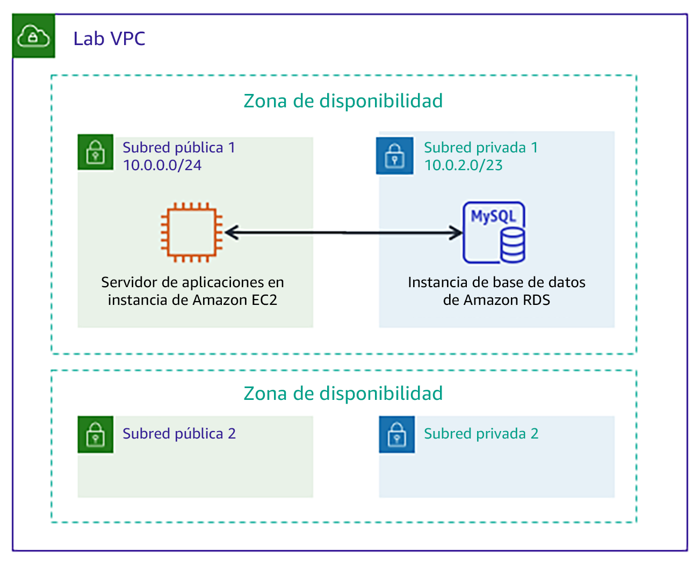

# Módulo 5 - Laboratorio guiado: Creación de una base de datos de Amazon RDS

[//]: # "SKU: ILT-TF-200-ACACAD-2    Source Course: ILT-TF-100-ARCHIT-6 branch dev_65"

## Información general y objetivos del laboratorio

Tradicionalmente, la creación de una base de datos puede ser un proceso complejo que requiere de un administrador de bases de datos o un administrador de sistemas. En la nube, puede simplificar este proceso mediante Amazon Relational Database Service (Amazon RDS).

Después de completar este laboratorio, debería ser capaz de lo siguiente:

- Lanzar una base de datos mediante **Amazon RDS**
- Configurar una aplicación web para conectarse a la **instancia de base de datos**

Cuando **termine** este laboratorio, la arquitectura se verá como en el siguiente ejemplo:

 
## Duración

El tiempo estimado para completar este laboratorio es de **20 minutos**.

 

## Restricciones de los servicios de AWS

En este entorno de laboratorio, el acceso a los servicios y las acciones de los servicios de AWS puede restringirse a los que se necesiten para cumplir las instrucciones del laboratorio. Es posible que se produzcan errores si intenta acceder a otros servicios o hacer acciones que no sean las que se describen en este laboratorio.

 

## Acceso a la consola de administración de AWS

1. En la parte superior de estas instrucciones, elija Start Lab (Iniciar laboratorio) y comience a trabajar en él.

   Se abrirá el panel **Start Lab** (Iniciar laboratorio), donde se muestra el estado del laboratorio.

   <i class="fas fa-info-circle"></i> **Sugerencia**: Si necesita más tiempo para completar el laboratorio, vuelva a hacer clic en el botón Start Lab (Iniciar laboratorio) para reiniciar el temporizador del entorno.

2. Espere hasta que el panel **Start Lab** (Iniciar laboratorio) muestre el mensaje **Lab Status: ready** (Estado del laboratorio: listo) y, luego, cierre el panel haciendo clic en la **X**.

3. En la parte superior de estas instrucciones, elija AWS.

   Con esta acción, se abrirá la consola de administración de AWS en una nueva pestaña del navegador, y el sistema iniciará su sesión de forma automática.

   <i class="fas fa-exclamation-triangle"></i> **Sugerencia**: Si no se abre una nueva pestaña del navegador, por lo general habrá un aviso o un icono en la parte superior, el cual indicará que el navegador impide que el sitio abra ventanas emergentes. Haga clic en el aviso o el icono y elija **Allow pop ups** (Permitir ventanas emergentes).

4. Ubique la pestaña de la **consola de administración de AWS** de modo que aparezca junto con estas instrucciones. El método más óptimo sería tener ambas pestañas del navegador abiertas al mismo tiempo para que pueda seguir los pasos del laboratorio más fácilmente.

   <i class="fas fa-exclamation-triangle"></i> **No cambie la región a menos que se le indique expresamente que debe hacerlo**.

 

## Tarea 1: Crear una base de datos de Amazon RDS

En esta tarea, creará una base de datos de MySQL en su nube virtual privada (VPC). MySQL es un conocido sistema de administración de bases de datos relacionales (RDBMS) de código abierto, por lo que no deben pagarse tarifas de licencia de software.

<i class="fas fa-exclamation-triangle"></i> **Usuarios de Windows:** deben utilizar Chrome o Firefox como navegador web para este laboratorio. Las instrucciones del laboratorio **no son compatibles con _Internet Explorer_** debido a una diferencia en la consola de Amazon RDS.

5. En el menú Services<i class="fas fa-angle-down"></i> (Servicios), elija **RDS**.

6. Elija Create database (Crear base de datos).

   <i class="fas fa-exclamation-triangle"></i> Si en la parte superior de la pantalla se muestra **Switch to the new database creation flow** (Cambiar al nuevo flujo de creación de bases de datos), elija esa opción.

7. Debajo de **Engine options** (Opciones del motor), seleccione <i class="far fa-dot-circle"></i>**MySQL**.

   Las opciones incluyen varios casos de uso, desde bases de datos de clase empresarial hasta sistemas de desarrollo y pruebas. En las opciones, podrá notar **Amazon Aurora**. Aurora es un sistema compatible con MySQL que se rediseñó para la nube. Si su empresa usa bases de datos PostgreSQL o MySQL a gran escala, Aurora puede proporcionar un rendimiento mejorado.

8. En la sección **Templates** (Plantillas), seleccione <i class="far fa-dot-circle"></i> **Dev/Test** (Desarrollo y pruebas).

   Ahora puede seleccionar la configuración de la base de datos, incluida la versión de software, las clases de instancias, el almacenamiento y la configuración de inicio de sesión. La opción de **implementación Multi-AZ** crea automáticamente una réplica de la base de datos en una segunda zona de disponibilidad para una alta disponibilidad. Sin embargo, en este laboratorio utilizará una instancia de base de datos única.

9. En la sección **Settings** (Configuración), configure estas opciones:

   * **DB instance identifier** (Identificador de instancias de bases de datos): `inventory-db`

   * **Username** (Nombre de usuario): `admin`

   * **Password** (Contraseña): `lab-password`

   * **Confirm password** (Confirmar contraseña): `lab-password`

10. En la sección **DB instance size** (Tamaño de la instancia de base de datos), configure estas opciones:

    - Seleccione <i class="far fa-dot-circle"></i>**Burstable classes (includes t classes)** (Clases ampliables [incluye las clases t]).

    - Seleccione **db.t2.micro**

11. Debajo de la sección **Connectivity** (Conectividad), configure esta opción:**Virtual Private Cloud** (VPC): _Lab VPC_.

12. Amplíe <i class="fas fa-caret-right"></i>**Additional connectivity configuration** (Configuración de conectividad adicional) y, a continuación, configure lo siguiente:

    - Para **Existing VPC security groups** (Grupos de seguridad de VPC existentes): elija _DB-SG_. Esta opción estará resaltada.

13. Amplíe <i class="fas fa-caret-right"></i>**Additional configuration** (Configuración adicional) y, a continuación, configure lo siguiente:

    - **Initial database name** (Nombre inicial de la base de datos): `inventory`
    - Borre (desactive) la opción**Enable Enhanced monitoring** (Habilitar monitoreo mejorado).

    Este es el nombre lógico de la base de datos que utilizará la aplicación.

    <i class="fas fa-comment"></i> Puede revisar la gran cantidad de opciones que también se muestran en la página, pero déjelas establecidas en los valores predeterminados. Las opciones incluyen copias de seguridad automáticas, la capacidad de exportar archivos de registro y actualizaciones de versiones automáticas. La capacidad para activar estas características mediante las casillas demuestra el poder de usar una _solución de base de datos completamente administrada_ en lugar de instalar, realizar copias de seguridad y mantener la base de datos usted mismo.

14. Elija Create database (Crear base de datos) (en la parte inferior de la página).

    Debería recibir este mensaje: Your DB instance is being created (La instancia de base de datos se está creando).

    <i class="fas fa-exclamation-triangle"></i> Si recibe un mensaje de error en el que se menciona _rds-monitoring-role_, confirme que ha borrado (desactivado) la opción **Enhanced Monitoring** (Monitoreo mejorado) en el paso anterior y, luego, vuelva a intentarlo.

    Antes de seguir con el siguiente paso, el estado de la instancia de base de datos debe estar *Available (Disponible)*. Este proceso podría tomar varios minutos.

 
## Tarea 2: Configurar la comunicación de aplicaciones web con una instancia de base de datos

Este laboratorio implementó automáticamente una instancia de Amazon Elastic Compute Cloud (Amazon EC2) con una aplicación web en ejecución. Debe utilizar la dirección IP de la instancia para conectarse a la aplicación.

15. En el menú Services<i class="fas fa-angle-down"></i> (Servicios), elija **EC2**.

16. En el panel de navegación izquierdo, elija **Instances** (Instancias).

    En el panel central, debería haber una instancia en ejecución que se denomina **App Server** (Servidor de aplicaciones).

17. Seleccione la instancia **App Server** (Servidor de aplicaciones).

18. En la pestaña **Description** (Descripción), copie la **IPv4 Public IP** (IP pública IPv4) al portapapeles.

    **Sugerencia:** Si pasa el cursor por la dirección IP, aparece un icono de <i class="far fa-copy"></i> copiar. Para copiar el valor que se muestra, elija el icono.

19. Abra una nueva pestaña del navegador web, pegue la dirección IP en la barra de direcciones y presione Intro.

    La aplicación web debería aparecer. No muestra mucha información porque la aplicación aún no está conectada a la base de datos.

20. Elija <i class="fas fa-cog" aria-hidden="true"></i>**Settings** (Configuración).

    Ahora puede configurar la aplicación para usar la instancia de base de datos de RDS que creó anteriormente. Primero recuperará el **punto de enlace de la base de datos** para que la aplicación sepa cómo conectarse a la base de datos.

21. Regrese a la **consola de administración de AWS**, pero no cierre la pestaña de la aplicación. Pronto tendrá que volver a ella.

22. En el menú Services<i class="fas fa-angle-down"></i> (Servicios), elija **RDS**.

23. En el panel de navegación izquierdo, elija **Databases** (Bases de datos).

24. Elija inventory-db.

25. Desplácese hasta la sección **Connectivity & Security** (Conectividad y seguridad) y copie el **Endpoint** (Punto de enlace) en el portapapeles.

    Debería ser similar a este ejemplo: _inventory-db.crwxbgqad61a.rds.amazonaws.com_

26. Vuelva a la pestaña del navegador con la aplicación de inventario y escriba estos valores:

    * **Endpoint** (Punto de enlace): pegue el punto de enlace que copió anteriormente
    * **Database** (Base de datos): `inventory (inventario)`
    * **Username** (Nombre de usuario): `admin`
    * **Password** (Contraseña): `lab-password`
    * Elija **Save** (Guardar).

    Ahora la aplicación se conectará a la base de datos, cargará algunos datos iniciales y mostrará información.

27. <i class="fas fa-plus"></i> Agregue el inventario, <i class='fas fa-edit' style="color:#257ACF;"></i> edite y <i class='fas fa-trash-alt' style='color:#d82323;'></i>elimine la información de inventario usando la aplicación web.

    La información de inventario está almacenada en la base de datos MySQL en Amazon RDS que creó anteriormente en este laboratorio. Esto significa que cualquier error en el servidor de la aplicación _no_ perderá ningún dato. También significa que varios servidores de aplicaciones pueden acceder a los mismos datos.

28. Inserte nuevos registros en la tabla. Asegúrese de que la tabla tenga 5 registros de inventario o más antes de enviar su trabajo.

    <i class="fas fa-thumbs-up" style="color:green;"></i> Ya lanzó correctamente la aplicación y la conectó a la base de datos.

    **Opcional:** puede acceder a los parámetros guardados en la consola de **Systems Manager** debajo de **Parameter Store** (Almacén de parámetros).

 

## Envío del trabajo

29. En la parte superior de estas instrucciones, elija Submit (Enviar) para registrar su progreso y, cuando se le indique, elija **Yes** (Sí).

30. Si los resultados no se muestran después de algunos minutos, vuelva a la parte superior de estas instrucciones y elija Grades (Resultados).

**Sugerencia**: Puede enviar su trabajo varias veces. Después de realizar las modificaciones pertinentes, vuelva a elegir **Submit** (Enviar). Su último envío es el que se registrará para este laboratorio.

31. Para encontrar comentarios detallados sobre su trabajo, elija Details (Detalles) seguido de <i class="fas fa-caret-right"></i> **View Submission Report** (Ver informe de envío).

 

## Fin del laboratorio <i class="fas fa-graduation-cap"></i>

<i class="fas fa-flag-checkered"></i> ¡Felicitaciones! Ha completado el laboratorio.

32. Elija End Lab (Finalizar laboratorio), en la parte superior de esta página, y, a continuación, seleccione Yes (Sí) para confirmar que desea finalizar el laboratorio.

    Debería aparecer un panel con el siguiente mensaje: *DELETE has been initiated… You may close this message box now* (Se ha iniciado la ELIMINACIÓN… Ya puede cerrar este cuadro de mensaje).*

33. Seleccione la **X** de la esquina superior derecha para cerrar el panel.

*© 2020 Amazon Web Services, Inc. y sus empresas afiliadas. Todos los derechos reservados. Este contenido no puede reproducirse ni redistribuirse, total ni parcialmente, sin el permiso previo por escrito de Amazon Web Services, Inc. Queda prohibida la copia, el préstamo y la venta de carácter comercial.*

