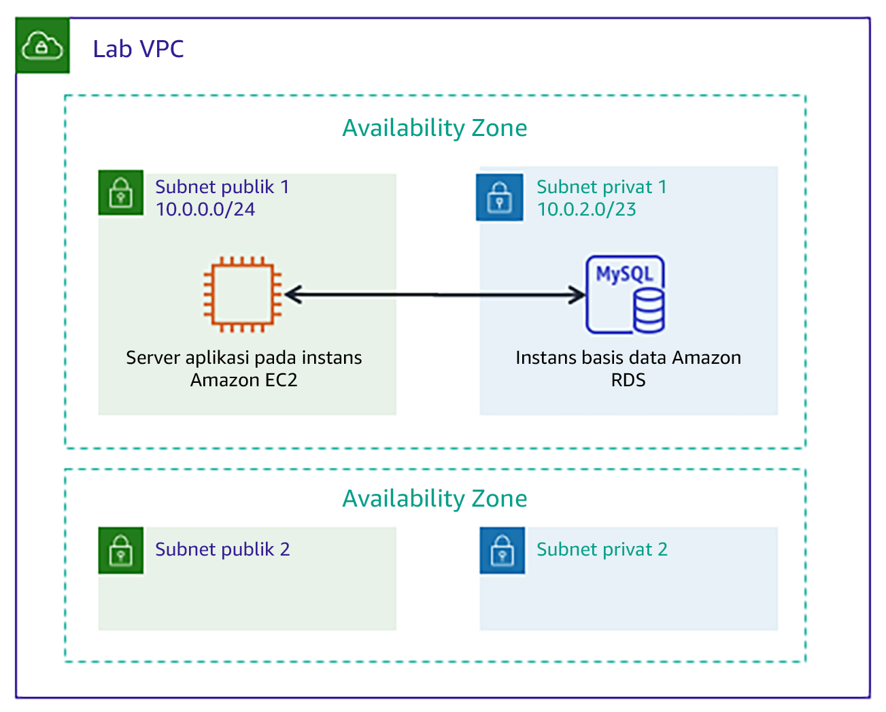

# Modul 5 - Lab Terpandu: Membuat Basis Data Amazon RDS

[//]: # "SKU: ILT-TF-200-ACACAD-2    Source Course: ILT-TF-100-ARCHIT-6 branch dev_65"

## Gambaran umum dan tujuan lab

Membuat basis data secara tradisional dapat menjadi proses rumit yang memerlukan administrator basis data atau administrator sistem. Di cloud, Anda dapat menyederhanakan proses ini dengan menggunakan Amazon Relational Database Service (Amazon RDS).

Setelah menyelesaikan lab ini, Anda akan mampu:

- Meluncurkan basis data menggunakan **Amazon RDS**
- Mengonfigurasi aplikasi web untuk terhubung ke **instans basis data**

Pada **akhir** lab ini, arsitektur Anda akan terlihat seperti contoh berikut:

 
## Durasi

Diperlukan waktu sekitar **20 menit** untuk menyelesaikan lab ini.

 

## Pembatasan layanan AWS

Dalam lingkungan lab ini, akses ke layanan AWS dan tindakan layanan mungkin dibatasi untuk orang-orang yang diperlukan untuk menyelesaikan instruksi lab. Anda mungkin akan mengalami error jika mencoba mengakses layanan lain atau melakukan tindakan di luar yang dijelaskan di lab ini.

 

## Mengakses Konsol Manajemen AWS

1. Di bagian atas instruksi ini, pilih Start Lab (Mulai Lab) untuk meluncurkan lab Anda.

   Panel **Start Lab** (Mulai Lab) terbuka dan menampilkan status lab.

   <i class="fas fa-info-circle"></i> **Tip**: Jika Anda memerlukan lebih banyak waktu untuk menyelesaikan lab, mulai ulang pengatur waktu untuk lingkungan dengan memilih tombol Start Lab (Mulai Lab) lagi.

2. Tunggu hingga panel **Start Lab** (Mulai Lab) menampilkan pesan **Lab status: ready** (Status lab: siap), lalu tutup panel dengan memilih **X**.

3. Di bagian atas instruksi ini, pilih AWS.

   Tindakan ini akan membuka Konsol Manajemen AWS di tab browser baru. Anda akan masuk ke sistem secara otomatis.

   <i class="fas fa-exclamation-triangle"></i> **Tip**: Jika tab browser baru tidak terbuka, banner atau ikon biasanya berada di bagian atas browser Anda dengan pesan bahwa browser Anda mencegah situs membuka jendela sembulan. Pilih banner atau ikon, lalu pilih **Allow pop-ups** (Izinkan sembulan).

4. Atur tab **AWS Management Console**(Konsol Manajemen AWS) agar ditampilkan bersama instruksi ini. Idealnya, Anda perlu membuka kedua tab browser secara bersamaan, sehingga Anda dapat mengikuti langkah-langkah lab dengan lebih mudah.

   <i class="fas fa-exclamation-triangle"></i> **Jangan mengubah Wilayah kecuali secara khusus diperintahkan untuk melakukannya**.

 

## Tugas 1: Membuat basis data Amazon RDS

Dalam tugas ini, Anda akan membuat basis data MySQL di virtual private cloud (VPC) Anda. MySQL adalah sistem manajemen basis data relasional sumber terbuka (RDBMS) yang populer, sehingga tidak ada biaya lisensi perangkat lunak.

<i class="fas fa-exclamation-triangle"></i> **Pengguna Windows:** Gunakan Chrome atau Firefox sebagai browser web Anda untuk lab ini. Instruksi lab **tidak kompatibel dengan _Internet Explorer_** karena perbedaan dalam konsol Amazon RDS.

5. Pada menu Services<i class="fas fa-angle-down"></i> (Layanan), pilih **RDS**.

6. Pilih Create database (Buat basis data)

   <i class="fas fa-exclamation-triangle"></i> Jika bagian atas layar menampilkan **Switch to the new database creation flow** (Beralih ke alur pembuatan basis data baru), pilih itu.

7. Pada **Engine options** (Opsi mesin), pilih <i class="far fa-dot-circle"></i>**MySQL**.

   Opsi yang tersedia meliputi beberapa kasus penggunaan, mulai dari basis data kelas enterprise sampai sistem Dev/Test. Pada opsi yang tersedia, Anda mungkin melihat **Amazon Aurora**. Aurora adalah sistem yang kompatibel dengan MySQL yang dirancang ulang untuk cloud. Jika perusahaan Anda menggunakan basis data MySQL atau PostgreSQL skala besar, Amazon Aurora dapat memberikan peningkatan performa.

8. Pada bagian**Templates** (Templat), pilih <i class="far fa-dot-circle"></i> **Dev/Test**.

   Sekarang Anda dapat memilih konfigurasi basis data, termasuk versi perangkat lunak, kelas instans, penyimpanan, dan pengaturan login. Opsi **deployment Multi-AZ** secara otomatis membuat replika basis data di Availability Zone kedua untuk Ketersediaan Tinggi.. Namun, di lab ini, Anda akan menggunakan instans basis data tunggal.

9. Pada bagian **Settings** (Pengaturan), konfigurasikan opsi-opsi berikut:

   * **DB instance identifier** (Pengidentifikasi instans DB): `inventory-db`

   * **Username** (Nama pengguna): `admin`

   * **Password** (Kata sandi): `lab-password`

   * **Confirm password** (Konfirmasi kata sandi): `lab-password`

10. Pada bagian **DB instance size** (ukuran instans DB), konfigurasikan opsi-opsi berikut:

   - Pilih <i class="far fa-dot-circle"></i>**Burstable classes** (Kelas burstable (termasuk kelas t)).

   - Pilih **db.t3.micro**

11. Pada bagian **Connectivity** (Konektivitas), konfigurasikan opsi ini:**Virtual Private Cloud (VPC):** _Lab VPC_

12. Perluas <i class="fas fa-caret-right"></i>**Additional connectivity configuration** (Konfigurasi konektivitas tambahan), lalu konfigurasikan pengaturan berikut:

   - Untuk **Existing VPC security groups** (Grup keamanan VPC yang ada), pilih _DB-SG_. Pilihan ini akan disorot.

13. Perluas <i class="fas fa-caret-right"></i>**Additional configuration** (Konfigurasi tambahan), lalu konfigurasikan pengaturan ini:

   - **Initial database name** (Nama basis data awal): `inventory` (inventaris)
   - Hapus (matikan) opsi **Enable Enhanced monitoring** (Aktifkan Pemantauan ditingkatkan)

   Ini adalah nama logis dari basis data yang akan digunakan oleh aplikasi.

   <i class="fas fa-comment"></i> Jangan ragu untuk meninjau beberapa opsi lain yang ditampilkan pada halaman, tetapi biarkan nilai default yang ditetapkan. Opsi-opsi ini termasuk cadangan otomatis, kemampuan untuk mengekspor berkas log, dan peningkatan versi otomatis. Kemampuan untuk mengaktifkan fitur-fitur ini melalui kotak centang menunjukkan kekuatan menggunakan _solusi basis data terkelola penuh_ alih-alih menginstal, membuat cadangan, dan memelihara basis data Anda sendiri.

14. Pilih Create database (Buat basis data) (di bagian bawah halaman).

   Anda akan menerima pesan berikut: Your DB is being created (Instans DB Anda sedang dibuat).

   <i class="fas fa-exclamation-triangle"></i> Jika Anda menerima pesan error yang menyebutkan _rds-monitoring-role_, pastikan bahwa Anda telah menghapus (mematikan) opsi **Advanced Monitoring** (Monitoring yang Ditingkatkan) pada langkah sebelumnya, kemudian coba lagi.

   Sebelum Anda melanjutkan ke tugas berikutnya, status instans basis data harus *Available* (Tersedia). Proses ini mungkin memerlukan waktu beberapa menit.

 
## Tugas 2: Mengonfigurasi komunikasi aplikasi web dengan instans basis data

Lab ini secara otomatis men-deploy instans Amazon Elastic Compute Cloud (Amazon EC2) dengan aplikasi web yang berjalan. Anda harus menggunakan alamat IP instans untuk terhubung ke aplikasi.

15. Pada menu Services<i class="fas fa-angle-down"></i> (Layanan), pilih **EC2**.

16. Di panel navigasi kiri, pilih **Instances** (Instans).

   Di panel tengah, akan ada instans berjalan bernama **App Server**.

17. Pilih instans **App Server**.

18. Di tab **Description** (Deskripsi), salin **IP Publik IPv4 ** ke clipboard Anda.

   **Tip:** Jika Anda mengarahkan kursor ke alamat IP, ikon <i class="far fa-copy"></i> salin akan muncul. Untuk menyalin nilai yang ditampilkan, pilih ikon tersebut.

19. Buka tab web browser baru, tempelkan alamat IP ke bilah alamat, dan tekan ENTER.

   Aplikasi web akan muncul. Informasi yang ditampilkan tidak banyak karena aplikasi belum terhubung ke basis data.

20. Pilih <i class="fas fa-cog" aria-hidden="true"></i>**Settings** (Pengaturan).

   Kini Anda dapat mengonfigurasi aplikasi untuk menggunakan instans DB RDS yang telah Anda buat sebelumnya. Pertama, Anda akan mengambil **Database Endpoint** (Endpoint Basis Data) agar aplikasi tahu cara terhubung ke basis data.

21. Kembali ke **Konsol Manajemen AWS **, tapi jangan tutup tab aplikasi. (Anda akan kembali ke sana sebentar lagi.

22. Pada menu Services<i class="fas fa-angle-down"></i> (Layanan), pilih **RDS**.

23. Di panel navigasi kiri, pilih **Databases** (Basis Data).

24. Pilih inventory-db.

25. Gulir ke bagian **Connectivity & Security** (Konektivitas & Keamanan) dan salin **Endpoint** ke clipboard Anda.

   Seharusnya akan terlihat serupa dengan contoh berikut: _inventory-db.crwxbgqad61a.rds.amazonaws.com_

26. Kembali ke tab browser dengan aplikasi Inventory dan masukkan nilai berikut ini:

   * **Endpoint:** Tempelkan endpoint yang Anda salin sebelumnya.
   * **Database** (Basis Data): `inventory` (inventaris)
   * **Username** (Nama pengguna): `admin`
   * **Password** (Kata sandi): `lab-password`
   * Pilih **Save** (Simpan)

   Aplikasi kini akan terhubung ke basis data, memuat beberapa data awal, dan menampilkan informasi.

27. <i class="fas fa-plus"></i> Tambahkan inventaris, <i class='fas fa-edit' style="color:#257ACF;"></i> edit, dan <i class='fas fa-trash-alt' style='color:#d82323;'></i>hapus inventaris informasi dengan menggunakan aplikasi web.

   Informasi inventaris disimpan dalam basis data MySQL Amazon RDS yang Anda buat sebelumnya di lab. Hal ini berarti bahwa setiap kegagalan yang terjadi dalam server aplikasi _tidak akan_ menghilangkan data apa pun. Ini juga berarti bahwa beberapa server aplikasi dapat mengakses data yang sama.

28. Masukkan catatan baru ke dalam tabel. Pastikan bahwa tabel memiliki 5 atau lebih catatan inventaris sebelum mengirimkan pekerjaan Anda.

   <i class="fas fa-thumbs-up" style="color:green;"></i> Anda sekarang telah berhasil meluncurkan aplikasi dan menghubungkannya ke basis data!

   **Opsional:** Anda dapat mengakses parameter tersimpan dalam konsol **Systems Manager** (Manajer Sistem), pada **Parameter Store** (Penyimpanan Parameter).

 

## Mengirimkan pekerjaan Anda

29. Di bagian atas instruksi ini, pilih Submit (Kirim) untuk merekam kemajuan Anda dan saat diminta, pilih **Yes** (Ya).

30. Jika hasilnya tidak muncul setelah beberapa menit, kembali ke bagian atas instruksi ini dan pilih Grades (Nilai)

**Tip**: Anda dapat mengirimkan pekerjaan Anda beberapa kali. Setelah Anda mengubah pekerjaan, pilih **Submit** (Kirim) lagi. Apa yang akan direkam untuk lab ini adalah pengiriman terakhir Anda.

31. Untuk menemukan detail umpan balik tentang pekerjaan Anda, pilih Details (Detail) diikuti oleh <i class="fas fa-caret-right"></i> **View Submission Report** (Lihat Laporan Pengiriman).

 

## Lab selesai <i class="fas fa-graduation-cap"></i>

<i class="fas fa-flag-checkered"></i> Selamat! Anda telah menyelesaikan lab.

32. Pilih End Lab (Akhiri Lab) di bagian atas halaman ini, lalu pilih Yes (Ya) untuk mengonfirmasi bahwa Anda ingin mengakhiri lab.

   Sebuah panel dengan pesan ini akan muncul: *DELETE has been initiated*...** (PENGHAPUSAN telah dimulai)... *You may close this message box now.* (Anda dapat menutup kotak pesan ini sekarang.)

33. Pilih **X** di sudut kanan atas untuk menutup panel.

*©2020 Amazon Web Services, Inc. dan afiliasinya. Hak cipta dilindungi undang-undang. Karya ini tidak boleh direproduksi atau didistribusikan ulang, seluruhnya atau sebagian, tanpa izin tertulis sebelumnya dari Amazon Web Services, Inc. Dilarang menyalin, meminjamkan, atau menjual secara komersial.*

